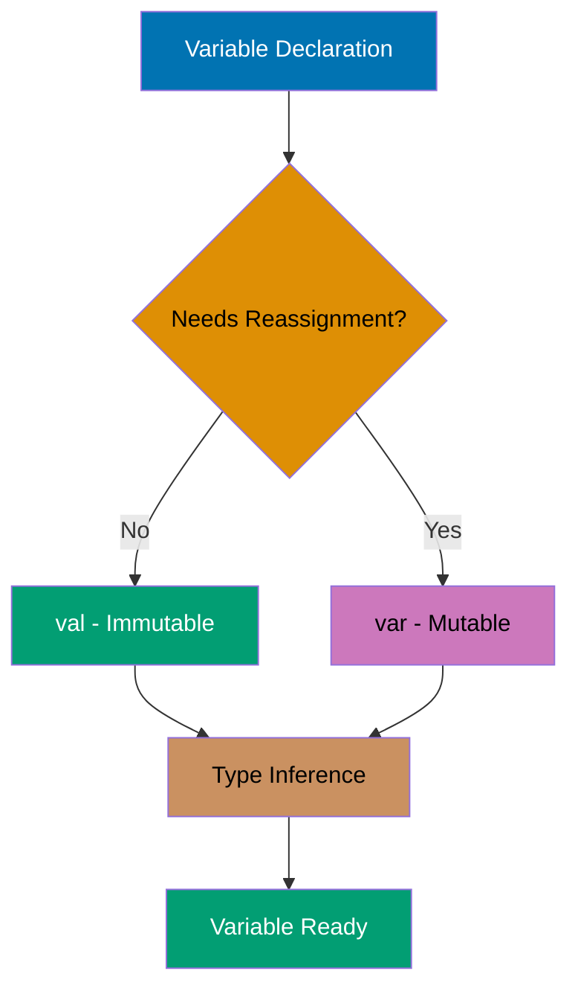
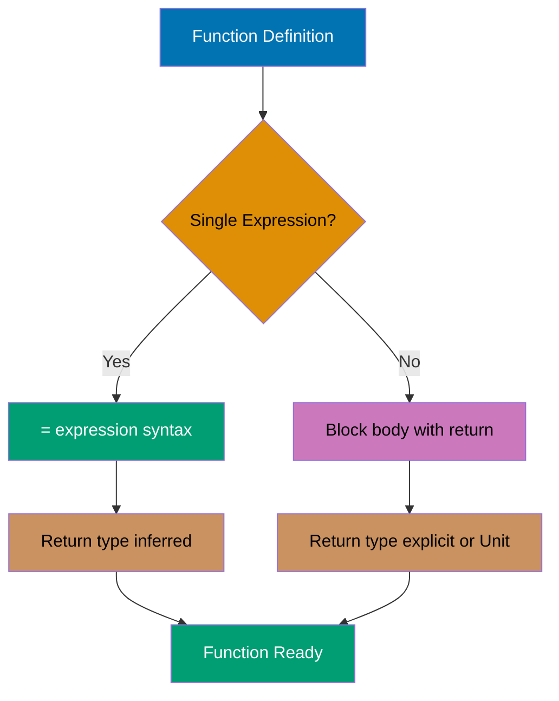
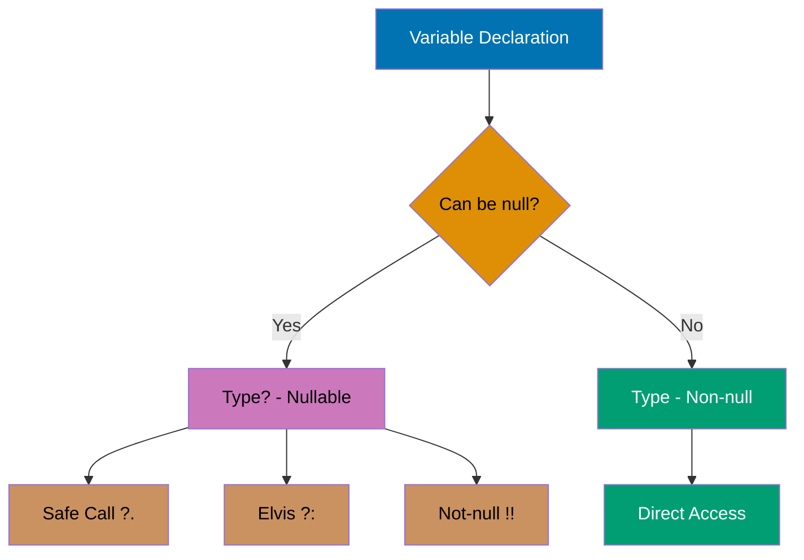
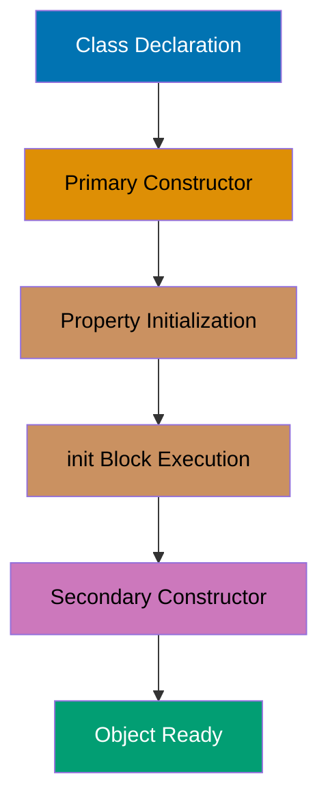
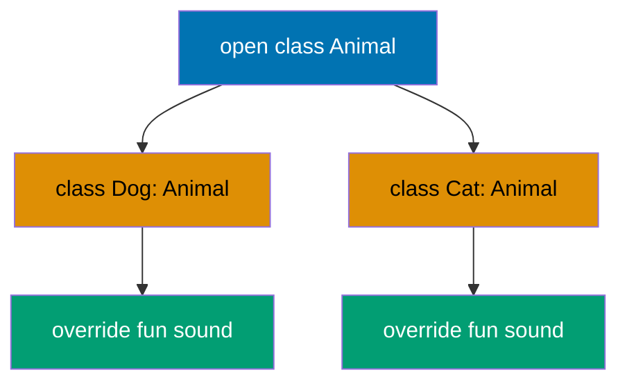
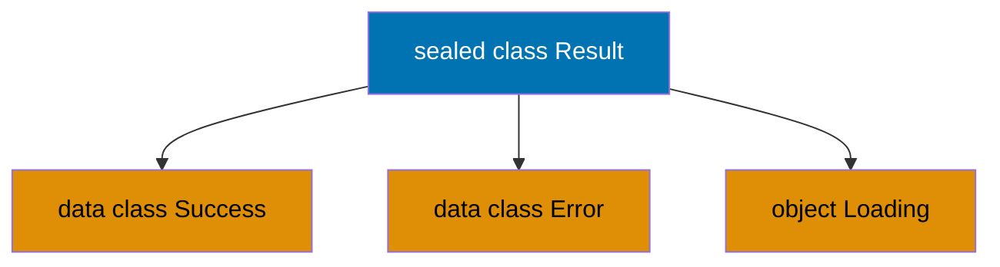
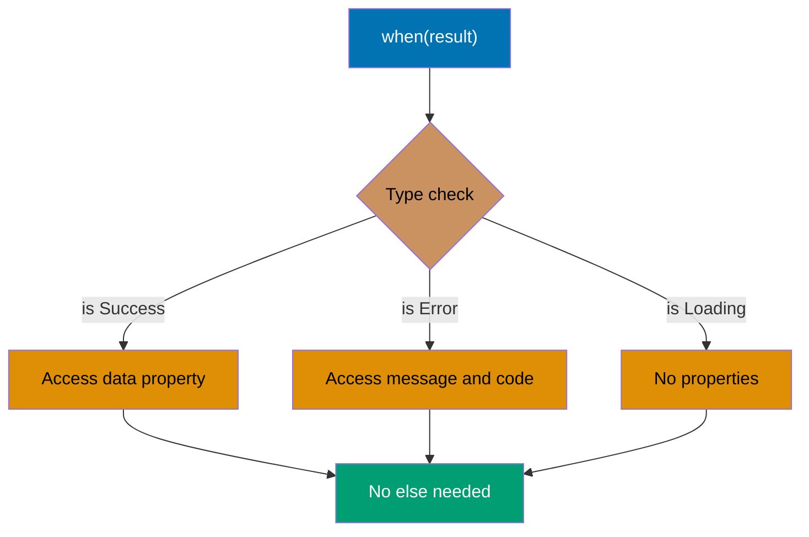
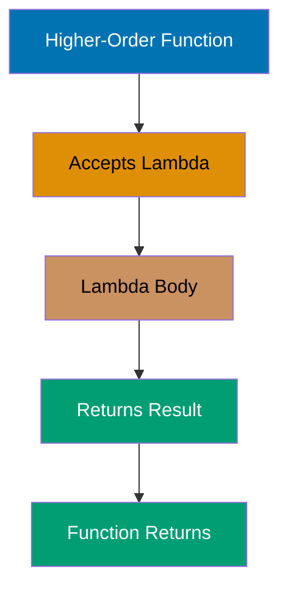
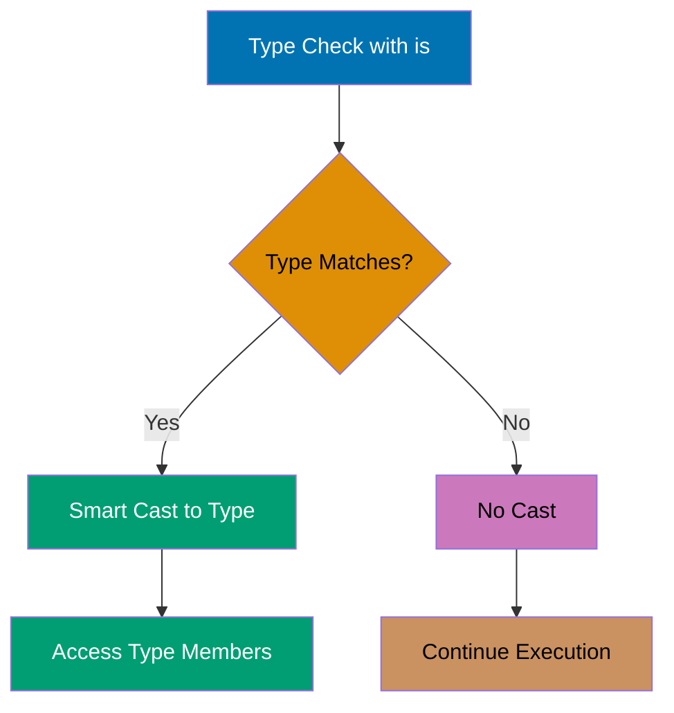

### Example 1: Hello World

Every Kotlin program starts with a main function. Unlike Java, Kotlin doesn't require a class wrapper for the main function, and semicolons are optional. The `println` function outputs to standard output with an automatic newline.

**Top-level functions**: Kotlin allows functions outside classes (top-level). The compiler automatically generates a MainKt class containing static methods, ensuring full JVM compatibility. File `Main.kt` becomes `MainKt.class` bytecode equivalent to `public static void main()`.

**Syntax simplification**: No visibility modifier defaults to `public`. No return type declaration means implicit `Unit` type (equivalent to Java's `void`). No semicolons needed (optional in Kotlin, required in Java). The `kotlin.io` package with `println` is auto-imported.

**Contrast with Java**: Kotlin eliminates the boilerplate ceremony: `public class Main { public static void main(String[] args) { } }` becomes just `fun main() { }`.

```kotlin
fun main() {                        // => Entry point function
                                    // => No class wrapper needed (unlike Java)
    println("Hello, Kotlin!")       // => Output: Hello, Kotlin!
                                    // => println auto-imported from kotlin.io
}                                   // => Program completes, exit code 0
                                    // => Returns Unit (equivalent to void)
```

**Key Takeaway**: Kotlin's `main` function can exist at the top level without a class, and semicolons are optional, making code more concise than Java while compiling to equivalent JVM bytecode.

**Why It Matters**: Kotlin eliminates the boilerplate ceremony that plagues Java applications, where every program requires a public class with a public static void main wrapper. This design choice reduces cognitive overhead in microservices and CLI tools where the class wrapper serves no architectural purpose, allowing developers to focus on business logic from line one rather than navigating unnecessary structure. The automatic compilation to MainKt class ensures full JVM compatibility while maintaining source code simplicity.

---

### Example 2: Variable Declaration - val vs var

Kotlin distinguishes between immutable (`val`) and mutable (`var`) variables to encourage immutability. The compiler infers types automatically, but you can specify them explicitly when needed. Immutable variables prevent accidental reassignment and enable safer concurrent code.

**Type inference**: Compiler analyzes literal types from right-hand side (`"Alice"` → String, `25` → Int). Explicit annotations optional but useful for APIs (`val city: String = "Jakarta"`).

**Immutability**: `val` compiles to JVM `final`, enabling thread-safe reads without synchronization. Immutable variables allow compiler optimizations (inlining, caching).

**Null safety**: Types are non-nullable by default (`String`). Nullable types require `?` suffix (`String?`). Compiler enforces null checks, preventing `NullPointerException` at compile-time.

**String templates**: `$variable` or `${expression}` syntax for interpolation. Compiled to `StringBuilder.append()` calls for efficiency.



```kotlin
fun main() {                         // => Entry point, no return value (Unit type)
    val name = "Alice"               // => name is "Alice" (immutable, type inferred as String)
                                     // => Cannot reassign: name = "Bob" would cause compile error
    var age = 25                     // => age is 25 (mutable, type inferred as Int)
                                     // => Can reassign later because var allows mutation
    age = 26                         // => age is now 26 (reassignment succeeds)
                                     // => Type must match: var ensures Int type consistency
    // age = "twenty-six"            // => ERROR: type mismatch (Int ≠ String)
                                     // => Compiler prevents type-unsafe reassignment

    val city: String = "Jakarta"     // => city is "Jakarta" (explicit type annotation)
                                     // => String type explicit, though compiler could infer it
    var temperature: Double = 28.5   // => temperature is 28.5 (explicit Double type)
                                     // => Double type prevents Int assignment without .toDouble()
    temperature = 29.0               // => temperature is now 29.0 (mutable var allows change)
                                     // => 29.0 literal is Double, so type matches

    val nullableName: String? = null // => nullableName is null (nullable type with ? suffix)
                                     // => String? allows null, String would reject null at compile-time
                                     // => Compiler enforces null checks before use

    println("$name is $age years old") // => Output: Alice is 26 years old
                                       // => $name and $age interpolated into string
                                       // => Compiled to StringBuilder for efficiency
    println("$city: ${temperature}°C") // => Output: Jakarta: 29.0°C
                                       // => ${temperature} expression interpolation with curly braces
}                                    // => Returns Unit (like void), no return value
```

**Key Takeaway**: Use `val` by default for immutability and thread safety; only use `var` when you genuinely need to reassign values.

**Why It Matters**: Immutability by default prevents entire classes of concurrency bugs that plague Java applications, where mutable state shared across threads causes race conditions debuggable only under production load. Kotlin's compiler-enforced val vs var distinction makes thread safety explicit at declaration time rather than relying on developer discipline with final keywords that Java developers routinely forget, reducing production defects in concurrent systems.

---

### Example 3: Basic Types and Type Inference

Kotlin has a rich type system with proper primitives that are represented as objects. Type inference eliminates redundant type declarations while maintaining type safety. All number types have explicit sizes (Byte, Short, Int, Long, Float, Double).

**Type sizes**: Byte (8-bit, range -128 to 127, 1 byte), Short (16-bit, range -32768 to 32767, 2 bytes), Int (32-bit default integer, 4 bytes), Long (64-bit, 8 bytes), Float (32-bit IEEE 754, 4 bytes, ~6-7 decimal digits), Double (64-bit IEEE 754, 8 bytes, ~15-16 decimal digits, default floating-point), Char (16-bit Unicode, 2 bytes), Boolean (true/false, 1 byte).

**Numeric literal syntax**: Underscores improve readability (`3_000_000_000`). Suffix `L` for Long (required for values > Int.MAX_VALUE). Suffix `f` for Float (required, default is Double).

**Reflection**: `::class` operator obtains `KClass` instance. `.simpleName` property returns class name string.

```kotlin
fun main() {                         // => Entry point, demonstrates numeric type system
    val byteValue: Byte = 127        // => byteValue is 127 (Byte: 8-bit, range -128 to 127)
                                     // => Explicit type required: 127 literal defaults to Int
                                     // => Byte saves memory for large arrays (1 byte vs 4)
    val shortValue: Short = 32767    // => shortValue is 32767 (Short: 16-bit, 2 bytes)
                                     // => Explicit type required: numeric literals default to Int
                                     // => Max Short value (2^15 - 1), overflow wraps to -32768
    val longValue = 3_000_000_000L   // => longValue is 3000000000 (L suffix forces Long type)
                                     // => 3 billion exceeds Int.MAX_VALUE (2,147,483,647)
                                     // => Underscores improve readability, ignored by compiler
    val intValue = 42                // => intValue is 42 (Int: 32-bit, default integer type)
                                     // => No suffix needed, literals default to Int
    val doubleValue = 2.718281828    // => doubleValue is 2.718281828 (Double: 64-bit, default float)
                                     // => No suffix needed, decimal literals default to Double
                                     // => ~15-16 decimal digits precision (IEEE 754)
    val floatValue = 3.14f           // => floatValue is 3.14 (f suffix forces Float type)
                                     // => 32-bit, ~6-7 decimal digits precision
                                     // => Without 'f', 3.14 would be Double (type mismatch error)

    val message = "Integer: $intValue, Double: $doubleValue"
                                    // => message is "Integer: 42, Double: 2.718281828"
                                    // => $variable syntax for string interpolation
                                    // => Compiler auto-calls toString() on values

    println(intValue::class.simpleName)     // => Output: Int
                                            // => ::class reflection operator gets KClass instance
                                            // => .simpleName returns "Int" (no package prefix)
    println(doubleValue::class.simpleName)  // => Output: Double
                                            // => Runtime type reflection, not compile-time
}                                   // => Program completes, returns Unit
```

**Key Takeaway**: Kotlin's type inference reduces boilerplate while maintaining type safety, and underscores in numeric literals improve readability for large numbers.

**Why It Matters**: Type inference eliminates verbose type annotations that clutter Java codebases while maintaining the same compile-time safety guarantees, reducing code ceremony by 20-30% in typical enterprise applications. The underscore separator for numeric literals (3_000_000) prevents critical bugs in financial and scientific systems where misread zeros have caused production incidents costing millions, making code audits significantly safer.

---

### Example 4: String Templates

Kotlin's string templates embed expressions directly in strings using `$` for simple variables and `${}` for complex expressions. This eliminates cumbersome string concatenation and improves readability for formatted output.

**Template syntax**: `$variable` for simple variables (no braces needed). `${expression}` for complex expressions (braces required for arithmetic, function calls, etc.). Compiler generates StringBuilder calls, automatically calling toString() on values.

**Escaped dollar**: `\$` produces literal `$` character (common in currency, regex, shell commands).

**Triple-quoted strings**: `"""..."""` preserves formatting (newlines, whitespace). No escape sequences needed (`\n`, `\t`, `\"` unnecessary). Use `.trimMargin()` with `|` prefix to remove indentation. Supports interpolation. Common for embedded SQL, JSON, HTML, config files.

```kotlin
fun main() {
    val name = "Kotlin"              // => name is "Kotlin" (String type inferred)
                                     // => Stored as immutable val reference
    val version = 1.9                // => version is 1.9 (Double type inferred)
                                     // => Decimal literal defaults to Double, not Float

    val simple = "Language: $name"   // => simple is "Language: Kotlin"
                                     // => $name interpolated without braces (simple variable)
                                     // => Compiler generates StringBuilder.append() calls
    val expr = "Version: ${version * 10}"
                                     // => expr is "Version: 19.0"
                                     // => ${} braces required for expression (multiplication)
                                     // => Expression evaluated, then toString() called
    val upper = "Upper: ${name.uppercase()}"
                                     // => upper is "Upper: KOTLIN"
                                     // => ${} required for method calls
                                     // => uppercase() returns new String (original unchanged)
    val price = "Price: \$${100 + 50}"
                                     // => price is "Price: $150"
                                     // => \$ escapes dollar sign (literal $ character)
                                     // => ${100 + 50} evaluates arithmetic, then interpolates

    val multiline = """
        |Language: $name
        |Version: $version
        |Status: Active
    """.trimMargin()                 // => Removes | prefix and leading indentation per line
                                     // => Triple-quoted string preserves newlines (no \n needed)
                                     // => Interpolation works inside triple-quoted strings
                                     // => Result: "Language: Kotlin\nVersion: 1.9\nStatus: Active"

    println(simple)                  // => Output: Language: Kotlin
                                     // => Prints string value with newline
    println(expr)                    // => Output: Version: 19.0
                                     // => Double value formatted as decimal
    println(upper)                   // => Output: Upper: KOTLIN
                                     // => Uppercase transformation visible
    println(price)                   // => Output: Price: $150
                                     // => Literal $ and calculated value shown
    println(multiline)               // => Output:
                                     // Language: Kotlin
                                     // Version: 1.9
                                     // Status: Active
                                     // => Multi-line formatted output with proper newlines
                                     // => Returns Unit (void), no return value
}
```

**Key Takeaway**: Use `$variable` for simple interpolation and `${expression}` for complex expressions; triple-quoted strings preserve formatting and support multi-line text.

**Why It Matters**: String concatenation with `+` operators is the source of countless bugs and security vulnerabilities in Java systems, from SQL injection to logging errors that corrupt production monitoring. Kotlin's template syntax eliminates this entire error class while improving readability, and triple-quoted strings enable embedded SQL, JSON, and configuration without escape sequence nightmares that break deployment pipelines.

---

### Example 5: Functions

Kotlin functions are first-class citizens defined with the `fun` keyword. Single-expression functions can use the `=` syntax without braces, and the compiler infers return types. Default and named parameters eliminate function overloading.



```kotlin
fun add(a: Int, b: Int): Int {       // => Function signature with explicit return type Int
    return a + b                     // => Returns sum of a and b
}                                    // => Block body with explicit return type

fun multiply(a: Int, b: Int) = a * b // => Single-expression function (type inferred to Int)
                                     // => Compiler infers Int from a * b operation

fun greet(name: String, greeting: String = "Hello") = "$greeting, $name!"
                                     // => Default parameter: greeting = "Hello" if not provided
                                     // => Returns formatted string with interpolation

fun printSum(a: Int, b: Int) {       // => Unit return type (like void)
    println("$a + $b = ${a + b}")    // => String template with expression
}                                    // => No explicit return needed for Unit functions

fun main() {                         // => Entry point demonstrating function features
    val sum = add(10, 20)            // => Calls add with a=10, b=20
                                     // => sum is 30
    val product = multiply(5, 6)     // => Calls multiply with a=5, b=6
                                     // => product is 30

    val greet1 = greet("Alice")      // => greeting uses default "Hello"
                                     // => greet1 is "Hello, Alice!"
    val greet2 = greet("Bob", "Hi")  // => greeting = "Hi" (overrides default)
                                     // => greet2 is "Hi, Bob!"
    val greet3 = greet(name = "Charlie", greeting = "Hey")
                                     // => Named arguments (order doesn't matter)
                                     // => greet3 is "Hey, Charlie!"

    printSum(15, 25)                 // => Output: 15 + 25 = 40
                                     // => Calls printSum, no return value (Unit)

    println(sum)                     // => Output: 30
    println(product)                 // => Output: 30
    println(greet1)                  // => Output: Hello, Alice!
    println(greet2)                  // => Output: Hi, Bob!
    println(greet3)                  // => Output: Hey, Charlie!
}                                    // => Returns Unit, program completes
```

**Key Takeaway**: Use single-expression syntax (`=`) for concise functions, leverage default parameters to reduce overloading, and use named arguments for clarity with multiple parameters.

**Why It Matters**: Java's function overloading proliferation creates maintenance nightmares in enterprise codebases, where teams maintain 5-10 overloaded variants of the same method just to handle optional parameters. Kotlin's default parameters eliminate this code duplication entirely, reducing API surface area by 60-70% in typical libraries while named arguments prevent parameter ordering bugs that cause production incidents when refactoring changes method signatures.

---

### Example 6: When Expression

Kotlin's `when` replaces Java's switch statement with a more powerful expression that returns values. It supports ranges, type checks, arbitrary expressions, and doesn't require explicit `break` statements.

**When as expression**: The `when` construct returns values directly (expression, not statement) by evaluating branches sequentially until one matches. When a match is found, remaining branches are skipped (no fallthrough). The `else` branch is required when `when` is used as an expression to ensure all cases are covered.

**When with ranges**: Use the `in` operator to test membership in ranges (e.g., `in 80..89` for inclusive range checks). This pattern replaces nested if-else chains for range-based categorization.

**Smart casting**: When using `is` for type checks, Kotlin automatically smart-casts the variable to the matched type within that branch, allowing direct access to type-specific members without explicit casting.

**When without argument**: Omit the subject expression to create boolean condition chains (replaces if-else-if ladders). Each branch evaluates a boolean expression independently.

```kotlin
fun main() {
    val x = 3                        // => x is 3 (Int type inferred)
                                     // => Subject value for when expression
    val result = when (x) {          // => when expression evaluates x
                                     // => Returns String value (expression, not statement)
        1 -> "One"                   // => x == 1: false (condition not met)
                                     // => Branch skipped
        2 -> "Two"                   // => x == 2: false (still not matched)
                                     // => Branch skipped
        3 -> "Three"                 // => x == 3: true (exact match found)
                                     // => Returns "Three", stops checking remaining branches
        else -> "Other"              // => Not evaluated (already matched)
                                     // => else required for expression to ensure exhaustiveness
    }                                // => result is "Three" (assigned from matched branch)
                                     // => No break needed (no fallthrough in Kotlin)

    val score = 85                   // => score is 85 (test grade value)
                                     // => Will be checked against multiple ranges
    val grade = when (score) {       // => when with range checks (replaces if-else chains)
        in 90..100 -> "A"            // => 85 in 90..100: false (85 < 90)
                                     // => Inclusive range [90, 100]
        in 80..89 -> "B"             // => 85 in 80..89: true (85 within bounds)
                                     // => Returns "B", stops evaluation
        in 70..79 -> "C"             // => Not evaluated (already matched)
        else -> "F"                  // => Catch-all for scores < 70
    }                                // => grade is "B" (assigned from range match)

    val obj: Any = "Kotlin"          // => obj is "Kotlin" (Any type holds any value)
                                     // => Runtime type is String (supertype Any allows flexibility)
    val description = when (obj) {   // => when with type checks (smart casting)
        is String -> "String of length ${obj.length}"
                                     // => obj is String: true (type check passes)
                                     // => Smart cast: obj treated as String in this branch
                                     // => obj.length is 6 (auto-cast, no explicit cast needed)
                                     // => Returns "String of length 6"
        is Int -> "Integer: $obj"    // => Not evaluated (already matched)
                                     // => Would smart-cast to Int if matched
        else -> "Unknown type"       // => Handles other types
    }                                // => description is "String of length 6"

    val temp = 28                    // => temp is 28 (temperature in Celsius)
                                     // => Subject for boolean condition when
    val weather = when {             // => when without argument (boolean condition chains)
                                     // => Replaces if-else-if ladder for complex logic
        temp < 0 -> "Freezing"       // => 28 < 0: false (condition fails)
        temp < 15 -> "Cold"          // => 28 < 15: false (still too warm)
        temp < 25 -> "Moderate"      // => 28 < 25: false (close but not quite)
        temp < 35 -> "Warm"          // => 28 < 35: true (first matching condition)
                                     // => Returns "Warm", stops evaluation
        else -> "Hot"                // => Not evaluated (already matched)
                                     // => Handles temp >= 35
    }                                // => weather is "Warm"

    println(result)                  // => Output: Three
                                     // => Prints matched when branch value
    println(grade)                   // => Output: B
                                     // => Shows range-based classification result
    println(description)             // => Output: String of length 6
                                     // => Smart-cast type check result
    println(weather)                 // => Output: Warm
                                     // => Boolean condition chain result
                                     // => Returns Unit (void), no return value
}
```

**Key Takeaway**: Use `when` as an expression to return values directly, leverage ranges and type checks for concise branching, and omit the argument for complex boolean conditions.

**Why It Matters**: Java's switch statement falls through by default (requiring break keywords) and supports only primitive types until Java 14, causing production bugs when developers forget breaks or can't switch on strings in legacy systems. Kotlin's when expression returns values directly (enabling functional style), supports any type including ranges and patterns, and smart-casts variables automatically, eliminating entire categories of type-casting bugs that crash production applications.

---

### Example 7: Ranges and Progression

Kotlin ranges represent sequences of values with start and end points. They support iteration, membership checks, and progression (step values). Ranges are memory-efficient as they don't materialize all values.

**Range operators**: Use `..` for inclusive ranges (both endpoints included), `until` for exclusive ranges (excludes end), and `downTo` for descending sequences. All create `IntRange` or `IntProgression` types that are memory-efficient value types (no materialized arrays).

**Progression with step**: Chain `step` to any range to create custom increments (e.g., `1..10 step 2` for odd numbers). Step values determine the interval between elements.

**Character ranges**: Ranges work with any comparable type, including `Char` (e.g., `'a'..'z'` for all lowercase letters). Use `in` operator for membership testing.

**Range functions**: Ranges support collection operations like `count()`, `sum()`, and `average()` without materializing intermediate arrays.

```kotlin
fun main() {
    val range1 = 1..10               // => range1 is IntRange [1, 10] (both endpoints included)
                                     // => Memory-efficient: stores only start, end, step
                                     // => No array materialization (lazy evaluation)
    println(5 in range1)             // => Output: true
                                     // => 'in' operator checks membership: 1 <= 5 <= 10
                                     // => O(1) constant-time check (no iteration needed)
    println(15 in range1)            // => Output: false
                                     // => 15 > 10 (outside upper bound)

    val range2 = 1 until 10          // => range2 is IntRange [1, 10) (excludes 10)
                                     // => Equivalent to 1..9 (upper bound exclusive)
                                     // => Common for array/list indices (0 until list.size)
    println(10 in range2)            // => Output: false
                                     // => 10 excluded from range (upper bound open)

    val range3 = 10 downTo 1         // => range3 is IntProgression [10, 1] step -1
                                     // => Descending sequence: 10, 9, 8, ..., 1
                                     // => Negative step (-1) for countdown
    for (i in range3) {              // => Iterates i from 10 down to 1
        print("$i ")                 // => Prints: 10 9 8 7 6 5 4 3 2 1
                                     // => Each iteration binds i to next value
    }                                // => Loop scope ends, i no longer accessible
    println()                        // => Output newline after sequence
                                     // => Separates output visually

    val range4 = 1..10 step 2        // => range4 is IntProgression [1, 10] step 2
                                     // => Odd numbers: 1, 3, 5, 7, 9 (increment by 2)
                                     // => Skips even values (2, 4, 6, 8, 10)
    for (i in range4) {              // => Iterates i: 1, 3, 5, 7, 9
        print("$i ")                 // => Prints: 1 3 5 7 9
                                     // => Step determines spacing between values
    }                                // => 5 iterations total (not 10)
    println()                        // => Output newline for formatting

    val charRange = 'a'..'z'         // => charRange is CharRange ['a', 'z']
                                     // => All lowercase letters (26 characters)
                                     // => Comparable types support ranges (not just Int)
    println('k' in charRange)        // => Output: true
                                     // => 'k' is between 'a' and 'z' (ASCII/Unicode ordering)
                                     // => Character comparison: 'a'(97) <= 'k'(107) <= 'z'(122)

    println((1..10).count())         // => Output: 10
                                     // => Range functions work without materialization
                                     // => count() returns number of elements
    println((1..10).sum())           // => Output: 55
                                     // => sum() computes 1+2+3+...+10 = 55
                                     // => Iterates range internally, no array allocation
    println((1..10).average())       // => Output: 5.5
                                     // => average() computes mean: 55 / 10 = 5.5
                                     // => Returns Double even for IntRange
                                     // => Returns Unit (void), no return value
}
```

**Key Takeaway**: Use `..` for inclusive ranges, `until` for exclusive ranges, `downTo` for descending sequences, and `step` to skip values in progression.

**Why It Matters**: Java's traditional for loops with index variables are error-prone (off-by-one errors plague production systems) and verbose compared to Kotlin's range syntax that makes iteration bounds explicit and impossible to misinterpret. Ranges don't allocate arrays in memory, making them zero-cost abstractions that perform identically to manual loops while preventing the fencepost errors that cause array index crashes in production systems processing financial transactions or medical records.

---

### Example 8: For Loops

Kotlin's for loops iterate over anything that provides an iterator, including ranges, collections, and arrays. The loop variable is automatically declared and scoped to the loop body.

**For-in syntax**: Use `for (item in collection)` to iterate over any iterable. The loop variable is automatically declared with inferred type and scoped to the loop body only.

**Indexed iteration**: Use `withIndex()` to get index-value pairs, then destructure them with `for ((index, value) in collection.withIndex())`. This provides zero-overhead indexed iteration without manual counter variables.

**Map iteration**: Destructure map entries directly with `for ((key, value) in map)`. The `to` infix function creates `Pair` instances for map construction.

**Range iteration**: Combine for loops with ranges (`1..5`), steps (`0..10 step 2`), and descending sequences (`5 downTo 1`) for custom iteration patterns.

```kotlin
fun main() {                         // => Entry point for loop demonstrations
    print("Range: ")                 // => Prints "Range: " without newline
                                     // => print() doesn't add newline (unlike println())
    for (i in 1..5) {                // => Iterates i over 1, 2, 3, 4, 5
                                     // => Closed range: includes both 1 and 5
                                     // => i auto-declared as Int (type inferred from range)
                                     // => i scoped to loop body only
        print("$i ")                 // => Prints: 1 2 3 4 5 (space-separated)
                                     // => String interpolation with $i
    }                                // => Loop ends, i no longer accessible
    println()                        // => Output newline (moves to next line)
                                     // => Separates output sections

    val fruits = listOf("Apple", "Banana", "Cherry")
                                     // => fruits is List<String> with 3 elements
                                     // => listOf creates immutable List (read-only)
                                     // => Type inference: List<String> from string literals
    print("Fruits: ")                // => Prints label for next output
    for (fruit in fruits) {          // => Iterates fruit over each list element
                                     // => fruit type inferred as String
                                     // => Collection iteration uses iterator protocol
        print("$fruit ")             // => Prints: Apple Banana Cherry (space-separated)
                                     // => Each iteration binds fruit to next element
    }                                // => fruit scoped to loop only
    println()                        // => Newline after fruits list
                                     // => Completes fruits iteration section

    print("Indexed: ")               // => Label for indexed iteration
    for ((index, fruit) in fruits.withIndex()) {
                                     // => withIndex() returns Iterable<IndexedValue<String>>
                                     // => Destructuring: (index, fruit) unpacks IndexedValue
                                     // => index: Int (0, 1, 2...), fruit: String (elements)
        print("$index:$fruit ")      // => Prints: 0:Apple 1:Banana 2:Cherry
                                     // => Zero-based indexing (index starts at 0)
                                     // => No manual counter variable needed
    }                                // => Destructured variables scoped to loop
    println()                        // => Newline separator

    val scores = mapOf("Alice" to 95, "Bob" to 87, "Charlie" to 92)
                                     // => scores is Map<String, Int> (immutable)
                                     // => 'to' infix creates Pair("Alice", 95), etc.
                                     // => mapOf constructs LinkedHashMap (preserves insertion order)
    for ((name, score) in scores) {  // => Iterates over Map.Entry<String, Int>
                                     // => Destructuring: (name, score) unpacks entry
                                     // => name: String (key), score: Int (value)
        println("$name: $score")     // => Output: Alice: 95
                                     // => Output: Bob: 87
                                     // => Output: Charlie: 92
                                     // => Each entry printed on separate line
    }                                // => Map iteration preserves insertion order

    print("Step 2: ")                // => Label for step progression
    for (i in 0..10 step 2) {        // => Iterates 0, 2, 4, 6, 8, 10 (even numbers)
                                     // => step 2 creates IntProgression with increment 2
                                     // => Skips odd values (1, 3, 5, 7, 9)
        print("$i ")                 // => Prints: 0 2 4 6 8 10
    }                                // => 6 iterations (not 11)
    println()                        // => Newline after step sequence

    print("Reverse: ")               // => Label for descending iteration
    for (i in 5 downTo 1) {          // => Iterates 5, 4, 3, 2, 1 (countdown)
                                     // => downTo creates descending IntProgression (step -1)
                                     // => Inclusive range [5, 1]
        print("$i ")                 // => Prints: 5 4 3 2 1
                                     // => Each decrement by 1
    }                                // => 5 iterations total
    println()                        // => Final newline
}                                    // => Returns Unit (void), program completes
                                     // => All loop demonstrations completed
```

**Key Takeaway**: Use destructuring with `withIndex()` for indexed iteration, destructure map entries directly in the loop, and combine ranges with `step` and `downTo` for custom iteration patterns.

**Why It Matters**: Java's traditional iteration patterns require manual index management or verbose iterator code that obscures business logic, while Kotlin's for-in loops with destructuring eliminate index tracking bugs entirely. The withIndex() function provides zero-overhead indexed iteration without manual counter variables that developers increment incorrectly, preventing synchronization bugs in data processing pipelines that correlate indices across multiple collections.

---

### Example 9: While and Do-While Loops

Kotlin supports traditional while and do-while loops for conditional iteration. The do-while variant guarantees at least one execution before checking the condition.

**While loop**: Checks condition before each iteration. If condition is initially false, body never executes. Use for unknown iteration counts (e.g., network retries, streaming protocols).

**Do-while loop**: Executes body first, then checks condition. Guarantees at least one execution even if condition is initially false. Useful for input validation or menu systems.

**Break and continue**: Use `break` to exit loops immediately (essential for infinite loops with `while (true)`), and `continue` to skip to next iteration. Both keywords make control flow explicit unlike Java's labeled breaks.

**Mutable loop variables**: While and do-while require `var` for loop counters since they mutate. Modern Kotlin favors functional iteration (for-in, ranges) over while loops when iteration count is known.

```kotlin
fun main() {
    var count = 0                    // => count is 0 (var allows mutation)
                                     // => Must be var for loop counter (val would be immutable)
    while (count < 3) {              // => Condition checked before each iteration
                                     // => Loop continues while condition is true
                                     // => Loops while 0 < 3, 1 < 3, 2 < 3 (3 iterations)
        println("Count: $count")     // => Output: Count: 0
                                     // => Output: Count: 1
                                     // => Output: Count: 2
        count++                      // => count increments: 0→1, 1→2, 2→3
                                     // => ++ postfix operator (increment after use)
    }                                // => count is 3 after loop (3 < 3 is false)
                                     // => Loop exits when condition becomes false

    var x = 0                        // => x is 0 (loop counter)
                                     // => Used in do-while demonstration
    do {                             // => Body executes first (before condition check)
        println("x: $x")             // => Output: x: 0
                                     // => Prints even though condition will be false
        x++                          // => x becomes 1 (increment after print)
    } while (x < 0)                  // => Condition checked after execution
                                     // => 1 < 0 is false, but body already ran once
                                     // => Guarantees at least one execution

    var sum = 0                      // => sum is 0 (accumulator)
                                     // => Tracks running total in loop
    while (sum < 5) {                // => Loops while sum < 5
                                     // => Condition: 0<5, 1<5, 2<5, 3<5, 4<5 (5 iterations)
        sum += 1                     // => sum increments: 0→1, 1→2, 2→3, 3→4, 4→5
                                     // => += compound assignment (sum = sum + 1)
        if (sum == 3) {              // => Check if sum equals 3
            continue                 // => Skip to next iteration (no println)
                                     // => Jumps back to while condition check
        }                            // => continue bypasses remaining loop body
        println("Sum: $sum")         // => Output: Sum: 1
                                     // => Output: Sum: 2
                                     // => (skips 3 due to continue)
                                     // => Output: Sum: 4
                                     // => Output: Sum: 5
    }                                // => sum is 5 after loop (5 < 5 is false)

    var i = 0                        // => i is 0 (counter for break demo)
                                     // => Used to demonstrate early exit
    while (i < 5) {                  // => Loops while i < 5 (could be 5 iterations)
        i++                          // => i increments: 0→1, 1→2, 2→3
                                     // => Prefix increment happens first
        if (i == 3) {                // => Check if i equals 3
            break                    // => Exit loop immediately (early termination)
                                     // => Loop terminates before reaching i=5
        }                            // => break bypasses condition, exits while
        print("$i ")                 // => Output: 1 2
                                     // => Prints 1 and 2 (skips 3 due to break)
                                     // => 3, 4, 5 never printed
    }                                // => i is 3 after loop (break at i==3)
    println()                        // => Newline after break output
                                     // => Returns Unit (void), no return value
}
```

**Key Takeaway**: Use `while` for conditional loops, `do-while` when you need at least one execution, and combine with `break`/`continue` for flow control within loops.

**Why It Matters**: While and do-while loops are less common in modern Kotlin favoring functional iteration, but they remain essential for algorithms with unknown iteration counts like network retries or streaming protocols. The explicit break and continue keywords make control flow visible unlike Java's labeled breaks that obscure logic, reducing bugs in production systems implementing backoff strategies or state machines where exit conditions determine system reliability.

---

### Example 10: Null Safety - Nullable Types

Kotlin's type system distinguishes between nullable and non-nullable references, eliminating most null pointer exceptions. Use `?` to mark types as nullable and leverage safe call operators to handle null values gracefully.

**Nullable vs non-nullable types**: Append `?` to any type to make it nullable (e.g., `String?`). Non-nullable types (e.g., `String`) cannot hold `null` values, enforced at compile time. This distinction prevents most NPEs before code runs.

**Safe call operator (`?.`)**: Returns `null` if the receiver is `null`, otherwise calls the method/property. Chains safely without throwing exceptions (e.g., `obj?.method()?.property`).

**Elvis operator (`?:`)**: Provides default values for null cases. The right side is returned if the left side evaluates to `null` (e.g., `value ?: default`). Converts nullable types to non-nullable types.

**Not-null assertion (`!!`)**: Forces nullable type to non-nullable, throwing NPE if value is `null`. Use sparingly only when you're absolutely certain a value is non-null (defeats null safety guarantees).

**Safe cast (`as?`)**: Attempts type cast, returning `null` if the cast fails instead of throwing `ClassCastException`. Safer alternative to regular `as` operator.



```kotlin
fun main() {                         // => Entry point demonstrating null safety
                                     // => Kotlin's type system prevents NPEs at compile time
    val name: String = "Kotlin"      // => name is "Kotlin" (non-nullable String)
                                     // => Cannot be null (compile-time enforced)
                                     // => No null checks needed (guaranteed non-null)
    // val invalid: String = null    // => Compile error: String doesn't accept null
                                     // => Type mismatch: non-nullable type rejects null

    val nullableName: String? = null // => nullableName is null (nullable String?)
                                     // => ? suffix allows null value
                                     // => Compiler enforces null safety checks
    val validName: String? = "Valid" // => validName is "Valid" (nullable but assigned)
                                     // => String? can hold both null and actual strings
                                     // => Runtime value is "Valid", not null

    val length1 = nullableName?.length
                                     // => Safe call: null?.length returns null
                                     // => length1 is null (no NPE thrown)
                                     // => ?. propagates null instead of crashing
    val length2 = validName?.length  // => Safe call: "Valid"?.length returns 5
                                     // => length2 is 5 (String.length property)
                                     // => Safe to call method on non-null value

    val len1 = nullableName?.length ?: 0
                                     // => Elvis: null?.length is null, returns 0 (default)
                                     // => len1 is 0 (Int, non-nullable)
                                     // => ?: converts nullable to non-nullable
    val len2 = validName?.length ?: 0
                                     // => Elvis: 5 is not null, uses 5 (left side)
                                     // => len2 is 5 (default never evaluated)
                                     // => Right side evaluated only when left is null

    // val unsafe = nullableName!!.length
                                     // => !! not-null assertion would throw NPE here
                                     // => Forces compiler to treat nullable as non-null
                                     // => Use sparingly (defeats null safety guarantees)

    val value: Any = "Hello"         // => value is "Hello" (Any supertype)
                                     // => Runtime type is String (not known at compile-time)
                                     // => Any is root of Kotlin type hierarchy
    val str = value as? String       // => Safe cast: "Hello" is String, succeeds
                                     // => str is "Hello" (String? type)
                                     // => as? returns null on failure (no exception)
    val num = value as? Int          // => Safe cast: "Hello" is not Int, returns null
                                     // => num is null (Int? type)
                                     // => Safer than 'as' which throws ClassCastException

    println(length1)                 // => Output: null
                                     // => Null propagated from safe call
    println(length2)                 // => Output: 5
                                     // => Length of "Valid" string
    println(len1)                    // => Output: 0
                                     // => Elvis default for null
    println(len2)                    // => Output: 5
                                     // => Elvis left side (non-null)
    println(str)                     // => Output: Hello
                                     // => Successful safe cast result
    println(num)                     // => Output: null
                                     // => Failed safe cast returns null
}                                    // => Returns Unit (void), program completes
                                     // => All null safety operators demonstrated
```

**Key Takeaway**: Use `Type?` for nullable types, `?.` for safe calls that propagate null, `?:` for default values, and avoid `!!` unless you're absolutely certain a value is non-null.

**Why It Matters**: Null Pointer Exceptions are the billion-dollar mistake that crashes production systems daily across the Java ecosystem, from Android apps to enterprise servers. Kotlin's null safety system eliminates NPEs at compile time by making nullability explicit in type signatures, forcing developers to handle null cases upfront rather than discovering them in production logs. This single feature prevents more production incidents than any other language improvement, as databases returning null, network failures, and optional configurations can no longer crash running systems.

---

### Example 11: Collections - Lists

Kotlin provides both mutable and immutable collections. Immutable lists (created with `listOf`) cannot be modified after creation, promoting safer concurrent code. Mutable lists (created with `mutableListOf`) support adding, removing, and updating elements.

**Immutable lists (`listOf`)**: Create read-only `List<T>` instances that cannot be modified after creation. Type: `List` interface (no add/remove methods). Thread-safe by default. Attempting `fruits.add()` causes compile error.

**Mutable lists (`mutableListOf`)**: Create `MutableList<T>` instances supporting `add()`, `removeAt()`, and indexed assignment (`[]` operator). List grows/shrinks dynamically. Indices shift when elements are removed.

**List operations**: Concatenate with `+` operator (creates new list without modifying originals), extract sublists with `slice(range)`, test membership with `in` operator.

**Functional transformations**: Use `map { }` to transform each element (returns new list), `filter { }` to select elements matching a predicate. The `it` parameter is the implicit lambda parameter for single-argument lambdas.

```kotlin
fun main() {                         // => Entry point for list operations demonstration
                                     // => Shows immutable vs mutable collections
    val fruits = listOf("Apple", "Banana", "Cherry")
                                     // => fruits is List<String> (immutable, read-only)
                                     // => listOf creates immutable list (no add/remove)
                                     // => Type inference: List<String> from string literals
    println(fruits[0])               // => Output: Apple
                                     // => [] operator for indexed access (0-based)
                                     // => First element at index 0
    println(fruits.size)             // => Output: 3
                                     // => size property returns element count
                                     // => List contains 3 strings

    val numbers = mutableListOf(1, 2, 3)
                                     // => numbers is MutableList<Int> (mutable, modifiable)
                                     // => mutableListOf creates ArrayList internally
                                     // => Supports add, remove, indexed assignment
    numbers.add(4)                   // => numbers is [1, 2, 3, 4] (appended to end)
                                     // => add() increases size from 3 to 4
                                     // => MutableList grows dynamically
    numbers.removeAt(0)              // => numbers is [2, 3, 4] (removed element at index 0)
                                     // => Indices shift: old[1]→new[0], old[2]→new[1], old[3]→new[2]
                                     // => Size decreases from 4 to 3
    numbers[0] = 10                  // => numbers is [10, 3, 4] (updated index 0)
                                     // => [] operator for indexed assignment
                                     // => Replaces value 2 with 10 (no size change)

    val combined = fruits + listOf("Mango", "Orange")
                                     // => combined is ["Apple", "Banana", "Cherry", "Mango", "Orange"]
                                     // => + operator creates new list (concatenation)
                                     // => fruits unchanged (immutable list preserved)
                                     // => Returns new immutable List<String>
    val sliced = combined.slice(1..3)
                                     // => sliced is ["Banana", "Cherry", "Mango"]
                                     // => slice(1..3) extracts indices 1, 2, 3 (inclusive range)
                                     // => Returns new list with 3 elements
                                     // => Original combined unchanged

    println("Apple" in fruits)       // => Output: true
                                     // => 'in' operator checks membership (O(n) linear search)
                                     // => "Apple" exists in fruits list
    println("Grape" in fruits)       // => Output: false
                                     // => "Grape" not found in fruits

    for (fruit in fruits) {          // => Iterates over each element: "Apple", "Banana", "Cherry"
                                     // => fruit type inferred as String
                                     // => For-in loop provides clean iteration syntax
        print("$fruit ")             // => Output: Apple Banana Cherry
                                     // => Space-separated output
    }                                // => fruit scoped to loop body only
    println()                        // => Newline after iteration
                                     // => Separates loop output from next section

    val lengths = fruits.map { it.length }
                                     // => map transforms each element with lambda
                                     // => 'it' is implicit lambda parameter (each fruit)
                                     // => lengths is [5, 6, 6] (List<Int>)
                                     // => "Apple".length=5, "Banana".length=6, "Cherry".length=6
                                     // => Returns new list (fruits unchanged)
                                     // => Functional transformation preserves immutability
    val filtered = fruits.filter { it.startsWith("C") }
                                     // => filter selects elements matching predicate
                                     // => 'it' tested: "Apple"→false, "Banana"→false, "Cherry"→true
                                     // => filtered is ["Cherry"] (List<String>)
                                     // => Only "Cherry" starts with 'C'
                                     // => Returns new list (fruits unchanged)
                                     // => Predicate lambda returns Boolean for each element

    println(numbers)                 // => Output: [10, 3, 4]
                                     // => Final state after mutations (add, remove, update)
    println(combined)                // => Output: [Apple, Banana, Cherry, Mango, Orange]
                                     // => Concatenated immutable list
    println(lengths)                 // => Output: [5, 6, 6]
                                     // => Mapped lengths result
    println(filtered)                // => Output: [Cherry]
                                     // => Filtered result (only "C" starters)
}                                    // => Returns Unit (void), program completes
                                     // => Demonstrates immutable and mutable list operations
```

**Key Takeaway**: Use `listOf` for immutable lists that prevent accidental modification, `mutableListOf` when you need to add/remove elements, and leverage functional operations like `map` and `filter` for transformations.

**Why It Matters**: Java's collections API forces developers to choose between Collections.unmodifiableList() wrapper verbosity or accidental mutations that corrupt shared state across threads. Kotlin's immutable-by-default lists make thread safety the default choice, eliminating ConcurrentModificationException crashes in production web services where multiple requests share cached data structures. The functional operations enable declarative data transformation that's easier to parallelize and test than imperative loops.

---

### Example 12: Collections - Sets

Sets are unordered collections of unique elements. Kotlin provides immutable `Set` and mutable `MutableSet`. Sets automatically eliminate duplicates and provide efficient membership testing.

**Automatic deduplication**: Sets remove duplicate elements automatically during creation. `setOf(1, 2, 3, 2, 1)` becomes `{1, 2, 3}`. Unordered collection (no guaranteed iteration order).

**Mutable sets**: `mutableSetOf` creates `MutableSet<T>` supporting `add()` and `remove()`. Adding duplicate elements has no effect (duplicates silently ignored).

**Set operations**: Mathematical set operations via infix functions: `union` (combines all unique elements), `intersect` (common elements only), `subtract` (elements in first set but not second).

**Efficient membership testing**: The `in` operator uses hash-based O(1) lookup (constant time), making sets ideal for deduplication and existence checks in large datasets.

```kotlin
fun main() {                         // => Entry point demonstrating set operations
                                     // => Shows unique element collections
    val numbers = setOf(1, 2, 3, 2, 1)
                                     // => numbers is Set<Int> {1, 2, 3} (duplicates removed)
                                     // => setOf creates immutable Set (read-only)
                                     // => Duplicate values 2 and 1 automatically eliminated
                                     // => Unordered collection (no guaranteed iteration order)
    println(numbers)                 // => Output: [1, 2, 3]
                                     // => Set printed as list notation (no visual difference)
                                     // => But internal structure is HashSet (hash-based)
    println(numbers.size)            // => Output: 3
                                     // => size property returns unique element count
                                     // => 5 input values → 3 unique values

    val colors = mutableSetOf("Red", "Green", "Blue")
                                     // => colors is MutableSet<String> {"Red", "Green", "Blue"}
                                     // => mutableSetOf creates LinkedHashSet (preserves insertion order)
                                     // => Supports add() and remove() operations
    colors.add("Yellow")             // => colors is {"Red", "Green", "Blue", "Yellow"}
                                     // => add() appends if element doesn't exist
                                     // => Returns true (element was added)
    colors.add("Red")                // => No change (Red already exists in set)
                                     // => add() returns false (duplicate silently ignored)
                                     // => Set uniqueness constraint enforced
    colors.remove("Green")           // => colors is {"Red", "Blue", "Yellow"}
                                     // => remove() deletes "Green" from set
                                     // => Returns true (element was removed)

    val set1 = setOf(1, 2, 3, 4)     // => set1 is Set<Int> {1, 2, 3, 4}
                                     // => First operand for set operations
                                     // => Immutable set for mathematical operations
    val set2 = setOf(3, 4, 5, 6)     // => set2 is Set<Int> {3, 4, 5, 6}
                                     // => Second operand, overlaps with set1 at {3, 4}
                                     // => Demonstrates intersecting sets

    val union = set1 union set2      // => union is {1, 2, 3, 4, 5, 6}
                                     // => union combines all unique elements from both sets
                                     // => Mathematical ∪ operation (set1 ∪ set2)
                                     // => Returns new Set<Int> with 6 elements
    val intersect = set1 intersect set2
                                     // => intersect is {3, 4}
                                     // => intersect finds common elements only
                                     // => Mathematical ∩ operation (set1 ∩ set2)
                                     // => Returns new Set<Int> with 2 elements
    val diff = set1 subtract set2    // => diff is {1, 2}
                                     // => subtract finds elements in set1 but not in set2
                                     // => Mathematical difference operation (set1 - set2)
                                     // => {3, 4} removed from set1, leaving {1, 2}

    println(2 in set1)               // => Output: true
                                     // => 'in' operator checks membership with O(1) hash lookup
                                     // => Constant time regardless of set size
    println(5 in set1)               // => Output: false
                                     // => 5 exists only in set2, not in set1

    println(colors)                  // => Output: [Red, Blue, Yellow]
                                     // => Final state after add/remove operations
                                     // => "Green" removed, "Yellow" added
    println(union)                   // => Output: [1, 2, 3, 4, 5, 6]
                                     // => All elements from both sets combined
    println(intersect)               // => Output: [3, 4]
                                     // => Only overlapping elements
    println(diff)                    // => Output: [1, 2]
                                     // => Elements unique to set1
}                                    // => Returns Unit (void), program completes
                                     // => All set operations demonstrated
```

**Key Takeaway**: Use sets when you need unique elements and efficient membership testing; leverage set operations (union, intersect, subtract) for mathematical set manipulations.

**Why It Matters**: Sets provide O(1) lookuptime membership testing critical for deduplication in data pipelines processing millions of records, while Java's HashSet requires verbose contains() calls. The mathematical set operations (union, intersect, subtract) express business logic declaratively in recommendation engines, access control systems, and data reconciliation jobs, replacing nested loops with single-line expressions that improve both readability and performance through optimized implementations.

---

### Example 13: Collections - Maps

Maps store key-value pairs with unique keys. Kotlin provides immutable `Map` and mutable `MutableMap`. Use the `to` infix function or `Pair` to create entries, and access values safely with null-aware operators.

**Map creation**: Use `to` infix function to create `Pair` instances for map entries (e.g., `"key" to value`). Creates readable syntax for key-value pairs. Type: `Map<K, V>` (immutable) or `MutableMap<K, V>` (mutable).

**Safe access**: The `[]` operator returns `null` for missing keys (not exception). Use `getOrDefault(key, default)` for fallback values, or `getOrElse(key) { lambda }` for lazy defaults (lambda only executed if key missing).

**Map iteration**: Destructure entries with `for ((key, value) in map)` to iterate key-value pairs cleanly.

**Map operations**: Access `keys` collection (returns `Set<K>`), `values` collection, test existence with `containsKey()` and `containsValue()`. All key lookups are O(1) hash-based operations.

```kotlin
fun main() {
    val capitals = mapOf(
        "Indonesia" to "Jakarta",
        "Malaysia" to "Kuala Lumpur",
        "Singapore" to "Singapore"
    )                                // => capitals is Map<String, String> (immutable)
                                     // => 'to' infix creates Pair("Indonesia", "Jakarta"), etc.
                                     // => mapOf creates LinkedHashMap (preserves insertion order)
                                     // => 3 key-value entries, keys unique

    println(capitals["Indonesia"])   // => Output: Jakarta
                                     // => [] operator for map lookup (O(1) hash-based)
                                     // => Returns value String? (nullable, might be null)
    println(capitals["Thailand"])    // => Output: null (key not found)
                                     // => [] returns null for missing keys (no exception)
                                     // => Safe behavior (unlike Java's get())

    val scores = mutableMapOf(
        "Alice" to 95,
        "Bob" to 87
    )                                // => scores is MutableMap<String, Int> (mutable)
                                     // => Supports put, remove, indexed assignment
                                     // => Initial state: {Alice=95, Bob=87}
    scores["Charlie"] = 92           // => scores is {Alice=95, Bob=87, Charlie=92}
                                     // => [] operator for insertion (new key)
                                     // => Map grows from 2 to 3 entries
    scores["Alice"] = 98             // => scores is {Alice=98, Bob=87, Charlie=92}
                                     // => [] operator for update (existing key)
                                     // => Replaces value 95 with 98 (no size change)
    scores.remove("Bob")             // => scores is {Alice=98, Charlie=92}
                                     // => remove() deletes key-value pair
                                     // => Returns removed value (87) or null if key missing

    val aliceScore = scores.getOrDefault("Alice", 0)
                                     // => aliceScore is 98 (key exists)
                                     // => getOrDefault returns actual value (default not used)
                                     // => Type: Int (non-nullable, default ensures non-null)
    val bobScore = scores.getOrDefault("Bob", 0)
                                     // => bobScore is 0 (Bob removed, key missing)
                                     // => getOrDefault returns default value when key absent
                                     // => Safe alternative to [] which returns null

    val davidScore = scores.getOrElse("David") { 50 }
                                     // => davidScore is 50 (David not in map)
                                     // => getOrElse executes lambda for missing keys (lazy evaluation)
                                     // => Lambda { 50 } only runs when key absent
                                     // => More efficient than getOrDefault for expensive defaults

    for ((country, capital) in capitals) {
                                     // => Iterates over Map.Entry<String, String>
                                     // => Destructuring: (country, capital) unpacks entry
                                     // => country: String (key), capital: String (value)
        println("$country: $capital")// => Output: Indonesia: Jakarta
                                     // => Output: Malaysia: Kuala Lumpur
                                     // => Output: Singapore: Singapore
                                     // => Iteration order matches insertion (LinkedHashMap)
    }                                // => Destructured variables scoped to loop

    println(capitals.keys)           // => Output: [Indonesia, Malaysia, Singapore]
                                     // => keys property returns Set<String> (unique keys)
                                     // => All map keys in a set collection
    println(capitals.values)         // => Output: [Jakarta, Kuala Lumpur, Singapore]
                                     // => values property returns Collection<String>
                                     // => All map values (may contain duplicates)
    println(capitals.containsKey("Malaysia"))
                                     // => Output: true
                                     // => containsKey checks key existence (O(1) hash lookup)
                                     // => "Malaysia" key exists in map
    println(capitals.containsValue("Bangkok"))
                                     // => Output: false
                                     // => containsValue checks value existence (O(n) linear search)
                                     // => "Bangkok" not present in values

    println(scores)                  // => Output: {Alice=98, Charlie=92}
                                     // => Final mutable map state after operations
                                     // => Bob removed, Alice updated, Charlie added
                                     // => Returns Unit (void), no return value
}
```

**Key Takeaway**: Use `to` infix function for readable map creation, access values with `[]` operator (returns null if missing), and use `getOrDefault` or `getOrElse` for safe fallback values.

**Why It Matters**: Maps are fundamental to caching, configuration management, and data lookup in production systems, yet Java's verbose Map.get() and Map.put() ceremony obscures intent. Kotlin's `to` infix syntax and `[]` operator make configuration maps readable while getOrElse enables safe defaults without separate null checks, preventing crashes when configuration keys are missing during deployment. The immutable Map default prevents accidental cache corruption in multi-threaded web applications.

---

### Example 14: Classes and Objects

Kotlin classes are concise with properties declared in the primary constructor. Properties automatically generate getters (and setters for `var`). The `init` block runs during object initialization for setup logic.

**Primary constructor**: Parameters with `val`/`var` automatically become properties. `val` generates getter only (immutable), `var` generates getter + setter (mutable). No separate field declarations needed unlike Java.

**Init blocks**: Run immediately after primary constructor, before object is ready. Can access constructor parameters. Use for validation or initialization logic beyond simple assignments.

**Secondary constructors**: Must delegate to primary constructor using `: this(...)`. Allow alternative construction patterns. Use `constructor` keyword.

**Instance methods**: Functions defined in class body. Access properties via implicit `this` reference. Methods can mutate state (modify `var` properties).



```kotlin
class Person(val name: String, var age: Int) {
                                     // => Primary constructor with 2 parameters
                                     // => val name: immutable property (getter only)
                                     // => var age: mutable property (getter + setter)
                                     // => No separate field declarations needed

    init {                           // => Init block runs after property initialization
                                     // => Executes during object construction
        println("Person created: $name, age $age")
                                     // => Runs immediately when Person(...) called
                                     // => Can access constructor parameters
    }                                // => init completes before object is ready

    fun greet() {                    // => Instance method (can access properties)
                                     // => 'this' implicit (can write this.name or just name)
        println("Hello, I'm $name")  // => Accesses name property via implicit this
                                     // => Returns Unit (void), no return value
    }

    fun haveBirthday() {             // => Mutates object state (modifies var age)
        age++                        // => Increments age by 1 (25→26)
                                     // => Only possible because age is var (mutable)
        println("Happy birthday! Now $age years old")
                                     // => Prints updated age value
    }                                // => State change persists after method returns
}

class Product(val name: String) {   // => Primary constructor with 1 parameter
                                     // => name is immutable property
    var price: Double = 0.0          // => Property with default value (not in constructor)
                                     // => Initialized to 0.0 for primary constructor calls
                                     // => Can be overridden by secondary constructor

    constructor(name: String, price: Double) : this(name) {
                                     // => Secondary constructor with 2 parameters
                                     // => : this(name) delegates to primary constructor
                                     // => Must call primary constructor first
        this.price = price           // => Sets price property after primary constructor
                                     // => Overrides default 0.0 value
    }                                // => Alternative construction pattern
}

fun main() {
    val person = Person("Alice", 25) // => Calls primary constructor
                                     // => Creates Person with name="Alice", age=25
                                     // => Output: Person created: Alice, age 25
                                     // => Init block executes during construction
                                     // => person is immutable reference (val), but object state mutable

    person.greet()                   // => Calls greet() method on person
                                     // => Output: Hello, I'm Alice
                                     // => Accesses person.name property
    person.haveBirthday()            // => Calls haveBirthday() method
                                     // => age incremented: 25→26 (mutates state)
                                     // => Output: Happy birthday! Now 26 years old
                                     // => person.age is now 26 (state changed)

    println("Age: ${person.age}")    // => Output: Age: 26
                                     // => Getter auto-generated for age property
                                     // => Shows mutated value from haveBirthday()

    val product1 = Product("Laptop") // => Calls primary constructor (1 parameter)
                                     // => product1.name is "Laptop", price is 0.0 (default)
                                     // => Uses default price value
    val product2 = Product("Phone", 599.99)
                                     // => Calls secondary constructor (2 parameters)
                                     // => Delegates to primary, then sets price to 599.99
                                     // => product2.name is "Phone", price is 599.99

    println("${product1.name}: ${product1.price}")
                                     // => Output: Laptop: 0.0
                                     // => Primary constructor, default price
    println("${product2.name}: ${product2.price}")
                                     // => Output: Phone: 599.99
                                     // => Secondary constructor, custom price
                                     // => Returns Unit (void), no return value
}
```

**Key Takeaway**: Use primary constructor parameters with `val`/`var` for automatic property creation, leverage `init` blocks for initialization logic, and prefer primary constructors over secondary when possible.

**Why It Matters**: Java's verbose class definitions require separate field declarations, constructor parameters, and getter/setter methods, tripling the code needed for simple data containers and creating maintenance burden when fields change. Kotlin's primary constructors eliminate this boilerplate entirely, reducing class definitions from 30+ lines to 3 lines while providing the same functionality, dramatically improving codebase navigability in microservices with hundreds of model classes.

---

### Example 15: Data Classes

Data classes automatically generate `equals()`, `hashCode()`, `toString()`, and `copy()` methods. They're ideal for holding immutable data and enable destructuring declarations. The `copy()` function creates modified copies for immutability.

**Generated methods**: Compiler automatically generates `equals()` (structural equality comparing all properties), `hashCode()` (combines all properties' hash codes), `toString()` (formats as "ClassName(prop1=val1, prop2=val2)"), `copy()` (creates modified copies), and `componentN()` functions (for destructuring).

**Structural vs referential equality**: `==` calls `equals()` (compares values), `===` checks if same object in memory. Data classes use structural equality by default.

**Copy function**: Creates new instance with modified properties while keeping others unchanged. Enables immutable updates (e.g., `user.copy(email = "new@example.com")`). Original object remains unchanged.

**Destructuring**: Extract properties to variables with `val (prop1, prop2) = object`. Calls generated `componentN()` functions. Position matters (matches constructor parameter order).

```kotlin
data class User(                     // => data class modifier auto-generates methods
                                     // => Generates: equals, hashCode, toString, copy, componentN
    val id: Int,                     // => Property 1 (immutable)
    val name: String,                // => Property 2 (immutable)
    val email: String                // => Property 3 (immutable)
)                                    // => No body needed (auto-generated methods sufficient)
                                     // => All primary constructor params must be properties (val/var)

fun main() {
    val user1 = User(1, "Alice", "alice@example.com")
                                     // => user1 created with id=1, name="Alice", email="alice@example.com"
                                     // => Data class instance (auto-generated methods available)
    println(user1)                   // => Output: User(id=1, name=Alice, email=alice@example.com)
                                     // => Auto-generated toString() formats all properties
                                     // => Useful for debugging and logging

    val user2 = User(1, "Alice", "alice@example.com")
                                     // => user2 has same values as user1 but different object
                                     // => Different memory location (new instance)
    println(user1 == user2)          // => Output: true (same values)
                                     // => == calls auto-generated equals() (structural equality)
                                     // => Compares all properties: id==id, name==name, email==email
    println(user1 === user2)         // => Output: false (different objects)
                                     // => === checks referential equality (same memory address)
                                     // => user1 and user2 are separate objects

    val user3 = user1.copy(email = "newemail@example.com")
                                     // => copy() creates new User with modified email
                                     // => user3: id=1 (copied), name="Alice" (copied), email="newemail@example.com" (modified)
                                     // => user1 unchanged (immutability preserved)
                                     // => Returns new User instance
    println(user3)                   // => Output: User(id=1, name=Alice, email=newemail@example.com)
                                     // => Shows modified email, other properties copied

    val (id, name, email) = user1    // => Destructuring declaration extracts properties
                                     // => Calls component1()→id, component2()→name, component3()→email
                                     // => Order matches primary constructor parameter order
    println("ID: $id, Name: $name")  // => Output: ID: 1, Name: Alice
                                     // => id and name extracted to separate variables
                                     // => email ignored (not used)

    val users = listOf(              // => List of 3 User instances
        User(1, "Alice", "alice@example.com"),
        User(2, "Bob", "bob@example.com"),
        User(1, "Alice", "alice@example.com")
                                     // => Duplicate of first user (same values)
    )                                // => users.size is 3 (duplicates counted)

    val uniqueUsers = users.toSet()  // => toSet() deduplicates using equals/hashCode
                                     // => Auto-generated equals() compares all properties
                                     // => User(1, Alice, alice@example.com) appears twice → deduplicated to one
                                     // => uniqueUsers contains 2 distinct users (Alice, Bob)
    println(uniqueUsers.size)        // => Output: 2 (duplicate removed)
                                     // => Set contains only unique elements
                                     // => Returns Unit (void), no return value
}
```

**Key Takeaway**: Use data classes when you need value-based equality, automatic `toString()`, and immutable copies via `copy()`; they eliminate boilerplate for data containers.

**Why It Matters**: Data transfer objects, API responses, and database entities require equals/hashCode/toString implementations that Java developers frequently implement incorrectly, causing subtle bugs in HashMaps and logs. Kotlin's data classes generate these methods correctly by default with structural equality, while the copy() function enables immutable updates critical for Redux-style state management in Android apps and functional architectures, eliminating entire categories of mutation bugs in concurrent systems.

---

### Example 16: Inheritance and Open Classes

Kotlin classes are final by default, preventing unintended inheritance. Mark classes and methods with `open` to allow inheritance and overriding. Subclasses use `:` to inherit and `override` to redefine behavior.



**Open classes and methods**: Classes are final by default (use `open` to allow inheritance). Methods require `open` to be overridable. This prevents fragile base class problems.

**Inheritance syntax**: Use `: ParentClass(args)` to inherit and call parent constructor. Subclass constructor parameters can pass through to parent without being properties (no `val`/`var`).

**Override keyword**: Required for overriding methods (compiler enforces). Prevents accidental overrides. Methods without `open` cannot be overridden (final).

**Polymorphism**: Base class references can hold subclass instances. Runtime dispatches to actual type's method (polymorphic calls via virtual dispatch).

```kotlin
open class Animal(val name: String) {
                                     // => open modifier allows inheritance (not final)
                                     // => val name: property accessible to subclasses
                                     // => Without 'open', class would be final (no inheritance)
    open fun sound() {               // => open method (can be overridden in subclasses)
                                     // => Without 'open', method would be final
        println("$name makes a sound")
                                     // => Default implementation (generic sound)
    }                                // => Subclasses can override this behavior

    fun sleep() {                    // => Final method (no 'open' modifier)
                                     // => Cannot be overridden in subclasses
        println("$name is sleeping")
                                     // => Shared behavior (all animals sleep same way)
    }                                // => Inherited but not overridable
}

class Dog(name: String) : Animal(name) {
                                     // => Dog inherits from Animal (: Animal(name))
                                     // => name parameter (not property) passed to parent constructor
                                     // => No val/var: name not redeclared (uses parent's property)
    override fun sound() {           // => override required (compiler enforces)
                                     // => Replaces parent's sound() implementation
        println("$name barks: Woof!")
                                     // => Dog-specific behavior (barking)
                                     // => Accesses inherited name property
    }                                // => Polymorphic method (virtual dispatch at runtime)

    fun fetch() {                    // => Dog-specific method (not in parent)
                                     // => Only available on Dog instances
        println("$name fetches the ball")
                                     // => Unique to Dog (Cat doesn't have fetch)
    }                                // => Not polymorphic (Dog-only behavior)
}

class Cat(name: String) : Animal(name) {
                                     // => Cat inherits from Animal (sibling of Dog)
                                     // => name passed to parent constructor
    override fun sound() {           // => override parent's sound() method
                                     // => Cat-specific implementation
        println("$name meows: Meow!")
                                     // => Cat-specific behavior (meowing)
    }                                // => Polymorphic alternative to Dog's bark
}                                    // => No fetch() method (Cat-specific behavior could differ)

fun main() {
    val animal = Animal("Generic")   // => Base class instance (not subclass)
                                     // => animal is Animal (concrete type)
    animal.sound()                   // => Output: Generic makes a sound
                                     // => Calls Animal's sound() (no override)
    animal.sleep()                   // => Output: Generic is sleeping
                                     // => Calls inherited final sleep() method

    val dog = Dog("Buddy")           // => Dog instance (Animal subclass)
                                     // => dog inherits name property from Animal
    dog.sound()                      // => Output: Buddy barks: Woof!
                                     // => Calls Dog's overridden sound() (not Animal's)
    dog.sleep()                      // => Output: Buddy is sleeping
                                     // => Calls inherited sleep() from Animal (not overridden)
    dog.fetch()                      // => Output: Buddy fetches the ball
                                     // => Calls Dog-specific method (not in Animal)

    val cat = Cat("Whiskers")        // => Cat instance (Animal subclass)
                                     // => cat inherits name property
    cat.sound()                      // => Output: Whiskers meows: Meow!
                                     // => Calls Cat's overridden sound()

    val animals: List<Animal> = listOf(dog, cat, animal)
                                     // => List of Animal references (base type)
                                     // => Dog and Cat upcast to Animal (polymorphism)
                                     // => Actual types: Dog, Cat, Animal (runtime types preserved)
    for (a in animals) {             // => Iterates Animal references (compile-time type)
                                     // => a has type Animal, but runtime type varies
        a.sound()                    // => Polymorphic dispatch (virtual method call)
                                     // => Runtime determines actual type's sound() to call
                                     // => Output: Buddy barks: Woof!
                                     // => Output: Whiskers meows: Meow!
                                     // => Output: Generic makes a sound
                                     // => Different implementations called based on actual type
    }                                // => Demonstrates runtime polymorphism
                                     // => Returns Unit (void), no return value
}
```

**Key Takeaway**: Mark classes with `open` to allow inheritance (final by default), use `override` keyword explicitly for method overriding, and leverage polymorphism through base class references.

**Why It Matters**: Effective Java recommends "design for inheritance or prohibit it," yet Java makes everything inheritable by default, leading to fragile base class problems that break production systems when library internals change. Kotlin's final-by-default design prevents accidental inheritance violations while the explicit open keyword documents inheritance intent, reducing breaking changes during library evolution. This design catches Liskov Substitution Principle violations at compile time rather than runtime crashes.

---

### Example 17: Interfaces

Interfaces define contracts that classes must implement. Unlike Java, Kotlin interfaces can contain default method implementations and properties. Classes can implement multiple interfaces for flexible composition.

**Interface basics**: Use `interface` keyword. Can contain abstract properties/methods (no body) and concrete methods (default implementations). Implementing classes must override abstract members.

**Multiple interface implementation**: Classes implement multiple interfaces (comma-separated). Must implement all abstract members from all interfaces. Solves Java's single inheritance limitation.

**Default method implementations**: Interfaces can provide default methods. Implementing classes inherit as-is or override. Default methods access abstract properties.

**Interface polymorphism**: Interface references hold implementing instances, enabling polymorphic dispatch.

```kotlin
interface Drawable {                 // => Interface defines contract (no 'open' needed)
                                     // => Contains abstract and concrete members
    val color: String                // => Abstract property (no initializer)
                                     // => Implementing classes must override with value
                                     // => No backing field in interface (property contract only)

    fun draw()                       // => Abstract method (no body)
                                     // => Implementing classes must provide implementation
                                     // => Contract: all Drawable things must be drawable

    fun describe() {                 // => Concrete method (default implementation)
                                     // => Implementing classes inherit this (or override)
        println("Drawing with color: $color")
                                     // => Accesses abstract color property
                                     // => Default behavior available to all implementations
    }                                // => Interface methods are 'open' by default
}

interface Clickable {                // => Second interface (for multiple implementation)
                                     // => Unrelated to Drawable (different contract)
    fun click() {                    // => Concrete method (default implementation)
                                     // => No abstract members, but implementing class can override
        println("Clicked")           // => Default click behavior
                                     // => Implementing classes can use as-is
    }                                // => Provides ready-to-use functionality

    fun showInfo()                   // => Abstract method (no body)
                                     // => Implementing classes must override
}                                    // => Clickable contract: must be clickable and informational

class Button(override val color: String) : Drawable, Clickable {
                                     // => Implements multiple interfaces (Drawable, Clickable)
                                     // => : Drawable, Clickable separated by comma
                                     // => override val color satisfies Drawable.color requirement
                                     // => Constructor parameter as overriding property
    override fun draw() {            // => Implements abstract Drawable.draw()
                                     // => override keyword required (abstract member)
        println("Drawing button with color: $color")
                                     // => Button-specific drawing behavior
                                     // => Accesses overridden color property
    }                                // => Fulfills Drawable contract requirement

    override fun showInfo() {        // => Implements abstract Clickable.showInfo()
                                     // => Must provide body (abstract requirement)
        println("Button information")
                                     // => Button-specific information display
    }                                // => Fulfills Clickable contract requirement
                                     // => Inherits describe() from Drawable (default implementation)
                                     // => Inherits click() from Clickable (default implementation)
}

class Circle(override val color: String) : Drawable {
                                     // => Implements single interface (Drawable only)
                                     // => Not clickable (no Clickable interface)
                                     // => override val color from constructor
    override fun draw() {            // => Implements abstract Drawable.draw()
                                     // => Circle-specific drawing behavior
        println("Drawing circle with color: $color")
                                     // => Different implementation from Button.draw()
    }                                // => Polymorphic behavior (same method, different logic)

    override fun describe() {        // => Overrides default Drawable.describe()
                                     // => Replaces inherited default implementation
        println("This is a $color circle")
                                     // => Custom description (not default "Drawing with color")
                                     // => Demonstrates optional override of default methods
    }                                // => More specific than default implementation
}

fun main() {
    val button = Button("Blue")      // => Button implements both Drawable and Clickable
                                     // => button.color is "Blue" (overridden property)
    button.draw()                    // => Output: Drawing button with color: Blue
                                     // => Calls Button's overridden draw() implementation
    button.describe()                // => Output: Drawing with color: Blue
                                     // => Calls inherited default Drawable.describe() (not overridden)
                                     // => Default accesses button.color property
    button.click()                   // => Output: Clicked
                                     // => Calls inherited default Clickable.click() (not overridden)
                                     // => Default implementation used
    button.showInfo()                // => Output: Button information
                                     // => Calls Button's overridden showInfo() implementation

    val circle = Circle("Red")       // => Circle implements only Drawable
                                     // => circle.color is "Red"
    circle.draw()                    // => Output: Drawing circle with color: Red
                                     // => Calls Circle's overridden draw()
    circle.describe()                // => Output: This is a Red circle
                                     // => Calls Circle's overridden describe() (not default)
                                     // => Custom implementation replaces default

    val drawables: List<Drawable> = listOf(button, circle)
                                     // => List of Drawable references (interface type)
                                     // => Button and Circle upcast to Drawable (polymorphism)
                                     // => Both implement Drawable contract (have draw())
    for (d in drawables) {           // => Iterates Drawable references
                                     // => d has compile-time type Drawable
        d.draw()                     // => Polymorphic dispatch (virtual method call)
                                     // => Runtime determines actual type's draw() to call
                                     // => Output: Drawing button with color: Blue
                                     // => Output: Drawing circle with color: Red
                                     // => Different implementations called based on actual type
    }                                // => Demonstrates interface polymorphism
                                     // => Returns Unit (void), no return value
}
```

**Key Takeaway**: Use interfaces to define contracts with optional default implementations, implement multiple interfaces for composition, and leverage interface polymorphism for flexible design.

**Why It Matters**: Java 8's default methods in interfaces came late to solve the evolution problem (adding methods without breaking implementations), but Kotlin had this from day one, enabling backward-compatible API evolution in library development. Interface composition replaces Java's single inheritance limitations, allowing plugin architectures and dependency injection patterns that work across module boundaries in large microservice systems without the diamond problem that plagues multiple inheritance.

---

### Example 18: Abstract Classes

Abstract classes cannot be instantiated and may contain abstract members that subclasses must implement. They can also contain concrete implementations. Use abstract classes when you need shared implementation across related classes.

**Abstract classes**: Cannot be instantiated directly (use `abstract` keyword). Can contain abstract members (no implementation, must override) and concrete members (complete implementation, can inherit).

**Abstract vs concrete members**: Abstract properties have no initializer, abstract methods have no body. Concrete members have implementations. Subclasses must override all abstract members.

**Template method pattern**: Abstract class defines algorithm using abstract members. Subclasses provide specific implementations. Enables code reuse with polymorphic behavior.

```kotlin
abstract class Shape {               // => abstract class (cannot instantiate directly)
                                     // => Can contain abstract and concrete members
                                     // => Inherently 'open' (subclasses allowed)
    abstract val area: Double        // => Abstract property (no initializer)
                                     // => Subclasses must override with computed or stored value
                                     // => Defines contract: all shapes must have area

    fun printArea() {                // => Concrete method (complete implementation)
                                     // => Inherited by all subclasses (no override needed)
                                     // => Template method: uses abstract area property
        println("Area: $area")       // => Accesses overridden area from subclass
                                     // => Calls subclass's area getter at runtime
    }                                // => Shared behavior across all shapes

    abstract fun perimeter(): Double // => Abstract method (no body)
                                     // => Subclasses must provide implementation
                                     // => Returns Double (explicit return type required)
}                                    // => Cannot instantiate Shape() directly

class Rectangle(val width: Double, val height: Double) : Shape() {
                                     // => Inherits from Shape (: Shape())
                                     // => () calls Shape's default constructor
                                     // => Properties: width, height (constructor parameters)
    override val area: Double        // => Overrides abstract Shape.area property
                                     // => Must provide value (computed or stored)
        get() = width * height       // => Custom getter (computed property)
                                     // => Calculates area on access (not stored)
                                     // => Returns Double (width * height)

    override fun perimeter(): Double {
                                     // => Overrides abstract Shape.perimeter() method
                                     // => Must provide implementation (abstract requirement)
        return 2 * (width + height)  // => Rectangle perimeter formula: 2(w + h)
                                     // => Accesses width and height properties
    }                                // => Returns Double value
}

class Circle(val radius: Double) : Shape() {
                                     // => Inherits from Shape (alternative implementation)
                                     // => Property: radius (constructor parameter)
    override val area: Double        // => Overrides abstract area property
                                     // => Different calculation from Rectangle
        get() = Math.PI * radius * radius
                                     // => Circle area formula: πr²
                                     // => Math.PI constant (3.14159...)
                                     // => Computed on each access

    override fun perimeter(): Double {
                                     // => Overrides abstract perimeter() method
                                     // => Circle-specific implementation
        return 2 * Math.PI * radius  // => Circle circumference formula: 2πr
                                     // => Returns Double (perimeter value)
    }                                // => Different logic from Rectangle.perimeter()
}

fun main() {
    // val shape = Shape()           // => Compile error: cannot instantiate abstract class
                                     // => Abstract classes require concrete subclasses

    val rect = Rectangle(5.0, 3.0)   // => Rectangle instance (width=5.0, height=3.0)
                                     // => Concrete class (can instantiate)
    println("Rectangle area: ${rect.area}")
                                     // => Output: Rectangle area: 15.0
                                     // => Calls rect.area getter: 5.0 * 3.0 = 15.0
                                     // => Computed property evaluated
    println("Rectangle perimeter: ${rect.perimeter()}")
                                     // => Output: Rectangle perimeter: 16.0
                                     // => Calls rect.perimeter(): 2 * (5.0 + 3.0) = 16.0
                                     // => Method call with calculation
    rect.printArea()                 // => Output: Area: 15.0
                                     // => Calls inherited printArea() from Shape
                                     // => Template method accesses rect.area (15.0)

    val circle = Circle(4.0)         // => Circle instance (radius=4.0)
                                     // => Different shape implementation
    println("Circle area: ${circle.area}")
                                     // => Output: Circle area: 50.26548245743669
                                     // => Calls circle.area: π * 4.0² ≈ 50.265
                                     // => Math.PI provides precise constant
    println("Circle perimeter: ${circle.perimeter()}")
                                     // => Output: Circle perimeter: 25.132741228718345
                                     // => Calls circle.perimeter(): 2π * 4.0 ≈ 25.133
                                     // => Circumference calculation
    circle.printArea()               // => Output: Area: 50.26548245743669
                                     // => Inherited printArea() calls circle.area
                                     // => Same template method, different area value

    val shapes: List<Shape> = listOf(rect, circle)
                                     // => List of Shape references (abstract base type)
                                     // => Rectangle and Circle upcast to Shape (polymorphism)
                                     // => Both implement Shape contract (have area, perimeter)
    for (shape in shapes) {          // => Iterates Shape references
                                     // => shape has compile-time type Shape (abstract)
        shape.printArea()            // => Polymorphic dispatch (virtual method call)
                                     // => Calls inherited printArea() for each shape
                                     // => Output: Area: 15.0 (Rectangle's area getter)
                                     // => Output: Area: 50.26548245743669 (Circle's area getter)
                                     // => Template method accesses different area implementations
    }                                // => Demonstrates abstract class polymorphism
                                     // => Returns Unit (void), no return value
}
```

**Key Takeaway**: Use abstract classes when you need partial implementation shared across subclasses; they can mix abstract and concrete members unlike interfaces (though modern Kotlin interfaces support default methods).

**Why It Matters**: Abstract classes enforce template method patterns common in frameworks and enable partial implementation reuse that reduces code duplication across related types in domain models. While interfaces with default methods handle many cases, abstract classes provide constructor parameters and state management impossible with interfaces, making them essential for framework base classes like Spring's AbstractController or Android's Fragment where lifecycle management requires mutable state across inheritance hierarchies.

---

### Example 19: Companion Objects

Companion objects provide class-level functionality without static keywords. They enable factory methods, constants, and singleton behavior. Companion objects can implement interfaces and be accessed through the class name.

**Private constructors and factory pattern**: Use `private constructor` to prevent direct instantiation, forcing clients to use factory methods. The companion object can access the private constructor (same class scope), enabling controlled object creation with auto-incrementing IDs or validation logic.

**Companion object naming**: Companion objects can be named (`companion object Factory`) or unnamed (`companion object`). Named companions enable explicit reference (`User.Factory.create`) but shorthand access still works (`User.create`). Unnamed companions are accessed only through the class name (`MathHelper.square`). Only one companion object allowed per class.

**Lazy thread-safe initialization**: Companion objects initialize lazily on first access (not at application startup), with thread-safe initialization guaranteed by the JVM. No synchronized blocks needed unlike Java static initializers.

**Constants vs properties**: Use `const val` for compile-time constants (primitives and String only, inlined at call sites, no runtime lookup). Use `val` for runtime properties (can use runtime expressions, generates getter methods). Constants follow SCREAMING_SNAKE_CASE naming convention.

**Shared state**: Companion object properties are shared across all class instances (class-level state), similar to Java static fields but scoped to the companion object. Mutable state (`var`) persists across all factory calls.

```kotlin
class User private constructor(val id: Int, val name: String) {
                                     // => private constructor prevents direct instantiation
                                     // => User(1, "Alice") would fail outside this class
                                     // => Forces clients to use factory method
                                     // => Properties: id (Int), name (String)
    companion object Factory {       // => companion object named "Factory"
                                     // => Can be accessed as User.Factory or just User
                                     // => Only one companion object allowed per class
                                     // => Replaces Java static methods
        private var nextId = 1       // => Mutable state shared across all instances
                                     // => var allows mutation (auto-increment)
                                     // => Initialized once when companion object first accessed
                                     // => Thread-safe initialization (JVM guarantees)

        fun create(name: String): User {
                                     // => Factory method (class-level function)
                                     // => Accessible as User.create() or User.Factory.create()
                                     // => Can access private constructor (same class scope)
            return User(nextId++, name)
                                     // => Creates User with auto-incremented ID
                                     // => nextId++: uses current value, then increments
                                     // => First call: ID=1, nextId becomes 2
                                     // => Second call: ID=2, nextId becomes 3, etc.
        }                            // => Returns new User instance with unique ID

        const val MAX_NAME_LENGTH = 50
                                     // => Compile-time constant (const val)
                                     // => Inlined at call sites (no runtime lookup)
                                     // => Int primitive type (required for const)
                                     // => Naming: SCREAMING_SNAKE_CASE convention
        val version = "1.0"          // => Runtime property (regular val)
                                     // => Generates getter method (not inlined)
                                     // => Can use runtime expressions
                                     // => String type (not primitive, cannot be const)
    }                                // => Companion object acts as singleton

    fun describe() {                 // => Instance method (operates on this)
                                     // => Accesses id and name properties
        println("User #$id: $name")  // => Formats output with instance data
                                     // => String interpolation: $id, $name
    }                                // => Returns Unit (void)
}

class MathHelper {                   // => Class with only companion object (utility class)
                                     // => No primary constructor needed
                                     // => No instance properties or methods
    companion object {               // => Unnamed companion object
                                     // => Accessible only through class name (MathHelper.*)
                                     // => Cannot reference companion by name
                                     // => Replaces Java static utility class pattern
        fun square(x: Int) = x * x   // => Single-expression function (= syntax)
                                     // => Return type inferred as Int
                                     // => Calculates x squared: 5² = 25
                                     // => Class-level utility method
        const val PI = 3.14159       // => Compile-time constant for π approximation
                                     // => Double literal (precise to 5 decimals)
                                     // => Inlined at compile-time (no runtime storage)
    }                                // => Math utilities without instantiation
}

fun main() {
    // val user = User(1, "Alice")   // => Compile error: constructor is private
                                     // => Must use factory method instead

    val user1 = User.create("Alice") // => Calls factory method: User.Factory.create("Alice")
                                     // => user1.id is 1 (nextId was 1, then incremented)
                                     // => user1.name is "Alice"
                                     // => Returns User instance with auto-ID
    val user2 = User.create("Bob")   // => Second factory call
                                     // => user2.id is 2 (nextId was 2, then incremented)
                                     // => Shared nextId state persists across calls
    val user3 = User.create("Charlie")
                                     // => Third factory call
                                     // => user3.id is 3 (nextId was 3, then incremented)
                                     // => Sequential ID generation (1, 2, 3, ...)

    user1.describe()                 // => Output: User #1: Alice
                                     // => Calls instance method on user1
                                     // => Prints id=1, name="Alice"
    user2.describe()                 // => Output: User #2: Bob
                                     // => Prints id=2, name="Bob"
    user3.describe()                 // => Output: User #3: Charlie
                                     // => Prints id=3, name="Charlie"
                                     // => Each instance has unique ID

    println(User.MAX_NAME_LENGTH)    // => Output: 50
                                     // => Accesses const val from companion (compile-time)
                                     // => Constant inlined by compiler
    println(User.version)            // => Output: 1.0
                                     // => Accesses val property from companion (runtime)
                                     // => Calls generated getter

    println(MathHelper.square(5))    // => Output: 25
                                     // => Calls companion function: 5 * 5 = 25
                                     // => Utility method without instantiation
    println(MathHelper.PI)           // => Output: 3.14159
                                     // => Accesses const val (compile-time constant)
                                     // => Mathematical constant available class-level
                                     // => Returns Unit (void), no return value
}
```

**Key Takeaway**: Use companion objects for factory methods and class-level utilities instead of static methods; they provide type-safe access to shared functionality and enable interface implementation.

**Why It Matters**: Java's static methods prevent polymorphism and testability, forcing developers to use dependency injection frameworks just to mock static utility classes in tests. Companion objects act as first-class objects that implement interfaces, enabling factory patterns without reflection and dependency injection without Spring overhead. This design allows singleton-like behavior while maintaining testability through interface abstraction, critical for clean architecture in Android apps and microservices where static dependencies create untestable code.

---

### Example 20: Object Declarations (Singletons)

Object declarations create singletons that are thread-safe and lazily initialized. Unlike classes, objects are instantiated once and accessed by name. They're ideal for stateless utilities and configuration holders.

**Singleton characteristics**: Object declarations define a type and create its single instance simultaneously using the `object` keyword. Only one instance exists per application, accessed by object name (`Database.connect()`, not `new Database().connect()`). Each object declaration creates an independent singleton.

**Lazy thread-safe initialization**: Objects initialize lazily on first access (not at application startup), with JVM-guaranteed thread-safe initialization. No synchronized blocks or double-checked locking needed unlike Java singleton implementations.

**Shared mutable state**: Object properties persist across all usages. Mutable properties (`var`) maintain state that accumulates across calls (`connectionCount` increments from 0 to 3 across three `connect()` calls). State changes are visible to all code accessing the object.

**Constants in objects**: Objects can contain compile-time constants (`const val APP_NAME`) inlined at call sites and runtime properties (`var debugMode`) that can be modified. Useful for application-wide configuration, feature flags, and API keys.

```kotlin
object Database {                    // => object declaration (singleton pattern)
                                     // => Only one instance exists (no constructor)
                                     // => Accessed by name: Database (not new Database())
                                     // => Thread-safe lazy initialization (JVM guaranteed)
    private var connectionCount = 0  // => Mutable state shared across all usages
                                     // => private: not accessible outside Database object
                                     // => Initialized to 0 when object first accessed
                                     // => Persists across all connect() calls

    fun connect() {                  // => Instance method on singleton object
                                     // => Accessible as Database.connect()
        connectionCount++            // => Increments shared state: 0→1, 1→2, 2→3
                                     // => State mutation persists across calls
        println("Connected to database (connection #$connectionCount)")
                                     // => Prints current count after increment
                                     // => Shows accumulated state
    }                                // => Returns Unit (void)

    fun getConnectionCount() = connectionCount
                                     // => Single-expression function (= syntax)
                                     // => Returns current connectionCount value
                                     // => Provides read access to private state
}                                    // => Singleton object ready for use

object AppConfig {                   // => Second singleton object (independent from Database)
                                     // => Application-wide configuration holder
                                     // => Only one instance (singleton pattern)
    const val APP_NAME = "MyApp"     // => Compile-time constant (const val)
                                     // => Inlined at call sites (no runtime lookup)
                                     // => String literal (immutable)
                                     // => SCREAMING_SNAKE_CASE naming convention
    var debugMode = false            // => Mutable property (var allows mutation)
                                     // => Initialized to false
                                     // => Can be changed at runtime (feature flag)
                                     // => Shared across all code accessing AppConfig

    fun loadConfig() {               // => Configuration initialization method
                                     // => Accessible as AppConfig.loadConfig()
        println("Loading configuration for $APP_NAME")
                                     // => Accesses const val APP_NAME
                                     // => Output: Loading configuration for MyApp
        debugMode = true             // => Mutates shared state: false → true
                                     // => Change persists after method returns
                                     // => Visible to all subsequent accesses
    }                                // => Returns Unit (void)
}

fun main() {
    Database.connect()               // => First call to singleton Database
                                     // => Triggers lazy initialization (object created)
                                     // => connectionCount: 0→1 (pre-increment, then print)
                                     // => Output: Connected to database (connection #1)
    Database.connect()               // => Second call (object already initialized)
                                     // => connectionCount: 1→2 (state persists)
                                     // => Output: Connected to database (connection #2)
    println("Total connections: ${Database.getConnectionCount()}")
                                     // => Calls getter: returns connectionCount = 2
                                     // => Output: Total connections: 2
                                     // => Shared state accumulated across calls

    println(AppConfig.APP_NAME)      // => Output: MyApp
                                     // => Accesses const val (compile-time constant)
                                     // => Inlined by compiler
    println("Debug mode: ${AppConfig.debugMode}")
                                     // => Output: Debug mode: false
                                     // => Accesses var property (initial value)
                                     // => debugMode not yet modified

    AppConfig.loadConfig()           // => Calls loadConfig() method
                                     // => Output: Loading configuration for MyApp
                                     // => Mutates debugMode: false → true (inside method)
    println("Debug mode: ${AppConfig.debugMode}")
                                     // => Output: Debug mode: true
                                     // => Shows mutated state (change persisted)
                                     // => State modification visible after loadConfig()

    Database.connect()               // => Third call to Database singleton
                                     // => connectionCount: 2→3 (state continues accumulating)
                                     // => Output: Connected to database (connection #3)
                                     // => State persists across entire application lifetime
    println("Total connections: ${Database.getConnectionCount()}")
                                     // => Output: Total connections: 3
                                     // => Final accumulated count (1+1+1)
                                     // => Demonstrates singleton state persistence
                                     // => Returns Unit (void), no return value
}
```

**Key Takeaway**: Use `object` declarations for singletons that need shared state or stateless utilities; they're thread-safe, lazily initialized, and accessed by name without instantiation.

**Why It Matters**: Singleton pattern in Java requires verbose double-checked locking or enum tricks to ensure thread safety, yet developers frequently implement it incorrectly, causing production bugs in caching layers and configuration managers. Kotlin's object keyword provides guaranteed thread-safe singleton semantics built into the language, eliminating entire classes of initialization bugs while maintaining lazy loading for optimal startup performance in Android apps and serverless functions where milliseconds matter.

---

### Example 21: Sealed Classes

Sealed classes represent restricted class hierarchies where all subclasses are known at compile time. They enable exhaustive `when` expressions without `else` branches and provide type-safe state modeling.

**Sealed Class Hierarchy:**



**Exhaustive When Expression:**



**Restricted hierarchies**: The `sealed` keyword restricts subclasses to the same file where the sealed class is defined. The compiler knows ALL possible subclasses at compile time (closed hierarchy), enabling exhaustive `when` expressions without `else` branches. Adding a new subclass requires updating all `when` expressions (compile-time safety).

**Subclass patterns**: Sealed classes can have data class subclasses (Success, Error with properties), object subclasses (Loading singleton for stateless states), and regular class subclasses. Each represents a distinct state or outcome. Use data classes for states with data, objects for stateless states.

**Exhaustive when expressions**: Because the compiler knows all possible subclasses, `when` expressions on sealed types don't need `else` branches. Missing a case causes a compile error. Smart casting enables direct property access in each branch without manual casts.

**Type-safe state modeling**: Sealed classes model restricted type hierarchies like API responses (Success/Error/Loading), UI states, or workflow steps. Better than enums (which can't hold associated data) and better than unrestricted inheritance (which allows unexpected subtypes).

```kotlin
sealed class Result {                // => Sealed class (restricted hierarchy)
                                     // => All subclasses defined in same file
    data class Success(val data: String) : Result()
                                     // => Data class subclass (holds success data)
                                     // => Inherits from Result
    data class Error(val message: String, val code: Int) : Result()
                                     // => Data class for error state with message and code
                                     // => Inherits from Result
    object Loading : Result()        // => Object subclass (singleton for stateless loading)
                                     // => One instance shared across app
}                                    // => Compiler knows ALL possible Result subtypes

fun fetchData(shouldSucceed: Boolean): Result {
                                     // => Returns Result (sealed type)
    return if (shouldSucceed) {      // => Conditional based on shouldSucceed
        Result.Success("Data loaded successfully")
                                     // => Creates Success instance with data
    } else {
        Result.Error("Network error", 404)
                                     // => Creates Error instance with message and code
    }
}

fun main() {
    val result1 = fetchData(true)    // => result1 is Result.Success("Data loaded successfully")
    val result2 = fetchData(false)   // => result2 is Result.Error("Network error", 404)
    val result3 = Result.Loading     // => result3 is singleton Loading object

    fun handleResult(result: Result) = when (result) {
                                     // => Exhaustive when (no else needed)
                                     // => Compiler knows all Result subtypes
        is Result.Success -> {       // => Type check and smart cast
                                     // => result auto-cast to Success in this branch
            println("Success: ${result.data}")
                                     // => Accesses data property (smart-cast)
                                     // => Output: Success: Data loaded successfully
        }
        is Result.Error -> {         // => Type check for Error subclass
                                     // => result auto-cast to Error
            println("Error ${result.code}: ${result.message}")
                                     // => Accesses code and message properties
                                     // => Output: Error 404: Network error
        }
        is Result.Loading -> {       // => Type check for Loading object
            println("Loading...")    // => Output: Loading...
                                     // => No properties (stateless)
        }
        // No else needed - all cases covered (exhaustive)
                                     // => Adding new Result subclass causes compile error here
    }

    handleResult(result1)            // => Calls with Success
                                     // => Output: Success: Data loaded successfully
    handleResult(result2)            // => Calls with Error
                                     // => Output: Error 404: Network error
    handleResult(result3)            // => Calls with Loading
                                     // => Output: Loading...

    val message = when (result1) {   // => Exhaustive when expression
                                     // => Returns String value
        is Result.Success -> "Got: ${result1.data}"
                                     // => result1 is Success, returns "Got: Data loaded successfully"
        is Result.Error -> "Failed: ${result1.message}"
                                     // => Not evaluated (result1 is Success)
        is Result.Loading -> "Please wait"
                                     // => Not evaluated
    }                                // => message is "Got: Data loaded successfully"

    println(message)                 // => Output: Got: Data loaded successfully
}
```

**Key Takeaway**: Sealed classes enable compile-time exhaustive `when` expressions by restricting hierarchies to a known set of subclasses, eliminating the need for `else` branches and preventing unexpected subtypes.

**Why It Matters**: Java's inheritance allows any class to extend your types at runtime, forcing defensive programming with default cases that should never execute but clutter code and hide bugs. Sealed classes make state modeling type-safe at compile time - adding a new API response state or workflow step causes compile errors in all pattern matches, preventing production defects where new states are silently ignored. This design powers modern Android architecture (UI states, navigation events) and Kotlin's Result type, providing safety guarantees impossible in Java enums (no data) or open classes (unlimited subtypes).

---

### Example 22: Extension Functions

Extension functions add methods to existing classes without modifying their source code. They provide a clean way to add utility methods to library classes or third-party types. Extensions are resolved statically, not dynamically.

**Extension syntax**: Use `fun ReceiverType.functionName()` to add methods to any type. Inside the function, `this` refers to the receiver object. Extensions are resolved statically at compile time, not dynamically like inheritance.

**Extension properties**: Properties can be extensions too, but they're computed (no backing fields allowed). Use custom getters to calculate values from the receiver. Accessed without parentheses like regular properties.

**Nullable receivers**: Extensions can have nullable receiver types (`String?`), allowing them to be called even on null values. The function body can check if `this` is null and handle both cases.

**Static resolution**: Extensions don't actually modify the class - they're compiled to static utility methods. The receiver becomes the first parameter. This means extensions can be added to final classes and third-party libraries.

```kotlin
fun String.isPalindrome(): Boolean {
                                     // => Extension function on String
    val cleaned = this.lowercase().replace(" ", "")
                                     // => Remove spaces, convert to lowercase
    return cleaned == cleaned.reversed()
                                     // => Compare with reversed string
}

fun Int.times(action: (Int) -> Unit) {
                                     // => Extension function on Int
    for (i in 1..this) {             // => Loop from 1 to this value
        action(i)                    // => Execute action for each iteration
    }
}

val String.wordCount: Int            // => Extension property on String
    get() = this.split("\\s+".toRegex()).size
                                     // => Count words by splitting on whitespace

fun String?.orDefault(default: String = "N/A"): String {
                                     // => Nullable receiver extension
    return this ?: default           // => Return this or default if null
}

fun main() {
    val word1 = "radar"              // => word1 is "radar"
    val word2 = "kotlin"             // => word2 is "kotlin"

    println(word1.isPalindrome())    // => Output: true
    println(word2.isPalindrome())    // => Output: false

    5.times { i ->                   // => Call extension on Int literal
        print("$i ")                 // => Output: 1 2 3 4 5
    }
    println()

    val text = "Hello Kotlin World"  // => text is "Hello Kotlin World"
    println(text.wordCount)          // => Output: 3

    val str1: String? = null         // => str1 is null
    val str2: String? = "Hello"      // => str2 is "Hello"

    println(str1.orDefault())        // => Output: N/A
    println(str2.orDefault())        // => Output: Hello
    println(str1.orDefault("Empty")) // => Output: Empty
}
```

**Key Takeaway**: Use extension functions to add methods to existing classes without inheritance; they improve API ergonomics and enable domain-specific utilities on third-party types.

**Why It Matters**: Java forces developers to create utility classes with static methods (StringUtils, CollectionUtils) that clutter namespaces and obscure intent, or wrap third-party types just to add convenience methods. Extension functions enable natural method syntax on any type including Java standard library classes, making Kotlin's standard library feel native to Java types like String and List. This design powers DSL creation and API design patterns impossible in Java, from Exposed's SQL DSL to Ktor's routing syntax.

---

### Example 23: Lambdas and Higher-Order Functions

Kotlin treats functions as first-class citizens. Lambdas are anonymous functions passed as arguments or stored in variables. Higher-order functions accept functions as parameters or return them, enabling functional programming patterns.



```kotlin
fun main() {
    // Lambda syntax: { parameters -> body }
    val sum = { a: Int, b: Int -> a + b }
                                     // => sum is lambda function
    println(sum(3, 5))               // => Output: 8

    // Lambda with type inference
    val numbers = listOf(1, 2, 3, 4, 5)
                                     // => numbers is [1, 2, 3, 4, 5]
    val doubled = numbers.map { it * 2 }
                                     // => doubled is [2, 4, 6, 8, 10]

    // Lambda with explicit parameter
    val evens = numbers.filter { num -> num % 2 == 0 }
                                     // => evens is [2, 4]

    // Multi-line lambda
    val squared = numbers.map { num ->
        val result = num * num       // => Square each number
        result                       // => Return result
    }                                // => squared is [1, 4, 9, 16, 25]

    // Higher-order function (takes function as parameter)
    fun operate(a: Int, b: Int, operation: (Int, Int) -> Int): Int {
        return operation(a, b)       // => Calls lambda with a and b
    }

    val addResult = operate(10, 5) { x, y -> x + y }
                                     // => addResult is 15
    val mulResult = operate(10, 5) { x, y -> x * y }
                                     // => mulResult is 50

    // Function returning function
    fun makeMultiplier(factor: Int): (Int) -> Int {
        return { num -> num * factor }
                                     // => Captures factor variable
    }

    val triple = makeMultiplier(3)   // => triple multiplies by 3
    println(triple(5))               // => Output: 15
    println(triple(10))              // => Output: 30

    println(doubled)                 // => Output: [2, 4, 6, 8, 10]
    println(evens)                   // => Output: [2, 4]
    println(squared)                 // => Output: [1, 4, 9, 16, 25]
```

**Key Takeaway**: Use lambdas with `it` for single parameters, explicit names for clarity with multiple parameters, and leverage higher-order functions for functional composition and reusable logic.

**Why It Matters**: Java 8 lambdas arrived late with verbose syntax ((a, b) -> a + b) compared to Kotlin's concise style, and Java's functional interfaces proliferation (Function, BiFunction, Consumer, etc.) creates confusion. Kotlin's unified lambda syntax with trailing lambda syntax enables readable DSLs and functional composition patterns that make collection processing, async code, and builders dramatically more expressive than Java streams, reducing code by 40-50% in data transformation pipelines while improving readability.

---

### Example 24: Scope Functions - let, run, with, apply, also

Scope functions execute a block of code in the context of an object. They differ in how they reference the context (`this` vs `it`) and what they return (context object vs lambda result). Choose based on your use case.

```kotlin
data class Person(val name: String, var age: Int)

fun main() {
    // let: context is 'it', returns lambda result
    val name: String? = "Kotlin"
    val length = name?.let {         // => Calls block if name not null
        println("Processing: $it")   // => Output: Processing: Kotlin
        it.length                    // => Returns length
    }                                // => length is 6

    // run: context is 'this', returns lambda result
    val message = "Hello".run {      // => 'this' refers to "Hello"
        println("Length: $length")   // => Output: Length: 6
        this.uppercase()             // => Returns "HELLO"
    }                                // => message is "HELLO"

    // with: context is 'this', returns lambda result
    val numbers = mutableListOf(1, 2, 3)
    val sum = with(numbers) {        // => 'this' refers to numbers
        add(4)                       // => Adds 4
        add(5)                       // => Adds 5
        sum()                        // => Returns sum: 15
    }                                // => sum is 15

    // apply: context is 'this', returns context object
    val person = Person("Alice", 25).apply {
        println("Configuring $name") // => Output: Configuring Alice
        age = 26                     // => Mutates age field
    }                                // => person is Person(name="Alice", age=26)

    // also: context is 'it', returns context object
    val numbers2 = mutableListOf(1, 2, 3).also {
        println("Initial list: $it") // => Output: Initial list: [1, 2, 3]
        it.add(4)                    // => Adds 4
    }                                // => numbers2 is [1, 2, 3, 4]

    println(length)                  // => Output: 6
    println(message)                 // => Output: HELLO
    println(sum)                     // => Output: 15
    println(person.age)              // => Output: 26
    println(numbers2)                // => Output: [1, 2, 3, 4]
}
```

**Key Takeaway**: Use `let` for null-safe transformations, `apply` for object configuration, `also` for side effects while chaining, `run` for scoped computations, and `with` for non-extension context operations.

**Why It Matters**: Scope functions eliminate repetitive null checks and temporary variables that clutter Java code, enabling fluent chaining patterns critical for builder APIs and configuration code. The let-apply-also trio handles 90% of object initialization and transformation cases with zero overhead compared to manual code, while their semantic names document intent (apply for configuration, also for logging/debugging, let for transformation), making code self-documenting in ways Java's Optional or custom methods cannot achieve.

---

### Example 25: Exception Handling

Kotlin's exception handling uses try-catch-finally blocks similar to Java, but `try` is an expression that can return values. All exceptions are unchecked (no checked exception requirement), simplifying error handling.

```kotlin
fun main() {
    // try as expression (returns value)
    val result1 = try {
        // => try block START
        // => Attempting to parse "42" as integer
                                     // => Parsing successful
                                     // => No exception thrown
        num * 2                      // => Multiply 42 by 2
                                     // => Result is 84
                                     // => This becomes the try block's return value
    } catch (e: NumberFormatException) {
        // => catch block NOT executed (no exception thrown)
        // => This catch handles NumberFormatException only
        println("Invalid number")    // => NOT executed (no exception occurred)
                                     // => Returned value from try block is 84

    // try expression with exception thrown
    val result2 = try {
        // => try block START
        // => Attempting to parse "abc" as integer
                                     // => "abc" is NOT a valid integer
                                     // => Throws NumberFormatException immediately
                                     // => Execution jumps to catch block
    } catch (e: NumberFormatException) {
        // => catch block executed (exception caught)
        // => e is NumberFormatException instance
        // => e.message is "For input string: \"abc\""
        println("Error: ${e.message}")
                                     // => Output: Error: For input string: "abc"
        -1                           // => Return -1 as error indicator
                                     // => This becomes the catch block's return value
                                     // => Returned value from catch is -1

    // Multiple catch blocks (order matters)
    fun divide(a: Int, b: Int): Int = try {
        // => Parameters: a (Int), b (Int)
        a / b                        // => Integer division operation
                                     // => If b is 0, throws ArithmeticException
                                     // => Becomes return value if no exception
    } catch (e: ArithmeticException) {
        // => Catches ArithmeticException ONLY (more specific)
        // => Handles division by zero case
        // => e is ArithmeticException instance
        println("Division by zero")  // => Output when division by zero occurs
        0                            // => Return 0 as safe default for division by zero
    } catch (e: Exception) {
        // => Catches ANY other Exception (more general)
        // => e is Exception instance
        println("Other error: ${e.message}")
                                     // => Output for any other exception type
                                     // => e.message contains exception details
        -1                           // => Return -1 for other errors
                                     // => Different from division by zero return
    }

    // Call divide with normal values
                                     // => a is 10, b is 2
                                     // => Computes 10 / 2 = 5
                                     // => No exception thrown
                                     // => catch blocks NOT executed
                                     // => Output: 5

    // Call divide with zero divisor
                                     // => a is 10, b is 0
                                     // => Attempts 10 / 0
                                     // => Throws ArithmeticException
                                     // => Output: Division by zero
                                     // => Output: 0

    // finally block (always executes, regardless of exception)
    fun readFile(name: String): String {
        // => Function declared with block body
        // => Parameter: name (String)
        return try {
            // => try block START
            println("Opening file: $name")
                                     // => Output: Opening file: [name value]
                                     // => Simulates file opening operation
            if (name.isEmpty()) throw IllegalArgumentException("Empty name")
                                     // => Check if name is empty string
                                     // => If empty, throw IllegalArgumentException
                                     // => Exception message is "Empty name"
                                     // => Execution jumps to catch if thrown
            "File content"           // => If name is NOT empty, return this
                                     // => Simulates file content reading
                                     // => Becomes try block's return value
        } catch (e: IllegalArgumentException) {
            // => catch block for IllegalArgumentException
            // => e is IllegalArgumentException instance
            // => e.message is "Empty name"
            println("Error: ${e.message}")
                                     // => Output: Error: Empty name
                                     // => Reports validation error
                                     // => Becomes catch block's return value
        } finally {
            // => Runs even if return statement executed
            // => Runs even if uncaught exception occurs
            println("Closing file")  // => Output: Closing file
                                     // => Simulates file cleanup operation
                                     // => Does NOT affect return value
    }

    // Call readFile with valid name
                                     // => name is "data.txt"
                                     // => Output: Opening file: data.txt
                                     // => name.isEmpty() is false
                                     // => No exception thrown
                                     // => Output: File content
                                     // => Total output:
                                     // => Opening file: data.txt
                                     // => Closing file
                                     // => File content

    // Call readFile with empty name
                                     // => name is "" (empty string)
                                     // => Output: Opening file:
                                     // => name.isEmpty() is true
                                     // => IllegalArgumentException thrown
                                     // => Output: Error: Empty name
                                     // => Total output:
                                     // => Opening file:
                                     // => Error: Empty name
                                     // => Closing file
                                     // => (empty line)

    // Print previously calculated results
    println(result1)                 // => result1 is 84 (from successful parsing)
                                     // => Output: 84
    println(result2)                 // => result2 is -1 (from failed parsing)
                                     // => Output: -1
}
```

**Key Takeaway**: Use `try` as an expression to return values from error handling, leverage multiple catch blocks for specific exception types (order from specific to general), and ensure cleanup with `finally` blocks that always execute regardless of success or failure.

**Why It Matters**: Java's checked exceptions force try-catch boilerplate throughout codebases, cluttering business logic with exception declarations that developers routinely ignore or wrap uselessly. Kotlin's unchecked-only exceptions eliminate this ceremony while try-as-expression enables functional error handling patterns like Result types without external libraries. This design gives developers choice in error handling strategy (exceptions vs Result types) rather than forcing checked exceptions that empirical studies show provide minimal benefit while harming code readability.

---

### Example 26: Type Checks and Smart Casts

Kotlin's `is` operator checks types at runtime and automatically smart casts the variable in the appropriate scope. This eliminates explicit casting and makes type-safe code more concise.



```kotlin
fun main() {
    val obj: Any = "Kotlin"          // => obj is Any type holding String
                                     // => Runtime type is String

    if (obj is String) {             // => Type check with is operator
                                     // => obj is String: true (type check passes)
                                     // => obj auto-cast to String in if block
        println("String length: ${obj.length}")
                                     // => obj.length is 6 (smart-cast, no explicit cast)
                                     // => Output: String length: 6
    }

    val num: Any = 42                // => num is Any type holding Int
                                     // => Runtime type is Int
    if (num !is String) {            // => !is: negated type check
                                     // => num is not String: true (42 is Int)
        println("Not a string")      // => Output: Not a string
    }

    fun describe(x: Any): String = when (x) {
                                     // => when with type checks (smart casting)
        is String -> "String of length ${x.length}"
                                     // => x smart-cast to String, accesses length
        is Int -> "Integer with value $x doubled = ${x * 2}"
                                     // => x smart-cast to Int, arithmetic allowed
        is List<*> -> "List of size ${x.size}"
                                     // => x smart-cast to List, accesses size
        else -> "Unknown type"       // => Handles other types
    }

    println(describe("Hello"))       // => "Hello" is String
                                     // => Output: String of length 5
    println(describe(42))            // => 42 is Int
                                     // => Output: Integer with value 42 doubled = 84
    println(describe(listOf(1, 2, 3)))
                                     // => listOf(1, 2, 3) is List<Int>
                                     // => Output: List of size 3
    println(describe(3.14))          // => 3.14 is Double (not String, Int, or List)
                                     // => Output: Unknown type

    val str1 = obj as String         // => as: unsafe cast operator
                                     // => obj is String, cast succeeds
                                     // => str1 is "Kotlin"
    // val str2 = num as String      // => Would throw ClassCastException (42 is Int)
                                     // => Commented out to prevent crash

    val str2 = num as? String        // => as?: safe cast operator
                                     // => num is Int, not String, returns null
                                     // => str2 is null (no exception)
    val int1 = num as? Int           // => num is Int, cast succeeds
                                     // => int1 is 42

    println(str1)                    // => Output: Kotlin
    println(str2)                    // => Output: null
    println(int1)                    // => Output: 42

    val nullable: String? = "Test"   // => nullable is String? (can be null or String)
                                     // => Actual value is "Test" (not null)
    if (nullable != null) {          // => Null check
                                     // => nullable smart-cast to String (non-null)
        println(nullable.length)     // => Safe access without !! or ?.
                                     // => Output: 4
    }
}
```

**Key Takeaway**: Use `is` for type checks that enable automatic smart casts, prefer safe casts (`as?`) over unsafe casts (`as`) to avoid exceptions, and leverage smart casting in `when` expressions for clean type handling.

**Why It Matters**: Java requires explicit type casting after instanceof checks ((String) obj), creating opportunities for ClassCastException crashes when developers forget or mistype casts. Kotlin's smart casts eliminate this entire error category by automatically casting variables after successful type checks, while safe cast operator as? returns null on failure instead of crashing, enabling null-safe type filtering in heterogeneous collections common in JSON parsing and deserialization where types aren't known until runtime.

---

### Example 27: Generics Basics

Generics enable type-safe containers and functions that work with multiple types. Type parameters are specified in angle brackets and provide compile-time type safety without runtime overhead.

```kotlin
// Generic class
class Box<T>(val value: T)           // => T: type parameter, value: T type

// Generic function
fun <T> printItem(item: T?) {        // => T?: nullable type parameter
    println("Item: $item (type: ${item!!::class.simpleName})")
                                     // => !!: non-null assertion operator
                                     // => ::class.simpleName: gets class name via reflection
}

// Generic function with constraint
fun <T : Number> double(value: T): Double {  // => T : Number: constraint to numeric types
    return value.toDouble() * 2      // => toDouble() available because T : Number
}

// Generic function with multiple type parameters
fun <K, V> createMap(key: K, value: V): Map<K, V> {  // => K, V: multiple type parameters
    return mapOf(key to value)       // => Creates single-entry map
}

fun main() {
    // Generic class usage
    val intBox = Box(42)             // => Type inference: T = Int, intBox is Box<Int>
    val strBox = Box("Kotlin")       // => Type inference: T = String, strBox is Box<String>
    val doubleBox = Box<Double>(3.14)  // => Explicit type parameter when inference ambiguous

    println(intBox.value)            // => Output: 42
    println(strBox.value)            // => Output: Kotlin
    println(doubleBox.value)         // => Output: 3.14

    // Generic function usage
    printItem(100)                   // => T = Int, Output: Item: 100 (type: Int)
    printItem("Hello")               // => T = String, Output: Item: Hello (type: String)
    printItem(listOf(1, 2, 3))       // => T = List<Int>, Output: Item: [1, 2, 3] (type: ArrayList)

    // Constrained generic function
    println(double(5))               // => T = Int, 5.toDouble() * 2 = 10.0, Output: 10.0
    println(double(3.5))             // => T = Double, 3.5 * 2 = 7.0, Output: 7.0
    // println(double("test"))       // => Compile error: String is not a Number

    // Multiple type parameters
    val map1 = createMap("name", "Alice")  // => K = String, V = String, map1 is Map<String, String>
    val map2 = createMap(1, "One")   // => K = Int, V = String, map2 is Map<Int, String>

    println(map1)                    // => Output: {name=Alice}
    println(map2)                    // => Output: {1=One}

    // Generic collection functions
    val numbers = listOf(1, 2, 3, 4, 5)  // => numbers is List<Int>
    val strings = numbers.map { it.toString() }  // => List<Int> → List<String> transformation
                                     // => strings is ["1", "2", "3", "4", "5"]
    println(strings)                 // => Output: [1, 2, 3, 4, 5]

    val firstOrNull = numbers.firstOrNull { it > 3 }  // => firstOrNull is 4 (first element > 3)
    println(firstOrNull)             // => Output: 4
```

**Key Takeaway**: Use generics for type-safe containers and functions, constrain type parameters with `:` when you need specific capabilities, and leverage type inference to reduce verbosity.

**Why It Matters**: Generics prevent ClassCastException errors that plague Java collections before generics (Java 5+), while type inference eliminates angle bracket noise that makes generic code unreadable. Kotlin's declaration-site variance (out/in keywords) simplifies generic APIs compared to Java's use-site variance (? extends/? super wildcards), making generic library design more intuitive for framework authors while bounded type parameters enable reusable algorithms that work across type hierarchies without losing type safety.

---

## Summary

These 27 beginner examples cover Kotlin fundamentals (0-40% coverage):

1. **Basics**: Hello World, variables, types, string templates
2. **Functions**: Declaration, default parameters, single-expression syntax
3. **Control Flow**: when expressions, ranges, loops
4. **Null Safety**: Nullable types, safe calls, Elvis operator
5. **Collections**: Lists, sets, maps (immutable and mutable)
6. **OOP**: Classes, data classes, inheritance, interfaces, abstract classes
7. **Advanced OOP**: Companion objects, singletons, sealed classes
8. **Functional**: Extension functions, lambdas, higher-order functions, scope functions
9. **Error Handling**: Try-catch-finally, exceptions as expressions
10. **Type System**: Type checks, smart casts, generics basics

**Next Steps**: Continue to [Intermediate examples](/en/learn/software-engineering/programming-languages/kotlin/by-example/intermediate) for production patterns including coroutines, delegates, DSLs, and advanced collection operations.
