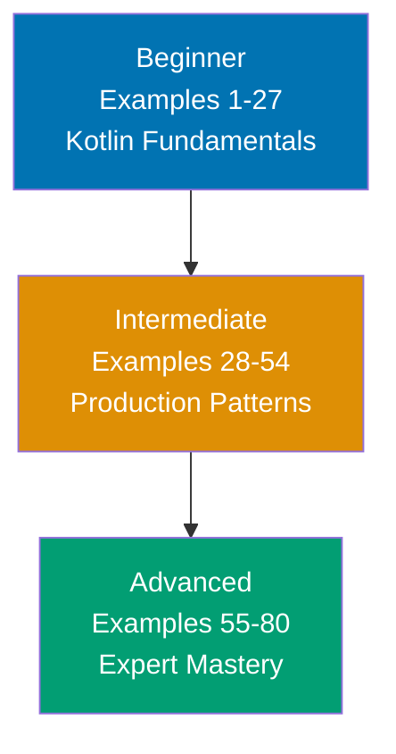

🔴 **CRITICAL STATUS: COMPLETELY EMPTY** - This tutorial is currently under development with 0 out of 75-85 target examples. All three levels (beginner, intermediate, advanced) need to be created from scratch.

**When complete**, this by-example guide will teach essential Kotlin concepts through 75-85 annotated code examples organized by complexity level.

**Current Progress**:

- Beginner (0/27-30 examples) - Not started
- Intermediate (0/20-30 examples) - Not started
- Advanced (0/25-28 examples) - Not started
- **Total: 0/85 examples** - 100% gap (highest priority)

## What Is By-Example Learning?

By-example learning is an **example-first approach** where you learn through annotated, runnable code rather than narrative explanations. Each example is self-contained, immediately executable with `kotlinc` or in IntelliJ IDEA, and heavily commented to show:

- **What each line does** - Inline comments explain the purpose and mechanism
- **Expected outputs** - Using `// =>` notation to show results
- **Intermediate values** - Variable states and control flow made visible
- **Key takeaways** - 1-2 sentence summaries of core concepts

This approach is **ideal for experienced developers** (seasonal programmers or software engineers) who are familiar with at least one programming language and want to quickly understand Kotlin's syntax, idioms, and unique features through working code.

Unlike narrative tutorials that build understanding through explanation and storytelling, by-example learning lets you **see the code first, run it second, and understand it through direct interaction**. You learn by doing, not by reading about doing.

## Learning Path



Progress from fundamentals through production patterns to advanced features. Each level builds on the previous, increasing in sophistication and introducing more Kotlin-specific concepts.

## Coverage Philosophy

This by-example guide provides **comprehensive coverage of Kotlin** through practical, annotated examples. This tutorial covers core language features comprehensively, not a time estimate—focus is on **outcomes and understanding**, not duration.

### What's Covered

- **Core syntax** - Variables, types, operators, control flow, null safety
- **Functions** - Named functions, lambdas, higher-order functions, inline functions
- **Object-oriented programming** - Classes, objects, inheritance, interfaces, data classes, sealed classes
- **Type system** - Nullable types, generics, type inference, smart casts, type projections
- **Functional programming** - Lambdas, scope functions (let, run, with, apply, also), sequences
- **Coroutines** - async/await patterns, channels, flows, structured concurrency
- **Collections** - List, Set, Map operations, collection transformations, sequences vs collections
- **Extensions** - Extension functions, extension properties, DSL builders
- **Delegation** - Property delegates, class delegation, standard delegates (lazy, observable)
- **Testing** - Unit testing, assertions, mocking patterns
- **Java interop** - Calling Java from Kotlin, calling Kotlin from Java, annotations

### What's NOT Covered

This guide focuses on **learning-oriented examples**, not problem-solving recipes or production deployment. For additional topics:

- **Deep framework knowledge** - Ktor, Spring Boot covered at introductory level only

The comprehensive coverage goal maintains humility—no tutorial can cover everything. This guide teaches the **core concepts that continue learning beyond this tutorial** through your own exploration and project work.

## How to Use This Guide

1. **Sequential or selective** - Read examples in order for progressive learning, or jump to specific topics when switching from another language
2. **Run everything** - Copy and paste examples into IntelliJ IDEA or use `kotlin` command to see outputs yourself. Experimentation solidifies understanding.
3. **Modify and explore** - Change values, add print statements, break things intentionally. Learn through experimentation.
4. **Use as reference** - Bookmark examples for quick lookups when you forget syntax or patterns
5. **Complement with narrative tutorials** - By-example learning is code-first; pair with comprehensive tutorials for deeper explanations

**Best workflow**: Open IntelliJ IDEA in one window, this guide in another. Run each example as you read it. When you encounter something unfamiliar, run the example, modify it, see what changes.

## Relationship to Other Tutorials

Understanding where by-example fits in the tutorial ecosystem helps you choose the right learning path:

| Tutorial Type    | Coverage                          | Approach                       | Target Audience         | When to Use                                          |
| ---------------- | --------------------------------- | ------------------------------ | ----------------------- | ---------------------------------------------------- |
| **By Example**   | Comprehensive through 80 examples | Code-first, annotated examples | Experienced developers  | Quick language pickup, reference, language switching |
| **Quick Start**  | 5-30% touchpoints                 | Hands-on project               | Newcomers to Kotlin     | First taste, decide if worth learning                |
| **Beginner**     | 0-60% comprehensive               | Narrative, explanatory         | Complete beginners      | Deep understanding, first programming language       |
| **Intermediate** | 60-85%                            | Practical applications         | Past basics             | Production patterns, frameworks                      |
| **Advanced**     | advanced topics                   | Complex systems                | Experienced Kotlin devs | Coroutines internals, multiplatform                  |
| **Cookbook**     | Problem-oriented                  | Recipe, solution-focused       | All levels              | Specific problems, common tasks                      |

**By Example vs. Quick Start**: By Example provides comprehensive coverage through examples vs. Quick Start's 5-30% through a single project. By Example is code-first reference; Quick Start is hands-on introduction.

**By Example vs. Beginner Tutorial**: By Example is code-first for experienced developers; Beginner Tutorial is narrative-first for complete beginners. By Example shows patterns; Beginner Tutorial explains concepts.

**By Example vs. Cookbook**: By Example is learning-oriented with progressive examples building language knowledge. Cookbook is problem-solving oriented with standalone recipes for specific tasks. By Example teaches concepts; Cookbook solves problems.

## Prerequisites

**Required**:

- Experience with at least one programming language
- Ability to run Kotlin programs (IntelliJ IDEA, Android Studio, or command line)

**Recommended (helpful but not required)**:

- Familiarity with Java (Kotlin runs on JVM and interoperates seamlessly)
- Object-oriented programming experience (classes, inheritance)
- Basic functional programming concepts (lambdas, higher-order functions)

**No prior Kotlin experience required** - This guide assumes you're new to Kotlin but experienced with programming in general. You should be comfortable reading code, understanding basic programming concepts (variables, functions, loops), and learning through hands-on experimentation.

## Structure of Each Example

Every example follows this consistent format:

````markdown
### Example N: Concept Name

Brief explanation of the concept in 2-3 sentences. Explains **what** the concept is and **why** it matters.

[OPTIONAL: Mermaid diagram when concept relationships need visualization]

**Code**:

```kotlin
// Comment explaining what this section does
fun main() {
    // Inline comment for each significant line
    val result = operation()     // => expected_output_value
    // Intermediate values shown in comments
    val transformed = transform(result) // => intermediate_value
    println(transformed)         // => Output: final_output
}
```

**Key Takeaway**: 1-2 sentence summary highlighting the most important insight or pattern from this example.

**Why It Matters**: 1-2 sentence explanation of practical relevance—when you'd use this in real code.
````

The **brief explanation** provides context. The **code** is heavily annotated with inline comments and `// =>` output notation. The **key takeaway** distills the concept to its essence. The **why it matters** connects to real-world application.

Mermaid diagrams appear when **visual representation clarifies concept relationships** - showing data flow, coroutine execution, or abstract structures. Not every example needs a diagram; they're used strategically to enhance understanding.

## Learning Strategies

### For Java Developers

You're the primary audience - Kotlin is designed as a better Java. The transition is smooth:

- **Null safety built-in**: `String?` vs `String` catches NPEs at compile time
- **Data classes**: One line replaces boilerplate getters, setters, equals, hashCode
- **Extension functions**: Add methods to existing classes without inheritance

Focus on Examples 1-15 (Kotlin basics) and Examples 20-27 (null safety) to see immediate productivity gains.

### For Swift/iOS Developers

You know a modern language with optionals and type inference. Kotlin feels very similar:

- **Almost identical syntax**: Optionals, type inference, closures work similarly
- **JVM instead of iOS**: Same concepts, different runtime and ecosystem
- **Coroutines vs async/await**: Structured concurrency with similar patterns

Focus on Examples 45-55 (coroutines) and Examples 35-42 (scope functions) to leverage your Swift knowledge.

### For Python/JavaScript Developers

You're used to dynamic typing and concise syntax. Kotlin offers type safety without Java's verbosity:

- **Type inference**: Types are checked but often inferred, less annotation needed
- **First-class functions**: Lambdas and higher-order functions work naturally
- **Null safety**: Compiler prevents null pointer exceptions

Focus on Examples 5-15 (type system) and Examples 25-35 (functional patterns) to build static typing intuition.

### For Scala Developers

You know JVM functional programming. Kotlin is simpler and more pragmatic:

- **Less powerful, more practical**: No implicits, simpler type system
- **Better Java interop**: Kotlin is designed for seamless Java integration
- **Coroutines vs Futures**: Different concurrency model, simpler mental model

Focus on Examples 55-70 (advanced features) and Examples 70-80 (DSLs) to see Kotlin's design choices.

## Code-First Philosophy

This tutorial prioritizes working code over theoretical discussion:

- **No lengthy prose**: Concepts are demonstrated, not explained at length
- **Runnable examples**: Every example compiles and runs with kotlinc or in IntelliJ IDEA
- **Learn by doing**: Understanding comes from running and modifying code
- **Pattern recognition**: See the same patterns in different contexts across 80 examples

If you prefer narrative explanations. By-example learning works best when you learn through experimentation.

## Reading Code Annotations

Examples use `// =>` notation to show outputs, states, and intermediate values:

```kotlin
// Variable assignment
val age = 25                     // => age is 25 (type: Int)

// Transformation
val doubled = age * 2            // => doubled is 50 (age remains 25)

// Function call with return
val greeting = "Age: $doubled"   // => greeting is "Age: 50" (String)

// Output to stdout
println(greeting)                // => Output: Age: 50

// Nullable types
val result: Int? = null          // => result is null (type: Int?)
val value = result ?: 0          // => value is 0 (Elvis operator provides default)
```

## Example Distribution

**80 examples across three levels**:

- **Beginner** (1-27): 27 examples covering fundamental language features
- **Intermediate** (28-54): 27 examples covering production patterns
- **Advanced** (55-80): 26 examples covering advanced language features

Each level builds on previous knowledge while remaining self-contained and runnable.

## Diagram Conventions

Approximately 30-50% of examples include Mermaid diagrams using a **color-blind friendly palette**:

- **Blue** (#0173B2): Primary elements, starting states
- **Orange** (#DE8F05): Secondary elements, processing states
- **Teal** (#029E73): Success states, outputs
- **Purple** (#CC78BC): Alternative paths, options
- **Brown** (#CA9161): Neutral elements, helpers

Diagrams appear when they clarify non-obvious concepts like data flow, coroutine execution, or state transitions.

## Running Examples

All examples are designed to run with standard Kotlin tooling:

### Command-Line Compilation

```bash
# Compile and run a single file
kotlinc example.kt -include-runtime -d example.jar
java -jar example.jar

# Or use kotlin command for scripts
kotlin example.kt
```

### Using Kotlin REPL

```bash
# Launch REPL
kotlinc-jvm

# Paste code and see results immediately
```

### Using IntelliJ IDEA or Android Studio

1. Create a new Kotlin file
2. Copy the example code
3. Right-click and select "Run"

## Ready to Start?

Jump into the beginner examples to start learning Kotlin through code:

- [Beginner Examples (1-27)](/en/learn/software-engineering/programming-languages/kotlin/by-example/beginner) - Basic syntax, null safety, functions, OOP fundamentals
- [Intermediate Examples (28-54)](/en/learn/software-engineering/programming-languages/kotlin/by-example/intermediate) - Generics, scope functions, delegation, coroutines basics
- [Advanced Examples (55-80)](/en/learn/software-engineering/programming-languages/kotlin/by-example/advanced) - Advanced coroutines, DSLs, multiplatform, performance

Each example is self-contained and runnable. Start with Example 1, or jump to topics that interest you most.
