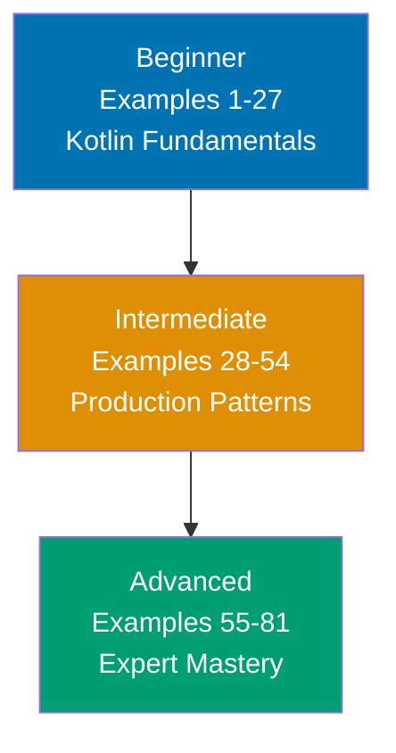

This by-example guide teaches Kotlin through 81 annotated, runnable code examples organized by complexity level. Covering fundamentals through advanced production patterns, each example is self-contained and immediately executable in IntelliJ IDEA or via the Kotlin command line.

**81 examples across three levels**:

- Beginner (Examples 1-27): 27 examples covering fundamental language features
- Intermediate (Examples 28-54): 27 examples covering production patterns
- Advanced (Examples 55-81): 27 examples covering advanced language features

## What Is By-Example Learning?

By-example learning is an **example-first approach** where you learn through annotated, runnable code rather than narrative explanations. Each example is self-contained, immediately executable with `kotlinc` or in IntelliJ IDEA, and heavily commented to show:

- **What each line does** - Inline comments explain the purpose and mechanism
- **Expected outputs** - Using `// =>` notation to show results
- **Intermediate values** - Variable states and control flow made visible
- **Key takeaways** - 1-2 sentence summaries of core concepts

This approach is **ideal for experienced developers** (seasonal programmers or software engineers) who are familiar with at least one programming language and want to quickly understand Kotlin's syntax, idioms, and unique features through working code.

Unlike narrative tutorials that build understanding through explanation and storytelling, by-example learning lets you **see the code first, run it second, and understand it through direct interaction**. You learn by doing, not by reading about doing.

## Learning Path


```mermaid
%% Color Palette: Blue #0173B2, Orange #DE8F05, Teal #029E73, Purple #CC78BC, Brown #CA9161
graph TD
    A["Beginner<br/>Examples 1-27<br/>Kotlin Fundamentals"] --> B["Intermediate<br/>Examples 28-54<br/>Production Patterns"]
    B --> C["Advanced<br/>Examples 55-81<br/>Expert Mastery"]

    style A fill:#0173B2,color:#fff
    style B fill:#DE8F05,color:#fff
    style C fill:#029E73,color:#fff
```

Progress from fundamentals through production patterns to advanced features. Each level builds on the previous, increasing in sophistication and introducing more Kotlin-specific concepts.

## Coverage Philosophy

This by-example guide provides **comprehensive coverage of Kotlin** through practical, annotated examples. This tutorial covers core language features comprehensively, not a time estimate—focus is on **outcomes and understanding**, not duration.

### What's Covered

- **Core syntax** - Variables, types, operators, control flow, null safety
- **Functions** - Named functions, lambdas, higher-order functions, inline functions
- **Object-oriented programming** - Classes, objects, inheritance, interfaces, data classes, sealed classes
- **Type system** - Nullable types, generics, type inference, smart casts, type projections
- **Functional programming** - Lambdas, scope functions (let, run, with, apply, also), sequences
- **Coroutines** - async/await patterns, channels, flows, structured concurrency
- **Collections** - List, Set, Map operations, collection transformations, sequences vs collections
- **Extensions** - Extension functions, extension properties, DSL builders
- **Delegation** - Property delegates, class delegation, standard delegates (lazy, observable)
- **Testing** - Unit testing, assertions, mocking patterns
- **Java interop** - Calling Java from Kotlin, calling Kotlin from Java, annotations

### What's NOT Covered

This guide focuses on **learning-oriented examples**, not problem-solving recipes or production deployment. For additional topics:

- **Deep framework knowledge** - Ktor, Spring Boot covered at introductory level only

The comprehensive coverage goal maintains humility—no tutorial can cover everything. This guide teaches the **core concepts that continue learning beyond this tutorial** through your own exploration and project work.

## How to Use This Guide

1. **Sequential or selective** - Read examples in order for progressive learning, or jump to specific topics when switching from another language
2. **Run everything** - Copy and paste examples into IntelliJ IDEA or use `kotlin` command to see outputs yourself. Experimentation solidifies understanding.
3. **Modify and explore** - Change values, add print statements, break things intentionally. Learn through experimentation.
4. **Use as reference** - Bookmark examples for quick lookups when you forget syntax or patterns
5. **Complement with narrative tutorials** - By-example learning is code-first; pair with comprehensive tutorials for deeper explanations

**Best workflow**: Open IntelliJ IDEA in one window, this guide in another. Run each example as you read it. When you encounter something unfamiliar, run the example, modify it, see what changes.

## Relationship to Other Tutorials

Understanding where by-example fits in the tutorial ecosystem helps you choose the right learning path:

| Tutorial Type    | Coverage                          | Approach                       | Target Audience         | When to Use                                          |
| ---------------- | --------------------------------- | ------------------------------ | ----------------------- | ---------------------------------------------------- |
| **By Example**   | Comprehensive through 81 examples | Code-first, annotated examples | Experienced developers  | Quick language pickup, reference, language switching |
| **Quick Start**  | 5-30% touchpoints                 | Hands-on project               | Newcomers to Kotlin     | First taste, decide if worth learning                |
| **Beginner**     | 0-60% comprehensive               | Narrative, explanatory         | Complete beginners      | Deep understanding, first programming language       |
| **Intermediate** | 60-85%                            | Practical applications         | Past basics             | Production patterns, frameworks                      |
| **Advanced**     | advanced topics                   | Complex systems                | Experienced Kotlin devs | Coroutines internals, multiplatform                  |
| **Cookbook**     | Problem-oriented                  | Recipe, solution-focused       | All levels              | Specific problems, common tasks                      |

**By Example vs. Quick Start**: By Example provides comprehensive coverage through examples vs. Quick Start's 5-30% through a single project. By Example is code-first reference; Quick Start is hands-on introduction.

**By Example vs. Beginner Tutorial**: By Example is code-first for experienced developers; Beginner Tutorial is narrative-first for complete beginners. By Example shows patterns; Beginner Tutorial explains concepts.

**By Example vs. Cookbook**: By Example is learning-oriented with progressive examples building language knowledge. Cookbook is problem-solving oriented with standalone recipes for specific tasks. By Example teaches concepts; Cookbook solves problems.

## Prerequisites

**Required**:

- Experience with at least one programming language
- Ability to run Kotlin programs (IntelliJ IDEA, Android Studio, or command line)

**Recommended (helpful but not required)**:

- Familiarity with Java (Kotlin runs on JVM and interoperates seamlessly)
- Object-oriented programming experience (classes, inheritance)
- Basic functional programming concepts (lambdas, higher-order functions)

**No prior Kotlin experience required** - This guide assumes you're new to Kotlin but experienced with programming in general. You should be comfortable reading code, understanding basic programming concepts (variables, functions, loops), and learning through hands-on experimentation.

## Structure of Each Example

Every example follows this consistent format:

````markdown
### Example N: Concept Name

Brief explanation of the concept in 2-3 sentences. Explains **what** the concept is and **why** it matters.

[OPTIONAL: Mermaid diagram when concept relationships need visualization]

**Code**:

```kotlin
// Comment explaining what this section does
fun main() {
    // Inline comment for each significant line
    val result = operation()     // => expected_output_value
    // Intermediate values shown in comments
    val transformed = transform(result) // => intermediate_value
    println(transformed)         // => Output: final_output
}
```

**Key Takeaway**: 1-2 sentence summary highlighting the most important insight or pattern from this example.

**Why It Matters**: 1-2 sentence explanation of practical relevance—when you'd use this in real code.
````

The **brief explanation** provides context. The **code** is heavily annotated with inline comments and `// =>` output notation. The **key takeaway** distills the concept to its essence. The **why it matters** connects to real-world application.

Mermaid diagrams appear when **visual representation clarifies concept relationships** - showing data flow, coroutine execution, or abstract structures. Not every example needs a diagram; they're used strategically to enhance understanding.

## Learning Strategies

### For Java Developers

You're the primary audience - Kotlin is designed as a better Java. The transition is smooth:

- **Null safety built-in**: `String?` vs `String` catches NPEs at compile time
- **Data classes**: One line replaces boilerplate getters, setters, equals, hashCode
- **Extension functions**: Add methods to existing classes without inheritance

Focus on Examples 1-15 (Kotlin basics) and Examples 10 (null safety) to see immediate productivity gains.

### For Swift/iOS Developers

You know a modern language with optionals and type inference. Kotlin feels very similar:

- **Almost identical syntax**: Optionals, type inference, closures work similarly
- **JVM instead of iOS**: Same concepts, different runtime and ecosystem
- **Coroutines vs async/await**: Structured concurrency with similar patterns

Focus on Examples 28-35 (coroutines) and Examples 22-27 (scope functions and functional patterns) to leverage your Swift knowledge.

### For Python/JavaScript Developers

You're used to dynamic typing and concise syntax. Kotlin offers type safety without Java's verbosity:

- **Type inference**: Types are checked but often inferred, less annotation needed
- **First-class functions**: Lambdas and higher-order functions work naturally
- **Null safety**: Compiler prevents null pointer exceptions

Focus on Examples 5-15 (type system) and Examples 25-35 (functional patterns) to build static typing intuition.

### For Scala Developers

You know JVM functional programming. Kotlin is simpler and more pragmatic:

- **Less powerful, more practical**: No implicits, simpler type system
- **Better Java interop**: Kotlin is designed for seamless Java integration
- **Coroutines vs Futures**: Different concurrency model, simpler mental model

Focus on Examples 55-81 (advanced features) and Examples 44 (DSLs in intermediate) to see Kotlin's design choices.

## Code-First Philosophy

This tutorial prioritizes working code over theoretical discussion:

- **No lengthy prose**: Concepts are demonstrated, not explained at length
- **Runnable examples**: Every example compiles and runs with kotlinc or in IntelliJ IDEA
- **Learn by doing**: Understanding comes from running and modifying code
- **Pattern recognition**: See the same patterns in different contexts across 81 examples

If you prefer narrative explanations. By-example learning works best when you learn through experimentation.

## Reading Code Annotations

Examples use `// =>` notation to show outputs, states, and intermediate values:

```kotlin
// Variable assignment
val age = 25                     // => age is 25 (type: Int)

// Transformation
val doubled = age * 2            // => doubled is 50 (age remains 25)

// Function call with return
val greeting = "Age: $doubled"   // => greeting is "Age: 50" (String)

// Output to stdout
println(greeting)                // => Output: Age: 50

// Nullable types
val result: Int? = null          // => result is null (type: Int?)
val value = result ?: 0          // => value is 0 (Elvis operator provides default)
```

## Example Distribution

**81 examples across three levels**:

- **Beginner** (1-27): 27 examples covering fundamental language features
- **Intermediate** (28-54): 27 examples covering production patterns
- **Advanced** (55-81): 27 examples covering advanced language features

Each level builds on previous knowledge while remaining self-contained and runnable.

## Diagram Conventions

Approximately 30-50% of examples include Mermaid diagrams using a **color-blind friendly palette**:

- **Blue** (#0173B2): Primary elements, starting states
- **Orange** (#DE8F05): Secondary elements, processing states
- **Teal** (#029E73): Success states, outputs
- **Purple** (#CC78BC): Alternative paths, options
- **Brown** (#CA9161): Neutral elements, helpers

Diagrams appear when they clarify non-obvious concepts like data flow, coroutine execution, or state transitions.

## Running Examples

All examples are designed to run with standard Kotlin tooling:

### Command-Line Compilation

```bash
# Compile and run a single file
kotlinc example.kt -include-runtime -d example.jar
java -jar example.jar

# Or use kotlin command for scripts
kotlin example.kt
```

### Using Kotlin REPL

```bash
# Launch REPL
kotlinc-jvm

# Paste code and see results immediately
```

### Using IntelliJ IDEA or Android Studio

1. Create a new Kotlin file
2. Copy the example code
3. Right-click and select "Run"

## Ready to Start?

Jump into the beginner examples to start learning Kotlin through code:

- [Beginner Examples (1-27)](/en/learn/software-engineering/programming-languages/kotlin/by-example/beginner) - Basic syntax, null safety, functions, OOP fundamentals
- [Intermediate Examples (28-54)](/en/learn/software-engineering/programming-languages/kotlin/by-example/intermediate) - Generics, scope functions, delegation, coroutines basics
- [Advanced Examples (55-81)](/en/learn/software-engineering/programming-languages/kotlin/by-example/advanced) - Advanced coroutines, DSLs, multiplatform, performance

Each example is self-contained and runnable. Start with Example 1, or jump to topics that interest you most.

## Examples by Level

### Beginner (Examples 1–27)

- [Example 1: Hello World](/en/learn/software-engineering/programming-languages/kotlin/by-example/beginner#example-1-hello-world)
- [Example 2: Variable Declaration - val vs var](/en/learn/software-engineering/programming-languages/kotlin/by-example/beginner#example-2-variable-declaration---val-vs-var)
- [Example 3: Basic Types and Type Inference](/en/learn/software-engineering/programming-languages/kotlin/by-example/beginner#example-3-basic-types-and-type-inference)
- [Example 4: String Templates](/en/learn/software-engineering/programming-languages/kotlin/by-example/beginner#example-4-string-templates)
- [Example 5: Functions](/en/learn/software-engineering/programming-languages/kotlin/by-example/beginner#example-5-functions)
- [Example 6: When Expression](/en/learn/software-engineering/programming-languages/kotlin/by-example/beginner#example-6-when-expression)
- [Example 7: Ranges and Progression](/en/learn/software-engineering/programming-languages/kotlin/by-example/beginner#example-7-ranges-and-progression)
- [Example 8: For Loops](/en/learn/software-engineering/programming-languages/kotlin/by-example/beginner#example-8-for-loops)
- [Example 9: While and Do-While Loops](/en/learn/software-engineering/programming-languages/kotlin/by-example/beginner#example-9-while-and-do-while-loops)
- [Example 10: Null Safety - Nullable Types](/en/learn/software-engineering/programming-languages/kotlin/by-example/beginner#example-10-null-safety---nullable-types)
- [Example 11: Collections - Lists](/en/learn/software-engineering/programming-languages/kotlin/by-example/beginner#example-11-collections---lists)
- [Example 12: Collections - Sets](/en/learn/software-engineering/programming-languages/kotlin/by-example/beginner#example-12-collections---sets)
- [Example 13: Collections - Maps](/en/learn/software-engineering/programming-languages/kotlin/by-example/beginner#example-13-collections---maps)
- [Example 14: Classes and Objects](/en/learn/software-engineering/programming-languages/kotlin/by-example/beginner#example-14-classes-and-objects)
- [Example 15: Data Classes](/en/learn/software-engineering/programming-languages/kotlin/by-example/beginner#example-15-data-classes)
- [Example 16: Inheritance and Open Classes](/en/learn/software-engineering/programming-languages/kotlin/by-example/beginner#example-16-inheritance-and-open-classes)
- [Example 17: Interfaces](/en/learn/software-engineering/programming-languages/kotlin/by-example/beginner#example-17-interfaces)
- [Example 18: Abstract Classes](/en/learn/software-engineering/programming-languages/kotlin/by-example/beginner#example-18-abstract-classes)
- [Example 19: Companion Objects](/en/learn/software-engineering/programming-languages/kotlin/by-example/beginner#example-19-companion-objects)
- [Example 20: Object Declarations (Singletons)](/en/learn/software-engineering/programming-languages/kotlin/by-example/beginner#example-20-object-declarations-singletons)
- [Example 21: Sealed Classes](/en/learn/software-engineering/programming-languages/kotlin/by-example/beginner#example-21-sealed-classes)
- [Example 22: Extension Functions](/en/learn/software-engineering/programming-languages/kotlin/by-example/beginner#example-22-extension-functions)
- [Example 23: Lambdas and Higher-Order Functions](/en/learn/software-engineering/programming-languages/kotlin/by-example/beginner#example-23-lambdas-and-higher-order-functions)
- [Example 24: Scope Functions - let, run, with, apply, also](/en/learn/software-engineering/programming-languages/kotlin/by-example/beginner#example-24-scope-functions---let-run-with-apply-also)
- [Example 25: Exception Handling](/en/learn/software-engineering/programming-languages/kotlin/by-example/beginner#example-25-exception-handling)
- [Example 26: Type Checks and Smart Casts](/en/learn/software-engineering/programming-languages/kotlin/by-example/beginner#example-26-type-checks-and-smart-casts)
- [Example 27: Generics Basics](/en/learn/software-engineering/programming-languages/kotlin/by-example/beginner#example-27-generics-basics)

### Intermediate (Examples 28–54)

- [Example 28: Basic Coroutines - Launch and RunBlocking](/en/learn/software-engineering/programming-languages/kotlin/by-example/intermediate#example-28-basic-coroutines---launch-and-runblocking)
- [Example 29: Async and Await for Returning Results](/en/learn/software-engineering/programming-languages/kotlin/by-example/intermediate#example-29-async-and-await-for-returning-results)
- [Example 30: Structured Concurrency with CoroutineScope](/en/learn/software-engineering/programming-languages/kotlin/by-example/intermediate#example-30-structured-concurrency-with-coroutinescope)
- [Example 31: Coroutine Context and Dispatchers](/en/learn/software-engineering/programming-languages/kotlin/by-example/intermediate#example-31-coroutine-context-and-dispatchers)
- [Example 32: Channels for Communication Between Coroutines](/en/learn/software-engineering/programming-languages/kotlin/by-example/intermediate#example-32-channels-for-communication-between-coroutines)
- [Example 33: Flow for Cold Asynchronous Streams](/en/learn/software-engineering/programming-languages/kotlin/by-example/intermediate#example-33-flow-for-cold-asynchronous-streams)
- [Example 34: Flow Operators - Transform, Buffer, Conflate](/en/learn/software-engineering/programming-languages/kotlin/by-example/intermediate#example-34-flow-operators---transform-buffer-conflate)
- [Example 35: StateFlow and SharedFlow for Hot Streams](/en/learn/software-engineering/programming-languages/kotlin/by-example/intermediate#example-35-stateflow-and-sharedflow-for-hot-streams)
- [Example 36: Collection Operations - Map, Filter, Reduce](/en/learn/software-engineering/programming-languages/kotlin/by-example/intermediate#example-36-collection-operations---map-filter-reduce)
- [Example 37: Collection Operations - GroupBy, Partition, Associate](/en/learn/software-engineering/programming-languages/kotlin/by-example/intermediate#example-37-collection-operations---groupby-partition-associate)
- [Example 38: Sequences for Lazy Evaluation](/en/learn/software-engineering/programming-languages/kotlin/by-example/intermediate#example-38-sequences-for-lazy-evaluation)
- [Example 39: Property Delegation - Lazy and Observable](/en/learn/software-engineering/programming-languages/kotlin/by-example/intermediate#example-39-property-delegation---lazy-and-observable)
- [Example 40: Custom Property Delegates](/en/learn/software-engineering/programming-languages/kotlin/by-example/intermediate#example-40-custom-property-delegates)
- [Example 41: Extension Functions and Properties](/en/learn/software-engineering/programming-languages/kotlin/by-example/intermediate#example-41-extension-functions-and-properties)
- [Example 42: Inline Functions and Reified Type Parameters](/en/learn/software-engineering/programming-languages/kotlin/by-example/intermediate#example-42-inline-functions-and-reified-type-parameters)
- [Example 43: Operator Overloading](/en/learn/software-engineering/programming-languages/kotlin/by-example/intermediate#example-43-operator-overloading)
- [Example 44: DSL Building with Lambda with Receiver](/en/learn/software-engineering/programming-languages/kotlin/by-example/intermediate#example-44-dsl-building-with-lambda-with-receiver)
- [Example 45: Sealed Classes and When Expressions](/en/learn/software-engineering/programming-languages/kotlin/by-example/intermediate#example-45-sealed-classes-and-when-expressions)
- [Example 46: Data Class Advanced Features - Copy and Destructuring](/en/learn/software-engineering/programming-languages/kotlin/by-example/intermediate#example-46-data-class-advanced-features---copy-and-destructuring)
- [Example 47: Destructuring in Lambdas and Map Operations](/en/learn/software-engineering/programming-languages/kotlin/by-example/intermediate#example-47-destructuring-in-lambdas-and-map-operations)
- [Example 48: Inline Classes (Value Classes) for Type Safety](/en/learn/software-engineering/programming-languages/kotlin/by-example/intermediate#example-48-inline-classes-value-classes-for-type-safety)
- [Example 49: Contracts for Smart Casts](/en/learn/software-engineering/programming-languages/kotlin/by-example/intermediate#example-49-contracts-for-smart-casts)
- [Example 50: Type Aliases for Readability](/en/learn/software-engineering/programming-languages/kotlin/by-example/intermediate#example-50-type-aliases-for-readability)
- [Example 51: Nothing Type for Exhaustiveness](/en/learn/software-engineering/programming-languages/kotlin/by-example/intermediate#example-51-nothing-type-for-exhaustiveness)
- [Example 52: Companion Object Extensions](/en/learn/software-engineering/programming-languages/kotlin/by-example/intermediate#example-52-companion-object-extensions)
- [Example 53: Delegation Pattern with by Keyword](/en/learn/software-engineering/programming-languages/kotlin/by-example/intermediate#example-53-delegation-pattern-with-by-keyword)
- [Example 54: Destructuring Declarations Advanced](/en/learn/software-engineering/programming-languages/kotlin/by-example/intermediate#example-54-destructuring-declarations-advanced)

### Advanced (Examples 55–81)

- [Example 55: SupervisorScope for Independent Failure Handling](/en/learn/software-engineering/programming-languages/kotlin/by-example/advanced#example-55-supervisorscope-for-independent-failure-handling)
- [Example 56: CoroutineContext and Job Hierarchy](/en/learn/software-engineering/programming-languages/kotlin/by-example/advanced#example-56-coroutinecontext-and-job-hierarchy)
- [Example 57: Exception Handling in Coroutines](/en/learn/software-engineering/programming-languages/kotlin/by-example/advanced#example-57-exception-handling-in-coroutines)
- [Example 58: Reflection - KClass and Class Inspection](/en/learn/software-engineering/programming-languages/kotlin/by-example/advanced#example-58-reflection---kclass-and-class-inspection)
- [Example 59: Reflection - Property Modification](/en/learn/software-engineering/programming-languages/kotlin/by-example/advanced#example-59-reflection---property-modification)
- [Example 60: Annotations and Processing](/en/learn/software-engineering/programming-languages/kotlin/by-example/advanced#example-60-annotations-and-processing)
- [Example 61: Inline Reified Advanced - Type-Safe JSON Parsing](/en/learn/software-engineering/programming-languages/kotlin/by-example/advanced#example-61-inline-reified-advanced---type-safe-json-parsing)
- [Example 62: Multiplatform Common Declarations](/en/learn/software-engineering/programming-languages/kotlin/by-example/advanced#example-62-multiplatform-common-declarations)
- [Example 63: Gradle Kotlin DSL Configuration](/en/learn/software-engineering/programming-languages/kotlin/by-example/advanced#example-63-gradle-kotlin-dsl-configuration)
- [Example 64: Serialization with kotlinx.serialization](/en/learn/software-engineering/programming-languages/kotlin/by-example/advanced#example-64-serialization-with-kotlinxserialization)
- [Example 65: Custom Serializers](/en/learn/software-engineering/programming-languages/kotlin/by-example/advanced#example-65-custom-serializers)
- [Example 66: Ktor Server Basics](/en/learn/software-engineering/programming-languages/kotlin/by-example/advanced#example-66-ktor-server-basics)
- [Example 67: Ktor Content Negotiation and Serialization](/en/learn/software-engineering/programming-languages/kotlin/by-example/advanced#example-67-ktor-content-negotiation-and-serialization)
- [Example 68: Arrow Either for Functional Error Handling](/en/learn/software-engineering/programming-languages/kotlin/by-example/advanced#example-68-arrow-either-for-functional-error-handling)
- [Example 69: Arrow Validated for Accumulating Errors](/en/learn/software-engineering/programming-languages/kotlin/by-example/advanced#example-69-arrow-validated-for-accumulating-errors)
- [Example 70: Performance - Inline Classes (Value Classes)](/en/learn/software-engineering/programming-languages/kotlin/by-example/advanced#example-70-performance---inline-classes-value-classes)
- [Example 71: Performance - Sequences for Lazy Evaluation](/en/learn/software-engineering/programming-languages/kotlin/by-example/advanced#example-71-performance---sequences-for-lazy-evaluation)
- [Example 72: Testing with Kotest](/en/learn/software-engineering/programming-languages/kotlin/by-example/advanced#example-72-testing-with-kotest)
- [Example 73: Testing Coroutines with runTest](/en/learn/software-engineering/programming-languages/kotlin/by-example/advanced#example-73-testing-coroutines-with-runtest)
- [Example 74: Mocking with MockK](/en/learn/software-engineering/programming-languages/kotlin/by-example/advanced#example-74-mocking-with-mockk)
- [Example 75: Gradle Custom Tasks](/en/learn/software-engineering/programming-languages/kotlin/by-example/advanced#example-75-gradle-custom-tasks)
- [Example 76: Best Practices - Immutability and Data Classes](/en/learn/software-engineering/programming-languages/kotlin/by-example/advanced#example-76-best-practices---immutability-and-data-classes)
- [Example 77: Best Practices - Extension Functions Organization](/en/learn/software-engineering/programming-languages/kotlin/by-example/advanced#example-77-best-practices---extension-functions-organization)
- [Example 78: Delegation Pattern with by Keyword](/en/learn/software-engineering/programming-languages/kotlin/by-example/advanced#example-78-delegation-pattern-with-by-keyword)
- [Example 79: Context Receivers (Experimental)](/en/learn/software-engineering/programming-languages/kotlin/by-example/advanced#example-79-context-receivers-experimental)
- [Example 80: Advanced Generics - Variance and Star Projection](/en/learn/software-engineering/programming-languages/kotlin/by-example/advanced#example-80-advanced-generics---variance-and-star-projection)
- [Example 81: Best Practices - Scope Functions Usage](/en/learn/software-engineering/programming-languages/kotlin/by-example/advanced#example-81-best-practices---scope-functions-usage)
