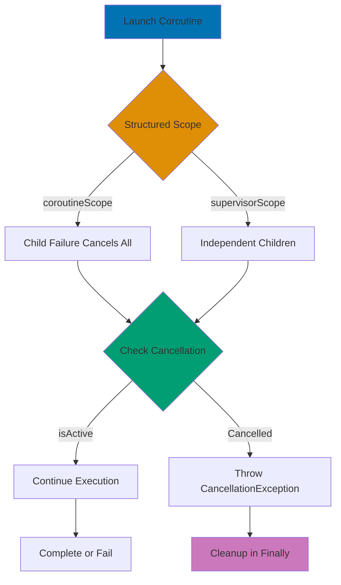

## Problem

Modern applications require sophisticated asynchronous patterns beyond basic coroutines. Complex scenarios need reactive streams, backpressure handling, structured concurrency, and proper cancellation propagation.

## Solution

### 1. StateFlow and SharedFlow for Reactive State

```kotlin
import kotlinx.coroutines.flow.*
import kotlinx.coroutines.*

class UserViewModel {
    // StateFlow - Always has value, replays latest to new collectors
    private val _userState = MutableStateFlow<UserState>(UserState.NotLoggedIn)
    val userState: StateFlow<UserState> = _userState.asStateFlow()

    // SharedFlow - Can have no initial value, configurable replay
    private val _events = MutableSharedFlow<UserEvent>(
        replay = 1,  // Replay last event to new collectors
        extraBufferCapacity = 10  // Buffer up to 10 events
    )
    val events: SharedFlow<UserEvent> = _events.asSharedFlow()

    sealed class UserState {
        object NotLoggedIn : UserState()
        data class LoggedIn(val username: String) : UserState()
        data class Loading(val message: String) : UserState()
    }

    sealed class UserEvent {
        data class ShowMessage(val message: String) : UserEvent()
        object LogoutSuccess : UserEvent()
    }

    suspend fun login(username: String, password: String) {
        _userState.value = UserState.Loading("Logging in...")

        delay(1000)  // Simulate API call

        if (password == "correct") {
            _userState.value = UserState.LoggedIn(username)
            _events.emit(UserEvent.ShowMessage("Welcome, $username!"))
        } else {
            _userState.value = UserState.NotLoggedIn
            _events.emit(UserEvent.ShowMessage("Invalid credentials"))
        }
    }

    suspend fun logout() {
        _userState.value = UserState.NotLoggedIn
        _events.emit(UserEvent.LogoutSuccess)
    }
}

// Usage in UI (Android)
class UserActivity : AppCompatActivity() {
    private val viewModel = UserViewModel()

    override fun onCreate(savedInstanceState: Bundle?) {
        super.onCreate(savedInstanceState)

        // Collect StateFlow (automatically cancels on lifecycle destroy)
        lifecycleScope.launch {
            viewModel.userState.collect { state ->
                when (state) {
                    is UserState.NotLoggedIn -> showLoginForm()
                    is UserState.LoggedIn -> showUserProfile(state.username)
                    is UserState.Loading -> showLoadingIndicator(state.message)
                }
            }
        }

        // Collect events (one-time actions)
        lifecycleScope.launch {
            viewModel.events.collect { event ->
                when (event) {
                    is UserEvent.ShowMessage -> showToast(event.message)
                    is UserEvent.LogoutSuccess -> navigateToLogin()
                }
            }
        }
    }
}
```

### 2. Flow Operators and Transformation

```kotlin
import kotlinx.coroutines.flow.*

class DataRepository {
    // Cold flow - starts emitting when collected
    fun fetchUserUpdates(userId: String): Flow<User> = flow {
        while (true) {
            val user = api.getUser(userId)  // API call
            emit(user)
            delay(5000)  // Poll every 5 seconds
        }
    }

    // Transform flows with operators
    fun getActiveUsers(): Flow<List<User>> = flow {
        emit(api.getAllUsers())
    }
        .map { users -> users.filter { it.isActive } }  // Filter
        .map { users -> users.sortedBy { it.lastSeen } }  // Sort
        .catch { e -> emit(emptyList()) }  // Error handling
        .onEach { users -> println("Emitting ${users.size} active users") }  // Side effects

    // Combine multiple flows
    fun getUserProfile(userId: String): Flow<UserProfile> {
        val userFlow = fetchUser(userId)
        val postsFlow = fetchUserPosts(userId)
        val friendsFlow = fetchUserFriends(userId)

        return combine(userFlow, postsFlow, friendsFlow) { user, posts, friends ->
            UserProfile(
                user = user,
                posts = posts,
                friends = friends
            )
        }
    }

    // FlatMap variations
    fun searchUsers(query: String): Flow<List<User>> {
        return flowOf(query)
            .debounce(300)  // Wait 300ms after last emission
            .filter { it.length >= 3 }  // Only search if 3+ chars
            .distinctUntilChanged()  // Ignore duplicate queries
            .flatMapLatest { searchQuery ->  // Cancel previous search
                flow {
                    val results = api.search(searchQuery)
                    emit(results)
                }
            }
    }

    // Retry logic
    fun fetchWithRetry(userId: String): Flow<User> = flow {
        emit(api.getUser(userId))
    }
        .retry(3) { cause ->
            cause is IOException  // Retry only on network errors
        }
        .retryWhen { cause, attempt ->
            if (attempt < 3 && cause is IOException) {
                delay(1000 * (attempt + 1))  // Exponential backoff
                true
            } else {
                false
            }
        }
}
```

### 3. Channels for Producer-Consumer Patterns

```kotlin
import kotlinx.coroutines.channels.*
import kotlinx.coroutines.*

class TaskProcessor {
    // Channel - Hot stream for communication between coroutines
    private val taskChannel = Channel<Task>(capacity = Channel.BUFFERED)

    data class Task(val id: Int, val data: String)

    // Producer
    suspend fun submitTask(task: Task) {
        taskChannel.send(task)
        println("Task ${task.id} submitted")
    }

    // Consumer
    fun startProcessing(scope: CoroutineScope) {
        scope.launch {
            for (task in taskChannel) {  // Iterate until channel is closed
                processTask(task)
            }
            println("Processing completed")
        }
    }

    private suspend fun processTask(task: Task) {
        delay(1000)  // Simulate work
        println("Processed task ${task.id}: ${task.data}")
    }

    fun shutdown() {
        taskChannel.close()
    }
}

// Usage
suspend fun main() = coroutineScope {
    val processor = TaskProcessor()

    // Start consumer
    processor.startProcessing(this)

    // Submit tasks from multiple producers
    launch {
        repeat(5) { i ->
            processor.submitTask(Task(i, "Data $i"))
            delay(500)
        }
    }

    launch {
        repeat(5) { i ->
            processor.submitTask(Task(i + 100, "Data ${i + 100}"))
            delay(700)
        }
    }

    delay(10000)
    processor.shutdown()
}

// Broadcast channel for multiple consumers
class EventBroadcaster {
    private val _events = MutableSharedFlow<Event>(
        replay = 0,
        extraBufferCapacity = 64,
        onBufferOverflow = BufferOverflow.DROP_OLDEST
    )
    val events: SharedFlow<Event> = _events.asSharedFlow()

    sealed class Event {
        data class UserLoggedIn(val userId: String) : Event()
        data class MessageReceived(val message: String) : Event()
    }

    suspend fun broadcast(event: Event) {
        _events.emit(event)
    }

    // Multiple consumers can collect independently
    fun subscribeToEvents(scope: CoroutineScope, handler: suspend (Event) -> Unit) {
        scope.launch {
            events.collect { event ->
                handler(event)
            }
        }
    }
}
```

### 4. Structured Concurrency and supervisorScope

```kotlin
import kotlinx.coroutines.*

class DataSyncService {
    // Regular coroutineScope - child failure cancels all siblings
    suspend fun syncAllData(): Result<Unit> = coroutineScope {
        try {
            val userData = async { fetchUserData() }  // If this fails...
            val settingsData = async { fetchSettings() }  // ...this cancels too
            val preferencesData = async { fetchPreferences() }

            // All must succeed
            Result.success(Unit)
        } catch (e: Exception) {
            Result.failure(e)
        }
    }

    // supervisorScope - child failure doesn't affect siblings
    suspend fun syncDataIndependently(): SyncResult = supervisorScope {
        val userDeferred = async { fetchUserData() }
        val settingsDeferred = async { fetchSettings() }
        val preferencesDeferred = async { fetchPreferences() }

        // Each can fail independently
        SyncResult(
            user = runCatching { userDeferred.await() },
            settings = runCatching { settingsDeferred.await() },
            preferences = runCatching { preferencesDeferred.await() }
        )
    }

    data class SyncResult(
        val user: Result<UserData>,
        val settings: Result<Settings>,
        val preferences: Result<Preferences>
    )

    // Structured concurrency with timeout
    suspend fun fetchWithTimeout(userId: String): User? {
        return try {
            withTimeout(5000) {  // 5-second timeout
                fetchUser(userId)
            }
        } catch (e: TimeoutCancellationException) {
            println("Request timed out")
            null
        }
    }

    // Parallel decomposition with structured concurrency
    suspend fun processLargeDataset(items: List<Item>): List<Result> = coroutineScope {
        items.chunked(100).map { chunk ->
            async {
                processChunk(chunk)
            }
        }.awaitAll()
    }
}
```

### 5. Cancellation and Exception Handling

```kotlin
import kotlinx.coroutines.*

class CancellationHandler {
    // Cooperative cancellation
    suspend fun longRunningTask() {
        try {
            repeat(1000) { i ->
                // Check cancellation periodically
                ensureActive()  // Throws CancellationException if cancelled

                // Or use isActive
                if (!isActive) {
                    println("Task cancelled at step $i")
                    return
                }

                performWork(i)
                delay(100)  // delay() also checks cancellation
            }
        } catch (e: CancellationException) {
            // Cleanup on cancellation
            println("Cleaning up resources")
            throw e  // Must re-throw CancellationException
        }
    }

    // NonCancellable context for cleanup
    suspend fun taskWithCleanup() {
        try {
            performTask()
        } finally {
            // Ensure cleanup even if cancelled
            withContext(NonCancellable) {
                cleanup()  // This will complete even if parent is cancelled
            }
        }
    }

    // CoroutineExceptionHandler for uncaught exceptions
    private val exceptionHandler = CoroutineExceptionHandler { _, exception ->
        println("Caught exception: ${exception.message}")
    }

    fun startWithExceptionHandling(scope: CoroutineScope) {
        scope.launch(exceptionHandler) {
            // Exceptions in this coroutine will be caught by handler
            throw RuntimeException("Something went wrong")
        }
    }

    // Supervisor job for independent child failures
    class BackgroundService {
        private val supervisorJob = SupervisorJob()
        private val scope = CoroutineScope(Dispatchers.Default + supervisorJob)

        fun startTasks() {
            // Task 1 failure won't cancel Task 2
            scope.launch {
                try {
                    failingTask()
                } catch (e: Exception) {
                    println("Task 1 failed: ${e.message}")
                }
            }

            scope.launch {
                successfulTask()
            }
        }

        fun shutdown() {
            supervisorJob.cancel()
        }
    }
}
```

### 6. Testing Coroutines

```kotlin
import kotlinx.coroutines.test.*
import kotlin.test.*

class CoroutineTest {
    // Use TestDispatcher for controlled time
    @Test
    fun testWithVirtualTime() = runTest {
        val viewModel = UserViewModel()

        // Advance virtual time
        advanceTimeBy(1000)

        // Trigger action
        viewModel.login("user", "password")

        // Advance past delay in login
        advanceUntilIdle()

        // Assert state
        assertEquals(
            UserViewModel.UserState.LoggedIn("user"),
            viewModel.userState.value
        )
    }

    // Test flow collection
    @Test
    fun testFlowEmissions() = runTest {
        val flow = flow {
            emit(1)
            delay(1000)
            emit(2)
            delay(1000)
            emit(3)
        }

        val results = mutableListOf<Int>()
        val job = launch {
            flow.collect { results.add(it) }
        }

        advanceTimeBy(1500)
        assertEquals(listOf(1, 2), results)

        advanceUntilIdle()
        assertEquals(listOf(1, 2, 3), results)

        job.cancel()
    }

    // Test cancellation
    @Test
    fun testCancellation() = runTest {
        var cleanupCalled = false

        val job = launch {
            try {
                delay(Long.MAX_VALUE)
            } finally {
                cleanupCalled = true
            }
        }

        job.cancel()
        job.join()

        assertTrue(cleanupCalled)
    }
}
```

## How It Works



**Coroutine Lifecycle:**

1. **Launch**: Coroutine starts in structured scope
2. **Execution**: Code runs cooperatively, checking cancellation
3. **Suspension**: Suspend functions yield to other coroutines
4. **Cancellation**: Parent cancellation propagates to children
5. **Completion**: Result or exception propagates to parent

## Variations

### Custom Flow Operators

```kotlin
fun <T> Flow<T>.throttleFirst(periodMillis: Long): Flow<T> = flow {
    var lastEmissionTime = 0L

    collect { value ->
        val currentTime = System.currentTimeMillis()
        if (currentTime - lastEmissionTime >= periodMillis) {
            lastEmissionTime = currentTime
            emit(value)
        }
    }
}

// Usage
searchQueryFlow
    .throttleFirst(1000)  // Emit at most once per second
    .collect { query -> performSearch(query) }
```

### Conflated Flow for Latest Value

```kotlin
class LocationTracker {
    private val _location = MutableSharedFlow<Location>(
        replay = 1,
        onBufferOverflow = BufferOverflow.DROP_OLDEST
    )

    // Conflate emissions - only latest matters
    val location: Flow<Location> = _location.conflate()

    suspend fun updateLocation(loc: Location) {
        _location.emit(loc)
    }
}
```

## Common Pitfalls

### 1. Not Handling Cancellation

**Problem**: Ignoring cancellation leads to resource leaks.

```kotlin
// ❌ Bad: Blocking operation doesn't check cancellation
suspend fun processData() {
    while (true) {  // Infinite loop!
        processNextItem()
        Thread.sleep(1000)  // Doesn't check cancellation!
    }
}

// ✅ Good: Check cancellation
suspend fun processData() {
    while (isActive) {  // Check cancellation
        processNextItem()
        delay(1000)  // Cancellable delay
    }
}
```

### 2. Collecting Flows in ViewModel

**Problem**: Cold flows restart on each collection.

```kotlin
// ❌ Bad: Flow restarts on config change
fun observeData() {
    viewModelScope.launch {
        repository.getData().collect {  // New flow on each call!
            _state.value = it
        }
    }
}

// ✅ Good: Use StateFlow to cache latest value
val data: StateFlow<Data> = repository.getData()
    .stateIn(
        scope = viewModelScope,
        started = SharingStarted.WhileSubscribed(5000),
        initialValue = Data.Empty
    )
```

### 3. Using GlobalScope

**Problem**: Leaks coroutines, no structured concurrency.

```kotlin
// ❌ Bad: GlobalScope has no parent, runs forever
fun fetchData() {
    GlobalScope.launch {
        api.getData()  // Never cancelled!
    }
}

// ✅ Good: Use appropriate scope
class MyService(private val scope: CoroutineScope) {
    fun fetchData() {
        scope.launch {
            api.getData()  // Cancelled when scope is cancelled
        }
    }
}
```

### 4. Not Using SupervisorJob for Independent Tasks

**Problem**: One task failure cancels all siblings.

```kotlin
// ❌ Bad: One failure cancels all
coroutineScope {
    launch { task1() }  // If this fails...
    launch { task2() }  // ...this gets cancelled
}

// ✅ Good: Use supervisorScope
supervisorScope {
    launch { task1() }  // Failure doesn't affect task2
    launch { task2() }
}
```

### 5. Blocking Main Thread with runBlocking

**Problem**: Freezes UI.

```kotlin
// ❌ Bad: Blocks main thread
fun onClick() {
    runBlocking {  // UI frozen!
        delay(1000)
    }
}

// ✅ Good: Launch in appropriate scope
fun onClick() {
    lifecycleScope.launch {
        delay(1000)
    }
}
```

## Related Patterns

**Related Tutorial**: See [Advanced Tutorial - Coroutines](/en/learn/software-engineering/programming-languages/kotlin/tutorials/advanced#coroutines).
**Related How-To**: See [Handle Coroutines and Async](/en/learn/software-engineering/programming-languages/kotlin/how-to/handle-coroutines-and-async), [Flow State Management](/en/learn/software-engineering/programming-languages/kotlin/how-to/flow-state-management).
**Related Cookbook**: See Cookbook recipe "Coroutine Patterns".
