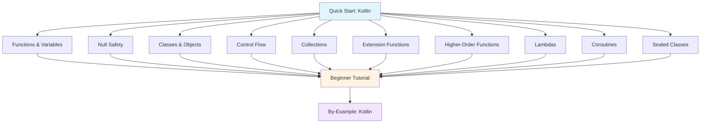

**Want to learn Kotlin fundamentals quickly?** This quick start touches 10 core Kotlin concepts with one example each. By the end, you'll have practical touchpoints for the most important language features.

This tutorial provides 5-30% coverage - rapid exposure to core concepts. For comprehensive mastery, continue to [Beginner Tutorial](/en/learn/software-engineering/programming-languages/kotlin/by-concept/beginner) (0-60% coverage) or explore [By-Example](/en/learn/software-engineering/programming-languages/kotlin/by-example) for heavily annotated code.

## Prerequisites

Before starting, you should have:

- Completed [Initial Setup](/en/learn/software-engineering/programming-languages/kotlin/initial-setup) - Kotlin and JDK installed
- A text editor or IDE (IntelliJ IDEA recommended, VS Code with Kotlin plugin, or any editor)
- Basic understanding of programming concepts
- Willingness to write and run code

## Learning Objectives

By the end of this tutorial, you will have touchpoints for:

1. **Functions and Variables** - First-class functions, type inference, immutability
2. **Null Safety** - Nullable types, safe calls, Elvis operator
3. **Classes and Objects** - Data classes, companion objects, object expressions
4. **Control Flow** - When expressions, ranges, smart casts
5. **Collections** - Lists, sets, maps with functional operations
6. **Extension Functions** - Add functions to existing types
7. **Higher-Order Functions** - Functions as parameters and return values
8. **Lambdas and Functional Programming** - Concise function expressions
9. **Coroutines** - Structured concurrency and async programming
10. **Sealed Classes and Pattern Matching** - Type-safe state representation

## Learning Path



## Concept 1: Functions and Variables - Type-Safe Basics

Kotlin has concise syntax with type inference and immutability by default.

### Example: Functions and Variables

```kotlin
// Function with explicit return type
fun greet(name: String): String {
    return "Hello, $name!"
}

// Expression body (single expression)
fun add(a: Int, b: Int): Int = a + b

// Type inference on return type
fun multiply(a: Int, b: Int) = a * b

// Default parameters
fun greetWithTitle(name: String, title: String = "Mr.") = "Hello, $title $name!"

// Named arguments
fun formatPerson(firstName: String, lastName: String, age: Int) =
    "$firstName $lastName is $age years old"

// Vararg parameters
fun sum(vararg numbers: Int): Int {
    var total = 0
    for (num in numbers) {
        total += num
    }
    return total
}

// Variables
fun variablesDemo() {
    // Immutable (val - like final in Java)
    val name: String = "Alice"
    val age = 30  // Type inference

    // name = "Bob"  // Compile error - val cannot be reassigned

    // Mutable (var)
    var counter = 0
    counter += 1  // OK

    // String templates
    println("$name is $age years old")
    println("Next year: ${age + 1}")
}

// Unit return type (like void in Java)
fun printMessage(msg: String): Unit {
    println(msg)
}

// Unit can be omitted
fun printMessageShort(msg: String) {
    println(msg)
}

// Top-level function (no class needed)
fun main() {
    println(greet("Alice"))  // Hello, Alice!
    println(add(5, 3))  // 8
    println(multiply(4, 7))  // 28

    println(greetWithTitle("Alice"))  // Hello, Mr. Alice!
    println(greetWithTitle("Alice", "Ms."))  // Hello, Ms. Alice!

    // Named arguments
    println(formatPerson(firstName = "John", lastName = "Doe", age = 25))
    // John Doe is 25 years old

    println(sum(1, 2, 3, 4, 5))  // 15

    variablesDemo()
}
```

**Key concepts**: `fun`, `val`/`var`, type inference, default parameters, named arguments, string templates

**When to explore deeper**: [Beginner Tutorial - Functions](/en/learn/software-engineering/programming-languages/kotlin/by-concept/beginner#functions)

## Concept 2: Null Safety - Avoid NullPointerException

Kotlin's type system distinguishes nullable and non-nullable types.

### Example: Nullable Types and Safe Calls

```kotlin
// Non-nullable type (default)
fun processString(str: String) {
    println(str.length)  // Safe - str cannot be null
}

// Nullable type (? suffix)
fun processNullableString(str: String?) {
    // println(str.length)  // Compile error - str might be null

    // Safe call operator (?.)
    println(str?.length)  // null if str is null, otherwise str.length

    // Elvis operator (?:) - default value if null
    val length = str?.length ?: 0
    println("Length: $length")

    // Safe cast (as?)
    val maybeInt: Any? = "123"
    val num: Int? = maybeInt as? Int  // null if cast fails
    println("Num: $num")  // Num: null
}

// Let function - execute block only if not null
fun useLetFunction() {
    val nullableName: String? = "Alice"

    nullableName?.let { name ->
        println("Name is not null: $name")
        println("Length: ${name.length}")
    }

    val nullName: String? = null
    nullName?.let {
        println("This won't execute")
    }
}

// Non-null assertion (!!)
fun forceNonNull() {
    val nullableValue: String? = "Kotlin"

    // Use !! only when you're absolutely sure it's not null
    val length = nullableValue!!.length  // Throws NPE if null
    println("Length: $length")

    // Dangerous! Will throw NPE
    // val nullValue: String? = null
    // val badLength = nullValue!!.length  // NullPointerException!
}

// Elvis with return/throw
fun processOrThrow(input: String?): Int {
    val value = input ?: throw IllegalArgumentException("Input cannot be null")
    return value.length
}

// Nullable receiver in extension functions
fun String?.isNullOrEmpty(): Boolean {
    return this == null || this.isEmpty()
}

fun main() {
    processString("Hello")

    processNullableString("Kotlin")
    processNullableString(null)

    useLetFunction()
    forceNonNull()

    try {
        println(processOrThrow("Valid"))  // 5
        println(processOrThrow(null))  // Exception
    } catch (e: IllegalArgumentException) {
        println("Caught: ${e.message}")
    }

    val empty: String? = ""
    val nullStr: String? = null
    println(empty.isNullOrEmpty())  // true
    println(nullStr.isNullOrEmpty())  // true
}
```

**Key concepts**: Nullable types `Type?`, safe call `?.`, Elvis operator `?:`, `let`, non-null assertion `!!`

**When to explore deeper**: [Beginner Tutorial - Null Safety](/en/learn/software-engineering/programming-languages/kotlin/by-concept/beginner#null-safety)

## Concept 3: Classes and Objects - OOP Made Easy

Kotlin simplifies class definitions with concise syntax and powerful features.

### Example: Classes, Data Classes, and Objects

```kotlin
// Basic class with primary constructor
class Person(val name: String, var age: Int) {
    // Init block
    init {
        println("Person created: $name")
    }

    // Member function
    fun greet() = "Hello, I'm $name and I'm $age years old"

    // Property with custom getter
    val isAdult: Boolean
        get() = age >= 18
}

// Data class - automatic equals, hashCode, toString, copy
data class User(val id: Int, val username: String, val email: String)

// Class with secondary constructor
class Product(val name: String, val price: Double) {
    var discount: Double = 0.0

    // Secondary constructor
    constructor(name: String, price: Double, discount: Double) : this(name, price) {
        this.discount = discount
    }

    fun finalPrice() = price * (1 - discount)
}

// Companion object (like static in Java)
class MathUtils {
    companion object {
        const val PI = 3.14159
        fun square(x: Int) = x * x
    }
}

// Object declaration (singleton)
object DatabaseConfig {
    val host = "localhost"
    val port = 5432

    fun connectionString() = "$host:$port"
}

// Object expression (anonymous class)
fun createGreeter() = object {
    fun greet(name: String) = "Hello, $name!"
}

// Inheritance
open class Animal(val name: String) {
    open fun makeSound() = "Some sound"
}

class Dog(name: String) : Animal(name) {
    override fun makeSound() = "Woof!"
}

class Cat(name: String) : Animal(name) {
    override fun makeSound() = "Meow!"
}

fun main() {
    // Create person
    val alice = Person("Alice", 30)
    println(alice.greet())  // Hello, I'm Alice and I'm 30 years old
    println("Is adult: ${alice.isAdult}")  // Is adult: true

    // Data class
    val user1 = User(1, "alice", "alice@example.com")
    val user2 = User(1, "alice", "alice@example.com")
    println(user1 == user2)  // true (structural equality)
    println(user1)  // User(id=1, username=alice, email=alice@example.com)

    // Copy with changes
    val user3 = user1.copy(email = "alice.new@example.com")
    println(user3)  // User(id=1, username=alice, email=alice.new@example.com)

    // Destructuring
    val (id, username, email) = user1
    println("ID: $id, Username: $username")

    // Product with secondary constructor
    val product1 = Product("Laptop", 1000.0)
    val product2 = Product("Phone", 800.0, 0.1)
    println(product2.finalPrice())  // 720.0

    // Companion object
    println(MathUtils.PI)  // 3.14159
    println(MathUtils.square(5))  // 25

    // Singleton object
    println(DatabaseConfig.connectionString())  // localhost:5432

    // Object expression
    val greeter = createGreeter()
    println(greeter.greet("Bob"))  // Hello, Bob!

    // Polymorphism
    val animals: List<Animal> = listOf(Dog("Buddy"), Cat("Whiskers"))
    for (animal in animals) {
        println("${animal.name} says: ${animal.makeSound()}")
    }
    // Buddy says: Woof!
    // Whiskers says: Meow!
}
```

**Key concepts**: Primary constructor, `data class`, `companion object`, `object`, inheritance with `open`/`override`

**When to explore deeper**: [Beginner Tutorial - Classes](/en/learn/software-engineering/programming-languages/kotlin/by-concept/beginner#classes)

## Concept 4: Control Flow - Expressive Conditionals

Kotlin's `when` expression is more powerful than `switch`, and smart casts eliminate redundant casting.

### Example: When, Ranges, and Smart Casts

```kotlin
// When expression (replacement for switch)
fun describe(obj: Any): String {
    return when (obj) {
        1 -> "One"
        "Hello" -> "Greeting"
        is Long -> "Long number"
        !is String -> "Not a string"
        else -> "Unknown"
    }
}

// When with multiple conditions
fun getCategory(age: Int): String {
    return when (age) {
        in 0..12 -> "Child"
        in 13..19 -> "Teenager"
        in 20..59 -> "Adult"
        in 60..100 -> "Senior"
        else -> "Invalid age"
    }
}

// When without argument (like if-else chain)
fun checkNumber(x: Int): String {
    return when {
        x < 0 -> "Negative"
        x == 0 -> "Zero"
        x > 0 && x < 10 -> "Single digit positive"
        else -> "Large positive"
    }
}

// Ranges
fun rangesDemo() {
    // Inclusive range
    val range1 = 1..10  // 1 to 10 inclusive
    println(5 in range1)  // true

    // Exclusive range
    val range2 = 1 until 10  // 1 to 9
    println(10 in range2)  // false

    // Downward range
    val range3 = 10 downTo 1
    for (i in range3 step 2) {
        print("$i ")  // 10 8 6 4 2
    }
    println()

    // Char ranges
    for (c in 'a'..'z') {
        print(c)  // abcdefghijklmnopqrstuvwxyz
    }
    println()
}

// Smart cast
fun smartCastDemo(obj: Any) {
    if (obj is String) {
        // Automatically cast to String
        println("Length: ${obj.length}")
    }

    when (obj) {
        is Int -> println("Integer: ${obj + 10}")
        is String -> println("String length: ${obj.length}")
        is List<*> -> println("List size: ${obj.size}")
    }
}

// If expression (returns value)
fun max(a: Int, b: Int): Int {
    return if (a > b) a else b
}

// Try-catch as expression
fun parseIntOrZero(str: String): Int {
    return try {
        str.toInt()
    } catch (e: NumberFormatException) {
        0
    }
}

fun main() {
    println(describe(1))  // One
    println(describe("Hello"))  // Greeting
    println(describe(1000L))  // Long number
    println(describe(3.14))  // Not a string

    println(getCategory(15))  // Teenager
    println(getCategory(45))  // Adult

    println(checkNumber(-5))  // Negative
    println(checkNumber(7))  // Single digit positive

    rangesDemo()

    smartCastDemo("Kotlin")
    smartCastDemo(42)
    smartCastDemo(listOf(1, 2, 3))

    println(max(10, 20))  // 20

    println(parseIntOrZero("123"))  // 123
    println(parseIntOrZero("abc"))  // 0
}
```

**Key concepts**: `when` expression, ranges `..`, `in` operator, smart casts, expression-based control flow

**When to explore deeper**: [Beginner Tutorial - Control Flow](/en/learn/software-engineering/programming-languages/kotlin/by-concept/beginner#control-flow)

## Concept 5: Collections - Functional Operations

Kotlin's collection API is rich with functional programming operations.

### Example: Lists, Sets, Maps, and Functional Operations

```kotlin
fun main() {
    // Lists
    val numbers = listOf(1, 2, 3, 4, 5)  // Immutable list
    val mutableNumbers = mutableListOf(1, 2, 3)
    mutableNumbers.add(4)

    println(numbers)  // [1, 2, 3, 4, 5]
    println(mutableNumbers)  // [1, 2, 3, 4]

    // Sets
    val uniqueNumbers = setOf(1, 2, 2, 3, 3, 3)
    println(uniqueNumbers)  // [1, 2, 3]

    // Maps
    val ages = mapOf("Alice" to 30, "Bob" to 25, "Charlie" to 35)
    println(ages["Alice"])  // 30

    val mutableAges = mutableMapOf("David" to 40)
    mutableAges["Eve"] = 28
    println(mutableAges)  // {David=40, Eve=28}

    // Functional operations - map
    val doubled = numbers.map { it * 2 }
    println(doubled)  // [2, 4, 6, 8, 10]

    // filter
    val evens = numbers.filter { it % 2 == 0 }
    println(evens)  // [2, 4]

    // reduce
    val sum = numbers.reduce { acc, num -> acc + num }
    println(sum)  // 15

    // fold (with initial value)
    val product = numbers.fold(1) { acc, num -> acc * num }
    println(product)  // 120

    // any, all, none
    println(numbers.any { it > 3 })  // true
    println(numbers.all { it > 0 })  // true
    println(numbers.none { it < 0 })  // true

    // find, first, last
    println(numbers.find { it > 3 })  // 4 (first match)
    println(numbers.first())  // 1
    println(numbers.last())  // 5

    // take, drop
    println(numbers.take(3))  // [1, 2, 3]
    println(numbers.drop(2))  // [3, 4, 5]

    // sorted, reversed
    val unsorted = listOf(5, 2, 8, 1, 9)
    println(unsorted.sorted())  // [1, 2, 5, 8, 9]
    println(unsorted.reversed())  // [9, 1, 8, 2, 5]

    // groupBy
    val words = listOf("apple", "banana", "apricot", "blueberry")
    val byFirstLetter = words.groupBy { it.first() }
    println(byFirstLetter)
    // {a=[apple, apricot], b=[banana, blueberry]}

    // partition
    val (positive, negative) = listOf(1, -2, 3, -4, 5).partition { it > 0 }
    println(positive)  // [1, 3, 5]
    println(negative)  // [-2, -4]

    // flatMap
    val nestedLists = listOf(listOf(1, 2), listOf(3, 4), listOf(5))
    val flattened = nestedLists.flatMap { it }
    println(flattened)  // [1, 2, 3, 4, 5]

    // associateBy
    data class Person(val id: Int, val name: String)
    val people = listOf(Person(1, "Alice"), Person(2, "Bob"))
    val peopleById = people.associateBy { it.id }
    println(peopleById)  // {1=Person(id=1, name=Alice), 2=Person(id=2, name=Bob)}

    // Chaining operations
    val result = numbers
        .filter { it % 2 == 0 }
        .map { it * it }
        .sum()
    println(result)  // 4 + 16 = 20
}
```

**Key concepts**: `listOf`/`mutableListOf`, `setOf`, `mapOf`, `map`, `filter`, `reduce`, `fold`, chaining

**When to explore deeper**: [Beginner Tutorial - Collections](/en/learn/software-engineering/programming-languages/kotlin/by-concept/beginner#collections)

## Concept 6: Extension Functions - Add Functions to Existing Types

Extension functions allow adding new functions to classes without modifying them.

### Example: Extension Functions and Properties

```kotlin
// Extension function on String
fun String.isPalindrome(): Boolean {
    val cleaned = this.lowercase().replace(" ", "")
    return cleaned == cleaned.reversed()
}

// Extension function with receiver
fun Int.isEven(): Boolean = this % 2 == 0

// Extension property
val String.lastChar: Char
    get() = this[this.length - 1]

// Extension function on generic type
fun <T> List<T>.secondOrNull(): T? {
    return if (this.size >= 2) this[1] else null
}

// Extension with nullable receiver
fun String?.orDefault(default: String): String {
    return this ?: default
}

// Extension on MutableList
fun MutableList<Int>.swap(index1: Int, index2: Int) {
    val tmp = this[index1]
    this[index1] = this[index2]
    this[index2] = tmp
}

// Extension with operator overloading
operator fun String.times(n: Int): String {
    return this.repeat(n)
}

// Extension on custom class
data class Point(val x: Int, val y: Int)

fun Point.distanceFromOrigin(): Double {
    return kotlin.math.sqrt((x * x + y * y).toDouble())
}

// Infix extension function
infix fun Int.pow(exponent: Int): Int {
    var result = 1
    repeat(exponent) {
        result *= this
    }
    return result
}

fun main() {
    // String extension
    println("racecar".isPalindrome())  // true
    println("hello".isPalindrome())  // false
    println("A man a plan a canal Panama".isPalindrome())  // true

    // Int extension
    println(4.isEven())  // true
    println(7.isEven())  // false

    // Extension property
    println("Kotlin".lastChar)  // n

    // Generic extension
    val numbers = listOf(10, 20, 30)
    println(numbers.secondOrNull())  // 20

    val single = listOf(100)
    println(single.secondOrNull())  // null

    // Nullable receiver
    val nullString: String? = null
    println(nullString.orDefault("default"))  // default
    println("actual".orDefault("default"))  // actual

    // MutableList extension
    val list = mutableListOf(1, 2, 3, 4)
    list.swap(0, 3)
    println(list)  // [4, 2, 3, 1]

    // Operator overloading
    println("Ha" * 3)  // HaHaHa

    // Custom class extension
    val point = Point(3, 4)
    println(point.distanceFromOrigin())  // 5.0

    // Infix function
    println(2 pow 8)  // 256
}
```

**Key concepts**: Extension functions, extension properties, generic extensions, nullable receiver, `infix`

**When to explore deeper**: [Beginner Tutorial - Extension Functions](/en/learn/software-engineering/programming-languages/kotlin/by-concept/beginner#extensions)

## Concept 7: Higher-Order Functions - Functions as Values

Functions can accept and return other functions, enabling powerful abstractions.

### Example: Higher-Order Functions

```kotlin
// Function taking function as parameter
fun operate(a: Int, b: Int, operation: (Int, Int) -> Int): Int {
    return operation(a, b)
}

// Function returning function
fun makeMultiplier(factor: Int): (Int) -> Int {
    return { x -> x * factor }
}

// Function type with nullable return
fun findFirstOrNull(list: List<Int>, predicate: (Int) -> Boolean): Int? {
    for (item in list) {
        if (predicate(item)) return item
    }
    return null
}

// Multiple function parameters
fun processStrings(
    strings: List<String>,
    filter: (String) -> Boolean,
    transform: (String) -> String
): List<String> {
    return strings.filter(filter).map(transform)
}

// Function with receiver type
fun StringBuilder.build(builderAction: StringBuilder.() -> Unit): String {
    builderAction()
    return this.toString()
}

// Inline function (performance optimization)
inline fun measureTime(block: () -> Unit): Long {
    val start = System.currentTimeMillis()
    block()
    val end = System.currentTimeMillis()
    return end - start
}

// Higher-order function with reified type (inline only)
inline fun <reified T> isInstance(value: Any): Boolean {
    return value is T
}

fun main() {
    // Pass function to higher-order function
    val sum = operate(5, 3) { a, b -> a + b }
    println(sum)  // 8

    val product = operate(5, 3) { a, b -> a * b }
    println(product)  // 15

    // Get function from function
    val double = makeMultiplier(2)
    val triple = makeMultiplier(3)
    println(double(10))  // 20
    println(triple(10))  // 30

    // Predicate function
    val numbers = listOf(1, 2, 3, 4, 5, 6, 7, 8, 9, 10)
    val firstEven = findFirstOrNull(numbers) { it % 2 == 0 }
    println(firstEven)  // 2

    // Multiple function parameters
    val words = listOf("apple", "Banana", "cherry", "DATE")
    val result = processStrings(
        words,
        filter = { it.length > 5 },
        transform = { it.uppercase() }
    )
    println(result)  // [BANANA, CHERRY]

    // Function with receiver
    val html = StringBuilder().build {
        append("<html>")
        append("<body>")
        append("Hello!")
        append("</body>")
        append("</html>")
    }
    println(html)

    // Inline function
    val elapsed = measureTime {
        Thread.sleep(100)
        println("Task completed")
    }
    println("Elapsed: $elapsed ms")

    // Reified type parameter
    println(isInstance<String>("hello"))  // true
    println(isInstance<Int>("hello"))  // false
    println(isInstance<Int>(42))  // true

    // Built-in higher-order functions
    val doubled = numbers.map { it * 2 }
    val evens = numbers.filter { it % 2 == 0 }
    val sumResult = numbers.reduce { acc, n -> acc + n }

    println(doubled)  // [2, 4, 6, 8, 10, 12, 14, 16, 18, 20]
    println(evens)  // [2, 4, 6, 8, 10]
    println(sumResult)  // 55
}
```

**Key concepts**: Function types `(Int) -> Int`, lambda parameters, returning functions, `inline`, `reified`

**When to explore deeper**: [Beginner Tutorial - Higher-Order Functions](/en/learn/software-engineering/programming-languages/kotlin/by-concept/beginner#higher-order)

## Concept 8: Lambdas and Functional Programming - Concise Expressions

Lambdas provide concise syntax for function expressions.

### Example: Lambda Syntax and Functional Style

```kotlin
fun main() {
    // Basic lambda
    val greet: (String) -> String = { name -> "Hello, $name!" }
    println(greet("Alice"))  // Hello, Alice!

    // Single parameter - implicit 'it'
    val double: (Int) -> Int = { it * 2 }
    println(double(5))  // 10

    // Multiple parameters
    val add: (Int, Int) -> Int = { a, b -> a + b }
    println(add(3, 7))  // 10

    // Lambda with no parameters
    val getMessage: () -> String = { "Hello, World!" }
    println(getMessage())  // Hello, World!

    // Lambda in function call (trailing lambda)
    val numbers = listOf(1, 2, 3, 4, 5)

    // Standard syntax
    numbers.forEach({ num -> println(num) })

    // Trailing lambda (preferred)
    numbers.forEach { num -> println(num) }

    // Using 'it'
    numbers.forEach { println(it) }

    // Multiple lambda parameters
    val result1 = numbers.fold(0) { acc, num ->
        println("acc: $acc, num: $num")
        acc + num
    }
    println("Sum: $result1")

    // Lambda with explicit return type (rare)
    val complexLambda: (Int) -> String = lambda@{ num ->
        if (num < 0) return@lambda "Negative"
        if (num == 0) return@lambda "Zero"
        "Positive"
    }
    println(complexLambda(-5))  // Negative

    // Functional programming patterns

    // Map-filter-reduce chain
    val sumOfEvenSquares = numbers
        .filter { it % 2 == 0 }
        .map { it * it }
        .reduce { acc, n -> acc + n }
    println(sumOfEvenSquares)  // 4 + 16 = 20

    // Using sequences for lazy evaluation
    val lazyResult = numbers.asSequence()
        .filter {
            println("Filter: $it")
            it % 2 == 0
        }
        .map {
            println("Map: $it")
            it * it
        }
        .toList()
    println(lazyResult)
    // Only processes items as needed

    // Destructuring in lambdas
    val pairs = listOf(1 to "one", 2 to "two", 3 to "three")
    pairs.forEach { (num, word) ->
        println("$num: $word")
    }

    // Anonymous functions (alternative to lambdas)
    val square = fun(x: Int): Int {
        return x * x
    }
    println(square(7))  // 49

    // Lambda receivers (with context)
    class HtmlBuilder {
        fun body(init: () -> Unit) = init()
    }

    val builder = HtmlBuilder()
    builder.body {
        println("<body>")
        println("Content here")
        println("</body>")
    }

    // Closures - lambda accessing outer scope
    var counter = 0
    val incrementCounter = {
        counter++
        println("Counter: $counter")
    }
    incrementCounter()  // Counter: 1
    incrementCounter()  // Counter: 2
    incrementCounter()  // Counter: 3

    // Function reference
    fun isEven(x: Int) = x % 2 == 0
    val evenNumbers = numbers.filter(::isEven)
    println(evenNumbers)  // [2, 4]

    // Member reference
    data class Person(val name: String, val age: Int)
    val people = listOf(Person("Alice", 30), Person("Bob", 25))
    val names = people.map(Person::name)
    println(names)  // [Alice, Bob]
}
```

**Key concepts**: Lambda syntax `{ }`, `it` parameter, trailing lambda, closures, function references `::`

**When to explore deeper**: [Beginner Tutorial - Lambdas](/en/learn/software-engineering/programming-languages/kotlin/by-concept/beginner#lambdas)

## Concept 9: Coroutines - Structured Concurrency

Kotlin coroutines provide lightweight, structured concurrency.

### Example: Async, Await, and Concurrent Operations

```kotlin
import kotlinx.coroutines.*

// Simple coroutine
suspend fun fetchData(): String {
    delay(1000)  // Simulates network call
    return "Data fetched"
}

// Multiple concurrent operations
suspend fun fetchUser(): String {
    delay(500)
    return "User: Alice"
}

suspend fun fetchPosts(): String {
    delay(700)
    return "Posts: 10"
}

// Coroutine with async
suspend fun fetchConcurrently() {
    val timeStart = System.currentTimeMillis()

    // Sequential (slow)
    val user1 = fetchUser()
    val posts1 = fetchPosts()
    println("Sequential: $user1, $posts1")
    println("Time: ${System.currentTimeMillis() - timeStart} ms")  // ~1200ms

    // Concurrent (fast)
    val timeStart2 = System.currentTimeMillis()
    coroutineScope {
        val user2 = async { fetchUser() }
        val posts2 = async { fetchPosts() }
        println("Concurrent: ${user2.await()}, ${posts2.await()}")
    }
    println("Time: ${System.currentTimeMillis() - timeStart2} ms")  // ~700ms
}

// Coroutine builders
suspend fun demonstrateBuilders() {
    // launch - fire and forget
    val job = GlobalScope.launch {
        delay(1000)
        println("Task completed")
    }
    // job.join()  // Wait for completion

    // async - returns Deferred<T>
    val deferred = GlobalScope.async {
        delay(500)
        42
    }
    println("Result: ${deferred.await()}")

    // withContext - switches coroutine context
    withContext(Dispatchers.IO) {
        println("Running in IO dispatcher: ${Thread.currentThread().name}")
    }
}

// Coroutine exception handling
suspend fun handleExceptions() {
    try {
        coroutineScope {
            launch {
                delay(100)
                throw RuntimeException("Error in coroutine")
            }
        }
    } catch (e: Exception) {
        println("Caught: ${e.message}")
    }
}

// Flow - reactive streams
suspend fun demonstrateFlow() {
    kotlinx.coroutines.flow.flow {
        for (i in 1..5) {
            delay(100)
            emit(i)
        }
    }.collect { value ->
        println("Flow value: $value")
    }
}

fun main() = runBlocking {
    println("Starting coroutines demo")

    // Simple coroutine
    val data = fetchData()
    println(data)

    // Concurrent operations
    fetchConcurrently()

    // Coroutine builders
    demonstrateBuilders()

    // Exception handling
    handleExceptions()

    // Flow
    demonstrateFlow()

    println("Done")
}
```

**Key concepts**: `suspend fun`, `delay`, `async`/`await`, `launch`, `runBlocking`, `coroutineScope`, `Flow`

**When to explore deeper**: [Beginner Tutorial - Coroutines](/en/learn/software-engineering/programming-languages/kotlin/by-concept/beginner#coroutines)

## Concept 10: Sealed Classes - Type-Safe State

Sealed classes restrict inheritance, enabling exhaustive when expressions.

### Example: Sealed Classes and Pattern Matching

```kotlin
// Sealed class - restricted class hierarchy
sealed class Result<out T> {
    data class Success<T>(val data: T) : Result<T>()
    data class Error(val message: String, val cause: Throwable? = null) : Result<Nothing>()
    object Loading : Result<Nothing>()
}

// Function using sealed class
fun <T> handleResult(result: Result<T>) {
    when (result) {
        is Result.Success -> println("Success: ${result.data}")
        is Result.Error -> println("Error: ${result.message}")
        is Result.Loading -> println("Loading...")
        // No else needed - compiler knows all cases
    }
}

// Sealed class for navigation
sealed class Screen {
    object Home : Screen()
    data class Profile(val userId: Int) : Screen()
    data class Settings(val section: String) : Screen()
}

fun navigate(screen: Screen) {
    when (screen) {
        is Screen.Home -> println("Navigate to Home")
        is Screen.Profile -> println("Navigate to Profile: ${screen.userId}")
        is Screen.Settings -> println("Navigate to Settings: ${screen.section}")
    }
}

// Sealed class for operations
sealed class Operation {
    data class Add(val value: Int) : Operation()
    data class Subtract(val value: Int) : Operation()
    data class Multiply(val value: Int) : Operation()
    data class Divide(val value: Int) : Operation()
}

fun applyOperation(current: Int, operation: Operation): Int {
    return when (operation) {
        is Operation.Add -> current + operation.value
        is Operation.Subtract -> current - operation.value
        is Operation.Multiply -> current * operation.value
        is Operation.Divide -> current / operation.value
    }
}

// Nested sealed classes
sealed class NetworkResponse {
    sealed class Success : NetworkResponse() {
        data class WithData<T>(val data: T) : Success()
        object Empty : Success()
    }

    sealed class Failure : NetworkResponse() {
        data class HttpError(val code: Int, val message: String) : Failure()
        data class NetworkError(val exception: Throwable) : Failure()
    }
}

fun handleNetworkResponse(response: NetworkResponse) {
    when (response) {
        is NetworkResponse.Success.WithData<*> -> println("Data: ${response.data}")
        is NetworkResponse.Success.Empty -> println("Empty success")
        is NetworkResponse.Failure.HttpError ->
            println("HTTP Error ${response.code}: ${response.message}")
        is NetworkResponse.Failure.NetworkError ->
            println("Network error: ${response.exception.message}")
    }
}

fun main() {
    // Result handling
    val successResult: Result<String> = Result.Success("User data")
    val errorResult: Result<String> = Result.Error("Not found")
    val loadingResult: Result<String> = Result.Loading

    handleResult(successResult)  // Success: User data
    handleResult(errorResult)  // Error: Not found
    handleResult(loadingResult)  // Loading...

    // Navigation
    navigate(Screen.Home)  // Navigate to Home
    navigate(Screen.Profile(123))  // Navigate to Profile: 123
    navigate(Screen.Settings("privacy"))  // Navigate to Settings: privacy

    // Operations
    var value = 10
    value = applyOperation(value, Operation.Add(5))
    println(value)  // 15

    value = applyOperation(value, Operation.Multiply(2))
    println(value)  // 30

    value = applyOperation(value, Operation.Subtract(10))
    println(value)  // 20

    // Network responses
    handleNetworkResponse(NetworkResponse.Success.WithData(mapOf("id" to 1)))
    // Data: {id=1}

    handleNetworkResponse(NetworkResponse.Success.Empty)
    // Empty success

    handleNetworkResponse(
        NetworkResponse.Failure.HttpError(404, "Not Found")
    )
    // HTTP Error 404: Not Found

    // Type-safe state machine
    sealed class State {
        object Idle : State()
        object Processing : State()
        data class Completed(val result: String) : State()
        data class Failed(val error: String) : State()
    }

    fun transition(state: State): State {
        return when (state) {
            is State.Idle -> State.Processing
            is State.Processing -> State.Completed("Success")
            is State.Completed -> State.Idle
            is State.Failed -> State.Idle
        }
    }

    var currentState: State = State.Idle
    println(currentState)  // Idle

    currentState = transition(currentState)
    println(currentState)  // Processing

    currentState = transition(currentState)
    println(currentState)  // Completed(result=Success)
}
```

**Key concepts**: `sealed class`, exhaustive `when`, type-safe state, restricted hierarchies

**When to explore deeper**: [Beginner Tutorial - Sealed Classes](/en/learn/software-engineering/programming-languages/kotlin/by-concept/beginner#sealed-classes)

## Summary

**What you've touched**:

- Functions and variables (type inference, immutability, string templates)
- Null safety (nullable types, safe calls, Elvis operator)
- Classes and objects (data classes, companion objects, inheritance)
- Control flow (when expressions, ranges, smart casts)
- Collections (lists, maps, functional operations)
- Extension functions (add functions to existing types)
- Higher-order functions (functions as parameters/return values)
- Lambdas (concise function expressions, closures)
- Coroutines (structured concurrency, async/await)
- Sealed classes (type-safe state representation)

**Key syntax learned**:

```kotlin
// Variable declarations
val immutable = 10
var mutable = 20

// Null safety
val nullable: String? = null
nullable?.length ?: 0

// Data class
data class User(val id: Int, val name: String)

// When expression
when (x) {
    1 -> "One"
    2 -> "Two"
    else -> "Other"
}

// Collection operations
list.filter { it > 5 }.map { it * 2 }

// Extension function
fun String.shout() = this.uppercase() + "!"

// Higher-order function
fun operate(f: (Int, Int) -> Int) = f(5, 3)

// Lambda
val double: (Int) -> Int = { it * 2 }

// Coroutine
suspend fun fetchData(): String { ... }
```

## Next Steps

**Want comprehensive Kotlin mastery?**

- [Beginner Tutorial](/en/learn/software-engineering/programming-languages/kotlin/by-concept/beginner) (0-60% coverage) - Deep dive into Kotlin fundamentals with extensive practice

**Prefer code-first learning?**

- [By-Example Tutorial](/en/learn/software-engineering/programming-languages/kotlin/by-example) - Learn through heavily annotated Kotlin examples

**Need specific solutions?**

- Browse by-example sections for specific patterns

**Want to understand Kotlin philosophy?**

- [Overview](/en/learn/software-engineering/programming-languages/kotlin/overview) - Why Kotlin exists and when to use it

## Quick Reference Card

### Essential Syntax

```kotlin
// Variables
val immutable = 42
var mutable = 10

// Functions
fun greet(name: String): String = "Hello, $name!"

// Null safety
val nullable: String? = null
nullable?.length ?: 0

// Classes
data class Person(val name: String, val age: Int)

// When
when (x) {
    in 1..10 -> "Small"
    else -> "Large"
}

// Collections
val list = listOf(1, 2, 3)
list.filter { it > 1 }.map { it * 2 }

// Extension
fun String.isPalindrome() = this == this.reversed()

// Lambda
val double: (Int) -> Int = { it * 2 }

// Coroutine
suspend fun fetch() { delay(1000) }
```

### Common Patterns

```kotlin
// Safe call chain
person?.address?.city ?: "Unknown"

// Scope functions
text?.let { processText(it) }

// When with is
when (x) {
    is String -> x.length
    is Int -> x + 10
}

// Collection operations
list.filter { it > 5 }
    .map { it * 2 }
    .sum()

// Async operations
val result = async { fetchData() }
result.await()

// Sealed class matching
when (result) {
    is Success -> result.data
    is Error -> result.message
}
```

This quick start provides touchpoints for essential Kotlin operations. For production work, explore the beginner tutorial for comprehensive coverage and by-example content for heavily annotated code patterns.
