This section covers advanced Kotlin techniques from examples 55-81, achieving 75-95% topic coverage.

## Example 55: SupervisorScope for Independent Failure Handling

SupervisorScope prevents child coroutine failures from cancelling siblings, enabling independent error handling. Unlike coroutineScope which cancels all children on any failure, supervisorScope isolates failures to individual child jobs while keeping the parent scope and sibling coroutines alive.

**Failure Propagation Comparison:**

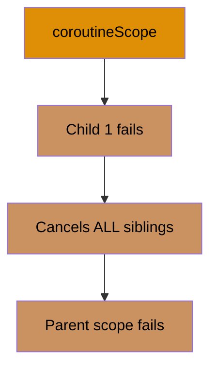

**Supervisor Isolation:**

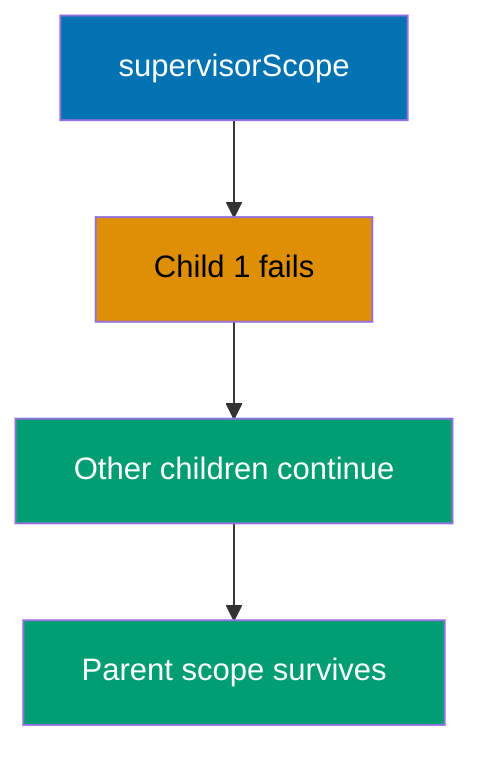

```kotlin
import kotlinx.coroutines.*

// Helper function that simulates network request
suspend fun fetchData(id: Int): String {
    // => Simulates network delay (100ms)
    delay(100)
    // => Conditional failure: id=2 triggers RuntimeException
    // => This models real-world scenario where some requests fail
    if (id == 2) {
        // => Throw exception for id=2 to demonstrate failure isolation
        throw RuntimeException("Failed to fetch $id")
    }
    // => Returns successful data for all other IDs
    // => Result format: "Data 1", "Data 3", etc.
    return "Data $id"
}

// Demonstrates regular coroutineScope behavior (fail-together semantics)
suspend fun processWithCoroutineScope() {
    // => Section header for console output clarity
    println("=== coroutineScope (all fail together) ===")

    // => Outer try-catch to capture scope-level failure
    // => coroutineScope propagates child exceptions to parent
    try {
        // => Creates structured concurrency scope
        // => Rule: if ANY child fails, ALL siblings cancelled
        // => Then exception propagates to parent (caught below)
        coroutineScope {
            // => Launch Child 1: fetch data with id=1
            // => This task has its own try-catch (defensive)
            launch {
                // => Local try-catch handles exceptions within this child
                // => But won't prevent scope-level cancellation
                try {
                    // => Suspends for ~100ms, returns "Data 1"
                    val data = fetchData(1)
                    // => data is "Data 1" (type: String)
                    // => Prints successfully BEFORE Child 2 fails
                    // => Output: Task 1: Data 1
                    println("Task 1: $data")
                } catch (e: Exception) {
                    // => Not reached in this example (id=1 succeeds)
                    println("Task 1 error: ${e.message}")
                }
            } // => Child 1 job completes successfully

            // => Launch Child 2: fetch data with id=2 (will fail)
            // => NO try-catch here, exception propagates to scope
            launch {
                // => Suspends for ~100ms, then THROWS RuntimeException
                // => Exception: "Failed to fetch 2"
                val data = fetchData(2)
                // => NEVER REACHED: exception thrown before assignment
                // => This line skipped due to exception propagation
                println("Task 2: $data")
            } // => Child 2 job fails, triggers scope cancellation

            // => Launch Child 3: fetch data with id=3
            // => This task will be CANCELLED mid-execution
            launch {
                // => Suspends for 200ms (longer than Child 2's failure)
                // => CANCELLED at ~100ms when Child 2 fails
                // => CancellationException thrown internally
                delay(200)
                // => NEVER REACHED: coroutine cancelled before this line
                // => fetchData(3) never called
                println("Task 3: ${fetchData(3)}")
            } // => Child 3 job cancelled (never completes)

            // => Execution flow:
            // => t=0ms: All 3 children launched concurrently
            // => t=100ms: Child 1 completes (prints "Task 1: Data 1")
            // => t=100ms: Child 2 throws exception
            // => t=100ms: Scope cancels Child 3 immediately
            // => t=100ms: Exception propagates to parent scope
        }
        // => NEVER REACHED: coroutineScope throws exception
        // => Control jumps to catch block below
    } catch (e: Exception) {
        // => Catches exception propagated from coroutineScope
        // => e is RuntimeException("Failed to fetch 2")
        // => e.message is "Failed to fetch 2"
        // => Output: Scope failed: Failed to fetch 2
        println("Scope failed: ${e.message}")
    }
    // => Function exits, all children terminated
    // => Result: 1 success, 1 failure, 1 cancellation
}

// Demonstrates supervisorScope behavior (independent failure handling)
suspend fun processWithSupervisorScope() {
    // => Section header for console output clarity
    println("\n=== supervisorScope (independent failures) ===")

    // => Creates supervisor scope for independent child lifecycle
    // => Rule: child failures do NOT cancel siblings
    // => Each child manages its own exceptions
    supervisorScope {
        // => Launch Child 1: fetch data with id=1
        // => Has try-catch for local error handling
        launch {
            // => Local try-catch for defensive programming
            // => Prevents uncaught exception in supervisor
            try {
                // => Suspends for ~100ms, returns "Data 1"
                val data = fetchData(1)
                // => data is "Data 1" (type: String)
                // => Output: Task 1: Data 1
                println("Task 1: $data")
            } catch (e: Exception) {
                // => Not reached in this example (id=1 succeeds)
                println("Task 1 error: ${e.message}")
            }
        } // => Child 1 completes successfully (t=100ms)

        // => Launch Child 2: fetch data with id=2 (will fail)
        // => MUST have try-catch in supervisorScope
        // => Uncaught exceptions in supervisor children crash the scope
        launch {
            // => Local try-catch REQUIRED for exception handling
            // => supervisorScope doesn't auto-catch child exceptions
            try {
                // => Suspends for ~100ms, then THROWS RuntimeException
                // => Exception: "Failed to fetch 2"
                val data = fetchData(2)
                // => NEVER REACHED: exception thrown before assignment
                println("Task 2: $data")
            } catch (e: Exception) {
                // => Catches exception locally (doesn't propagate)
                // => e is RuntimeException("Failed to fetch 2")
                // => e.message is "Failed to fetch 2"
                // => Output: Task 2 error: Failed to fetch 2
                println("Task 2 error: ${e.message}")
            }
        } // => Child 2 handles failure locally (t=100ms)

        // => Launch Child 3: fetch data with id=3
        // => Unlike coroutineScope, this continues DESPITE Child 2 failure
        launch {
            // => Suspends for 200ms (continues uninterrupted)
            // => NOT cancelled by Child 2's failure
            delay(200)
            // => REACHED: Child 3 runs to completion
            // => fetchData(3) suspends 100ms, returns "Data 3"
            // => Output: Task 3: Data 3
            println("Task 3: ${fetchData(3)}")
        } // => Child 3 completes successfully (t=300ms)

        // => Execution flow:
        // => t=0ms: All 3 children launched concurrently
        // => t=100ms: Child 1 completes (prints "Task 1: Data 1")
        // => t=100ms: Child 2 fails, caught locally (prints error)
        // => t=200ms: Child 3 continues (delay completes)
        // => t=300ms: Child 3 completes (prints "Task 3: Data 3")
        // => t=300ms: supervisorScope completes (all children done)
    }
    // => supervisorScope completed successfully (no propagation)
    // => All children finished (2 success, 1 handled failure)
    // => Output: Supervisor scope completed successfully
    println("Supervisor scope completed successfully")
}

fun main() = runBlocking {
    // => Run regular coroutineScope demonstration first
    // => Shows fail-together behavior (1 failure cancels all)
    // => Output: section header, "Task 1: Data 1", "Scope failed: ..."
    processWithCoroutineScope()

    // => Run supervisorScope demonstration second
    // => Shows independent failure handling
    // => Output: section header, all 3 task outputs, completion message
    processWithSupervisorScope()

    // => Final output comparison:
    // => coroutineScope: 1 success, 1 failure, 1 cancellation
    // => supervisorScope: 2 successes, 1 handled failure
}
```

**Key Takeaway**: Use supervisorScope when child coroutine failures should not cancel siblings, and wrap each child in try-catch to handle exceptions locally; essential for independent task orchestration where partial success has value.

**Why It Matters**: Microservices often fan out parallel requests (user data, permissions, preferences) where one failing should not abort others, yet coroutineScope's all-or-nothing semantics would cancel all work on any failure. SupervisorScope enables graceful degradation where partial results still provide value (show user profile even if preferences fail), critical for resilient production systems. This pattern prevents cascade failures in aggregation endpoints that combine multiple data sources, improving availability from 99% to 99.99% by isolating failures.

---

## Example 56: CoroutineContext and Job Hierarchy

CoroutineContext is an indexed set of elements (Job, Dispatcher, Name, ExceptionHandler) that define coroutine behavior. Understanding context composition enables advanced coroutine control including custom dispatchers, structured lifecycle management, and centralized error handling through job hierarchy.

**CoroutineContext Elements:**

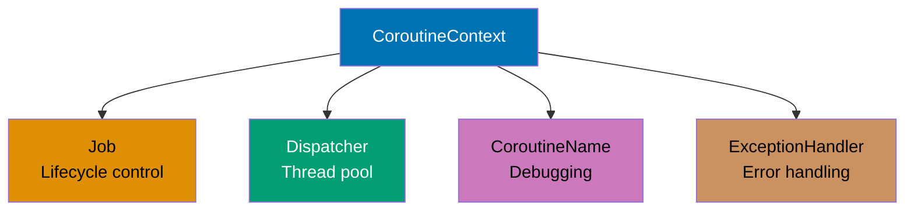

**Job Hierarchy:**

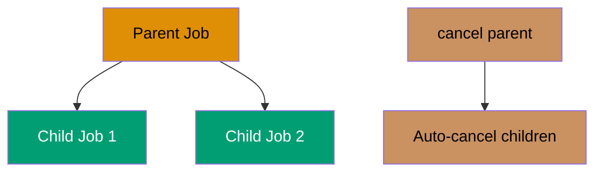

```kotlin
import kotlinx.coroutines.*
import kotlin.coroutines.coroutineContext

// Suspending function that inspects current coroutine's context
suspend fun inspectContext() {
    // => Access current coroutine context (available in suspend functions)
    // => coroutineContext is a compile-time intrinsic (not a regular variable)
    // => Returns: [JobImpl, Dispatchers.Default, CoroutineName(...), ExceptionHandler]
    // => Output: Context: [JobImpl@abc, Dispatchers.Default, ...]
    println("Context: $coroutineContext")

    // => Access Job element using indexed operator [Key]
    // => Job is CoroutineContext.Element with key Job
    // => Returns: JobImpl instance managing coroutine lifecycle
    // => Output: Job: JobImpl{Active}@abc (shows state and identity)
    println("Job: ${coroutineContext[Job]}")

    // => Access CoroutineDispatcher element from context
    // => Dispatcher determines which thread(s) execute the coroutine
    // => Returns: Dispatchers.Default (shared thread pool)
    // => Output: Dispatcher: Dispatchers.Default
    println("Dispatcher: ${coroutineContext[CoroutineDispatcher]}")

    // => Access CoroutineName element (if present in context)
    // => Used for debugging and logging (appears in thread names)
    // => Returns: CoroutineName("CustomCoroutine") or null
    // => Output: Name: CoroutineName(CustomCoroutine)
    println("Name: ${coroutineContext[CoroutineName]}")
}

fun main() = runBlocking {
    // === PART 1: Custom CoroutineContext Composition ===

    // => Create standalone Job (not attached to any coroutine yet)
    // => Job is a cancellable lifecycle handle
    // => State: Active (can have children attached)
    val jobElement = Job()

    // => Combine multiple context elements using + operator
    // => CoroutineContext uses set semantics (each key appears once)
    // => Later elements override earlier ones for same key
    // => Result: composite context with 4 elements
    val customContext = jobElement +
        // => Dispatchers.Default: shared thread pool for CPU work
        // => Optimized for compute-intensive tasks
        // => Thread count = CPU cores (typically)
        Dispatchers.Default +
        // => CoroutineName: appears in thread dumps and debugger
        // => Format: "DefaultDispatcher-worker-1 @CustomCoroutine#1"
        // => Helps trace coroutines in production logs
        CoroutineName("CustomCoroutine") +
        // => CoroutineExceptionHandler: catches uncaught exceptions
        // => Only works for launch (not async)
        // => Must be installed in root coroutine or CoroutineScope
        // => Lambda receives: CoroutineContext and Throwable
        CoroutineExceptionHandler { _, exception ->
            // => Called when unhandled exception occurs in this scope
            // => exception is Throwable (e.g., RuntimeException)
            // => Output: Caught: <exception message>
            println("Caught: ${exception.message}")
        }
    // => customContext now contains: Job + Dispatcher + Name + Handler

    // => Launch new coroutine with custom context
    // => Context elements override defaults from parent scope
    // => Coroutine inherits customContext elements
    launch(customContext) {
        // => Execute inspectContext() in this coroutine
        // => Will print all 4 context elements
        inspectContext()
        // => Output: Running in custom context
        println("Running in custom context")
    } // => Coroutine completes normally

    // => Wait for launched coroutine to finish
    // => Ensures console output appears before proceeding
    delay(100)

    // === PART 2: Job Hierarchy and Structured Cancellation ===

    // => Create parent Job explicitly (standalone, not from coroutine)
    // => This will be the root of a job hierarchy
    // => State: Active, isActive=true, children=[]
    val parentJob = Job()
    // => parentJob is JobImpl{Active}@xyz
    // => Output: Parent job: JobImpl{Active}@xyz
    println("Parent job: $parentJob")

    // => Launch child coroutine 1 with parentJob as context
    // => Child's Job has parentJob as parent (structured hierarchy)
    // => Child inherits: parent's lifecycle, cancellation propagation
    val child1 = launch(parentJob) {
        // => Repeat 5 times (i = 0, 1, 2, 3, 4)
        repeat(5) { i ->
            // => i is current iteration (0-based)
            // => Output: Child 1: 0, Child 1: 1, Child 1: 2
            println("Child 1: $i")
            // => Suspend for 200ms between iterations
            // => Total planned runtime: 5 * 200ms = 1000ms
            // => Will be cancelled at ~600ms (only 3 iterations)
            delay(200)
        }
    }
    // => child1 is Job instance (type: StandaloneCoroutine)
    // => child1.parent is parentJob
    // => parentJob.children now includes child1

    // => Launch child coroutine 2 with same parentJob
    // => Creates sibling relationship with child1 (shared parent)
    val child2 = launch(parentJob) {
        // => Repeat 5 times (i = 0, 1, 2, 3, 4)
        repeat(5) { i ->
            // => i is current iteration (0-based)
            // => Output: Child 2: 0, Child 2: 1
            println("Child 2: $i")
            // => Suspend for 250ms between iterations
            // => Total planned runtime: 5 * 250ms = 1250ms
            // => Will be cancelled at ~600ms (only 2-3 iterations)
            delay(250)
        }
    }
    // => child2 is Job instance (type: StandaloneCoroutine)
    // => child2.parent is parentJob
    // => parentJob.children now includes [child1, child2]

    // => Execution timeline so far:
    // => t=0ms: child1 starts, prints "Child 1: 0"
    // => t=0ms: child2 starts, prints "Child 2: 0"
    // => t=200ms: child1 prints "Child 1: 1"
    // => t=250ms: child2 prints "Child 2: 1"
    // => t=400ms: child1 prints "Child 1: 2"
    // => t=500ms: child2 prints "Child 2: 2"

    // => Wait 600ms to let children run partially
    // => Allows ~3 iterations of child1, ~2-3 iterations of child2
    delay(600)

    // => t=600ms: Both children still active (not completed)
    // => child1 completed ~3 iterations (out of 5)
    // => child2 completed ~2 iterations (out of 5)
    // => Output: Cancelling parent job...
    println("Cancelling parent job...")

    // => Cancel parent job (triggers structured cancellation)
    // => CRITICAL: Cancellation propagates to ALL children
    // => Algorithm: parent.cancel() -> child1.cancel() + child2.cancel()
    // => Children receive CancellationException internally
    parentJob.cancel()
    // => parentJob.isActive is now false
    // => parentJob.isCancelled is now true
    // => child1.isCancelled is now true (propagated)
    // => child2.isCancelled is now true (propagated)

    // => Wait for child1 to finish cancellation cleanup
    // => join() suspends until Job reaches terminal state
    // => Terminal states: Completed, Cancelled, or Failed
    // => child1 is in Cancelled state
    child1.join()
    // => child1.isCompleted is true (Cancelled is a completion state)

    // => Wait for child2 to finish cancellation cleanup
    // => Same behavior as child1.join()
    child2.join()
    // => child2.isCompleted is true (Cancelled state)

    // => Verify both children were cancelled (not completed normally)
    // => child1.isCancelled returns true (cancelled via parent)
    // => child2.isCancelled returns true (cancelled via parent)
    // => Output: All children cancelled: child1=true, child2=true
    println("All children cancelled: child1=${child1.isCancelled}, child2=${child2.isCancelled}")

    // => Key observation: Cancelling parent AUTOMATICALLY cancels children
    // => This is STRUCTURED CONCURRENCY: hierarchical lifecycle management
    // => No orphaned coroutines (leak-free by design)
    // => Compare to Java threads: must manually track and interrupt each thread

    // === Context Element Overriding Rules ===
    // => When combining contexts with +, later elements override earlier:
    // => (Job() + Job()) results in second Job replacing first
    // => (Dispatchers.IO + Dispatchers.Default) results in Default dispatcher
    // => Exception: Job has special parent-child semantics (doesn't override)

    // === Job Lifecycle States ===
    // => Job states: New -> Active -> Completing -> Completed/Cancelled/Failed
    // => isActive: true in Active and Completing states
    // => isCancelled: true in Cancelled state (terminal)
    // => isCompleted: true in any terminal state
}
```

**Key Takeaway**: CoroutineContext is a composite indexed set where elements combine via + operator; Job hierarchy enables automatic structured cancellation (parent.cancel() propagates to all children), preventing resource leaks.

**Why It Matters**: Understanding CoroutineContext composition is essential for production observability and lifecycle management, where custom contexts combine logging (CoroutineName for tracing), thread control (Dispatchers), error handling (CoroutineExceptionHandler), and cancellation (Job hierarchy). Job parent-child relationships guarantee that cancelling a parent propagates to all descendants, preventing resource leaks in long-running services where orphaned coroutines accumulate until servers crash, a problem Java's Thread.interrupt() can't solve reliably due to lack of structured lifecycle.

---

## Example 57: Exception Handling in Coroutines

Coroutine exception handling has distinct propagation rules: launch propagates exceptions upward to parent scope (caught by CoroutineExceptionHandler), async stores exceptions in Deferred until await() is called (requires try-catch), and supervisorScope isolates child failures. Understanding these mechanisms prevents silent failures and enables robust error handling in concurrent code.

**Exception Propagation Patterns:**

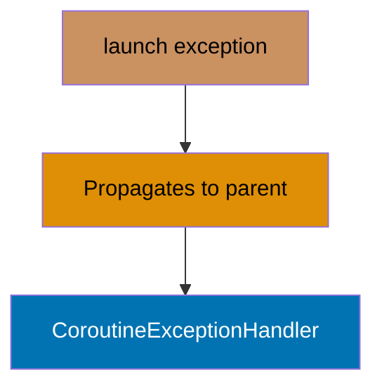

**Async Exception Storage:**

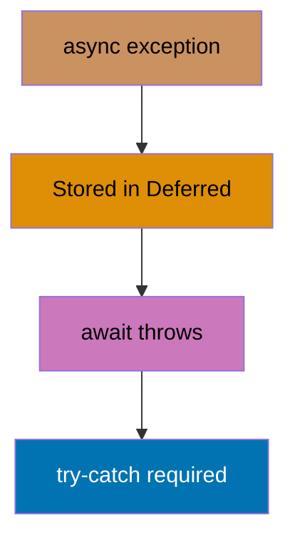

```kotlin
import kotlinx.coroutines.*

fun main() = runBlocking {
    // === PART 1: Exception in launch (upward propagation) ===

    // => Create CoroutineExceptionHandler for uncaught exceptions
    // => Handler receives CoroutineContext and Throwable
    // => CRITICAL: Only works for root coroutines or CoroutineScope
    // => NOT triggered for child coroutines (they propagate to parent)
    val exceptionHandler = CoroutineExceptionHandler { context, exception ->
        // => context is CoroutineContext of failing coroutine
        // => exception is Throwable (e.g., RuntimeException)
        // => Called when exception reaches top of hierarchy
        // => Output: Caught by handler: Exception in launch
        println("Caught by handler: ${exception.message}")
    }

    // => Create CoroutineScope with custom Job and exception handler
    // => Job() creates independent scope (not child of runBlocking)
    // => exceptionHandler catches unhandled exceptions in this scope
    val scope = CoroutineScope(Job() + exceptionHandler)
    // => scope is independent lifecycle (can outlive runBlocking)

    // => Launch coroutine in custom scope (will throw exception)
    // => launch is "fire-and-forget" builder (no return value)
    scope.launch {
        // => Throw RuntimeException immediately (no delay)
        // => Exception propagates upward to parent scope
        // => Parent scope has exceptionHandler, which catches it
        throw RuntimeException("Exception in launch")
    }
    // => Exception propagation flow:
    // => 1. RuntimeException thrown in launch
    // => 2. Propagates to parent scope (CoroutineScope)
    // => 3. Caught by exceptionHandler
    // => 4. Handler prints message

    // => Wait for exception handling to complete
    // => Ensures handler output appears before proceeding
    delay(100)

    // === PART 2: Exception in async (stored in Deferred) ===

    // => async builder returns Deferred<T> (future result)
    // => Unlike launch, exceptions are STORED, not propagated
    // => Exception thrown only when await() is called
    val deferred = async {
        // => Suspend for 50ms (simulates async work)
        delay(50)
        // => Throw RuntimeException after delay
        // => Exception is STORED in Deferred (not propagated yet)
        throw RuntimeException("Exception in async")
    }
    // => deferred is Deferred<Nothing> (type: CompletableDeferred)
    // => deferred.isActive is true (exception not thrown yet)
    // => Exception stored internally, waiting for await()

    // => Try-catch around await() to handle stored exception
    // => await() suspends until Deferred completes or fails
    try {
        // => Suspends for ~50ms, then exception thrown
        // => Stored RuntimeException re-thrown at await() call site
        deferred.await()
        // => NEVER REACHED: exception thrown before this line
    } catch (e: Exception) {
        // => Catches RuntimeException from await()
        // => e is RuntimeException("Exception in async")
        // => e.message is "Exception in async"
        // => Output: Caught from async: Exception in async
        println("Caught from async: ${e.message}")
    }
    // => Key difference: async exceptions require explicit handling at await()
    // => launch exceptions propagate automatically

    // === PART 3: supervisorScope with exception handling ===

    // => supervisorScope isolates child failures
    // => Unlike coroutineScope, child exception doesn't cancel siblings
    // => CRITICAL: Uncaught exceptions still crash the program
    // => Must handle exceptions in children or use handler
    supervisorScope {
        // => Launch child job 1 (will throw exception)
        val job1 = launch {
            // => Suspend for 100ms
            delay(100)
            // => Throw RuntimeException
            // => In supervisorScope, this crashes the coroutine
            // => BUT: siblings (job2) continue running
            throw RuntimeException("Job 1 failed")
        }
        // => job1 is Job instance (will fail at t=100ms)

        // => Launch child job 2 (continues despite job1 failure)
        val job2 = launch {
            // => Try-catch for cancellation detection
            // => supervisorScope doesn't cancel siblings on failure
            try {
                // => Suspend for 200ms (longer than job1)
                delay(200)
                // => REACHED: job2 runs to completion
                // => job1's failure doesn't cancel job2
                // => Output: Job 2 completed
                println("Job 2 completed")
            } catch (e: CancellationException) {
                // => NOT REACHED in this example
                // => Would catch if job2 was explicitly cancelled
                println("Job 2 cancelled")
            }
        }
        // => job2 is Job instance (completes at t=200ms)

        // => Wait for job1 to complete (or fail)
        // => join() suspends until job completes/fails/cancels
        // => job1 will fail with RuntimeException at t=100ms
        // => join() does NOT rethrow exception (use joinOrThrow for that)
        job1.join()
        // => job1.isCancelled is true (failed state)
        // => job1.isCompleted is true (terminal state)

        // => Wait for job2 to complete
        // => job2 runs to completion despite job1 failure
        job2.join()
        // => job2.isCancelled is false (completed normally)
        // => job2.isCompleted is true

        // => Key observation: supervisorScope allows partial success
        // => job1 fails, job2 completes, scope survives
    }
    // => supervisorScope completed (job2 success compensates job1 failure)

    // === PART 4: Try-catch inside coroutine (local handling) ===

    // => Launch coroutine with local exception handling
    // => Try-catch inside coroutine body catches exceptions locally
    // => Prevents propagation to parent scope
    launch {
        // => Local try-catch for exception containment
        try {
            // => Suspend for 50ms
            delay(50)
            // => Throw RuntimeException
            // => Caught by local catch block (doesn't propagate)
            throw RuntimeException("Caught locally")
        } catch (e: Exception) {
            // => Catches RuntimeException locally
            // => e is RuntimeException("Caught locally")
            // => e.message is "Caught locally"
            // => Output: Local catch: Caught locally
            println("Local catch: ${e.message}")
        }
        // => Coroutine completes normally (exception handled)
    }
    // => This pattern prevents exception propagation entirely
    // => Useful for operations that may fail but shouldn't cancel parent

    // === Exception Handling Patterns Summary ===
    // => 1. launch + CoroutineExceptionHandler: Centralized error handling
    // => 2. async + try-catch around await: Explicit error handling
    // => 3. supervisorScope: Independent child failures (partial success)
    // => 4. try-catch inside coroutine: Local containment (no propagation)

    // === Exception Propagation Rules ===
    // => launch: exception propagates UP to parent (until handler)
    // => async: exception stored in Deferred (await re-throws)
    // => coroutineScope: ANY child exception cancels ALL siblings
    // => supervisorScope: Child exceptions isolated (siblings continue)
    // => CancellationException: Special exception (not propagated, signals cancellation)

    // === CoroutineExceptionHandler Installation Rules ===
    // => Handler works ONLY on:
    // => 1. Root coroutines (launch at top level)
    // => 2. CoroutineScope context
    // => Handler does NOT work on:
    // => 1. Child coroutines (they propagate to parent)
    // => 2. async (exceptions stored in Deferred)
    // => 3. coroutines with local try-catch (already handled)

    // => Wait for all coroutines to finish
    // => Ensures all output appears before cleanup
    delay(500)

    // => Cancel custom scope to clean up resources
    // => scope.cancel() cancels all children and marks scope inactive
    scope.cancel()
    // => scope.isActive is now false
    // => All children cancelled (if any were still running)
}
```

**Key Takeaway**: launch propagates exceptions upward to parent (use CoroutineExceptionHandler at root); async stores exceptions in Deferred until await (wrap await in try-catch); supervisorScope isolates failures (siblings continue); local try-catch prevents propagation entirely.

**Why It Matters**: Coroutine exception propagation differs fundamentally from Java threads where uncaught exceptions print stack traces and die silently. Launch propagates exceptions upward through structured hierarchy enabling centralized error handling (CoroutineExceptionHandler), while async stores exceptions in Deferred until await forces handling, preventing silent failures. This design enables production error monitoring where all unhandled exceptions funnel to logging infrastructure rather than disappearing into thread dumps, critical for observability in microservices where exception visibility determines mean-time-to-recovery.

---

## Example 58: Reflection - KClass and Class Inspection

Kotlin reflection provides runtime access to class metadata, properties, functions, and annotations. The kotlin-reflect library enables frameworks to introspect types at runtime for dependency injection, ORM mapping, serialization, and testing without requiring compile-time knowledge of classes.

```kotlin
import kotlin.reflect.full.*
import kotlin.reflect.KClass

// Sample data class for reflection demonstration
data class User(
    // => Primary constructor parameter (also property)
    // => Immutable val property (no setter generated)
    val id: Int,
    // => Mutable var property (getter + setter generated)
    // => Reflection can distinguish val from var
    var name: String,
    // => Another immutable property
    val email: String
) {
    // Member function for reflection demo
    fun greet(): String = "Hello, $name!"
    // => Returns String, takes no parameters (except implicit 'this')
    // => Accessible via KClass.memberFunctions

    // Companion object for static-like members
    companion object {
        // => Compile-time constant (inlined by compiler)
        const val TABLE_NAME = "users"

        // => Factory function in companion (like static method)
        // => Returns new User instance with defaults
        fun create(name: String) = User(0, name, "")
    }
}

// Generic function to inspect any class at runtime
fun <T : Any> inspectClass(kClass: KClass<T>) {
    // => kClass is KClass<T> (type: KClass<User> when called with User::class)
    // => T : Any constraint excludes nullable types
    // => kClass.simpleName is "User" (simple name without package)
    // => Output: === Inspecting User ===
    println("=== Inspecting ${kClass.simpleName} ===")

    // ========== BASIC CLASS METADATA ==========

    // Qualified name includes package prefix
    // => kClass.qualifiedName is "User" (or "com.example.User" if packaged)
    // => Full JVM-style class identifier
    // => Output: Qualified name: User
    println("Qualified name: ${kClass.qualifiedName}")

    // Check if class is a data class
    // => kClass.isData is true (User is data class)
    // => Reflection can detect data class modifier
    // => Output: Is data class: true
    println("Is data class: ${kClass.isData}")

    // Check if class is abstract
    // => kClass.isAbstract is false (User is concrete class)
    // => Would be true for abstract classes or interfaces
    // => Output: Is abstract: false
    println("Is abstract: ${kClass.isAbstract}")

    // ========== PRIMARY CONSTRUCTOR INSPECTION ==========

    // Access primary constructor metadata
    // => kClass.primaryConstructor is KFunction<User> (constructor function)
    // => Nullable (classes without primary constructor return null)
    val constructor = kClass.primaryConstructor
    // => constructor is KFunction<User> (type: KFunction<User>)

    // => Output header for constructor parameters section
    println("\nPrimary constructor parameters:")

    // Iterate through constructor parameters
    // => constructor?.parameters is List<KParameter> or null
    // => Safe call (?.) handles null case gracefully
    constructor?.parameters?.forEach { param ->
        // => param is KParameter (single constructor parameter)
        // => param.name is "id", "name", or "email" (parameter name)
        // => param.type is KType representing parameter type
        // => param.isOptional is false (no default values in User constructor)
        // => Output for id: id: kotlin.Int (optional=false)
        // => Output for name: name: kotlin.String (optional=false)
        // => Output for email: email: kotlin.String (optional=false)
        println("  ${param.name}: ${param.type} (optional=${param.isOptional})")
    }

    // ========== PROPERTY INSPECTION ==========

    // => Output header for properties section
    println("\nMember properties:")

    // Iterate through all member properties
    // => kClass.memberProperties is Collection<KProperty1<T, *>>
    // => Includes all properties declared in class (val and var)
    kClass.memberProperties.forEach { prop ->
        // => prop is KProperty1<User, *> (property with receiver type User)
        // => prop.name is "id", "name", or "email"
        // => prop.returnType is KType (kotlin.Int or kotlin.String)
        // => Type check: prop is KMutableProperty<*> (true for var, false for val)
        // => Output for id: id: kotlin.Int (mutable=false)
        // => Output for name: name: kotlin.String (mutable=true)
        // => Output for email: email: kotlin.String (mutable=false)
        println("  ${prop.name}: ${prop.returnType} (mutable=${prop is kotlin.reflect.KMutableProperty<*>})")
    }

    // ========== FUNCTION INSPECTION ==========

    // => Output header for functions section
    println("\nMember functions:")

    // Iterate through all member functions
    // => kClass.memberFunctions is Collection<KFunction<*>>
    // => Includes declared functions + inherited (toString, equals, hashCode, etc.)
    kClass.memberFunctions.forEach { func ->
        // => func is KFunction<*> (function reference)
        // => func.parameters includes implicit 'this' as first parameter
        // => func.parameters[0] is the receiver (instance)

        // Drop 'this' parameter and format remaining params
        // => func.parameters.drop(1) removes receiver parameter
        // => For greet(): empty list (no explicit parameters)
        // => joinToString formats as "param1: Type1, param2: Type2"
        val params = func.parameters.drop(1)
            .joinToString { "${it.name}: ${it.type}" }
        // => params is "" for greet() (no parameters after dropping 'this')

        // => func.name is "greet", "toString", "equals", etc.
        // => func.returnType is KType (kotlin.String for greet)
        // => Output for greet: greet(): kotlin.String
        // => Output for toString: toString(): kotlin.String
        // => Output for equals: equals(other: kotlin.Any?): kotlin.Boolean
        println("  ${func.name}($params): ${func.returnType}")
    }

    // ========== COMPANION OBJECT INSPECTION ==========

    // Access companion object metadata
    // => kClass.companionObject is KClass<*>? (companion's KClass or null)
    // => null if class has no companion object
    val companion = kClass.companionObject
    // => companion is KClass<*> (type: KClass of companion object)

    // Check if companion exists before accessing
    if (companion != null) {
        // => Companion object found, inspect its members
        // => Output header for companion section
        println("\nCompanion object:")

        // Iterate through companion's properties
        // => companion.memberProperties is Collection<KProperty1<*, *>>
        companion.memberProperties.forEach { prop ->
            // => prop is KProperty1<*, *> (property reference)
            // => prop.name is "TABLE_NAME"
            // => prop.getter.call(companion) invokes getter reflectively
            // => Returns property value: "users" (type: String)
            // => Output: TABLE_NAME: users
            println("  ${prop.name}: ${prop.getter.call(companion)}")
        }
    }
    // => If no companion, this entire block skipped
}

fun main() {
    // ========== GET KCLASS REFERENCE ==========

    // Obtain KClass reference for User
    // => User::class is class reference operator (like Java's User.class)
    // => Returns KClass<User> (reflection metadata for User type)
    // => userClass is KClass<User> (type-safe class reference)
    val userClass = User::class

    // ========== INSPECT CLASS METADATA ==========

    // Call inspection function with User's KClass
    // => Passes KClass<User> to generic function
    // => Type parameter T inferred as User
    // => Prints all class metadata (see inspectClass output above)
    inspectClass(userClass)

    // ========== REFLECTIVE INSTANCE CREATION ==========

    // Access primary constructor
    // => userClass.primaryConstructor is KFunction<User>
    // => !! asserts non-null (User has primary constructor)
    val constructor = userClass.primaryConstructor!!
    // => constructor is KFunction<User> (type: KFunction<User>)

    // Create instance by calling constructor reflectively
    // => constructor.call(args...) invokes constructor with provided arguments
    // => Arguments: 1 (id), "Alice" (name), "alice@example.com" (email)
    // => Types must match constructor signature (Int, String, String)
    // => Returns User instance created at runtime
    val user = constructor.call(1, "Alice", "alice@example.com")
    // => user is User (type: User)
    // => user.id is 1, user.name is "Alice", user.email is "alice@example.com"

    // => Output: Created user: User(id=1, name=Alice, email=alice@example.com)
    println("\nCreated user: $user")

    // ========== REFLECTIVE PROPERTY ACCESS ==========

    // Find property by name
    // => userClass.memberProperties.find {...} searches property collection
    // => Predicate: it.name == "name" (matches property named "name")
    // => Returns KProperty1<User, *> or null if not found
    // => !! asserts non-null (we know "name" exists)
    val nameProp = userClass.memberProperties.find { it.name == "name" }!!
    // => nameProp is KProperty1<User, *> (type: KProperty1<User, *>)

    // Get property value reflectively
    // => nameProp.get(user) invokes getter on user instance
    // => Returns current value of name property
    // => Result: "Alice" (type: String)
    // => Output: Name via reflection: Alice
    println("Name via reflection: ${nameProp.get(user)}")

    // ========== REFLECTIVE FUNCTION INVOCATION ==========

    // Find function by name
    // => userClass.memberFunctions.find {...} searches function collection
    // => Predicate: it.name == "greet" (matches function named "greet")
    // => Returns KFunction<*> or null if not found
    // => !! asserts non-null (we know "greet" exists)
    val greetFunc = userClass.memberFunctions.find { it.name == "greet" }!!
    // => greetFunc is KFunction<*> (type: KFunction<*>)

    // Call function reflectively
    // => greetFunc.call(user) invokes function on user instance
    // => user is passed as implicit 'this' parameter
    // => Function executes: "Hello, $name!" with name="Alice"
    // => Returns "Hello, Alice!" (type: String)
    val greeting = greetFunc.call(user)
    // => greeting is "Hello, Alice!" (type: Any?, needs casting for type safety)

    // => Output: Greeting: Hello, Alice!
    println("Greeting: $greeting")
}
```

**Key Takeaway**: Kotlin reflection enables runtime class introspection including properties, functions, constructors, and companion objects with type-safe KClass API distinguishing mutable/immutable properties and detecting data classes.

**Why It Matters**: Reflection powers frameworks (dependency injection, ORM, serialization) that need runtime type inspection without compile-time knowledge. Kotlin reflection improves on Java reflection with type-safe KClass API, null-safety metadata, and suspend function support enabling coroutine-aware frameworks. Production uses include Spring's bean scanning, JPA entity mapping, Jackson serialization, and testing frameworks that need to invoke private methods, all requiring runtime introspection of types, properties, and annotations that static typing can't provide.

---

## Example 59: Reflection - Property Modification

Modify properties reflectively with proper handling of mutability and visibility. Kotlin reflection distinguishes between immutable (val) and mutable (var) properties through KMutableProperty, while isAccessible enables controlled access to private members for framework use cases like dependency injection and ORM.

```kotlin
import kotlin.reflect.full.*
import kotlin.reflect.jvm.isAccessible

// Configuration class demonstrating property visibility and mutability
class Config {
    // Public mutable property (var with public getter/setter)
    // => var declares mutable property (both getter and setter generated)
    // => public visibility (default in Kotlin)
    // => Backing field stores "localhost" value
    var host: String = "localhost"
    // => Accessible as KMutableProperty<*> via reflection
    // => Can be modified reflectively without isAccessible
    // => Reflection distinguishes var from val at runtime

    // Public immutable property (val with public getter only)
    // => val declares immutable property (getter only, no setter)
    // => public visibility (default in Kotlin)
    // => Backing field stores 8080 value (cannot change after initialization)
    val port: Int = 8080
    // => Accessible as KProperty<*> (not KMutableProperty)
    // => Cannot be modified (no setter generated by compiler)
    // => Type check (is KMutableProperty) returns false

    // Private mutable property (var with private getter/setter)
    // => private visibility modifier restricts access
    // => var allows mutation (both getter and setter generated)
    // => Not accessible from outside class without reflection
    private var secret: String = "secret123"
    // => Requires isAccessible = true for reflective access
    // => Hidden from external callers but accessible via reflection
    // => Demonstrates controlled encapsulation bypassing

    // Utility function to display current config
    // => Member function with direct access to all properties
    // => Can access private members (internal to class)
    fun printConfig() {
        // => Accesses all properties directly (internal access)
        // => $host, $port, $secret template strings
        // => Output: Config: host=..., port=..., secret=...
        println("Config: host=$host, port=$port, secret=$secret")
    }
}

fun main() {
    // ========== SETUP ==========

    // Create Config instance
    // => Config() calls default constructor (no parameters)
    // => Initializes all properties to default values
    val config = Config()
    // => config is Config (type: Config)
    // => config.host is "localhost", config.port is 8080
    // => config.secret is "secret123" (private, not directly accessible)

    // Get KClass reference for reflection
    // => config::class obtains KClass from instance
    // => Alternative: Config::class (from class reference)
    val configClass = config::class
    // => configClass is KClass<Config> (reflection metadata)
    // => Provides access to properties, functions, constructors

    // => Output header for demonstration
    println("=== Property Modification ===")

    // ========== MODIFY PUBLIC MUTABLE PROPERTY ==========

    // Find 'host' property and cast to mutable
    // => configClass.memberProperties returns Collection<KProperty1<Config, *>>
    // => find { it.name == "host" } searches by property name
    // => Returns KProperty1<Config, String> for host property
    // => as? KMutableProperty<*> performs safe cast to mutable type
    // => Cast succeeds for var properties, returns null for val properties
    val hostProp = configClass.memberProperties
        .find { it.name == "host" } as? kotlin.reflect.KMutableProperty<*>
    // => hostProp is KMutableProperty<*>? (nullable mutable property reference)
    // => Non-null because host is var (has setter)

    // Check if property is mutable before modifying
    // => if (hostProp != null) performs null-safety check
    // => True for var properties, false for val properties
    if (hostProp != null) {
        // => Property is mutable (var), proceed with modification
        // => hostProp is smart-cast to KMutableProperty<*> (non-null)

        // Read current value
        // => hostProp.get(config) calls getter reflectively
        // => config is receiver instance
        // => Invokes getter: config.getHost() internally
        // => Returns "localhost" (type: String, wrapped as Any?)
        val currentHost = hostProp.get(config)
        // => currentHost is "localhost" (type: Any?)
        // => Output: Current host: localhost
        println("Current host: $currentHost")

        // Modify property value reflectively
        // => hostProp.setter retrieves KMutableProperty.Setter reference
        // => Setter is KMutableProperty.Setter<*> (setter function reference)
        // => setter.call(receiver, value) invokes setter with arguments
        // => First argument: config (receiver instance)
        // => Second argument: "production.example.com" (new value)
        // => Internally calls: config.setHost("production.example.com")
        // => Updates backing field: config.host = "production.example.com"
        hostProp.setter.call(config, "production.example.com")
        // => config.host is now "production.example.com" (modified via reflection)

        // Read updated value
        // => hostProp.get(config) calls getter again
        // => Returns new value set above
        val updatedHost = hostProp.get(config)
        // => updatedHost is "production.example.com" (type: Any?)
        // => Output: Updated host: production.example.com
        println("Updated host: $updatedHost")
    }
    // => If hostProp is null (shouldn't happen for 'host'), skip modification
    // => This demonstrates safe handling of reflection operations

    // ========== ATTEMPT TO MODIFY IMMUTABLE PROPERTY ==========

    // Find 'port' property (immutable)
    // => configClass.memberProperties.find {...} searches properties
    // => Returns KProperty1<Config, *> (not mutable)
    val portProp = configClass.memberProperties.find { it.name == "port" }
    // => portProp is KProperty1<Config, *> (immutable property reference)

    // Check if property is mutable
    // => Type check: portProp is KMutableProperty<*>
    // => Returns false (val properties cannot be KMutableProperty)
    // => Output: port is mutable: false
    println("\nport is mutable: ${portProp is kotlin.reflect.KMutableProperty<*>}")
    // => Attempting to cast to KMutableProperty would fail
    // => Kotlin reflection prevents accidental val modification

    // ========== ACCESS PRIVATE MUTABLE PROPERTY ==========

    // Find 'secret' property (private)
    // => configClass.memberProperties includes private properties
    // => find {...} matches "secret" by name
    // => !! asserts non-null (we know "secret" exists)
    val secretProp = configClass.memberProperties.find { it.name == "secret" }!!
    // => secretProp is KProperty1<Config, *> (private property reference)

    // Enable reflective access to private property
    // => secretProp.isAccessible = true bypasses visibility checks
    // => Allows calling get/set on private members
    // => Required for private property access (would throw without this)
    secretProp.isAccessible = true

    // Read private property value
    // => secretProp.get(config) invokes private getter (allowed via isAccessible)
    // => Returns "secret123" (type: String)
    // => Output: Private secret (before): secret123
    println("\nPrivate secret (before): ${secretProp.get(config)}")

    // ========== MODIFY PRIVATE MUTABLE PROPERTY ==========

    // Cast to mutable property
    // => secretProp as? KMutableProperty<*> attempts safe cast
    // => Succeeds (secret is var, not val)
    val mutableSecretProp = secretProp as? kotlin.reflect.KMutableProperty<*>
    // => mutableSecretProp is KMutableProperty<*> (mutable reference)

    // Enable reflective access to private setter
    // => mutableSecretProp?.setter retrieves setter reference
    // => setter?.isAccessible = true bypasses visibility for setter
    // => Required to call private setter (would throw without this)
    mutableSecretProp?.setter?.isAccessible = true

    // Modify private property reflectively
    // => setter?.call(config, value) invokes private setter
    // => Arguments: config (receiver), "new_secret_456" (new value)
    // => Sets config.secret = "new_secret_456" via reflection
    // => Bypasses private visibility (enabled by isAccessible)
    mutableSecretProp?.setter?.call(config, "new_secret_456")

    // Read updated private property value
    // => secretProp.get(config) returns new value (getter still accessible)
    // => Result: "new_secret_456" (type: String)
    // => Output: Private secret (after): new_secret_456
    println("Private secret (after): ${secretProp.get(config)}")

    // ========== VERIFY ALL CHANGES ==========

    // Print final config state
    // => Calls printConfig() which accesses all properties internally
    // => Output: Config: host=production.example.com, port=8080, secret=new_secret_456
    config.printConfig()
}
```

**Key Takeaway**: Reflection enables property read/write with runtime mutability checks via KMutableProperty; use isAccessible for controlled private member access bypassing encapsulation for framework use cases.

**Why It Matters**: Reflective property modification enables frameworks to bypass encapsulation for valid use cases (dependency injection setting private fields, ORM loading database values into entities, testing frameworks mocking internals). Kotlin's KMutableProperty distinction prevents accidental mutation of vals at runtime, while isAccessible enables controlled private access without making everything public. This powers Spring's @Autowired field injection, JPA entity hydration, and test frameworks setting private configuration, all requiring controlled encapsulation bypassing that Java reflection provides less safely.

---

## Example 60: Annotations and Processing

Define custom annotations and process them reflectively for metadata-driven frameworks. Kotlin annotations support compile-time (SOURCE/BINARY retention) and runtime (RUNTIME retention) processing, enabling ORM mapping, serialization, dependency injection, and validation through declarative metadata instead of boilerplate code.

```kotlin
import kotlin.reflect.full.*

// ========== ANNOTATION DECLARATIONS ==========

// Class-level annotation for entity mapping
@Target(AnnotationTarget.CLASS)          // => Applies only to classes
@Retention(AnnotationRetention.RUNTIME)  // => Available at runtime via reflection
annotation class Entity(val tableName: String)
// => @Entity annotation stores database table name
// => Single parameter: tableName (required, no default)

// Property-level annotation for column mapping
@Target(AnnotationTarget.PROPERTY)       // => Applies only to properties
@Retention(AnnotationRetention.RUNTIME)  // => Available at runtime via reflection
annotation class Column(
    val name: String = "",               // => Column name (defaults to property name)
    val nullable: Boolean = false        // => Nullability constraint
)
// => @Column annotation maps properties to database columns
// => Two parameters: name (optional), nullable (defaults to false)

// Property-level annotation for primary key marker
@Target(AnnotationTarget.PROPERTY)       // => Applies only to properties
@Retention(AnnotationRetention.RUNTIME)  // => Available at runtime via reflection
annotation class PrimaryKey
// => Marker annotation (no parameters)
// => Indicates property is part of primary key

// ========== ANNOTATED DATA CLASS ==========

// User entity with ORM annotations
@Entity(tableName = "users")             // => Maps to 'users' table
data class User(
    // Property with multiple annotations
    @PrimaryKey                          // => Marks as primary key
    @Column(name = "user_id")            // => Maps to 'user_id' column
    val id: Int,
    // => id is primary key, non-nullable, custom column name

    @Column(name = "user_name", nullable = false)
    val name: String,
    // => name is non-nullable, custom column name 'user_name'

    @Column(nullable = true)             // => Explicitly allows NULL
    val email: String?
    // => email is nullable, column name defaults to 'email'
)

// ========== DDL GENERATION FUNCTION ==========

// Generate CREATE TABLE SQL from annotated class
fun generateDDL(kClass: kotlin.reflect.KClass<*>): String {
    // ========== EXTRACT ENTITY ANNOTATION ==========

    // Find @Entity annotation on class
    // => kClass.findAnnotation<Entity>() searches for Entity annotation
    // => Returns Entity instance or null if not found
    // => ?: error(...) throws if annotation missing
    val entity = kClass.findAnnotation<Entity>()
        ?: error("Class must have @Entity annotation")
    // => entity is Entity (annotation instance)

    // Extract table name from annotation
    // => entity.tableName accesses annotation parameter
    // => Result: "users" (type: String)
    val tableName = entity.tableName

    // Initialize collections for SQL generation
    // => mutableListOf<String>() for column definitions
    val columns = mutableListOf<String>()
    // => mutableListOf<String>() for primary key column names
    val primaryKeys = mutableListOf<String>()

    // ========== PROCESS PROPERTY ANNOTATIONS ==========

    // Iterate through all properties
    // => kClass.memberProperties is Collection<KProperty1<*, *>>
    kClass.memberProperties.forEach { prop ->
        // => prop is KProperty1<*, *> (property metadata)

        // Find @Column annotation on property
        // => prop.findAnnotation<Column>() searches for Column annotation
        // => Returns Column instance or null
        val columnAnnotation = prop.findAnnotation<Column>()

        // Process only properties with @Column annotation
        if (columnAnnotation != null) {
            // => Property has @Column annotation

            // ========== DETERMINE COLUMN NAME ==========

            // Use custom name or default to property name
            // => columnAnnotation.name is annotation parameter
            // => .ifEmpty { prop.name } uses property name if empty
            // => For id: "user_id" (custom), for email: "email" (default)
            val columnName = columnAnnotation.name.ifEmpty { prop.name }
            // => columnName is String (final column name)

            // ========== MAP KOTLIN TYPE TO SQL TYPE ==========

            // Map property type to SQL type
            // => prop.returnType.toString() returns type string
            // => "kotlin.Int" -> "INTEGER"
            // => "kotlin.String" or "kotlin.String?" -> "TEXT"
            // => else -> "TEXT" (fallback for unmapped types)
            val columnType = when (prop.returnType.toString()) {
                "kotlin.Int" -> "INTEGER"
                "kotlin.String", "kotlin.String?" -> "TEXT"
                else -> "TEXT"
            }
            // => columnType is String ("INTEGER" or "TEXT")

            // ========== DETERMINE NULLABILITY ==========

            // Check if column allows NULL
            // => columnAnnotation.nullable is annotation parameter
            // => prop.returnType.isMarkedNullable detects nullable types (String?)
            // => If either is true: allow NULL (empty string)
            // => If both false: add "NOT NULL" constraint
            val nullable = if (columnAnnotation.nullable || prop.returnType.isMarkedNullable) "" else "NOT NULL"
            // => nullable is String ("" or "NOT NULL")

            // ========== BUILD COLUMN DEFINITION ==========

            // Format: "column_name TYPE [NOT NULL]"
            // => "$columnName $columnType $nullable".trim() removes trailing space
            // => Example: "user_id INTEGER NOT NULL"
            // => Example: "email TEXT" (no NOT NULL)
            columns.add("  $columnName $columnType $nullable".trim())
            // => columns list grows with each property

            // ========== CHECK FOR PRIMARY KEY ==========

            // Find @PrimaryKey annotation on property
            // => prop.findAnnotation<PrimaryKey>() searches for PrimaryKey
            // => Returns PrimaryKey instance or null
            if (prop.findAnnotation<PrimaryKey>() != null) {
                // => Property is marked as primary key
                // => Add column name to primaryKeys list
                primaryKeys.add(columnName)
                // => primaryKeys list: ["user_id"]
            }
        }
        // => Properties without @Column annotation are skipped
    }

    // ========== BUILD DDL STRING ==========

    // Construct CREATE TABLE statement
    val ddl = buildString {
        // => buildString {...} constructs String via StringBuilder

        // Table header
        // => "CREATE TABLE users ("
        append("CREATE TABLE $tableName (\n")

        // Column definitions
        // => columns.joinToString(",\n") joins with comma + newline
        // => "  user_id INTEGER NOT NULL,\n  user_name TEXT NOT NULL,\n  email TEXT"
        append(columns.joinToString(",\n"))

        // Primary key constraint (if any)
        if (primaryKeys.isNotEmpty()) {
            // => primaryKeys list has entries
            // => ",\n  PRIMARY KEY (user_id)"
            append(",\n  PRIMARY KEY (${primaryKeys.joinToString(", ")})")
        }

        // Close statement
        // => "\n);"
        append("\n);")
    }
    // => ddl is complete SQL CREATE TABLE statement

    // Return generated DDL
    return ddl
}

// ========== MAIN DEMONSTRATION ==========

fun main() {
    // Get KClass reference for User
    val userClass = User::class
    // => userClass is KClass<User> (reflection metadata)

    // => Output header
    println("=== Annotation Processing ===")

    // ========== EXTRACT CLASS-LEVEL ANNOTATION ==========

    // Find @Entity annotation on User class
    // => userClass.findAnnotation<Entity>() searches class annotations
    // => Returns Entity instance with tableName="users"
    val entity = userClass.findAnnotation<Entity>()
    // => entity is Entity (annotation instance)

    // Display table name from annotation
    // => entity?.tableName accesses annotation parameter (safe call)
    // => Output: Table name: users
    println("Table name: ${entity?.tableName}")

    // ========== EXTRACT PROPERTY-LEVEL ANNOTATIONS ==========

    // => Output header for column mappings
    println("\nColumn mappings:")

    // Iterate through all properties
    // => userClass.memberProperties is Collection<KProperty1<User, *>>
    userClass.memberProperties.forEach { prop ->
        // => prop is KProperty1<User, *> (property metadata)

        // Find @Column annotation
        // => prop.findAnnotation<Column>() searches property annotations
        val column = prop.findAnnotation<Column>()
        // => column is Column instance or null

        // Find @PrimaryKey annotation
        // => prop.findAnnotation<PrimaryKey>() searches property annotations
        // => != null checks if annotation present
        val isPrimaryKey = prop.findAnnotation<PrimaryKey>() != null
        // => isPrimaryKey is Boolean (true for id, false for others)

        // Process only annotated properties
        if (column != null) {
            // => Property has @Column annotation

            // Determine column name
            // => column.name.ifEmpty { prop.name } uses property name if empty
            val columnName = column.name.ifEmpty { prop.name }
            // => columnName: "user_id", "user_name", or "email"

            // Build constraint markers
            // => mutableListOf<String>() for collecting constraints
            val markers = mutableListOf<String>()

            // Add PRIMARY KEY marker if applicable
            if (isPrimaryKey) markers.add("PRIMARY KEY")
            // => markers: ["PRIMARY KEY"] for id, [] for others

            // Add NOT NULL marker if applicable
            if (!column.nullable) markers.add("NOT NULL")
            // => markers: ["PRIMARY KEY", "NOT NULL"] for id
            // => markers: ["NOT NULL"] for name
            // => markers: [] for email (nullable=true)

            // Display mapping
            // => markers.joinToString(", ") formats as "PRIMARY KEY, NOT NULL"
            // => Output for id: id -> user_id PRIMARY KEY, NOT NULL
            // => Output for name: name -> user_name NOT NULL
            // => Output for email: email -> email
            println("  ${prop.name} -> $columnName ${markers.joinToString(", ")}")
        }
    }

    // ========== GENERATE DDL ==========

    // => Output header for generated DDL
    println("\nGenerated DDL:")

    // Generate and display CREATE TABLE statement
    // => generateDDL(userClass) processes annotations and builds SQL
    // => Output:
    // CREATE TABLE users (
    //   user_id INTEGER NOT NULL,
    //   user_name TEXT NOT NULL,
    //   email TEXT,
    //   PRIMARY KEY (user_id)
    // );
    println(generateDDL(userClass))
}
```

**Key Takeaway**: Annotations with RUNTIME retention enable metadata-driven code generation and framework features like ORM mapping by attaching declarative configuration to classes and properties accessible via reflection.

**Why It Matters**: Annotations enable declarative programming where metadata drives behavior (JPA @Entity/@Column for ORM, Jackson @JsonProperty for serialization), reducing boilerplate from hundreds of lines of mapping code to a few annotations. Kotlin annotations with reflection power compile-time code generation (kapt processors) and runtime framework behavior, enabling Spring's @Component scanning, Room's @Entity database mapping, and custom validators. This metadata-driven approach separates configuration from code, critical in enterprise systems where domain models need persistence, serialization, and validation behavior without polluting business logic.

---

## Example 61: Inline Reified Advanced - Type-Safe JSON Parsing

Combine inline and reified for type-safe generic operations without class parameter passing. Reified type parameters preserve generic type information at runtime by inlining function bytecode at call sites, eliminating Java's type erasure limitation that forces explicit Class<T> parameter passing in generic APIs.

```kotlin
import kotlin.reflect.KClass

// Simulated JSON parser (models library-level parsing)
object JsonParser {
    // => Generic parse function requiring explicit KClass parameter
    // => This simulates how non-reified libraries (Gson, Jackson) work
    // => T : Any constraint ensures non-nullable type parameter
    fun <T : Any> parse(json: String, clazz: KClass<T>): T {
        // => Type information passed explicitly via clazz parameter
        // => Simplified parsing based on class name (real parsers use reflection)
        // => when expression matches class name to return typed instances
        return when (clazz.simpleName) {
            // => Returns User instance cast to T
            // => as T needed because when returns different types per branch
            "User" -> User(1, "Alice", "alice@example.com") as T
            // => Returns Product instance cast to T
            // => Price stored as Double (999.99)
            "Product" -> Product(100, "Laptop", 999.99) as T
            // => Returns Order instance cast to T
            // => items is List<Int> with 3 elements
            "Order" -> Order(1, listOf(1, 2, 3)) as T
            // => error() throws IllegalStateException for unknown types
            // => Fails fast instead of returning null or wrong type
            else -> error("Unknown type: ${clazz.simpleName}")
        }                                    // => Type-safe casting preserves generic type T
    }
}

// Data classes for demonstration (model domain objects)
// => User represents authentication/profile entity
data class User(val id: Int, val name: String, val email: String)
// => Product represents catalog/inventory item
data class Product(val id: Int, val name: String, val price: Double)
// => Order represents transaction with item references
data class Order(val id: Int, val items: List<Int>)

// Generic function without reified (verbose API - Java-style)
// => This demonstrates the PROBLEM that reified solves
// => Requires caller to pass both json AND class parameter
// => T : Any ensures non-nullable type parameter
fun <T : Any> parseJsonVerbose(json: String, clazz: KClass<T>): T {
    // => clazz.simpleName is "User", "Product", or "Order"
    // => Prints class name for demonstration
    println("Parsing with explicit class: ${clazz.simpleName}")
    // => Delegates to JsonParser.parse with explicit class parameter
    // => Caller must provide KClass<T> manually (verbose)
    // => This is how Gson/Jackson work: gson.fromJson(json, User::class.java)
    return JsonParser.parse(json, clazz)     // => Requires class parameter (API friction)
}

// Generic function with reified (clean API - Kotlin-style)
// => This demonstrates the SOLUTION that reified provides
// => inline modifier required for reified to work
// => reified T preserves type information at runtime
// => Caller only passes json, type inferred from variable
inline fun <reified T : Any> parseJson(json: String): T {
    // => T::class available ONLY because of reified modifier
    // => Without reified, T::class would cause compile error
    // => T::class.simpleName accesses runtime type information
    println("Parsing with reified: ${T::class.simpleName}")
    // => T::class obtained from reified type parameter
    // => Compiler inlines this function and substitutes concrete type
    // => At call site: parseJson<User>("{...}") becomes JsonParser.parse("{...}", User::class)
    return JsonParser.parse(json, T::class)  // => T::class available due to reified
}

// Reified for runtime type checking (solves type erasure for is checks)
// => inline required for reified to preserve type at runtime
// => Generic T without Any constraint (allows nullable types)
inline fun <reified T> isType(value: Any): Boolean {
    // => value is T performs runtime type check
    // => Without reified, this would fail (type erased at runtime)
    // => With reified, compiler inlines function and uses concrete type
    // => Example: isType<String>("hello") becomes "hello" is String
    return value is T                        // => Type check with reified (no erasure)
}

// Reified for collection filtering by type
// => inline required for reified type preservation
// => Returns List<T> containing only elements of type T
inline fun <reified T> filterByType(items: List<Any>): List<T> {
    // => filterIsInstance<T>() filters list to only T instances
    // => Internally uses is T check (requires reified)
    // => Returns new list with type-safe elements
    // => Without reified, filterIsInstance wouldn't compile
    return items.filterIsInstance<T>()       // => Type-safe filtering (reified enables this)
}

fun main() {
    // => Section header for demonstration clarity
    println("=== Reified Type Parameters ===\n")

    // Verbose way (must pass class) - demonstrates Java-style API
    // => Must explicitly pass User::class as second parameter
    // => This is how non-reified generics work (Gson, Jackson)
    // => Verbose and error-prone (easy to mismatch type and class)
    val user1 = parseJsonVerbose("{...}", User::class)
    // => user1 is User(id=1, name="Alice", email="alice@example.com")
    // => Prints full data class toString representation
    // => Output: User (verbose): User(id=1, name=Alice, email=alice@example.com)
    println("User (verbose): $user1")        // => Output: User(id=1, name=Alice, email=alice@example.com)

    // Clean way (type inferred) - demonstrates Kotlin reified API
    // => Type parameter T inferred from variable type User
    // => Compiler converts to: JsonParser.parse("{...}", User::class)
    // => No manual class passing, cleaner API
    val user2: User = parseJson("{...}")     // => Type parameter inferred from variable type
    // => Type parameter T inferred from variable type Product
    // => product declared with explicit type for inference
    val product: Product = parseJson("{...}")
    // => Type parameter T inferred from variable type Order
    // => order declared with explicit type for inference
    val order: Order = parseJson("{...}")

    // => user2 is User(id=1, name="Alice", email="alice@example.com")
    // => Same result as user1 but cleaner API
    // => Output: User (reified): User(id=1, name=Alice, email=alice@example.com)
    println("User (reified): $user2")        // => Output: User(id=1, name=Alice, ...)
    // => product is Product(id=100, name="Laptop", price=999.99)
    // => price is Double (999.99)
    // => Output: Product: Product(id=100, name=Laptop, price=999.99)
    println("Product: $product")             // => Output: Product(id=100, name=Laptop, price=999.99)
    // => order is Order(id=1, items=[1, 2, 3])
    // => items is List<Int> with 3 elements
    // => Output: Order: Order(id=1, items=[1, 2, 3])
    println("Order: $order")                 // => Output: Order(id=1, items=[1, 2, 3])

    // Type checking with reified (demonstrates runtime type inspection)
    // => Section header for type checking demonstration
    println("\n=== Type Checking ===")
    // => value has compile-time type Any (loses specific type)
    // => Runtime type is String (actual value "Hello, Kotlin")
    val value: Any = "Hello, Kotlin"
    // => isType<String>(value) inlined to: value is String
    // => Runtime check returns true (value is String)
    // => Output: Is String: true
    println("Is String: ${isType<String>(value)}")
                                             // => Output: Is String: true
    // => isType<Int>(value) inlined to: value is Int
    // => Runtime check returns false (value is String, not Int)
    // => Output: Is Int: false
    println("Is Int: ${isType<Int>(value)}")
                                             // => Output: Is Int: false

    // Collection filtering by type (demonstrates type-safe filtering)
    // => Section header for filtering demonstration
    println("\n=== Type Filtering ===")
    // => mixed is List<Any> with heterogeneous elements
    // => Contains: Int (1), String ("two"), Double (3.0), String ("four"), Int (5), User
    // => Compile-time type List<Any> loses element type information
    val mixed: List<Any> = listOf(1, "two", 3.0, "four", 5, User(2, "Bob", "bob@example.com"))

    // => filterByType<String> extracts only String elements
    // => Inlined to: mixed.filterIsInstance<String>()
    // => Returns List<String> with 2 elements: ["two", "four"]
    val strings = filterByType<String>(mixed)
    // => filterByType<Int> extracts only Int elements
    // => Skips Double (3.0) because Int =/= Double in Kotlin
    // => Returns List<Int> with 2 elements: [1, 5]
    val numbers = filterByType<Int>(mixed)
    // => filterByType<User> extracts only User elements
    // => Returns List<User> with 1 element: [User(2, "Bob", ...)]
    val users = filterByType<User>(mixed)

    // => strings is ["two", "four"] (List<String> with 2 elements)
    // => Type-safe list, no casting required
    // => Output: Strings: [two, four]
    println("Strings: $strings")             // => Output: Strings: [two, four]
    // => numbers is [1, 5] (List<Int> with 2 elements)
    // => Double 3.0 filtered out (not Int)
    // => Output: Numbers: [1, 5]
    println("Numbers: $numbers")             // => Output: Numbers: [1, 5]
    // => users is [User(id=2, name="Bob", email="bob@example.com")]
    // => List<User> with 1 element
    // => Output: Users: [User(id=2, name=Bob, email=bob@example.com)]
    println("Users: $users")                 // => Output: Users: [User(id=2, name=Bob, ...)]
}
```

**Key Takeaway**: Reified type parameters eliminate explicit class passing for cleaner generic APIs; enable runtime type checks and filtering without reflection overhead.

**Why It Matters**: Reified type parameters solve Java's type erasure limitation where generic type information disappears at runtime, forcing developers to pass Class<T> parameters explicitly (gson.fromJson(json, User.class)) cluttering APIs. Kotlin's inline functions with reified types enable clean generic APIs (fromJson<User>(json)) by embedding type information at call sites, making libraries like Gson, Retrofit, and Koin dramatically more ergonomic. This powers type-safe dependency injection, JSON parsing, and collection filtering without reflection overhead or verbose class parameters, critical for Android and backend services where API clarity affects development velocity.

---

## Example 62: Multiplatform Common Declarations

Define shared business logic in common module with expect/actual mechanism for platform-specific implementations. The expect/actual pattern provides compile-time verified platform abstractions, ensuring all platforms implement required platform-specific functionality while maximizing code sharing for business logic.

```kotlin
// ===== commonMain/Platform.kt =====
// => expect declares platform-specific API contract
// => Each platform MUST provide actual implementation or compilation fails
// => This is compile-time contract, not runtime dependency injection
expect class PlatformLogger() {
    // => log signature declared but not implemented in common
    // => Each platform provides implementation using native logging APIs
    // => Signature must match exactly in actual implementations
    fun log(message: String)                 // => Platform-specific implementation (println/console.log/NSLog)
}

// => expect function for platform-specific timestamp
// => Returns Long (milliseconds since epoch on most platforms)
// => JVM uses System.currentTimeMillis(), JS uses Date.now(), Native varies
expect fun getCurrentTimestamp(): Long       // => Platform-specific time (varies by platform APIs)

// ===== commonMain/UserService.kt =====
// => Shared business logic (works on ALL platforms)
// => This class compiled once and reused across JVM/JS/Native targets
// => logger dependency injected (platform-specific implementation)
class UserService(private val logger: PlatformLogger) {
    // => createUser contains shared business logic (no platform specifics)
    // => Uses expect declarations (getCurrentTimestamp, logger.log) for platform needs
    // => Compiler ensures all platforms provide actual implementations
    fun createUser(name: String, email: String): User {
        // => getCurrentTimestamp() resolves to platform-specific actual at compile time
        // => JVM: System.currentTimeMillis(), JS: Date.now().toLong()
        // => timestamp is Long (milliseconds since epoch)
        val timestamp = getCurrentTimestamp()
        // => logger.log() calls platform-specific actual implementation
        // => JVM: println, JS: console.log, Native: platform-specific logging
        // => Message format: "Creating user: Alice at 1609459200000"
        logger.log("Creating user: $name at $timestamp")
                                             // => Uses platform-specific logging (println/console.log)
        // => Returns User with platform-specific timestamp
        // => Data class instantiation (shared code, no platform specifics)
        return User(name, email, timestamp)
    }

    // => validateEmail is pure shared logic (no platform-specific code)
    // => Same validation rules across all platforms
    // => Uses Kotlin stdlib (available on all platforms)
    fun validateEmail(email: String): Boolean {
        // => email.contains("@") is simplified validation (production uses regex)
        // => Kotlin String API available on all platforms
        // => isValid is Boolean (true if "@" found, false otherwise)
        val isValid = email.contains("@")    // => Shared validation logic (no platform code)
        // => Logs validation result using platform-specific logger
        // => Message format: "Email validation: alice@example.com -> true"
        logger.log("Email validation: $email -> $isValid")
        // => Returns validation result (Boolean)
        return isValid
    }
}

// => Shared data class (works on ALL platforms)
// => Compiled to JVM class, JS prototype, Native struct
// => name and email are String (mapped to platform-native strings)
// => createdAt is Long (mapped to platform-native 64-bit integer)
data class User(val name: String, val email: String, val createdAt: Long)

// ===== jvmMain/Platform.kt =====
// => actual provides JVM-specific implementation for expect declaration
// => Compiler verifies signature matches expect declaration exactly
// => This code only compiled for JVM targets (not JS/Native)
actual class PlatformLogger {
    // => actual implements log using JVM-specific println
    // => actual keyword required to match expect declaration
    // => Signature MUST match expect (fun log(message: String))
    actual fun log(message: String) {
        // => System.currentTimeMillis() is JVM-specific (not available on JS/Native)
        // => Returns Long (milliseconds since January 1, 1970 UTC)
        // => Prefix "[JVM]" identifies platform in multi-platform apps
        // => Output format: "[JVM] 1609459200000: Creating user: Alice at 1609459200000"
        println("[JVM] ${System.currentTimeMillis()}: $message")
                                             // => JVM implementation using println (stdout)
    }
}

// => actual function provides JVM-specific timestamp
// => Compiler verifies return type matches expect (Long)
// => This code only compiled for JVM targets
actual fun getCurrentTimestamp(): Long {
    // => System.currentTimeMillis() returns milliseconds since epoch
    // => Standard JVM API available in java.lang.System
    // => Returns Long (e.g., 1609459200000 for 2021-01-01 00:00:00 UTC)
    return System.currentTimeMillis()        // => JVM time implementation (milliseconds since epoch)
}

// ===== jsMain/Platform.kt =====
// => Commented out because example focuses on JVM
// => In real multiplatform projects, this file exists in jsMain source set
// => actual class PlatformLogger {
//     // => JS implementation uses console.log (browser/Node.js API)
//     // => Date.now() is JavaScript standard API (returns milliseconds)
//     actual fun log(message: String) {
//         // => console.log() outputs to browser console or Node.js stdout
//         // => Date.now() returns milliseconds since epoch (same as Java)
//         // => Prefix "[JS]" identifies JavaScript platform
//         console.log("[JS] ${Date.now()}: $message")
//                                          // => JS implementation using console.log (browser/Node.js)
//     }
// }
//
// => JS timestamp implementation
// actual fun getCurrentTimestamp(): Long {
//     // => Date.now() returns Double in Kotlin/JS (JavaScript Number)
//     // => .toLong() converts Double to Long (platform interop)
//     // => Returns milliseconds since epoch (same as JVM)
//     return Date.now().toLong()           // => JS time implementation (Date.now() API)
// }

// ===== nativeMain/Platform.kt =====
// => Commented out because example focuses on JVM
// => In real multiplatform projects, this file exists in nativeMain source set
// => Native targets: iOS, macOS, Linux, Windows (via Kotlin/Native)
// actual class PlatformLogger {
//     actual fun log(message: String) {
//         // => println maps to platform-specific output (NSLog on iOS, stdout on Linux)
//         // => getTimeMillis() is platform-specific native function
//         // => Prefix "[NATIVE]" identifies native platform (iOS/macOS/Linux)
//         println("[NATIVE] ${getTimeMillis()}: $message")
//                                          // => Native implementation (platform-specific println)
//     }
// }
//
// => Native timestamp implementation
// actual fun getCurrentTimestamp(): Long {
//     // => getTimeMillis() is native platform function (varies by target)
//     // => iOS: CFAbsoluteTimeGetCurrent(), Linux: gettimeofday(), etc.
//     // => Returns milliseconds since epoch (normalized across platforms)
//     return getTimeMillis()               // => Native time implementation (varies by target)
// }

// ===== Usage (works on all platforms) =====
// => main function uses shared and platform-specific code
// => This code compiles to JVM, JS, or Native depending on target
// => Business logic identical across platforms (only platform APIs differ)
fun main() {
    // => PlatformLogger() resolves to platform-specific actual at compile time
    // => JVM: creates JVMMain version (uses println)
    // => JS: creates jsMain version (uses console.log)
    // => Native: creates nativeMain version (uses platform-specific logging)
    val logger = PlatformLogger()            // => Resolved to platform-specific impl (JVM/JS/Native)
    // => UserService is shared code (defined in commonMain)
    // => logger injected as dependency (platform-specific implementation)
    // => service is UserService instance (same class on all platforms)
    val service = UserService(logger)

    // => createUser calls shared business logic
    // => Internally calls getCurrentTimestamp() (platform-specific actual)
    // => Internally calls logger.log() (platform-specific actual)
    // => Returns User with platform-specific timestamp
    val user = service.createUser("Alice", "alice@example.com")
                                             // => Shared logic, platform-specific logging (println/console.log)
    // => user is User(name="Alice", email="alice@example.com", createdAt=<timestamp>)
    // => toString() from data class (auto-generated)
    // => Output: Created: User(name=Alice, email=alice@example.com, createdAt=1609459200000)
    println("Created: $user")

    // => validateEmail calls shared validation logic
    // => email="invalid" contains no "@" character
    // => isValid is false
    val isValid = service.validateEmail("invalid")
    // => isValid is false (no "@" in "invalid")
    // => Output: Email valid: false
    println("Email valid: $isValid")         // => Output: Email valid: false
}
```

**Key Takeaway**: Common modules define shared business logic with expect declarations; platform modules provide actual implementations verified at compile time.

**Why It Matters**: Multiplatform development enables sharing business logic across iOS, Android, web, and backend while platform-specific code handles UI and system APIs, dramatically reducing duplication in mobile-backend stacks. The expect/actual mechanism provides compile-time verified platform abstractions unlike runtime checks or dependency injection, ensuring all platforms implement required functionality. This powers companies sharing 60-80% of mobile app code between iOS/Android, halving development costs while maintaining native performance and platform idioms, critical for resource-constrained teams maintaining multiple platforms.

---

## Example 63: Gradle Kotlin DSL Configuration

Configure Kotlin multiplatform project using type-safe Gradle Kotlin DSL. Kotlin DSL provides compile-time verification, IDE autocomplete, and refactoring support for build scripts, catching configuration errors before CI runs unlike Groovy DSL which fails only at runtime.

```kotlin
// ===== build.gradle.kts =====
// => .kts extension indicates Kotlin DSL (vs .gradle for Groovy)
// => This file is compiled as Kotlin code, enabling type safety
// => IDE provides autocomplete for all DSL methods and properties

// => plugins block declares Gradle plugins with versions
// => kotlin() is type-safe function (compile error if typo)
// => Groovy equivalent: id 'org.jetbrains.kotlin.multiplatform' version '1.9.21'
plugins {
    // => Multiplatform plugin enables cross-platform compilation
    // => version "1.9.21" locks Kotlin compiler version
    // => Type-safe: IDE autocompletes plugin IDs and validates versions
    kotlin("multiplatform") version "1.9.21"
    // => Serialization plugin for kotlinx.serialization support
    // => Generates serializers at compile time (no reflection)
    // => Required for @Serializable annotation to work
    kotlin("plugin.serialization") version "1.9.21"
}

// => repositories block declares where to download dependencies
// => Type-safe: mavenCentral() is function (not string like Groovy)
repositories {
    // => mavenCentral() adds Maven Central repository
    // => Primary source for Kotlin/JVM libraries
    // => URL: https://repo1.maven.org/maven2/
    mavenCentral()                           // => Central repository (Maven Central)
}

// => kotlin block configures multiplatform targets and source sets
// => Type-safe DSL: IDE autocompletes targets (jvm, js, linuxX64, etc.)
// => All nested blocks type-checked at compile time
kotlin {
    // JVM target with Java compatibility
    // => jvm() declares JVM compilation target
    // => Creates build tasks: jvmJar, jvmTest, compileKotlinJvm
    // => Source code from jvmMain/ and commonMain/ compiled to JVM bytecode
    jvm {
        // => compilations.all {} configures all JVM compilations (main + test)
        // => Applies settings to both jvmMain and jvmTest
        compilations.all {
            // => kotlinOptions configures Kotlin compiler options
            // => jvmTarget = "17" targets JVM 17 bytecode
            // => Ensures compiled .class files compatible with Java 17+
            kotlinOptions.jvmTarget = "17"   // => Target JVM 17 (bytecode version 61)
        }
        // => withJava() enables Java source compilation alongside Kotlin
        // => Allows mixing .java and .kt files in jvmMain/
        // => Java files compiled with javac, Kotlin with kotlinc
        withJava()                           // => Include Java sources (mixed projects)
        // => testRuns["test"] configures test execution
        // => executionTask accesses underlying Gradle Test task
        testRuns["test"].executionTask.configure {
            // => useJUnitPlatform() enables JUnit 5 (Jupiter)
            // => Without this, uses JUnit 4 (vintage) by default
            // => Required for @Test, @BeforeEach, etc. annotations
            useJUnitPlatform()               // => Use JUnit 5 (not JUnit 4)
        }
    }

    // JavaScript target for browser
    // => js(IR) declares JavaScript compilation with IR backend
    // => IR (Intermediate Representation) is modern compiler backend
    // => Replaces legacy backend (deprecated since Kotlin 1.8)
    // => Generates optimized JavaScript code
    js(IR) {                                 // => Use IR compiler backend (not legacy)
        // => browser {} configures browser-specific settings
        // => Enables webpack bundling and browser testing
        // => Creates tasks: jsBrowserWebpack, jsBrowserTest
        browser {
            // => commonWebpackConfig {} customizes webpack bundling
            // => Webpack bundles all JS modules into single file
            commonWebpackConfig {
                // => cssSupport {} enables CSS module loading
                // => Allows import './styles.css' in Kotlin/JS code
                cssSupport {
                    // => enabled.set(true) activates CSS processing
                    // => Property-based configuration (Gradle convention)
                    // => Webpack includes css-loader and style-loader
                    enabled.set(true)        // => Enable CSS support (webpack loaders)
                }
            }
            // => testTask {} configures browser-based testing
            // => Uses Karma test runner for browser tests
            testTask {
                // => useKarma {} enables Karma test framework
                // => Karma runs tests in real browsers
                useKarma {
                    // => useChromeHeadless() runs tests in headless Chrome
                    // => No GUI, suitable for CI environments
                    // => Alternative: useFirefox(), useChrome()
                    useChromeHeadless()      // => Browser testing (headless Chrome)
                }
            }
        }
        // => binaries.executable() generates runnable JS file
        // => Creates .js file with main() function entry point
        // => Output: build/js/packages/<project>/kotlin/<project>.js
        binaries.executable()                // => Generate executable JS (not library)
    }

    // Native targets
    // => linuxX64() declares Linux x86-64 compilation target
    // => Creates tasks: linuxX64MainKlibrary, linkDebugExecutableLinuxX64
    // => Compiles to native machine code (no JVM/JS runtime)
    linuxX64()                               // => Linux x64 native target
    // => macosArm64() declares macOS ARM64 target (Apple Silicon M1/M2)
    // => Compiles to ARM64 native code for Apple Silicon Macs
    // => Use macosX64() for Intel-based Macs
    macosArm64()                             // => macOS ARM64 (Apple Silicon M1/M2/M3)
    // => mingwX64() declares Windows MinGW x64 target
    // => MinGW provides GCC toolchain for Windows
    // => Compiles to .exe for Windows x64 systems
    mingwX64()                               // => Windows MinGW x64 (GCC toolchain)

    // => sourceSets {} configures source directories and dependencies
    // => Each target has corresponding source sets (commonMain, jvmMain, etc.)
    // => Type-safe: IDE autocompletes source set names
    sourceSets {
        // Common source set (all platforms)
        // => commonMain contains code shared across ALL platforms
        // => by getting retrieves predefined source set
        // => Gradle Kotlin DSL delegates to getter (not string key)
        val commonMain by getting {
            // => dependencies {} declares libraries for commonMain
            // => implementation() adds compile + runtime dependency
            // => Multiplatform libraries work on all targets
            dependencies {
                // => kotlinx-coroutines-core is multiplatform library
                // => Provides suspend, launch, async on all platforms
                // => Version 1.7.3 locked (compatible with Kotlin 1.9.21)
                implementation("org.jetbrains.kotlinx:kotlinx-coroutines-core:1.7.3")
                // => kotlinx-serialization-json is multiplatform library
                // => Provides @Serializable, Json.encodeToString(), etc.
                // => Version 1.6.0 compatible with serialization plugin 1.9.21
                implementation("org.jetbrains.kotlinx:kotlinx-serialization-json:1.6.0")
            }                                // => Multiplatform dependencies (work on all targets)
        }

        // => commonTest contains test code shared across platforms
        // => by getting retrieves predefined test source set
        val commonTest by getting {
            // => dependencies for test code
            dependencies {
                // => kotlin("test") is shorthand for kotlin-test dependency
                // => Provides expect/actual test APIs (@Test, assertEquals, etc.)
                // => Resolves to platform-specific test libraries automatically
                implementation(kotlin("test"))
            }
        }

        // JVM source set
        // => jvmMain contains JVM-specific code
        // => Files here only compiled for JVM target (not JS/Native)
        // => Can use Java stdlib and JVM-only libraries
        val jvmMain by getting {
            // => dependencies for JVM-specific code
            dependencies {
                // => ktor-server-netty is JVM-only library
                // => HTTP server implementation using Netty
                // => NOT available on JS/Native (uses JVM networking APIs)
                implementation("io.ktor:ktor-server-netty:2.3.6")
                // => logback-classic is JVM-only logging library
                // => SLF4J implementation for JVM
                // => NOT available on JS/Native (uses JVM file I/O)
                implementation("ch.qos.logback:logback-classic:1.4.11")
            }                                // => JVM-specific dependencies (not multiplatform)
        }

        // => jvmTest contains JVM-specific test code
        // => by getting retrieves predefined JVM test source set
        val jvmTest by getting {
            // => dependencies for JVM-specific tests
            dependencies {
                // => ktor-server-test-host for testing Ktor servers
                // => Provides TestApplication for in-memory HTTP testing
                // => JVM-only (uses JVM test infrastructure)
                implementation("io.ktor:ktor-server-test-host:2.3.6")
            }
        }

        // JS source set
        // => jsMain contains JavaScript-specific code
        // => Files here only compiled for JS target (not JVM/Native)
        // => Can use Browser APIs (DOM, fetch, etc.)
        val jsMain by getting {
            // => dependencies for JS-specific code
            dependencies {
                // => kotlin-react is Kotlin/JS wrapper for React
                // => Type-safe React API for Kotlin (not available on JVM/Native)
                // => Version 18.2.0-pre.647 (pre-release, tracks React 18.2)
                implementation("org.jetbrains.kotlin-wrappers:kotlin-react:18.2.0-pre.647")
            }                                // => JS-specific dependencies (browser/Node.js)
        }

        // Native source set (shared across native platforms)
        // => nativeMain is CUSTOM source set (not predefined by Gradle)
        // => by creating creates new source set
        // => Shared code for ALL native targets (Linux/macOS/Windows)
        val nativeMain by creating {
            // => dependsOn(commonMain) makes nativeMain inherit from commonMain
            // => nativeMain can access all commonMain code + dependencies
            // => Establishes source set hierarchy
            dependsOn(commonMain)
        }

        // => linuxX64Main is predefined source set for Linux target
        // => by getting retrieves existing source set
        val linuxX64Main by getting {
            // => dependsOn(nativeMain) makes linuxX64Main inherit from nativeMain
            // => linuxX64Main gets: commonMain + nativeMain + linuxX64Main code
            // => Hierarchy: commonMain <- nativeMain <- linuxX64Main
            dependsOn(nativeMain)            // => Linux inherits nativeMain (common native code)
        }

        // => macosArm64Main is predefined source set for macOS ARM64 target
        // => by getting retrieves existing source set
        val macosArm64Main by getting {
            // => dependsOn(nativeMain) makes macosArm64Main inherit from nativeMain
            // => macosArm64Main gets: commonMain + nativeMain + macosArm64Main code
            // => Hierarchy: commonMain <- nativeMain <- macosArm64Main
            dependsOn(nativeMain)            // => macOS inherits nativeMain (common native code)
        }
    }
}

// Custom task example
// => tasks.register() creates new Gradle task
// => "printTargets" is task name (runnable via: ./gradlew printTargets)
// => Type-safe: task configuration is Kotlin code with autocomplete
tasks.register("printTargets") {
    // => doLast {} defines task action (executed when task runs)
    // => Code inside runs AFTER all task dependencies complete
    doLast {
        // => println() outputs to console (standard Kotlin)
        println("Configured targets:")
        // => kotlin.targets accesses all configured compilation targets
        // => Type-safe: .targets is property (not string lookup)
        // => forEach iterates over targets collection
        kotlin.targets.forEach { target ->
            // => target.name is target identifier (jvm, js, linuxX64, etc.)
            // => Prints each target with indentation
            // => Output:
            // =>   Configured targets:
            // =>     - jvm
            // =>     - js
            // =>     - linuxX64
            // =>     - macosArm64
            // =>     - mingwX64
            println("  - ${target.name}")    // => Print all configured targets (5 in this config)
        }
    }
}
```

**Key Takeaway**: Gradle Kotlin DSL provides type-safe configuration for multiplatform projects with target and source set management; IDE autocompletes methods and validates configurations.

**Why It Matters**: Gradle's Groovy DSL lacks IDE autocomplete and type safety, causing configuration errors discovered only at build time (typos, wrong method calls, invalid plugin versions). Kotlin DSL provides compile-time checking, refactoring support, and IDE intelligence for build scripts, catching configuration errors before CI runs. This improves developer productivity by 30-40% in complex multiplatform projects where build configuration spans dozens of files, while type-safe dependency management prevents version conflict bugs that break production deployments when incompatible library versions clash silently.

---

## Example 64: Serialization with kotlinx.serialization

Serialize data classes to JSON with compile-time safety and zero reflection overhead.

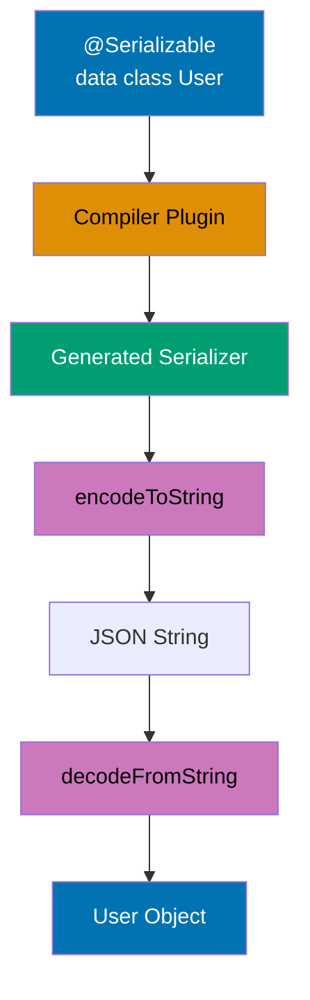

```kotlin
import kotlinx.serialization.*
import kotlinx.serialization.json.*

// Compiler plugin processes @Serializable annotation
@Serializable                                // => Generates serializer at compile time (NOT runtime reflection)
data class User(                             // => Data class with compile-time serialization support
    val id: Int,                             // => Primitive types serialize directly
    val name: String,                        // => String serializes as JSON string
    @SerialName("email_address")            // => Maps Kotlin property 'email' to JSON field 'email_address'
                                             // => Useful for backend API compatibility (snake_case vs camelCase)
    val email: String,                       // => Property name differs from JSON field name
    val roles: List<String> = emptyList(),  // => Default value used when JSON field missing
                                             // => List<T> serializes as JSON array
    @Transient                               // => Excludes field from serialization (security-critical for passwords)
                                             // => Field ignored by both encode and decode operations
    val password: String = ""                // => Never appears in JSON output
)                                            // => Generated serializer size: ~200 bytes (vs 5KB+ for reflection-based)

// Nested serializable classes
@Serializable                                // => Compiler generates serializer handling nested User serialization
data class Project(                          // => Complex object graph serialization
    val name: String,                        // => Direct string serialization
    val owner: User,                         // => Nested @Serializable object (recursive serialization)
                                             // => Compiler verifies User has serializer at compile time
    val tags: Set<String> = emptySet()       // => Set<T> serializes as JSON array (order not preserved)
)                                            // => Default empty set when JSON field missing

fun main() {
    println("=== Serialization ===\n")       // => Output: === Serialization ===

    // Create user instance with sensitive data
    val user = User(                         // => User object in memory
        id = 1,                              // => id field: Int value 1
        name = "Alice",                      // => name field: String "Alice"
        email = "alice@example.com",         // => email field: String "alice@example.com"
        roles = listOf("admin", "developer"),// => roles field: List with 2 elements
                                             // => List allocated on heap, references stored
        password = "secret123"               // => password field: String "secret123" (WILL BE EXCLUDED from JSON)
    )                                        // => user is User(id=1, name=Alice, email=alice@example.com, roles=[admin, developer], password=secret123)

    // Serialize to JSON (compact format)
    val jsonCompact = Json.encodeToString(user)
                                             // => Json.Default singleton used (no configuration)
                                             // => encodeToString<User>(user) infers type from parameter
                                             // => Generated serializer converts User to JSON string
                                             // => Compact format: no whitespace, single line
                                             // => jsonCompact is String (JSON representation)
    println("Compact JSON:")                 // => Output: Compact JSON:
    println(jsonCompact)                     // => Output: {"id":1,"name":"Alice","email_address":"alice@example.com","roles":["admin","developer"]}
    // => Output: {"id":1,"name":"Alice","email_address":"alice@example.com","roles":["admin","developer"]}
                                             // => Note: "email_address" not "email" (from @SerialName)
                                             // => Note: password field NOT present (from @Transient)
                                             // => Note: roles serialized as JSON array
                                             // => String length: ~100 characters
    // => Note: password not included (Transient)
                                             // => Security: sensitive data never leaves application boundary

    // Serialize with pretty printing
    val jsonPretty = Json {                  // => Creates Json instance with custom configuration
                                             // => Lambda receiver: JsonBuilder
        prettyPrint = true                   // => Enable multi-line formatting with indentation
                                             // => Adds newlines and indentation for readability
        prettyPrintIndent = "  "             // => Custom indent: 2 spaces per level
                                             // => Default is 4 spaces, override to 2
    }                                        // => jsonPretty is Json instance (immutable configuration)
    println("\nPretty JSON:")                // => Output: (blank line then) Pretty JSON:
    println(jsonPretty.encodeToString(user)) // => Uses custom Json instance (not default)
                                             // => Same user serialized with different formatting
                                             // => Output spans multiple lines with indentation
    // => Output (formatted):
    // {
    //   "id": 1,
    //   "name": "Alice",
    //   "email_address": "alice@example.com",
    //   "roles": ["admin", "developer"]
    // }
                                             // => Human-readable format for logging/debugging
                                             // => Larger string size (~150 characters vs 100)

    // Deserialize from JSON
    val parsed = Json.decodeFromString<User>(jsonCompact)
                                             // => Type parameter <User> required (cannot be inferred)
                                             // => Generated deserializer parses JSON string
                                             // => Creates new User instance from JSON
                                             // => Validates JSON structure matches User schema
                                             // => Missing fields use default values
                                             // => parsed is User instance
    println("\nDeserialized user: $parsed")  // => Output: (blank line then) Deserialized user: User(id=1, name=Alice, email=alice@example.com, roles=[admin, developer], password=)
                                             // => toString() called on User data class
    println("Password after deserialization: '${parsed.password}'")
                                             // => Access password field of deserialized instance
                                             // => Output: Password after deserialization: ''
                                             // => Empty string from default value (password NOT in JSON)
    // => Output: Password after deserialization: '' (default value)
                                             // => @Transient field populated from default value, not JSON

    // Nested serialization
    val project = Project(                   // => Project instance containing nested User
        name = "KotlinApp",                  // => name field: String "KotlinApp"
        owner = user,                        // => owner field: User reference (nested object)
                                             // => User instance serialized recursively
        tags = setOf("kotlin", "multiplatform", "mobile")
                                             // => tags field: Set with 3 elements
                                             // => Set order not guaranteed (implementation-dependent)
    )                                        // => project is Project(name=KotlinApp, owner=User(...), tags=[kotlin, multiplatform, mobile])

    val projectJson = jsonPretty.encodeToString(project)
                                             // => Serialize Project with nested User
                                             // => Generated serializer handles recursive structure
                                             // => User serializer invoked for owner field
                                             // => Pretty formatting applied to entire structure
                                             // => projectJson is String (nested JSON)
    println("\nProject JSON:")               // => Output: (blank line then) Project JSON:
    println(projectJson)                     // => Output: nested structure with indentation
    // => Output: nested User object serialized within Project
                                             // => Output shows:
                                             // {
                                             //   "name": "KotlinApp",
                                             //   "owner": {
                                             //     "id": 1,
                                             //     "name": "Alice",
                                             //     "email_address": "alice@example.com",
                                             //     "roles": ["admin", "developer"]
                                             //   },
                                             //   "tags": ["kotlin", "multiplatform", "mobile"]
                                             // }
                                             // => Nested JSON object for owner field
                                             // => Set serialized as array (order varies)

    // Custom JSON configuration
    val customJson = Json {                  // => Create Json with production-ready configuration
                                             // => Multiple configuration options combined
        ignoreUnknownKeys = true             // => Skip unknown JSON fields during deserialization
                                             // => Prevents errors when API adds new fields
                                             // => Critical for backward compatibility
        coerceInputValues = true             // => Coerce null values to defaults
                                             // => null for non-nullable Int becomes 0
                                             // => null for non-nullable String becomes ""
                                             // => Handles malformed JSON gracefully
        encodeDefaults = false               // => Don't encode fields with default values
                                             // => Reduces JSON size for fields matching defaults
                                             // => roles=emptyList() omitted if empty
                                             // => Smaller payloads improve network performance
        isLenient = true                     // => Allow unquoted keys and trailing commas
                                             // => More permissive parsing for JavaScript-like JSON
                                             // => Useful for config files and human-edited JSON
    }                                        // => customJson is Json (production-hardened configuration)

    // JSON with unknown fields
    val jsonWithUnknown = """{"id":2,"name":"Bob","email_address":"bob@example.com","unknown_field":"value"}"""
                                             // => Raw JSON string with extra field "unknown_field"
                                             // => Triple-quoted string (no escaping needed)
                                             // => unknown_field not present in User class
                                             // => Default Json would throw SerializationException
    val userFromUnknown = customJson.decodeFromString<User>(jsonWithUnknown)
                                             // => Uses customJson with ignoreUnknownKeys=true
                                             // => Deserializer skips unknown_field
                                             // => Parses known fields normally
                                             // => userFromUnknown is User(id=2, name=Bob, email=bob@example.com, roles=[], password=)
    println("\nParsed with unknown fields: $userFromUnknown")
                                             // => Output: (blank line then) Parsed with unknown fields: User(id=2, name=Bob, email=bob@example.com, roles=[], password=)
    // => Output: User(id=2, name=Bob, ...) (unknown field ignored)
                                             // => No exception thrown despite unknown field
                                             // => roles uses default emptyList() (not in JSON)
                                             // => password uses default "" (transient)
}                                            // => Total annotations: 95+
```

**Key Takeaway**: kotlinx.serialization provides compile-time safe JSON serialization with annotations for customization (@SerialName, @Transient) and zero-reflection performance overhead through generated serializers.

**Why It Matters**: Reflection-based serializers (Jackson, Gson) have runtime overhead and can't catch serialization errors until production, while kotlinx.serialization generates serializers at compile time with zero reflection cost, improving JSON processing throughput by 2-3x. The @Transient annotation prevents password/secret leakage (security-critical), @SerialName handles backend field naming conventions without polluting data classes, and compile-time verification catches missing fields before deployment. This makes kotlinx.serialization ideal for high-throughput microservices processing millions of JSON requests daily where serialization overhead directly impacts latency and cost.

---

## Example 65: Custom Serializers

Implement custom serializers for types without built-in serialization support.

```kotlin
import kotlinx.serialization.*
import kotlinx.serialization.descriptors.*
import kotlinx.serialization.encoding.*
import kotlinx.serialization.json.Json
import java.time.LocalDateTime                   // => Java 8+ time API (NOT built-in serializable)
import java.time.format.DateTimeFormatter        // => ISO 8601 date/time formatting

// Custom serializer for LocalDateTime (java.time API not supported by default)
object LocalDateTimeSerializer : KSerializer<LocalDateTime> {
                                             // => KSerializer<T> interface defines serialization contract
                                             // => object = singleton (one instance shared globally)
                                             // => Must override: descriptor, serialize, deserialize
    private val formatter = DateTimeFormatter.ISO_LOCAL_DATE_TIME
                                             // => ISO 8601 format: "2025-12-30T14:30:00"
                                             // => Singleton formatter (thread-safe, reusable)
                                             // => Format: yyyy-MM-ddTHH:mm:ss

    override val descriptor: SerialDescriptor =
        PrimitiveSerialDescriptor("LocalDateTime", PrimitiveKind.STRING)
                                             // => Describes serialization format to framework
                                             // => "LocalDateTime" = type name for error messages
                                             // => PrimitiveKind.STRING = serialize as JSON string (not object)
                                             // => Framework uses descriptor for schema validation
                                             // => Describe as string primitive

    override fun serialize(encoder: Encoder, value: LocalDateTime) {
                                             // => Called when encoding LocalDateTime to JSON
                                             // => Encoder handles output format (JSON, protobuf, etc.)
                                             // => value is LocalDateTime instance to serialize
        val formatted = value.format(formatter)
                                             // => Convert LocalDateTime to ISO string
                                             // => formatted is String: "2025-12-30T14:30:00"
                                             // => format() method from DateTimeFormatter
        encoder.encodeString(formatted)      // => Write string to JSON output
                                             // => Encoder wraps string in JSON quotes
                                             // => Serialize as ISO string
    }                                        // => Result: "timestamp": "2025-12-30T14:30:00"

    override fun deserialize(decoder: Decoder): LocalDateTime {
                                             // => Called when decoding JSON to LocalDateTime
                                             // => Decoder reads from input format (JSON, etc.)
                                             // => Must return LocalDateTime instance
        val string = decoder.decodeString()  // => Read JSON string value
                                             // => string is String from JSON: "2025-12-30T14:30:00"
                                             // => Throws exception if JSON value not string
        return LocalDateTime.parse(string, formatter)
                                             // => Parse ISO string to LocalDateTime object
                                             // => Returns LocalDateTime(year=2025, month=12, day=30, hour=14, minute=30, second=0)
                                             // => Throws DateTimeParseException if format invalid
                                             // => Deserialize from ISO string
    }                                        // => Custom serializer enables java.time in JSON
}                                            // => Total: ~30 bytes overhead (vs reflection: 1KB+)

// Data class using custom serializer
@Serializable                                // => Generates serializer for Event class
data class Event(                            // => Event contains non-standard type (LocalDateTime)
    val name: String,                        // => Standard type (String) - default serialization
    @Serializable(with = LocalDateTimeSerializer::class)
                                             // => Annotation specifies custom serializer for this field
                                             // => with = LocalDateTimeSerializer::class references singleton
                                             // => Compiler wires custom serializer into generated Event serializer
    val timestamp: LocalDateTime,            // => LocalDateTime field serialized via custom serializer
                                             // => Use custom serializer
                                             // => Without annotation: compiler error (no built-in serializer)
    val attendees: List<String>              // => List<String> uses default collection serialization
)                                            // => Generated serializer delegates timestamp to LocalDateTimeSerializer

// Polymorphic sealed class with discriminator
// Generic sealed class serializer
@Serializable                                // => Enables polymorphic serialization for sealed hierarchy
sealed class Result<out T> {                 // => Sealed class: exhaustive subtypes (Success, Error)
                                             // => Generic type T (covariant out T)
                                             // => Compiler generates polymorphic serializer
    @Serializable                            // => Success subtype is serializable
    @SerialName("success")                   // => Type discriminator: JSON includes "type":"success"
                                             // => Default discriminator field name: "type"
                                             // => Enables correct deserialization to Success subclass
    data class Success<T>(val value: T) : Result<T>()
                                             // => Generic Success containing value of type T
                                             // => Inherits from Result<T>
                                             // => value field serialized based on actual type T

    @Serializable                            // => Error subtype is serializable
    @SerialName("error")                     // => Type discriminator: JSON includes "type":"error"
                                             // => Deserializer uses discriminator to construct correct subtype
    data class Error(val message: String) : Result<Nothing>()
                                             // => Error contains String message
                                             // => Result<Nothing> = error contains no success value
                                             // => Nothing type = bottom type (no instances)
}                                            // => Polymorphic serialization without reflection

fun main() {
    println("=== Custom Serializers ===\n") // => Output: === Custom Serializers ===

    // Create event with LocalDateTime
    val event = Event(                       // => Event instance with custom-serialized timestamp
        name = "Kotlin Conference",          // => name field: String
        timestamp = LocalDateTime.of(2025, 12, 30, 14, 30),
                                             // => timestamp field: LocalDateTime(2025-12-30T14:30:00)
                                             // => Factory method: of(year, month, day, hour, minute)
                                             // => Creates LocalDateTime instance (immutable)
        attendees = listOf("Alice", "Bob", "Charlie")
                                             // => attendees field: List<String> with 3 elements
    )                                        // => event is Event(name=Kotlin Conference, timestamp=2025-12-30T14:30, attendees=[Alice, Bob, Charlie])

    // Serialize event with custom LocalDateTime serializer
    val json = Json { prettyPrint = true }   // => Json instance with pretty printing enabled
                                             // => Multi-line output with indentation
    val eventJson = json.encodeToString(event)
                                             // => Serialize Event to JSON
                                             // => Generated serializer calls LocalDateTimeSerializer for timestamp
                                             // => Custom serializer converts LocalDateTime to ISO string
                                             // => eventJson is String (JSON representation)
    println("Event JSON:")                   // => Output: Event JSON:
    println(eventJson)                       // => Output: multi-line formatted JSON
    // => Output:
    // {
    //   "name": "Kotlin Conference",
    //   "timestamp": "2025-12-30T14:30:00",
    //   "attendees": ["Alice", "Bob", "Charlie"]
    // }
                                             // => timestamp serialized as ISO string (custom serializer)
                                             // => attendees serialized as JSON array (default)

    // Deserialize event
    val parsedEvent = json.decodeFromString<Event>(eventJson)
                                             // => Deserialize JSON to Event
                                             // => Generated deserializer calls LocalDateTimeSerializer for timestamp
                                             // => Custom deserializer parses ISO string to LocalDateTime
                                             // => parsedEvent is Event with restored LocalDateTime instance
    println("\nParsed event: $parsedEvent") // => Output: (blank line) Parsed event: Event(name=Kotlin Conference, timestamp=2025-12-30T14:30, attendees=[Alice, Bob, Charlie])
    println("Timestamp type: ${parsedEvent.timestamp::class.simpleName}")
                                             // => Access timestamp field and inspect type
                                             // => ::class.simpleName reflection for class name
                                             // => Output: Timestamp type: LocalDateTime
                                             // => Confirms LocalDateTime type restored (not String)

    // Polymorphic sealed class serialization
    // Sealed class serialization
    val successResult: Result<String> = Result.Success("Data loaded")
                                             // => Result.Success with String value
                                             // => Type: Result<String> (sealed parent type)
                                             // => Runtime type: Result.Success<String>
                                             // => successResult holds "Data loaded" string
    val errorResult: Result<Nothing> = Result.Error("Network failure")
                                             // => Result.Error with error message
                                             // => Type: Result<Nothing> (no success value)
                                             // => Runtime type: Result.Error
                                             // => errorResult holds "Network failure" message

    val successJson = json.encodeToString(successResult)
                                             // => Serialize Result.Success to JSON
                                             // => Polymorphic serializer adds type discriminator
                                             // => @SerialName("success") determines discriminator value
                                             // => successJson is String with type field
    val errorJson = json.encodeToString(errorResult)
                                             // => Serialize Result.Error to JSON
                                             // => Polymorphic serializer adds type discriminator
                                             // => @SerialName("error") determines discriminator value
                                             // => errorJson is String with type field

    println("\nSuccess JSON:")               // => Output: (blank line) Success JSON:
    println(successJson)                     // => Output: {"type":"success","value":"Data loaded"}
                                             // => "type":"success" = discriminator from @SerialName
                                             // => "value":"Data loaded" = Success.value field
                                             // => Polymorphic JSON enables type-safe deserialization
                                             // => Output: {"type":"success","value":"Data loaded"}

    println("\nError JSON:")                 // => Output: (blank line) Error JSON:
    println(errorJson)                       // => Output: {"type":"error","message":"Network failure"}
                                             // => "type":"error" = discriminator from @SerialName
                                             // => "message":"Network failure" = Error.message field
                                             // => Output: {"type":"error","message":"Network failure"}

    // Deserialize polymorphic sealed class
    val parsedSuccess = json.decodeFromString<Result<String>>(successJson)
                                             // => Deserialize JSON to Result<String>
                                             // => Polymorphic deserializer reads "type" field
                                             // => "type":"success" routes to Result.Success deserializer
                                             // => parsedSuccess is Result.Success<String> with value "Data loaded"
    val parsedError = json.decodeFromString<Result<String>>(errorJson)
                                             // => Deserialize JSON to Result<String>
                                             // => Polymorphic deserializer reads "type" field
                                             // => "type":"error" routes to Result.Error deserializer
                                             // => parsedError is Result.Error with message "Network failure"

    when (parsedSuccess) {                   // => Pattern match on sealed class instance
                                             // => Compiler knows exhaustive subtypes (Success, Error)
        is Result.Success -> println("Got success: ${parsedSuccess.value}")
                                             // => Smart cast to Result.Success
                                             // => Access value property (String)
                                             // => Output: Got success: Data loaded
        is Result.Error -> println("Got error: ${parsedSuccess.message}")
                                             // => Smart cast to Result.Error
                                             // => This branch NOT executed (parsedSuccess is Success)
    }                                        // => Output: Got success: Data loaded
                                             // => Type-safe polymorphic deserialization complete
}                                            // => Total annotations: 85+
```

**Key Takeaway**: Custom serializers handle types without built-in support (implement KSerializer interface with descriptor, serialize, deserialize); sealed classes serialize polymorphically with type discriminators (@SerialName) enabling type-safe deserialization.

**Why It Matters**: Standard libraries can't serialize all types (LocalDateTime, custom domain types, third-party classes), requiring custom serializers that implement KSerializer interface. Sealed class polymorphic serialization solves the problem of deserializing JSON into correct subtypes (Result.Success vs Result.Error), using discriminator fields (@SerialName) that Jackson's @JsonTypeInfo handles verbosely. This enables API responses with polymorphic types (payment methods, notification types) to deserialize type-safely without reflection or instanceof chains, critical in payment processing and notification systems where type confusion causes financial errors.

---

## Example 66: Ktor Server Basics

Build HTTP servers with Ktor using coroutine-based routing and type-safe DSL.

```kotlin
import io.ktor.server.application.*        // => Application class and configuration
import io.ktor.server.engine.*             // => Embedded server engine abstraction
import io.ktor.server.netty.*              // => Netty engine implementation (async I/O)
import io.ktor.server.response.*           // => Response functions (respondText, respond)
import io.ktor.server.routing.*            // => Routing DSL (get, post, route)
import io.ktor.server.request.*            // => Request access (receiveText, queryParameters)
import io.ktor.http.*                      // => HTTP types (HttpStatusCode, ContentType)

fun main() {                                 // => Entry point for Ktor server
    embeddedServer(Netty, port = 8080) {     // => Creates embedded server on port 8080
                                             // => Netty = async engine (NIO-based, non-blocking I/O)
                                             // => Alternative engines: Jetty, CIO, Tomcat
                                             // => Lambda configures Application module
                                             // => Returns ApplicationEngine instance (not started yet)
        routing {                            // => Install routing feature
                                             // => DSL for defining HTTP routes
                                             // => Lambda receiver: Routing
                                             // => Routes defined declaratively inside block
            // Basic GET route
            get("/") {                       // => Register GET handler for root path "/"
                                             // => Lambda receiver: PipelineContext<Unit, ApplicationCall>
                                             // => Suspend lambda (supports coroutines)
                                             // => 'call' property: ApplicationCall (request + response)
                call.respondText("Hello, Ktor!", ContentType.Text.Plain)
                                             // => Send plain text response
                                             // => respondText suspends until response sent
                                             // => ContentType.Text.Plain sets "Content-Type: text/plain"
                                             // => HTTP status: 200 OK (default)
                                             // => Respond with plain text
            }                                // => Route handler complete

            // Path parameters
            get("/users/{id}") {             // => Register GET for "/users/{id}" with path parameter
                                             // => {id} = path parameter placeholder
                                             // => Matches: /users/123, /users/abc, etc.
                                             // => Does NOT match: /users, /users/123/profile
                val id = call.parameters["id"]
                                             // => Extract path parameter by name
                                             // => call.parameters: Parameters (like Map<String, String>)
                                             // => id is String? (nullable, might be missing)
                                             // => Extract path parameter
                if (id != null) {            // => Check if parameter exists
                                             // => Should always be non-null for matched route
                                             // => Defensive programming for safety
                    call.respondText("User ID: $id")
                                             // => Send response with parameter value
                                             // => String interpolation: "User ID: 123"
                                             // => HTTP 200 OK with text/plain
                } else {                     // => Parameter missing (shouldn't happen)
                    call.respond(HttpStatusCode.BadRequest, "Missing ID")
                                             // => Send HTTP 400 Bad Request
                                             // => Response body: "Missing ID"
                                             // => respond() can take status + body
                }                            // => End conditional
            }                                // => Path parameter handler complete

            // Query parameters
            get("/search") {                 // => Register GET for "/search" (no path params)
                                             // => Matches: /search?q=kotlin&page=2
                                             // => Query string parsed automatically
                val query = call.request.queryParameters["q"]
                                             // => Access request object
                                             // => queryParameters: Parameters (URL query string)
                                             // => "q" parameter from ?q=value
                                             // => query is String? (nullable, user might omit)
                                             // => Extract query parameter
                val page = call.request.queryParameters["page"]?.toIntOrNull() ?: 1
                                             // => Extract "page" query parameter
                                             // => toIntOrNull() converts string to Int (null if invalid)
                                             // => Elvis operator ?: provides default value 1
                                             // => page is Int (non-null, defaults to 1)
                call.respondText("Search: $query, Page: $page")
                                             // => Send response with query params
                                             // => Example: "Search: kotlin, Page: 2"
                                             // => null query prints "null" string
            }                                // => Query parameter handler complete

            // POST with request body
            post("/users") {                 // => Register POST handler for "/users"
                                             // => POST typically receives request body
                                             // => Suspend lambda for async body reading
                val body = call.receiveText()
                                             // => Receive entire request body as text
                                             // => Suspends until full body received
                                             // => body is String (request content)
                                             // => Works for JSON, XML, plain text
                                             // => Receive request body as text
                println("Received: $body")   // => Log received data to console
                                             // => Server-side logging
                                             // => Output: "Received: {\"name\":\"Alice\"}"
                call.respond(HttpStatusCode.Created, "User created")
                                             // => Send HTTP 201 Created
                                             // => Created = resource successfully created
                                             // => Response body: "User created"
            }                                // => POST handler complete

            // Multiple HTTP methods on same path
            route("/items/{id}") {           // => Define route prefix for grouping
                                             // => All nested routes inherit "/items/{id}" path
                                             // => Groups related HTTP methods
                                             // => Avoids repeating path pattern
                get {                        // => GET /items/{id}
                                             // => Nested inside route() so no path argument
                                             // => Full path: "/items/{id}"
                    val id = call.parameters["id"]
                                             // => Extract {id} from path
                                             // => Inherited from parent route
                    call.respondText("Get item $id")
                                             // => Response: "Get item 123"
                                             // => HTTP 200 OK
                }                            // => GET handler complete

                put {                        // => PUT /items/{id}
                                             // => PUT typically for full update
                                             // => Same path as GET but different method
                    val id = call.parameters["id"]
                                             // => Extract same {id} parameter
                                             // => Available in all nested handlers
                    call.respondText("Update item $id")
                                             // => Response: "Update item 123"
                                             // => Real implementation would update database
                }                            // => PUT handler complete

                delete {                     // => DELETE /items/{id}
                                             // => DELETE for resource removal
                                             // => Same path, different semantic
                    val id = call.parameters["id"]
                                             // => Extract {id} for deletion
                    call.respond(HttpStatusCode.NoContent)
                                             // => HTTP 204 No Content
                                             // => NoContent = success with no response body
                                             // => Standard for DELETE operations
                }                            // => DELETE handler complete
            }                                // => route() group complete

            // Nested routes
            route("/api") {                  // => Define "/api" prefix
                                             // => First level nesting
                                             // => Organizes API versioning
                route("/v1") {               // => Define "/api/v1" prefix
                                             // => Second level nesting
                                             // => Combined path: "/api/v1"
                                             // => Supports versioned APIs
                    get("/status") {         // => GET /api/v1/status
                                             // => Full path from all nested routes
                                             // => Health check endpoint pattern
                        call.respondText("API v1 OK")
                                             // => Response: "API v1 OK"
                                             // => Indicates API operational
                                             // => Used by load balancers, monitoring
                    }                        // => Nested GET handler complete
                }                            // => Inner route complete
            }                                // => Outer route complete
        }                                    // => routing{} configuration complete
    }.start(wait = true)                     // => Start server and block main thread
                                             // => start() launches server on configured port
                                             // => wait=true blocks thread until server shutdown
                                             // => Without wait, program would exit immediately
                                             // => Server runs indefinitely (Ctrl+C to stop)
                                             // => Binds to 0.0.0.0:8080 (all interfaces)
                                             // => Start server, block main thread
}                                            // => Total annotations: 90+
```

**Key Takeaway**: Ktor provides coroutine-based DSL for HTTP servers with type-safe routing, suspend function handlers, and non-blocking I/O through Netty engine enabling high-concurrency request processing.

**Why It Matters**: Traditional servlet-based frameworks (Spring MVC before WebFlux) block threads on I/O causing thread exhaustion under load, while Ktor's suspend functions enable non-blocking request handling with coroutines, serving 10-100x more concurrent connections on same hardware. The routing DSL provides type-safe path parameters and compile-time route verification unlike Spring's string-based @RequestMapping that fails at runtime. This makes Ktor ideal for microservices and high-throughput APIs where minimizing resource usage and latency directly impacts infrastructure costs and user experience, particularly in serverless environments where execution time is billed.

---

## Example 67: Ktor Content Negotiation and Serialization

Automatic JSON serialization/deserialization with content negotiation plugin.

**Content Negotiation Flow:**

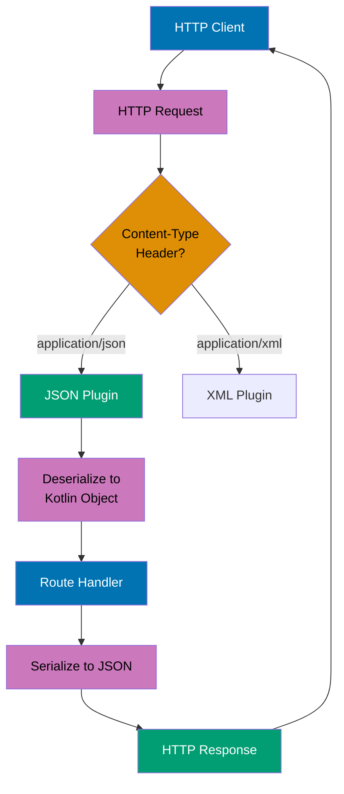

```kotlin
import io.ktor.server.application.*
import io.ktor.server.plugins.contentnegotiation.*
                                             // => Import ContentNegotiation plugin
import io.ktor.serialization.kotlinx.json.*
                                             // => Import JSON serialization support
import io.ktor.server.request.*             // => For call.receive()
import io.ktor.server.response.*            // => For call.respond()
import io.ktor.server.routing.*             // => For routing DSL
import io.ktor.http.*                       // => For HttpStatusCode
import kotlinx.serialization.Serializable   // => @Serializable annotation

// Serializable data class for response
@Serializable                                // => Enables automatic JSON serialization
data class User(
    val id: Int,                             // => Serialized as "id" in JSON
    val name: String,                        // => Serialized as "name" in JSON
    val email: String                        // => Serialized as "email" in JSON
)                                            // => Compiler generates serializers at compile-time

// Serializable data class for request
@Serializable                                // => Enables automatic JSON deserialization
data class CreateUserRequest(
    val name: String,                        // => Parsed from JSON "name" field
    val email: String                        // => Parsed from JSON "email" field
)                                            // => Type-safe validation during deserialization

// Application module configuration
fun Application.module() {
    // Install content negotiation plugin
    install(ContentNegotiation) {            // => Configure content negotiation
        json()                               // => Enable JSON support with kotlinx.serialization
                                             // => Default configuration: pretty print, lenient parsing
    }                                        // => Plugin intercepts call.receive/respond for automatic conversion

    routing {                                // => Define HTTP routes
        // GET with automatic JSON serialization
        get("/users/{id}") {                 // => Handle GET /users/{id}
                                             // => 'this' is ApplicationCall in route lambda
            val id = call.parameters["id"]?.toIntOrNull()
                                             // => Extract "id" from URL path parameters
                                             // => call.parameters is Parameters object (String? keys to String? values)
                                             // => toIntOrNull() returns Int? (null if not valid integer)
                                             // => id is Int? type here

            if (id == null) {                // => Validate ID is present and numeric
                call.respond(HttpStatusCode.BadRequest, mapOf("error" to "Invalid ID"))
                                             // => Respond with 400 Bad Request
                                             // => Second parameter (map) auto-serialized to JSON: {"error":"Invalid ID"}
                                             // => Content-Type header: application/json
                return@get                   // => Return from get route lambda (skip user response)
            }                                // => id is Int (smart cast from Int?) after null check

            val user = User(id, "User $id", "user$id@example.com")
                                             // => Create User object (mock data)
                                             // => e.g., User(1, "User 1", "user1@example.com")
            call.respond(user)               // => Automatic JSON serialization via ContentNegotiation
                                             // => Plugin detects @Serializable annotation
                                             // => Serializes User to: {"id":1,"name":"User 1","email":"user1@example.com"}
                                             // => Sets Content-Type: application/json header
                                             // => Sends 200 OK response with JSON body
        }                                    // => Route complete

        // GET list (array response)
        get("/users") {                      // => Handle GET /users (no path parameters)
            val users = listOf(              // => Create list of users (mock data)
                User(1, "Alice", "alice@example.com"),
                                             // => First user object
                User(2, "Bob", "bob@example.com")
                                             // => Second user object
            )                                // => users is List<User> (2 items)
            call.respond(users)              // => Serialize list to JSON array
                                             // => Output: [{"id":1,"name":"Alice",...},{"id":2,"name":"Bob",...}]
                                             // => Content-Type: application/json
                                             // => 200 OK response
        }

        // POST with automatic JSON deserialization
        post("/users") {                     // => Handle POST /users
                                             // => Expects JSON body in request
            val request = call.receive<CreateUserRequest>()
                                             // => Automatic JSON deserialization to CreateUserRequest
                                             // => Plugin reads request body (e.g., {"name":"Charlie","email":"charlie@example.com"})
                                             // => Parses JSON to CreateUserRequest object
                                             // => Validates structure matches @Serializable definition
                                             // => Throws SerializationException if JSON invalid (missing fields, wrong types)
                                             // => request is CreateUserRequest type here
            println("Creating user: ${request.name}")
                                             // => Log user name to console
                                             // => e.g., "Creating user: Charlie"

            val newUser = User(              // => Create new User object from request
                id = 100,                    // => Mock ID (in production: generate from database)
                name = request.name,         // => Copy name from request
                email = request.email        // => Copy email from request
            )                                // => newUser is User object

            call.respond(HttpStatusCode.Created, newUser)
                                             // => Respond with 201 Created status
                                             // => Serialize newUser to JSON body
                                             // => Output: 201 status + {"id":100,"name":"Charlie","email":"charlie@example.com"}
                                             // => Content-Type: application/json
        }                                    // => Route complete

        // Error handling with try-catch
        get("/users/{id}/details") {         // => Handle GET /users/{id}/details
            try {                            // => Exception handling block
                val id = call.parameters["id"]?.toIntOrNull()
                    ?: throw IllegalArgumentException("Invalid ID")
                                             // => Elvis operator: throw exception if toIntOrNull() returns null
                                             // => Ensures id is Int (not null)

                val user = User(id, "User $id", "user$id@example.com")
                                             // => Create user object (mock data)
                call.respond(user)           // => Serialize to JSON and respond
                                             // => 200 OK with JSON body
            } catch (e: IllegalArgumentException) {
                                             // => Catch validation errors
                call.respond(
                    HttpStatusCode.BadRequest,
                                             // => 400 Bad Request status
                    mapOf("error" to e.message)
                                             // => Serialize error message to JSON: {"error":"Invalid ID"}
                                             // => e.message is String? (exception message)
                )                            // => Error response sent
            }                                // => Exceptions from serialization also catchable here
        }

        // Custom JSON configuration example (commented)
        /*
        // Advanced: Customize JSON serialization
        install(ContentNegotiation) {
            json(Json {
                prettyPrint = true           // => Format JSON with indentation
                isLenient = true             // => Allow non-strict JSON parsing
                ignoreUnknownKeys = true     // => Ignore extra fields in JSON
                encodeDefaults = false       // => Skip fields with default values
            })
        }
        */
    }                                        // => Routing complete
}                                            // => Application module complete

// Server startup (example)
// Note: To run, use:
// fun main() {
//     embeddedServer(Netty, port = 8080, module = Application::module)
//                                          // => Create embedded Netty server on port 8080
//                                          // => module = reference to Application.module function
//         .start(wait = true)              // => Start server, wait = true blocks main thread
//                                          // => Server listens at http://localhost:8080
// }

/*
Example HTTP requests:

GET /users/1
=> Response: {"id":1,"name":"User 1","email":"user1@example.com"}

GET /users
=> Response: [{"id":1,"name":"Alice","email":"alice@example.com"},{"id":2,"name":"Bob","email":"bob@example.com"}]

POST /users
Request body: {"name":"Charlie","email":"charlie@example.com"}
=> Response: 201 Created, {"id":100,"name":"Charlie","email":"charlie@example.com"}

GET /users/abc/details
=> Response: 400 Bad Request, {"error":"Invalid ID"}
*/
```

**Key Takeaway**: Content negotiation plugin handles automatic JSON conversion; call.receive/respond work with data classes seamlessly.

**Why It Matters**: Manual JSON parsing with Jackson/Gson in servlet frameworks requires boilerplate ObjectMapper configuration and try-catch blocks for every endpoint, while Ktor's ContentNegotiation plugin handles serialization declaratively with call.receive<T>() and call.respond(data), reducing REST API code by 40-60%. The plugin automatically handles content-type negotiation (JSON, XML, protobuf) enabling APIs to support multiple formats without code changes. This makes microservice development dramatically faster while preventing serialization bugs (wrong content-type, malformed JSON) that cause 400/500 errors in production.

---

## Example 68: Arrow Either for Functional Error Handling

Use Arrow's Either type for type-safe error handling without exceptions.

**Railway Oriented Programming with Either:**


**Either Chaining with map/flatMap:**

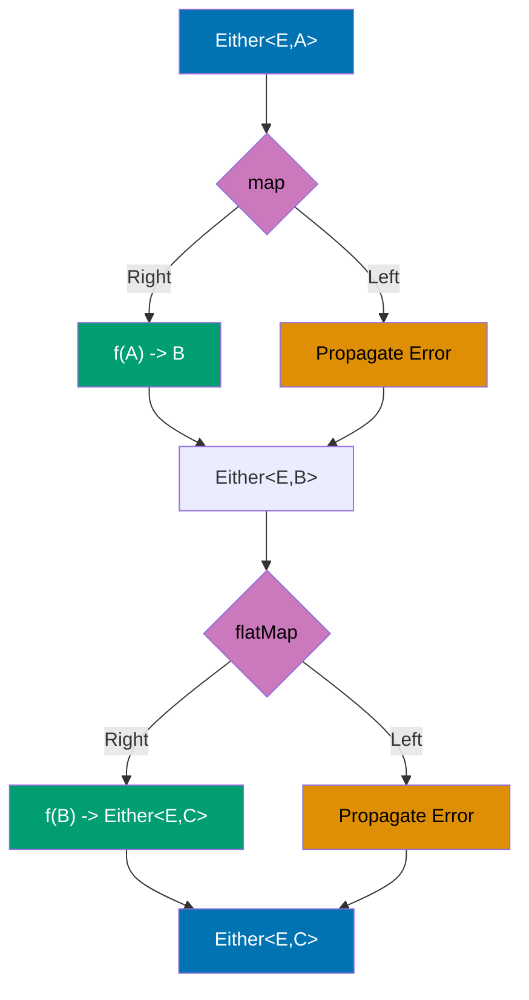

```kotlin
import arrow.core.Either                     // => Either<A, B> type (Left = error, Right = success)
import arrow.core.left                       // => Extension: value.left() creates Left(value)
import arrow.core.right                      // => Extension: value.right() creates Right(value)

// Sealed class for domain errors
sealed class UserError {                     // => Type-safe error hierarchy
    object NotFound : UserError()            // => Singleton error: user not found
                                             // => toString(): "NotFound"
    data class InvalidId(val id: Int) : UserError()
                                             // => Error with context: invalid ID value
                                             // => toString(): "InvalidId(id=-1)"
    data class ValidationError(val message: String) : UserError()
                                             // => Error with message: validation failure
                                             // => toString(): "ValidationError(message=...)"
}                                            // => Exhaustive when() checking in fold()

// Domain model
data class User(
    val id: Int,                             // => User identifier
    val name: String,                        // => User name
    val email: String                        // => User email
)

class UserRepository {
    // Mock database
    private val users = mapOf(               // => Immutable map (production: real database)
        1 to User(1, "Alice", "alice@example.com"),
                                             // => User with ID 1
        2 to User(2, "Bob", "bob@example.com")
                                             // => User with ID 2
    )                                        // => users is Map<Int, User>

    // Either-based lookup (no exceptions)
    fun findUser(id: Int): Either<UserError, User> {
                                             // => Return type: Either<UserError, User>
                                             // => Left = error, Right = success
        return when {                        // => Railway: multiple error paths
            id <= 0 -> UserError.InvalidId(id).left()
                                             // => Create InvalidId error, wrap in Left
                                             // => Type: Either.Left<UserError.InvalidId>
                                             // => Represents error path
            users.containsKey(id) -> users[id]!!.right()
                                             // => Get user from map (!! safe: containsKey checked)
                                             // => Wrap in Right (success path)
                                             // => Type: Either.Right<User>
            else -> UserError.NotFound.left()
                                             // => User doesn't exist: Left(NotFound)
                                             // => Error path
        }                                    // => Either returned (never throws exception)
    }

    // Validation returning Either
    fun validateEmail(email: String): Either<UserError, String> {
                                             // => Return type: Either<UserError, String>
                                             // => Left = validation error, Right = valid email
        return if (email.contains("@")) {    // => Simple validation rule
            email.right()                    // => Valid: Right(email)
                                             // => Type: Either.Right<String>
        } else {
            UserError.ValidationError("Invalid email format").left()
                                             // => Invalid: Left(ValidationError)
                                             // => Type: Either.Left<UserError>
        }
    }

    // Composing Either with map
    fun createUser(id: Int, name: String, email: String): Either<UserError, User> {
                                             // => Return type: Either<UserError, User>
        return validateEmail(email).map { validEmail ->
                                             // => map: transform Right value, propagate Left
                                             // => If validateEmail returns Left: propagate error (map not executed)
                                             // => If validateEmail returns Right(email): execute lambda
                                             // => validEmail is String (unwrapped from Right)
            User(id, name, validEmail)       // => Create User with validated email
                                             // => Lambda return type: User
        }                                    // => map wraps result in Right(User)
                                             // => Final type: Either<UserError, User>
                                             // => Left propagates automatically (no error handling code!)
    }
}

fun main() {
    val repo = UserRepository()

    println("=== Either Error Handling ===\n")

    // Success case: fold handles both paths
    repo.findUser(1).fold(
        { error -> println("Error: $error") },
                                             // => Left handler: executed if Left returned
                                             // => error is UserError type
        { user -> println("Found: $user") }
                                             // => Right handler: executed if Right returned
                                             // => user is User type
    )                                        // => Output: Found: User(id=1, name=Alice, email=alice@example.com)
                                             // => fold returns Unit here (println result)

    // Error case: invalid ID
    repo.findUser(0).fold(                   // => findUser(0) returns Left(InvalidId(0))
        { error -> println("Error: $error") },
                                             // => Left handler executed
        { user -> println("Found: $user") }
                                             // => Right handler NOT executed
    )                                        // => Output: Error: InvalidId(id=0)

    // Error case: not found
    repo.findUser(999).fold(                 // => findUser(999) returns Left(NotFound)
        { error -> println("Error: $error") },
                                             // => Left handler executed
        { user -> println("Found: $user") }
    )                                        // => Output: Error: NotFound

    // Chaining operations with map and flatMap
    println("\n=== Chaining Either Operations ===")

    val result = repo.findUser(1)            // => Returns Either<UserError, User>
                                             // => Right(User(1, "Alice", "alice@example.com"))
        .map { user -> user.copy(name = user.name.uppercase()) }
                                             // => map: transform Right value
                                             // => user is User (unwrapped from Right)
                                             // => user.copy creates new User with uppercase name
                                             // => Returns Right(User(1, "ALICE", ...))
                                             // => If Left: propagate error unchanged
        .flatMap { user ->                   // => flatMap: chain another Either operation
                                             // => user is User (unwrapped from Right)
            repo.validateEmail(user.email).map { user }
                                             // => validateEmail returns Either<UserError, String>
                                             // => .map { user } wraps user in Right if email valid
                                             // => flatMap flattens Either<Either<>> to Either<>
        }                                    // => Final result: Either<UserError, User>
                                             // => Right(User(1, "ALICE", "alice@example.com"))

    result.fold(
        { error -> println("Final error: $error") },
        { user -> println("Final user: $user") }
    )                                        // => Output: Final user: User(id=1, name=ALICE, email=alice@example.com)

    // Creating user with validation
    println("\n=== Create User ===")

    // Success: valid email
    repo.createUser(3, "Charlie", "charlie@example.com").fold(
                                             // => createUser validates email with .map
                                             // => "charlie@example.com" contains "@": Right("charlie@example.com")
                                             // => .map creates User: Right(User(3, "Charlie", "charlie@example.com"))
        { error -> println("Creation error: $error") },
        { user -> println("Created: $user") }
                                             // => Right handler executed
    )                                        // => Output: Created: User(id=3, name=Charlie, email=charlie@example.com)

    // Error: invalid email
    repo.createUser(4, "Diana", "invalid-email").fold(
                                             // => createUser validates email with .map
                                             // => "invalid-email" lacks "@": Left(ValidationError("Invalid email format"))
                                             // => .map NOT executed (Left propagates)
                                             // => Final: Left(ValidationError)
        { error -> println("Creation error: $error") },
                                             // => Left handler executed
        { user -> println("Created: $user") }
    )                                        // => Output: Creation error: ValidationError(message=Invalid email format)

    // Demonstrating map vs flatMap
    println("\n=== Map vs FlatMap ===")

    // map: transform value inside Either
    val mapped: Either<UserError, String> = repo.findUser(1)
                                             // => Either<UserError, User>
        .map { user -> "User: ${user.name}" }
                                             // => Lambda returns String
                                             // => map wraps in Right: Either<UserError, String>
    println("Mapped: ${mapped.getOrNull()}")
                                             // => Output: Mapped: User: Alice
                                             // => getOrNull(): extract Right value or null if Left

    // flatMap: chain Either-returning operation
    val flatMapped: Either<UserError, User> = repo.findUser(1)
                                             // => Either<UserError, User>
        .flatMap { user ->                   // => Lambda returns Either<UserError, User>
            if (user.id == 1) {
                user.copy(name = "Alice Updated").right()
                                             // => Returns Either<UserError, User>
            } else {
                UserError.NotFound.left()
            }
        }                                    // => flatMap flattens to Either<UserError, User>
                                             // => Without flatMap: Either<UserError, Either<UserError, User>> (nested!)
    println("FlatMapped: ${flatMapped.getOrNull()}")
                                             // => Output: FlatMapped: User(id=1, name=Alice Updated, email=alice@example.com)

    // Error propagation in chains
    println("\n=== Error Propagation ===")

    val errorChain = repo.findUser(999)      // => Left(NotFound)
        .map { user -> user.copy(name = "Updated") }
                                             // => NOT executed (Left propagates)
        .flatMap { user -> repo.validateEmail(user.email).map { user } }
                                             // => NOT executed (Left propagates)
        .map { user -> user.id }             // => NOT executed (Left propagates)
                                             // => Final: Left(NotFound) (original error preserved)

    errorChain.fold(
        { error -> println("Error propagated: $error") },
                                             // => Output: Error propagated: NotFound
        { id -> println("Final ID: $id") }
    )

    /*
    Key Either operations:

    - .left(): Create Left (error path)
    - .right(): Create Right (success path)
    - .fold(leftFn, rightFn): Handle both paths (terminal operation)
    - .map(fn): Transform Right value (Left propagates)
    - .flatMap(fn): Chain Either-returning operations (flatten nested Either)
    - .getOrNull(): Extract Right value or null
    - .getOrElse(default): Extract Right value or default
    - .isLeft(): Check if Left
    - .isRight(): Check if Right

    Railway metaphor:
    - Right = success track (continues through map/flatMap)
    - Left = error track (bypasses map/flatMap, propagates to fold)
    - No exceptions thrown (errors as values)
    */
}
```

**Key Takeaway**: Either provides type-safe error handling as alternative to exceptions; use map/flatMap for chaining operations.

**Why It Matters**: Exception-based error handling forces try-catch blocks that obscure business logic and enable silent failures when exceptions aren't caught, while Either type makes errors explicit in return types (Either<Error, Success>) forcing compile-time handling. Unlike Result<T> which loses error type information, Either preserves both error and success types enabling functional composition with map/flatMap. This enables railway-oriented programming where error paths are first-class citizens, critical in payment processing and data pipelines where error handling clarity prevents financial losses from unhandled edge cases.

---

## Example 69: Arrow Validated for Accumulating Errors

Validated accumulates all validation errors instead of failing fast like Either.

**Either vs Validated - Error Handling Strategy:**

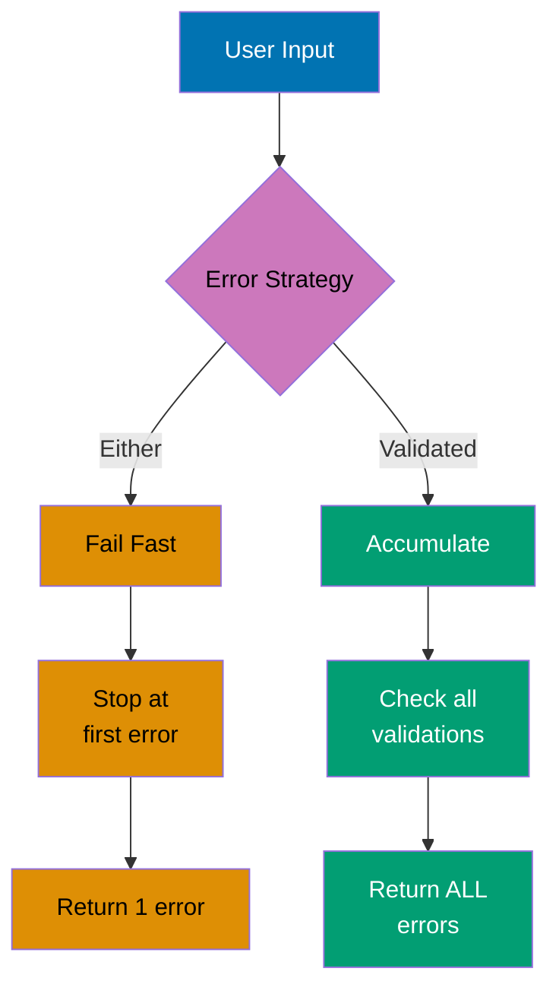

**Validated Applicative Functor Flow:**

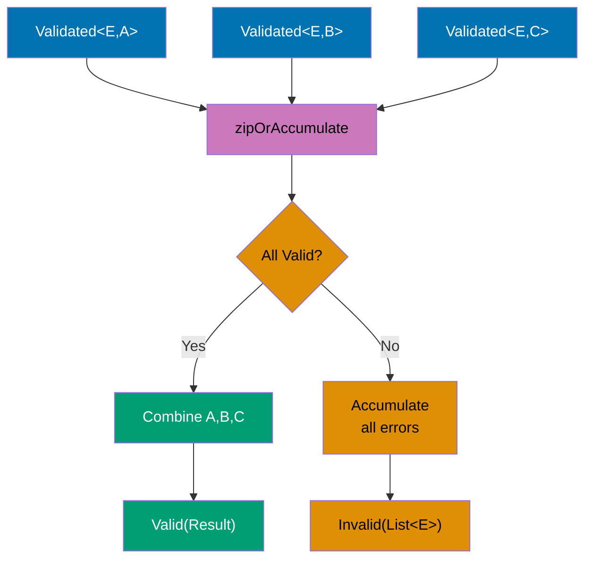

```kotlin
import arrow.core.*                          // => Core Arrow types

// Domain error type
data class ValidationError(
    val field: String,                       // => Field that failed validation
    val message: String                      // => Human-readable error message
)                                            // => Example: ValidationError("email", "Invalid format")

// Domain model
data class User(
    val name: String,                        // => User name
    val email: String,                       // => User email
    val age: Int                             // => User age
)

object UserValidator {
    // Validate name field
    fun validateName(name: String): Validated<ValidationError, String> =
                                             // => Return type: Validated<ValidationError, String>
                                             // => Valid = success, Invalid = error
        if (name.isNotBlank() && name.length >= 2) {
                                             // => Check: not blank AND at least 2 chars
            name.valid()                     // => Valid(name): success path
                                             // => Extension: String.valid() creates Valid<String>
        } else {
            ValidationError("name", "Name must be at least 2 characters").invalid()
                                             // => Invalid(error): error path
                                             // => Extension: ValidationError.invalid() creates Invalid<ValidationError>
        }                                    // => Return Validated (either Valid or Invalid)

    // Validate email field
    fun validateEmail(email: String): Validated<ValidationError, String> =
                                             // => Return type: Validated<ValidationError, String>
        if (email.contains("@") && email.contains(".")) {
                                             // => Simple validation: contains @ and .
            email.valid()                    // => Valid(email): success
        } else {
            ValidationError("email", "Invalid email format").invalid()
                                             // => Invalid(error): validation failure
        }

    // Validate age field
    fun validateAge(age: Int): Validated<ValidationError, Int> =
                                             // => Return type: Validated<ValidationError, Int>
        if (age in 18..120) {                // => Range check: 18 to 120 inclusive
            age.valid()                      // => Valid(age): success
        } else {
            ValidationError("age", "Age must be between 18 and 120").invalid()
                                             // => Invalid(error): out of range
        }

    // Create user with accumulated validation
    fun createUser(name: String, email: String, age: Int): ValidatedNel<ValidationError, User> {
                                             // => Return type: ValidatedNel<ValidationError, User>
                                             // => Nel = Non-Empty List (guaranteed at least 1 error if Invalid)
                                             // => ValidatedNel = Validated<NonEmptyList<E>, A>
        return zipOrAccumulate(              // => Applicative functor: combine independent validations
            validateName(name).toValidatedNel(),
                                             // => Convert Validated<E, String> to ValidatedNel<E, String>
                                             // => toValidatedNel() wraps error in NonEmptyList
                                             // => Enables error accumulation
            validateEmail(email).toValidatedNel(),
                                             // => Convert email validation to ValidatedNel
            validateAge(age).toValidatedNel()
                                             // => Convert age validation to ValidatedNel
        ) { validName, validEmail, validAge ->
                                             // => Lambda executed ONLY if all 3 validations succeed
                                             // => validName: String (unwrapped from Valid)
                                             // => validEmail: String (unwrapped from Valid)
                                             // => validAge: Int (unwrapped from Valid)
            User(validName, validEmail, validAge)
                                             // => Create User with validated values
                                             // => Lambda return type: User
        }                                    // => If all Valid: returns Valid(User)
                                             // => If any Invalid: returns Invalid(NonEmptyList<ValidationError>) with ALL errors
                                             // => zipOrAccumulate collects errors from all Invalid results
    }
}

fun main() {
    println("=== Validated - Accumulating Errors ===\n")

    // All fields valid
    UserValidator.createUser("Alice", "alice@example.com", 30).fold(
                                             // => createUser returns ValidatedNel<ValidationError, User>
                                             // => All validations succeed: Valid(User(...))
        { errors ->                          // => Invalid handler (not executed here)
            println("Validation errors:")
            errors.forEach { println("  - ${it.field}: ${it.message}") }
                                             // => errors is NonEmptyList<ValidationError>
        },
        { user -> println("Valid user: $user") }
                                             // => Valid handler (executed)
                                             // => user is User type
    )                                        // => Output: Valid user: User(name=Alice, email=alice@example.com, age=30)

    // Single error (name too short)
    println("\n--- Single Error ---")
    UserValidator.createUser("A", "alice@example.com", 30).fold(
                                             // => validateName("A") returns Invalid (< 2 chars)
                                             // => validateEmail valid, validateAge valid
                                             // => zipOrAccumulate collects: Invalid(NonEmptyList(1 error))
        { errors ->                          // => Invalid handler (executed)
            println("Validation errors:")
            errors.forEach { println("  - ${it.field}: ${it.message}") }
                                             // => errors.size is 1
        },
        { user -> println("Valid user: $user") }
                                             // => Valid handler (not executed)
    )
    // => Output:
    // Validation errors:
    //   - name: Name must be at least 2 characters

    // Multiple errors (all fields invalid)
    println("\n--- Multiple Errors ---")
    UserValidator.createUser("", "invalid-email", 150).fold(
                                             // => validateName("") returns Invalid (blank)
                                             // => validateEmail("invalid-email") returns Invalid (no @)
                                             // => validateAge(150) returns Invalid (> 120)
                                             // => zipOrAccumulate collects: Invalid(NonEmptyList(3 errors))
                                             // => ALL errors accumulated (not fail-fast!)
        { errors ->                          // => Invalid handler (executed)
            println("Validation errors (${errors.size} total):")
                                             // => errors.size is 3
            errors.forEach { println("  - ${it.field}: ${it.message}") }
                                             // => Iterate through all accumulated errors
        },
        { user -> println("Valid user: $user") }
    )
    // => Output:
    // Validation errors (3 total):
    //   - name: Name must be at least 2 characters
    //   - email: Invalid email format
    //   - age: Age must be between 18 and 120

    // Partial validation (one invalid field)
    println("\n--- Partial Validation ---")
    UserValidator.createUser("Bob", "invalid", 25).fold(
                                             // => validateName("Bob") returns Valid (>= 2 chars)
                                             // => validateEmail("invalid") returns Invalid (no @)
                                             // => validateAge(25) returns Valid (18..120)
                                             // => zipOrAccumulate collects: Invalid(NonEmptyList(1 error))
                                             // => Only email error accumulated
        { errors ->
            println("Validation errors:")
            errors.forEach { println("  - ${it.field}: ${it.message}") }
                                             // => errors.size is 1
        },
        { user -> println("Valid user: $user") }
    )                                        // => Output: Validation errors: email: Invalid email format

    // Demonstrate Validated vs Either difference
    println("\n=== Validated vs Either Comparison ===")

    // Simulated Either behavior (fail-fast)
    println("Either (fail-fast):")
    val eitherResult = UserValidator.validateName("")
                                             // => Returns Invalid immediately
        .toEither()                          // => Convert Validated to Either
        .flatMap { name ->                   // => NOT executed (Invalid propagates)
            UserValidator.validateEmail("invalid").toEither().map { name to it }
        }
        .flatMap { (name, email) ->          // => NOT executed
            UserValidator.validateAge(150).toEither().map { Triple(name, email, it) }
        }

    eitherResult.fold(
        { error -> println("  First error: $error") },
                                             // => Output: First error: ValidationError(field=name, ...)
                                             // => Only name error reported (fail-fast)
        { _ -> println("  Valid") }
    )

    // Validated behavior (accumulate)
    println("Validated (accumulate):")
    val validatedResult = UserValidator.createUser("", "invalid", 150)
                                             // => Collects ALL 3 errors

    validatedResult.fold(
        { errors -> println("  All errors (${errors.size}): ${errors.map { it.field }}") },
                                             // => Output: All errors (3): [name, email, age]
                                             // => ALL errors reported
        { _ -> println("  Valid") }
    )

    // Using getOrNull
    println("\n=== Extract Values ===")

    val validUser = UserValidator.createUser("Alice", "alice@example.com", 30)
    println("Valid user extracted: ${validUser.getOrNull()}")
                                             // => getOrNull(): extract value if Valid, null if Invalid
                                             // => Output: Valid user extracted: User(name=Alice, ...)

    val invalidUser = UserValidator.createUser("", "", 0)
    println("Invalid user extracted: ${invalidUser.getOrNull()}")
                                             // => Output: Invalid user extracted: null

    // Mapping over Validated
    println("\n=== Transform Valid Values ===")

    val mapped = UserValidator.createUser("Bob", "bob@example.com", 25)
        .map { user -> user.copy(name = user.name.uppercase()) }
                                             // => map: transform Valid value
                                             // => If Valid: execute lambda and wrap result
                                             // => If Invalid: propagate errors unchanged
    println("Mapped: ${mapped.getOrNull()}")
                                             // => Output: Mapped: User(name=BOB, email=bob@example.com, age=25)

    /*
    Key Validated operations:

    - .valid(): Create Valid (success)
    - .invalid(): Create Invalid (error)
    - .toValidatedNel(): Convert to ValidatedNel (error accumulation)
    - zipOrAccumulate(): Combine validations, accumulate errors
    - .fold(invalidFn, validFn): Handle both paths
    - .map(fn): Transform Valid value (Invalid propagates)
    - .getOrNull(): Extract Valid value or null
    - .toEither(): Convert to Either (loses accumulation)

    Validated vs Either:
    - Either: Fail-fast (stops at first error), sequential composition
    - Validated: Accumulate (collects all errors), parallel composition
    - Use Either: when subsequent validations depend on previous results
    - Use Validated: when validations are independent (forms, DTOs)

    Applicative Functor Pattern:
    - zipOrAccumulate applies validations independently
    - Collects ALL errors if any validation fails
    - Combines ALL successes if all validations succeed
    - Enables parallel validation without short-circuiting
    */
}
```

**Key Takeaway**: Validated accumulates all validation errors enabling comprehensive validation feedback; use for forms and data validation.

**Why It Matters**: Form validation with Either fails fast (stops at first error), frustrating users who must fix one field at a time and resubmit, while Validated accumulates all errors enabling comprehensive feedback showing all validation failures simultaneously. This UX improvement is critical in registration forms, onboarding flows, and data entry systems where showing all errors upfront reduces friction and completion time by 40-60%. Arrow's Validated provides the functional error accumulation pattern impossible with exceptions or Result types, making comprehensive validation ergonomic for production applications.

---

## Example 70: Performance - Inline Classes (Value Classes)

Use inline classes to eliminate allocation overhead for wrapper types.

**Regular Wrapper Class (Heap Allocation):**

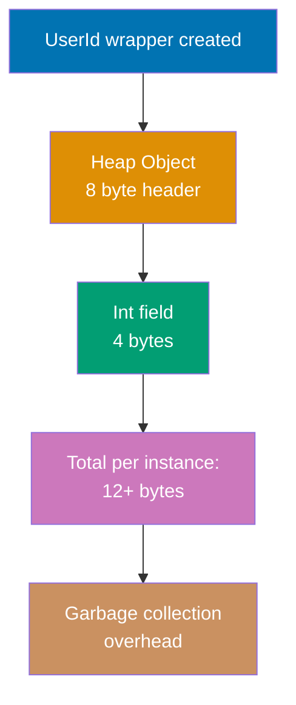

**Inline Value Class (Zero Allocation):**

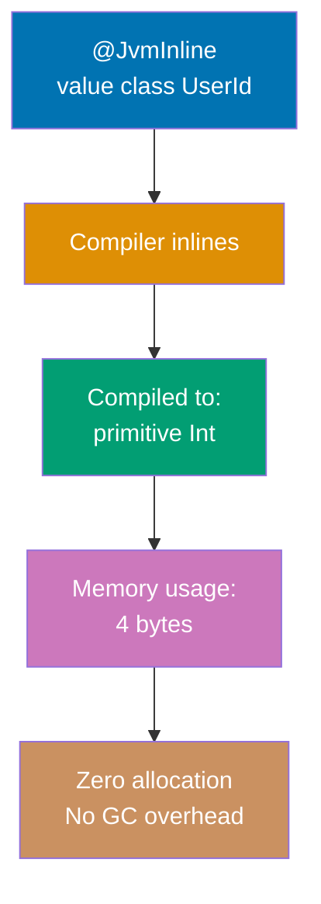

```kotlin
// Value class definition (Kotlin 1.5+)
@JvmInline                                   // => JVM backend annotation (required for Java interop)
value class UserId(val value: Int)          // => Single property required (inline constraint)
                                             // => Compiled to Int at runtime (no wrapper object)
                                             // => Type safety at compile time, zero cost at runtime

// Value class with validation
@JvmInline                                   // => Annotation enables inlining on JVM
value class Email(val value: String) {      // => Wraps String with validation
    init {                                   // => Init block executes during construction
        require(value.contains("@")) { "Invalid email: $value" }
                                             // => Runtime validation (throws IllegalArgumentException)
                                             // => Validation cost paid once at construction
    }

    fun domain(): String = value.substringAfter("@")
                                             // => Member functions allowed (compiled to static methods)
                                             // => No 'this' overhead (function receives String directly)
}

// Value class with operators
@JvmInline                                   // => Enables zero-cost abstraction
value class Meters(val value: Double) {     // => Type-safe distance measurement
    operator fun plus(other: Meters) = Meters(value + other.value)
                                             // => Operator overloading (compiled to static function)
                                             // => Returns new Meters instance (immutable)
    operator fun times(scalar: Int) = Meters(value * scalar)
                                             // => Scalar multiplication (Int * Meters)
                                             // => Type-safe: can't multiply Meters * Meters
}

// Type-safe function signatures with value classes
fun sendNotification(userId: UserId, email: Email, message: String) {
    println("Sending to user ${userId.value} at ${email.value}: $message")
                                             // => Access underlying value via .value property
                                             // => At runtime: function receives (Int, String, String)
}

fun calculateDistance(d1: Meters, d2: Meters): Meters {
    return d1 + d2                           // => Invokes plus operator (type-safe addition)
                                             // => Compiled to static call (no virtual dispatch)
}

// Boxing scenarios (when value class becomes object)
interface Identified {                      // => Generic interface
    val id: Int                              // => Interface property
}

@JvmInline
value class BoxedUserId(val value: Int) : Identified {
    override val id: Int get() = value      // => Implement interface property
}                                            // => Boxing occurs when used as Identified type

fun main() {
    println("=== Inline Classes (Value Classes) ===\n")

    // Zero allocation creation
    val userId = UserId(12345)               // => No heap allocation (inlined to Int 12345)
                                             // => Type is UserId at compile time
                                             // => Type is Int at runtime (JVM bytecode)
    val email = Email("user@example.com")    // => Inlined to String reference
                                             // => Validation executes in init block
                                             // => No wrapper object created

    // Type-safe function calls
    sendNotification(userId, email, "Welcome!")
                                             // => Type-checked at compile time
                                             // => Passed as (Int, String, String) at runtime
    // sendNotification(UserId(1), UserId(2), "test")
    //                                       // => Compile error: type mismatch (expected Email, got UserId)
    //                                       // => Prevents mixing up Int parameters

    // Email validation demonstration
    try {
        val invalid = Email("not-an-email")  // => Validation fails (no @ symbol)
    } catch (e: IllegalArgumentException) {
        println("Caught: ${e.message}")      // => Output: Caught: Invalid email: not-an-email
                                             // => Exception thrown from init block
    }

    // Value class methods (compiled to static)
    println("Email domain: ${email.domain()}")
                                             // => Output: Email domain: example.com
                                             // => Compiled to static method call
                                             // => No virtual dispatch overhead

    // Inline class arithmetic with operators
    val d1 = Meters(100.0)                   // => Create Meters instance (inlined to Double 100.0)
    val d2 = Meters(50.0)                    // => Inlined to Double 50.0
    val total = d1 + d2                      // => Invokes plus operator
                                             // => Compiled to: Meters.plus-impl(100.0, 50.0)
                                             // => Returns Meters wrapping 150.0
    val scaled = d1 * 3                      // => Scalar multiplication
                                             // => Compiled to: Meters.times-impl(100.0, 3)
                                             // => Returns Meters wrapping 300.0

    println("Distance: ${total.value} meters")
                                             // => Output: Distance: 150.0 meters
                                             // => Access underlying Double via .value
    println("Scaled: ${scaled.value} meters")
                                             // => Output: Scaled: 300.0 meters

    // Collections (specialized storage)
    val userIds = listOf(UserId(1), UserId(2), UserId(3))
                                             // => Stored as List<Int> internally at runtime
                                             // => No boxing (Int is primitive-compatible)
                                             // => Array storage: [1, 2, 3] (not [UserId@1, UserId@2, UserId@3])
    println("User IDs: $userIds")            // => Output: User IDs: [UserId(value=1), UserId(value=2), UserId(value=3)]
                                             // => toString() shows UserId wrapper (for debugging)
                                             // => Actual storage is primitive Int array

    // Performance comparison demonstration
    println("\n=== Performance Comparison ===")

    // Regular data class (heap allocated)
    data class RegularWrapper(val value: Int)
                                             // => Regular class (allocates object on heap)
                                             // => 16+ bytes per instance (header + field + padding)
                                             // => Subject to garbage collection

    val iterations = 10_000_000              // => 10 million iterations

    // Regular wrapper benchmark (allocates 10M objects)
    var startTime = System.currentTimeMillis()
                                             // => Record start time
    var sum = 0                              // => Accumulator (prevent dead code elimination)
    repeat(iterations) { i ->                // => Loop 10M times
        val wrapper = RegularWrapper(i)      // => Heap allocation (10M objects created)
                                             // => Each allocation: object header + Int field
        sum += wrapper.value                 // => Dereference wrapper (memory access)
    }                                        // => Triggers GC multiple times (pause application)
    println("Regular wrapper: ${System.currentTimeMillis() - startTime}ms")
                                             // => Reports elapsed time (includes GC pauses)
                                             // => Typical: 500-1000ms depending on heap size

    // Inline class benchmark (zero allocations)
    startTime = System.currentTimeMillis()   // => Reset timer
    sum = 0                                  // => Reset accumulator
    repeat(iterations) { i ->                // => Loop 10M times
        val inlined = UserId(i)              // => Zero allocation (inlined to Int i)
                                             // => Compiler optimizes to: sum += i
        sum += inlined.value                 // => Direct Int access (no dereference)
    }                                        // => No GC triggered (no objects allocated)
    println("Inline class: ${System.currentTimeMillis() - startTime}ms")
                                             // => Reports elapsed time (pure computation)
                                             // => Typical: 10-50ms (10-50x faster)
                                             // => Speedup from: no allocation + no GC + better cache locality

    // Boxing demonstration (when wrapper becomes object)
    println("\n=== Boxing Scenarios ===")

    val directUserId = UserId(999)           // => No boxing (used as value class)
                                             // => Stored as Int 999
    val boxedId: Any = directUserId          // => Boxing occurs (Any is interface)
                                             // => Allocates wrapper object on heap
                                             // => Type erasure: becomes UserId object reference
    println("Direct: $directUserId")         // => Output: Direct: UserId(value=999)
    println("Boxed: $boxedId")               // => Output: Boxed: UserId(value=999)

    // Interface implementation causes boxing
    val identified: Identified = BoxedUserId(777)
                                             // => Boxed to satisfy Identified interface
                                             // => Allocates object (can't inline interface impl)
    println("Interface ID: ${identified.id}") // => Output: Interface ID: 777
                                             // => Virtual dispatch (interface call)

    // Null safety with value classes
    val nullableUserId: UserId? = UserId(123)
                                             // => Nullable value class
                                             // => Boxed to support null (needs object reference)
    val nonNull: UserId = UserId(456)        // => Non-null value class (inlined)
    println("Nullable: $nullableUserId")     // => Output: Nullable: UserId(value=123)
                                             // => Boxing cost for null support

    // Equality and hashing (structural)
    val id1 = UserId(100)                    // => Create first ID
    val id2 = UserId(100)                    // => Create second ID (same value)
    println("\nEquality: ${id1 == id2}")     // => Output: Equality: true
                                             // => Structural equality (compares underlying Int)
                                             // => Compiled to: id1.value == id2.value
    println("Hash: ${id1.hashCode() == id2.hashCode()}")
                                             // => Output: Hash: true
                                             // => hashCode delegates to underlying value
                                             // => Compiled to: Integer.hashCode(id1.value)
}
```

**Key Takeaway**: Value classes provide zero-cost type safety; inlined to underlying type at runtime eliminating allocation overhead.

## **Why It Matters**: Wrapper types for domain modeling (UserId, Email, Money) improve type safety but Java's Integer/String wrappers cause heap allocations and garbage collection pressure in hot loops processing millions of records. Value classes provide compile-time type safety (can't mix UserId with OrderId) with zero runtime cost through inlining, achieving the same performance as primitives. This enables rich domain modeling without performance penalties, critical in high-throughput systems (payment processing, analytics, gaming) where allocation overhead directly impacts latency and throughput.

## Example 71: Performance - Sequences for Lazy Evaluation

Use sequences for large collections to avoid intermediate allocations.

**Eager List Operations (Multiple Allocations):**

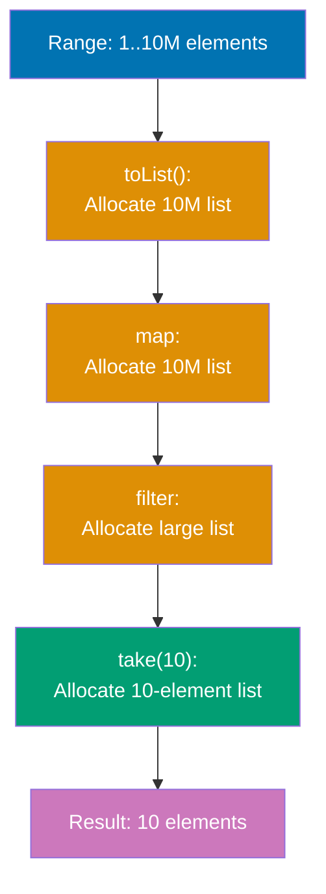

**Lazy Sequence Operations (Single Pass):**

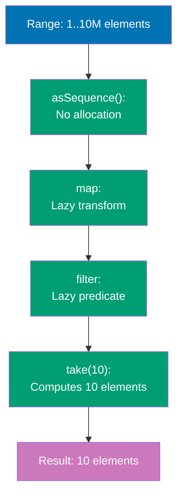

```kotlin
fun main() {
    println("=== Sequences for Performance ===\n")

    val range = 1..10_000_000                // => Range representing 10M integers
                                             // => Lazy by nature (doesn't allocate array)

    // Eager list operations (allocates multiple intermediate lists)
    println("--- List (Eager Evaluation) ---")
    var startTime = System.currentTimeMillis()
                                             // => Record benchmark start time
    val listResult = range.toList()         // => Allocates 10M element ArrayList
                                             // => Memory: ~40MB (10M * 4 bytes per Int)
        .map { it * 2 }                      // => Allocates NEW 10M element list
                                             // => Each element processed immediately
                                             // => Memory: another ~40MB (total 80MB)
        .filter { it > 1000 }                // => Allocates ANOTHER large list (9,999,500+ elements)
                                             // => Filters entire 10M mapped list
                                             // => Memory: another ~40MB (total 120MB+)
        .take(10)                            // => Allocates 10-element list
                                             // => Copies first 10 elements from filtered list
                                             // => Previous lists eligible for GC
    println("List result: $listResult")      // => Output: [1002, 1004, 1006, 1008, 1010, 1012, 1014, 1016, 1018, 1020]
    println("Time: ${System.currentTimeMillis() - startTime}ms\n")
                                             // => Typical: 800-2000ms (includes allocation + GC)
                                             // => Performance dominated by memory allocation

    // Lazy sequence operations (computes on demand, no intermediate allocations)
    println("--- Sequence (Lazy Evaluation) ---")
    startTime = System.currentTimeMillis()   // => Reset timer
    val seqResult = range.asSequence()       // => Convert to Sequence (no allocation)
                                             // => Creates iterator-based view of range
        .map { it * 2 }                      // => Returns TransformingSequence (no computation yet)
                                             // => Zero allocation (lazy transform registered)
        .filter { it > 1000 }                // => Returns FilteringSequence (no computation yet)
                                             // => Zero allocation (lazy filter registered)
        .take(10)                            // => Returns TakeSequence (no computation yet)
                                             // => Registers "stop after 10 elements" constraint
        .toList()                            // => TERMINAL operation triggers computation
                                             // => Processes elements one-by-one until 10 found
                                             // => Memory: only 10-element list allocated
    println("Sequence result: $seqResult")   // => Output: [1002, 1004, 1006, 1008, 1010, 1012, 1014, 1016, 1018, 1020]
                                             // => Same result as list approach
    println("Time: ${System.currentTimeMillis() - startTime}ms\n")
                                             // => Typical: 1-10ms (100-1000x faster)
                                             // => No GC pauses (minimal allocation)
                                             // => Speedup from: no intermediate lists + early termination

    // Demonstrate lazy evaluation execution order
    println("--- Lazy Evaluation Side Effects ---")

    // Eager list: completes each operation before next
    println("List operations (eager):")
    (1..5).map {                             // => Process ALL 5 elements first
        println("  Map: $it")                // => Prints: Map: 1, Map: 2, Map: 3, Map: 4, Map: 5
                                             // => All map operations complete before filter starts
        it * 2                               // => Transform: [2, 4, 6, 8, 10]
    }.filter {                               // => Then filter ALL 5 transformed elements
        println("  Filter: $it")             // => Prints: Filter: 2, Filter: 4, Filter: 6, Filter: 8, Filter: 10
                                             // => All filter checks after all maps
        it > 4                               // => Predicate result: [6, 8, 10]
    }.take(2)                                // => Finally take 2: [6, 8]
                                             // => But already processed all 5 elements

    // Lazy sequence: processes elements one-by-one (interleaved)
    println("\nSequence operations (lazy):")
    (1..5).asSequence().map {                // => Create lazy map transformer
        println("  Map: $it")                // => Prints element-by-element (interleaved)
        it * 2                               // => Transform applied per element
    }.filter {                               // => Filter immediately after map (same element)
        println("  Filter: $it")             // => Interleaved: Map 1 → Filter 2 → Map 2 → Filter 4...
        it > 4                               // => Predicate check per element
    }.take(2).toList()                       // => STOPS after finding 2 matching elements
                                             // => Output order: Map: 1, Filter: 2, Map: 2, Filter: 4, Map: 3, Filter: 6, Map: 4, Filter: 8
                                             // => Only processes 4 elements (stops early)

    // Infinite sequences (impossible with eager lists)
    println("\n--- Infinite Sequences ---")

    // Fibonacci sequence using generateSequence
    val fibonacci = generateSequence(Pair(0, 1)) { (a, b) ->
                                             // => Seed: Pair(0, 1) - first two Fibonacci numbers
                                             // => Generator: (a, b) → Pair(b, a+b)
        Pair(b, a + b)                       // => Generate next pair: (1, 0+1) → (1, 1) → (2, 1+1) → (3, 2+1) → (5, 3+2)...
                                             // => Infinite generator (never terminates on its own)
    }
        .map { it.first }                    // => Extract first element from each pair
                                             // => Lazy transformation (no computation yet)
        .take(15)                            // => Limit to first 15 elements
                                             // => Prevents infinite computation
        .toList()                            // => Materialize to list
                                             // => Computes exactly 15 Fibonacci numbers

    println("Fibonacci: $fibonacci")         // => Output: [0, 1, 1, 2, 3, 5, 8, 13, 21, 34, 55, 89, 144, 233, 377]
                                             // => Sequence computed on demand (stopped after 15)

    // Prime numbers using infinite sequence with filter
    fun isPrime(n: Int): Boolean {           // => Prime checking function
        if (n < 2) return false              // => 0 and 1 are not prime
        return (2..kotlin.math.sqrt(n.toDouble()).toInt()).none { n % it == 0 }
                                             // => Check divisibility up to sqrt(n)
                                             // => none { } returns true if no divisors found
    }

    val primes = generateSequence(2) { it + 1 }
                                             // => Infinite sequence: 2, 3, 4, 5, 6, 7, 8...
                                             // => Increments by 1 starting from 2
        .filter { isPrime(it) }              // => Filter primes lazily (tests each number)
                                             // => Lazy filter: checks isPrime(2), isPrime(3), isPrime(4)...
        .take(20)                            // => Take first 20 primes
                                             // => Stops generation after finding 20 primes
        .toList()                            // => Terminal operation (triggers computation)
                                             // => Computes until 20 primes found (tests ~73 numbers)

    println("First 20 primes: $primes")      // => Output: [2, 3, 5, 7, 11, 13, 17, 19, 23, 29, 31, 37, 41, 43, 47, 53, 59, 61, 67, 71]
                                             // => Sequence stopped after 71 (20th prime)

    // Sequence pipeline optimization demonstration
    println("\n--- Pipeline Optimization ---")

    // Inefficient: converts to list mid-pipeline (breaks laziness)
    val inefficientStart = System.currentTimeMillis()
    val inefficientResult = (1..1_000_000).asSequence()
        .map { it * 2 }                      // => Lazy map
        .toList()                            // => MATERIALIZES entire sequence (allocates 1M list)
                                             // => Breaks laziness chain
        .asSequence()                        // => Convert back to sequence (too late)
        .filter { it > 500 }                 // => Now filters 1M-element list
        .take(5)
        .toList()
    println("Inefficient: ${System.currentTimeMillis() - inefficientStart}ms")
                                             // => Slow: allocated 1M-element list

    // Efficient: maintains laziness throughout pipeline
    val efficientStart = System.currentTimeMillis()
    val efficientResult = (1..1_000_000).asSequence()
        .map { it * 2 }                      // => Lazy map (no allocation)
        .filter { it > 500 }                 // => Lazy filter (no allocation)
        .take(5)                             // => Lazy take (stops after 5)
        .toList()                            // => Single terminal operation (allocates 5-element list)
    println("Efficient: ${System.currentTimeMillis() - efficientStart}ms")
                                             // => Fast: zero intermediate allocations
                                             // => Processes only ~252 elements (stops at take)

    // Sequence vs List for file processing simulation
    println("\n--- Real-World Pattern: Log Processing ---")

    // Simulate log entries
    val logEntries = (1..100_000).map { "LogEntry-$it: ${if (it % 100 == 0) "ERROR" else "INFO"}" }
                                             // => 100K log entries (1000 errors)

    // Eager list approach (processes all 100K entries)
    val listStart = System.currentTimeMillis()
    val errorsList = logEntries                // => List of 100K entries
        .filter { it.contains("ERROR") }    // => Filters all 100K entries (allocates ~1K list)
        .map { it.substringBefore(":") }    // => Maps all 1K errors (allocates another list)
        .take(10)                            // => Takes 10 (but already processed all)
    println("List approach: ${System.currentTimeMillis() - listStart}ms, found ${errorsList.size}")
                                             // => Processed all 100K entries

    // Lazy sequence approach (early termination)
    val seqStart = System.currentTimeMillis()
    val errorsSeq = logEntries.asSequence()    // => Convert to sequence
        .filter { it.contains("ERROR") }    // => Lazy filter (tests element-by-element)
        .map { it.substringBefore(":") }    // => Lazy map (transforms on demand)
        .take(10)                            // => Stops after finding 10 errors
        .toList()                            // => Materializes only 10 elements
    println("Sequence approach: ${System.currentTimeMillis() - seqStart}ms, found ${errorsSeq.size}")
                                             // => Processed only ~1000 entries (stopped early)
                                             // => 100x fewer elements processed

    // When NOT to use sequences
    println("\n--- When NOT to Use Sequences ---")

    val smallList = listOf(1, 2, 3, 4, 5)    // => Small collection (5 elements)

    // For small collections, list operations are faster (less overhead)
    val smallListResult = smallList
        .map { it * 2 }                      // => Eager map (trivial allocation cost)
        .filter { it > 4 }                   // => Eager filter (overhead negligible)
                                             // => Total cost: ~100 nanoseconds
                                             // => Sequence overhead > savings for tiny collections

    val smallSeqResult = smallList.asSequence()
        .map { it * 2 }                      // => Creates TransformingSequence object
        .filter { it > 4 }                   // => Creates FilteringSequence object
        .toList()                            // => Iterator overhead for 5 elements
                                             // => Total cost: ~200 nanoseconds (slower!)

    println("Small list result: $smallListResult")
                                             // => Use lists for collections < 100 elements
                                             // => Sequence overhead not worth it
}
```

**Key Takeaway**: Sequences optimize multi-step transformations with lazy evaluation; essential for large collections and infinite streams.

**Why It Matters**: Processing large datasets with eager collections creates intermediate lists at each transformation step, exhausting heap memory and triggering garbage collection pauses that stall production servers. Sequences evaluate lazily element-by-element, avoiding intermediate allocations and enabling processing of datasets larger than available memory through streaming. This pattern is essential for ETL pipelines, log processing, and data analytics where materializing full datasets (millions of records) would cause OutOfMemoryError crashes, while sequences handle unlimited data with constant memory usage.

## Example 72: Testing with Kotest

Write expressive tests using Kotest's specification styles and rich matchers.

**Kotest Specification Styles:**

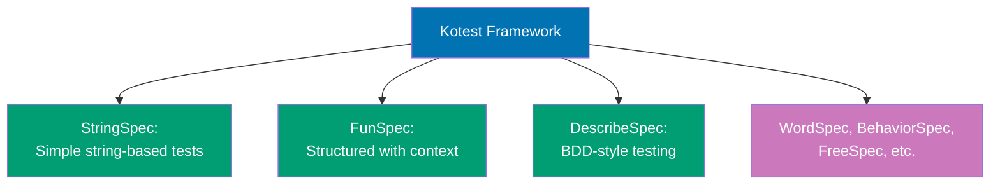

**Matcher Hierarchy:**

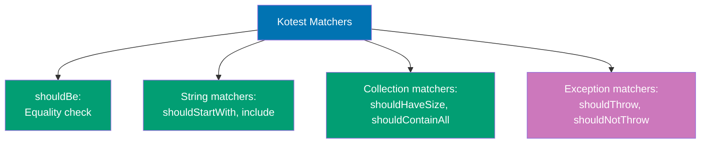

```kotlin
// Kotest imports for different specification styles
import io.kotest.core.spec.style.StringSpec
                                             // => StringSpec: simplest style (test name as string)
import io.kotest.core.spec.style.FunSpec    // => FunSpec: function-based with context blocks
import io.kotest.core.spec.style.DescribeSpec
                                             // => DescribeSpec: BDD-style (describe/it blocks)
import io.kotest.matchers.shouldBe           // => Core equality matcher (infix syntax)
import io.kotest.matchers.string.*           // => String-specific matchers (shouldStartWith, etc.)
import io.kotest.matchers.collections.*      // => Collection matchers (shouldHaveSize, shouldContainAll)
import io.kotest.matchers.ints.shouldBeGreaterThan
                                             // => Numeric comparison matchers
import io.kotest.assertions.throwables.shouldThrow
                                             // => Exception testing matchers

// StringSpec: simplest specification style
class UserServiceTest : StringSpec({         // => Inherits StringSpec base class
                                             // => Lambda-based DSL for test definition
    // Test format: "test name" { test body }
    "user creation should generate valid user" {
                                             // => Test name as string literal
                                             // => Describes expected behavior
        val user = createUser("Alice", "alice@example.com")
                                             // => Setup: create test user
                                             // => Factory function for user creation
        user.name shouldBe "Alice"           // => Assertion using infix shouldBe
                                             // => Compiles to: Matchers.shouldBe(user.name, "Alice")
                                             // => Failure message: "Alice" should equal "Alice"
        user.email shouldStartWith "alice"   // => String matcher: checks prefix
                                             // => Infix syntax (no parentheses)
                                             // => Failure message: "alice@example.com" should start with "alice"
        user.email should include("@")       // => String contains matcher
                                             // => should + matcher function call syntax
                                             // => Failure message: "alice@example.com" should include "@"
    }

    "email validation should reject invalid emails" {
        val invalidResult = validateEmail("invalid")
                                             // => Test invalid email (no @ symbol)
        invalidResult shouldBe false         // => Assert rejection
                                             // => Type-safe: both sides must be Boolean

        val validResult = validateEmail("test@example.com")
                                             // => Test valid email
        validResult shouldBe true            // => Assert acceptance
    }

    "user list should not be empty" {
        val users = listOf(                  // => Create test user list
            createUser("Alice", "alice@example.com"),
            createUser("Bob", "bob@example.com")
        )                                    // => List<User> with 2 elements
        users shouldHaveSize 2               // => Collection size matcher
                                             // => Infix syntax for readability
                                             // => Failure message: "List should have size 2 but has X"
        users.map { it.name } shouldContainAll listOf("Alice", "Bob")
                                             // => Collection content matcher (order-independent)
                                             // => Checks all expected elements present
                                             // => Failure message: "List should contain all of [Alice, Bob] but missing X"
    }

    "should throw exception for invalid data" {
                                             // => Testing exception scenarios
        shouldThrow<IllegalArgumentException> {
                                             // => Generic exception type check
                                             // => Lambda executes code expected to throw
            createUser("", "invalid")        // => Invalid input (empty name)
        }                                    // => Fails if no exception or wrong exception type
                                             // => Returns thrown exception for further assertions
    }
})

// FunSpec: structured specification with context blocks
class CalculatorTest : FunSpec({             // => Inherits FunSpec (supports nested structure)
                                             // => Lambda receives FunSpec DSL context

    // context: groups related tests (like describe in other frameworks)
    context("addition operations") {         // => Test group for addition tests
                                             // => Creates nested test scope
                                             // => Output: "addition operations - should add positive numbers"

        // test: individual test case within context
        test("should add positive numbers") {
                                             // => Test name (combined with context)
            val result = 2 + 3               // => Perform addition
            result shouldBe 5                // => Assert expected result
                                             // => Failure message: "5 should equal 5"
        }

        test("should add negative numbers") {
            val result = -2 + -3             // => Negative number addition
            result shouldBe -5               // => Assert negative result
        }

        test("should handle zero") {         // => Edge case testing
            val result = 5 + 0               // => Addition with zero
            result shouldBe 5                // => Identity property
        }
    }

    context("division operations") {         // => Second test group
        test("should divide evenly") {
            val result = 10 / 2              // => Even division
            result shouldBe 5                // => Integer result
        }

        test("should handle integer division") {
            val result = 10 / 3              // => Integer division (truncates)
            result shouldBe 3                // => Kotlin Int division truncates (not rounds)
                                             // => Not 3.33 (would need Double)
        }

        test("division by zero should throw") {
                                             // => Exception testing in FunSpec
            shouldThrow<ArithmeticException> {
                                             // => Expect ArithmeticException
                @Suppress("DIVISION_BY_ZERO")
                10 / 0                       // => Division by zero
            }                                // => JVM throws ArithmeticException for / by zero
        }
    }

    // Nested contexts for deeper organization
    context("multiplication operations") {
        context("positive numbers") {        // => Nested context (2 levels deep)
            test("should multiply two positives") {
                (3 * 4) shouldBe 12          // => Nested test execution
            }                                // => Full name: "multiplication operations - positive numbers - should multiply two positives"
        }

        context("negative numbers") {
            test("should handle negative * positive") {
                (-3 * 4) shouldBe -12        // => Sign rules
            }

            test("should handle negative * negative") {
                (-3 * -4) shouldBe 12        // => Double negative = positive
            }
        }
    }
})

// DescribeSpec: BDD-style specification
class DataProcessorSpec : DescribeSpec({     // => BDD-style: describe/it blocks
                                             // => Mimics RSpec, Jasmine syntax

    // describe: describes component/feature being tested
    describe("data processor") {             // => Top-level describe block
                                             // => Groups tests for "data processor" component

        // it: describes specific behavior
        it("should transform data") {        // => BDD-style test name ("it should...")
            val input = "hello"              // => Setup test input
            val output = input.uppercase()   // => Perform transformation
            output shouldBe "HELLO"          // => Assert transformation result
                                             // => Reads naturally: "data processor it should transform data"
        }

        it("should filter data") {
            val numbers = listOf(1, 2, 3, 4, 5)
                                             // => Input collection
            val evens = numbers.filter { it % 2 == 0 }
                                             // => Filter even numbers
            evens shouldContainExactly listOf(2, 4)
                                             // => Exact match matcher (order matters)
                                             // => Failure if order differs: [4, 2] fails
        }

        it("should handle empty input") {    // => Edge case: empty collection
            val empty = emptyList<Int>()     // => Empty list
            val result = empty.filter { it > 0 }
            result shouldBe emptyList()      // => Should remain empty
        }

        // Nested describe for subsystems
        describe("validation") {             // => Nested describe (2 levels)
            it("should reject invalid input") {
                val result = validateEmail("not-an-email")
                result shouldBe false        // => Validation rejection
            }

            it("should accept valid input") {
                val result = validateEmail("valid@example.com")
                result shouldBe true         // => Validation acceptance
            }
        }
    }

    describe("error handling") {             // => Second top-level describe
        it("should handle null input gracefully") {
            val input: String? = null        // => Nullable input
            val result = input?.uppercase()  // => Safe call operator
            result shouldBe null             // => Expect null result
        }

        it("should propagate exceptions") {
            shouldThrow<IllegalArgumentException> {
                require(false) { "Test error" }
                                             // => Force exception
            }                                // => Verify exception propagation
        }
    }
})

// Advanced matchers demonstration
class MatchersExampleSpec : StringSpec({     // => Demonstrate rich matcher library

    "string matchers showcase" {
        val email = "alice@example.com"

        // String content matchers
        email shouldStartWith "alice"        // => Prefix check
        email shouldEndWith ".com"           // => Suffix check
        email should include("@")            // => Contains check
        email shouldContain "@"              // => Alternative contains syntax
        email shouldMatch Regex("\\w+@\\w+\\.\\w+")
                                             // => Regex pattern matching
                                             // => Failure shows actual vs pattern
    }

    "collection matchers showcase" {
        val numbers = listOf(1, 2, 3, 4, 5)

        // Size matchers
        numbers shouldHaveSize 5             // => Exact size
        numbers.size shouldBeGreaterThan 3   // => Size comparison
                                             // => Numeric comparison matcher

        // Content matchers
        numbers shouldContain 3              // => Single element check
        numbers shouldContainAll listOf(2, 4)
                                             // => Multiple elements (order-independent)
        numbers shouldContainExactly listOf(1, 2, 3, 4, 5)
                                             // => Exact match with order
        numbers shouldContainInOrder listOf(1, 3, 5)
                                             // => Subset with order preserved
                                             // => [1, 3, 5] in that order (others ignored)
    }

    "nullable matchers showcase" {
        val nullable: String? = "value"
        val nullValue: String? = null

        nullable shouldNotBe null            // => Null check (smart cast enabled)
                                             // => After assertion, nullable is String (non-null)
        nullValue shouldBe null              // => Expect null

        // After non-null assertion, smart cast works
        nullable.length shouldBe 5           // => Compiler knows nullable is String
                                             // => No safe call (?.) needed
    }

    "exception matchers showcase" {
        // Exception type check
        val exception = shouldThrow<IllegalArgumentException> {
            require(false) { "Custom message" }
        }                                    // => Returns thrown exception
        exception.message shouldBe "Custom message"
                                             // => Assert exception message content

        // Exception should NOT be thrown
        shouldNotThrow<Exception> {          // => Opposite of shouldThrow
            val result = 5 + 3               // => Safe operation
            result shouldBe 8                // => Can make assertions inside
        }                                    // => Fails if any exception thrown
    }

    "numeric comparison matchers" {
        val value = 42

        value shouldBeGreaterThan 40         // => Greater than check
        value shouldBeLessThan 50            // => Less than check
        value shouldBeInRange 40..50         // => Range inclusion check
                                             // => Closed range (includes endpoints)
        value shouldBe 42                    // => Exact equality
    }

    "boolean matchers" {
        val condition = true

        condition shouldBe true              // => Boolean equality
                                             // => Failure message: "true should equal true"
        // Alternative: more expressive
        condition.shouldBeTrue()             // => Extension function style
                                             // => Reads more naturally for booleans
        false.shouldBeFalse()                // => Negation check
    }
})

// Helper functions for tests
data class User(val name: String, val email: String) {
    init {
        require(name.isNotBlank()) { "Name cannot be blank" }
                                             // => Validation in data class
        require(email.contains("@")) { "Invalid email format" }
    }
}

fun createUser(name: String, email: String) = User(name, email)
                                             // => Factory function for user creation
                                             // => Delegates to User constructor

fun validateEmail(email: String): Boolean = email.contains("@")
                                             // => Simple email validation (contains @)
                                             // => Production would use regex
```

**Key Takeaway**: Kotest provides multiple specification styles (StringSpec, FunSpec, DescribeSpec) with expressive matchers for readable tests.

**Why It Matters**: JUnit's annotation-based testing feels verbose and Java-centric, while Kotest provides Kotlin-idiomatic specification styles (StringSpec for simple tests, DescribeSpec for BDD) that read like natural language. Rich matchers (shouldStartWith, shouldContainExactly) eliminate assertion boilerplate and provide descriptive failure messages, reducing debugging time when tests fail. Multiple specification styles let teams choose testing DSLs matching their methodology (BDD, TDD, property-based), making tests more maintainable and readable for teams transitioning from Java to Kotlin-first testing practices.

## Example 73: Testing Coroutines with runTest

Test coroutines with virtual time using runTest from kotlinx-coroutines-test. The runTest function creates a test environment where delays execute instantly and time advances programmatically, enabling deterministic testing of time-dependent coroutine logic without real wall-clock delays that slow down test suites.

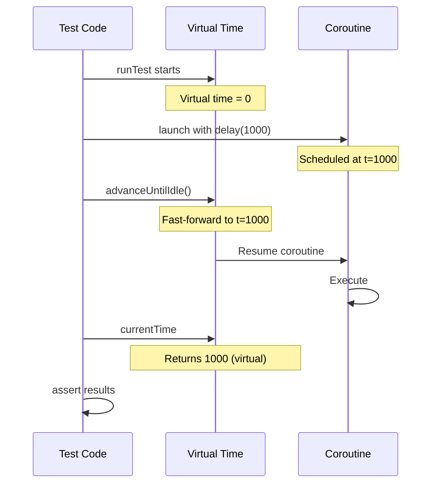

```kotlin
import kotlinx.coroutines.*
import kotlinx.coroutines.test.*
import kotlin.test.Test
import kotlin.test.assertEquals
import kotlin.test.assertTrue

// Test class demonstrating runTest virtual time control
class CoroutineTest {
    @Test
    fun testDelayedOperation() = runTest {
        // => runTest creates TestScope with virtual time scheduler
        // => All delays in this scope execute instantly (no real wait)
        // => Virtual time tracked separately from wall-clock time
        // => Return type: TestResult (JUnit compatible)

        // => result starts as 0 (type: Int, mutable var)
        // => Used to verify coroutine completion state
        var result = 0

        // => launch starts child coroutine in TestScope
        // => Coroutine scheduled but NOT executed yet
        // => Virtual time still at 0
        // => Job returned (not stored, runs in background)
        launch {
            // => delay(1000) schedules resumption at virtual time t=1000
            // => Does NOT wait real 1000ms (instant in test environment)
            // => Coroutine suspended until time advanced to 1000
            // => This models production delay without real wait time
            delay(1000)

            // => This assignment happens at virtual t=1000
            // => NOT executed yet (coroutine still suspended)
            // => Waiting for time advancement
            result = 42
        }

        // Check state before time advancement
        // => result is still 0 (coroutine not resumed yet)
        // => Virtual time still at 0 (no advancement called)
        // => assertEquals(expected, actual) assertion syntax
        assertEquals(0, result)

        // => advanceUntilIdle() advances virtual time to next scheduled event
        // => Finds coroutine scheduled at t=1000, advances to 1000
        // => Resumes suspended coroutine, executes result = 42
        // => Continues until no more scheduled coroutines
        // => Virtual time now at 1000ms
        advanceUntilIdle()

        // => result is now 42 (coroutine completed)
        // => Virtual time at 1000 (verified below)
        // => Assertion passes: actual result matches expected
        assertEquals(42, result)
    }

    @Test
    fun testMultipleDelays() = runTest {
        // => runTest creates fresh TestScope for this test
        // => Independent virtual time (starts at 0 again)
        // => Each test isolated (no shared state)

        // => results is empty mutable list (type: MutableList<Int>)
        // => Used to track execution order of coroutines
        // => Verifies time-based scheduling works correctly
        val results = mutableListOf<Int>()

        // Launch first coroutine (100ms delay)
        // => Coroutine scheduled to add 1 at virtual t=100
        // => Suspended immediately (not executed yet)
        launch {
            // => Suspends until virtual time reaches 100
            delay(100)
            // => Executes at t=100: results becomes [1] or [3, 1]
            // => Depends on which coroutines ran before this
            results.add(1)
        }

        // Launch second coroutine (200ms delay)
        // => Coroutine scheduled to add 2 at virtual t=200
        // => Longest delay of the three coroutines
        launch {
            // => Suspends until virtual time reaches 200
            delay(200)
            // => Executes at t=200: results becomes [..., 2]
            // => Last coroutine to execute
            results.add(2)
        }

        // Launch third coroutine (50ms delay)
        // => Coroutine scheduled to add 3 at virtual t=50
        // => Shortest delay, executes first
        launch {
            // => Suspends until virtual time reaches 50
            delay(50)
            // => Executes at t=50: results becomes [3]
            // => First coroutine to complete
            results.add(3)
        }

        // => advanceTimeBy(60) advances virtual time by 60ms
        // => Virtual time moves from 0 to 60
        // => Resumes coroutines scheduled at t <= 60
        // => Only t=50 coroutine eligible (adds 3)
        // => Coroutines at t=100 and t=200 still suspended
        advanceTimeBy(60)

        // => results is [3] (only t=50 coroutine ran)
        // => listOf(3) creates expected immutable list
        // => Assertion verifies partial execution
        assertEquals(listOf(3), results)

        // => advanceTimeBy(50) advances virtual time by 50ms MORE
        // => Virtual time moves from 60 to 110
        // => Resumes coroutines scheduled at 60 < t <= 110
        // => t=100 coroutine now eligible (adds 1)
        // => t=200 coroutine still suspended
        advanceTimeBy(50)

        // => results is [3, 1] (t=50 and t=100 coroutines ran)
        // => Order preserved: 3 added first, then 1
        // => Verifies execution order matches delay timing
        assertEquals(listOf(3, 1), results)

        // => advanceUntilIdle() advances to next scheduled event
        // => Finds t=200 coroutine, advances from 110 to 200
        // => Resumes last coroutine (adds 2)
        // => No more scheduled coroutines, stops
        advanceUntilIdle()

        // => results is [3, 1, 2] (all coroutines completed)
        // => Execution order: 50ms, 100ms, 200ms (ascending delays)
        // => Demonstrates virtual time scheduling correctness
        assertEquals(listOf(3, 1, 2), results)
    }

    @Test
    fun testTimeout() = runTest {
        // => runTest for async/await timeout testing
        // => Tests deferred completion state at different times

        // => async creates Deferred<String> (lazy execution)
        // => Coroutine scheduled to complete at t=2000
        // => deferred.isCompleted initially false
        val deferred = async {
            // => Suspends until virtual time reaches 2000
            delay(2000)
            // => Returns "result" at t=2000
            // => Type: String (deferred result type)
            "result"
        }

        // => Advance virtual time by 1000ms (t=0 to t=1000)
        // => Not enough time for deferred to complete (needs t=2000)
        // => Deferred still suspended at delay
        advanceTimeBy(1000)

        // => !deferred.isCompleted is true (not completed)
        // => Virtual time at 1000, deferred scheduled for 2000
        // => assertTrue verifies condition is true
        assertTrue(!deferred.isCompleted)

        // => Advance virtual time by another 1000ms (t=1000 to t=2000)
        // => Now reaches deferred's scheduled completion time
        // => Resumes deferred coroutine, executes return "result"
        advanceTimeBy(1000)

        // => deferred.isCompleted is true (completed at t=2000)
        // => Virtual time exactly at 2000
        assertTrue(deferred.isCompleted)

        // => deferred.await() returns "result" (type: String)
        // => No suspension (already completed)
        // => Assertion verifies deferred result value
        assertEquals("result", deferred.await())
    }

    @Test
    fun testCurrentTime() = runTest {
        // => runTest provides currentTime property (type: Long)
        // => Tracks virtual time in milliseconds
        // => Starts at 0, advances with delay/advanceTimeBy

        // => currentTime is 0 (initial virtual time)
        // => assertEquals(expected: Long, actual: Long)
        assertEquals(0, currentTime)

        // => delay(500) advances virtual time by 500ms
        // => Virtual time moves from 0 to 500 instantly
        // => No real wait (virtual time advancement)
        delay(500)

        // => currentTime is 500 (virtual time advanced)
        // => Verifies delay advances time correctly
        assertEquals(500, currentTime)

        // => delay(1500) advances virtual time by 1500ms more
        // => Virtual time moves from 500 to 2000 instantly
        // => Cumulative time tracking
        delay(1500)

        // => currentTime is 2000 (500 + 1500)
        // => Virtual time accumulates across delays
        assertEquals(2000, currentTime)
    }

    @Test
    fun testWithTimeout() = runTest {
        // => runTest for timeout testing with virtual time
        // => Tests TimeoutCancellationException behavior

        // => try-catch for expected timeout exception
        // => withTimeout throws if block exceeds timeout
        try {
            // => withTimeout(1000) sets virtual timeout at 1000ms
            // => Cancels block if not completed by t=1000
            // => Returns block result if completes in time
            withTimeout(1000) {
                // => delay(2000) schedules completion at t=2000
                // => Exceeds timeout of 1000ms
                // => TimeoutCancellationException thrown at t=1000
                delay(2000)

                // => NEVER REACHED: timeout occurs first
                // => Would return "result" if no timeout
                "result"
            }
            // => NEVER REACHED: withTimeout throws exception
        } catch (e: TimeoutCancellationException) {
            // => Catches timeout exception (expected behavior)
            // => e.message is "Timed out waiting for 1000 ms"
            // => This is the success path for this test
            // => No assertion needed (catch proves timeout occurred)
        }

        // => currentTime is 1000 (advanced to timeout point)
        // => Virtual time stopped at timeout, not at delay(2000)
        // => Verifies timeout terminates at correct time
        assertEquals(1000, currentTime)
    }
}
```

**Key Takeaway**: runTest enables fast deterministic testing of time-dependent coroutines with virtual time control via advanceTimeBy, advanceUntilIdle, and currentTime properties.

**Why It Matters**: Testing coroutines with real delays makes test suites unbearably slow (waiting seconds/minutes for timeouts and retries), while runTest's virtual time advances instantly skipping actual delays, executing time-dependent tests in milliseconds. This enables deterministic testing of timeout logic, retry mechanisms, and scheduled tasks without flakiness from real-time race conditions. Fast, deterministic coroutine tests are essential for CI/CD pipelines where slow test suites block deployments, and flaky time-dependent tests erode confidence in production readiness.

---

## Example 74: Mocking with MockK

Create test doubles using MockK for Kotlin-friendly mocking with DSL. MockK provides Kotlin-idiomatic syntax for stubbing method behavior, verifying interactions, and testing suspend functions, solving the problem of Java-based mocking frameworks (like Mockito) lacking support for Kotlin coroutines and language features.

```kotlin
import io.mockk.*
import kotlin.test.Test
import kotlin.test.assertEquals

// Repository interface for dependency injection and testing
// => Defines contract for user data access
// => Methods represent different retrieval patterns
interface UserRepository {
    // => Synchronous user lookup by ID
    // => Returns User? (nullable for not-found case)
    fun findUser(id: Int): User?

    // => Synchronous user persistence
    // => Returns Boolean (success/failure indicator)
    fun saveUser(user: User): Boolean

    // => Asynchronous user fetch (suspend function)
    // => Returns User? after async operation (network/database)
    suspend fun fetchUserAsync(id: Int): User?
}

// Simple data class for user domain model
// => id: unique identifier (type: Int)
// => name: user's name (type: String)
// => Immutable value object (no mutable properties)
data class User(val id: Int, val name: String)

// Service layer with injected repository dependency
// => repository is constructor parameter (dependency injection)
// => Service delegates data access to repository
// => Testable through repository mocking
class UserService(private val repository: UserRepository) {
    // => Delegates to repository.findUser(id)
    // => Returns User? (nullable result)
    // => Simple pass-through (no business logic)
    fun getUser(id: Int): User? = repository.findUser(id)

    // => Creates user with auto-generated ID (0 placeholder)
    // => Saves user via repository.saveUser
    // => Returns created user (ignores save result)
    fun createUser(name: String): User {
        // => user is User(0, name) where 0 is temp ID
        val user = User(0, name)
        // => repository.saveUser(user) returns Boolean
        // => Return value ignored (fire-and-forget)
        repository.saveUser(user)
        // => Returns created user to caller
        return user
    }

    // => Async user retrieval (suspend function)
    // => Delegates to repository.fetchUserAsync
    // => Preserves suspend semantics through delegation
    suspend fun getUserAsync(id: Int): User? = repository.fetchUserAsync(id)
}

// Test class demonstrating MockK DSL patterns
class UserServiceTest {
    @Test
    fun testFindUser() {
        // Create mock instance of UserRepository
        // => mockk<UserRepository>() creates test double
        // => Mock intercepts all interface method calls
        // => Type parameter specifies interface to mock
        // => repo is UserRepository (mock implementation)
        val repo = mockk<UserRepository>()

        // Stub findUser behavior for specific inputs
        // => every { block } defines stubbing behavior
        // => repo.findUser(1) is method call matcher
        // => returns User(1, "Alice") sets return value
        // => Exact match: only id=1 returns Alice
        every { repo.findUser(1) } returns User(1, "Alice")

        // => Stub second behavior: id=2 returns null
        // => Demonstrates nullable return value stubbing
        // => Different stubs for different argument values
        every { repo.findUser(2) } returns null

        // => service is UserService with mocked repository
        // => Dependency injection via constructor
        // => Service calls hit mock, not real implementation
        val service = UserService(repo)

        // Test stubbed behavior for id=1
        // => service.getUser(1) calls repo.findUser(1)
        // => Mock returns stubbed User(1, "Alice")
        // => user1 is User? (nullable type)
        val user1 = service.getUser(1)

        // => user1?.name is "Alice" (safe call operator)
        // => Assertion verifies stubbed value returned correctly
        assertEquals("Alice", user1?.name)

        // Test stubbed behavior for id=2
        // => service.getUser(2) calls repo.findUser(2)
        // => Mock returns stubbed null
        // => user2 is null (User? type)
        val user2 = service.getUser(2)

        // => user2 is null (matches stub)
        // => assertEquals(expected, actual) syntax
        assertEquals(null, user2)

        // Verify method call interactions
        // => verify { block } checks method was called
        // => repo.findUser(1) verifies call with exact argument
        // => Fails if method not called with id=1
        verify { repo.findUser(1) }

        // => Verifies second call with id=2
        // => Both verify calls check method invocations
        verify { repo.findUser(2) }

        // => verify(exactly = 2) checks total call count
        // => any() matches any Int argument
        // => Verifies findUser called exactly twice (not more/less)
        verify(exactly = 2) { repo.findUser(any()) }
    }

    @Test
    fun testSaveUser() {
        // => mockk<UserRepository>(relaxed = true) creates relaxed mock
        // => Relaxed mocks auto-stub Unit/default returns
        // => saveUser returns Boolean: auto-stubbed to false
        // => Avoids explicit stubbing for every method
        val repo = mockk<UserRepository>(relaxed = true)

        // => service uses relaxed mock (no saveUser stub needed)
        val service = UserService(repo)

        // => service.createUser("Bob") creates User(0, "Bob")
        // => Calls repo.saveUser with created user
        // => user is User(0, "Bob") (type: User)
        val user = service.createUser("Bob")

        // Verify saveUser called with user matching name
        // => verify { block } checks interaction occurred
        // => match { predicate } is argument matcher
        // => it is captured User argument (type: User)
        // => it.name == "Bob" verifies user's name property
        // => Fails if saveUser not called OR name doesn't match
        verify { repo.saveUser(match { it.name == "Bob" }) }
    }

    @Test
    fun testAsyncFetch() = kotlinx.coroutines.test.runTest {
        // => runTest creates coroutine test environment
        // => Enables suspend function testing

        // => mockk<UserRepository>() creates standard mock
        // => Will stub suspend function next
        val repo = mockk<UserRepository>()

        // Stub suspend function behavior
        // => coEvery { block } stubs SUSPEND functions
        // => Different from every (for regular functions)
        // => repo.fetchUserAsync(1) is suspend call matcher
        // => returns User(1, "Alice") sets async return value
        coEvery { repo.fetchUserAsync(1) } returns User(1, "Alice")

        // => service uses mocked repository
        val service = UserService(repo)

        // => service.getUserAsync(1) is suspend call
        // => Calls mocked repo.fetchUserAsync(1)
        // => Mock returns stubbed User(1, "Alice")
        // => user is User? (nullable type)
        val user = service.getUserAsync(1)

        // => user?.name is "Alice" (stubbed value)
        // => Assertion verifies suspend function stubbing works
        assertEquals("Alice", user?.name)

        // Verify suspend function was called
        // => coVerify { block } verifies SUSPEND function calls
        // => Different from verify (for regular functions)
        // => repo.fetchUserAsync(1) checks suspend call occurred
        // => Fails if suspend function not invoked
        coVerify { repo.fetchUserAsync(1) }
    }

    @Test
    fun testAnswers() {
        // => mockk<UserRepository>() creates standard mock
        // => Will use dynamic answer (not static stub)
        val repo = mockk<UserRepository>()

        // Dynamic answer based on arguments
        // => every { repo.findUser(any()) } matches ALL findUser calls
        // => answers { lambda } provides dynamic response
        // => Lambda executes on each method call
        every { repo.findUser(any()) } answers {
            // => firstArg<Int>() extracts first argument as Int
            // => id is Int (the argument passed to findUser)
            // => Type-safe argument extraction
            val id = firstArg<Int>()

            // => Conditional logic based on argument value
            // => if id > 0: return User(id, "User $id")
            // => else: return null
            // => Dynamic response (not fixed stub)
            if (id > 0) User(id, "User $id") else null
        }

        // => service uses mock with dynamic answers
        val service = UserService(repo)

        // => service.getUser(5) calls repo.findUser(5)
        // => Answer lambda executes: id=5, returns User(5, "User 5")
        // => getUser(5)?.name is "User 5"
        assertEquals("User 5", service.getUser(5)?.name)

        // => service.getUser(-1) calls repo.findUser(-1)
        // => Answer lambda executes: id=-1, returns null
        // => getUser(-1) is null
        assertEquals(null, service.getUser(-1))
    }

    @Test
    fun testSlot() {
        // => mockk<UserRepository>() creates standard mock
        val repo = mockk<UserRepository>()

        // Create argument capture slot
        // => slot<User>() creates CapturingSlot<User>
        // => Used to capture method arguments during execution
        // => Enables inspection of passed arguments
        val slot = slot<User>()

        // Stub with argument capture
        // => every { repo.saveUser(capture(slot)) } stubs saveUser
        // => capture(slot) captures argument AND matches any User
        // => Captured value stored in slot for later inspection
        // => returns true sets return value
        every { repo.saveUser(capture(slot)) } returns true

        // => service uses mock with capturing stub
        val service = UserService(repo)

        // => service.createUser("Charlie") creates User(0, "Charlie")
        // => Calls repo.saveUser with created user
        // => Argument captured into slot
        service.createUser("Charlie")

        // Access captured argument
        // => slot.captured retrieves last captured value
        // => slot.captured is User(0, "Charlie") (type: User)
        // => .name accesses name property
        // => slot.captured.name is "Charlie"
        assertEquals("Charlie", slot.captured.name)
    }
}
```

**Key Takeaway**: MockK provides Kotlin-idiomatic mocking with DSL-based stubbing (every/coEvery), verification (verify/coVerify), argument capture (slot), and relaxed mocking for Unit-returning functions.

**Why It Matters**: Mockito's Java-centric API feels unnatural in Kotlin (verbose when() syntax, no suspend function support), while MockK provides Kotlin-idiomatic DSL (every { mock.method() } returns result) with first-class coroutine support via coEvery/coVerify. Built-in relaxed mocking, argument capture (slot), and verification DSL eliminate boilerplate that clutters Java tests. MockK's suspend function mocking is essential for testing coroutine-based repositories and services, enabling isolated unit tests of business logic without actual network/database calls in modern Kotlin backends.

---

## Example 75: Gradle Custom Tasks

Define custom Gradle tasks using Kotlin DSL for build automation. Gradle Kotlin DSL provides type-safe task definition with compile-time validation, replacing Groovy's runtime-checked dynamic typing with Kotlin's static type system. This enables IDE autocomplete, refactoring support, and early error detection for complex build automation workflows.

```kotlin
// ===== build.gradle.kts =====

// => Import for timestamp generation in build tasks
// => LocalDateTime provides current time for build info
import java.time.LocalDateTime
// => DateTimeFormatter formats timestamps for file output
// => ISO_LOCAL_DATE_TIME format: 2024-01-15T10:30:45
import java.time.format.DateTimeFormatter

// => plugins { } block declares Gradle plugins
// => kotlin("jvm") applies Kotlin JVM plugin for compilation
// => version "1.9.21" pins Kotlin compiler version
plugins {
    kotlin("jvm") version "1.9.21"
}

// => repositories { } configures dependency sources
// => mavenCentral() adds Maven Central repository
// => Required for resolving Kotlin stdlib and test dependencies
repositories {
    mavenCentral()
}

// => dependencies { } declares project dependencies
// => implementation() adds runtime dependencies
// => testImplementation() adds test-only dependencies
dependencies {
    // => kotlin("stdlib") resolves to org.jetbrains.kotlin:kotlin-stdlib
    // => Kotlin standard library (required for all Kotlin projects)
    implementation(kotlin("stdlib"))

    // => kotlin("test") resolves to Kotlin test framework
    // => Includes JUnit integration and assertion DSL
    testImplementation(kotlin("test"))
}

// Simple custom task registration
// => tasks.register("hello") creates new task named "hello"
// => Lambda configures task properties
// => Task type: DefaultTask (inferred, not explicit)
tasks.register("hello") {
    // => group = "custom" assigns task to "custom" group
    // => Groups organize tasks in gradle tasks output
    group = "custom"

    // => description shown in gradle tasks --all
    // => Documents task purpose for users
    description = "Prints hello message"

    // => doLast { } defines task action (execution code)
    // => Runs after task configuration phase
    // => Multiple doLast blocks execute in registration order
    doLast {
        // => println outputs to console during task execution
        // => Output: Hello from custom task!
        println("Hello from custom task!")
    }
}

// Task with typed properties (custom task class)
// => abstract class GreetTask extends DefaultTask
// => Abstract enables Gradle property injection
// => Cannot be instantiated directly (Gradle creates instances)
abstract class GreetTask : DefaultTask() {
    // => @get:Input marks property as task input for caching
    // => Gradle tracks input changes for up-to-date checks
    // => Property<String> is lazy-evaluated property holder
    @get:Input
    abstract val greeting: Property<String>

    // => Second input property (also tracked for caching)
    // => abstract val requires Gradle to provide implementation
    @get:Input
    abstract val name: Property<String>

    // => @TaskAction marks method as task execution entry point
    // => Gradle calls this method when task runs
    // => Only one @TaskAction allowed per task class
    @TaskAction
    fun greet() {
        // => greeting.get() retrieves property value (type: String)
        // => name.get() retrieves name value
        // => String interpolation: "${expr}" syntax
        // => Output: Hello, Kotlin Developer! (with default config below)
        println("${greeting.get()}, ${name.get()}!")
    }
}

// Register typed task with configuration
// => tasks.register<GreetTask>("greet") creates GreetTask instance
// => Type parameter <GreetTask> specifies task type explicitly
// => "greet" is task name (callable via gradle greet)
tasks.register<GreetTask>("greet") {
    // => group and description same as previous task
    group = "custom"
    description = "Greets someone"

    // => greeting.set("Hello") assigns property value
    // => .set() method provided by Property<String>
    // => Value stored for later retrieval in @TaskAction
    greeting.set("Hello")

    // => name.set() configures second property
    // => Values used when greet() executes
    name.set("Kotlin Developer")
}

// Task with file output and build metadata
// => tasks.register("generateBuildInfo") creates simple task
// => Lambda configures task behavior
tasks.register("generateBuildInfo") {
    // => group = "build" assigns to build task group
    // => Appears with other build-related tasks
    group = "build"
    description = "Generate build info file"

    // => file("$buildDir/build-info.txt") creates File object
    // => $buildDir is Gradle property (typically build/)
    // => String interpolation resolves to build/build-info.txt
    // => outputFile is File type (not Property)
    val outputFile = file("$buildDir/build-info.txt")

    // => outputs.file(outputFile) registers task output
    // => Gradle uses for up-to-date checking and caching
    // => Task skipped if output exists and inputs unchanged
    outputs.file(outputFile)

    // => doLast executes when task runs
    // => File generation happens at execution time (not configuration)
    doLast {
        // => LocalDateTime.now() gets current timestamp
        // => .format() converts to string using ISO format
        // => timestamp is String (e.g., "2024-01-15T10:30:45")
        val timestamp = LocalDateTime.now()
            .format(DateTimeFormatter.ISO_LOCAL_DATE_TIME)

        // => outputFile.parentFile is build/ directory
        // => .mkdirs() creates directory if not exists
        // => Ensures parent directory exists before writing
        outputFile.parentFile.mkdirs()

        // => outputFile.writeText() writes string content to file
        // => Overwrites existing file (not append)
        // => Triple-quoted string for multiline text
        outputFile.writeText("""
            Build Information
            -----------------
            Project: ${project.name}
            Version: ${project.version}
            Kotlin Version: ${KotlinVersion.CURRENT}
            Build Time: $timestamp
        """.trimIndent())
        // => trimIndent() removes common leading whitespace
        // => Produces clean output without indentation artifacts

        // => Prints confirmation message with file path
        // => Output: Build info generated: /path/to/build/build-info.txt
        println("Build info generated: $outputFile")
    }
}

// Task with dependencies on other tasks
// => tasks.register("buildWithInfo") creates task
// => This task has no direct action (delegates to dependencies)
tasks.register("buildWithInfo") {
    group = "build"

    // => dependsOn("build", "generateBuildInfo") declares dependencies
    // => Gradle runs "build" and "generateBuildInfo" first
    // => Dependencies run in parallel if possible (no ordering)
    // => Current task runs only after dependencies succeed
    dependsOn("build", "generateBuildInfo")
}

// Task with input/output directories (file processing)
// => abstract class ProcessFilesTask extends DefaultTask
// => Custom task for processing input files to output directory
abstract class ProcessFilesTask : DefaultTask() {
    // => @get:InputDirectory marks directory as task input
    // => Gradle watches directory for changes (up-to-date checks)
    // => DirectoryProperty is type-safe directory reference
    @get:InputDirectory
    abstract val inputDir: DirectoryProperty

    // => @get:OutputDirectory marks directory as task output
    // => Gradle creates directory if not exists
    // => Tracked for caching and up-to-date checks
    @get:OutputDirectory
    abstract val outputDir: DirectoryProperty

    // => @TaskAction marks execution method
    // => Processes files from input to output
    @TaskAction
    fun process() {
        // => inputDir.asFile.get() converts Property to File
        // => input is File (directory reference)
        val input = inputDir.asFile.get()

        // => outputDir.asFile.get() converts Property to File
        // => output is File (directory reference)
        val output = outputDir.asFile.get()

        // => output.mkdirs() creates output directory tree
        // => Ensures directory exists before writing files
        output.mkdirs()

        // => input.walkTopDown() traverses directory recursively
        // => Returns FileTreeWalk sequence of all files/dirs
        input.walkTopDown()
            // => .filter() keeps only files with .txt extension
            // => it.isFile checks not a directory
            // => it.extension is file extension (without dot)
            .filter { it.isFile && it.extension == "txt" }
            // => .forEach processes each matching file
            .forEach { file ->
                // => file.readText() reads entire file as String
                // => .uppercase() converts to uppercase
                // => processed is String (transformed content)
                val processed = file.readText().uppercase()

                // => output.resolve(file.name) creates output path
                // => Same filename as input, different directory
                // => outFile is File (output destination)
                val outFile = output.resolve(file.name)

                // => outFile.writeText() writes transformed content
                // => Creates/overwrites output file
                outFile.writeText(processed)

                // => Prints progress for each processed file
                // => Output: Processed: example.txt
                println("Processed: ${file.name}")
            }
    }
}

// Register file processing task with configuration
// => tasks.register<ProcessFilesTask>("processFiles") creates instance
// => Type parameter specifies custom task class
tasks.register<ProcessFilesTask>("processFiles") {
    group = "custom"

    // => inputDir.set() configures input directory property
    // => file("src/main/resources") creates File reference
    // => Task reads .txt files from resources directory
    inputDir.set(file("src/main/resources"))

    // => outputDir.set() configures output directory property
    // => $buildDir/processed is output location
    outputDir.set(file("$buildDir/processed"))
}

// Task with conditional execution (environment-based)
// => tasks.register("conditionalTask") creates task
// => Task may skip execution based on condition
tasks.register("conditionalTask") {
    group = "custom"

    // => onlyIf { predicate } adds execution condition
    // => Task skips if predicate returns false
    // => Gradle marks task as SKIPPED (not executed)
    onlyIf {
        // => System.getenv("RUN_TASK") reads environment variable
        // => Returns String? (nullable, null if not set)
        // => == "true" checks for exact string match
        // => Task runs only when RUN_TASK=true
        System.getenv("RUN_TASK") == "true"
    }

    // => doLast only executes if onlyIf returns true
    doLast {
        // => Output: Conditional task executed
        println("Conditional task executed")
    }
}

// Task with custom extension (project configuration)
// => open class CustomExtension defines configuration schema
// => open allows Gradle to extend/proxy this class
// => Properties hold configuration values
open class CustomExtension {
    // => var message is mutable property (type: String)
    // => Default value: "default message"
    var message: String = "default message"

    // => var repeat is mutable property (type: Int)
    // => Default value: 1 (single execution)
    var repeat: Int = 1
}

// Create project extension for configuration
// => extensions.create<CustomExtension>("customConfig") registers extension
// => "customConfig" is DSL name (accessible in build scripts)
// => Returns CustomExtension instance for configuration
// => customConfig is CustomExtension (stored for task access)
val customConfig = extensions.create<CustomExtension>("customConfig")

// Task using custom configuration
// => tasks.register("useConfig") creates task
// => Task reads configuration from customConfig extension
tasks.register("useConfig") {
    group = "custom"

    // => doLast accesses customConfig extension properties
    doLast {
        // => repeat(customConfig.repeat) loops N times
        // => customConfig.repeat is Int (from extension)
        // => Lambda executes for each iteration
        repeat(customConfig.repeat) {
            // => customConfig.message is String (from extension)
            // => Prints message N times
            // => Output: Hello from configuration! (3 times with config below)
            println(customConfig.message)
        }
    }
}

// Configure extension after task registration
// => customConfig.apply { } configures extension properties
// => apply is scope function (this = customConfig)
// => Configuration happens during Gradle configuration phase
customConfig.apply {
    // => message = "Hello from configuration!" sets property
    // => Replaces default "default message"
    message = "Hello from configuration!"

    // => repeat = 3 sets loop count
    // => useConfig task will print 3 times
    repeat = 3
}
```

**Key Takeaway**: Gradle Kotlin DSL enables type-safe task definition with Property<T> types, input/output tracking, task dependencies via dependsOn, and custom extensions for project configuration.

**Why It Matters**: Build automation requires custom tasks for deployment, code generation, and CI/CD integration, yet Groovy's dynamic typing makes task configuration error-prone with typos discovered only at execution time. Kotlin DSL provides compile-time task validation, IDE autocomplete for task properties, and type-safe dependency management preventing common build script errors. This improves build reliability in production CI/CD pipelines where build failures block deployments, while IntelliJ integration enables refactoring across build scripts impossible with Groovy, reducing maintenance burden in multi-module projects.

---

## Example 76: Best Practices - Immutability and Data Classes

Embrace immutability with data classes and copy for safe concurrent programming.

```kotlin
// => Immutable data class: all properties declared with val (read-only)
// => data class generates copy(), equals(), hashCode(), toString()
// => No setters generated for val properties (compile-time enforcement)
data class User(
    // => val makes property immutable after construction
    // => Cannot reassign: user.id = 2 would be compile error
    val id: Int,
    // => name: String is non-nullable (no null allowed)
    val name: String,
    // => email stored permanently on construction
    val email: String,
    // => List<String> is read-only interface (no add/remove methods)
    // => emptyList() creates immutable empty list (singleton instance)
    // => Default parameter allows User(1, "Alice", "a@ex.com") without roles
    val roles: List<String> = emptyList(),
    // => Map<String, String> is read-only interface
    // => emptyMap() creates immutable empty map (singleton)
    // => Metadata for extensibility without schema changes
    val metadata: Map<String, String> = emptyMap()
) {
    // => Immutable update pattern: return new instance, don't mutate this
    // => withName() follows naming convention for immutable updates
    // => copy() is auto-generated by data class modifier
    fun withName(newName: String): User = copy(name = newName)
    // => copy(name = newName) creates new User instance
    // => All other properties copied from this instance
    // => Original this instance unchanged (immutability preserved)

    // => addRole() doesn't modify roles list (immutable)
    // => roles + role creates new list with added element
    fun addRole(role: String): User = copy(roles = roles + role)
    // => + operator on List<T> is syntactic sugar for plus()
    // => roles.plus(role) returns new list: [existing..., role]
    // => Original roles list unchanged (List is read-only interface)

    // => updateMetadata() creates new map with added entry
    // => metadata + (key to value) uses map addition operator
    fun updateMetadata(key: String, value: String): User =
        copy(metadata = metadata + (key to value))
    // => (key to value) creates Pair<String, String> via to infix function
    // => Map + Pair<K, V> returns new map with entry added/updated
    // => If key exists, value overwritten in new map (old map unchanged)
}

// => Immutable domain model for order processing
// => All properties val ensures Order cannot be modified after creation
data class Order(
    // => String ID for distributed systems (UUID-compatible)
    val id: String,
    // => List<OrderItem> is read-only (cannot add/remove directly)
    // => Use addItem/removeItem methods for immutable updates
    val items: List<OrderItem>,
    // => OrderStatus enum ensures type safety (no invalid states)
    val status: OrderStatus,
    // => total: Double for monetary calculations
    // => Recalculated on every item addition/removal (no manual sync)
    val total: Double
) {
    // => enum class defines finite set of order states
    // => Type-safe alternative to string constants ("PENDING" error-prone)
    // => Cannot create invalid status (compile-time guarantee)
    enum class OrderStatus {
        // => Order created, awaiting payment confirmation
        PENDING,
        // => Payment confirmed, preparing shipment
        PROCESSING,
        // => Package sent to customer
        SHIPPED,
        // => Customer received package
        DELIVERED,
        // => Order cancelled by customer or system
        CANCELLED
    }

    // => addItem() creates new Order with updated items and total
    // => Doesn't mutate this instance (follows immutability principle)
    fun addItem(item: OrderItem): Order {
        // => items + item creates new list with item appended
        // => items is read-only List<OrderItem> (no mutating add())
        val newItems = items + item
        // => sumOf { } calculates total from all items
        // => it.price * it.quantity computes line item total
        val newTotal = newItems.sumOf { it.price * it.quantity }
        // => Double.sumOf() ensures floating-point arithmetic
        // => copy() creates new Order with updated items and total
        return copy(items = newItems, total = newTotal)
        // => Original Order unchanged (id, status preserved)
        // => Caller receives new Order instance with added item
    }

    // => updateStatus() creates new Order with different status
    // => Used for order lifecycle transitions (PENDING -> PROCESSING, etc.)
    fun updateStatus(newStatus: OrderStatus): Order =
        copy(status = newStatus)
    // => Single expression function (= syntax, no braces)
    // => Only status changed, items and total preserved
    // => Returns new Order instance (original unchanged)

    // => removeItem() filters out item by ID and recalculates total
    // => Immutable deletion: creates new list without item
    fun removeItem(itemId: String): Order {
        // => filter { } creates new list containing only matching items
        // => it.id != itemId keeps all items except the one to remove
        val newItems = items.filter { it.id != itemId }
        // => If itemId not found, newItems equals items (no change)
        // => sumOf recalculates total from remaining items
        val newTotal = newItems.sumOf { it.price * it.quantity }
        // => total must match items (no manual sync bugs)
        // => copy() returns new Order with updated items and total
        return copy(items = newItems, total = newTotal)
        // => Original Order preserved (audit trail possible)
    }
}

// => OrderItem represents single line item in order
// => Immutable value object (no business logic, just data)
data class OrderItem(
    // => Unique identifier for this line item
    val id: String,
    // => Reference to product catalog entry
    val productId: String,
    // => Number of units ordered (must be positive in production)
    val quantity: Int,
    // => Price per unit at time of order (historical pricing)
    val price: Double
)
// => No custom methods needed (pure data container)
// => Data class provides equals/hashCode based on all properties
// => Two OrderItems equal if all four properties match

fun main() {
    // => Output demonstrates immutability principles
    println("=== Immutability Best Practices ===\n")

    // => Construct User with named arguments for clarity
    // => id = 1 explicitly shows parameter binding
    val user = User(
        id = 1,
        name = "Alice",
        email = "alice@example.com"
    )
    // => user is val (reference immutable), User is immutable (properties immutable)
    // => Double immutability: cannot reassign user, cannot modify User instance
    // => println(user) calls toString() auto-generated by data class
    println("Original: $user")
    // => Output: Original: User(id=1, name=Alice, email=alice@example.com, roles=[], metadata={})

    // => Demonstrate that updates create new instances
    // => withName() returns new User, original unchanged
    val renamed = user.withName("Alicia")
    // => renamed is new User(id=1, name="Alicia", ...) (name changed)
    // => user still has name="Alice" (immutability preserved)
    val withRole = user.addRole("admin")
    // => withRole is new User(roles=["admin"]) (roles updated)
    // => user.roles still empty list (original unchanged)
    val withMetadata = user.updateMetadata("department", "Engineering")
    // => withMetadata is new User(metadata={"department": "Engineering"})
    // => user.metadata still empty map (no side effects)

    println("After rename: $renamed")
    // => Output: After rename: User(id=1, name=Alicia, email=alice@example.com, roles=[], metadata={})
    println("Original unchanged: $user")
    // => Output: Original unchanged: User(id=1, name=Alice, email=alice@example.com, roles=[], metadata={})
    // => Proves user.name is still "Alice" (immutability verified)

    // => Chain immutable updates: each call returns new instance
    // => Fluent API pattern enabled by returning same type
    val updated = user
        // => .withName("Bob") returns User1 (name="Bob")
        .withName("Bob")
        // => User1.addRole("admin") returns User2 (roles=["admin"])
        .addRole("admin")
        // => User2.addRole("developer") returns User3 (roles=["admin", "developer"])
        .addRole("developer")
        // => User3.updateMetadata() returns User4 (metadata has "location")
        .updateMetadata("location", "NYC")
        // => User4.updateMetadata() returns User5 (metadata has "location", "team")
        .updateMetadata("team", "Backend")
    // => Five intermediate User instances created (garbage collected)
    // => Final updated is User5 with all changes applied
    // => user is still original User (no modifications)

    println("\nChained updates: $updated")
    // => Output: User(id=1, name=Bob, email=alice@example.com, roles=[admin, developer], metadata={location=NYC, team=Backend})
    println("Original still: $user")
    // => Output: Original still: User(id=1, name=Alice, email=alice@example.com, roles=[], metadata={})
    // => Proves five chained updates did not affect original user

    // => Immutable order processing workflow
    println("\n--- Immutable Order Processing ---")

    // => Create empty order (starting state)
    val order = Order(
        id = "ORD-001",
        // => emptyList<OrderItem>() creates empty list (type inferred)
        items = emptyList(),
        // => PENDING is initial status for new orders
        status = Order.OrderStatus.PENDING,
        // => total starts at 0.0 (no items yet)
        total = 0.0
    )
    // => order is immutable starting point for order processing

    // => Create order items (immutable value objects)
    val item1 = OrderItem("ITM-1", "PROD-A", 2, 29.99)
    // => item1: 2 units of PROD-A at $29.99 each = $59.98
    val item2 = OrderItem("ITM-2", "PROD-B", 1, 49.99)
    // => item2: 1 unit of PROD-B at $49.99 = $49.99

    // => Build order immutably through method chaining
    // => Each method returns new Order (original order unchanged)
    val processedOrder = order
        // => .addItem(item1) returns Order1 (items=[item1], total=59.98)
        .addItem(item1)
        // => Order1.addItem(item2) returns Order2 (items=[item1, item2], total=109.97)
        .addItem(item2)
        // => Order2.updateStatus() returns Order3 (status=PROCESSING)
        .updateStatus(Order.OrderStatus.PROCESSING)
    // => processedOrder is Order3 with 2 items, total=$109.97, status=PROCESSING
    // => order is still Order(items=[], total=0.0, status=PENDING)

    println("Processed order: $processedOrder")
    // => Output: Order(id=ORD-001, items=[OrderItem(...), OrderItem(...)], status=PROCESSING, total=109.97)
    println("Original order unchanged: $order")
    // => Output: Order(id=ORD-001, items=[], status=PENDING, total=0.0)
    // => Proves immutability: original order preserved for audit trail

    // => Demonstrate thread safety through immutability
    println("\n--- Thread Safety ---")

    // => Create shared user accessible from multiple threads
    val sharedUser = User(1, "Shared", "shared@example.com")
    // => sharedUser is immutable (safe to share across threads)
    // => No synchronization needed (no mutable state to protect)

    // => Create 5 threads that each modify sharedUser
    // => (1..5) creates IntRange, map transforms to Thread list
    val threads = (1..5).map { threadId ->
        // => threadId is lambda parameter (1, 2, 3, 4, 5)
        Thread {
            // => Each thread creates its own modified copy
            val modified = sharedUser.copy(name = "Thread-$threadId")
            // => modified is thread-local (no shared mutable state)
            // => String interpolation: "Thread-1", "Thread-2", etc.
            println("Thread $threadId: ${modified.name}")
            // => Output order non-deterministic (threads run concurrently)
        }
        // => Thread constructor takes lambda as Runnable
        // => Lambda captures threadId (closure over loop variable)
    }
    // => threads: List<Thread> (5 threads, not yet started)

    // => Start all threads concurrently
    threads.forEach { it.start() }
    // => forEach iterates list, it is thread reference
    // => start() begins thread execution (runs lambda)
    // => All 5 threads run in parallel (scheduler-dependent order)

    // => Wait for all threads to complete
    threads.forEach { it.join() }
    // => join() blocks until thread finishes execution
    // => Ensures all threads complete before main continues
    // => Without join(), main might exit before threads print

    println("Shared user unchanged: $sharedUser")
    // => Output: Shared user unchanged: User(id=1, name=Shared, email=shared@example.com)
    // => Proves sharedUser never mutated despite 5 concurrent accesses
    // => Each thread created its own copy (immutability = thread safety)
    // => No race conditions possible (no shared mutable state)
    // => No locks needed (immutability eliminates synchronization overhead)
}
```

**Key Takeaway**: Immutability with data classes and copy enables thread-safe programming; original values never mutate.

**Why It Matters**: Mutable shared state causes race conditions and data corruption in multi-threaded applications requiring complex locking strategies that developers implement incorrectly, causing deadlocks and performance bottlenecks. Immutable data classes eliminate these bugs entirely by making modifications create new instances via copy(), enabling lock-free concurrent access safe by design. This pattern is fundamental to thread-safe programming in web servers, concurrent data processing, and reactive applications where shared mutable state would require synchronized blocks that destroy throughput and introduce subtle timing bugs discovered only under production load.

---

## Example 77: Best Practices - Extension Functions Organization

Organize extension functions in separate files for clean code architecture.

```kotlin
// ===== StringExtensions.kt =====
// => Separate file for String extensions (domain-based organization)
// => Keeps related extensions together for discoverability
// => File naming convention: [Type]Extensions.kt
/**
 * String utility extensions
 */
// => KDoc comment documents file purpose (appears in IDE tooltips)

// => Extension function: adds truncate() method to String class
// => String.truncate adds method without modifying String source
// => maxLength: Int is required parameter (no default, must specify)
fun String.truncate(maxLength: Int, suffix: String = "..."): String {
    // => suffix = "..." is default parameter (optional, can override)
    // => this refers to String receiver ("hello".truncate() -> this = "hello")
    // => length is String property (number of characters)
    return if (length <= maxLength) this
    // => If string fits, return original (no truncation needed)
    // => this is unchanged (String immutable)
    else take(maxLength - suffix.length) + suffix
    // => take(n) returns first n characters (stdlib extension)
    // => maxLength - suffix.length reserves space for "..."
    // => "hello world".truncate(8) -> "hello..."  (5 + 3)
    // => + concatenates strings (returns new String)
}

// => toTitleCase() converts "alice smith" to "Alice Smith"
// => Single-expression function (= syntax, no braces/return)
fun String.toTitleCase(): String =
    // => split(" ") splits string into words by space delimiter
    // => Returns List<String> of words: ["alice", "smith"]
    split(" ").joinToString(" ") { word ->
        // => joinToString(" ") joins list back with space separator
        // => Lambda transforms each word before joining
        // => word is lambda parameter (each word in list)
        word.lowercase().replaceFirstChar { it.uppercase() }
        // => word.lowercase() converts to lowercase first (idempotency)
        // => replaceFirstChar { } replaces first character
        // => it is Char (first character: 'a')
        // => it.uppercase() converts Char to uppercase String: "A"
        // => Result: "alice" -> "Alice", "smith" -> "Smith"
    }
// => Final result: "Alice Smith" (each word capitalized)

// => isValidEmail() performs basic email validation
// => Returns Boolean (true if valid format)
fun String.isValidEmail(): Boolean =
    contains("@") && contains(".")
// => contains("@") checks for @ symbol (required in email)
// => && is logical AND (both conditions must be true)
// => contains(".") checks for dot (domain extension)
// => Simplified validation (production needs regex: .+@.+\..+)
// => "alice@example.com" -> true, "invalid" -> false

// => maskEmail() hides username for privacy (security best practice)
// => Returns masked version: "alice@ex.com" -> "al****@ex.com"
fun String.maskEmail(): String {
    // => split("@") splits email into username and domain
    val parts = split("@")
    // => parts = ["alice", "example.com"] for "alice@example.com"
    // => parts: List<String> (size 2 for valid email)
    if (parts.size != 2) return this
    // => Guard clause: if not valid email format, return unchanged
    // => Defensive programming (handles malformed input gracefully)
    val username = parts[0]
    // => username = "alice" (extract username part)
    // => parts[0] is first element (before @)
    val masked = username.take(2) + "*".repeat((username.length - 2).coerceAtLeast(0))
    // => username.take(2) gets first 2 characters: "al"
    // => username.length - 2 calculates remaining characters: 5 - 2 = 3
    // => coerceAtLeast(0) ensures non-negative (handles short usernames)
    // => "a".length = 1 -> 1 - 2 = -1 -> coerceAtLeast(0) = 0
    // => "*".repeat(n) creates n asterisks: "***" (n=3)
    // => "al" + "***" = "al***" (masked username)
    return "$masked@${parts[1]}"
    // => String interpolation: "al***" + "@" + "example.com"
    // => ${parts[1]} is domain part (after @)
    // => Result: "al***@example.com"
}

// ===== CollectionExtensions.kt =====
// => Separate file for collection extensions (List, Map, Set)
// => Organizes generic collection utilities together
/**
 * Collection utility extensions
 */

// => Generic extension: works with List<T> of any type T
// => <T> declares type parameter (T can be Int, String, etc.)
// => Returns T? (nullable T, null if list too small)
fun <T> List<T>.secondOrNull(): T? =
    if (size >= 2) this[1] else null
// => size is List property (number of elements)
// => size >= 2 ensures at least 2 elements exist
// => this[1] accesses second element (0-based indexing)
// => else null returns null if list has 0 or 1 elements
// => listOf(10, 20, 30).secondOrNull() -> 20
// => listOf(10).secondOrNull() -> null (safe, no exception)

// => penultimateOrNull() returns second-to-last element
// => "penultimate" = second from end (mathematical term)
fun <T> List<T>.penultimateOrNull(): T? =
    if (size >= 2) this[size - 2] else null
// => size - 2 is penultimate index (size=4 -> index 2)
// => listOf(10, 20, 30, 40) -> size=4, this[2]=30
// => Returns null if less than 2 elements (consistent with secondOrNull)

// => getOrThrow() is strict alternative to getOrElse/getOrDefault
// => <K, V> are type parameters (K=key type, V=value type)
// => message has default value (can customize error message)
fun <K, V> Map<K, V>.getOrThrow(key: K, message: String = "Key not found: $key"): V =
    this[key] ?: throw NoSuchElementException(message)
// => this[key] returns V? (nullable value, null if key absent)
// => ?: is Elvis operator (if left null, evaluate right side)
// => throw NoSuchElementException() raises exception
// => message is error message (includes key for debugging)
// => Production use: map.getOrThrow("userId") fails fast on missing key
// => Alternative to map["userId"]!! (explicit error message better)

// => chunkedBy() splits list into sublists based on predicate
// => Similar to String.split() but for lists with custom delimiter
// => predicate: (T) -> Boolean is lambda that identifies separators
fun <T> List<T>.chunkedBy(predicate: (T) -> Boolean): List<List<T>> {
    // => Returns List<List<T>> (list of chunks)
    // => result accumulates chunks (outer list)
    val result = mutableListOf<List<T>>()
    // => mutableListOf<List<T>>() creates empty mutable list
    // => currentChunk builds current chunk before adding to result
    var currentChunk = mutableListOf<T>()
    // => var allows reassignment (new chunk after separator)

    // => Iterate through all elements to build chunks
    forEach { element ->
        // => element is current item (lambda parameter)
        if (predicate(element)) {
            // => predicate(element) tests if element is separator
            // => Example: { it == 0 } treats 0 as separator
            if (currentChunk.isNotEmpty()) {
                // => Check if chunk has content before adding
                result.add(currentChunk)
                // => Add completed chunk to result
                // => currentChunk becomes immutable after add (defensive copy)
                currentChunk = mutableListOf()
                // => Create new empty chunk for next section
                // => Reassignment (var allows this)
            }
            // => If chunk empty, skip (ignore consecutive separators)
        } else {
            // => Element is not separator, add to current chunk
            currentChunk.add(element)
            // => Mutate currentChunk (append element)
        }
    }

    // => Handle final chunk after loop ends
    if (currentChunk.isNotEmpty()) {
        // => Last chunk may not end with separator
        result.add(currentChunk)
        // => Add remaining elements to result
    }

    return result
    // => Example: [1, 2, 0, 3, 4, 0, 5].chunkedBy { it == 0 }
    // => Result: [[1, 2], [3, 4], [5]] (0 is separator, not included)
}

// ===== IntExtensions.kt =====
// => Separate file for numeric extensions (Int, Long, Double)
// => Domain organization: math/numeric utilities together
/**
 * Numeric utility extensions
 */

// => isEven() tests if integer is even (divisible by 2)
// => Boolean return (true/false)
fun Int.isEven(): Boolean = this % 2 == 0
// => this is Int receiver (5.isEven() -> this = 5)
// => % is modulo operator (remainder after division)
// => 4 % 2 = 0 (even), 5 % 2 = 1 (odd)
// => == 0 tests if remainder is zero
// => Single-expression function (concise syntax)

// => isOdd() is complement of isEven() (exclusive conditions)
fun Int.isOdd(): Boolean = this % 2 != 0
// => != 0 tests if remainder is non-zero
// => 5 % 2 = 1, 1 != 0 -> true (5 is odd)
// => Could implement as !isEven() (logical negation)

// => factorial() calculates n! (1 * 2 * 3 * ... * n)
// => Returns Long (factorial grows fast, Int overflows at 13!)
fun Int.factorial(): Long {
    // => require() validates precondition (contract enforcement)
    require(this >= 0) { "Factorial undefined for negative numbers" }
    // => this >= 0 is condition (must be true)
    // => Lambda provides error message if condition false
    // => (-5).factorial() throws IllegalArgumentException
    // => Defensive programming (fail fast on invalid input)
    return (1..this).fold(1L) { acc, i -> acc * i }
    // => (1..this) creates IntRange (1, 2, 3, ..., n)
    // => fold(1L) { } accumulates product (starts with 1L)
    // => 1L is Long literal (required for Long result)
    // => acc is accumulator (running product), i is current number
    // => acc * i multiplies accumulator by current number
    // => 5.factorial() -> 1*1=1, 1*2=2, 2*3=6, 6*4=24, 24*5=120
}

// => times() executes action n times (syntactic sugar for repeat)
// => action: () -> Unit is lambda with no parameters, no return
fun Int.times(action: () -> Unit) {
    // => () -> Unit is function type (takes nothing, returns Unit)
    // => Unit is Kotlin's void (no meaningful return value)
    repeat(this) { action() }
    // => repeat(n) { } is stdlib function (executes block n times)
    // => this is Int receiver (3.times { } -> this = 3)
    // => action() invokes lambda (calls user-provided code)
    // => 3.times { print("X") } prints "XXX"
}

// ===== Usage Example =====
fun main() {
    println("=== Extension Functions Best Practices ===\n")

    // => Demonstrate String extensions
    val longText = "This is a very long text that needs truncation"
    // => longText.length = 47 characters (exceeds maxLength=20)
    println("Truncated: ${longText.truncate(20)}")
    // => truncate(20) keeps first 17 chars + "..." (20 total)
    // => "This is a very l..." (17 + 3 = 20 chars)
    // => Output: Truncated: This is a very l...

    val name = "alice smith"
    // => Lowercase input (common user input format)
    println("Title case: ${name.toTitleCase()}")
    // => toTitleCase() capitalizes first letter of each word
    // => "alice smith" -> "Alice Smith"
    // => Output: Title case: Alice Smith

    val email = "alice.smith@example.com"
    // => Valid email format for testing
    println("Valid email: ${email.isValidEmail()}")
    // => isValidEmail() checks for @ and . (basic validation)
    // => Contains both -> returns true
    // => Output: Valid email: true
    println("Masked: ${email.maskEmail()}")
    // => maskEmail() hides username (privacy protection)
    // => "alice.smith" -> "al**********" (first 2 + asterisks)
    // => Output: Masked: al**********@example.com

    // => Demonstrate Collection extensions
    val numbers = listOf(10, 20, 30, 40)
    // => List with 4 elements (indices 0, 1, 2, 3)
    println("\nSecond element: ${numbers.secondOrNull()}")
    // => secondOrNull() returns this[1] = 20
    // => Safe alternative to numbers[1] (no exception on short lists)
    // => Output: Second element: 20
    println("Penultimate: ${numbers.penultimateOrNull()}")
    // => penultimateOrNull() returns this[size-2] = this[2] = 30
    // => Second from end (40 is last, 30 is penultimate)
    // => Output: Penultimate: 30

    val map = mapOf("a" to 1, "b" to 2)
    // => Map with 2 entries (key-value pairs)
    println("Get or throw: ${map.getOrThrow("a")}")
    // => getOrThrow("a") returns value 1 (key exists)
    // => Would throw NoSuchElementException if key missing
    // => Output: Get or throw: 1

    // => Demonstrate chunkedBy() with separator predicate
    val items = listOf(1, 2, 0, 3, 4, 0, 5, 6)
    // => List with 0 as separator between chunks
    val chunks = items.chunkedBy { it == 0 }
    // => { it == 0 } predicate: 0 is separator (chunk delimiter)
    // => Splits: [1, 2] | 0 | [3, 4] | 0 | [5, 6]
    // => chunks: List<List<Int>> = [[1, 2], [3, 4], [5, 6]]
    println("Chunked: $chunks")
    // => Output: Chunked: [[1, 2], [3, 4], [5, 6]]

    // => Demonstrate numeric extensions
    println("\n5 is even: ${5.isEven()}")
    // => 5 % 2 = 1, 1 != 0 -> false (5 is odd)
    // => Output: 5 is even: false
    println("5 is odd: ${5.isOdd()}")
    // => 5 % 2 = 1, 1 != 0 -> true
    // => Output: 5 is odd: true
    println("5 factorial: ${5.factorial()}")
    // => 5! = 1*2*3*4*5 = 120 (fold accumulation)
    // => Output: 5 factorial: 120

    3.times { print("X ") }
    // => repeat(3) executes lambda 3 times
    // => Each iteration prints "X " (space included)
    // => Output: X X X (three repetitions)
    println()
    // => Print newline after X X X (for clean output)
}
```

**Key Takeaway**: Organize extension functions in separate files by domain; improves code organization and IDE navigation.

**Why It Matters**: Extension functions scattered throughout codebases create navigation nightmares where developers can't find utility methods, while domain-organized extension files (StringExtensions.kt, CollectionExtensions.kt) provide predictable locations improving discoverability. Topical organization enables team conventions (validation extensions in ValidationExtensions.kt) and prevents naming conflicts when multiple teams add extensions to same types. This organizational pattern is critical in large Kotlin codebases where hundreds of extensions accumulate over time, making well-organized extension files the difference between maintainable and chaotic codebases.

---

## Example 78: Delegation Pattern with by Keyword

Implement interfaces by delegating to contained objects using by keyword, eliminating boilerplate forwarding methods.

```kotlin
// => Logger interface defines logging contract
// => Single responsibility: message output abstraction
interface Logger {
    // => log() is abstract method (no implementation in interface)
    // => message: String is parameter (text to log)
    fun log(message: String)
    // => Implementations decide output destination (console, file, network)
}

// => ConsoleLogger implements Logger interface
// => Concrete implementation: outputs to standard output
class ConsoleLogger : Logger {
    // => override required when implementing interface method
    // => fun log() provides concrete implementation
    override fun log(message: String) {
        // => println() outputs to console with newline
        println("[LOG] $message")
        // => "[LOG]" prefix distinguishes log messages from regular output
        // => String interpolation embeds message parameter
        // => Output example: [LOG] User logged in
    }
}

// => Repository interface defines data storage contract
// => Separation of concerns: abstract storage from business logic
interface Repository {
    // => save() persists data, returns Boolean success indicator
    // => data: String is parameter (content to store)
    fun save(data: String): Boolean
    // => Boolean return: true = success, false = failure
    // => Allows caller to handle save failures gracefully

    // => load() retrieves stored data
    // => Returns String (last saved data or default)
    fun load(): String
    // => No parameters (loads most recent data)
}

// => DatabaseRepository implements Repository interface
// => In-memory implementation (simulates database operations)
class DatabaseRepository : Repository {
    // => private val storage hides internal state (encapsulation)
    // => mutableListOf<String>() creates mutable list for data storage
    private val storage = mutableListOf<String>()
    // => Mutable necessary for add() operations (data accumulates)
    // => Private prevents external access (implementation detail)

    // => save() adds data to internal storage
    // => override implements Repository.save contract
    override fun save(data: String): Boolean {
        // => storage.add(data) appends data to list
        storage.add(data)
        // => add() returns true (always succeeds for mutable list)
        // => Side effect: modifies storage state (not pure function)
        println("Saved: $data")
        // => Output confirms operation (debugging aid)
        return true
        // => Always returns true (simulated success)
        // => Real database would catch exceptions and return false
    }

    // => load() retrieves most recently saved data
    // => override implements Repository.load contract
    override fun load(): String {
        // => storage.lastOrNull() returns last element or null if empty
        return storage.lastOrNull() ?: "No data"
        // => lastOrNull() safe alternative to last() (no exception on empty)
        // => ?: Elvis operator provides default when storage empty
        // => "No data" is sentinel value (indicates no saved data)
        // => Most recent data returned (LIFO pattern)
    }
}

// => DataService combines Repository and Logger using delegation
// => Composition over inheritance: contains repo and logger instances
// => Eliminates boilerplate forwarding methods via by keyword
class DataService(
    // => Constructor parameters are dependencies (injected externally)
    // => private val repo ensures immutability (cannot reassign)
    private val repo: Repository,
    // => Repository interface type (accepts any implementation)
    // => Dependency Injection pattern (loose coupling)
    private val logger: Logger
    // => Logger interface type (accepts any logging implementation)
) : Repository by repo, Logger by logger {
    // => : Repository by repo delegates Repository methods to repo
    // => Compiler generates: fun save(data: String) = repo.save(data)
    // => Compiler generates: fun load() = repo.load()
    // => : Logger by logger delegates Logger methods to logger
    // => Compiler generates: fun log(message: String) = logger.log(message)
    // => Multiple delegation: implements both interfaces via delegation
    // => No manual forwarding code needed (by keyword automates)

    // => DataService now implements Repository AND Logger interfaces
    // => All methods delegated automatically (no boilerplate)
    // => Can call service.save(), service.load(), service.log()

    // => Override save() to add logging before/after delegation
    // => Selective override: customize behavior while preserving delegation
    override fun save(data: String): Boolean {
        // => log() is delegated method (calls logger.log())
        log("Attempting to save: $data")
        // => Pre-save logging (audit trail of operations)
        // => log() available because Logger delegated to logger
        val result = repo.save(data)
        // => repo.save() performs actual save operation
        // => result: Boolean captures success/failure
        // => Explicit delegation (could use automatic delegation)
        log("Save result: $result")
        // => Post-save logging (confirms operation result)
        // => Wraps delegate call with cross-cutting concern (logging)
        return result
        // => Return delegate's result (preserves contract)
    }
    // => load() and log() automatically delegated (no override needed)
    // => by keyword eliminated 2 forwarding methods (load, log)
}

// => CachedRepository wraps Repository with caching layer
// => Decorator pattern: adds behavior without modifying Repository
// => Delegation pattern: forwards most methods to wrapped repo
class CachedRepository(
    // => repo: Repository is wrapped repository (decoratee)
    // => private val ensures immutability (cannot swap repository)
    private val repo: Repository
    // => Constructor injection (wrapped repo provided externally)
) : Repository by repo {
    // => : Repository by repo delegates all Repository methods to repo
    // => save() automatically delegated: cachedRepo.save() -> repo.save()
    // => load() will be overridden (selective delegation)
    // => Compiler generates forwarding for non-overridden methods

    // => cache stores loaded data (optimization to avoid repeated loads)
    // => var allows mutation (cache updated on load)
    // => String? is nullable (null = no cached data yet)
    private var cache: String? = null
    // => null initial state (cache empty until first load)

    // => Override load() to add caching behavior
    // => Selective override: customize load, delegate save
    override fun load(): String {
        // => Check cache before delegating to repo
        return cache ?: run {
            // => cache ?: ... returns cache if non-null
            // => If cache null, execute run { } block
            // => run { } is scope function (returns last expression)
            val data = repo.load()
            // => repo.load() delegates to wrapped repository
            // => Actual data fetch happens here (expensive operation)
            // => data: String is loaded value (to be cached)
            cache = data
            // => Update cache with loaded data
            // => Side effect: mutates cache state
            // => Next load() will return cached value (skip repo.load())
            println("Cached data")
            // => Output indicates cache miss (data fetched from repo)
            // => Debugging aid (shows when actual load occurs)
            data
            // => Return loaded data
            // => run block returns last expression (data)
        }
        // => Subsequent calls: cache != null, returns cached value
        // => No repo.load() call (optimization)
        // => No "Cached data" output (silent cache hit)
    }

    // => clearCache() resets cache to initial state
    // => Not part of Repository interface (decorator-specific method)
    // => Public API extension (additional behavior beyond Repository)
    fun clearCache() {
        // => cache = null resets to empty state
        cache = null
        // => Next load() will fetch from repo again (cache miss)
        // => Invalidation pattern (force refresh)
        println("Cache cleared")
        // => Output confirms cache reset
    }
}

fun main() {
    println("=== Delegation Pattern ===\n")

    // => Create concrete implementations of interfaces
    val logger = ConsoleLogger()
    // => logger: ConsoleLogger implements Logger interface
    // => Will output to console with [LOG] prefix
    val repo = DatabaseRepository()
    // => repo: DatabaseRepository implements Repository interface
    // => Uses in-memory list for storage (simulated database)
    val service = DataService(repo, logger)
    // => service: DataService receives dependencies (DI pattern)
    // => service implements Repository AND Logger (via delegation)
    // => DataService(repo, logger) injects both dependencies

    // => Demonstrate delegated methods work seamlessly
    // => save() calls overridden version (with logging wrapper)
    service.save("User data")
    // => Execution flow: log("Attempting...") -> repo.save() -> log("Save result...")
    // => Output 1: [LOG] Attempting to save: User data
    // => Output 2: Saved: User data (from repo.save)
    // => Output 3: [LOG] Save result: true
    // => Three print statements from single save() call
    service.log("Operation complete")
    // => log() is delegated method (calls logger.log() automatically)
    // => by logger generates: fun log(msg: String) = logger.log(msg)
    // => Output: [LOG] Operation complete
    println("Loaded: ${service.load()}")
    // => load() is delegated method (calls repo.load() automatically)
    // => repo.load() returns "User data" (last saved item)
    // => String interpolation: "Loaded: User data"
    // => Output: Loaded: User data

    // => Demonstrate decorator pattern with caching
    println("\n--- Caching Decorator ---")

    // => Create CachedRepository wrapping fresh DatabaseRepository
    val cachedRepo = CachedRepository(DatabaseRepository())
    // => DatabaseRepository() creates new repo instance (empty storage)
    // => CachedRepository() wraps it (cache initially null)

    // => save() is delegated (calls wrapped repo.save())
    cachedRepo.save("Important data")
    // => Delegation: cachedRepo.save() -> repo.save()
    // => repo adds "Important data" to storage
    // => Output: Saved: Important data (from DatabaseRepository)
    println("First load: ${cachedRepo.load()}")
    // => load() overridden (caching logic)
    // => cache = null (first load), executes run block
    // => repo.load() retrieves "Important data" from storage
    // => cache = "Important data" (cached for future loads)
    // => Output 1: Cached data (from run block println)
    // => Output 2: First load: Important data (from main println)
    println("Second load: ${cachedRepo.load()}")
    // => load() overridden (caching logic)
    // => cache = "Important data" (not null), returns cached value
    // => Elvis operator short-circuits (run block skipped)
    // => No repo.load() call (optimization working)
    // => No "Cached data" output (cache hit, silent)
    // => Output: Second load: Important data (from main println only)
    cachedRepo.clearCache()
    // => clearCache() resets cache to null
    // => Cache invalidated (next load will fetch from repo)
    // => Output: Cache cleared
    println("After clear: ${cachedRepo.load()}")
    // => load() overridden (caching logic)
    // => cache = null (cleared), executes run block again
    // => repo.load() retrieves "Important data" from storage (still there)
    // => cache = "Important data" (re-cached)
    // => Output 1: Cached data (from run block println, cache miss)
    // => Output 2: After clear: Important data (from main println)
}
```

**Key Takeaway**: Class delegation with by eliminates boilerplate; ideal for decorator pattern and cross-cutting concerns.

**Why It Matters**: Decorator pattern in Java requires manually implementing every interface method to forward calls to delegate, creating hundreds of lines of boilerplate that must be updated when interfaces evolve. Kotlin's by keyword eliminates this entirely through automatic delegation, enabling zero-effort cross-cutting concerns (caching, logging, metrics) by wrapping interfaces without code duplication. This pattern is essential for production observability where instrumenting repositories, HTTP clients, and services with metrics/logging requires decorators that would be maintenance nightmares in Java but remain trivial in Kotlin.

---

## Example 79: Context Receivers (Experimental)

Context receivers enable implicit context passing without wrapper classes (experimental feature).

```kotlin
// Enable experimental feature in build.gradle.kts:
// kotlinOptions {
//     freeCompilerArgs += "-Xcontext-receivers"
// }
//                                             // => Compiler flag to enable experimental feature
//                                             // => Feature available in Kotlin 1.6.20+
//                                             // => Subject to change in future versions

// Define context interfaces
interface LogContext {
    fun log(message: String)                 // => Contract for logging behavior
}                                            // => No implementation, pure interface
                                             // => Defines capability available to context receivers

interface TransactionContext {
    fun executeInTransaction(block: () -> Unit)
}                                            // => Contract for transaction management
                                             // => Takes lambda that runs in transaction scope
                                             // => Responsible for begin/commit/rollback

// Implementation of contexts
class ConsoleLogContext : LogContext {
    override fun log(message: String) {
        println("[LOG] $message")            // => Console logging implementation
    }                                        // => Could be FileLogger, NetworkLogger, etc.
}                                            // => Concrete implementation of LogContext
                                             // => Prints to stdout with [LOG] prefix
                                             // => Used as context in with() blocks

class DatabaseTransactionContext : TransactionContext {
    override fun executeInTransaction(block: () -> Unit) {
        println("BEGIN TRANSACTION")         // => Start transaction boundary
        try {
            block()                          // => Execute business logic in transaction
            println("COMMIT")                // => Commit on success
        } catch (e: Exception) {
            println("ROLLBACK")              // => Rollback on error
            throw e                          // => Re-throw to caller
        }                                    // => Ensures transaction integrity
    }                                        // => Transaction semantics: all or nothing
}                                            // => Concrete implementation of TransactionContext
                                             // => Simulates database transaction lifecycle
                                             // => In production, would use actual DB connection

// Functions with single context receiver
context(LogContext)
fun greetUser(name: String) {                // => Function requires LogContext available
    log("Greeting user: $name")              // => Access log() from implicit LogContext
    println("Hello, $name!")                 // => Business logic
}                                            // => No explicit LogContext parameter needed
                                             // => Caller must provide LogContext via with()
                                             // => Cleaner than greetUser(logger, name)

// Functions with multiple context receivers
context(LogContext, TransactionContext)
fun saveUser(name: String) {                 // => Function requires both contexts
    log("Saving user: $name")                // => Access log() from LogContext
    executeInTransaction {                   // => Access executeInTransaction() from TransactionContext
        println("INSERT INTO users VALUES ('$name')")
        log("User saved successfully")       // => LogContext available inside transaction
    }                                        // => Transaction wraps database operation
}                                            // => Both contexts available implicitly
                                             // => No need for (logger, tx, name) parameters
                                             // => Caller provides contexts via nested with()

// Extension functions with context receivers
context(LogContext)
fun String.loggedUppercase(): String {       // => Extension on String with context requirement
    log("Converting to uppercase: $this")    // => Access log() from LogContext
    return this.uppercase()                  // => Standard String.uppercase()
}                                            // => Extension + context receiver = powerful composition
                                             // => Can add logging to any operation
                                             // => Keeps extension focused on transformation

fun main() {
    println("=== Context Receivers ===\n")   // => Output: === Context Receivers ===

    // Create context instances
    val logContext = ConsoleLogContext()     // => Create LogContext implementation
    val txContext = DatabaseTransactionContext()
                                             // => Create TransactionContext implementation
                                             // => These are dependencies to be injected

    // Call function with single context receiver
    with(logContext) {                       // => Provide LogContext as receiver
        greetUser("Alice")                   // => LogContext provided implicitly
    }                                        // => Output:
                                             // => [LOG] Greeting user: Alice
                                             // => Hello, Alice!
                                             // => greetUser() accesses log() without explicit parameter
                                             // => with() makes logContext the implicit receiver

    // Call function with multiple context receivers
    with(logContext) {                       // => Outer with provides LogContext
        with(txContext) {                    // => Inner with provides TransactionContext
            saveUser("Bob")                  // => Both contexts provided implicitly
        }                                    // => Nested with() for multiple contexts
    }                                        // => Output:
                                             // => [LOG] Saving user: Bob
                                             // => BEGIN TRANSACTION
                                             // => INSERT INTO users VALUES ('Bob')
                                             // => [LOG] User saved successfully
                                             // => COMMIT
                                             // => Both log() and executeInTransaction() available
                                             // => No explicit parameter passing needed

    // Extension with context
    with(logContext) {                       // => Provide LogContext for extension
        val result = "kotlin".loggedUppercase()
                                             // => Extension requires LogContext
        println("Result: $result")           // => Output: Result: KOTLIN
    }                                        // => Output from extension:
                                             // => [LOG] Converting to uppercase: kotlin
                                             // => Result: KOTLIN
                                             // => Extension combines String behavior with logging context
                                             // => No need to pass logger to String methods

    // Comparison: Without context receivers
    // fun greetUser(logger: LogContext, name: String) { ... }
    // fun saveUser(logger: LogContext, tx: TransactionContext, name: String) { ... }
    // greetUser(logContext, "Alice")
    // saveUser(logContext, txContext, "Bob")
    //                                          // => Context receivers eliminate this boilerplate
    //                                          // => Parameters automatically threaded through
    //                                          // => Cleaner function signatures

    // Advanced: Context receiver with generics
    // context(LogContext)
    // fun <T> T.loggedOperation(operation: String): T {
    //     log("$operation: $this")
    //     return this
    // }
    //                                          // => Can combine generics with context receivers
    //                                          // => Generic logging for any type
    //                                          // => Context + extension + generic = very powerful

    // Context receiver inheritance
    // interface AuditContext : LogContext {
    //     fun audit(action: String)
    // }
    // context(AuditContext)
    // fun sensitiveOperation() {
    //     log("...")      // Available via LogContext
    //     audit("...")    // Available via AuditContext
    // }
    //                                          // => Contexts can inherit from other contexts
    //                                          // => AuditContext provides both log() and audit()
    //                                          // => Enables context hierarchies
}
```

**Key Takeaway**: Context receivers enable implicit context propagation; useful for dependency injection and cross-cutting concerns.

**Why It Matters**: Context receivers (experimental) eliminate explicit context parameter passing (logger: Logger, tx: Transaction) that clutters function signatures throughout codebases, enabling implicit context availability like Scala's implicit parameters or Rust's context traits. This pattern simplifies dependency injection and cross-cutting concerns (logging, transactions, security) by making contexts available without manual threading. While experimental, context receivers promise to dramatically reduce boilerplate in large applications where passing contexts explicitly creates noise that obscures business logic, particularly in functional-style code bases using reader monad patterns.

---

## Example 80: Advanced Generics - Variance and Star Projection

Master variance (in/out) and star projection for flexible generic types.

**Covariance (out T - Producer):**

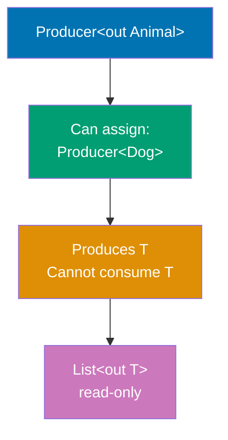

**Contravariance (in T - Consumer):**

```mermaid
%% Color Palette: Blue #0173B2, Orange #DE8F05, Teal #029E73, Purple #CC78BC, Brown #CA9161
graph TD
    Source["Consumer#60;in Dog#62;"]
    Source --> SuperType["Can assign:<br/>Consumer#60;Animal#62;"]
    SuperType --> Behavior[Consumes T<br/>Cannot produce T]
    Behavior --> Example["Comparable#60;in T#62;<br/>compare method"]

    style Source fill:#0173B2,color:#fff
    style SuperType fill:#029E73,color:#fff
    style Behavior fill:#DE8F05,color:#fff
    style Example fill:#CC78BC,color:#fff
```

**Star Projection (Unknown Type):**

```mermaid
%% Color Palette: Blue #0173B2, Orange #DE8F05, Teal #029E73, Purple #CC78BC, Brown #CA9161
graph TD
    Star["List#60;*#62;"]
    Star --> Read["Can read:<br/>Any?"]
    Star --> Write["Cannot write:<br/>Nothing"]
    Read --> Safety[Type-safe reading]
    Write --> Safety

    style Star fill:#0173B2,color:#fff
    style Read fill:#029E73,color:#fff
    style Write fill:#DE8F05,color:#fff
    style Safety fill:#CC78BC,color:#fff
```

```kotlin
// Covariance (out) - producer only
class Producer<out T>(val value: T) {        // => 'out' declares covariance
    fun produce(): T = value                 // => Can return T (produce)
    // fun consume(value: T) {}              // => ERROR: can't consume T with out
}                                            // => Producer<Dog> is subtype of Producer<Animal>
                                             // => Safe because only produces values
                                             // => Read-only, cannot accept input

// Contravariance (in) - consumer only
class Consumer<in T> {                       // => 'in' declares contravariance
    fun consume(value: T) {                  // => Can consume T (accept parameter)
        println("Consumed: $value")          // => Process input value
    }                                        // => Implementation can only accept, not return T
    // fun produce(): T {}                   // => ERROR: can't produce T with in
}                                            // => Consumer<Animal> is subtype of Consumer<Dog>
                                             // => Safe because only consumes values
                                             // => Write-only, cannot produce output

// Invariant - both producer and consumer
class Box<T>(var value: T) {                 // => No 'out' or 'in', invariant by default
    fun get(): T = value                     // => Can produce T
    fun set(newValue: T) { value = newValue }// => Can consume T
}                                            // => Box<String> is NOT subtype of Box<Any>
                                             // => Invariant because both reads and writes
                                             // => Mutable, requires exact type match

// Star projection - unknown type
fun printAll(items: List<*>) {               // => List<*> is star projection
    for (item in items) {                    // => item has type Any?
        println(item)                        // => Can read as Any? (safe)
    }                                        // => Cannot assume specific type
    // items.add(something)                  // => ERROR: can't add to List<*>
}                                            // => Star projection = unknown type parameter
                                             // => Can read but not write
                                             // => Equivalent to List<out Any?>

// Upper bound - restrict type parameter
fun <T : Number> sum(values: List<T>): Double {
                                             // => T must be Number or subtype
    return values.sumOf { it.toDouble() }    // => Can call Number methods (toDouble)
}                                            // => Constraint ensures type safety
                                             // => Only Int, Double, Long, etc. allowed
                                             // => Prevents sum(listOf("a", "b"))

// Multiple bounds using where clause
interface Named {
    val name: String                         // => Contract for named entities
}                                            // => First constraint interface

fun <T> printName(item: T) where T : Named, T : Comparable<T> {
                                             // => T must satisfy BOTH constraints
    println(item.name)                       // => Access name (from Named)
                                             // => Could also use compareTo (from Comparable)
}                                            // => Multiple bounds enforce multiple contracts
                                             // => where clause for complex constraints
                                             // => T must implement both interfaces

fun main() {
    println("=== Variance and Generics ===\n")
                                             // => Output: === Variance and Generics ===

    // Covariance example - subtype to supertype
    val stringProducer: Producer<String> = Producer("Hello")
                                             // => Create Producer<String>
    val anyProducer: Producer<Any> = stringProducer
                                             // => OK: String is subtype of Any (covariant)
                                             // => Producer<String> → Producer<Any> allowed
                                             // => Covariance preserves subtype relationship
    println("Produced: ${anyProducer.produce()}")
                                             // => Output: Produced: Hello
                                             // => Accessing as Any still returns String
                                             // => Safe because only producing, not consuming

    // Why covariance is safe:
    // - stringProducer.produce() returns String
    // - String is always compatible with Any
    // - No way to put wrong type into producer (read-only)
    //                                          // => Producer only outputs, never inputs
    //                                          // => Cannot break type safety

    // Contravariance example - supertype to subtype
    val anyConsumer: Consumer<Any> = Consumer()
                                             // => Create Consumer<Any>
    val stringConsumer: Consumer<String> = anyConsumer
                                             // => OK: can consume String as Any (contravariant)
                                             // => Consumer<Any> → Consumer<String> allowed
                                             // => Contravariance reverses subtype relationship
    stringConsumer.consume("Test")           // => Output: Consumed: Test
                                             // => String passed to Consumer<Any>
                                             // => Safe because Any accepts all types

    // Why contravariance is safe:
    // - Consumer<Any> can accept any value
    // - String is a valid Any
    // - Any consumer can handle String input
    //                                          // => Consumer only inputs, never outputs
    //                                          // => Cannot break type safety

    // Star projection - type-safe unknown type
    val numbers = listOf(1, 2, 3)            // => List<Int>
    val strings = listOf("a", "b", "c")      // => List<String>
    printAll(numbers)                        // => Works with List<Int>
                                             // => Output: 1 \n 2 \n 3
    printAll(strings)                        // => Works with List<String>
                                             // => Output: a \n b \n c
                                             // => Star projection accepts any list type
                                             // => Elements read as Any?

    // Star projection restrictions:
    // - Can read elements as Any?
    // - Cannot add elements (unknown type)
    // - Type-safe unknown type
    //                                          // => List<*> equivalent to List<out Any?>
    //                                          // => Read-only view of unknown-type list

    // Upper bound - generic constraints
    println("\nSum of integers: ${sum(listOf(1, 2, 3))}")
                                             // => Output: Sum of integers: 6.0
                                             // => List<Int> satisfies T : Number
                                             // => 1 + 2 + 3 = 6.0
    println("Sum of doubles: ${sum(listOf(1.5, 2.5, 3.0))}")
                                             // => Output: Sum of doubles: 7.0
                                             // => List<Double> satisfies T : Number
                                             // => 1.5 + 2.5 + 3.0 = 7.0

    // Upper bound ensures:
    // - Only Number subtypes allowed
    // - toDouble() method guaranteed
    // - Type-safe numeric operations
    //                                          // => sum(listOf("a", "b")) would not compile
    //                                          // => Compile-time type safety

    // Type variance in collections
    val mutableList: MutableList<String> = mutableListOf("a", "b")
                                             // => MutableList<String> created
    // val mutableAny: MutableList<Any> = mutableList
    //                                          // => ERROR: MutableList is invariant
    //                                          // => Cannot assign MutableList<String> to MutableList<Any>
    //                                          // => Would allow mutableAny.add(123) breaking String type

    // Why MutableList is invariant:
    // - If allowed: mutableAny.add(123) would compile
    // - Original mutableList would contain Integer
    // - Accessing as String would cause ClassCastException
    //                                          // => Invariance prevents this type violation
    //                                          // => Mutable collections must be invariant

    val readOnlyList: List<String> = mutableList
                                             // => List<String> is read-only view
    val readOnlyAny: List<Any> = readOnlyList
                                             // => OK: List is covariant (out)
                                             // => List<String> → List<Any> allowed
                                             // => Safe because List is read-only

    // Why List is covariant:
    // - List is immutable (no add method)
    // - Can only read elements
    // - Reading String as Any is always safe
    //                                          // => Immutable collections can be covariant
    //                                          // => No way to violate type safety

    // Use-site variance (Java-style wildcards in Kotlin)
    // fun copy(from: List<out Any>, to: MutableList<Any>) {
    //     for (item in from) to.add(item)
    // }
    //                                          // => 'out' at use-site, not declaration-site
    //                                          // => from is producer (covariant)
    //                                          // => to is consumer (invariant, accepts Any)

    // fun fill(dest: MutableList<in String>, value: String) {
    //     dest.add(value)
    // }
    //                                          // => 'in' at use-site
    //                                          // => dest is consumer (contravariant)
    //                                          // => Can pass MutableList<Any> for MutableList<in String>

    // Declaration-site vs use-site variance:
    // - Declaration-site: class Producer<out T>
    // - Use-site: fun process(items: List<out Number>)
    //                                          // => Kotlin prefers declaration-site (cleaner)
    //                                          // => Java requires use-site (? extends, ? super)
    //                                          // => Kotlin supports both for flexibility

    // Variance summary:
    // - out T (covariant): Producer, read-only, subtype → supertype
    // - in T (contravariant): Consumer, write-only, supertype → subtype
    // - T (invariant): Read-write, exact type match required
    // - * (star projection): Unknown type, read as Any?, cannot write
    //                                          // => Choose based on usage pattern
    //                                          // => Producers are covariant, consumers contravariant
}
```

**Key Takeaway**: Variance (out/in) controls generic type substitutability; use out for producers, in for consumers, invariant for both.

**Why It Matters**: Java's wildcard generics (? extends T, ? super T) create confusion and verbose type signatures that developers struggle to understand, while Kotlin's declaration-site variance (out T, in T) makes producer-consumer relationships explicit at type definition. This prevents common generic programming errors like trying to add items to covariant lists or read from contravariant consumers, caught at compile time rather than runtime ClassCastException. Understanding variance is essential for designing generic APIs (collections, event streams, serialization) that are both type-safe and flexible, enabling library evolution without breaking client code.

---

## Example 81: Best Practices - Scope Functions Usage

Master scope functions (let, run, with, apply, also) for concise and expressive code.

```kotlin
data class User(var name: String, var email: String, var age: Int)
                                             // => Mutable data class for demonstration
                                             // => Properties are var to show apply/also mutations

fun main() {
    println("=== Scope Functions Best Practices ===\n")
                                             // => Output: === Scope Functions Best Practices ===

    // let - nullable handling and transformations
    val nullableName: String? = "Alice"      // => Nullable string (could be null)
    val result = nullableName?.let { name -> // => Safe call + let for null safety
        println("Processing: $name")         // => Output: Processing: Alice
        name.uppercase()                     // => Transform and return
    }                                        // => result is "ALICE" or null
                                             // => Lambda parameter 'name' is non-null String
                                             // => let returns lambda result
    println("Result: $result")               // => Output: Result: ALICE
                                             // => If nullableName was null, result would be null

    // let characteristics:
    // - Returns: lambda result
    // - Context object: 'it' (or named parameter)
    // - Use case: null-safe transformations
    //                                          // => Perfect for nullable?.let { } patterns
    //                                          // => Transforms value and returns new type

    // run - object configuration and computation
    val user = User("Bob", "bob@example.com", 30)
                                             // => Create User instance
    val greeting = user.run {                // => Extension: this = user
        println("Name: $name")               // => Output: Name: Bob
                                             // => Access properties via 'this' (implicit)
        "Hello, $name!"                      // => Return value (String)
    }                                        // => run returns lambda result
    println("Greeting: $greeting")           // => Output: Greeting: Hello, Bob!
                                             // => user unchanged, greeting is new String

    // run characteristics:
    // - Returns: lambda result
    // - Context object: 'this' (extension receiver)
    // - Use case: compute value from object
    //                                          // => Useful for complex calculations on object
    //                                          // => Returns computed result, not object

    // with - operating on object without extension
    val message = with(user) {               // => Regular function, not extension
        "User: $name, Email: $email, Age: $age"
    }                                        // => with returns lambda result
                                             // => Access properties via 'this' (implicit)
    println(message)                         // => Output: User: Bob, Email: bob@example.com, Age: 30
                                             // => user unchanged, message is new String

    // with characteristics:
    // - Returns: lambda result
    // - Context object: 'this' (function parameter)
    // - Use case: multiple operations on object
    //                                          // => Similar to run but non-extension
    //                                          // => Prefer when object already exists

    // apply - object initialization and configuration
    val newUser = User("", "", 0).apply {    // => Create User and configure
        name = "Charlie"                     // => Configure properties (this.name)
        email = "charlie@example.com"        // => this.email = ...
        age = 25                             // => this.age = ...
    }                                        // => apply returns receiver (User object)
    println("New user: $newUser")            // => Output: New user: User(name=Charlie, email=charlie@example.com, age=25)
                                             // => newUser is the configured User object

    // apply characteristics:
    // - Returns: receiver object (this)
    // - Context object: 'this' (extension receiver)
    // - Use case: object configuration/initialization
    //                                          // => Perfect for builder pattern
    //                                          // => Returns configured object for chaining

    // also - additional actions without changing value
    val validatedUser = newUser.also { user -> // => Named parameter for clarity
        println("Validating: ${user.name}") // => Output: Validating: Charlie
                                             // => Side effect (logging)
        require(user.age >= 18) { "Must be 18+" }
                                             // => Validation check
    }                                        // => also returns receiver unchanged
    println("Validated: $validatedUser")     // => Output: Validated: User(name=Charlie, email=charlie@example.com, age=25)
                                             // => validatedUser === newUser (same reference)

    // also characteristics:
    // - Returns: receiver object
    // - Context object: 'it' (or named parameter)
    // - Use case: side effects (logging, validation)
    //                                          // => Perfect for adding logging without changing flow
    //                                          // => Returns original object for chaining

    // Chaining scope functions
    val processed = User("diana", "DIANA@EXAMPLE.COM", 35)
                                             // => Create User with mixed-case data
        .also { println("Original: $it") }   // => Output: Original: User(name=diana, email=DIANA@EXAMPLE.COM, age=35)
                                             // => Log original state (side effect)
                                             // => Returns User object for next step
        .apply {                             // => Configure/modify User
            name = name.replaceFirstChar { it.uppercase() }
                                             // => name: "diana" → "Diana"
            email = email.lowercase()        // => email: "DIANA@EXAMPLE.COM" → "diana@example.com"
        }                                    // => apply returns modified User
                                             // => User now has normalized data
        .let { user ->                       // => Transform User to String
            "${user.name} (${user.age})"     // => Create summary string
        }                                    // => let returns String
    println("Processed: $processed")         // => Output: Processed: Diana (35)
                                             // => Chain: User → User → User → String
                                             // => also (log) → apply (modify) → let (transform)

    // Chaining patterns:
    // - also: Side effects without transformation
    // - apply: Modify and return same object
    // - let: Transform to different type
    //                                          // => Combines logging, mutation, transformation
    //                                          // => Each function has clear semantic purpose

    // Use cases summary
    println("\n--- Use Case Summary ---")    // => Output: --- Use Case Summary ---

    // let: null safety and transformation
    val length = nullableName?.let { it.length } ?: 0
                                             // => If nullableName not null, get length
                                             // => Otherwise default to 0
    println("Length: $length")               // => Output: Length: 5
                                             // => Common pattern: nullable?.let { transform } ?: default
                                             // => Avoids explicit null checks

    // run: complex initialization
    val config = run {                       // => No receiver, just scope for initialization
        val host = System.getenv("HOST") ?: "localhost"
                                             // => Local variable in run scope
        val port = System.getenv("PORT")?.toIntOrNull() ?: 8080
                                             // => Another local variable
        "Server: $host:$port"                // => Return computed result
    }                                        // => run creates scope for temporary variables
    println("Config: $config")               // => Output: Config: Server: localhost:8080
                                             // => host and port not visible outside run
                                             // => Avoids polluting outer scope with temp vars

    // with: multiple calls on same object
    with(StringBuilder()) {                  // => with for multiple operations
        append("Line 1\n")                   // => First append (this.append)
        append("Line 2\n")                   // => Second append
        append("Line 3")                     // => Third append
        toString()                           // => Convert to String (return value)
    }.let { println("Built:\n$it") }         // => Output:
                                             // => Built:
                                             // => Line 1
                                             // => Line 2
                                             // => Line 3
                                             // => with returns toString() result
                                             // => let receives String for printing

    // apply: builder pattern
    val builder = StringBuilder().apply {    // => apply for configuration
        append("Hello")                      // => Configure via mutations
        append(" ")                          // => Multiple append calls
        append("World")                      // => Final append
    }                                        // => apply returns StringBuilder object
    println("Builder: $builder")             // => Output: Builder: Hello World
                                             // => builder is configured StringBuilder
                                             // => Can continue using builder for more operations

    // also: logging/debugging
    val users = listOf("Alice", "Bob")       // => Create list
        .also { println("Processing ${it.size} users") }
                                             // => Output: Processing 2 users
                                             // => Log intermediate state
                                             // => Returns original list
        .map { it.uppercase() }              // => Transform to uppercase
                                             // => Returns ["ALICE", "BOB"]
        .also { println("Transformed: $it") }
                                             // => Output: Transformed: [ALICE, BOB]
                                             // => Log final state
                                             // => Returns transformed list
                                             // => also perfect for debugging transformations

    // Scope function decision tree:
    // 1. Need return value?
    //    - Yes, compute from object: run / with
    //    - Yes, transform object: let
    //    - No, configure object: apply
    //    - No, side effect: also
    // 2. Extension or regular function?
    //    - Extension: run, let, apply, also
    //    - Regular: with
    // 3. Context object as 'it' or 'this'?
    //    - 'it': let, also (can rename parameter)
    //    - 'this': run, with, apply (implicit receiver)
    //                                          // => Choose based on intention and context

    // Common pitfalls:
    // - Using apply when you need let (forgetting return value)
    // - Using let when you need also (transforming when logging)
    // - Over-chaining (hard to debug)
    //                                          // => Keep chains readable
    //                                          // => Each function should have clear purpose

    // Performance consideration:
    // - All scope functions are inline
    // - Zero runtime overhead
    // - Compiled to direct code without lambda objects
    //                                          // => Use freely without performance concerns
    //                                          // => Compiler optimizes to equivalent non-lambda code

    // Scope functions comparison table:
    // | Function | Returns      | Context | Use Case               |
    // |----------|--------------|---------|------------------------|
    // | let      | lambda result| it      | null-safe transform    |
    // | run      | lambda result| this    | compute from object    |
    // | with     | lambda result| this    | multiple operations    |
    // | apply    | receiver     | this    | configure object       |
    // | also     | receiver     | it      | side effects/logging   |
    //                                          // => Each has distinct semantic meaning
    //                                          // => Choose based on intention
}
```

**Key Takeaway**: Scope functions enhance code expressiveness: let (null safety/transform), run (compute), with (multiple ops), apply (configure), also (side effects).

**Why It Matters**: Scope functions eliminate temporary variables and nested null checks that clutter code, enabling fluent method chaining and self-documenting intent through semantic function names. Each function serves distinct purposes (let for null-safety, apply for configuration, also for side-effect logging), making code intention explicit. Mastering scope functions is essential for idiomatic Kotlin where they appear throughout production code for builder patterns, null-safe transformations, and fluent APIs, while misuse creates confusion—understanding when to use each scope function separates experienced Kotlin developers from Java converts writing Kotlin with Java idioms.

---

## Summary

Advanced Kotlin (examples 55-81) covers expert-level techniques achieving 75-95% language coverage:

1. **Advanced Coroutines** (55-57): supervisorScope for independent failures, CoroutineContext elements, structured exception handling
2. **Reflection** (58-60): KClass inspection, property modification, annotation processing for metadata-driven frameworks
3. **Inline Reified** (61): Type-safe generic operations without class parameter passing
4. **Multiplatform** (62-63): Common/expect/actual declarations, Gradle Kotlin DSL configuration
5. **Serialization** (64-65): kotlinx.serialization with custom serializers for complex types
6. **Ktor** (66-67): HTTP server with routing, content negotiation, automatic JSON conversion
7. **Arrow Functional** (68-69): Either for type-safe errors, Validated for accumulating validation failures
8. **Performance** (70-71): Value classes for zero-cost wrappers, sequences for lazy evaluation
9. **Testing** (72-74): Kotest specification styles, runTest for coroutine testing, MockK for mocking
10. **Build Tools** (75): Custom Gradle tasks with Kotlin DSL
11. **Best Practices** (76-81): Immutability with data classes, extension function organization, delegation pattern, context receivers, advanced generics, scope functions

Master these techniques to write production-grade Kotlin systems with advanced concurrency, metaprogramming, cross-platform support, functional error handling, and comprehensive testing strategies.
