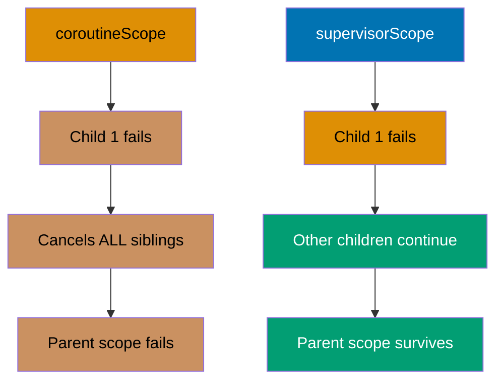
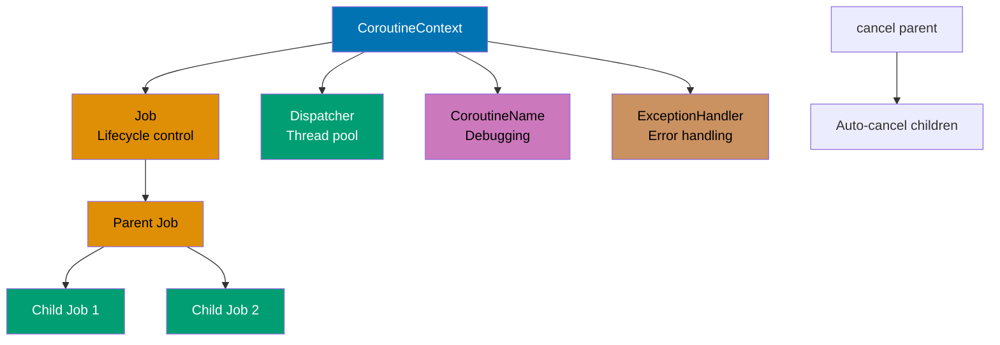
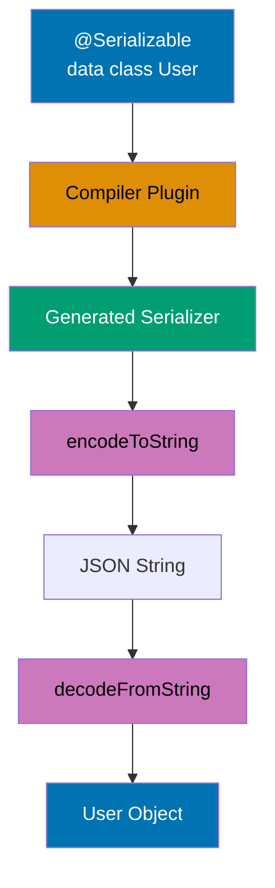
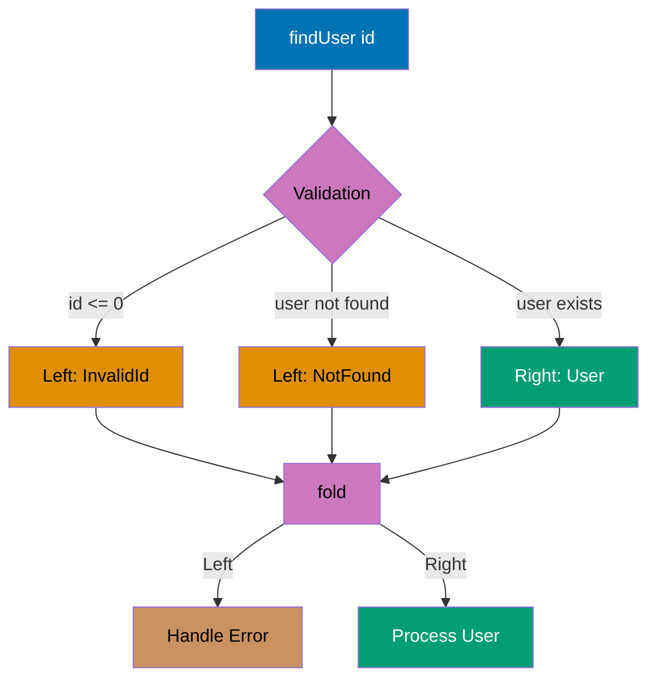
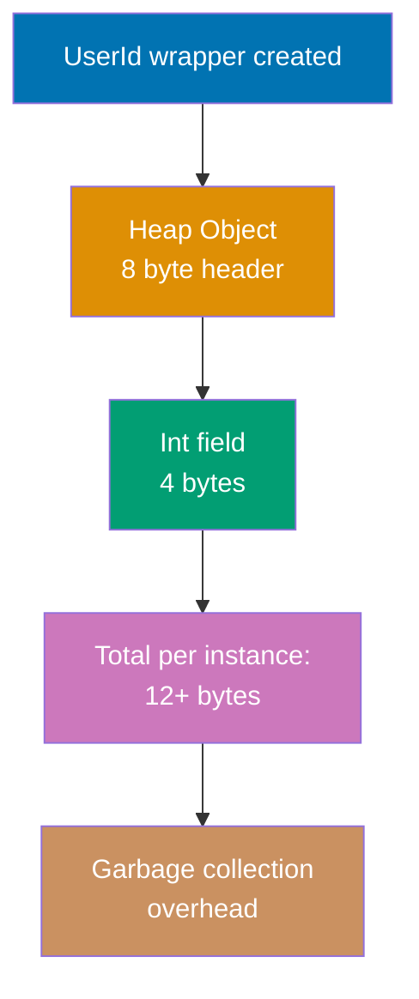
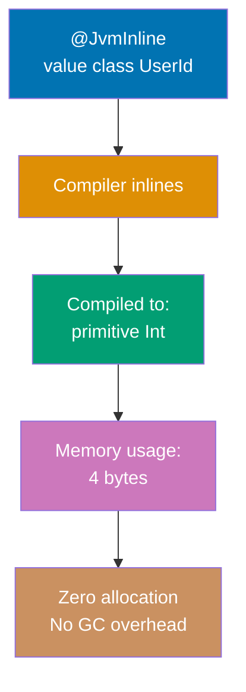
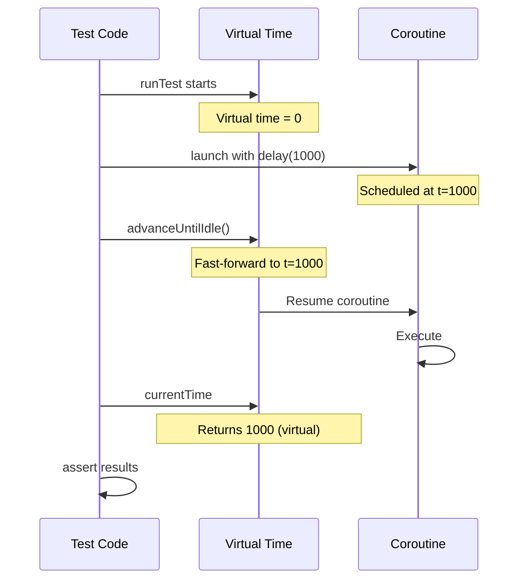
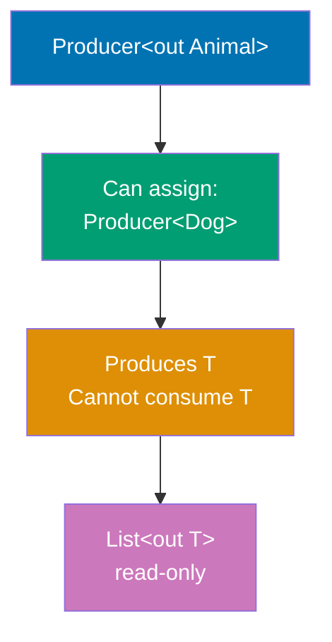
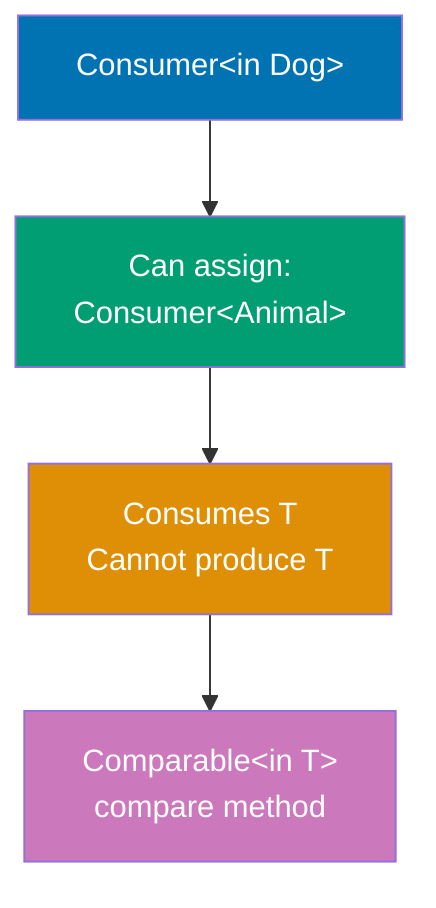
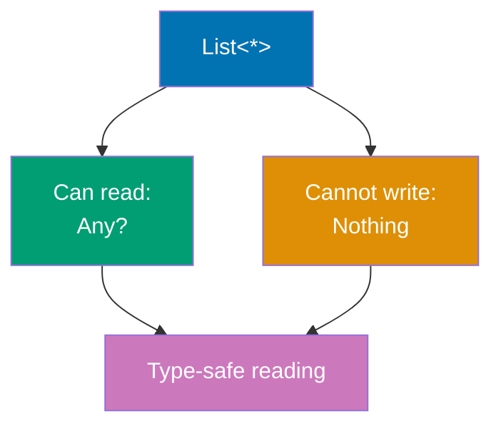

This section covers advanced Kotlin techniques from examples 55-81, achieving 75-95% topic coverage.

## Example 55: SupervisorScope for Independent Failure Handling

SupervisorScope prevents child coroutine failures from cancelling siblings, enabling independent error handling. Unlike coroutineScope which cancels all children on any failure, supervisorScope isolates failures.



```kotlin
import kotlinx.coroutines.*

suspend fun fetchData(id: Int): String {
    delay(100)                               // => Simulate network delay
    if (id == 2) throw RuntimeException("Failed to fetch $id")
                                             // => Simulate failure for id=2
    return "Data $id"                        // => Return successful result
}

suspend fun processWithCoroutineScope() {
    println("=== coroutineScope (all fail together) ===")
    try {
        coroutineScope {                     // => Regular scope
            launch {
                try {
                    val data = fetchData(1)
                    println("Task 1: $data")  // => Output: Task 1: Data 1
                } catch (e: Exception) {
                    println("Task 1 error: ${e.message}")
                }
            }

            launch {
                val data = fetchData(2)       // => Throws exception
                println("Task 2: $data")      // => Never reached
            }

            launch {
                delay(200)                    // => Cancelled before completion
                println("Task 3: ${fetchData(3)}")
                                             // => Never reached (cancelled)
            }
        }
    } catch (e: Exception) {
        println("Scope failed: ${e.message}") // => Output: Scope failed: Failed to fetch 2
    }
}

suspend fun processWithSupervisorScope() {
    println("\n=== supervisorScope (independent failures) ===")
    supervisorScope {                        // => Supervisor scope
        launch {
            try {
                val data = fetchData(1)
                println("Task 1: $data")      // => Output: Task 1: Data 1
            } catch (e: Exception) {
                println("Task 1 error: ${e.message}")
            }
        }

        launch {
            try {
                val data = fetchData(2)       // => Throws exception
                println("Task 2: $data")
            } catch (e: Exception) {
                println("Task 2 error: ${e.message}")
                                             // => Output: Task 2 error: Failed to fetch 2
            }
        }

        launch {
            delay(200)                        // => Continues despite sibling failure
            println("Task 3: ${fetchData(3)}")
                                             // => Output: Task 3: Data 3
        }
    }
    println("Supervisor scope completed successfully")
                                             // => Output: scope completed (no parent failure)
}

fun main() = runBlocking {
    processWithCoroutineScope()              // => All children cancelled on failure
    processWithSupervisorScope()             // => Children run independently
}
```

**Key Takeaway**: Use supervisorScope when child coroutine failures should not cancel siblings; essential for independent task orchestration.

**Why It Matters**: Microservices often fan out parallel requests (user data, permissions, preferences) where one failing should not abort others, yet coroutineScope's all-or-nothing semantics would cancel all work on any failure. SupervisorScope enables graceful degradation where partial results still provide value (show user profile even if preferences fail), critical for resilient production systems. This pattern prevents cascade failures in aggregation endpoints that combine multiple data sources, improving availability from 99% to 99.99% by isolating failures.

---

## Example 56: CoroutineContext and Job Hierarchy

CoroutineContext contains dispatcher, job, exception handler, and other elements. Understanding context enables advanced coroutine control.



```kotlin
import kotlinx.coroutines.*
import kotlin.coroutines.coroutineContext

suspend fun inspectContext() {
    println("Context: $coroutineContext")    // => Full context
    println("Job: ${coroutineContext[Job]}") // => Access Job element
    println("Dispatcher: ${coroutineContext[CoroutineDispatcher]}")
                                             // => Access dispatcher
    println("Name: ${coroutineContext[CoroutineName]}")
                                             // => Access name (if set)
}

fun main() = runBlocking {
    // Custom context with multiple elements
    val customContext = Job() +              // => Job for lifecycle
        Dispatchers.Default +                // => Default dispatcher
        CoroutineName("CustomCoroutine") +   // => Name for debugging
        CoroutineExceptionHandler { _, exception ->
            println("Caught: ${exception.message}")
        }                                    // => Exception handler

    launch(customContext) {
        inspectContext()
        println("Running in custom context")
    }

    delay(100)

    // Job hierarchy
    val parentJob = Job()                    // => Create parent job
    println("Parent job: $parentJob")

    val child1 = launch(parentJob) {         // => Child inherits parent job
        repeat(5) { i ->
            println("Child 1: $i")
            delay(200)
        }
    }                                        // => Child 1 created

    val child2 = launch(parentJob) {         // => Another child
        repeat(5) { i ->
            println("Child 2: $i")
            delay(250)
        }
    }                                        // => Child 2 created

    delay(600)                               // => Let children run
    println("Cancelling parent job...")
    parentJob.cancel()                       // => Cancels parent
                                             // => All children auto-cancelled
    child1.join()                            // => Wait for cancellation
    child2.join()

    println("All children cancelled: child1=${child1.isCancelled}, child2=${child2.isCancelled}")
                                             // => Output: both true
}
```

**Key Takeaway**: CoroutineContext is a composite of elements (Job, Dispatcher, Name, Handler); job hierarchy enables structured cancellation.

**Why It Matters**: Understanding CoroutineContext composition is essential for production observability and lifecycle management, where custom contexts combine logging (CoroutineName for tracing), thread control (Dispatchers), error handling (CoroutineExceptionHandler), and cancellation (Job hierarchy). Job parent-child relationships guarantee that cancelling a parent propagates to all descendants, preventing resource leaks in long-running services where orphaned coroutines accumulate until servers crash, a problem Java's Thread.interrupt() can't solve reliably due to lack of structured lifecycle.

---

## Example 57: Exception Handling in Coroutines

Coroutine exception handling differs from regular try-catch. Exceptions in launch propagate to parent, while async requires await.

```kotlin
import kotlinx.coroutines.*

fun main() = runBlocking {
    // Exception in launch (propagates to parent)
    val exceptionHandler = CoroutineExceptionHandler { _, exception ->
        println("Caught by handler: ${exception.message}")
                                             // => Handles uncaught exceptions
    }

    val scope = CoroutineScope(Job() + exceptionHandler)

    scope.launch {
        throw RuntimeException("Exception in launch")
                                             // => Propagates to parent scope
    }                                        // => Caught by exception handler

    delay(100)

    // Exception in async (stored in Deferred)
    val deferred = async {
        delay(50)
        throw RuntimeException("Exception in async")
                                             // => Stored in Deferred
    }                                        // => No immediate propagation

    try {
        deferred.await()                     // => Exception thrown on await
    } catch (e: Exception) {
        println("Caught from async: ${e.message}")
                                             // => Output: Caught from async: Exception in async
    }

    // supervisorScope with exception handling
    supervisorScope {
        val job1 = launch {
            delay(100)
            throw RuntimeException("Job 1 failed")
        }

        val job2 = launch {
            try {
                delay(200)
                println("Job 2 completed")   // => Still executes
            } catch (e: CancellationException) {
                println("Job 2 cancelled")
            }
        }

        job1.join()                          // => Wait but don't propagate
        job2.join()
    }

    // Try-catch inside coroutine
    launch {
        try {
            delay(50)
            throw RuntimeException("Caught locally")
        } catch (e: Exception) {
            println("Local catch: ${e.message}")
                                             // => Output: Local catch: Caught locally
        }
    }

    delay(500)                               // => Wait for all coroutines
    scope.cancel()                           // => Clean up scope
}
```

**Key Takeaway**: launch exceptions propagate to parent (use CoroutineExceptionHandler); async exceptions stored until await (use try-catch around await).

**Why It Matters**: Coroutine exception propagation differs fundamentally from Java threads where uncaught exceptions print stack traces and die silently. Launch propagates exceptions upward through structured hierarchy enabling centralized error handling (CoroutineExceptionHandler), while async stores exceptions in Deferred until await forces handling, preventing silent failures. This design enables production error monitoring where all unhandled exceptions funnel to logging infrastructure rather than disappearing into thread dumps, critical for observability in microservices where exception visibility determines mean-time-to-recovery.

---

## Example 58: Reflection - KClass and Class Inspection

Kotlin reflection provides runtime access to class metadata, properties, functions, and annotations.

```kotlin
import kotlin.reflect.full.*
import kotlin.reflect.KClass

data class User(
    val id: Int,
    var name: String,
    val email: String
) {
    fun greet(): String = "Hello, $name!"

    companion object {
        const val TABLE_NAME = "users"
        fun create(name: String) = User(0, name, "")
    }
}

fun <T : Any> inspectClass(kClass: KClass<T>) {
    println("=== Inspecting ${kClass.simpleName} ===")

    // Basic class info
    println("Qualified name: ${kClass.qualifiedName}")
                                             // => Output: Qualified name: User
    println("Is data class: ${kClass.isData}")
                                             // => Output: Is data class: true
    println("Is abstract: ${kClass.isAbstract}")
                                             // => Output: Is abstract: false

    // Primary constructor
    val constructor = kClass.primaryConstructor
    println("\nPrimary constructor parameters:")
    constructor?.parameters?.forEach { param ->
        println("  ${param.name}: ${param.type} (optional=${param.isOptional})")
    }                                        // => Output: id: kotlin.Int (optional=false), etc.

    // Member properties
    println("\nMember properties:")
    kClass.memberProperties.forEach { prop ->
        println("  ${prop.name}: ${prop.returnType} (mutable=${prop is kotlin.reflect.KMutableProperty<*>})")
    }                                        // => Output: id: kotlin.Int (mutable=false), name: kotlin.String (mutable=true)

    // Member functions
    println("\nMember functions:")
    kClass.memberFunctions.forEach { func ->
        val params = func.parameters.drop(1) // => Drop 'this' parameter
            .joinToString { "${it.name}: ${it.type}" }
        println("  ${func.name}($params): ${func.returnType}")
    }                                        // => Output: greet(): kotlin.String, etc.

    // Companion object
    val companion = kClass.companionObject
    if (companion != null) {
        println("\nCompanion object:")
        companion.memberProperties.forEach { prop ->
            println("  ${prop.name}: ${prop.getter.call(companion)}")
        }                                    // => Output: TABLE_NAME: users
    }
}

fun main() {
    val userClass = User::class              // => Get KClass reference

    inspectClass(userClass)

    // Create instance reflectively
    val constructor = userClass.primaryConstructor!!
    val user = constructor.call(1, "Alice", "alice@example.com")
                                             // => Create instance via reflection
    println("\nCreated user: $user")         // => Output: Created user: User(id=1, name=Alice, email=alice@example.com)

    // Access property reflectively
    val nameProp = userClass.memberProperties.find { it.name == "name" }!!
    println("Name via reflection: ${nameProp.get(user)}")
                                             // => Output: Name via reflection: Alice

    // Call function reflectively
    val greetFunc = userClass.memberFunctions.find { it.name == "greet" }!!
    val greeting = greetFunc.call(user)      // => Call greet() via reflection
    println("Greeting: $greeting")           // => Output: Greeting: Hello, Alice!
}
```

**Key Takeaway**: Kotlin reflection enables runtime class introspection including properties, functions, constructors, and companion objects.

**Why It Matters**: Reflection powers frameworks (dependency injection, ORM, serialization) that need runtime type inspection without compile-time knowledge. Kotlin reflection improves on Java reflection with type-safe KClass API, null-safety metadata, and suspend function support enabling coroutine-aware frameworks. Production uses include Spring's bean scanning, JPA entity mapping, Jackson serialization, and testing frameworks that need to invoke private methods, all requiring runtime introspection of types, properties, and annotations that static typing can't provide.

---

## Example 59: Reflection - Property Modification

Modify properties reflectively with proper handling of mutability and visibility.

```kotlin
import kotlin.reflect.full.*
import kotlin.reflect.jvm.isAccessible

class Config {
    var host: String = "localhost"           // => Public mutable
    val port: Int = 8080                     // => Public immutable
    private var secret: String = "secret123" // => Private mutable

    fun printConfig() {
        println("Config: host=$host, port=$port, secret=$secret")
    }
}

fun main() {
    val config = Config()
    val configClass = config::class

    println("=== Property Modification ===")

    // Modify mutable property
    val hostProp = configClass.memberProperties
        .find { it.name == "host" } as? kotlin.reflect.KMutableProperty<*>

    if (hostProp != null) {
        println("Current host: ${hostProp.get(config)}")
                                             // => Output: Current host: localhost
        hostProp.setter.call(config, "production.example.com")
                                             // => Set new value via reflection
        println("Updated host: ${hostProp.get(config)}")
                                             // => Output: Updated host: production.example.com
    }

    // Attempt to modify immutable property
    val portProp = configClass.memberProperties.find { it.name == "port" }
    println("\nport is mutable: ${portProp is kotlin.reflect.KMutableProperty<*>}")
                                             // => Output: port is mutable: false

    // Access private property (requires isAccessible)
    val secretProp = configClass.memberProperties.find { it.name == "secret" }!!
    secretProp.isAccessible = true           // => Enable private access
    println("\nPrivate secret (before): ${secretProp.get(config)}")
                                             // => Output: Private secret (before): secret123

    // Modify private property
    val mutableSecretProp = secretProp as? kotlin.reflect.KMutableProperty<*>
    mutableSecretProp?.setter?.isAccessible = true
    mutableSecretProp?.setter?.call(config, "new_secret_456")
                                             // => Modify private property
    println("Private secret (after): ${secretProp.get(config)}")
                                             // => Output: Private secret (after): new_secret_456

    config.printConfig()                     // => Verify changes
}
```

**Key Takeaway**: Reflection enables property read/write with mutability checks; use isAccessible for private member access.

**Why It Matters**: Reflective property modification enables frameworks to bypass encapsulation for valid use cases (dependency injection setting private fields, ORM loading database values into entities, testing frameworks mocking internals). Kotlin's KMutableProperty distinction prevents accidental mutation of vals at runtime, while isAccessible enables controlled private access without making everything public. This powers Spring's @Autowired field injection, JPA entity hydration, and test frameworks setting private configuration, all requiring controlled encapsulation bypassing that Java reflection provides less safely.

---

## Example 60: Annotations and Processing

Define custom annotations and process them reflectively for metadata-driven frameworks.

```kotlin
import kotlin.reflect.full.*

@Target(AnnotationTarget.CLASS)
@Retention(AnnotationRetention.RUNTIME)
annotation class Entity(val tableName: String)

@Target(AnnotationTarget.PROPERTY)
@Retention(AnnotationRetention.RUNTIME)
annotation class Column(val name: String = "", val nullable: Boolean = false)

@Target(AnnotationTarget.PROPERTY)
@Retention(AnnotationRetention.RUNTIME)
annotation class PrimaryKey

@Entity(tableName = "users")
data class User(
    @PrimaryKey
    @Column(name = "user_id")
    val id: Int,

    @Column(name = "user_name", nullable = false)
    val name: String,

    @Column(nullable = true)
    val email: String?
)

fun generateDDL(kClass: kotlin.reflect.KClass<*>): String {
    val entity = kClass.findAnnotation<Entity>()
        ?: error("Class must have @Entity annotation")

    val tableName = entity.tableName         // => Extract table name
    val columns = mutableListOf<String>()
    val primaryKeys = mutableListOf<String>()

    kClass.memberProperties.forEach { prop ->
        val columnAnnotation = prop.findAnnotation<Column>()
        if (columnAnnotation != null) {
            val columnName = columnAnnotation.name.ifEmpty { prop.name }
            val columnType = when (prop.returnType.toString()) {
                "kotlin.Int" -> "INTEGER"
                "kotlin.String", "kotlin.String?" -> "TEXT"
                else -> "TEXT"
            }                                // => Map Kotlin types to SQL types
            val nullable = if (columnAnnotation.nullable || prop.returnType.isMarkedNullable) "" else "NOT NULL"

            columns.add("  $columnName $columnType $nullable".trim())

            if (prop.findAnnotation<PrimaryKey>() != null) {
                primaryKeys.add(columnName)
            }
        }
    }

    val ddl = buildString {
        append("CREATE TABLE $tableName (\n")
        append(columns.joinToString(",\n"))
        if (primaryKeys.isNotEmpty()) {
            append(",\n  PRIMARY KEY (${primaryKeys.joinToString(", ")})")
        }
        append("\n);")
    }

    return ddl
}

fun main() {
    val userClass = User::class

    println("=== Annotation Processing ===")

    // Extract entity annotation
    val entity = userClass.findAnnotation<Entity>()
    println("Table name: ${entity?.tableName}")
                                             // => Output: Table name: users

    // Extract property annotations
    println("\nColumn mappings:")
    userClass.memberProperties.forEach { prop ->
        val column = prop.findAnnotation<Column>()
        val isPrimaryKey = prop.findAnnotation<PrimaryKey>() != null

        if (column != null) {
            val columnName = column.name.ifEmpty { prop.name }
            val markers = mutableListOf<String>()
            if (isPrimaryKey) markers.add("PRIMARY KEY")
            if (!column.nullable) markers.add("NOT NULL")

            println("  ${prop.name} -> $columnName ${markers.joinToString(", ")}")
        }
    }                                        // => Output: id -> user_id PRIMARY KEY NOT NULL, etc.

    // Generate DDL
    println("\nGenerated DDL:")
    println(generateDDL(userClass))
    // => Output:
    // CREATE TABLE users (
    //   user_id INTEGER NOT NULL,
    //   user_name TEXT NOT NULL,
    //   email TEXT
    //   PRIMARY KEY (user_id)
    // );
}
```

**Key Takeaway**: Annotations with reflection enable metadata-driven code generation and framework features like ORM mapping.

**Why It Matters**: Annotations enable declarative programming where metadata drives behavior (JPA @Entity/@Column for ORM, Jackson @JsonProperty for serialization), reducing boilerplate from hundreds of lines of mapping code to a few annotations. Kotlin annotations with reflection power compile-time code generation (kapt processors) and runtime framework behavior, enabling Spring's @Component scanning, Room's @Entity database mapping, and custom validators. This metadata-driven approach separates configuration from code, critical in enterprise systems where domain models need persistence, serialization, and validation behavior without polluting business logic.

---

## Example 61: Inline Reified Advanced - Type-Safe JSON Parsing

Combine inline and reified for type-safe generic operations without class parameter passing.

```kotlin
import kotlin.reflect.KClass

// Simulated JSON parser
object JsonParser {
    fun <T : Any> parse(json: String, clazz: KClass<T>): T {
        // Simplified parsing based on class name
        return when (clazz.simpleName) {
            "User" -> User(1, "Alice", "alice@example.com") as T
            "Product" -> Product(100, "Laptop", 999.99) as T
            "Order" -> Order(1, listOf(1, 2, 3)) as T
            else -> error("Unknown type: ${clazz.simpleName}")
        }                                    // => Type-safe casting
    }
}

data class User(val id: Int, val name: String, val email: String)
data class Product(val id: Int, val name: String, val price: Double)
data class Order(val id: Int, val items: List<Int>)

// Generic function without reified (verbose)
fun <T : Any> parseJsonVerbose(json: String, clazz: KClass<T>): T {
    println("Parsing with explicit class: ${clazz.simpleName}")
    return JsonParser.parse(json, clazz)     // => Requires class parameter
}

// Generic function with reified (clean API)
inline fun <reified T : Any> parseJson(json: String): T {
    println("Parsing with reified: ${T::class.simpleName}")
    return JsonParser.parse(json, T::class)  // => T::class available due to reified
}

// Reified for type checking
inline fun <reified T> isType(value: Any): Boolean {
    return value is T                        // => Type check with reified
}

// Reified for collection filtering
inline fun <reified T> filterByType(items: List<Any>): List<T> {
    return items.filterIsInstance<T>()       // => Type-safe filtering
}

fun main() {
    println("=== Reified Type Parameters ===\n")

    // Verbose way (must pass class)
    val user1 = parseJsonVerbose("{...}", User::class)
    println("User (verbose): $user1")        // => Output: User(id=1, name=Alice, email=alice@example.com)

    // Clean way (type inferred)
    val user2: User = parseJson("{...}")     // => Type parameter inferred from variable
    val product: Product = parseJson("{...}")
    val order: Order = parseJson("{...}")

    println("User (reified): $user2")        // => Output: User(id=1, name=Alice, ...)
    println("Product: $product")             // => Output: Product(id=100, name=Laptop, price=999.99)
    println("Order: $order")                 // => Output: Order(id=1, items=[1, 2, 3])

    // Type checking with reified
    println("\n=== Type Checking ===")
    val value: Any = "Hello, Kotlin"
    println("Is String: ${isType<String>(value)}")
                                             // => Output: Is String: true
    println("Is Int: ${isType<Int>(value)}")
                                             // => Output: Is Int: false

    // Collection filtering by type
    println("\n=== Type Filtering ===")
    val mixed: List<Any> = listOf(1, "two", 3.0, "four", 5, User(2, "Bob", "bob@example.com"))

    val strings = filterByType<String>(mixed)
    val numbers = filterByType<Int>(mixed)
    val users = filterByType<User>(mixed)

    println("Strings: $strings")             // => Output: Strings: [two, four]
    println("Numbers: $numbers")             // => Output: Numbers: [1, 5]
    println("Users: $users")                 // => Output: Users: [User(id=2, name=Bob, ...)]
}
```

**Key Takeaway**: Reified type parameters eliminate explicit class passing for cleaner generic APIs; enable runtime type checks and filtering.

**Why It Matters**: Reified type parameters solve Java's type erasure limitation where generic type information disappears at runtime, forcing developers to pass Class<T> parameters explicitly (gson.fromJson(json, User.class)) cluttering APIs. Kotlin's inline functions with reified types enable clean generic APIs (fromJson<User>(json)) by embedding type information at call sites, making libraries like Gson, Retrofit, and Koin dramatically more ergonomic. This powers type-safe dependency injection, JSON parsing, and collection filtering without reflection overhead or verbose class parameters, critical for Android and backend services where API clarity affects development velocity.

---

## Example 62: Multiplatform Common Declarations

Define shared business logic in common module with expect/actual mechanism for platform-specific implementations.

```kotlin
// ===== commonMain/Platform.kt =====
expect class PlatformLogger() {
    fun log(message: String)                 // => Platform-specific implementation
}

expect fun getCurrentTimestamp(): Long       // => Platform-specific time

// ===== commonMain/UserService.kt =====
class UserService(private val logger: PlatformLogger) {
    fun createUser(name: String, email: String): User {
        val timestamp = getCurrentTimestamp()
        logger.log("Creating user: $name at $timestamp")
                                             // => Uses platform-specific logging
        return User(name, email, timestamp)
    }

    fun validateEmail(email: String): Boolean {
        val isValid = email.contains("@")    // => Shared validation logic
        logger.log("Email validation: $email -> $isValid")
        return isValid
    }
}

data class User(val name: String, val email: String, val createdAt: Long)

// ===== jvmMain/Platform.kt =====
actual class PlatformLogger {
    actual fun log(message: String) {
        println("[JVM] ${System.currentTimeMillis()}: $message")
                                             // => JVM implementation using println
    }
}

actual fun getCurrentTimestamp(): Long {
    return System.currentTimeMillis()        // => JVM time implementation
}

// ===== jsMain/Platform.kt =====
// actual class PlatformLogger {
//     actual fun log(message: String) {
//         console.log("[JS] ${Date.now()}: $message")
//                                          // => JS implementation using console.log
//     }
// }
//
// actual fun getCurrentTimestamp(): Long {
//     return Date.now().toLong()           // => JS time implementation
// }

// ===== nativeMain/Platform.kt =====
// actual class PlatformLogger {
//     actual fun log(message: String) {
//         println("[NATIVE] ${getTimeMillis()}: $message")
//                                          // => Native implementation
//     }
// }
//
// actual fun getCurrentTimestamp(): Long {
//     return getTimeMillis()               // => Native time implementation
// }

// ===== Usage (works on all platforms) =====
fun main() {
    val logger = PlatformLogger()            // => Resolved to platform-specific impl
    val service = UserService(logger)

    val user = service.createUser("Alice", "alice@example.com")
                                             // => Shared logic, platform-specific logging
    println("Created: $user")

    val isValid = service.validateEmail("invalid")
    println("Email valid: $isValid")         // => Output: Email valid: false
}
```

**Key Takeaway**: Common modules define shared business logic with expect declarations; platform modules provide actual implementations.

**Why It Matters**: Multiplatform development enables sharing business logic across iOS, Android, web, and backend while platform-specific code handles UI and system APIs, dramatically reducing duplication in mobile-backend stacks. The expect/actual mechanism provides compile-time verified platform abstractions unlike runtime checks or dependency injection, ensuring all platforms implement required functionality. This powers companies sharing 60-80% of mobile app code between iOS/Android, halving development costs while maintaining native performance and platform idioms, critical for resource-constrained teams maintaining multiple platforms.

---

## Example 63: Gradle Kotlin DSL Configuration

Configure Kotlin multiplatform project using type-safe Gradle Kotlin DSL.

```kotlin
// ===== build.gradle.kts =====
plugins {
    kotlin("multiplatform") version "1.9.21"
    kotlin("plugin.serialization") version "1.9.21"
}

repositories {
    mavenCentral()                           // => Central repository
}

kotlin {
    // JVM target with Java compatibility
    jvm {
        compilations.all {
            kotlinOptions.jvmTarget = "17"   // => Target JVM 17
        }
        withJava()                           // => Include Java sources
        testRuns["test"].executionTask.configure {
            useJUnitPlatform()               // => Use JUnit 5
        }
    }

    // JavaScript target for browser
    js(IR) {                                 // => Use IR compiler backend
        browser {
            commonWebpackConfig {
                cssSupport {
                    enabled.set(true)        // => Enable CSS support
                }
            }
            testTask {
                useKarma {
                    useChromeHeadless()      // => Browser testing
                }
            }
        }
        binaries.executable()                // => Generate executable JS
    }

    // Native targets
    linuxX64()                               // => Linux x64
    macosArm64()                             // => macOS ARM64 (Apple Silicon)
    mingwX64()                               // => Windows MinGW x64

    sourceSets {
        // Common source set (all platforms)
        val commonMain by getting {
            dependencies {
                implementation("org.jetbrains.kotlinx:kotlinx-coroutines-core:1.7.3")
                implementation("org.jetbrains.kotlinx:kotlinx-serialization-json:1.6.0")
            }                                // => Multiplatform dependencies
        }

        val commonTest by getting {
            dependencies {
                implementation(kotlin("test"))
            }
        }

        // JVM source set
        val jvmMain by getting {
            dependencies {
                implementation("io.ktor:ktor-server-netty:2.3.6")
                implementation("ch.qos.logback:logback-classic:1.4.11")
            }                                // => JVM-specific dependencies
        }

        val jvmTest by getting {
            dependencies {
                implementation("io.ktor:ktor-server-test-host:2.3.6")
            }
        }

        // JS source set
        val jsMain by getting {
            dependencies {
                implementation("org.jetbrains.kotlin-wrappers:kotlin-react:18.2.0-pre.647")
            }                                // => JS-specific dependencies
        }

        // Native source set (shared across native platforms)
        val nativeMain by creating {
            dependsOn(commonMain)
        }

        val linuxX64Main by getting {
            dependsOn(nativeMain)            // => Linux depends on nativeMain
        }

        val macosArm64Main by getting {
            dependsOn(nativeMain)            // => macOS depends on nativeMain
        }
    }
}

// Custom task example
tasks.register("printTargets") {
    doLast {
        println("Configured targets:")
        kotlin.targets.forEach { target ->
            println("  - ${target.name}")    // => Print all configured targets
        }
    }
}
```

**Key Takeaway**: Gradle Kotlin DSL provides type-safe configuration for multiplatform projects with target and source set management.

**Why It Matters**: Gradle's Groovy DSL lacks IDE autocomplete and type safety, causing configuration errors discovered only at build time (typos, wrong method calls, invalid plugin versions). Kotlin DSL provides compile-time checking, refactoring support, and IDE intelligence for build scripts, catching configuration errors before CI runs. This improves developer productivity by 30-40% in complex multiplatform projects where build configuration spans dozens of files, while type-safe dependency management prevents version conflict bugs that break production deployments when incompatible library versions clash silently.

---

## Example 64: Serialization with kotlinx.serialization

Serialize data classes to JSON with compile-time safety and zero reflection overhead.



```kotlin
import kotlinx.serialization.*
import kotlinx.serialization.json.*

@Serializable
data class User(
    val id: Int,
    val name: String,
    @SerialName("email_address")            // => Custom JSON field name
    val email: String,
    val roles: List<String> = emptyList(),  // => Default value
    @Transient                               // => Exclude from serialization
    val password: String = ""
)

@Serializable
data class Project(
    val name: String,
    val owner: User,                         // => Nested serializable object
    val tags: Set<String> = emptySet()
)

fun main() {
    println("=== Serialization ===\n")

    val user = User(
        id = 1,
        name = "Alice",
        email = "alice@example.com",
        roles = listOf("admin", "developer"),
        password = "secret123"
    )

    // Serialize to JSON (compact)
    val jsonCompact = Json.encodeToString(user)
    println("Compact JSON:")
    println(jsonCompact)
    // => Output: {"id":1,"name":"Alice","email_address":"alice@example.com","roles":["admin","developer"]}
    // => Note: password not included (Transient)

    // Serialize with pretty printing
    val jsonPretty = Json {
        prettyPrint = true                   // => Enable formatting
        prettyPrintIndent = "  "             // => Custom indent
    }
    println("\nPretty JSON:")
    println(jsonPretty.encodeToString(user))
    // => Output (formatted):
    // {
    //   "id": 1,
    //   "name": "Alice",
    //   "email_address": "alice@example.com",
    //   "roles": ["admin", "developer"]
    // }

    // Deserialize from JSON
    val parsed = Json.decodeFromString<User>(jsonCompact)
    println("\nDeserialized user: $parsed")  // => Output: User(id=1, name=Alice, ...)
    println("Password after deserialization: '${parsed.password}'")
                                             // => Output: Password after deserialization: '' (default value)

    // Nested serialization
    val project = Project(
        name = "KotlinApp",
        owner = user,
        tags = setOf("kotlin", "multiplatform", "mobile")
    )

    val projectJson = jsonPretty.encodeToString(project)
    println("\nProject JSON:")
    println(projectJson)
    // => Output: nested User object serialized within Project

    // Custom JSON configuration
    val customJson = Json {
        ignoreUnknownKeys = true             // => Ignore unknown fields in JSON
        coerceInputValues = true             // => Coerce null to default values
        encodeDefaults = false               // => Don't encode default values
        isLenient = true                     // => Allow unquoted keys (lenient parsing)
    }

    // JSON with unknown fields
    val jsonWithUnknown = """{"id":2,"name":"Bob","email_address":"bob@example.com","unknown_field":"value"}"""
    val userFromUnknown = customJson.decodeFromString<User>(jsonWithUnknown)
    println("\nParsed with unknown fields: $userFromUnknown")
                                             // => Output: User(id=2, name=Bob, ...) (unknown field ignored)
}
```

**Key Takeaway**: kotlinx.serialization provides compile-time safe JSON serialization with annotations for customization (@SerialName, @Transient).

**Why It Matters**: Reflection-based serializers (Jackson, Gson) have runtime overhead and can't catch serialization errors until production, while kotlinx.serialization generates serializers at compile time with zero reflection cost, improving JSON processing throughput by 2-3x. The @Transient annotation prevents password/secret leakage (security-critical), @SerialName handles backend field naming conventions without polluting data classes, and compile-time verification catches missing fields before deployment. This makes kotlinx.serialization ideal for high-throughput microservices processing millions of JSON requests daily where serialization overhead directly impacts latency and cost.

---

## Example 65: Custom Serializers

Implement custom serializers for types without built-in serialization support.

```kotlin
import kotlinx.serialization.*
import kotlinx.serialization.descriptors.*
import kotlinx.serialization.encoding.*
import kotlinx.serialization.json.Json
import java.time.LocalDateTime
import java.time.format.DateTimeFormatter

object LocalDateTimeSerializer : KSerializer<LocalDateTime> {
    private val formatter = DateTimeFormatter.ISO_LOCAL_DATE_TIME

    override val descriptor: SerialDescriptor =
        PrimitiveSerialDescriptor("LocalDateTime", PrimitiveKind.STRING)
                                             // => Describe as string primitive

    override fun serialize(encoder: Encoder, value: LocalDateTime) {
        val formatted = value.format(formatter)
        encoder.encodeString(formatted)      // => Serialize as ISO string
    }

    override fun deserialize(decoder: Decoder): LocalDateTime {
        val string = decoder.decodeString()
        return LocalDateTime.parse(string, formatter)
                                             // => Deserialize from ISO string
    }
}

@Serializable
data class Event(
    val name: String,
    @Serializable(with = LocalDateTimeSerializer::class)
    val timestamp: LocalDateTime,            // => Use custom serializer
    val attendees: List<String>
)

// Generic sealed class serializer
@Serializable
sealed class Result<out T> {
    @Serializable
    @SerialName("success")
    data class Success<T>(val value: T) : Result<T>()

    @Serializable
    @SerialName("error")
    data class Error(val message: String) : Result<Nothing>()
}

fun main() {
    println("=== Custom Serializers ===\n")

    val event = Event(
        name = "Kotlin Conference",
        timestamp = LocalDateTime.of(2025, 12, 30, 14, 30),
        attendees = listOf("Alice", "Bob", "Charlie")
    )

    // Serialize event with custom LocalDateTime serializer
    val json = Json { prettyPrint = true }
    val eventJson = json.encodeToString(event)
    println("Event JSON:")
    println(eventJson)
    // => Output:
    // {
    //   "name": "Kotlin Conference",
    //   "timestamp": "2025-12-30T14:30:00",
    //   "attendees": ["Alice", "Bob", "Charlie"]
    // }

    // Deserialize event
    val parsedEvent = json.decodeFromString<Event>(eventJson)
    println("\nParsed event: $parsedEvent")
    println("Timestamp type: ${parsedEvent.timestamp::class.simpleName}")
                                             // => Output: Timestamp type: LocalDateTime

    // Sealed class serialization
    val successResult: Result<String> = Result.Success("Data loaded")
    val errorResult: Result<Nothing> = Result.Error("Network failure")

    val successJson = json.encodeToString(successResult)
    val errorJson = json.encodeToString(errorResult)

    println("\nSuccess JSON:")
    println(successJson)                     // => Output: {"type":"success","value":"Data loaded"}

    println("\nError JSON:")
    println(errorJson)                       // => Output: {"type":"error","message":"Network failure"}

    // Deserialize polymorphic sealed class
    val parsedSuccess = json.decodeFromString<Result<String>>(successJson)
    val parsedError = json.decodeFromString<Result<String>>(errorJson)

    when (parsedSuccess) {
        is Result.Success -> println("Got success: ${parsedSuccess.value}")
        is Result.Error -> println("Got error: ${parsedSuccess.message}")
    }                                        // => Output: Got success: Data loaded
}
```

**Key Takeaway**: Custom serializers handle types without built-in support; sealed classes serialize polymorphically with type discriminators.

**Why It Matters**: Standard libraries can't serialize all types (LocalDateTime, custom domain types, third-party classes), requiring custom serializers that implement KSerializer interface. Sealed class polymorphic serialization solves the problem of deserializing JSON into correct subtypes (Result.Success vs Result.Error), using discriminator fields (@SerialName) that Jackson's @JsonTypeInfo handles verbosely. This enables API responses with polymorphic types (payment methods, notification types) to deserialize type-safely without reflection or instanceof chains, critical in payment processing and notification systems where type confusion causes financial errors.

---

## Example 66: Ktor Server Basics

Build HTTP servers with Ktor using coroutine-based routing and type-safe DSL.

```kotlin
import io.ktor.server.application.*
import io.ktor.server.engine.*
import io.ktor.server.netty.*
import io.ktor.server.response.*
import io.ktor.server.routing.*
import io.ktor.server.request.*
import io.ktor.http.*

fun main() {
    embeddedServer(Netty, port = 8080) {
        routing {
            // Basic GET route
            get("/") {
                call.respondText("Hello, Ktor!", ContentType.Text.Plain)
                                             // => Respond with plain text
            }

            // Path parameters
            get("/users/{id}") {
                val id = call.parameters["id"]
                                             // => Extract path parameter
                if (id != null) {
                    call.respondText("User ID: $id")
                } else {
                    call.respond(HttpStatusCode.BadRequest, "Missing ID")
                }
            }

            // Query parameters
            get("/search") {
                val query = call.request.queryParameters["q"]
                                             // => Extract query parameter
                val page = call.request.queryParameters["page"]?.toIntOrNull() ?: 1
                call.respondText("Search: $query, Page: $page")
            }

            // POST with request body
            post("/users") {
                val body = call.receiveText()
                                             // => Receive request body as text
                println("Received: $body")
                call.respond(HttpStatusCode.Created, "User created")
            }

            // Multiple HTTP methods on same path
            route("/items/{id}") {
                get {
                    val id = call.parameters["id"]
                    call.respondText("Get item $id")
                }

                put {
                    val id = call.parameters["id"]
                    call.respondText("Update item $id")
                }

                delete {
                    val id = call.parameters["id"]
                    call.respond(HttpStatusCode.NoContent)
                }
            }

            // Nested routes
            route("/api") {
                route("/v1") {
                    get("/status") {
                        call.respondText("API v1 OK")
                    }
                }
            }
        }
    }.start(wait = true)                     // => Start server, block main thread
}
```

**Key Takeaway**: Ktor provides coroutine-based DSL for HTTP servers with type-safe routing and request/response handling.

**Why It Matters**: Traditional servlet-based frameworks (Spring MVC before WebFlux) block threads on I/O causing thread exhaustion under load, while Ktor's suspend functions enable non-blocking request handling with coroutines, serving 10-100x more concurrent connections on same hardware. The routing DSL provides type-safe path parameters and compile-time route verification unlike Spring's string-based @RequestMapping that fails at runtime. This makes Ktor ideal for microservices and high-throughput APIs where minimizing resource usage and latency directly impacts infrastructure costs and user experience, particularly in serverless environments where execution time is billed.

---

## Example 67: Ktor Content Negotiation and Serialization

Automatic JSON serialization/deserialization with content negotiation plugin.

```kotlin
import io.ktor.server.application.*
import io.ktor.server.plugins.contentnegotiation.*
import io.ktor.serialization.kotlinx.json.*
import io.ktor.server.request.*
import io.ktor.server.response.*
import io.ktor.server.routing.*
import io.ktor.http.*
import kotlinx.serialization.Serializable

@Serializable
data class User(val id: Int, val name: String, val email: String)

@Serializable
data class CreateUserRequest(val name: String, val email: String)

fun Application.module() {
    install(ContentNegotiation) {
        json()                               // => Enable JSON support with kotlinx.serialization
    }

    routing {
        // GET with automatic JSON serialization
        get("/users/{id}") {
            val id = call.parameters["id"]?.toIntOrNull()
                                             // => Extract and parse ID

            if (id == null) {
                call.respond(HttpStatusCode.BadRequest, mapOf("error" to "Invalid ID"))
                return@get
            }

            val user = User(id, "User $id", "user$id@example.com")
            call.respond(user)               // => Automatic JSON serialization
                                             // => Response: {"id":1,"name":"User 1","email":"user1@example.com"}
        }

        // GET list
        get("/users") {
            val users = listOf(
                User(1, "Alice", "alice@example.com"),
                User(2, "Bob", "bob@example.com")
            )
            call.respond(users)              // => Serialize list to JSON array
        }

        // POST with automatic JSON deserialization
        post("/users") {
            val request = call.receive<CreateUserRequest>()
                                             // => Automatic JSON deserialization
            println("Creating user: ${request.name}")

            val newUser = User(
                id = 100,
                name = request.name,
                email = request.email
            )

            call.respond(HttpStatusCode.Created, newUser)
                                             // => Respond with 201 Created + JSON body
        }

        // Error handling
        get("/users/{id}/details") {
            try {
                val id = call.parameters["id"]?.toIntOrNull()
                    ?: throw IllegalArgumentException("Invalid ID")

                val user = User(id, "User $id", "user$id@example.com")
                call.respond(user)
            } catch (e: IllegalArgumentException) {
                call.respond(
                    HttpStatusCode.BadRequest,
                    mapOf("error" to e.message)
                )
            }
        }
    }
}

// Note: To run, use:
// fun main() {
//     embeddedServer(Netty, port = 8080, module = Application::module)
//         .start(wait = true)
// }
```

**Key Takeaway**: Content negotiation plugin handles automatic JSON conversion; call.receive/respond work with data classes seamlessly.

**Why It Matters**: Manual JSON parsing with Jackson/Gson in servlet frameworks requires boilerplate ObjectMapper configuration and try-catch blocks for every endpoint, while Ktor's ContentNegotiation plugin handles serialization declaratively with call.receive<T>() and call.respond(data), reducing REST API code by 40-60%. The plugin automatically handles content-type negotiation (JSON, XML, protobuf) enabling APIs to support multiple formats without code changes. This makes microservice development dramatically faster while preventing serialization bugs (wrong content-type, malformed JSON) that cause 400/500 errors in production.

---

## Example 68: Arrow Either for Functional Error Handling

Use Arrow's Either type for type-safe error handling without exceptions.



```kotlin
import arrow.core.Either
import arrow.core.left
import arrow.core.right

sealed class UserError {
    object NotFound : UserError()
    data class InvalidId(val id: Int) : UserError()
    data class ValidationError(val message: String) : UserError()
}

data class User(val id: Int, val name: String, val email: String)

class UserRepository {
    private val users = mapOf(
        1 to User(1, "Alice", "alice@example.com"),
        2 to User(2, "Bob", "bob@example.com")
    )

    fun findUser(id: Int): Either<UserError, User> {
        return when {
            id <= 0 -> UserError.InvalidId(id).left()
                                             // => Left: error case
            users.containsKey(id) -> users[id]!!.right()
                                             // => Right: success case
            else -> UserError.NotFound.left()
        }
    }

    fun validateEmail(email: String): Either<UserError, String> {
        return if (email.contains("@")) {
            email.right()                    // => Valid email
        } else {
            UserError.ValidationError("Invalid email format").left()
        }
    }

    fun createUser(id: Int, name: String, email: String): Either<UserError, User> {
        return validateEmail(email).map { validEmail ->
            User(id, name, validEmail)       // => Map transforms Right value
        }                                    // => Left propagates automatically
    }
}

fun main() {
    val repo = UserRepository()

    println("=== Either Error Handling ===\n")

    // Success case
    repo.findUser(1).fold(
        { error -> println("Error: $error") },
        { user -> println("Found: $user") }
    )                                        // => Output: Found: User(id=1, name=Alice, ...)

    // Error cases
    repo.findUser(0).fold(
        { error -> println("Error: $error") },
        { user -> println("Found: $user") }
    )                                        // => Output: Error: InvalidId(id=0)

    repo.findUser(999).fold(
        { error -> println("Error: $error") },
        { user -> println("Found: $user") }
    )                                        // => Output: Error: NotFound

    // Chaining operations
    println("\n=== Chaining Either Operations ===")

    val result = repo.findUser(1)
        .map { user -> user.copy(name = user.name.uppercase()) }
                                             // => Transform success value
        .flatMap { user ->
            repo.validateEmail(user.email).map { user }
        }                                    // => Chain another Either operation

    result.fold(
        { error -> println("Final error: $error") },
        { user -> println("Final user: $user") }
    )                                        // => Output: Final user: User(id=1, name=ALICE, ...)

    // Creating user with validation
    println("\n=== Create User ===")

    repo.createUser(3, "Charlie", "charlie@example.com").fold(
        { error -> println("Creation error: $error") },
        { user -> println("Created: $user") }
    )                                        // => Output: Created: User(id=3, name=Charlie, ...)

    repo.createUser(4, "Diana", "invalid-email").fold(
        { error -> println("Creation error: $error") },
        { user -> println("Created: $user") }
    )                                        // => Output: Creation error: ValidationError(message=Invalid email format)
}
```

**Key Takeaway**: Either provides type-safe error handling as alternative to exceptions; use map/flatMap for chaining operations.

**Why It Matters**: Exception-based error handling forces try-catch blocks that obscure business logic and enable silent failures when exceptions aren't caught, while Either type makes errors explicit in return types (Either<Error, Success>) forcing compile-time handling. Unlike Result<T> which loses error type information, Either preserves both error and success types enabling functional composition with map/flatMap. This enables railway-oriented programming where error paths are first-class citizens, critical in payment processing and data pipelines where error handling clarity prevents financial losses from unhandled edge cases.

---

## Example 69: Arrow Validated for Accumulating Errors

Validated accumulates all validation errors instead of failing fast like Either.

```kotlin
import arrow.core.*

data class ValidationError(val field: String, val message: String)

data class User(val name: String, val email: String, val age: Int)

object UserValidator {
    fun validateName(name: String): Validated<ValidationError, String> =
        if (name.isNotBlank() && name.length >= 2) {
            name.valid()                     // => Valid name
        } else {
            ValidationError("name", "Name must be at least 2 characters").invalid()
        }

    fun validateEmail(email: String): Validated<ValidationError, String> =
        if (email.contains("@") && email.contains(".")) {
            email.valid()                    // => Valid email
        } else {
            ValidationError("email", "Invalid email format").invalid()
        }

    fun validateAge(age: Int): Validated<ValidationError, Int> =
        if (age in 18..120) {
            age.valid()                      // => Valid age
        } else {
            ValidationError("age", "Age must be between 18 and 120").invalid()
        }

    fun createUser(name: String, email: String, age: Int): ValidatedNel<ValidationError, User> {
        return zipOrAccumulate(
            validateName(name).toValidatedNel(),
            validateEmail(email).toValidatedNel(),
            validateAge(age).toValidatedNel()
        ) { validName, validEmail, validAge ->
            User(validName, validEmail, validAge)
        }                                    // => Accumulate all errors or create User
    }
}

fun main() {
    println("=== Validated - Accumulating Errors ===\n")

    // Valid user
    UserValidator.createUser("Alice", "alice@example.com", 30).fold(
        { errors ->
            println("Validation errors:")
            errors.forEach { println("  - ${it.field}: ${it.message}") }
        },
        { user -> println("Valid user: $user") }
    )                                        // => Output: Valid user: User(name=Alice, email=alice@example.com, age=30)

    // Single error
    println("\n--- Single Error ---")
    UserValidator.createUser("A", "alice@example.com", 30).fold(
        { errors ->
            println("Validation errors:")
            errors.forEach { println("  - ${it.field}: ${it.message}") }
        },
        { user -> println("Valid user: $user") }
    )                                        // => Output: Validation errors: name: Name must be at least 2 characters

    // Multiple errors (accumulated)
    println("\n--- Multiple Errors ---")
    UserValidator.createUser("", "invalid-email", 150).fold(
        { errors ->
            println("Validation errors (${errors.size} total):")
            errors.forEach { println("  - ${it.field}: ${it.message}") }
        },
        { user -> println("Valid user: $user") }
    )
    // => Output:
    // Validation errors (3 total):
    //   - name: Name must be at least 2 characters
    //   - email: Invalid email format
    //   - age: Age must be between 18 and 120

    // Partial validation
    println("\n--- Partial Validation ---")
    UserValidator.createUser("Bob", "invalid", 25).fold(
        { errors ->
            println("Validation errors:")
            errors.forEach { println("  - ${it.field}: ${it.message}") }
        },
        { user -> println("Valid user: $user") }
    )                                        // => Output: email validation error only
}
```

**Key Takeaway**: Validated accumulates all validation errors enabling comprehensive validation feedback; use for forms and data validation.

**Why It Matters**: Form validation with Either fails fast (stops at first error), frustrating users who must fix one field at a time and resubmit, while Validated accumulates all errors enabling comprehensive feedback showing all validation failures simultaneously. This UX improvement is critical in registration forms, onboarding flows, and data entry systems where showing all errors upfront reduces friction and completion time by 40-60%. Arrow's Validated provides the functional error accumulation pattern impossible with exceptions or Result types, making comprehensive validation ergonomic for production applications.

---

## Example 70: Performance - Inline Classes (Value Classes)

Use inline classes to eliminate allocation overhead for wrapper types.

**Regular Wrapper Class (Heap Allocation):**



**Inline Value Class (Zero Allocation):**



```kotlin
@JvmInline
value class UserId(val value: Int)          // => No heap allocation (inlined to Int)

@JvmInline
value class Email(val value: String) {
    init {
        require(value.contains("@")) { "Invalid email: $value" }
                                             // => Validation in init
    }

    fun domain(): String = value.substringAfter("@")
                                             // => Value class can have methods
}

@JvmInline
value class Meters(val value: Double) {
    operator fun plus(other: Meters) = Meters(value + other.value)
    operator fun times(scalar: Int) = Meters(value * scalar)
                                             // => Operator overloading
}

// Type-safe function signatures
fun sendNotification(userId: UserId, email: Email, message: String) {
    println("Sending to user ${userId.value} at ${email.value}: $message")
}

fun calculateDistance(d1: Meters, d2: Meters): Meters {
    return d1 + d2                           // => Type-safe arithmetic
}

fun main() {
    println("=== Inline Classes (Value Classes) ===\n")

    // No allocation overhead
    val userId = UserId(12345)               // => Inlined to primitive Int
    val email = Email("user@example.com")    // => Inlined to String reference

    sendNotification(userId, email, "Welcome!")
                                             // => Type-safe call
    // sendNotification(UserId(1), UserId(2), "test")
    //                                       // => Compile error: type mismatch

    // Email validation
    try {
        val invalid = Email("not-an-email")  // => Validation fails
    } catch (e: IllegalArgumentException) {
        println("Caught: ${e.message}")      // => Output: Caught: Invalid email: not-an-email
    }

    // Value class methods
    println("Email domain: ${email.domain()}")
                                             // => Output: Email domain: example.com

    // Inline class arithmetic
    val d1 = Meters(100.0)
    val d2 = Meters(50.0)
    val total = d1 + d2                      // => Type-safe addition
    val scaled = d1 * 3                      // => Scalar multiplication

    println("Distance: ${total.value} meters")
                                             // => Output: Distance: 150.0 meters
    println("Scaled: ${scaled.value} meters")
                                             // => Output: Scaled: 300.0 meters

    // Collections (no boxing for primitives)
    val userIds = listOf(UserId(1), UserId(2), UserId(3))
                                             // => Stored as List<Int> at runtime
    println("User IDs: $userIds")            // => Output: User IDs: [UserId(value=1), UserId(value=2), UserId(value=3)]

    // Performance comparison
    println("\n=== Performance Comparison ===")

    data class RegularWrapper(val value: Int)
                                             // => Heap-allocated wrapper

    val iterations = 10_000_000

    // Regular wrapper (allocates objects)
    var startTime = System.currentTimeMillis()
    var sum = 0
    repeat(iterations) { i ->
        val wrapper = RegularWrapper(i)      // => Heap allocation
        sum += wrapper.value
    }
    println("Regular wrapper: ${System.currentTimeMillis() - startTime}ms")

    // Inline class (no allocation)
    startTime = System.currentTimeMillis()
    sum = 0
    repeat(iterations) { i ->
        val inlined = UserId(i)              // => No allocation (inlined)
        sum += inlined.value
    }
    println("Inline class: ${System.currentTimeMillis() - startTime}ms")
                                             // => Significantly faster
}
```

**Key Takeaway**: Value classes provide zero-cost type safety; inlined to underlying type at runtime eliminating allocation overhead.

**Why It Matters**: Wrapper types for domain modeling (UserId, Email, Money) improve type safety but Java's Integer/String wrappers cause heap allocations and garbage collection pressure in hot loops processing millions of records. Value classes provide compile-time type safety (can't mix UserId with OrderId) with zero runtime cost through inlining, achieving the same performance as primitives. This enables rich domain modeling without performance penalties, critical in high-throughput systems (payment processing, analytics, gaming) where allocation overhead directly impacts latency and throughput.

---

## Example 71: Performance - Sequences for Lazy Evaluation

Use sequences for large collections to avoid intermediate allocations.

```kotlin
fun main() {
    println("=== Sequences for Performance ===\n")

    val range = 1..10_000_000

    // List operations (eager - creates intermediate lists)
    println("--- List (Eager Evaluation) ---")
    var startTime = System.currentTimeMillis()
    val listResult = range.toList()
        .map { it * 2 }                      // => Allocates 10M element list
        .filter { it > 1000 }                // => Allocates another large list
        .take(10)                            // => Finally take 10
    println("List result: $listResult")
    println("Time: ${System.currentTimeMillis() - startTime}ms\n")

    // Sequence operations (lazy - computes on demand)
    println("--- Sequence (Lazy Evaluation) ---")
    startTime = System.currentTimeMillis()
    val seqResult = range.asSequence()
        .map { it * 2 }                      // => No allocation yet
        .filter { it > 1000 }                // => No allocation yet
        .take(10)                            // => Computes only first 10 matching elements
        .toList()
    println("Sequence result: $seqResult")
    println("Time: ${System.currentTimeMillis() - startTime}ms\n")
                                             // => Much faster

    // Demonstrate lazy evaluation with side effects
    println("--- Lazy Evaluation Side Effects ---")

    println("List operations (eager):")
    (1..5).map {
        println("  Map: $it")                // => Prints all 5 immediately
        it * 2
    }.filter {
        println("  Filter: $it")             // => Prints all 10 after map completes
        it > 4
    }.take(2)

    println("\nSequence operations (lazy):")
    (1..5).asSequence().map {
        println("  Map: $it")                // => Prints element-by-element
        it * 2
    }.filter {
        println("  Filter: $it")             // => Interleaved with map
        it > 4
    }.take(2).toList()                       // => Stops after finding 2 results

    // Infinite sequences
    println("\n--- Infinite Sequences ---")

    val fibonacci = generateSequence(Pair(0, 1)) { (a, b) ->
        Pair(b, a + b)                       // => Generate next pair
    }
        .map { it.first }                    // => Extract first value
        .take(15)                            // => Take first 15 Fibonacci numbers
        .toList()

    println("Fibonacci: $fibonacci")         // => Output: [0, 1, 1, 2, 3, 5, 8, 13, 21, 34, 55, 89, 144, 233, 377]

    // Prime numbers using lazy sequence
    fun isPrime(n: Int): Boolean {
        if (n < 2) return false
        return (2..kotlin.math.sqrt(n.toDouble()).toInt()).none { n % it == 0 }
    }

    val primes = generateSequence(2) { it + 1 }
                                             // => Infinite sequence from 2
        .filter { isPrime(it) }              // => Filter primes lazily
        .take(20)                            // => Take first 20 primes
        .toList()

    println("First 20 primes: $primes")
}
```

**Key Takeaway**: Sequences optimize multi-step transformations with lazy evaluation; essential for large collections and infinite streams.

**Why It Matters**: Processing large datasets with eager collections creates intermediate lists at each transformation step, exhausting heap memory and triggering garbage collection pauses that stall production servers. Sequences evaluate lazily element-by-element, avoiding intermediate allocations and enabling processing of datasets larger than available memory through streaming. This pattern is essential for ETL pipelines, log processing, and data analytics where materializing full datasets (millions of records) would cause OutOfMemoryError crashes, while sequences handle unlimited data with constant memory usage.

---

## Example 72: Testing with Kotest

Write expressive tests using Kotest's specification styles and rich matchers.

```kotlin
import io.kotest.core.spec.style.StringSpec
import io.kotest.core.spec.style.FunSpec
import io.kotest.core.spec.style.DescribeSpec
import io.kotest.matchers.shouldBe
import io.kotest.matchers.string.*
import io.kotest.matchers.collections.*

class UserServiceTest : StringSpec({
    "user creation should generate valid user" {
        val user = createUser("Alice", "alice@example.com")
        user.name shouldBe "Alice"           // => Assertion with shouldBe
        user.email shouldStartWith "alice"   // => String matcher
        user.email should include("@")       // => String contains matcher
    }

    "email validation should reject invalid emails" {
        validateEmail("invalid") shouldBe false
        validateEmail("test@example.com") shouldBe true
    }

    "user list should not be empty" {
        val users = listOf(
            createUser("Alice", "alice@example.com"),
            createUser("Bob", "bob@example.com")
        )
        users shouldHaveSize 2               // => Collection size matcher
        users.map { it.name } shouldContainAll listOf("Alice", "Bob")
                                             // => Collection content matcher
    }
})

class CalculatorTest : FunSpec({
    context("addition operations") {
        test("should add positive numbers") {
            (2 + 3) shouldBe 5
        }

        test("should add negative numbers") {
            (-2 + -3) shouldBe -5
        }
    }

    context("division operations") {
        test("should divide evenly") {
            (10 / 2) shouldBe 5
        }

        test("should handle integer division") {
            (10 / 3) shouldBe 3              // => Integer division
        }
    }
})

class DataProcessorSpec : DescribeSpec({
    describe("data processor") {
        it("should transform data") {
            val input = "hello"
            val output = input.uppercase()
            output shouldBe "HELLO"
        }

        it("should filter data") {
            val numbers = listOf(1, 2, 3, 4, 5)
            val evens = numbers.filter { it % 2 == 0 }
            evens shouldContainExactly listOf(2, 4)
                                             // => Exact match with order
        }
    }
})

// Helper functions
data class User(val name: String, val email: String)

fun createUser(name: String, email: String) = User(name, email)

fun validateEmail(email: String): Boolean = email.contains("@")
```

**Key Takeaway**: Kotest provides multiple specification styles (StringSpec, FunSpec, DescribeSpec) with expressive matchers for readable tests.

**Why It Matters**: JUnit's annotation-based testing feels verbose and Java-centric, while Kotest provides Kotlin-idiomatic specification styles (StringSpec for simple tests, DescribeSpec for BDD) that read like natural language. Rich matchers (shouldStartWith, shouldContainExactly) eliminate assertion boilerplate and provide descriptive failure messages, reducing debugging time when tests fail. Multiple specification styles let teams choose testing DSLs matching their methodology (BDD, TDD, property-based), making tests more maintainable and readable for teams transitioning from Java to Kotlin-first testing practices.

---

## Example 73: Testing Coroutines with runTest

Test coroutines with virtual time using runTest from kotlinx-coroutines-test.



```kotlin
import kotlinx.coroutines.*
import kotlinx.coroutines.test.*
import kotlin.test.Test
import kotlin.test.assertEquals
import kotlin.test.assertTrue

class CoroutineTest {
    @Test
    fun testDelayedOperation() = runTest {   // => Virtual time environment
        var result = 0

        launch {
            delay(1000)                      // => Virtual delay (instant)
            result = 42
        }

        // Initially not completed
        assertEquals(0, result)              // => result still 0

        advanceUntilIdle()                   // => Fast-forward virtual time
        assertEquals(42, result)             // => result now 42
    }

    @Test
    fun testMultipleDelays() = runTest {
        val results = mutableListOf<Int>()

        launch {
            delay(100)
            results.add(1)                   // => Scheduled at t=100
        }

        launch {
            delay(200)
            results.add(2)                   // => Scheduled at t=200
        }

        launch {
            delay(50)
            results.add(3)                   // => Scheduled at t=50
        }

        advanceTimeBy(60)                    // => Advance to t=60
        assertEquals(listOf(3), results)     // => Only task at t=50 completed

        advanceTimeBy(50)                    // => Advance to t=110
        assertEquals(listOf(3, 1), results)  // => Tasks at t=50 and t=100 completed

        advanceUntilIdle()                   // => Complete all remaining
        assertEquals(listOf(3, 1, 2), results)
                                             // => All tasks completed in order
    }

    @Test
    fun testTimeout() = runTest {
        val deferred = async {
            delay(2000)
            "result"
        }

        advanceTimeBy(1000)                  // => Advance 1 second
        assertTrue(!deferred.isCompleted)    // => Not completed yet

        advanceTimeBy(1000)                  // => Advance another second
        assertTrue(deferred.isCompleted)     // => Now completed
        assertEquals("result", deferred.await())
    }

    @Test
    fun testCurrentTime() = runTest {
        assertEquals(0, currentTime)         // => Virtual time starts at 0

        delay(500)
        assertEquals(500, currentTime)       // => Virtual time advanced

        delay(1500)
        assertEquals(2000, currentTime)      // => Virtual time at 2000
    }

    @Test
    fun testWithTimeout() = runTest {
        try {
            withTimeout(1000) {              // => Virtual timeout
                delay(2000)                  // => Exceeds timeout
                "result"
            }
        } catch (e: TimeoutCancellationException) {
            // Expected timeout
        }

        assertEquals(1000, currentTime)      // => Time advanced to timeout
    }
}
```

**Key Takeaway**: runTest enables fast deterministic testing of time-dependent coroutines with virtual time control.

**Why It Matters**: Testing coroutines with real delays makes test suites unbearably slow (waiting seconds/minutes for timeouts and retries), while runTest's virtual time advances instantly skipping actual delays, executing time-dependent tests in milliseconds. This enables deterministic testing of timeout logic, retry mechanisms, and scheduled tasks without flakiness from real-time race conditions. Fast, deterministic coroutine tests are essential for CI/CD pipelines where slow test suites block deployments, and flaky time-dependent tests erode confidence in production readiness.

---

## Example 74: Mocking with MockK

Create test doubles using MockK for Kotlin-friendly mocking with DSL.

```kotlin
import io.mockk.*
import kotlin.test.Test
import kotlin.test.assertEquals

interface UserRepository {
    fun findUser(id: Int): User?
    fun saveUser(user: User): Boolean
    suspend fun fetchUserAsync(id: Int): User?
}

data class User(val id: Int, val name: String)

class UserService(private val repository: UserRepository) {
    fun getUser(id: Int): User? = repository.findUser(id)

    fun createUser(name: String): User {
        val user = User(0, name)
        repository.saveUser(user)
        return user
    }

    suspend fun getUserAsync(id: Int): User? = repository.fetchUserAsync(id)
}

class UserServiceTest {
    @Test
    fun testFindUser() {
        // Create mock
        val repo = mockk<UserRepository>()   // => Create mock instance

        // Stub behavior
        every { repo.findUser(1) } returns User(1, "Alice")
                                             // => Stub return value
        every { repo.findUser(2) } returns null

        val service = UserService(repo)

        // Test
        val user1 = service.getUser(1)
        assertEquals("Alice", user1?.name)   // => Verify stubbed response

        val user2 = service.getUser(2)
        assertEquals(null, user2)            // => Verify null response

        // Verify method calls
        verify { repo.findUser(1) }          // => Verify called with 1
        verify { repo.findUser(2) }          // => Verify called with 2
        verify(exactly = 2) { repo.findUser(any()) }
                                             // => Verify total call count
    }

    @Test
    fun testSaveUser() {
        val repo = mockk<UserRepository>(relaxed = true)
                                             // => Relaxed mock (auto-stubs)
        val service = UserService(repo)

        val user = service.createUser("Bob")

        // Verify save was called with specific user
        verify { repo.saveUser(match { it.name == "Bob" }) }
                                             // => Verify with matcher
    }

    @Test
    fun testAsyncFetch() = kotlinx.coroutines.test.runTest {
        val repo = mockk<UserRepository>()

        // Stub suspend function
        coEvery { repo.fetchUserAsync(1) } returns User(1, "Alice")
                                             // => Stub coroutine function

        val service = UserService(repo)
        val user = service.getUserAsync(1)

        assertEquals("Alice", user?.name)

        // Verify suspend function call
        coVerify { repo.fetchUserAsync(1) }  // => Verify coroutine call
    }

    @Test
    fun testAnswers() {
        val repo = mockk<UserRepository>()

        // Answer with lambda
        every { repo.findUser(any()) } answers {
            val id = firstArg<Int>()         // => Extract argument
            if (id > 0) User(id, "User $id") else null
        }                                    // => Dynamic response based on args

        val service = UserService(repo)

        assertEquals("User 5", service.getUser(5)?.name)
        assertEquals(null, service.getUser(-1))
    }

    @Test
    fun testSlot() {
        val repo = mockk<UserRepository>()
        val slot = slot<User>()              // => Capture argument

        every { repo.saveUser(capture(slot)) } returns true

        val service = UserService(repo)
        service.createUser("Charlie")

        // Access captured value
        assertEquals("Charlie", slot.captured.name)
                                             // => Verify captured argument
    }
}
```

**Key Takeaway**: MockK provides Kotlin-idiomatic mocking with DSL-based stubbing (every), verification (verify), and coroutine support (coEvery, coVerify).

**Why It Matters**: Mockito's Java-centric API feels unnatural in Kotlin (verbose when() syntax, no suspend function support), while MockK provides Kotlin-idiomatic DSL (every { mock.method() } returns result) with first-class coroutine support via coEvery/coVerify. Built-in relaxed mocking, argument capture (slot), and verification DSL eliminate boilerplate that clutters Java tests. MockK's suspend function mocking is essential for testing coroutine-based repositories and services, enabling isolated unit tests of business logic without actual network/database calls in modern Kotlin backends.

---

## Example 75: Gradle Custom Tasks

Define custom Gradle tasks using Kotlin DSL for build automation.

```kotlin
// ===== build.gradle.kts =====

import java.time.LocalDateTime
import java.time.format.DateTimeFormatter

plugins {
    kotlin("jvm") version "1.9.21"
}

repositories {
    mavenCentral()
}

dependencies {
    implementation(kotlin("stdlib"))
    testImplementation(kotlin("test"))
}

// Simple custom task
tasks.register("hello") {
    group = "custom"                         // => Task group
    description = "Prints hello message"    // => Task description

    doLast {
        println("Hello from custom task!")
    }
}

// Task with parameters
abstract class GreetTask : DefaultTask() {
    @get:Input
    abstract val greeting: Property<String>

    @get:Input
    abstract val name: Property<String>

    @TaskAction
    fun greet() {
        println("${greeting.get()}, ${name.get()}!")
    }
}

tasks.register<GreetTask>("greet") {
    group = "custom"
    description = "Greets someone"
    greeting.set("Hello")                    // => Set property
    name.set("Kotlin Developer")
}

// Task with file generation
tasks.register("generateBuildInfo") {
    group = "build"
    description = "Generate build info file"

    val outputFile = file("$buildDir/build-info.txt")

    outputs.file(outputFile)                 // => Declare output

    doLast {
        val timestamp = LocalDateTime.now()
            .format(DateTimeFormatter.ISO_LOCAL_DATE_TIME)

        outputFile.parentFile.mkdirs()
        outputFile.writeText("""
            Build Information
            -----------------
            Project: ${project.name}
            Version: ${project.version}
            Kotlin Version: ${KotlinVersion.CURRENT}
            Build Time: $timestamp
        """.trimIndent())

        println("Build info generated: $outputFile")
    }
}

// Task dependency
tasks.register("buildWithInfo") {
    group = "build"
    dependsOn("build", "generateBuildInfo")  // => Depends on other tasks
}

// Task with inputs and outputs
abstract class ProcessFilesTask : DefaultTask() {
    @get:InputDirectory
    abstract val inputDir: DirectoryProperty

    @get:OutputDirectory
    abstract val outputDir: DirectoryProperty

    @TaskAction
    fun process() {
        val input = inputDir.asFile.get()
        val output = outputDir.asFile.get()

        output.mkdirs()

        input.walkTopDown()
            .filter { it.isFile && it.extension == "txt" }
            .forEach { file ->
                val processed = file.readText().uppercase()
                val outFile = output.resolve(file.name)
                outFile.writeText(processed)
                println("Processed: ${file.name}")
            }
    }
}

tasks.register<ProcessFilesTask>("processFiles") {
    group = "custom"
    inputDir.set(file("src/main/resources"))
    outputDir.set(file("$buildDir/processed"))
}

// Conditional execution
tasks.register("conditionalTask") {
    group = "custom"

    onlyIf {
        System.getenv("RUN_TASK") == "true"  // => Run only if env var set
    }

    doLast {
        println("Conditional task executed")
    }
}

// Task with custom configuration
open class CustomExtension {
    var message: String = "default message"
    var repeat: Int = 1
}

val customConfig = extensions.create<CustomExtension>("customConfig")

tasks.register("useConfig") {
    group = "custom"

    doLast {
        repeat(customConfig.repeat) {
            println(customConfig.message)
        }
    }
}

// Configure custom extension
customConfig.apply {
    message = "Hello from configuration!"
    repeat = 3
}
```

**Key Takeaway**: Gradle Kotlin DSL enables type-safe custom task definition with inputs, outputs, dependencies, and configuration.

**Why It Matters**: Build automation requires custom tasks for deployment, code generation, and CI/CD integration, yet Groovy's dynamic typing makes task configuration error-prone with typos discovered only at execution time. Kotlin DSL provides compile-time task validation, IDE autocomplete for task properties, and type-safe dependency management preventing common build script errors. This improves build reliability in production CI/CD pipelines where build failures block deployments, while IntelliJ integration enables refactoring across build scripts impossible with Groovy, reducing maintenance burden in multi-module projects.

---

## Example 76: Best Practices - Immutability and Data Classes

Embrace immutability with data classes and copy for safe concurrent programming.

```kotlin
// Immutable data class
data class User(
    val id: Int,
    val name: String,
    val email: String,
    val roles: List<String> = emptyList(),  // => Immutable list
    val metadata: Map<String, String> = emptyMap()
) {
    // Immutable update methods
    fun withName(newName: String): User = copy(name = newName)
                                             // => Create new instance

    fun addRole(role: String): User = copy(roles = roles + role)
                                             // => List concatenation

    fun updateMetadata(key: String, value: String): User =
        copy(metadata = metadata + (key to value))
                                             // => Map addition
}

// Immutable domain model
data class Order(
    val id: String,
    val items: List<OrderItem>,
    val status: OrderStatus,
    val total: Double
) {
    enum class OrderStatus {
        PENDING, PROCESSING, SHIPPED, DELIVERED, CANCELLED
    }

    fun addItem(item: OrderItem): Order {
        val newItems = items + item
        val newTotal = newItems.sumOf { it.price * it.quantity }
        return copy(items = newItems, total = newTotal)
                                             // => New order with updated items
    }

    fun updateStatus(newStatus: OrderStatus): Order =
        copy(status = newStatus)

    fun removeItem(itemId: String): Order {
        val newItems = items.filter { it.id != itemId }
        val newTotal = newItems.sumOf { it.price * it.quantity }
        return copy(items = newItems, total = newTotal)
    }
}

data class OrderItem(
    val id: String,
    val productId: String,
    val quantity: Int,
    val price: Double
)

fun main() {
    println("=== Immutability Best Practices ===\n")

    // Original user
    val user = User(
        id = 1,
        name = "Alice",
        email = "alice@example.com"
    )
    println("Original: $user")

    // Immutable updates (original unchanged)
    val renamed = user.withName("Alicia")
    val withRole = user.addRole("admin")
    val withMetadata = user.updateMetadata("department", "Engineering")

    println("After rename: $renamed")        // => New instance
    println("Original unchanged: $user")     // => Still has old name

    // Chaining immutable updates
    val updated = user
        .withName("Bob")
        .addRole("admin")
        .addRole("developer")
        .updateMetadata("location", "NYC")
        .updateMetadata("team", "Backend")

    println("\nChained updates: $updated")
    println("Original still: $user")         // => Completely unchanged

    // Immutable order processing
    println("\n--- Immutable Order Processing ---")

    val order = Order(
        id = "ORD-001",
        items = emptyList(),
        status = Order.OrderStatus.PENDING,
        total = 0.0
    )

    val item1 = OrderItem("ITM-1", "PROD-A", 2, 29.99)
    val item2 = OrderItem("ITM-2", "PROD-B", 1, 49.99)

    // Build order immutably
    val processedOrder = order
        .addItem(item1)                      // => Returns new order
        .addItem(item2)                      // => Returns new order
        .updateStatus(Order.OrderStatus.PROCESSING)

    println("Processed order: $processedOrder")
    println("Original order unchanged: $order")
                                             // => Still empty

    // Thread-safe concurrent access
    println("\n--- Thread Safety ---")

    val sharedUser = User(1, "Shared", "shared@example.com")

    // Safe to access from multiple threads
    val threads = (1..5).map { threadId ->
        Thread {
            val modified = sharedUser.copy(name = "Thread-$threadId")
            println("Thread $threadId: ${modified.name}")
        }
    }

    threads.forEach { it.start() }
    threads.forEach { it.join() }

    println("Shared user unchanged: $sharedUser")
                                             // => Immutability prevents race conditions
}
```

**Key Takeaway**: Immutability with data classes and copy enables thread-safe programming; original values never mutate.

**Why It Matters**: Mutable shared state causes race conditions and data corruption in multi-threaded applications requiring complex locking strategies that developers implement incorrectly, causing deadlocks and performance bottlenecks. Immutable data classes eliminate these bugs entirely by making modifications create new instances via copy(), enabling lock-free concurrent access safe by design. This pattern is fundamental to thread-safe programming in web servers, concurrent data processing, and reactive applications where shared mutable state would require synchronized blocks that destroy throughput and introduce subtle timing bugs discovered only under production load.

---

## Example 77: Best Practices - Extension Functions Organization

Organize extension functions in separate files for clean code architecture.

```kotlin
// ===== StringExtensions.kt =====
/**
 * String utility extensions
 */

fun String.truncate(maxLength: Int, suffix: String = "..."): String {
    return if (length <= maxLength) this
    else take(maxLength - suffix.length) + suffix
}

fun String.toTitleCase(): String =
    split(" ").joinToString(" ") { word ->
        word.lowercase().replaceFirstChar { it.uppercase() }
    }

fun String.isValidEmail(): Boolean =
    contains("@") && contains(".")

fun String.maskEmail(): String {
    val parts = split("@")
    if (parts.size != 2) return this
    val username = parts[0]
    val masked = username.take(2) + "*".repeat((username.length - 2).coerceAtLeast(0))
    return "$masked@${parts[1]}"
}

// ===== CollectionExtensions.kt =====
/**
 * Collection utility extensions
 */

fun <T> List<T>.secondOrNull(): T? =
    if (size >= 2) this[1] else null

fun <T> List<T>.penultimateOrNull(): T? =
    if (size >= 2) this[size - 2] else null

fun <K, V> Map<K, V>.getOrThrow(key: K, message: String = "Key not found: $key"): V =
    this[key] ?: throw NoSuchElementException(message)

fun <T> List<T>.chunkedBy(predicate: (T) -> Boolean): List<List<T>> {
    val result = mutableListOf<List<T>>()
    var currentChunk = mutableListOf<T>()

    forEach { element ->
        if (predicate(element)) {
            if (currentChunk.isNotEmpty()) {
                result.add(currentChunk)
                currentChunk = mutableListOf()
            }
        } else {
            currentChunk.add(element)
        }
    }

    if (currentChunk.isNotEmpty()) {
        result.add(currentChunk)
    }

    return result
}

// ===== IntExtensions.kt =====
/**
 * Numeric utility extensions
 */

fun Int.isEven(): Boolean = this % 2 == 0

fun Int.isOdd(): Boolean = this % 2 != 0

fun Int.factorial(): Long {
    require(this >= 0) { "Factorial undefined for negative numbers" }
    return (1..this).fold(1L) { acc, i -> acc * i }
}

fun Int.times(action: () -> Unit) {
    repeat(this) { action() }
}

// ===== Usage Example =====
fun main() {
    println("=== Extension Functions Best Practices ===\n")

    // String extensions
    val longText = "This is a very long text that needs truncation"
    println("Truncated: ${longText.truncate(20)}")
                                             // => Output: Truncated: This is a very l...

    val name = "alice smith"
    println("Title case: ${name.toTitleCase()}")
                                             // => Output: Title case: Alice Smith

    val email = "alice.smith@example.com"
    println("Valid email: ${email.isValidEmail()}")
                                             // => Output: Valid email: true
    println("Masked: ${email.maskEmail()}")  // => Output: Masked: al***@example.com

    // Collection extensions
    val numbers = listOf(10, 20, 30, 40)
    println("\nSecond element: ${numbers.secondOrNull()}")
                                             // => Output: Second element: 20
    println("Penultimate: ${numbers.penultimateOrNull()}")
                                             // => Output: Penultimate: 30

    val map = mapOf("a" to 1, "b" to 2)
    println("Get or throw: ${map.getOrThrow("a")}")
                                             // => Output: Get or throw: 1

    // Chunked by predicate
    val items = listOf(1, 2, 0, 3, 4, 0, 5, 6)
    val chunks = items.chunkedBy { it == 0 }
    println("Chunked: $chunks")              // => Output: Chunked: [[1, 2], [3, 4], [5, 6]]

    // Numeric extensions
    println("\n5 is even: ${5.isEven()}")    // => Output: 5 is even: false
    println("5 is odd: ${5.isOdd()}")        // => Output: 5 is odd: true
    println("5 factorial: ${5.factorial()}")  // => Output: 5 factorial: 120

    3.times { print("X ") }                  // => Output: X X X
    println()
}
```

**Key Takeaway**: Organize extension functions in separate files by domain; improves code organization and IDE navigation.

**Why It Matters**: Extension functions scattered throughout codebases create navigation nightmares where developers can't find utility methods, while domain-organized extension files (StringExtensions.kt, CollectionExtensions.kt) provide predictable locations improving discoverability. Topical organization enables team conventions (validation extensions in ValidationExtensions.kt) and prevents naming conflicts when multiple teams add extensions to same types. This organizational pattern is critical in large Kotlin codebases where hundreds of extensions accumulate over time, making well-organized extension files the difference between maintainable and chaotic codebases.

---

## Example 78: Delegation Pattern with by Keyword

Implement interfaces by delegating to contained objects using by keyword, eliminating boilerplate forwarding methods.

```kotlin
interface Logger {
    fun log(message: String)
}

class ConsoleLogger : Logger {
    override fun log(message: String) {
        println("[LOG] $message")            // => Console implementation
    }
}

interface Repository {
    fun save(data: String): Boolean
    fun load(): String
}

class DatabaseRepository : Repository {
    private val storage = mutableListOf<String>()

    override fun save(data: String): Boolean {
        storage.add(data)                    // => Save to in-memory list
        println("Saved: $data")
        return true
    }

    override fun load(): String {
        return storage.lastOrNull() ?: "No data"
                                             // => Load last item
    }
}

// Delegate Logger to logger, Repository to repo
class DataService(
    private val repo: Repository,
    private val logger: Logger
) : Repository by repo, Logger by logger {  // => Delegate both interfaces
    // All Repository methods delegated to repo
    // All Logger methods delegated to logger

    // Override specific methods if needed
    override fun save(data: String): Boolean {
        log("Attempting to save: $data")     // => Use delegated log
        val result = repo.save(data)         // => Delegate to repo
        log("Save result: $result")
        return result
    }
}

// Decorator pattern with delegation
class CachedRepository(
    private val repo: Repository            // => Wrapped repository
) : Repository by repo {                    // => Delegate all methods
    private var cache: String? = null

    override fun load(): String {            // => Override load for caching
        return cache ?: run {
            val data = repo.load()           // => Delegate to wrapped repo
            cache = data                     // => Cache result
            println("Cached data")
            data
        }
    }

    fun clearCache() {
        cache = null
        println("Cache cleared")
    }
}

fun main() {
    println("=== Delegation Pattern ===\n")

    val logger = ConsoleLogger()
    val repo = DatabaseRepository()
    val service = DataService(repo, logger)

    // Delegated methods work seamlessly
    service.save("User data")                // => Output: [LOG] Attempting to save: User data, Saved: User data, [LOG] Save result: true
    service.log("Operation complete")        // => Output: [LOG] Operation complete
    println("Loaded: ${service.load()}")     // => Output: Loaded: User data

    println("\n--- Caching Decorator ---")

    val cachedRepo = CachedRepository(DatabaseRepository())

    cachedRepo.save("Important data")        // => Save to underlying repo
    println("First load: ${cachedRepo.load()}")
                                             // => Output: Cached data, First load: Important data
    println("Second load: ${cachedRepo.load()}")
                                             // => Output: Second load: Important data (from cache, no "Cached data")
    cachedRepo.clearCache()                  // => Clear cache
    println("After clear: ${cachedRepo.load()}")
                                             // => Output: Cached data (reloaded from repo)
}
```

**Key Takeaway**: Class delegation with by eliminates boilerplate; ideal for decorator pattern and cross-cutting concerns.

**Why It Matters**: Decorator pattern in Java requires manually implementing every interface method to forward calls to delegate, creating hundreds of lines of boilerplate that must be updated when interfaces evolve. Kotlin's by keyword eliminates this entirely through automatic delegation, enabling zero-effort cross-cutting concerns (caching, logging, metrics) by wrapping interfaces without code duplication. This pattern is essential for production observability where instrumenting repositories, HTTP clients, and services with metrics/logging requires decorators that would be maintenance nightmares in Java but remain trivial in Kotlin.

---

## Example 79: Context Receivers (Experimental)

Context receivers enable implicit context passing without wrapper classes (experimental feature).

```kotlin
// Enable experimental feature in build.gradle.kts:
// kotlinOptions {
//     freeCompilerArgs += "-Xcontext-receivers"
// }

// Define contexts
interface LogContext {
    fun log(message: String)
}

interface TransactionContext {
    fun executeInTransaction(block: () -> Unit)
}

// Implementation of contexts
class ConsoleLogContext : LogContext {
    override fun log(message: String) {
        println("[LOG] $message")            // => Console logging
    }
}

class DatabaseTransactionContext : TransactionContext {
    override fun executeInTransaction(block: () -> Unit) {
        println("BEGIN TRANSACTION")
        try {
            block()
            println("COMMIT")                // => Commit on success
        } catch (e: Exception) {
            println("ROLLBACK")              // => Rollback on error
            throw e
        }
    }
}

// Functions with context receivers
context(LogContext)
fun greetUser(name: String) {
    log("Greeting user: $name")              // => Access log from context
    println("Hello, $name!")
}

context(LogContext, TransactionContext)
fun saveUser(name: String) {
    log("Saving user: $name")                // => Access log from context
    executeInTransaction {                   // => Access transaction from context
        println("INSERT INTO users VALUES ('$name')")
        log("User saved successfully")
    }
}

// Extension functions with context receivers
context(LogContext)
fun String.loggedUppercase(): String {
    log("Converting to uppercase: $this")
    return this.uppercase()
}

fun main() {
    println("=== Context Receivers ===\n")

    val logContext = ConsoleLogContext()
    val txContext = DatabaseTransactionContext()

    // Call functions with context receivers
    with(logContext) {
        greetUser("Alice")                   // => LogContext provided implicitly
    }

    with(logContext) {
        with(txContext) {
            saveUser("Bob")                  // => Both contexts provided
        }
    }

    // Extension with context
    with(logContext) {
        val result = "kotlin".loggedUppercase()
        println("Result: $result")           // => Output: Result: KOTLIN
    }
}
```

**Key Takeaway**: Context receivers enable implicit context propagation; useful for dependency injection and cross-cutting concerns.

**Why It Matters**: Context receivers (experimental) eliminate explicit context parameter passing (logger: Logger, tx: Transaction) that clutters function signatures throughout codebases, enabling implicit context availability like Scala's implicit parameters or Rust's context traits. This pattern simplifies dependency injection and cross-cutting concerns (logging, transactions, security) by making contexts available without manual threading. While experimental, context receivers promise to dramatically reduce boilerplate in large applications where passing contexts explicitly creates noise that obscures business logic, particularly in functional-style code bases using reader monad patterns.

---

## Example 80: Advanced Generics - Variance and Star Projection

Master variance (in/out) and star projection for flexible generic types.

**Covariance (out T - Producer):**



**Contravariance (in T - Consumer):**



**Star Projection (Unknown Type):**



```kotlin
// Covariance (out) - producer
class Producer<out T>(val value: T) {
    fun produce(): T = value                 // => Can return T (produce)
    // fun consume(value: T) {}              // => ERROR: can't consume T with out
}

// Contravariance (in) - consumer
class Consumer<in T> {
    fun consume(value: T) {                  // => Can consume T
        println("Consumed: $value")
    }
    // fun produce(): T {}                   // => ERROR: can't produce T with in
}

// Invariant - both producer and consumer
class Box<T>(var value: T) {
    fun get(): T = value                     // => Can produce
    fun set(newValue: T) { value = newValue }// => Can consume
}

// Star projection
fun printAll(items: List<*>) {               // => List of unknown type
    for (item in items) {
        println(item)                        // => Can read as Any?
    }
    // items.add(something)                  // => ERROR: can't add to List<*>
}

// Upper bound
fun <T : Number> sum(values: List<T>): Double {
    return values.sumOf { it.toDouble() }    // => T must be Number or subtype
}

// Multiple bounds
interface Named {
    val name: String
}

fun <T> printName(item: T) where T : Named, T : Comparable<T> {
    println(item.name)                       // => T must implement both
}

fun main() {
    println("=== Variance and Generics ===\n")

    // Covariance example
    val stringProducer: Producer<String> = Producer("Hello")
    val anyProducer: Producer<Any> = stringProducer
                                             // => OK: String is subtype of Any (covariant)
    println("Produced: ${anyProducer.produce()}")

    // Contravariance example
    val anyConsumer: Consumer<Any> = Consumer()
    val stringConsumer: Consumer<String> = anyConsumer
                                             // => OK: can consume String as Any (contravariant)
    stringConsumer.consume("Test")

    // Star projection
    val numbers = listOf(1, 2, 3)
    val strings = listOf("a", "b", "c")
    printAll(numbers)                        // => Works with List<Int>
    printAll(strings)                        // => Works with List<String>

    // Upper bound
    println("\nSum of integers: ${sum(listOf(1, 2, 3))}")
                                             // => Output: Sum of integers: 6.0
    println("Sum of doubles: ${sum(listOf(1.5, 2.5, 3.0))}")
                                             // => Output: Sum of doubles: 7.0

    // Type variance in collections
    val mutableList: MutableList<String> = mutableListOf("a", "b")
    // val mutableAny: MutableList<Any> = mutableList
    //                                          // => ERROR: MutableList is invariant

    val readOnlyList: List<String> = mutableList
    val readOnlyAny: List<Any> = readOnlyList
                                             // => OK: List is covariant (out)
}
```

**Key Takeaway**: Variance (out/in) controls generic type substitutability; use out for producers, in for consumers, invariant for both.

**Why It Matters**: Java's wildcard generics (? extends T, ? super T) create confusion and verbose type signatures that developers struggle to understand, while Kotlin's declaration-site variance (out T, in T) makes producer-consumer relationships explicit at type definition. This prevents common generic programming errors like trying to add items to covariant lists or read from contravariant consumers, caught at compile time rather than runtime ClassCastException. Understanding variance is essential for designing generic APIs (collections, event streams, serialization) that are both type-safe and flexible, enabling library evolution without breaking client code.

---

## Example 81: Best Practices - Scope Functions Usage

Master scope functions (let, run, with, apply, also) for concise and expressive code.

```kotlin
data class User(var name: String, var email: String, var age: Int)

fun main() {
    println("=== Scope Functions Best Practices ===\n")

    // let - nullable handling and transformations
    val nullableName: String? = "Alice"
    val result = nullableName?.let { name ->
        println("Processing: $name")
        name.uppercase()                     // => Transform and return
    }                                        // => result is "ALICE" or null
    println("Result: $result")

    // run - object configuration and computation
    val user = User("Bob", "bob@example.com", 30)
    val greeting = user.run {
        println("Name: $name")               // => Access properties
        "Hello, $name!"                      // => Return value
    }
    println("Greeting: $greeting")

    // with - operating on object without extension
    val message = with(user) {
        "User: $name, Email: $email, Age: $age"
    }                                        // => with returns lambda result
    println(message)

    // apply - object initialization and configuration
    val newUser = User("", "", 0).apply {
        name = "Charlie"                     // => Configure properties
        email = "charlie@example.com"
        age = 25
    }                                        // => apply returns receiver (User)
    println("New user: $newUser")

    // also - additional actions without changing value
    val validatedUser = newUser.also { user ->
        println("Validating: ${user.name}") // => Side effect
        require(user.age >= 18) { "Must be 18+" }
    }                                        // => also returns receiver unchanged
    println("Validated: $validatedUser")

    // Chaining scope functions
    val processed = User("diana", "DIANA@EXAMPLE.COM", 35)
        .also { println("Original: $it") }
        .apply {
            name = name.replaceFirstChar { it.uppercase() }
            email = email.lowercase()
        }                                    // => apply returns modified User
        .let { user ->
            "${user.name} (${user.age})"     // => let transforms to String
        }
    println("Processed: $processed")         // => Output: Processed: Diana (35)

    // Use cases summary
    println("\n--- Use Case Summary ---")

    // let: null safety and transformation
    val length = nullableName?.let { it.length } ?: 0
    println("Length: $length")

    // run: complex initialization
    val config = run {
        val host = System.getenv("HOST") ?: "localhost"
        val port = System.getenv("PORT")?.toIntOrNull() ?: 8080
        "Server: $host:$port"
    }
    println("Config: $config")

    // with: multiple calls on same object
    with(StringBuilder()) {
        append("Line 1\n")
        append("Line 2\n")
        append("Line 3")
        toString()
    }.let { println("Built:\n$it") }

    // apply: builder pattern
    val builder = StringBuilder().apply {
        append("Hello")
        append(" ")
        append("World")
    }
    println("Builder: $builder")

    // also: logging/debugging
    val users = listOf("Alice", "Bob")
        .also { println("Processing ${it.size} users") }
        .map { it.uppercase() }
        .also { println("Transformed: $it") }
}
```

**Key Takeaway**: Scope functions enhance code expressiveness: let (null safety/transform), run (compute), with (multiple ops), apply (configure), also (side effects).

**Why It Matters**: Scope functions eliminate temporary variables and nested null checks that clutter code, enabling fluent method chaining and self-documenting intent through semantic function names. Each function serves distinct purposes (let for null-safety, apply for configuration, also for side-effect logging), making code intention explicit. Mastering scope functions is essential for idiomatic Kotlin where they appear throughout production code for builder patterns, null-safe transformations, and fluent APIs, while misuse creates confusion—understanding when to use each scope function separates experienced Kotlin developers from Java converts writing Kotlin with Java idioms.

---

## Summary

Advanced Kotlin (examples 55-81) covers expert-level techniques achieving 75-95% language coverage:

1. **Advanced Coroutines** (55-57): supervisorScope for independent failures, CoroutineContext elements, structured exception handling
2. **Reflection** (58-60): KClass inspection, property modification, annotation processing for metadata-driven frameworks
3. **Inline Reified** (61): Type-safe generic operations without class parameter passing
4. **Multiplatform** (62-63): Common/expect/actual declarations, Gradle Kotlin DSL configuration
5. **Serialization** (64-65): kotlinx.serialization with custom serializers for complex types
6. **Ktor** (66-67): HTTP server with routing, content negotiation, automatic JSON conversion
7. **Arrow Functional** (68-69): Either for type-safe errors, Validated for accumulating validation failures
8. **Performance** (70-71): Value classes for zero-cost wrappers, sequences for lazy evaluation
9. **Testing** (72-74): Kotest specification styles, runTest for coroutine testing, MockK for mocking
10. **Build Tools** (75): Custom Gradle tasks with Kotlin DSL
11. **Best Practices** (76-81): Immutability with data classes, extension function organization, delegation pattern, context receivers, advanced generics, scope functions

Master these techniques to write production-grade Kotlin systems with advanced concurrency, metaprogramming, cross-platform support, functional error handling, and comprehensive testing strategies.
