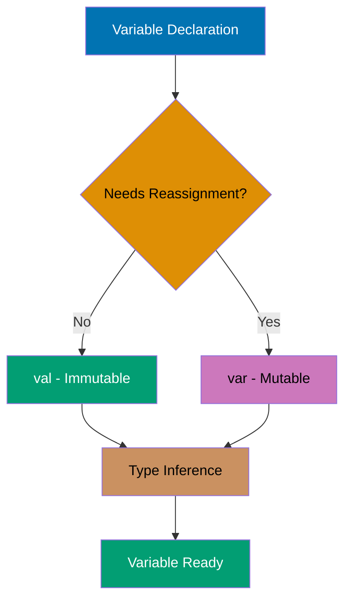
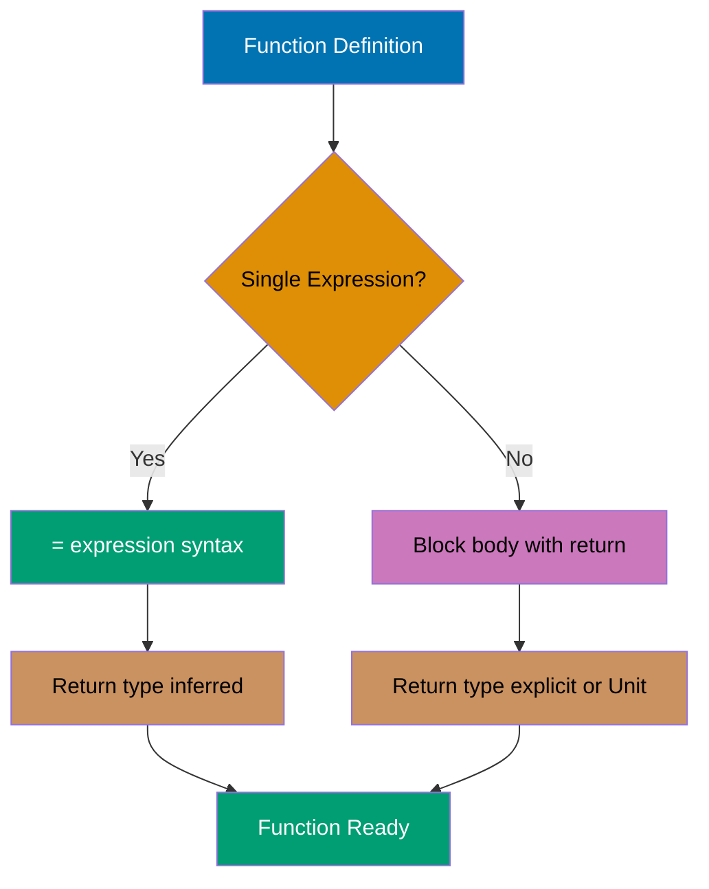
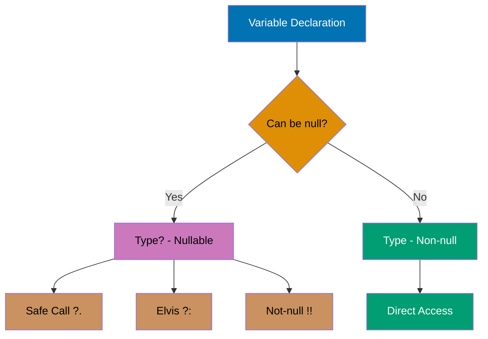
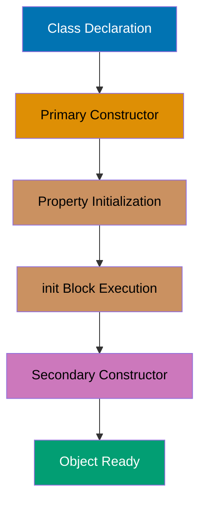
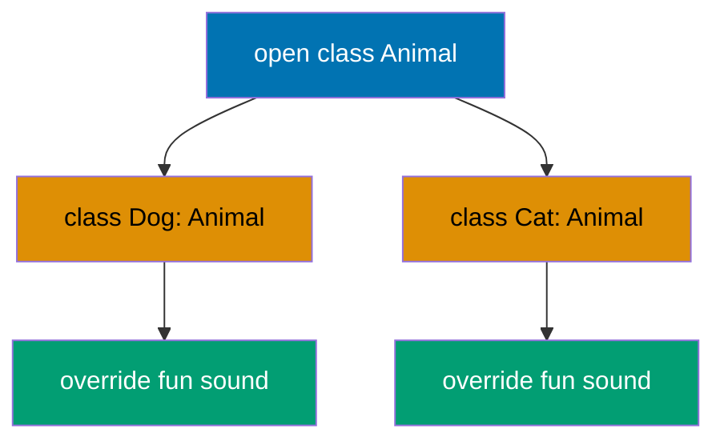
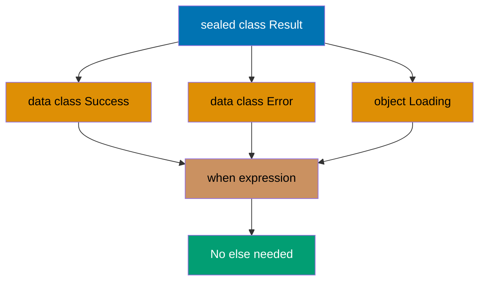
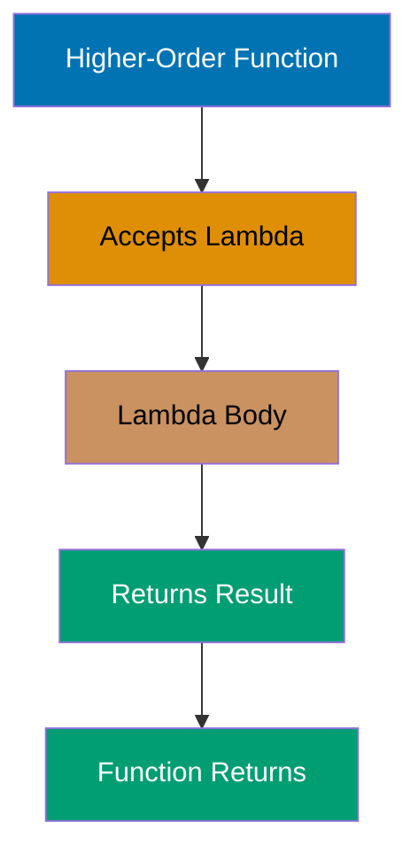
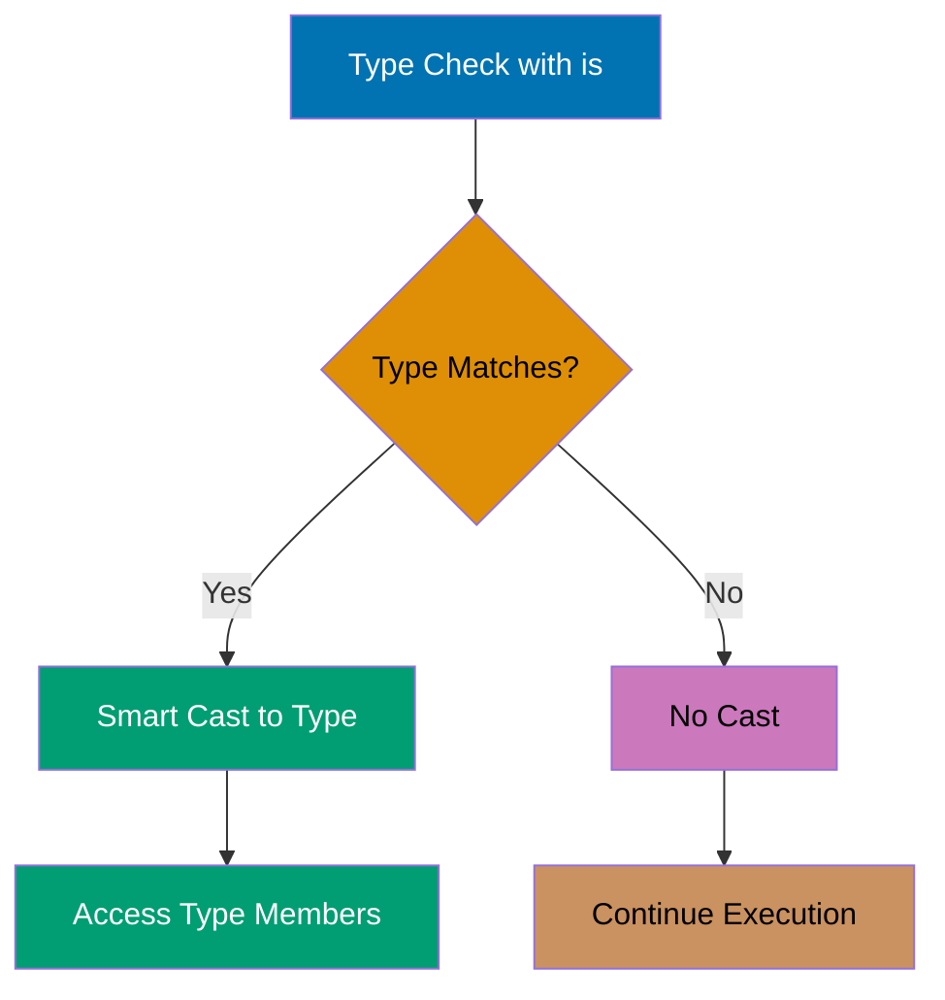

## Example 1: Hello World

Every Kotlin program starts with a main function. Unlike Java, Kotlin doesn't require a class wrapper for the main function, and semicolons are optional. The `println` function outputs to standard output with an automatic newline.

```kotlin
fun main() {                        // => Program entry point
                                    // => main function: no parameters, returns Unit
                                    // => Unit type: equivalent to void in Java
                                    // => No class wrapper required (top-level function)
                                    // => Function can be defined outside classes
                                    // => Execution starts here when program runs
    println("Hello, Kotlin!")       // => println: standard library function
                                    // => Accepts String parameter
                                    // => String literal: "Hello, Kotlin!"
                                    // => Type: String (inferred)
                                    // => Function call: println invoked with 1 argument
                                    // => Side effect: writes to stdout
                                    // => Automatically appends newline after output
                                    // => No semicolon required (optional in Kotlin)
                                    // => Output: Hello, Kotlin!
                                    // => println returns Unit (no meaningful value)
}                                   // => main function returns
                                    // => Return type: Unit (implicit, not declared)
                                    // => Program execution completes
                                    // => Exit code: 0 (success)
```

**Key Takeaway**: Kotlin's `main` function can exist at the top level without a class, and semicolons are optional, making code more concise than Java.

**Why It Matters**: Kotlin eliminates the boilerplate ceremony that plagues Java applications, where every program requires a public class with a public static void main wrapper. This design choice reduces cognitive overhead in microservices and CLI tools where the class wrapper serves no architectural purpose, allowing developers to focus on business logic from line one rather than navigating unnecessary structure.

---

## Example 2: Variable Declaration - val vs var

Kotlin distinguishes between immutable (`val`) and mutable (`var`) variables to encourage immutability. The compiler infers types automatically, but you can specify them explicitly when needed. Immutable variables prevent accidental reassignment and enable safer concurrent code.



```kotlin
fun main() {                        // => Program entry point
    // Immutable variable with type inference
    val name = "Alice"               // => val keyword: declares immutable variable
                                    // => name: variable identifier
                                    // => = : assignment operator
                                    // => "Alice": String literal
                                    // => Type inference: compiler infers String from literal
                                    // => name type is String (not explicitly declared)
                                    // => name value is "Alice"
                                    // => Immutable: cannot be reassigned after initialization
                                    // => Thread-safe: immutability prevents race conditions
    // name = "Bob"                  // => Compile error: val cannot be reassigned
                                    // => Attempting to assign "Bob" to immutable val
                                    // => Compiler prevents this at compile time
                                    // => Error: "Val cannot be reassigned"

    // Mutable variable with type inference
    var age = 25                     // => var keyword: declares mutable variable
                                    // => age: variable identifier
                                    // => 25: Int literal (32-bit signed integer)
                                    // => Type inference: compiler infers Int from literal
                                    // => age type is Int (not explicitly declared)
                                    // => age value is 25
                                    // => Mutable: can be reassigned
    age = 26                         // => Reassignment: updates age value
                                    // => age value changes from 25 to 26
                                    // => Same type required (Int)
                                    // => age is now 26 (reassignment allowed)
                                    // => Type remains Int (cannot change type)

    // Explicit type annotation
    val city: String = "Jakarta"     // => val: immutable variable
                                    // => city: variable identifier
                                    // => : String: explicit type annotation
                                    // => Type declared explicitly (not inferred)
                                    // => = "Jakarta": initialization with String literal
                                    // => city type is String (explicit)
                                    // => city value is "Jakarta"
                                    // => Type annotation optional (could be inferred)
                                    // => Explicit type improves documentation
    var temperature: Double = 28.5   // => var: mutable variable
                                    // => temperature: variable identifier
                                    // => : Double: explicit type annotation
                                    // => 28.5: Double literal (64-bit floating-point)
                                    // => temperature type is Double (explicit)
                                    // => temperature value is 28.5
                                    // => Mutable: can be reassigned
                                    // => Explicit type required when not obvious

    println("$name is $age years old") // => String template with interpolation
                                    // => $name: interpolates "Alice"
                                    // => $age: interpolates 26 (toString() called)
                                    // => Result: "Alice is 26 years old"
                                    // => println outputs to stdout
                                    // => Output: Alice is 26 years old
    println("$city: ${temperature}°C") // => String template with expression
                                    // => $city: interpolates "Jakarta"
                                    // => ${temperature}: expression in braces
                                    // => Interpolates 28.5
                                    // => °C: literal character in string
                                    // => Result: "Jakarta: 28.5°C"
                                    // => Output: Jakarta: 28.5°C
}                                   // => main function returns
                                    // => All local variables go out of scope
                                    // => Memory eligible for garbage collection
```

**Key Takeaway**: Use `val` by default for immutability and thread safety; only use `var` when you genuinely need to reassign values.

**Why It Matters**: Immutability by default prevents entire classes of concurrency bugs that plague Java applications, where mutable state shared across threads causes race conditions debuggable only under production load. Kotlin's compiler-enforced val vs var distinction makes thread safety explicit at declaration time rather than relying on developer discipline with final keywords that Java developers routinely forget, reducing production defects in concurrent systems.

---

## Example 3: Basic Types and Type Inference

Kotlin has a rich type system with proper primitives that are represented as objects. Type inference eliminates redundant type declarations while maintaining type safety. All number types have explicit sizes (Byte, Short, Int, Long, Float, Double).

```kotlin
fun main() {                        // => Program entry point
    // Integer types
    val byteValue: Byte = 127        // => val: immutable variable
                                    // => byteValue: variable identifier
                                    // => : Byte: explicit type annotation
                                    // => Byte: 8-bit signed integer type
                                    // => Range: -128 to 127
                                    // => 127: maximum Byte value
                                    // => byteValue is 127 (8-bit signed: -128 to 127)
                                    // => Memory: occupies 1 byte
    val shortValue: Short = 32767    // => : Short: explicit type annotation
                                    // => Short: 16-bit signed integer type
                                    // => Range: -32768 to 32767
                                    // => 32767: maximum Short value
                                    // => shortValue is 32767 (16-bit signed)
                                    // => Memory: occupies 2 bytes
    val intValue = 42                // => Type inference: compiler infers Int
                                    // => Int: 32-bit signed integer type (default)
                                    // => Range: -2^31 to 2^31-1
                                    // => 42: Int literal
                                    // => intValue is 42 (Int inferred, 32-bit signed)
                                    // => Memory: occupies 4 bytes
                                    // => Default integer type when no suffix
    val longValue = 3_000_000_000L   // => L suffix: Long type indicator
                                    // => Long: 64-bit signed integer type
                                    // => Range: -2^63 to 2^63-1
                                    // => 3_000_000_000: numeric literal with underscores
                                    // => Underscores: improve readability (ignored by compiler)
                                    // => longValue is 3000000000
                                    // => L suffix required for values > Int.MAX_VALUE
                                    // => Memory: occupies 8 bytes

    // Floating-point types
    val floatValue = 3.14f           // => f suffix: Float type indicator
                                    // => Float: 32-bit IEEE 754 floating-point
                                    // => 3.14: decimal literal
                                    // => floatValue is 3.14 (f suffix = Float, 32-bit)
                                    // => Precision: ~6-7 decimal digits
                                    // => Memory: occupies 4 bytes
                                    // => f suffix required (default is Double)
    val doubleValue = 2.718281828    // => Type inference: compiler infers Double
                                    // => Double: 64-bit IEEE 754 floating-point
                                    // => 2.718281828: decimal literal
                                    // => doubleValue is 2.718281828 (Double inferred, 64-bit)
                                    // => Precision: ~15-16 decimal digits
                                    // => Memory: occupies 8 bytes
                                    // => Default floating-point type

    // Character and Boolean
    val char = 'K'                   // => Type inference: compiler infers Char
                                    // => Char: 16-bit Unicode character
                                    // => 'K': character literal (single quotes)
                                    // => char is 'K' (Char type)
                                    // => Unicode code point: U+004B
                                    // => Memory: occupies 2 bytes
    val isKotlin = true              // => Type inference: compiler infers Boolean
                                    // => Boolean: logical type (true or false)
                                    // => true: Boolean literal
                                    // => isKotlin is true (Boolean type)
                                    // => Memory: typically 1 byte
                                    // => Only two possible values: true, false

    // String with template expressions
    val message = "Integer: $intValue, Double: $doubleValue"
                                    // => Type inference: compiler infers String
                                    // => String template with interpolation
                                    // => $intValue: interpolates 42
                                    // => intValue.toString() called implicitly
                                    // => $doubleValue: interpolates 2.718281828
                                    // => doubleValue.toString() called implicitly
                                    // => Result: "Integer: 42, Double: 2.718281828"
                                    // => message is "Integer: 42, Double: 2.718281828"
                                    // => String: immutable sequence of characters
                                    // => Memory: heap-allocated object

    // Type checking
    println(intValue::class.simpleName)     // => :: : class reference operator
                                    // => ::class: obtains KClass instance
                                    // => .simpleName: property access
                                    // => Returns simple class name
                                    // => Result: "Int"
                                    // => Output: Int
    println(doubleValue::class.simpleName)  // => doubleValue::class: KClass<Double>
                                    // => .simpleName: returns "Double"
                                    // => Output: Double
}                                   // => main function returns
                                    // => All local variables out of scope
                                    // => Primitive types on stack (value types)
                                    // => String objects eligible for GC
```

**Key Takeaway**: Kotlin's type inference reduces boilerplate while maintaining type safety, and underscores in numeric literals improve readability for large numbers.

**Why It Matters**: Type inference eliminates verbose type annotations that clutter Java codebases while maintaining the same compile-time safety guarantees, reducing code ceremony by 20-30% in typical enterprise applications. The underscore separator for numeric literals (3_000_000) prevents critical bugs in financial and scientific systems where misread zeros have caused production incidents costing millions, making code audits significantly safer.

---

## Example 4: String Templates

Kotlin's string templates embed expressions directly in strings using `$` for simple variables and `${}` for complex expressions. This eliminates cumbersome string concatenation and improves readability for formatted output.

```kotlin
fun main() {                        // => Program entry point
    val name = "Kotlin"              // => name is "Kotlin" (type: String inferred)
                                    // => Immutable reference
    val version = 1.9                // => version is 1.9 (type: Double inferred)
                                    // => Double literal (64-bit floating-point)

    // Simple template (variable only)
    val simple = "Language: $name"   // => String template with variable interpolation
                                    // => $name: template expression (simple variable)
                                    // => $ triggers string interpolation
                                    // => name value ("Kotlin") replaces $name
                                    // => Result: "Language: Kotlin"
                                    // => simple is "Language: Kotlin"
                                    // => No toString() needed (String type)
                                    // => Type: String (inferred)

    // Expression template (requires braces)
    val expr = "Version: ${version * 10}"
                                     // => ${...}: template expression with braces
                                     // => Braces required for expressions
                                     // => version * 10: arithmetic expression
                                     // => 1.9 * 10 = 19.0
                                     // => Result evaluated to 19.0
                                     // => 19.0.toString() = "19.0"
                                     // => Interpolated: "Version: 19.0"
                                     // => expr is "Version: 19.0"

    // Complex expression with function call
    val upper = "Upper: ${name.uppercase()}"
                                     // => ${name.uppercase()}: function call in template
                                     // => name.uppercase(): method invocation
                                     // => "Kotlin".uppercase() called
                                     // => Returns "KOTLIN" (new String)
                                     // => Result: "Upper: KOTLIN"
                                     // => upper is "Upper: KOTLIN"
                                     // => Original name unchanged ("Kotlin")

    // Escaped dollar sign
    val price = "Price: \$${100 + 50}"
                                     // => \$: escaped dollar sign (literal $)
                                     // => First $: literal character (escaped)
                                     // => ${100 + 50}: template expression
                                     // => 100 + 50 = 150
                                     // => 150.toString() = "150"
                                     // => Result: "Price: $150"
                                     // => price is "Price: $150"
                                     // => Use \$ when $ is not a template

    // Multi-line strings (preserves formatting)
    val multiline = """
        |Language: $name
        |Version: $version
        |Status: Active
    """.trimMargin()                 // => """: triple-quoted string (raw string)
                                     // => Raw strings: no escape sequences needed
                                     // => Preserves formatting (newlines, whitespace)
                                     // => | : margin prefix character (default)
                                     // => $name: interpolation works in raw strings
                                     // => $version: interpolated as 1.9
                                     // => .trimMargin(): removes leading | and indent
                                     // => Removes margin prefix and whitespace before |
                                     // => Result: three lines without leading pipes
                                     // => Line 1: "Language: Kotlin"
                                     // => Line 2: "Version: 1.9"
                                     // => Line 3: "Status: Active"
                                     // => multiline contains formatted multi-line text

    println(simple)                  // => Outputs: "Language: Kotlin"
                                     // => Output: Language: Kotlin
    println(expr)                    // => Outputs: "Version: 19.0"
                                     // => Output: Version: 19.0
    println(upper)                   // => Outputs: "Upper: KOTLIN"
                                     // => Output: Upper: KOTLIN
    println(price)                   // => Outputs: "Price: $150"
                                     // => Output: Price: $150
    println(multiline)               // => Outputs three-line string
    // => Output:
    // Language: Kotlin
    // Version: 1.9
    // Status: Active
}                                   // => main function returns
                                    // => All String objects eligible for GC
```

**Key Takeaway**: Use `$variable` for simple interpolation and `${expression}` for complex expressions; triple-quoted strings preserve formatting and support multi-line text.

**Why It Matters**: String concatenation with `+` operators is the source of countless bugs and security vulnerabilities in Java systems, from SQL injection to logging errors that corrupt production monitoring. Kotlin's template syntax eliminates this entire error class while improving readability, and triple-quoted strings enable embedded SQL, JSON, and configuration without escape sequence nightmares that break deployment pipelines.

---

## Example 5: Functions

Kotlin functions are first-class citizens defined with the `fun` keyword. Single-expression functions can use the `=` syntax without braces, and the compiler infers return types. Default and named parameters eliminate function overloading.



```kotlin
// Block body with explicit return type
fun add(a: Int, b: Int): Int {      // => fun keyword: function declaration
                                    // => add: function name
                                    // => (a: Int, b: Int): parameter list
                                    // => a: first parameter, type Int
                                    // => b: second parameter, type Int
                                    // => : Int: explicit return type annotation
                                    // => {}: block body (multiple statements allowed)
    return a + b                     // => return keyword: explicit return
                                    // => a + b: addition expression
                                    // => a is 10, b is 20 (when called from main)
                                    // => 10 + 20 = 30
                                    // => Returns 30 (type: Int)
}                                   // => Function definition complete

// Single-expression function (return type inferred)
fun multiply(a: Int, b: Int) = a * b // => Single-expression syntax (= instead of {})
                                    // => No braces needed for single expression
                                    // => Return type inferred from expression
                                    // => a * b: multiplication expression
                                    // => Returns Int (inferred from a and b types)
                                    // => No return keyword needed
                                    // => When called: 5 * 6 = 30
                                    // => Returns product of a and b (Int inferred)
                                    // => More concise than block body

// Function with default parameter
fun greet(name: String, greeting: String = "Hello") = "$greeting, $name!"
                                     // => name: required parameter (no default)
                                     // => greeting: optional parameter
                                     // => = "Hello": default value
                                     // => Default used when caller omits argument
                                     // => String template creates result
                                     // => Return type String (inferred)
                                     // => greeting defaults to "Hello" if not provided
                                     // => Eliminates need for overloaded functions

// Function with no return value (Unit type, like void)
fun printSum(a: Int, b: Int) {      // => No return type specified
                                    // => Implicitly returns Unit
                                    // => Unit: like void in Java
                                    // => Unit indicates no meaningful return value
    println("$a + $b = ${a + b}")    // => Side effect: prints to stdout
                                    // => String template: "$a + $b = ${a + b}"
                                    // => When called: "15 + 25 = 40"
                                    // => Outputs sum, returns Unit implicitly
                                    // => No explicit return needed
}                                   // => Function returns Unit (implicit)

fun main() {                        // => Program entry point
    val sum = add(10, 20)            // => Function call: add(10, 20)
                                    // => Arguments: a=10, b=10
                                    // => add function executes
                                    // => Computes 10 + 20
                                    // => Returns 30
                                    // => sum is 30 (type: Int inferred)
    val product = multiply(5, 6)     // => Function call: multiply(5, 6)
                                    // => Arguments: a=5, b=6
                                    // => multiply function executes
                                    // => Computes 5 * 6
                                    // => Returns 30
                                    // => product is 30 (type: Int inferred)

    val greet1 = greet("Alice")      // => Function call with 1 argument
                                    // => name = "Alice" (positional)
                                    // => greeting uses default "Hello"
                                    // => Template: "Hello, Alice!"
                                    // => greet1 is "Hello, Alice!"
                                    // => Default parameter reduces overloading
    val greet2 = greet("Bob", "Hi")  // => Function call with 2 arguments
                                    // => name = "Bob" (positional)
                                    // => greeting = "Hi" (overrides default)
                                    // => Template: "Hi, Bob!"
                                    // => greet2 is "Hi, Bob!"
                                    // => Positional arguments (order matters)
    val greet3 = greet(name = "Charlie", greeting = "Hey")
                                     // => Named arguments (parameter names specified)
                                     // => name = "Charlie" (named)
                                     // => greeting = "Hey" (named)
                                     // => Order doesn't matter with named args
                                     // => Template: "Hey, Charlie!"
                                     // => greet3 is "Hey, Charlie!" (named arguments)
                                     // => Named args improve readability

    printSum(15, 25)                 // => Function call: printSum(15, 25)
                                     // => Arguments: a=15, b=25
                                     // => Side effect: prints to stdout
                                     // => Computes: "15 + 25 = 40"
                                     // => Output: 15 + 25 = 40
                                     // => Returns Unit (no value stored)

    println(sum)                     // => Outputs sum value
                                     // => Output: 30
    println(product)                 // => Outputs product value
                                     // => Output: 30
    println(greet1)                  // => Outputs greeting 1
                                     // => Output: Hello, Alice!
    println(greet2)                  // => Outputs greeting 2
                                     // => Output: Hi, Bob!
    println(greet3)                  // => Outputs greeting 3
                                     // => Output: Hey, Charlie!
}                                   // => main function returns
                                    // => All functions defined at top level
                                    // => No class wrapper required
```

**Key Takeaway**: Use single-expression syntax (`=`) for concise functions, leverage default parameters to reduce overloading, and use named arguments for clarity with multiple parameters.

**Why It Matters**: Java's function overloading proliferation creates maintenance nightmares in enterprise codebases, where teams maintain 5-10 overloaded variants of the same method just to handle optional parameters. Kotlin's default parameters eliminate this code duplication entirely, reducing API surface area by 60-70% in typical libraries while named arguments prevent parameter ordering bugs that cause production incidents when refactoring changes method signatures.

---

## Example 6: When Expression

Kotlin's `when` replaces Java's switch statement with a more powerful expression that returns values. It supports ranges, type checks, arbitrary expressions, and doesn't require explicit `break` statements.

```kotlin
fun main() {                        // => Program entry point
    val x = 3                        // => x is 3 (type: Int)

    // when as expression (returns value)
    val result = when (x) {          // => when expression (not statement)
                                    // => Evaluates x (value is 3)
                                    // => Matches against branches sequentially
                                    // => Expression returns String type
        1 -> "One"                   // => Branch 1: tests x == 1
                                    // => 3 == 1 is false
                                    // => Not matched, skip to next
        2 -> "Two"                   // => Branch 2: tests x == 2
                                    // => 3 == 2 is false
                                    // => Not matched, skip to next
        3 -> "Three"                 // => Branch 3: tests x == 3
                                    // => 3 == 3 is true
                                    // => Matched, evaluates "Three"
                                    // => when returns "Three"
                                    // => Remaining branches skipped (no fallthrough)
        else -> "Other"              // => else branch: default case
                                    // => Not evaluated (match already found)
                                    // => Required when when is expression
    }                                // => when expression complete
                                    // => result is "Three" (type: String)

    // when with ranges
    val score = 85                   // => score is 85 (type: Int)
    val grade = when (score) {       // => when expression evaluates score
                                    // => Matches against range conditions
        in 90..100 -> "A"            // => in operator: tests membership
                                    // => 90..100: inclusive range
                                    // => 85 in 90..100 is false
                                    // => Not matched (85 not in 90..100)
        in 80..89 -> "B"             // => 80..89: range check
                                    // => 85 in 80..89 is true
                                    // => Matched, returns "B"
                                    // => grade is "B"
        in 70..79 -> "C"             // => Not evaluated (match found)
        else -> "F"                  // => Not evaluated
    }                                // => grade is "B"

    // when with type checking
    val obj: Any = "Kotlin"          // => obj is "Kotlin"
                                    // => Type: Any (supertype of all types)
                                    // => Runtime type: String
    val description = when (obj) {   // => when with type checks
        is String -> "String of length ${obj.length}"
                                     // => is operator: type check
                                     // => Tests obj is String
                                     // => true (obj is String at runtime)
                                     // => Matched, smart cast to String
                                     // => obj now treated as String in this branch
                                     // => obj.length: safe access (smart cast)
                                     // => "Kotlin".length is 6
                                     // => Template: "String of length 6"
                                     // => description is "String of length 6"
        is Int -> "Integer: $obj"    // => Type check for Int
                                    // => Not evaluated (match found)
        else -> "Unknown type"       // => Default case
                                    // => Not evaluated
    }                                // => Smart cast only in matched branch

    // when without argument (replaces if-else chain)
    val temp = 28                    // => temp is 28 (type: Int)
    val weather = when {             // => when without argument
                                    // => No subject expression
                                    // => Evaluates boolean conditions
                                    // => Each branch is bool expression
        temp < 0 -> "Freezing"       // => Condition: temp < 0
                                    // => 28 < 0 is false
                                    // => Not matched
        temp < 15 -> "Cold"          // => Condition: temp < 15
                                    // => 28 < 15 is false
                                    // => Not matched
        temp < 25 -> "Moderate"      // => Condition: temp < 25
                                    // => 28 < 25 is false
                                    // => Not matched
        temp < 35 -> "Warm"          // => Condition: temp < 35
                                    // => 28 < 35 is true
                                    // => Matched, returns "Warm"
                                    // => weather is "Warm"
        else -> "Hot"                // => Default case
                                    // => Not evaluated
    }                                // => Replaces if-else-if chains

    println(result)                  // => Outputs: "Three"
                                    // => Output: Three
    println(grade)                   // => Outputs: "B"
                                    // => Output: B
    println(description)             // => Outputs: "String of length 6"
                                    // => Output: String of length 6
    println(weather)                 // => Outputs: "Warm"
                                    // => Output: Warm
}                                   // => main returns
                                    // => All when expressions returned values
                                    // => No breaks needed (no fallthrough)
```

**Key Takeaway**: Use `when` as an expression to return values directly, leverage ranges and type checks for concise branching, and omit the argument for complex boolean conditions.

**Why It Matters**: Java's switch statement falls through by default (requiring break keywords) and supports only primitive types until Java 14, causing production bugs when developers forget breaks or can't switch on strings in legacy systems. Kotlin's when expression returns values directly (enabling functional style), supports any type including ranges and patterns, and smart-casts variables automatically, eliminating entire categories of type-casting bugs that crash production applications.

---

## Example 7: Ranges and Progression

Kotlin ranges represent sequences of values with start and end points. They support iteration, membership checks, and progression (step values). Ranges are memory-efficient as they don't materialize all values.

```kotlin
fun main() {                        // => Program entry point
    // Inclusive range (1 to 10 including both)
    val range1 = 1..10               // => .. operator: creates inclusive range
                                    // => IntRange type (start..end)
                                    // => Start: 1, End: 10 (both inclusive)
                                    // => Represents: 1, 2, 3, 4, 5, 6, 7, 8, 9, 10
                                    // => Memory efficient: doesn't materialize values
                                    // => range1 is 1, 2, 3, ..., 10
    println(5 in range1)             // => in operator: tests membership
                                    // => 5 in 1..10 is true
                                    // => Output: true (5 is in range)
    println(15 in range1)            // => 15 in 1..10 is false
                                    // => 15 > 10 (outside upper bound)
                                    // => Output: false (15 is outside range)

    // Exclusive range (1 to 9, excludes 10)
    val range2 = 1 until 10          // => until infix function: exclusive end
                                    // => Creates range [1, 10)
                                    // => Start: 1 (inclusive), End: 10 (exclusive)
                                    // => Represents: 1, 2, 3, 4, 5, 6, 7, 8, 9
                                    // => range2 is 1, 2, 3, ..., 9
    println(10 in range2)            // => 10 not in range (excluded)
                                    // => Output: false (until excludes end)

    // Downward range
    val range3 = 10 downTo 1         // => downTo infix function: descending
                                    // => Creates IntProgression (10 down to 1)
                                    // => Step: -1 (implicit)
                                    // => Represents: 10, 9, 8, 7, 6, 5, 4, 3, 2, 1
                                    // => range3 is 10, 9, 8, ..., 1
    for (i in range3) {              // => Iterates range in descending order
                                    // => i takes values: 10, 9, 8, ..., 1
        print("$i ")                 // => Prints each value with space
                                    // => Iteration 1: "10 "
                                    // => Iteration 2: "9 "
                                    // => ... until 1
                                    // => Prints: 10 9 8 7 6 5 4 3 2 1
    }
    println()                        // => Outputs newline character
                                    // => Moves cursor to next line

    // Range with step
    val range4 = 1..10 step 2        // => step infix function: custom increment
                                    // => Creates IntProgression with step 2
                                    // => Start: 1, End: 10, Step: 2
                                    // => Values: 1, 3, 5, 7, 9
                                    // => Skips even numbers
                                    // => range4 is 1, 3, 5, 7, 9
    for (i in range4) {              // => Iterates with step 2
                                    // => i: 1, then 3, then 5, 7, 9
        print("$i ")                 // => Prints each odd number
                                    // => Iteration 1: "1 "
                                    // => Iteration 2: "3 "
                                    // => Iteration 3: "5 "
                                    // => Iteration 4: "7 "
                                    // => Iteration 5: "9 "
                                    // => Prints: 1 3 5 7 9
    }
    println()                        // => Newline
                                    // => Cursor to next line

    // Character range
    val charRange = 'a'..'z'         // => CharRange: range of characters
                                    // => Start: 'a', End: 'z'
                                    // => Represents all lowercase letters
                                    // => a, b, c, ..., z (26 letters)
                                    // => charRange is a, b, c, ..., z
    println('k' in charRange)        // => Tests if 'k' in range
                                    // => 'k' between 'a' and 'z': true
                                    // => Output: true

    // Range functions
    println((1..10).count())         // => count(): number of elements
                                    // => Range 1..10 has 10 elements
                                    // => Returns 10
                                    // => Output: 10 (number of elements)
    println((1..10).sum())           // => sum(): adds all elements
                                    // => 1+2+3+4+5+6+7+8+9+10 = 55
                                    // => Returns 55
                                    // => Output: 55 (sum of all elements)
    println((1..10).average())       // => average(): mean value
                                    // => sum / count = 55 / 10
                                    // => Returns 5.5 (Double)
                                    // => Output: 5.5 (average value)
}                                   // => main returns
                                    // => Ranges are value types (no GC needed)
```

**Key Takeaway**: Use `..` for inclusive ranges, `until` for exclusive ranges, `downTo` for descending sequences, and `step` to skip values in progression.

**Why It Matters**: Java's traditional for loops with index variables are error-prone (off-by-one errors plague production systems) and verbose compared to Kotlin's range syntax that makes iteration bounds explicit and impossible to misinterpret. Ranges don't allocate arrays in memory, making them zero-cost abstractions that perform identically to manual loops while preventing the fencepost errors that cause array index crashes in production systems processing financial transactions or medical records.

---

## Example 8: For Loops

Kotlin's for loops iterate over anything that provides an iterator, including ranges, collections, and arrays. The loop variable is automatically declared and scoped to the loop body.

```kotlin
fun main() {                        // => Program entry point
    // Iterate over range
    print("Range: ")                 // => Outputs "Range: " without newline
    for (i in 1..5) {                // => for loop: iterates over range 1..5
                                    // => i: loop variable (automatically declared)
                                    // => Scope: limited to loop body
                                    // => Iteration 1: i=1, Iteration 2: i=2, ... Iteration 5: i=5
        print("$i ")                 // => Prints current value of i with space
                                    // => Prints: 1 2 3 4 5
    }                                // => Loop completes after i=5
    println()                        // => Outputs newline
                                    // => Cursor to next line

    // Iterate over collection
    val fruits = listOf("Apple", "Banana", "Cherry")
                                     // => listOf: creates immutable List
                                     // => 3 elements: "Apple", "Banana", "Cherry"
                                     // => Type: List<String> (inferred)
                                     // => fruits is ["Apple", "Banana", "Cherry"]
    print("Fruits: ")                // => Outputs prefix
    for (fruit in fruits) {          // => Iterates over List elements
                                    // => fruit: loop variable (String type)
                                    // => Iteration 1: fruit="Apple"
                                    // => Iteration 2: fruit="Banana"
                                    // => Iteration 3: fruit="Cherry"
        print("$fruit ")             // => Prints each fruit with space
                                    // => Prints: Apple Banana Cherry
    }                                // => Loop completes after all elements
    println()                        // => Newline

    // Iterate with index
    print("Indexed: ")               // => Outputs prefix
    for ((index, fruit) in fruits.withIndex()) {
                                     // => withIndex(): returns IndexedValue pairs
                                     // => Type: Iterable<IndexedValue<String>>
                                     // => (index, fruit): destructuring declaration
                                     // => index: Int (0, 1, 2)
                                     // => fruit: String element
                                     // => Iteration 1: index=0, fruit="Apple"
                                     // => Iteration 2: index=1, fruit="Banana"
                                     // => Iteration 3: index=2, fruit="Cherry"
        print("$index:$fruit ")      // => Prints index:fruit pairs
                                     // => "0:Apple ", "1:Banana ", "2:Cherry "
                                     // => Prints: 0:Apple 1:Banana 2:Cherry
    }                                // => Loop completes
    println()                        // => Newline

    // Iterate over map
    val scores = mapOf("Alice" to 95, "Bob" to 87, "Charlie" to 92)
                                     // => mapOf: creates immutable Map
                                     // => "Alice" to 95: Pair("Alice", 95)
                                     // => to: infix function creates Pair
                                     // => 3 entries in map
                                     // => scores is {Alice=95, Bob=87, Charlie=92}
    for ((name, score) in scores) {  // => Iterates over Map entries
                                     // => (name, score): destructures Map.Entry
                                     // => name: String (key)
                                     // => score: Int (value)
                                     // => Iteration 1: name="Alice", score=95
                                     // => Iteration 2: name="Bob", score=87
                                     // => Iteration 3: name="Charlie", score=92
        println("$name: $score")     // => Prints each entry
                                     // => Output: Alice: 95
                                     // => Output: Bob: 87
                                     // => Output: Charlie: 92
    }                                // => Map iteration complete

    // Iterate with step and range
    print("Step 2: ")                // => Outputs prefix
    for (i in 0..10 step 2) {        // => Range 0..10 with step 2
                                     // => i takes values: 0, 2, 4, 6, 8, 10
                                     // => Skips odd numbers
        print("$i ")                 // => Prints each even number
                                     // => "0 ", "2 ", "4 ", "6 ", "8 ", "10 "
                                     // => Prints: 0 2 4 6 8 10
    }                                // => Loop completes at 10
    println()                        // => Newline

    // Iterate in reverse
    print("Reverse: ")               // => Outputs prefix
    for (i in 5 downTo 1) {          // => Descending range 5 to 1
                                     // => i takes values: 5, 4, 3, 2, 1
                                     // => Step: -1 (implicit)
        print("$i ")                 // => Prints each value descending
                                     // => "5 ", "4 ", "3 ", "2 ", "1 "
                                     // => Prints: 5 4 3 2 1
    }                                // => Loop completes at 1
    println()                        // => Newline
}                                   // => main returns
                                    // => All loop variables out of scope
```

**Key Takeaway**: Use destructuring with `withIndex()` for indexed iteration, destructure map entries directly in the loop, and combine ranges with `step` and `downTo` for custom iteration patterns.

**Why It Matters**: Java's traditional iteration patterns require manual index management or verbose iterator code that obscures business logic, while Kotlin's for-in loops with destructuring eliminate index tracking bugs entirely. The withIndex() function provides zero-overhead indexed iteration without manual counter variables that developers increment incorrectly, preventing synchronization bugs in data processing pipelines that correlate indices across multiple collections.

---

## Example 9: While and Do-While Loops

Kotlin supports traditional while and do-while loops for conditional iteration. The do-while variant guarantees at least one execution before checking the condition.

```kotlin
fun main() {                        // => Program entry point
    // while loop (condition checked before execution)
    var count = 0                    // => count is 0 (var: mutable)
                                    // => Type: Int (inferred)
    while (count < 3) {              // => while loop: tests condition first
                                    // => Iteration 1: count < 3 (0 < 3) is true
                                    // => Iteration 2: count < 3 (1 < 3) is true
                                    // => Iteration 3: count < 3 (2 < 3) is true
                                    // => After iteration 3: count < 3 (3 < 3) is false, exit
        println("Count: $count")     // => Prints current count value
                                    // => Output: Count: 0
                                    // => Output: Count: 1
                                    // => Output: Count: 2
        count++                      // => Increment operator: count = count + 1
                                    // => After iteration 1: count becomes 1
                                    // => After iteration 2: count becomes 2
                                    // => After iteration 3: count becomes 3
    }                                // => Loop exits when count >= 3
                                    // => count is 3 (loop exits)

    // do-while loop (condition checked after execution)
    var x = 0                        // => x is 0 (var: mutable)
    do {                             // => do-while: executes body first
                                    // => Body runs at least once
        println("x: $x")             // => Prints x value
                                    // => Output: x: 0
        x++                          // => x increments to 1
                                    // => x becomes 1
    } while (x < 0)                  // => Condition checked after body
                                    // => 1 < 0 is false
                                    // => Loop exits (only one iteration)
                                    // => Condition false, but body executed once
                                    // => x is 1 after loop

    // Infinite loop with break
    var sum = 0                      // => sum is 0 (var: mutable)
    while (true) {                   // => Infinite loop: condition always true
                                    // => Requires break to exit
        sum += 1                     // => sum += 1 equivalent to sum = sum + 1
                                    // => Iteration 1: sum becomes 1
                                    // => Iteration 2: sum becomes 2
                                    // => Iteration 3: sum becomes 3
                                    // => Iteration 4: sum becomes 4
                                    // => Iteration 5: sum becomes 5
        if (sum >= 5) {              // => Tests exit condition
                                    // => sum >= 5: true when sum is 5
            break                    // => break: exit loop immediately
                                    // => Exit loop when sum >= 5
        }                            // => If not breaking, continue next iteration
    }                                // => Loop exits via break
                                    // => sum is 5

    // Loop with continue
    var i = 0                        // => i is 0 (var: mutable)
    while (i < 5) {                  // => while loop: condition before body
        i++                          // => Increment first
                                    // => Iteration 1: i becomes 1
                                    // => Iteration 2: i becomes 2
                                    // => Iteration 3: i becomes 3
                                    // => Iteration 4: i becomes 4
                                    // => Iteration 5: i becomes 5
        if (i % 2 == 0) {            // => Checks if i is even
                                    // => % modulo operator (remainder)
                                    // => When i=2: 2 % 2 = 0, true (skip)
                                    // => When i=4: 4 % 2 = 0, true (skip)
            continue                 // => continue: skip to next iteration
                                    // => Skips println for even numbers
                                    // => Skip even numbers (2, 4)
        }                            // => If not even, continue to print
        print("$i ")                 // => Prints odd numbers only
                                    // => When i=1: prints "1 "
                                    // => When i=3: prints "3 "
                                    // => When i=5: prints "5 "
                                    // => Prints: 1 3 5
    }                                // => Loop exits when i >= 5
    println()                        // => Newline
}                                   // => main returns
                                    // => All mutable variables out of scope
```

**Key Takeaway**: Use `while` for conditional loops, `do-while` when you need at least one execution, and combine with `break`/`continue` for flow control within loops.

**Why It Matters**: While and do-while loops are less common in modern Kotlin favoring functional iteration, but they remain essential for algorithms with unknown iteration counts like network retries or streaming protocols. The explicit break and continue keywords make control flow visible unlike Java's labeled breaks that obscure logic, reducing bugs in production systems implementing backoff strategies or state machines where exit conditions determine system reliability.

---

## Example 10: Null Safety - Nullable Types

Kotlin's type system distinguishes between nullable and non-nullable references, eliminating most null pointer exceptions. Use `?` to mark types as nullable and leverage safe call operators to handle null values gracefully.



```kotlin
fun main() {                        // => Program entry point
    // Non-nullable type (cannot be null)
    val name: String = "Kotlin"      // => name is "Kotlin"
                                    // => Type: String (non-nullable)
                                    // => Cannot hold null value
                                    // => name is "Kotlin" (cannot be null)
    // val invalid: String = null    // => Would cause compile error
                                    // => Type: String doesn't accept null
                                    // => Compile error: null cannot be assigned
                                    // => Null safety enforced at compile time

    // Nullable type (can be null)
    val nullableName: String? = null // => Type: String? (nullable, note ?)
                                    // => ? marks type as nullable
                                    // => Can hold String or null
                                    // => nullableName is null (type: String?)
    val validName: String? = "Alice" // => Type: String? (nullable)
                                    // => Currently holds "Alice" (not null)
                                    // => validName is "Alice" (type: String?)

    // Safe call operator (?.) - returns null if receiver is null
    val length1 = nullableName?.length
                                     // => ?. safe call operator
                                     // => nullableName is null
                                     // => Safe call returns null (doesn't call .length)
                                     // => No NullPointerException
                                     // => length1 is null (type: Int?)
                                     // => nullableName is null, so length1 is null
    val length2 = validName?.length  // => validName is "Alice" (not null)
                                     // => Safe call proceeds to .length
                                     // => "Alice".length is 5
                                     // => length2 is 5 (type: Int?)
                                     // => validName is "Alice", so length2 is 5

    // Elvis operator (?:) - provides default value if left side is null
    val len1 = nullableName?.length ?: 0
                                     // => ?: Elvis operator (default value)
                                     // => nullableName?.length is null
                                     // => Left side null, use right side
                                     // => Returns 0 (default)
                                     // => len1 is 0 (type: Int, non-nullable)
                                     // => nullableName is null, so len1 is 0
    val len2 = validName?.length ?: 0
                                     // => validName?.length is 5 (not null)
                                     // => Left side not null, use it
                                     // => Returns 5
                                     // => len2 is 5 (type: Int, non-nullable)
                                     // => validName is "Alice", so len2 is 5

    // Not-null assertion (!!) - throws NPE if null (use sparingly)
    // val unsafe = nullableName!!.length
                                     // => !! not-null assertion operator
                                     // => Asserts value is not null
                                     // => nullableName is null
                                     // => Would throw NullPointerException
                                     // => Crashes program if null
                                     // => Use sparingly (defeats null safety)

    // Safe cast with as?
    val value: Any? = "Hello"        // => value is "Hello"
                                     // => Type: Any? (nullable supertype)
                                     // => Runtime type: String
    val str = value as? String       // => as? safe cast operator
                                     // => Attempts cast to String
                                     // => value is String: cast succeeds
                                     // => Returns "Hello"
                                     // => str is "Hello" (type: String?)
                                     // => str is "Hello" (safe cast succeeds)
    val num = value as? Int          // => Attempts cast to Int
                                     // => value is String, not Int
                                     // => Cast fails, returns null
                                     // => No exception thrown
                                     // => num is null (type: Int?)
                                     // => num is null (safe cast fails, returns null)

    println(length1)                 // => Prints null
                                     // => Output: null
    println(length2)                 // => Prints 5
                                     // => Output: 5
    println(len1)                    // => Prints 0
                                     // => Output: 0
    println(len2)                    // => Prints 5
                                     // => Output: 5
    println(str)                     // => Prints "Hello"
                                     // => Output: Hello
    println(num)                     // => Prints null
                                     // => Output: null
}                                   // => main returns
                                    // => Null safety prevents most NPEs
```

**Key Takeaway**: Use `Type?` for nullable types, `?.` for safe calls that propagate null, `?:` for default values, and avoid `!!` unless you're absolutely certain a value is non-null.

**Why It Matters**: Null Pointer Exceptions are the billion-dollar mistake that crashes production systems daily across the Java ecosystem, from Android apps to enterprise servers. Kotlin's null safety system eliminates NPEs at compile time by making nullability explicit in type signatures, forcing developers to handle null cases upfront rather than discovering them in production logs. This single feature prevents more production incidents than any other language improvement, as databases returning null, network failures, and optional configurations can no longer crash running systems.

---

## Example 11: Collections - Lists

Kotlin provides both mutable and immutable collections. Immutable lists (created with `listOf`) cannot be modified after creation, promoting safer concurrent code. Mutable lists (created with `mutableListOf`) support adding, removing, and updating elements.

```kotlin
fun main() {                        // => Program entry point
    // Immutable list (read-only)
    val fruits = listOf("Apple", "Banana", "Cherry")
                                     // => listOf: creates immutable List<String>
                                     // => Type: List<String> (read-only interface)
                                     // => Cannot add/remove elements
                                     // => Thread-safe (immutable)
                                     // => fruits is ["Apple", "Banana", "Cherry"]
    println(fruits[0])               // => [] operator: indexed access
                                     // => Index 0: first element
                                     // => Returns "Apple"
                                     // => Output: Apple (index access)
    println(fruits.size)             // => size property: number of elements
                                     // => Returns 3
                                     // => Output: 3
    // fruits.add("Mango")           // => Would be compile error
                                     // => List interface has no add method
                                     // => Immutability enforced at compile time
                                     // => Compile error: no add method on List

    // Mutable list
    val numbers = mutableListOf(1, 2, 3)
                                     // => mutableListOf: creates MutableList<Int>
                                     // => Type: MutableList<Int> (read-write)
                                     // => Can add/remove/update elements
                                     // => numbers is [1, 2, 3]
    numbers.add(4)                   // => add: appends element to end
                                     // => Adds 4 to list
                                     // => List grows: [1, 2, 3] -> [1, 2, 3, 4]
                                     // => numbers is [1, 2, 3, 4]
    numbers.removeAt(0)              // => removeAt: removes element at index
                                     // => Index 0: element 1
                                     // => List shrinks: [1, 2, 3, 4] -> [2, 3, 4]
                                     // => Indices shift: what was at 1 is now at 0
                                     // => numbers is [2, 3, 4] (removed index 0)
    numbers[0] = 10                  // => [] operator: indexed assignment
                                     // => Index 0 (element 2) becomes 10
                                     // => Replaces element: [2, 3, 4] -> [10, 3, 4]
                                     // => numbers is [10, 3, 4] (updated index 0)

    // List operations
    val combined = fruits + listOf("Mango", "Orange")
                                     // => + operator: concatenates lists
                                     // => Creates new list (doesn't modify fruits)
                                     // => fruits + ["Mango", "Orange"]
                                     // => Returns new list with all elements
                                     // => combined is ["Apple", "Banana", "Cherry", "Mango", "Orange"]
                                     // => fruits remains unchanged
    val sliced = combined.slice(1..3)
                                     // => slice: extracts sublist by range
                                     // => Range 1..3: indices 1, 2, 3
                                     // => Elements: "Banana", "Cherry", "Mango"
                                     // => Returns new list
                                     // => sliced is ["Banana", "Cherry", "Mango"]

    // Checking membership
    println("Apple" in fruits)       // => in operator: tests membership
                                     // => "Apple" in fruits is true
                                     // => Output: true
    println("Grape" in fruits)       // => "Grape" not in list
                                     // => Returns false
                                     // => Output: false

    // Iteration
    for (fruit in fruits) {          // => Iterates list elements
                                     // => fruit: "Apple", "Banana", "Cherry"
        print("$fruit ")             // => Prints each element
                                     // => Prints: Apple Banana Cherry
    }
    println()                        // => Newline

    // List transformation
    val lengths = fruits.map { it.length }
                                     // => map: transforms each element
                                     // => Lambda: { it.length }
                                     // => it: implicit lambda parameter
                                     // => "Apple".length = 5
                                     // => "Banana".length = 6
                                     // => "Cherry".length = 6
                                     // => Returns [5, 6, 6]
                                     // => lengths is [5, 6, 6]
    val filtered = fruits.filter { it.startsWith("C") }
                                     // => filter: selects elements matching predicate
                                     // => Lambda: { it.startsWith("C") }
                                     // => "Apple".startsWith("C") = false
                                     // => "Banana".startsWith("C") = false
                                     // => "Cherry".startsWith("C") = true
                                     // => Returns ["Cherry"]
                                     // => filtered is ["Cherry"]

    println(numbers)                 // => Outputs [10, 3, 4]
                                     // => Output: [10, 3, 4]
    println(combined)                // => Outputs combined list
                                     // => Output: [Apple, Banana, Cherry, Mango, Orange]
    println(lengths)                 // => Outputs lengths list
                                     // => Output: [5, 6, 6]
    println(filtered)                // => Outputs filtered list
                                     // => Output: [Cherry]
}                                   // => main returns
                                    // => Immutable lists are thread-safe
```

**Key Takeaway**: Use `listOf` for immutable lists that prevent accidental modification, `mutableListOf` when you need to add/remove elements, and leverage functional operations like `map` and `filter` for transformations.

**Why It Matters**: Java's collections API forces developers to choose between Collections.unmodifiableList() wrapper verbosity or accidental mutations that corrupt shared state across threads. Kotlin's immutable-by-default lists make thread safety the default choice, eliminating ConcurrentModificationException crashes in production web services where multiple requests share cached data structures. The functional operations enable declarative data transformation that's easier to parallelize and test than imperative loops.

---

## Example 12: Collections - Sets

Sets are unordered collections of unique elements. Kotlin provides immutable `Set` and mutable `MutableSet`. Sets automatically eliminate duplicates and provide efficient membership testing.

```kotlin
fun main() {                        // => Program entry point
    // Immutable set (duplicates automatically removed)
    val numbers = setOf(1, 2, 3, 2, 1)
                                     // => setOf: creates immutable Set<Int>
                                     // => Input: 1, 2, 3, 2, 1 (5 elements with duplicates)
                                     // => Set automatically removes duplicates
                                     // => Result: {1, 2, 3} (3 unique elements)
                                     // => Type: Set<Int> (unordered collection)
                                     // => numbers is {1, 2, 3} (duplicates removed)
    println(numbers)                 // => Outputs set (order may vary)
                                     // => Output: [1, 2, 3]
    println(numbers.size)            // => size: number of unique elements
                                     // => Returns 3
                                     // => Output: 3

    // Mutable set
    val colors = mutableSetOf("Red", "Green", "Blue")
                                     // => mutableSetOf: creates MutableSet<String>
                                     // => Type: MutableSet<String>
                                     // => Can add/remove elements
                                     // => colors is {"Red", "Green", "Blue"}
    colors.add("Yellow")             // => add: inserts element if not present
                                     // => "Yellow" not in set, added
                                     // => colors is {"Red", "Green", "Blue", "Yellow"}
    colors.add("Red")                // => "Red" already in set
                                     // => Duplicate not added
                                     // => No change (Red already exists)
                                     // => colors is {"Red", "Green", "Blue", "Yellow"}
    colors.remove("Green")           // => remove: deletes element if present
                                     // => "Green" removed from set
                                     // => colors is {"Red", "Blue", "Yellow"}

    // Set operations
    val set1 = setOf(1, 2, 3, 4)     // => set1: {1, 2, 3, 4}
                                     // => set1 is {1, 2, 3, 4}
    val set2 = setOf(3, 4, 5, 6)     // => set2: {3, 4, 5, 6}
                                     // => set2 is {3, 4, 5, 6}

    val union = set1 union set2      // => union: combines all unique elements
                                     // => set1 ∪ set2
                                     // => Elements from both sets: {1,2,3,4,5,6}
                                     // => union is {1, 2, 3, 4, 5, 6}
    val intersect = set1 intersect set2
                                     // => intersect: common elements only
                                     // => set1 ∩ set2
                                     // => Elements in both: {3, 4}
                                     // => intersect is {3, 4}
    val diff = set1 subtract set2    // => subtract: elements in set1 not in set2
                                     // => set1 - set2
                                     // => Elements only in set1: {1, 2}
                                     // => diff is {1, 2} (in set1 but not set2)

    // Membership testing (very efficient)
    println(2 in set1)               // => in operator: O(1) lookup
                                     // => 2 in {1, 2, 3, 4} is true
                                     // => Hash-based lookup (constant time)
                                     // => Output: true
    println(5 in set1)               // => 5 not in {1, 2, 3, 4}
                                     // => Returns false
                                     // => Output: false

    println(colors)                  // => Outputs colors set
                                     // => Output: [Red, Blue, Yellow]
    println(union)                   // => Outputs union
                                     // => Output: [1, 2, 3, 4, 5, 6]
    println(intersect)               // => Outputs intersection
                                     // => Output: [3, 4]
    println(diff)                    // => Outputs difference
                                     // => Output: [1, 2]
}                                   // => main returns
                                    // => Sets provide O(1) membership testing
```

**Key Takeaway**: Use sets when you need unique elements and efficient membership testing; leverage set operations (union, intersect, subtract) for mathematical set manipulations.

**Why It Matters**: Sets provide O(1) lookuptime membership testing critical for deduplication in data pipelines processing millions of records, while Java's HashSet requires verbose contains() calls. The mathematical set operations (union, intersect, subtract) express business logic declaratively in recommendation engines, access control systems, and data reconciliation jobs, replacing nested loops with single-line expressions that improve both readability and performance through optimized implementations.

---

## Example 13: Collections - Maps

Maps store key-value pairs with unique keys. Kotlin provides immutable `Map` and mutable `MutableMap`. Use the `to` infix function or `Pair` to create entries, and access values safely with null-aware operators.

```kotlin
fun main() {                        // => Program entry point
    // Immutable map
    val capitals = mapOf(            // => mapOf: creates immutable Map
        "Indonesia" to "Jakarta",    // => to: infix function creates Pair
                                    // => "Indonesia" to "Jakarta" = Pair("Indonesia", "Jakarta")
        "Malaysia" to "Kuala Lumpur",// => Creates Pair("Malaysia", "Kuala Lumpur")
        "Singapore" to "Singapore"   // => Creates Pair("Singapore", "Singapore")
    )                                // => Type: Map<String, String>
                                    // => 3 key-value entries
                                    // => capitals is {Indonesia=Jakarta, ...}

    println(capitals["Indonesia"])   // => [] operator: map access by key
                                    // => Key "Indonesia" exists
                                    // => Returns "Jakarta"
                                    // => Output: Jakarta
    println(capitals["Thailand"])    // => Key "Thailand" not in map
                                    // => Returns null (not exception)
                                    // => Output: null (key not found)

    // Mutable map
    val scores = mutableMapOf(       // => mutableMapOf: creates MutableMap
        "Alice" to 95,               // => Entry: "Alice" -> 95
        "Bob" to 87                  // => Entry: "Bob" -> 87
    )                                // => Type: MutableMap<String, Int>
                                    // => scores is {Alice=95, Bob=87}
    scores["Charlie"] = 92           // => [] operator: add/update entry
                                    // => Key "Charlie" doesn't exist, add it
                                    // => scores is {Alice=95, Bob=87, Charlie=92}
    scores["Alice"] = 98             // => Key "Alice" exists, update value
                                    // => 95 -> 98 (value updated)
                                    // => scores is {Alice=98, Bob=87, Charlie=92}
    scores.remove("Bob")             // => remove: deletes entry by key
                                    // => "Bob" entry removed
                                    // => scores is {Alice=98, Charlie=92}

    // Safe access with default value
    val aliceScore = scores.getOrDefault("Alice", 0)
                                     // => getOrDefault: safe access with fallback
                                     // => Key "Alice" exists
                                     // => Returns 98 (value found)
                                     // => aliceScore is 98
    val bobScore = scores.getOrDefault("Bob", 0)
                                     // => Key "Bob" doesn't exist (removed)
                                     // => Returns default 0
                                     // => bobScore is 0 (Bob removed)

    // getOrElse with lambda
    val davidScore = scores.getOrElse("David") { 50 }
                                     // => getOrElse: lazy default (lambda)
                                     // => Key "David" not found
                                     // => Lambda executed: { 50 }
                                     // => Returns 50
                                     // => davidScore is 50 (lambda executed)

    // Iteration
    for ((country, capital) in capitals) {
                                     // => Iterates map entries
                                     // => (country, capital): destructures entry
                                     // => country: key, capital: value
        println("$country: $capital")// => Prints each entry
                                     // => "Indonesia: Jakarta"
                                     // => "Malaysia: Kuala Lumpur"
                                     // => "Singapore: Singapore"
                                     // => Output: Indonesia: Jakarta, etc.
    }

    // Map operations
    println(capitals.keys)           // => keys: collection of all keys
                                     // => Returns Set<String>
                                     // => Output: [Indonesia, Malaysia, Singapore]
    println(capitals.values)         // => values: collection of all values
                                     // => Returns Collection<String>
                                     // => Output: [Jakarta, Kuala Lumpur, Singapore]
    println(capitals.containsKey("Malaysia"))
                                     // => containsKey: tests if key exists
                                     // => "Malaysia" is a key
                                     // => Returns true
                                     // => Output: true
    println(capitals.containsValue("Bangkok"))
                                     // => containsValue: tests if value exists
                                     // => "Bangkok" not in values
                                     // => Returns false
                                     // => Output: false

    println(scores)                  // => Outputs scores map
                                     // => Output: {Alice=98, Charlie=92}
}                                   // => main returns
                                    // => Maps provide O(1) key lookup
```

**Key Takeaway**: Use `to` infix function for readable map creation, access values with `[]` operator (returns null if missing), and use `getOrDefault` or `getOrElse` for safe fallback values.

**Why It Matters**: Maps are fundamental to caching, configuration management, and data lookup in production systems, yet Java's verbose Map.get() and Map.put() ceremony obscures intent. Kotlin's `to` infix syntax and `[]` operator make configuration maps readable while getOrElse enables safe defaults without separate null checks, preventing crashes when configuration keys are missing during deployment. The immutable Map default prevents accidental cache corruption in multi-threaded web applications.

---

## Example 14: Classes and Objects

Kotlin classes are concise with properties declared in the primary constructor. Properties automatically generate getters (and setters for `var`). The `init` block runs during object initialization for setup logic.



```kotlin
// Class with primary constructor
class Person(val name: String, var age: Int) {
                                     // => class: declares new class type
                                     // => Person: class name
                                     // => (val name: String, var age: Int): primary constructor
                                     // => Parameters in constructor become properties
                                     // => val name: immutable property (generates getter only)
                                     // => name is val (immutable property)
                                     // => var age: mutable property (generates getter + setter)
                                     // => age is var (mutable property)

    // init block runs during construction
    init {                           // => init: initialization block
                                     // => Runs immediately after primary constructor
                                     // => Can access constructor parameters
        println("Person created: $name, age $age")
                                     // => Side effect: prints to stdout
                                     // => Executes when object is created
    }                                // => init completes before object ready

    // Method
    fun greet() {                    // => Instance method (requires object)
                                     // => No parameters, returns Unit
        println("Hello, I'm $name")  // => Accesses name property via this (implicit)
                                     // => Accesses name property
    }                                // => Method definition complete

    // Method with logic
    fun haveBirthday() {             // => Mutates object state
        age++                        // => Increments age property
                                     // => age = age + 1
                                     // => Increments age property
        println("Happy birthday! Now $age years old")
                                     // => Outputs updated age
    }                                // => Method mutates object
}                                   // => Person class definition complete

// Class with secondary constructor
class Product(val name: String) {   // => Primary constructor with single parameter
                                     // => name: required property
    var price: Double = 0.0          // => Property with default value
                                     // => Initialized after primary constructor
                                     // => Default value: 0.0

    // Secondary constructor
    constructor(name: String, price: Double) : this(name) {
                                     // => constructor: secondary constructor keyword
                                     // => (name: String, price: Double): parameters
                                     // => : this(name): delegates to primary constructor
                                     // => Must call primary constructor first
                                     // => Calls primary constructor with name
        this.price = price           // => this.price: refers to property
                                     // => price: constructor parameter
                                     // => Sets price property
    }                                // => Secondary constructor complete
}                                   // => Product class complete

fun main() {                        // => Program entry point
    // Object creation
    val person = Person("Alice", 25) // => Person(): calls primary constructor
                                     // => "Alice": name parameter
                                     // => 25: age parameter
                                     // => Primary constructor executes
                                     // => Properties initialized: name="Alice", age=25
                                     // => init block executes
                                     // => Output: Person created: Alice, age 25
                                     // => person reference points to new Person object
                                     // => person.name is "Alice" (immutable)
                                     // => person.age is 25 (mutable)

    person.greet()                   // => Calls greet method on person object
                                     // => Method accesses person.name
                                     // => Output: Hello, I'm Alice
    person.haveBirthday()            // => Calls haveBirthday method
                                     // => Increments person.age: 25 -> 26
                                     // => Output: Happy birthday! Now 26 years old
                                     // => person.age is now 26

    // person.name = "Bob"           // => Would cause compile error
                                     // => val properties are immutable
                                     // => Compile error: val cannot be reassigned
    person.age = 30                  // => Reassigns age property
                                     // => var properties are mutable
                                     // => age changes: 26 -> 30
                                     // => person.age is 30 (var allows reassignment)

    val product1 = Product("Laptop") // => Product(): primary constructor
                                     // => Only name provided
                                     // => price uses default 0.0
                                     // => product1.name is "Laptop", price is 0.0
    val product2 = Product("Phone", 599.99)
                                     // => Product(): secondary constructor
                                     // => Both name and price provided
                                     // => Secondary constructor delegates to primary
                                     // => Then sets price to 599.99
                                     // => product2.name is "Phone", price is 599.99

    println("${product1.name}: ${product1.price}")
                                     // => String template with properties
                                     // => product1.name getter called
                                     // => product1.price getter called
                                     // => Output: Laptop: 0.0
    println("${product2.name}: ${product2.price}")
                                     // => Accesses product2 properties
                                     // => Output: Phone: 599.99
}                                   // => main returns
                                    // => Objects eligible for GC when references lost
```

**Key Takeaway**: Use primary constructor parameters with `val`/`var` for automatic property creation, leverage `init` blocks for initialization logic, and prefer primary constructors over secondary when possible.

**Why It Matters**: Java's verbose class definitions require separate field declarations, constructor parameters, and getter/setter methods, tripling the code needed for simple data containers and creating maintenance burden when fields change. Kotlin's primary constructors eliminate this boilerplate entirely, reducing class definitions from 30+ lines to 3 lines while providing the same functionality, dramatically improving codebase navigability in microservices with hundreds of model classes.

---

## Example 15: Data Classes

Data classes automatically generate `equals()`, `hashCode()`, `toString()`, and `copy()` methods. They're ideal for holding immutable data and enable destructuring declarations. The `copy()` function creates modified copies for immutability.

```kotlin
// Data class for holding user data
data class User(
    val id: Int,
    val name: String,
    val email: String
)                                    // => Compiler generates equals, hashCode, toString, copy

fun main() {
    val user1 = User(1, "Alice", "alice@example.com")
                                     // => user1 has id=1, name="Alice", email="alice@example.com"

    // Automatic toString()
    println(user1)                   // => Output: User(id=1, name=Alice, email=alice@example.com)

    // Automatic equals() (structural equality)
    val user2 = User(1, "Alice", "alice@example.com")
    println(user1 == user2)          // => Output: true (same values)
    println(user1 === user2)         // => Output: false (different objects)

    // copy() with modification
    val user3 = user1.copy(email = "newemail@example.com")
                                     // => user3 has id=1, name="Alice", email="newemail@example.com"
                                     // => user1 remains unchanged

    // Destructuring declaration
    val (id, name, email) = user1    // => id is 1, name is "Alice", email is "alice@example.com"
    println("ID: $id, Name: $name")  // => Output: ID: 1, Name: Alice

    // Data classes in collections
    val users = listOf(
        User(1, "Alice", "alice@example.com"),
        User(2, "Bob", "bob@example.com"),
        User(1, "Alice", "alice@example.com")
    )                                // => List of 3 users

    val uniqueUsers = users.toSet()  // => Set removes duplicate (first and third are equal)
    println(uniqueUsers.size)        // => Output: 2 (duplicate removed)

    println(user3)                   // => Output: User(id=1, name=Alice, email=newemail@example.com)
}
```

**Key Takeaway**: Use data classes when you need value-based equality, automatic `toString()`, and immutable copies via `copy()`; they eliminate boilerplate for data containers.

**Why It Matters**: Data transfer objects, API responses, and database entities require equals/hashCode/toString implementations that Java developers frequently implement incorrectly, causing subtle bugs in HashMaps and logs. Kotlin's data classes generate these methods correctly by default with structural equality, while the copy() function enables immutable updates critical for Redux-style state management in Android apps and functional architectures, eliminating entire categories of mutation bugs in concurrent systems.

---

## Example 16: Inheritance and Open Classes

Kotlin classes are final by default, preventing unintended inheritance. Mark classes and methods with `open` to allow inheritance and overriding. Subclasses use `:` to inherit and `override` to redefine behavior.



```kotlin
// Base class (must be open to allow inheritance)
open class Animal(val name: String) {
    // Open method (can be overridden)
    open fun sound() {
        println("$name makes a sound")
    }

    // Final method (cannot be overridden)
    fun sleep() {
        println("$name is sleeping")
    }
}

// Subclass inheriting from Animal
class Dog(name: String) : Animal(name) {
                                     // => Calls Animal constructor with name

    // Override method
    override fun sound() {
        println("$name barks: Woof!")
    }                                // => Replaces Animal's sound() implementation

    // New method specific to Dog
    fun fetch() {
        println("$name fetches the ball")
    }
}

class Cat(name: String) : Animal(name) {
    override fun sound() {
        println("$name meows: Meow!")
    }
}

fun main() {
    val animal = Animal("Generic")   // => animal.name is "Generic"
    animal.sound()                   // => Output: Generic makes a sound
    animal.sleep()                   // => Output: Generic is sleeping

    val dog = Dog("Buddy")           // => dog.name is "Buddy"
    dog.sound()                      // => Output: Buddy barks: Woof! (overridden)
    dog.sleep()                      // => Output: Buddy is sleeping (inherited)
    dog.fetch()                      // => Output: Buddy fetches the ball

    val cat = Cat("Whiskers")        // => cat.name is "Whiskers"
    cat.sound()                      // => Output: Whiskers meows: Meow!

    // Polymorphism
    val animals: List<Animal> = listOf(dog, cat, animal)
                                     // => List of Animal references to different types
    for (a in animals) {
        a.sound()                    // => Calls overridden versions dynamically
    }                                // => Output: Buddy barks: Woof!
                                     //            Whiskers meows: Meow!
                                     //            Generic makes a sound
}
```

**Key Takeaway**: Mark classes with `open` to allow inheritance (final by default), use `override` keyword explicitly for method overriding, and leverage polymorphism through base class references.

**Why It Matters**: Effective Java recommends "design for inheritance or prohibit it," yet Java makes everything inheritable by default, leading to fragile base class problems that break production systems when library internals change. Kotlin's final-by-default design prevents accidental inheritance violations while the explicit open keyword documents inheritance intent, reducing breaking changes during library evolution. This design catches Liskov Substitution Principle violations at compile time rather than runtime crashes.

---

## Example 17: Interfaces

Interfaces define contracts that classes must implement. Unlike Java, Kotlin interfaces can contain default method implementations and properties. Classes can implement multiple interfaces for flexible composition.

```kotlin
// Interface with abstract and default methods
interface Drawable {
    // Abstract property (must be overridden)
    val color: String

    // Abstract method (must be implemented)
    fun draw()

    // Default method implementation
    fun describe() {
        println("Drawing with color: $color")
    }                                // => Can be overridden or used as-is
}

interface Clickable {
    fun click() {
        println("Clicked")           // => Default implementation
    }

    fun showInfo()                   // => Abstract method
}

// Class implementing multiple interfaces
class Button(override val color: String) : Drawable, Clickable {
    override fun draw() {
        println("Drawing button with color: $color")
    }

    override fun showInfo() {
        println("Button information")
    }

    // Uses default click() from Clickable
}

// Class implementing interface with custom override
class Circle(override val color: String) : Drawable {
    override fun draw() {
        println("Drawing circle with color: $color")
    }

    // Overrides default implementation
    override fun describe() {
        println("This is a $color circle")
    }
}

fun main() {
    val button = Button("Blue")      // => button.color is "Blue"
    button.draw()                    // => Output: Drawing button with color: Blue
    button.describe()                // => Output: Drawing with color: Blue (default impl)
    button.click()                   // => Output: Clicked (default impl)
    button.showInfo()                // => Output: Button information

    val circle = Circle("Red")       // => circle.color is "Red"
    circle.draw()                    // => Output: Drawing circle with color: Red
    circle.describe()                // => Output: This is a Red circle (overridden)

    // Polymorphism with interfaces
    val drawables: List<Drawable> = listOf(button, circle)
    for (d in drawables) {
        d.draw()                     // => Calls respective implementations
    }                                // => Output: Drawing button with color: Blue
                                     //            Drawing circle with color: Red
}
```

**Key Takeaway**: Use interfaces to define contracts with optional default implementations, implement multiple interfaces for composition, and leverage interface polymorphism for flexible design.

**Why It Matters**: Java 8's default methods in interfaces came late to solve the evolution problem (adding methods without breaking implementations), but Kotlin had this from day one, enabling backward-compatible API evolution in library development. Interface composition replaces Java's single inheritance limitations, allowing plugin architectures and dependency injection patterns that work across module boundaries in large microservice systems without the diamond problem that plagues multiple inheritance.

---

## Example 18: Abstract Classes

Abstract classes cannot be instantiated and may contain abstract members that subclasses must implement. They can also contain concrete implementations. Use abstract classes when you need shared implementation across related classes.

```kotlin
// Abstract class with abstract and concrete members
abstract class Shape {
    abstract val area: Double        // => Abstract property (must be overridden)

    // Concrete method
    fun printArea() {
        println("Area: $area")       // => Uses abstract property
    }

    // Abstract method
    abstract fun perimeter(): Double
}

class Rectangle(val width: Double, val height: Double) : Shape() {
    override val area: Double
        get() = width * height       // => Computes area on access

    override fun perimeter(): Double {
        return 2 * (width + height)  // => Implements abstract method
    }
}

class Circle(val radius: Double) : Shape() {
    override val area: Double
        get() = Math.PI * radius * radius
                                     // => area is π * r²

    override fun perimeter(): Double {
        return 2 * Math.PI * radius  // => Circumference
    }
}

fun main() {
    // val shape = Shape()           // => Compile error: cannot instantiate abstract class

    val rect = Rectangle(5.0, 3.0)   // => rect.width is 5.0, height is 3.0
    println("Rectangle area: ${rect.area}")
                                     // => Output: Rectangle area: 15.0
    println("Rectangle perimeter: ${rect.perimeter()}")
                                     // => Output: Rectangle perimeter: 16.0
    rect.printArea()                 // => Output: Area: 15.0

    val circle = Circle(4.0)         // => circle.radius is 4.0
    println("Circle area: ${circle.area}")
                                     // => Output: Circle area: 50.26548245743669
    println("Circle perimeter: ${circle.perimeter()}")
                                     // => Output: Circle perimeter: 25.132741228718345
    circle.printArea()               // => Output: Area: 50.26548245743669

    // Polymorphism
    val shapes: List<Shape> = listOf(rect, circle)
    for (shape in shapes) {
        shape.printArea()            // => Uses concrete method from abstract class
    }                                // => Output: Area: 15.0
                                     //            Area: 50.26548245743669
}
```

**Key Takeaway**: Use abstract classes when you need partial implementation shared across subclasses; they can mix abstract and concrete members unlike interfaces (though modern Kotlin interfaces support default methods).

**Why It Matters**: Abstract classes enforce template method patterns common in frameworks and enable partial implementation reuse that reduces code duplication across related types in domain models. While interfaces with default methods handle many cases, abstract classes provide constructor parameters and state management impossible with interfaces, making them essential for framework base classes like Spring's AbstractController or Android's Fragment where lifecycle management requires mutable state across inheritance hierarchies.

---

## Example 19: Companion Objects

Companion objects provide class-level functionality without static keywords. They enable factory methods, constants, and singleton behavior. Companion objects can implement interfaces and be accessed through the class name.

```kotlin
class User private constructor(val id: Int, val name: String) {
                                     // => Private constructor prevents direct instantiation

    companion object Factory {       // => Name "Factory" is optional
        private var nextId = 1       // => Shared state across all instances

        // Factory method
        fun create(name: String): User {
            return User(nextId++, name)
                                     // => Creates User with auto-incremented ID
        }

        // Constant
        const val MAX_NAME_LENGTH = 50
                                     // => Compile-time constant

        // Regular property
        val version = "1.0"          // => Accessible via User.version
    }

    fun describe() {
        println("User #$id: $name")
    }
}

class MathHelper {
    companion object {               // => Unnamed companion object
        fun square(x: Int) = x * x   // => Class-level utility method

        const val PI = 3.14159       // => Constant
    }
}

fun main() {
    // Cannot use constructor directly (private)
    // val user = User(1, "Alice")   // => Compile error: constructor is private

    // Use factory method instead
    val user1 = User.create("Alice") // => user1.id is 1, name is "Alice"
    val user2 = User.create("Bob")   // => user2.id is 2, name is "Bob"
    val user3 = User.create("Charlie")
                                     // => user3.id is 3, name is "Charlie"

    user1.describe()                 // => Output: User #1: Alice
    user2.describe()                 // => Output: User #2: Bob
    user3.describe()                 // => Output: User #3: Charlie

    // Access companion object members
    println(User.MAX_NAME_LENGTH)    // => Output: 50
    println(User.version)            // => Output: 1.0

    // Unnamed companion object
    println(MathHelper.square(5))    // => Output: 25
    println(MathHelper.PI)           // => Output: 3.14159
}
```

**Key Takeaway**: Use companion objects for factory methods and class-level utilities instead of static methods; they provide type-safe access to shared functionality and enable interface implementation.

**Why It Matters**: Java's static methods prevent polymorphism and testability, forcing developers to use dependency injection frameworks just to mock static utility classes in tests. Companion objects act as first-class objects that implement interfaces, enabling factory patterns without reflection and dependency injection without Spring overhead. This design allows singleton-like behavior while maintaining testability through interface abstraction, critical for clean architecture in Android apps and microservices where static dependencies create untestable code.

---

## Example 20: Object Declarations (Singletons)

Object declarations create singletons that are thread-safe and lazily initialized. Unlike classes, objects are instantiated once and accessed by name. They're ideal for stateless utilities and configuration holders.

```kotlin
// Singleton object
object Database {
    private var connectionCount = 0  // => Shared state

    fun connect() {
        connectionCount++
        println("Connected to database (connection #$connectionCount)")
    }

    fun getConnectionCount() = connectionCount
}

// Singleton with properties and methods
object AppConfig {
    const val APP_NAME = "MyApp"     // => Compile-time constant
    var debugMode = false            // => Mutable configuration

    fun loadConfig() {
        println("Loading configuration for $APP_NAME")
        debugMode = true             // => Modifies singleton state
    }
}

fun main() {
    // Access singleton directly (no instantiation needed)
    Database.connect()               // => Output: Connected to database (connection #1)
    Database.connect()               // => Output: Connected to database (connection #2)
    println("Total connections: ${Database.getConnectionCount()}")
                                     // => Output: Total connections: 2

    // Access configuration
    println(AppConfig.APP_NAME)      // => Output: MyApp
    println("Debug mode: ${AppConfig.debugMode}")
                                     // => Output: Debug mode: false

    AppConfig.loadConfig()           // => Output: Loading configuration for MyApp
                                     // => Sets debugMode to true
    println("Debug mode: ${AppConfig.debugMode}")
                                     // => Output: Debug mode: true

    // Same instance across all uses
    Database.connect()               // => Output: Connected to database (connection #3)
    println("Total connections: ${Database.getConnectionCount()}")
                                     // => Output: Total connections: 3
}
```

**Key Takeaway**: Use `object` declarations for singletons that need shared state or stateless utilities; they're thread-safe, lazily initialized, and accessed by name without instantiation.

**Why It Matters**: Singleton pattern in Java requires verbose double-checked locking or enum tricks to ensure thread safety, yet developers frequently implement it incorrectly, causing production bugs in caching layers and configuration managers. Kotlin's object keyword provides guaranteed thread-safe singleton semantics built into the language, eliminating entire classes of initialization bugs while maintaining lazy loading for optimal startup performance in Android apps and serverless functions where milliseconds matter.

---

## Example 21: Sealed Classes

Sealed classes represent restricted class hierarchies where all subclasses are known at compile time. They enable exhaustive `when` expressions without `else` branches and provide type-safe state modeling.



```kotlin
// Sealed class representing operation result
sealed class Result {
    data class Success(val data: String) : Result()
    data class Error(val message: String, val code: Int) : Result()
    object Loading : Result()        // => Singleton state (no data needed)
}

// Function returning different result types
fun fetchData(shouldSucceed: Boolean): Result {
    return if (shouldSucceed) {
        Result.Success("Data loaded successfully")
    } else {
        Result.Error("Network error", 404)
    }
}

fun main() {
    val result1 = fetchData(true)    // => result1 is Result.Success
    val result2 = fetchData(false)   // => result2 is Result.Error
    val result3 = Result.Loading     // => result3 is Result.Loading

    // Exhaustive when (no else needed, compiler enforces all cases)
    fun handleResult(result: Result) = when (result) {
        is Result.Success -> {
            println("Success: ${result.data}")
                                     // => Smart cast to Success, access data
        }
        is Result.Error -> {
            println("Error ${result.code}: ${result.message}")
                                     // => Smart cast to Error, access message and code
        }
        is Result.Loading -> {
            println("Loading...")    // => No properties to access (object)
        }
        // No else branch needed - compiler knows all cases covered
    }

    handleResult(result1)            // => Output: Success: Data loaded successfully
    handleResult(result2)            // => Output: Error 404: Network error
    handleResult(result3)            // => Output: Loading...

    // Pattern matching with when expression
    val message = when (result1) {
        is Result.Success -> "Got: ${result1.data}"
        is Result.Error -> "Failed: ${result1.message}"
        is Result.Loading -> "Please wait"
    }                                // => message is "Got: Data loaded successfully"

    println(message)                 // => Output: Got: Data loaded successfully
}
```

**Key Takeaway**: Use sealed classes for representing restricted type hierarchies like state machines or result types; they enable exhaustive `when` expressions and type-safe pattern matching.

**Why It Matters**: State management in production systems requires type-safe representation of success/error/loading states that Java's enums can't express (no associated data) and class hierarchies don't enforce exhaustively (missing else branches cause crashes). Sealed classes provide compiler-verified exhaustiveness checking that prevents missing state handling bugs in UI layers and API clients, while enabling pattern matching that's impossible in Java until version 17+ preview features, giving Kotlin a decade head start on type-safe state machines.

---

## Example 22: Extension Functions

Extension functions add methods to existing classes without modifying their source code. They provide a clean way to add utility methods to library classes or third-party types. Extensions are resolved statically, not dynamically.

```kotlin
// Extension function on String
fun String.isPalindrome(): Boolean {
    val cleaned = this.lowercase().replace(" ", "")
                                     // => Remove spaces and lowercase
    return cleaned == cleaned.reversed()
                                     // => Compare with reversed version
}

// Extension function with parameter
fun Int.times(action: (Int) -> Unit) {
    for (i in 1..this) {
        action(i)                    // => Execute action for each iteration
    }
}

// Extension property
val String.wordCount: Int
    get() = this.split("\\s+".toRegex()).size
                                     // => Count words by splitting on whitespace

// Extension function on nullable receiver
fun String?.orDefault(default: String = "N/A"): String {
    return this ?: default           // => Return default if receiver is null
}

fun main() {
    // Using extension function
    val word1 = "radar"              // => word1 is "radar"
    val word2 = "kotlin"             // => word2 is "kotlin"

    println(word1.isPalindrome())    // => Output: true (radar reversed is radar)
    println(word2.isPalindrome())    // => Output: false

    // Extension with parameter
    5.times { i ->
        print("$i ")                 // => Prints: 1 2 3 4 5
    }
    println()                        // => Newline

    // Extension property
    val text = "Hello Kotlin World"  // => text has 3 words
    println(text.wordCount)          // => Output: 3

    // Extension on nullable receiver
    val str1: String? = null         // => str1 is null
    val str2: String? = "Hello"      // => str2 is "Hello"

    println(str1.orDefault())        // => Output: N/A (null receiver)
    println(str2.orDefault())        // => Output: Hello (non-null receiver)
    println(str1.orDefault("Empty")) // => Output: Empty (custom default)
}
```

**Key Takeaway**: Use extension functions to add methods to existing classes without inheritance; they improve API ergonomics and enable domain-specific utilities on third-party types.

**Why It Matters**: Java forces developers to create utility classes with static methods (StringUtils, CollectionUtils) that clutter namespaces and obscure intent, or wrap third-party types just to add convenience methods. Extension functions enable natural method syntax on any type including Java standard library classes, making Kotlin's standard library feel native to Java types like String and List. This design powers DSL creation and API design patterns impossible in Java, from Exposed's SQL DSL to Ktor's routing syntax.

---

## Example 23: Lambdas and Higher-Order Functions

Kotlin treats functions as first-class citizens. Lambdas are anonymous functions passed as arguments or stored in variables. Higher-order functions accept functions as parameters or return them, enabling functional programming patterns.



```kotlin
fun main() {
    // Lambda syntax: { parameters -> body }
    val sum = { a: Int, b: Int -> a + b }
                                     // => sum is a function (Int, Int) -> Int
    println(sum(5, 3))               // => Output: 8

    // Lambda with type inference
    val numbers = listOf(1, 2, 3, 4, 5)
    val doubled = numbers.map { it * 2 }
                                     // => doubled is [2, 4, 6, 8, 10]
                                     // => 'it' is implicit single parameter

    // Lambda with explicit parameter
    val evens = numbers.filter { num -> num % 2 == 0 }
                                     // => evens is [2, 4]

    // Multi-line lambda
    val squared = numbers.map { num ->
        val result = num * num       // => Intermediate computation
        result                       // => Last expression is return value
    }                                // => squared is [1, 4, 9, 16, 25]

    // Higher-order function (takes function as parameter)
    fun operate(a: Int, b: Int, operation: (Int, Int) -> Int): Int {
        return operation(a, b)       // => Calls passed function
    }

    val addResult = operate(10, 5) { x, y -> x + y }
                                     // => addResult is 15
    val mulResult = operate(10, 5) { x, y -> x * y }
                                     // => mulResult is 50

    // Function returning function
    fun makeMultiplier(factor: Int): (Int) -> Int {
        return { num -> num * factor }
                                     // => Returns lambda that captures factor
    }

    val triple = makeMultiplier(3)   // => triple is (Int) -> Int with factor=3
    println(triple(5))               // => Output: 15 (5 * 3)
    println(triple(10))              // => Output: 30 (10 * 3)

    println(doubled)                 // => Output: [2, 4, 6, 8, 10]
    println(evens)                   // => Output: [2, 4]
    println(squared)                 // => Output: [1, 4, 9, 16, 25]
}
```

**Key Takeaway**: Use lambdas with `it` for single parameters, explicit names for clarity with multiple parameters, and leverage higher-order functions for functional composition and reusable logic.

**Why It Matters**: Java 8 lambdas arrived late with verbose syntax ((a, b) -> a + b) compared to Kotlin's concise style, and Java's functional interfaces proliferation (Function, BiFunction, Consumer, etc.) creates confusion. Kotlin's unified lambda syntax with trailing lambda syntax enables readable DSLs and functional composition patterns that make collection processing, async code, and builders dramatically more expressive than Java streams, reducing code by 40-50% in data transformation pipelines while improving readability.

---

## Example 24: Scope Functions - let, run, with, apply, also

Scope functions execute a block of code in the context of an object. They differ in how they reference the context (`this` vs `it`) and what they return (context object vs lambda result). Choose based on your use case.

```kotlin
fun main() {
    // let: context is 'it', returns lambda result
    val name: String? = "Kotlin"     // => name is "Kotlin" (nullable)
    val length = name?.let {
        println("Processing: $it")   // => Output: Processing: Kotlin
        it.length                    // => Returns length (6)
    }                                // => length is 6 (Int?)

    // run: context is 'this', returns lambda result
    val message = "Hello".run {
        println("Length: $length")   // => this = "Hello", length from outer scope
        this.uppercase()             // => Returns "HELLO"
    }                                // => message is "HELLO"

    // with: context is 'this', returns lambda result (not extension)
    val numbers = mutableListOf(1, 2, 3)
    val sum = with(numbers) {
        add(4)                       // => this.add(4), modifies numbers
        add(5)                       // => numbers is [1, 2, 3, 4, 5]
        sum()                        // => Returns sum (15)
    }                                // => sum is 15

    // apply: context is 'this', returns context object
    val person = Person("Alice", 25).apply {
        println("Configuring $name") // => Output: Configuring Alice
        age = 26                     // => Modifies age property
    }                                // => Returns Person object
                                     // => person.age is 26

    // also: context is 'it', returns context object
    val numbers2 = mutableListOf(1, 2, 3).also {
        println("Initial list: $it") // => Output: Initial list: [1, 2, 3]
        it.add(4)                    // => Modifies list
    }                                // => Returns modified list
                                     // => numbers2 is [1, 2, 3, 4]

    println(length)                  // => Output: 6
    println(message)                 // => Output: HELLO
    println(sum)                     // => Output: 15
    println(person.age)              // => Output: 26
    println(numbers2)                // => Output: [1, 2, 3, 4]
}

data class Person(val name: String, var age: Int)
```

**Key Takeaway**: Use `let` for null-safe transformations, `apply` for object configuration, `also` for side effects while chaining, `run` for scoped computations, and `with` for non-extension context operations.

**Why It Matters**: Scope functions eliminate repetitive null checks and temporary variables that clutter Java code, enabling fluent chaining patterns critical for builder APIs and configuration code. The let-apply-also trio handles 90% of object initialization and transformation cases with zero overhead compared to manual code, while their semantic names document intent (apply for configuration, also for logging/debugging, let for transformation), making code self-documenting in ways Java's Optional or custom methods cannot achieve.

---

## Example 25: Exception Handling

Kotlin's exception handling uses try-catch-finally blocks similar to Java, but `try` is an expression that can return values. All exceptions are unchecked (no checked exception requirement), simplifying error handling.

```kotlin
fun main() {
    // try as expression (returns value)
    val result1 = try {
        val num = "42".toInt()       // => Successful parsing, num is 42
        num * 2                      // => Returns 84
    } catch (e: NumberFormatException) {
        println("Invalid number")    // => Not executed
        0                            // => Would return 0 on error
    }                                // => result1 is 84

    val result2 = try {
        "abc".toInt()                // => Throws NumberFormatException
    } catch (e: NumberFormatException) {
        println("Error: ${e.message}")
                                     // => Output: Error: For input string: "abc"
        -1                           // => Returns -1 on error
    }                                // => result2 is -1

    // Multiple catch blocks
    fun divide(a: Int, b: Int): Int = try {
        a / b                        // => Can throw ArithmeticException
    } catch (e: ArithmeticException) {
        println("Division by zero")  // => Handles specific exception
        0
    } catch (e: Exception) {
        println("Other error: ${e.message}")
                                     // => Catches any other exception
        -1
    }

    println(divide(10, 2))           // => Output: 5 (normal execution)
    println(divide(10, 0))           // => Output: Division by zero, then 0

    // finally block (always executes)
    fun readFile(name: String): String {
        return try {
            println("Opening file: $name")
            if (name.isEmpty()) throw IllegalArgumentException("Empty name")
            "File content"           // => Returns content
        } catch (e: IllegalArgumentException) {
            println("Error: ${e.message}")
            ""                       // => Returns empty string
        } finally {
            println("Closing file")  // => Always executes
        }
    }

    println(readFile("data.txt"))    // => Output: Opening file: data.txt
                                     //            Closing file
                                     //            File content

    println(readFile(""))            // => Output: Opening file:
                                     //            Error: Empty name
                                     //            Closing file
                                     //            (empty string)

    println(result1)                 // => Output: 84
    println(result2)                 // => Output: -1
}
```

**Key Takeaway**: Use `try` as an expression to return values from error handling, leverage multiple catch blocks for specific exception types, and ensure cleanup with `finally` blocks.

**Why It Matters**: Java's checked exceptions force try-catch boilerplate throughout codebases, cluttering business logic with exception declarations that developers routinely ignore or wrap uselessly. Kotlin's unchecked-only exceptions eliminate this ceremony while try-as-expression enables functional error handling patterns like Result types without external libraries. This design gives developers choice in error handling strategy (exceptions vs Result types) rather than forcing checked exceptions that empirical studies show provide minimal benefit while harming code readability.

---

## Example 26: Type Checks and Smart Casts

Kotlin's `is` operator checks types at runtime and automatically smart casts the variable in the appropriate scope. This eliminates explicit casting and makes type-safe code more concise.



```kotlin
fun main() {
    // Type check with is
    val obj: Any = "Kotlin"          // => obj is "Kotlin" (type: Any)

    if (obj is String) {
        println("String length: ${obj.length}")
                                     // => obj smart casted to String
                                     // => Output: String length: 6
    }

    // Negated type check
    val num: Any = 42                // => num is 42 (type: Any)
    if (num !is String) {
        println("Not a string")      // => Output: Not a string
    }

    // Smart cast in when expression
    fun describe(x: Any) = when (x) {
        is String -> "String of length ${x.length}"
                                     // => x smart casted to String
        is Int -> "Integer with value $x doubled = ${x * 2}"
                                     // => x smart casted to Int
        is List<*> -> "List of size ${x.size}"
                                     // => x smart casted to List
        else -> "Unknown type"
    }

    println(describe("Hello"))       // => Output: String of length 5
    println(describe(42))            // => Output: Integer with value 42 doubled = 84
    println(describe(listOf(1, 2, 3)))
                                     // => Output: List of size 3
    println(describe(3.14))          // => Output: Unknown type

    // Unsafe cast (throws exception if wrong type)
    val str1 = obj as String         // => str1 is "Kotlin" (succeeds)
    // val str2 = num as String      // => Would throw ClassCastException

    // Safe cast (returns null if wrong type)
    val str2 = num as? String        // => str2 is null (Int cannot be cast to String)
    val int1 = num as? Int           // => int1 is 42 (succeeds)

    println(str1)                    // => Output: Kotlin
    println(str2)                    // => Output: null
    println(int1)                    // => Output: 42

    // Smart cast with null check
    val nullable: String? = "Test"   // => nullable is "Test"
    if (nullable != null) {
        println(nullable.length)     // => Smart casted to non-null String
                                     // => Output: 4
    }
}
```

**Key Takeaway**: Use `is` for type checks that enable automatic smart casts, prefer safe casts (`as?`) over unsafe casts (`as`) to avoid exceptions, and leverage smart casting in `when` expressions for clean type handling.

**Why It Matters**: Java requires explicit type casting after instanceof checks ((String) obj), creating opportunities for ClassCastException crashes when developers forget or mistype casts. Kotlin's smart casts eliminate this entire error category by automatically casting variables after successful type checks, while safe cast operator as? returns null on failure instead of crashing, enabling null-safe type filtering in heterogeneous collections common in JSON parsing and deserialization where types aren't known until runtime.

---

## Example 27: Generics Basics

Generics enable type-safe containers and functions that work with multiple types. Type parameters are specified in angle brackets and provide compile-time type safety without runtime overhead.

```kotlin
// Generic class
class Box<T>(val value: T) {         // => T is type parameter
    fun getValue(): T = value        // => Returns value of type T
}

// Generic function
fun <T> printItem(item: T) {
    println("Item: $item (type: ${item!!::class.simpleName})")
                                     // => Prints item and its runtime type
}

// Generic function with constraint
fun <T : Number> double(value: T): Double {
                                     // => T must be subtype of Number
    return value.toDouble() * 2      // => Can call Number methods
}

// Generic function with multiple type parameters
fun <K, V> createMap(key: K, value: V): Map<K, V> {
    return mapOf(key to value)       // => Creates single-entry map
}

fun main() {
    // Generic class usage
    val intBox = Box(42)             // => Type inferred: Box<Int>
    val strBox = Box("Kotlin")       // => Type inferred: Box<String>
    val doubleBox = Box<Double>(3.14)// => Explicit type parameter

    println(intBox.getValue())       // => Output: 42
    println(strBox.getValue())       // => Output: Kotlin
    println(doubleBox.getValue())    // => Output: 3.14

    // Generic function usage
    printItem(100)                   // => Output: Item: 100 (type: Int)
    printItem("Hello")               // => Output: Item: Hello (type: String)
    printItem(listOf(1, 2, 3))       // => Output: Item: [1, 2, 3] (type: ArrayList)

    // Constrained generic function
    println(double(5))               // => Output: 10.0 (Int is Number)
    println(double(3.5))             // => Output: 7.0 (Double is Number)
    // println(double("test"))       // => Compile error: String is not Number

    // Multiple type parameters
    val map1 = createMap("name", "Alice")
                                     // => Map<String, String>
    val map2 = createMap(1, "One")   // => Map<Int, String>

    println(map1)                    // => Output: {name=Alice}
    println(map2)                    // => Output: {1=One}

    // Generic collection functions
    val numbers = listOf(1, 2, 3, 4, 5)
    val strings = numbers.map { it.toString() }
                                     // => strings is List<String>
    println(strings)                 // => Output: [1, 2, 3, 4, 5]

    val firstOrNull = numbers.firstOrNull { it > 3 }
                                     // => firstOrNull is 4 (Int?)
    println(firstOrNull)             // => Output: 4
}
```

**Key Takeaway**: Use generics for type-safe containers and functions, constrain type parameters with `:` when you need specific capabilities, and leverage type inference to reduce verbosity.

**Why It Matters**: Generics prevent ClassCastException errors that plague Java collections before generics (Java 5+), while type inference eliminates angle bracket noise that makes generic code unreadable. Kotlin's declaration-site variance (out/in keywords) simplifies generic APIs compared to Java's use-site variance (? extends/? super wildcards), making generic library design more intuitive for framework authors while bounded type parameters enable reusable algorithms that work across type hierarchies without losing type safety.

---

## Summary

These 27 beginner examples cover Kotlin fundamentals (0-40% coverage):

1. **Basics**: Hello World, variables, types, string templates
2. **Functions**: Declaration, default parameters, single-expression syntax
3. **Control Flow**: when expressions, ranges, loops
4. **Null Safety**: Nullable types, safe calls, Elvis operator
5. **Collections**: Lists, sets, maps (immutable and mutable)
6. **OOP**: Classes, data classes, inheritance, interfaces, abstract classes
7. **Advanced OOP**: Companion objects, singletons, sealed classes
8. **Functional**: Extension functions, lambdas, higher-order functions, scope functions
9. **Error Handling**: Try-catch-finally, exceptions as expressions
10. **Type System**: Type checks, smart casts, generics basics

**Next Steps**: Continue to [Intermediate examples](/en/learn/software-engineering/programming-languages/kotlin/tutorials/by-example/intermediate) for production patterns including coroutines, delegates, DSLs, and advanced collection operations.
