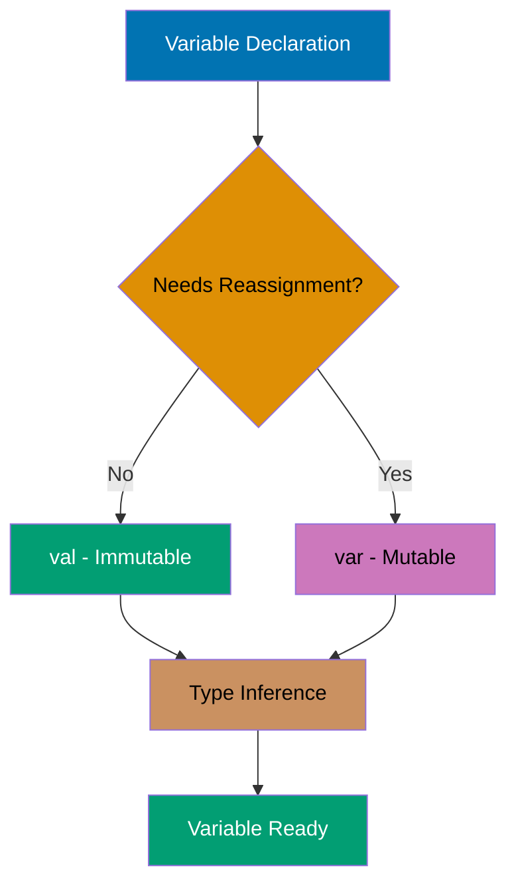
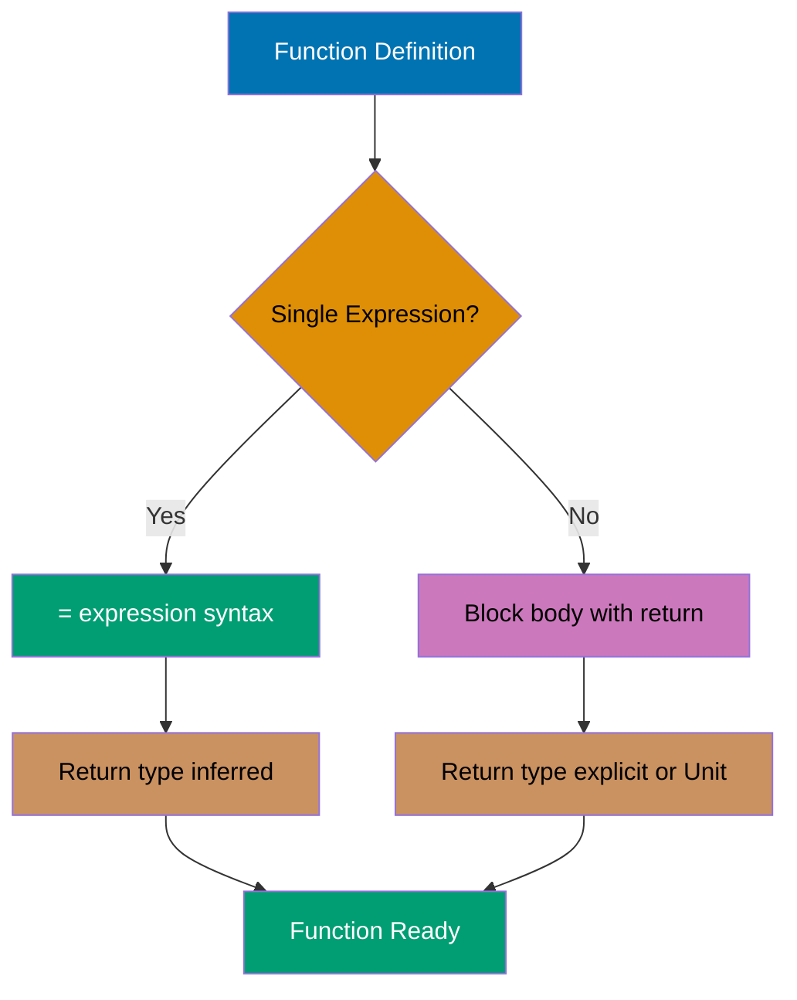
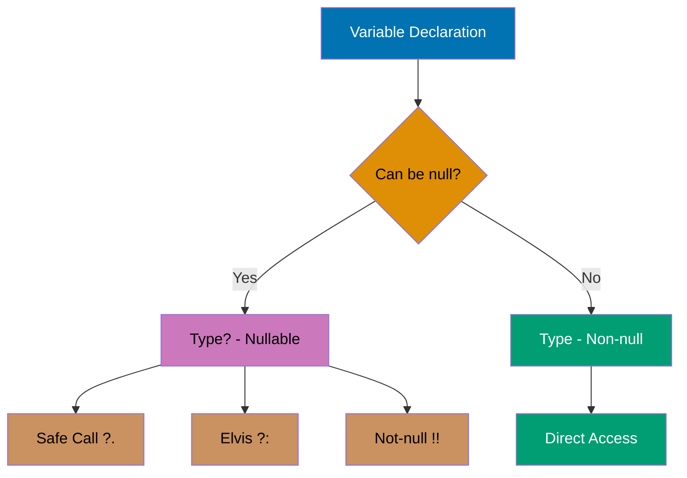
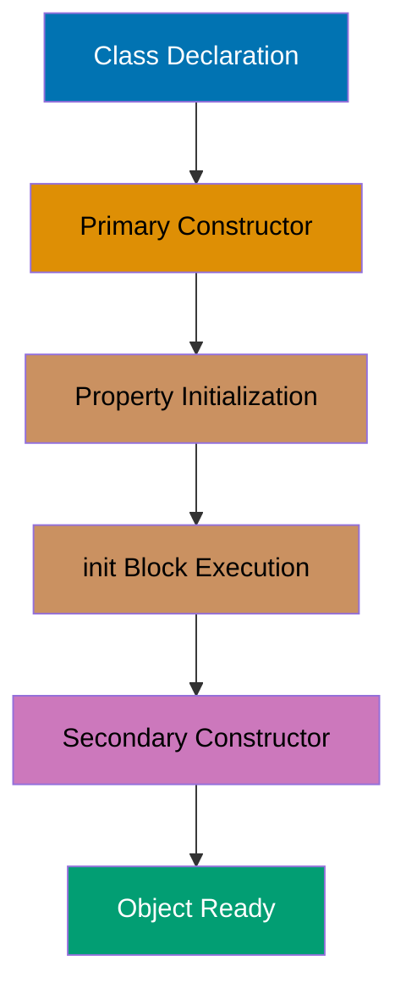
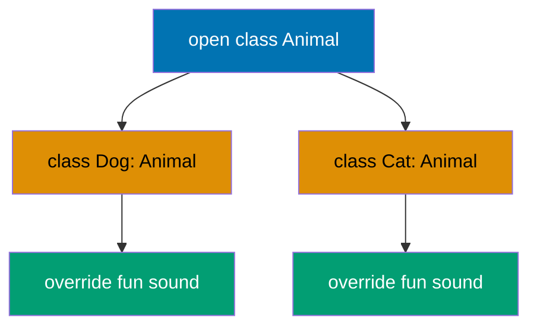
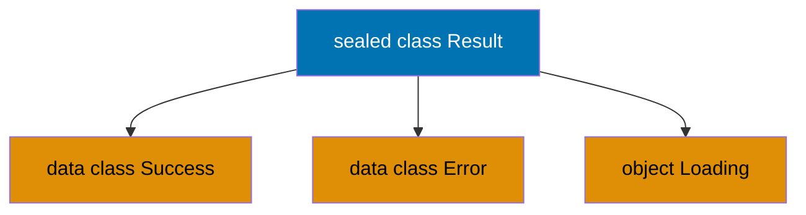
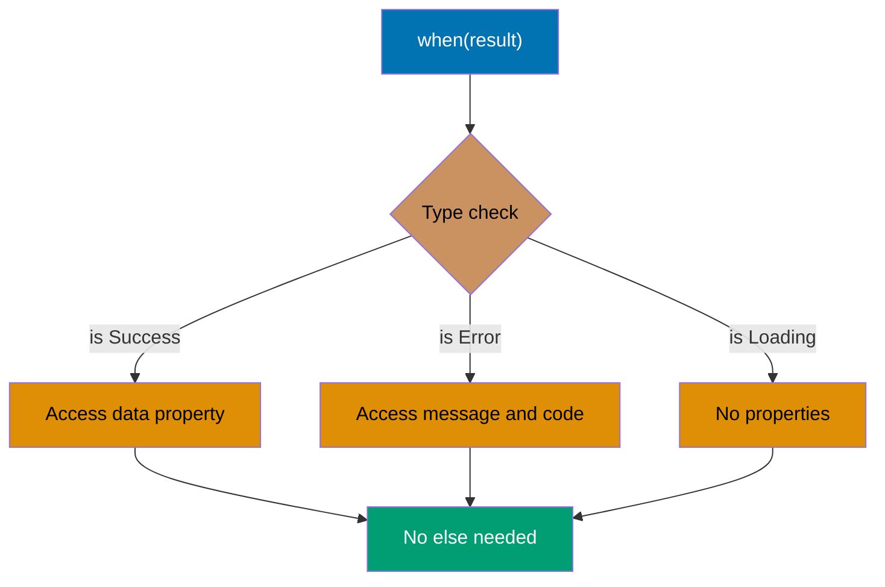
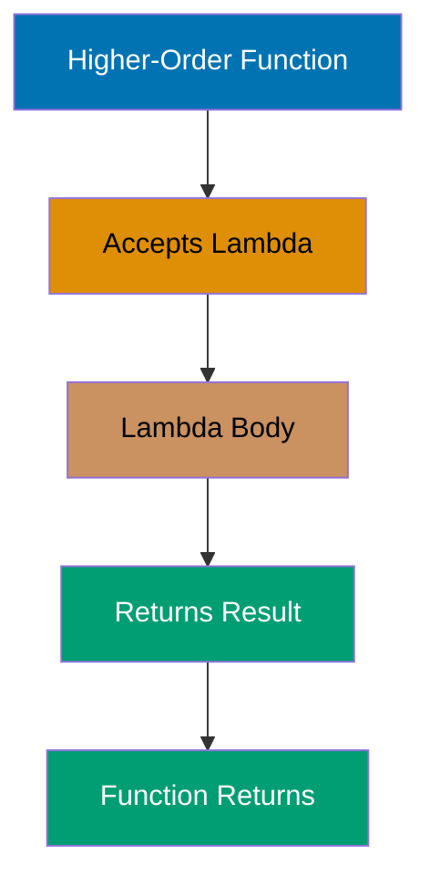
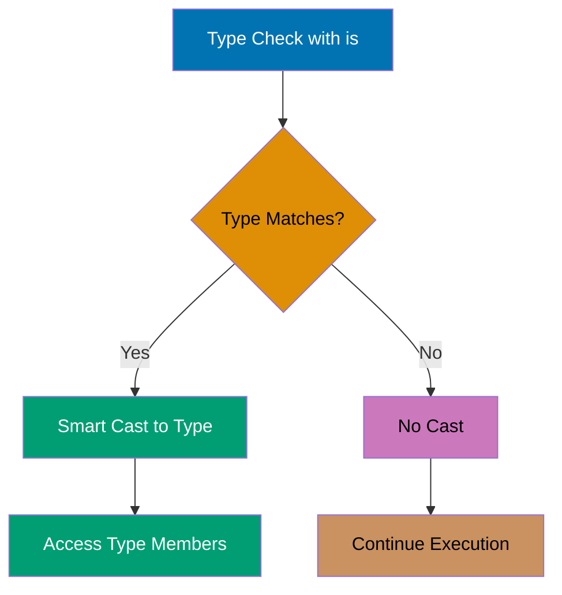

## Example 1: Hello World

Every Kotlin program starts with a main function. Unlike Java, Kotlin doesn't require a class wrapper for the main function, and semicolons are optional. The `println` function outputs to standard output with an automatic newline.

```kotlin
fun main() {                        // => Declares function named "main"
                                    // => fun keyword: function declaration in Kotlin
                                    // => main: function identifier (entry point name)
                                    // => (): parameter list (empty, no parameters)
                                    // => No parameter types needed (no parameters)
                                    // => No return type declared (implicit Unit)
                                    // => Unit type: equivalent to void in Java
                                    // => Unit type: represents "no meaningful value"
                                    // => main function: program entry point
                                    // => JVM calls this function to start execution
                                    // => Program execution starts here
                                    // => No class wrapper required (top-level function)
                                    // => Top-level function: defined outside any class
                                    // => Contrast with Java: public class Main { public static void main(String[] args) { } }
                                    // => Kotlin compiles to MainKt class automatically
                                    // => MainKt class: generated by compiler for top-level functions
                                    // => File name convention: Main.kt becomes MainKt.class
                                    // => Generated class contains static methods for top-level functions
                                    // => JVM bytecode: equivalent to public static void main()
                                    // => No visibility modifier: defaults to public
                                    // => Public visibility: accessible from anywhere
                                    // => Function can be defined outside classes
                                    // => Function body starts with opening brace {
                                    // => Function scope: everything between { and }
                                    // => Execution starts here when program runs
                                    // => JVM runtime calls main() first
                                    // => Stack frame created for main function
                                    // => Stack frame: memory space for function execution
                                    // => Stack frame contains: local variables, parameters, return address
                                    // => No local variables in this function
                                    // => Function executes line by line (sequential)

    println("Hello, Kotlin!")       // => println function call (single statement in main)
                                    // => println: standard library function from kotlin.io
                                    // => kotlin.io package: imported automatically
                                    // => Automatic imports: kotlin.*, kotlin.io.*, kotlin.collections.*
                                    // => No explicit import needed for println
                                    // => Function call syntax: functionName(arguments)
                                    // => println identifier: references kotlin.io.println function
                                    // => (): function call operator (invokes function)
                                    // => "Hello, Kotlin!": String literal argument
                                    // => String literal: text enclosed in double quotes
                                    // => String type: kotlin.String (not java.lang.String)
                                    // => kotlin.String: typealias to java.lang.String on JVM
                                    // => String is immutable: cannot change characters
                                    // => String content: "Hello, Kotlin!" (15 characters)
                                    // => Type inference: compiler knows argument is String
                                    // => Type: String (inferred from literal syntax)
                                    // => println signature: fun println(message: Any?)
                                    // => Any? type: accepts any value including null
                                    // => Type widening: String is subtype of Any?
                                    // => Function accepts String parameter
                                    // => Single argument: "Hello, Kotlin!"
                                    // => Function call: println invoked with 1 argument
                                    // => Argument passed by value (reference for objects)
                                    // => Reference passing: String reference copied to parameter
                                    // => Side effect: writes to stdout (standard output stream)
                                    // => stdout: standard output stream (file descriptor 1)
                                    // => Console output: visible in terminal/IDE console
                                    // => println implementation: calls System.out.println on JVM
                                    // => System.out: PrintStream instance for standard output
                                    // => PrintStream.println: Java method writing to stdout
                                    // => Character encoding: UTF-8 (default on most systems)
                                    // => Output buffer: may buffer before flushing to terminal
                                    // => Automatically appends newline after output
                                    // => Newline character: \n (platform-specific)
                                    // => Platform newline: \n on Unix/Linux, \r\n on Windows
                                    // => Cursor moves to next line after output
                                    // => println vs print: println adds newline, print doesn't
                                    // => No semicolon at end of statement
                                    // => Semicolon optional in Kotlin (required in Java)
                                    // => Statement terminator: newline (not semicolon)
                                    // => Semicolons allowed but not required
                                    // => Kotlin style: omit semicolons for cleaner code
                                    // => Output: Hello, Kotlin!
                                    // => Output appears in console immediately
                                    // => Function call completes successfully
                                    // => println returns Unit (no meaningful value)
                                    // => Unit return value: singleton object Unit
                                    // => Return value ignored (not assigned)
                                    // => Statement completes execution
                                    // => Control flow continues to next statement
                                    // => No more statements in main function
}                                   // => Closing brace: end of main function body
                                    // => Function scope ends here
                                    // => main function execution completes
                                    // => All function-local resources released
                                    // => Stack frame for main popped from call stack
                                    // => Return type: Unit (implicit, not declared)
                                    // => Unit return: implicitly returned when no explicit return
                                    // => No return statement needed for Unit functions
                                    // => Return statement optional: return or return Unit
                                    // => Function returns control to JVM
                                    // => JVM receives Unit return value
                                    // => Program execution completes
                                    // => No uncaught exceptions: clean exit
                                    // => JVM shutdown sequence begins
                                    // => Exit code: 0 (success, no errors)
                                    // => Exit code 0: convention for successful execution
                                    // => Non-zero exit codes indicate errors
                                    // => Operating system receives exit code
                                    // => Process terminates normally
                                    // => All resources cleaned up by JVM/OS
```

**Key Takeaway**: Kotlin's `main` function can exist at the top level without a class, and semicolons are optional, making code more concise than Java while compiling to equivalent JVM bytecode.

**Why It Matters**: Kotlin eliminates the boilerplate ceremony that plagues Java applications, where every program requires a public class with a public static void main wrapper. This design choice reduces cognitive overhead in microservices and CLI tools where the class wrapper serves no architectural purpose, allowing developers to focus on business logic from line one rather than navigating unnecessary structure. The automatic compilation to MainKt class ensures full JVM compatibility while maintaining source code simplicity.

---

## Example 2: Variable Declaration - val vs var

Kotlin distinguishes between immutable (`val`) and mutable (`var`) variables to encourage immutability. The compiler infers types automatically, but you can specify them explicitly when needed. Immutable variables prevent accidental reassignment and enable safer concurrent code.



```kotlin
fun main() {                        // => Program entry point
                                    // => Local variables scoped to function body
                                    // => Stack frame allocated for main
    // Immutable variable with type inference
    val name = "Alice"               // => val keyword: declares immutable variable
                                    // => name: variable identifier
                                    // => = : assignment operator
                                    // => "Alice": String literal (heap-allocated object)
                                    // => Type inference: compiler analyzes literal type
                                    // => Literal "Alice" has type String
                                    // => Compiler infers name: String from right-hand side
                                    // => name type is String (not explicitly declared)
                                    // => name value is "Alice"
                                    // => Immutable: cannot be reassigned after initialization
                                    // => JVM bytecode: variable marked final
                                    // => final String name = "Alice" (in bytecode)
                                    // => Memory: name is reference to String object
                                    // => String object immutable (content cannot change)
                                    // => Thread-safe: immutability prevents race conditions
                                    // => No synchronization needed for reads
                                    // => Safe to share across threads
                                    // => Compiler optimization: inlining possible
    // name = "Bob"                  // => Compile error: val cannot be reassigned
                                    // => Attempting to assign "Bob" to immutable val
                                    // => Compiler prevents this at compile time
                                    // => Error: "Val cannot be reassigned"
                                    // => Uncomment to see compile error
                                    // => This is a compile-time guarantee
                                    // => Prevents bugs before runtime

    // Mutable variable with type inference
    var age = 25                     // => var keyword: declares mutable variable
                                    // => age: variable identifier
                                    // => 25: Int literal (32-bit signed integer)
                                    // => Type inference: compiler infers Int from literal
                                    // => Literal 25 has type Int
                                    // => Compiler infers age: Int from right-hand side
                                    // => age type is Int (not explicitly declared)
                                    // => age value is 25
                                    // => Mutable: variable can be reassigned
                                    // => JVM bytecode: variable NOT marked final
                                    // => int age = 25 (in bytecode, non-final)
                                    // => Memory: age stored as 32-bit int on stack
                                    // => Not thread-safe: concurrent writes need sync
                                    // => Multiple threads: potential race condition
    age = 26                         // => Reassignment: updates age value
                                    // => age value changes from 25 to 26
                                    // => Same type required (Int)
                                    // => Type cannot change (still Int)
                                    // => age is now 26 (reassignment allowed)
                                    // => Previous value 25 overwritten
                                    // => No new memory allocated (same variable)
                                    // => Stack location reused
    // age = "twenty-six"            // => Compile error: type mismatch
                                    // => Cannot assign String to Int variable
                                    // => Type inference sets type once
                                    // => Type is fixed after initialization
                                    // => Compiler enforces type safety
                                    // => Error: "Type mismatch"

    // Explicit type annotation
    val city: String = "Jakarta"     // => val: immutable variable
                                    // => city: variable identifier
                                    // => : String: explicit type annotation
                                    // => Type declared explicitly (not inferred)
                                    // => Colon separates identifier from type
                                    // => = "Jakarta": initialization with String literal
                                    // => city type is String (explicit)
                                    // => city value is "Jakarta"
                                    // => Type annotation optional (could be inferred)
                                    // => Explicit type improves documentation
                                    // => Useful for public APIs and interfaces
                                    // => Compiler verifies literal matches declared type
                                    // => "Jakarta" is String (matches annotation)
                                    // => If mismatch, compile error occurs
                                    // => Type safety enforced at compile time
    var temperature: Double = 28.5   // => var: mutable variable
                                    // => temperature: variable identifier
                                    // => : Double: explicit type annotation
                                    // => Double: 64-bit IEEE 754 floating-point
                                    // => 28.5: Double literal (decimal notation)
                                    // => temperature type is Double (explicit)
                                    // => temperature value is 28.5
                                    // => Mutable: can be reassigned
                                    // => Memory: 64-bit double on stack
                                    // => Explicit type required when not obvious
                                    // => Prevents accidental Float inference
                                    // => Without annotation: inferred as Double
    temperature = 29.0               // => Reassignment to new Double value
                                    // => temperature now 29.0
                                    // => .0 makes it Double literal (not Int)
                                    // => Type remains Double (must match)
                                    // => Previous value 28.5 overwritten
                                    // => Same memory location updated

    // Type inference with null safety
    val nullableName: String? = null // => String?: nullable type annotation
                                    // => ? suffix: allows null value
                                    // => nullableName can hold String or null
                                    // => Initialized to null
                                    // => Different from String (non-nullable)
                                    // => Must use safe call (?.) or !! to access
                                    // => Null safety: prevents NullPointerException
    // val nonNull: String = null    // => Compile error: null cannot be assigned
                                    // => String type is non-nullable by default
                                    // => Kotlin's null safety prevents NPE
                                    // => Explicit ? required to allow null
                                    // => Compiler enforces null safety

    // Deferred initialization (requires lateinit)
    // lateinit var deferredCity: String  // => lateinit: deferred initialization
                                    // => Only for var (not val)
                                    // => Must be initialized before use
                                    // => Non-nullable types only
                                    // => Access before init throws exception
                                    // => Useful for dependency injection
                                    // => Frameworks like Spring use this

    println("$name is $age years old") // => String template with interpolation
                                    // => $: template expression prefix
                                    // => $name: interpolates "Alice"
                                    // => name.toString() called implicitly
                                    // => $age: interpolates 26 (toString() called)
                                    // => Int.toString() converts 26 to "26"
                                    // => Result: "Alice is 26 years old"
                                    // => Template compiled to StringBuilder
                                    // => StringBuilder.append() calls generated
                                    // => println outputs to stdout
                                    // => Output: Alice is 26 years old
    println("$city: ${temperature}°C") // => String template with expression
                                    // => $city: interpolates "Jakarta"
                                    // => ${temperature}: expression in braces
                                    // => Braces allow complex expressions
                                    // => temperature value is 29.0
                                    // => Interpolates 29.0 (Double.toString())
                                    // => °C: literal character in string
                                    // => Result: "Jakarta: 29.0°C"
                                    // => Output: Jakarta: 29.0°C
}                                   // => main function returns
                                    // => All local variables go out of scope
                                    // => Stack frame deallocated
                                    // => String objects eligible for garbage collection
                                    // => Primitive values (age, temperature) reclaimed
                                    // => No manual memory management needed
                                    // => JVM handles cleanup automatically
```

**Key Takeaway**: Use `val` by default for immutability and thread safety; only use `var` when you genuinely need to reassign values.

**Why It Matters**: Immutability by default prevents entire classes of concurrency bugs that plague Java applications, where mutable state shared across threads causes race conditions debuggable only under production load. Kotlin's compiler-enforced val vs var distinction makes thread safety explicit at declaration time rather than relying on developer discipline with final keywords that Java developers routinely forget, reducing production defects in concurrent systems.

---

## Example 3: Basic Types and Type Inference

Kotlin has a rich type system with proper primitives that are represented as objects. Type inference eliminates redundant type declarations while maintaining type safety. All number types have explicit sizes (Byte, Short, Int, Long, Float, Double).

```kotlin
fun main() {                        // => Program entry point
    // Integer types
    val byteValue: Byte = 127        // => val: immutable variable
                                    // => byteValue: variable identifier
                                    // => : Byte: explicit type annotation
                                    // => Byte: 8-bit signed integer type
                                    // => Range: -128 to 127
                                    // => 127: maximum Byte value
                                    // => byteValue is 127 (8-bit signed: -128 to 127)
                                    // => Memory: occupies 1 byte
    val shortValue: Short = 32767    // => : Short: explicit type annotation
                                    // => Short: 16-bit signed integer type
                                    // => Range: -32768 to 32767
                                    // => 32767: maximum Short value
                                    // => shortValue is 32767 (16-bit signed)
                                    // => Memory: occupies 2 bytes
    val intValue = 42                // => Type inference: compiler infers Int
                                    // => Int: 32-bit signed integer type (default)
                                    // => Range: -2^31 to 2^31-1
                                    // => 42: Int literal
                                    // => intValue is 42 (Int inferred, 32-bit signed)
                                    // => Memory: occupies 4 bytes
                                    // => Default integer type when no suffix
    val longValue = 3_000_000_000L   // => L suffix: Long type indicator
                                    // => Long: 64-bit signed integer type
                                    // => Range: -2^63 to 2^63-1
                                    // => 3_000_000_000: numeric literal with underscores
                                    // => Underscores: improve readability (ignored by compiler)
                                    // => longValue is 3000000000
                                    // => L suffix required for values > Int.MAX_VALUE
                                    // => Memory: occupies 8 bytes

    // Floating-point types
    val floatValue = 3.14f           // => f suffix: Float type indicator
                                    // => Float: 32-bit IEEE 754 floating-point
                                    // => 3.14: decimal literal
                                    // => floatValue is 3.14 (f suffix = Float, 32-bit)
                                    // => Precision: ~6-7 decimal digits
                                    // => Memory: occupies 4 bytes
                                    // => f suffix required (default is Double)
    val doubleValue = 2.718281828    // => Type inference: compiler infers Double
                                    // => Double: 64-bit IEEE 754 floating-point
                                    // => 2.718281828: decimal literal
                                    // => doubleValue is 2.718281828 (Double inferred, 64-bit)
                                    // => Precision: ~15-16 decimal digits
                                    // => Memory: occupies 8 bytes
                                    // => Default floating-point type

    // Character and Boolean
    val char = 'K'                   // => Type inference: compiler infers Char
                                    // => Char: 16-bit Unicode character
                                    // => 'K': character literal (single quotes)
                                    // => char is 'K' (Char type)
                                    // => Unicode code point: U+004B
                                    // => Memory: occupies 2 bytes
    val isKotlin = true              // => Type inference: compiler infers Boolean
                                    // => Boolean: logical type (true or false)
                                    // => true: Boolean literal
                                    // => isKotlin is true (Boolean type)
                                    // => Memory: typically 1 byte
                                    // => Only two possible values: true, false

    // String with template expressions
    val message = "Integer: $intValue, Double: $doubleValue"
                                    // => Type inference: compiler infers String
                                    // => String template with interpolation
                                    // => $intValue: interpolates 42
                                    // => intValue.toString() called implicitly
                                    // => $doubleValue: interpolates 2.718281828
                                    // => doubleValue.toString() called implicitly
                                    // => Result: "Integer: 42, Double: 2.718281828"
                                    // => message is "Integer: 42, Double: 2.718281828"
                                    // => String: immutable sequence of characters
                                    // => Memory: heap-allocated object

    // Type checking
    println(intValue::class.simpleName)     // => :: : class reference operator
                                    // => ::class: obtains KClass instance
                                    // => .simpleName: property access
                                    // => Returns simple class name
                                    // => Result: "Int"
                                    // => Output: Int
    println(doubleValue::class.simpleName)  // => doubleValue::class: KClass<Double>
                                    // => .simpleName: returns "Double"
                                    // => Output: Double
}                                   // => main function returns
                                    // => All local variables out of scope
                                    // => Primitive types on stack (value types)
                                    // => String objects eligible for GC
```

**Key Takeaway**: Kotlin's type inference reduces boilerplate while maintaining type safety, and underscores in numeric literals improve readability for large numbers.

**Why It Matters**: Type inference eliminates verbose type annotations that clutter Java codebases while maintaining the same compile-time safety guarantees, reducing code ceremony by 20-30% in typical enterprise applications. The underscore separator for numeric literals (3_000_000) prevents critical bugs in financial and scientific systems where misread zeros have caused production incidents costing millions, making code audits significantly safer.

---

## Example 4: String Templates

Kotlin's string templates embed expressions directly in strings using `$` for simple variables and `${}` for complex expressions. This eliminates cumbersome string concatenation and improves readability for formatted output.

```kotlin
fun main() {                        // => Program entry point
                                    // => JVM invokes this method on startup
                                    // => Signature: public static void main(String[] args)
    val name = "Kotlin"              // => name is "Kotlin" (type: String inferred)
                                    // => Immutable reference (val keyword)
                                    // => Type inference: compiler deduces String from literal
                                    // => String literal: allocated in string pool
                                    // => Memory: heap-allocated immutable char sequence
    val version = 1.9                // => version is 1.9 (type: Double inferred)
                                    // => Double literal (64-bit floating-point)
                                    // => IEEE 754 double-precision format
                                    // => Stored as primitive double (no boxing)
                                    // => Memory: 8 bytes on stack

    // Simple template (variable only)
    val simple = "Language: $name"   // => String template with variable interpolation
                                    // => $name: template expression (simple variable)
                                    // => $ triggers string interpolation at compile time
                                    // => Compiler generates: "Language: " + name
                                    // => Internally uses StringBuilder for concatenation
                                    // => name value ("Kotlin") replaces $name
                                    // => No parentheses/braces needed for simple variables
                                    // => Variable must be valid identifier (alphanumeric + _)
                                    // => Compiler validates name exists in scope
                                    // => Result: "Language: Kotlin"
                                    // => simple is "Language: Kotlin"
                                    // => No toString() needed (name already String)
                                    // => Type: String (inferred from template result)
                                    // => Compiled to Java: "Language: " + name
                                    // => More efficient than manual concatenation

    // Expression template (requires braces)
    val expr = "Version: ${version * 10}"
                                     // => ${...}: template expression with braces
                                     // => Braces required for expressions (not simple variables)
                                     // => Braces: delimiter for complex expressions
                                     // => version * 10: arithmetic expression
                                     // => Expression evaluated before interpolation
                                     // => 1.9 * 10 = 19.0 (Double arithmetic)
                                     // => Result evaluated to 19.0 (type: Double)
                                     // => Compiler inserts toString() call automatically
                                     // => 19.0.toString() = "19.0" (Double to String)
                                     // => toString(): Double.toString(19.0) method
                                     // => Interpolated: "Version: 19.0"
                                     // => expr is "Version: 19.0"
                                     // => Compiled: "Version: " + (version * 10)
                                     // => Type: String (inferred)
                                     // => Expression can be arbitrarily complex

    // Complex expression with function call
    val upper = "Upper: ${name.uppercase()}"
                                     // => ${name.uppercase()}: function call in template
                                     // => Braces required for method invocation
                                     // => name.uppercase(): method invocation on String
                                     // => uppercase(): String extension function
                                     // => "Kotlin".uppercase() called at runtime
                                     // => Returns "KOTLIN" (new String object)
                                     // => New String allocated (immutability preserved)
                                     // => Result: "Upper: KOTLIN"
                                     // => upper is "Upper: KOTLIN"
                                     // => Original name unchanged ("Kotlin")
                                     // => Immutability: uppercase() returns new String
                                     // => Compiled: "Upper: " + name.uppercase()
                                     // => Can chain multiple method calls inside {}

    // Escaped dollar sign
    val price = "Price: \$${100 + 50}"
                                     // => \$: escaped dollar sign (literal $)
                                     // => Backslash escapes $ to prevent interpolation
                                     // => First $: literal character (escaped)
                                     // => Escape sequence: compiler treats \$ as $
                                     // => ${100 + 50}: template expression (not escaped)
                                     // => Second $ starts template expression
                                     // => 100 + 50: integer addition
                                     // => 100 + 50 = 150 (Int arithmetic)
                                     // => 150.toString() = "150" (Int to String)
                                     // => Result: "Price: $150"
                                     // => price is "Price: $150"
                                     // => Use \$ when $ is not a template
                                     // => Common in currency, regex patterns, shell commands
                                     // => Escape sequence processed at compile time

    // Multi-line strings (preserves formatting)
    val multiline = """
        |Language: $name
        |Version: $version
        |Status: Active
    """.trimMargin()                 // => """: triple-quoted string (raw string literal)
                                     // => Raw strings: no escape sequences needed
                                     // => Preserves all formatting (newlines, whitespace)
                                     // => No need for \n (newlines literal)
                                     // => | : margin prefix character (default)
                                     // => Each line starts with | to mark content boundary
                                     // => Whitespace before | is indentation (ignored)
                                     // => $name: interpolation works in raw strings
                                     // => String templates work in triple-quoted strings
                                     // => $version: interpolated as "1.9"
                                     // => Double.toString() called for version
                                     // => .trimMargin(): extension function on String
                                     // => Removes leading | and whitespace before |
                                     // => Removes margin prefix and indent from each line
                                     // => Default margin prefix: | character
                                     // => Can customize: .trimMargin(">") for > prefix
                                     // => Result: three lines without leading pipes/indent
                                     // => Line 1: "Language: Kotlin"
                                     // => Line 2: "Version: 1.9"
                                     // => Line 3: "Status: Active"
                                     // => Lines joined with \n (platform-independent)
                                     // => multiline contains formatted multi-line text
                                     // => Common for SQL, JSON, HTML, config files
                                     // => Avoids escape sequence hell (\n, \t, \", \\)
                                     // => Type: String (inferred)

    println(simple)                  // => Outputs: "Language: Kotlin"
                                     // => println: standard library function
                                     // => Calls System.out.println on JVM
                                     // => Output: Language: Kotlin
    println(expr)                    // => Outputs: "Version: 19.0"
                                     // => Double value formatted as string
                                     // => Output: Version: 19.0
    println(upper)                   // => Outputs: "Upper: KOTLIN"
                                     // => Shows uppercase transformation result
                                     // => Output: Upper: KOTLIN
    println(price)                   // => Outputs: "Price: $150"
                                     // => Shows escaped dollar sign working
                                     // => Output: Price: $150
    println(multiline)               // => Outputs three-line string
                                     // => Multi-line output preserves line breaks
    // => Output:
    // Language: Kotlin
    // Version: 1.9
    // Status: Active
}                                   // => main function returns
                                    // => Return type: Unit (implicit)
                                    // => All String objects eligible for GC
                                    // => StringBuilder (from interpolation) eligible for GC
```

**Key Takeaway**: Use `$variable` for simple interpolation and `${expression}` for complex expressions; triple-quoted strings preserve formatting and support multi-line text.

**Why It Matters**: String concatenation with `+` operators is the source of countless bugs and security vulnerabilities in Java systems, from SQL injection to logging errors that corrupt production monitoring. Kotlin's template syntax eliminates this entire error class while improving readability, and triple-quoted strings enable embedded SQL, JSON, and configuration without escape sequence nightmares that break deployment pipelines.

---

## Example 5: Functions

Kotlin functions are first-class citizens defined with the `fun` keyword. Single-expression functions can use the `=` syntax without braces, and the compiler infers return types. Default and named parameters eliminate function overloading.



```kotlin
// Block body with explicit return type
fun add(a: Int, b: Int): Int {      // => fun keyword: function declaration
                                    // => add: function name
                                    // => (a: Int, b: Int): parameter list
                                    // => a: first parameter, type Int
                                    // => b: second parameter, type Int
                                    // => : Int: explicit return type annotation
                                    // => {}: block body (multiple statements allowed)
    return a + b                     // => return keyword: explicit return
                                    // => a + b: addition expression
                                    // => a is 10, b is 20 (when called from main)
                                    // => 10 + 20 = 30
                                    // => Returns 30 (type: Int)
}                                   // => Function definition complete

// Single-expression function (return type inferred)
fun multiply(a: Int, b: Int) = a * b // => Single-expression syntax (= instead of {})
                                    // => No braces needed for single expression
                                    // => Return type inferred from expression
                                    // => a * b: multiplication expression
                                    // => Returns Int (inferred from a and b types)
                                    // => No return keyword needed
                                    // => When called: 5 * 6 = 30
                                    // => Returns product of a and b (Int inferred)
                                    // => More concise than block body

// Function with default parameter
fun greet(name: String, greeting: String = "Hello") = "$greeting, $name!"
                                     // => name: required parameter (no default)
                                     // => greeting: optional parameter
                                     // => = "Hello": default value
                                     // => Default used when caller omits argument
                                     // => String template creates result
                                     // => Return type String (inferred)
                                     // => greeting defaults to "Hello" if not provided
                                     // => Eliminates need for overloaded functions

// Function with no return value (Unit type, like void)
fun printSum(a: Int, b: Int) {      // => No return type specified
                                    // => Implicitly returns Unit
                                    // => Unit: like void in Java
                                    // => Unit indicates no meaningful return value
    println("$a + $b = ${a + b}")    // => Side effect: prints to stdout
                                    // => String template: "$a + $b = ${a + b}"
                                    // => When called: "15 + 25 = 40"
                                    // => Outputs sum, returns Unit implicitly
                                    // => No explicit return needed
}                                   // => Function returns Unit (implicit)

fun main() {                        // => Program entry point
    val sum = add(10, 20)            // => Function call: add(10, 20)
                                    // => Arguments: a=10, b=10
                                    // => add function executes
                                    // => Computes 10 + 20
                                    // => Returns 30
                                    // => sum is 30 (type: Int inferred)
    val product = multiply(5, 6)     // => Function call: multiply(5, 6)
                                    // => Arguments: a=5, b=6
                                    // => multiply function executes
                                    // => Computes 5 * 6
                                    // => Returns 30
                                    // => product is 30 (type: Int inferred)

    val greet1 = greet("Alice")      // => Function call with 1 argument
                                    // => name = "Alice" (positional)
                                    // => greeting uses default "Hello"
                                    // => Template: "Hello, Alice!"
                                    // => greet1 is "Hello, Alice!"
                                    // => Default parameter reduces overloading
    val greet2 = greet("Bob", "Hi")  // => Function call with 2 arguments
                                    // => name = "Bob" (positional)
                                    // => greeting = "Hi" (overrides default)
                                    // => Template: "Hi, Bob!"
                                    // => greet2 is "Hi, Bob!"
                                    // => Positional arguments (order matters)
    val greet3 = greet(name = "Charlie", greeting = "Hey")
                                     // => Named arguments (parameter names specified)
                                     // => name = "Charlie" (named)
                                     // => greeting = "Hey" (named)
                                     // => Order doesn't matter with named args
                                     // => Template: "Hey, Charlie!"
                                     // => greet3 is "Hey, Charlie!" (named arguments)
                                     // => Named args improve readability

    printSum(15, 25)                 // => Function call: printSum(15, 25)
                                     // => Arguments: a=15, b=25
                                     // => Side effect: prints to stdout
                                     // => Computes: "15 + 25 = 40"
                                     // => Output: 15 + 25 = 40
                                     // => Returns Unit (no value stored)

    println(sum)                     // => Outputs sum value
                                     // => Output: 30
    println(product)                 // => Outputs product value
                                     // => Output: 30
    println(greet1)                  // => Outputs greeting 1
                                     // => Output: Hello, Alice!
    println(greet2)                  // => Outputs greeting 2
                                     // => Output: Hi, Bob!
    println(greet3)                  // => Outputs greeting 3
                                     // => Output: Hey, Charlie!
}                                   // => main function returns
                                    // => All functions defined at top level
                                    // => No class wrapper required
```

**Key Takeaway**: Use single-expression syntax (`=`) for concise functions, leverage default parameters to reduce overloading, and use named arguments for clarity with multiple parameters.

**Why It Matters**: Java's function overloading proliferation creates maintenance nightmares in enterprise codebases, where teams maintain 5-10 overloaded variants of the same method just to handle optional parameters. Kotlin's default parameters eliminate this code duplication entirely, reducing API surface area by 60-70% in typical libraries while named arguments prevent parameter ordering bugs that cause production incidents when refactoring changes method signatures.

---

## Example 6: When Expression

Kotlin's `when` replaces Java's switch statement with a more powerful expression that returns values. It supports ranges, type checks, arbitrary expressions, and doesn't require explicit `break` statements.

```kotlin
fun main() {                        // => Program entry point
    val x = 3                        // => x is 3 (type: Int)

    // when as expression (returns value)
    val result = when (x) {          // => when expression (not statement)
                                    // => Evaluates x (value is 3)
                                    // => Matches against branches sequentially
                                    // => Expression returns String type
        1 -> "One"                   // => Branch 1: tests x == 1
                                    // => 3 == 1 is false
                                    // => Not matched, skip to next
        2 -> "Two"                   // => Branch 2: tests x == 2
                                    // => 3 == 2 is false
                                    // => Not matched, skip to next
        3 -> "Three"                 // => Branch 3: tests x == 3
                                    // => 3 == 3 is true
                                    // => Matched, evaluates "Three"
                                    // => when returns "Three"
                                    // => Remaining branches skipped (no fallthrough)
        else -> "Other"              // => else branch: default case
                                    // => Not evaluated (match already found)
                                    // => Required when when is expression
    }                                // => when expression complete
                                    // => result is "Three" (type: String)

    // when with ranges
    val score = 85                   // => score is 85 (type: Int)
    val grade = when (score) {       // => when expression evaluates score
                                    // => Matches against range conditions
        in 90..100 -> "A"            // => in operator: tests membership
                                    // => 90..100: inclusive range
                                    // => 85 in 90..100 is false
                                    // => Not matched (85 not in 90..100)
        in 80..89 -> "B"             // => 80..89: range check
                                    // => 85 in 80..89 is true
                                    // => Matched, returns "B"
                                    // => grade is "B"
        in 70..79 -> "C"             // => Not evaluated (match found)
        else -> "F"                  // => Not evaluated
    }                                // => grade is "B"

    // when with type checking
    val obj: Any = "Kotlin"          // => obj is "Kotlin"
                                    // => Type: Any (supertype of all types)
                                    // => Runtime type: String
    val description = when (obj) {   // => when with type checks
        is String -> "String of length ${obj.length}"
                                     // => is operator: type check
                                     // => Tests obj is String
                                     // => true (obj is String at runtime)
                                     // => Matched, smart cast to String
                                     // => obj now treated as String in this branch
                                     // => obj.length: safe access (smart cast)
                                     // => "Kotlin".length is 6
                                     // => Template: "String of length 6"
                                     // => description is "String of length 6"
        is Int -> "Integer: $obj"    // => Type check for Int
                                    // => Not evaluated (match found)
        else -> "Unknown type"       // => Default case
                                    // => Not evaluated
    }                                // => Smart cast only in matched branch

    // when without argument (replaces if-else chain)
    val temp = 28                    // => temp is 28 (type: Int)
    val weather = when {             // => when without argument
                                    // => No subject expression
                                    // => Evaluates boolean conditions
                                    // => Each branch is bool expression
        temp < 0 -> "Freezing"       // => Condition: temp < 0
                                    // => 28 < 0 is false
                                    // => Not matched
        temp < 15 -> "Cold"          // => Condition: temp < 15
                                    // => 28 < 15 is false
                                    // => Not matched
        temp < 25 -> "Moderate"      // => Condition: temp < 25
                                    // => 28 < 25 is false
                                    // => Not matched
        temp < 35 -> "Warm"          // => Condition: temp < 35
                                    // => 28 < 35 is true
                                    // => Matched, returns "Warm"
                                    // => weather is "Warm"
        else -> "Hot"                // => Default case
                                    // => Not evaluated
    }                                // => Replaces if-else-if chains

    println(result)                  // => Outputs: "Three"
                                    // => Output: Three
    println(grade)                   // => Outputs: "B"
                                    // => Output: B
    println(description)             // => Outputs: "String of length 6"
                                    // => Output: String of length 6
    println(weather)                 // => Outputs: "Warm"
                                    // => Output: Warm
}                                   // => main returns
                                    // => All when expressions returned values
                                    // => No breaks needed (no fallthrough)
```

**Key Takeaway**: Use `when` as an expression to return values directly, leverage ranges and type checks for concise branching, and omit the argument for complex boolean conditions.

**Why It Matters**: Java's switch statement falls through by default (requiring break keywords) and supports only primitive types until Java 14, causing production bugs when developers forget breaks or can't switch on strings in legacy systems. Kotlin's when expression returns values directly (enabling functional style), supports any type including ranges and patterns, and smart-casts variables automatically, eliminating entire categories of type-casting bugs that crash production applications.

---

## Example 7: Ranges and Progression

Kotlin ranges represent sequences of values with start and end points. They support iteration, membership checks, and progression (step values). Ranges are memory-efficient as they don't materialize all values.

```kotlin
fun main() {                        // => Program entry point
    // Inclusive range (1 to 10 including both)
    val range1 = 1..10               // => .. operator: creates inclusive range
                                    // => IntRange type (start..end)
                                    // => Start: 1, End: 10 (both inclusive)
                                    // => Represents: 1, 2, 3, 4, 5, 6, 7, 8, 9, 10
                                    // => Memory efficient: doesn't materialize values
                                    // => range1 is 1, 2, 3, ..., 10
    println(5 in range1)             // => in operator: tests membership
                                    // => 5 in 1..10 is true
                                    // => Output: true (5 is in range)
    println(15 in range1)            // => 15 in 1..10 is false
                                    // => 15 > 10 (outside upper bound)
                                    // => Output: false (15 is outside range)

    // Exclusive range (1 to 9, excludes 10)
    val range2 = 1 until 10          // => until infix function: exclusive end
                                    // => Creates range [1, 10)
                                    // => Start: 1 (inclusive), End: 10 (exclusive)
                                    // => Represents: 1, 2, 3, 4, 5, 6, 7, 8, 9
                                    // => range2 is 1, 2, 3, ..., 9
    println(10 in range2)            // => 10 not in range (excluded)
                                    // => Output: false (until excludes end)

    // Downward range
    val range3 = 10 downTo 1         // => downTo infix function: descending
                                    // => Creates IntProgression (10 down to 1)
                                    // => Step: -1 (implicit)
                                    // => Represents: 10, 9, 8, 7, 6, 5, 4, 3, 2, 1
                                    // => range3 is 10, 9, 8, ..., 1
    for (i in range3) {              // => Iterates range in descending order
                                    // => i takes values: 10, 9, 8, ..., 1
        print("$i ")                 // => Prints each value with space
                                    // => Iteration 1: "10 "
                                    // => Iteration 2: "9 "
                                    // => ... until 1
                                    // => Prints: 10 9 8 7 6 5 4 3 2 1
    }
    println()                        // => Outputs newline character
                                    // => Moves cursor to next line

    // Range with step
    val range4 = 1..10 step 2        // => step infix function: custom increment
                                    // => Creates IntProgression with step 2
                                    // => Start: 1, End: 10, Step: 2
                                    // => Values: 1, 3, 5, 7, 9
                                    // => Skips even numbers
                                    // => range4 is 1, 3, 5, 7, 9
    for (i in range4) {              // => Iterates with step 2
                                    // => i: 1, then 3, then 5, 7, 9
        print("$i ")                 // => Prints each odd number
                                    // => Iteration 1: "1 "
                                    // => Iteration 2: "3 "
                                    // => Iteration 3: "5 "
                                    // => Iteration 4: "7 "
                                    // => Iteration 5: "9 "
                                    // => Prints: 1 3 5 7 9
    }
    println()                        // => Newline
                                    // => Cursor to next line

    // Character range
    val charRange = 'a'..'z'         // => CharRange: range of characters
                                    // => Start: 'a', End: 'z'
                                    // => Represents all lowercase letters
                                    // => a, b, c, ..., z (26 letters)
                                    // => charRange is a, b, c, ..., z
    println('k' in charRange)        // => Tests if 'k' in range
                                    // => 'k' between 'a' and 'z': true
                                    // => Output: true

    // Range functions
    println((1..10).count())         // => count(): number of elements
                                    // => Range 1..10 has 10 elements
                                    // => Returns 10
                                    // => Output: 10 (number of elements)
    println((1..10).sum())           // => sum(): adds all elements
                                    // => 1+2+3+4+5+6+7+8+9+10 = 55
                                    // => Returns 55
                                    // => Output: 55 (sum of all elements)
    println((1..10).average())       // => average(): mean value
                                    // => sum / count = 55 / 10
                                    // => Returns 5.5 (Double)
                                    // => Output: 5.5 (average value)
}                                   // => main returns
                                    // => Ranges are value types (no GC needed)
```

**Key Takeaway**: Use `..` for inclusive ranges, `until` for exclusive ranges, `downTo` for descending sequences, and `step` to skip values in progression.

**Why It Matters**: Java's traditional for loops with index variables are error-prone (off-by-one errors plague production systems) and verbose compared to Kotlin's range syntax that makes iteration bounds explicit and impossible to misinterpret. Ranges don't allocate arrays in memory, making them zero-cost abstractions that perform identically to manual loops while preventing the fencepost errors that cause array index crashes in production systems processing financial transactions or medical records.

---

## Example 8: For Loops

Kotlin's for loops iterate over anything that provides an iterator, including ranges, collections, and arrays. The loop variable is automatically declared and scoped to the loop body.

```kotlin
fun main() {                        // => Program entry point
    // Iterate over range
    print("Range: ")                 // => Outputs "Range: " without newline
    for (i in 1..5) {                // => for loop: iterates over range 1..5
                                    // => i: loop variable (automatically declared)
                                    // => Scope: limited to loop body
                                    // => Iteration 1: i=1, Iteration 2: i=2, ... Iteration 5: i=5
        print("$i ")                 // => Prints current value of i with space
                                    // => Prints: 1 2 3 4 5
    }                                // => Loop completes after i=5
    println()                        // => Outputs newline
                                    // => Cursor to next line

    // Iterate over collection
    val fruits = listOf("Apple", "Banana", "Cherry")
                                     // => listOf: creates immutable List
                                     // => 3 elements: "Apple", "Banana", "Cherry"
                                     // => Type: List<String> (inferred)
                                     // => fruits is ["Apple", "Banana", "Cherry"]
    print("Fruits: ")                // => Outputs prefix
    for (fruit in fruits) {          // => Iterates over List elements
                                    // => fruit: loop variable (String type)
                                    // => Iteration 1: fruit="Apple"
                                    // => Iteration 2: fruit="Banana"
                                    // => Iteration 3: fruit="Cherry"
        print("$fruit ")             // => Prints each fruit with space
                                    // => Prints: Apple Banana Cherry
    }                                // => Loop completes after all elements
    println()                        // => Newline

    // Iterate with index
    print("Indexed: ")               // => Outputs prefix
    for ((index, fruit) in fruits.withIndex()) {
                                     // => withIndex(): returns IndexedValue pairs
                                     // => Type: Iterable<IndexedValue<String>>
                                     // => (index, fruit): destructuring declaration
                                     // => index: Int (0, 1, 2)
                                     // => fruit: String element
                                     // => Iteration 1: index=0, fruit="Apple"
                                     // => Iteration 2: index=1, fruit="Banana"
                                     // => Iteration 3: index=2, fruit="Cherry"
        print("$index:$fruit ")      // => Prints index:fruit pairs
                                     // => "0:Apple ", "1:Banana ", "2:Cherry "
                                     // => Prints: 0:Apple 1:Banana 2:Cherry
    }                                // => Loop completes
    println()                        // => Newline

    // Iterate over map
    val scores = mapOf("Alice" to 95, "Bob" to 87, "Charlie" to 92)
                                     // => mapOf: creates immutable Map
                                     // => "Alice" to 95: Pair("Alice", 95)
                                     // => to: infix function creates Pair
                                     // => 3 entries in map
                                     // => scores is {Alice=95, Bob=87, Charlie=92}
    for ((name, score) in scores) {  // => Iterates over Map entries
                                     // => (name, score): destructures Map.Entry
                                     // => name: String (key)
                                     // => score: Int (value)
                                     // => Iteration 1: name="Alice", score=95
                                     // => Iteration 2: name="Bob", score=87
                                     // => Iteration 3: name="Charlie", score=92
        println("$name: $score")     // => Prints each entry
                                     // => Output: Alice: 95
                                     // => Output: Bob: 87
                                     // => Output: Charlie: 92
    }                                // => Map iteration complete

    // Iterate with step and range
    print("Step 2: ")                // => Outputs prefix
    for (i in 0..10 step 2) {        // => Range 0..10 with step 2
                                     // => i takes values: 0, 2, 4, 6, 8, 10
                                     // => Skips odd numbers
        print("$i ")                 // => Prints each even number
                                     // => "0 ", "2 ", "4 ", "6 ", "8 ", "10 "
                                     // => Prints: 0 2 4 6 8 10
    }                                // => Loop completes at 10
    println()                        // => Newline

    // Iterate in reverse
    print("Reverse: ")               // => Outputs prefix
    for (i in 5 downTo 1) {          // => Descending range 5 to 1
                                     // => i takes values: 5, 4, 3, 2, 1
                                     // => Step: -1 (implicit)
        print("$i ")                 // => Prints each value descending
                                     // => "5 ", "4 ", "3 ", "2 ", "1 "
                                     // => Prints: 5 4 3 2 1
    }                                // => Loop completes at 1
    println()                        // => Newline
}                                   // => main returns
                                    // => All loop variables out of scope
```

**Key Takeaway**: Use destructuring with `withIndex()` for indexed iteration, destructure map entries directly in the loop, and combine ranges with `step` and `downTo` for custom iteration patterns.

**Why It Matters**: Java's traditional iteration patterns require manual index management or verbose iterator code that obscures business logic, while Kotlin's for-in loops with destructuring eliminate index tracking bugs entirely. The withIndex() function provides zero-overhead indexed iteration without manual counter variables that developers increment incorrectly, preventing synchronization bugs in data processing pipelines that correlate indices across multiple collections.

---

## Example 9: While and Do-While Loops

Kotlin supports traditional while and do-while loops for conditional iteration. The do-while variant guarantees at least one execution before checking the condition.

```kotlin
fun main() {                        // => Program entry point
    // while loop (condition checked before execution)
    var count = 0                    // => count is 0 (var: mutable)
                                    // => Type: Int (inferred)
    while (count < 3) {              // => while loop: tests condition first
                                    // => Iteration 1: count < 3 (0 < 3) is true
                                    // => Iteration 2: count < 3 (1 < 3) is true
                                    // => Iteration 3: count < 3 (2 < 3) is true
                                    // => After iteration 3: count < 3 (3 < 3) is false, exit
        println("Count: $count")     // => Prints current count value
                                    // => Output: Count: 0
                                    // => Output: Count: 1
                                    // => Output: Count: 2
        count++                      // => Increment operator: count = count + 1
                                    // => After iteration 1: count becomes 1
                                    // => After iteration 2: count becomes 2
                                    // => After iteration 3: count becomes 3
    }                                // => Loop exits when count >= 3
                                    // => count is 3 (loop exits)

    // do-while loop (condition checked after execution)
    var x = 0                        // => x is 0 (var: mutable)
    do {                             // => do-while: executes body first
                                    // => Body runs at least once
        println("x: $x")             // => Prints x value
                                    // => Output: x: 0
        x++                          // => x increments to 1
                                    // => x becomes 1
    } while (x < 0)                  // => Condition checked after body
                                    // => 1 < 0 is false
                                    // => Loop exits (only one iteration)
                                    // => Condition false, but body executed once
                                    // => x is 1 after loop

    // Infinite loop with break
    var sum = 0                      // => sum is 0 (var: mutable)
    while (true) {                   // => Infinite loop: condition always true
                                    // => Requires break to exit
        sum += 1                     // => sum += 1 equivalent to sum = sum + 1
                                    // => Iteration 1: sum becomes 1
                                    // => Iteration 2: sum becomes 2
                                    // => Iteration 3: sum becomes 3
                                    // => Iteration 4: sum becomes 4
                                    // => Iteration 5: sum becomes 5
        if (sum >= 5) {              // => Tests exit condition
                                    // => sum >= 5: true when sum is 5
            break                    // => break: exit loop immediately
                                    // => Exit loop when sum >= 5
        }                            // => If not breaking, continue next iteration
    }                                // => Loop exits via break
                                    // => sum is 5

    // Loop with continue
    var i = 0                        // => i is 0 (var: mutable)
    while (i < 5) {                  // => while loop: condition before body
        i++                          // => Increment first
                                    // => Iteration 1: i becomes 1
                                    // => Iteration 2: i becomes 2
                                    // => Iteration 3: i becomes 3
                                    // => Iteration 4: i becomes 4
                                    // => Iteration 5: i becomes 5
        if (i % 2 == 0) {            // => Checks if i is even
                                    // => % modulo operator (remainder)
                                    // => When i=2: 2 % 2 = 0, true (skip)
                                    // => When i=4: 4 % 2 = 0, true (skip)
            continue                 // => continue: skip to next iteration
                                    // => Skips println for even numbers
                                    // => Skip even numbers (2, 4)
        }                            // => If not even, continue to print
        print("$i ")                 // => Prints odd numbers only
                                    // => When i=1: prints "1 "
                                    // => When i=3: prints "3 "
                                    // => When i=5: prints "5 "
                                    // => Prints: 1 3 5
    }                                // => Loop exits when i >= 5
    println()                        // => Newline
}                                   // => main returns
                                    // => All mutable variables out of scope
```

**Key Takeaway**: Use `while` for conditional loops, `do-while` when you need at least one execution, and combine with `break`/`continue` for flow control within loops.

**Why It Matters**: While and do-while loops are less common in modern Kotlin favoring functional iteration, but they remain essential for algorithms with unknown iteration counts like network retries or streaming protocols. The explicit break and continue keywords make control flow visible unlike Java's labeled breaks that obscure logic, reducing bugs in production systems implementing backoff strategies or state machines where exit conditions determine system reliability.

---

## Example 10: Null Safety - Nullable Types

Kotlin's type system distinguishes between nullable and non-nullable references, eliminating most null pointer exceptions. Use `?` to mark types as nullable and leverage safe call operators to handle null values gracefully.



```kotlin
fun main() {                        // => Program entry point
    // Non-nullable type (cannot be null)
    val name: String = "Kotlin"      // => name is "Kotlin"
                                    // => Type: String (non-nullable)
                                    // => Cannot hold null value
                                    // => name is "Kotlin" (cannot be null)
    // val invalid: String = null    // => Would cause compile error
                                    // => Type: String doesn't accept null
                                    // => Compile error: null cannot be assigned
                                    // => Null safety enforced at compile time

    // Nullable type (can be null)
    val nullableName: String? = null // => Type: String? (nullable, note ?)
                                    // => ? marks type as nullable
                                    // => Can hold String or null
                                    // => nullableName is null (type: String?)
    val validName: String? = "Alice" // => Type: String? (nullable)
                                    // => Currently holds "Alice" (not null)
                                    // => validName is "Alice" (type: String?)

    // Safe call operator (?.) - returns null if receiver is null
    val length1 = nullableName?.length
                                     // => ?. safe call operator
                                     // => nullableName is null
                                     // => Safe call returns null (doesn't call .length)
                                     // => No NullPointerException
                                     // => length1 is null (type: Int?)
                                     // => nullableName is null, so length1 is null
    val length2 = validName?.length  // => validName is "Alice" (not null)
                                     // => Safe call proceeds to .length
                                     // => "Alice".length is 5
                                     // => length2 is 5 (type: Int?)
                                     // => validName is "Alice", so length2 is 5

    // Elvis operator (?:) - provides default value if left side is null
    val len1 = nullableName?.length ?: 0
                                     // => ?: Elvis operator (default value)
                                     // => nullableName?.length is null
                                     // => Left side null, use right side
                                     // => Returns 0 (default)
                                     // => len1 is 0 (type: Int, non-nullable)
                                     // => nullableName is null, so len1 is 0
    val len2 = validName?.length ?: 0
                                     // => validName?.length is 5 (not null)
                                     // => Left side not null, use it
                                     // => Returns 5
                                     // => len2 is 5 (type: Int, non-nullable)
                                     // => validName is "Alice", so len2 is 5

    // Not-null assertion (!!) - throws NPE if null (use sparingly)
    // val unsafe = nullableName!!.length
                                     // => !! not-null assertion operator
                                     // => Asserts value is not null
                                     // => nullableName is null
                                     // => Would throw NullPointerException
                                     // => Crashes program if null
                                     // => Use sparingly (defeats null safety)

    // Safe cast with as?
    val value: Any? = "Hello"        // => value is "Hello"
                                     // => Type: Any? (nullable supertype)
                                     // => Runtime type: String
    val str = value as? String       // => as? safe cast operator
                                     // => Attempts cast to String
                                     // => value is String: cast succeeds
                                     // => Returns "Hello"
                                     // => str is "Hello" (type: String?)
                                     // => str is "Hello" (safe cast succeeds)
    val num = value as? Int          // => Attempts cast to Int
                                     // => value is String, not Int
                                     // => Cast fails, returns null
                                     // => No exception thrown
                                     // => num is null (type: Int?)
                                     // => num is null (safe cast fails, returns null)

    println(length1)                 // => Prints null
                                     // => Output: null
    println(length2)                 // => Prints 5
                                     // => Output: 5
    println(len1)                    // => Prints 0
                                     // => Output: 0
    println(len2)                    // => Prints 5
                                     // => Output: 5
    println(str)                     // => Prints "Hello"
                                     // => Output: Hello
    println(num)                     // => Prints null
                                     // => Output: null
}                                   // => main returns
                                    // => Null safety prevents most NPEs
```

**Key Takeaway**: Use `Type?` for nullable types, `?.` for safe calls that propagate null, `?:` for default values, and avoid `!!` unless you're absolutely certain a value is non-null.

**Why It Matters**: Null Pointer Exceptions are the billion-dollar mistake that crashes production systems daily across the Java ecosystem, from Android apps to enterprise servers. Kotlin's null safety system eliminates NPEs at compile time by making nullability explicit in type signatures, forcing developers to handle null cases upfront rather than discovering them in production logs. This single feature prevents more production incidents than any other language improvement, as databases returning null, network failures, and optional configurations can no longer crash running systems.

---

## Example 11: Collections - Lists

Kotlin provides both mutable and immutable collections. Immutable lists (created with `listOf`) cannot be modified after creation, promoting safer concurrent code. Mutable lists (created with `mutableListOf`) support adding, removing, and updating elements.

```kotlin
fun main() {                        // => Program entry point
    // Immutable list (read-only)
    val fruits = listOf("Apple", "Banana", "Cherry")
                                     // => listOf: creates immutable List<String>
                                     // => Type: List<String> (read-only interface)
                                     // => Cannot add/remove elements
                                     // => Thread-safe (immutable)
                                     // => fruits is ["Apple", "Banana", "Cherry"]
    println(fruits[0])               // => [] operator: indexed access
                                     // => Index 0: first element
                                     // => Returns "Apple"
                                     // => Output: Apple (index access)
    println(fruits.size)             // => size property: number of elements
                                     // => Returns 3
                                     // => Output: 3
    // fruits.add("Mango")           // => Would be compile error
                                     // => List interface has no add method
                                     // => Immutability enforced at compile time
                                     // => Compile error: no add method on List

    // Mutable list
    val numbers = mutableListOf(1, 2, 3)
                                     // => mutableListOf: creates MutableList<Int>
                                     // => Type: MutableList<Int> (read-write)
                                     // => Can add/remove/update elements
                                     // => numbers is [1, 2, 3]
    numbers.add(4)                   // => add: appends element to end
                                     // => Adds 4 to list
                                     // => List grows: [1, 2, 3] -> [1, 2, 3, 4]
                                     // => numbers is [1, 2, 3, 4]
    numbers.removeAt(0)              // => removeAt: removes element at index
                                     // => Index 0: element 1
                                     // => List shrinks: [1, 2, 3, 4] -> [2, 3, 4]
                                     // => Indices shift: what was at 1 is now at 0
                                     // => numbers is [2, 3, 4] (removed index 0)
    numbers[0] = 10                  // => [] operator: indexed assignment
                                     // => Index 0 (element 2) becomes 10
                                     // => Replaces element: [2, 3, 4] -> [10, 3, 4]
                                     // => numbers is [10, 3, 4] (updated index 0)

    // List operations
    val combined = fruits + listOf("Mango", "Orange")
                                     // => + operator: concatenates lists
                                     // => Creates new list (doesn't modify fruits)
                                     // => fruits + ["Mango", "Orange"]
                                     // => Returns new list with all elements
                                     // => combined is ["Apple", "Banana", "Cherry", "Mango", "Orange"]
                                     // => fruits remains unchanged
    val sliced = combined.slice(1..3)
                                     // => slice: extracts sublist by range
                                     // => Range 1..3: indices 1, 2, 3
                                     // => Elements: "Banana", "Cherry", "Mango"
                                     // => Returns new list
                                     // => sliced is ["Banana", "Cherry", "Mango"]

    // Checking membership
    println("Apple" in fruits)       // => in operator: tests membership
                                     // => "Apple" in fruits is true
                                     // => Output: true
    println("Grape" in fruits)       // => "Grape" not in list
                                     // => Returns false
                                     // => Output: false

    // Iteration
    for (fruit in fruits) {          // => Iterates list elements
                                     // => fruit: "Apple", "Banana", "Cherry"
        print("$fruit ")             // => Prints each element
                                     // => Prints: Apple Banana Cherry
    }
    println()                        // => Newline

    // List transformation
    val lengths = fruits.map { it.length }
                                     // => map: transforms each element
                                     // => Lambda: { it.length }
                                     // => it: implicit lambda parameter
                                     // => "Apple".length = 5
                                     // => "Banana".length = 6
                                     // => "Cherry".length = 6
                                     // => Returns [5, 6, 6]
                                     // => lengths is [5, 6, 6]
    val filtered = fruits.filter { it.startsWith("C") }
                                     // => filter: selects elements matching predicate
                                     // => Lambda: { it.startsWith("C") }
                                     // => "Apple".startsWith("C") = false
                                     // => "Banana".startsWith("C") = false
                                     // => "Cherry".startsWith("C") = true
                                     // => Returns ["Cherry"]
                                     // => filtered is ["Cherry"]

    println(numbers)                 // => Outputs [10, 3, 4]
                                     // => Output: [10, 3, 4]
    println(combined)                // => Outputs combined list
                                     // => Output: [Apple, Banana, Cherry, Mango, Orange]
    println(lengths)                 // => Outputs lengths list
                                     // => Output: [5, 6, 6]
    println(filtered)                // => Outputs filtered list
                                     // => Output: [Cherry]
}                                   // => main returns
                                    // => Immutable lists are thread-safe
```

**Key Takeaway**: Use `listOf` for immutable lists that prevent accidental modification, `mutableListOf` when you need to add/remove elements, and leverage functional operations like `map` and `filter` for transformations.

**Why It Matters**: Java's collections API forces developers to choose between Collections.unmodifiableList() wrapper verbosity or accidental mutations that corrupt shared state across threads. Kotlin's immutable-by-default lists make thread safety the default choice, eliminating ConcurrentModificationException crashes in production web services where multiple requests share cached data structures. The functional operations enable declarative data transformation that's easier to parallelize and test than imperative loops.

---

## Example 12: Collections - Sets

Sets are unordered collections of unique elements. Kotlin provides immutable `Set` and mutable `MutableSet`. Sets automatically eliminate duplicates and provide efficient membership testing.

```kotlin
fun main() {                        // => Program entry point
    // Immutable set (duplicates automatically removed)
    val numbers = setOf(1, 2, 3, 2, 1)
                                     // => setOf: creates immutable Set<Int>
                                     // => Input: 1, 2, 3, 2, 1 (5 elements with duplicates)
                                     // => Set automatically removes duplicates
                                     // => Result: {1, 2, 3} (3 unique elements)
                                     // => Type: Set<Int> (unordered collection)
                                     // => numbers is {1, 2, 3} (duplicates removed)
    println(numbers)                 // => Outputs set (order may vary)
                                     // => Output: [1, 2, 3]
    println(numbers.size)            // => size: number of unique elements
                                     // => Returns 3
                                     // => Output: 3

    // Mutable set
    val colors = mutableSetOf("Red", "Green", "Blue")
                                     // => mutableSetOf: creates MutableSet<String>
                                     // => Type: MutableSet<String>
                                     // => Can add/remove elements
                                     // => colors is {"Red", "Green", "Blue"}
    colors.add("Yellow")             // => add: inserts element if not present
                                     // => "Yellow" not in set, added
                                     // => colors is {"Red", "Green", "Blue", "Yellow"}
    colors.add("Red")                // => "Red" already in set
                                     // => Duplicate not added
                                     // => No change (Red already exists)
                                     // => colors is {"Red", "Green", "Blue", "Yellow"}
    colors.remove("Green")           // => remove: deletes element if present
                                     // => "Green" removed from set
                                     // => colors is {"Red", "Blue", "Yellow"}

    // Set operations
    val set1 = setOf(1, 2, 3, 4)     // => set1: {1, 2, 3, 4}
                                     // => set1 is {1, 2, 3, 4}
    val set2 = setOf(3, 4, 5, 6)     // => set2: {3, 4, 5, 6}
                                     // => set2 is {3, 4, 5, 6}

    val union = set1 union set2      // => union: combines all unique elements
                                     // => set1 ∪ set2
                                     // => Elements from both sets: {1,2,3,4,5,6}
                                     // => union is {1, 2, 3, 4, 5, 6}
    val intersect = set1 intersect set2
                                     // => intersect: common elements only
                                     // => set1 ∩ set2
                                     // => Elements in both: {3, 4}
                                     // => intersect is {3, 4}
    val diff = set1 subtract set2    // => subtract: elements in set1 not in set2
                                     // => set1 - set2
                                     // => Elements only in set1: {1, 2}
                                     // => diff is {1, 2} (in set1 but not set2)

    // Membership testing (very efficient)
    println(2 in set1)               // => in operator: O(1) lookup
                                     // => 2 in {1, 2, 3, 4} is true
                                     // => Hash-based lookup (constant time)
                                     // => Output: true
    println(5 in set1)               // => 5 not in {1, 2, 3, 4}
                                     // => Returns false
                                     // => Output: false

    println(colors)                  // => Outputs colors set
                                     // => Output: [Red, Blue, Yellow]
    println(union)                   // => Outputs union
                                     // => Output: [1, 2, 3, 4, 5, 6]
    println(intersect)               // => Outputs intersection
                                     // => Output: [3, 4]
    println(diff)                    // => Outputs difference
                                     // => Output: [1, 2]
}                                   // => main returns
                                    // => Sets provide O(1) membership testing
```

**Key Takeaway**: Use sets when you need unique elements and efficient membership testing; leverage set operations (union, intersect, subtract) for mathematical set manipulations.

**Why It Matters**: Sets provide O(1) lookuptime membership testing critical for deduplication in data pipelines processing millions of records, while Java's HashSet requires verbose contains() calls. The mathematical set operations (union, intersect, subtract) express business logic declaratively in recommendation engines, access control systems, and data reconciliation jobs, replacing nested loops with single-line expressions that improve both readability and performance through optimized implementations.

---

## Example 13: Collections - Maps

Maps store key-value pairs with unique keys. Kotlin provides immutable `Map` and mutable `MutableMap`. Use the `to` infix function or `Pair` to create entries, and access values safely with null-aware operators.

```kotlin
fun main() {                        // => Program entry point
    // Immutable map
    val capitals = mapOf(            // => mapOf: creates immutable Map
        "Indonesia" to "Jakarta",    // => to: infix function creates Pair
                                    // => "Indonesia" to "Jakarta" = Pair("Indonesia", "Jakarta")
        "Malaysia" to "Kuala Lumpur",// => Creates Pair("Malaysia", "Kuala Lumpur")
        "Singapore" to "Singapore"   // => Creates Pair("Singapore", "Singapore")
    )                                // => Type: Map<String, String>
                                    // => 3 key-value entries
                                    // => capitals is {Indonesia=Jakarta, ...}

    println(capitals["Indonesia"])   // => [] operator: map access by key
                                    // => Key "Indonesia" exists
                                    // => Returns "Jakarta"
                                    // => Output: Jakarta
    println(capitals["Thailand"])    // => Key "Thailand" not in map
                                    // => Returns null (not exception)
                                    // => Output: null (key not found)

    // Mutable map
    val scores = mutableMapOf(       // => mutableMapOf: creates MutableMap
        "Alice" to 95,               // => Entry: "Alice" -> 95
        "Bob" to 87                  // => Entry: "Bob" -> 87
    )                                // => Type: MutableMap<String, Int>
                                    // => scores is {Alice=95, Bob=87}
    scores["Charlie"] = 92           // => [] operator: add/update entry
                                    // => Key "Charlie" doesn't exist, add it
                                    // => scores is {Alice=95, Bob=87, Charlie=92}
    scores["Alice"] = 98             // => Key "Alice" exists, update value
                                    // => 95 -> 98 (value updated)
                                    // => scores is {Alice=98, Bob=87, Charlie=92}
    scores.remove("Bob")             // => remove: deletes entry by key
                                    // => "Bob" entry removed
                                    // => scores is {Alice=98, Charlie=92}

    // Safe access with default value
    val aliceScore = scores.getOrDefault("Alice", 0)
                                     // => getOrDefault: safe access with fallback
                                     // => Key "Alice" exists
                                     // => Returns 98 (value found)
                                     // => aliceScore is 98
    val bobScore = scores.getOrDefault("Bob", 0)
                                     // => Key "Bob" doesn't exist (removed)
                                     // => Returns default 0
                                     // => bobScore is 0 (Bob removed)

    // getOrElse with lambda
    val davidScore = scores.getOrElse("David") { 50 }
                                     // => getOrElse: lazy default (lambda)
                                     // => Key "David" not found
                                     // => Lambda executed: { 50 }
                                     // => Returns 50
                                     // => davidScore is 50 (lambda executed)

    // Iteration
    for ((country, capital) in capitals) {
                                     // => Iterates map entries
                                     // => (country, capital): destructures entry
                                     // => country: key, capital: value
        println("$country: $capital")// => Prints each entry
                                     // => "Indonesia: Jakarta"
                                     // => "Malaysia: Kuala Lumpur"
                                     // => "Singapore: Singapore"
                                     // => Output: Indonesia: Jakarta, etc.
    }

    // Map operations
    println(capitals.keys)           // => keys: collection of all keys
                                     // => Returns Set<String>
                                     // => Output: [Indonesia, Malaysia, Singapore]
    println(capitals.values)         // => values: collection of all values
                                     // => Returns Collection<String>
                                     // => Output: [Jakarta, Kuala Lumpur, Singapore]
    println(capitals.containsKey("Malaysia"))
                                     // => containsKey: tests if key exists
                                     // => "Malaysia" is a key
                                     // => Returns true
                                     // => Output: true
    println(capitals.containsValue("Bangkok"))
                                     // => containsValue: tests if value exists
                                     // => "Bangkok" not in values
                                     // => Returns false
                                     // => Output: false

    println(scores)                  // => Outputs scores map
                                     // => Output: {Alice=98, Charlie=92}
}                                   // => main returns
                                    // => Maps provide O(1) key lookup
```

**Key Takeaway**: Use `to` infix function for readable map creation, access values with `[]` operator (returns null if missing), and use `getOrDefault` or `getOrElse` for safe fallback values.

**Why It Matters**: Maps are fundamental to caching, configuration management, and data lookup in production systems, yet Java's verbose Map.get() and Map.put() ceremony obscures intent. Kotlin's `to` infix syntax and `[]` operator make configuration maps readable while getOrElse enables safe defaults without separate null checks, preventing crashes when configuration keys are missing during deployment. The immutable Map default prevents accidental cache corruption in multi-threaded web applications.

---

## Example 14: Classes and Objects

Kotlin classes are concise with properties declared in the primary constructor. Properties automatically generate getters (and setters for `var`). The `init` block runs during object initialization for setup logic.



```kotlin
// Class with primary constructor
class Person(val name: String, var age: Int) {
                                     // => class: declares new class type
                                     // => Person: class name
                                     // => (val name: String, var age: Int): primary constructor
                                     // => Parameters in constructor become properties
                                     // => val name: immutable property (generates getter only)
                                     // => name is val (immutable property)
                                     // => var age: mutable property (generates getter + setter)
                                     // => age is var (mutable property)

    // init block runs during construction
    init {                           // => init: initialization block
                                     // => Runs immediately after primary constructor
                                     // => Can access constructor parameters
        println("Person created: $name, age $age")
                                     // => Side effect: prints to stdout
                                     // => Executes when object is created
    }                                // => init completes before object ready

    // Method
    fun greet() {                    // => Instance method (requires object)
                                     // => No parameters, returns Unit
        println("Hello, I'm $name")  // => Accesses name property via this (implicit)
                                     // => Accesses name property
    }                                // => Method definition complete

    // Method with logic
    fun haveBirthday() {             // => Mutates object state
        age++                        // => Increments age property
                                     // => age = age + 1
                                     // => Increments age property
        println("Happy birthday! Now $age years old")
                                     // => Outputs updated age
    }                                // => Method mutates object
}                                   // => Person class definition complete

// Class with secondary constructor
class Product(val name: String) {   // => Primary constructor with single parameter
                                     // => name: required property
    var price: Double = 0.0          // => Property with default value
                                     // => Initialized after primary constructor
                                     // => Default value: 0.0

    // Secondary constructor
    constructor(name: String, price: Double) : this(name) {
                                     // => constructor: secondary constructor keyword
                                     // => (name: String, price: Double): parameters
                                     // => : this(name): delegates to primary constructor
                                     // => Must call primary constructor first
                                     // => Calls primary constructor with name
        this.price = price           // => this.price: refers to property
                                     // => price: constructor parameter
                                     // => Sets price property
    }                                // => Secondary constructor complete
}                                   // => Product class complete

fun main() {                        // => Program entry point
    // Object creation
    val person = Person("Alice", 25) // => Person(): calls primary constructor
                                     // => "Alice": name parameter
                                     // => 25: age parameter
                                     // => Primary constructor executes
                                     // => Properties initialized: name="Alice", age=25
                                     // => init block executes
                                     // => Output: Person created: Alice, age 25
                                     // => person reference points to new Person object
                                     // => person.name is "Alice" (immutable)
                                     // => person.age is 25 (mutable)

    person.greet()                   // => Calls greet method on person object
                                     // => Method accesses person.name
                                     // => Output: Hello, I'm Alice
    person.haveBirthday()            // => Calls haveBirthday method
                                     // => Increments person.age: 25 -> 26
                                     // => Output: Happy birthday! Now 26 years old
                                     // => person.age is now 26

    // person.name = "Bob"           // => Would cause compile error
                                     // => val properties are immutable
                                     // => Compile error: val cannot be reassigned
    person.age = 30                  // => Reassigns age property
                                     // => var properties are mutable
                                     // => age changes: 26 -> 30
                                     // => person.age is 30 (var allows reassignment)

    val product1 = Product("Laptop") // => Product(): primary constructor
                                     // => Only name provided
                                     // => price uses default 0.0
                                     // => product1.name is "Laptop", price is 0.0
    val product2 = Product("Phone", 599.99)
                                     // => Product(): secondary constructor
                                     // => Both name and price provided
                                     // => Secondary constructor delegates to primary
                                     // => Then sets price to 599.99
                                     // => product2.name is "Phone", price is 599.99

    println("${product1.name}: ${product1.price}")
                                     // => String template with properties
                                     // => product1.name getter called
                                     // => product1.price getter called
                                     // => Output: Laptop: 0.0
    println("${product2.name}: ${product2.price}")
                                     // => Accesses product2 properties
                                     // => Output: Phone: 599.99
}                                   // => main returns
                                    // => Objects eligible for GC when references lost
```

**Key Takeaway**: Use primary constructor parameters with `val`/`var` for automatic property creation, leverage `init` blocks for initialization logic, and prefer primary constructors over secondary when possible.

**Why It Matters**: Java's verbose class definitions require separate field declarations, constructor parameters, and getter/setter methods, tripling the code needed for simple data containers and creating maintenance burden when fields change. Kotlin's primary constructors eliminate this boilerplate entirely, reducing class definitions from 30+ lines to 3 lines while providing the same functionality, dramatically improving codebase navigability in microservices with hundreds of model classes.

---

## Example 15: Data Classes

Data classes automatically generate `equals()`, `hashCode()`, `toString()`, and `copy()` methods. They're ideal for holding immutable data and enable destructuring declarations. The `copy()` function creates modified copies for immutability.

```kotlin
// Data class for holding user data
data class User(                     // => data: modifier for data-holding classes
                                     // => class: declares new class type
                                     // => User: class name
                                     // => Compiler generates equals, hashCode, toString, copy automatically
                                     // => Only primary constructor properties included in generated methods
    val id: Int,                     // => id: first property (immutable)
                                     // => Int: property type
                                     // => Used in equals/hashCode/toString/destructuring
                                     // => Position 1 in destructuring (componentN functions)
    val name: String,                // => name: second property (immutable)
                                     // => String: property type
                                     // => Position 2 in destructuring
    val email: String                // => email: third property (immutable)
                                     // => Position 3 in destructuring
)                                    // => Data class declaration complete
                                     // => Generated methods:
                                     // => equals(other: Any?): compares all properties
                                     // => hashCode(): combines all properties' hash codes
                                     // => toString(): formats as "User(id=1, name=Alice, email=...)"
                                     // => copy(...): creates modified copy
                                     // => component1(), component2(), component3(): for destructuring

fun main() {                         // => Program entry point
    // Object creation
    val user1 = User(1, "Alice", "alice@example.com")
                                     // => User(): calls primary constructor
                                     // => 1: id parameter
                                     // => "Alice": name parameter
                                     // => "alice@example.com": email parameter
                                     // => user1.id is 1
                                     // => user1.name is "Alice"
                                     // => user1.email is "alice@example.com"
                                     // => All properties immutable (val)

    // Automatic toString()
    println(user1)                   // => Calls user1.toString() implicitly
                                     // => Generated toString formats all properties
                                     // => Includes property names and values
                                     // => Output: User(id=1, name=Alice, email=alice@example.com)

    // Automatic equals() (structural equality)
    val user2 = User(1, "Alice", "alice@example.com")
                                     // => user2: separate object with same values
                                     // => user2.id is 1 (same as user1)
                                     // => user2.name is "Alice" (same as user1)
                                     // => user2.email is "alice@example.com" (same as user1)
    println(user1 == user2)          // => ==: calls equals() method
                                     // => Compares all properties structurally
                                     // => id: 1 == 1 (true)
                                     // => name: "Alice" == "Alice" (true)
                                     // => email: "alice@example.com" == "alice@example.com" (true)
                                     // => All properties match
                                     // => Output: true (same values)
    println(user1 === user2)         // => ===: referential equality (same object?)
                                     // => user1 and user2 are different objects in memory
                                     // => Different memory addresses
                                     // => Output: false (different objects)

    // copy() with modification
    val user3 = user1.copy(email = "newemail@example.com")
                                     // => copy(): generated method creates modified copy
                                     // => email = "newemail@example.com": named parameter
                                     // => Copies id and name from user1
                                     // => Replaces email with new value
                                     // => user3.id is 1 (copied from user1)
                                     // => user3.name is "Alice" (copied from user1)
                                     // => user3.email is "newemail@example.com" (new value)
                                     // => user1 remains unchanged
                                     // => user1.email still "alice@example.com"
                                     // => Creates new User object (immutability preserved)

    // Destructuring declaration
    val (id, name, email) = user1    // => Destructuring: extracts properties to variables
                                     // => Calls component1(), component2(), component3()
                                     // => id: first component (user1.id via component1())
                                     // => name: second component (user1.name via component2())
                                     // => email: third component (user1.email via component3())
                                     // => id is 1
                                     // => name is "Alice"
                                     // => email is "alice@example.com"
                                     // => Local variables created from object properties
    println("ID: $id, Name: $name")  // => String template with destructured variables
                                     // => $id: inserts id value (1)
                                     // => $name: inserts name value ("Alice")
                                     // => Output: ID: 1, Name: Alice

    // Data classes in collections
    val users = listOf(              // => listOf(): creates immutable list
        User(1, "Alice", "alice@example.com"),
                                     // => First user: id=1, name="Alice"
        User(2, "Bob", "bob@example.com"),
                                     // => Second user: id=2, name="Bob"
        User(1, "Alice", "alice@example.com")
                                     // => Third user: same values as first
                                     // => Duplicate by equals() comparison
    )                                // => users: List<User> with 3 elements
                                     // => users.size is 3
                                     // => First and third are equal (not same object)

    val uniqueUsers = users.toSet()  // => toSet(): converts list to set
                                     // => Set uses equals() and hashCode() for uniqueness
                                     // => Compares user1 and user3 with equals()
                                     // => user1 == user3 is true (same values)
                                     // => Set removes duplicate
                                     // => uniqueUsers contains 2 elements
                                     // => Element 1: User(1, "Alice", "alice@example.com")
                                     // => Element 2: User(2, "Bob", "bob@example.com")
    println(uniqueUsers.size)        // => uniqueUsers.size is 2
                                     // => Duplicate removed by structural equality
                                     // => Output: 2 (duplicate removed)

    println(user3)                   // => Calls user3.toString()
                                     // => Generated toString formats properties
                                     // => Output: User(id=1, name=Alice, email=newemail@example.com)
}                                    // => main returns
                                     // => Objects eligible for GC when references lost
```

**Key Takeaway**: Use data classes when you need value-based equality, automatic `toString()`, and immutable copies via `copy()`; they eliminate boilerplate for data containers.

**Why It Matters**: Data transfer objects, API responses, and database entities require equals/hashCode/toString implementations that Java developers frequently implement incorrectly, causing subtle bugs in HashMaps and logs. Kotlin's data classes generate these methods correctly by default with structural equality, while the copy() function enables immutable updates critical for Redux-style state management in Android apps and functional architectures, eliminating entire categories of mutation bugs in concurrent systems.

---

## Example 16: Inheritance and Open Classes

Kotlin classes are final by default, preventing unintended inheritance. Mark classes and methods with `open` to allow inheritance and overriding. Subclasses use `:` to inherit and `override` to redefine behavior.



```kotlin
// Base class (must be open to allow inheritance)
open class Animal(val name: String) {
                                     // => open: allows inheritance (not final)
                                     // => class: declares new type
                                     // => Animal: base class name
                                     // => (val name: String): primary constructor parameter
                                     // => name becomes immutable property in all instances
                                     // => Without 'open', would cause compile error for Dog/Cat
    // Open method (can be overridden)
    open fun sound() {               // => open: allows subclasses to override
                                     // => fun: method declaration
                                     // => sound(): method name with no parameters
                                     // => Returns Unit (implicit)
                                     // => Provides default implementation
        println("$name makes a sound")
                                     // => String template with name property
                                     // => Default behavior for generic animals
    }                                // => Method marked for potential override

    // Final method (cannot be overridden)
    fun sleep() {                    // => fun without 'open': final method
                                     // => Cannot be overridden in subclasses
                                     // => Shared behavior across all animals
        println("$name is sleeping") // => Accesses name property
                                     // => Same implementation for all subclasses
    }                                // => Final method (no override allowed)
}                                   // => Animal class definition complete

// Subclass inheriting from Animal
class Dog(name: String) : Animal(name) {
                                     // => class: declares new type (final by default)
                                     // => Dog: subclass name
                                     // => (name: String): Dog's constructor parameter
                                     // => Note: 'name' is NOT a property (no val/var)
                                     // => : Animal(name): inheritance syntax
                                     // => : specifies parent class
                                     // => Animal(name): calls Animal's primary constructor
                                     // => Passes name to Animal constructor
                                     // => Animal's name property set to received value
                                     // => Dog inherits name property from Animal
                                     // => Dog is-a Animal (subtype relationship)

    // Override method
    override fun sound() {           // => override: keyword required for overriding
                                     // => Compiler enforces override keyword
                                     // => fun sound(): matches Animal's signature
                                     // => Replaces Animal's implementation
                                     // => Without override keyword: compile error
        println("$name barks: Woof!")
                                     // => Accesses inherited name property
                                     // => Dog-specific behavior
                                     // => Polymorphic dispatch at runtime
    }                                // => Override complete (replaces base method)

    // New method specific to Dog
    fun fetch() {                    // => New method (not in Animal)
                                     // => Dog-specific functionality
                                     // => Not available on Animal reference
        println("$name fetches the ball")
                                     // => Uses inherited name property
    }                                // => Dog-exclusive method
}                                   // => Dog class complete (Animal subclass)

class Cat(name: String) : Animal(name) {
                                     // => Cat: another Animal subclass
                                     // => (name: String): Cat's constructor parameter
                                     // => : Animal(name): inherits from Animal
                                     // => Calls Animal constructor
                                     // => Cat is-a Animal (parallel to Dog)
    override fun sound() {           // => Overrides Animal's sound method
                                     // => Different implementation than Dog
                                     // => Polymorphism: same signature, different behavior
        println("$name meows: Meow!")
                                     // => Cat-specific sound
                                     // => Uses inherited name property
    }                                // => Cat's override complete
}                                   // => Cat class complete

fun main() {                        // => Program entry point
    // Base class instantiation
    val animal = Animal("Generic")   // => Animal(): calls base class constructor
                                     // => "Generic": passed to name parameter
                                     // => animal.name is "Generic" (immutable)
                                     // => Type: Animal (base class)
    animal.sound()                   // => Calls Animal's sound method
                                     // => No overriding (direct base class instance)
                                     // => Output: Generic makes a sound
    animal.sleep()                   // => Calls final sleep method
                                     // => Same implementation for all types
                                     // => Output: Generic is sleeping

    // Dog instantiation
    val dog = Dog("Buddy")           // => Dog(): calls Dog constructor
                                     // => "Buddy": passed to name parameter
                                     // => Dog constructor calls Animal("Buddy")
                                     // => dog.name is "Buddy" (inherited property)
                                     // => Type: Dog (subclass of Animal)
    dog.sound()                      // => Calls Dog's overridden sound method
                                     // => Polymorphic dispatch (Dog's version)
                                     // => Output: Buddy barks: Woof!
    dog.sleep()                      // => Calls inherited sleep method
                                     // => Final method from Animal (not overridden)
                                     // => Output: Buddy is sleeping
    dog.fetch()                      // => Calls Dog-specific method
                                     // => Not available on Animal reference
                                     // => Output: Buddy fetches the ball

    // Cat instantiation
    val cat = Cat("Whiskers")        // => Cat(): calls Cat constructor
                                     // => "Whiskers": name parameter
                                     // => Cat constructor calls Animal("Whiskers")
                                     // => cat.name is "Whiskers" (inherited)
                                     // => Type: Cat (subclass of Animal)
    cat.sound()                      // => Calls Cat's overridden sound method
                                     // => Different from Dog's implementation
                                     // => Output: Whiskers meows: Meow!

    // Polymorphism demonstration
    val animals: List<Animal> = listOf(dog, cat, animal)
                                     // => List<Animal>: list of Animal type
                                     // => listOf(): creates immutable list
                                     // => dog: Dog instance (upcast to Animal)
                                     // => cat: Cat instance (upcast to Animal)
                                     // => animal: Animal instance (no cast needed)
                                     // => All treated as Animal references
                                     // => Actual types: Dog, Cat, Animal
                                     // => Polymorphism: same reference type, different behaviors
    for (a in animals) {             // => for: iterates over list
                                     // => a: Animal reference (base class type)
                                     // => First iteration: a references dog (Dog instance)
                                     // => Second iteration: a references cat (Cat instance)
                                     // => Third iteration: a references animal (Animal instance)
        a.sound()                    // => Calls sound() on Animal reference
                                     // => Polymorphic dispatch at runtime
                                     // => First: calls Dog.sound() -> "Buddy barks: Woof!"
                                     // => Second: calls Cat.sound() -> "Whiskers meows: Meow!"
                                     // => Third: calls Animal.sound() -> "Generic makes a sound"
                                     // => Output: Buddy barks: Woof!
                                     //            Whiskers meows: Meow!
                                     //            Generic makes a sound
    }                                // => Loop complete (all animals processed)
}                                   // => main returns
                                    // => Objects eligible for GC when references lost
```

**Key Takeaway**: Mark classes with `open` to allow inheritance (final by default), use `override` keyword explicitly for method overriding, and leverage polymorphism through base class references.

**Why It Matters**: Effective Java recommends "design for inheritance or prohibit it," yet Java makes everything inheritable by default, leading to fragile base class problems that break production systems when library internals change. Kotlin's final-by-default design prevents accidental inheritance violations while the explicit open keyword documents inheritance intent, reducing breaking changes during library evolution. This design catches Liskov Substitution Principle violations at compile time rather than runtime crashes.

---

## Example 17: Interfaces

Interfaces define contracts that classes must implement. Unlike Java, Kotlin interfaces can contain default method implementations and properties. Classes can implement multiple interfaces for flexible composition.

```kotlin
// Interface with abstract and default methods
interface Drawable {                 // => Drawable: interface definition
                                     // => Keyword: interface (NOT class)
                                     // => Purpose: define contract for drawable objects
                                     // => Can contain: abstract/concrete properties/methods
    // Abstract property (must be overridden)
    val color: String                // => Abstract property: no initializer
                                     // => Type: String
                                     // => Contract: implementing classes MUST override
                                     // => No backing field in interface
                                     // => Accessed via getter in implementations

    // Abstract method (must be implemented)
    fun draw()                       // => Abstract method: no body
                                     // => Return type: Unit (implicit)
                                     // => Contract: implementing classes MUST provide body
                                     // => Cannot be called on interface directly

    // Default method implementation
    fun describe() {                 // => Concrete method: has implementation
                                     // => Default implementation: can be inherited as-is
                                     // => Can be overridden by implementing classes
                                     // => Accesses abstract property 'color'
        println("Drawing with color: $color")
                                     // => Uses 'color' from implementing class
                                     // => String interpolation: $color
                                     // => Output depends on implementation
    }                                // => End of default method
                                     // => Can be overridden or used as-is
}                                    // => End of Drawable interface
                                     // => Interface compiled to JVM interface

interface Clickable {                // => Clickable: second interface definition
                                     // => Independent contract: no relation to Drawable
                                     // => Classes can implement both (multiple interfaces)
    fun click() {                    // => Concrete method: default implementation
                                     // => Return type: Unit (implicit)
        println("Clicked")           // => Default behavior: print "Clicked"
                                     // => Implementing classes inherit this
                                     // => Can be overridden if needed
    }                                // => Default implementation complete

    fun showInfo()                   // => Abstract method: no body
                                     // => Contract: implementing classes MUST implement
                                     // => Return type: Unit (implicit)
}                                    // => End of Clickable interface

// Class implementing multiple interfaces
class Button(override val color: String) : Drawable, Clickable {
                                     // => Button: class implementing TWO interfaces
                                     // => Primary constructor parameter: color
                                     // => override keyword: satisfies Drawable.color contract
                                     // => color is property (val): backing field created
                                     // => : Drawable, Clickable: multiple interface implementation
                                     // => Comma-separated: inherits contracts from both
                                     // => MUST implement all abstract members from both
    override fun draw() {            // => Implements Drawable.draw() contract
                                     // => override keyword: required for interface methods
                                     // => Provides concrete implementation
        println("Drawing button with color: $color")
                                     // => Uses 'color' property from constructor
                                     // => String interpolation: $color
                                     // => Output example: "Drawing button with color: Blue"
    }                                // => draw() implementation complete

    override fun showInfo() {        // => Implements Clickable.showInfo() contract
                                     // => override keyword: required
                                     // => Provides concrete implementation
        println("Button information")
                                     // => Fixed output: "Button information"
    }                                // => showInfo() implementation complete

    // Uses default click() from Clickable
                                     // => No override for click()
                                     // => Inherits default implementation from Clickable
                                     // => Calls Clickable.click() when invoked
                                     // => Output will be: "Clicked"
}                                    // => End of Button class
                                     // => All interface contracts satisfied
                                     // => Inherits describe() from Drawable (default)
                                     // => Inherits click() from Clickable (default)

// Class implementing interface with custom override
class Circle(override val color: String) : Drawable {
                                     // => Circle: implements ONLY Drawable interface
                                     // => Primary constructor parameter: color
                                     // => override keyword: satisfies Drawable.color
                                     // => color stored as property (val)
                                     // => Single interface implementation
                                     // => MUST implement abstract members of Drawable
    override fun draw() {            // => Implements Drawable.draw() contract
                                     // => override keyword: required
                                     // => Different implementation than Button
        println("Drawing circle with color: $color")
                                     // => Uses 'color' from constructor
                                     // => String interpolation: $color
                                     // => Output example: "Drawing circle with color: Red"
    }                                // => draw() implementation complete

    // Overrides default implementation
    override fun describe() {        // => Overrides Drawable.describe() default
                                     // => override keyword: required
                                     // => Replaces default implementation
                                     // => Provides custom behavior
        println("This is a $color circle")
                                     // => Custom message format
                                     // => Uses 'color' property
                                     // => Different from default "Drawing with color: ..."
                                     // => Output example: "This is a Red circle"
    }                                // => describe() override complete
}                                    // => End of Circle class
                                     // => All Drawable contracts satisfied
                                     // => Custom describe() replaces default

fun main() {                         // => Program entry point
    val button = Button("Blue")      // => Creates Button instance
                                     // => Constructor argument: "Blue"
                                     // => button.color is "Blue" (String)
                                     // => Type: Button (inferred)
                                     // => Implements: Drawable, Clickable
                                     // => All interface contracts satisfied
    button.draw()                    // => Calls Button.draw() override
                                     // => Polymorphic call: resolved at compile time
                                     // => Prints: "Drawing button with color: Blue"
                                     // => Output: Drawing button with color: Blue
    button.describe()                // => Calls Drawable.describe() default
                                     // => Button didn't override this method
                                     // => Uses inherited default implementation
                                     // => Accesses button.color ("Blue")
                                     // => Prints: "Drawing with color: Blue"
                                     // => Output: Drawing with color: Blue (default impl)
    button.click()                   // => Calls Clickable.click() default
                                     // => Button didn't override this method
                                     // => Uses inherited default from Clickable
                                     // => Prints: "Clicked"
                                     // => Output: Clicked (default impl)
    button.showInfo()                // => Calls Button.showInfo() override
                                     // => Required implementation (abstract in Clickable)
                                     // => Prints: "Button information"
                                     // => Output: Button information

    val circle = Circle("Red")       // => Creates Circle instance
                                     // => Constructor argument: "Red"
                                     // => circle.color is "Red" (String)
                                     // => Type: Circle (inferred)
                                     // => Implements: Drawable only
                                     // => All Drawable contracts satisfied
    circle.draw()                    // => Calls Circle.draw() override
                                     // => Different implementation than Button.draw()
                                     // => Prints: "Drawing circle with color: Red"
                                     // => Output: Drawing circle with color: Red
    circle.describe()                // => Calls Circle.describe() override
                                     // => Circle overrode default implementation
                                     // => Custom behavior replaces default
                                     // => Prints: "This is a Red circle"
                                     // => Output: This is a Red circle (overridden)

    // Polymorphism with interfaces
    val drawables: List<Drawable> = listOf(button, circle)
                                     // => Creates List of Drawable interface type
                                     // => Type: List<Drawable> (explicit)
                                     // => listOf: creates immutable list
                                     // => Elements: button (Button), circle (Circle)
                                     // => Both implement Drawable: type-safe
                                     // => Polymorphic list: different concrete types
                                     // => Size: 2 elements
                                     // => drawables is [button, circle]
    for (d in drawables) {           // => Iterates over Drawable list
                                     // => d: loop variable (type: Drawable)
                                     // => Iteration 1: d = button (as Drawable)
                                     // => Iteration 2: d = circle (as Drawable)
                                     // => Polymorphic iteration
        d.draw()                     // => Calls draw() on Drawable reference
                                     // => Resolved dynamically at runtime
                                     // => Iteration 1: calls Button.draw()
                                     // => Iteration 2: calls Circle.draw()
                                     // => Different implementations executed
    }                                // => Loop completes after 2 iterations
                                     // => Output: Drawing button with color: Blue
                                     //            Drawing circle with color: Red
}                                    // => main returns
                                     // => Interfaces enable polymorphism
                                     // => Multiple implementations, single interface
```

**Key Takeaway**: Use interfaces to define contracts with optional default implementations, implement multiple interfaces for composition, and leverage interface polymorphism for flexible design.

**Why It Matters**: Java 8's default methods in interfaces came late to solve the evolution problem (adding methods without breaking implementations), but Kotlin had this from day one, enabling backward-compatible API evolution in library development. Interface composition replaces Java's single inheritance limitations, allowing plugin architectures and dependency injection patterns that work across module boundaries in large microservice systems without the diamond problem that plagues multiple inheritance.

---

## Example 18: Abstract Classes

Abstract classes cannot be instantiated and may contain abstract members that subclasses must implement. They can also contain concrete implementations. Use abstract classes when you need shared implementation across related classes.

```kotlin
// Abstract class with abstract and concrete members
abstract class Shape {               // => abstract: class cannot be instantiated
                                     // => Abstract classes can have:
                                     // =>   1. Abstract members (no implementation)
                                     // =>   2. Concrete members (with implementation)
                                     // =>   3. Constructor parameters
                                     // =>   4. State (properties)
                                     // => Subclasses must override abstract members
                                     // => Subclasses can use concrete members as-is
    abstract val area: Double        // => Abstract property: no initializer
                                     // => No backing field generated
                                     // => Must be overridden in subclasses
                                     // => Can be implemented as:
                                     // =>   1. Custom getter
                                     // =>   2. Property with initializer
                                     // => Type: Double (must match in overrides)

    // Concrete method (complete implementation)
    fun printArea() {                // => Concrete method: has body
                                     // => Available to all subclasses
                                     // => No override needed (but allowed)
                                     // => Can use abstract members
        println("Area: $area")       // => Uses abstract property area
                                     // => area value provided by subclass
                                     // => Calls subclass's area getter
                                     // => Template method pattern:
                                     // =>   Abstract class defines algorithm
                                     // =>   Subclass provides specific values
    }

    // Abstract method (no implementation)
    abstract fun perimeter(): Double // => Abstract method: no body
                                     // => Must be implemented in subclasses
                                     // => Return type: Double
                                     // => No parameters
                                     // => Enforces contract across subclasses
}

class Rectangle(val width: Double, val height: Double) : Shape() {
                                     // => Extends Shape abstract class
                                     // => : Shape() calls Shape's constructor
                                     // => Must override all abstract members
                                     // => Constructor parameters: width, height
                                     // => val: properties auto-created
                                     // => Properties accessible: rect.width, rect.height
    override val area: Double        // => override: implements abstract property
                                     // => Type matches: Double
                                     // => Must provide value or getter
        get() = width * height       // => Custom getter: computes on access
                                     // => No backing field (computed property)
                                     // => Formula: width × height
                                     // => Example: 5.0 × 3.0 = 15.0
                                     // => Recalculates on each access
                                     // => If width changes, area reflects it

    override fun perimeter(): Double {
                                     // => override: implements abstract method
                                     // => Return type: Double (matches abstract)
                                     // => Rectangle perimeter formula: 2(w + h)
        return 2 * (width + height)  // => Parentheses: addition before multiplication
                                     // => Example: 2 × (5.0 + 3.0) = 16.0
                                     // => Returns Double value
    }
}

class Circle(val radius: Double) : Shape() {
                                     // => Extends Shape abstract class
                                     // => Constructor parameter: radius
                                     // => val: property auto-created
                                     // => Property accessible: circle.radius
                                     // => Must override area and perimeter
    override val area: Double        // => Implements abstract area property
                                     // => Custom getter for circle area
        get() = Math.PI * radius * radius
                                     // => Circle area formula: π × r²
                                     // => Math.PI: constant from Java Math class
                                     // => Math.PI ≈ 3.141592653589793
                                     // => radius * radius: r² (squared)
                                     // => Example: π × 4.0² = π × 16 ≈ 50.265
                                     // => Returns Double value

    override fun perimeter(): Double {
                                     // => Implements abstract perimeter method
                                     // => Circle perimeter is circumference
        return 2 * Math.PI * radius  // => Circumference formula: 2πr
                                     // => Example: 2 × π × 4.0 ≈ 25.133
                                     // => Returns Double value
    }
}

fun main() {                         // => Program entry point
    // val shape = Shape()           // => Would be compile error
                                     // => Cannot instantiate abstract class
                                     // => Abstract classes are incomplete
                                     // => Error: "Cannot create instance of abstract class"
                                     // => Must instantiate concrete subclasses

    // Rectangle instance
    val rect = Rectangle(5.0, 3.0)   // => Creates Rectangle instance
                                     // => Constructor args: width=5.0, height=3.0
                                     // => rect.width is 5.0
                                     // => rect.height is 3.0
                                     // => rect.area will compute 15.0
                                     // => Type: Rectangle (subtype of Shape)
                                     // => rect is Rectangle(width=5.0, height=3.0)
    println("Rectangle area: ${rect.area}")
                                     // => Accesses area property
                                     // => Calls get() = width * height
                                     // => Computes: 5.0 × 3.0 = 15.0
                                     // => String interpolation: ${rect.area}
                                     // => Output: Rectangle area: 15.0
    println("Rectangle perimeter: ${rect.perimeter()}")
                                     // => Calls perimeter() method
                                     // => Computes: 2 × (5.0 + 3.0) = 16.0
                                     // => String interpolation: ${rect.perimeter()}
                                     // => Output: Rectangle perimeter: 16.0
    rect.printArea()                 // => Calls inherited printArea() method
                                     // => Concrete method from Shape
                                     // => Inside printArea: accesses rect.area
                                     // => area is 15.0 (computed by Rectangle)
                                     // => Output: Area: 15.0

    // Circle instance
    val circle = Circle(4.0)         // => Creates Circle instance
                                     // => Constructor arg: radius=4.0
                                     // => circle.radius is 4.0
                                     // => circle.area will compute π × 16
                                     // => Type: Circle (subtype of Shape)
                                     // => circle is Circle(radius=4.0)
    println("Circle area: ${circle.area}")
                                     // => Accesses area property
                                     // => Calls get() = π × r²
                                     // => Computes: 3.14159... × 4.0²
                                     // => = 3.14159... × 16
                                     // => ≈ 50.26548245743669
                                     // => Output: Circle area: 50.26548245743669
    println("Circle perimeter: ${circle.perimeter()}")
                                     // => Calls perimeter() method
                                     // => Computes: 2 × π × 4.0
                                     // => ≈ 25.132741228718345
                                     // => Output: Circle perimeter: 25.132741228718345
    circle.printArea()               // => Calls inherited printArea() method
                                     // => Concrete method from Shape
                                     // => Inside printArea: accesses circle.area
                                     // => area is 50.265... (computed by Circle)
                                     // => Output: Area: 50.26548245743669

    // Polymorphism with abstract class
    val shapes: List<Shape> = listOf(rect, circle)
                                     // => Creates list of Shape
                                     // => Type: List<Shape> (polymorphic collection)
                                     // => rect: Rectangle (is-a Shape)
                                     // => circle: Circle (is-a Shape)
                                     // => Both upcast to Shape
                                     // => shapes is [Rectangle@..., Circle@...]
                                     // => List contains 2 elements
    for (shape in shapes) {          // => Iterates shape instances
                                     // => Iteration 1: shape is rect (Rectangle)
                                     // => Iteration 2: shape is circle (Circle)
                                     // => shape type: Shape (compile-time)
                                     // => Actual type: Rectangle or Circle (runtime)
        shape.printArea()            // => Calls printArea() on Shape reference
                                     // => printArea: concrete method from Shape
                                     // => Inside printArea: accesses shape.area
                                     // => area: abstract property
                                     // => Runtime: calls Rectangle.area or Circle.area
                                     // => Dynamic dispatch on property access
                                     // => Iteration 1 output: Area: 15.0
                                     // => Iteration 2 output: Area: 50.26548245743669
    }                                // => End of loop
                                     // => Total output:
                                     // =>   Area: 15.0
                                     // =>   Area: 50.26548245743669
}
```

**Key Takeaway**: Use abstract classes when you need partial implementation shared across subclasses; they can mix abstract and concrete members unlike interfaces (though modern Kotlin interfaces support default methods).

**Why It Matters**: Abstract classes enforce template method patterns common in frameworks and enable partial implementation reuse that reduces code duplication across related types in domain models. While interfaces with default methods handle many cases, abstract classes provide constructor parameters and state management impossible with interfaces, making them essential for framework base classes like Spring's AbstractController or Android's Fragment where lifecycle management requires mutable state across inheritance hierarchies.

---

## Example 19: Companion Objects

Companion objects provide class-level functionality without static keywords. They enable factory methods, constants, and singleton behavior. Companion objects can implement interfaces and be accessed through the class name.

```kotlin
// Class with private constructor - forces factory pattern usage
class User private constructor(val id: Int, val name: String) {
                                     // => private constructor keyword
                                     // => Prevents direct instantiation: User(1, "Alice") won't compile
                                     // => Constructor parameters are properties (val)
                                     // => id: Int property (immutable, read-only)
                                     // => name: String property (immutable, read-only)
                                     // => Only companion object create() can call this constructor

    companion object Factory {       // => companion object keyword declares class-level object
                                     // => "Factory" is optional name for this companion object
                                     // => Can access private constructor (same class scope)
                                     // => Acts like Java static block but is an object instance
                                     // => Only one companion object allowed per class
                                     // => Initialized lazily on first access (thread-safe)
        private var nextId = 1       // => private var property in companion object
                                     // => Shared state across all User instances (class-level)
                                     // => nextId starts at 1 (initial value)
                                     // => Mutable (var) - incremented on each create() call
                                     // => private visibility - only accessible within companion
                                     // => Acts like static field in Java but scoped to companion

        // Factory method - creates User instances with auto-incremented IDs
        fun create(name: String): User {
                                     // => Public factory method (no visibility = public)
                                     // => Takes name: String parameter (client-provided)
                                     // => Returns User type (explicit return type)
                                     // => Accessed via User.create("Alice") syntax
                                     // => Pattern: Factory Method design pattern
            return User(nextId++, name)
                                     // => Calls private constructor with two arguments
                                     // => nextId++ uses current value then increments
                                     // => First call: nextId is 1, then becomes 2
                                     // => Second call: nextId is 2, then becomes 3
                                     // => name parameter passed directly to constructor
                                     // => Creates new User instance (object allocation)
                                     // => Returns the created User instance
                                     // => Thread-unsafe: concurrent calls may skip IDs
        }

        // Compile-time constant - must be known at compile time
        const val MAX_NAME_LENGTH = 50
                                     // => const val keyword - compile-time constant
                                     // => Inlined at call site (no runtime lookup)
                                     // => MAX_NAME_LENGTH is all caps (constant naming convention)
                                     // => Value 50 is primitive literal (Int)
                                     // => Public visibility (accessible outside class)
                                     // => Accessible via User.MAX_NAME_LENGTH
                                     // => Equivalent to Java: public static final int MAX_NAME_LENGTH = 50
                                     // => Only primitives and String allowed for const val
                                     // => Cannot use runtime expressions (e.g., Math.random())

        // Regular runtime property - can use runtime initialization
        val version = "1.0"          // => val property (immutable reference)
                                     // => Initialized at runtime (not compile-time)
                                     // => Accessible via User.version
                                     // => Can use runtime expressions (not just literals)
                                     // => Generates getter method internally
                                     // => Equivalent to Java: public static final String getVersion() { return "1.0"; }
                                     // => String literal "1.0" (immutable)
    }
    // => End of companion object Factory

    // Instance method - operates on individual User objects
    fun describe() {                 // => Instance method (not in companion object)
                                     // => Public visibility (default)
                                     // => Unit return type (implicit, like void)
                                     // => Can access instance properties: id, name
                                     // => Called on instance: user1.describe()
        println("User #$id: $name")  // => println is stdlib function (prints with newline)
                                     // => "User #$id: $name" is string template
                                     // => $id interpolates this.id property value
                                     // => $name interpolates this.name property value
                                     // => Example output: "User #1: Alice"
                                     // => Prints to standard output (console)
    }
}
// => End of User class

// Class with unnamed companion object - common for simple utilities
class MathHelper {                   // => Regular class declaration
                                     // => No constructor parameters
                                     // => Public visibility (default)
    companion object {               // => Unnamed companion object (no name after "object")
                                     // => Accessed via MathHelper.square(), MathHelper.PI
                                     // => Cannot reference by name (unlike User.Factory)
                                     // => Common pattern for utility classes
        fun square(x: Int) = x * x   // => Single-expression function (no braces)
                                     // => Takes x: Int parameter
                                     // => Returns x * x (Int)
                                     // => Return type inferred (Int * Int = Int)
                                     // => Equivalent to: fun square(x: Int): Int { return x * x }
                                     // => Accessed via MathHelper.square(5)

        const val PI = 3.14159       // => Compile-time constant (const val)
                                     // => Double literal value (not precise pi)
                                     // => Accessible via MathHelper.PI
                                     // => Inlined at call sites
    }
}
// => End of MathHelper class

fun main() {                         // => Entry point function
                                     // => Unit return type (implicit)
    // Cannot use constructor directly (private)
    // val user = User(1, "Alice")   // => Compile error: "Cannot access '<init>': it is private in 'User'"
                                     // => Constructor is private - only companion object can call
                                     // => This line is commented out (would not compile)

    // Use factory method instead - creates users with auto-incremented IDs
    val user1 = User.create("Alice") // => Calls companion object factory method
                                     // => User.create is shorthand for User.Factory.create
                                     // => Passes "Alice" as name parameter
                                     // => create() calls private constructor with (1, "Alice")
                                     // => nextId is 1 before call, 2 after (post-increment)
                                     // => user1.id is 1 (immutable property)
                                     // => user1.name is "Alice" (immutable property)
                                     // => user1 reference is immutable (val)
    val user2 = User.create("Bob")   // => Second factory call
                                     // => Passes "Bob" as name parameter
                                     // => create() calls private constructor with (2, "Bob")
                                     // => nextId is 2 before call, 3 after (post-increment)
                                     // => user2.id is 2 (auto-incremented from previous call)
                                     // => user2.name is "Bob" (immutable property)
    val user3 = User.create("Charlie")
                                     // => Third factory call
                                     // => Passes "Charlie" as name parameter
                                     // => create() calls private constructor with (3, "Charlie")
                                     // => nextId is 3 before call, 4 after (post-increment)
                                     // => user3.id is 3 (auto-incremented sequentially)
                                     // => user3.name is "Charlie" (immutable property)
                                     // => user1, user2, user3 are distinct instances (different objects)

    user1.describe()                 // => Calls instance method on user1 object
                                     // => describe() accesses user1.id (1) and user1.name ("Alice")
                                     // => Output: User #1: Alice
                                     // => Prints to standard output with newline
    user2.describe()                 // => Calls instance method on user2 object
                                     // => describe() accesses user2.id (2) and user2.name ("Bob")
                                     // => Output: User #2: Bob
                                     // => Separate instance with different property values
    user3.describe()                 // => Calls instance method on user3 object
                                     // => describe() accesses user3.id (3) and user3.name ("Charlie")
                                     // => Output: User #3: Charlie
                                     // => Third distinct instance

    // Access companion object members - constants and properties
    println(User.MAX_NAME_LENGTH)    // => Accesses compile-time constant from companion
                                     // => User.MAX_NAME_LENGTH resolves to 50 at compile time
                                     // => Inlined value (no runtime lookup)
                                     // => Output: 50
                                     // => Prints Int value to console
    println(User.version)            // => Accesses runtime property from companion
                                     // => User.version calls generated getter method
                                     // => Returns "1.0" (String)
                                     // => Output: 1.0
                                     // => Prints String value to console

    // Unnamed companion object - accessed directly through class name
    println(MathHelper.square(5))    // => Calls companion object function
                                     // => MathHelper.square(5) invokes square function with argument 5
                                     // => square(5) computes 5 * 5 = 25
                                     // => Returns 25 (Int)
                                     // => Output: 25
                                     // => No need to reference companion by name (unnamed)
    println(MathHelper.PI)           // => Accesses companion object constant
                                     // => MathHelper.PI resolves to 3.14159 at compile time
                                     // => Inlined value (const val optimization)
                                     // => Output: 3.14159
                                     // => Prints Double value to console
}
// => End of main function
// => Program execution completes
// => Total output:
// =>   User #1: Alice
// =>   User #2: Bob
// =>   User #3: Charlie
// =>   50
// =>   1.0
// =>   25
// =>   3.14159
```

**Key Takeaway**: Use companion objects for factory methods and class-level utilities instead of static methods; they provide type-safe access to shared functionality and enable interface implementation.

**Why It Matters**: Java's static methods prevent polymorphism and testability, forcing developers to use dependency injection frameworks just to mock static utility classes in tests. Companion objects act as first-class objects that implement interfaces, enabling factory patterns without reflection and dependency injection without Spring overhead. This design allows singleton-like behavior while maintaining testability through interface abstraction, critical for clean architecture in Android apps and microservices where static dependencies create untestable code.

---

## Example 20: Object Declarations (Singletons)

Object declarations create singletons that are thread-safe and lazily initialized. Unlike classes, objects are instantiated once and accessed by name. They're ideal for stateless utilities and configuration holders.

```kotlin
// Singleton object with state and behavior
object Database {
    // => Database is a singleton (only one instance exists in entire application)
    // => Initialized lazily on first access (not at app startup)
    // => Thread-safe initialization guaranteed by JVM (no synchronized needed)
    // => Accessed via Database.propertyName or Database.methodName()

    private var connectionCount = 0
    // => connectionCount is private to Database object (encapsulation)
    // => Shared state across all usages (mutable singleton state)
    // => Initial value: 0 (type: Int)
    // => Only accessible via getConnectionCount() method

    fun connect() {
        // => Public method of Database singleton
        // => Can be called via Database.connect()
        // => Modifies singleton state (increments counter)
        connectionCount++
        // => connectionCount is now incremented by 1
        // => State persists across all calls (singleton behavior)
        // => First call: 0 -> 1, second call: 1 -> 2, etc.
        println("Connected to database (connection #$connectionCount)")
        // => String interpolation with current count
        // => Outputs to console showing connection number
    }

    fun getConnectionCount() = connectionCount
    // => Expression body function (implicit return)
    // => Returns current value of connectionCount
    // => Type: () -> Int (function with no parameters returning Int)
    // => Public accessor for private state
}
// => Database object declaration ends here
// => Comparable to Java's public static final Database INSTANCE = new Database()
// => But with thread-safe lazy initialization built-in

// Singleton with configuration and constants
object AppConfig {
    // => AppConfig is another singleton (independent from Database)
    // => Each object declaration creates separate singleton instance
    // => Used for application-wide configuration management

    const val APP_NAME = "MyApp"
    // => Compile-time constant (value known at compile time)
    // => const val requires primitive type or String
    // => Inlined at call sites (no function call overhead)
    // => Immutable (cannot be changed after compilation)
    // => Type: String (inferred from "MyApp")
    // => Accessible via AppConfig.APP_NAME

    var debugMode = false
    // => Mutable property (can be changed at runtime)
    // => Initial value: false (type: Boolean)
    // => Shared state across application (singleton property)
    // => Can be modified via AppConfig.debugMode = true
    // => Changes persist across all usages

    fun loadConfig() {
        // => Configuration loading method
        // => Simulates reading configuration from file/environment
        println("Loading configuration for $APP_NAME")
        // => String interpolation with compile-time constant
        // => Output: "Loading configuration for MyApp"
        debugMode = true
        // => Modifies singleton state (was false, now true)
        // => Change visible to all code accessing AppConfig.debugMode
        // => Demonstrates mutable singleton configuration
    }
}
// => AppConfig object ends
// => Common pattern for application settings, feature flags, API keys

fun main() {
    // => Program entry point
    // => Demonstrates object usage patterns

    // First access to Database singleton
    Database.connect()
    // => First call to Database.connect()
    // => Triggers lazy initialization of Database object
    // => Database instance created here (not at app startup)
    // => connectionCount: 0 -> 1
    // => Output: Connected to database (connection #1)
    // => Singleton now exists in memory for rest of program

    Database.connect()
    // => Second call to same Database singleton instance
    // => Uses existing instance (not creating new object)
    // => connectionCount: 1 -> 2
    // => Output: Connected to database (connection #2)
    // => Demonstrates shared state persistence

    println("Total connections: ${Database.getConnectionCount()}")
    // => Calls getter method on Database singleton
    // => Database.getConnectionCount() returns 2 (current count)
    // => String interpolation: "Total connections: 2"
    // => Output: Total connections: 2
    // => Demonstrates state query from singleton

    // First access to AppConfig singleton
    println(AppConfig.APP_NAME)
    // => Accesses compile-time constant from AppConfig
    // => May trigger lazy initialization of AppConfig (if not used before)
    // => APP_NAME value inlined at compile time ("MyApp")
    // => Output: MyApp
    // => Constants accessible without initialization cost

    println("Debug mode: ${AppConfig.debugMode}")
    // => Reads debugMode property from AppConfig singleton
    // => Current value: false (initial value)
    // => String interpolation: "Debug mode: false"
    // => Output: Debug mode: false
    // => Demonstrates property access from singleton

    AppConfig.loadConfig()
    // => Calls loadConfig() method on AppConfig singleton
    // => Executes println inside loadConfig()
    // => Output: Loading configuration for MyApp
    // => Modifies debugMode: false -> true
    // => State change persists in singleton

    println("Debug mode: ${AppConfig.debugMode}")
    // => Reads debugMode again after loadConfig() call
    // => Value changed by loadConfig(): now true (was false)
    // => String interpolation: "Debug mode: true"
    // => Output: Debug mode: true
    // => Demonstrates mutable singleton state modification

    // Continued use of Database singleton
    Database.connect()
    // => Third call to Database.connect()
    // => Same singleton instance as before (not recreated)
    // => connectionCount: 2 -> 3
    // => Output: Connected to database (connection #3)
    // => State accumulated across all calls

    println("Total connections: ${Database.getConnectionCount()}")
    // => Final state query
    // => Database.getConnectionCount() returns 3 (accumulated count)
    // => String interpolation: "Total connections: 3"
    // => Output: Total connections: 3
    // => Demonstrates persistent shared state in singleton

    // Key singleton characteristics demonstrated:
    // 1. Single instance: Database and AppConfig exist once per application
    // 2. Lazy initialization: Created on first access, not at startup
    // 3. Thread-safe: JVM guarantees safe initialization (no race conditions)
    // 4. Shared state: connectionCount and debugMode persist across calls
    // 5. Named access: Database.method(), not new Database().method()
    // 6. Global access point: Available anywhere via object name
}
// => main() ends
// => Total output:
// => Connected to database (connection #1)
// => Connected to database (connection #2)
// => Total connections: 2
// => MyApp
// => Debug mode: false
// => Loading configuration for MyApp
// => Debug mode: true
// => Connected to database (connection #3)
// => Total connections: 3
```

**Key Takeaway**: Use `object` declarations for singletons that need shared state or stateless utilities; they're thread-safe, lazily initialized, and accessed by name without instantiation.

**Why It Matters**: Singleton pattern in Java requires verbose double-checked locking or enum tricks to ensure thread safety, yet developers frequently implement it incorrectly, causing production bugs in caching layers and configuration managers. Kotlin's object keyword provides guaranteed thread-safe singleton semantics built into the language, eliminating entire classes of initialization bugs while maintaining lazy loading for optimal startup performance in Android apps and serverless functions where milliseconds matter.

---

## Example 21: Sealed Classes

Sealed classes represent restricted class hierarchies where all subclasses are known at compile time. They enable exhaustive `when` expressions without `else` branches and provide type-safe state modeling.

**Sealed Class Hierarchy:**



**Exhaustive When Expression:**



````kotlin
// Sealed class representing operation result
sealed class Result {               // => sealed: restricts subclasses to this file
                                     // => Result: base class for operation outcomes
                                     // => All subclasses must be in same file
                                     // => Compiler knows ALL possible subclasses
    data class Success(val data: String) : Result()
                                     // => Success: represents successful operation
                                     // => data class: auto-generates equals/hashCode/toString
                                     // => val data: String: holds success payload
                                     // => : Result(): inherits from sealed Result
                                     // => Can hold arbitrary success data
    data class Error(val message: String, val code: Int) : Result()
                                     // => Error: represents failed operation
                                     // => val message: String: error description
                                     // => val code: Int: HTTP status or error code
                                     // => : Result(): inherits from sealed Result
                                     // => Can hold multiple error properties
    object Loading : Result()        // => Loading: singleton state object
                                     // => object: only ONE instance exists
                                     // => No data needed (stateless state)
                                     // => : Result(): inherits from sealed Result
                                     // => Represents in-progress operation
}                                    // => All subclasses defined, hierarchy closed

// Function returning different result types
fun fetchData(shouldSucceed: Boolean): Result {
                                     // => fetchData: simulates async operation
                                     // => shouldSucceed: Boolean: controls outcome
                                     // => : Result: returns sealed class type
                                     // => Caller receives one of 3 subtypes
    return if (shouldSucceed) {      // => if expression returns value
                                     // => Branches return different Result subtypes
        Result.Success("Data loaded successfully")
                                     // => Result.Success: constructs Success instance
                                     // => "Data...": String argument to data property
                                     // => Returns Success type (is-a Result)
    } else {                         // => else: failure path
        Result.Error("Network error", 404)
                                     // => Result.Error: constructs Error instance
                                     // => "Network error": message property
                                     // => 404: code property (HTTP Not Found)
                                     // => Returns Error type (is-a Result)
    }                                // => if expression evaluates to Result
}                                    // => Function returns Result subtype

fun main() {                        // => Program entry point
    val result1 = fetchData(true)    // => result1: calls with shouldSucceed=true
                                     // => Type: Result (compile-time type)
                                     // => Runtime type: Result.Success
                                     // => data="Data loaded successfully"
    val result2 = fetchData(false)   // => result2: calls with shouldSucceed=false
                                     // => Type: Result (compile-time type)
                                     // => Runtime type: Result.Error
                                     // => message="Network error", code=404
    val result3 = Result.Loading     // => result3: accesses singleton object
                                     // => Type: Result.Loading (object reference)
                                     // => Only ONE Loading instance exists
                                     // => No constructor call (object already exists)

    // Exhaustive when (no else needed, compiler enforces all cases)
    fun handleResult(result: Result) = when (result) {
                                     // => handleResult: local function in main
                                     // => result: Result: parameter to check
                                     // => when: pattern matching expression
                                     // => Compiler knows all possible Result subtypes
                                     // => No else needed (exhaustive checking)
        is Result.Success -> {       // => is: type check operator
                                     // => Result.Success: checks runtime type
                                     // => Smart cast: result becomes Success inside block
            println("Success: ${result.data}")
                                     // => result.data: accesses Success property
                                     // => Smart cast enables property access
                                     // => ${result.data}: string interpolation
                                     // => Prints: "Success: Data loaded successfully"
                                     // => Output: Success: Data loaded successfully
        }                            // => Success branch complete
        is Result.Error -> {         // => is Result.Error: checks for Error type
                                     // => Smart cast: result becomes Error inside block
            println("Error ${result.code}: ${result.message}")
                                     // => result.code: accesses Error code property
                                     // => result.message: accesses Error message property
                                     // => Smart cast enables both property accesses
                                     // => Prints: "Error 404: Network error"
                                     // => Output: Error 404: Network error
        }                            // => Error branch complete
        is Result.Loading -> {       // => is Result.Loading: checks for Loading object
                                     // => Smart cast: result becomes Loading
            println("Loading...")    // => Loading has no properties to access
                                     // => Object is stateless (no data)
                                     // => Prints: "Loading..."
                                     // => Output: Loading...
        }                            // => Loading branch complete
        // No else branch needed - compiler knows all cases covered
                                     // => sealed class: compiler knows all 3 subtypes
                                     // => All cases handled (Success, Error, Loading)
                                     // => Adding else would be redundant
                                     // => Missing case = compile error (exhaustiveness)
    }                                // => when expression complete (Unit return)

    handleResult(result1)            // => Calls with result1 (Success type)
                                     // => Matches is Result.Success branch
                                     // => Output: Success: Data loaded successfully
    handleResult(result2)            // => Calls with result2 (Error type)
                                     // => Matches is Result.Error branch
                                     // => Output: Error 404: Network error
    handleResult(result3)            // => Calls with result3 (Loading type)
                                     // => Matches is Result.Loading branch
                                     // => Output: Loading...

    // Pattern matching with when expression
    val message = when (result1) {   // => when: returns String based on type
                                     // => result1: Success type at runtime
                                     // => All branches return String
                                     // => Type inference: message is String
        is Result.Success -> "Got: ${result1.data}"
                                     // => Matches Success type
                                     // => result1.data: "Data loaded successfully"
                                     // => Smart cast enables data access
                                     // => Returns: "Got: Data loaded successfully"
        is Result.Error -> "Failed: ${result1.message}"
                                     // => Would match Error type
                                     // => Not executed (result1 is Success)
                                     // => result1.message: would access Error property
        is Result.Loading -> "Please wait"
                                     // => Would match Loading type
                                     // => Not executed (result1 is Success)
                                     // => Returns constant string (no properties)
    }                                // => when evaluates to String
                                     // => message is "Got: Data loaded successfully"
                                     // => Type: String (inferred from branches)

    println(message)                 // => Prints message value
                                     // => Output: Got: Data loaded successfully
}                                   // => main returns
                                    // => All Result instances eligible for GC

---

## Example 22: Extension Functions

Extension functions add methods to existing classes without modifying their source code. They provide a clean way to add utility methods to library classes or third-party types. Extensions are resolved statically, not dynamically.

```kotlin
// Extension function on String
// => Syntax: fun ReceiverType.functionName(params): ReturnType { ... }
// => 'this' inside function refers to the receiver object
fun String.isPalindrome(): Boolean {
                                     // => Receiver type is String
                                     // => Can be called on any String instance
                                     // => this = the String object calling this function
    val cleaned = this.lowercase().replace(" ", "")
                                     // => this.lowercase() converts "Radar" -> "radar"
                                     // => replace(" ", "") removes all spaces
                                     // => "A man a plan a canal Panama" -> "amanaplanacanalpanama"
                                     // => cleaned is the sanitized string
    return cleaned == cleaned.reversed()
                                     // => cleaned.reversed() reverses character order
                                     // => "radar".reversed() is "radar" (same)
                                     // => "kotlin".reversed() is "niltok" (different)
                                     // => Returns true if palindrome, false otherwise
}

// Extension function with parameter
// => Extends Int type to enable custom iteration behavior
// => Similar to repeat { } but passes iteration number to lambda
fun Int.times(action: (Int) -> Unit) {
                                     // => Receiver type is Int (the number of iterations)
                                     // => action is lambda accepting Int, returning Unit
                                     // => Example: 5.times { i -> print(i) } runs 5 times
    for (i in 1..this) {
                                     // => this is the Int receiver (e.g., 5)
                                     // => 1..this creates range from 1 to receiver value
                                     // => If receiver is 5, range is 1..5
                                     // => i iterates through 1, 2, 3, 4, 5
        action(i)                    // => Calls lambda with current iteration number
                                     // => action(1), then action(2), ... action(5)
                                     // => Lambda can print, accumulate, or perform side effects
    }
}

// Extension property
// => Properties can also be extensions (computed, no backing field)
// => Cannot store state (no field initializers allowed)
val String.wordCount: Int
                                     // => Extends String with read-only property
                                     // => Accessed like: "hello world".wordCount
    get() = this.split("\\s+".toRegex()).size
                                     // => Custom getter (properties need getter/setter)
                                     // => this is the String receiver
                                     // => "\\s+" regex matches one or more whitespace chars
                                     // => split() divides string at whitespace boundaries
                                     // => "Hello  Kotlin   World" -> ["Hello", "Kotlin", "World"]
                                     // => size returns number of elements in resulting list
                                     // => Returns 3 for "Hello Kotlin World"

// Extension function on nullable receiver
// => Receiver type is String? (nullable)
// => Can be called on null: null.orDefault() is valid
fun String?.orDefault(default: String = "N/A"): String {
                                     // => this can be null or non-null String
                                     // => default parameter provides fallback value
                                     // => If default not specified, uses "N/A"
    return this ?: default           // => Elvis operator: returns this if non-null
                                     // => If this is null, returns default
                                     // => null.orDefault() -> "N/A"
                                     // => "Hello".orDefault() -> "Hello"
                                     // => null.orDefault("Empty") -> "Empty"
}

fun main() {
    // Using extension function
    // => Extensions called with same syntax as member functions
    // => Compiler resolves extension functions statically (compile-time)
    val word1 = "radar"              // => word1 is "radar" (String)
                                     // => Palindrome: reads same forwards and backwards
    val word2 = "kotlin"             // => word2 is "kotlin" (String)
                                     // => Not a palindrome

    println(word1.isPalindrome())    // => Calls String.isPalindrome() on word1
                                     // => word1.lowercase() is "radar"
                                     // => "radar".reversed() is "radar"
                                     // => "radar" == "radar" is true
                                     // => Output: true
    println(word2.isPalindrome())    // => Calls String.isPalindrome() on word2
                                     // => word2.lowercase() is "kotlin"
                                     // => "kotlin".reversed() is "niltok"
                                     // => "kotlin" == "niltok" is false
                                     // => Output: false

    // Extension with parameter
    // => Demonstrates higher-order extension function
    // => Accepts lambda as parameter
    5.times { i ->
                                     // => 5.times calls Int.times() on receiver 5
                                     // => Lambda receives iteration number as 'i'
                                     // => Executes for i = 1, 2, 3, 4, 5
        print("$i ")                 // => Prints each iteration number with space
                                     // => First iteration: print("1 ")
                                     // => Second iteration: print("2 ")
                                     // => ... continues until print("5 ")
                                     // => Output: 1 2 3 4 5 (with trailing space)
    }
    println()                        // => Prints newline character
                                     // => Moves cursor to next line
                                     // => Separates output from next section

    // Extension property
    // => Properties accessed without parentheses
    // => Computed on each access (no caching)
    val text = "Hello Kotlin World"  // => text is "Hello Kotlin World" (String)
                                     // => Contains 3 words separated by spaces
    println(text.wordCount)          // => Accesses String.wordCount property
                                     // => text.split("\\s+".toRegex()) is ["Hello", "Kotlin", "World"]
                                     // => List size is 3
                                     // => Output: 3

    // Extension on nullable receiver
    // => Demonstrates safe extension for nullable types
    // => No null check needed before calling
    val str1: String? = null         // => str1 is null (String?)
                                     // => Nullable String type
    val str2: String? = "Hello"      // => str2 is "Hello" (String?)
                                     // => Non-null String wrapped in nullable type

    println(str1.orDefault())        // => Calls String?.orDefault() on null receiver
                                     // => this is null inside orDefault()
                                     // => null ?: "N/A" returns "N/A"
                                     // => Uses default parameter value
                                     // => Output: N/A
    println(str2.orDefault())        // => Calls String?.orDefault() on non-null receiver
                                     // => this is "Hello" inside orDefault()
                                     // => "Hello" ?: "N/A" returns "Hello"
                                     // => Elvis operator short-circuits
                                     // => Output: Hello
    println(str1.orDefault("Empty")) // => Calls String?.orDefault("Empty") on null
                                     // => this is null inside orDefault()
                                     // => null ?: "Empty" returns "Empty"
                                     // => Custom default overrides parameter default
                                     // => Output: Empty
}
````

**Key Takeaway**: Use extension functions to add methods to existing classes without inheritance; they improve API ergonomics and enable domain-specific utilities on third-party types.

**Why It Matters**: Java forces developers to create utility classes with static methods (StringUtils, CollectionUtils) that clutter namespaces and obscure intent, or wrap third-party types just to add convenience methods. Extension functions enable natural method syntax on any type including Java standard library classes, making Kotlin's standard library feel native to Java types like String and List. This design powers DSL creation and API design patterns impossible in Java, from Exposed's SQL DSL to Ktor's routing syntax.

---

## Example 23: Lambdas and Higher-Order Functions

Kotlin treats functions as first-class citizens. Lambdas are anonymous functions passed as arguments or stored in variables. Higher-order functions accept functions as parameters or return them, enabling functional programming patterns.



```kotlin
fun main() {                         // => Program entry point
    // Lambda syntax: { parameters -> body }
    val sum = { a: Int, b: Int -> a + b }
                                     // => sum: function value (first-class citizen)
                                     // => Type: (Int, Int) -> Int (function type)
                                     // => Curly braces: lambda literal syntax
                                     // => a: Int, b: Int: parameter declarations
                                     // => ->: separates parameters from body
                                     // => a + b: lambda body (single expression)
                                     // => Return type: Int (inferred from a + b)
                                     // => Lambda stored in variable (assignable)
                                     // => Can be passed as argument or returned
    println(sum(5, 3))               // => Calls sum function with arguments 5, 3
                                     // => sum(5, 3) invokes lambda: a=5, b=5+3=8
                                     // => Lambda executed: 5 + 3 = 8
                                     // => println receives: 8
                                     // => Output: 8

    // Lambda with type inference
    val numbers = listOf(1, 2, 3, 4, 5)
                                     // => numbers: immutable list of integers
                                     // => Type: List<Int> (inferred)
                                     // => listOf: creates read-only list
                                     // => Size: 5 elements
                                     // => numbers is [1, 2, 3, 4, 5]
    val doubled = numbers.map { it * 2 }
                                     // => map: higher-order function on collections
                                     // => Takes lambda: (Int) -> Int as parameter
                                     // => Trailing lambda syntax: { } outside parentheses
                                     // => it: implicit single parameter name
                                     // => it refers to each element during iteration
                                     // => Iteration 1: it=1, transforms to 1*2=2
                                     // => Iteration 2: it=2, transforms to 2*2=4
                                     // => Iteration 3: it=3, transforms to 3*2=6
                                     // => Iteration 4: it=4, transforms to 4*2=8
                                     // => Iteration 5: it=5, transforms to 5*2=10
                                     // => doubled is [2, 4, 6, 8, 10] (new list)
                                     // => Original numbers unchanged (immutable)
                                     // => 'it' only valid for single-parameter lambdas

    // Lambda with explicit parameter
    val evens = numbers.filter { num -> num % 2 == 0 }
                                     // => filter: higher-order function on collections
                                     // => Takes predicate lambda: (Int) -> Boolean
                                     // => num: explicit parameter name (more readable)
                                     // => Replaces implicit 'it' for clarity
                                     // => num % 2: modulo operation (remainder)
                                     // => == 0: checks if even (remainder is 0)
                                     // => Iteration 1: num=1, 1%2=1, 1==0 false, skip
                                     // => Iteration 2: num=2, 2%2=0, 0==0 true, keep
                                     // => Iteration 3: num=3, 3%2=1, 1==0 false, skip
                                     // => Iteration 4: num=4, 4%2=0, 0==0 true, keep
                                     // => Iteration 5: num=5, 5%2=1, 1==0 false, skip
                                     // => evens is [2, 4] (filtered result)
                                     // => Original numbers unchanged

    // Multi-line lambda
    val squared = numbers.map { num ->
                                     // => Multi-line lambda: multiple statements
                                     // => num: explicit parameter name
                                     // => Last expression is return value
                                     // => Intermediate calculations allowed
        val result = num * num       // => Calculates square of current number
                                     // => result: local variable in lambda scope
                                     // => Iteration 1: num=1, result=1*1=1
                                     // => Iteration 2: num=2, result=2*2=4
                                     // => Iteration 3: num=3, result=3*3=9
                                     // => Iteration 4: num=4, result=4*4=16
                                     // => Iteration 5: num=5, result=5*5=25
        result                       // => Last expression: return value
                                     // => No 'return' keyword needed
                                     // => Value of result becomes element in new list
    }                                // => End of lambda body
                                     // => squared is [1, 4, 9, 16, 25] (new list)
                                     // => Original numbers unchanged

    // Higher-order function (takes function as parameter)
    fun operate(a: Int, b: Int, operation: (Int, Int) -> Int): Int {
                                     // => operate: higher-order function declaration
                                     // => a, b: regular Int parameters
                                     // => operation: function parameter
                                     // => operation type: (Int, Int) -> Int
                                     // => Takes 2 Ints, returns Int
                                     // => Return type: Int (from operation result)
                                     // => Enables strategy pattern through function passing
        return operation(a, b)       // => Invokes passed function with a, b
                                     // => operation is lambda provided by caller
                                     // => Delegates computation to passed function
                                     // => Returns result of operation(a, b)
    }                                // => End of operate function
                                     // => Reusable with any (Int, Int) -> Int function

    val addResult = operate(10, 5) { x, y -> x + y }
                                     // => Calls operate with arguments: a=10, b=5
                                     // => Third parameter: trailing lambda
                                     // => Lambda: { x, y -> x + y }
                                     // => x, y: lambda parameters (map to 10, 5)
                                     // => x + y: lambda body (addition)
                                     // => operate calls: operation(10, 5)
                                     // => Lambda executes: 10 + 5 = 15
                                     // => addResult is 15
    val mulResult = operate(10, 5) { x, y -> x * y }
                                     // => Calls operate with same a=10, b=5
                                     // => Different lambda: { x, y -> x * y }
                                     // => Lambda body: multiplication
                                     // => operate calls: operation(10, 5)
                                     // => Lambda executes: 10 * 5 = 50
                                     // => mulResult is 50
                                     // => Same function, different behavior

    // Function returning function
    fun makeMultiplier(factor: Int): (Int) -> Int {
                                     // => makeMultiplier: function factory
                                     // => factor: parameter (captured in closure)
                                     // => Return type: (Int) -> Int (function)
                                     // => Returns a function, not a value
                                     // => Enables function composition patterns
        return { num -> num * factor }
                                     // => Returns lambda that captures 'factor'
                                     // => Closure: lambda remembers 'factor' value
                                     // => num: parameter of returned lambda
                                     // => num * factor: uses captured 'factor'
                                     // => Each call creates new closure
                                     // => factor value frozen at creation time
    }                                // => End of makeMultiplier
                                     // => Creates specialized multiplier functions

    val triple = makeMultiplier(3)   // => Calls makeMultiplier with factor=3
                                     // => Returns lambda: { num -> num * 3 }
                                     // => triple: closure capturing factor=3
                                     // => Type: (Int) -> Int (inferred)
                                     // => triple is reusable function
    println(triple(5))               // => Calls triple with num=5
                                     // => Lambda executes: 5 * 3 = 15
                                     // => Closure accesses captured factor=3
                                     // => println receives: 15
                                     // => Output: 15
    println(triple(10))              // => Calls triple with num=10
                                     // => Same closure, different argument
                                     // => Lambda executes: 10 * 3 = 30
                                     // => factor still 3 (captured at creation)
                                     // => println receives: 30
                                     // => Output: 30

    println(doubled)                 // => Prints doubled list
                                     // => doubled is [2, 4, 6, 8, 10]
                                     // => Output: [2, 4, 6, 8, 10]
    println(evens)                   // => Prints evens list
                                     // => evens is [2, 4]
                                     // => Output: [2, 4]
    println(squared)                 // => Prints squared list
                                     // => squared is [1, 4, 9, 16, 25]
                                     // => Output: [1, 4, 9, 16, 25]
}                                    // => main returns
                                     // => Lambdas enable functional programming
                                     // => Higher-order functions enable code reuse
                                     // => Closures capture and preserve state
```

**Key Takeaway**: Use lambdas with `it` for single parameters, explicit names for clarity with multiple parameters, and leverage higher-order functions for functional composition and reusable logic.

**Why It Matters**: Java 8 lambdas arrived late with verbose syntax ((a, b) -> a + b) compared to Kotlin's concise style, and Java's functional interfaces proliferation (Function, BiFunction, Consumer, etc.) creates confusion. Kotlin's unified lambda syntax with trailing lambda syntax enables readable DSLs and functional composition patterns that make collection processing, async code, and builders dramatically more expressive than Java streams, reducing code by 40-50% in data transformation pipelines while improving readability.

---

## Example 24: Scope Functions - let, run, with, apply, also

Scope functions execute a block of code in the context of an object. They differ in how they reference the context (`this` vs `it`) and what they return (context object vs lambda result). Choose based on your use case.

```kotlin
fun main() {
    // let: context is 'it', returns lambda result
    val name: String? = "Kotlin"     // => name is "Kotlin" (nullable String?)
                                     // => Nullable type: can be String or null
                                     // => Currently assigned "Kotlin" (non-null value)
                                     // => Type inference: String? from nullable assignment
                                     // => name stored in stack memory
    val length = name?.let {         // => Safe call operator: ?.
                                     // => Calls let only if name is non-null
                                     // => If name is null, entire expression is null
                                     // => let: extension function on String
                                     // => Lambda parameter: 'it' (implicit)
                                     // => 'it' is the context object (name)
                                     // => Inside lambda: it is "Kotlin" (String, non-null)
                                     // => let returns lambda result (last expression)
                                     // => Scope function: executes block in object context
        println("Processing: $it")   // => String interpolation: $it
                                     // => it is "Kotlin" (context object)
                                     // => Constructs string: "Processing: Kotlin"
                                     // => println outputs to stdout
                                     // => Output: Processing: Kotlin
                                     // => println returns Unit (not used)
        it.length                    // => Last expression: return value of let
                                     // => it is "Kotlin" (String)
                                     // => .length: String property (Int)
                                     // => "Kotlin".length is 6
                                     // => Returns 6 from lambda
                                     // => This becomes result of let call
    }                                // => let call completes
                                     // => Lambda executed: it was "Kotlin"
                                     // => Lambda returned: 6 (Int)
                                     // => length is 6 (Int?)
                                     // => Type: Int? (nullable because safe call)
                                     // => If name was null, length would be null
                                     // => Safe call propagates nullability

    // run: context is 'this', returns lambda result
    val message = "Hello".run {      // => "Hello": receiver object (String literal)
                                     // => run: extension function on String
                                     // => Lambda parameter: 'this' (implicit)
                                     // => Inside lambda: this refers to "Hello"
                                     // => this can be omitted (implicit receiver)
                                     // => run returns lambda result (last expression)
                                     // => Difference from let: this vs it
        println("Length: $length")   // => String interpolation: $length
                                     // => length: outer scope variable (6)
                                     // => NOT this.length (which is 5)
                                     // => Constructs string: "Length: 6"
                                     // => this is "Hello" but not used here
                                     // => Output: Length: 6
                                     // => Demonstrates outer scope access
        this.uppercase()             // => Last expression: return value of run
                                     // => this is "Hello" (String)
                                     // => .uppercase(): String method
                                     // => Creates new string "HELLO" (immutable)
                                     // => Original "Hello" unchanged
                                     // => Returns "HELLO" from lambda
                                     // => This becomes result of run call
    }                                // => run call completes
                                     // => Lambda returned: "HELLO" (String)
                                     // => message is "HELLO" (String)
                                     // => run transformed receiver object

    // with: context is 'this', returns lambda result (not extension)
    val numbers = mutableListOf(1, 2, 3)
                                     // => mutableListOf: standard library function
                                     // => Creates MutableList<Int>
                                     // => Initial elements: 1, 2, 3
                                     // => numbers is [1, 2, 3] (mutable, heap-allocated)
                                     // => Type: MutableList<Int> (inferred)
                                     // => Can add/remove elements (mutable)
    val sum = with(numbers) {        // => with: standard library function (not extension)
                                     // => Syntax: with(receiver) { body }
                                     // => First parameter: numbers (receiver)
                                     // => Second parameter: lambda (trailing syntax)
                                     // => Inside lambda: this is numbers
                                     // => this can be omitted (implicit receiver)
                                     // => with returns lambda result (last expression)
                                     // => Difference from run: with is not extension
        add(4)                       // => Implicit this.add(4)
                                     // => this is numbers (MutableList<Int>)
                                     // => add: MutableList method
                                     // => Adds 4 to end of list
                                     // => numbers is [1, 2, 3, 4] (mutated)
                                     // => add returns true (success)
                                     // => Return value not used (side effect)
        add(5)                       // => Implicit this.add(5)
                                     // => Adds 5 to end of list
                                     // => numbers is [1, 2, 3, 4, 5] (mutated)
                                     // => add returns true (success)
                                     // => Return value not used (side effect)
        sum()                        // => Last expression: return value of with
                                     // => Implicit this.sum()
                                     // => this is numbers: [1, 2, 3, 4, 5]
                                     // => sum(): Iterable extension function
                                     // => Computes: 1 + 2 + 3 + 4 + 5 = 15
                                     // => Returns 15 (Int)
                                     // => This becomes result of with call
    }                                // => with call completes
                                     // => Lambda returned: 15 (Int)
                                     // => sum is 15 (Int)
                                     // => numbers remains [1, 2, 3, 4, 5] (mutated)
                                     // => with performed operations and returned result

    // apply: context is 'this', returns context object
    val person = Person("Alice", 25).apply {
                                     // => Person("Alice", 25): constructor call
                                     // => Creates Person instance
                                     // => name property: "Alice" (val, immutable)
                                     // => age property: 25 (var, mutable)
                                     // => apply: extension function on Person
                                     // => Inside lambda: this is Person instance
                                     // => this can be omitted (implicit receiver)
                                     // => apply returns context object (this)
                                     // => KEY: apply returns receiver, not lambda result
        println("Configuring $name") // => String interpolation: $name
                                     // => Implicit this.name
                                     // => this is Person instance
                                     // => this.name is "Alice" (val property)
                                     // => Constructs string: "Configuring Alice"
                                     // => Output: Configuring Alice
                                     // => println returns Unit (not used)
                                     // => Side effect: logging during configuration
        age = 26                     // => Implicit this.age = 26
                                     // => this is Person instance
                                     // => age: var property (mutable)
                                     // => Reassigns age from 25 to 26
                                     // => Mutates Person instance
                                     // => No return value (Unit)
                                     // => Last expression but NOT return value
    }                                // => apply call completes
                                     // => Lambda executed, age modified
                                     // => apply returns this (Person instance)
                                     // => person is Person(name="Alice", age=26)
                                     // => person.age is 26 (mutated)
                                     // => Use case: object configuration/initialization

    // also: context is 'it', returns context object
    val numbers2 = mutableListOf(1, 2, 3).also {
                                     // => mutableListOf(1, 2, 3): creates MutableList<Int>
                                     // => Initial elements: 1, 2, 3
                                     // => also: extension function on MutableList
                                     // => Lambda parameter: 'it' (implicit)
                                     // => Inside lambda: it is the context object
                                     // => it is MutableList<Int>: [1, 2, 3]
                                     // => also returns context object (it)
                                     // => KEY: also returns receiver, not lambda result
                                     // => Difference from apply: it vs this
        println("Initial list: $it") // => String interpolation: $it
                                     // => it is [1, 2, 3] (MutableList<Int>)
                                     // => List toString(): "[1, 2, 3]"
                                     // => Constructs string: "Initial list: [1, 2, 3]"
                                     // => Output: Initial list: [1, 2, 3]
                                     // => Side effect: logging before modification
                                     // => println returns Unit (not used)
        it.add(4)                    // => it is [1, 2, 3] (MutableList<Int>)
                                     // => .add(4): MutableList method
                                     // => Adds 4 to end of list
                                     // => it becomes [1, 2, 3, 4] (mutated)
                                     // => add returns true (success)
                                     // => Return value not used (side effect)
                                     // => Last expression but NOT return value
    }                                // => also call completes
                                     // => Lambda executed, list modified
                                     // => also returns it (MutableList instance)
                                     // => numbers2 is [1, 2, 3, 4] (MutableList<Int>)
                                     // => Use case: side effects with chaining

    println(length)                  // => length is 6 (Int?, but non-null here)
                                     // => Converts to String: "6"
                                     // => Output: 6
    println(message)                 // => message is "HELLO" (String)
                                     // => Output: HELLO
    println(sum)                     // => sum is 15 (Int)
                                     // => Converts to String: "15"
                                     // => Output: 15
    println(person.age)              // => person is Person(name="Alice", age=26)
                                     // => .age accesses age property
                                     // => person.age is 26 (Int, mutated by apply)
                                     // => Converts to String: "26"
                                     // => Output: 26
    println(numbers2)                // => numbers2 is [1, 2, 3, 4] (MutableList<Int>)
                                     // => List toString(): "[1, 2, 3, 4]"
                                     // => Output: [1, 2, 3, 4]
}                                    // => main returns
                                     // => Scope functions demonstrated:
                                     // =>   let: it, returns result (null-safe transform)
                                     // =>   run: this, returns result (scoped compute)
                                     // =>   with: this, returns result (non-extension)
                                     // =>   apply: this, returns object (configuration)
                                     // =>   also: it, returns object (side effects)

data class Person(val name: String, var age: Int)
                                     // => data class: auto-generates methods
                                     // => Primary constructor parameters are properties
                                     // => name: val (immutable, read-only)
                                     // => age: var (mutable, read-write)
                                     // => Generated: equals(), hashCode(), toString()
                                     // => Generated: copy(), componentN()
                                     // => Person("Alice", 25) creates instance
                                     // => toString() format: "Person(name=Alice, age=25)"
```

**Key Takeaway**: Use `let` for null-safe transformations, `apply` for object configuration, `also` for side effects while chaining, `run` for scoped computations, and `with` for non-extension context operations.

**Why It Matters**: Scope functions eliminate repetitive null checks and temporary variables that clutter Java code, enabling fluent chaining patterns critical for builder APIs and configuration code. The let-apply-also trio handles 90% of object initialization and transformation cases with zero overhead compared to manual code, while their semantic names document intent (apply for configuration, also for logging/debugging, let for transformation), making code self-documenting in ways Java's Optional or custom methods cannot achieve.

---

## Example 25: Exception Handling

Kotlin's exception handling uses try-catch-finally blocks similar to Java, but `try` is an expression that can return values. All exceptions are unchecked (no checked exception requirement), simplifying error handling.

```kotlin
fun main() {
    // try as expression (returns value)
    val result1 = try {
        // => try block START
        // => Attempting to parse "42" as integer
        val num = "42".toInt()       // => toInt() called on String "42"
                                     // => Parsing successful
                                     // => num is 42 (type: Int)
                                     // => No exception thrown
        num * 2                      // => Multiply 42 by 2
                                     // => Result is 84
                                     // => This becomes the try block's return value
    } catch (e: NumberFormatException) {
        // => catch block NOT executed (no exception thrown)
        // => This catch handles NumberFormatException only
        // => Would execute if toInt() fails
        println("Invalid number")    // => NOT executed (no exception occurred)
                                     // => Would print error message if executed
        0                            // => Would return 0 as fallback value
                                     // => NOT reached in this case
    }                                // => try expression completed successfully
                                     // => Returned value from try block is 84
                                     // => result1 is 84 (type: Int)

    // try expression with exception thrown
    val result2 = try {
        // => try block START
        // => Attempting to parse "abc" as integer
        "abc".toInt()                // => toInt() called on String "abc"
                                     // => "abc" is NOT a valid integer
                                     // => Throws NumberFormatException immediately
                                     // => Execution jumps to catch block
                                     // => try block does NOT complete normally
    } catch (e: NumberFormatException) {
        // => catch block executed (exception caught)
        // => e is NumberFormatException instance
        // => e.message is "For input string: \"abc\""
        println("Error: ${e.message}")
                                     // => Output: Error: For input string: "abc"
                                     // => String interpolation used for message
        -1                           // => Return -1 as error indicator
                                     // => This becomes the catch block's return value
                                     // => Becomes the entire try expression's value
    }                                // => try expression completed via catch block
                                     // => Returned value from catch is -1
                                     // => result2 is -1 (type: Int)

    // Multiple catch blocks (order matters)
    fun divide(a: Int, b: Int): Int = try {
        // => Function declared with expression body
        // => try expression is the function body
        // => Parameters: a (Int), b (Int)
        // => Return type: Int
        a / b                        // => Integer division operation
                                     // => If b is 0, throws ArithmeticException
                                     // => If b is non-zero, returns quotient
                                     // => Becomes return value if no exception
    } catch (e: ArithmeticException) {
        // => First catch block
        // => Catches ArithmeticException ONLY (more specific)
        // => Handles division by zero case
        // => e is ArithmeticException instance
        println("Division by zero")  // => Output when division by zero occurs
                                     // => Side effect before returning value
        0                            // => Return 0 as safe default for division by zero
                                     // => Becomes function return value
    } catch (e: Exception) {
        // => Second catch block
        // => Catches ANY other Exception (more general)
        // => Executes ONLY if first catch doesn't match
        // => Catch order matters: specific before general
        // => e is Exception instance
        println("Other error: ${e.message}")
                                     // => Output for any other exception type
                                     // => e.message contains exception details
        -1                           // => Return -1 for other errors
                                     // => Different from division by zero return
                                     // => Becomes function return value
    }

    // Call divide with normal values
    println(divide(10, 2))           // => divide(10, 2) called
                                     // => a is 10, b is 2
                                     // => Computes 10 / 2 = 5
                                     // => No exception thrown
                                     // => try block returns 5
                                     // => catch blocks NOT executed
                                     // => Function returns 5
                                     // => Output: 5

    // Call divide with zero divisor
    println(divide(10, 0))           // => divide(10, 0) called
                                     // => a is 10, b is 0
                                     // => Attempts 10 / 0
                                     // => Throws ArithmeticException
                                     // => First catch block matches
                                     // => Output: Division by zero
                                     // => Function returns 0
                                     // => println prints 0
                                     // => Output: 0

    // finally block (always executes, regardless of exception)
    fun readFile(name: String): String {
        // => Function declared with block body
        // => Parameter: name (String)
        // => Return type: String
        return try {
            // => try block START
            // => return keyword used to return try result
            println("Opening file: $name")
                                     // => Output: Opening file: [name value]
                                     // => Simulates file opening operation
                                     // => Side effect before validation
            if (name.isEmpty()) throw IllegalArgumentException("Empty name")
                                     // => Check if name is empty string
                                     // => If empty, throw IllegalArgumentException
                                     // => Exception message is "Empty name"
                                     // => Execution jumps to catch if thrown
            "File content"           // => If name is NOT empty, return this
                                     // => Simulates file content reading
                                     // => Becomes try block's return value
                                     // => Then finally executes before returning
        } catch (e: IllegalArgumentException) {
            // => catch block for IllegalArgumentException
            // => Executes when name.isEmpty() is true
            // => e is IllegalArgumentException instance
            // => e.message is "Empty name"
            println("Error: ${e.message}")
                                     // => Output: Error: Empty name
                                     // => Reports validation error
            ""                       // => Return empty string as error fallback
                                     // => Becomes catch block's return value
                                     // => Then finally executes before returning
        } finally {
            // => finally block ALWAYS executes
            // => Runs after try OR after catch
            // => Runs even if return statement executed
            // => Runs even if uncaught exception occurs
            // => Used for cleanup (closing resources, etc.)
            println("Closing file")  // => Output: Closing file
                                     // => Simulates file cleanup operation
                                     // => Executes regardless of success/failure
                                     // => Does NOT affect return value
        }                            // => finally block completes
                                     // => Function returns value from try or catch
    }

    // Call readFile with valid name
    println(readFile("data.txt"))    // => readFile("data.txt") called
                                     // => name is "data.txt"
                                     // => Output: Opening file: data.txt
                                     // => name.isEmpty() is false
                                     // => No exception thrown
                                     // => try returns "File content"
                                     // => Output: Closing file (finally executes)
                                     // => Function returns "File content"
                                     // => Output: File content
                                     // => Total output:
                                     // => Opening file: data.txt
                                     // => Closing file
                                     // => File content

    // Call readFile with empty name
    println(readFile(""))            // => readFile("") called
                                     // => name is "" (empty string)
                                     // => Output: Opening file:
                                     // => name.isEmpty() is true
                                     // => IllegalArgumentException thrown
                                     // => catch block executes
                                     // => Output: Error: Empty name
                                     // => catch returns ""
                                     // => Output: Closing file (finally executes)
                                     // => Function returns ""
                                     // => println prints empty line
                                     // => Total output:
                                     // => Opening file:
                                     // => Error: Empty name
                                     // => Closing file
                                     // => (empty line)

    // Print previously calculated results
    println(result1)                 // => result1 is 84 (from successful parsing)
                                     // => Output: 84
    println(result2)                 // => result2 is -1 (from failed parsing)
                                     // => Output: -1
}
```

**Key Takeaway**: Use `try` as an expression to return values from error handling, leverage multiple catch blocks for specific exception types (order from specific to general), and ensure cleanup with `finally` blocks that always execute regardless of success or failure.

**Why It Matters**: Java's checked exceptions force try-catch boilerplate throughout codebases, cluttering business logic with exception declarations that developers routinely ignore or wrap uselessly. Kotlin's unchecked-only exceptions eliminate this ceremony while try-as-expression enables functional error handling patterns like Result types without external libraries. This design gives developers choice in error handling strategy (exceptions vs Result types) rather than forcing checked exceptions that empirical studies show provide minimal benefit while harming code readability.

---

## Example 26: Type Checks and Smart Casts

Kotlin's `is` operator checks types at runtime and automatically smart casts the variable in the appropriate scope. This eliminates explicit casting and makes type-safe code more concise.



```kotlin
fun main() {                        // => Program entry point
    // Type check with is
    val obj: Any = "Kotlin"          // => obj: variable of type Any (top type)
                                     // => Any: supertype of all types in Kotlin
                                     // => "Kotlin": String literal value
                                     // => obj is "Kotlin" (runtime type: String)
                                     // => Compile-time type: Any (allows any value)
                                     // => Runtime type: String (actual object type)

    if (obj is String) {             // => is: type check operator (runtime check)
                                     // => obj is String: checks if obj is String at runtime
                                     // => Condition evaluates to true (obj is String)
                                     // => Enters if block
        println("String length: ${obj.length}")
                                     // => obj: automatically smart casted to String
                                     // => Smart cast: compiler knows obj is String in this scope
                                     // => .length: String property (only accessible after smart cast)
                                     // => "Kotlin".length is 6 (character count)
                                     // => No explicit cast needed
                                     // => Output: String length: 6
    }                                // => if block complete

    // Negated type check
    val num: Any = 42                // => num: variable of type Any
                                     // => 42: Int literal
                                     // => num is 42 (runtime type: Int)
                                     // => Compile-time type: Any
                                     // => Runtime type: Int
    if (num !is String) {            // => !is: negated type check
                                     // => num !is String: checks if num is NOT String
                                     // => Condition evaluates to true (num is Int, not String)
                                     // => Enters if block
        println("Not a string")      // => Output: Not a string
    }                                // => if block complete

    // Smart cast in when expression
    fun describe(x: Any) = when (x) { // => describe: local function (nested in main)
                                     // => x: Any: parameter accepts any type
                                     // => when (x): exhaustive type matching
                                     // => Returns String based on x's runtime type
        is String -> "String of length ${x.length}"
                                     // => is String: first type check
                                     // => x smart casted to String in this branch
                                     // => x.length: String property accessible
                                     // => Returns formatted string with length
        is Int -> "Integer with value $x doubled = ${x * 2}"
                                     // => is Int: second type check
                                     // => x smart casted to Int in this branch
                                     // => x * 2: arithmetic operation (Int-specific)
                                     // => Returns formatted string with doubled value
        is List<*> -> "List of size ${x.size}"
                                     // => is List<*>: checks for List of any element type
                                     // => <*>: star projection (accepts List of any type)
                                     // => x smart casted to List in this branch
                                     // => x.size: List property accessible
                                     // => Returns formatted string with size
        else -> "Unknown type"       // => else: fallback branch
                                     // => Matches any type not covered above
                                     // => Returns literal string
    }                                // => describe function definition complete

    println(describe("Hello"))       // => describe("Hello"): calls describe with String
                                     // => "Hello" is String (matches first branch)
                                     // => "Hello".length is 5
                                     // => Returns "String of length 5"
                                     // => Output: String of length 5
    println(describe(42))            // => describe(42): calls describe with Int
                                     // => 42 is Int (matches second branch)
                                     // => 42 * 2 is 84
                                     // => Returns "Integer with value 42 doubled = 84"
                                     // => Output: Integer with value 42 doubled = 84
    println(describe(listOf(1, 2, 3)))
                                     // => listOf(1, 2, 3): creates List<Int> with 3 elements
                                     // => List matches third branch (is List<*>)
                                     // => size is 3 (element count)
                                     // => Returns "List of size 3"
                                     // => Output: List of size 3
    println(describe(3.14))          // => 3.14: Double literal
                                     // => Double doesn't match any branch
                                     // => Falls through to else branch
                                     // => Returns "Unknown type"
                                     // => Output: Unknown type

    // Unsafe cast (throws exception if wrong type)
    val str1 = obj as String         // => as: unsafe cast operator
                                     // => obj as String: casts obj to String
                                     // => obj is "Kotlin" (actually is String)
                                     // => Cast succeeds (no exception)
                                     // => str1 is "Kotlin" (type: String)
    // val str2 = num as String      // => num as String: unsafe cast attempt
                                     // => num is 42 (Int, not String)
                                     // => Would throw ClassCastException at runtime
                                     // => Compile warning: cast will always fail
                                     // => Commented out to prevent crash

    // Safe cast (returns null if wrong type)
    val str2 = num as? String        // => as?: safe cast operator
                                     // => num as? String: attempts cast to String
                                     // => num is 42 (Int, not String)
                                     // => Cast fails (Int cannot be String)
                                     // => Returns null instead of throwing exception
                                     // => str2 is null (type: String?)
    val int1 = num as? Int           // => num as? Int: attempts cast to Int
                                     // => num is 42 (actually is Int)
                                     // => Cast succeeds
                                     // => int1 is 42 (type: Int?)

    println(str1)                    // => str1 is "Kotlin" (from successful unsafe cast)
                                     // => Output: Kotlin
    println(str2)                    // => str2 is null (from failed safe cast)
                                     // => Output: null
    println(int1)                    // => int1 is 42 (from successful safe cast)
                                     // => Output: 42

    // Smart cast with null check
    val nullable: String? = "Test"   // => nullable: String?: nullable String type
                                     // => "Test": non-null String value
                                     // => nullable is "Test" (actual value not null)
                                     // => Type allows null but value happens to be non-null
    if (nullable != null) {          // => != null: null check
                                     // => Condition evaluates to true ("Test" is not null)
                                     // => Enters if block
        println(nullable.length)     // => nullable smart casted to String (non-null)
                                     // => Smart cast: compiler knows nullable is non-null here
                                     // => .length: String property accessible without ?.
                                     // => "Test".length is 4
                                     // => Output: 4
    }                                // => if block complete
}                                   // => main returns
                                    // => Program terminates
```

**Key Takeaway**: Use `is` for type checks that enable automatic smart casts, prefer safe casts (`as?`) over unsafe casts (`as`) to avoid exceptions, and leverage smart casting in `when` expressions for clean type handling.

**Why It Matters**: Java requires explicit type casting after instanceof checks ((String) obj), creating opportunities for ClassCastException crashes when developers forget or mistype casts. Kotlin's smart casts eliminate this entire error category by automatically casting variables after successful type checks, while safe cast operator as? returns null on failure instead of crashing, enabling null-safe type filtering in heterogeneous collections common in JSON parsing and deserialization where types aren't known until runtime.

---

## Example 27: Generics Basics

Generics enable type-safe containers and functions that work with multiple types. Type parameters are specified in angle brackets and provide compile-time type safety without runtime overhead.

```kotlin
// Generic class
class Box<T>(val value: T) {         // => class: defines blueprint for objects
                                     // => Box: class name
                                     // => <T>: type parameter (placeholder for any type)
                                     // => T: convention for "Type" (can be any name)
                                     // => (val value: T): primary constructor parameter
                                     // => val: declares immutable property
                                     // => value: property name
                                     // => : T: property type is type parameter T
                                     // => Box can hold any type: Box<Int>, Box<String>, etc.
    fun getValue(): T = value        // => fun: declares function
                                     // => getValue(): function name with no parameters
                                     // => : T: return type is type parameter T
                                     // => = value: single-expression function body
                                     // => Returns the stored value of type T
                                     // => Type-safe: return type matches T
}

// Generic function
fun <T> printItem(item: T) {         // => fun: declares function
                                     // => <T>: function-level type parameter
                                     // => Type parameter before function name
                                     // => printItem: function name
                                     // => (item: T): parameter of generic type T
                                     // => T can be any type: Int, String, List, etc.
    println("Item: $item (type: ${item!!::class.simpleName})")
                                     // => println: outputs to console
                                     // => "Item: $item": string template with item
                                     // => item!!: non-null assertion (assumes not null)
                                     // => !!: throws NullPointerException if null
                                     // => ::class: reflection to get class reference
                                     // => .simpleName: gets class name without package
                                     // => Prints item and its runtime type
}

// Generic function with constraint
fun <T : Number> double(value: T): Double {
                                     // => fun: declares function
                                     // => <T : Number>: constrained type parameter
                                     // => T : Number: T must be subtype of Number
                                     // => Number: abstract superclass of numeric types
                                     // => Constraint: T can be Int, Double, Float, etc.
                                     // => Cannot be String, Boolean, etc.
                                     // => double: function name
                                     // => (value: T): parameter of constrained type T
                                     // => : Double: return type is always Double
    return value.toDouble() * 2      // => value.toDouble(): converts T to Double
                                     // => toDouble(): available because T : Number
                                     // => Constraint enables Number methods
                                     // => * 2: multiplies by 2
                                     // => Returns Double result
                                     // => Type-safe: only accepts Number subtypes
}

// Generic function with multiple type parameters
fun <K, V> createMap(key: K, value: V): Map<K, V> {
                                     // => fun: declares function
                                     // => <K, V>: two type parameters
                                     // => K: convention for "Key" type
                                     // => V: convention for "Value" type
                                     // => createMap: function name
                                     // => (key: K, value: V): parameters of generic types
                                     // => key: K: first parameter type K
                                     // => value: V: second parameter type V
                                     // => : Map<K, V>: return type is Map with K, V
                                     // => Map: standard library interface
                                     // => <K, V>: map's type parameters match function's
    return mapOf(key to value)       // => mapOf: creates immutable Map
                                     // => key to value: creates Pair(key, value)
                                     // => to: infix function for Pair creation
                                     // => Single-entry map: {key=value}
                                     // => Returns Map<K, V>
                                     // => Type-safe: preserves K and V types
}

fun main() {                         // => Entry point of program
    // Generic class usage
    val intBox = Box(42)             // => val: immutable variable
                                     // => intBox: variable name
                                     // => Box(42): constructor call
                                     // => Type inference: T = Int (from 42)
                                     // => intBox is Box<Int>
                                     // => Stores Int value 42
                                     // => No need for Box<Int>(42)
    val strBox = Box("Kotlin")       // => Box("Kotlin"): constructor call
                                     // => Type inference: T = String (from "Kotlin")
                                     // => strBox is Box<String>
                                     // => Stores String value "Kotlin"
                                     // => Different type than intBox
    val doubleBox = Box<Double>(3.14)// => Box<Double>: explicit type parameter
                                     // => <Double>: specifies T = Double
                                     // => (3.14): argument of type Double
                                     // => doubleBox is Box<Double>
                                     // => Explicit type when inference ambiguous
                                     // => Stores Double value 3.14

    println(intBox.getValue())       // => intBox.getValue(): calls getValue on Box<Int>
                                     // => getValue(): returns Int (not Any)
                                     // => Type-safe: return type is Int
                                     // => Returns 42
                                     // => Output: 42
    println(strBox.getValue())       // => strBox.getValue(): calls getValue on Box<String>
                                     // => getValue(): returns String (not Any)
                                     // => Type-safe: return type is String
                                     // => Returns "Kotlin"
                                     // => Output: Kotlin
    println(doubleBox.getValue())    // => doubleBox.getValue(): calls on Box<Double>
                                     // => getValue(): returns Double (not Any)
                                     // => Type-safe: return type is Double
                                     // => Returns 3.14
                                     // => Output: 3.14

    // Generic function usage
    printItem(100)                   // => printItem: generic function
                                     // => 100: Int argument
                                     // => Type inference: T = Int
                                     // => item parameter is Int
                                     // => Prints item and type
                                     // => Output: Item: 100 (type: Int)
    printItem("Hello")               // => "Hello": String argument
                                     // => Type inference: T = String
                                     // => item parameter is String
                                     // => Different invocation, different type
                                     // => Output: Item: Hello (type: String)
    printItem(listOf(1, 2, 3))       // => listOf(1, 2, 3): creates List<Int>
                                     // => Type inference: T = List<Int>
                                     // => item parameter is List<Int>
                                     // => Generic function works with any type
                                     // => Output: Item: [1, 2, 3] (type: ArrayList)

    // Constrained generic function
    println(double(5))               // => double(5): calls with Int
                                     // => 5: Int value
                                     // => Int is subtype of Number (valid)
                                     // => Type inference: T = Int
                                     // => 5.toDouble(): converts to 5.0
                                     // => 5.0 * 2: calculates 10.0
                                     // => Returns 10.0 (Double)
                                     // => Output: 10.0
    println(double(3.5))             // => double(3.5): calls with Double
                                     // => 3.5: Double value
                                     // => Double is subtype of Number (valid)
                                     // => Type inference: T = Double
                                     // => 3.5.toDouble(): already Double, returns 3.5
                                     // => 3.5 * 2: calculates 7.0
                                     // => Returns 7.0 (Double)
                                     // => Output: 7.0
    // println(double("test"))       // => "test": String value
                                     // => String is NOT subtype of Number
                                     // => Violates constraint T : Number
                                     // => Compile error: Type parameter bound not satisfied
                                     // => Type safety: prevents invalid types

    // Multiple type parameters
    val map1 = createMap("name", "Alice")
                                     // => createMap: function with 2 type parameters
                                     // => "name": String argument (key)
                                     // => "Alice": String argument (value)
                                     // => Type inference: K = String, V = String
                                     // => Returns Map<String, String>
                                     // => map1 is Map<String, String>
                                     // => Single entry: {name=Alice}
    val map2 = createMap(1, "One")   // => 1: Int argument (key)
                                     // => "One": String argument (value)
                                     // => Type inference: K = Int, V = String
                                     // => Returns Map<Int, String>
                                     // => map2 is Map<Int, String>
                                     // => Different types from map1
                                     // => Single entry: {1=One}

    println(map1)                    // => map1: Map<String, String>
                                     // => Prints map representation
                                     // => Output: {name=Alice}
    println(map2)                    // => map2: Map<Int, String>
                                     // => Different type than map1
                                     // => Prints map representation
                                     // => Output: {1=One}

    // Generic collection functions
    val numbers = listOf(1, 2, 3, 4, 5)
                                     // => listOf: creates immutable List
                                     // => 1, 2, 3, 4, 5: Int values
                                     // => Type inference: List<Int>
                                     // => numbers is List<Int>
                                     // => Contains 5 elements
    val strings = numbers.map { it.toString() }
                                     // => numbers.map: transforms each element
                                     // => map: generic extension function
                                     // => { it.toString() }: lambda transformation
                                     // => it: Int (each element)
                                     // => .toString(): converts Int to String
                                     // => Lambda returns String
                                     // => map returns List<String>
                                     // => Type transformation: List<Int> → List<String>
                                     // => strings is List<String>
                                     // => Contains ["1", "2", "3", "4", "5"]
    println(strings)                 // => strings: List<String>
                                     // => Prints list representation
                                     // => Output: [1, 2, 3, 4, 5]
                                     // => String values, not Int

    val firstOrNull = numbers.firstOrNull { it > 3 }
                                     // => numbers.firstOrNull: finds first match
                                     // => firstOrNull: generic extension function
                                     // => Returns Int? (nullable)
                                     // => { it > 3 }: predicate lambda
                                     // => it: Int (each element)
                                     // => it > 3: checks if greater than 3
                                     // => First match: 4 (element at index 3)
                                     // => firstOrNull is Int? (nullable Int)
                                     // => Value is 4 (not null)
    println(firstOrNull)             // => firstOrNull: Int? with value 4
                                     // => Prints the value
                                     // => Output: 4
}                                   // => main returns
                                    // => All variables out of scope
                                    // => Generic types erased at runtime
                                    // => Type safety enforced at compile time
```

**Key Takeaway**: Use generics for type-safe containers and functions, constrain type parameters with `:` when you need specific capabilities, and leverage type inference to reduce verbosity.

**Why It Matters**: Generics prevent ClassCastException errors that plague Java collections before generics (Java 5+), while type inference eliminates angle bracket noise that makes generic code unreadable. Kotlin's declaration-site variance (out/in keywords) simplifies generic APIs compared to Java's use-site variance (? extends/? super wildcards), making generic library design more intuitive for framework authors while bounded type parameters enable reusable algorithms that work across type hierarchies without losing type safety.

---

## Summary

These 27 beginner examples cover Kotlin fundamentals (0-40% coverage):

1. **Basics**: Hello World, variables, types, string templates
2. **Functions**: Declaration, default parameters, single-expression syntax
3. **Control Flow**: when expressions, ranges, loops
4. **Null Safety**: Nullable types, safe calls, Elvis operator
5. **Collections**: Lists, sets, maps (immutable and mutable)
6. **OOP**: Classes, data classes, inheritance, interfaces, abstract classes
7. **Advanced OOP**: Companion objects, singletons, sealed classes
8. **Functional**: Extension functions, lambdas, higher-order functions, scope functions
9. **Error Handling**: Try-catch-finally, exceptions as expressions
10. **Type System**: Type checks, smart casts, generics basics

**Next Steps**: Continue to [Intermediate examples](/en/learn/software-engineering/programming-languages/kotlin/tutorials/by-example/intermediate) for production patterns including coroutines, delegates, DSLs, and advanced collection operations.
