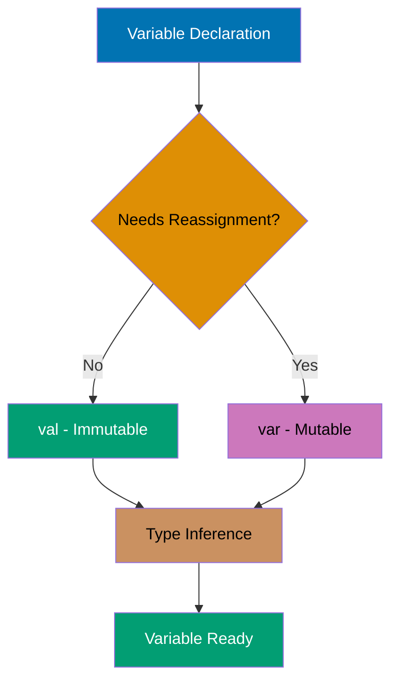
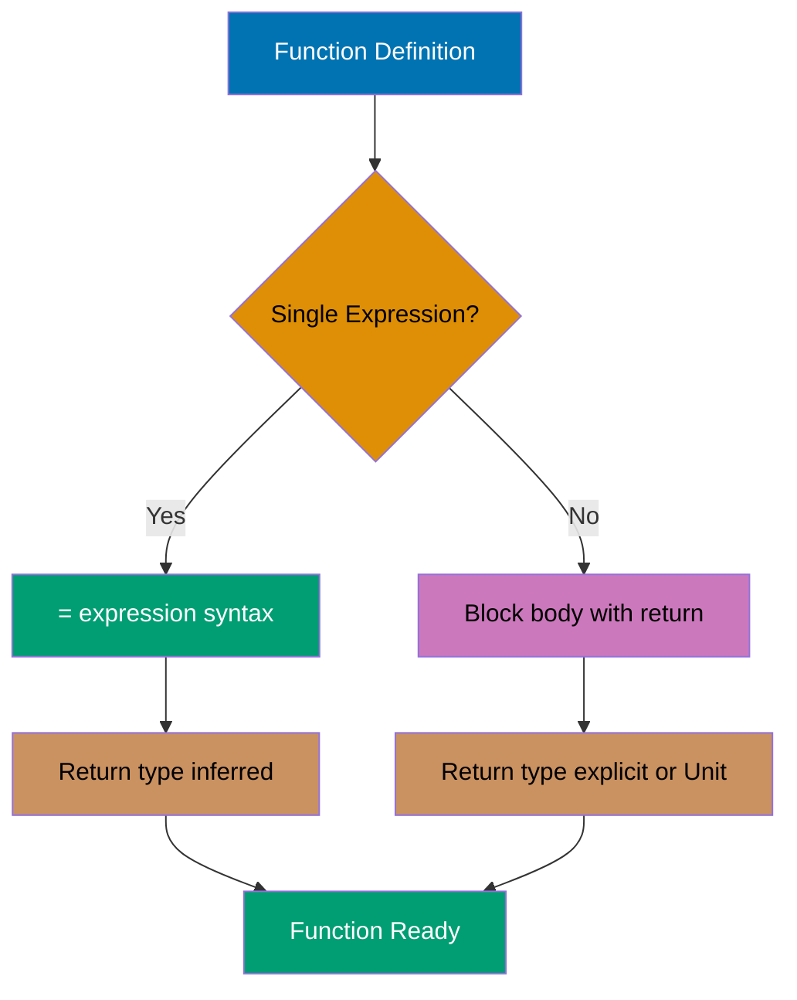
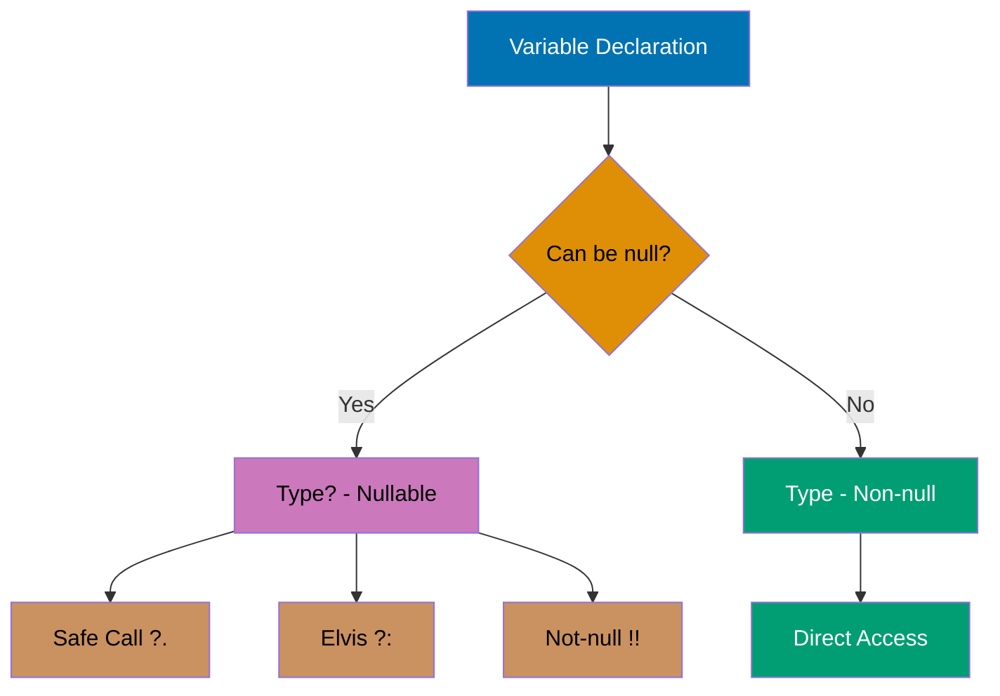
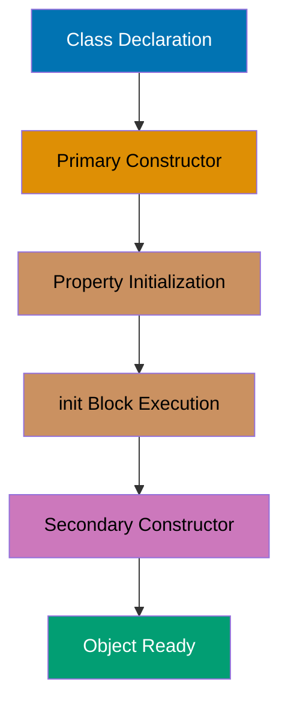
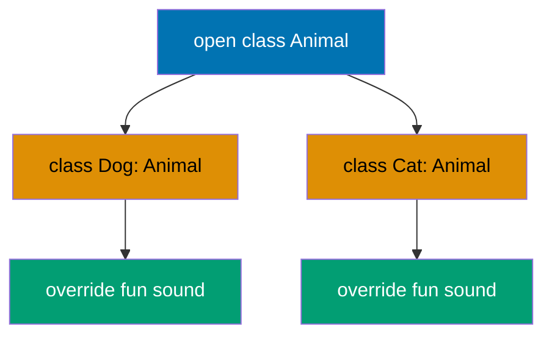
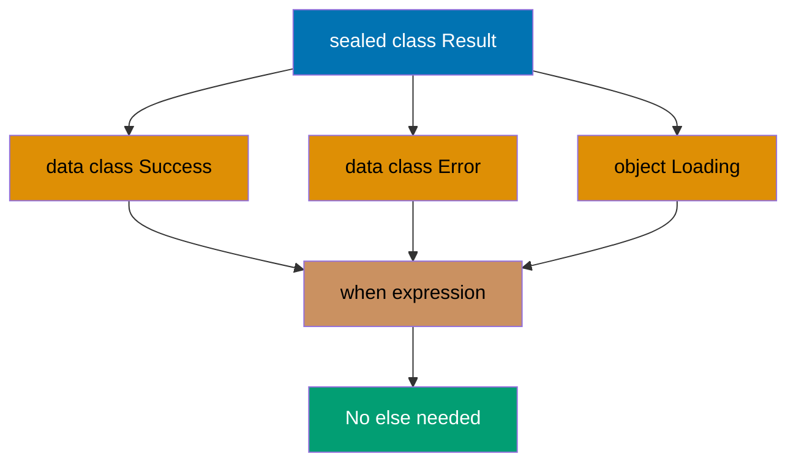
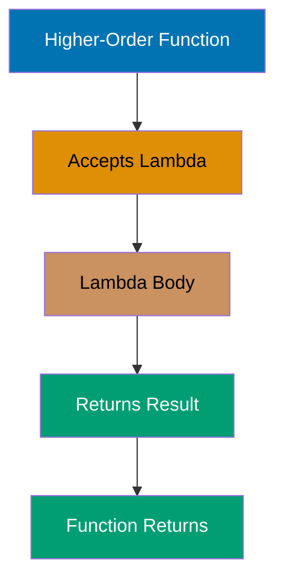
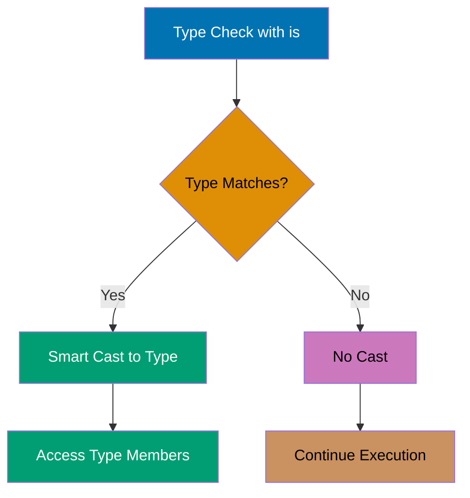

## Example 1: Hello World

Every Kotlin program starts with a main function. Unlike Java, Kotlin doesn't require a class wrapper for the main function, and semicolons are optional. The `println` function outputs to standard output with an automatic newline.

```kotlin
fun main() {
    println("Hello, Kotlin!")       // => Output: Hello, Kotlin!
}
```

**Key Takeaway**: Kotlin's `main` function can exist at the top level without a class, and semicolons are optional, making code more concise than Java.

---

## Example 2: Variable Declaration - val vs var

Kotlin distinguishes between immutable (`val`) and mutable (`var`) variables to encourage immutability. The compiler infers types automatically, but you can specify them explicitly when needed. Immutable variables prevent accidental reassignment and enable safer concurrent code.



```kotlin
fun main() {
    // Immutable variable with type inference
    val name = "Alice"               // => name is "Alice" (type: String)
    // name = "Bob"                  // => Compile error: val cannot be reassigned

    // Mutable variable with type inference
    var age = 25                     // => age is 25 (type: Int)
    age = 26                         // => age is now 26 (reassignment allowed)

    // Explicit type annotation
    val city: String = "Jakarta"     // => city is "Jakarta" (explicit String type)
    var temperature: Double = 28.5   // => temperature is 28.5 (explicit Double type)

    println("$name is $age years old") // => Output: Alice is 26 years old
    println("$city: ${temperature}°C") // => Output: Jakarta: 28.5°C
}
```

**Key Takeaway**: Use `val` by default for immutability and thread safety; only use `var` when you genuinely need to reassign values.

---

## Example 3: Basic Types and Type Inference

Kotlin has a rich type system with proper primitives that are represented as objects. Type inference eliminates redundant type declarations while maintaining type safety. All number types have explicit sizes (Byte, Short, Int, Long, Float, Double).

```kotlin
fun main() {
    // Integer types
    val byteValue: Byte = 127        // => byteValue is 127 (8-bit signed: -128 to 127)
    val shortValue: Short = 32767    // => shortValue is 32767 (16-bit signed)
    val intValue = 42                // => intValue is 42 (Int inferred, 32-bit signed)
    val longValue = 3_000_000_000L   // => longValue is 3000000000 (L suffix = Long)

    // Floating-point types
    val floatValue = 3.14f           // => floatValue is 3.14 (f suffix = Float, 32-bit)
    val doubleValue = 2.718281828    // => doubleValue is 2.718281828 (Double inferred, 64-bit)

    // Character and Boolean
    val char = 'K'                   // => char is 'K' (Char type)
    val isKotlin = true              // => isKotlin is true (Boolean type)

    // String with template expressions
    val message = "Integer: $intValue, Double: $doubleValue"
                                     // => message is "Integer: 42, Double: 2.718281828"

    // Type checking
    println(intValue::class.simpleName)     // => Output: Int
    println(doubleValue::class.simpleName)  // => Output: Double
}
```

**Key Takeaway**: Kotlin's type inference reduces boilerplate while maintaining type safety, and underscores in numeric literals improve readability for large numbers.

---

## Example 4: String Templates

Kotlin's string templates embed expressions directly in strings using `$` for simple variables and `${}` for complex expressions. This eliminates cumbersome string concatenation and improves readability for formatted output.

```kotlin
fun main() {
    val name = "Kotlin"              // => name is "Kotlin"
    val version = 1.9                // => version is 1.9

    // Simple template (variable only)
    val simple = "Language: $name"   // => simple is "Language: Kotlin"

    // Expression template (requires braces)
    val expr = "Version: ${version * 10}"
                                     // => expr is "Version: 19.0"

    // Complex expression with function call
    val upper = "Upper: ${name.uppercase()}"
                                     // => upper is "Upper: KOTLIN"

    // Escaped dollar sign
    val price = "Price: \$${100 + 50}"
                                     // => price is "Price: $150"

    // Multi-line strings (preserves formatting)
    val multiline = """
        |Language: $name
        |Version: $version
        |Status: Active
    """.trimMargin()                 // => Removes leading | and whitespace
                                     // => Output: (three lines without leading pipes)

    println(simple)                  // => Output: Language: Kotlin
    println(expr)                    // => Output: Version: 19.0
    println(upper)                   // => Output: Upper: KOTLIN
    println(price)                   // => Output: Price: $150
    println(multiline)
    // => Output:
    // Language: Kotlin
    // Version: 1.9
    // Status: Active
}
```

**Key Takeaway**: Use `$variable` for simple interpolation and `${expression}` for complex expressions; triple-quoted strings preserve formatting and support multi-line text.

---

## Example 5: Functions

Kotlin functions are first-class citizens defined with the `fun` keyword. Single-expression functions can use the `=` syntax without braces, and the compiler infers return types. Default and named parameters eliminate function overloading.



```kotlin
// Block body with explicit return type
fun add(a: Int, b: Int): Int {
    return a + b                     // => Returns sum of a and b
}

// Single-expression function (return type inferred)
fun multiply(a: Int, b: Int) = a * b // => Returns product of a and b (Int inferred)

// Function with default parameter
fun greet(name: String, greeting: String = "Hello") = "$greeting, $name!"
                                     // => greeting defaults to "Hello" if not provided

// Function with no return value (Unit type, like void)
fun printSum(a: Int, b: Int) {
    println("$a + $b = ${a + b}")    // => Outputs sum, returns Unit implicitly
}

fun main() {
    val sum = add(10, 20)            // => sum is 30
    val product = multiply(5, 6)     // => product is 30

    val greet1 = greet("Alice")      // => greet1 is "Hello, Alice!"
    val greet2 = greet("Bob", "Hi")  // => greet2 is "Hi, Bob!"
    val greet3 = greet(name = "Charlie", greeting = "Hey")
                                     // => greet3 is "Hey, Charlie!" (named arguments)

    printSum(15, 25)                 // => Output: 15 + 25 = 40

    println(sum)                     // => Output: 30
    println(product)                 // => Output: 30
    println(greet1)                  // => Output: Hello, Alice!
    println(greet2)                  // => Output: Hi, Bob!
    println(greet3)                  // => Output: Hey, Charlie!
}
```

**Key Takeaway**: Use single-expression syntax (`=`) for concise functions, leverage default parameters to reduce overloading, and use named arguments for clarity with multiple parameters.

---

## Example 6: When Expression

Kotlin's `when` replaces Java's switch statement with a more powerful expression that returns values. It supports ranges, type checks, arbitrary expressions, and doesn't require explicit `break` statements.

```kotlin
fun main() {
    val x = 3                        // => x is 3

    // when as expression (returns value)
    val result = when (x) {
        1 -> "One"                   // => Not matched
        2 -> "Two"                   // => Not matched
        3 -> "Three"                 // => Matched, result is "Three"
        else -> "Other"              // => Not evaluated
    }                                // => result is "Three"

    // when with ranges
    val score = 85                   // => score is 85
    val grade = when (score) {
        in 90..100 -> "A"            // => Not matched (85 not in 90..100)
        in 80..89 -> "B"             // => Matched, grade is "B"
        in 70..79 -> "C"             // => Not evaluated
        else -> "F"                  // => Not evaluated
    }                                // => grade is "B"

    // when with type checking
    val obj: Any = "Kotlin"          // => obj is "Kotlin" (type: Any)
    val description = when (obj) {
        is String -> "String of length ${obj.length}"
                                     // => Matched, smart cast to String
                                     // => obj.length is 6
                                     // => description is "String of length 6"
        is Int -> "Integer: $obj"    // => Not evaluated
        else -> "Unknown type"       // => Not evaluated
    }

    // when without argument (replaces if-else chain)
    val temp = 28                    // => temp is 28
    val weather = when {
        temp < 0 -> "Freezing"       // => Not matched
        temp < 15 -> "Cold"          // => Not matched
        temp < 25 -> "Moderate"      // => Not matched
        temp < 35 -> "Warm"          // => Matched, weather is "Warm"
        else -> "Hot"                // => Not evaluated
    }

    println(result)                  // => Output: Three
    println(grade)                   // => Output: B
    println(description)             // => Output: String of length 6
    println(weather)                 // => Output: Warm
}
```

**Key Takeaway**: Use `when` as an expression to return values directly, leverage ranges and type checks for concise branching, and omit the argument for complex boolean conditions.

---

## Example 7: Ranges and Progression

Kotlin ranges represent sequences of values with start and end points. They support iteration, membership checks, and progression (step values). Ranges are memory-efficient as they don't materialize all values.

```kotlin
fun main() {
    // Inclusive range (1 to 10 including both)
    val range1 = 1..10               // => range1 is 1, 2, 3, ..., 10
    println(5 in range1)             // => Output: true (5 is in range)
    println(15 in range1)            // => Output: false (15 is outside range)

    // Exclusive range (1 to 9, excludes 10)
    val range2 = 1 until 10          // => range2 is 1, 2, 3, ..., 9
    println(10 in range2)            // => Output: false (until excludes end)

    // Downward range
    val range3 = 10 downTo 1         // => range3 is 10, 9, 8, ..., 1
    for (i in range3) {
        print("$i ")                 // => Prints: 10 9 8 7 6 5 4 3 2 1
    }
    println()                        // => Newline

    // Range with step
    val range4 = 1..10 step 2        // => range4 is 1, 3, 5, 7, 9
    for (i in range4) {
        print("$i ")                 // => Prints: 1 3 5 7 9
    }
    println()                        // => Newline

    // Character range
    val charRange = 'a'..'z'         // => charRange is a, b, c, ..., z
    println('k' in charRange)        // => Output: true

    // Range functions
    println((1..10).count())         // => Output: 10 (number of elements)
    println((1..10).sum())           // => Output: 55 (sum of all elements)
    println((1..10).average())       // => Output: 5.5 (average value)
}
```

**Key Takeaway**: Use `..` for inclusive ranges, `until` for exclusive ranges, `downTo` for descending sequences, and `step` to skip values in progression.

---

## Example 8: For Loops

Kotlin's for loops iterate over anything that provides an iterator, including ranges, collections, and arrays. The loop variable is automatically declared and scoped to the loop body.

```kotlin
fun main() {
    // Iterate over range
    print("Range: ")
    for (i in 1..5) {
        print("$i ")                 // => Prints: 1 2 3 4 5
    }
    println()                        // => Newline

    // Iterate over collection
    val fruits = listOf("Apple", "Banana", "Cherry")
                                     // => fruits is ["Apple", "Banana", "Cherry"]
    print("Fruits: ")
    for (fruit in fruits) {
        print("$fruit ")             // => Prints: Apple Banana Cherry
    }
    println()                        // => Newline

    // Iterate with index
    print("Indexed: ")
    for ((index, fruit) in fruits.withIndex()) {
        print("$index:$fruit ")      // => Prints: 0:Apple 1:Banana 2:Cherry
    }
    println()                        // => Newline

    // Iterate over map
    val scores = mapOf("Alice" to 95, "Bob" to 87, "Charlie" to 92)
                                     // => scores is {Alice=95, Bob=87, Charlie=92}
    for ((name, score) in scores) {
        println("$name: $score")     // => Output: Alice: 95, Bob: 87, Charlie: 92
    }

    // Iterate with step and range
    print("Step 2: ")
    for (i in 0..10 step 2) {
        print("$i ")                 // => Prints: 0 2 4 6 8 10
    }
    println()                        // => Newline

    // Iterate in reverse
    print("Reverse: ")
    for (i in 5 downTo 1) {
        print("$i ")                 // => Prints: 5 4 3 2 1
    }
    println()                        // => Newline
}
```

**Key Takeaway**: Use destructuring with `withIndex()` for indexed iteration, destructure map entries directly in the loop, and combine ranges with `step` and `downTo` for custom iteration patterns.

---

## Example 9: While and Do-While Loops

Kotlin supports traditional while and do-while loops for conditional iteration. The do-while variant guarantees at least one execution before checking the condition.

```kotlin
fun main() {
    // while loop (condition checked before execution)
    var count = 0                    // => count is 0
    while (count < 3) {
        println("Count: $count")     // => Output: Count: 0, Count: 1, Count: 2
        count++                      // => count becomes 1, then 2, then 3
    }                                // => count is 3 (loop exits)

    // do-while loop (condition checked after execution)
    var x = 0                        // => x is 0
    do {
        println("x: $x")             // => Output: x: 0
        x++                          // => x becomes 1
    } while (x < 0)                  // => Condition false, but body executed once
                                     // => x is 1 after loop

    // Infinite loop with break
    var sum = 0                      // => sum is 0
    while (true) {
        sum += 1                     // => sum becomes 1, 2, 3, 4, 5
        if (sum >= 5) {
            break                    // => Exit loop when sum >= 5
        }
    }                                // => sum is 5

    // Loop with continue
    var i = 0                        // => i is 0
    while (i < 5) {
        i++                          // => i becomes 1, 2, 3, 4, 5
        if (i % 2 == 0) {
            continue                 // => Skip even numbers (2, 4)
        }
        print("$i ")                 // => Prints: 1 3 5
    }
    println()                        // => Newline
}
```

**Key Takeaway**: Use `while` for conditional loops, `do-while` when you need at least one execution, and combine with `break`/`continue` for flow control within loops.

---

## Example 10: Null Safety - Nullable Types

Kotlin's type system distinguishes between nullable and non-nullable references, eliminating most null pointer exceptions. Use `?` to mark types as nullable and leverage safe call operators to handle null values gracefully.



```kotlin
fun main() {
    // Non-nullable type (cannot be null)
    val name: String = "Kotlin"      // => name is "Kotlin" (cannot be null)
    // val invalid: String = null    // => Compile error: null cannot be assigned

    // Nullable type (can be null)
    val nullableName: String? = null // => nullableName is null (type: String?)
    val validName: String? = "Alice" // => validName is "Alice" (type: String?)

    // Safe call operator (?.) - returns null if receiver is null
    val length1 = nullableName?.length
                                     // => nullableName is null, so length1 is null
    val length2 = validName?.length  // => validName is "Alice", so length2 is 5

    // Elvis operator (?:) - provides default value if left side is null
    val len1 = nullableName?.length ?: 0
                                     // => nullableName is null, so len1 is 0
    val len2 = validName?.length ?: 0
                                     // => validName is "Alice", so len2 is 5

    // Not-null assertion (!!) - throws NPE if null (use sparingly)
    // val unsafe = nullableName!!.length
                                     // => Would throw NullPointerException

    // Safe cast with as?
    val value: Any? = "Hello"        // => value is "Hello" (type: Any?)
    val str = value as? String       // => str is "Hello" (safe cast succeeds)
    val num = value as? Int          // => num is null (safe cast fails, returns null)

    println(length1)                 // => Output: null
    println(length2)                 // => Output: 5
    println(len1)                    // => Output: 0
    println(len2)                    // => Output: 5
    println(str)                     // => Output: Hello
    println(num)                     // => Output: null
}
```

**Key Takeaway**: Use `Type?` for nullable types, `?.` for safe calls that propagate null, `?:` for default values, and avoid `!!` unless you're absolutely certain a value is non-null.

---

## Example 11: Collections - Lists

Kotlin provides both mutable and immutable collections. Immutable lists (created with `listOf`) cannot be modified after creation, promoting safer concurrent code. Mutable lists (created with `mutableListOf`) support adding, removing, and updating elements.

```kotlin
fun main() {
    // Immutable list (read-only)
    val fruits = listOf("Apple", "Banana", "Cherry")
                                     // => fruits is ["Apple", "Banana", "Cherry"]
    println(fruits[0])               // => Output: Apple (index access)
    println(fruits.size)             // => Output: 3
    // fruits.add("Mango")           // => Compile error: no add method on List

    // Mutable list
    val numbers = mutableListOf(1, 2, 3)
                                     // => numbers is [1, 2, 3]
    numbers.add(4)                   // => numbers is [1, 2, 3, 4]
    numbers.removeAt(0)              // => numbers is [2, 3, 4] (removed index 0)
    numbers[0] = 10                  // => numbers is [10, 3, 4] (updated index 0)

    // List operations
    val combined = fruits + listOf("Mango", "Orange")
                                     // => combined is ["Apple", "Banana", "Cherry", "Mango", "Orange"]
                                     // => fruits remains unchanged
    val sliced = combined.slice(1..3)
                                     // => sliced is ["Banana", "Cherry", "Mango"]

    // Checking membership
    println("Apple" in fruits)       // => Output: true
    println("Grape" in fruits)       // => Output: false

    // Iteration
    for (fruit in fruits) {
        print("$fruit ")             // => Prints: Apple Banana Cherry
    }
    println()                        // => Newline

    // List transformation
    val lengths = fruits.map { it.length }
                                     // => lengths is [5, 6, 6]
    val filtered = fruits.filter { it.startsWith("C") }
                                     // => filtered is ["Cherry"]

    println(numbers)                 // => Output: [10, 3, 4]
    println(combined)                // => Output: [Apple, Banana, Cherry, Mango, Orange]
    println(lengths)                 // => Output: [5, 6, 6]
    println(filtered)                // => Output: [Cherry]
}
```

**Key Takeaway**: Use `listOf` for immutable lists that prevent accidental modification, `mutableListOf` when you need to add/remove elements, and leverage functional operations like `map` and `filter` for transformations.

---

## Example 12: Collections - Sets

Sets are unordered collections of unique elements. Kotlin provides immutable `Set` and mutable `MutableSet`. Sets automatically eliminate duplicates and provide efficient membership testing.

```kotlin
fun main() {
    // Immutable set (duplicates automatically removed)
    val numbers = setOf(1, 2, 3, 2, 1)
                                     // => numbers is {1, 2, 3} (duplicates removed)
    println(numbers)                 // => Output: [1, 2, 3]
    println(numbers.size)            // => Output: 3

    // Mutable set
    val colors = mutableSetOf("Red", "Green", "Blue")
                                     // => colors is {"Red", "Green", "Blue"}
    colors.add("Yellow")             // => colors is {"Red", "Green", "Blue", "Yellow"}
    colors.add("Red")                // => No change (Red already exists)
                                     // => colors is {"Red", "Green", "Blue", "Yellow"}
    colors.remove("Green")           // => colors is {"Red", "Blue", "Yellow"}

    // Set operations
    val set1 = setOf(1, 2, 3, 4)     // => set1 is {1, 2, 3, 4}
    val set2 = setOf(3, 4, 5, 6)     // => set2 is {3, 4, 5, 6}

    val union = set1 union set2      // => union is {1, 2, 3, 4, 5, 6}
    val intersect = set1 intersect set2
                                     // => intersect is {3, 4}
    val diff = set1 subtract set2    // => diff is {1, 2} (in set1 but not set2)

    // Membership testing (very efficient)
    println(2 in set1)               // => Output: true
    println(5 in set1)               // => Output: false

    println(colors)                  // => Output: [Red, Blue, Yellow]
    println(union)                   // => Output: [1, 2, 3, 4, 5, 6]
    println(intersect)               // => Output: [3, 4]
    println(diff)                    // => Output: [1, 2]
}
```

**Key Takeaway**: Use sets when you need unique elements and efficient membership testing; leverage set operations (union, intersect, subtract) for mathematical set manipulations.

---

## Example 13: Collections - Maps

Maps store key-value pairs with unique keys. Kotlin provides immutable `Map` and mutable `MutableMap`. Use the `to` infix function or `Pair` to create entries, and access values safely with null-aware operators.

```kotlin
fun main() {
    // Immutable map
    val capitals = mapOf(
        "Indonesia" to "Jakarta",
        "Malaysia" to "Kuala Lumpur",
        "Singapore" to "Singapore"
    )                                // => capitals is {Indonesia=Jakarta, ...}

    println(capitals["Indonesia"])   // => Output: Jakarta
    println(capitals["Thailand"])    // => Output: null (key not found)

    // Mutable map
    val scores = mutableMapOf(
        "Alice" to 95,
        "Bob" to 87
    )                                // => scores is {Alice=95, Bob=87}
    scores["Charlie"] = 92           // => scores is {Alice=95, Bob=87, Charlie=92}
    scores["Alice"] = 98             // => scores is {Alice=98, Bob=87, Charlie=92}
    scores.remove("Bob")             // => scores is {Alice=98, Charlie=92}

    // Safe access with default value
    val aliceScore = scores.getOrDefault("Alice", 0)
                                     // => aliceScore is 98
    val bobScore = scores.getOrDefault("Bob", 0)
                                     // => bobScore is 0 (Bob removed)

    // getOrElse with lambda
    val davidScore = scores.getOrElse("David") { 50 }
                                     // => davidScore is 50 (lambda executed)

    // Iteration
    for ((country, capital) in capitals) {
        println("$country: $capital")
                                     // => Output: Indonesia: Jakarta, etc.
    }

    // Map operations
    println(capitals.keys)           // => Output: [Indonesia, Malaysia, Singapore]
    println(capitals.values)         // => Output: [Jakarta, Kuala Lumpur, Singapore]
    println(capitals.containsKey("Malaysia"))
                                     // => Output: true
    println(capitals.containsValue("Bangkok"))
                                     // => Output: false

    println(scores)                  // => Output: {Alice=98, Charlie=92}
}
```

**Key Takeaway**: Use `to` infix function for readable map creation, access values with `[]` operator (returns null if missing), and use `getOrDefault` or `getOrElse` for safe fallback values.

---

## Example 14: Classes and Objects

Kotlin classes are concise with properties declared in the primary constructor. Properties automatically generate getters (and setters for `var`). The `init` block runs during object initialization for setup logic.



```kotlin
// Class with primary constructor
class Person(val name: String, var age: Int) {
                                     // => name is val (immutable property)
                                     // => age is var (mutable property)

    // init block runs during construction
    init {
        println("Person created: $name, age $age")
                                     // => Executes when object is created
    }

    // Method
    fun greet() {
        println("Hello, I'm $name")  // => Accesses name property
    }

    // Method with logic
    fun haveBirthday() {
        age++                        // => Increments age property
        println("Happy birthday! Now $age years old")
    }
}

// Class with secondary constructor
class Product(val name: String) {
    var price: Double = 0.0          // => Default value

    // Secondary constructor
    constructor(name: String, price: Double) : this(name) {
                                     // => Calls primary constructor with name
        this.price = price           // => Sets price property
    }
}

fun main() {
    // Object creation
    val person = Person("Alice", 25) // => Output: Person created: Alice, age 25
                                     // => person.name is "Alice" (immutable)
                                     // => person.age is 25 (mutable)

    person.greet()                   // => Output: Hello, I'm Alice
    person.haveBirthday()            // => Output: Happy birthday! Now 26 years old
                                     // => person.age is now 26

    // person.name = "Bob"           // => Compile error: val cannot be reassigned
    person.age = 30                  // => person.age is 30 (var allows reassignment)

    val product1 = Product("Laptop") // => product1.name is "Laptop", price is 0.0
    val product2 = Product("Phone", 599.99)
                                     // => product2.name is "Phone", price is 599.99

    println("${product1.name}: ${product1.price}")
                                     // => Output: Laptop: 0.0
    println("${product2.name}: ${product2.price}")
                                     // => Output: Phone: 599.99
}
```

**Key Takeaway**: Use primary constructor parameters with `val`/`var` for automatic property creation, leverage `init` blocks for initialization logic, and prefer primary constructors over secondary when possible.

---

## Example 15: Data Classes

Data classes automatically generate `equals()`, `hashCode()`, `toString()`, and `copy()` methods. They're ideal for holding immutable data and enable destructuring declarations. The `copy()` function creates modified copies for immutability.

```kotlin
// Data class for holding user data
data class User(
    val id: Int,
    val name: String,
    val email: String
)                                    // => Compiler generates equals, hashCode, toString, copy

fun main() {
    val user1 = User(1, "Alice", "alice@example.com")
                                     // => user1 has id=1, name="Alice", email="alice@example.com"

    // Automatic toString()
    println(user1)                   // => Output: User(id=1, name=Alice, email=alice@example.com)

    // Automatic equals() (structural equality)
    val user2 = User(1, "Alice", "alice@example.com")
    println(user1 == user2)          // => Output: true (same values)
    println(user1 === user2)         // => Output: false (different objects)

    // copy() with modification
    val user3 = user1.copy(email = "newemail@example.com")
                                     // => user3 has id=1, name="Alice", email="newemail@example.com"
                                     // => user1 remains unchanged

    // Destructuring declaration
    val (id, name, email) = user1    // => id is 1, name is "Alice", email is "alice@example.com"
    println("ID: $id, Name: $name")  // => Output: ID: 1, Name: Alice

    // Data classes in collections
    val users = listOf(
        User(1, "Alice", "alice@example.com"),
        User(2, "Bob", "bob@example.com"),
        User(1, "Alice", "alice@example.com")
    )                                // => List of 3 users

    val uniqueUsers = users.toSet()  // => Set removes duplicate (first and third are equal)
    println(uniqueUsers.size)        // => Output: 2 (duplicate removed)

    println(user3)                   // => Output: User(id=1, name=Alice, email=newemail@example.com)
}
```

**Key Takeaway**: Use data classes when you need value-based equality, automatic `toString()`, and immutable copies via `copy()`; they eliminate boilerplate for data containers.

---

## Example 16: Inheritance and Open Classes

Kotlin classes are final by default, preventing unintended inheritance. Mark classes and methods with `open` to allow inheritance and overriding. Subclasses use `:` to inherit and `override` to redefine behavior.



```kotlin
// Base class (must be open to allow inheritance)
open class Animal(val name: String) {
    // Open method (can be overridden)
    open fun sound() {
        println("$name makes a sound")
    }

    // Final method (cannot be overridden)
    fun sleep() {
        println("$name is sleeping")
    }
}

// Subclass inheriting from Animal
class Dog(name: String) : Animal(name) {
                                     // => Calls Animal constructor with name

    // Override method
    override fun sound() {
        println("$name barks: Woof!")
    }                                // => Replaces Animal's sound() implementation

    // New method specific to Dog
    fun fetch() {
        println("$name fetches the ball")
    }
}

class Cat(name: String) : Animal(name) {
    override fun sound() {
        println("$name meows: Meow!")
    }
}

fun main() {
    val animal = Animal("Generic")   // => animal.name is "Generic"
    animal.sound()                   // => Output: Generic makes a sound
    animal.sleep()                   // => Output: Generic is sleeping

    val dog = Dog("Buddy")           // => dog.name is "Buddy"
    dog.sound()                      // => Output: Buddy barks: Woof! (overridden)
    dog.sleep()                      // => Output: Buddy is sleeping (inherited)
    dog.fetch()                      // => Output: Buddy fetches the ball

    val cat = Cat("Whiskers")        // => cat.name is "Whiskers"
    cat.sound()                      // => Output: Whiskers meows: Meow!

    // Polymorphism
    val animals: List<Animal> = listOf(dog, cat, animal)
                                     // => List of Animal references to different types
    for (a in animals) {
        a.sound()                    // => Calls overridden versions dynamically
    }                                // => Output: Buddy barks: Woof!
                                     //            Whiskers meows: Meow!
                                     //            Generic makes a sound
}
```

**Key Takeaway**: Mark classes with `open` to allow inheritance (final by default), use `override` keyword explicitly for method overriding, and leverage polymorphism through base class references.

---

## Example 17: Interfaces

Interfaces define contracts that classes must implement. Unlike Java, Kotlin interfaces can contain default method implementations and properties. Classes can implement multiple interfaces for flexible composition.

```kotlin
// Interface with abstract and default methods
interface Drawable {
    // Abstract property (must be overridden)
    val color: String

    // Abstract method (must be implemented)
    fun draw()

    // Default method implementation
    fun describe() {
        println("Drawing with color: $color")
    }                                // => Can be overridden or used as-is
}

interface Clickable {
    fun click() {
        println("Clicked")           // => Default implementation
    }

    fun showInfo()                   // => Abstract method
}

// Class implementing multiple interfaces
class Button(override val color: String) : Drawable, Clickable {
    override fun draw() {
        println("Drawing button with color: $color")
    }

    override fun showInfo() {
        println("Button information")
    }

    // Uses default click() from Clickable
}

// Class implementing interface with custom override
class Circle(override val color: String) : Drawable {
    override fun draw() {
        println("Drawing circle with color: $color")
    }

    // Overrides default implementation
    override fun describe() {
        println("This is a $color circle")
    }
}

fun main() {
    val button = Button("Blue")      // => button.color is "Blue"
    button.draw()                    // => Output: Drawing button with color: Blue
    button.describe()                // => Output: Drawing with color: Blue (default impl)
    button.click()                   // => Output: Clicked (default impl)
    button.showInfo()                // => Output: Button information

    val circle = Circle("Red")       // => circle.color is "Red"
    circle.draw()                    // => Output: Drawing circle with color: Red
    circle.describe()                // => Output: This is a Red circle (overridden)

    // Polymorphism with interfaces
    val drawables: List<Drawable> = listOf(button, circle)
    for (d in drawables) {
        d.draw()                     // => Calls respective implementations
    }                                // => Output: Drawing button with color: Blue
                                     //            Drawing circle with color: Red
}
```

**Key Takeaway**: Use interfaces to define contracts with optional default implementations, implement multiple interfaces for composition, and leverage interface polymorphism for flexible design.

---

## Example 18: Abstract Classes

Abstract classes cannot be instantiated and may contain abstract members that subclasses must implement. They can also contain concrete implementations. Use abstract classes when you need shared implementation across related classes.

```kotlin
// Abstract class with abstract and concrete members
abstract class Shape {
    abstract val area: Double        // => Abstract property (must be overridden)

    // Concrete method
    fun printArea() {
        println("Area: $area")       // => Uses abstract property
    }

    // Abstract method
    abstract fun perimeter(): Double
}

class Rectangle(val width: Double, val height: Double) : Shape() {
    override val area: Double
        get() = width * height       // => Computes area on access

    override fun perimeter(): Double {
        return 2 * (width + height)  // => Implements abstract method
    }
}

class Circle(val radius: Double) : Shape() {
    override val area: Double
        get() = Math.PI * radius * radius
                                     // => area is π * r²

    override fun perimeter(): Double {
        return 2 * Math.PI * radius  // => Circumference
    }
}

fun main() {
    // val shape = Shape()           // => Compile error: cannot instantiate abstract class

    val rect = Rectangle(5.0, 3.0)   // => rect.width is 5.0, height is 3.0
    println("Rectangle area: ${rect.area}")
                                     // => Output: Rectangle area: 15.0
    println("Rectangle perimeter: ${rect.perimeter()}")
                                     // => Output: Rectangle perimeter: 16.0
    rect.printArea()                 // => Output: Area: 15.0

    val circle = Circle(4.0)         // => circle.radius is 4.0
    println("Circle area: ${circle.area}")
                                     // => Output: Circle area: 50.26548245743669
    println("Circle perimeter: ${circle.perimeter()}")
                                     // => Output: Circle perimeter: 25.132741228718345
    circle.printArea()               // => Output: Area: 50.26548245743669

    // Polymorphism
    val shapes: List<Shape> = listOf(rect, circle)
    for (shape in shapes) {
        shape.printArea()            // => Uses concrete method from abstract class
    }                                // => Output: Area: 15.0
                                     //            Area: 50.26548245743669
}
```

**Key Takeaway**: Use abstract classes when you need partial implementation shared across subclasses; they can mix abstract and concrete members unlike interfaces (though modern Kotlin interfaces support default methods).

---

## Example 19: Companion Objects

Companion objects provide class-level functionality without static keywords. They enable factory methods, constants, and singleton behavior. Companion objects can implement interfaces and be accessed through the class name.

```kotlin
class User private constructor(val id: Int, val name: String) {
                                     // => Private constructor prevents direct instantiation

    companion object Factory {       // => Name "Factory" is optional
        private var nextId = 1       // => Shared state across all instances

        // Factory method
        fun create(name: String): User {
            return User(nextId++, name)
                                     // => Creates User with auto-incremented ID
        }

        // Constant
        const val MAX_NAME_LENGTH = 50
                                     // => Compile-time constant

        // Regular property
        val version = "1.0"          // => Accessible via User.version
    }

    fun describe() {
        println("User #$id: $name")
    }
}

class MathHelper {
    companion object {               // => Unnamed companion object
        fun square(x: Int) = x * x   // => Class-level utility method

        const val PI = 3.14159       // => Constant
    }
}

fun main() {
    // Cannot use constructor directly (private)
    // val user = User(1, "Alice")   // => Compile error: constructor is private

    // Use factory method instead
    val user1 = User.create("Alice") // => user1.id is 1, name is "Alice"
    val user2 = User.create("Bob")   // => user2.id is 2, name is "Bob"
    val user3 = User.create("Charlie")
                                     // => user3.id is 3, name is "Charlie"

    user1.describe()                 // => Output: User #1: Alice
    user2.describe()                 // => Output: User #2: Bob
    user3.describe()                 // => Output: User #3: Charlie

    // Access companion object members
    println(User.MAX_NAME_LENGTH)    // => Output: 50
    println(User.version)            // => Output: 1.0

    // Unnamed companion object
    println(MathHelper.square(5))    // => Output: 25
    println(MathHelper.PI)           // => Output: 3.14159
}
```

**Key Takeaway**: Use companion objects for factory methods and class-level utilities instead of static methods; they provide type-safe access to shared functionality and enable interface implementation.

---

## Example 20: Object Declarations (Singletons)

Object declarations create singletons that are thread-safe and lazily initialized. Unlike classes, objects are instantiated once and accessed by name. They're ideal for stateless utilities and configuration holders.

```kotlin
// Singleton object
object Database {
    private var connectionCount = 0  // => Shared state

    fun connect() {
        connectionCount++
        println("Connected to database (connection #$connectionCount)")
    }

    fun getConnectionCount() = connectionCount
}

// Singleton with properties and methods
object AppConfig {
    const val APP_NAME = "MyApp"     // => Compile-time constant
    var debugMode = false            // => Mutable configuration

    fun loadConfig() {
        println("Loading configuration for $APP_NAME")
        debugMode = true             // => Modifies singleton state
    }
}

fun main() {
    // Access singleton directly (no instantiation needed)
    Database.connect()               // => Output: Connected to database (connection #1)
    Database.connect()               // => Output: Connected to database (connection #2)
    println("Total connections: ${Database.getConnectionCount()}")
                                     // => Output: Total connections: 2

    // Access configuration
    println(AppConfig.APP_NAME)      // => Output: MyApp
    println("Debug mode: ${AppConfig.debugMode}")
                                     // => Output: Debug mode: false

    AppConfig.loadConfig()           // => Output: Loading configuration for MyApp
                                     // => Sets debugMode to true
    println("Debug mode: ${AppConfig.debugMode}")
                                     // => Output: Debug mode: true

    // Same instance across all uses
    Database.connect()               // => Output: Connected to database (connection #3)
    println("Total connections: ${Database.getConnectionCount()}")
                                     // => Output: Total connections: 3
}
```

**Key Takeaway**: Use `object` declarations for singletons that need shared state or stateless utilities; they're thread-safe, lazily initialized, and accessed by name without instantiation.

---

## Example 21: Sealed Classes

Sealed classes represent restricted class hierarchies where all subclasses are known at compile time. They enable exhaustive `when` expressions without `else` branches and provide type-safe state modeling.



```kotlin
// Sealed class representing operation result
sealed class Result {
    data class Success(val data: String) : Result()
    data class Error(val message: String, val code: Int) : Result()
    object Loading : Result()        // => Singleton state (no data needed)
}

// Function returning different result types
fun fetchData(shouldSucceed: Boolean): Result {
    return if (shouldSucceed) {
        Result.Success("Data loaded successfully")
    } else {
        Result.Error("Network error", 404)
    }
}

fun main() {
    val result1 = fetchData(true)    // => result1 is Result.Success
    val result2 = fetchData(false)   // => result2 is Result.Error
    val result3 = Result.Loading     // => result3 is Result.Loading

    // Exhaustive when (no else needed, compiler enforces all cases)
    fun handleResult(result: Result) = when (result) {
        is Result.Success -> {
            println("Success: ${result.data}")
                                     // => Smart cast to Success, access data
        }
        is Result.Error -> {
            println("Error ${result.code}: ${result.message}")
                                     // => Smart cast to Error, access message and code
        }
        is Result.Loading -> {
            println("Loading...")    // => No properties to access (object)
        }
        // No else branch needed - compiler knows all cases covered
    }

    handleResult(result1)            // => Output: Success: Data loaded successfully
    handleResult(result2)            // => Output: Error 404: Network error
    handleResult(result3)            // => Output: Loading...

    // Pattern matching with when expression
    val message = when (result1) {
        is Result.Success -> "Got: ${result1.data}"
        is Result.Error -> "Failed: ${result1.message}"
        is Result.Loading -> "Please wait"
    }                                // => message is "Got: Data loaded successfully"

    println(message)                 // => Output: Got: Data loaded successfully
}
```

**Key Takeaway**: Use sealed classes for representing restricted type hierarchies like state machines or result types; they enable exhaustive `when` expressions and type-safe pattern matching.

---

## Example 22: Extension Functions

Extension functions add methods to existing classes without modifying their source code. They provide a clean way to add utility methods to library classes or third-party types. Extensions are resolved statically, not dynamically.

```kotlin
// Extension function on String
fun String.isPalindrome(): Boolean {
    val cleaned = this.lowercase().replace(" ", "")
                                     // => Remove spaces and lowercase
    return cleaned == cleaned.reversed()
                                     // => Compare with reversed version
}

// Extension function with parameter
fun Int.times(action: (Int) -> Unit) {
    for (i in 1..this) {
        action(i)                    // => Execute action for each iteration
    }
}

// Extension property
val String.wordCount: Int
    get() = this.split("\\s+".toRegex()).size
                                     // => Count words by splitting on whitespace

// Extension function on nullable receiver
fun String?.orDefault(default: String = "N/A"): String {
    return this ?: default           // => Return default if receiver is null
}

fun main() {
    // Using extension function
    val word1 = "radar"              // => word1 is "radar"
    val word2 = "kotlin"             // => word2 is "kotlin"

    println(word1.isPalindrome())    // => Output: true (radar reversed is radar)
    println(word2.isPalindrome())    // => Output: false

    // Extension with parameter
    5.times { i ->
        print("$i ")                 // => Prints: 1 2 3 4 5
    }
    println()                        // => Newline

    // Extension property
    val text = "Hello Kotlin World"  // => text has 3 words
    println(text.wordCount)          // => Output: 3

    // Extension on nullable receiver
    val str1: String? = null         // => str1 is null
    val str2: String? = "Hello"      // => str2 is "Hello"

    println(str1.orDefault())        // => Output: N/A (null receiver)
    println(str2.orDefault())        // => Output: Hello (non-null receiver)
    println(str1.orDefault("Empty")) // => Output: Empty (custom default)
}
```

**Key Takeaway**: Use extension functions to add methods to existing classes without inheritance; they improve API ergonomics and enable domain-specific utilities on third-party types.

---

## Example 23: Lambdas and Higher-Order Functions

Kotlin treats functions as first-class citizens. Lambdas are anonymous functions passed as arguments or stored in variables. Higher-order functions accept functions as parameters or return them, enabling functional programming patterns.



```kotlin
fun main() {
    // Lambda syntax: { parameters -> body }
    val sum = { a: Int, b: Int -> a + b }
                                     // => sum is a function (Int, Int) -> Int
    println(sum(5, 3))               // => Output: 8

    // Lambda with type inference
    val numbers = listOf(1, 2, 3, 4, 5)
    val doubled = numbers.map { it * 2 }
                                     // => doubled is [2, 4, 6, 8, 10]
                                     // => 'it' is implicit single parameter

    // Lambda with explicit parameter
    val evens = numbers.filter { num -> num % 2 == 0 }
                                     // => evens is [2, 4]

    // Multi-line lambda
    val squared = numbers.map { num ->
        val result = num * num       // => Intermediate computation
        result                       // => Last expression is return value
    }                                // => squared is [1, 4, 9, 16, 25]

    // Higher-order function (takes function as parameter)
    fun operate(a: Int, b: Int, operation: (Int, Int) -> Int): Int {
        return operation(a, b)       // => Calls passed function
    }

    val addResult = operate(10, 5) { x, y -> x + y }
                                     // => addResult is 15
    val mulResult = operate(10, 5) { x, y -> x * y }
                                     // => mulResult is 50

    // Function returning function
    fun makeMultiplier(factor: Int): (Int) -> Int {
        return { num -> num * factor }
                                     // => Returns lambda that captures factor
    }

    val triple = makeMultiplier(3)   // => triple is (Int) -> Int with factor=3
    println(triple(5))               // => Output: 15 (5 * 3)
    println(triple(10))              // => Output: 30 (10 * 3)

    println(doubled)                 // => Output: [2, 4, 6, 8, 10]
    println(evens)                   // => Output: [2, 4]
    println(squared)                 // => Output: [1, 4, 9, 16, 25]
}
```

**Key Takeaway**: Use lambdas with `it` for single parameters, explicit names for clarity with multiple parameters, and leverage higher-order functions for functional composition and reusable logic.

---

## Example 24: Scope Functions - let, run, with, apply, also

Scope functions execute a block of code in the context of an object. They differ in how they reference the context (`this` vs `it`) and what they return (context object vs lambda result). Choose based on your use case.

```kotlin
fun main() {
    // let: context is 'it', returns lambda result
    val name: String? = "Kotlin"     // => name is "Kotlin" (nullable)
    val length = name?.let {
        println("Processing: $it")   // => Output: Processing: Kotlin
        it.length                    // => Returns length (6)
    }                                // => length is 6 (Int?)

    // run: context is 'this', returns lambda result
    val message = "Hello".run {
        println("Length: $length")   // => this = "Hello", length from outer scope
        this.uppercase()             // => Returns "HELLO"
    }                                // => message is "HELLO"

    // with: context is 'this', returns lambda result (not extension)
    val numbers = mutableListOf(1, 2, 3)
    val sum = with(numbers) {
        add(4)                       // => this.add(4), modifies numbers
        add(5)                       // => numbers is [1, 2, 3, 4, 5]
        sum()                        // => Returns sum (15)
    }                                // => sum is 15

    // apply: context is 'this', returns context object
    val person = Person("Alice", 25).apply {
        println("Configuring $name") // => Output: Configuring Alice
        age = 26                     // => Modifies age property
    }                                // => Returns Person object
                                     // => person.age is 26

    // also: context is 'it', returns context object
    val numbers2 = mutableListOf(1, 2, 3).also {
        println("Initial list: $it") // => Output: Initial list: [1, 2, 3]
        it.add(4)                    // => Modifies list
    }                                // => Returns modified list
                                     // => numbers2 is [1, 2, 3, 4]

    println(length)                  // => Output: 6
    println(message)                 // => Output: HELLO
    println(sum)                     // => Output: 15
    println(person.age)              // => Output: 26
    println(numbers2)                // => Output: [1, 2, 3, 4]
}

data class Person(val name: String, var age: Int)
```

**Key Takeaway**: Use `let` for null-safe transformations, `apply` for object configuration, `also` for side effects while chaining, `run` for scoped computations, and `with` for non-extension context operations.

---

## Example 25: Exception Handling

Kotlin's exception handling uses try-catch-finally blocks similar to Java, but `try` is an expression that can return values. All exceptions are unchecked (no checked exception requirement), simplifying error handling.

```kotlin
fun main() {
    // try as expression (returns value)
    val result1 = try {
        val num = "42".toInt()       // => Successful parsing, num is 42
        num * 2                      // => Returns 84
    } catch (e: NumberFormatException) {
        println("Invalid number")    // => Not executed
        0                            // => Would return 0 on error
    }                                // => result1 is 84

    val result2 = try {
        "abc".toInt()                // => Throws NumberFormatException
    } catch (e: NumberFormatException) {
        println("Error: ${e.message}")
                                     // => Output: Error: For input string: "abc"
        -1                           // => Returns -1 on error
    }                                // => result2 is -1

    // Multiple catch blocks
    fun divide(a: Int, b: Int): Int = try {
        a / b                        // => Can throw ArithmeticException
    } catch (e: ArithmeticException) {
        println("Division by zero")  // => Handles specific exception
        0
    } catch (e: Exception) {
        println("Other error: ${e.message}")
                                     // => Catches any other exception
        -1
    }

    println(divide(10, 2))           // => Output: 5 (normal execution)
    println(divide(10, 0))           // => Output: Division by zero, then 0

    // finally block (always executes)
    fun readFile(name: String): String {
        return try {
            println("Opening file: $name")
            if (name.isEmpty()) throw IllegalArgumentException("Empty name")
            "File content"           // => Returns content
        } catch (e: IllegalArgumentException) {
            println("Error: ${e.message}")
            ""                       // => Returns empty string
        } finally {
            println("Closing file")  // => Always executes
        }
    }

    println(readFile("data.txt"))    // => Output: Opening file: data.txt
                                     //            Closing file
                                     //            File content

    println(readFile(""))            // => Output: Opening file:
                                     //            Error: Empty name
                                     //            Closing file
                                     //            (empty string)

    println(result1)                 // => Output: 84
    println(result2)                 // => Output: -1
}
```

**Key Takeaway**: Use `try` as an expression to return values from error handling, leverage multiple catch blocks for specific exception types, and ensure cleanup with `finally` blocks.

---

## Example 26: Type Checks and Smart Casts

Kotlin's `is` operator checks types at runtime and automatically smart casts the variable in the appropriate scope. This eliminates explicit casting and makes type-safe code more concise.



```kotlin
fun main() {
    // Type check with is
    val obj: Any = "Kotlin"          // => obj is "Kotlin" (type: Any)

    if (obj is String) {
        println("String length: ${obj.length}")
                                     // => obj smart casted to String
                                     // => Output: String length: 6
    }

    // Negated type check
    val num: Any = 42                // => num is 42 (type: Any)
    if (num !is String) {
        println("Not a string")      // => Output: Not a string
    }

    // Smart cast in when expression
    fun describe(x: Any) = when (x) {
        is String -> "String of length ${x.length}"
                                     // => x smart casted to String
        is Int -> "Integer with value $x doubled = ${x * 2}"
                                     // => x smart casted to Int
        is List<*> -> "List of size ${x.size}"
                                     // => x smart casted to List
        else -> "Unknown type"
    }

    println(describe("Hello"))       // => Output: String of length 5
    println(describe(42))            // => Output: Integer with value 42 doubled = 84
    println(describe(listOf(1, 2, 3)))
                                     // => Output: List of size 3
    println(describe(3.14))          // => Output: Unknown type

    // Unsafe cast (throws exception if wrong type)
    val str1 = obj as String         // => str1 is "Kotlin" (succeeds)
    // val str2 = num as String      // => Would throw ClassCastException

    // Safe cast (returns null if wrong type)
    val str2 = num as? String        // => str2 is null (Int cannot be cast to String)
    val int1 = num as? Int           // => int1 is 42 (succeeds)

    println(str1)                    // => Output: Kotlin
    println(str2)                    // => Output: null
    println(int1)                    // => Output: 42

    // Smart cast with null check
    val nullable: String? = "Test"   // => nullable is "Test"
    if (nullable != null) {
        println(nullable.length)     // => Smart casted to non-null String
                                     // => Output: 4
    }
}
```

**Key Takeaway**: Use `is` for type checks that enable automatic smart casts, prefer safe casts (`as?`) over unsafe casts (`as`) to avoid exceptions, and leverage smart casting in `when` expressions for clean type handling.

---

## Example 27: Generics Basics

Generics enable type-safe containers and functions that work with multiple types. Type parameters are specified in angle brackets and provide compile-time type safety without runtime overhead.

```kotlin
// Generic class
class Box<T>(val value: T) {         // => T is type parameter
    fun getValue(): T = value        // => Returns value of type T
}

// Generic function
fun <T> printItem(item: T) {
    println("Item: $item (type: ${item!!::class.simpleName})")
                                     // => Prints item and its runtime type
}

// Generic function with constraint
fun <T : Number> double(value: T): Double {
                                     // => T must be subtype of Number
    return value.toDouble() * 2      // => Can call Number methods
}

// Generic function with multiple type parameters
fun <K, V> createMap(key: K, value: V): Map<K, V> {
    return mapOf(key to value)       // => Creates single-entry map
}

fun main() {
    // Generic class usage
    val intBox = Box(42)             // => Type inferred: Box<Int>
    val strBox = Box("Kotlin")       // => Type inferred: Box<String>
    val doubleBox = Box<Double>(3.14)// => Explicit type parameter

    println(intBox.getValue())       // => Output: 42
    println(strBox.getValue())       // => Output: Kotlin
    println(doubleBox.getValue())    // => Output: 3.14

    // Generic function usage
    printItem(100)                   // => Output: Item: 100 (type: Int)
    printItem("Hello")               // => Output: Item: Hello (type: String)
    printItem(listOf(1, 2, 3))       // => Output: Item: [1, 2, 3] (type: ArrayList)

    // Constrained generic function
    println(double(5))               // => Output: 10.0 (Int is Number)
    println(double(3.5))             // => Output: 7.0 (Double is Number)
    // println(double("test"))       // => Compile error: String is not Number

    // Multiple type parameters
    val map1 = createMap("name", "Alice")
                                     // => Map<String, String>
    val map2 = createMap(1, "One")   // => Map<Int, String>

    println(map1)                    // => Output: {name=Alice}
    println(map2)                    // => Output: {1=One}

    // Generic collection functions
    val numbers = listOf(1, 2, 3, 4, 5)
    val strings = numbers.map { it.toString() }
                                     // => strings is List<String>
    println(strings)                 // => Output: [1, 2, 3, 4, 5]

    val firstOrNull = numbers.firstOrNull { it > 3 }
                                     // => firstOrNull is 4 (Int?)
    println(firstOrNull)             // => Output: 4
}
```

**Key Takeaway**: Use generics for type-safe containers and functions, constrain type parameters with `:` when you need specific capabilities, and leverage type inference to reduce verbosity.

---

## Summary

These 27 beginner examples cover Kotlin fundamentals (0-40% coverage):

1. **Basics**: Hello World, variables, types, string templates
2. **Functions**: Declaration, default parameters, single-expression syntax
3. **Control Flow**: when expressions, ranges, loops
4. **Null Safety**: Nullable types, safe calls, Elvis operator
5. **Collections**: Lists, sets, maps (immutable and mutable)
6. **OOP**: Classes, data classes, inheritance, interfaces, abstract classes
7. **Advanced OOP**: Companion objects, singletons, sealed classes
8. **Functional**: Extension functions, lambdas, higher-order functions, scope functions
9. **Error Handling**: Try-catch-finally, exceptions as expressions
10. **Type System**: Type checks, smart casts, generics basics

**Next Steps**: Continue to [Intermediate examples](/en/learn/software-engineering/programming-languages/kotlin/tutorials/by-example/intermediate) for production patterns including coroutines, delegates, DSLs, and advanced collection operations.
