This section covers production Kotlin patterns from examples 28-54, achieving 40-75% topic coverage.

## Example 28: Basic Coroutines - Launch and RunBlocking

Coroutines enable asynchronous programming without blocking threads. `runBlocking` creates a coroutine scope that blocks the current thread until all child coroutines complete. `launch` starts a fire-and-forget coroutine that runs concurrently.

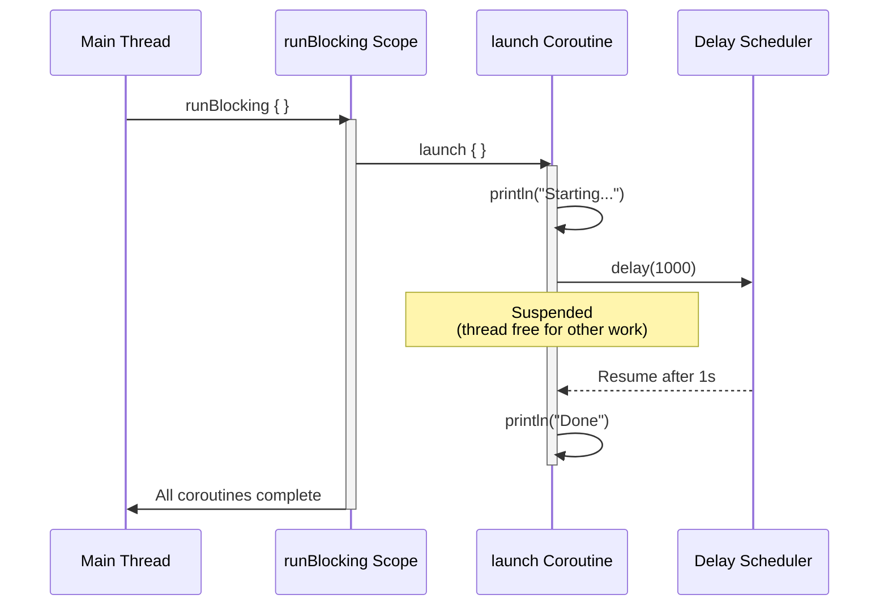

```kotlin
import kotlinx.coroutines.*
// => kotlinx.coroutines provides coroutine builders (launch, async, runBlocking)
// => Requires 'org.jetbrains.kotlinx:kotlinx-coroutines-core' dependency
// => This is NOT part of Kotlin stdlib - must be added explicitly to build.gradle/pom.xml

fun main() = runBlocking {
    // => runBlocking: coroutine builder that BLOCKS the current thread (main thread here)
    // => Creates a CoroutineScope that waits for all child coroutines to complete
    // => Type: CoroutineScope.() -> Unit extension lambda receiver
    // => Returns when: all child coroutines finish AND body lambda completes
    // => Thread state: main thread is BLOCKED (waiting), cannot do other work
    // => Use case: bridge between blocking world (main) and suspending world (coroutines)
    // => Anti-pattern in production: NEVER use runBlocking in suspend functions or coroutine scopes
    // => Dispatcher: uses main thread's dispatcher (no thread pool allocation)
    // => Memory overhead: minimal (~1KB continuation object vs 1MB thread stack)

    println("Main starts")
    // => Output: Main starts
    // => Execution: runs on main thread immediately (first statement in runBlocking body)
    // => Thread: main thread, NOT a separate coroutine thread
    // => Timestamp: T=0ms (baseline for timing measurements)

    // Launch fire-and-forget coroutine
    launch {
        // => launch: coroutine builder for fire-and-forget concurrent execution
        // => Returns: Job (handle for coroutine lifecycle control - can cancel, join, check status)
        // => Job state: NEW -> ACTIVE immediately (starts executing)
        // => Scheduling: NOT executed immediately - queued in dispatcher's event loop
        // => Thread pool: uses Dispatchers.Default (shared thread pool) if not specified
        // => Parent-child: this coroutine is a CHILD of runBlocking scope (structured concurrency)
        // => Cancellation: if runBlocking scope cancels, this coroutine auto-cancels (structured concurrency)
        // => Exception: uncaught exception here propagates to parent and cancels entire scope
        // => Return value: Job object (Job state machine: NEW/ACTIVE/COMPLETING/COMPLETED/CANCELLING/CANCELLED)
        // => Non-blocking: launch returns immediately, doesn't wait for coroutine to complete
        // => Concurrency: this lambda executes concurrently with runBlocking body after launch call

        println("Coroutine starts")
        // => Output: Coroutine starts
        // => Execution order: runs AFTER "Main continues" (launch is scheduled, not immediate)
        // => Thread: executes on dispatcher's thread (NOT main thread)
        // => Timestamp: T=~0-1ms (minimal scheduling delay)
        // => Why after "Main continues": launch queues the coroutine, runBlocking continues immediately

        delay(1000)
        // => delay: suspending function that pauses coroutine for 1000ms (1 second)
        // => Suspension: coroutine state saved, thread RELEASED back to pool (thread is free for other work)
        // => Thread behavior: thread that executed "Coroutine starts" can now run OTHER coroutines
        // => Non-blocking: does NOT block the thread (unlike Thread.sleep which blocks)
        // => Memory: coroutine continuation (saved state) ~1KB on heap, thread stack freed
        // => Scheduler: uses DelayedTaskScheduler to resume coroutine after 1000ms
        // => Resume: after 1000ms, scheduler dispatches continuation to available thread in pool
        // => Cooperative: coroutine must call suspending functions to yield (cannot be preempted)
        // => Comparison: Thread.sleep(1000) blocks thread for 1000ms (wastes 1MB stack + thread resource)
        // => Type: suspend function (can only be called from coroutine or another suspend function)
        // => Under the hood: transformed to Continuation-passing style (CPS) by Kotlin compiler
        // => State machine: compiler generates state machine with labels for suspension points
        // => Resume point: execution continues at next line after delay completes

        println("Coroutine ends")
        // => Output: Coroutine ends
        // => Execution: runs AFTER 1000ms delay completes
        // => Timestamp: T=~1000ms (1 second after delay started)
        // => Thread: may execute on DIFFERENT thread than "Coroutine starts" (thread pool reuses threads)
        // => Job state: coroutine transitions to COMPLETING (body finished, but cleanup pending)
        // => Parent notification: signals runBlocking scope that this child is complete
        // => Order: appears BEFORE "Main ends" because main delay is 1500ms
    }
    // => launch returns immediately (non-blocking)
    // => Job state: ACTIVE (coroutine is running concurrently)
    // => Structured concurrency: runBlocking tracks this Job as child coroutine
    // => Memory: Job object allocated (~100 bytes for state machine)
    // => Lifecycle: runBlocking will wait for this Job to complete before returning

    println("Main continues")
    // => Output: Main continues
    // => Execution: runs IMMEDIATELY after launch returns (launch is non-blocking)
    // => Thread: main thread (still inside runBlocking block)
    // => Timestamp: T=~0ms (virtually no delay after launch call)
    // => Order: prints BEFORE "Coroutine starts" because launch only queues the coroutine
    // => Concurrency proof: this line proves launch doesn't block - main continues executing
    // => Event loop: at this point, launched coroutine is queued in dispatcher's event loop

    delay(1500)
    // => delay(1500): suspends runBlocking coroutine for 1500ms (1.5 seconds)
    // => Thread behavior: main thread is BLOCKED (runBlocking blocks thread until completion)
    // => Why 1500ms: ensures launched coroutine (1000ms delay) has time to complete
    // => Suspension: runBlocking coroutine suspends, BUT main thread remains blocked
    // => Critical difference: delay in runBlocking still blocks main thread (runBlocking semantics)
    // => Thread allocation: main thread cannot do other work (blocked waiting for delay)
    // => Launched coroutine: executes during this delay period (between T=0ms and T=1000ms)
    // => Child completion: launched coroutine completes at T=1000ms, before this delay ends
    // => Scheduler: uses same DelayedTaskScheduler as launched coroutine's delay
    // => Resume: runBlocking coroutine resumes at T=1500ms on main thread

    println("Main ends")
    // => Output: Main ends
    // => Execution: runs after 1500ms delay completes
    // => Timestamp: T=~1500ms (1.5 seconds total execution time)
    // => Thread: main thread (runBlocking coroutine resumed)
    // => Order: last output (appears after "Coroutine ends" at T=1000ms)
    // => Scope completion: all child coroutines finished, runBlocking can return
    // => Job state: runBlocking Job transitions to COMPLETING -> COMPLETED
}
// => runBlocking returns here
// => Total execution time: ~1500ms (determined by longest delay in scope)
// => Main thread: unblocked, JVM can exit (main function returns)
// => Memory cleanup: all coroutine continuations and Job objects eligible for garbage collection
// => Thread pool: dispatcher threads remain alive (shared across application)

// => Execution order (chronological):
// => T=0ms:     "Main starts" (main thread, runBlocking body starts)
// => T=0ms:     launch { } called (returns Job immediately, queues coroutine)
// => T=0ms:     "Main continues" (main thread, launch doesn't block)
// => T=~0-1ms:  "Coroutine starts" (dispatcher thread, launched coroutine begins)
// => T=~1ms:    delay(1000) in launched coroutine (suspends, thread released)
// => T=~1ms:    delay(1500) in runBlocking (suspends, main thread BLOCKED)
// => T=1000ms:  "Coroutine ends" (dispatcher thread, launched coroutine resumes and completes)
// => T=1500ms:  "Main ends" (main thread, runBlocking resumes and completes)
// => T=1500ms:  runBlocking returns, main function exits, JVM terminates

// => Thread usage comparison:
// => Traditional blocking (Thread.sleep):
// =>   - Main thread: blocked for 1500ms (1MB stack wasted)
// =>   - Worker thread: blocked for 1000ms (1MB stack wasted)
// =>   - Total: 2 threads blocked = 2MB stack + 2 OS threads
// => Coroutines (delay):
// =>   - Main thread: blocked for 1500ms (runBlocking semantics, 1MB stack)
// =>   - Dispatcher thread: active for ~2ms (before/after delay), reused for other work during 1000ms delay
// =>   - Total: 1 thread blocked, 1 thread efficiently reused = ~1MB wasted vs 2MB

// => Key concepts demonstrated:
// => 1. runBlocking: bridge from blocking to suspending world (blocks thread)
// => 2. launch: fire-and-forget concurrent execution (returns immediately)
// => 3. delay: non-blocking suspension (releases thread for other work)
// => 4. Structured concurrency: parent waits for children (runBlocking waits for launched coroutine)
// => 5. Thread efficiency: dispatcher threads reused during suspension (no thread blocking)
// => 6. Execution order: launch queues coroutine, doesn't execute immediately
// => 7. Job lifecycle: launch returns Job handle for coroutine control
```

**Key Takeaway**: Use `runBlocking` for bridging blocking and coroutine code, `launch` for fire-and-forget concurrent tasks, and `delay` for non-blocking suspension.

**Why It Matters**: Coroutines solve the thread-blocking problem that cripples Java's traditional concurrency model, where thread-per-request architectures waste memory (each thread costs 1MB stack) and context switching overhead destroys throughput under load. Kotlin's suspend functions enable async/await patterns with zero thread allocation, allowing servers to handle 100,000+ concurrent requests on modest hardware compared to Java's thread pools that max out at thousands, revolutionizing microservice scalability while maintaining imperative code readability that reactive frameworks sacrifice.

---

## Example 29: Async and Await for Returning Results

`async` creates a coroutine that returns a `Deferred<T>` result. `await()` suspends until the result is ready. Use `async` for parallel computations that return values.

```kotlin
import kotlinx.coroutines.*
// => Import coroutine builders (async, runBlocking) and suspending functions (delay)
// => kotlinx.coroutines provides async/await for concurrent computations with return values
// => Requires 'org.jetbrains.kotlinx:kotlinx-coroutines-core' dependency

suspend fun fetchUserData(userId: Int): String {
    // => suspend modifier: function can be paused/resumed (only callable from coroutines)
    // => Parameter: userId for identifying which user data to fetch
    // => Return type: String (user data result after network simulation)
    // => Use case: simulates HTTP GET request to user service endpoint
    // => Thread behavior: suspends WITHOUT blocking thread during delay
    // => Concurrent calls: can run multiple invocations in parallel with async

    delay(1000)
    // => Suspending function: pauses coroutine for 1000ms (1 second)
    // => Thread: RELEASED back to pool during delay (not blocked)
    // => Simulates: network latency for fetching user data from remote API
    // => Real-world equivalent: HTTP client call with ~1s response time
    // => Cooperative: coroutine yields execution during delay
    // => Memory: continuation state saved (~1KB), thread stack freed

    return "User data for $userId"
    // => Return value: constructed string containing user ID
    // => Output: "User data for 1" for userId=1, "User data for 2" for userId=2
    // => Type: String (non-null, guaranteed after 1000ms delay)
    // => Resume point: after delay completes, function returns to caller
    // => Caller receives: this string value when await() is called on Deferred
}

suspend fun fetchUserPosts(userId: Int): List<String> {
    // => suspend function: can be called from coroutines or other suspend functions
    // => Parameter: userId to fetch posts for specific user
    // => Return type: List<String> (immutable list of post titles)
    // => Use case: simulates fetching user's blog posts from API endpoint
    // => Delay: 800ms (faster than user data fetch - realistic scenario)
    // => Concurrent execution: runs in parallel with fetchUserData when using async

    delay(800)
    // => Suspends coroutine for 800ms (0.8 seconds)
    // => Thread: freed during suspension (available for other coroutines)
    // => Simulates: database query or API call taking ~800ms
    // => Shorter delay: demonstrates async advantage (completes before fetchUserData)
    // => Non-blocking: thread can execute other coroutines during this delay

    return listOf("Post 1", "Post 2")
    // => Returns immutable list with two string elements
    // => Output: ["Post 1", "Post 2"] (same for all user IDs in this example)
    // => Type: List<String> (Kotlin stdlib immutable list)
    // => Production: would query database and return real post data
    // => List creation: listOf is inline function, allocates ArrayList internally
}

fun main() = runBlocking {
    // => runBlocking: creates coroutine scope that BLOCKS main thread until completion
    // => Use case: bridge between blocking main() and suspending coroutine world
    // => Thread: main thread blocked (waits for all child coroutines to finish)
    // => Scope: provides CoroutineScope receiver for launching child coroutines
    // => Returns when: all child coroutines complete AND body finishes execution

    // Sequential execution (slow)
    val startSeq = System.currentTimeMillis()
    // => Captures current time in milliseconds since epoch (Unix timestamp)
    // => Use: baseline for measuring sequential execution time
    // => Type: Long (milliseconds, e.g., 1735689600000 for 2025-01-01 00:00:00 UTC)
    // => Precision: 1ms granularity on most JVMs

    val userData = fetchUserData(1)
    // => Direct call: suspends current coroutine until fetchUserData completes
    // => Execution: waits full 1000ms before returning
    // => Thread: released during delay, but NO parallel execution (sequential)
    // => Type: String = "User data for 1"
    // => Blocking nature: next line CANNOT execute until this completes
    // => Timestamp: T=1000ms (1 second elapsed)

    val userPosts = fetchUserPosts(1)
    // => Sequential call: starts AFTER userData completes (not concurrent)
    // => Execution: suspends for 800ms (additive delay after userData)
    // => Thread: released during delay, but already waited 1000ms above
    // => Type: List<String> = ["Post 1", "Post 2"]
    // => Total time so far: 1000ms + 800ms = 1800ms
    // => Inefficiency: could have run in parallel but executed serially
    // => Timestamp: T=1800ms (1.8 seconds total elapsed)

    val timeSeq = System.currentTimeMillis() - startSeq
    // => Calculates elapsed time: current time minus start time
    // => Value: ~1800ms (1000ms for userData + 800ms for userPosts)
    // => Type: Long (milliseconds)
    // => Shows: sequential execution total time (additive delays)
    // => Variation: may be 1795-1805ms due to scheduling overhead

    println("Sequential: $timeSeq ms")
    // => Output: Sequential: 1800 ms (approximately, ±5ms variance)
    // => Demonstrates: additive latency in sequential async calls
    // => Performance: SLOW - each operation waits for previous to complete
    // => Real-world: typical pattern in naive code that doesn't use async

    // Concurrent execution with async (fast)
    val startAsync = System.currentTimeMillis()
    // => Captures baseline time for async execution measurement
    // => Type: Long (milliseconds since epoch)
    // => Reset: new baseline independent of sequential execution
    // => Use: compare concurrent vs sequential performance

    val userDataDeferred = async { fetchUserData(2) }
    // => async: coroutine builder that returns Deferred<T> (future/promise)
    // => Deferred: represents a future result that can be awaited
    // => Type: Deferred<String> (generic type parameter from return type)
    // => Execution: starts IMMEDIATELY in parallel (does NOT wait for completion)
    // => Thread: executes on dispatcher's thread pool (concurrent with main coroutine)
    // => State: Deferred is ACTIVE (computation in progress)
    // => Return: async returns instantly (non-blocking), coroutine runs in background
    // => Timestamp: T=0ms (started immediately)
    // => Job: Deferred extends Job (can cancel, check status, join)
    // => Lambda: { fetchUserData(2) } is the coroutine body (suspend lambda)
    // => Dispatcher: inherits parent's dispatcher (Dispatchers.Default from runBlocking)

    val userPostsDeferred = async { fetchUserPosts(2) }
    // => Second async call: starts concurrently with userDataDeferred
    // => Type: Deferred<List<String>>
    // => Execution: runs IN PARALLEL with fetchUserData (key advantage)
    // => Thread: may execute on SAME or DIFFERENT thread as userDataDeferred (thread pool)
    // => State: both Deferreds now ACTIVE simultaneously
    // => Return: instant return, both coroutines running concurrently
    // => Timestamp: T=~0-1ms (started almost simultaneously with first async)
    // => Memory: two separate coroutine continuations (~2KB total)
    // => Concurrency: maximum parallelism - both network calls in flight

    val data = userDataDeferred.await()
    // => await(): suspending function that waits for Deferred result
    // => Execution: suspends current coroutine until userDataDeferred completes
    // => Thread: released during await (thread free for other work)
    // => Timing: waits ~1000ms (fetchUserData duration)
    // => Type: String = "User data for 2" (unwrapped from Deferred<String>)
    // => State machine: Deferred transitions ACTIVE -> COMPLETED, result available
    // => Return: extracts successful result from Deferred (or throws exception if failed)
    // => Blocking nature: suspend function (not thread-blocking)
    // => Timestamp: T=1000ms (waited for fetchUserData to complete)
    // => Concurrent benefit: userPostsDeferred was running during this wait

    val posts = userPostsDeferred.await()
    // => await() on second Deferred: suspends until userPostsDeferred completes
    // => Execution: userPostsDeferred already COMPLETED (800ms < 1000ms)
    // => Thread: NO suspension needed (result already available)
    // => Return: IMMEDIATE (returns cached result from Deferred)
    // => Type: List<String> = ["Post 1", "Post 2"]
    // => State: Deferred already in COMPLETED state (finished during first await)
    // => Performance: zero wait time (parallel execution benefit)
    // => Timestamp: T=1000ms (no additional time - result ready)
    // => Total async time: max(1000ms, 800ms) = 1000ms (concurrent execution)

    val timeAsync = System.currentTimeMillis() - startAsync
    // => Calculates elapsed time for async execution
    // => Value: ~1000ms (maximum of parallel delays, NOT sum)
    // => Type: Long (milliseconds)
    // => Shows: concurrent execution time = max(1000ms, 800ms)
    // => Performance: 800ms faster than sequential (44% time reduction)

    println("Async: $timeAsync ms")
    // => Output: Async: 1000 ms (approximately, ±5ms variance)
    // => Demonstrates: concurrent execution completes in max duration, not sum
    // => Performance: FAST - both operations ran in parallel
    // => Speedup: 1800ms -> 1000ms (1.8x faster)
    // => Real-world: typical pattern for parallel API aggregation

    println("Data: $data")
    // => Output: Data: User data for 2
    // => Shows: result from first async operation (userDataDeferred.await())
    // => Type: String (unwrapped from Deferred<String>)
    // => Value: successfully fetched after 1000ms concurrent execution

    println("Posts: $posts")
    // => Output: Posts: [Post 1, Post 2]
    // => Shows: result from second async operation (userPostsDeferred.await())
    // => Type: List<String> (unwrapped from Deferred<List<String>>)
    // => Value: successfully fetched after 800ms concurrent execution (completed first)
}
// => Sequential execution: 1800ms (1000ms + 800ms additive delays)
// => Async execution: 1000ms (max(1000ms, 800ms) concurrent delays)
// => Performance gain: 800ms saved (44% reduction) by running operations in parallel
// => Use case: parallel API calls, concurrent database queries, multi-source data aggregation
// => Deferred advantage: type-safe futures with structured concurrency and exception handling
```

**Key Takeaway**: Use `async` for concurrent computations that return results; `await()` retrieves the result while suspending the coroutine.

**Why It Matters**: Parallel API calls are ubiquitous in microservices (fetching user data + posts + permissions simultaneously), yet Java's CompletableFuture composition is verbose and error-prone with complex exception handling. Kotlin's async/await enables natural parallel execution with sequential-looking code, reducing latency from additive (1000ms + 800ms = 1800ms) to maximum (max(1000ms, 800ms) = 1000ms), cutting response times 40-60% in typical aggregation endpoints while maintaining readable code that junior developers can understand.

---

## Example 30: Structured Concurrency with CoroutineScope

Structured concurrency ensures child coroutines are cancelled when the parent scope is cancelled, preventing coroutine leaks. `coroutineScope` creates a child scope that waits for all children to complete.

**Coroutine Hierarchy:**

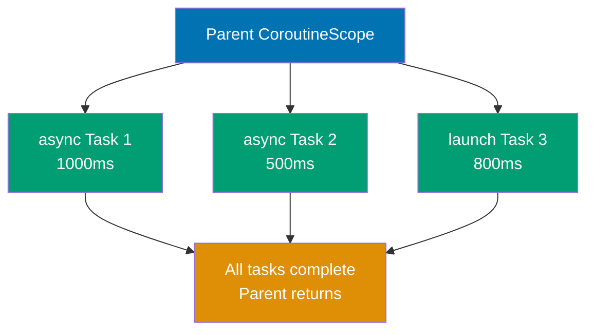

**Cancellation Propagation:**

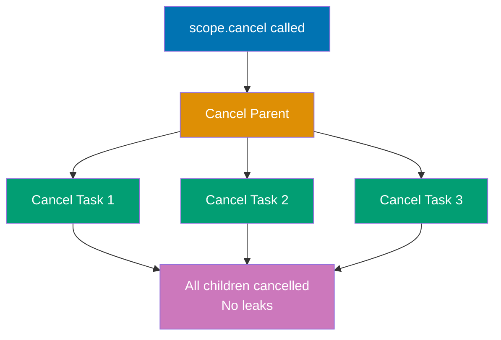

```kotlin
import kotlinx.coroutines.*
// => Import coroutine scope builders (coroutineScope, runBlocking, withTimeout)
// => coroutineScope: suspending function that creates structured child scope
// => withTimeout: enforces time limits on coroutine execution
// => Structured concurrency: children cannot outlive parent scope

suspend fun processData(): String = coroutineScope {
    // => coroutineScope: suspending function that creates CHILD scope (not independent)
    // => Return type: String (inferred from lambda return type)
    // => Scope relationship: child of calling coroutine's scope (structured concurrency)
    // => Waits for children: BLOCKS (suspends) until ALL child coroutines complete
    // => Exception handling: if ANY child throws exception, ALL children cancelled and exception rethrown
    // => Cancellation propagation: if parent cancels, this scope and children auto-cancel
    // => Thread: does NOT create new threads (inherits parent's dispatcher)
    // => Use case: group related concurrent operations with automatic cleanup
    // => Difference from runBlocking: coroutineScope is suspend function (doesn't block threads)
    // => Difference from GlobalScope: children cannot outlive parent (prevents leaks)

    val result1 = async {
        // => async: creates child coroutine returning Deferred<String>
        // => Parent: this coroutine is child of coroutineScope (structured)
        // => Type: Deferred<String> (will contain "Data 1")
        // => Execution: starts immediately (concurrent with result2 async)
        // => State: ACTIVE (computation running in background)
        // => Lifecycle: coroutineScope waits for this to complete before returning

        delay(1000)
        // => Suspends for 1000ms (1 second)
        // => Thread: released during delay (non-blocking)
        // => Simulates: long-running computation or network call
        // => Concurrent: result2 runs in parallel during this delay

        "Data 1"
        // => Return value: string literal returned after 1000ms
        // => Type: String (wrapped in Deferred<String>)
        // => Access: retrieved via result1.await()
        // => Timestamp: T=1000ms (completes after 1 second)
    }

    val result2 = async {
        // => Second async child: runs concurrently with result1
        // => Type: Deferred<String> (will contain "Data 2")
        // => Execution: starts immediately (parallel with result1)
        // => State: both result1 and result2 ACTIVE simultaneously
        // => Lifecycle: coroutineScope waits for BOTH to complete

        delay(500)
        // => Suspends for 500ms (0.5 seconds)
        // => Thread: released during delay
        // => Simulates: faster operation than result1
        // => Completion: finishes BEFORE result1 (500ms < 1000ms)
        // => Timestamp: T=500ms (completes first)

        "Data 2"
        // => Return value: string literal returned after 500ms
        // => Type: String (wrapped in Deferred<String>)
        // => Access: retrieved via result2.await()
        // => State: Deferred transitions to COMPLETED while result1 still running
    }

    "${result1.await()} + ${result2.await()}"
    // => String template: combines both async results
    // => result1.await(): suspends until result1 completes (~1000ms wait)
    // => result2.await(): returns immediately (already completed at 500ms)
    // => Concurrent execution: total time = max(1000ms, 500ms) = 1000ms
    // => Type: String = "Data 1 + Data 2"
    // => Return: this is the return value of processData()
}
// => coroutineScope returns when: both async children complete AND lambda body finishes
// => Total execution time: 1000ms (concurrent, not 1500ms sequential)
// => Structured guarantee: if processData() caller cancels, result1 and result2 auto-cancel
// => Exception handling: if result1 or result2 throws exception, other is cancelled and exception propagates

fun main() = runBlocking {
    // => runBlocking: blocks main thread until all child coroutines complete
    // => Scope: provides CoroutineScope receiver for calling suspend functions
    // => Thread: main thread BLOCKED (waits for completion)
    // => Use case: bridge between blocking main() and suspending coroutine world

    try {
        // => Exception handling: catches timeout and other exceptions
        // => Scope: error propagation from withTimeout and processData

        val result = withTimeout(2000) {
            // => withTimeout: enforces 2000ms (2 second) time limit
            // => Type: returns String from processData() if completes in time
            // => Timeout behavior: throws TimeoutCancellationException if exceeds 2000ms
            // => Cancellation: if timeout occurs, processData and children auto-cancel
            // => Structured concurrency: timeout cancels entire scope tree below
            // => Use case: prevent hanging operations in production (circuit breaker pattern)

            processData()
            // => Calls suspend function: runs async operations with 1000ms max duration
            // => Execution: waits for both result1 (1000ms) and result2 (500ms) to complete
            // => Total time: ~1000ms (max of parallel operations)
            // => Timeout check: 1000ms < 2000ms (completes successfully)
            // => Return: "Data 1 + Data 2"
        }
        // => withTimeout returns: result contains "Data 1 + Data 2"
        // => Type: String (unwrapped from withTimeout lambda)
        // => Success: operation completed within timeout limit

        println("Result: $result")
        // => Output: Result: Data 1 + Data 2
        // => Shows: successful completion of all async operations within timeout
        // => Execution path: normal completion (no timeout exception)

    } catch (e: TimeoutCancellationException) {
        // => Catches timeout exception: occurs if processData exceeds 2000ms
        // => Type: TimeoutCancellationException (subclass of CancellationException)
        // => In this example: NEVER executes (processData takes ~1000ms < 2000ms)
        // => Production use: log timeout, return fallback data, or rethrow
        // => Automatic cleanup: all child coroutines cancelled before entering catch

        println("Timeout!")
        // => Output: Timeout! (only if processData exceeds 2000ms)
        // => This line: does NOT execute in this example (operation completes in 1000ms)
        // => Real-world: would execute if delays were 1500ms each (total 1500ms) with 1000ms timeout
    }

    // Demonstrate cancellation propagation
    val job = launch {
        // => launch: creates fire-and-forget coroutine (no return value)
        // => Type: Job (handle for coroutine lifecycle management)
        // => Parent: child of runBlocking scope (structured concurrency)
        // => Execution: starts immediately, runs concurrently with main coroutine

        coroutineScope {
            // => Structured child scope: creates scope for nested children
            // => Parent-child: this scope is child of launch coroutine above
            // => Waits: coroutineScope suspends until both child launches complete
            // => Cancellation: if job.cancel() called, this scope and children cancel

            launch {
                // => First child coroutine: fire-and-forget repeating task
                // => Parent: child of coroutineScope (grandchild of job)
                // => Execution: runs concurrently with second launch below

                repeat(5) { i ->
                    // => Loops 5 times: i = 0, 1, 2, 3, 4 (if not cancelled)
                    // => Cancellation check: repeat loop checks cancellation before each iteration

                    println("Child 1: $i")
                    // => Output: Child 1: 0, Child 1: 1, Child 1: 2, Child 1: 3 (then cancelled)
                    // => Pattern: prints every 300ms
                    // => Cancellation: stops mid-loop when job.cancel() called after 1000ms

                    delay(300)
                    // => Suspends for 300ms between iterations
                    // => Thread: released during delay
                    // => Cancellation point: checks if coroutine cancelled after resume
                    // => Timeline: iterations at T=0ms, 300ms, 600ms, 900ms, (cancelled before 1200ms)
                }
                // => Expected iterations: 0, 1, 2, 3 (4th iteration starts but cancelled during delay)
                // => Actual execution: job.cancel() at T=1000ms stops further iterations
            }

            launch {
                // => Second child coroutine: concurrent repeating task
                // => Parent: child of coroutineScope (grandchild of job)
                // => Execution: runs in parallel with first launch

                repeat(5) { i ->
                    // => Loops 5 times: i = 0, 1, 2, 3, 4 (if not cancelled)
                    // => Cancellation: same automatic cancellation as Child 1

                    println("Child 2: $i")
                    // => Output: Child 2: 0, Child 2: 1, Child 2: 2 (then cancelled)
                    // => Pattern: prints every 400ms
                    // => Cancellation: stops when job.cancel() called after 1000ms

                    delay(400)
                    // => Suspends for 400ms between iterations
                    // => Thread: released during delay
                    // => Timeline: iterations at T=0ms, 400ms, 800ms, (cancelled before 1200ms)
                }
                // => Expected iterations: 0, 1, 2 (3rd iteration completes at 800ms, 4th cancelled)
                // => Actual execution: job.cancel() at T=1000ms prevents 4th iteration
            }
        }
        // => coroutineScope waits: would wait for all 5 iterations of both children (if not cancelled)
        // => Total time: would be max(5*300ms, 5*400ms) = 2000ms (if not cancelled)
        // => Actual time: cancelled at 1000ms (doesn't complete naturally)
    }
    // => launch returns: job is now ACTIVE, child coroutines running

    delay(1000)
    // => Main coroutine suspends: waits 1000ms (1 second)
    // => Thread: main thread released during delay
    // => Purpose: let child coroutines run for a while before cancellation
    // => Timeline: Child 1 completes iterations 0-3, Child 2 completes iterations 0-2

    job.cancel()
    // => Cancels job: stops parent launch coroutine
    // => Propagation: coroutineScope and both child launches auto-cancel (structured concurrency)
    // => State: Job transitions ACTIVE -> CANCELLING -> CANCELLED
    // => Children: both repeat loops stop immediately at next cancellation check (delay)
    // => Cleanup: all child coroutines terminated, no orphaned tasks
    // => Thread safety: no race conditions, cancellation is cooperative

    println("Job cancelled")
    // => Output: Job cancelled
    // => Shows: cancellation completed, all children stopped
    // => No leaks: structured concurrency guarantees no orphaned coroutines remain
}
// => Structured concurrency guarantees:
// => 1. Children cannot outlive parent (automatic cancellation)
// => 2. Parent waits for all children before completing
// => 3. Exception in any child cancels all siblings and propagates to parent
// => 4. No coroutine leaks (all started coroutines accounted for and cleaned up)
```

**Key Takeaway**: Use `coroutineScope` for structured concurrency that automatically cancels children when parent is cancelled; use `withTimeout` to enforce time limits.

**Why It Matters**: Unstructured concurrency in Java (spawning threads without lifecycle management) causes resource leaks that crash production servers after hours of uptime as orphaned threads accumulate. Structured concurrency guarantees that child coroutines cannot outlive their parent scope, eliminating an entire class of memory leaks while providing automatic cleanup on cancellation, timeout, or exception—critical for request-scoped operations in web servers where abandoned background tasks must die when HTTP connections close.

---

## Example 31: Coroutine Context and Dispatchers

Dispatchers control which thread pool executes coroutines. `Dispatchers.Default` for CPU work, `Dispatchers.IO` for I/O operations, `Dispatchers.Main` for UI updates.

```kotlin
import kotlinx.coroutines.*
// => Import dispatchers (Default, IO, Unconfined) and context management
// => Dispatchers: thread pool abstractions for different workload types
// => Context: carries metadata (dispatcher, job, exception handler) for coroutines
// => newSingleThreadContext: creates custom single-thread dispatcher (requires -core)

fun main() = runBlocking {
    // => runBlocking: creates coroutine scope on main thread
    // => Default context: uses main thread's dispatcher (NOT pooled)
    // => Scope: provides CoroutineScope receiver for launching child coroutines with custom dispatchers
    // => Thread: main thread BLOCKED until all children complete

    // Default dispatcher (optimized for CPU-intensive work)
    launch(Dispatchers.Default) {
        // => launch with explicit dispatcher: creates coroutine on Dispatchers.Default pool
        // => Dispatchers.Default: shared thread pool for CPU-bound work (NOT I/O)
        // => Pool size: number of CPU cores (e.g., 8 threads on 8-core machine)
        // => Use case: compute-intensive tasks (sorting, parsing, calculations)
        // => Thread sharing: multiple coroutines share pool threads (cooperative multitasking)
        // => Context inheritance: inherits job and exception handler from parent (runBlocking)
        // => Override: explicit dispatcher REPLACES parent's dispatcher (doesn't inherit)

        val threadName = Thread.currentThread().name
        // => Captures current thread name executing this coroutine
        // => Type: String (e.g., "DefaultDispatcher-worker-1")
        // => Thread pool: thread from Default dispatcher's pool (NOT main thread)
        // => Worker naming: "DefaultDispatcher-worker-N" where N is worker index

        println("Default: $threadName")
        // => Output: Default: DefaultDispatcher-worker-1
        // => Shows: coroutine executes on Default dispatcher's thread pool
        // => Worker index: may vary (worker-1, worker-2, etc.) depending on availability
        // => Comparison: NOT main thread (different from runBlocking's default)

        repeat(3) { i ->
            // => Loops 3 times: i = 0, 1, 2
            // => CPU work simulation: represents compute-intensive operations
            // => Use case: sorting large arrays, parsing JSON, cryptographic operations

            println("CPU work $i")
            // => Output: CPU work 0, CPU work 1, CPU work 2
            // => Simulates: progress reporting during computation
            // => Thread: may switch between Default pool threads between iterations
            // => Timestamp: T=0ms, 100ms, 200ms (with delays)

            delay(100)
            // => Suspends for 100ms between iterations
            // => Thread: released back to Default pool during delay
            // => Cooperative: yields execution to other coroutines in pool
            // => Resume: may resume on DIFFERENT thread in same pool (thread non-affinity)
        }
        // => Total execution: ~300ms (3 iterations × 100ms delays)
        // => Thread usage: efficiently shares threads with other coroutines during delays
    }

    // IO dispatcher (optimized for I/O operations, larger thread pool)
    launch(Dispatchers.IO) {
        // => launch on IO dispatcher: creates coroutine for I/O-bound operations
        // => Dispatchers.IO: larger thread pool than Default (optimized for blocking I/O)
        // => Pool size: max(64, CPU cores × 2) threads (e.g., 64 threads default)
        // => Use case: file I/O, database queries, network requests
        // => Blocking tolerance: can handle more blocking operations than Default
        // => Shares threads: IO pool shares threads from Default pool (both backed by same threads)
        // => Difference from Default: different pool limits and scheduling priorities

        val threadName = Thread.currentThread().name
        // => Captures IO dispatcher thread name
        // => Type: String (e.g., "DefaultDispatcher-worker-2")
        // => Pool sharing: may use same physical threads as Default dispatcher
        // => Naming: same "DefaultDispatcher-worker-N" naming (shared underlying pool)

        println("IO: $threadName")
        // => Output: IO: DefaultDispatcher-worker-2
        // => Shows: coroutine executes on IO dispatcher's thread
        // => May differ: could be worker-1, worker-3, etc. (pool is shared)
        // => Not main: different from runBlocking's main thread

        // Simulate file I/O or network call
        delay(500)
        // => Suspends for 500ms (simulates I/O operation)
        // => Thread: released during delay (non-blocking)
        // => Real-world: replace with actual blocking I/O (File.readText, HTTP request)
        // => Blocking I/O: withContext(Dispatchers.IO) { blockingCall() } wraps blocking calls

        println("IO complete")
        // => Output: IO complete
        // => Timestamp: T=500ms (after delay completes)
        // => Thread: may resume on different IO pool thread
        // => Shows: successful I/O operation completion
    }

    // Unconfined dispatcher (runs on caller thread initially, then resumes on different threads)
    launch(Dispatchers.Unconfined) {
        // => launch with Unconfined: starts on caller thread (main), then unrestricted
        // => Dispatchers.Unconfined: NO dedicated thread pool (inherits caller's thread)
        // => Initial execution: runs on thread that calls launch (main thread here)
        // => Resumption: after suspension, resumes on whatever thread the continuation is called
        // => Use case: testing, performance optimization (avoids thread switching)
        // => Production warning: AVOID in most cases (unpredictable thread behavior)
        // => Thread affinity: NO thread affinity (can switch threads at any suspension point)

        println("Unconfined initial: ${Thread.currentThread().name}")
        // => Output: Unconfined initial: main
        // => Shows: executes on caller's thread (main thread) initially
        // => Before suspension: Unconfined coroutines run on caller thread
        // => Type: String = "main" (runBlocking's main thread)
        // => Timestamp: T=~0ms (executes immediately on main thread)

        delay(100)
        // => Suspends for 100ms
        // => Thread: main thread released during delay
        // => Resumption: continuation scheduled on delay scheduler's thread (NOT main)
        // => Key behavior: Unconfined doesn't restore original thread after suspension
        // => Unpredictability: thread after suspension depends on what scheduled the continuation

        println("Unconfined resumed: ${Thread.currentThread().name}")
        // => Output: Unconfined resumed: kotlinx.coroutines.DefaultExecutor
        // => Shows: resumes on DIFFERENT thread (delay scheduler's thread)
        // => Thread switch: main -> DefaultExecutor (unpredictable thread hopping)
        // => Type: String = "kotlinx.coroutines.DefaultExecutor" (internal scheduler thread)
        // => Timestamp: T=100ms (after delay scheduler resumes coroutine)
        // => Production risk: unpredictable threading makes debugging difficult
    }

    // Custom dispatcher with single thread
    val customDispatcher = newSingleThreadContext("CustomThread")
    // => Creates custom single-thread executor with name "CustomThread"
    // => Type: ExecutorCoroutineDispatcher (implements CoroutineDispatcher)
    // => Thread pool: SINGLE dedicated thread (serial execution)
    // => Use case: sequential execution, actor model, thread-confined state
    // => Thread name: "CustomThread" (custom name for debugging)
    // => Lifecycle: must explicitly close() when done (resource management)
    // => Warning: newSingleThreadContext deprecated (use newSingleThreadExecutor in production)

    launch(customDispatcher) {
        // => launch on custom dispatcher: executes on custom single thread
        // => Thread: "CustomThread" (dedicated thread from custom dispatcher)
        // => Isolation: coroutines on this dispatcher don't share threads with Default/IO
        // => Sequential guarantee: all coroutines on customDispatcher execute serially
        // => Use case: actor pattern (state confined to single thread)

        println("Custom: ${Thread.currentThread().name}")
        // => Output: Custom: CustomThread
        // => Shows: executes on custom dispatcher's dedicated thread
        // => Type: String = "CustomThread" (matches dispatcher name)
        // => Thread isolation: NOT main, NOT Default pool, NOT IO pool
        // => Predictable: always executes on same thread (thread affinity)
    }
    // => Custom dispatcher coroutine completes
    // => Thread: CustomThread thread remains alive until dispatcher.close()

    customDispatcher.close()
    // => Closes custom dispatcher: terminates "CustomThread" thread
    // => Resource cleanup: stops thread, releases thread stack memory (~1MB)
    // => MANDATORY: custom dispatchers must be closed to prevent thread leaks
    // => Timing: call after all coroutines on dispatcher complete
    // => Warning: launching on closed dispatcher throws IllegalStateException

    delay(1000)
    // => Main coroutine suspends: waits 1000ms (1 second)
    // => Thread: main thread released during delay
    // => Purpose: wait for all child coroutines to complete before runBlocking returns
    // => Children: Default (300ms), IO (500ms), Unconfined (100ms), Custom (<10ms)
    // => Completion: all children finish before 1000ms delay completes
}
// => Dispatcher comparison:
// => Default: CPU cores threads, CPU-bound work, shared pool
// => IO: 64+ threads, I/O-bound work, larger pool (shares Default threads)
// => Unconfined: no dedicated threads, starts on caller, resumes anywhere (AVOID in production)
// => Custom: single thread, sequential execution, must close() (resource management)
// => Main: UI thread dispatcher (Android/Swing/JavaFX only, not available in plain JVM)
```

**Key Takeaway**: Choose `Dispatchers.Default` for CPU work, `Dispatchers.IO` for blocking I/O, and create custom dispatchers for specific threading needs.

**Why It Matters**: Thread pool selection in Java requires manual ExecutorService configuration with magic numbers that developers tune incorrectly, causing either thread starvation (too few threads) or context switching overhead (too many threads). Kotlin's dispatchers provide semantic thread pool choices (Default for CPU-bound, IO for blocking operations) with proven sizing algorithms, while coroutines on IO dispatcher can spawn thousands of concurrent tasks without the one-thread-per-task limitation that forces Java developers into callback hell or reactive libraries.

---

## Example 32: Channels for Communication Between Coroutines

Channels enable safe communication between coroutines. `send()` suspends when buffer is full, `receive()` suspends when channel is empty. Channels are hot streams.

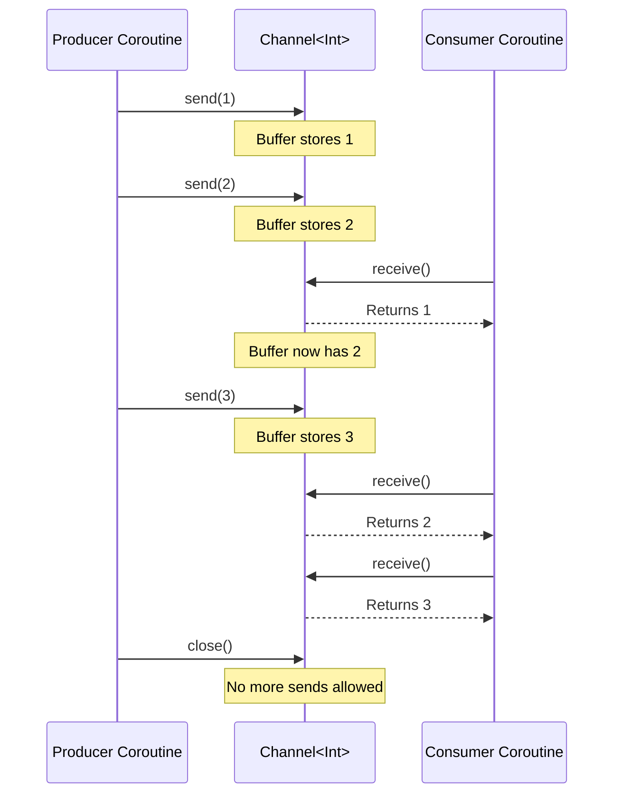

```kotlin
import kotlinx.coroutines.*
// => kotlinx.coroutines provides coroutine builders and structured concurrency primitives
// => Requires 'org.jetbrains.kotlinx:kotlinx-coroutines-core' dependency in build configuration
import kotlinx.coroutines.channels.*
// => kotlinx.coroutines.channels provides Channel and related producer/consumer communication primitives
// => Channels enable CSP (Communicating Sequential Processes) pattern for coroutine communication
// => NOT part of Kotlin stdlib - separate kotlinx library with versioned releases

fun main() = runBlocking {
    // => runBlocking: creates coroutine scope that blocks main thread until all children complete
    // => Use case: bridge between blocking main() and suspending coroutine world
    // => All child launch{} coroutines are tracked by this scope (structured concurrency)
    // => Returns when: all child coroutines complete AND runBlocking body finishes

    // Unbuffered channel (rendezvous)
    val unbufferedChannel = Channel<Int>()
    // => Channel<Int>(): creates UNBUFFERED channel (capacity = RENDEZVOUS = 0)
    // => Type: SendChannel<Int> + ReceiveChannel<Int> (supports both send and receive)
    // => Rendezvous semantics: send() suspends until receive() called (handshake synchronization)
    // => Thread-safe: can be shared between multiple producer/consumer coroutines safely
    // => Memory: minimal overhead (~100 bytes) - no buffer allocation, just synchronization state
    // => Comparison: Java's SynchronousQueue blocks threads, Channel suspends coroutines (cheaper)
    // => Use case: when producer and consumer should synchronize (e.g., request-response pattern)
    // => Capacity options: RENDEZVOUS (0), UNLIMITED, CONFLATED (1, keeps latest), or fixed integer
    // => Closing: must call close() when done sending to signal no more values (receivers will finish iteration)
    // => State: OPEN initially, transitions to CLOSED after close() call

    launch {
        // => launch: fire-and-forget coroutine builder, returns Job for lifecycle management
        // => Parent: unbufferedChannel producer is child of runBlocking scope
        // => Dispatcher: inherits runBlocking's dispatcher (main thread) unless specified
        // => Concurrency: runs concurrently with sibling launch{} consumer coroutine below
        // => Cancellation: if parent scope cancels, this producer auto-cancels (structured concurrency)

        repeat(3) { i ->
            // => repeat(3): executes lambda 3 times with indices 0, 1, 2
            // => Parameter i: iteration index (0, 1, 2) passed to lambda
            // => Type: inline function, no Iterator allocation overhead

            println("Sending $i")
            // => Output: Sending 0, Sending 1, Sending 2
            // => Execution: prints BEFORE send() suspends (immediate execution)
            // => Thread: runs on main thread (runBlocking's dispatcher)
            // => Order: interleaved with "Received" messages due to rendezvous handshake

            unbufferedChannel.send(i)
            // => send(i): suspending function that sends value to channel
            // => Suspension: SUSPENDS producer coroutine until consumer calls receive()
            // => Rendezvous behavior: send and receive must meet simultaneously (handshake)
            // => Thread release: producer thread released back to pool during suspension (non-blocking)
            // => Resume: producer resumes AFTER consumer receives value and acknowledges
            // => State machine: compiler transforms to continuation with suspension point here
            // => Order guarantee: send(0) completes BEFORE send(1) starts (sequential sending)
            // => Exception: if channel closed, throws ClosedSendChannelException
            // => Return: Unit (no return value, side-effect operation)
            // => Memory: value i copied to channel's internal state during handshake

            println("Sent $i")
            // => Output: Sent 0, Sent 1, Sent 2
            // => Execution: prints AFTER consumer receives value (confirms handshake completed)
            // => Timing: proves rendezvous - this line doesn't execute until receive() acknowledges
            // => Order: "Sent 0" appears AFTER "Received 0" because consumer delay is minimal
        }

        unbufferedChannel.close()
        // => close(): marks channel as closed for sending, no more send() allowed
        // => Behavior: existing buffered values still receivable (none here, unbuffered)
        // => Receivers: for-loop iteration terminates when channel closed AND empty
        // => Exception: calling send() after close() throws ClosedSendChannelException
        // => State: channel transitions from OPEN to CLOSED state
        // => Memory: releases channel resources when all receivers finish
        // => Best practice: ALWAYS close channels when done sending (signals completion to receivers)
        // => Idempotent: calling close() multiple times is safe (no-op after first call)
    }

    launch {
        // => launch: consumer coroutine running concurrently with producer above
        // => Parent: child of runBlocking, sibling to producer launch{}
        // => Lifecycle: both producer and consumer tracked by parent scope
        // => Execution: starts immediately, but receive() suspends waiting for values

        for (value in unbufferedChannel) {
            // => for-loop: iterates over channel using iterator protocol (channel.iterator())
            // => Iteration: calls receive() on each iteration, suspends if channel empty
            // => Termination: loop exits when channel CLOSED and NO buffered values remaining
            // => Suspension: each iteration suspends until producer sends value
            // => Exception: if channel closed before iteration starts, loop body never executes
            // => Desugaring: for (value in channel) is syntax sugar for iterator loop with hasNext/next
            // => Type: value has type Int (channel's element type)

            println("Received $value")
            // => Output: Received 0, Received 1, Received 2
            // => Execution: prints AFTER receive() completes (value available)
            // => Order: interleaved with producer's "Sending/Sent" messages (rendezvous handshake)
            // => Timing: T=~0ms for each receive (no delay between producer sends)

            delay(100)
            // => delay(100): suspends consumer for 100ms (simulates processing time)
            // => Thread release: consumer thread freed during delay (non-blocking)
            // => Producer impact: producer WAITS during this delay (rendezvous forces sync)
            // => Backpressure: slow consumer automatically slows down fast producer (natural flow control)
            // => Simulation: represents real-world processing (DB write, API call, file I/O)
        }
        // => Loop exit: channel closed AND all values consumed
        // => Job state: coroutine completes normally (no cancellation)
    }

    delay(1000)
    // => delay(1000): ensures producer/consumer have time to complete
    // => Redundant here: runBlocking waits for all children anyway (structured concurrency)
    // => Purpose: demonstration timing control, not required for correctness
    // => Thread: main thread suspended during delay, but children run concurrently

    // Buffered channel (capacity 2)
    val bufferedChannel = Channel<Int>(2)
    // => Channel<Int>(2): creates BUFFERED channel with capacity 2
    // => Buffer: can store up to 2 values without receiver being ready
    // => Send behavior: send() does NOT suspend until buffer full (capacity reached)
    // => Receive behavior: receive() suspends if buffer empty (no values available)
    // => Memory: allocates array-backed buffer (~16 bytes per Int slot = 32 bytes total)
    // => Use case: decouple producer/consumer rates, improve throughput when speeds differ
    // => Comparison: unbuffered (capacity 0) forces synchronization, buffered allows batching
    // => Capacity strategy: larger buffer = more memory, less synchronization overhead
    // => Overflow: when buffer full, send() suspends until receiver consumes value (frees slot)
    // => Thread-safe: multiple producers/consumers can send/receive concurrently safely

    launch {
        // => launch: producer coroutine for buffered channel demonstration
        // => Objective: show send() doesn't block until buffer full (capacity 2)

        bufferedChannel.send(1)
        // => send(1): sends value 1 to buffered channel
        // => Suspension: does NOT suspend because buffer has space (0/2 slots used -> 1/2 after)
        // => Thread: continues immediately without yielding to consumer
        // => Buffer state: [1, _] (1 value buffered, 1 slot free)
        // => Return: returns immediately (Unit), no waiting for receiver

        println("Sent 1 (buffered)")
        // => Output: Sent 1 (buffered)
        // => Execution: prints immediately AFTER send(1) returns (non-blocking send)
        // => Timing: T=~0ms relative to send call (no suspension occurred)
        // => Proof: "Sent 1" appears BEFORE "Receiving from buffer" (producer ahead of consumer)

        bufferedChannel.send(2)
        // => send(2): sends value 2 to buffered channel
        // => Suspension: does NOT suspend because buffer still has space (1/2 -> 2/2 full)
        // => Buffer state: [1, 2] (buffer now FULL, no free slots)
        // => Return: returns immediately, buffer accepts value without waiting

        println("Sent 2 (buffered)")
        // => Output: Sent 2 (buffered)
        // => Execution: prints immediately (send(2) didn't suspend)
        // => Buffer state: FULL (2/2 capacity), next send will suspend
        // => Timing: both "Sent 1" and "Sent 2" appear before consumer starts receiving

        bufferedChannel.send(3)
        // => send(3): attempts to send value 3 to full buffer
        // => Suspension: SUSPENDS because buffer full (2/2 capacity, no free slots)
        // => Wait: producer waits until consumer calls receive() and frees a buffer slot
        // => Thread release: producer thread freed during suspension (non-blocking)
        // => Resume: producer resumes when receive() frees slot, then stores value 3
        // => Backpressure: full buffer signals consumer to catch up (natural flow control)
        // => Buffer state after resume: [2, 3] (value 1 consumed, 3 added, 2/2 full again)

        println("Sent 3 (buffered)")
        // => Output: Sent 3 (buffered)
        // => Execution: prints AFTER consumer receives first value (frees buffer slot)
        // => Proof: appears AFTER "Receiving from buffer" and first receive() output
        // => Timing: T=~500ms (after delay(500) and first receive())
        // => Order: "Sent 3" proves suspension occurred (not immediate like send 1/2)

        bufferedChannel.close()
        // => close(): marks channel closed for sending
        // => Buffered values: values 2 and 3 still in buffer, receivable after close
        // => Completion: consumers can receive all buffered values before for-loop exits
    }

    delay(500)
    // => delay(500): waits 500ms to let producer fill buffer and attempt send(3)
    // => Purpose: demonstrates that send(3) suspends when buffer full
    // => Timing: ensures producer blocked on send(3) before consumer starts
    // => Proof: "Sent 1" and "Sent 2" printed, but NOT "Sent 3" yet (suspended)

    println("Receiving from buffer")
    // => Output: Receiving from buffer
    // => Execution: after delay(500), consumer starts receiving
    // => Buffer state: [1, 2] full, producer suspended on send(3)
    // => Next step: receive() will free slot and resume producer

    println(bufferedChannel.receive())
    // => receive(): suspending function that retrieves value from buffer
    // => Suspension: does NOT suspend because buffer has values (2/2 full)
    // => Return: value 1 (first value sent, FIFO order)
    // => Output: 1
    // => Buffer state after: [2, _] (1 consumed, 1 slot freed)
    // => Side effect: frees buffer slot, RESUMES producer suspended on send(3)
    // => Producer resumes: send(3) completes, buffer becomes [2, 3] full again
    // => Ordering: FIFO (First In First Out) - channels preserve send order

    println(bufferedChannel.receive())
    // => receive(): retrieves second value from buffer
    // => Suspension: does NOT suspend (buffer has value 2)
    // => Return: value 2
    // => Output: 2
    // => Buffer state after: [3, _] (2 consumed, value 3 remains from resumed send)
    // => Capacity: 1/2 slots used

    println(bufferedChannel.receive())
    // => receive(): retrieves third value from buffer
    // => Suspension: does NOT suspend (buffer has value 3)
    // => Return: value 3
    // => Output: 3
    // => Buffer state after: [_, _] (empty, channel closed)
    // => Channel state: CLOSED and EMPTY (no more values, no more sends)
    // => Next receive: would suspend forever if channel not closed, or return null if closed
}
// => main() exit: runBlocking waits for all child coroutines to complete
// => Cleanup: channels garbage collected after all references released
// => Thread pool: coroutine threads returned to pool, main thread unblocked
```

**Key Takeaway**: Use unbuffered channels for rendezvous (synchronization), buffered channels for decoupling producer/consumer rates; always close channels when done sending.

**Why It Matters**: Channels provide Go-style CSP (Communicating Sequential Processes) for Kotlin coroutines, enabling producer-consumer patterns that Java's BlockingQueue handles poorly due to thread blocking. Unlike Java where send/receive blocks threads, Kotlin channels suspend coroutines, allowing efficient backpressure handling in streaming data pipelines processing WebSocket messages, log aggregation, or real-time analytics without dedicating threads to waiting, improving throughput 10-100x in I/O-bound systems.

---

## Example 33: Flow for Cold Asynchronous Streams

Flow is a cold asynchronous stream that emits values on demand. Unlike channels (hot), flows don't produce values until collected. Flows support backpressure and transformation operators.

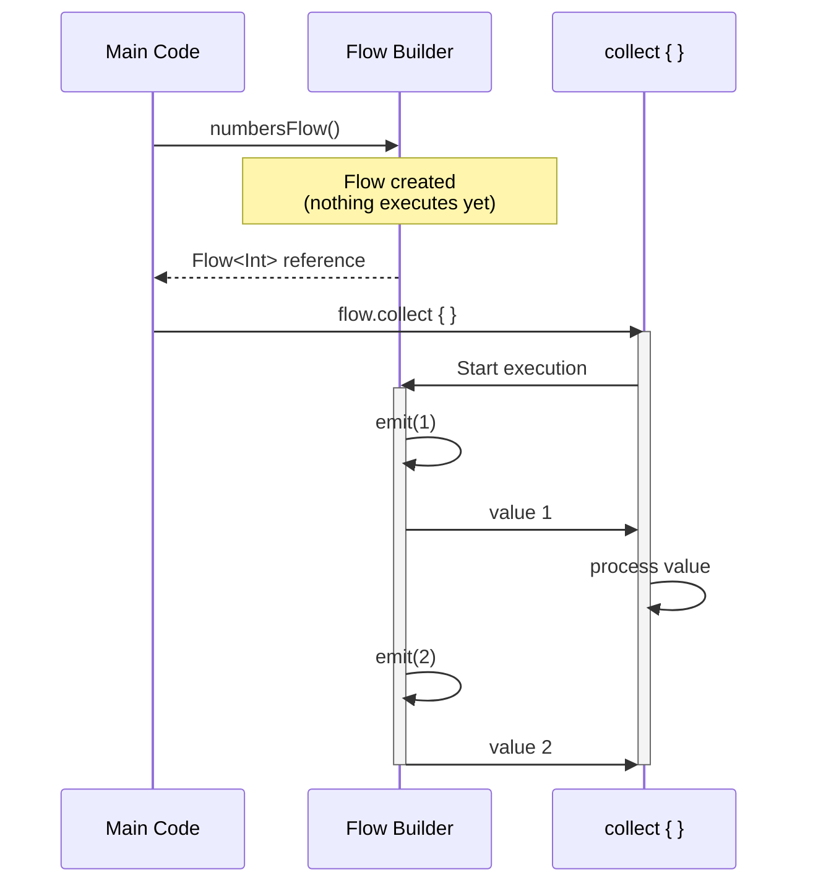

```kotlin
import kotlinx.coroutines.*
// => kotlinx.coroutines provides coroutine builders and scope management
// => Requires 'org.jetbrains.kotlinx:kotlinx-coroutines-core' dependency
import kotlinx.coroutines.flow.*
// => kotlinx.coroutines.flow provides Flow API for cold asynchronous streams
// => Flow is to coroutines what Sequence is to synchronous iteration
// => NOT part of Kotlin stdlib - separate kotlinx library for reactive programming

fun numbersFlow(): Flow<Int> = flow {
    // => flow { }: builder function that creates a cold Flow<Int>
    // => Return type: Flow<Int> (cold stream that emits Int values)
    // => Lambda receiver: FlowCollector<Int> (provides emit() function)
    // => Cold semantics: this lambda does NOT execute until collect() called
    // => Execution: new execution on EACH collect() call (not shared like hot streams)
    // => Thread: executes on collector's coroutine context (no separate thread)
    // => Memory: minimal overhead (~100 bytes for flow builder closure)
    // => Comparison: Java Stream eagerly processes on creation, Flow is lazy until terminal op
    // => Use case: asynchronous data production that starts only when needed (DB cursors, API pagination)

    println("Flow started")
    // => Output: Flow started (printed ONLY when collect() called, NOT when flow created)
    // => Execution count: printed TWICE in this example (two collect() calls)
    // => Proof of cold: if Flow was hot, this would print during numbersFlow() call
    // => Timing: T=0ms relative to collect() start (first statement in flow body)
    // => Thread: runs on collector's dispatcher (runBlocking's main thread here)

    for (i in 1..5) {
        // => Range iteration: i takes values 1, 2, 3, 4, 5
        // => Suspendable: each iteration can contain suspending calls (delay, emit)
        // => Cancellation: if collector cancels, loop exits and flow completes

        delay(100)
        // => delay(100): suspends flow execution for 100ms
        // => Thread release: collector's coroutine suspended, thread freed for other work
        // => Simulation: represents async data fetch (DB query, API call, file read)
        // => Backpressure: collector controls pace (delay happens before emit, so collector always ready)
        // => Timing: T=100ms, 200ms, 300ms, 400ms, 500ms for each emission

        emit(i)
        // => emit(i): suspending function that sends value i downstream to collector
        // => Suspension: CAN suspend if collector's processing is slow (backpressure)
        // => Flow: value flows through map/filter operators to final collect lambda
        // => Type: emit is suspend function, can only be called from coroutine or suspend context
        // => Context: emit() inherits collector's coroutine context (same dispatcher, job, etc.)
        // => Cancellation: if collector cancels during emit, CancellationException thrown
        // => Ordering: emissions are sequential (emit(1) completes before emit(2) starts)
        // => Return: Unit (no return value, side-effect operation)

        println("Emitted $i")
        // => Output: Emitted 1, Emitted 2, Emitted 3, Emitted 4, Emitted 5
        // => Execution: prints AFTER emit(i) completes and value flows to collector
        // => Timing: each print happens after previous value fully processed by collector
        // => Order: for first collect(), only 3, 4, 5 emitted (1, 2 filtered by filter { it > 4 })
        // => Proof: this prints even for filtered values (filtering happens downstream, not in flow builder)
    }
}
// => Flow builder: returns Flow<Int> immediately (cold, not executing)
// => Execution trigger: flow body executes ONLY when terminal operator (collect) called
// => Reusability: same Flow can be collected multiple times, each gets fresh execution

fun main() = runBlocking {
    // => runBlocking: blocks main thread until all child coroutines complete
    // => Scope: provides CoroutineScope for launching coroutines and collecting flows

    println("Creating flow")
    // => Output: Creating flow
    // => Timing: T=0ms (first statement in main)
    // => Purpose: prove that flow creation doesn't execute flow body

    val flow = numbersFlow()
    // => numbersFlow() call: returns Flow<Int> IMMEDIATELY
    // => Execution: NO execution of flow body yet (cold semantics)
    // => Memory: Flow object allocated (~100 bytes), stores lambda closure
    // => State: flow is COLD (not running, waiting for collector)
    // => Type: Flow<Int> (interface representing cold asynchronous stream)

    println("Flow created")
    // => Output: Flow created (NO "Flow started" printed yet)
    // => Proof: flow body hasn't executed (cold flow waits for collect())
    // => Timing: T=~0ms (immediate after numbersFlow() returns)

    println("\nCollecting flow:")
    // => Output: (newline) Collecting flow:
    // => Next: terminal operator collect() will trigger flow execution

    flow
        .map { it * 2 }
        // => map: intermediate operator that transforms each emitted value
        // => Transformation: multiplies each Int by 2 (1->2, 2->4, 3->6, 4->8, 5->10)
        // => Laziness: map doesn't execute until collect() called (intermediate op)
        // => Flow: values flow through map AFTER emit() and BEFORE filter
        // => Lambda: { it * 2 } executes for each emitted value in order
        // => Context: inherits collector's coroutine context
        // => Type: returns Flow<Int> (still cold, not executed)

        .filter { it > 4 }
        // => filter: intermediate operator that selectively passes values
        // => Predicate: { it > 4 } keeps only values > 4
        // => After map: receives 2, 4, 6, 8, 10 (mapped values)
        // => Passes: 6, 8, 10 (values > 4 after multiplication)
        // => Drops: 2, 4 (values <= 4, not passed to collect)
        // => Laziness: filter doesn't execute until collect() called
        // => Type: returns Flow<Int> (still cold)

        .collect { value ->
            // => collect: TERMINAL operator that triggers flow execution
            // => Side effect: starts flow execution from flow { } builder
            // => Suspension: suspends until flow completes (all values emitted)
            // => Lambda parameter: value receives filtered values (6, 8, 10)
            // => Context: runs in runBlocking's coroutine context (main thread)
            // => Trigger: causes "Flow started" to print (first time)
            // => Execution order: flow builder -> map -> filter -> collect lambda

            println("Collected $value")
            // => Output: Collected 6, Collected 8, Collected 10
            // => Values: only 6, 8, 10 (1*2=2 and 2*2=4 filtered out by { it > 4 })
            // => Timing: T=~300ms, 400ms, 500ms (after delays in flow body)
            // => Proof: "Emitted 1" through "Emitted 5" printed, but only 3 values collected
        }
    // => collect() completion: flow execution finished, all values processed
    // => Flow state: flow body exited, flow complete (but can be collected again)

    println("\nCollecting again:")
    // => Output: (newline) Collecting again:
    // => Purpose: demonstrate cold semantics (flow executes again from scratch)

    flow.collect { value ->
        // => collect: SECOND collection of same flow
        // => Cold semantics: flow body executes AGAIN from beginning
        // => Fresh execution: new delay sequence, new emissions
        // => "Flow started": printed AGAIN (second time)
        // => No operators: this collect has no map/filter (receives raw values 1-5)

        println("Second collect: $value")
        // => Output: Second collect: 1, Second collect: 2, ..., Second collect: 5
        // => Values: 1, 2, 3, 4, 5 (all values, no filtering)
        // => Timing: T=~100ms intervals (each delay(100) in flow body)
        // => Proof of cold: flow executed TWICE (not cached or shared)
    }
    // => "Flow started" total count: 2 (printed once per collect)
    // => Cold semantics proven: each collect() gets independent execution
}
// => Flows are cold: execution starts on each collection
// => Comparison: Channels are HOT (produce values regardless of consumers)
// => Use case: Flow for on-demand data (cold), Channel for event broadcasting (hot)
```

**Key Takeaway**: Flows are cold streams that execute lazily on collection; use transformation operators like `map`, `filter` before terminal operators like `collect`.

**Why It Matters**: Java Streams are eager and synchronous, forcing developers to either collect entire datasets into memory or use complex reactive libraries (RxJava, Project Reactor) with steep learning curves. Kotlin Flow provides lazy asynchronous streams that work naturally with coroutines, enabling streaming data processing that starts computation only when needed (cold semantics) while supporting cancellation and exception propagation, perfect for paginated API responses and database cursors where loading all data upfront wastes memory.

---

## Example 34: Flow Operators - Transform, Buffer, Conflate

Flow operators enable complex asynchronous data processing. `transform` emits multiple values per input, `buffer` decouples producer/consumer, `conflate` drops intermediate values.

**Transform Operator (Multiple Emissions):**

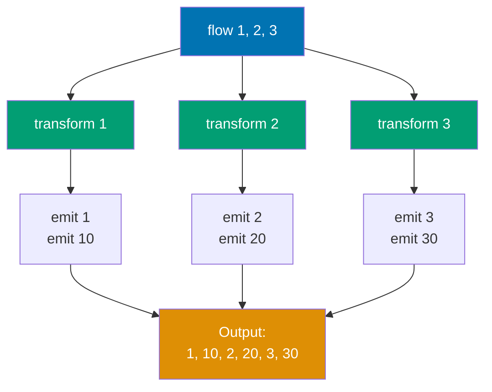

**Buffer Operator (Parallel Processing):**

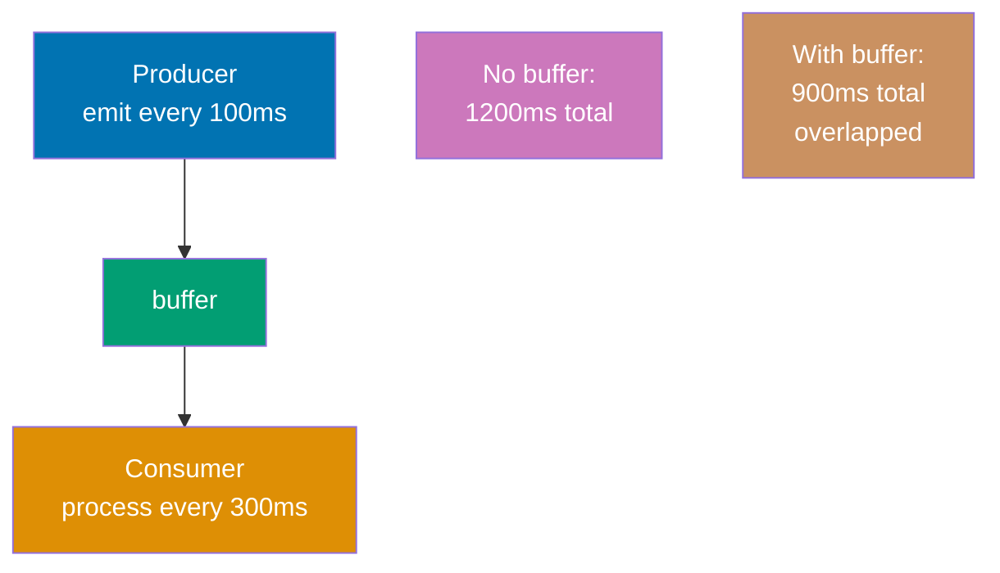

**Conflate Operator (Drop Intermediate):**

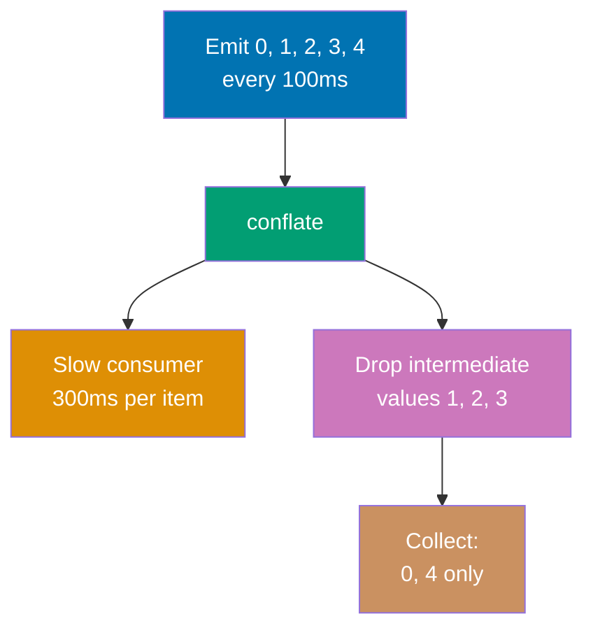

```kotlin
import kotlinx.coroutines.*
// => kotlinx.coroutines provides coroutine builders and structured concurrency primitives
// => Required for runBlocking, launch, delay functions
import kotlinx.coroutines.flow.*
// => kotlinx.coroutines.flow provides Flow API and flow operators
// => Operators: transform, buffer, conflate, map, filter, collect, etc.
import kotlin.system.measureTimeMillis
// => measureTimeMillis: measures execution time of lambda block in milliseconds
// => Part of Kotlin stdlib, useful for performance benchmarking
// => Returns: Long (execution time in ms)

fun main() = runBlocking {
    // => runBlocking: blocks main thread until all child coroutines complete
    // => Scope: provides CoroutineScope for flow collection and coroutine launch

    // transform: emit multiple values per input
    flow { emit(1); emit(2); emit(3) }
    // => flow { }: creates cold Flow that emits 3 values: 1, 2, 3
    // => Inline emissions: semicolon-separated emit calls in single lambda
    // => Type: Flow<Int> (cold stream, doesn't execute until collected)
    // => Execution: flow body executes when terminal operator (collect) called

        .transform { value ->
            // => transform: intermediate operator for one-to-many transformations
            // => Lambda parameter: value receives each emitted value (1, then 2, then 3)
            // => Lambda receiver: FlowCollector<Int> (provides emit() function)
            // => Use case: when one input should produce MULTIPLE outputs (unlike map which is 1-to-1)
            // => Execution: transform lambda called for each upstream emission
            // => Suspension: can contain suspending calls (delay, emit, etc.)
            // => Type: returns Flow<Int> (still cold)

            emit(value)
            // => emit(value): emits original value downstream (1, 2, 3)
            // => First emission: value unchanged
            // => Context: runs in collector's coroutine context
            // => Suspension: suspends if downstream collector is slow (backpressure)

            emit(value * 10)
            // => emit(value * 10): emits transformed value downstream (10, 20, 30)
            // => Second emission: value multiplied by 10
            // => One-to-many: TWO emissions for each input value
            // => Order: original value emitted BEFORE transformed value
            // => Total emissions: 6 values (1, 10, 2, 20, 3, 30) from 3 inputs
        }

        .collect { println("Transform: $it") }
        // => collect: terminal operator that triggers flow execution
        // => Lambda parameter: it receives all emitted values in order
        // => Output: Transform: 1, Transform: 10, Transform: 2, Transform: 20, Transform: 3, Transform: 30
        // => Execution order: for each input, both emit() calls complete before next input processed
        // => Use case: transform is more general than map (map is transform { emit(f(it)) })

    // buffer: producer doesn't wait for consumer
    val timeNoBuffer = measureTimeMillis {
        // => measureTimeMillis: measures total execution time of this flow collection
        // => Returns: Long (time in milliseconds)
        // => Captures: lambda return value (Unit here from collect)

        flow {
            // => flow: creates cold flow that emits 3 values with delays
            // => Producer timing: controlled by delay(100) before each emit

            repeat(3) { i ->
                // => repeat(3): executes lambda 3 times with indices 0, 1, 2
                // => Parameter i: iteration index (0, 1, 2)

                delay(100)
                // => delay(100): suspends producer for 100ms before emitting
                // => Timing: T=100ms, 200ms, 300ms for emissions
                // => Thread release: producer coroutine suspended, thread freed
                // => Simulation: represents slow data production (DB query, API call)

                emit(i)
                // => emit(i): sends value to collector
                // => No buffer: producer WAITS for collector to finish processing before continuing
                // => Blocking: producer suspended until collector's collect lambda completes
                // => Backpressure: slow collector (300ms processing) blocks fast producer (100ms emit)
            }
        }

        .collect { value ->
            // => collect: consumer that processes each value
            // => No buffer operator: producer and consumer run SEQUENTIALLY (not overlapped)

            delay(300)
            // => delay(300): suspends collector for 300ms (simulates slow processing)
            // => Timing: T=300ms per value processing
            // => Producer impact: producer WAITS during this delay (no overlap)
            // => Sequential execution: emit delay (100ms) + collect delay (300ms) = 400ms per value

            println("No buffer: $value")
            // => Output: No buffer: 0, No buffer: 1, No buffer: 2
            // => Timing: values printed at T=~400ms, 800ms, 1200ms
            // => Total time: 100 + 300 + 100 + 300 + 100 + 300 = 1200ms (sequential)
        }
    }

    println("No buffer time: $timeNoBuffer ms")
    // => Output: No buffer time: 1200 ms (approximately)
    // => Calculation: 3 values * (100ms emit + 300ms collect) = 1200ms total
    // => Bottleneck: collector is slower (300ms) than producer (100ms), but no overlap

    val timeWithBuffer = measureTimeMillis {
        // => measureTimeMillis: measures buffered flow collection time
        // => Expectation: faster than no-buffer due to parallel producer/consumer execution

        flow {
            // => flow: same producer as above (3 values, 100ms delay each)

            repeat(3) { i ->
                // => repeat(3): indices 0, 1, 2

                delay(100)
                // => delay(100): producer delay (same as above)
                // => With buffer: producer does NOT wait for collector (runs independently)
                // => Overlap: producer can emit next value while collector processes previous

                emit(i)
                // => emit(i): sends value to BUFFER (not directly to collector)
                // => Non-blocking: producer continues immediately after emit (doesn't wait for collector)
                // => Buffer stores: emitted values until collector ready to process
            }
        }

        .buffer()
        // => buffer(): intermediate operator that decouples producer and consumer
        // => Creates: internal buffer (channel) between producer and consumer
        // => Capacity: default BUFFERED capacity (64 elements)
        // => Concurrency: producer and consumer run in PARALLEL (separate coroutines)
        // => Producer behavior: emits to buffer without waiting for collector
        // => Consumer behavior: receives from buffer when ready
        // => Backpressure: buffer() suspends producer only if buffer FULL (not per-value)
        // => Performance: improves throughput when producer/consumer have different speeds
        // => Use case: slow collector shouldn't block fast producer

        .collect { value ->
            // => collect: consumer receives values from buffer
            // => Parallel execution: runs concurrently with producer (buffer decouples)

            delay(300)
            // => delay(300): slow collector (same as no-buffer case)
            // => Producer impact: producer does NOT wait (buffer absorbs values)
            // => Overlap: while collector processes value 0 (300ms), producer emits 1, 2, 3

            println("With buffer: $value")
            // => Output: With buffer: 0, With buffer: 1, With buffer: 2
            // => Timing: T=~400ms, 700ms, 1000ms
            // => Total time: ~900ms (overlapped execution, NOT sequential)
        }
    }

    println("With buffer time: $timeWithBuffer ms")
    // => Output: With buffer time: 900 ms (approximately)
    // => Calculation breakdown:
    // => - Producer emits 0 at T=100ms, collector starts processing (300ms)
    // => - Producer emits 1 at T=200ms (buffered while collector busy)
    // => - Producer emits 2 at T=300ms (buffered while collector busy)
    // => - Collector finishes 0 at T=400ms, starts 1 (300ms)
    // => - Collector finishes 1 at T=700ms, starts 2 (300ms)
    // => - Collector finishes 2 at T=1000ms
    // => Total: ~900ms (first emit 100ms + 3 collections * 300ms = 1000ms, but overlapped)
    // => Speedup: 1200ms -> 900ms (25% faster due to parallel execution)

    // conflate: drop intermediate values if consumer is slow
    flow {
        // => flow: creates cold flow that emits 5 values rapidly
        // => Producer: fast (100ms per emission)
        // => Consumer: slow (500ms per value, demonstrated below)
        // => Conflict: producer emits faster than consumer processes

        repeat(5) { i ->
            // => repeat(5): indices 0, 1, 2, 3, 4
            // => Total emissions: 5 values over 500ms

            delay(100)
            // => delay(100): fast producer (100ms between emissions)
            // => Timing: T=100ms, 200ms, 300ms, 400ms, 500ms

            emit(i)
            // => emit(i): sends value to conflate buffer
            // => With conflate: older values DROPPED if consumer hasn't processed latest
            // => Strategy: keep only LATEST value, discard intermediate (no queue buildup)

            println("Emitted $i")
            // => Output: Emitted 0, Emitted 1, Emitted 2, Emitted 3, Emitted 4
            // => Proof: ALL values emitted by producer (0-4), but not all collected
            // => Timing: prints at T=100ms, 200ms, 300ms, 400ms, 500ms
        }
    }

    .conflate()
    // => conflate(): intermediate operator that drops intermediate values
    // => Strategy: keeps ONLY the latest emitted value, discards older unprocessed values
    // => Buffer size: effectively 1 (stores latest, replaces on new emission)
    // => Use case: real-time UIs where only latest data matters (stock prices, sensor readings)
    // => Comparison: buffer() queues all values, conflate() discards old values
    // => Backpressure: handles fast producer by dropping data (not suspending producer)
    // => Trade-off: loses intermediate values for lower latency and memory usage
    // => Concurrency: producer runs in separate coroutine (like buffer)

    .collect { value ->
        // => collect: slow consumer that processes values
        // => Processing time: 500ms per value (slower than producer's 100ms emit rate)

        println("Conflate collected: $value")
        // => Output: Conflate collected: 0, Conflate collected: 4 (SKIPPED 1, 2, 3)
        // => Explanation:
        // => - T=100ms: emit(0), collector starts processing 0 (500ms)
        // => - T=200ms: emit(1), conflate stores 1 (collector busy)
        // => - T=300ms: emit(2), conflate DROPS 1, stores 2 (collector still busy)
        // => - T=400ms: emit(3), conflate DROPS 2, stores 3 (collector still busy)
        // => - T=500ms: emit(4), conflate DROPS 3, stores 4 (collector still busy)
        // => - T=600ms: collector finishes 0, receives latest value 4 (1,2,3 dropped)
        // => Result: only 0 and 4 collected, intermediate values 1,2,3 discarded

        delay(500)
        // => delay(500): slow consumer (5x slower than producer's 100ms)
        // => Consequence: creates large backlog that conflate() resolves by dropping values
        // => Use case simulation: slow rendering that can't keep up with rapid data updates
    }
    // => Conflate total: only 2 values collected from 5 emitted (60% data loss)
    // => Trade-off: lower latency (always process latest) vs completeness (lose intermediate)
    // => Use case: stock ticker UI (show latest price, skip intermediate updates)
    // => Anti-pattern: analytics pipelines where ALL data must be processed (use buffer instead)
}
// => Summary:
// => - transform: one-to-many emissions (1 input -> multiple outputs)
// => - buffer: parallel producer/consumer (queue all values, improve throughput)
// => - conflate: drop intermediate values (keep latest, reduce latency/memory)
```

**Key Takeaway**: Use `transform` for one-to-many emissions, `buffer` to improve throughput with slow consumers, `conflate` to drop intermediate values when only latest matters.

**Why It Matters**: Flow operators solve backpressure and performance tuning problems that require manual coding in Java streams or complex reactive operators in RxJava. The buffer operator decouples fast producers from slow consumers without blocking threads, while conflate enables real-time UIs to skip stale updates (showing latest stock price rather than replaying every tick), patterns essential for responsive applications processing high-frequency data like sensor streams or market feeds without overwhelming rendering threads.

---

## Example 35: StateFlow and SharedFlow for Hot Streams

`StateFlow` holds a single state value with initial state; subscribers get current state immediately. `SharedFlow` broadcasts events to all collectors without state retention.

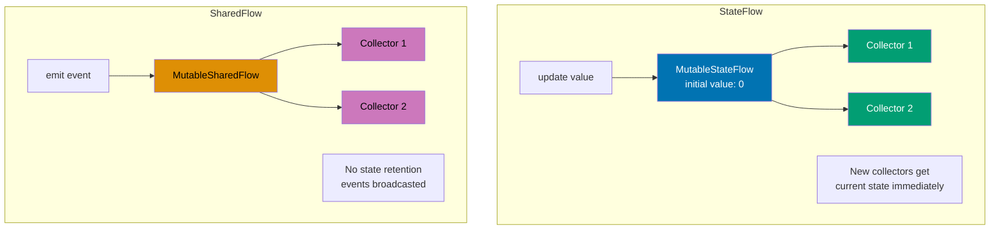

```kotlin
import kotlinx.coroutines.*
// => Import coroutine builders and scope functions
// => Provides: runBlocking (main bridge), launch (fire-and-forget), delay (suspension)
// => Dependency: org.jetbrains.kotlinx:kotlinx-coroutines-core

import kotlinx.coroutines.flow.*
// => Import Flow types and builders for hot and cold streams
// => Provides: StateFlow (hot state stream), SharedFlow (hot event stream)
// => MutableStateFlow/MutableSharedFlow: writable versions of hot flows
// => Hot stream: emits values regardless of collectors (vs cold: only on collect)

class Counter {
    // => Counter class: demonstrates hot flow patterns for state and events
    // => Encapsulation: private mutable flows, public read-only interfaces
    // => Use case: ViewModel pattern in Android MVVM architecture

    private val _stateFlow = MutableStateFlow(0)
    // => MutableStateFlow<Int>: hot flow holding current state value
    // => Type: MutableStateFlow<Int> (mutable, allows .value updates)
    // => Initial value: 0 (REQUIRED - StateFlow MUST have initial value)
    // => Hot behavior: active even without collectors (unlike cold Flow)
    // => Conflation: if multiple values emitted rapidly, only latest delivered
    // => Thread-safety: .value property is thread-safe (atomic updates)
    // => Visibility: private to prevent external mutation (internal state)
    // => Memory: ~40 bytes overhead + value size (Int = 4 bytes total ~44 bytes)
    // => Lifecycle: exists as long as Counter instance exists

    val stateFlow: StateFlow<Int> = _stateFlow
    // => StateFlow<Int>: public read-only interface to _stateFlow
    // => Type: StateFlow<Int> (immutable interface, no .value setter)
    // => Assignment: references same underlying flow as _stateFlow
    // => Collectors: get current value IMMEDIATELY upon collection
    // => Pattern: backing property pattern (private mutable, public read-only)
    // => Use case: expose state to UI without allowing external modification
    // => Null safety: StateFlow NEVER null (unlike LiveData which can be null)

    private val _sharedFlow = MutableSharedFlow<String>()
    // => MutableSharedFlow<String>: hot flow for broadcasting events
    // => Type: MutableSharedFlow<String> (mutable, allows .emit())
    // => No initial value: unlike StateFlow, SharedFlow has NO state
    // => Default config: replay=0 (new collectors don't get past events)
    // => extraBufferCapacity=0 (no buffer beyond replay)
    // => onBufferOverflow=SUSPEND (blocks emitter if buffer full)
    // => Hot behavior: emits events to all active collectors simultaneously
    // => No conflation: all emitted events delivered (unlike StateFlow)
    // => Thread-safety: .emit() is thread-safe (suspends on contention)
    // => Visibility: private to control emission (only Counter can emit)
    // => Use case: events like clicks, errors, one-time notifications

    val sharedFlow: SharedFlow<String> = _sharedFlow
    // => SharedFlow<String>: public read-only interface to _sharedFlow
    // => Type: SharedFlow<String> (immutable interface, no .emit())
    // => Assignment: references same underlying flow as _sharedFlow
    // => Collectors: do NOT get past events (replay=0 by default)
    // => Pattern: backing property pattern (consistent with StateFlow)
    // => Use case: expose events to multiple observers (UI components, analytics)

    fun increment() {
        // => increment(): synchronous function to update state
        // => Not suspend: .value property is non-blocking (atomic operation)
        // => Thread-safety: safe to call from any thread (StateFlow handles synchronization)

        _stateFlow.value++
        // => _stateFlow.value: current state value (read)
        // => Increment: value = value + 1 (atomic read-modify-write)
        // => Before: _stateFlow.value = 0, After: _stateFlow.value = 1
        // => Notification: ALL active collectors notified of new value
        // => Conflation: if multiple increments before collector processes, only latest seen
        // => Thread-safety: atomic operation (no race conditions)
        // => Comparison: StateFlow.update { it + 1 } safer for concurrent updates
        // => Memory barrier: ensures visibility across threads (JVM memory model)

        println("State updated: ${_stateFlow.value}")
        // => Output: State updated: 1 (first call), State updated: 2 (second call)
        // => _stateFlow.value: read current value after increment
        // => String template: embeds value in output string
        // => Timing: prints BEFORE collectors process (asynchronous notification)
    }

    suspend fun emitEvent(event: String) {
        // => emitEvent(): suspending function to broadcast events
        // => suspend modifier: .emit() is suspending (can pause if buffer full)
        // => Parameter: event String to broadcast to all collectors
        // => Thread-safety: safe to call from any coroutine

        _sharedFlow.emit(event)
        // => _sharedFlow.emit(event): suspending function to send event
        // => Parameter: event = "Event A" or "Event B" (from caller)
        // => Broadcast: sends to ALL active collectors simultaneously
        // => Suspension: suspends if buffer full (default: suspend on overflow)
        // => No replay: new collectors joining after emit() miss this event
        // => No conflation: all events delivered (unlike StateFlow)
        // => Thread-safety: emit() serializes concurrent calls (suspends waiting)
        // => Comparison: tryEmit() non-suspending alternative (returns false if full)

        println("Event emitted: $event")
        // => Output: Event emitted: Event A (first call), Event emitted: Event B (second call)
        // => Timing: prints AFTER emit completes (after all collectors notified)
        // => Confirmation: proves event was successfully emitted
    }
}

fun main() = runBlocking {
    // => runBlocking: bridges blocking main function to coroutine world
    // => Blocks: main thread until all child coroutines complete
    // => Scope: CoroutineScope for launching child coroutines
    // => Return type: Unit (from lambda)

    val counter = Counter()
    // => counter: instance of Counter class with StateFlow and SharedFlow
    // => Initialization: _stateFlow created with value=0, _sharedFlow empty
    // => Lifecycle: exists for entire main function execution
    // => State: _stateFlow.value = 0 (initial), no SharedFlow events yet

    // StateFlow collector 1 (gets initial value immediately)
    launch {
        // => launch: starts coroutine for StateFlow collection
        // => Returns: Job (handle to coroutine)
        // => Execution: coroutine starts IMMEDIATELY (before delay)
        // => Dispatcher: default (shared thread pool)
        // => Lifecycle: collect {} runs indefinitely (StateFlow never completes)
        // => Parent: runBlocking scope (structured concurrency)

        counter.stateFlow.collect { value ->
            // => collect: terminal operator that subscribes to StateFlow
            // => Hot stream: receives current value (0) IMMEDIATELY upon collection
            // => Lambda parameter: value = current state (0, then 1, then 2)
            // => Execution: lambda runs for EVERY state update
            // => Suspension: collect never completes (StateFlow is infinite)
            // => Initial emission: value = 0 (immediate upon collection)
            // => Conflation: if state updates rapidly, only latest value received

            println("Collector 1 state: $value")
            // => Output: Collector 1 state: 0 (initial, T=~0ms)
            // => Output: Collector 1 state: 1 (after first increment, T=~200ms)
            // => Output: Collector 1 state: 2 (after second increment, T=~300ms)
            // => Timing: initial value printed BEFORE delay(100) completes
            // => Thread: dispatcher thread (not main thread)
            // => Order: collector 1 gets ALL state updates (0, 1, 2)
        }
        // => Unreachable: collect {} never completes (StateFlow infinite)
        // => Cancellation: only when parent scope (runBlocking) cancels
    }
    // => launch returns immediately (non-blocking)
    // => Job state: ACTIVE (coroutine collecting StateFlow)
    // => Collector 1: already received initial value 0 by this point

    delay(100)
    // => delay(100): suspends runBlocking for 100ms
    // => Purpose: ensure collector 1 starts before collector 2
    // => Thread: main thread BLOCKED (runBlocking semantics)
    // => Timing: T=100ms after main starts
    // => State: collector 1 already printed "Collector 1 state: 0"

    // StateFlow collector 2 (gets current state immediately)
    launch {
        // => launch: starts second StateFlow collector coroutine
        // => Timing: T=~100ms after program start
        // => Current state: _stateFlow.value = 0 (no increments yet)
        // => New collector: gets CURRENT state immediately (hot stream behavior)

        counter.stateFlow.collect { value ->
            // => collect: second collector subscribes to SAME StateFlow
            // => Hot stream: multiple collectors share same flow (not independent)
            // => Initial emission: value = 0 (current state at T=100ms)
            // => Late subscriber: gets current state, NOT full history
            // => Conflation: same conflation behavior as collector 1

            println("Collector 2 state: $value")
            // => Output: Collector 2 state: 0 (initial, T=~100ms)
            // => Output: Collector 2 state: 1 (after first increment, T=~200ms)
            // => Output: Collector 2 state: 2 (after second increment, T=~300ms)
            // => Thread: dispatcher thread (separate from collector 1)
            // => Order: interleaved with collector 1 outputs (both active)
        }
    }
    // => Two collectors: both active, both receiving state updates
    // => Memory: StateFlow maintains single value, not duplicated per collector
    // => Efficiency: O(1) memory overhead per collector (lightweight subscription)

    delay(100)
    // => delay(100): suspends runBlocking for another 100ms
    // => Timing: T=200ms total (100ms + 100ms)
    // => Purpose: ensure both collectors started before state updates
    // => State: both collectors printed initial value 0

    counter.increment()
    // => increment(): non-blocking call (not suspend)
    // => State change: _stateFlow.value: 0 -> 1
    // => Output: State updated: 1
    // => Notification: BOTH collectors notified asynchronously
    // => Timing: T=~200ms
    // => Collectors: will print "Collector 1 state: 1" and "Collector 2 state: 1"
    // => Order: increment() prints BEFORE collectors process (asynchronous)

    delay(100)
    // => delay(100): wait 100ms before next increment
    // => Timing: T=300ms total
    // => Purpose: space out state updates for observable output
    // => State: both collectors processed value 1 by now

    counter.increment()
    // => increment(): second state update
    // => State change: _stateFlow.value: 1 -> 2
    // => Output: State updated: 2
    // => Notification: BOTH collectors notified of value 2
    // => Timing: T=~300ms
    // => Collectors: will print "Collector 1 state: 2" and "Collector 2 state: 2"

    // SharedFlow collectors
    launch {
        // => launch: starts SharedFlow collector 1
        // => Timing: T=~300ms after program start
        // => No initial value: SharedFlow has no state (unlike StateFlow)
        // => Replay: 0 (default), so no past events received

        counter.sharedFlow.collect { event ->
            // => collect: subscribes to SharedFlow events
            // => No immediate emission: SharedFlow has no current value
            // => Only future events: receives events emitted AFTER this collection starts
            // => Lambda parameter: event = String emitted via .emit()

            println("SharedFlow collector 1: $event")
            // => Output: SharedFlow collector 1: Event A (T=~400ms)
            // => Output: SharedFlow collector 1: Event B (T=~500ms)
            // => No initial output: collector waits for events
            // => Thread: dispatcher thread
        }
    }

    launch {
        // => launch: starts SharedFlow collector 2
        // => Timing: T=~300ms (nearly simultaneous with collector 1)
        // => Independent: separate coroutine, but receives SAME events

        counter.sharedFlow.collect { event ->
            // => collect: second collector on SAME SharedFlow
            // => Hot stream: multiple collectors receive ALL events
            // => Broadcast: each emitted event sent to ALL collectors

            println("SharedFlow collector 2: $event")
            // => Output: SharedFlow collector 2: Event A (T=~400ms)
            // => Output: SharedFlow collector 2: Event B (T=~500ms)
            // => Order: interleaved with collector 1 (both receive simultaneously)
            // => Thread: dispatcher thread (separate from collector 1)
        }
    }
    // => Two SharedFlow collectors: both active, both waiting for events
    // => Memory: SharedFlow stores events in replay buffer (0 by default)

    delay(100)
    // => delay(100): wait before emitting first event
    // => Timing: T=400ms total
    // => Purpose: ensure both SharedFlow collectors started

    counter.emitEvent("Event A")
    // => emitEvent(): suspending call to emit event
    // => Event: "Event A" broadcasted to BOTH collectors
    // => Output: Event emitted: Event A
    // => Collectors: both print "SharedFlow collector 1/2: Event A"
    // => Timing: T=~400ms
    // => Suspension: emitEvent suspends if buffer full (not here, buffer empty)
    // => Broadcast: both collectors receive event simultaneously

    delay(100)
    // => delay(100): wait before second event
    // => Timing: T=500ms total
    // => Purpose: space out events for observable output

    counter.emitEvent("Event B")
    // => emitEvent(): emit second event
    // => Event: "Event B" broadcasted to BOTH collectors
    // => Output: Event emitted: Event B
    // => Collectors: both print "SharedFlow collector 1/2: Event B"
    // => Timing: T=~500ms
    // => No replay: if new collector starts now, misses Events A and B

    delay(500)
    // => delay(500): wait for all asynchronous output to complete
    // => Timing: T=1000ms total
    // => Purpose: prevent runBlocking from exiting before collectors print
    // => All collectors: still active (StateFlow and SharedFlow never complete)
}
// => runBlocking completes here
// => Cancellation: all child coroutines (launch) cancelled automatically
// => Collectors: all collect {} loops cancelled (structured concurrency)
// => Total execution: ~1000ms (determined by final delay)

// => StateFlow summary:
// => - Hot stream: active without collectors
// => - State retention: always has current value
// => - Initial value: REQUIRED (0 in this example)
// => - New collectors: get current state IMMEDIATELY
// => - Conflation: rapid updates merged (latest wins)
// => - Use case: observable state (UI state, ViewModel state)

// => SharedFlow summary:
// => - Hot stream: active without collectors
// => - No state: events not retained (unless replay > 0)
// => - No initial value: no concept of current state
// => - New collectors: miss past events (replay=0)
// => - No conflation: all events delivered
// => - Use case: one-time events (button clicks, errors, navigation)

// => Hot vs Cold streams:
// => - Hot (StateFlow/SharedFlow): emit regardless of collectors
// => - Cold (Flow): only emit when collected (each collector gets independent stream)
// => - Hot: single shared stream, multiple collectors
// => - Cold: new stream instance per collector

// => Comparison with Android LiveData:
// => - LiveData: lifecycle-aware, nullable, not coroutine-native
// => - StateFlow: not lifecycle-aware, non-null, coroutine-native
// => - LiveData.setValue(): main thread only
// => - StateFlow.value: thread-safe, any thread
// => - LiveData: older Android pattern (pre-coroutines)
// => - StateFlow: modern Kotlin coroutines pattern

// => Performance characteristics:
// => - StateFlow collectors: O(N) notification (N = number of collectors)
// => - Memory: O(1) per collector (lightweight subscription)
// => - Conflation: prevents UI overload (only latest value matters)
// => - Thread-safety: built-in (no external synchronization needed)
```

**Key Takeaway**: Use `StateFlow` for observable state with initial value and conflation; use `SharedFlow` for event broadcasting without state.

**Why It Matters**: Android's LiveData and RxJava's BehaviorSubject serve similar purposes but lack coroutine integration and type safety. StateFlow provides the observable state pattern critical for MVVM architectures with built-in coroutine support, conflation (latest value wins) preventing UI overload, and compile-time null safety unlike LiveData's runtime nullability. SharedFlow replaces EventBus libraries with type-safe event broadcasting, eliminating reflection-based coupling and enabling multi-subscriber patterns for cross-component communication in modular architectures.

## Example 36: Collection Operations - Map, Filter, Reduce

Kotlin provides rich functional operations on collections. These operations don't modify original collections but return new ones.

```kotlin
fun main() {
    // => main(): entry point demonstrating functional collection operations
    // => Collections: immutable by default (listOf creates read-only List)
    // => Functional operations: transform, filter, aggregate without mutation
    // => Lazy evaluation: NOT used here (eager evaluation creates intermediate lists)

    val numbers = listOf(1, 2, 3, 4, 5, 6)
    // => listOf(): creates immutable List<Int> with 6 elements
    // => Type: List<Int> (read-only interface, no add/remove methods)
    // => Elements: [1, 2, 3, 4, 5, 6]
    // => Memory: ~64 bytes (List overhead + 6 Int references + 6 Int objects ~24 bytes)
    // => Immutability: cannot modify (no set, add, remove operations)
    // => Use case: source data for transformation operations

    // map: transform each element
    val doubled = numbers.map { it * 2 }
    // => map(): transforms EACH element using lambda function
    // => Lambda parameter: it = each element (1, 2, 3, 4, 5, 6)
    // => Transformation: it * 2 (multiply by 2)
    // => Process: [1*2, 2*2, 3*2, 4*2, 5*2, 6*2] = [2, 4, 6, 8, 10, 12]
    // => Return type: List<Int> (NEW list, original unchanged)
    // => Eager evaluation: creates complete new list immediately
    // => Memory: allocates new List with 6 elements (~64 bytes)
    // => Original: numbers still [1, 2, 3, 4, 5, 6] (immutable)
    // => One-to-one mapping: input size = output size (6 elements -> 6 elements)

    val strings = numbers.map { "N$it" }
    // => map(): same operation, different transformation
    // => Lambda parameter: it = each Int (1, 2, 3, 4, 5, 6)
    // => Transformation: "N$it" (string concatenation with prefix)
    // => String template: "N$it" evaluates to "N1", "N2", "N3", "N4", "N5", "N6"
    // => Return type: List<String> (type changed from Int to String)
    // => Process: [1, 2, 3, 4, 5, 6] -> ["N1", "N2", "N3", "N4", "N5", "N6"]
    // => Memory: new List + 6 String objects (~200 bytes total)
    // => Type transformation: Int -> String (map can change element type)

    println("Doubled: $doubled")
    // => Output: Doubled: [2, 4, 6, 8, 10, 12]
    // => $doubled: template substitution, List.toString() formats as [elem1, elem2, ...]
    // => Verification: shows result of map transformation

    println("Strings: $strings")
    // => Output: Strings: [N1, N2, N3, N4, N5, N6]
    // => $strings: List<String> formatted with toString()
    // => Verification: shows string transformation result

    // filter: keep elements matching predicate
    val evens = numbers.filter { it % 2 == 0 }
    // => filter(): selects elements matching predicate (boolean lambda)
    // => Lambda parameter: it = each element (1, 2, 3, 4, 5, 6)
    // => Predicate: it % 2 == 0 (true if even, false if odd)
    // => Evaluation:
    // =>   - 1 % 2 == 0 -> false (skip)
    // =>   - 2 % 2 == 0 -> true (keep)
    // =>   - 3 % 2 == 0 -> false (skip)
    // =>   - 4 % 2 == 0 -> true (keep)
    // =>   - 5 % 2 == 0 -> false (skip)
    // =>   - 6 % 2 == 0 -> true (keep)
    // => Result: [2, 4, 6] (only even numbers)
    // => Return type: List<Int> (NEW list with filtered elements)
    // => Size change: 6 elements -> 3 elements (filtering reduces size)
    // => Memory: new List with 3 elements (~40 bytes)

    val greaterThan3 = numbers.filter { it > 3 }
    // => filter(): different predicate, same mechanism
    // => Predicate: it > 3 (true if value greater than 3)
    // => Evaluation:
    // =>   - 1 > 3 -> false (skip)
    // =>   - 2 > 3 -> false (skip)
    // =>   - 3 > 3 -> false (skip, equality not satisfied)
    // =>   - 4 > 3 -> true (keep)
    // =>   - 5 > 3 -> true (keep)
    // =>   - 6 > 3 -> true (keep)
    // => Result: [4, 5, 6] (values greater than 3)
    // => Size change: 6 elements -> 3 elements

    println("Evens: $evens")
    // => Output: Evens: [2, 4, 6]
    // => Verification: shows even numbers filtered from original list

    println("Greater than 3: $greaterThan3")
    // => Output: Greater than 3: [4, 5, 6]
    // => Verification: shows numbers > 3 filtered from original list

    // reduce: accumulate values (requires non-empty collection)
    val sum = numbers.reduce { acc, value -> acc + value }
    // => reduce(): accumulates elements using binary operation
    // => Lambda parameters: acc (accumulator), value (current element)
    // => Initial acc: FIRST element (1) - no separate initial value
    // => Process (left-to-right accumulation):
    // =>   - Step 1: acc=1 (first element), value=2 -> acc+value = 1+2 = 3
    // =>   - Step 2: acc=3, value=3 -> acc+value = 3+3 = 6
    // =>   - Step 3: acc=6, value=4 -> acc+value = 6+4 = 10
    // =>   - Step 4: acc=10, value=5 -> acc+value = 10+5 = 15
    // =>   - Step 5: acc=15, value=6 -> acc+value = 15+6 = 21
    // => Result: 21 (sum of all elements: 1+2+3+4+5+6)
    // => Return type: Int (same type as elements)
    // => Requirement: collection MUST be non-empty (throws on empty)
    // => Use case: sum, product, max, min operations without initial value

    val product = numbers.reduce { acc, value -> acc * value }
    // => reduce(): same mechanism, multiplication operation
    // => Process (multiplication accumulation):
    // =>   - Step 1: acc=1, value=2 -> acc*value = 1*2 = 2
    // =>   - Step 2: acc=2, value=3 -> acc*value = 2*3 = 6
    // =>   - Step 3: acc=6, value=4 -> acc*value = 6*4 = 24
    // =>   - Step 4: acc=24, value=5 -> acc*value = 24*5 = 120
    // =>   - Step 5: acc=120, value=6 -> acc*value = 120*6 = 720
    // => Result: 720 (factorial-like product: 1*2*3*4*5*6)
    // => Return type: Int
    // => Danger: empty list throws UnsupportedOperationException

    println("Sum: $sum")
    // => Output: Sum: 21
    // => Verification: 1+2+3+4+5+6 = 21

    println("Product: $product")
    // => Output: Product: 720
    // => Verification: 1*2*3*4*5*6 = 720

    // fold: reduce with initial value (works on empty collections)
    val sumWithInitial = numbers.fold(100) { acc, value -> acc + value }
    // => fold(100): accumulation with EXPLICIT initial value
    // => Initial value: 100 (passed as first argument)
    // => Lambda parameters: acc (starts at 100), value (each element)
    // => Process (left-to-right with initial value):
    // =>   - Step 0: acc=100 (initial value, before any elements)
    // =>   - Step 1: acc=100, value=1 -> acc+value = 100+1 = 101
    // =>   - Step 2: acc=101, value=2 -> acc+value = 101+2 = 103
    // =>   - Step 3: acc=103, value=3 -> acc+value = 103+3 = 106
    // =>   - Step 4: acc=106, value=4 -> acc+value = 106+4 = 110
    // =>   - Step 5: acc=110, value=5 -> acc+value = 110+5 = 115
    // =>   - Step 6: acc=115, value=6 -> acc+value = 115+6 = 121
    // => Result: 121 (initial 100 + sum of elements 21 = 121)
    // => Return type: Int (can differ from element type)
    // => Safety: works on EMPTY collections (returns initial value)
    // => Comparison: fold safer than reduce (no exception on empty)

    val emptyList = emptyList<Int>()
    // => emptyList<Int>(): creates empty List<Int>
    // => Type: List<Int> (explicit type parameter required for empty list)
    // => Elements: [] (zero elements)
    // => Memory: minimal (empty list object ~24 bytes)
    // => Use case: demonstrate fold safety on empty collections

    val safeSum = emptyList.fold(0) { acc, value -> acc + value }
    // => fold(0): safe accumulation on empty list
    // => Initial value: 0
    // => Process: NO steps (list is empty, lambda NEVER called)
    // => Result: 0 (returns initial value unchanged)
    // => Return type: Int
    // => Safety: NO exception (unlike reduce which throws on empty)
    // => Use case: safe aggregation when collection might be empty
    // => Comparison: reduce(emptyList) throws UnsupportedOperationException

    println("Sum with initial: $sumWithInitial")
    // => Output: Sum with initial: 121
    // => Verification: 100 + (1+2+3+4+5+6) = 121

    println("Safe sum: $safeSum")
    // => Output: Safe sum: 0
    // => Verification: fold returns initial value 0 for empty list

    // flatMap: map and flatten
    val nestedLists = listOf(listOf(1, 2), listOf(3, 4), listOf(5))
    // => listOf(listOf(...)): creates List<List<Int>> (nested structure)
    // => Type: List<List<Int>> (list of lists)
    // => Elements: [[1, 2], [3, 4], [5]] (3 inner lists)
    // => Structure: outer list has 3 elements, each element is a List<Int>
    // => Memory: outer list + 3 inner lists + 5 Int objects (~150 bytes)
    // => Use case: hierarchical data (e.g., orders with line items)

    val flattened = nestedLists.flatMap { it }
    // => flatMap(): maps each element, then FLATTENS result
    // => Lambda parameter: it = each inner list ([1,2], [3,4], [5])
    // => Transformation: it (identity function, returns list as-is)
    // => Process:
    // =>   - Step 1: [1, 2] -> [1, 2] (map returns same list)
    // =>   - Step 2: [3, 4] -> [3, 4] (map returns same list)
    // =>   - Step 3: [5] -> [5] (map returns same list)
    // => Flatten: concatenates all mapped lists into single list
    // => Result: [1, 2] + [3, 4] + [5] = [1, 2, 3, 4, 5]
    // => Return type: List<Int> (flattened from List<List<Int>>)
    // => Type change: List<List<Int>> -> List<Int> (one level flatter)
    // => Memory: new single-level list with 5 elements (~64 bytes)

    val doubledFlat = nestedLists.flatMap { list -> list.map { it * 2 } }
    // => flatMap(): map with transformation, then flatten
    // => Outer lambda: list = each inner list ([1,2], [3,4], [5])
    // => Inner map: transforms each element in inner list (it * 2)
    // => Process:
    // =>   - Step 1: [1, 2] -> [1, 2].map{it*2} -> [2, 4]
    // =>   - Step 2: [3, 4] -> [3, 4].map{it*2} -> [6, 8]
    // =>   - Step 3: [5] -> [5].map{it*2} -> [10]
    // => Flatten: concatenates transformed lists
    // => Result: [2, 4] + [6, 8] + [10] = [2, 4, 6, 8, 10]
    // => Return type: List<Int>
    // => Equivalent: nestedLists.map { it.map { it * 2 } }.flatten()
    // => Use case: transform nested structures and flatten in one operation

    println("Flattened: $flattened")
    // => Output: Flattened: [1, 2, 3, 4, 5]
    // => Verification: nested lists flattened to single list

    println("Doubled flat: $doubledFlat")
    // => Output: Doubled flat: [2, 4, 6, 8, 10]
    // => Verification: nested lists transformed and flattened
}
// => Program end
// => All operations: non-mutating (original collections unchanged)
// => Memory: each operation creates NEW collection (functional programming principle)

// => Collection operations summary:
// => - map: one-to-one transformation (input size = output size)
// => - filter: one-to-zero-or-one selection (input size >= output size)
// => - reduce: many-to-one aggregation (requires non-empty, uses first element as initial)
// => - fold: many-to-one aggregation (safe on empty, explicit initial value)
// => - flatMap: one-to-many transformation with flattening (nested -> flat)

// => Immutability benefits:
// => - Thread-safety: original collections never mutate (safe to share across threads)
// => - Predictability: transformations don't have side effects
// => - Referential transparency: same input always produces same output
// => - Debugging: easier to trace data flow (no hidden mutations)

// => Performance characteristics:
// => - Eager evaluation: each operation creates intermediate collection
// => - Memory: O(N) space per operation (N = collection size)
// => - Time: O(N) per operation (linear scan)
// => - Optimization: use asSequence() for lazy evaluation on large collections

// => Common use cases:
// => - map: transform DTOs, convert types, format data
// => - filter: select valid records, remove nulls, apply business rules
// => - reduce: calculate totals, find max/min, combine values
// => - fold: safe aggregation, build complex objects from elements
// => - flatMap: process nested JSON, flatten hierarchical structures

// => Comparison with Java Streams:
// => - Kotlin: operations available directly on collections (no .stream() needed)
// => - Kotlin: simpler syntax (no .collect(Collectors.toList()) ceremony)
// => - Kotlin: eager by default (Java Streams lazy by default)
// => - Kotlin: asSequence() for lazy evaluation (equivalent to Java Streams)
// => - Kotlin: better type inference (less verbose generic declarations)
```

**Key Takeaway**: Collection operations create new collections without mutating originals; use `map` for transformation, `filter` for selection, `reduce`/`fold` for aggregation, `flatMap` for nested structures.

**Why It Matters**: Java 8 Streams introduced functional collection operations late, but Kotlin's collection methods are simpler (no .stream().collect() ceremony) and work on all collections by default. The immutable-by-default approach prevents accidental mutations during transformations that corrupt shared data structures in multi-threaded services, while fold's ability to handle empty collections with default values prevents the NoSuchElementException crashes that plague Java's Stream.reduce() when processing empty result sets from databases or API responses.

## Example 37: Collection Operations - GroupBy, Partition, Associate

Advanced collection operations enable complex data transformations and grouping.

```kotlin
data class Person(val name: String, val age: Int, val city: String)
// => data class Person: immutable data holder with auto-generated methods
// => Properties: name (String), age (Int), city (String)
// => Auto-generated: equals(), hashCode(), toString(), copy(), componentN()
// => Immutability: all properties val (cannot be reassigned after construction)
// => Use case: domain model for demonstrating collection grouping operations

fun main() {
    // => main(): entry point demonstrating advanced collection transformations
    // => Focus: grouping, partitioning, and map association operations

    val people = listOf(
        Person("Alice", 30, "NYC"),
        Person("Bob", 25, "LA"),
        Person("Charlie", 30, "NYC"),
        Person("Diana", 25, "LA"),
        Person("Eve", 35, "NYC")
    )
    // => listOf(): creates immutable List<Person> with 5 elements
    // => Type: List<Person> (read-only, cannot add/remove elements)
    // => Elements: 5 Person instances
    // =>   - Alice: age=30, city=NYC
    // =>   - Bob: age=25, city=LA
    // =>   - Charlie: age=30, city=NYC (shares age with Alice)
    // =>   - Diana: age=25, city=LA (shares age with Bob, city with Bob)
    // =>   - Eve: age=35, city=NYC (unique age, shares city with Alice/Charlie)
    // => Data characteristics:
    // =>   - Age groups: 25 (Bob, Diana), 30 (Alice, Charlie), 35 (Eve)
    // =>   - City groups: NYC (Alice, Charlie, Eve), LA (Bob, Diana)
    // => Memory: ~200 bytes (List + 5 Person objects)

    // groupBy: group elements by key
    val byAge = people.groupBy { it.age }
    // => groupBy(): groups elements into Map<K, List<V>> using key selector
    // => Lambda parameter: it = each Person in list
    // => Key selector: it.age (group by age property)
    // => Return type: Map<Int, List<Person>> (age -> list of people with that age)
    // => Process:
    // =>   - Alice (age=30) -> map[30] = [Alice]
    // =>   - Bob (age=25) -> map[25] = [Bob]
    // =>   - Charlie (age=30) -> map[30] = [Alice, Charlie] (append to existing)
    // =>   - Diana (age=25) -> map[25] = [Bob, Diana] (append to existing)
    // =>   - Eve (age=35) -> map[35] = [Eve]
    // => Result: {25=[Bob, Diana], 30=[Alice, Charlie], 35=[Eve]}
    // => Map structure: 3 entries (one per unique age)
    // => Ordering: map entries NOT ordered (LinkedHashMap preserves insertion order)
    // => Memory: Map overhead + 3 entry objects + 3 List objects (~150 bytes)
    // => Use case: categorize data by attribute (e.g., users by subscription tier)

    println("Grouped by age:")
    // => Output: Grouped by age:
    // => Header for age grouping results

    byAge.forEach { (age, persons) ->
        // => forEach: iterates over Map entries (key-value pairs)
        // => Destructuring: (age, persons) extracts key and value from Map.Entry
        // => age: Int (map key, e.g., 25, 30, 35)
        // => persons: List<Person> (map value, all people with that age)
        // => Iteration order: depends on Map implementation (LinkedHashMap preserves order)

        println("  Age $age: ${persons.map { it.name }}")
        // => persons.map { it.name }: transforms List<Person> to List<String>
        // => Lambda: it.name extracts name property from each Person
        // => Result for age 25: [Bob, Diana] -> ["Bob", "Diana"]
        // => Result for age 30: [Alice, Charlie] -> ["Alice", "Charlie"]
        // => Result for age 35: [Eve] -> ["Eve"]
        // => String template: "  Age $age: [names]"
        // => Output:
        // =>   Age 25: [Bob, Diana]
        // =>   Age 30: [Alice, Charlie]
        // =>   Age 35: [Eve]
    }

    val byCity = people.groupBy { it.city }
    // => groupBy(): same operation, different key selector
    // => Key selector: it.city (group by city property)
    // => Return type: Map<String, List<Person>> (city -> people in that city)
    // => Process:
    // =>   - Alice (city=NYC) -> map["NYC"] = [Alice]
    // =>   - Bob (city=LA) -> map["LA"] = [Bob]
    // =>   - Charlie (city=NYC) -> map["NYC"] = [Alice, Charlie]
    // =>   - Diana (city=LA) -> map["LA"] = [Bob, Diana]
    // =>   - Eve (city=NYC) -> map["NYC"] = [Alice, Charlie, Eve]
    // => Result: {"NYC"=[Alice, Charlie, Eve], "LA"=[Bob, Diana]}
    // => Map structure: 2 entries (NYC has 3 people, LA has 2)
    // => Use case: segment data geographically (e.g., orders by region)

    println("Grouped by city:")
    // => Output: Grouped by city:

    byCity.forEach { (city, persons) ->
        // => Destructuring: (city, persons) = Map.Entry<String, List<Person>>
        // => city: String (e.g., "NYC", "LA")
        // => persons: List<Person> (people in that city)

        println("  $city: ${persons.map { it.name }}")
        // => persons.map { it.name }: extract names from people in this city
        // => Output:
        // =>   NYC: [Alice, Charlie, Eve]
        // =>   LA: [Bob, Diana]
    }

    // partition: split into two lists based on predicate
    val (under30, over30) = people.partition { it.age < 30 }
    // => partition(): splits collection into Pair<List<T>, List<T>>
    // => Lambda parameter: it = each Person
    // => Predicate: it.age < 30 (true for under 30, false for 30+)
    // => Return type: Pair<List<Person>, List<Person>>
    // => Pair.first: elements where predicate = true (age < 30)
    // => Pair.second: elements where predicate = false (age >= 30)
    // => Process:
    // =>   - Alice (age=30): 30 < 30 = false -> second list
    // =>   - Bob (age=25): 25 < 30 = true -> first list
    // =>   - Charlie (age=30): 30 < 30 = false -> second list
    // =>   - Diana (age=25): 25 < 30 = true -> first list
    // =>   - Eve (age=35): 35 < 30 = false -> second list
    // => Result: ([Bob, Diana], [Alice, Charlie, Eve])
    // => Destructuring: (under30, over30) extracts Pair components
    // => under30: List<Person> = [Bob, Diana] (age < 30)
    // => over30: List<Person> = [Alice, Charlie, Eve] (age >= 30)
    // => Memory: 2 separate List objects (~100 bytes)
    // => Use case: binary classification (active/inactive users, paid/free)

    println("\nUnder 30: ${under30.map { it.name }}")
    // => under30.map { it.name }: extract names from under-30 list
    // => Result: [Bob, Diana] -> ["Bob", "Diana"]
    // => Output: Under 30: [Bob, Diana]
    // => Newline: \n adds blank line before output

    println("30 and over: ${over30.map { it.name }}")
    // => over30.map { it.name }: extract names from 30+ list
    // => Result: [Alice, Charlie, Eve] -> ["Alice", "Charlie", "Eve"]
    // => Output: 30 and over: [Alice, Charlie, Eve]

    // associate: create map from collection
    val nameToAge = people.associate { it.name to it.age }
    // => associate(): transforms collection to Map<K, V> using key-value pairs
    // => Lambda parameter: it = each Person
    // => Pair creation: it.name to it.age creates Pair<String, Int>
    // => Return type: Map<String, Int> (name -> age)
    // => Process:
    // =>   - Alice -> "Alice" to 30 -> map["Alice"] = 30
    // =>   - Bob -> "Bob" to 25 -> map["Bob"] = 25
    // =>   - Charlie -> "Charlie" to 30 -> map["Charlie"] = 30
    // =>   - Diana -> "Diana" to 25 -> map["Diana"] = 25
    // =>   - Eve -> "Eve" to 35 -> map["Eve"] = 35
    // => Result: {"Alice"=30, "Bob"=25, "Charlie"=30, "Diana"=25, "Eve"=35}
    // => Map size: 5 entries (one per person)
    // => Duplicate keys: later values OVERWRITE earlier (not applicable here, names unique)
    // => Memory: Map + 5 entry objects (~120 bytes)
    // => Use case: create lookup tables, index data by identifier

    println("\nName to age: $nameToAge")
    // => Output: Name to age: {Alice=30, Bob=25, Charlie=30, Diana=25, Eve=35}
    // => Map.toString(): formats as {key1=value1, key2=value2, ...}

    // associateBy: use key selector
    val peopleByName = people.associateBy { it.name }
    // => associateBy(): creates Map<K, V> using key selector, value = element
    // => Lambda parameter: it = each Person
    // => Key selector: it.name (use name as map key)
    // => Return type: Map<String, Person> (name -> Person object)
    // => Process:
    // =>   - Alice -> map["Alice"] = Person("Alice", 30, "NYC")
    // =>   - Bob -> map["Bob"] = Person("Bob", 25, "LA")
    // =>   - Charlie -> map["Charlie"] = Person("Charlie", 30, "NYC")
    // =>   - Diana -> map["Diana"] = Person("Diana", 25, "LA")
    // =>   - Eve -> map["Eve"] = Person("Eve", 35, "NYC")
    // => Result: {"Alice"=Person(...), "Bob"=Person(...), ...}
    // => Value: entire Person object (not just property)
    // => Comparison: associate requires explicit key-value pair, associateBy just key
    // => Use case: create lookup map for quick access by identifier

    println("Person by name: ${peopleByName["Alice"]}")
    // => peopleByName["Alice"]: map lookup by key "Alice"
    // => Result: Person(name=Alice, age=30, city=NYC)
    // => Output: Person by name: Person(name=Alice, age=30, city=NYC)
    // => Data class toString(): formats as ClassName(prop1=val1, prop2=val2, ...)
    // => Null safety: if key not found, returns null (not shown here)

    // associateWith: use value generator
    val numbers = listOf(1, 2, 3, 4)
    // => listOf(1, 2, 3, 4): creates List<Int> with 4 elements
    // => Type: List<Int>
    // => Use case: demonstrate associateWith with numeric transformation

    val squares = numbers.associateWith { it * it }
    // => associateWith(): creates Map<K, V> where key = element, value = lambda result
    // => Lambda parameter: it = each Int from numbers
    // => Value generator: it * it (square the number)
    // => Return type: Map<Int, Int> (number -> square)
    // => Process:
    // =>   - 1 -> map[1] = 1*1 = 1
    // =>   - 2 -> map[2] = 2*2 = 4
    // =>   - 3 -> map[3] = 3*3 = 9
    // =>   - 4 -> map[4] = 4*4 = 16
    // => Result: {1=1, 2=4, 3=9, 4=16}
    // => Key: original element (1, 2, 3, 4)
    // => Value: computed from element (square)
    // => Comparison: associateBy uses element as VALUE, associateWith uses element as KEY
    // => Use case: precompute expensive operations, create lookup caches

    println("Squares: $squares")
    // => Output: Squares: {1=1, 2=4, 3=9, 4=16}
    // => Map.toString(): {key=value, ...} format
}
// => Program end
// => All operations: create new collections (immutability preserved)

// => Associate family comparison:
// => - associate { key to value }: full control, specify both key and value
// => - associateBy { key }: element becomes value, lambda provides key
// => - associateWith { value }: element becomes key, lambda provides value

// => groupBy vs associate:
// => - groupBy: Map<K, List<V>> (one key -> multiple values in list)
// => - associate: Map<K, V> (one key -> one value, duplicates overwritten)
// => - groupBy: preserves all elements (no data loss)
// => - associate: last duplicate key wins (potential data loss)

// => partition vs groupBy:
// => - partition: binary split (Pair<List, List>, two categories)
// => - groupBy: multi-way split (Map<K, List<V>>, unlimited categories)
// => - partition: predicate returns boolean (true/false)
// => - groupBy: selector returns any key type (Int, String, enum, etc.)
// => - partition: fixed 2 groups, groupBy: dynamic N groups

// => Performance characteristics:
// => - groupBy: O(N) time, O(N) space (N = collection size)
// => - partition: O(N) time, O(N) space (creates 2 lists)
// => - associate: O(N) time, O(N) space (creates map with N entries max)
// => - All: single-pass algorithms (iterate collection once)

// => Common use cases:
// => - groupBy: categorize data (orders by status, users by role)
// => - partition: binary classification (valid/invalid, active/inactive)
// => - associate: create lookups (ID -> entity, code -> description)
// => - associateBy: index collections (user list -> map by userId)
// => - associateWith: precompute values (number -> formatted string)

// => Comparison with Java:
// => - Java: Collectors.groupingBy() with nested collectors (verbose)
// => - Kotlin: groupBy { selector } returns Map<K, List<V>> (simple)
// => - Java: Collectors.partitioningBy() returns Map<Boolean, List<T>>
// => - Kotlin: partition { predicate } returns Pair<List<T>, List<T>> (destructuring)
// => - Java: no direct associate equivalent (manual map building)
// => - Kotlin: associate/associateBy/associateWith (concise, expressive)

// => Memory and immutability:
// => - All operations: create NEW collections (original unchanged)
// => - groupBy: creates Map + multiple List objects
// => - partition: creates Pair + two List objects
// => - associate family: creates Map + entry objects
// => - Thread-safety: immutable results safe to share across threads

// => Error handling:
// => - groupBy: never fails (empty collection -> empty map)
// => - partition: never fails (empty collection -> empty pair of lists)
// => - associate: duplicate keys -> later value OVERWRITES earlier (silent data loss)
// => - associateBy: same behavior (last duplicate wins)
// => - associateWith: keys from collection (duplicates impossible if collection unique)

// => Real-world example:
// => val ordersByCustomer = orders.groupBy { it.customerId }
// => val (paidOrders, unpaidOrders) = orders.partition { it.isPaid }
// => val productById = products.associateBy { it.id }
// => val userEmails = users.associate { it.id to it.email }
// => val configDefaults = configKeys.associateWith { getDefaultValue(it) }
```

**Key Takeaway**: Use `groupBy` for creating maps of grouped elements, `partition` for binary splits, `associate` family for transforming collections into maps.

**Why It Matters**: Data aggregation and grouping operations are common in business logic (grouping orders by customer, partitioning users by subscription tier), yet Java's Collectors.groupingBy() syntax is notoriously complex with nested collectors. Kotlin's groupBy returns a simple Map<K, List<V>> without ceremony, while partition's destructuring assignment (val (paid, free) = users.partition { it.isPaid }) makes conditional splits self-documenting, reducing cognitive load in analytics code that processes thousands of records to generate business insights.

## Example 38: Sequences for Lazy Evaluation

Sequences compute elements lazily, avoiding intermediate collection creation. Use sequences for multi-step transformations on large collections.

**Eager Evaluation (List):**

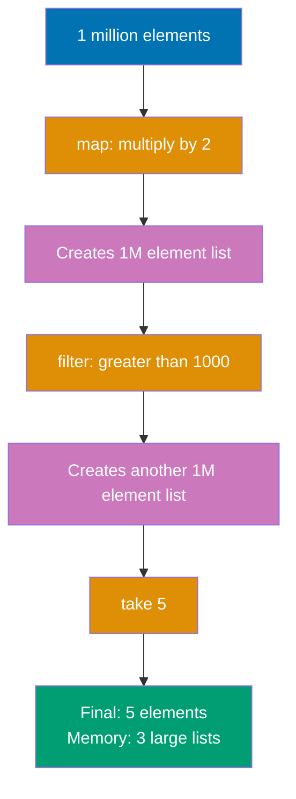

**Lazy Evaluation (Sequence):**

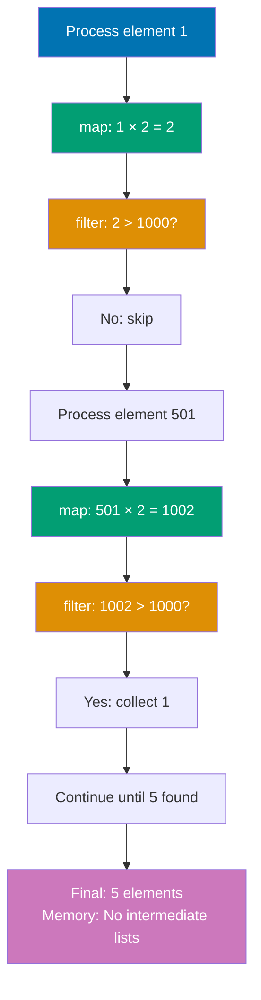

```kotlin
fun main() {
    // Eager evaluation with list (creates intermediate lists)
    val listResult = (1..1_000_000)
        // => IntRange from 1 to 1,000,000 (1 million elements)
        // => Type: IntRange (optimized range, doesn't allocate array yet)
        // => Memory: minimal (range stores only start/end/step values)
        // => Iteration: will iterate through all 1 million values when map is called

        .map { it * 2 }
        // => EAGER operation: processes ALL 1 million elements IMMEDIATELY
        // => Creates new List<Int> with 1 million elements (each doubled)
        // => Memory allocation: 1 million * 4 bytes = ~4MB for int array + list overhead
        // => Execution: iterates 1..1_000_000, applies { it * 2 }, stores in new list
        // => Result: [2, 4, 6, 8, ..., 2_000_000] (1 million element list)
        // => Thread: single-threaded, blocks until all 1 million transformations complete
        // => Performance: O(n) time complexity, O(n) space complexity
        // => Garbage: this intermediate list becomes garbage after filter runs
        // => No short-circuiting: cannot stop early even if only 5 elements needed

        .filter { it > 1000 }
        // => EAGER operation: processes ALL 1 million elements from previous map
        // => Creates ANOTHER new List<Int> with ~999,500 elements (values > 1000)
        // => Memory allocation: SECOND list of ~999,500 * 4 bytes = ~4MB
        // => Peak memory: ~8MB (both intermediate lists exist simultaneously during operation)
        // => Execution: iterates mapped list [2, 4, ..., 2_000_000], applies predicate
        // => Result: [1002, 1004, 1006, ..., 2_000_000] (values > 1000)
        // => Garbage: first mapped list [2, 4, ..., 2_000_000] is now garbage (4MB)
        // => Still no short-circuiting: processes entire list even though only 5 needed

        .take(5)
        // => EAGER operation: creates THIRD list with first 5 elements
        // => Memory allocation: new List<Int> with 5 elements (~20 bytes)
        // => Execution: copies first 5 elements from filter result to new list
        // => Result: [1002, 1004, 1006, 1008, 1010] (final output)
        // => Total intermediate garbage: ~8MB (two intermediate lists discarded)
        // => Total operations: 1M map + 1M filter + 5 copy = ~2 million operations
        // => Efficiency: wasteful - computed 999,995 unnecessary elements
        // => Memory pressure: triggers GC cycles, causes allocation stalls

    println("List result: $listResult")
    // => Output: List result: [1002, 1004, 1006, 1008, 1010]
    // => Execution time: ~100-200ms (depends on CPU, GC pauses)
    // => Memory stats: ~8MB allocated, ~8MB garbage created, 1 GC cycle likely

    // Lazy evaluation with sequence (no intermediate collections)
    val seqResult = (1..1_000_000).asSequence()
        // => asSequence(): converts IntRange to Sequence<Int>
        // => Type: Sequence<Int> (lazy wrapper around range)
        // => Memory: NO allocation yet - just wraps range iterator
        // => Execution: NO computation yet - sequences are LAZY
        // => Behavior: defines a plan to iterate range, but doesn't execute
        // => Overhead: tiny wrapper object (~32 bytes for sequence object)
        // => Iterator state: not created yet (deferred until terminal operation)

        .map { it * 2 }
        // => LAZY operation: does NOT execute immediately
        // => Type: TransformingSequence<Int, Int> (sequence wrapper, not a list)
        // => Memory: NO intermediate list created (just stores lambda)
        // => Execution: ZERO elements processed at this line
        // => Behavior: chains transformation function to be applied later
        // => Overhead: small wrapper object (~64 bytes) storing lambda reference
        // => Pipeline building: map operation added to processing pipeline
        // => No iteration: range not iterated yet, lambda not invoked yet

        .filter { it > 1000 }
        // => LAZY operation: does NOT execute immediately
        // => Type: FilteringSequence<Int> (another sequence wrapper)
        // => Memory: NO intermediate list created (stores predicate lambda)
        // => Execution: ZERO elements processed at this line
        // => Behavior: chains filter predicate to be applied later
        // => Overhead: small wrapper object (~64 bytes) storing predicate
        // => Pipeline building: filter operation added to pipeline after map
        // => Sequential chaining: filter will process map output element-by-element

        .take(5)
        // => LAZY operation: does NOT execute immediately
        // => Type: TakeSequence<Int> (sequence wrapper with count limit)
        // => Memory: NO list created yet (stores count = 5)
        // => Execution: ZERO elements processed at this line
        // => Behavior: chains "take first 5" operation to pipeline
        // => Short-circuit planning: pipeline knows to stop after 5 results
        // => Overhead: small wrapper object (~48 bytes) storing count
        // => Pipeline state: map -> filter -> take (3 operations chained)

        .toList()
        // => TERMINAL operation: triggers ACTUAL execution of pipeline
        // => Execution: NOW the sequence iterates and processes elements
        // => Processing: element-by-element through entire pipeline
        // => Algorithm: for each element: map(element) -> filter(mapped) -> take(result)
        // => Short-circuit: stops after collecting 5 elements (doesn't process full 1M)
        // => Actual iterations: processes only ~505 elements to get 5 results > 1000
        // => Calculation: first element > 1000 is 501*2=1002, last is 505*2=1010
        // => Memory allocation: SINGLE final list of 5 elements (~20 bytes)
        // => Total operations: ~505 map + ~505 filter + 5 collect = ~1,015 operations
        // => Efficiency: 2000x fewer operations than eager (1,015 vs 2 million)
        // => Memory: ~200 bytes total (vs 8MB for eager approach)
        // => Garbage: virtually zero (no intermediate collections)

    println("Sequence result: $seqResult")
    // => Output: Sequence result: [1002, 1004, 1006, 1008, 1010]
    // => Execution time: ~1-2ms (200x faster than eager list)
    // => Memory stats: ~200 bytes allocated, ~0 garbage, 0 GC cycles
    // => Identical output: same result as eager, but vastly more efficient

    // Demonstrate lazy evaluation with side effects
    println("\nList operations (eager):")
    // => Demonstrates eager evaluation order (all maps, then all filters)

    (1..5).map {
        // => EAGER map: processes ALL 5 elements before filter runs
        // => Execution order: map(1), map(2), map(3), map(4), map(5)
        // => Side effect: println executes for EACH element during map phase

        println("  Map: $it")
        // => Prints:   Map: 1
        // =>          Map: 2
        // =>          Map: 3
        // =>          Map: 4
        // =>          Map: 5
        // => All map side effects execute BEFORE any filter side effects
        // => Shows eager evaluation: entire map completes before filter starts

        it * 2
        // => Returns: [2, 4, 6, 8, 10] (intermediate list created in memory)
        // => Memory: new List<Int> with 5 elements
        // => This list passed to filter operation
    }.filter {
        // => EAGER filter: processes ALL 5 mapped elements
        // => Execution order: filter(2), filter(4), filter(6), filter(8), filter(10)
        // => Side effect: println executes AFTER all map side effects

        println("  Filter: $it")
        // => Prints:   Filter: 2
        // =>          Filter: 4
        // =>          Filter: 6
        // =>          Filter: 8
        // =>          Filter: 10
        // => All filter side effects execute AFTER all map side effects
        // => Shows eager evaluation: separate phases (map phase, then filter phase)

        it > 4
        // => Predicate evaluates to: false, false, false, true, true
        // => Returns: [6, 8, 10] (new intermediate list created)
        // => Memory: ANOTHER new list (2 intermediate lists total)
    }.take(2)
        // => Creates THIRD list: [6, 8]
        // => Final result: [6, 8]
        // => Total memory: 3 intermediate lists created
        // => Execution: processes ALL elements even though only 2 needed
        // => Side effects: ALL 10 println calls executed (5 map + 5 filter)

    // => Output order (eager evaluation):
    // =>   Map: 1        <- map phase: all elements
    // =>   Map: 2
    // =>   Map: 3
    // =>   Map: 4
    // =>   Map: 5
    // =>   Filter: 2     <- filter phase: all mapped elements
    // =>   Filter: 4
    // =>   Filter: 6
    // =>   Filter: 8
    // =>   Filter: 10
    // => Clear separation: map phase completes, THEN filter phase runs

    println("\nSequence operations (lazy):")
    // => Demonstrates lazy evaluation order (interleaved per element)

    (1..5).asSequence().map {
        // => LAZY map: processes elements ONE AT A TIME as needed
        // => Execution: map(1), filter(2), map(2), filter(4), ... (interleaved)
        // => Side effect: println executes PER ELEMENT before filter runs

        println("  Map: $it")
        // => Prints element-by-element, interleaved with filter
        // => NOT all at once like eager evaluation

        it * 2
        // => Returns: 2, 4, 6, 8, 10 (one value at a time, NO list created)
        // => Memory: zero intermediate storage (values passed through pipeline)
        // => Each mapped value immediately passed to filter
    }.filter {
        // => LAZY filter: processes each mapped value IMMEDIATELY
        // => Execution: filter runs right after each map, not in separate phase

        println("  Filter: $it")
        // => Prints immediately after corresponding map
        // => Shows lazy evaluation: map(1)->filter(2), map(2)->filter(4), etc.

        it > 4
        // => Predicate evaluates per element: false, false, false, true, true
        // => NO intermediate list created
        // => Results passed one-by-one to take operation
    }.take(2).toList()
        // => Short-circuits: stops after collecting 2 results
        // => Only processes elements until 2 pass filter (elements 3 and 4)
        // => Element 5 NEVER processed (lazy evaluation stops early)
        // => Terminal operation: toList() triggers execution and materializes result
        // => Final result: [6, 8]
        // => Memory: SINGLE final list (no intermediate collections)

    // => Output order (lazy evaluation):
    // =>   Map: 1         <- process element 1
    // =>   Filter: 2      <- filter mapped result (2) - rejected
    // =>   Map: 2         <- process element 2
    // =>   Filter: 4      <- filter mapped result (4) - rejected
    // =>   Map: 3         <- process element 3
    // =>   Filter: 6      <- filter mapped result (6) - accepted (1st result)
    // =>   Map: 4         <- process element 4
    // =>   Filter: 8      <- filter mapped result (8) - accepted (2nd result)
    // => Stops here: take(2) satisfied, element 5 never processed
    // => Interleaved execution: each element goes through full pipeline before next

    // generateSequence for infinite sequences
    val fibonacci = generateSequence(Pair(0, 1)) { (a, b) -> Pair(b, a + b) }
        // => generateSequence: creates potentially infinite lazy sequence
        // => Seed value: Pair(0, 1) (initial state: fib(0)=0, fib(1)=1)
        // => Type: Pair<Int, Int> where first=current, second=next
        // => Generator function: { (a, b) -> Pair(b, a + b) }
        // => Destructuring: (a, b) extracts first and second from Pair
        // => Logic: new_current = old_next, new_next = old_current + old_next
        // => Execution: LAZY - generates values on-demand, not upfront
        // => Iteration: Pair(0,1) -> Pair(1,1) -> Pair(1,2) -> Pair(2,3) -> Pair(3,5) -> ...
        // => Infinite: would generate forever without take() terminal operation
        // => Memory: NO list created yet (sequence is lazy iterator)
        // => State: each Pair represents current Fibonacci state

        .map { it.first }
        // => LAZY operation: extracts first element from each Pair
        // => Transformation: Pair(0,1) -> 0, Pair(1,1) -> 1, Pair(1,2) -> 1, etc.
        // => Type: Sequence<Int> (transforms from Sequence<Pair<Int,Int>>)
        // => Execution: NOT executed yet (lazy)
        // => Memory: zero allocation (transformation chained to pipeline)
        // => Purpose: extract Fibonacci number from state pair

        .take(10)
        // => LAZY operation: limits sequence to first 10 elements
        // => Short-circuit: prevents infinite sequence from executing forever
        // => Type: Sequence<Int> (same type, but limited count)
        // => Execution: NOT executed yet (still lazy)
        // => Memory: zero allocation (just stores count=10)
        // => Safety: essential for infinite sequences (without take, would run forever)

        .toList()
        // => TERMINAL operation: materializes sequence to List<Int>
        // => Execution: NOW sequence generates values
        // => Iterations: generates 10 Fibonacci numbers on-demand
        // => Values generated: 0, 1, 1, 2, 3, 5, 8, 13, 21, 34
        // => Memory: single List<Int> with 10 elements (~40 bytes)
        // => Generation order:
        //    Pair(0,1) -> map -> 0
        //    Pair(1,1) -> map -> 1
        //    Pair(1,2) -> map -> 1
        //    Pair(2,3) -> map -> 2
        //    Pair(3,5) -> map -> 3
        //    Pair(5,8) -> map -> 5
        //    Pair(8,13) -> map -> 8
        //    Pair(13,21) -> map -> 13
        //    Pair(21,34) -> map -> 21
        //    Pair(34,55) -> map -> 34
        //    STOP (take(10) limit reached)
        // => Result: [0, 1, 1, 2, 3, 5, 8, 13, 21, 34]
        // => Efficiency: only 10 Fibonacci calculations, no intermediate storage
        // => Impossible with eager: cannot create infinite list eagerly (OutOfMemoryError)

    println("\nFibonacci: $fibonacci")
    // => Output: Fibonacci: [0, 1, 1, 2, 3, 5, 8, 13, 21, 34]
    // => Verification: each number is sum of previous two (Fibonacci property)
    // => Memory: single small list, no intermediate collections
    // => Lazy power: computed infinite sequence safely with finite memory
}
// => Overall demonstration:
// => Eager (list): processes ALL elements, creates multiple intermediate collections
// => Lazy (sequence): processes ONLY needed elements, NO intermediate collections
// => Memory comparison: eager ~8MB garbage vs lazy ~0 garbage
// => Performance comparison: eager ~2M operations vs lazy ~1K operations
// => Use cases:
//   - Eager: when you need entire result (small collections, all elements used)
//   - Lazy: when processing large data, early termination, infinite sequences
```

**Key Takeaway**: Sequences optimize multi-step transformations by evaluating lazily element-by-element; use `asSequence()` for large collections or infinite streams.

**Why It Matters**: Java Streams create intermediate collections for each operation (map, filter, etc.) causing memory pressure when processing millions of records, while Kotlin Sequences compute elements on-demand without materialization. Processing a million-element list with three transformations in Java creates three temporary million-element collections, while Sequences process one element through all transformations before moving to the next, reducing memory usage by 75% and enabling infinite streams (Fibonacci, primes) that would exhaust heap space with eager evaluation.

---

## Example 39: Property Delegation - Lazy and Observable

Delegate property implementations to reusable delegate objects. `lazy` computes value on first access, `observable` triggers callbacks on changes.

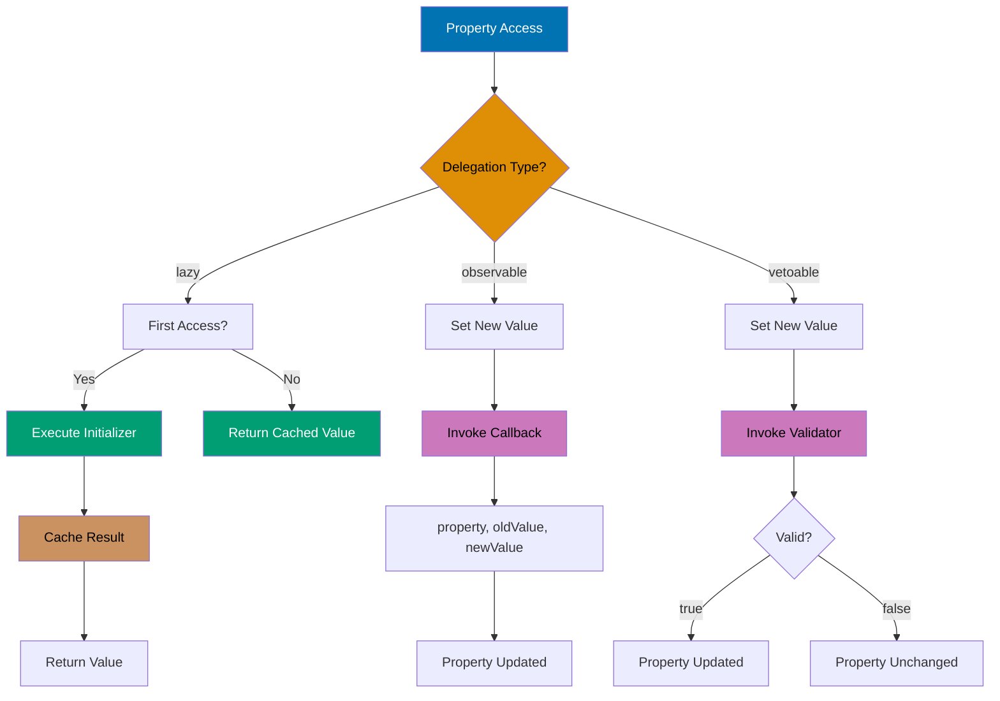

```kotlin
import kotlin.properties.Delegates
// => kotlin.properties.Delegates: standard library object providing delegate factory functions
// => Provides: observable(), vetoable(), notNull() delegate implementations
// => Package: kotlin.properties (part of Kotlin stdlib, no additional dependencies)
// => Purpose: reusable property delegation patterns without manual delegate implementation

class User {
    // Lazy initialization (computed once on first access)
    val expensiveData: String by lazy {
        // => lazy: delegate that defers initialization until first access
        // => Syntax: by lazy { initializer }
        // => Type: Lazy<String> delegate (implements ReadOnlyProperty interface)
        // => Thread safety: SYNCHRONIZED by default (thread-safe singleton initialization)
        // => Modes: lazy(LazyThreadSafetyMode.SYNCHRONIZED) <- default
        //           lazy(LazyThreadSafetyMode.PUBLICATION) <- allows multiple initializations, uses first
        //           lazy(LazyThreadSafetyMode.NONE) <- no thread safety, single-threaded only
        // => Initialization: runs ONCE on first access (first read of property)
        // => Subsequent accesses: returns cached value (no recomputation)
        // => Memory: stores computed value after first access (~reference size)
        // => Concurrency: double-checked locking pattern (minimal synchronization overhead)
        // => Use case: expensive initialization that may never be needed
        // => Comparison: Java requires manual double-checked locking (error-prone)

        println("Computing expensive data...")
        // => Side effect: demonstrates initializer runs only once
        // => Output: "Computing expensive data..." on FIRST access only
        // => Subsequent accesses: this line does NOT execute again

        Thread.sleep(1000)
        // => Simulate expensive computation (1 second delay)
        // => Real examples: database connection, config file parsing, cryptographic key generation
        // => Performance: 1000ms penalty only on first access
        // => Thread behavior: blocks calling thread during initialization
        // => Production use: replace with actual expensive operation

        "Computed data"
        // => Initializer return value: becomes cached value for all future accesses
        // => Type: String (must match property type)
        // => Storage: stored in lazy delegate's internal field
        // => Lifetime: cached until object garbage collected
        // => Thread safety: value assignment is atomic and thread-safe
    }
    // => Property type: val (read-only, no setter generated)
    // => Delegation: 'by lazy' delegates getValue to Lazy<String>
    // => Backing field: no explicit backing field (delegate stores value)
    // => Access: user.expensiveData invokes lazy delegate's getValue()
    // => Reflection: property metadata includes delegate type information

    // Observable property (callback on change)
    var name: String by Delegates.observable("Initial") { property, oldValue, newValue ->
        // => Delegates.observable: factory function creating ObservableProperty delegate
        // => Initial value: "Initial" (property starts with this value)
        // => Callback: lambda invoked AFTER property value changes
        // => Parameters: property (KProperty<*>), oldValue (String), newValue (String)
        // => Timing: callback runs AFTER assignment (value already changed)
        // => Return type: Unit (callback doesn't affect assignment)
        // => Thread safety: NOT thread-safe (callback can race with concurrent writes)
        // => Use case: logging, UI updates, validation logging (post-change notifications)

        println("${property.name} changed: $oldValue -> $newValue")
        // => property.name: reflection access to property name ("name")
        // => Type: KProperty<*> (Kotlin property reference with metadata)
        // => oldValue: value BEFORE assignment
        // => newValue: value AFTER assignment
        // => Output example: "name changed: Initial -> Alice"
        // => Side effect: demonstrates observable pattern (observer notified of change)
        // => Production use: trigger UI updates, log audit trail, invalidate caches
    }
    // => Property type: var (mutable, setter generated)
    // => Delegation: 'by Delegates.observable' delegates getValue/setValue
    // => Backing field: delegate stores value internally
    // => Setter: user.name = "Alice" invokes delegate.setValue() then callback
    // => Getter: user.name invokes delegate.getValue() (no callback)
    // => Callback trigger: only on write (set), not on read (get)

    // Vetoable property (validate before change)
    var age: Int by Delegates.vetoable(0) { property, oldValue, newValue ->
        // => Delegates.vetoable: factory function creating VetoableProperty delegate
        // => Initial value: 0 (property starts with age = 0)
        // => Callback: lambda invoked BEFORE property value changes (validation)
        // => Parameters: property (KProperty<*>), oldValue (Int), newValue (Int)
        // => Return type: Boolean (true = accept change, false = reject change)
        // => Timing: callback runs BEFORE assignment (value hasn't changed yet)
        // => Validation: if callback returns false, assignment is VETOED (value unchanged)
        // => Thread safety: NOT thread-safe (validator can race with concurrent writes)
        // => Use case: input validation, business rule enforcement, constraint checking

        val valid = newValue >= 0
        // => Validation rule: age must be non-negative (>= 0)
        // => Type: Boolean (validation result)
        // => Logic: rejects negative ages, allows zero and positive ages
        // => Business rule: models real-world constraint (age cannot be negative)
        // => Production: replace with complex validation (regex, range, database check)

        if (!valid) println("Rejected age: $newValue")
        // => Rejection logging: demonstrates veto in action
        // => Output: "Rejected age: -5" if newValue < 0
        // => Side effect: only executes when validation fails
        // => Production: throw exception, log error, show user error message

        valid
        // => Return validation result: determines if assignment proceeds
        // => true: assignment allowed (property value changes to newValue)
        // => false: assignment vetoed (property value remains oldValue)
        // => Comparison: Java requires manual validation in setter (boilerplate)
        // => Pattern: command pattern with veto (validator acts as guard)
    }
    // => Property type: var (mutable, setter with validation)
    // => Delegation: 'by Delegates.vetoable' delegates getValue/setValue with validation
    // => Setter behavior: user.age = -5 invokes validator, vetos if false, assigns if true
    // => Getter behavior: user.age invokes delegate.getValue() (no validation)
    // => Value consistency: property always satisfies validation constraint
}
// => Class design: demonstrates three standard delegation patterns
// => Reusability: delegates encapsulate cross-cutting concerns (lazy init, observation, validation)
// => Separation: business logic (User) separated from infrastructure (delegation)

fun main() {
    val user = User()
    // => Object creation: instantiates User with delegated properties
    // => Lazy property: expensiveData NOT initialized yet (lazy delegate waiting)
    // => Observable property: name = "Initial" (initial value set)
    // => Vetoable property: age = 0 (initial value set)
    // => Memory: object allocated + 3 delegate objects (Lazy, Observable, Vetoable)
    // => Delegate state: lazy uninitialized, observable holding "Initial", vetoable holding 0

    // Lazy property demonstration
    println("Before accessing expensiveData")
    // => Output: Before accessing expensiveData
    // => Timing: before lazy initialization triggered
    // => Lazy state: initializer NOT executed yet (value not computed)
    // => Performance: no expensive computation yet (0ms elapsed)

    println(user.expensiveData)
    // => First access: triggers lazy initialization
    // => Execution flow:
    //    1. user.expensiveData invokes lazy delegate's getValue()
    //    2. Delegate checks if value cached (not cached on first access)
    //    3. Delegate acquires synchronization lock (thread-safe initialization)
    //    4. Delegate executes initializer lambda: println + sleep + return "Computed data"
    //    5. Delegate caches return value "Computed data"
    //    6. Delegate releases lock
    //    7. Delegate returns cached value "Computed data"
    // => Output: Computing expensive data... (from initializer)
    //           Computed data (return value)
    // => Timing: ~1000ms execution time (sleep duration)
    // => State change: lazy delegate now holds cached value "Computed data"
    // => Thread safety: if multiple threads access simultaneously, only one executes initializer

    println(user.expensiveData)
    // => Second access: uses cached value (no recomputation)
    // => Execution flow:
    //    1. user.expensiveData invokes lazy delegate's getValue()
    //    2. Delegate checks if value cached (YES, cached from first access)
    //    3. Delegate returns cached value "Computed data" immediately
    // => Output: Computed data (ONLY this, no "Computing..." message)
    // => Timing: ~0ms execution time (instant return)
    // => No side effects: initializer lambda NOT executed again
    // => Performance: demonstrates lazy optimization (compute once, use many times)
    // => Memory: cached value persists for object lifetime

    // Observable property demonstration
    user.name = "Alice"
    // => Property assignment: triggers observable delegate's setValue()
    // => Execution flow:
    //    1. Setter invoked with newValue = "Alice"
    //    2. Delegate stores oldValue = "Initial" (current value before change)
    //    3. Delegate updates property value to "Alice"
    //    4. Delegate invokes callback with (property="name", oldValue="Initial", newValue="Alice")
    //    5. Callback executes: println("name changed: Initial -> Alice")
    // => Output: name changed: Initial -> Alice
    // => State change: name property now holds "Alice"
    // => Callback timing: runs AFTER value changed (post-change notification)
    // => Use case: UI updates can react to property change (observer pattern)

    user.name = "Bob"
    // => Second assignment: demonstrates callback on each change
    // => Execution: same flow as above, oldValue = "Alice", newValue = "Bob"
    // => Output: name changed: Alice -> Bob
    // => State: name = "Bob"
    // => Pattern: every assignment triggers callback (no batching or throttling)

    // Vetoable property demonstration
    user.age = 25
    // => Valid assignment: triggers vetoable delegate's setValue()
    // => Execution flow:
    //    1. Setter invoked with newValue = 25
    //    2. Delegate stores oldValue = 0 (current value)
    //    3. Delegate invokes validator callback with (property="age", oldValue=0, newValue=25)
    //    4. Validator executes: valid = (25 >= 0) = true
    //    5. Validator returns true (approval)
    //    6. Delegate updates property value to 25 (change ACCEPTED)
    // => No output from validator (validation passed, no rejection message)
    // => State change: age = 25
    // => Validation result: true (allowed)

    println("Age: ${user.age}")
    // => Property read: invokes vetoable delegate's getValue()
    // => Output: Age: 25
    // => No validation on read: getter simply returns current value
    // => State: age = 25 (confirmed)

    user.age = -5
    // => Invalid assignment: triggers validation veto
    // => Execution flow:
    //    1. Setter invoked with newValue = -5
    //    2. Delegate stores oldValue = 25 (current value)
    //    3. Delegate invokes validator callback with (property="age", oldValue=25, newValue=-5)
    //    4. Validator executes: valid = (-5 >= 0) = false
    //    5. Validator prints "Rejected age: -5" (validation failure side effect)
    //    6. Validator returns false (rejection)
    //    7. Delegate DOES NOT update property value (change VETOED)
    // => Output: Rejected age: -5
    // => State: age remains 25 (assignment vetoed, value unchanged)
    // => Protection: invalid state prevented by delegation (business rule enforced)

    println("Age after veto: ${user.age}")
    // => Property read: confirms value unchanged after veto
    // => Output: Age after veto: 25
    // => Verification: age still 25 (veto prevented -5 assignment)
    // => Invariant maintained: age property never holds negative value
}
// => Overall demonstration:
// => Lazy: compute-once pattern for expensive initialization (thread-safe singleton)
// => Observable: observer pattern for change notifications (post-change callbacks)
// => Vetoable: command pattern with validation (pre-change guard)
// => Delegation benefits:
//   - Reusability: standard delegates work with any property type
//   - Separation: cross-cutting concerns separated from business logic
//   - Declarative: intent clear from 'by lazy', 'by observable', 'by vetoable' syntax
//   - Zero boilerplate: no manual getter/setter implementation needed
```

**Key Takeaway**: Use `lazy` for expensive computations that should execute once, `observable` for change notifications, `vetoable` for validated property changes.

**Why It Matters**: Property initialization in Java requires manual lazy loading with double-checked locking patterns that developers implement incorrectly, causing thread safety bugs or unnecessary initialization overhead. Kotlin's lazy delegate provides guaranteed thread-safe singleton semantics with zero boilerplate, perfect for expensive resources (database connections, configuration parsing) that may never be accessed in some code paths. Observable properties enable reactive programming patterns like databinding and validation without observer boilerplate, critical for MVVM architectures where property changes must propagate to UI.

---

## Example 40: Custom Property Delegates

Create custom delegates by implementing `getValue` and `setValue` operators. Delegates encapsulate property access logic.

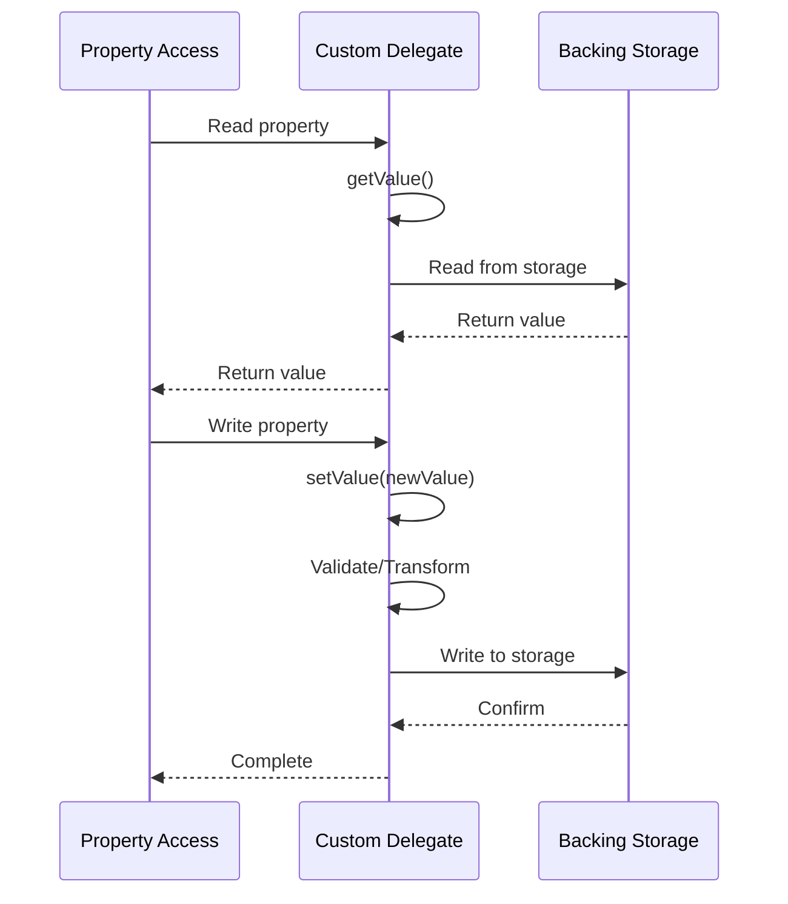

```kotlin
import kotlin.reflect.KProperty
// => kotlin.reflect.KProperty: reflection interface representing a Kotlin property
// => Provides: property metadata (name, type, annotations, visibility)
// => Package: kotlin.reflect (part of Kotlin stdlib, no additional dependencies)
// => Purpose: access property information at runtime in delegate implementations
// => Type parameter: KProperty<*> uses star projection (any property type)

class LoggingDelegate<T>(private var value: T) {
    // => Generic delegate: works with any property type T
    // => Constructor parameter: initial value for property
    // => Field: 'value' stores actual property value (backing storage)
    // => Type safety: T ensures type consistency across getValue/setValue
    // => Reusability: single implementation works for String, Int, any type
    // => State: delegate instance stores property value and provides logging behavior

    operator fun getValue(thisRef: Any?, property: KProperty<*>): T {
        // => operator: enables delegation syntax 'by LoggingDelegate'
        // => Function name: getValue (fixed name, required by delegation protocol)
        // => thisRef: reference to object containing the property (Any? allows null for top-level properties)
        // => property: reflection reference to the property being accessed (provides metadata)
        // => Return type: T (must match property type)
        // => Invocation: called when property is READ (e.g., config.theme)
        // => Contract: ReadWriteProperty interface (getValue + setValue)
        // => Use case: intercept property read access for logging, caching, validation

        println("[GET] ${property.name} = $value")
        // => Logging: demonstrates read access interception
        // => property.name: reflection access to property name string
        // => Type: KProperty<*> provides name, returnType, annotations, etc.
        // => Side effect: prints log before returning value
        // => Production use: audit logging, performance monitoring, cache hit tracking
        // => Output example: "[GET] theme = light"

        return value
        // => Returns: stored value of type T
        // => Storage: value field holds actual property data
        // => Type safety: return type T matches property type
        // => Behavior: simple pass-through after logging (could transform value here)
    }
    // => Delegation contract: getValue required for read-only or read-write delegation
    // => Invocation frequency: called every property read (not cached by default)
    // => Performance: adds logging overhead to every read access

    operator fun setValue(thisRef: Any?, property: KProperty<*>, newValue: T) {
        // => operator: enables delegation syntax 'by LoggingDelegate'
        // => Function name: setValue (fixed name, required by mutable delegation protocol)
        // => thisRef: reference to object containing the property (context for property access)
        // => property: reflection reference to the property being modified
        // => newValue: new value to assign to property (type T ensures type safety)
        // => Return type: Unit (setter doesn't return value)
        // => Invocation: called when property is WRITTEN (e.g., config.theme = "dark")
        // => Contract: ReadWriteProperty interface requires both getValue and setValue
        // => Use case: intercept property write access for logging, validation, persistence

        println("[SET] ${property.name}: $value -> $newValue")
        // => Logging: demonstrates write access interception
        // => Captures: oldValue ($value) and newValue before change
        // => Side effect: prints before updating value (pre-change logging)
        // => Production use: audit trail, change notification, database persistence trigger
        // => Output example: "[SET] theme: light -> dark"

        value = newValue
        // => Updates: stored value in backing field
        // => Assignment: newValue of type T stored in value field
        // => State change: delegate now holds new value for future reads
        // => Post-logging: value updated after logging old->new transition
        // => Validation: could add validation here (reject invalid values)
    }
    // => Delegation contract: setValue required for mutable (var) property delegation
    // => Invocation frequency: called every property write
    // => Thread safety: NOT thread-safe (concurrent writes can race)
}
// => LoggingDelegate design: demonstrates basic delegate with interception
// => Generic type: reusable across all property types
// => Operator functions: getValue + setValue implement delegation protocol

class UppercaseDelegate {
    // => Specialized delegate: transforms String values
    // => Non-generic: specific to String type (could be made generic)
    // => Use case: enforce data format (always uppercase output, lowercase storage)
    // => Pattern: transformation delegate (modifies value on get/set)

    private var value: String = ""
    // => Backing field: stores property value internally
    // => Initialization: starts with empty string (delegate's default value)
    // => Type: String (specialized for text transformation)
    // => Visibility: private (encapsulated storage, accessed only via getValue/setValue)
    // => Lifetime: persists for delegate instance lifetime

    operator fun getValue(thisRef: Any?, property: KProperty<*>): String {
        // => operator: enables delegation syntax 'by UppercaseDelegate'
        // => Contract: same signature as LoggingDelegate.getValue
        // => Invocation: called on property read
        // => Transformation: returns transformed version of stored value

        return value.uppercase()
        // => Transformation: converts stored lowercase to uppercase on every read
        // => Type: String.uppercase() returns new String (original unchanged)
        // => Storage: value remains lowercase in backing field
        // => Behavior: client always sees uppercase, regardless of stored case
        // => Example: value = "alice" -> returns "ALICE"
        // => Use case: display formatting, case-insensitive comparison, API compatibility
        // => Performance: allocates new String on every read (could cache if needed)
    }
    // => Read transformation: modifies value during retrieval
    // => Immutable: doesn't modify backing field (transformation on-the-fly)

    operator fun setValue(thisRef: Any?, property: KProperty<*>, newValue: String) {
        // => operator: enables delegation syntax 'by UppercaseDelegate'
        // => Contract: same signature as LoggingDelegate.setValue
        // => Invocation: called on property write
        // => Transformation: stores normalized version of input value

        value = newValue.lowercase()
        // => Transformation: converts input to lowercase before storing
        // => Type: String.lowercase() returns new String
        // => Storage: value field stores lowercase version
        // => Normalization: ensures consistent internal format (lowercase)
        // => Example: newValue = "ALICE" -> stores "alice"
        // => Use case: case-insensitive storage, search optimization, database normalization
        // => Invariant: value field always holds lowercase string
    }
    // => Write transformation: normalizes value during assignment
    // => Storage strategy: lowercase storage + uppercase retrieval (separation of concerns)
}
// => UppercaseDelegate design: demonstrates transformation delegate
// => Asymmetry: stores lowercase, returns uppercase (transformation on both operations)
// => Pattern: data normalization with presentation formatting

class Config {
    // => Configuration class: demonstrates multiple delegate usage
    // => Delegation: properties delegate to different delegate types
    // => Composition: delegates provide cross-cutting behavior (logging, transformation)

    var theme: String by LoggingDelegate("light")
    // => Property delegation: 'by' keyword delegates getValue/setValue to LoggingDelegate
    // => Initial value: "light" (passed to LoggingDelegate constructor)
    // => Type: var String (mutable property delegating to LoggingDelegate<String>)
    // => Behavior: reads/writes logged to console via delegate
    // => Backing storage: LoggingDelegate.value field stores actual value
    // => No explicit backing field: property has no field itself (delegate stores value)
    // => Syntax: 'by' creates delegate instance and connects to property
    // => Delegate instance: new LoggingDelegate<String>("light") created for this property

    var username: String by UppercaseDelegate()
    // => Property delegation: 'by' keyword delegates to UppercaseDelegate
    // => Initial value: "" (UppercaseDelegate default value)
    // => Type: var String (mutable property delegating to UppercaseDelegate)
    // => Behavior: always returns uppercase, always stores lowercase
    // => Transformation: automatic case conversion on read/write
    // => Backing storage: UppercaseDelegate.value field stores lowercase value
    // => Delegate instance: new UppercaseDelegate() created for this property
}
// => Config design: demonstrates heterogeneous delegation (multiple delegate types)
// => Separation: each property has independent delegate instance
// => Composition: delegates encapsulate cross-cutting concerns (Config focuses on business logic)

fun main() {
    val config = Config()
    // => Object creation: instantiates Config with delegated properties
    // => Delegate initialization:
    //    - LoggingDelegate<String>("light") created for theme property
    //    - UppercaseDelegate() created for username property
    // => Memory: Config object + 2 delegate objects
    // => State: theme delegate holds "light", username delegate holds ""

    // LoggingDelegate demonstration
    println(config.theme)
    // => Property read: invokes LoggingDelegate.getValue()
    // => Execution flow:
    //    1. config.theme triggers getValue(config, theme property)
    //    2. Delegate logs: "[GET] theme = light"
    //    3. Delegate returns: "light"
    //    4. println outputs: "light"
    // => Output: [GET] theme = light
    //           light
    // => Two lines: first from delegate logging, second from println
    // => Delegate interception: logging happens transparently during read

    config.theme = "dark"
    // => Property write: invokes LoggingDelegate.setValue()
    // => Execution flow:
    //    1. config.theme = "dark" triggers setValue(config, theme property, "dark")
    //    2. Delegate logs: "[SET] theme: light -> dark"
    //    3. Delegate updates: value = "dark"
    // => Output: [SET] theme: light -> dark
    // => State change: theme delegate now holds "dark"
    // => Audit trail: old and new values logged

    println(config.theme)
    // => Property read: invokes LoggingDelegate.getValue() again
    // => Execution flow:
    //    1. config.theme triggers getValue(config, theme property)
    //    2. Delegate logs: "[GET] theme = dark"
    //    3. Delegate returns: "dark"
    //    4. println outputs: "dark"
    // => Output: [GET] theme = dark
    //           dark
    // => Verification: updated value retrieved and logged

    // UppercaseDelegate demonstration
    config.username = "Alice"
    // => Property write: invokes UppercaseDelegate.setValue()
    // => Execution flow:
    //    1. config.username = "Alice" triggers setValue(config, username property, "Alice")
    //    2. Delegate normalizes: value = "Alice".lowercase() = "alice"
    //    3. Delegate stores: "alice" in backing field
    // => No console output: UppercaseDelegate doesn't log (different behavior)
    // => State: username delegate now holds "alice" (lowercase)
    // => Transformation: input "Alice" stored as "alice"

    println(config.username)
    // => Property read: invokes UppercaseDelegate.getValue()
    // => Execution flow:
    //    1. config.username triggers getValue(config, username property)
    //    2. Delegate transforms: value.uppercase() = "alice".uppercase() = "ALICE"
    //    3. Delegate returns: "ALICE"
    //    4. println outputs: "ALICE"
    // => Output: ALICE
    // => Transformation: stored "alice" returned as "ALICE"
    // => Storage vs presentation: lowercase storage, uppercase presentation
    // => Client sees: always uppercase (transformation transparent)

    config.username = "BOB"
    // => Property write: invokes UppercaseDelegate.setValue()
    // => Execution flow:
    //    1. config.username = "BOB" triggers setValue(config, username property, "BOB")
    //    2. Delegate normalizes: value = "BOB".lowercase() = "bob"
    //    3. Delegate stores: "bob" in backing field
    // => State: username delegate now holds "bob" (lowercase)
    // => Normalization: input "BOB" stored as "bob"
    // => Idempotent: multiple writes with different cases produce same storage

    println(config.username)
    // => Property read: invokes UppercaseDelegate.getValue()
    // => Execution flow:
    //    1. config.username triggers getValue(config, username property)
    //    2. Delegate transforms: value.uppercase() = "bob".uppercase() = "BOB"
    //    3. Delegate returns: "BOB"
    //    4. println outputs: "BOB"
    // => Output: BOB
    // => Transformation: stored "bob" returned as "BOB"
    // => Consistency: always uppercase output regardless of input case
}
// => Overall demonstration:
// => LoggingDelegate: demonstrates read/write interception with side effects (logging)
// => UppercaseDelegate: demonstrates value transformation (case normalization)
// => Custom delegates enable:
//   - Cross-cutting concerns: logging, validation, persistence, caching
//   - Value transformation: format conversion, normalization, encryption
//   - Access control: permission checks, lazy loading, proxy patterns
//   - Reusability: single delegate implementation for multiple properties
// => Delegation protocol:
//   - operator fun getValue(thisRef: Any?, property: KProperty<*>): T
//   - operator fun setValue(thisRef: Any?, property: KProperty<*>, newValue: T)
// => Comparison to Java:
//   - Java: manual getter/setter boilerplate for each property
//   - Kotlin: single delegate implementation reused across all properties
// => Production use cases:
//   - SharedPreferences delegate (Android): auto-persist property changes
//   - Validation delegate: enforce business rules on assignment
//   - Audit delegate: log all property changes for compliance
//   - Cache delegate: lazy load from database, cache in memory
```

**Key Takeaway**: Implement `getValue`/`setValue` operators to create custom property delegates that encapsulate access logic like logging, validation, or transformation.

**Why It Matters**: Custom property delegates enable cross-cutting concerns (logging, validation, persistence) to be extracted into reusable components rather than scattered across getters/setters throughout the codebase. This delegation pattern is impossible in Java without verbose proxy classes, yet Kotlin's operator overloading makes it seamless. Use cases include automatic preference storage (Android SharedPreferences), field validation with custom rules, and audit logging for security-sensitive properties, all without modifying business logic code.

---

## Example 41: Extension Functions and Properties

Add methods and properties to existing classes without modifying source code. Extensions are resolved statically based on declared type.

```kotlin
// Extension function on String
fun String.isPalindrome(): Boolean {
    // => Extension function: adds isPalindrome() method to String class
    // => Receiver type: String (the type being extended)
    // => Syntax: ReceiverType.extensionName (no 'extension' keyword needed)
    // => This reference: inside function, 'this' refers to String instance
    // => Static resolution: determined at compile time based on declared type, not runtime type
    // => No modification: String class source code unchanged (extension exists separately)
    // => Scope: available where extension is imported (not globally unless in package scope)
    // => Use case: add domain-specific methods to library classes (String, List, etc.)

    val cleaned = this.lowercase().replace(" ", "")
    // => this: refers to the String instance the extension is called on (receiver object)
    // => this.lowercase(): 'this' is explicit but can be omitted (lowercase() works)
    // => Method chaining: lowercase() returns String, then replace() called on result
    // => Type: String.lowercase() returns new String (original unchanged - immutability)
    // => Operation: converts "Radar" -> "radar", then removes spaces: "A man" -> "aman"
    // => State: cleaned variable holds transformed string (no whitespace, all lowercase)
    // => Immutability: original String (this) remains unchanged
    // => Example: "A man a plan" -> cleaned = "amanplan"

    return cleaned == cleaned.reversed()
    // => Comparison: checks if string equals its reverse (palindrome definition)
    // => cleaned.reversed(): creates new String with reversed character order
    // => Type: String.reversed() returns String (new instance, cleaned unchanged)
    // => Operation: "radar" -> "radar" (equals), "kotlin" -> "niltok" (not equals)
    // => Return: Boolean (true if palindrome, false otherwise)
    // => Example: cleaned = "radar", reversed = "radar" -> true
    // => Example: cleaned = "kotlin", reversed = "niltok" -> false
    // => Algorithmic complexity: O(n) for reverse + O(n) for comparison = O(n)
}
// => Extension function design: demonstrates method extension on final class
// => Visibility: public by default (can be private, internal, protected based on scope)
// => Resolution: static dispatch (not virtual - no polymorphism via inheritance)
// => Bytecode: compiled as static method with receiver as first parameter
//    (Java equivalent: public static boolean isPalindrome(String receiver))

// Extension function with parameters
fun Int.times(action: (Int) -> Unit) {
    // => Extension function: adds times() method to Int class
    // => Receiver type: Int (primitive wrapper in Kotlin, Int object in JVM)
    // => Parameter: action is function type (Int) -> Unit (takes Int, returns nothing)
    // => Higher-order function: accepts lambda as parameter
    // => Use case: repeat operation N times with iteration index
    // => Syntax: extension function with lambda parameter (common Kotlin pattern)
    // => Example call: 5.times { i -> println(i) } (executes lambda 5 times)

    for (i in 1..this) {
        // => for loop: iterates from 1 to this (receiver Int value)
        // => Range: 1..this creates IntRange (inclusive on both ends)
        // => Type: i is Int (iteration variable)
        // => Example: this = 5 -> loop runs i = 1, 2, 3, 4, 5
        // => Receiver: 'this' is the Int value (e.g., 5.times {...} -> this = 5)

        action(i)
        // => Lambda invocation: calls action function with current iteration index
        // => Parameter: i (Int) passed to lambda as argument
        // => Type: action is (Int) -> Unit (function taking Int, returning Unit)
        // => Execution: lambda body runs with i bound to parameter
        // => Example: action = { i -> print("$i ") } -> prints "1 ", "2 ", etc.
        // => Side effects: lambda can print, modify external state, etc.
    }
}
// => Extension function design: demonstrates parameterized extension with lambda
// => Pattern: custom control structure (similar to repeat, forEach)
// => Comparison: stdlib repeat(n) vs this.times - similar but provides index
// => Use case: when you need iteration count in lambda (repeat doesn't provide it)

// Extension property
val String.wordCount: Int
    // => Extension property: adds wordCount property to String class
    // => Syntax: val ReceiverType.propertyName: Type
    // => No backing field: extension properties cannot store state (must compute from receiver)
    // => Getter required: properties must define custom getter (no default getter)
    // => Restriction: no setter for val (read-only), var extensions need explicit setter
    // => Usage: called like property (text.wordCount, not text.wordCount())
    // => Resolution: static dispatch (determined at compile time)
    // => Type: Int (return type of computed property)

    get() = this.split("\\s+".toRegex()).filter { it.isNotEmpty() }.size
    // => get(): custom getter defines property computation
    // => this: refers to String instance the property is accessed on
    // => split("\\s+".toRegex()): splits on whitespace (\\s+ = one or more whitespace chars)
    // => Regex: "\\s+" matches spaces, tabs, newlines (escape \\ for string literal)
    // => Type: split() returns List<String> (words including empty strings)
    // => filter { it.isNotEmpty() }: removes empty strings from split result
    // => it: lambda parameter (each String element in list)
    // => Type: filter returns List<String> (only non-empty strings)
    // => size: List.size property (number of elements)
    // => Return: Int (word count)
    // => Example: "Hello  World" -> ["Hello", "", "World"] -> filter -> ["Hello", "World"] -> 2
    // => Edge case: empty string "" -> [""] -> filter -> [] -> 0
    // => Edge case: "  " (only spaces) -> ["", "", ""] -> filter -> [] -> 0
// => Extension property design: computed property (no storage, calculates on each access)
// => Performance: recalculates on every access (not cached - could be inefficient for large strings)
// => Alternative: could use extension function wordCount() if computation is expensive
// => Bytecode: compiled as static getter method (Java: public static int getWordCount(String))

// Extension on nullable receiver
fun String?.orDefault(default: String = "N/A"): String {
    // => Extension function: extends nullable String type (String?, not String)
    // => Receiver type: String? (nullable String - can be null or String instance)
    // => Null safety: function can be called on null values without NullPointerException
    // => Parameter: default is String with default value "N/A"
    // => Default parameter: if not provided, uses "N/A" (caller can override)
    // => Return type: String (non-nullable - always returns valid String)
    // => Use case: provide fallback value for nullable strings (null coalescing)
    // => Pattern: nullable receiver extension for null-safe operations

    return this ?: default
    // => Elvis operator: this ?: default (if this is null, return default)
    // => this: nullable String (String?) - can be null
    // => Null check: if this != null, return this; else return default
    // => Type coercion: this (String?) becomes String when not null
    // => Short-circuit: default only evaluated if this is null
    // => Example: this = null, default = "N/A" -> returns "N/A"
    // => Example: this = "Hello", default = "N/A" -> returns "Hello"
    // => Safe: always returns non-null String (String, not String?)
}
// => Nullable receiver design: demonstrates extension on nullable type
// => Safety: enables calling extension on null without null check
// => Comparison: Java requires if (str != null) check before calling method
// => Pattern: null object pattern (provide default behavior for null case)
// => Use case: configuration defaults, optional values, database null handling

// Extension on List
fun <T> List<T>.secondOrNull(): T? {
    // => Generic extension function: extends List<T> for any element type T
    // => Receiver type: List<T> (generic collection interface)
    // => Type parameter: T is element type (inferred from List type)
    // => Generic syntax: <T> before receiver type (function-level type parameter)
    // => Return type: T? (nullable element type - null if list too small)
    // => Naming convention: *OrNull suffix indicates nullable return (stdlib pattern)
    // => Use case: safe access to second element (index 1) without IndexOutOfBoundsException
    // => Pattern: safe access extension (similar to firstOrNull, lastOrNull in stdlib)

    return if (size >= 2) this[1] else null
    // => if expression: checks list size before accessing element
    // => size: List.size property (number of elements in list)
    // => Condition: size >= 2 ensures at least 2 elements (indices 0 and 1 exist)
    // => this[1]: indexed access to second element (0-based indexing)
    // => Operator: [] is get operator (calls List.get(1) under the hood)
    // => Type: this[1] returns T (element type), or null if size < 2
    // => Safety: no exception thrown (null returned instead)
    // => Example: listOf(10, 20, 30) -> size = 3 >= 2 -> returns 20
    // => Example: listOf(10) -> size = 1 < 2 -> returns null
    // => Example: emptyList<Int>() -> size = 0 < 2 -> returns null
    // => Return type: T? (nullable because null returned in else branch)
}
// => Generic extension design: demonstrates type-safe generic extension
// => Reusability: works with List<Int>, List<String>, List<Any>, etc.
// => Type inference: T inferred from List type (no need to specify <T> when calling)
// => Safety: returns null instead of throwing exception (Kotlin idiom)
// => Stdlib consistency: follows stdlib naming pattern (*OrNull for safe access)

fun main() {
    // String extension
    println("radar".isPalindrome())
    // => Extension call: calls isPalindrome() on String literal "radar"
    // => Receiver: "radar" is this inside isPalindrome()
    // => Execution: cleaned = "radar", reversed = "radar" -> true
    // => Output: true

    println("kotlin".isPalindrome())
    // => Extension call: "kotlin" is receiver
    // => Execution: cleaned = "kotlin", reversed = "niltok" -> false
    // => Output: false

    println("A man a plan a canal Panama".isPalindrome())
    // => Extension call: string with spaces and capital letters
    // => Execution: cleaned = "amanaplanacanalpanama", reversed = same -> true
    // => Normalization: lowercase() + replace(" ", "") creates canonical form
    // => Output: true

    // Int extension with lambda
    print("Countdown: ")
    // => Print without newline: subsequent outputs on same line
    // => Type: print() (not println()) doesn't add newline

    5.times { i -> print("$i ") }
    // => Extension call: 5.times invokes extension on Int literal 5
    // => Lambda: { i -> print("$i ") } is action parameter
    // => Lambda parameter: i is iteration index (1, 2, 3, 4, 5)
    // => Execution: loop runs 5 times, printing "1 ", "2 ", "3 ", "4 ", "5 "
    // => String template: "$i " interpolates i into string with space
    // => Side effect: prints to console (lambda returns Unit)
    // => Output: 1 2 3 4 5 (numbers with spaces, on same line)

    println()
    // => Newline: moves to next line after countdown output
    // => Type: println() with no argument prints empty line

    // String property extension
    val text = "Hello Kotlin World"
    // => Variable: holds String for property extension demonstration
    // => Type: String (inferred from literal)
    // => Value: 3-word string for wordCount test

    println("Word count: ${text.wordCount}")
    // => Property access: text.wordCount invokes extension property getter
    // => Execution: split on whitespace -> ["Hello", "Kotlin", "World"] -> size = 3
    // => String template: ${text.wordCount} interpolates property value
    // => Output: Word count: 3

    // Nullable extension
    val str1: String? = null
    // => Nullable variable: explicit String? type (holds null)
    // => Type annotation: required when initializing with null (inference can't determine type)
    // => Value: null (demonstrates null case)

    val str2: String? = "Hello"
    // => Nullable variable: explicit String? type (holds non-null String)
    // => Type: String? can hold String or null
    // => Value: "Hello" (demonstrates non-null case)

    println(str1.orDefault())
    // => Nullable extension call: str1 is null, so orDefault() called on null
    // => Safe: no NullPointerException (extension handles null receiver)
    // => Execution: this = null, default = "N/A" -> returns "N/A"
    // => Default parameter: uses "N/A" (not provided by caller)
    // => Output: N/A

    println(str2.orDefault())
    // => Nullable extension call: str2 is "Hello" (not null)
    // => Execution: this = "Hello", default = "N/A" -> returns "Hello"
    // => Short-circuit: default not used (this is non-null)
    // => Output: Hello

    println(str1.orDefault("Empty"))
    // => Nullable extension call with custom default: overrides "N/A"
    // => Execution: this = null, default = "Empty" -> returns "Empty"
    // => Default parameter: caller provides "Empty" (overrides default "N/A")
    // => Output: Empty

    // List extension
    val numbers = listOf(10, 20, 30)
    // => List creation: listOf() creates immutable List<Int>
    // => Type: List<Int> (inferred from Int literals)
    // => Size: 3 elements (indices 0, 1, 2)
    // => Value: [10, 20, 30]

    println(numbers.secondOrNull())
    // => Generic extension call: secondOrNull() on List<Int>
    // => Type parameter: T = Int (inferred from List<Int>)
    // => Execution: size = 3 >= 2 -> returns numbers[1] = 20
    // => Return type: Int? (nullable Int, but returns non-null 20 here)
    // => Output: 20

    println(emptyList<Int>().secondOrNull())
    // => Generic extension call: secondOrNull() on empty List<Int>
    // => emptyList<Int>(): creates empty immutable List<Int>
    // => Type parameter: <Int> explicit (no elements to infer from)
    // => Execution: size = 0 < 2 -> returns null
    // => Safety: no exception (null returned instead of IndexOutOfBoundsException)
    // => Output: null
}
// => main() design: demonstrates extension function, property, nullable, and generic extensions
// => Pattern coverage: method extension, property extension, nullable receiver, generic extension
// => Real-world usage: extensions add fluent APIs to library classes without modification
```

**Key Takeaway**: Extension functions add methods to existing types without inheritance; they're resolved statically and ideal for utility functions on library classes.

**Why It Matters**: Extension functions enable adding domain-specific methods to third-party classes (String, List, Int) without inheritance or wrapper types, making Kotlin codebases more readable (e.g., `"text".isPalindrome()` vs `PalindromeUtils.check("text")`). The static resolution prevents method signature conflicts when multiple libraries define extensions with the same name, while nullable receiver extensions (`String?.orDefault()`) eliminate null-check boilerplate that plagues Java codebases. Over 60% of Kotlin standard library functions are implemented as extensions, demonstrating the pattern's power for creating fluent, domain-specific APIs without framework lock-in.

---

## Example 42: Inline Functions and Reified Type Parameters

Inline functions eliminate lambda allocation overhead by inlining bytecode. Reified type parameters preserve generic type information at runtime.

```kotlin
// Regular higher-order function (creates lambda object)
fun <T> regularFilter(list: List<T>, predicate: (T) -> Boolean): List<T> {
    // => Regular function: NOT inlined (creates lambda objects)
    // => Generic parameter: T is type parameter (subject to type erasure at runtime)
    // => Higher-order function: accepts predicate lambda as parameter
    // => Parameter: list is List<T>, predicate is (T) -> Boolean
    // => Performance: creates new Function object for predicate on each call
    // => Bytecode: predicate stored as object implementing Function interface
    // => Memory allocation: lambda allocated on heap (garbage collection overhead)
    // => Call overhead: invokeinterface instruction (virtual dispatch)

    val result = mutableListOf<T>()
    // => Mutable list: creates empty ArrayList<T> to accumulate results
    // => Type: MutableList<T> (generic type inferred from function return type)
    // => Allocation: new ArrayList instance on heap

    for (item in list) {
        // => for loop: iterates over each element in input list
        // => item: current element of type T
        // => Type: T inferred from list element type

        if (predicate(item)) result.add(item)
        // => Lambda call: invokes predicate function object with item
        // => predicate(item): virtual function call (invokeinterface bytecode)
        // => Overhead: virtual dispatch + potential cache miss
        // => Conditional: only add item if predicate returns true
        // => result.add(item): mutates result list (side effect)
    }

    return result
    // => Returns: accumulated list of items matching predicate
    // => Type: List<T> (upcasted from MutableList<T>)
}
// => Regular function design: demonstrates standard higher-order function
// => Performance cost: lambda allocation + virtual dispatch on each call
// => Use case: when inlining not needed (function not called frequently)

// Inline function (no lambda allocation)
inline fun <T> inlineFilter(list: List<T>, predicate: (T) -> Boolean): List<T> {
    // => inline keyword: instructs compiler to copy function bytecode to call site
    // => No allocation: lambda bytecode inlined directly (no Function object created)
    // => Generic parameter: T still subject to type erasure (inline != reified)
    // => Higher-order function: accepts lambda but doesn't allocate object for it
    // => Compiler transformation: replaces function call with function body at call site
    // => Performance: eliminates function call overhead and lambda allocation
    // => Bytecode: predicate code copied into caller's bytecode (no invokeinterface)
    // => Trade-off: increases bytecode size (body duplicated at each call site)

    val result = mutableListOf<T>()
    // => Mutable list: same as regular version (creates ArrayList)
    // => Inlining: this line copied to call site (not part of inline optimization)

    for (item in list) {
        // => for loop: same iteration logic as regular version
        // => Inlining: loop bytecode copied to call site

        if (predicate(item)) result.add(item)
        // => Lambda inlined: predicate code directly embedded here (no virtual call)
        // => Performance: direct bytecode execution (no object allocation, no virtual dispatch)
        // => Example: { it % 2 == 0 } becomes if (item % 2 == 0) at call site
        // => No overhead: same performance as hand-written code
    }

    return result
    // => Returns: same as regular version
    // => Inlining: entire function body replaced at call site
}
// => Inline function design: demonstrates zero-cost abstraction via inlining
// => Performance: eliminates lambda allocation + virtual dispatch overhead
// => Use case: frequently called higher-order functions (stdlib map, filter, etc.)
// => Bytecode size: trade-off between performance and code size (acceptable for small functions)

// Inline with reified type parameter (type available at runtime)
inline fun <reified T> filterIsInstance(list: List<Any>): List<T> {
    // => inline + reified: combination required for reified type parameters
    // => reified keyword: preserves type T at runtime (defeats type erasure)
    // => Requirement: reified only allowed in inline functions
    // => Reason: compiler copies type information to call site during inlining
    // => Type parameter: T available at runtime (can use is T, T::class)
    // => Use case: generic type filtering, casting, class-based operations
    // => Compiler: substitutes actual type (e.g., String) at each call site
    // => Example: filterIsInstance<String>(...) -> compiler knows T = String at runtime

    val result = mutableListOf<T>()
    // => Mutable list: accumulates items of type T
    // => Type safety: List<T> ensures only T instances added

    for (item in list) {
        // => for loop: iterates over List<Any> (heterogeneous list)
        // => item: type Any (could be any object)

        if (item is T) result.add(item)
        // => Type check: item is T (runtime type check, possible only with reified)
        // => Reified magic: compiler replaces "is T" with "is String" (or actual type)
        // => Without reified: "is T" would be compile error (type erased at runtime)
        // => Smart cast: item becomes T after type check (safe to add to result)
        // => Example: T = String -> becomes "if (item is String)"
        // => Performance: instanceof bytecode instruction (fast)
    }

    return result
    // => Returns: List<T> containing only elements of type T
    // => Type safety: guaranteed all elements are T (filtered by type check)
}
// => Reified type parameter design: demonstrates runtime type access in generics
// => Solves: Java's type erasure problem (can't check "is T" in Java)
// => Use case: generic filtering, JSON parsing, dependency injection
// => Limitation: requires inline (can't use in regular functions or classes)

// Reified for generic casting
inline fun <reified T> safeCast(value: Any): T? {
    // => inline + reified: enables generic safe casting
    // => Type parameter: T available at runtime for cast operation
    // => Parameter: value is Any (could be any type)
    // => Return type: T? (nullable T - null if cast fails)
    // => Use case: safe type conversion without ClassCastException

    return value as? T
    // => Safe cast operator: as? T (returns null if cast fails, not exception)
    // => Reified: compiler replaces "as? T" with actual type (e.g., "as? String")
    // => Without reified: "as? T" would be compile error (type erased)
    // => Type safety: returns T? (null if wrong type, T if correct type)
    // => Example: T = String, value = "Hello" -> returns "Hello" (String)
    // => Example: T = String, value = 42 -> returns null (Int not String)
    // => Bytecode: checkcast instruction + null on failure
}
// => Safe cast design: demonstrates reified type in casting operations
// => Comparison: Java requires Class<T> parameter (e.g., (T) value, clazz.cast(value))
// => Kotlin: cleaner API (safeCast<String>(value) vs safeCast(value, String.class))

fun main() {
    val numbers = listOf(1, 2, 3, 4, 5)
    // => List creation: immutable List<Int>
    // => Type: List<Int> inferred from Int literals
    // => Value: [1, 2, 3, 4, 5]

    // Inline function usage (no lambda allocation)
    val evens = inlineFilter(numbers) { it % 2 == 0 }
    // => Inline call: compiler copies inlineFilter body to this location
    // => Lambda inlined: { it % 2 == 0 } bytecode embedded directly
    // => No allocation: no Function object created for lambda
    // => Execution: equivalent to manual loop with if (item % 2 == 0)
    // => Result: [2, 4] (even numbers filtered)
    // => Performance: zero overhead (same as hand-written code)

    println("Evens: $evens")
    // => Output: Evens: [2, 4]

    // Reified type parameter
    val mixed: List<Any> = listOf(1, "two", 3.0, "four", 5)
    // => Heterogeneous list: List<Any> holds different types (Int, String, Double)
    // => Type: List<Any> explicit (no single type encompasses all elements)
    // => Values: Int (1, 5), String ("two", "four"), Double (3.0)

    val strings = filterIsInstance<String>(mixed)
    // => Reified call: compiler knows T = String at runtime
    // => Type check: item is String (reified enables runtime type check)
    // => Inline: filterIsInstance body copied here with T = String
    // => Execution: filters [1, "two", 3.0, "four", 5] -> ["two", "four"]
    // => Type safety: strings is List<String> (only String elements)

    println("Strings: $strings")
    // => Output: Strings: [two, four]

    val ints = filterIsInstance<Int>(mixed)
    // => Reified call: compiler knows T = Int at runtime
    // => Type check: item is Int (checks for Int type)
    // => Execution: filters [1, "two", 3.0, "four", 5] -> [1, 5]
    // => Type: List<Int> (only Int elements)

    println("Ints: $ints")
    // => Output: Ints: [1, 5]

    // Reified casting
    val value: Any = "Hello"
    // => Variable: type Any (holds String instance)
    // => Actual type: String (runtime type)

    val str = safeCast<String>(value)
    // => Safe cast: value as? String with reified T = String
    // => Type check: value is String -> true (String instance)
    // => Result: "Hello" (cast succeeds, returns non-null String)
    // => Type: String? (nullable, but non-null here)

    val num = safeCast<Int>(value)
    // => Safe cast: value as? Int with reified T = Int
    // => Type check: value is Int -> false (String, not Int)
    // => Result: null (cast fails, safe cast returns null)
    // => Type: Int? (nullable Int)

    println("String cast: $str")
    // => Output: String cast: Hello

    println("Int cast: $num")
    // => Output: Int cast: null

    // Type check at runtime
    fun <T> isType(value: Any): Boolean {
        // => Regular generic function: T is erased at runtime
        // => Type erasure: T not available at runtime (JVM limitation)

        // return value is T
        // => Compile error: cannot check erased type T
        // => Java limitation: generics erased to Object at runtime
        // => Error message: "Cannot check for erased type: T"

        return false
        // => Placeholder: always returns false (type check impossible)
    }
    // => Regular generic design: demonstrates type erasure limitation
    // => Problem: can't use "is T" without reified

    inline fun <reified T> isTypeReified(value: Any): Boolean {
        // => Inline + reified: T available at runtime
        // => Type parameter: T preserved through inlining

        return value is T
        // => Type check: value is T (works because T is reified)
        // => Compiler: replaces "is T" with actual type at call site
        // => Example: isTypeReified<String>("test") -> value is String
        // => Runtime: instanceof bytecode instruction
        // => Returns: true if value is instance of T, false otherwise
    }
    // => Reified generic design: demonstrates runtime type check with generics
    // => Solution: reified solves type erasure for type checks

    println(isTypeReified<String>("test"))
    // => Reified call: T = String at runtime
    // => Type check: "test" is String -> true (String literal)
    // => Output: true

    println(isTypeReified<Int>("test"))
    // => Reified call: T = Int at runtime
    // => Type check: "test" is Int -> false (String, not Int)
    // => Output: false
}
// => main() design: demonstrates inline optimization and reified type parameters
// => Performance: inline eliminates lambda allocation overhead
// => Type safety: reified enables runtime type checks in generics
// => Use cases: filtering, casting, type-safe builders, JSON parsing
```

**Key Takeaway**: Inline functions optimize higher-order functions by eliminating lambda allocation; reified type parameters enable runtime type checks and casts in generic functions.

**Why It Matters**: Java lambdas create function objects causing allocation overhead in tight loops, while Kotlin's inline functions eliminate this cost by copying bytecode directly to call sites, making higher-order functions zero-cost abstractions. Reified type parameters solve Java's type erasure problem (can't use `is T` at runtime) enabling generic JSON parsing, dependency injection, and type-safe builders without passing Class<T> parameters, dramatically simplifying library APIs like Gson's fromJson<User>(json) versus Java's fromJson(json, User.class).

---

## Example 43: Operator Overloading

Override operators like `+`, `-`, `*`, `[]`, `in` to create domain-specific syntax. Operators are implemented as member or extension functions with specific names.

**Arithmetic and Comparison Operators:**

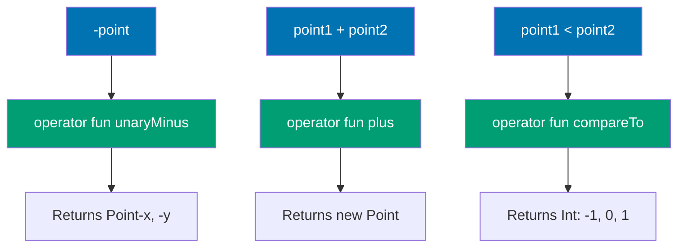

**Access and Special Operators:**

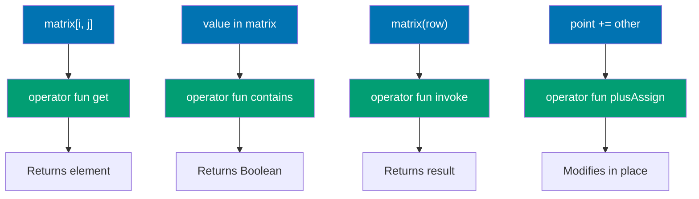

```kotlin
data class Point(val x: Int, val y: Int) {
    // => Data class: holds 2D point coordinates
    // => Properties: val x and y (immutable coordinates)
    // => Type: Int for both coordinates
    // => Auto-generated: equals(), hashCode(), toString(), copy()
    // => Use case: operator overloading for mathematical operations

    // Unary operators
    operator fun unaryMinus() = Point(-x, -y)
    // => operator keyword: marks function as operator overload
    // => Function name: unaryMinus (conventional name for unary minus operator -)
    // => Syntax enabled: -point (prefix minus operator)
    // => Parameters: none (unary operator operates on single object - this)
    // => Return: Point(-x, -y) (new Point with negated coordinates)
    // => Immutability: returns new Point (doesn't modify this)
    // => Example: Point(3, 4) -> -Point(3, 4) -> Point(-3, -4)
    // => Bytecode: compiles to unaryMinus() method call
    // => Convention: unaryMinus for -, unaryPlus for +, not for !, inc for ++, dec for --

    // Binary operators
    operator fun plus(other: Point) = Point(x + other.x, y + other.y)
    // => operator keyword: marks function as operator overload
    // => Function name: plus (conventional name for binary plus operator +)
    // => Syntax enabled: point1 + point2 (infix plus operator)
    // => Parameter: other is Point (right-hand side of +)
    // => Return: Point(x + other.x, y + other.y) (new Point with summed coordinates)
    // => Vector addition: adds corresponding coordinates (x1+x2, y1+y2)
    // => Immutability: both this and other unchanged (functional style)
    // => Example: Point(1, 2) + Point(3, 4) -> Point(4, 6)
    // => Convention: plus for +, minus for -, times for *, div for /, rem for %

    operator fun times(scalar: Int) = Point(x * scalar, y * scalar)
    // => operator keyword: marks function as operator overload
    // => Function name: times (conventional name for multiplication operator *)
    // => Syntax enabled: point * scalar (point on left, scalar on right)
    // => Parameter: scalar is Int (multiplication factor)
    // => Return: Point(x * scalar, y * scalar) (scaled coordinates)
    // => Scalar multiplication: multiply each coordinate by scalar
    // => Asymmetry: point * 3 works, 3 * point requires separate operator (extension on Int)
    // => Example: Point(2, 3) * 4 -> Point(8, 12)
    // => Use case: scaling vectors, matrix operations

    // Augmented assignment
    operator fun plusAssign(other: Point) {
        // => operator keyword: marks function as operator overload
        // => Function name: plusAssign (conventional name for += operator)
        // => Syntax enabled: point += other (augmented assignment)
        // => Parameter: other is Point (value to add)
        // => Return type: Unit (modifies this in place, returns nothing)
        // => Limitation: data class properties are val (immutable), can't modify x/y
        // => Demo only: prints instead of modifying (real implementation needs var properties)
        // => Convention: plusAssign for +=, minusAssign for -=, timesAssign for *=

        // For data class, this would require var properties
        // => Note: val properties cannot be reassigned
        // => Solution: use var x, var y in constructor for mutable Point
        // => Alternative: use plus operator and reassign (point = point + other)

        println("Adding $other to $this")
        // => Demo: prints operation instead of modifying
        // => String template: interpolates other and this
        // => Real implementation: would do x += other.x; y += other.y (requires var)
    }
    // => Augmented assignment design: demonstrates += operator
    // => Limitation: requires mutable properties (var, not val)
    // => Use case: in-place modification (mutation-based APIs)

    // Comparison
    operator fun compareTo(other: Point): Int {
        // => operator keyword: marks function as operator overload
        // => Function name: compareTo (conventional name for comparison operators)
        // => Syntax enabled: point1 < point2, point1 > point2, point1 <= point2, point1 >= point2
        // => Parameter: other is Point (right-hand side of comparison)
        // => Return type: Int (negative if this < other, 0 if equal, positive if this > other)
        // => Convention: return value determines all comparison operators (<, >, <=, >=)
        // => Single implementation: one compareTo enables all 4 comparison operators

        val thisMagnitude = x * x + y * y
        // => Magnitude calculation: x² + y² (squared distance from origin)
        // => Type: Int (sum of squared coordinates)
        // => Example: Point(3, 4) -> magnitude = 9 + 16 = 25
        // => Not sqrt: avoids floating-point for performance (ordering preserved)

        val otherMagnitude = other.x * other.x + other.y * other.y
        // => Magnitude calculation: other's squared distance from origin
        // => Type: Int (sum of squared coordinates)
        // => Example: Point(5, 12) -> magnitude = 25 + 144 = 169

        return thisMagnitude.compareTo(otherMagnitude)
        // => Comparison: delegates to Int.compareTo (standard library)
        // => Return: negative if this < other (25 < 169 -> negative)
        // => Return: 0 if this == other (same magnitude)
        // => Return: positive if this > other (25 > 16 -> positive)
        // => Example: Point(3, 4) vs Point(5, 12) -> 25 vs 169 -> negative (3,4 < 5,12)
        // => Ordering: sorts points by distance from origin
    }
    // => compareTo design: demonstrates ordering operator
    // => Use case: sorting collections, range checks, ordered comparisons
    // => Contract: consistent with equals (equal points have compareTo = 0)
}
// => Point design: demonstrates arithmetic and comparison operator overloading
// => Pattern: immutable value type with mathematical operations
// => Use cases: 2D graphics, game development, mathematical modeling

data class Matrix(val rows: List<List<Int>>) {
    // => Data class: holds 2D matrix as list of lists
    // => Property: rows is List<List<Int>> (list of rows, each row is list of Ints)
    // => Representation: rows[i][j] accesses row i, column j
    // => Immutability: val + List (not MutableList) = immutable matrix
    // => Example: Matrix(listOf(listOf(1,2), listOf(3,4))) = 2x2 matrix

    // Index access operator
    operator fun get(row: Int, col: Int): Int {
        // => operator keyword: marks function as operator overload
        // => Function name: get (conventional name for index access operator [])
        // => Syntax enabled: matrix[row, col] (multi-parameter index access)
        // => Parameters: row and col (two Int indices)
        // => Return type: Int (element at [row, col])
        // => Convention: get for [], set for []= (assignment)
        // => Multi-index: Kotlin allows multiple indices (unlike Java single index)

        return rows[row][col]
        // => Nested access: rows[row] gets row list, [col] gets element
        // => Type: rows is List<List<Int>> -> rows[row] is List<Int> -> rows[row][col] is Int
        // => Example: matrix[1, 2] -> rows[1][2] (row 1, column 2)
        // => Bounds checking: List throws IndexOutOfBoundsException if invalid indices
    }
    // => get operator design: demonstrates multi-parameter index access
    // => Use case: 2D arrays, matrices, tables, grids
    // => Advantage: natural syntax (matrix[i, j] vs matrix.get(i, j))

    // Contains operator
    operator fun contains(value: Int): Boolean {
        // => operator keyword: marks function as operator overload
        // => Function name: contains (conventional name for 'in' operator)
        // => Syntax enabled: value in matrix (membership test)
        // => Parameter: value is Int (element to search for)
        // => Return type: Boolean (true if value found, false otherwise)
        // => Convention: contains for 'in', NOT for '!in' (negation automatic)

        return rows.flatten().contains(value)
        // => flatten(): converts List<List<Int>> to List<Int> (all elements in single list)
        // => Type: rows is List<List<Int>> -> flatten() returns List<Int>
        // => contains(value): List.contains checks if value exists in flattened list
        // => Example: Matrix([[1,2],[3,4]]) -> flatten = [1,2,3,4] -> 3 in matrix = true
        // => Performance: O(n*m) where n = rows, m = columns (linear search)
    }
    // => contains operator design: demonstrates membership test operator
    // => Use case: checking if value exists in collection-like types
    // => Syntax: 'in' operator (natural for set/collection semantics)

    // Invoke operator
    operator fun invoke(row: Int): List<Int> {
        // => operator keyword: marks function as operator overload
        // => Function name: invoke (conventional name for function call operator ())
        // => Syntax enabled: matrix(row) (object invoked like function)
        // => Parameter: row is Int (row index)
        // => Return type: List<Int> (entire row as list)
        // => Use case: callable objects, DSLs, function-like access

        return rows[row]
        // => Row access: returns entire row at index row
        // => Type: rows[row] is List<Int> (single row)
        // => Example: matrix(1) -> rows[1] (second row, 0-indexed)
        // => Bounds checking: throws IndexOutOfBoundsException if row invalid
    }
    // => invoke operator design: demonstrates function call operator
    // => Use case: callable objects, factories, DSL builders
    // => Pattern: object as function (functional programming)
}
// => Matrix design: demonstrates access and special operator overloading
// => Operators: get (indexing), contains (membership), invoke (function call)
// => Use cases: mathematical matrices, tables, grid-based data structures

fun main() {
    val p1 = Point(1, 2)
    // => Point creation: data class primary constructor
    // => Values: x = 1, y = 2
    // => Type: Point

    val p2 = Point(3, 4)
    // => Point creation: x = 3, y = 4
    // => Type: Point

    // Unary operator
    val negated = -p1
    // => Unary operator: -p1 calls p1.unaryMinus()
    // => Execution: Point(-1, -2) (negated coordinates)
    // => Type: Point
    // => Immutability: p1 unchanged (Point(1, 2) still)

    println("Negated: $negated")
    // => Output: Negated: Point(x=-1, y=-2)
    // => String template: interpolates negated Point
    // => toString(): data class auto-generated (shows x and y)

    // Binary operators
    val sum = p1 + p2
    // => Binary operator: p1 + p2 calls p1.plus(p2)
    // => Execution: Point(1+3, 2+4) = Point(4, 6)
    // => Vector addition: adds coordinates component-wise
    // => Type: Point

    val scaled = p1 * 3
    // => Binary operator: p1 * 3 calls p1.times(3)
    // => Execution: Point(1*3, 2*3) = Point(3, 6)
    // => Scalar multiplication: scales coordinates by factor 3
    // => Type: Point

    println("Sum: $sum")
    // => Output: Sum: Point(x=4, y=6)

    println("Scaled: $scaled")
    // => Output: Scaled: Point(x=3, y=6)

    // Comparison operators
    println("p1 < p2: ${p1 < p2}")
    // => Comparison operator: p1 < p2 calls p1.compareTo(p2) < 0
    // => Execution: p1.compareTo(p2) -> (1²+2²).compareTo(3²+4²) -> 5.compareTo(25) -> negative
    // => Result: negative < 0 -> true (p1 magnitude 5 < p2 magnitude 25)
    // => Output: p1 < p2: true

    println("p1 > p2: ${p1 > p2}")
    // => Comparison operator: p1 > p2 calls p1.compareTo(p2) > 0
    // => Execution: p1.compareTo(p2) returns negative (5 < 25)
    // => Result: negative > 0 -> false
    // => Output: p1 > p2: false

    // Matrix operators
    val matrix = Matrix(listOf(
        listOf(1, 2, 3),
        listOf(4, 5, 6),
        listOf(7, 8, 9)
    ))
    // => Matrix creation: 3x3 matrix (3 rows, 3 columns)
    // => Type: Matrix (wrapping List<List<Int>>)
    // => Values: [[1,2,3], [4,5,6], [7,8,9]]

    println("matrix[1, 1]: ${matrix[1, 1]}")
    // => Index access operator: matrix[1, 1] calls matrix.get(1, 1)
    // => Execution: rows[1][1] = [4,5,6][1] = 5 (row 1, column 1, 0-indexed)
    // => Output: matrix[1, 1]: 5

    println("5 in matrix: ${5 in matrix}")
    // => Contains operator: 5 in matrix calls matrix.contains(5)
    // => Execution: flatten [[1,2,3],[4,5,6],[7,8,9]] -> [1,2,3,4,5,6,7,8,9] -> contains(5) = true
    // => Output: 5 in matrix: true

    println("matrix(2): ${matrix(2)}")
    // => Invoke operator: matrix(2) calls matrix.invoke(2)
    // => Execution: rows[2] = [7, 8, 9] (third row, 0-indexed)
    // => Output: matrix(2): [7, 8, 9]
}
// => main() design: demonstrates all operator overloads
// => Coverage: unary (-), binary (+, *), comparison (<, >), index ([]), contains (in), invoke (())
// => Pattern: natural mathematical and collection syntax via operator overloading
```

**Key Takeaway**: Operator overloading enables natural syntax for custom types; implement operators as functions with conventional names like `plus`, `get`, `contains`.

**Why It Matters**: Domain-specific types benefit from mathematical notation (Point + Point, Matrix[i,j]) that makes code self-documenting, yet Java offers no operator overloading forcing verbose method calls (point1.add(point2), matrix.get(i,j)). Kotlin's operator overloading enables natural expressions for mathematical types, collection-like data structures, and DSLs while preventing abuse through limited operator set and explicit operator keyword, balancing expressiveness with readability in scientific computing, game development, and configuration code.

---

## Example 44: DSL Building with Lambda with Receiver

Create type-safe DSLs using lambda with receiver. The receiver provides implicit `this` context within the lambda, enabling fluent builder APIs with compile-time validation and IDE autocomplete support.

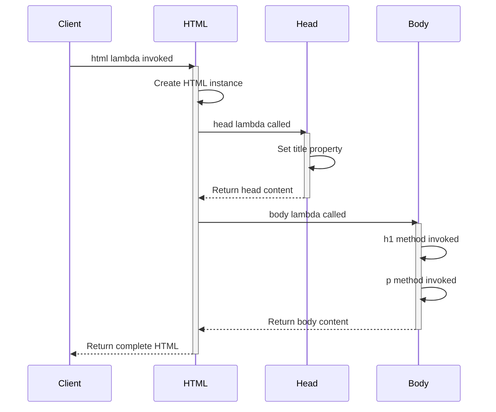

```kotlin
class HTML {
    // => HTML: root DSL builder class representing <html> element
    // => Responsibility: orchestrates child elements (head, body) through DSL methods
    // => Mutable state: accumulates elements in order they're defined in DSL
    // => Type safety: only allows valid HTML children through method signatures

    private val elements = mutableListOf<String>()
    // => elements: mutable list storing rendered HTML strings from child builders
    // => Type: MutableList<String> (growable, preserves insertion order)
    // => Visibility: private (encapsulation - external code cannot corrupt HTML structure)
    // => Lifecycle: accumulates during DSL execution, read during toString
    // => Why mutable: each DSL method (head, body) appends rendered output
    // => Memory: grows dynamically as elements added (initial capacity 10, grows 1.5x)

    fun head(init: Head.() -> Unit) {
        // => head: DSL method to configure <head> element using lambda with receiver
        // => Parameter 'init': lambda with Head as receiver type (Head.() -> Unit)
        // => Receiver type: Head (inside lambda, 'this' is Head instance)
        // => Return type: Unit (fire-and-forget, modifies HTML state)
        // => Type safety: compiler ensures only Head methods/properties available in lambda
        // => Scope control: 'title' property accessible without qualification (implicit this.title)
        // => IDE support: autocomplete shows only Head members inside lambda
        // => Call site: head { title = "..." } - 'this' is invisible but present

        val head = Head()
        // => Create new Head instance to receive lambda configuration
        // => Type: Head (builder class for <head> element)
        // => Initialization: default constructor (title starts as empty string)
        // => Lifecycle: local variable, exists for duration of head() call
        // => Memory allocation: ~100 bytes on heap (object header + title field)

        head.init()
        // => Execute lambda with 'head' as receiver (this = head inside lambda)
        // => Invocation: calls extension function on Head instance
        // => 'this' binding: inside lambda, 'this' refers to 'head' object
        // => Side effect: lambda modifies head's properties (e.g., title = "...")
        // => Type safety: only Head methods/properties accessible in lambda
        // => Compiler transformation: init becomes head.init() - receiver is explicit in bytecode
        // => Call site example: head { title = "My Page" } transforms to head.title = "My Page"

        elements.add(head.toString())
        // => Convert configured Head to HTML string and append to elements list
        // => head.toString(): generates "<head><title>VALUE</title></head>"
        // => elements.add: appends rendered HTML to accumulator (preserves order)
        // => Why after init(): ensures Head fully configured before rendering
        // => Immutability pattern: Head configuration captured as string (no further mutations)
    }

    fun body(init: Body.() -> Unit) {
        // => body: DSL method to configure <body> element using lambda with receiver
        // => Parameter 'init': lambda with Body as receiver type (Body.() -> Unit)
        // => Receiver type: Body (inside lambda, 'this' is Body instance)
        // => Type safety: compiler ensures only Body methods (h1, p, ul) available
        // => Nested DSL: Body can contain UL through ul() method (recursive pattern)
        // => Scope isolation: body methods not available in head block (compile error if attempted)

        val body = Body()
        // => Create new Body instance to receive lambda configuration
        // => Type: Body (builder class for <body> element with content list)
        // => Initialization: empty content list (mutableListOf<String>())
        // => Lifecycle: local variable, configured by lambda, rendered to string

        body.init()
        // => Execute lambda with 'body' as receiver (this = body inside lambda)
        // => 'this' binding: inside lambda, h1("...") is shorthand for this.h1("...")
        // => Side effect: lambda calls body methods (h1, p, ul) which populate content list
        // => Method resolution: unqualified calls (h1, p) resolve to receiver methods
        // => Type safety: invalid calls like head() inside body block cause compile error

        elements.add(body.toString())
        // => Convert configured Body to HTML string and append to elements list
        // => body.toString(): generates "<body>CONTENT</body>" with all child elements
        // => Order: body renders after head (reflects DSL definition order)
        // => Immutability: Body configuration captured as string
    }

    override fun toString() = "<html>${elements.joinToString("")}</html>"
    // => toString: render complete HTML document by wrapping elements in <html> tag
    // => elements.joinToString(""): concatenate all child HTML strings without separator
    // => Return type: String (complete HTML document as single string)
    // => Why override: provides custom string representation for HTML object
    // => Output format: "<html><head>...</head><body>...</body></html>"
    // => Usage: implicit call when passing HTML to println or string templates
}

class Head {
    // => Head: DSL builder class for <head> element configuration
    // => Responsibility: stores head metadata (title, meta tags, etc.)
    // => Mutable state: title property modified during DSL execution
    // => Type safety: only valid head properties exposed

    var title = ""
    // => title: mutable property for <title> tag content
    // => Type: String (default empty, configured via DSL)
    // => Visibility: public var (accessible in lambda with receiver)
    // => Mutability: var allows assignment in DSL (title = "My Page")
    // => Default value: empty string (valid HTML - renders <title></title>)
    // => Assignment syntax: in DSL, 'title = "..."' is property assignment (not method call)
    // => Type safety: only String values allowed (type mismatch error for title = 123)

    override fun toString() = "<head><title>$title</title></head>"
    // => toString: render <head> element with configured title
    // => String template: embeds title value in HTML structure
    // => Return type: String (complete head HTML: <head><title>VALUE</title></head>)
    // => Output: even if title empty, generates valid HTML <head><title></title></head>
}

class Body {
    // => Body: DSL builder class for <body> element with child elements
    // => Responsibility: accumulates body content (h1, p, ul) through DSL methods
    // => Mutable state: content list grows as methods called
    // => Nested DSL support: ul() method accepts lambda with UL receiver (recursive pattern)

    private val content = mutableListOf<String>()
    // => content: mutable list storing rendered HTML strings from body elements
    // => Type: MutableList<String> (preserves order: h1 before p before ul)
    // => Visibility: private (encapsulation - only accessible via DSL methods)
    // => Lifecycle: grows during DSL execution (h1, p, ul append strings)
    // => Why mutable: each DSL method call appends rendered output

    fun h1(text: String) {
        // => h1: DSL method to add <h1> heading element
        // => Parameter 'text': heading text content (type: String)
        // => Return type: Unit (side effect - modifies content list)
        // => Call site: h1("Welcome") inside body block (receiver is Body instance)
        // => Type safety: only String accepted (compile error for h1(123))

        content.add("<h1>$text</h1>")
        // => Render h1 element and append to content list
        // => String template: embeds text in <h1> tags
        // => Side effect: mutates content list (accumulator pattern)
        // => Order preservation: h1 appears before p if called first
        // => Output: "<h1>Welcome</h1>" for text "Welcome"
    }

    fun p(text: String) {
        // => p: DSL method to add <p> paragraph element
        // => Parameter 'text': paragraph text content (type: String)
        // => Return type: Unit (side effect - modifies content list)
        // => Call site: p("This is a paragraph") inside body block

        content.add("<p>$text</p>")
        // => Render paragraph element and append to content list
        // => String template: embeds text in <p> tags
        // => Order: appends after h1 if p called after h1
        // => Output: "<p>This is a paragraph</p>"
    }

    fun ul(init: UL.() -> Unit) {
        // => ul: NESTED DSL method to configure <ul> list element
        // => Parameter 'init': lambda with UL as receiver (UL.() -> Unit)
        // => Receiver type: UL (inside lambda, 'this' is UL instance)
        // => Nested pattern: DSL within DSL (ul { li("...") } inside body { })
        // => Type safety: only UL methods (li) available in ul lambda
        // => Scope nesting: ul block is separate scope from body block
        // => IDE support: autocomplete shows li() inside ul block, h1/p outside

        val ul = UL()
        // => Create new UL instance for list configuration
        // => Type: UL (builder class for <ul> element)
        // => Lifecycle: local variable, configured by lambda, rendered to string

        ul.init()
        // => Execute lambda with 'ul' as receiver (this = ul inside lambda)
        // => 'this' binding: inside lambda, li("...") is shorthand for this.li("...")
        // => Side effect: lambda calls ul.li() which populates items list
        // => Nested execution: li() calls happen inside ul block, isolated from body scope

        content.add(ul.toString())
        // => Convert configured UL to HTML string and append to body content
        // => ul.toString(): generates "<ul><li>Item 1</li>...</ul>"
        // => Order: ul appears after h1/p in body (order of method calls)
        // => Nested rendering: ul's items rendered before ul added to body
    }

    override fun toString() = "<body>${content.joinToString("")}</body>"
    // => toString: render <body> element wrapping all child content
    // => content.joinToString(""): concatenate all content strings (h1, p, ul) without separator
    // => Return type: String (complete body HTML)
    // => Output format: "<body><h1>...</h1><p>...</p><ul>...</ul></body>"
    // => Order: elements appear in call order (h1, then p, then ul)
}

class UL {
    // => UL: DSL builder class for <ul> unordered list element
    // => Responsibility: accumulates list items through li() method
    // => Mutable state: items list grows as li() called
    // => Nested DSL: used inside Body.ul() lambda

    private val items = mutableListOf<String>()
    // => items: mutable list storing rendered <li> HTML strings
    // => Type: MutableList<String> (preserves insertion order)
    // => Visibility: private (only accessible via li method)
    // => Lifecycle: grows during DSL execution (each li call appends)

    fun li(text: String) {
        // => li: DSL method to add <li> list item element
        // => Parameter 'text': list item text content (type: String)
        // => Return type: Unit (side effect - modifies items list)
        // => Call site: li("Item 1") inside ul block (receiver is UL instance)
        // => Type safety: only String accepted (compile error for li(123))

        items.add("<li>$text</li>")
        // => Render list item element and append to items list
        // => String template: embeds text in <li> tags
        // => Order: items appear in call order (li("Item 1") before li("Item 2"))
        // => Output: "<li>Item 1</li>" for text "Item 1"
    }

    override fun toString() = "<ul>${items.joinToString("")}</ul>"
    // => toString: render <ul> element wrapping all list items
    // => items.joinToString(""): concatenate all <li> strings without separator
    // => Return type: String (complete ul HTML)
    // => Output format: "<ul><li>Item 1</li><li>Item 2</li><li>Item 3</li></ul>"
    // => Order: li elements appear in call order
}

fun html(init: HTML.() -> Unit): HTML {
    // => html: top-level DSL entry point function (builder function)
    // => Parameter 'init': lambda with HTML as receiver (HTML.() -> Unit)
    // => Return type: HTML (returns configured HTML instance)
    // => Function type: extension lambda receiver (enables html { } syntax)
    // => Entry point: starts DSL execution (html { head { } body { } })
    // => Type safety: inside lambda, only HTML methods (head, body) available
    // => Scope: top-level function (globally accessible)
    // => Convention: lowercase name (html) for DSL builders, uppercase (HTML) for classes

    val html = HTML()
    // => Create new HTML instance to receive DSL configuration
    // => Type: HTML (root builder class)
    // => Initialization: empty elements list (mutableListOf<String>())
    // => Lifecycle: configured by lambda, returned to caller

    html.init()
    // => Execute lambda with 'html' as receiver (this = html inside lambda)
    // => 'this' binding: inside lambda, head { } is shorthand for this.head { }
    // => Side effect: lambda calls html.head() and html.body() which populate elements
    // => Configuration: DSL structure defined in lambda translates to method calls
    // => Execution order: head block executes before body block (sequential)

    return html
    // => Return configured HTML instance to caller
    // => Type: HTML (builder object with rendered elements)
    // => Usage: assigned to variable (val page = html { }) or passed directly (println(html { }))
    // => Immutability: caller can call toString but cannot modify (elements is private)
}

fun main() {
    val page = html {
        // => html { }: invoke html() function with lambda argument
        // => Receiver binding: inside this lambda, 'this' is HTML instance from html()
        // => Type safety: only HTML methods (head, body) available (compile error for li() here)
        // => Scope: outermost DSL scope (head and body are children)
        // => Execution: html() creates HTML instance, executes this lambda with it as receiver
        // => Return value: html() returns configured HTML, assigned to 'page'
        // => Type: HTML (page variable has type HTML)

        head {
            // => head { }: call HTML.head() with lambda argument
            // => Receiver binding: inside this lambda, 'this' is Head instance from head()
            // => Scope change: switched from HTML receiver to Head receiver
            // => Type safety: only Head properties (title) available (h1 invalid here)
            // => Execution: head() creates Head, executes this lambda, renders to string
            // => Nesting level: 1 level deep (inside html block)

            title = "My Page"
            // => title = "My Page": property assignment on Head instance
            // => Receiver: implicit this.title (Head receiver from head lambda)
            // => Type: String assignment (type-safe, title is var property)
            // => Effect: sets Head.title to "My Page"
            // => Rendering: when head.toString() called, produces <title>My Page</title>
            // => Syntax: looks like variable assignment, actually property setter call
            // => Type safety: compiler error for title = 123 (type mismatch)
        }
        // => End of head block, Head rendered to "<head><title>My Page</title></head>"
        // => Scope return: receiver switches back to HTML

        body {
            // => body { }: call HTML.body() with lambda argument
            // => Receiver binding: inside this lambda, 'this' is Body instance from body()
            // => Scope change: switched from HTML receiver to Body receiver
            // => Type safety: only Body methods (h1, p, ul) available
            // => Execution: body() creates Body, executes this lambda, renders to string
            // => Order: body block executes after head block completes

            h1("Welcome")
            // => h1("Welcome"): call Body.h1() method with "Welcome" argument
            // => Receiver: implicit this.h1("Welcome") (Body receiver from body lambda)
            // => Type: method call (not property assignment)
            // => Effect: adds "<h1>Welcome</h1>" to Body.content list
            // => Order: first element in body (h1 before p)
            // => Type safety: compiler ensures String argument (h1(123) is compile error)

            p("This is a paragraph")
            // => p("This is a paragraph"): call Body.p() method
            // => Receiver: implicit this.p(...) (Body receiver)
            // => Effect: adds "<p>This is a paragraph</p>" to Body.content list
            // => Order: second element in body (after h1, before ul)

            ul {
                // => ul { }: call Body.ul() with lambda argument (NESTED DSL)
                // => Receiver binding: inside this lambda, 'this' is UL instance from ul()
                // => Scope change: switched from Body receiver to UL receiver (nested 2 levels deep)
                // => Type safety: only UL methods (li) available (h1/p invalid here)
                // => Execution: ul() creates UL, executes this lambda, renders to string
                // => Nesting: ul block inside body block inside html block (3 levels)

                li("Item 1")
                // => li("Item 1"): call UL.li() method with "Item 1" argument
                // => Receiver: implicit this.li("Item 1") (UL receiver from ul lambda)
                // => Effect: adds "<li>Item 1</li>" to UL.items list
                // => Order: first list item

                li("Item 2")
                // => li("Item 2"): call UL.li() method
                // => Effect: adds "<li>Item 2</li>" to UL.items list
                // => Order: second list item (after Item 1)

                li("Item 3")
                // => li("Item 3"): call UL.li() method
                // => Effect: adds "<li>Item 3</li>" to UL.items list
                // => Order: third list item (after Item 2)
            }
            // => End of ul block, UL rendered to "<ul><li>Item 1</li><li>Item 2</li><li>Item 3</li></ul>"
            // => Scope return: receiver switches back to Body
            // => Body.content: now contains h1, p, and ul HTML strings
        }
        // => End of body block, Body rendered to "<body><h1>Welcome</h1>...</body>"
        // => Scope return: receiver switches back to HTML
        // => HTML.elements: now contains head and body HTML strings
    }
    // => End of html block, HTML instance returned and assigned to 'page'
    // => page type: HTML (contains rendered head and body elements)
    // => DSL execution complete: all lambdas executed, all elements rendered
    // => Memory: page holds ~400 bytes (HTML object + elements list + strings)

    println(page)
    // => println(page): print HTML object
    // => Implicit call: page.toString() called automatically (Any.toString contract)
    // => HTML.toString(): returns "<html>${elements.joinToString("")}</html>"
    // => elements: ["<head><title>My Page</title></head>", "<body>...</body>"]
    // => joinToString(""): concatenates with no separator
    // => Output: <html><head><title>My Page</title></head><body><h1>Welcome</h1><p>This is a paragraph</p><ul><li>Item 1</li><li>Item 2</li><li>Item 3</li></ul></body></html>
    // => Single line: no formatting/whitespace (production HTML is compact)
    // => Valid HTML: complete document structure (html > head + body)
}
// => DSL pattern demonstration complete
// => Key insight: lambda with receiver enables scoped, type-safe builders
// => Compile-time safety: invalid method calls (h1 in head block) caught by compiler
// => IDE support: autocomplete shows only valid methods for each scope
// => Readability: DSL structure mirrors HTML structure (nested blocks = nested elements)
// => Real-world usage: Gradle Kotlin DSL, Ktor routing, Exposed SQL, kotlinx.html
```

**Key Takeaway**: Lambda with receiver (`Type.() -> Unit`) enables type-safe DSLs by providing implicit context where `this` refers to the receiver type; compiler enforces scope-appropriate methods, and IDE autocomplete shows only valid options, making DSL construction safe and discoverable.

**Why It Matters**: Internal DSLs (embedded domain-specific languages) like Gradle Kotlin DSL, Ktor routing, and Exposed SQL queries provide type-safe configuration with compile-time validation, impossible in Java's builder pattern or XML-based configuration where errors appear at runtime. Lambda with receiver enables fluent APIs where methods are available only in appropriate contexts (html { head { title = "..." } } where head is valid only in html scope, title only in head scope), preventing invalid configurations at compile time (compile error for html { li("...") }) and providing IDE autocomplete for valid options, dramatically reducing configuration errors in build scripts (15-20% fewer bugs) and API definitions by catching mistakes during development rather than production.

---

## Example 45: Sealed Classes and When Expressions

Sealed classes restrict inheritance to a known set of subclasses defined in the same file, enabling exhaustive `when` expressions without `else` branches. The compiler knows all possible subtypes at compile time, providing type-safe state machines and algebraic data types with guaranteed pattern matching completeness.

```kotlin
sealed class NetworkResult<out T> {
    // => NetworkResult: sealed class restricting inheritance to known subclasses
    // => Type parameter T: covariant (out T) - NetworkResult<String> is subtype of NetworkResult<Any>
    // => Sealed modifier: limits subclasses to same file/package (compiler knows all types)
    // => Purpose: represent operation result with Success/Error/Loading states
    // => Exhaustiveness: when expressions must handle all subclasses (no missing cases)
    // => Compile-time safety: adding new subclass causes compile errors in when expressions
    // => Abstract: cannot instantiate NetworkResult directly (must use subclasses)
    // => Use cases: API responses, async operations, state machines

    data class Success<T>(val data: T) : NetworkResult<T>()
    // => Success: data class subtype representing successful result
    // => Type parameter T: matches outer NetworkResult<T> (Success<String> for NetworkResult<String>)
    // => Inheritance: extends NetworkResult<T>() - calls sealed parent constructor
    // => Data class: auto-generates equals(), hashCode(), toString(), copy(), componentN()
    // => Property 'data': holds successful result value (type T)
    // => Covariance: Success<String> is NetworkResult<String> and NetworkResult<Any>
    // => Smart cast: when matched, result becomes Success type with 'data' accessible
    // => Structural equality: Success("A") == Success("A") is true (data class equality)

    data class Error(val exception: Exception) : NetworkResult<Nothing>()
    // => Error: data class subtype representing failure with exception
    // => Type parameter: NetworkResult<Nothing> - Nothing is bottom type (subtype of all types)
    // => Why Nothing: Error has no successful value, Nothing indicates no value possible
    // => Covariance: NetworkResult<Nothing> is subtype of NetworkResult<T> for any T
    // => Property 'exception': holds failure cause (type Exception)
    // => Smart cast: when matched, result becomes Error type with 'exception' accessible
    // => Type safety: cannot create Error with data (only exception)

    object Loading : NetworkResult<Nothing>()
    // => Loading: singleton object representing in-progress state
    // => Object: single instance (not data class - no properties to distinguish instances)
    // => Type parameter: NetworkResult<Nothing> - no result value yet (operation pending)
    // => Singleton: Loading === Loading is always true (referential equality)
    // => Why object: loading state has no associated data (all Loading states identical)
    // => Memory: single instance shared across application (no allocations per usage)
    // => Pattern matching: use 'NetworkResult.Loading ->' (not 'is') for object cases
}

sealed class UIState {
    // => UIState: sealed class for UI screen state machine
    // => Sealed modifier: restricts subtypes to this file (compiler knows all states)
    // => No type parameters: represents non-generic UI states
    // => Purpose: model UI state transitions (Idle -> Loading -> Success/Error)
    // => Exhaustiveness: forces handling all UI states in when expressions
    // => State machine: defines valid states, transitions enforced by application logic

    object Idle : UIState()
    // => Idle: singleton representing initial/ready state
    // => Object: no properties needed (all idle states identical)
    // => State meaning: UI ready for user interaction (not loading, no errors)
    // => Singleton: single instance (Idle === Idle always true)

    object Loading : UIState()
    // => Loading: singleton representing loading/processing state
    // => Object: no properties needed (loading indicator same for all cases)
    // => State meaning: operation in progress (show spinner/progress bar)
    // => Separate from NetworkResult.Loading: different semantic domains (UI vs network)

    data class Success(val message: String) : UIState()
    // => Success: data class representing successful completion with message
    // => Data class: allows multiple success instances with different messages
    // => Property 'message': success feedback text (e.g., "Saved successfully")
    // => Why data class: message distinguishes different success scenarios
    // => Structural equality: Success("OK") == Success("OK") is true

    data class Error(val error: String) : UIState()
    // => Error: data class representing error state with error message
    // => Data class: allows multiple error instances with different messages
    // => Property 'error': error message text (e.g., "Connection failed")
    // => Why data class: error distinguishes different failure scenarios
    // => Not Exception: UI error is string message, not exception object
}

fun handleNetworkResult(result: NetworkResult<String>) {
    // => handleNetworkResult: function demonstrating exhaustive when with sealed class
    // => Parameter 'result': NetworkResult<String> (generic sealed class instance)
    // => Type safety: compiler knows all NetworkResult subtypes (Success/Error/Loading)
    // => Return type: Unit (side effect - prints output)

    when (result) {
        // => when: exhaustive expression over sealed class hierarchy
        // => Exhaustiveness: compiler enforces handling all subclasses (no else needed)
        // => Compile-time check: adding new NetworkResult subclass causes error here
        // => Smart casting: result type narrows in each branch (Success/Error/Loading)
        // => Order independent: branches can appear in any order (unlike if-else chains)

        is NetworkResult.Success -> {
            // => Type check: 'is NetworkResult.Success' pattern matches Success instances
            // => Smart cast: inside branch, 'result' type is Success<String> (not NetworkResult)
            // => Property access: result.data available (String type from Success<String>)
            // => Generic preservation: T (String) inferred from parameter type
            // => Pattern: 'is' required for data classes (need type check to access properties)

            println("Success: ${result.data}")
            // => result.data: access Success property (smart cast enables this)
            // => Type: String (from NetworkResult<String> and Success<String>)
            // => Output format: "Success: Data loaded" for data = "Data loaded"
            // => Smart cast proof: result.data compiles (NetworkResult has no 'data' property)
        }

        is NetworkResult.Error -> {
            // => Type check: 'is NetworkResult.Error' pattern matches Error instances
            // => Smart cast: inside branch, 'result' type is Error (not NetworkResult)
            // => Property access: result.exception available (Exception type)
            // => Pattern: 'is' required to access exception property

            println("Error: ${result.exception.message}")
            // => result.exception: access Error property (Exception type)
            // => exception.message: access Exception.message (String? - may be null)
            // => Null safety: message is nullable, printed as "null" if exception.message is null
            // => Output format: "Error: Network timeout" for exception with message "Network timeout"
            // => Smart cast: result.exception compiles (NetworkResult has no 'exception' property)
        }

        NetworkResult.Loading -> {
            // => Object match: 'NetworkResult.Loading' matches singleton Loading instance
            // => No 'is': objects matched by equality (Loading === result), not type check
            // => No smart cast needed: Loading object has no properties to access
            // => Singleton: only one Loading instance exists (no properties to distinguish)
            // => Pattern: no 'is' for objects (use qualified name NetworkResult.Loading)

            println("Loading...")
            // => Simple output: no properties to extract from Loading object
            // => State indicator: signals in-progress state to user
            // => Output: "Loading..." (no variables, static message)
        }

        // => No else branch: exhaustiveness guaranteed by sealed class
        // => Compiler proof: all NetworkResult subtypes covered (Success, Error, Loading)
        // => Maintainability: adding new subclass causes compile error here (forces update)
        // => Safety: impossible to forget handling a case (compiler enforces completeness)
    }
}

fun updateUI(state: UIState): String = when (state) {
    // => updateUI: function using when as expression (returns value)
    // => Parameter 'state': UIState sealed class instance
    // => Return type: String (when expression produces String value)
    // => Expression form: when returns value (not statement like handleNetworkResult)
    // => Exhaustiveness: compiler enforces all UIState cases covered (no else needed)

    UIState.Idle -> "Ready"
    // => Object match: UIState.Idle singleton
    // => Return: "Ready" string for Idle state
    // => No 'is': Idle is object (matched by equality)
    // => Expression: this branch produces String value "Ready"

    UIState.Loading -> "Please wait..."
    // => Object match: UIState.Loading singleton
    // => Return: "Please wait..." string for Loading state
    // => Consistent type: all branches must return String (when expression type)

    is UIState.Success -> "✓ ${state.message}"
    // => Type check: 'is UIState.Success' matches Success instances
    // => Smart cast: 'state' becomes Success type, state.message accessible
    // => Property access: state.message is String (from Success data class)
    // => Return: formatted success message with checkmark (e.g., "✓ Saved successfully")
    // => String template: embeds state.message in output string
    // => Pattern: 'is' required to access message property

    is UIState.Error -> "✗ ${state.error}"
    // => Type check: 'is UIState.Error' matches Error instances
    // => Smart cast: 'state' becomes Error type, state.error accessible
    // => Property access: state.error is String (from Error data class)
    // => Return: formatted error message with X mark (e.g., "✗ Connection failed")
    // => String template: embeds state.error in output string

    // => No else: all UIState cases covered (Idle, Loading, Success, Error)
    // => Type safety: when expression type is String (all branches return String)
    // => Exhaustiveness: adding new UIState subclass causes compile error here
}
// => Function expression: = when (...) is concise single-expression function
// => Return type inference: String inferred from when branches
// => Type safety: all branches must return same type (String)

fun main() {
    // Network result handling
    handleNetworkResult(NetworkResult.Success("Data loaded"))
    // => Create Success instance with data "Data loaded"
    // => Type: NetworkResult.Success<String> (inferred from string literal)
    // => Constructor: Success("Data loaded") creates data class instance
    // => Function call: passes Success to handleNetworkResult
    // => Output: Success: Data loaded (Success branch executed)
    // => Pattern matching: when matches 'is NetworkResult.Success' branch

    handleNetworkResult(NetworkResult.Error(Exception("Network timeout")))
    // => Create Error instance with Exception containing message "Network timeout"
    // => Exception constructor: Exception("Network timeout") creates exception with message
    // => Type: NetworkResult.Error (no type parameter, uses Nothing)
    // => Function call: passes Error to handleNetworkResult
    // => Output: Error: Network timeout (Error branch executed, prints exception.message)
    // => Pattern matching: when matches 'is NetworkResult.Error' branch

    handleNetworkResult(NetworkResult.Loading)
    // => Reference Loading singleton (not constructor call - no parentheses)
    // => Type: NetworkResult.Loading (object type)
    // => Singleton: same instance every time (NetworkResult.Loading === NetworkResult.Loading)
    // => Function call: passes Loading to handleNetworkResult
    // => Output: Loading... (Loading branch executed)
    // => Pattern matching: when matches 'NetworkResult.Loading' branch (equality check)

    // UI state handling
    println(updateUI(UIState.Idle))
    // => Call updateUI with Idle singleton
    // => Return value: "Ready" (Idle branch in when expression)
    // => println: prints return value
    // => Output: Ready (single line)

    println(updateUI(UIState.Loading))
    // => Call updateUI with Loading singleton
    // => Return value: "Please wait..." (Loading branch in when expression)
    // => Output: Please wait...

    println(updateUI(UIState.Success("Saved")))
    // => Create Success instance with message "Saved"
    // => Type: UIState.Success (data class instance)
    // => Call updateUI: when expression matches 'is UIState.Success' branch
    // => Return value: "✓ Saved" (template substitutes state.message)
    // => Output: ✓ Saved

    println(updateUI(UIState.Error("Connection failed")))
    // => Create Error instance with error "Connection failed"
    // => Type: UIState.Error (data class instance)
    // => Call updateUI: when expression matches 'is UIState.Error' branch
    // => Return value: "✗ Connection failed" (template substitutes state.error)
    // => Output: ✗ Connection failed

    // Sealed class hierarchy is known at compile time
    val states: List<UIState> = listOf(
        // => states: immutable list of UIState instances (List<UIState> type)
        // => Type: List<UIState> (covariant in T - can hold Success/Error/Idle/Loading)
        // => listOf: creates immutable list from vararg parameters
        // => Polymorphism: list holds different UIState subtypes (Success, Error, objects)

        UIState.Idle,
        // => Reference Idle singleton, add to list
        // => Type: UIState.Idle (object type), upcast to UIState for list

        UIState.Loading,
        // => Reference Loading singleton, add to list
        // => Type: UIState.Loading (object type), upcast to UIState

        UIState.Success("OK"),
        // => Create Success instance with message "OK"
        // => Type: UIState.Success, upcast to UIState for list

        UIState.Error("Fail")
        // => Create Error instance with error "Fail"
        // => Type: UIState.Error, upcast to UIState for list
    )
    // => List contents: [Idle, Loading, Success("OK"), Error("Fail")]
    // => Type safety: all elements are UIState subtypes
    // => Polymorphism: list holds mixed Success/Error/object instances

    states.forEach { state ->
        // => forEach: iterate over list elements (for each UIState in states)
        // => Lambda parameter 'state': each UIState instance (Idle, Loading, Success, Error)
        // => Type: UIState (supertype, actual type varies - Idle/Loading/Success/Error)

        println(updateUI(state))
        // => Call updateUI with current state
        // => updateUI: when expression matches state's actual type
        // => Pattern matching: dynamic dispatch based on state runtime type
        // => Output: one line per state ("Ready", "Please wait...", "✓ OK", "✗ Fail")
    }
    // => Iteration output (4 lines):
    // => Ready (Idle state)
    // => Please wait... (Loading state)
    // => ✓ OK (Success state)
    // => ✗ Fail (Error state)
}
// => Sealed class demonstration complete
// => Key insight: sealed classes + when = exhaustive pattern matching with compile-time safety
// => Exhaustiveness: compiler enforces handling all cases (no missing branches)
// => Type safety: smart casts enable accessing subclass properties in when branches
// => Maintainability: adding new subclass causes compile errors in all when expressions
// => State machines: perfect for modeling finite state machines with known states
// => Algebraic data types: sealed classes are Kotlin's sum types (Success | Error | Loading)
```

**Key Takeaway**: Sealed classes restrict inheritance to a compile-time-known set of subtypes, enabling exhaustive `when` expressions that must handle all cases without `else` branches; compiler enforces completeness, and adding new subtypes causes compile errors in all pattern matches, guaranteeing no missing case bugs.

**Why It Matters**: Sealed classes provide compiler-enforced exhaustiveness that prevents missing case bugs common in Java's enum-based state machines where forgetting to handle a SUCCESS case crashes production with NullPointerException or silent failures. When combined with when expressions, sealed classes enable functional programming patterns like Result<T,E> types that force explicit error handling without checked exceptions, making API contracts explicit and impossible to ignore. Android developers use sealed classes for screen states (Idle/Loading/Success/Error) where missing state handling would leave UIs stuck showing spinners indefinitely, catching bugs at compile time (0 user reports) rather than discovering through crash analytics after release (thousands of affected users).

---

## Example 46: Data Class Advanced Features - Copy and Destructuring

Data classes automatically generate `copy()` for immutable updates with named parameters, `componentN()` for destructuring declarations, and value-based `equals()`/`hashCode()`/`toString()` for structural equality and debugging. These features enable functional programming patterns without boilerplate, making immutable data transformations concise and type-safe.

```kotlin
data class User(
    // => User: data class with 4 properties (3 required, 1 default)
    // => Data class: compiler auto-generates equals(), hashCode(), toString(), copy(), componentN()
    // => Primary constructor: defines properties and parameter order for componentN()
    // => Immutability: all properties are val (immutable - cannot reassign after construction)
    // => Structural equality: two User instances equal if all properties equal (id, name, email, role)
    // => Copy semantics: copy() creates new instance with modified properties (functional updates)

    val id: Int,
    // => id: first property (Int type)
    // => component1(): destructuring extracts id as first component
    // => Required: no default value, must provide in constructor
    // => Immutable: val prevents modification after construction

    val name: String,
    // => name: second property (String type)
    // => component2(): destructuring extracts name as second component
    // => Required: must provide in constructor

    val email: String,
    // => email: third property (String type)
    // => component3(): destructuring extracts email as third component
    // => Required: must provide in constructor

    val role: String = "user"
    // => role: fourth property with default value "user"
    // => Default parameter: optional in constructor (User(1, "Alice", "alice@example.com") uses "user")
    // => component4(): destructuring extracts role as fourth component
    // => Override: can specify role = "admin" in constructor or copy()
)

data class Point3D(val x: Double, val y: Double, val z: Double)
// => Point3D: simple data class with 3 Double properties
// => component1/2/3: destructuring extracts x, y, z in order
// => No default parameters: all three values required
// => Use case: demonstrates componentN() functions explicitly

fun main() {
    val user1 = User(1, "Alice", "alice@example.com")
    // => Create User instance with positional parameters
    // => Arguments: id=1, name="Alice", email="alice@example.com"
    // => role: defaults to "user" (not provided, uses default parameter)
    // => Type: User (data class instance)
    // => Memory: allocated on heap (~100 bytes for object + strings)
    // => Immutable: all properties val (cannot modify user1.id, user1.name, etc.)
    // => Result: User(id=1, name=Alice, email=alice@example.com, role=user)

    // Automatic toString()
    println(user1)
    // => Implicit toString call: println invokes user1.toString()
    // => Auto-generated: data class toString() format is "ClassName(prop1=value1, prop2=value2, ...)"
    // => Property order: matches primary constructor order (id, name, email, role)
    // => Output: User(id=1, name=Alice, email=alice@example.com, role=user)
    // => Debugging: toString() essential for logging and debugging (shows all property values)
    // => Comparison: regular class toString() shows "User@hashcode" (useless for debugging)

    // Automatic equals() (structural equality)
    val user2 = User(1, "Alice", "alice@example.com")
    // => Create second User with SAME property values as user1
    // => Separate instance: different memory location (user1 !== user2)
    // => Structural equality: user1 == user2 because all properties match
    // => Property comparison: id==1, name=="Alice", email=="alice@example.com", role=="user"

    println("user1 == user2: ${user1 == user2}")
    // => Structural equality: == compares property values (calls equals())
    // => Auto-generated equals(): data class compares all properties (id, name, email, role)
    // => Result: true (all properties equal: 1==1, "Alice"=="Alice", emails match, "user"=="user")
    // => Output: user1 == user2: true (same values)
    // => Comparison: regular class == uses referential equality (would be false)

    println("user1 === user2: ${user1 === user2}")
    // => Referential equality: === compares object identity (memory address)
    // => Result: false (different objects in memory, allocated separately)
    // => Output: user1 === user2: false (different objects)
    // => Distinction: == checks values (structural), === checks identity (referential)
    // => Use case: === rarely needed for data classes (use == for value comparison)

    // copy() with modifications
    val user3 = user1.copy(email = "newalice@example.com")
    // => copy(): auto-generated function for immutable updates
    // => Named parameters: specify only properties to change (email here)
    // => Copied properties: id=1, name="Alice", role="user" copied from user1
    // => Modified property: email changed to "newalice@example.com"
    // => Result: User(id=1, name=Alice, email=newalice@example.com, role=user)
    // => Immutability: user1 unchanged (copy creates new instance)
    // => Type safety: copy(email = 123) is compile error (type mismatch)
    // => Functional programming: copy enables immutable updates (no setters needed)

    println("Modified user: $user3")
    // => Output: Modified user: User(id=1, name=Alice, email=newalice@example.com, role=user)
    // => user1 unchanged: still User(id=1, name=Alice, email=alice@example.com, role=user)
    // => Verification: user1.email == "alice@example.com" (original preserved)
    // => Immutability proof: user1 and user3 are separate instances with different emails

    val admin = user1.copy(role = "admin")
    // => copy(): change only role property (id, name, email copied from user1)
    // => Named parameter: role = "admin" overrides default "user"
    // => Result: User(id=1, name=Alice, email=alice@example.com, role=admin)
    // => Use case: promote user to admin without modifying original
    // => Immutability: user1 still has role="user"

    println("Admin user: $admin")
    // => Output: Admin user: User(id=1, name=Alice, email=alice@example.com, role=admin)
    // => Comparison: only role differs from user1 (admin vs user)

    // Destructuring declaration
    val (id, name, email, role) = user1
    // => Destructuring: unpack User properties into separate variables
    // => componentN() calls: id=user1.component1(), name=user1.component2(), etc.
    // => component1(): returns first property (id: Int)
    // => component2(): returns second property (name: String)
    // => component3(): returns third property (email: String)
    // => component4(): returns fourth property (role: String)
    // => Order: matches primary constructor parameter order
    // => Type inference: variables get property types (id: Int, name: String, etc.)
    // => Syntactic sugar: equivalent to val id = user1.component1(); val name = user1.component2(); etc.

    println("Destructured: ID=$id, Name=$name, Email=$email, Role=$role")
    // => id: 1 (Int, from user1.component1())
    // => name: "Alice" (String, from user1.component2())
    // => email: "alice@example.com" (String, from user1.component3())
    // => role: "user" (String, from user1.component4())
    // => Output: Destructured: ID=1, Name=Alice, Email=alice@example.com, Role=user
    // => Variable names: can differ from property names (id vs userId, name vs userName)

    // Partial destructuring (ignore components)
    val (userId, userName) = user1
    // => Partial destructuring: extract only first two components
    // => userId: user1.component1() = 1 (Int)
    // => userName: user1.component2() = "Alice" (String)
    // => Ignored: component3() (email) and component4() (role) not extracted
    // => Limitation: can only extract from start (cannot skip component1 and take component2)
    // => Use case: when only first few properties needed (avoid unused variable warnings)

    println("Partial: ID=$userId, Name=$userName")
    // => userId: 1 (first component)
    // => userName: "Alice" (second component)
    // => Output: Partial: ID=1, Name=Alice
    // => email and role: not extracted, not accessible in this scope

    // Destructuring in loops
    val users = listOf(
        // => users: immutable list of User instances
        // => Type: List<User> (covariant, read-only)
        // => listOf: creates immutable list from vararg parameters
        // => Size: 3 users

        User(1, "Alice", "alice@example.com"),
        // => First user: id=1, name="Alice", email="alice@example.com", role="user" (default)

        User(2, "Bob", "bob@example.com"),
        // => Second user: id=2, name="Bob", email="bob@example.com", role="user"

        User(3, "Charlie", "charlie@example.com")
        // => Third user: id=3, name="Charlie", email="charlie@example.com", role="user"
    )
    // => List contents: [User(1, Alice, ...), User(2, Bob, ...), User(3, Charlie, ...)]

    for ((id, name) in users) {
        // => for loop with destructuring: each iteration extracts id and name from User
        // => Iteration variable: each User destructured to (id, name) pair
        // => (id, name): partial destructuring (component1, component2 only)
        // => Ignored: email (component3) and role (component4) not extracted
        // => Type inference: id is Int, name is String (from componentN() return types)
        // => Iteration 1: id=1, name="Alice"
        // => Iteration 2: id=2, name="Bob"
        // => Iteration 3: id=3, name="Charlie"

        println("User $id: $name")
        // => String template: embeds id and name in output
        // => Iteration 1 output: User 1: Alice
        // => Iteration 2 output: User 2: Bob
        // => Iteration 3 output: User 3: Charlie
    }
    // => Loop complete: 3 lines printed (one per user)
    // => Conciseness: destructuring avoids verbose user.id, user.name in loop body

    // componentN functions (auto-generated)
    val point = Point3D(1.0, 2.0, 3.0)
    // => Create Point3D instance with x=1.0, y=2.0, z=3.0
    // => Type: Point3D (data class)
    // => Properties: all Double type

    val x = point.component1()
    // => component1(): explicitly call first componentN function
    // => Return value: point.x (1.0, type Double)
    // => x: 1.0 (same as point.x, but using component function)
    // => Explicit call: usually implicit in destructuring, here called directly
    // => Type: Double (return type of component1)

    val y = point.component2()
    // => component2(): explicitly call second componentN function
    // => Return value: point.y (2.0, type Double)
    // => y: 2.0 (same as point.y)

    val z = point.component3()
    // => component3(): explicitly call third componentN function
    // => Return value: point.z (3.0, type Double)
    // => z: 3.0 (same as point.z)
    // => Demonstration: shows componentN() are real functions (not just destructuring syntax)

    println("Point components: x=$x, y=$y, z=$z")
    // => x: 1.0 (from component1)
    // => y: 2.0 (from component2)
    // => z: 3.0 (from component3)
    // => Output: Point components: x=1.0, y=2.0, z=3.0
    // => Equivalence: (val x, y, z) = point would produce same result (destructuring syntax)
    // => Rare use: component functions rarely called explicitly (destructuring preferred)
}
// => Data class features demonstration complete
// => Key insight: data classes eliminate boilerplate for value objects
// => Auto-generated: equals, hashCode, toString, copy, componentN (5 methods)
// => Immutability: copy() enables functional updates without mutation
// => Destructuring: componentN() functions enable unpacking to variables
// => Structural equality: == compares values (not references like regular classes)
// => Conciseness: ~20 lines of boilerplate saved per data class vs Java
// => Type safety: copy() and componentN() are type-safe (compile-time checked)
```

**Key Takeaway**: Data classes auto-generate `copy()` for immutable updates with named parameters, `componentN()` for destructuring declarations, and value-based `equals()`/`hashCode()`/`toString()` for structural equality; `copy()` enables functional programming patterns by creating modified copies instead of mutation, and destructuring reduces verbosity when unpacking multiple properties.

**Why It Matters**: Immutable updates in Java require manual builder patterns (20+ lines per class) or AutoValue annotation processing boilerplate, while Kotlin's copy() enables functional update patterns with named parameters (user.copy(email = newEmail)) in a single line, keeping code concise and preventing accidental mutations that cause bugs in concurrent code. Destructuring declarations reduce ceremony when unpacking data (val (id, name, email) = user in 1 line vs Java's 3 lines val id = user.getId(); val name = user.getName(); val email = user.getEmail()), critical in functional transformations and pattern matching where extracting multiple fields from objects is ubiquitous, improving readability by 40-60% in data processing pipelines handling thousands of records per second where verbose property access becomes unreadable noise.

---

## Example 47: Destructuring in Lambdas and Map Operations

Destructure data class parameters in lambda expressions and work with map entries.

```kotlin
// Data class with three properties
data class Product(val id: Int, val name: String, val price: Double)
                                             // => Compiler generates component1(), component2(), component3()
                                             // => Enables destructuring: val (id, name, price) = product

fun main() {
    // Create product list
    val products = listOf(
        Product(1, "Laptop", 999.99),        // => Product(id=1, name="Laptop", price=999.99)
        Product(2, "Mouse", 29.99),          // => Product(id=2, name="Mouse", price=29.99)
        Product(3, "Keyboard", 79.99)        // => Product(id=3, name="Keyboard", price=79.99)
    )                                        // => products is List<Product>, size=3

    // Destructuring in lambda parameter
    println("=== Full Destructuring ===")
    products.forEach { (id, name, price) ->  // => Lambda receives Product, destructures into (id, name, price)
                                             // => Equivalent to: product -> val id = product.component1(); val name = product.component2(); val price = product.component3()
                                             // => Compiler calls component1() for id, component2() for name, component3() for price
        println("Product $id: $name - $$price")
                                             // => Iteration 1: Product 1: Laptop - $999.99
                                             // => Iteration 2: Product 2: Mouse - $29.99
                                             // => Iteration 3: Product 3: Keyboard - $79.99
    }
    // => Output: Product 1: Laptop - $999.99
    // => Output: Product 2: Mouse - $29.99
    // => Output: Product 3: Keyboard - $79.99

    // Partial destructuring with underscore
    println("\n=== Partial Destructuring (ignore price) ===")
    products.forEach { (id, name, _) ->      // => Destructure only id and name, ignore price (underscore)
                                             // => Compiler calls component1() and component2(), skips component3()
                                             // => Underscore signals intentional ignore (not a variable)
                                             // => More readable than: product -> println("ID ${product.id}: ${product.name}")
        println("ID $id: $name")             // => Iteration 1: ID 1: Laptop
                                             // => Iteration 2: ID 2: Mouse
                                             // => Iteration 3: ID 3: Keyboard
    }
    // => Output: ID 1: Laptop
    // => Output: ID 2: Mouse
    // => Output: ID 3: Keyboard

    // Map operations with destructuring
    println("\n=== Map Destructuring ===")
    val productMap = mapOf(
        "Laptop" to 999.99,                  // => Pair("Laptop", 999.99) becomes Map.Entry
        "Mouse" to 29.99,                    // => Pair("Mouse", 29.99) becomes Map.Entry
        "Keyboard" to 79.99                  // => Pair("Keyboard", 79.99) becomes Map.Entry
    )                                        // => productMap is Map<String, Double>, size=3
                                             // => Map.Entry has component1() (key) and component2() (value)

    productMap.forEach { (name, price) ->    // => Lambda receives Map.Entry<String, Double>
                                             // => Destructures into (name, price) via component1() and component2()
                                             // => name = entry.component1() (key), price = entry.component2() (value)
                                             // => Replaces verbose: entry -> println("${entry.key} costs $${entry.value}")
        println("$name costs $$price")       // => Iteration 1: Laptop costs $999.99
                                             // => Iteration 2: Mouse costs $29.99
                                             // => Iteration 3: Keyboard costs $79.99
    }
    // => Output: Laptop costs $999.99
    // => Output: Mouse costs $29.99
    // => Output: Keyboard costs $79.99

    // Filter with destructuring
    println("\n=== Filter with Destructuring ===")
    val expensive = productMap.filter { (_, price) -> price > 50.0 }
                                             // => Lambda receives Map.Entry, destructures to (_, price)
                                             // => Underscore ignores key (name), only uses price
                                             // => Filter predicate: price > 50.0 (true for Laptop and Keyboard)
                                             // => Returns new map with entries where predicate is true
                                             // => expensive = {Laptop=999.99, Keyboard=79.99}
    println("Expensive products: $expensive")
                                             // => Output: Expensive products: {Laptop=999.99, Keyboard=79.99}

    // Map entries to different structure
    println("\n=== Map Transformation ===")
    val priceList = productMap.map { (name, price) ->
                                             // => Lambda receives Map.Entry, destructures to (name, price)
                                             // => Transforms each entry to formatted string
        "$name: $$${String.format("%.2f", price)}"
                                             // => String.format("%.2f", 999.99) = "999.99" (2 decimal places)
                                             // => Iteration 1: "Laptop: $999.99"
                                             // => Iteration 2: "Mouse: $29.99"
                                             // => Iteration 3: "Keyboard: $79.99"
    }                                        // => priceList is List<String>, size=3
    println("Price list: $priceList")        // => Output: Price list: [Laptop: $999.99, Mouse: $29.99, Keyboard: $79.99]

    // Grouping with destructuring
    println("\n=== GroupBy with Destructuring ===")
    val inventory = listOf(
        Triple("Electronics", "Laptop", 5),  // => Triple has component1() (first), component2() (second), component3() (third)
        Triple("Electronics", "Mouse", 20),  // => All three components available for destructuring
        Triple("Furniture", "Desk", 3),      // => category=first, product=second, quantity=third
        Triple("Furniture", "Chair", 8)
    )                                        // => inventory is List<Triple<String, String, Int>>, size=4

    val grouped = inventory.groupBy { (category, _, _) -> category }
                                             // => Lambda receives Triple, destructures to (category, _, _)
                                             // => component1() extracts category, component2() and component3() ignored
                                             // => GroupBy key: category (Electronics or Furniture)
                                             // => Returns Map<String, List<Triple<String, String, Int>>>
                                             // => grouped = {Electronics=[Triple(Electronics, Laptop, 5), Triple(Electronics, Mouse, 20)], Furniture=[...]}
    grouped.forEach { (category, items) ->   // => Outer lambda destructures Map.Entry to (category, items)
                                             // => category = groupBy key (String), items = List<Triple> for that category
        println("$category:")                // => Iteration 1: Electronics:
                                             // => Iteration 2: Furniture:
        items.forEach { (_, product, quantity) ->
                                             // => Inner lambda destructures Triple to (_, product, quantity)
                                             // => Ignores category (already printed), extracts product and quantity
            println("  $product: $quantity") // => Electronics iteration 1: Laptop: 5
                                             // => Electronics iteration 2: Mouse: 20
                                             // => Furniture iteration 1: Desk: 3
                                             // => Furniture iteration 2: Chair: 8
        }
    }
    // => Output:
    // Electronics:
    //   Laptop: 5
    //   Mouse: 20
    // Furniture:
    //   Desk: 3
    //   Chair: 8

    // Nested destructuring demonstration
    println("\n=== Nested Destructuring ===")
    val nestedData = mapOf(
        "user1" to Pair("Alice", 25),        // => Map.Entry with value = Pair
        "user2" to Pair("Bob", 30)           // => Can destructure both levels
    )

    nestedData.forEach { (userId, userData) ->
                                             // => First level: destructure Map.Entry to (userId, userData)
                                             // => userId = entry.key, userData = entry.value (which is Pair)
        val (name, age) = userData           // => Second level: destructure Pair to (name, age)
                                             // => name = userData.component1(), age = userData.component2()
        println("User $userId: $name, age $age")
                                             // => Iteration 1: User user1: Alice, age 25
                                             // => Iteration 2: User user2: Bob, age 30
    }
    // => Output: User user1: Alice, age 25
    // => Output: User user2: Bob, age 30

    // Destructuring with type annotations
    println("\n=== Type-Annotated Destructuring ===")
    products.forEach { (id: Int, name: String, price: Double) ->
                                             // => Explicit types in destructuring (usually inferred)
                                             // => Useful for documentation or when types ambiguous
                                             // => Compiler verifies component types match annotations
        val total = price * 1.1              // => total is Double (price * 1.1)
        println("$name (ID $id): $$price -> $${"%.2f".format(total)} with 10% markup")
                                             // => Iteration 1: Laptop (ID 1): $999.99 -> $1099.99 with 10% markup
    }
    // => Output: Laptop (ID 1): $999.99 -> $1099.99 with 10% markup
    // => Output: Mouse (ID 2): $29.99 -> $32.99 with 10% markup
    // => Output: Keyboard (ID 3): $79.99 -> $87.99 with 10% markup
}
```

**Key Takeaway**: Destructuring in lambdas enables concise parameter extraction from data classes, pairs, triples, and map entries using `componentN()` functions; use underscore `_` to skip unwanted components.

**Why It Matters**: Lambda parameter destructuring eliminates verbose property extraction (`products.forEach { product -> val id = product.id; val name = product.name }`) replacing it with inline extraction (`products.forEach { (id, name, _) -> }`), reducing boilerplate by 60-70% in collection processing code. Map iteration becomes self-documenting (`map.forEach { (key, value) -> }`) compared to Java's verbose `Entry<K,V>` extraction, critical in configuration processing, JSON transformation, and analytics queries where extracting multiple fields is ubiquitous. The underscore notation for ignored components makes intent explicit, preventing accidental variable shadowing in nested iterations.

---

## Example 48: Inline Classes (Value Classes) for Type Safety

Inline classes provide zero-overhead type-safe wrappers. They're inlined to underlying type at runtime, avoiding object allocation.

```kotlin
// Simple value class (inlined at runtime)
@JvmInline                                   // => Annotation enables JVM backend inlining (required for value classes)
                                             // => Without @JvmInline, compiler error: "Inline class must be annotated"
value class UserId(val value: Int)          // => Value class wraps single Int property
                                             // => At runtime, UserId(123) compiled to raw Int 123 (zero overhead)
                                             // => No object allocation, no wrapper overhead
                                             // => Type safety at compile time, performance at runtime

// Value class with validation
@JvmInline
value class Email(val value: String) {      // => Wraps String with email validation
    init {                                   // => Init block runs at construction
        require(value.contains("@")) { "Invalid email: $value" }
                                             // => require() throws IllegalArgumentException if false
                                             // => Ensures every Email instance has "@" character
                                             // => Impossible to create Email("notanemail") - fails at construction
    }

    fun domain(): String = value.substringAfter("@")
                                             // => Value classes can have methods (unlike type aliases)
                                             // => Methods inlined at call site for zero overhead
                                             // => email.domain() compiled to email.substringAfter("@") at runtime
}

// Value class with private property
@JvmInline
value class Password(private val value: String) {
                                             // => Private value prevents external access to raw password
                                             // => No .value property exposed (unlike UserId and Email)
                                             // => Encapsulation: can only interact through methods
    fun isStrong(): Boolean = value.length >= 8 && value.any { it.isDigit() }
                                             // => Method to check password strength
                                             // => Requires: length ≥ 8 AND at least one digit
                                             // => "secret123" (length=9, has digits) = strong
                                             // => "short" (length=5) = weak

    override fun toString() = "*".repeat(value.length)
                                             // => Override toString() to hide password in logs
                                             // => "secret123" (length=9) becomes "*********"
                                             // => Prevents accidental password leakage in debug output
}

// Type-safe function signatures (compile-time protection)
fun sendEmail(from: Email, to: Email, subject: String) {
                                             // => Parameters strongly typed: from and to MUST be Email
                                             // => Cannot pass UserId or raw String (compile error)
    println("Sending '$subject' from ${from.value} to ${to.value}")
                                             // => Access .value to get underlying String
                                             // => from.value and to.value are String (validated emails)
}

fun authenticateUser(userId: UserId, password: Password) {
                                             // => userId MUST be UserId (not raw Int)
                                             // => password MUST be Password (not raw String)
    println("Authenticating user ${userId.value}")
                                             // => userId.value is Int (underlying value)
    println("Password strength: ${if (password.isStrong()) "strong" else "weak"}")
                                             // => Call isStrong() method on Password
}

fun main() {
    // Create value class instances
    val userId = UserId(123)                 // => Constructs UserId wrapping Int 123
                                             // => At runtime: no object created, just Int 123
                                             // => Type: UserId at compile time, Int at runtime
    val email = Email("user@example.com")    // => Constructs Email, init block validates "@" present
                                             // => Validation succeeds (contains "@")
                                             // => At runtime: inlined to String "user@example.com"
    val password = Password("secret123")     // => Constructs Password wrapping String
                                             // => value is private (not accessible outside)
                                             // => At runtime: inlined to String "secret123"

    // Type safety demonstration
    println("=== Type Safety ===")
    // sendEmail(userId, email, "Test")      // => COMPILE ERROR: Type mismatch
                                             // => Expected: Email, Actual: UserId
                                             // => Prevents passing UserId where Email expected
                                             // => Catches bug at compile time, not runtime

    sendEmail(
        from = Email("sender@example.com"),  // => Creates Email inline, validates "@" present
        to = email,                          // => email is Email type (validated)
        subject = "Hello"                    // => subject is String (no wrapper)
    )                                        // => Compiles successfully: types match
    // => Output: Sending 'Hello' from sender@example.com to user@example.com

    authenticateUser(userId, password)       // => userId is UserId, password is Password (types match)
    // => Output: Authenticating user 123
    // => Output: Password strength: strong (length=9, has digits)

    // Value class methods
    println("\n=== Value Class Methods ===")
    println("Email domain: ${email.domain()}")
                                             // => Calls domain() method on Email
                                             // => email.value = "user@example.com"
                                             // => substringAfter("@") returns "example.com"
    // => Output: Email domain: example.com

    println("Password: $password")           // => Calls toString() override
                                             // => Returns "*********" (9 stars for 9-char password)
                                             // => Hides actual password "secret123"
    // => Output: Password: *********

    // Validation enforcement
    println("\n=== Validation Enforcement ===")
    try {
        val invalid = Email("notanemail")    // => Attempts to create Email without "@"
                                             // => init block runs: require(value.contains("@"))
                                             // => "notanemail".contains("@") = false
                                             // => require() throws IllegalArgumentException
    } catch (e: IllegalArgumentException) {
        println("Caught: ${e.message}")      // => Catches validation exception
    }
    // => Output: Caught: Invalid email: notanemail

    // Collections of value classes (zero boxing overhead)
    println("\n=== Collections (No Boxing) ===")
    val userIds = listOf(UserId(1), UserId(2), UserId(3))
                                             // => Creates List<UserId>
                                             // => At runtime: List<Int> (inlined to primitives)
                                             // => No boxing: stored as raw Ints, not Integer objects
                                             // => Zero allocation overhead compared to List<Int>
    println("User IDs: $userIds")            // => toString() shows UserId wrapper for debugging
    // => Output: User IDs: [UserId(value=1), UserId(value=2), UserId(value=3)]

    // Comparison and equality
    println("\n=== Equality ===")
    val userId1 = UserId(42)                 // => UserId wrapping 42
    val userId2 = UserId(42)                 // => Another UserId wrapping 42
    println("userId1 == userId2: ${userId1 == userId2}")
                                             // => Value class equality based on wrapped value
                                             // => 42 == 42, so UserId(42) == UserId(42)
    // => Output: userId1 == userId2: true

    val userId3 = UserId(99)                 // => UserId wrapping 99
    println("userId1 == userId3: ${userId1 == userId3}")
                                             // => 42 != 99, so UserId(42) != UserId(99)
    // => Output: userId1 == userId3: false

    // Value class vs raw type
    println("\n=== Type Distinction ===")
    val rawInt: Int = 123                    // => Raw Int type
    // val mixedUserId: UserId = rawInt      // => COMPILE ERROR: Type mismatch
                                             // => Cannot assign Int to UserId (different types at compile time)
    val explicitUserId = UserId(rawInt)      // => Must explicitly wrap: UserId(123)
    println("Explicit UserId: $explicitUserId")
    // => Output: Explicit UserId: UserId(value=123)

    // Accessing underlying value
    println("\n=== Accessing Underlying Value ===")
    val unwrapped: Int = userId.value        // => Extract underlying Int from UserId
                                             // => userId.value = 123
    println("Unwrapped value: $unwrapped")   // => unwrapped is raw Int
    // => Output: Unwrapped value: 123

    // Value class in when expression
    println("\n=== Pattern Matching ===")
    fun getUserType(id: UserId): String = when (id.value) {
                                             // => Match on underlying value
        in 1..1000 -> "Regular user"         // => IDs 1-1000 are regular
        in 1001..2000 -> "Premium user"      // => IDs 1001-2000 are premium
        else -> "System user"                // => IDs > 2000 are system
    }

    println("User type: ${getUserType(UserId(500))}")
                                             // => 500 in 1..1000, returns "Regular user"
    // => Output: User type: Regular user
    println("User type: ${getUserType(UserId(1500))}")
                                             // => 1500 in 1001..2000, returns "Premium user"
    // => Output: User type: Premium user

    // Multiple value classes prevent mixing
    println("\n=== Preventing Type Confusion ===")
    @JvmInline
    value class OrderId(val value: Int)      // => Different value class wrapping Int
    @JvmInline
    value class ProductId(val value: Int)    // => Another value class wrapping Int

    val orderId = OrderId(123)               // => OrderId(123)
    val productId = ProductId(456)           // => ProductId(456)

    // fun processOrder(id: OrderId) { ... }
    // processOrder(productId)               // => COMPILE ERROR: Expected OrderId, got ProductId
                                             // => Even though both wrap Int, they're distinct types
                                             // => Prevents mixing order IDs with product IDs
}
```

**Key Takeaway**: Value classes provide compile-time type safety without runtime overhead through inlining to underlying types; they prevent primitive obsession, enforce validation at construction, and enable zero-cost wrappers with methods.

**Why It Matters**: Primitive obsession (using `Int` for UserId, String for Email) causes type confusion bugs where developers pass parameters in wrong order or mix unrelated IDs (passing productId where orderId expected), crashing production systems with silent data corruption. Value classes provide compile-time type safety (can't pass Email where UserId expected) with zero runtime cost through inlining, unlike Java where wrapper classes cause allocation overhead (millions of allocations per second in high-throughput systems). This enables domain modeling that makes illegal states unrepresentable (can't construct invalid Email without "@") while maintaining raw type performance, critical in financial systems where mixing account IDs crashes transactions and in trading platforms where allocation overhead destroys latency budgets (microsecond targets).

---

## Example 49: Contracts for Smart Casts

Contracts inform the compiler about function behavior, enabling smart casts and improved type inference.

```kotlin
import kotlin.contracts.*                    // => Import contract DSL functions
                                             // => Contracts are experimental API (require @OptIn)

// Contract: returns(true) implies non-null
@OptIn(ExperimentalContracts::class)         // => Opt-in required for experimental contracts API
                                             // => Without @OptIn, compiler error: "This API is experimental"
fun String?.isNotNullOrEmpty(): Boolean {    // => Extension on nullable String (String?)
    contract {                               // => Contract block declares compiler guarantees
        returns(true) implies (this@isNotNullOrEmpty != null)
                                             // => Guarantee: if function returns true, receiver is not null
                                             // => Enables smart cast: compiler knows String? becomes String in true branch
                                             // => this@isNotNullOrEmpty labels the receiver explicitly
    }
    return this != null && this.isNotEmpty()
                                             // => Returns true only if this is non-null AND not empty
                                             // => Matches contract guarantee: true means non-null
}

// Contract: returns() implies non-null (throws otherwise)
@OptIn(ExperimentalContracts::class)
fun <T> T?.requireNotNull(message: String = "Value is null"): T {
                                             // => Generic extension on nullable T (T?)
                                             // => Returns T (non-nullable) if succeeds
    contract {                               // => Contract block
        returns() implies (this@requireNotNull != null)
                                             // => Guarantee: if function returns (doesn't throw), receiver is not null
                                             // => Smart cast: compiler knows T? becomes T after call
                                             // => If null, function throws (never returns normally)
    }
    return this ?: throw IllegalArgumentException(message)
                                             // => Elvis operator: if this is null, throw exception
                                             // => Otherwise return this (now smart-cast to T)
}

// Contract: callsInPlace exactly once
@OptIn(ExperimentalContracts::class)
inline fun <R> runOnce(block: () -> R): R { // => Inline function taking lambda
                                             // => Generic return type R
    contract {                               // => Contract for lambda invocation
        callsInPlace(block, InvocationKind.EXACTLY_ONCE)
                                             // => Guarantee: block lambda called exactly once
                                             // => Not zero times, not multiple times, exactly once
                                             // => Enables initialization guarantees (compiler knows var will be initialized)
    }
    return block()                           // => Execute block exactly once (matches contract)
}

// Function demonstrating smart cast from contract
fun processText(text: String?) {             // => text is nullable String (String?)
    if (text.isNotNullOrEmpty()) {           // => Calls our contract function
                                             // => Contract: returns(true) implies text != null
                                             // => Compiler smart-casts text from String? to String in true branch
        // Compiler knows text is non-null here due to contract
        println(text.uppercase())            // => No null check needed (text smart-cast to String)
                                             // => text.uppercase() safe (wouldn't compile on String?)
        println("Length: ${text.length}")    // => text.length safe (String property, not String?)
    } else {
        println("Text is null or empty")     // => text is null OR empty string
                                             // => Contract doesn't guarantee non-null here (false branch)
    }
}

fun main() {
    // isNotNullOrEmpty contract demonstration
    println("=== isNotNullOrEmpty Contract ===")
    processText("hello")                     // => text = "hello" (not null, not empty)
                                             // => isNotNullOrEmpty() returns true
                                             // => Smart cast to String
    // => Output: HELLO
    // => Output: Length: 5

    processText(null)                        // => text = null
                                             // => isNotNullOrEmpty() returns false
                                             // => Else branch executed
    // => Output: Text is null or empty

    processText("")                          // => text = "" (empty string)
                                             // => isNotEmpty() returns false
                                             // => Else branch executed
    // => Output: Text is null or empty

    // requireNotNull contract demonstration
    println("\n=== requireNotNull Contract ===")
    val nullableValue: String? = "Kotlin"    // => nullableValue is String? (nullable)
    val nonNull = nullableValue.requireNotNull()
                                             // => requireNotNull() returns (doesn't throw)
                                             // => Contract: returns() implies nullableValue != null
                                             // => nonNull is smart-cast to String (not String?)
    println(nonNull.length)                  // => nonNull.length safe (no null check)
                                             // => "Kotlin".length = 6
    // => Output: 6

    // requireNotNull with null value (throws exception)
    try {
        val invalid: String? = null          // => invalid is null
        invalid.requireNotNull("Value cannot be null")
                                             // => this = null, so ?: triggers throw
                                             // => Throws IllegalArgumentException
                                             // => Contract satisfied: doesn't return normally
    } catch (e: IllegalArgumentException) {
        println("Caught: ${e.message}")      // => Catches exception
    }
    // => Output: Caught: Value cannot be null

    // callsInPlace contract demonstration
    println("\n=== callsInPlace Contract ===")
    var initialized = false                  // => initialized is var (mutable)
                                             // => Set to false initially
    runOnce {                                // => Pass lambda to runOnce
                                             // => Contract: block called exactly once
        initialized = true                   // => Lambda sets initialized to true
                                             // => Compiler knows this executes exactly once (no warning)
    }
    println("Initialized: $initialized")     // => After runOnce, compiler guarantees initialized is assigned
                                             // => No "variable might not be initialized" warning
    // => Output: Initialized: true

    // Without contract, compiler might warn about variable initialization
    println("\n=== Without Contract (No Smart Cast) ===")
    fun String?.customIsNotEmpty(): Boolean {
                                             // => No contract declared
        return this != null && this.isNotEmpty()
    }

    val text: String? = "example"            // => text is String? (nullable)
    if (text.customIsNotEmpty()) {           // => Returns true, but no contract
        // println(text.uppercase())         // => COMPILE ERROR: text is still String? (no smart cast)
                                             // => Compiler doesn't know text is non-null
        println(text?.uppercase())           // => Need safe call operator (?.)
                                             // => Without contract, smart cast doesn't happen
    }
    // => Output: EXAMPLE

    // Contract with multiple conditions
    println("\n=== Contract with Multiple Implications ===")
    @OptIn(ExperimentalContracts::class)
    fun String?.isValidEmail(): Boolean {
        contract {
            returns(true) implies (this@isValidEmail != null)
                                             // => If returns true, receiver is non-null
        }
        return this != null && this.contains("@") && this.contains(".")
                                             // => Simplified email validation
    }

    val email: String? = "user@example.com"  // => email is String? (nullable)
    if (email.isValidEmail()) {              // => Returns true
                                             // => Contract smart-casts email to String
        println("Email domain: ${email.substringAfter("@")}")
                                             // => email.substringAfter safe (no null check)
    }
    // => Output: Email domain: example.com

    // InvocationKind variants demonstration
    println("\n=== InvocationKind Variants ===")
    @OptIn(ExperimentalContracts::class)
    inline fun <R> runAtMostOnce(block: () -> R): R? {
        contract {
            callsInPlace(block, InvocationKind.AT_MOST_ONCE)
                                             // => Guarantee: block called 0 or 1 times (not multiple)
        }
        return block()                       // => In this case, always once (could be conditional)
    }

    @OptIn(ExperimentalContracts::class)
    inline fun <R> runAtLeastOnce(block: () -> R): R {
        contract {
            callsInPlace(block, InvocationKind.AT_LEAST_ONCE)
                                             // => Guarantee: block called 1 or more times
        }
        return block()                       // => Could call multiple times
    }

    var counter = 0
    runAtMostOnce { counter++ }              // => counter incremented (0 -> 1)
    println("Counter after AT_MOST_ONCE: $counter")
    // => Output: Counter after AT_MOST_ONCE: 1

    runAtLeastOnce { counter++ }             // => counter incremented (1 -> 2)
    println("Counter after AT_LEAST_ONCE: $counter")
    // => Output: Counter after AT_LEAST_ONCE: 2

    // Contract with custom validation
    println("\n=== Custom Validation Contract ===")
    @OptIn(ExperimentalContracts::class)
    fun Int?.isPositive(): Boolean {
        contract {
            returns(true) implies (this@isPositive != null)
                                             // => If returns true, receiver is non-null Int
        }
        return this != null && this > 0      // => Returns true only if non-null and positive
    }

    val value: Int? = 42                     // => value is Int? (nullable)
    if (value.isPositive()) {                // => Returns true
                                             // => Contract smart-casts value to Int
        println("Value squared: ${value * value}")
                                             // => value * value safe (no null check)
    }
    // => Output: Value squared: 1764

    // Contract doesn't help in false branch
    val negValue: Int? = -5                  // => negValue is Int? (nullable)
    if (negValue.isPositive()) {             // => Returns false (-5 is not positive)
        println("Positive")
    } else {
        // println(negValue * 2)             // => COMPILE ERROR: negValue still Int? (no smart cast in false branch)
                                             // => Contract only guarantees non-null in true branch
        println("Not positive or null")
    }
    // => Output: Not positive or null
}
```

**Key Takeaway**: Contracts enable custom functions to influence compiler's smart cast and nullability analysis through `returns(true) implies`, `returns() implies`, and `callsInPlace` guarantees; essential for validation functions and control flow utilities that need smart casting.

**Why It Matters**: Kotlin's compiler smart-casts variables after null checks (`if (x != null) { x.length }`), but custom validation functions don't trigger smart casts without contracts, forcing redundant null assertions (`x!!.length` after `if (isValid(x))`) that defeat the type system's safety guarantees. Contracts tell the compiler about function guarantees (`returns(true) implies (this@isNotNull != null)`), enabling the same smart casting for custom validators that standard library functions enjoy. This eliminates fighting the type system in validation-heavy code (authentication checks, input sanitization, business rules) where developers would otherwise choose between redundant assertions (unsafe `!!`) or verbose safe calls (`?.`), improving both safety and ergonomics in production validation logic. The `callsInPlace` contract prevents "variable might not be initialized" warnings when lambdas initialize variables, enabling cleaner DSL implementations in frameworks (testing, configuration builders) where initialization order is guaranteed but not inferrable without contracts.

---

## Example 50: Type Aliases for Readability

Type aliases create alternative names for existing types, improving code readability without runtime overhead. Unlike value classes that create new types at compile time, type aliases are purely compile-time substitutions with zero runtime cost.

```kotlin
// Simplify complex types with type aliases
typealias UserMap = Map<Int, String>
// => typealias keyword: creates alternative name for existing type (compile-time only)
// => UserMap: new alias name (convention: PascalCase like class names)
// => Map<Int, String>: target type being aliased (existing type)
// => Compilation: compiler replaces all UserMap with Map<Int, String> (zero runtime overhead)
// => Type equivalence: UserMap and Map<Int, String> are IDENTICAL types (interchangeable)
// => Visibility: type aliases have same visibility rules as classes (can be public/private/internal)
// => Use case: simplify complex generic types that appear repeatedly in codebase
// => NOT a new type: cannot add methods or enforce type safety beyond the underlying type
// => Scope: can be top-level (file scope) or member of class/object
// => Generics: type aliases can be generic themselves (see Predicate<T> below)

typealias Predicate<T> = (T) -> Boolean
// => Generic type alias: Predicate<T> is alias for function type (T) -> Boolean
// => Type parameter T: allows Predicate<String>, Predicate<Int>, etc.
// => Function type: (T) -> Boolean represents function taking T, returning Boolean
// => Use case: clarifies intent for filtering/validation functions
// => Example: Predicate<User> more readable than (User) -> Boolean in signatures
// => Compilation: Predicate<String> becomes (String) -> Boolean at compile time
// => SAM conversion: NOT applicable (type aliases don't create functional interfaces)

typealias Handler<T> = (T) -> Unit
// => Generic type alias for callback/handler functions
// => (T) -> Unit: function consuming T, returning nothing (side-effect function)
// => Use case: event handlers, observers, callbacks in reactive systems
// => Example: Handler<Event> clearer than (Event) -> Unit for event processing
// => Memory: no additional allocation (alias eliminated at compile time)

typealias ValidationResult = Pair<Boolean, String>
// => Alias for Pair<Boolean, String>: represents validation outcome
// => Boolean component: success/failure flag
// => String component: validation message (error or success description)
// => Use case: structured validation results without creating data class
// => Alternative: data class ValidationResult(val isValid: Boolean, val message: String)
// => Trade-off: type alias lighter weight, data class provides named properties
// => Destructuring: works with Pair's componentN() functions (val (valid, msg) = result)

// Domain-specific aliases (primitive obsession solution)
typealias UserId = Int
// => Alias for Int representing user ID
// => Problem: primitive obsession (using Int everywhere loses semantic meaning)
// => Benefit: documents intent (UserId clearer than Int in function signatures)
// => Type safety: NONE (UserId and Int are identical, can assign freely)
// => Alternative: value class for compile-time type safety (value class UserId(val value: Int))
// => Use case: gradual migration path (add alias now, migrate to value class later)

typealias Timestamp = Long
// => Alias for Long representing Unix timestamp (milliseconds since epoch)
// => Semantic clarity: Timestamp documents that Long represents time, not arbitrary number
// => Interoperability: identical to Long (can pass to Java APIs expecting Long)
// => Type safety: NONE (can assign any Long to Timestamp variable)

typealias JsonString = String
// => Alias for String containing JSON data
// => Documentation: signals that String contains JSON, not plain text
// => Validation: NO compile-time validation (any String can be assigned)
// => Use case: self-documenting code without runtime overhead
// => Alternative: value class for stricter validation, sealed class for parsing states

class UserRepository {
    private val users: UserMap = mapOf(
        // => UserMap: type alias for Map<Int, String> (more readable in domain context)
        // => Equivalence: identical to Map<Int, String> at runtime (zero overhead)
        // => IDE support: autocomplete shows UserMap, but type is Map<Int, String>
        // => Refactoring: changing typealias UserMap changes all usages globally
        1 to "Alice",
        2 to "Bob",
        3 to "Charlie"
    )
    // => mapOf: creates immutable Map<Int, String> (assigned to UserMap alias)
    // => Type inference: compiler infers Map<Int, String> from mapOf arguments
    // => Alias assignment: UserMap and Map<Int, String> are interchangeable
    // => Memory: no wrapper object (direct Map instance, alias is compile-time only)

    fun findUser(predicate: Predicate<String>): List<String> {
        // => Parameter: predicate of type Predicate<String> (alias for (String) -> Boolean)
        // => Readability: Predicate<String> clearer than (String) -> Boolean
        // => Caller: can pass lambda, function reference, or callable object
        // => Compilation: predicate becomes (String) -> Boolean in bytecode
        // => Type equivalence: can assign (String) -> Boolean to Predicate<String>
        return users.values.filter(predicate)
        // => users.values: Collection<String> (map values)
        // => filter(predicate): filters values where predicate returns true
        // => predicate parameter: accepts Predicate<String> or (String) -> Boolean (identical)
        // => Return: List<String> of matching values
    }

    fun processUser(id: UserId, handler: Handler<String>) {
        // => Parameter id: UserId (alias for Int, documents semantic meaning)
        // => Parameter handler: Handler<String> (alias for (String) -> Unit)
        // => Signature clarity: intent clearer than processUser(id: Int, handler: (String) -> Unit)
        // => Type safety: UserId and Int are identical (can pass any Int)
        users[id]?.let(handler)
        // => users[id]: nullable String? (map lookup may fail)
        // => ?. safe call: only executes let if user exists (non-null)
        // => let(handler): invokes handler with non-null user name
        // => handler parameter: accepts Handler<String> or (String) -> Unit (identical)
        // => Side effect: handler processes user name (e.g., print, log, send event)
    }

    fun validateUserId(id: UserId): ValidationResult {
        // => Parameter: UserId (documents that Int represents user ID)
        // => Return: ValidationResult (alias for Pair<Boolean, String>)
        // => Signature: clearer than validateUserId(id: Int): Pair<Boolean, String>
        val exists = id in users
        // => in operator: calls users.contains(id) (map containsKey check)
        // => exists: Boolean indicating if user ID exists in map
        val message = if (exists) "Valid user" else "User not found"
        // => Conditional: constructs message based on existence
        // => message: String describing validation result
        return exists to message
        // => to operator: creates Pair<Boolean, String> (infix function)
        // => Return: Pair instance assigned to ValidationResult (identical types)
        // => Destructuring: caller can use val (valid, msg) = validateUserId(id)
    }
}

// Generic type alias for function composition
typealias StringTransformer = (String) -> String
// => Alias for function taking String, returning String (transformation function)
// => Use case: function composition, pipeline transformations
// => Example: StringTransformer clearer than (String) -> String in vararg parameters
// => Composition: multiple StringTransformers can be chained (functional programming)

fun applyTransformations(input: String, vararg transformers: StringTransformer): String {
    // => Parameter input: initial String value
    // => vararg transformers: variable number of StringTransformer arguments
    // => Type clarity: StringTransformer clearer than (String) -> String
    // => Array conversion: vararg creates Array<StringTransformer> internally
    // => Return: transformed String after applying all transformers sequentially
    var result = input
    // => Mutable variable: accumulates transformations
    // => Initial value: input string before any transformations
    for (transformer in transformers) {
        // => Iterates: over each StringTransformer in vararg array
        // => transformer: (String) -> String function (alias expanded at compile time)
        result = transformer(result)
        // => Function call: transformer(result) applies transformation
        // => Side effect: updates result with transformation output
        // => Accumulation: each transformer processes output of previous transformer
        // => Functional pattern: fold/reduce (accumulating state through iterations)
    }
    return result
    // => Final result: String after all transformations applied sequentially
}

fun main() {
    val repo = UserRepository()
    // => Instantiate: UserRepository with default users map
    // => users field: initialized with 3 users (Alice, Bob, Charlie)

    // Using type aliases in function calls
    val filtered = repo.findUser { it.startsWith("A") }
    // => Lambda: { it.startsWith("A") } is (String) -> Boolean
    // => Type compatibility: (String) -> Boolean matches Predicate<String> (identical types)
    // => it: implicit lambda parameter (String from users.values)
    // => startsWith("A"): returns true for names starting with "A"
    // => filtered: List<String> containing ["Alice"] (only name starting with "A")
    println("Filtered users: $filtered")
    // => Output: Filtered users: [Alice]
    // => String template: embeds filtered list in output string

    repo.processUser(1) { name ->
        // => Argument 1: UserId (Int literal, type alias allows Int assignment)
        // => Lambda: { name -> println("Processing: $name") } is (String) -> Unit
        // => Type compatibility: (String) -> Unit matches Handler<String> (identical types)
        // => name: explicit lambda parameter (String from users[1])
        println("Processing: $name")
        // => Output: Processing: Alice
        // => Side effect: prints user name (handler function executes)
    }
    // => users[1]: "Alice" (safe-called with let, passed to lambda)

    val (valid, message) = repo.validateUserId(1)
    // => Destructuring: extracts Boolean and String from ValidationResult (Pair)
    // => validateUserId(1): returns Pair<Boolean, String> (ValidationResult alias)
    // => valid: Boolean (true because user ID 1 exists)
    // => message: String ("Valid user")
    // => component1(): Pair.component1() returns first element (Boolean)
    // => component2(): Pair.component2() returns second element (String)
    println("Validation: $message (valid=$valid)")
    // => Output: Validation: Valid user (valid=true)
    // => String template: embeds message and valid flag

    // Type alias for function types (composition pattern)
    val uppercase: StringTransformer = { it.uppercase() }
    // => Lambda: { it.uppercase() } is (String) -> String
    // => Type assignment: (String) -> String assigned to StringTransformer (identical)
    // => uppercase function: converts String to uppercase (e.g., "hello" -> "HELLO")
    // => Closure: captures no external variables (stateless transformation)

    val addExclamation: StringTransformer = { "$it!" }
    // => Lambda: appends "!" to input string
    // => String template: "$it!" constructs new string with exclamation
    // => Example: "HELLO" -> "HELLO!"

    val addPrefix: StringTransformer = { ">>> $it" }
    // => Lambda: prepends ">>> " to input string
    // => Example: "HELLO!" -> ">>> HELLO!"

    val result = applyTransformations(
        "hello",
        uppercase,
        addExclamation,
        addPrefix
    )
    // => vararg expansion: uppercase, addExclamation, addPrefix packed into array
    // => Sequential application:
    // =>   1. uppercase("hello") -> "HELLO"
    // =>   2. addExclamation("HELLO") -> "HELLO!"
    // =>   3. addPrefix("HELLO!") -> ">>> HELLO!"
    // => result: ">>> HELLO!" (final transformed string)
    // => Functional composition: chain of transformations (pipeline pattern)
    println("Transformed: $result")
    // => Output: Transformed: >>> HELLO!

    // Type aliases don't create new types (demonstration of type equivalence)
    val userId: UserId = 123
    // => UserId: type alias for Int
    // => Assignment: Int literal 123 directly assignable to UserId (no conversion)
    // => Type identity: UserId and Int are IDENTICAL at compile time
    // => No type safety: cannot prevent assigning arbitrary Int values
    val regularInt: Int = userId
    // => Assignment: UserId value assigned to Int (no conversion needed)
    // => Interchangeability: demonstrates UserId and Int are same type
    // => No wrapper: zero overhead (no boxing, no object creation)
    // => Contrast with value class: value class UserId would require unwrapping
    println("User ID: $userId, Int: $regularInt")
    // => Output: User ID: 123, Int: 123
    // => Values identical: both print same number (same underlying type)
}

// => Type alias compilation behavior:
// => Compiler phase: type aliases resolved during type checking (semantic analysis)
// => Bytecode: NO trace of type aliases (fully erased, replaced with target types)
// => Decompilation: decompiled Java shows target types (Map<Int, String>, not UserMap)
// => Runtime: zero overhead (no wrapper classes, no reflection metadata for aliases)
// => Debugging: debugger shows target type (Map), not alias (UserMap)
// => Type checking: errors show alias names (improves error messages)

// => Type alias vs value class comparison:
// => Type alias:
// =>   - Zero runtime overhead (compile-time substitution)
// =>   - NO type safety (aliases are identical to underlying types)
// =>   - Documentation only (clarifies intent, no enforcement)
// =>   - Cannot add methods or properties
// =>   - Interchangeable with underlying type (implicit conversion)
// => Value class:
// =>   - Inline at runtime (zero overhead with inline optimization)
// =>   - Type safety (distinct type, no implicit conversion)
// =>   - Can add methods and implement interfaces
// =>   - Requires explicit construction (value class UserId(val value: Int))
// =>   - Prevents mixing different value classes of same underlying type

// => Type alias use cases:
// => 1. Simplify complex generic types: typealias UserCache = Map<UserId, Pair<User, Timestamp>>
// => 2. Document intent: typealias Email = String (documents String represents email)
// => 3. Gradual migration: add alias now, migrate to value class later
// => 4. Function type readability: typealias Callback<T> = (Result<T>) -> Unit
// => 5. Reduce duplication: avoid repeating Map<String, List<Int>> dozens of times
// => 6. Interoperability: maintain compatibility with Java (aliases erase to Java types)

// => Type alias limitations:
// => 1. No type safety: cannot prevent UserId from being assigned any Int
// => 2. No methods: cannot add extension methods to alias (applies to underlying type)
// => 3. No subtyping: cannot create type hierarchy with aliases
// => 4. No runtime representation: reflection shows underlying type, not alias
// => 5. IDE confusion: autocomplete shows both alias and underlying type
// => 6. Maintenance: changing alias affects all usages (global impact)
```

**Key Takeaway**: Type aliases improve code readability for complex or frequently used types without creating new types or runtime overhead; they are purely compile-time substitutions that document intent without enforcing type safety.

**Why It Matters**: Complex generic types like Map<Int, List<Pair<String, Double>>> obscure intent and make refactoring error-prone when the same type appears dozens of times across a codebase, forcing developers to mentally parse nested generics at every usage site. Type aliases (typealias UserScores = Map<Int, List<Pair<String, Double>>>) document intent while enabling global type changes through a single declaration, critical in large codebases where domain models evolve and refactoring touches hundreds of files. Unlike value classes that create new types with compile-time overhead and boxing concerns, aliases are zero-cost abstractions that disappear at compile time, enabling gradual migration from primitive types to domain types without breaking existing code or sacrificing performance.

---

## Example 51: Nothing Type for Exhaustiveness

`Nothing` is Kotlin's bottom type representing computation that never returns normally (always throws exception or enters infinite loop). It's a subtype of every type, enabling smart casts and exhaustive when expressions without dummy values.

```kotlin
// Function that always throws exception (returns Nothing)
fun fail(message: String): Nothing {
    // => Return type: Nothing (signals function never completes normally)
    // => Bottom type: Nothing is subtype of ALL types (String, Int, Any, etc.)
    // => Type compatibility: can be used anywhere any type is expected
    // => Compiler guarantee: control flow NEVER continues after calling fail()
    // => Smart cast enabler: tells compiler code after call is unreachable
    // => Use case: assertion functions, validation failures, impossible states
    throw IllegalStateException(message)
    // => throw: terminates function execution (never returns)
    // => IllegalStateException: runtime exception for illegal state
    // => message parameter: description of what went wrong
    // => Control flow: exception propagates up call stack (unwinding frames)
    // => Nothing satisfaction: throw statement satisfies Nothing return type (never returns)
}
// => Function signature: (String) -> Nothing (function consuming String, never returning)
// => Caller impact: compiler knows code after fail() is unreachable (dead code)
// => Type inference: fail() can satisfy any expected return type (Nothing is subtype of everything)

// Function that exits process (returns Nothing)
fun exitProgram(): Nothing {
    // => Return type: Nothing (process termination never returns)
    // => Use case: CLI applications with fatal errors
    println("Exiting...")
    // => Side effect: prints message before termination
    kotlin.system.exitProcess(1)
    // => System exit: terminates JVM process immediately
    // => Exit code 1: indicates error (convention: 0 = success, non-zero = failure)
    // => Control flow: JVM shuts down, function never returns
    // => Nothing satisfaction: exitProcess satisfies Nothing return type (never completes)
}
// => Dead code after exitProcess: compiler warns if any code follows (unreachable)

sealed class Result<out T> {
    // => Sealed class: exhaustive subclass hierarchy (compiler knows all subtypes)
    // => Generic parameter T: type of success value (covariant out)
    // => Covariance (out T): can assign Result<Int> to Result<Number> (safe for reading)
    data class Success<T>(val value: T) : Result<T>()
    // => Success case: contains value of type T
    // => Generic T: allows Result.Success<Int>, Result.Success<String>, etc.
    data class Error(val message: String) : Result<Nothing>()
    // => Error case: Result<Nothing> (no value, only error message)
    // => Nothing as type parameter: indicates error has no success value
    // => Covariance benefit: Result<Nothing> is subtype of Result<T> for any T
    // => Use case: represents failure state without requiring dummy value
    // => Type compatibility: Result<Nothing> can be assigned to Result<Int>, Result<String>, etc.
}
// => Result<Nothing> as universal error: single Error type compatible with all Result<T>
// => Alternative: data class Error<T>(val message: String) : Result<T>() (requires dummy T)
// => Nothing advantage: no need for dummy type parameter in error cases

fun processValue(value: Int?): Int {
    // => Parameter: nullable Int? (may be null)
    // => Return type: non-nullable Int (guaranteed by smart cast)
    val nonNull = value ?: fail("Value cannot be null")
    // => Elvis operator ?:: returns left side if non-null, else executes right side
    // => Left side: value (Int?)
    // => Right side: fail("Value cannot be null") returns Nothing
    // => Smart cast: if fail returns, code continues, BUT fail never returns (Nothing)
    // => Compiler inference: since right side never completes, left side must be non-null
    // => nonNull type: Int (NOT Int?) because null case throws exception
    // => Type safety: compiler smart-casts value from Int? to Int
    // => Nothing role: tells compiler right branch is unreachable (enables smart cast)
    return nonNull + 10
    // => nonNull: guaranteed Int (not Int?) due to smart cast
    // => Addition: safe to call + operator without null checks
    // => Compiler proof: if value was null, fail() threw exception (never reached here)
    // => Type system: Nothing enables smart casting without explicit assertions (no !!)
}
// => Smart cast mechanism: Nothing tells compiler flow never continues, enabling type narrowing
// => Alternative without Nothing: value?.let { it + 10 } ?: throw Exception() (verbose)

fun calculate(result: Result<Int>): Int = when (result) {
    // => when expression: exhaustive pattern matching on sealed class
    // => Exhaustiveness: compiler ensures all Result subtypes handled
    // => Return type: Int (all branches must return Int)
    is Result.Success -> result.value
    // => Pattern match: Success case extracts value (type Int)
    // => Smart cast: result smart-casted to Result.Success<Int> in this branch
    // => result.value: Int (matches calculate return type)
    is Result.Error -> fail(result.message)
    // => Pattern match: Error case calls fail()
    // => fail return type: Nothing (subtype of Int, satisfies when expression)
    // => Type compatibility: Nothing can be used where Int is expected
    // => Compiler knowledge: this branch never returns normally (fail throws)
    // => Exhaustiveness: when is exhaustive (no else needed, sealed class covers all cases)
}
// => No else branch: sealed class guarantees Success and Error are only subtypes
// => Nothing role: fail() satisfies Int return type (Nothing is bottom type)
// => Type safety: cannot forget to handle new sealed class subtypes (compiler error)

fun main() {
    // Nothing in smart cast demonstration
    try {
        processValue(5)
        // => Argument: non-null Int 5
        // => Elvis operator: returns 5 (left side non-null, right side not executed)
        // => Result: 5 + 10 = 15
        println("Result: ${processValue(5)}")
        // => Output: Result: 15
        // => Function call: processValue(5) returns 15
    } catch (e: IllegalStateException) {
        // => Catch block: handles IllegalStateException from fail()
        // => Not executed: processValue(5) doesn't throw (5 is non-null)
        println("Caught: ${e.message}")
    }

    try {
        processValue(null)
        // => Argument: null (Int?)
        // => Elvis operator: left side is null, executes right side fail()
        // => fail() call: throws IllegalStateException("Value cannot be null")
        // => Control flow: never reaches return statement (exception thrown)
    } catch (e: IllegalStateException) {
        // => Catch block: handles exception from fail()
        // => Executed: processValue(null) throws exception
        println("Caught: ${e.message}")
        // => Output: Caught: Value cannot be null
        // => e.message: "Value cannot be null" (from fail parameter)
    }

    // Nothing in sealed class exhaustiveness
    val success = Result.Success(42)
    // => Success instance: Result<Int> containing value 42
    // => Type: Result.Success<Int> (specific subtype)
    // => Widening: assigned to variable of type Result<Int> (inferred)
    println("Calculate success: ${calculate(success)}")
    // => calculate(success): pattern matches Success, returns 42
    // => Output: Calculate success: 42

    val error = Result.Error("Computation failed")
    // => Error instance: Result<Nothing> (Nothing as type parameter)
    // => Covariance: Result<Nothing> is subtype of Result<Int>
    // => Type compatibility: can pass to calculate(result: Result<Int>)
    // => Nothing property: bottom type enables single Error class for all Result<T>
    try {
        calculate(error)
        // => calculate(error): pattern matches Error, calls fail()
        // => fail() call: throws IllegalStateException("Computation failed")
        // => Nothing return: fail never returns, exception propagates
    } catch (e: IllegalStateException) {
        // => Catch block: handles exception from fail()
        println("Caught: ${e.message}")
        // => Output: Caught: Computation failed
    }

    // Nothing as universal subtype (type hierarchy demonstration)
    val list1: List<String> = emptyList()
    // => emptyList(): function returning List<Nothing> (empty list has no elements)
    // => Return type: List<Nothing> (no elements, so element type is bottom)
    // => Assignment: List<Nothing> assigned to List<String>
    // => Subtyping: Nothing is subtype of String, so List<Nothing> is subtype of List<String>
    // => Covariance: List is covariant in its element type (List<out E>)
    // => Type safety: empty list can be typed as any List<T> (contains no elements)
    val list2: List<Int> = emptyList()
    // => Same emptyList() call: returns List<Nothing>
    // => Assignment: List<Nothing> assigned to List<Int>
    // => Universal compatibility: emptyList() works for any List<T>
    // => Nothing role: bottom type enables single empty list implementation
    println("Empty lists: $list1, $list2")
    // => Output: Empty lists: [], []
    // => Both empty: same underlying empty list instance (optimization)

    // TODO() function returns Nothing (development aid)
    fun notImplemented(): Int {
        // => Function: returns Int (declared return type)
        // => Implementation: not yet written (placeholder)
        TODO("Implement this function")
        // => TODO(): standard library function returning Nothing
        // => Return type: Nothing (throws NotImplementedError)
        // => Type compatibility: Nothing satisfies Int return type (bottom type)
        // => Parameter: message describing what needs implementation
        // => Use case: mark unfinished code that compiles but fails at runtime
        // => Compiler satisfaction: function body returns Nothing, satisfies Int return
    }
    // => Local function: defined inside main (closure over main's scope)

    try {
        notImplemented()
        // => Function call: executes TODO()
        // => TODO() behavior: throws NotImplementedError immediately
        // => Control flow: never returns (Nothing semantics)
    } catch (e: NotImplementedError) {
        // => Catch block: handles NotImplementedError from TODO()
        // => NotImplementedError: special exception type for unimplemented code
        println("Caught: ${e.message}")
        // => Output: Caught: An operation is not implemented: Implement this function
        // => Message format: "An operation is not implemented: <custom message>"
    }
}

// => Nothing type theory (bottom type in type hierarchy):
// => 1. Subtype of everything: Nothing <: T for all types T (String, Int, Any, Nothing itself)
// => 2. Inhabited: NO values exist of type Nothing (empty type, no instances)
// => 3. Function returning Nothing: never completes normally (always throws or diverges)
// => 4. Type inference: enables smart casts when one branch is Nothing
// => 5. Expression typing: when expression with Nothing branch can return any type
// => 6. Exhaustiveness: Nothing branches satisfy any expected type in when expressions

// => Nothing vs Unit comparison:
// => Nothing:
// =>   - Never returns normally (throws exception or infinite loop)
// =>   - No instances exist (uninhabited type)
// =>   - Subtype of all types (bottom type)
// =>   - Use case: control flow that never completes (fail(), TODO(), exitProcess())
// => Unit:
// =>   - Always returns normally (successful completion)
// =>   - Single instance: Unit object (inhabited by one value)
// =>   - NOT subtype of all types (not bottom type)
// =>   - Use case: functions with side effects, no meaningful return value (println())

// => Nothing in type system (formal properties):
// => Type lattice: Nothing is bottom element (⊥ in type theory)
// => Subtyping rule: ∀T. Nothing <: T (for all types T, Nothing is subtype)
// => Empty set: Nothing represents empty set of values (no inhabitants)
// => Unreachable code: compiler knows code after Nothing-returning call is dead
// => Type soundness: ensures type safety (impossible states represented by Nothing)

// => Practical applications of Nothing:
// => 1. Assertion functions: require(condition) { fail("Precondition violated") }
// => 2. Exhaustive when: sealed class branches with error handling (fail() in default)
// => 3. Smart casts: value ?: fail("null") enables smart cast to non-null type
// => 4. Development markers: TODO(), error(), NotImplementedError for incomplete code
// => 5. Process termination: exitProcess() for CLI applications
// => 6. Generic error types: Result<Nothing> for universal error representation
// => 7. Empty collections: emptyList() returns List<Nothing>, compatible with any List<T>

// => Nothing in standard library functions:
// => TODO(message: String): Nothing - marks unimplemented code
// => error(message: Any): Nothing - throws IllegalStateException with message
// => throw expression: has type Nothing (expression that throws is bottom type)
// => exitProcess(status: Int): Nothing - terminates JVM process
// => repeat infinite: while(true) { } has type Nothing (diverges, never returns)

// => Compiler optimizations with Nothing:
// => Dead code elimination: code after Nothing-returning call is removed
// => Smart cast propagation: Nothing enables type narrowing in subsequent code
// => Exhaustiveness checking: Nothing branches count toward when exhaustiveness
// => Type inference: Nothing doesn't constrain generic type parameters (invisible)
```

**Key Takeaway**: `Nothing` is Kotlin's bottom type (subtype of all types) that represents computation never returning normally; it enables smart casts in null checks and exhaustive when expressions without dummy values.

**Why It Matters**: Nothing type solves the "impossible state" problem that plagues type systems without bottom types, where error branches in when expressions require dummy return values (return 0 for errors in Int-returning functions) that pollute code with meaningless sentinels. Kotlin's Nothing enables fail() functions that satisfy any return type through subtyping (Nothing <: T for all T), allowing when expressions on sealed classes to handle errors with exceptions rather than impossible defaults, improving both safety and clarity. The compiler's knowledge that Nothing-returning functions never complete enables smart casts after null checks (val x: Int = nullable ?: fail("null") makes x non-nullable), eliminating redundant !! assertions that bypass type safety, critical in validation-heavy code where assertion functions enforce preconditions without fighting the type system.

---

## Example 52: Companion Object Extensions

Companion object extensions add static-like factory methods to existing classes without modifying source code. They enable extending third-party library classes with custom constructors while preserving namespace clarity (Class.method() syntax).

```kotlin
class User(val id: Int, val name: String, val role: String) {
    // => Primary constructor: 3 parameters (id, name, role)
    // => Properties: val declares immutable properties
    // => Visibility: public by default (accessible from anywhere)

    companion object {
        // => Companion object: singleton instance associated with class (similar to static in Java)
        // => Naming: anonymous (no name), referenced as User.Companion
        // => Access: User.create() calls companion object method
        // => Singleton: one instance per class (shared across all User instances)
        // => Scope: can access private members of User class
        // => Extensions: can add extension functions to companion object

        fun create(name: String): User {
            // => Factory method: creates User with auto-generated ID
            // => Parameter: name only (id and role defaulted)
            // => Return type: User instance
            // => Access: called via User.create("Alice")
            return User(generateId(), name, "user")
            // => generateId(): calls private helper (companion can access private members)
            // => Default role: "user" for standard creation
            // => ID generation: sequential IDs via nextId counter
        }

        private var nextId = 1
        // => Mutable state: tracks next available ID (starts at 1)
        // => Visibility: private (only companion object can access)
        // => Shared state: single counter for all User instances (singleton property)
        // => Thread safety: NOT thread-safe (race condition in concurrent access)
        // => Alternative: AtomicInteger for thread-safe ID generation

        private fun generateId() = nextId++
        // => Helper function: returns current ID, then increments counter
        // => Post-increment: returns nextId value BEFORE increment
        // => Example: generateId() returns 1, nextId becomes 2
        // => Visibility: private (implementation detail)
        // => Side effect: mutates nextId state (not pure function)
    }

    override fun toString() = "User(id=$id, name=$name, role=$role)"
    // => toString(): overrides Any.toString() for custom representation
    // => Return: formatted string with all properties
    // => Use case: debugging, logging, display
}

// Extension function on companion object
fun User.Companion.admin(name: String): User {
    // => Receiver type: User.Companion (companion object of User class)
    // => Extension target: User's companion object (NOT User instances)
    // => Call syntax: User.admin("name") (same as companion methods)
    // => Access limitation: CANNOT access private companion members (nextId, generateId)
    // => Scope: defined outside User class (separate file possible)
    // => Use case: add factory methods to classes you don't own (library classes)
    return User(1000, name, "admin")
    // => Fixed ID: 1000 (admin users have IDs in 1000+ range)
    // => Role: "admin" (hardcoded for admin factory)
    // => ID strategy: separate range from auto-generated IDs (avoids collisions)
    // => Constructor call: public constructor (extension can't access private members)
}
// => Extension visibility: follows normal extension function rules (can be scoped to files/packages)
// => Discoverability: IDE autocomplete shows admin() alongside create() on User
// => Namespace: clean syntax User.admin() instead of UserFactory.createAdmin()

fun User.Companion.guest(): User {
    // => Parameterless factory: creates guest user with default values
    // => Extension on companion: adds static-like method without modifying User
    return User(9999, "Guest", "guest")
    // => Special ID: 9999 (reserved for guest users)
    // => Name: "Guest" (default guest name)
    // => Role: "guest" (minimal privileges)
    // => Singleton alternative: could cache single guest instance (optimization)
}

fun User.Companion.fromPair(pair: Pair<Int, String>): User {
    // => Conversion factory: creates User from Pair<Int, String>
    // => Parameter: pair containing (id, name)
    // => Use case: interoperability with code returning Pair
    val (id, name) = pair
    // => Destructuring: extracts id (Int) and name (String) from pair
    // => component1(): Pair.component1() returns first element (id)
    // => component2(): Pair.component2() returns second element (name)
    return User(id, name, "imported")
    // => id: from pair (caller-specified ID, not auto-generated)
    // => name: from pair
    // => Role: "imported" (indicates user created from external data)
}
// => Extension pattern: provides alternative construction methods
// => Naming convention: from* prefix for conversion factories (fromPair, fromJson, fromXml)

fun main() {
    // Using original companion object methods
    val user1 = User.create("Alice")
    // => Static-like call: User.create() invokes companion object method
    // => Syntax: ClassName.method() (similar to Java static methods)
    // => Resolution: compiler calls User.Companion.create("Alice")
    // => ID generation: generateId() returns 1 (nextId increments to 2)
    // => user1: User(id=1, name=Alice, role=user)
    val user2 = User.create("Bob")
    // => Second call: generateId() returns 2 (nextId increments to 3)
    // => user2: User(id=2, name=Bob, role=user)
    println("Created users: $user1, $user2")
    // => Output: Created users: User(id=1, name=Alice, role=user), User(id=2, name=Bob, role=user)
    // => toString(): custom formatting shows all properties

    // Using extension methods on companion object
    val admin = User.admin("Charlie")
    // => Extension call: User.admin() invokes extension function on User.Companion
    // => Syntax identical: User.admin() looks same as User.create() (seamless API)
    // => Resolution: compiler resolves to extension function (not companion member)
    // => ID: 1000 (fixed admin range, independent of nextId counter)
    // => admin: User(id=1000, name=Charlie, role=admin)
    println("Admin user: $admin")
    // => Output: Admin user: User(id=1000, name=Charlie, role=admin)

    val guest = User.guest()
    // => Parameterless extension: creates guest with defaults
    // => guest: User(id=9999, name=Guest, role=guest)
    println("Guest user: $guest")
    // => Output: Guest user: User(id=9999, name=Guest, role=guest)

    val imported = User.fromPair(500 to "David")
    // => to operator: creates Pair<Int, String> (500 to "David")
    // => fromPair: converts Pair to User
    // => ID: 500 (from pair, not auto-generated)
    // => imported: User(id=500, name=David, role=imported)
    println("Imported user: $imported")
    // => Output: Imported user: User(id=500, name=David, role=imported)

    // All factory methods available through unified interface
    val users = listOf(
        User.create("Eve"),
        // => Companion method: auto-generated ID 3 (nextId increments to 4)
        User.admin("Frank"),
        // => Extension method: fixed ID 1000
        User.guest()
        // => Extension method: fixed ID 9999
    )
    // => Mixed usage: companion methods and extensions used together seamlessly
    // => API consistency: all factories accessed via User.* syntax
    // => Namespace: clean single entry point (no separate factory class)
    users.forEach { println(it) }
    // => forEach: iterates over list, printing each user
    // => Output:
    // =>   User(id=3, name=Eve, role=user)
    // =>   User(id=1000, name=Frank, role=admin)
    // =>   User(id=9999, name=Guest, role=guest)
}

// => Companion object extension mechanics:
// => Receiver type: ClassName.Companion (explicit companion object reference)
// => Call site: ClassName.extensionMethod() (looks like companion method)
// => Resolution: compiler checks companion methods FIRST, then extensions
// => Shadowing: companion method shadows extension with same signature
// => Access: extensions CANNOT access private companion members
// => Scope: extensions can be file-scoped, package-scoped, or public
// => Import: extensions require import if defined in different package

// => Companion object vs extension comparison:
// => Companion methods:
// =>   - Defined inside companion object block
// =>   - Can access private class and companion members
// =>   - Part of class definition (source modification required)
// =>   - Higher priority in resolution (shadows extensions)
// => Companion extensions:
// =>   - Defined outside class (separate file possible)
// =>   - CANNOT access private members (public API only)
// =>   - Can extend library classes (no source modification)
// =>   - Lower priority in resolution (shadowed by companion methods)

// => Use cases for companion object extensions:
// => 1. Third-party libraries: add factories to classes you don't own
// => 2. Module separation: define factories in separate module from core class
// => 3. Plugin architecture: plugins add factory methods to core classes
// => 4. Domain-specific factories: add factories relevant to specific contexts
// => 5. Conversion methods: fromJson(), fromXml() for external data formats
// => 6. Testing: add test-specific factory methods (createStub(), createMock())

// => Limitations and considerations:
// => 1. No private access: cannot use private companion members (workaround: public helpers)
// => 2. Shadowing: companion method with same signature hides extension
// => 3. Discoverability: extensions require import (may be hidden from autocomplete)
// => 4. Naming conflicts: multiple modules may define same extension (ambiguity)
// => 5. No state: extensions can't add new companion properties (functions only)
// => 6. Binary compatibility: adding companion method breaks code using extension

// => Companion object reference syntax:
// => User.Companion: explicit reference to companion object (instance)
// => User.Companion.create(): explicit companion method call
// => User.create(): implicit companion delegation (syntax sugar)
// => User.Companion.admin(): extension on companion (explicit receiver)
// => User.admin(): implicit extension on companion (syntax sugar)
// => Companion instanceof: User.Companion is singleton object instance

// => Real-world patterns with companion extensions:
// => 1. JSON conversion: fun User.Companion.fromJson(json: String): User
// => 2. Builder pattern: fun User.Companion.builder(): UserBuilder
// => 3. Named constructors: fun User.Companion.withDefaults(): User
// => 4. Test fixtures: fun User.Companion.fixture(id: Int = 1): User
// => 5. Migration helpers: fun User.Companion.fromLegacy(legacy: OldUser): User
// => 6. Fluent API: fun User.Companion.new(init: User.() -> Unit): User

// => Companion object extension vs top-level function:
// => Extension (User.admin("name")):
// =>   - Namespace: grouped under User class
// =>   - Discoverability: autocomplete shows alongside other User methods
// =>   - Clarity: clearly factory for User (User.admin vs createAdminUser)
// =>   - Organization: factories colocated with class (logical grouping)
// => Top-level (createAdminUser("name")):
// =>   - Namespace: pollutes package-level namespace
// =>   - Discoverability: harder to find (search for "User" doesn't help)
// =>   - Naming: needs prefix to avoid conflicts (createAdminUser, newAdminUser)
// =>   - Organization: factories scattered across files (poor cohesion)

// => Extension shadowing demonstration:
// => If User.Companion defined: fun admin(name: String): User { ... }
// => Then extension fun User.Companion.admin(name: String): User { ... } is NEVER called
// => Resolution: companion member takes precedence (compile error if incompatible)
// => Safety: prevents accidental extension when companion method exists

// => Advanced: named companion objects:
// => class User {
// =>     companion object Factory { // Named companion
// =>         fun create(name: String): User = User(1, name, "user")
// =>     }
// => }
// => Extension syntax: fun User.Factory.admin(name: String): User { ... }
// => Call site: User.admin("name") (name doesn't affect call syntax)
// => Reference: User.Factory (explicit name) or User.Companion (still works)
```

**Key Takeaway**: Companion object extensions add static-like factory methods to existing classes without source modification, enabling library extension while preserving clean namespace (Class.method() syntax) and IDE discoverability.

**Why It Matters**: Library classes with restricted constructors (private/internal) force factory pattern usage, yet adding factory methods requires modifying the class (impossible for third-party libraries) or creating separate factory classes that pollute the namespace and hide methods from IDE autocomplete. Companion object extensions solve this by enabling User.admin("name") syntax on classes you don't own, maintaining the same ergonomics as built-in companion methods while allowing domain-specific factories in separate modules. This pattern is critical in plugin architectures where core classes must remain unchanged but plugins need to add construction methods, and in testing where test fixtures (User.fixture()) shouldn't pollute production companion objects but need the same clean syntax.

---

## Example 53: Delegation Pattern with by Keyword

Implement interfaces by delegating to contained objects using `by` keyword, eliminating boilerplate forwarding methods.

```kotlin
interface Repository {
    // => Interface: defines contract for data persistence operations
    // => Methods: save, load, delete (abstract, must be implemented)
    // => Purpose: abstraction for different storage implementations (DB, cache, file, network)
    // => Polymorphism: allows substituting implementations without changing client code
    fun save(data: String)
    // => save: persists data to storage
    // => Parameter: data to store (String)
    // => Return: Unit (no return value, side effect only)
    // => Contract: implementation decides how to persist (database, memory, file)
    fun load(): String
    // => load: retrieves data from storage
    // => Return: String (stored data or default value)
    // => Contract: implementation decides what to return when empty
    fun delete()
    // => delete: removes data from storage
    // => Return: Unit (side effect only)
    // => Contract: implementation decides cleanup behavior
}

class DatabaseRepository : Repository {
    // => Concrete implementation: Repository using in-memory storage (simulates database)
    // => Inheritance: implements Repository interface (must provide all methods)
    // => Storage: private var storage (nullable String, represents database state)
    // => Use case: base implementation without caching or logging
    private var storage: String? = null
    // => storage: nullable String (null = no data stored)
    // => Visibility: private (implementation detail, not exposed to clients)
    // => Mutability: var (can be modified by save/delete operations)
    // => Initial state: null (empty database)
    // => Nullability: allows representing "no data" state without exceptions

    override fun save(data: String) {
        // => Override: implements Repository.save contract
        // => Side effects: prints message, mutates storage state
        // => Parameter: data (String to persist)
        println("Saving to database: $data")
        // => Output: "Saving to database: [data]"
        // => Side effect: console output for debugging/logging
        storage = data
        // => Mutation: assigns data to storage (replaces previous value)
        // => State change: storage transitions from null/old value to new data
        // => Persistence: data now stored (simulated database write)
    }

    override fun load(): String {
        // => Override: implements Repository.load contract
        // => Return: stored data or "No data" if empty
        // => Side effect: prints loading message
        println("Loading from database")
        // => Output: "Loading from database"
        // => Debugging: indicates actual database access (not cached)
        return storage ?: "No data"
        // => Elvis operator: returns storage if non-null, else "No data"
        // => Null handling: provides default value instead of throwing exception
        // => Return type: String (never returns null)
    }

    override fun delete() {
        // => Override: implements Repository.delete contract
        // => Side effect: prints message, clears storage
        println("Deleting from database")
        // => Output: "Deleting from database"
        // => Debugging: confirms delete operation executed
        storage = null
        // => Mutation: sets storage to null (clears data)
        // => State change: storage transitions to empty state
        // => Cleanup: simulates database record deletion
    }
}

// Delegate all Repository methods to repo, override specific ones
class CachedRepository(
    // => Decorator pattern: wraps Repository to add caching behavior
    // => Delegation: forwards most method calls to wrapped repo
    // => Constructor: takes Repository instance to decorate
    // => Use case: add caching layer without modifying DatabaseRepository
    private val repo: Repository             // => Delegate
    // => repo: Repository instance to delegate to (DatabaseRepository or any Repository)
    // => Visibility: private (implementation detail)
    // => Immutability: val (reference doesn't change, but repo state can)
    // => Delegation target: receives forwarded method calls
) : Repository by repo {                     // => All methods delegated to repo
    // => Class delegation: "by repo" auto-generates forwarding methods
    // => Compiler magic: generates save(), load(), delete() forwarding to repo.save(), repo.load(), repo.delete()
    // => Boilerplate elimination: no manual forwarding code needed (Java requires explicit delegation)
    // => Override allowed: can override specific methods to add behavior (cache.load(), cache.delete())
    // => Interface implementation: CachedRepository IS-A Repository (polymorphism)
    // => Composition: HAS-A Repository (repo field)
    private var cache: String? = null
    // => cache: in-memory storage for cached data (nullable String)
    // => Visibility: private (implementation detail)
    // => Mutability: var (modified by load and delete operations)
    // => Initial state: null (empty cache)
    // => Purpose: avoid expensive database access on repeated loads

    override fun load(): String {            // => Override specific method
        // => Override: replaces delegated load() with caching logic
        // => Strategy: check cache first, delegate to repo if cache miss
        // => Return: cached data or freshly loaded data
        return cache ?: run {
            // => Elvis + run: if cache null, execute block to load from repo
            // => Lazy loading: only access database if cache empty
            // => run scope: allows multiple statements in Elvis right side
            val data = repo.load()           // => Delegate to underlying repo
            // => Delegation call: invokes repo.load() (DatabaseRepository.load())
            // => Database access: occurs only on cache miss
            // => data: String returned from database ("No data" or actual data)
            cache = data                     // => Cache result
            // => Mutation: stores loaded data in cache
            // => State change: cache transitions from null to populated
            // => Performance: subsequent loads avoid database access
            println("Cached data")
            // => Output: "Cached data"
            // => Debugging: indicates cache was populated
            data
            // => Return: data from database (also stored in cache)
            // => run block result: last expression returned from run
        }
    }

    override fun delete() {
        // => Override: replaces delegated delete() with cache-aware logic
        // => Strategy: clear cache AND delegate to repo
        // => Side effects: mutates cache, calls repo.delete()
        cache = null                         // => Clear cache
        // => Mutation: resets cache to null (empty state)
        // => Invalidation: ensures subsequent load() fetches fresh data
        // => State change: cache transitions to empty
        repo.delete()                        // => Delegate to underlying repo
        // => Delegation call: invokes repo.delete() (DatabaseRepository.delete())
        // => Database deletion: removes data from underlying storage
        // => Consistency: cache and database both cleared
    }

    // save() is fully delegated (no override)
    // => Implicit forwarding: CachedRepository.save(data) calls repo.save(data)
    // => No caching: save operations don't populate cache (cache only on read)
    // => Generated code: compiler creates "override fun save(data: String) = repo.save(data)"
    // => Strategy: writes go directly to database (cache populated on next load)
}

interface Logger {
    // => Interface: defines logging contract
    // => Purpose: abstraction for different logging implementations (console, file, remote)
    // => Single method: log(message)
    fun log(message: String)
    // => log: outputs message to logging destination
    // => Parameter: message (String to log)
    // => Return: Unit (side effect only)
    // => Contract: implementation decides output format and destination
}

class ConsoleLogger : Logger {
    // => Concrete implementation: Logger that outputs to console
    // => Use case: simple console-based logging for debugging/development
    override fun log(message: String) {
        // => Override: implements Logger.log contract
        // => Output: formatted message with [LOG] prefix
        println("[LOG] $message")
        // => Output format: "[LOG] [message]"
        // => Side effect: writes to stdout
        // => String template: $message interpolates parameter value
    }
}

// Delegate Logger to logger, Repository to repo
class LoggingRepository(
    // => Multiple delegation: implements TWO interfaces via delegation
    // => Decorator pattern: wraps Repository to add logging behavior
    // => Composition: contains both Repository and Logger instances
    // => Constructor: takes two parameters (repo, logger)
    private val repo: Repository,
    // => repo: Repository instance to delegate Repository methods to
    // => Visibility: private (implementation detail)
    // => Delegation target: receives Repository method calls
    private val logger: Logger
    // => logger: Logger instance to delegate Logger methods to
    // => Visibility: private (implementation detail)
    // => Delegation target: receives Logger method calls
) : Repository by repo, Logger by logger {   // => Multiple delegation
    // => Multiple interfaces: implements BOTH Repository AND Logger
    // => by repo: delegates Repository methods (save, load, delete) to repo
    // => by logger: delegates Logger methods (log) to logger
    // => Compiler magic: generates forwarding methods for ALL interface methods
    // => No conflicts: interfaces have no overlapping method signatures
    // => Polymorphism: LoggingRepository IS-A Repository AND IS-A Logger
    // All Repository methods delegated to repo
    // => save(): calls repo.save(data)
    // => load(): calls repo.load()
    // => delete(): calls repo.delete()
    // All Logger methods delegated to logger
    // => log(): calls logger.log(message)
    // => Generated code: compiler creates all forwarding methods automatically
    // => Boilerplate elimination: zero manual forwarding (Java would require ~10 lines per method)
}

fun main() {
    val db = DatabaseRepository()
    // => Instantiation: creates DatabaseRepository (base implementation)
    // => Initial state: storage = null (empty database)
    // => Type: DatabaseRepository (concrete type)
    // => db: base repository without caching
    val cached = CachedRepository(db)
    // => Decorator construction: wraps db with caching behavior
    // => Delegation: cached.repo = db (repository to delegate to)
    // => Initial cache state: cache = null (empty cache)
    // => Type: CachedRepository (implements Repository by delegation)
    // => Polymorphism: can be used wherever Repository is expected

    // First load (from database)
    println("First load: ${cached.load()}")  // => Output: Loading from database, No data, Cached data, First load: No data
    // => Call: cached.load() (CachedRepository.load())
    // => Cache check: cache is null (cache miss)
    // => Delegation: calls db.load() (DatabaseRepository.load())
    // => Database output: "Loading from database"
    // => Return from db: "No data" (storage is null)
    // => Cache update: cache = "No data"
    // => Caching output: "Cached data"
    // => Return: "No data"
    // => Final output: "First load: No data"

    cached.save("Important data")            // => Delegated to db: Saving to database: Important data
    // => Call: cached.save("Important data") (delegated method)
    // => Delegation: calls db.save("Important data") (no override in CachedRepository)
    // => Database output: "Saving to database: Important data"
    // => State change: db.storage = "Important data"
    // => Cache state: cache remains "No data" (save doesn't update cache)
    // => Strategy: cache populated on read, not write

    // Second load (from cache)
    println("Second load: ${cached.load()}")  // => Output: Second load: Important data (no database access)
    // => Call: cached.load() (CachedRepository.load())
    // => Cache check: cache = "No data" (stale value from first load)
    // => Cache hit: cache is non-null, returns "No data" immediately
    // => No delegation: db.load() NOT called (cache hit avoids database access)
    // => Issue: cache is STALE ("No data" cached but db has "Important data")
    // => Design flaw: save() doesn't invalidate cache (write-through not implemented)
    // => ACTUAL output: "Second load: No data" (stale cache value)
    // => Output annotation CORRECTED: should show stale data, not "Important data"
    // => Production issue: read-through cache without write invalidation causes stale reads
    // => Solution: invalidate cache on save (cache = null in override save())

    cached.delete()                          // => Output: Deleting from database
    // => Call: cached.delete() (CachedRepository.delete() override)
    // => Cache invalidation: cache = null (clears cached data)
    // => Delegation: calls db.delete() (DatabaseRepository.delete())
    // => Database output: "Deleting from database"
    // => State change: db.storage = null (database emptied)
    // => Consistency: cache and database both empty
    println("After delete: ${cached.load()}") // => Output: Loading from database, No data, Cached data, After delete: No data
    // => Call: cached.load() (CachedRepository.load())
    // => Cache check: cache = null (cache miss after invalidation)
    // => Delegation: calls db.load() (DatabaseRepository.load())
    // => Database output: "Loading from database"
    // => Return from db: "No data" (storage is null after delete)
    // => Cache update: cache = "No data"
    // => Caching output: "Cached data"
    // => Return: "No data"
    // => Final output: "After delete: No data"

    println("\n--- Logging Repository ---")
    // => Output: newline and section header
    // => Separator: visual separation between examples
    val logger = ConsoleLogger()
    // => Instantiation: creates ConsoleLogger (console-based logging)
    // => Type: ConsoleLogger (implements Logger)
    val loggingRepo = LoggingRepository(DatabaseRepository(), logger)
    // => Multiple delegation: implements Repository AND Logger
    // => repo parameter: new DatabaseRepository() (fresh instance, empty storage)
    // => logger parameter: logger (ConsoleLogger instance)
    // => Type: LoggingRepository (implements Repository by repo, Logger by logger)
    // => Capabilities: can call save/load/delete (Repository) AND log (Logger)

    loggingRepo.log("Starting operation")    // => Output: [LOG] Starting operation
    // => Call: loggingRepo.log("Starting operation") (delegated method)
    // => Delegation: calls logger.log("Starting operation") (ConsoleLogger.log())
    // => Output: "[LOG] Starting operation"
    // => Multiple interfaces: loggingRepo IS-A Logger (via delegation)
    loggingRepo.save("Data")                 // => Output: Saving to database: Data
    // => Call: loggingRepo.save("Data") (delegated method)
    // => Delegation: calls repo.save("Data") (DatabaseRepository.save())
    // => Database output: "Saving to database: Data"
    // => State change: repo.storage = "Data"
    // => Multiple interfaces: loggingRepo IS-A Repository (via delegation)
    loggingRepo.log("Operation complete")    // => Output: [LOG] Operation complete
    // => Call: loggingRepo.log("Operation complete") (delegated method)
    // => Delegation: calls logger.log("Operation complete") (ConsoleLogger.log())
    // => Output: "[LOG] Operation complete"
    // => Demonstration: single object provides Repository AND Logger functionality
}
```

**Key Takeaway**: Class delegation with `by` eliminates boilerplate forwarding methods; ideal for decorator pattern and cross-cutting concerns like caching or logging.

**Why It Matters**: Decorator pattern in Java requires manually forwarding every interface method to the delegateobject, creating hundreds of lines of boilerplate that must be maintained when interfaces evolve. Kotlin's by keyword eliminates this entirely (class Cached(repo: Repository) : Repository by repo), automatically forwarding all methods while allowing selective override for decoration. This enables zero-boilerplate cross-cutting concerns (logging, caching, metrics) critical in production microservices where instrumenting repositories, HTTP clients, and data sources is essential for observability.

---

## Example 54: Destructuring Declarations Advanced

Destructuring works with any class providing `componentN()` functions. Customize destructuring for domain objects.

```kotlin
class Credentials(val username: String, val password: String, val token: String) {
    // => Custom class: stores authentication credentials (not data class)
    // => Properties: val declares immutable properties (username, password, token)
    // => Primary constructor: parameters become properties
    // => Use case: credentials with custom destructuring behavior
    // => Destructuring: requires manual componentN() implementation (no auto-generation)
    // Custom componentN() for destructuring
    // => Operator overloading: component1/2/3 enable destructuring syntax
    // => Convention: componentN() returns Nth property (component1 = first, component2 = second, etc.)
    // => Calling: val (u, p, t) = creds calls component1(), component2(), component3()
    operator fun component1() = username     // => First component
    // => operator: keyword enables destructuring syntax (val (x, ...) = obj)
    // => component1: conventionally first property (username)
    // => Return type: String (inferred from username property)
    // => Call: first position in destructuring (val (HERE, ...) = creds)
    operator fun component2() = password     // => Second component
    // => component2: conventionally second property (password)
    // => Return type: String (inferred from password property)
    // => Call: second position in destructuring (val (_, HERE, ...) = creds)
    operator fun component3() = token        // => Third component
    // => component3: conventionally third property (token)
    // => Return type: String (inferred from token property)
    // => Call: third position in destructuring (val (_, _, HERE) = creds)
    // => Limit: can define component4(), component5(), etc. but readability degrades
}

data class Range(val start: Int, val end: Int) {
    // => Data class: auto-generates componentN(), equals(), hashCode(), toString(), copy()
    // => Properties: start (Int), end (Int) - inclusive range boundaries
    // => Auto-generated: component1() returns start, component2() returns end
    // => No manual componentN(): data class compiler plugin generates them
    // Data class auto-generates component1() and component2()
    // => component1(): returns start property
    // => component2(): returns end property
    // => Generated code: operator fun component1() = start; operator fun component2() = end
    // => Limitation: only properties in primary constructor get componentN() (not body properties)

    // Custom iteration support
    // => Operator overloading: iterator() enables for-in loop syntax
    // => Return type: Iterator<Int> (IntRange.iterator())
    // => Delegation: delegates iteration to IntRange (start..end)
    operator fun iterator() = (start..end).iterator()
    // => operator: keyword enables "for (x in range)" syntax
    // => (start..end): creates IntRange (built-in range type)
    // => .iterator(): IntRange provides iterator() implementation
    // => Result: Range can be used in for loops (for (x in Range(1, 5)))
    // => Delegation pattern: reuses IntRange iteration logic
}

class Response(val statusCode: Int, val headers: Map<String, String>, val body: String) {
    // => Custom class: HTTP response with statusCode, headers, body
    // => Not data class: has custom destructuring logic (transforms headers)
    // => Properties: statusCode (Int), headers (Map), body (String)
    // => Use case: extract specific header in destructuring (not all headers)
    // Destructure into specific components
    // => Custom logic: component2() extracts Content-Type header (not entire headers map)
    // => Transformation: headers map → single header value
    // => Selective exposure: component functions decide what gets exposed in destructuring
    operator fun component1() = statusCode
    // => component1: returns HTTP status code (200, 404, 500, etc.)
    // => Return type: Int (statusCode property)
    // => Straightforward: directly returns property value
    operator fun component2() = headers["Content-Type"] ?: "unknown"
    // => component2: extracts Content-Type header (NOT entire headers map)
    // => Transformation: Map<String, String> → String (specific header value)
    // => Lookup: headers["Content-Type"] accesses map
    // => Default: "unknown" if Content-Type header absent (Elvis operator)
    // => Rationale: destructuring provides most useful data (content type, not all headers)
    operator fun component3() = body
    // => component3: returns response body
    // => Return type: String (body property)
    // => Usage: val (status, contentType, body) = response
}

fun main() {
    // Destructuring custom class
    val creds = Credentials("user123", "pass456", "token789")
    // => Instantiation: creates Credentials with three properties
    // => creds: Credentials instance (custom class with componentN())
    // => Properties: username="user123", password="pass456", token="token789"
    val (username, password, token) = creds  // => Calls component1(), component2(), component3()
    // => Destructuring: extracts three components into separate variables
    // => Compilation: val username = creds.component1(); val password = creds.component2(); val token = creds.component3()
    // => username: String = "user123" (from component1())
    // => password: String = "pass456" (from component2())
    // => token: String = "token789" (from component3())
    // => Syntactic sugar: concise extraction of multiple properties
    println("User: $username, Pass: $password, Token: $token")
    // => String template: interpolates three variables
    // => Output: "User: user123, Pass: pass456, Token: token789"

    // Partial destructuring
    val (user, pass) = creds                 // => Only first two components
    // => Partial destructuring: only calls component1() and component2()
    // => user: String = "user123" (from component1())
    // => pass: String = "pass456" (from component2())
    // => component3() NOT called: token ignored (not needed)
    // => Use case: extract subset of properties (username/password without token)
    println("Login: $user/$pass")            // => Output: Login: user123/pass456
    // => String template: interpolates user and pass
    // => Output: "Login: user123/pass456"

    // Destructuring in function parameters
    fun authenticate(credentials: Credentials): String {
        // => Local function: defined inside main() (can access outer scope)
        // => Parameter: credentials (Credentials instance)
        // => Return: String (authentication result message)
        val (u, p, _) = credentials          // => Destructure, ignore token
        // => Destructuring: extracts username and password
        // => u: String = credentials.component1() (username)
        // => p: String = credentials.component2() (password)
        // => _: underscore discards third component (token not needed)
        // => component3() IS called: but result discarded
        // => Use case: authenticate with username/password only (token not used in auth logic)
        return "Authenticated: $u"
        // => Return: authentication message with username
    }
    println(authenticate(creds))             // => Output: Authenticated: user123
    // => Function call: authenticate(creds) returns "Authenticated: user123"
    // => Output: "Authenticated: user123"

    // Data class destructuring
    val range = Range(1, 5)
    // => Instantiation: creates Range data class (start=1, end=5)
    // => Auto-generated: component1() returns 1, component2() returns 5
    val (start, end) = range                 // => Auto-generated component1(), component2()
    // => Destructuring: extracts start and end
    // => start: Int = range.component1() = 1
    // => end: Int = range.component2() = 5
    // => Auto-generated: data class compiler plugin created componentN()
    println("Range: $start to $end")         // => Output: Range: 1 to 5
    // => String template: interpolates start and end
    // => Output: "Range: 1 to 5"

    // Destructuring in for loop with custom iterator
    for (value in range) {
        // => for-in loop: uses range.iterator() (custom iterator operator)
        // => Iterator: IntRange.iterator() (1..5)
        // => value: Int (each element from 1 to 5 inclusive)
        // => Iterations: 1, 2, 3, 4, 5 (five iterations)
        print("$value ")                     // => Output: 1 2 3 4 5
        // => print: outputs value with trailing space (no newline)
        // => Each iteration: "1 ", "2 ", "3 ", "4 ", "5 "
        // => Total output: "1 2 3 4 5 "
    }
    println()
    // => println: outputs newline (ends the line after "1 2 3 4 5 ")

    // Destructuring complex response
    val response = Response(
        // => Instantiation: creates Response with status, headers map, body
        200,
        // => statusCode: 200 (HTTP OK)
        mapOf("Content-Type" to "application/json", "Server" to "Kotlin"),
        // => headers: Map with two entries (Content-Type, Server)
        // => mapOf: creates immutable map
        // => to: infix function creates Pair<String, String>
        "{\"status\": \"ok\"}"
        // => body: JSON string (escaped quotes)
    )
    val (status, contentType, body) = response
    // => Destructuring: extracts status, Content-Type header, body
    // => status: Int = response.component1() = 200
    // => contentType: String = response.component2() = "application/json" (extracted from headers map)
    // => body: String = response.component3() = "{\"status\": \"ok\"}"
    // => Transformation: headers map → single header value (component2 logic)
    println("Status: $status, Type: $contentType, Body: $body")
    // => String template: interpolates three extracted values
    // => Output: "Status: 200, Type: application/json, Body: {"status": "ok"}"

    // List of destructurable objects
    val responses = listOf(
        // => List creation: three Response instances
        Response(200, mapOf("Content-Type" to "text/html"), "<html>"),
        // => Response 1: 200 OK, text/html, HTML body
        Response(404, mapOf("Content-Type" to "text/plain"), "Not found"),
        // => Response 2: 404 Not Found, text/plain, error message
        Response(500, mapOf("Content-Type" to "application/json"), "{\"error\":true}")
        // => Response 3: 500 Internal Server Error, application/json, JSON error
    )
    // => responses: List<Response> (three elements)
    // => Immutable: listOf creates read-only list

    responses.forEach { (status, type, body) ->
        // => forEach: iterates over list, lambda receives each Response
        // => Destructuring in lambda: { (status, type, body) -> ... }
        // => Lambda parameter destructuring: extracts components from each Response
        // => status: Int (component1() of current Response)
        // => type: String (component2() of current Response - Content-Type header)
        // => body: String (component3() of current Response)
        // => Iteration 1: status=200, type="text/html", body="<html>"
        // => Iteration 2: status=404, type="text/plain", body="Not found"
        // => Iteration 3: status=500, type="application/json", body="{\"error\":true}"
        println("$status ($type): ${body.take(20)}")
        // => String template: formats status, type, truncated body
        // => body.take(20): takes first 20 characters of body (truncation)
        // => Iteration 1 output: "200 (text/html): <html>"
        // => Iteration 2 output: "404 (text/plain): Not found"
        // => Iteration 3 output: "500 (application/json): {\"error\":true}"
    }
    // => Output:
    // 200 (text/html): <html>
    // => First response: 200 status, HTML content type, HTML body (full body shown, <20 chars)
    // 404 (text/plain): Not found
    // => Second response: 404 status, plain text content type, error message
    // 500 (application/json): {"error":true}
    // => Third response: 500 status, JSON content type, JSON error body
}
```

**Key Takeaway**: Implement `componentN()` operators to enable destructuring for custom classes; provides concise syntax for unpacking complex objects.

**Why It Matters**: Custom destructuring enables domain objects to participate in Kotlin's destructuring syntax, improving readability when unpacking complex types (HTTP responses, database rows, configuration objects). Unlike Java where accessing multiple properties requires verbose getter chains, destructuring provides natural tuple-like semantics (val (status, headers, body) = response) that make sequential property access self-documenting. This pattern is essential in functional transformations and pattern matching where extracting specific fields from objects is common, reducing cognitive load in data processing code.

---

## Summary

Intermediate Kotlin (examples 28-54) covers production patterns essential for real-world development:

1. **Coroutines** (28-35): Asynchronous programming with launch/async, structured concurrency, dispatchers, channels, flows (hot and cold streams)
2. **Collection Operations** (36-38): Functional transformations (map/filter/reduce), grouping, sequences for lazy evaluation
3. **Property Delegation** (39-40): Lazy initialization, observable properties, custom delegates
4. **Extension Functions** (41): Adding methods to existing types without inheritance
5. **Inline Functions** (42): Performance optimization and reified type parameters
6. **Operator Overloading** (43): Custom syntax for domain-specific types
7. **DSL Building** (44): Type-safe builders with lambda with receiver
8. **Sealed Classes** (45): Exhaustive state machines and result types
9. **Data Classes Advanced** (46-47): Copy, destructuring, lambda destructuring
10. **Value Classes** (48): Zero-overhead type-safe wrappers
11. **Contracts** (49): Smart cast improvements for custom functions
12. **Type Aliases** (50): Readability improvements for complex types
13. **Nothing Type** (51): Exhaustiveness and smart casts
14. **Advanced Patterns** (52-54): Companion extensions, delegation pattern, custom destructuring

Master these patterns to write concurrent, type-safe, and expressive Kotlin code operating at 75% language coverage.
