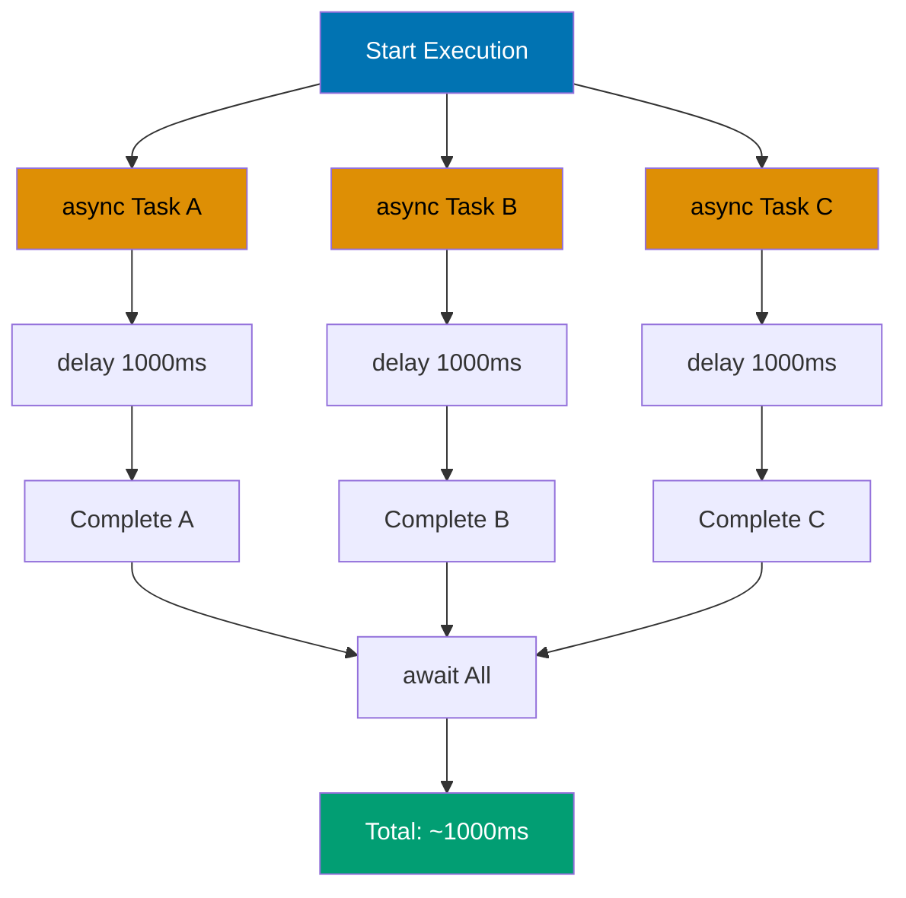
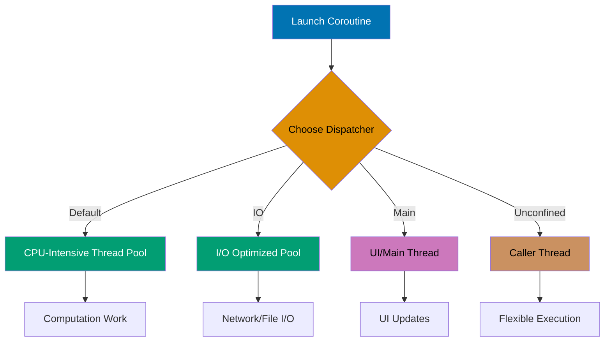
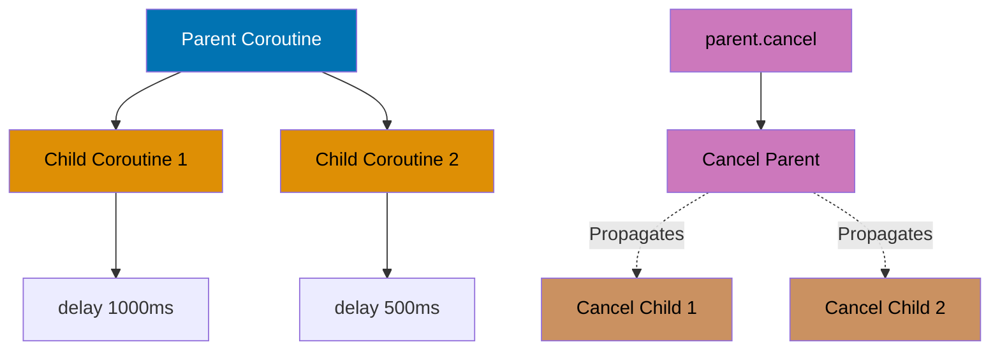
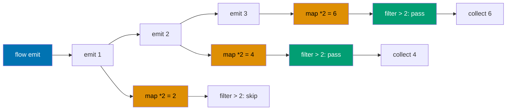
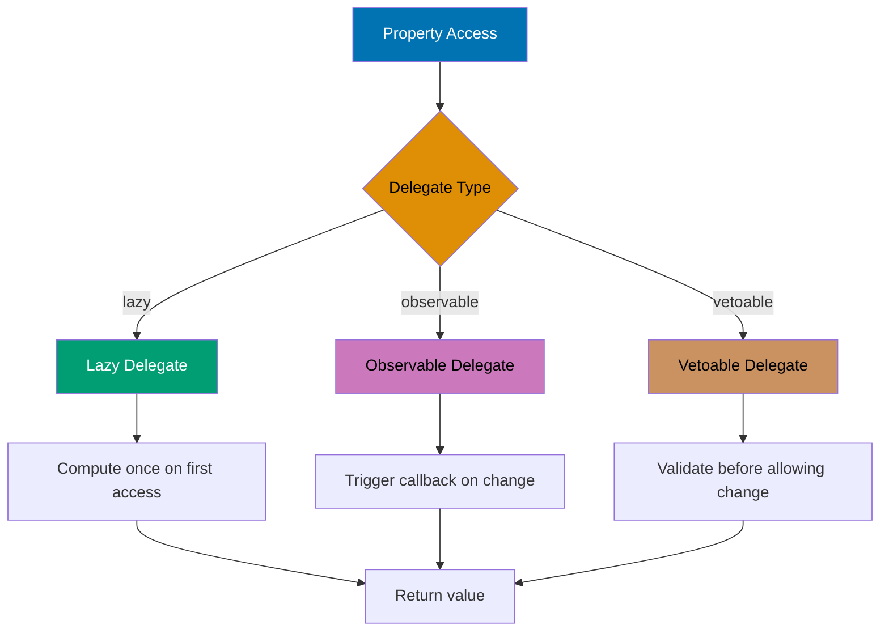
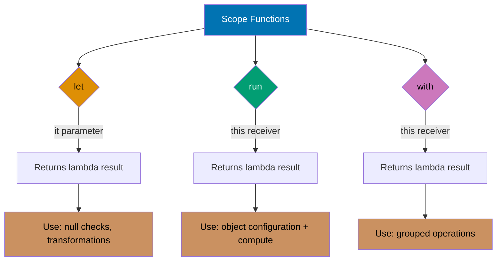
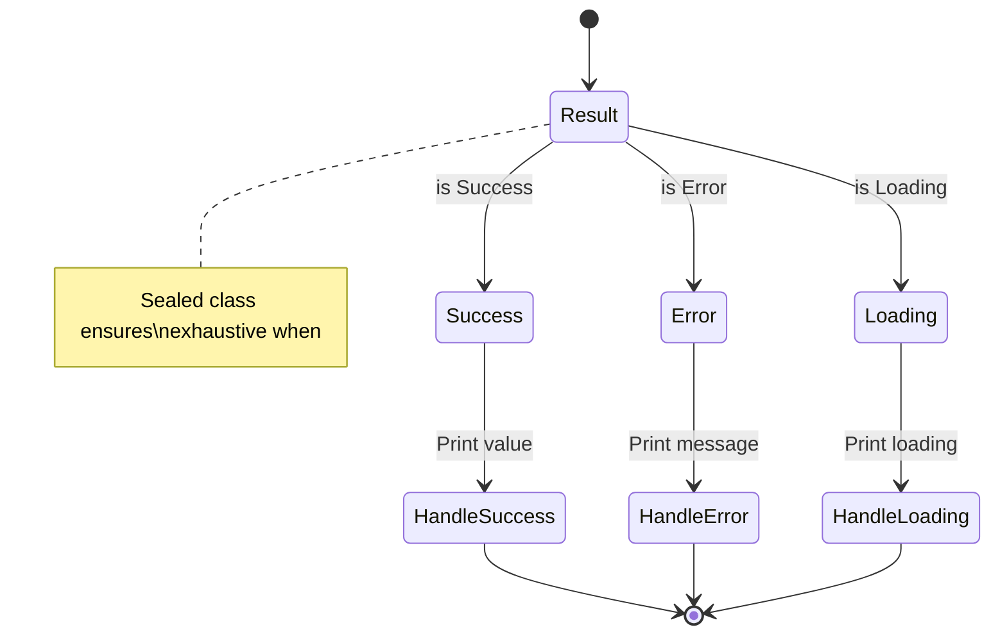
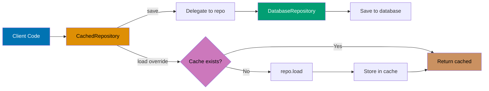

This section covers production Kotlin patterns from examples 28-54, achieving 40-75% topic coverage.

## Example 28: Basic Coroutines

Coroutines enable asynchronous programming with sequential-looking code.

```mermaid
%% Coroutine execution flow showing suspension without blocking
sequenceDiagram
    participant Main as Main Thread
    participant Coroutine as Coroutine
    participant Delay as Delay Scheduler

    Main->>Coroutine: runBlocking { }
    activate Coroutine
    Coroutine->>Coroutine: println("Fetching...")
    Coroutine->>Delay: delay(1000)
    Note over Coroutine: Suspended (thread free)
    Delay-->>Coroutine: Resume after 1s
    Coroutine->>Coroutine: Return user data
    Coroutine->>Main: Complete
    deactivate Coroutine

    style Main fill:#0173B2,color:#fff
    style Coroutine fill:#DE8F05,color:#000
    style Delay fill:#029E73,color:#fff
```

```kotlin
import kotlinx.coroutines.*

suspend fun fetchUserData(userId: Int): String {
    delay(1000)                              // => Suspends without blocking thread
    return "User data for $userId"           // => Return after delay
}

fun main() = runBlocking {                   // => Creates coroutine scope
    println("Fetching data...")
    val data = fetchUserData(1)              // => Suspends here
    println(data)                            // => User data for 1
}
// => Total time: ~1 second (not 0 + 1 seconds)
```

**Key Takeaway**: Coroutines use suspend functions for non-blocking asynchronous operations with linear code flow.

## Example 29: Launch and Async

Launch starts fire-and-forget coroutines; async returns Deferred for result retrieval.

```kotlin
import kotlinx.coroutines.*

fun main() = runBlocking {
    // launch (fire-and-forget)
    val job = launch {                       // => Returns Job
        delay(1000)
        println("Task completed")
    }
    job.join()                               // => Wait for completion

    // async (returns result)
    val deferred = async {                   // => Returns Deferred<T>
        delay(500)
        "Result value"                       // => Compute result
    }
    val result = deferred.await()            // => Wait and get result
    println(result)                          // => Result value
}
```

**Key Takeaway**: Use launch for side effects, async for computations that return results.

## Example 30: Concurrent Coroutines

Multiple coroutines run concurrently, not sequentially.



```kotlin
import kotlinx.coroutines.*
import kotlin.system.measureTimeMillis

suspend fun task(name: String, delay: Long): String {
    delay(delay)
    return "Task $name completed"
}

fun main() = runBlocking {
    val time = measureTimeMillis {
        val result1 = async { task("A", 1000) }  // => Start concurrently
        val result2 = async { task("B", 1000) }  // => Start concurrently
        val result3 = async { task("C", 1000) }  // => Start concurrently

        println(result1.await())             // => Wait for results
        println(result2.await())
        println(result3.await())
    }
    println("Total time: $time ms")          // => ~1000ms (not 3000ms)
}
```

**Key Takeaway**: Concurrent coroutines enable parallel execution reducing total execution time.

## Example 31: Coroutine Context and Dispatchers

Dispatchers control which thread pool executes coroutines.



```kotlin
import kotlinx.coroutines.*

fun main() = runBlocking {
    // Default dispatcher (optimized for CPU-intensive work)
    launch(Dispatchers.Default) {
        println("Default: ${Thread.currentThread().name}")  // => DefaultDispatcher-worker-1
    }

    // IO dispatcher (optimized for I/O operations)
    launch(Dispatchers.IO) {
        println("IO: ${Thread.currentThread().name}")       // => DefaultDispatcher-worker-2
    }

    // Main dispatcher (UI thread in Android/Desktop)
    // launch(Dispatchers.Main) { }

    // Unconfined (runs on caller thread initially)
    launch(Dispatchers.Unconfined) {
        println("Unconfined: ${Thread.currentThread().name}")  // => main
    }

    delay(100)  // => Wait for all launches
}
```

**Key Takeaway**: Dispatchers optimize coroutine execution for CPU work, I/O operations, or UI updates.

## Example 32: Structured Concurrency

Parent coroutine scopes manage child lifecycle for automatic cleanup.



```kotlin
import kotlinx.coroutines.*

fun main() = runBlocking {
    val job = launch {
        // Child coroutine 1
        launch {
            delay(1000)
            println("Child 1 done")
        }

        // Child coroutine 2
        launch {
            delay(500)
            println("Child 2 done")
        }

        println("Parent waiting...")
    }

    delay(200)
    job.cancel()                             // => Cancels parent and all children
    println("All cancelled")
}
// => Parent waiting... (children cancelled before completion)
```

**Key Takeaway**: Structured concurrency ensures child coroutines are cancelled when parent is cancelled.

## Example 33: Flow for Async Streams

Flow emits multiple values asynchronously, like sequences but cold and suspendable.



```kotlin
import kotlinx.coroutines.*
import kotlinx.coroutines.flow.*

fun numbersFlow(): Flow<Int> = flow {
    for (i in 1..3) {
        delay(100)                           // => Suspendable
        emit(i)                              // => Emit value
    }
}

fun main() = runBlocking {
    numbersFlow()
        .map { it * 2 }                      // => Transform: 2, 4, 6
        .filter { it > 2 }                   // => Filter: 4, 6
        .collect { value ->                  // => Terminal operation
            println(value)                   // => 4, 6
        }
}
```

**Key Takeaway**: Flow provides cold asynchronous streams with backpressure support and transformation operators.

## Example 34: StateFlow and SharedFlow

StateFlow holds state with initial value; SharedFlow broadcasts events without state.

```kotlin
import kotlinx.coroutines.*
import kotlinx.coroutines.flow.*

class ViewModel {
    private val _counter = MutableStateFlow(0)  // => Mutable state
    val counter: StateFlow<Int> = _counter      // => Expose as read-only

    fun increment() {
        _counter.value++                     // => Update state
    }
}

fun main() = runBlocking {
    val vm = ViewModel()

    // Collect state updates
    launch {
        vm.counter.collect { value ->
            println("Counter: $value")       // => 0, 1, 2, 3
        }
    }

    delay(100)
    vm.increment()  // => 1
    vm.increment()  // => 2
    vm.increment()  // => 3
    delay(100)
}
```

**Key Takeaway**: StateFlow manages observable state with initial value and conflation of rapid updates.

## Example 35: Collection Operations

Kotlin collections provide rich functional operations.

```kotlin
fun main() {
    val numbers = listOf(1, 2, 3, 4, 5, 6)

    // Transformation
    val doubled = numbers.map { it * 2 }     // => [2, 4, 6, 8, 10, 12]

    // Filtering
    val evens = numbers.filter { it % 2 == 0 }  // => [2, 4, 6]

    // Reduction
    val sum = numbers.reduce { acc, n -> acc + n }  // => 21
    val product = numbers.fold(1) { acc, n -> acc * n }  // => 720

    // Grouping
    val grouped = numbers.groupBy { it % 2 }  // => {1=[1,3,5], 0=[2,4,6]}

    // Partitioning
    val (even, odd) = numbers.partition { it % 2 == 0 }  // => [2,4,6], [1,3,5]

    // Flattening
    val nested = listOf(listOf(1, 2), listOf(3, 4))
    val flat = nested.flatten()              // => [1, 2, 3, 4]

    println(doubled)
    println(evens)
    println(sum)
}
```

**Key Takeaway**: Collection operations enable functional data transformations with concise readable syntax.

## Example 36: Sequences for Lazy Evaluation

Sequences compute elements lazily avoiding intermediate collection creation.

```kotlin
fun main() {
    // List (eager evaluation - creates intermediate lists)
    val listResult = (1..1_000_000)
        .map { it * 2 }                      // => Creates list of 1M elements
        .filter { it > 1000 }                // => Creates another list
        .take(5)                             // => Takes first 5

    // Sequence (lazy evaluation - no intermediate collections)
    val seqResult = (1..1_000_000).asSequence()
        .map { it * 2 }                      // => No computation yet
        .filter { it > 1000 }                // => No computation yet
        .take(5)                             // => Only computes 5 elements
        .toList()                            // => Terminal operation

    println(seqResult)                       // => [1002, 1004, 1006, 1008, 1010]
}
```

**Key Takeaway**: Sequences optimize multi-step transformations by evaluating lazily element-by-element.

## Example 37: Property Delegation

Delegate property implementations to reusable delegate objects.



```kotlin
import kotlin.properties.Delegates

class User {
    // Lazy initialization (computed once on first access)
    val expensiveData: String by lazy {
        println("Computing...")
        "Expensive data"                     // => Computed only once
    }

    // Observable property (callback on change)
    var name: String by Delegates.observable("Initial") { prop, old, new ->
        println("$old -> $new")              // => Callback on change
    }

    // Vetoable property (validate before change)
    var age: Int by Delegates.vetoable(0) { prop, old, new ->
        new >= 0                             // => Only allow non-negative
    }
}

fun main() {
    val user = User()
    println(user.expensiveData)              // => Computing..., Expensive data
    println(user.expensiveData)              // => Expensive data (no recomputation)

    user.name = "Alice"                      // => Initial -> Alice
    user.age = 25                            // => OK
    user.age = -5                            // => Vetoed (stays 25)
    println(user.age)                        // => 25
}
```

**Key Takeaway**: Property delegates extract common property patterns into reusable components.

## Example 38: Custom Delegate

Create custom delegates implementing getValue and setValue operators.

```kotlin
import kotlin.reflect.KProperty

class LoggingDelegate<T>(private var value: T) {
    operator fun getValue(thisRef: Any?, property: KProperty<*>): T {
        println("Getting ${property.name}: $value")
        return value
    }

    operator fun setValue(thisRef: Any?, property: KProperty<*>, newValue: T) {
        println("Setting ${property.name}: $value -> $newValue")
        value = newValue
    }
}

class Config {
    var theme: String by LoggingDelegate("light")  // => Custom delegate
}

fun main() {
    val config = Config()
    println(config.theme)                    // => Getting theme: light, light
    config.theme = "dark"                    // => Setting theme: light -> dark
    println(config.theme)                    // => Getting theme: dark, dark
}
```

**Key Takeaway**: Custom delegates encapsulate property access logic with getValue/setValue operators.

## Example 39: Inline Functions

Inline functions eliminate lambda allocation overhead by inlining bytecode.

```kotlin
// Regular higher-order function (creates lambda object)
fun regularRepeat(times: Int, action: () -> Unit) {
    for (i in 1..times) action()
}

// Inline function (no lambda allocation)
inline fun inlineRepeat(times: Int, action: () -> Unit) {
    for (i in 1..times) action()            // => Bytecode inlined at call site
}

fun main() {
    // With inline, this compiles to:
    // for (i in 1..3) println("Hello")
    inlineRepeat(3) {
        println("Hello")                     // => No lambda object created
    }
}
```

**Key Takeaway**: Inline functions optimize higher-order functions by eliminating lambda allocation overhead.

## Example 40: Reified Type Parameters

Reified type parameters preserve generic type information at runtime.

```kotlin
// Without reified (type erased)
fun <T> genericFunction(value: Any): T? {
    // return value as? T  // => Error: Cannot check for erased type
    return null
}

// With reified (type available at runtime)
inline fun <reified T> reifiedFunction(value: Any): T? {
    return value as? T                       // => Type check possible
}

inline fun <reified T> isInstance(value: Any): Boolean {
    return value is T                        // => Type check at runtime
}

fun main() {
    println(reifiedFunction<String>("Hello"))  // => Hello
    println(reifiedFunction<String>(123))      // => null

    println(isInstance<String>("text"))     // => true
    println(isInstance<Int>("text"))        // => false
}
```

**Key Takeaway**: Reified type parameters enable runtime type checks in generic inline functions.

## Example 41: Extension Functions on Collections

Create domain-specific collection operations with extension functions.

```kotlin
// Extension function
fun List<Int>.second(): Int? = if (size >= 2) this[1] else null

fun <T> List<T>.split(predicate: (T) -> Boolean): Pair<List<T>, List<T>> {
    val matching = mutableListOf<T>()
    val notMatching = mutableListOf<T>()
    forEach { if (predicate(it)) matching.add(it) else notMatching.add(it) }
    return matching to notMatching
}

fun main() {
    val numbers = listOf(1, 2, 3, 4, 5)
    println(numbers.second())                // => 2

    val (evens, odds) = numbers.split { it % 2 == 0 }
    println(evens)                           // => [2, 4]
    println(odds)                            // => [1, 3, 5]
}
```

**Key Takeaway**: Extension functions on collections enable domain-specific operations without subclassing.

## Example 42: Scope Functions - let, run, with

Scope functions provide context for object operations with different receivers.



```kotlin
data class Person(var name: String, var age: Int)

fun main() {
    val person = Person("Alice", 30)

    // let (it parameter, returns lambda result)
    val nameLength = person.let {
        println("Processing ${it.name}")     // => it reference
        it.name.length                       // => Returns length
    }
    println(nameLength)                      // => 5

    // run (this receiver, returns lambda result)
    val description = person.run {
        age += 1                             // => this.age
        "Name: $name, Age: $age"             // => Returns string
    }
    println(description)                     // => Name: Alice, Age: 31

    // with (this receiver, non-extension)
    with(person) {
        name = "Bob"                         // => this.name
        age = 25
    }
    println(person)                          // => Person(name=Bob, age=25)
}
```

**Key Takeaway**: let uses it parameter, run/with use this receiver for different coding styles.

## Example 43: Scope Functions - apply, also

Apply and also configure objects returning the receiver itself.

```kotlin
data class Config(var host: String = "", var port: Int = 0)

fun main() {
    // apply (this receiver, returns receiver)
    val config = Config().apply {
        host = "localhost"                   // => this.host
        port = 8080                          // => this.port
    }
    println(config)                          // => Config(host=localhost, port=8080)

    // also (it parameter, returns receiver)
    val numbers = mutableListOf(1, 2, 3).also {
        println("Initial: $it")              // => Initial: [1, 2, 3]
        it.add(4)
    }
    println(numbers)                         // => [1, 2, 3, 4]

    // Chaining
    val result = mutableListOf<Int>()
        .also { println("Created list") }
        .apply {
            add(1)
            add(2)
        }
        .also { println("Added elements: $it") }

    println(result)                          // => [1, 2]
}
```

**Key Takeaway**: apply/also return receiver enabling fluent configuration and chaining.

## Example 44: Type-Safe Builders (DSL)

Create type-safe DSLs using lambda with receiver.

```mermaid
%% DSL builder structure and lambda with receiver flow
graph TD
    DSL[html DSL Block] --> Head[head block]
    DSL --> Body[body block]

    Head --> HeadReceiver[Head.() -> Unit]
    HeadReceiver --> Title[Set title property]

    Body --> BodyReceiver[Body.() -> Unit]
    BodyReceiver --> H1[h1 function call]
    BodyReceiver --> P[p function call]

    Title --> Build[Build HTML string]
    H1 --> Build
    P --> Build

    style DSL fill:#0173B2,color:#fff
    style Head fill:#DE8F05,color:#000
    style Body fill:#DE8F05,color:#000
    style HeadReceiver fill:#029E73,color:#fff
    style BodyReceiver fill:#029E73,color:#fff
    style Build fill:#CC78BC,color:#000
```

```kotlin
class HTML {
    private val elements = mutableListOf<String>()

    fun head(init: Head.() -> Unit) {
        elements.add(Head().apply(init).toString())
    }

    fun body(init: Body.() -> Unit) {
        elements.add(Body().apply(init).toString())
    }

    override fun toString() = "<html>${elements.joinToString("")}</html>"
}

class Head {
    var title = ""
    override fun toString() = "<head><title>$title</title></head>"
}

class Body {
    private val content = mutableListOf<String>()

    fun h1(text: String) {
        content.add("<h1>$text</h1>")
    }

    fun p(text: String) {
        content.add("<p>$text</p>")
    }

    override fun toString() = "<body>${content.joinToString("")}</body>"
}

fun html(init: HTML.() -> Unit): HTML = HTML().apply(init)

fun main() {
    val page = html {                        // => DSL block
        head {
            title = "My Page"
        }
        body {
            h1("Welcome")
            p("This is a paragraph")
        }
    }
    println(page)  // => <html><head><title>My Page</title></head><body><h1>Welcome</h1><p>This is a paragraph</p></body></html>
}
```

**Key Takeaway**: Lambda with receiver enables type-safe DSLs with nested structure and compile-time checking.

## Example 45: Sealed Classes for State

Sealed classes restrict inheritance for exhaustive when expressions.



```kotlin
sealed class Result<out T> {
    data class Success<T>(val value: T) : Result<T>()
    data class Error(val message: String) : Result<Nothing>()
    object Loading : Result<Nothing>()
}

fun handleResult(result: Result<String>) {
    when (result) {                          // => Exhaustive (compiler checks all cases)
        is Result.Success -> println("Success: ${result.value}")
        is Result.Error -> println("Error: ${result.message}")
        Result.Loading -> println("Loading...")
    }
    // No else needed - compiler knows all subclasses
}

fun main() {
    handleResult(Result.Success("Data loaded"))  // => Success: Data loaded
    handleResult(Result.Error("Network error"))  // => Error: Network error
    handleResult(Result.Loading)             // => Loading...
}
```

**Key Takeaway**: Sealed classes enable exhaustive type hierarchies with compile-time completeness checking.

## Example 46: Inline Classes (Value Classes)

Inline classes provide zero-overhead type-safe wrappers.

```kotlin
@JvmInline
value class UserId(val value: Int)          // => No runtime object overhead

@JvmInline
value class Email(val value: String) {
    init {
        require(value.contains("@")) { "Invalid email" }
    }
}

fun sendEmail(to: Email, from: Email) {
    println("Sending from ${from.value} to ${to.value}")
}

fun main() {
    val id1 = UserId(123)                    // => No allocation (inlined to Int)
    val id2 = UserId(456)

    val email1 = Email("user@example.com")   // => Validated at construction
    val email2 = Email("admin@example.com")

    sendEmail(email1, email2)                // => Type-safe (can't pass String)
    // sendEmail("string", email2)           // => Compile error
}
```

**Key Takeaway**: Value classes provide type safety without runtime overhead through compile-time inlining.

## Example 47: Contracts for Smart Casts

Contracts inform compiler about function behavior enabling smart casts.

```kotlin
import kotlin.contracts.*

fun String?.isNotNullOrEmpty(): Boolean {
    contract {
        returns(true) implies (this@isNotNullOrEmpty != null)  // => Contract declaration
    }
    return this != null && this.isNotEmpty()
}

fun processText(text: String?) {
    if (text.isNotNullOrEmpty()) {
        // Compiler knows text is non-null here due to contract
        println(text.uppercase())            // => No null check needed
    }
}

fun main() {
    processText("hello")                     // => HELLO
    processText(null)                        // => (nothing)
    processText("")                          // => (nothing)
}
```

**Key Takeaway**: Contracts enable custom validation functions to influence compiler's smart cast analysis.

## Example 48: Context Receivers (Experimental)

Context receivers provide implicit context parameters for clean DSLs.

```kotlin
// Requires compiler flag: -Xcontext-receivers

interface Logger {
    fun log(message: String)
}

class ConsoleLogger : Logger {
    override fun log(message: String) = println("[LOG] $message")
}

context(Logger)                              // => Requires Logger in context
fun performTask(name: String) {
    log("Starting task: $name")              // => Uses context Logger
    // ... task logic ...
    log("Completed task: $name")
}

fun main() {
    val logger = ConsoleLogger()
    with(logger) {                           // => Provides Logger context
        performTask("Data processing")       // => [LOG] Starting/Completed
    }
}
```

**Key Takeaway**: Context receivers enable dependency injection-like patterns with cleaner syntax.

## Example 49: Multiplatform Expect/Actual

Expect declarations define platform-specific API; actual provides implementations.

```kotlin
// Common module (expect)
expect fun platform(): String

expect class UUID {
    fun toString(): String
}

fun greetings(): String {
    return "Hello from ${platform()}"        // => Uses platform-specific impl
}

// JVM module (actual)
actual fun platform(): String = "JVM"

actual class UUID {
    actual fun toString(): String = java.util.UUID.randomUUID().toString()
}

// JS module (actual)
// actual fun platform(): String = "JavaScript"
// actual class UUID { ... }

// iOS module (actual)
// actual fun platform(): String = "iOS"
// actual class UUID { ... }
```

**Key Takeaway**: Expect/actual mechanism enables shared code with platform-specific implementations.

## Example 50: Companion Object Extensions

Extend companion objects with additional factory methods.

```kotlin
class User(val name: String, val role: String) {
    companion object {
        fun create(name: String): User {
            return User(name, "user")        // => Default factory
        }
    }
}

// Extension on companion object
fun User.Companion.admin(name: String): User {
    return User(name, "admin")               // => Additional factory
}

fun main() {
    val user = User.create("Alice")          // => User(name=Alice, role=user)
    val admin = User.admin("Bob")            // => User(name=Bob, role=admin)

    println("${user.name}: ${user.role}")    // => Alice: user
    println("${admin.name}: ${admin.role}")  // => Bob: admin
}
```

**Key Takeaway**: Companion object extensions add factory methods without modifying original class.

## Example 51: Delegation Pattern

Implement interfaces by delegating to contained objects using by keyword.



```kotlin
interface Repository {
    fun save(data: String)
    fun load(): String
}

class DatabaseRepository : Repository {
    override fun save(data: String) = println("Saving to DB: $data")
    override fun load() = "DB data"
}

class CachedRepository(
    private val repo: Repository             // => Delegate
) : Repository by repo {                     // => Delegate all methods to repo
    private var cache: String? = null

    override fun load(): String {            // => Override specific method
        return cache ?: repo.load().also { cache = it }
    }
}

fun main() {
    val db = DatabaseRepository()
    val cached = CachedRepository(db)

    cached.save("test")                      // => Delegated: Saving to DB: test
    println(cached.load())                   // => Loads from DB, caches
    println(cached.load())                   // => Returns cached value
}
```

**Key Takeaway**: Class delegation with by eliminates boilerplate forwarding methods.

## Example 52: Type Aliases

Type aliases create alternative names for existing types improving readability.

```kotlin
// Simplify complex types
typealias UserMap = Map<Int, String>
typealias Predicate<T> = (T) -> Boolean
typealias Handler = (String) -> Unit

class UserService {
    private val users: UserMap = mapOf(      // => More readable than Map<Int, String>
        1 to "Alice",
        2 to "Bob"
    )

    fun filterUsers(predicate: Predicate<String>): List<String> {
        return users.values.filter(predicate)
    }

    fun processUser(id: Int, handler: Handler) {
        users[id]?.let(handler)
    }
}

fun main() {
    val service = UserService()

    val filtered = service.filterUsers { it.startsWith("A") }
    println(filtered)                        // => [Alice]

    service.processUser(1) { name ->
        println("Processing: $name")         // => Processing: Alice
    }
}
```

**Key Takeaway**: Type aliases improve code readability for complex or frequently used type combinations.

## Example 53: Destructuring in Lambdas

Destructure data class parameters in lambda expressions for concise code.

```kotlin
data class User(val id: Int, val name: String, val age: Int)

fun main() {
    val users = listOf(
        User(1, "Alice", 30),
        User(2, "Bob", 25),
        User(3, "Charlie", 35)
    )

    // Destructuring in lambda
    users.forEach { (id, name, age) ->       // => Destructure User
        println("$id: $name ($age years)")
    }

    // Partial destructuring (ignore some components)
    users.forEach { (id, name, _) ->         // => Ignore age
        println("$id: $name")
    }

    // Map entries
    val map = mapOf(1 to "one", 2 to "two")
    map.forEach { (key, value) ->            // => Destructure Map.Entry
        println("$key -> $value")
    }
}
```

**Key Takeaway**: Lambda destructuring enables concise parameter extraction from data classes and pairs.

## Example 54: Nothing Type and Exhaustiveness

Nothing type represents computation that never returns normally.

```kotlin
fun fail(message: String): Nothing {
    throw IllegalStateException(message)     // => Never returns normally
}

sealed class Operation {
    data class Add(val a: Int, val b: Int) : Operation()
    data class Multiply(val a: Int, val b: Int) : Operation()
}

fun calculate(op: Operation): Int = when (op) {
    is Operation.Add -> op.a + op.b
    is Operation.Multiply -> op.a * op.b
    // No else needed - sealed class is exhaustive
}

fun processValue(value: Int?) {
    val nonNull = value ?: fail("Value is null")  // => Smart cast after fail
    println(nonNull + 10)                    // => Compiler knows nonNull is Int
}

fun main() {
    println(calculate(Operation.Add(2, 3)))  // => 5
    processValue(5)                          // => 15
    // processValue(null)                    // => throws exception
}
```

**Key Takeaway**: Nothing type enables compiler to understand that code paths never complete normally.

## Summary

Intermediate Kotlin (examples 28-54) covers production patterns essential for real-world development: coroutines for concurrency, rich collection operations, property delegation, inline functions and reified types, type-safe builders, sealed classes for exhaustive state handling, and value classes for zero-overhead type safety. Master these patterns to write concurrent, type-safe, and expressive Kotlin code operating at 75% language coverage.
