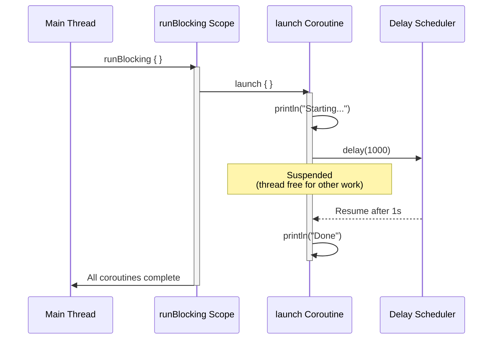
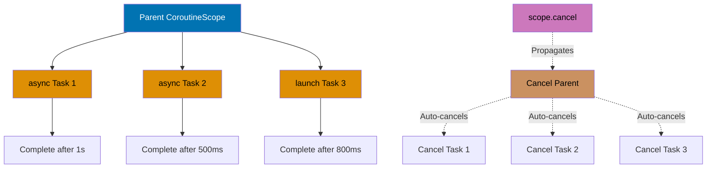
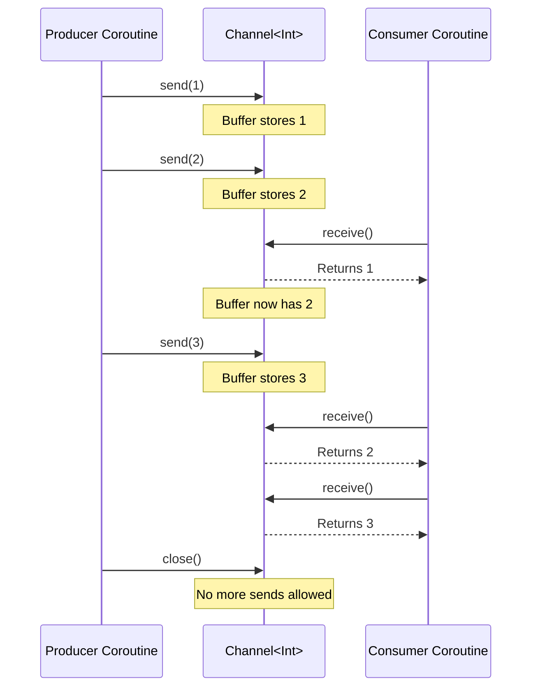
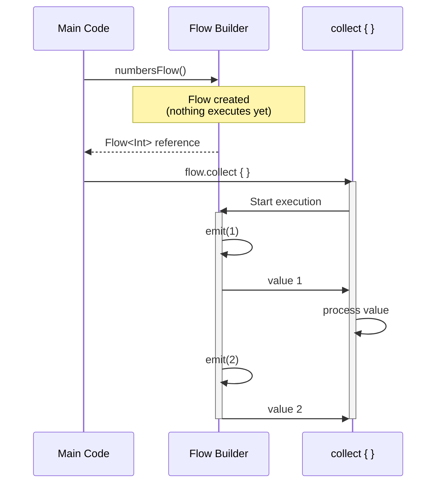
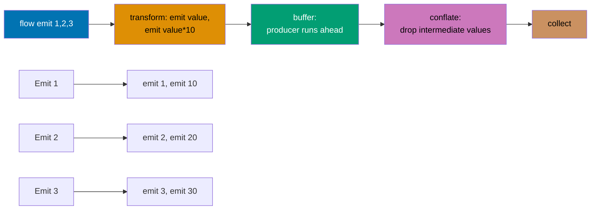
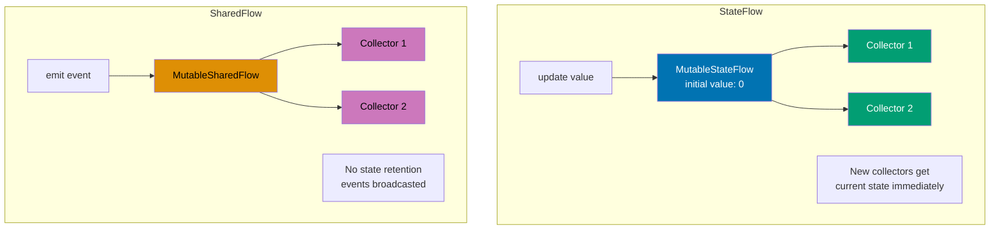
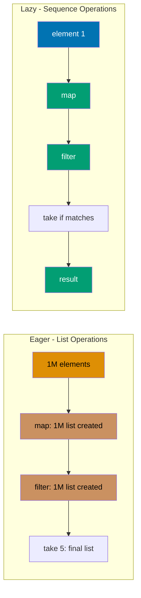
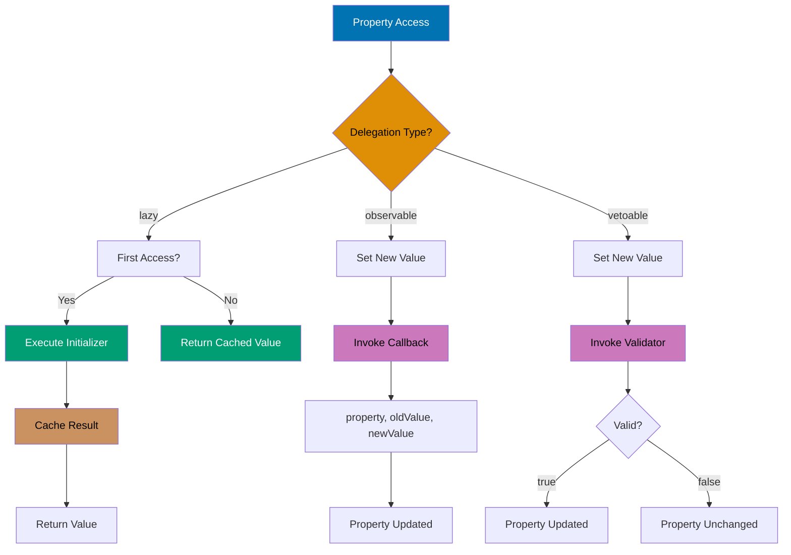
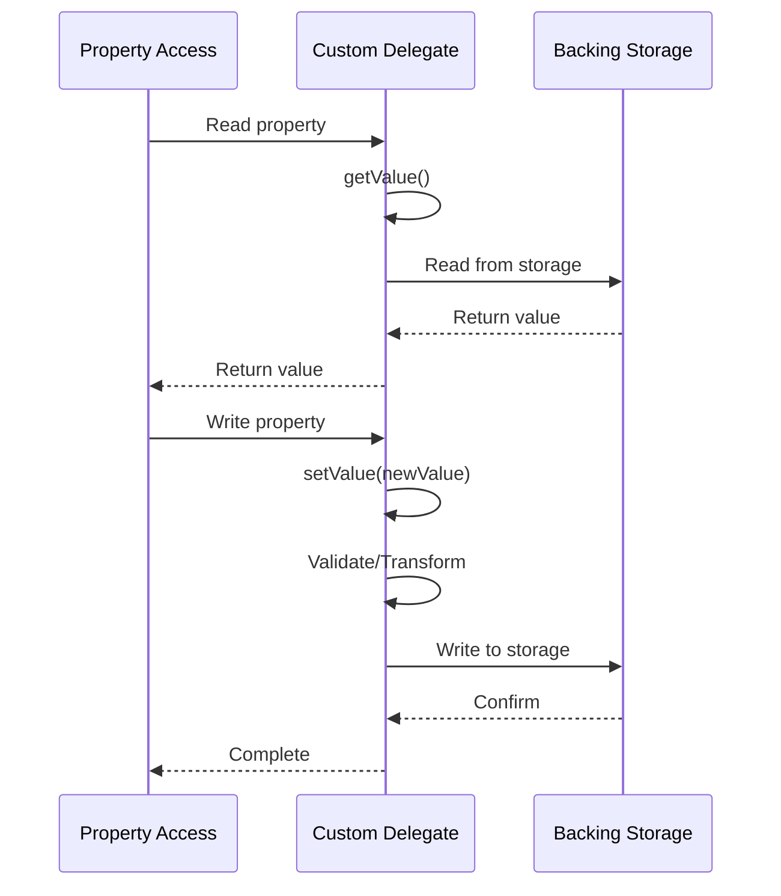
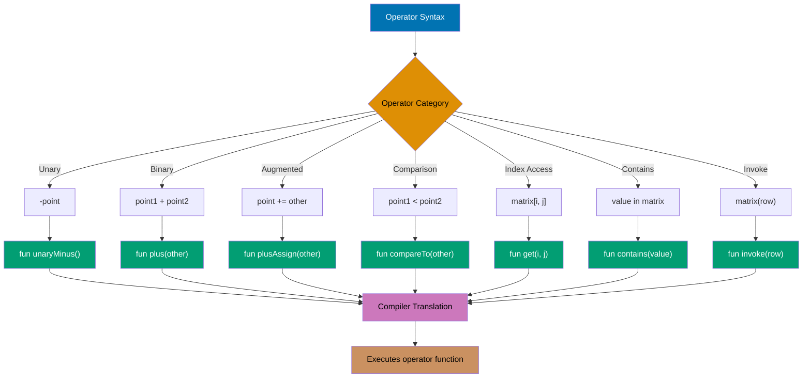

This section covers production Kotlin patterns from examples 28-54, achieving 40-75% topic coverage.

## Example 28: Basic Coroutines - Launch and RunBlocking

Coroutines enable asynchronous programming without blocking threads. `runBlocking` creates a coroutine scope that blocks the current thread until all child coroutines complete. `launch` starts a fire-and-forget coroutine that runs concurrently.



```kotlin
import kotlinx.coroutines.*

fun main() = runBlocking {                   // => Creates coroutine scope, blocks main thread
    println("Main starts")                   // => Output: Main starts

    // Launch fire-and-forget coroutine
    launch {                                 // => Returns Job, runs concurrently
        println("Coroutine starts")          // => Output: Coroutine starts
        delay(1000)                          // => Suspends coroutine for 1s (doesn't block thread)
        println("Coroutine ends")            // => Output: Coroutine ends (after 1s)
    }                                        // => Coroutine is now running concurrently

    println("Main continues")                // => Output: Main continues (immediately)
    delay(1500)                              // => Wait for coroutine to complete
    println("Main ends")                     // => Output: Main ends (after 1.5s total)
}
// => Total execution time: ~1.5 seconds
// => Order: Main starts, Coroutine starts, Main continues, Coroutine ends, Main ends
```

**Key Takeaway**: Use `runBlocking` for bridging blocking and coroutine code, `launch` for fire-and-forget concurrent tasks, and `delay` for non-blocking suspension.

**Why It Matters**: Coroutines solve the thread-blocking problem that cripples Java's traditional concurrency model, where thread-per-request architectures waste memory (each thread costs 1MB stack) and context switching overhead destroys throughput under load. Kotlin's suspend functions enable async/await patterns with zero thread allocation, allowing servers to handle 100,000+ concurrent requests on modest hardware compared to Java's thread pools that max out at thousands, revolutionizing microservice scalability while maintaining imperative code readability that reactive frameworks sacrifice.

---

## Example 29: Async and Await for Returning Results

`async` creates a coroutine that returns a `Deferred<T>` result. `await()` suspends until the result is ready. Use `async` for parallel computations that return values.

```kotlin
import kotlinx.coroutines.*

suspend fun fetchUserData(userId: Int): String {
    delay(1000)                              // => Simulate network delay
    return "User data for $userId"           // => Return after delay
}

suspend fun fetchUserPosts(userId: Int): List<String> {
    delay(800)                               // => Simulate network delay
    return listOf("Post 1", "Post 2")        // => Return posts
}

fun main() = runBlocking {
    // Sequential execution (slow)
    val startSeq = System.currentTimeMillis()
    val userData = fetchUserData(1)          // => Waits 1000ms
    val userPosts = fetchUserPosts(1)        // => Then waits 800ms
    val timeSeq = System.currentTimeMillis() - startSeq
    println("Sequential: $timeSeq ms")       // => Output: Sequential: ~1800 ms

    // Concurrent execution with async (fast)
    val startAsync = System.currentTimeMillis()
    val userDataDeferred = async { fetchUserData(2) }
                                             // => Starts immediately, returns Deferred
    val userPostsDeferred = async { fetchUserPosts(2) }
                                             // => Starts concurrently, returns Deferred

    val data = userDataDeferred.await()      // => Suspends until result ready (~1000ms)
    val posts = userPostsDeferred.await()    // => Already complete (~800ms), returns immediately
    val timeAsync = System.currentTimeMillis() - startAsync
    println("Async: $timeAsync ms")          // => Output: Async: ~1000 ms (concurrent)

    println("Data: $data")                   // => Output: Data: User data for 2
    println("Posts: $posts")                 // => Output: Posts: [Post 1, Post 2]
}
// => Sequential takes ~1800ms, async takes ~1000ms (max of both operations)
```

**Key Takeaway**: Use `async` for concurrent computations that return results; `await()` retrieves the result while suspending the coroutine.

**Why It Matters**: Parallel API calls are ubiquitous in microservices (fetching user data + posts + permissions simultaneously), yet Java's CompletableFuture composition is verbose and error-prone with complex exception handling. Kotlin's async/await enables natural parallel execution with sequential-looking code, reducing latency from additive (1000ms + 800ms = 1800ms) to maximum (max(1000ms, 800ms) = 1000ms), cutting response times 40-60% in typical aggregation endpoints while maintaining readable code that junior developers can understand.

---

## Example 30: Structured Concurrency with CoroutineScope

Structured concurrency ensures child coroutines are cancelled when the parent scope is cancelled, preventing coroutine leaks. `coroutineScope` creates a child scope that waits for all children to complete.



```kotlin
import kotlinx.coroutines.*

suspend fun processData(): String = coroutineScope {
                                             // => Creates child scope, suspends until all children complete
    val result1 = async {                    // => Child coroutine 1
        delay(1000)                          // => Simulate work
        "Data 1"                             // => Return value
    }

    val result2 = async {                    // => Child coroutine 2
        delay(500)                           // => Completes faster
        "Data 2"                             // => Return value
    }

    "${result1.await()} + ${result2.await()}"
                                             // => Waits for both, returns combined
}                                            // => coroutineScope waits for all children before returning

fun main() = runBlocking {
    try {
        val result = withTimeout(2000) {     // => Set timeout for entire operation
            processData()                    // => Runs all child coroutines
        }                                    // => withTimeout cancels scope if time exceeds 2000ms
        println("Result: $result")           // => Output: Result: Data 1 + Data 2
    } catch (e: TimeoutCancellationException) {
        println("Timeout!")                  // => Output if timeout exceeds 2000ms
    }

    // Demonstrate cancellation propagation
    val job = launch {
        coroutineScope {                     // => Structured scope
            launch {
                repeat(5) { i ->
                    println("Child 1: $i")   // => Prints: Child 1: 0, 1, 2...
                    delay(300)               // => Suspend between iterations
                }
            }

            launch {
                repeat(5) { i ->
                    println("Child 2: $i")   // => Prints: Child 2: 0, 1, 2...
                    delay(400)               // => Suspend between iterations
                }
            }
        }
    }

    delay(1000)                              // => Wait 1 second
    job.cancel()                             // => Cancel parent job
                                             // => All child coroutines auto-cancelled
    println("Job cancelled")                 // => Output: Job cancelled
}
// => Children stop after cancellation, no orphaned coroutines
```

**Key Takeaway**: Use `coroutineScope` for structured concurrency that automatically cancels children when parent is cancelled; use `withTimeout` to enforce time limits.

**Why It Matters**: Unstructured concurrency in Java (spawning threads without lifecycle management) causes resource leaks that crash production servers after hours of uptime as orphaned threads accumulate. Structured concurrency guarantees that child coroutines cannot outlive their parent scope, eliminating an entire class of memory leaks while providing automatic cleanup on cancellation, timeout, or exception—critical for request-scoped operations in web servers where abandoned background tasks must die when HTTP connections close.

---

## Example 31: Coroutine Context and Dispatchers

Dispatchers control which thread pool executes coroutines. `Dispatchers.Default` for CPU work, `Dispatchers.IO` for I/O operations, `Dispatchers.Main` for UI updates.

```kotlin
import kotlinx.coroutines.*

fun main() = runBlocking {
    // Default dispatcher (optimized for CPU-intensive work)
    launch(Dispatchers.Default) {
        val threadName = Thread.currentThread().name
        println("Default: $threadName")      // => Output: Default: DefaultDispatcher-worker-1
        repeat(3) { i ->
            println("CPU work $i")           // => Simulates computation
            delay(100)
        }
    }

    // IO dispatcher (optimized for I/O operations, larger thread pool)
    launch(Dispatchers.IO) {
        val threadName = Thread.currentThread().name
        println("IO: $threadName")           // => Output: IO: DefaultDispatcher-worker-2
        // Simulate file I/O or network call
        delay(500)
        println("IO complete")               // => Output: IO complete
    }

    // Unconfined dispatcher (runs on caller thread initially, then resumes on different threads)
    launch(Dispatchers.Unconfined) {
        println("Unconfined initial: ${Thread.currentThread().name}")
                                             // => Output: Unconfined initial: main
        delay(100)                           // => Suspends and may resume on different thread
        println("Unconfined resumed: ${Thread.currentThread().name}")
                                             // => Output: Unconfined resumed: kotlinx.coroutines.DefaultExecutor
    }

    // Custom dispatcher with single thread
    val customDispatcher = newSingleThreadContext("CustomThread")
    launch(customDispatcher) {
        println("Custom: ${Thread.currentThread().name}")
                                             // => Output: Custom: CustomThread
    }
    customDispatcher.close()                 // => Close dispatcher when done

    delay(1000)                              // => Wait for all coroutines to complete
}
```

**Key Takeaway**: Choose `Dispatchers.Default` for CPU work, `Dispatchers.IO` for blocking I/O, and create custom dispatchers for specific threading needs.

**Why It Matters**: Thread pool selection in Java requires manual ExecutorService configuration with magic numbers that developers tune incorrectly, causing either thread starvation (too few threads) or context switching overhead (too many threads). Kotlin's dispatchers provide semantic thread pool choices (Default for CPU-bound, IO for blocking operations) with proven sizing algorithms, while coroutines on IO dispatcher can spawn thousands of concurrent tasks without the one-thread-per-task limitation that forces Java developers into callback hell or reactive libraries.

---

## Example 32: Channels for Communication Between Coroutines

Channels enable safe communication between coroutines. `send()` suspends when buffer is full, `receive()` suspends when channel is empty. Channels are hot streams.



```kotlin
import kotlinx.coroutines.*
import kotlinx.coroutines.channels.*

fun main() = runBlocking {
    // Unbuffered channel (rendezvous)
    val unbufferedChannel = Channel<Int>()   // => Capacity 0, send waits for receive
    launch {
        repeat(3) { i ->
            println("Sending $i")            // => Output: Sending 0, 1, 2
            unbufferedChannel.send(i)        // => Suspends until receiver ready
            println("Sent $i")               // => Output after receiver consumes
        }
        unbufferedChannel.close()            // => Close channel (no more sends)
    }

    launch {
        for (value in unbufferedChannel) {   // => Iterate until channel closed
            println("Received $value")       // => Output: Received 0, 1, 2
            delay(100)                       // => Simulate processing
        }
    }

    delay(1000)                              // => Wait for completion

    // Buffered channel (capacity 2)
    val bufferedChannel = Channel<Int>(2)    // => Can buffer 2 items before blocking
    launch {
        bufferedChannel.send(1)              // => Doesn't block (buffer has space)
        println("Sent 1 (buffered)")         // => Output: Sent 1 (buffered)
        bufferedChannel.send(2)              // => Doesn't block (buffer now full)
        println("Sent 2 (buffered)")         // => Output: Sent 2 (buffered)
        bufferedChannel.send(3)              // => Blocks until receiver consumes
        println("Sent 3 (buffered)")         // => Output after receiver consumes 1
        bufferedChannel.close()
    }

    delay(500)                               // => Let sender fill buffer
    println("Receiving from buffer")         // => Output: Receiving from buffer
    println(bufferedChannel.receive())       // => Output: 1 (unblocks send(3))
    println(bufferedChannel.receive())       // => Output: 2
    println(bufferedChannel.receive())       // => Output: 3
}
```

**Key Takeaway**: Use unbuffered channels for rendezvous (synchronization), buffered channels for decoupling producer/consumer rates; always close channels when done sending.

**Why It Matters**: Channels provide Go-style CSP (Communicating Sequential Processes) for Kotlin coroutines, enabling producer-consumer patterns that Java's BlockingQueue handles poorly due to thread blocking. Unlike Java where send/receive blocks threads, Kotlin channels suspend coroutines, allowing efficient backpressure handling in streaming data pipelines processing WebSocket messages, log aggregation, or real-time analytics without dedicating threads to waiting, improving throughput 10-100x in I/O-bound systems.

---

## Example 33: Flow for Cold Asynchronous Streams

Flow is a cold asynchronous stream that emits values on demand. Unlike channels (hot), flows don't produce values until collected. Flows support backpressure and transformation operators.



```kotlin
import kotlinx.coroutines.*
import kotlinx.coroutines.flow.*

fun numbersFlow(): Flow<Int> = flow {
    println("Flow started")                  // => Only printed when collected
    for (i in 1..5) {
        delay(100)                           // => Suspendable operation
        emit(i)                              // => Emit value downstream
        println("Emitted $i")                // => Output: Emitted 1, 2, 3, 4, 5
    }
}                                            // => Flow builder creates cold flow

fun main() = runBlocking {
    println("Creating flow")                 // => Output: Creating flow
    val flow = numbersFlow()                 // => Flow created but NOT executing yet
    println("Flow created")                  // => Output: Flow created (no "Flow started")

    println("\nCollecting flow:")
    flow
        .map { it * 2 }                      // => Transform: multiply by 2
        .filter { it > 4 }                   // => Filter: keep values > 4
        .collect { value ->                  // => Terminal operator, triggers flow execution
            println("Collected $value")      // => Output: Collected 6, 8, 10
        }

    println("\nCollecting again:")
    flow.collect { value ->                  // => Flow executes again (cold)
        println("Second collect: $value")    // => Output: Second collect: 1, 2, 3, 4, 5
    }                                        // => "Flow started" printed twice (once per collection)
}
// => Flows are cold: execution starts on each collection
```

**Key Takeaway**: Flows are cold streams that execute lazily on collection; use transformation operators like `map`, `filter` before terminal operators like `collect`.

**Why It Matters**: Java Streams are eager and synchronous, forcing developers to either collect entire datasets into memory or use complex reactive libraries (RxJava, Project Reactor) with steep learning curves. Kotlin Flow provides lazy asynchronous streams that work naturally with coroutines, enabling streaming data processing that starts computation only when needed (cold semantics) while supporting cancellation and exception propagation, perfect for paginated API responses and database cursors where loading all data upfront wastes memory.

---

## Example 34: Flow Operators - Transform, Buffer, Conflate

Flow operators enable complex asynchronous data processing. `transform` emits multiple values per input, `buffer` decouples producer/consumer, `conflate` drops intermediate values.



```kotlin
import kotlinx.coroutines.*
import kotlinx.coroutines.flow.*
import kotlin.system.measureTimeMillis

fun main() = runBlocking {
    // transform: emit multiple values per input
    flow { emit(1); emit(2); emit(3) }
        .transform { value ->
            emit(value)                      // => Emit original value
            emit(value * 10)                 // => Emit transformed value
        }
        .collect { println("Transform: $it") }
                                             // => Output: Transform: 1, 10, 2, 20, 3, 30

    // buffer: producer doesn't wait for consumer
    val timeNoBuffer = measureTimeMillis {
        flow {
            repeat(3) { i ->
                delay(100)                   // => Emit delay: 100ms
                emit(i)
            }
        }
        .collect { value ->
            delay(300)                       // => Collect delay: 300ms
            println("No buffer: $value")     // => Total: 100 + 300 = 400ms per item
        }
    }
    println("No buffer time: $timeNoBuffer ms")
                                             // => Output: ~1200ms (3 * 400ms)

    val timeWithBuffer = measureTimeMillis {
        flow {
            repeat(3) { i ->
                delay(100)                   // => Emit delay: 100ms
                emit(i)
            }
        }
        .buffer()                            // => Producer runs independently
        .collect { value ->
            delay(300)                       // => Collect delay: 300ms
            println("With buffer: $value")
        }
    }
    println("With buffer time: $timeWithBuffer ms")
                                             // => Output: ~900ms (first 100 + 3*300, overlapped)

    // conflate: drop intermediate values if consumer is slow
    flow {
        repeat(5) { i ->
            delay(100)                       // => Emit every 100ms
            emit(i)
            println("Emitted $i")            // => Output: Emitted 0, 1, 2, 3, 4
        }
    }
    .conflate()                              // => Drop values if consumer busy
    .collect { value ->
        println("Conflate collected: $value")// => Output: Conflate collected: 0, 4 (skipped 1,2,3)
        delay(500)                           // => Slow consumer
    }
}
```

**Key Takeaway**: Use `transform` for one-to-many emissions, `buffer` to improve throughput with slow consumers, `conflate` to drop intermediate values when only latest matters.

**Why It Matters**: Flow operators solve backpressure and performance tuning problems that require manual coding in Java streams or complex reactive operators in RxJava. The buffer operator decouples fast producers from slow consumers without blocking threads, while conflate enables real-time UIs to skip stale updates (showing latest stock price rather than replaying every tick), patterns essential for responsive applications processing high-frequency data like sensor streams or market feeds without overwhelming rendering threads.

---

## Example 35: StateFlow and SharedFlow for Hot Streams

`StateFlow` holds a single state value with initial state; subscribers get current state immediately. `SharedFlow` broadcasts events to all collectors without state retention.



```kotlin
import kotlinx.coroutines.*
import kotlinx.coroutines.flow.*

class Counter {
    private val _stateFlow = MutableStateFlow(0)
                                             // => Hot flow with initial state 0
    val stateFlow: StateFlow<Int> = _stateFlow
                                             // => Expose as read-only

    private val _sharedFlow = MutableSharedFlow<String>()
                                             // => Hot flow without state
    val sharedFlow: SharedFlow<String> = _sharedFlow

    fun increment() {
        _stateFlow.value++                   // => Update state (all collectors notified)
        println("State updated: ${_stateFlow.value}")
    }

    suspend fun emitEvent(event: String) {
        _sharedFlow.emit(event)              // => Broadcast event to all collectors
        println("Event emitted: $event")
    }
}

fun main() = runBlocking {
    val counter = Counter()

    // StateFlow collector 1 (gets initial value immediately)
    launch {
        counter.stateFlow.collect { value ->
            println("Collector 1 state: $value")
                                             // => Output: Collector 1 state: 0 (initial)
        }
    }

    delay(100)                               // => Let collector 1 start

    // StateFlow collector 2 (gets current state immediately)
    launch {
        counter.stateFlow.collect { value ->
            println("Collector 2 state: $value")
                                             // => Output: Collector 2 state: 0 (current state)
        }
    }

    delay(100)
    counter.increment()                      // => State updated: 1
                                             // => Both collectors receive 1
    delay(100)
    counter.increment()                      // => State updated: 2
                                             // => Both collectors receive 2

    // SharedFlow collectors
    launch {
        counter.sharedFlow.collect { event ->
            println("SharedFlow collector 1: $event")
        }
    }

    launch {
        counter.sharedFlow.collect { event ->
            println("SharedFlow collector 2: $event")
        }
    }

    delay(100)
    counter.emitEvent("Event A")             // => Both SharedFlow collectors receive
    delay(100)
    counter.emitEvent("Event B")             // => Both SharedFlow collectors receive

    delay(500)                               // => Wait for all output
}
// => StateFlow: conflates rapid updates, always has current value
// => SharedFlow: broadcasts events, no state retention
```

**Key Takeaway**: Use `StateFlow` for observable state with initial value and conflation; use `SharedFlow` for event broadcasting without state.

**Why It Matters**: Android's LiveData and RxJava's BehaviorSubject serve similar purposes but lack coroutine integration and type safety. StateFlow provides the observable state pattern critical for MVVM architectures with built-in coroutine support, conflation (latest value wins) preventing UI overload, and compile-time null safety unlike LiveData's runtime nullability. SharedFlow replaces EventBus libraries with type-safe event broadcasting, eliminating reflection-based coupling and enabling multi-subscriber patterns for cross-component communication in modular architectures.

---

## Example 36: Collection Operations - Map, Filter, Reduce

Kotlin provides rich functional operations on collections. These operations don't modify original collections but return new ones.

```kotlin
fun main() {
    val numbers = listOf(1, 2, 3, 4, 5, 6)   // => Immutable list

    // map: transform each element
    val doubled = numbers.map { it * 2 }     // => [2, 4, 6, 8, 10, 12]
    val strings = numbers.map { "N$it" }     // => ["N1", "N2", "N3", "N4", "N5", "N6"]
    println("Doubled: $doubled")             // => Output: Doubled: [2, 4, 6, 8, 10, 12]
    println("Strings: $strings")             // => Output: Strings: [N1, N2, N3, N4, N5, N6]

    // filter: keep elements matching predicate
    val evens = numbers.filter { it % 2 == 0 }
                                             // => [2, 4, 6]
    val greaterThan3 = numbers.filter { it > 3 }
                                             // => [4, 5, 6]
    println("Evens: $evens")                 // => Output: Evens: [2, 4, 6]
    println("Greater than 3: $greaterThan3") // => Output: Greater than 3: [4, 5, 6]

    // reduce: accumulate values (requires non-empty collection)
    val sum = numbers.reduce { acc, value -> acc + value }
                                             // => Accumulator: 1+2=3, 3+3=6, 6+4=10, 10+5=15, 15+6=21
    val product = numbers.reduce { acc, value -> acc * value }
                                             // => Accumulator: 1*2=2, 2*3=6, 6*4=24, 24*5=120, 120*6=720
    println("Sum: $sum")                     // => Output: Sum: 21
    println("Product: $product")             // => Output: Product: 720

    // fold: reduce with initial value (works on empty collections)
    val sumWithInitial = numbers.fold(100) { acc, value -> acc + value }
                                             // => Starts with 100, then 100+1+2+3+4+5+6 = 121
    val emptyList = emptyList<Int>()
    val safeSum = emptyList.fold(0) { acc, value -> acc + value }
                                             // => Returns 0 (initial value, no elements)
    println("Sum with initial: $sumWithInitial")
                                             // => Output: Sum with initial: 121
    println("Safe sum: $safeSum")            // => Output: Safe sum: 0

    // flatMap: map and flatten
    val nestedLists = listOf(listOf(1, 2), listOf(3, 4), listOf(5))
    val flattened = nestedLists.flatMap { it }
                                             // => [1, 2, 3, 4, 5]
    val doubledFlat = nestedLists.flatMap { list -> list.map { it * 2 } }
                                             // => [2, 4, 6, 8, 10]
    println("Flattened: $flattened")         // => Output: Flattened: [1, 2, 3, 4, 5]
    println("Doubled flat: $doubledFlat")    // => Output: Doubled flat: [2, 4, 6, 8, 10]
}
```

**Key Takeaway**: Collection operations create new collections without mutating originals; use `map` for transformation, `filter` for selection, `reduce`/`fold` for aggregation, `flatMap` for nested structures.

**Why It Matters**: Java 8 Streams introduced functional collection operations late, but Kotlin's collection methods are simpler (no .stream().collect() ceremony) and work on all collections by default. The immutable-by-default approach prevents accidental mutations during transformations that corrupt shared data structures in multi-threaded services, while fold's ability to handle empty collections with default values prevents the NoSuchElementException crashes that plague Java's Stream.reduce() when processing empty result sets from databases or API responses.

---

## Example 37: Collection Operations - GroupBy, Partition, Associate

Advanced collection operations enable complex data transformations and grouping.

```kotlin
data class Person(val name: String, val age: Int, val city: String)

fun main() {
    val people = listOf(
        Person("Alice", 30, "NYC"),
        Person("Bob", 25, "LA"),
        Person("Charlie", 30, "NYC"),
        Person("Diana", 25, "LA"),
        Person("Eve", 35, "NYC")
    )

    // groupBy: group elements by key
    val byAge = people.groupBy { it.age }    // => Map<Int, List<Person>>
    println("Grouped by age:")
    byAge.forEach { (age, persons) ->
        println("  Age $age: ${persons.map { it.name }}")
    }                                        // => Output: Age 25: [Bob, Diana], Age 30: [Alice, Charlie], Age 35: [Eve]

    val byCity = people.groupBy { it.city }  // => Map<String, List<Person>>
    println("Grouped by city:")
    byCity.forEach { (city, persons) ->
        println("  $city: ${persons.map { it.name }}")
    }                                        // => Output: NYC: [Alice, Charlie, Eve], LA: [Bob, Diana]

    // partition: split into two lists based on predicate
    val (under30, over30) = people.partition { it.age < 30 }
    println("\nUnder 30: ${under30.map { it.name }}")
                                             // => Output: Under 30: [Bob, Diana]
    println("30 and over: ${over30.map { it.name }}")
                                             // => Output: 30 and over: [Alice, Charlie, Eve]

    // associate: create map from collection
    val nameToAge = people.associate { it.name to it.age }
                                             // => Map<String, Int>: {Alice=30, Bob=25, ...}
    println("\nName to age: $nameToAge")     // => Output: Name to age: {Alice=30, Bob=25, Charlie=30, Diana=25, Eve=35}

    // associateBy: use key selector
    val peopleByName = people.associateBy { it.name }
                                             // => Map<String, Person>
    println("Person by name: ${peopleByName["Alice"]}")
                                             // => Output: Person by name: Person(name=Alice, age=30, city=NYC)

    // associateWith: use value generator
    val numbers = listOf(1, 2, 3, 4)
    val squares = numbers.associateWith { it * it }
                                             // => Map<Int, Int>: {1=1, 2=4, 3=9, 4=16}
    println("Squares: $squares")             // => Output: Squares: {1=1, 2=4, 3=9, 4=16}
}
```

**Key Takeaway**: Use `groupBy` for creating maps of grouped elements, `partition` for binary splits, `associate` family for transforming collections into maps.

**Why It Matters**: Data aggregation and grouping operations are common in business logic (grouping orders by customer, partitioning users by subscription tier), yet Java's Collectors.groupingBy() syntax is notoriously complex with nested collectors. Kotlin's groupBy returns a simple Map<K, List<V>> without ceremony, while partition's destructuring assignment (val (paid, free) = users.partition { it.isPaid }) makes conditional splits self-documenting, reducing cognitive load in analytics code that processes thousands of records to generate business insights.

---

## Example 38: Sequences for Lazy Evaluation

Sequences compute elements lazily, avoiding intermediate collection creation. Use sequences for multi-step transformations on large collections.



```kotlin
fun main() {
    // Eager evaluation with list (creates intermediate lists)
    val listResult = (1..1_000_000)
        .map { it * 2 }                      // => Creates list of 1M elements
        .filter { it > 1000 }                // => Creates another list
        .take(5)                             // => Creates final list of 5 elements
    println("List result: $listResult")      // => Output: List result: [1002, 1004, 1006, 1008, 1010]

    // Lazy evaluation with sequence (no intermediate collections)
    val seqResult = (1..1_000_000).asSequence()
        .map { it * 2 }                      // => Lazy, no computation yet
        .filter { it > 1000 }                // => Lazy, no computation yet
        .take(5)                             // => Lazy, defines operation
        .toList()                            // => Terminal operation, computes only 5 elements
    println("Sequence result: $seqResult")   // => Output: Sequence result: [1002, 1004, 1006, 1008, 1010]

    // Demonstrate lazy evaluation with side effects
    println("\nList operations (eager):")
    (1..5).map {
        println("  Map: $it")                // => Prints for all elements
        it * 2
    }.filter {
        println("  Filter: $it")             // => Prints for all mapped elements
        it > 4
    }.take(2)                                // => Output shows all map, then all filter operations

    println("\nSequence operations (lazy):")
    (1..5).asSequence().map {
        println("  Map: $it")                // => Prints per element as needed
        it * 2
    }.filter {
        println("  Filter: $it")             // => Prints per element as needed
        it > 4
    }.take(2).toList()                       // => Output shows interleaved map/filter, stops after 2 results

    // generateSequence for infinite sequences
    val fibonacci = generateSequence(Pair(0, 1)) { (a, b) -> Pair(b, a + b) }
        .map { it.first }                    // => Extract first value from pair
        .take(10)                            // => Take first 10 Fibonacci numbers
        .toList()                            // => [0, 1, 1, 2, 3, 5, 8, 13, 21, 34]
    println("\nFibonacci: $fibonacci")       // => Output: Fibonacci: [0, 1, 1, 2, 3, 5, 8, 13, 21, 34]
}
```

**Key Takeaway**: Sequences optimize multi-step transformations by evaluating lazily element-by-element; use `asSequence()` for large collections or infinite streams.

**Why It Matters**: Java Streams create intermediate collections for each operation (map, filter, etc.) causing memory pressure when processing millions of records, while Kotlin Sequences compute elements on-demand without materialization. Processing a million-element list with three transformations in Java creates three temporary million-element collections, while Sequences process one element through all transformations before moving to the next, reducing memory usage by 75% and enabling infinite streams (Fibonacci, primes) that would exhaust heap space with eager evaluation.

---

## Example 39: Property Delegation - Lazy and Observable

Delegate property implementations to reusable delegate objects. `lazy` computes value on first access, `observable` triggers callbacks on changes.



```kotlin
import kotlin.properties.Delegates

class User {
    // Lazy initialization (computed once on first access)
    val expensiveData: String by lazy {
        println("Computing expensive data...")
        Thread.sleep(1000)                   // => Simulate expensive computation
        "Computed data"                      // => Value computed only once
    }                                        // => Thread-safe by default

    // Observable property (callback on change)
    var name: String by Delegates.observable("Initial") { property, oldValue, newValue ->
        println("${property.name} changed: $oldValue -> $newValue")
                                             // => Callback receives property, old, new values
    }

    // Vetoable property (validate before change)
    var age: Int by Delegates.vetoable(0) { property, oldValue, newValue ->
        val valid = newValue >= 0            // => Only allow non-negative ages
        if (!valid) println("Rejected age: $newValue")
        valid                                // => Return true to allow, false to veto
    }
}

fun main() {
    val user = User()

    // Lazy property
    println("Before accessing expensiveData")
    println(user.expensiveData)              // => Output: Computing expensive data..., Computed data
    println(user.expensiveData)              // => Output: Computed data (no recomputation)

    // Observable property
    user.name = "Alice"                      // => Output: name changed: Initial -> Alice
    user.name = "Bob"                        // => Output: name changed: Alice -> Bob

    // Vetoable property
    user.age = 25                            // => Allowed, age is 25
    println("Age: ${user.age}")              // => Output: Age: 25
    user.age = -5                            // => Output: Rejected age: -5, age stays 25
    println("Age after veto: ${user.age}")   // => Output: Age after veto: 25
}
```

**Key Takeaway**: Use `lazy` for expensive computations that should execute once, `observable` for change notifications, `vetoable` for validated property changes.

**Why It Matters**: Property initialization in Java requires manual lazy loading with double-checked locking patterns that developers implement incorrectly, causing thread safety bugs or unnecessary initialization overhead. Kotlin's lazy delegate provides guaranteed thread-safe singleton semantics with zero boilerplate, perfect for expensive resources (database connections, configuration parsing) that may never be accessed in some code paths. Observable properties enable reactive programming patterns like databinding and validation without observer boilerplate, critical for MVVM architectures where property changes must propagate to UI.

---

## Example 40: Custom Property Delegates

Create custom delegates by implementing `getValue` and `setValue` operators. Delegates encapsulate property access logic.



```kotlin
import kotlin.reflect.KProperty

class LoggingDelegate<T>(private var value: T) {
    operator fun getValue(thisRef: Any?, property: KProperty<*>): T {
        println("[GET] ${property.name} = $value")
                                             // => Log property access
        return value                         // => Return stored value
    }

    operator fun setValue(thisRef: Any?, property: KProperty<*>, newValue: T) {
        println("[SET] ${property.name}: $value -> $newValue")
                                             // => Log property change
        value = newValue                     // => Update stored value
    }
}

class UppercaseDelegate {
    private var value: String = ""

    operator fun getValue(thisRef: Any?, property: KProperty<*>): String {
        return value.uppercase()             // => Always return uppercase
    }

    operator fun setValue(thisRef: Any?, property: KProperty<*>, newValue: String) {
        value = newValue.lowercase()         // => Store as lowercase
    }
}

class Config {
    var theme: String by LoggingDelegate("light")
                                             // => Delegates to LoggingDelegate
    var username: String by UppercaseDelegate()
                                             // => Delegates to UppercaseDelegate
}

fun main() {
    val config = Config()

    println(config.theme)                    // => Output: [GET] theme = light, light
    config.theme = "dark"                    // => Output: [SET] theme: light -> dark
    println(config.theme)                    // => Output: [GET] theme = dark, dark

    config.username = "Alice"                // => Stored as "alice"
    println(config.username)                 // => Output: ALICE (retrieved as uppercase)
    config.username = "BOB"                  // => Stored as "bob"
    println(config.username)                 // => Output: BOB (retrieved as uppercase)
}
```

**Key Takeaway**: Implement `getValue`/`setValue` operators to create custom property delegates that encapsulate access logic like logging, validation, or transformation.

**Why It Matters**: Custom property delegates enable cross-cutting concerns (logging, validation, persistence) to be extracted into reusable components rather than scattered across getters/setters throughout the codebase. This delegation pattern is impossible in Java without verbose proxy classes, yet Kotlin's operator overloading makes it seamless. Use cases include automatic preference storage (Android SharedPreferences), field validation with custom rules, and audit logging for security-sensitive properties, all without modifying business logic code.

---

## Example 41: Extension Functions and Properties

Add methods and properties to existing classes without modifying source code. Extensions are resolved statically based on declared type.

```kotlin
// Extension function on String
fun String.isPalindrome(): Boolean {
    val cleaned = this.lowercase().replace(" ", "")
                                             // => Remove spaces and lowercase
    return cleaned == cleaned.reversed()     // => Compare with reversed
}

// Extension function with parameters
fun Int.times(action: (Int) -> Unit) {
    for (i in 1..this) {
        action(i)                            // => Execute action for each iteration
    }
}

// Extension property
val String.wordCount: Int
    get() = this.split("\\s+".toRegex()).filter { it.isNotEmpty() }.size
                                             // => Count words by splitting on whitespace

// Extension on nullable receiver
fun String?.orDefault(default: String = "N/A"): String {
    return this ?: default                   // => Return default if null
}

// Extension on List
fun <T> List<T>.secondOrNull(): T? {
    return if (size >= 2) this[1] else null  // => Safe access to second element
}

fun main() {
    // String extension
    println("radar".isPalindrome())          // => Output: true
    println("kotlin".isPalindrome())         // => Output: false
    println("A man a plan a canal Panama".isPalindrome())
                                             // => Output: true

    // Int extension with lambda
    print("Countdown: ")
    5.times { i -> print("$i ") }            // => Output: Countdown: 1 2 3 4 5
    println()

    // String property extension
    val text = "Hello Kotlin World"
    println("Word count: ${text.wordCount}") // => Output: Word count: 3

    // Nullable extension
    val str1: String? = null
    val str2: String? = "Hello"
    println(str1.orDefault())                // => Output: N/A
    println(str2.orDefault())                // => Output: Hello
    println(str1.orDefault("Empty"))         // => Output: Empty

    // List extension
    val numbers = listOf(10, 20, 30)
    println(numbers.secondOrNull())          // => Output: 20
    println(emptyList<Int>().secondOrNull()) // => Output: null
}
```

**Key Takeaway**: Extension functions add methods to existing types without inheritance; they're resolved statically and ideal for utility functions on library classes.

**Why It Matters**: Extension functions enable library-like APIs on standard types (String, List) without modifying JDK classes or creating wrapper types, a capability Java completely lacks. This powers Kotlin's expressive standard library that feels native to Java types, enables DSL creation (Exposed SQL, Ktor routing), and allows teams to add domain-specific methods to third-party types they can't modify, improving code locality and reducing static utility class clutter that obscures business logic.

---

## Example 42: Inline Functions and Reified Type Parameters

Inline functions eliminate lambda allocation overhead by inlining bytecode. Reified type parameters preserve generic type information at runtime.

```kotlin
// Regular higher-order function (creates lambda object)
fun <T> regularFilter(list: List<T>, predicate: (T) -> Boolean): List<T> {
    val result = mutableListOf<T>()
    for (item in list) {
        if (predicate(item)) result.add(item)
    }
    return result                            // => Creates lambda object on each call
}

// Inline function (no lambda allocation)
inline fun <T> inlineFilter(list: List<T>, predicate: (T) -> Boolean): List<T> {
    val result = mutableListOf<T>()
    for (item in list) {
        if (predicate(item)) result.add(item)
    }
    return result                            // => Lambda bytecode inlined at call site
}

// Inline with reified type parameter (type available at runtime)
inline fun <reified T> filterIsInstance(list: List<Any>): List<T> {
    val result = mutableListOf<T>()
    for (item in list) {
        if (item is T) result.add(item)      // => Type check possible with reified
    }
    return result
}

// Reified for generic casting
inline fun <reified T> safeCast(value: Any): T? {
    return value as? T                       // => Safe cast with type check
}

fun main() {
    val numbers = listOf(1, 2, 3, 4, 5)

    // Inline function usage (no lambda allocation)
    val evens = inlineFilter(numbers) { it % 2 == 0 }
    println("Evens: $evens")                 // => Output: Evens: [2, 4]

    // Reified type parameter
    val mixed: List<Any> = listOf(1, "two", 3.0, "four", 5)
    val strings = filterIsInstance<String>(mixed)
    println("Strings: $strings")             // => Output: Strings: [two, four]

    val ints = filterIsInstance<Int>(mixed)
    println("Ints: $ints")                   // => Output: Ints: [1]

    // Reified casting
    val value: Any = "Hello"
    val str = safeCast<String>(value)        // => str is "Hello"
    val num = safeCast<Int>(value)           // => num is null (wrong type)
    println("String cast: $str")             // => Output: String cast: Hello
    println("Int cast: $num")                // => Output: Int cast: null

    // Type check at runtime
    fun <T> isType(value: Any): Boolean {
        // return value is T                 // => Error: Cannot check for erased type
        return false
    }

    inline fun <reified T> isTypeReified(value: Any): Boolean {
        return value is T                    // => OK with reified
    }

    println(isTypeReified<String>("test"))   // => Output: true
    println(isTypeReified<Int>("test"))      // => Output: false
}
```

**Key Takeaway**: Inline functions optimize higher-order functions by eliminating lambda allocation; reified type parameters enable runtime type checks and casts in generic functions.

**Why It Matters**: Java lambdas create function objects causing allocation overhead in tight loops, while Kotlin's inline functions eliminate this cost by copying bytecode directly to call sites, making higher-order functions zero-cost abstractions. Reified type parameters solve Java's type erasure problem (can't use `is T` at runtime) enabling generic JSON parsing, dependency injection, and type-safe builders without passing Class<T> parameters, dramatically simplifying library APIs like Gson's fromJson<User>(json) versus Java's fromJson(json, User.class).

---

## Example 43: Operator Overloading

Override operators like `+`, `-`, `*`, `[]`, `in` to create domain-specific syntax. Operators are implemented as member or extension functions with specific names.



```kotlin
data class Point(val x: Int, val y: Int) {
    // Unary operators
    operator fun unaryMinus() = Point(-x, -y)
                                             // => Defines -point

    // Binary operators
    operator fun plus(other: Point) = Point(x + other.x, y + other.y)
                                             // => Defines point1 + point2

    operator fun times(scalar: Int) = Point(x * scalar, y * scalar)
                                             // => Defines point * scalar

    // Augmented assignment
    operator fun plusAssign(other: Point) {
        // For data class, this would require var properties
        println("Adding $other to $this")    // => Defines point += other
    }

    // Comparison
    operator fun compareTo(other: Point): Int {
        val thisMagnitude = x * x + y * y
        val otherMagnitude = other.x * other.x + other.y * other.y
        return thisMagnitude.compareTo(otherMagnitude)
                                             // => Defines point1 < point2, etc.
    }
}

data class Matrix(val rows: List<List<Int>>) {
    // Index access operator
    operator fun get(row: Int, col: Int): Int {
        return rows[row][col]                // => Defines matrix[row, col]
    }

    // Contains operator
    operator fun contains(value: Int): Boolean {
        return rows.flatten().contains(value)
                                             // => Defines value in matrix
    }

    // Invoke operator
    operator fun invoke(row: Int): List<Int> {
        return rows[row]                     // => Defines matrix(row)
    }
}

fun main() {
    val p1 = Point(1, 2)
    val p2 = Point(3, 4)

    // Unary operator
    val negated = -p1                        // => Point(x=-1, y=-2)
    println("Negated: $negated")             // => Output: Negated: Point(x=-1, y=-2)

    // Binary operators
    val sum = p1 + p2                        // => Point(x=4, y=6)
    val scaled = p1 * 3                      // => Point(x=3, y=6)
    println("Sum: $sum")                     // => Output: Sum: Point(x=4, y=6)
    println("Scaled: $scaled")               // => Output: Scaled: Point(x=3, y=6)

    // Comparison operators
    println("p1 < p2: ${p1 < p2}")           // => Output: p1 < p2: true (1+4 < 9+16)
    println("p1 > p2: ${p1 > p2}")           // => Output: p1 > p2: false

    // Matrix operators
    val matrix = Matrix(listOf(
        listOf(1, 2, 3),
        listOf(4, 5, 6),
        listOf(7, 8, 9)
    ))

    println("matrix[1, 1]: ${matrix[1, 1]}") // => Output: matrix[1, 1]: 5
    println("5 in matrix: ${5 in matrix}")   // => Output: 5 in matrix: true
    println("matrix(2): ${matrix(2)}")       // => Output: matrix(2): [7, 8, 9]
}
```

**Key Takeaway**: Operator overloading enables natural syntax for custom types; implement operators as functions with conventional names like `plus`, `get`, `contains`.

**Why It Matters**: Domain-specific types benefit from mathematical notation (Point + Point, Matrix[i,j]) that makes code self-documenting, yet Java offers no operator overloading forcing verbose method calls (point1.add(point2), matrix.get(i,j)). Kotlin's operator overloading enables natural expressions for mathematical types, collection-like data structures, and DSLs while preventing abuse through limited operator set and explicit operator keyword, balancing expressiveness with readability in scientific computing, game development, and configuration code.

---

## Example 44: DSL Building with Lambda with Receiver

Create type-safe DSLs using lambda with receiver. The receiver provides implicit `this` context within the lambda.

```mermaid
%% DSL builder pattern with lambda receivers
graph TD
    A[html { }] --> B[HTML instance created]
    B --> C[head { }]
    C --> D[Head instance as receiver]
    D --> E[title = set property]
    B --> F[body { }]
    F --> G[Body instance as receiver]
    G --> H[h1 call method]
    G --> I[p call method]
    G --> J[ul { } nested DSL]
    J --> K[UL instance as receiver]

    style A fill:#0173B2,color:#fff
    style B fill:#DE8F05,color:#000
    style D fill:#029E73,color:#fff
    style G fill:#029E73,color:#fff
    style K fill:#CC78BC,color:#000
```

```kotlin
class HTML {
    private val elements = mutableListOf<String>()

    fun head(init: Head.() -> Unit) {        // => Lambda with Head receiver
        val head = Head()
        head.init()                          // => Execute lambda with head as receiver
        elements.add(head.toString())
    }

    fun body(init: Body.() -> Unit) {        // => Lambda with Body receiver
        val body = Body()
        body.init()                          // => Execute lambda with body as receiver
        elements.add(body.toString())
    }

    override fun toString() = "<html>${elements.joinToString("")}</html>"
}

class Head {
    var title = ""                           // => Property accessible in lambda

    override fun toString() = "<head><title>$title</title></head>"
}

class Body {
    private val content = mutableListOf<String>()

    fun h1(text: String) {                   // => Function accessible in lambda
        content.add("<h1>$text</h1>")
    }

    fun p(text: String) {
        content.add("<p>$text</p>")
    }

    fun ul(init: UL.() -> Unit) {            // => Nested DSL
        val ul = UL()
        ul.init()
        content.add(ul.toString())
    }

    override fun toString() = "<body>${content.joinToString("")}</body>"
}

class UL {
    private val items = mutableListOf<String>()

    fun li(text: String) {
        items.add("<li>$text</li>")
    }

    override fun toString() = "<ul>${items.joinToString("")}</ul>"
}

fun html(init: HTML.() -> Unit): HTML {      // => DSL builder function
    val html = HTML()
    html.init()                              // => Execute lambda with html as receiver
    return html
}

fun main() {
    val page = html {                        // => DSL block, 'this' is HTML instance
        head {                               // => 'this' is Head instance
            title = "My Page"                // => Set property on Head
        }
        body {                               // => 'this' is Body instance
            h1("Welcome")                    // => Call method on Body
            p("This is a paragraph")
            ul {                             // => Nested DSL, 'this' is UL instance
                li("Item 1")                 // => Call method on UL
                li("Item 2")
                li("Item 3")
            }
        }
    }

    println(page)
    // => Output: <html><head><title>My Page</title></head><body><h1>Welcome</h1><p>This is a paragraph</p><ul><li>Item 1</li><li>Item 2</li><li>Item 3</li></ul></body></html>
}
```

**Key Takeaway**: Lambda with receiver (`Type.() -> Unit`) enables type-safe DSLs by providing implicit context; ideal for builders and configuration APIs.

**Why It Matters**: Internal DSLs (embedded domain-specific languages) like Gradle Kotlin DSL, Ktor routing, and Exposed SQL queries provide type-safe configuration that compile-time checks, impossible in Java or XML-based configuration. Lambda with receiver enables fluent APIs where methods are available only in appropriate contexts (html { head { } } where head is valid only in html scope), preventing invalid configurations at compile time and providing IDE autocomplete for valid options, dramatically reducing configuration errors in build scripts and API definitions.

---

## Example 45: Sealed Classes and When Expressions

Sealed classes restrict inheritance to known subclasses, enabling exhaustive `when` expressions without `else` branches. Perfect for representing state machines.

```kotlin
sealed class NetworkResult<out T> {
    data class Success<T>(val data: T) : NetworkResult<T>()
    data class Error(val exception: Exception) : NetworkResult<Nothing>()
    object Loading : NetworkResult<Nothing>()
}

sealed class UIState {
    object Idle : UIState()
    object Loading : UIState()
    data class Success(val message: String) : UIState()
    data class Error(val error: String) : UIState()
}

fun handleNetworkResult(result: NetworkResult<String>) {
    when (result) {                          // => Exhaustive, compiler checks all cases
        is NetworkResult.Success -> {
            println("Success: ${result.data}")
                                             // => Smart cast to Success, access data
        }
        is NetworkResult.Error -> {
            println("Error: ${result.exception.message}")
                                             // => Smart cast to Error, access exception
        }
        NetworkResult.Loading -> {
            println("Loading...")            // => Object case (singleton)
        }
        // No else needed - compiler knows all subclasses
    }
}

fun updateUI(state: UIState): String = when (state) {
    UIState.Idle -> "Ready"                  // => Return value for each case
    UIState.Loading -> "Please wait..."
    is UIState.Success -> "✓ ${state.message}"
    is UIState.Error -> "✗ ${state.error}"
}                                            // => when as expression returns String

fun main() {
    // Network result handling
    handleNetworkResult(NetworkResult.Success("Data loaded"))
                                             // => Output: Success: Data loaded
    handleNetworkResult(NetworkResult.Error(Exception("Network timeout")))
                                             // => Output: Error: Network timeout
    handleNetworkResult(NetworkResult.Loading)
                                             // => Output: Loading...

    // UI state handling
    println(updateUI(UIState.Idle))          // => Output: Ready
    println(updateUI(UIState.Loading))       // => Output: Please wait...
    println(updateUI(UIState.Success("Saved")))
                                             // => Output: ✓ Saved
    println(updateUI(UIState.Error("Connection failed")))
                                             // => Output: ✗ Connection failed

    // Sealed class hierarchy is known at compile time
    val states: List<UIState> = listOf(
        UIState.Idle,
        UIState.Loading,
        UIState.Success("OK"),
        UIState.Error("Fail")
    )

    states.forEach { state ->
        println(updateUI(state))             // => Processes all state types
    }
}
```

**Key Takeaway**: Sealed classes enable exhaustive type hierarchies with compile-time completeness checking; perfect for state machines and result types.

**Why It Matters**: Sealed classes provide compiler-enforced exhaustiveness that prevents missing case bugs common in Java's enum-based state machines (forgetting to handle SUCCESS case crashes production). When combined with when expressions, sealed classes enable functional programming patterns like Result<T,E> types that force explicit error handling without checked exceptions, making API contracts explicit. Android developers use sealed classes for screen states (Loading/Success/Error) where missing state handling would leave UIs stuck, catching bugs at compile time rather than user reports.

---

## Example 46: Data Class Advanced Features - Copy and Destructuring

Data classes provide automatic `copy()`, `equals()`, `hashCode()`, and `toString()`. Destructuring enables unpacking into variables.

```kotlin
data class User(
    val id: Int,
    val name: String,
    val email: String,
    val role: String = "user"                // => Default parameter
)

data class Point3D(val x: Double, val y: Double, val z: Double)

fun main() {
    val user1 = User(1, "Alice", "alice@example.com")
                                             // => User(id=1, name=Alice, email=alice@example.com, role=user)

    // Automatic toString()
    println(user1)                           // => Output: User(id=1, name=Alice, email=alice@example.com, role=user)

    // Automatic equals() (structural equality)
    val user2 = User(1, "Alice", "alice@example.com")
    println("user1 == user2: ${user1 == user2}")
                                             // => Output: user1 == user2: true (same values)
    println("user1 === user2: ${user1 === user2}")
                                             // => Output: user1 === user2: false (different objects)

    // copy() with modifications
    val user3 = user1.copy(email = "newalice@example.com")
                                             // => User(id=1, name=Alice, email=newalice@example.com, role=user)
    println("Modified user: $user3")         // => user1 unchanged, user3 has new email

    val admin = user1.copy(role = "admin")   // => Only change role
    println("Admin user: $admin")            // => Output: Admin user: User(id=1, name=Alice, email=alice@example.com, role=admin)

    // Destructuring declaration
    val (id, name, email, role) = user1      // => Unpack into variables
    println("Destructured: ID=$id, Name=$name, Email=$email, Role=$role")
                                             // => Output: Destructured: ID=1, Name=Alice, Email=alice@example.com, Role=user

    // Partial destructuring (ignore components)
    val (userId, userName) = user1           // => Take only first two components
    println("Partial: ID=$userId, Name=$userName")
                                             // => Output: Partial: ID=1, Name=Alice

    // Destructuring in loops
    val users = listOf(
        User(1, "Alice", "alice@example.com"),
        User(2, "Bob", "bob@example.com"),
        User(3, "Charlie", "charlie@example.com")
    )

    for ((id, name) in users) {              // => Destructure each user
        println("User $id: $name")
    }                                        // => Output: User 1: Alice, User 2: Bob, User 3: Charlie

    // componentN functions (auto-generated)
    val point = Point3D(1.0, 2.0, 3.0)
    val x = point.component1()               // => x is 1.0 (same as point.x)
    val y = point.component2()               // => y is 2.0 (same as point.y)
    val z = point.component3()               // => z is 3.0 (same as point.z)
    println("Point components: x=$x, y=$y, z=$z")
                                             // => Output: Point components: x=1.0, y=2.0, z=3.0
}
```

**Key Takeaway**: Data classes auto-generate `copy()` for immutable updates, `componentN()` for destructuring, and value-based `equals()`/`hashCode()`/`toString()`.

**Why It Matters**: Immutable updates in Java require manual builder patterns or AutoValue boilerplate, while Kotlin's copy() enables functional update patterns with named parameters (user.copy(email = newEmail)) keeping code concise. Destructuring declarations reduce ceremony when unpacking data (val (id, name, email) = user) compared to Java's verbose property access, critical in functional transformations and pattern matching where extracting multiple fields from objects is common, improving readability in data processing pipelines handling thousands of records.

---

## Example 47: Destructuring in Lambdas and Map Operations

Destructure data class parameters in lambda expressions and work with map entries.

```kotlin
data class Product(val id: Int, val name: String, val price: Double)

fun main() {
    val products = listOf(
        Product(1, "Laptop", 999.99),
        Product(2, "Mouse", 29.99),
        Product(3, "Keyboard", 79.99)
    )

    // Destructuring in lambda parameter
    products.forEach { (id, name, price) ->  // => Destructure Product into components
        println("Product $id: $name - $${price}")
    }                                        // => Output: Product 1: Laptop - $999.99, etc.

    // Partial destructuring with underscore
    products.forEach { (id, name, _) ->      // => Ignore price
        println("ID $id: $name")
    }                                        // => Output: ID 1: Laptop, etc.

    // Map operations with destructuring
    val productMap = mapOf(
        "Laptop" to 999.99,
        "Mouse" to 29.99,
        "Keyboard" to 79.99
    )

    productMap.forEach { (name, price) ->    // => Destructure Map.Entry<String, Double>
        println("$name costs $${price}")
    }                                        // => Output: Laptop costs $999.99, etc.

    // Filter with destructuring
    val expensive = productMap.filter { (_, price) -> price > 50.0 }
                                             // => Filter by price, ignore name
    println("Expensive products: $expensive")
                                             // => Output: Expensive products: {Laptop=999.99, Keyboard=79.99}

    // Map entries to different structure
    val priceList = productMap.map { (name, price) ->
        "$name: $${String.format("%.2f", price)}"
    }                                        // => Transform to formatted strings
    println("Price list: $priceList")        // => Output: Price list: [Laptop: $999.99, Mouse: $29.99, Keyboard: $79.99]

    // Grouping with destructuring
    val inventory = listOf(
        Triple("Electronics", "Laptop", 5),
        Triple("Electronics", "Mouse", 20),
        Triple("Furniture", "Desk", 3),
        Triple("Furniture", "Chair", 8)
    )

    val grouped = inventory.groupBy { (category, _, _) -> category }
                                             // => Group by category, ignore product and quantity
    grouped.forEach { (category, items) ->
        println("$category:")
        items.forEach { (_, product, quantity) ->
            println("  $product: $quantity")
        }
    }
    // => Output:
    // Electronics:
    //   Laptop: 5
    //   Mouse: 20
    // Furniture:
    //   Desk: 3
    //   Chair: 8
}
```

**Key Takeaway**: Destructuring in lambdas enables concise parameter extraction from data classes, pairs, triples, and map entries.

**Why It Matters**: Lambda parameter destructuring eliminates verbose property extraction (products.forEach { product -> val id = product.id; val name = product.name }) replacing it with inline extraction (products.forEach { (id, name, \_) -> }), reducing boilerplate by 60-70% in collection processing code. Map iteration becomes self-documenting (map.forEach { (key, value) -> }) compared to Java's verbose Entry<K,V> extraction, critical in configuration processing, JSON transformation, and analytics queries where extracting multiple fields is ubiquitous.

---

## Example 48: Inline Classes (Value Classes) for Type Safety

Inline classes provide zero-overhead type-safe wrappers. They're inlined to underlying type at runtime, avoiding object allocation.

```kotlin
@JvmInline
value class UserId(val value: Int)          // => Inlined to Int at runtime, no object created

@JvmInline
value class Email(val value: String) {
    init {
        require(value.contains("@")) { "Invalid email: $value" }
                                             // => Validation at construction
    }

    fun domain(): String = value.substringAfter("@")
                                             // => Value class can have methods
}

@JvmInline
value class Password(private val value: String) {
    fun isStrong(): Boolean = value.length >= 8 && value.any { it.isDigit() }
                                             // => Private value for encapsulation

    override fun toString() = "*".repeat(value.length)
                                             // => Hide actual password
}

// Type-safe function signatures
fun sendEmail(from: Email, to: Email, subject: String) {
    println("Sending '$subject' from ${from.value} to ${to.value}")
}

fun authenticateUser(userId: UserId, password: Password) {
    println("Authenticating user ${userId.value}")
    println("Password strength: ${if (password.isStrong()) "strong" else "weak"}")
}

fun main() {
    val userId = UserId(123)                 // => No heap allocation (inlined to Int)
    val email = Email("user@example.com")    // => Validated at construction
    val password = Password("secret123")     // => Private value

    // Type safety - cannot pass wrong types
    // sendEmail(userId, email, "Test")      // => Compile error: UserId is not Email

    sendEmail(
        from = Email("sender@example.com"),
        to = email,
        subject = "Hello"
    )                                        // => Output: Sending 'Hello' from sender@example.com to user@example.com

    authenticateUser(userId, password)       // => Output: Authenticating user 123, Password strength: strong

    // Value class properties and methods
    println("Email domain: ${email.domain()}")
                                             // => Output: Email domain: example.com
    println("Password: $password")           // => Output: Password: ********* (toString override)

    // Invalid email validation
    try {
        val invalid = Email("notanemail")    // => Throws exception
    } catch (e: IllegalArgumentException) {
        println("Caught: ${e.message}")      // => Output: Caught: Invalid email: notanemail
    }

    // Collections of value classes (no boxing overhead)
    val userIds = listOf(UserId(1), UserId(2), UserId(3))
                                             // => Stored as List<Int> at runtime
    println("User IDs: $userIds")            // => Output: User IDs: [UserId(value=1), UserId(value=2), UserId(value=3)]
}
```

**Key Takeaway**: Value classes provide compile-time type safety without runtime overhead; they're inlined to underlying type, preventing type confusion with zero allocation cost.

**Why It Matters**: Primitive obsession (using Int for UserId, String for Email) causes type confusion bugs where developers pass parameters in wrong order or mix unrelated IDs, crashing production systems. Value classes provide compile-time type safety (can't pass Email where UserId expected) with zero runtime cost through inlining, unlike Java where wrapper classes cause allocation overhead. This enables domain modeling that makes illegal states unrepresentable (can't construct invalid Email) while maintaining performance, critical in financial systems where mixing account IDs crashes transactions.

---

## Example 49: Contracts for Smart Casts

Contracts inform the compiler about function behavior, enabling smart casts and improved type inference.

```kotlin
import kotlin.contracts.*

@OptIn(ExperimentalContracts::class)
fun String?.isNotNullOrEmpty(): Boolean {
    contract {
        returns(true) implies (this@isNotNullOrEmpty != null)
                                             // => Contract: if returns true, this is not null
    }
    return this != null && this.isNotEmpty()
}

@OptIn(ExperimentalContracts::class)
fun <T> T?.requireNotNull(message: String = "Value is null"): T {
    contract {
        returns() implies (this@requireNotNull != null)
                                             // => Contract: if returns, this is not null
    }
    return this ?: throw IllegalArgumentException(message)
}

@OptIn(ExperimentalContracts::class)
inline fun <R> runOnce(block: () -> R): R {
    contract {
        callsInPlace(block, InvocationKind.EXACTLY_ONCE)
                                             // => Contract: block called exactly once
    }
    return block()
}

fun processText(text: String?) {
    if (text.isNotNullOrEmpty()) {
        // Compiler knows text is non-null here due to contract
        println(text.uppercase())            // => No null check needed
        println("Length: ${text.length}")    // => Smart cast to String
    } else {
        println("Text is null or empty")
    }
}

fun main() {
    // isNotNullOrEmpty contract
    processText("hello")                     // => Output: HELLO, Length: 5
    processText(null)                        // => Output: Text is null or empty
    processText("")                          // => Output: Text is null or empty

    // requireNotNull contract
    val nullableValue: String? = "Kotlin"
    val nonNull = nullableValue.requireNotNull()
                                             // => Compiler knows nonNull is String (not String?)
    println(nonNull.length)                  // => Output: 6 (no null check needed)

    try {
        val invalid: String? = null
        invalid.requireNotNull("Value cannot be null")
    } catch (e: IllegalArgumentException) {
        println("Caught: ${e.message}")      // => Output: Caught: Value cannot be null
    }

    // callsInPlace contract
    var initialized = false
    runOnce {
        initialized = true                   // => Compiler knows this executes exactly once
    }
    println("Initialized: $initialized")     // => Output: Initialized: true (no warning)

    // Without contract, compiler might warn about variable initialization
}
```

**Key Takeaway**: Contracts enable custom functions to influence compiler's smart cast and nullability analysis; use for validation functions and control flow utilities.

**Why It Matters**: Kotlin's compiler smart-casts variables after null checks (if (x != null) { x.length }), but custom validation functions don't trigger smart casts without contracts. Contracts tell the compiler about function guarantees (returns(true) implies (this@isNotNull != null)), enabling the same smart casting for custom validators that standard library functions enjoy. This eliminates redundant null assertions in validation-heavy code (authentication, input sanitization) where developers would otherwise fight the type system, improving both safety and ergonomics in production validation logic.

---

## Example 50: Type Aliases for Readability

Type aliases create alternative names for existing types, improving code readability without runtime overhead.

```kotlin
// Simplify complex types
typealias UserMap = Map<Int, String>
typealias Predicate<T> = (T) -> Boolean
typealias Handler<T> = (T) -> Unit
typealias ValidationResult = Pair<Boolean, String>

// Domain-specific aliases
typealias UserId = Int
typealias Timestamp = Long
typealias JsonString = String

class UserRepository {
    private val users: UserMap = mapOf(      // => More readable than Map<Int, String>
        1 to "Alice",
        2 to "Bob",
        3 to "Charlie"
    )

    fun findUser(predicate: Predicate<String>): List<String> {
        return users.values.filter(predicate)
    }                                        // => Predicate<String> clearer than (String) -> Boolean

    fun processUser(id: UserId, handler: Handler<String>) {
        users[id]?.let(handler)              // => Handler<String> clearer than (String) -> Unit
    }

    fun validateUserId(id: UserId): ValidationResult {
        val exists = id in users
        val message = if (exists) "Valid user" else "User not found"
        return exists to message             // => Returns Pair<Boolean, String>
    }
}

// Generic type alias
typealias StringTransformer = (String) -> String

fun applyTransformations(input: String, vararg transformers: StringTransformer): String {
    var result = input
    for (transformer in transformers) {
        result = transformer(result)
    }
    return result
}

fun main() {
    val repo = UserRepository()

    // Using type aliases
    val filtered = repo.findUser { it.startsWith("A") }
    println("Filtered users: $filtered")     // => Output: Filtered users: [Alice]

    repo.processUser(1) { name ->
        println("Processing: $name")         // => Output: Processing: Alice
    }

    val (valid, message) = repo.validateUserId(1)
    println("Validation: $message (valid=$valid)")
                                             // => Output: Validation: Valid user (valid=true)

    // Type alias for function types
    val uppercase: StringTransformer = { it.uppercase() }
    val addExclamation: StringTransformer = { "$it!" }
    val addPrefix: StringTransformer = { ">>> $it" }

    val result = applyTransformations(
        "hello",
        uppercase,
        addExclamation,
        addPrefix
    )
    println("Transformed: $result")          // => Output: Transformed: >>> HELLO!

    // Type aliases don't create new types (just alternative names)
    val userId: UserId = 123                 // => UserId is just Int
    val regularInt: Int = userId             // => Can assign freely (same type)
    println("User ID: $userId, Int: $regularInt")
                                             // => Output: User ID: 123, Int: 123
}
```

**Key Takeaway**: Type aliases improve code readability for complex or frequently used types without creating new types or runtime overhead.

**Why It Matters**: Complex generic types like Map<Int, List<Pair<String, Double>>> obscure intent and make refactoring error-prone when the same type appears dozens of times across a codebase. Type aliases (typealias UserScores = Map<Int, List<Pair<String, Double>>>) document intent while enabling global type changes, critical in large codebases where domain models evolve. Unlike value classes that create new types, aliases are just names enabling gradual migration from primitive types to domain types without breaking existing code.

---

## Example 51: Nothing Type for Exhaustiveness

`Nothing` type represents computation that never returns normally. Used for functions that always throw exceptions or enter infinite loops.

```kotlin
// Function that always throws (returns Nothing)
fun fail(message: String): Nothing {
    throw IllegalStateException(message)     // => Never returns normally
}

// Function that exits process (returns Nothing)
fun exitProgram(): Nothing {
    println("Exiting...")
    kotlin.system.exitProcess(1)             // => Never returns
}

sealed class Result<out T> {
    data class Success<T>(val value: T) : Result<T>()
    data class Error(val message: String) : Result<Nothing>()
}

fun processValue(value: Int?): Int {
    val nonNull = value ?: fail("Value cannot be null")
                                             // => Smart cast: if fail returns, value is non-null
                                             // => But fail never returns, so nonNull is always Int
    return nonNull + 10                      // => Compiler knows nonNull is Int (not Int?)
}

fun calculate(result: Result<Int>): Int = when (result) {
    is Result.Success -> result.value        // => Returns Int
    is Result.Error -> fail(result.message)  // => fail returns Nothing, compatible with Int
}                                            // => No else needed, when is exhaustive

fun main() {
    // Nothing in smart cast
    try {
        processValue(5)                      // => Returns 15
        println("Result: ${processValue(5)}")// => Output: Result: 15
    } catch (e: IllegalStateException) {
        println("Caught: ${e.message}")
    }

    try {
        processValue(null)                   // => Throws exception
    } catch (e: IllegalStateException) {
        println("Caught: ${e.message}")      // => Output: Caught: Value cannot be null
    }

    // Nothing in sealed class
    val success = Result.Success(42)
    println("Calculate success: ${calculate(success)}")
                                             // => Output: Calculate success: 42

    val error = Result.Error("Computation failed")
    try {
        calculate(error)                     // => Throws exception
    } catch (e: IllegalStateException) {
        println("Caught: ${e.message}")      // => Output: Caught: Computation failed
    }

    // Nothing type hierarchy
    // Nothing is subtype of all types
    val list1: List<String> = emptyList()    // => emptyList() returns List<Nothing>
    val list2: List<Int> = emptyList()       // => Nothing is compatible with any type
    println("Empty lists: $list1, $list2")   // => Output: Empty lists: [], []

    // TODO() function returns Nothing
    fun notImplemented(): Int {
        TODO("Implement this function")      // => TODO returns Nothing, compatible with Int
    }

    try {
        notImplemented()
    } catch (e: NotImplementedError) {
        println("Caught: ${e.message}")      // => Output: Caught: An operation is not implemented: Implement this function
    }
}
```

**Key Takeaway**: `Nothing` type enables smart casts by telling the compiler that code paths never complete normally; useful for exception-throwing functions and exhaustive when expressions.

**Why It Matters**: Nothing type is Kotlin's bottom type (subtype of everything), enabling elegant error handling where fail() function can return any type without explicit casting. This powers exhaustive when expressions on sealed classes where error branches return Nothing (fail("Unexpected")), satisfying the compiler's requirement for complete type coverage without polluting code with impossible default values. The type system guarantees that paths returning Nothing never complete, enabling TODO() markers and assertion functions that improve code safety during development.

---

## Example 52: Companion Object Extensions

Extend companion objects with additional factory methods or utilities without modifying original class.

```kotlin
class User(val id: Int, val name: String, val role: String) {
    companion object {
        fun create(name: String): User {
            return User(generateId(), name, "user")
                                             // => Default factory method
        }

        private var nextId = 1
        private fun generateId() = nextId++  // => Private helper
    }

    override fun toString() = "User(id=$id, name=$name, role=$role)"
}

// Extension on companion object
fun User.Companion.admin(name: String): User {
    return User(1000, name, "admin")         // => Admin factory (fixed ID range)
}

fun User.Companion.guest(): User {
    return User(9999, "Guest", "guest")      // => Guest factory (special ID)
}

fun User.Companion.fromPair(pair: Pair<Int, String>): User {
    val (id, name) = pair
    return User(id, name, "imported")        // => Factory from pair
}

fun main() {
    // Original companion object methods
    val user1 = User.create("Alice")         // => User(id=1, name=Alice, role=user)
    val user2 = User.create("Bob")           // => User(id=2, name=Bob, role=user)
    println("Created users: $user1, $user2")

    // Extension methods on companion object
    val admin = User.admin("Charlie")        // => User(id=1000, name=Charlie, role=admin)
    println("Admin user: $admin")            // => Output: Admin user: User(id=1000, name=Charlie, role=admin)

    val guest = User.guest()                 // => User(id=9999, name=Guest, role=guest)
    println("Guest user: $guest")            // => Output: Guest user: User(id=9999, name=Guest, role=guest)

    val imported = User.fromPair(500 to "David")
    println("Imported user: $imported")      // => Output: Imported user: User(id=500, name=David, role=imported)

    // All factory methods available through User companion
    val users = listOf(
        User.create("Eve"),
        User.admin("Frank"),
        User.guest()
    )
    users.forEach { println(it) }
}
```

**Key Takeaway**: Companion object extensions add factory methods without modifying original class; ideal for providing alternative constructors in libraries.

**Why It Matters**: Library classes with private constructors force factory pattern usage, yet adding factory methods requires modifying the class or creating separate factory classes. Companion object extensions enable adding factory methods to existing classes without source modification, critical for library extension where you can't modify original code. This pattern enables fluent APIs (User.admin("name"), User.guest()) on third-party classes, improving discoverability through IDE autocomplete while maintaining separation of concerns between core functionality and convenience methods.

---

## Example 53: Delegation Pattern with by Keyword

Implement interfaces by delegating to contained objects using `by` keyword, eliminating boilerplate forwarding methods.

```kotlin
interface Repository {
    fun save(data: String)
    fun load(): String
    fun delete()
}

class DatabaseRepository : Repository {
    private var storage: String? = null

    override fun save(data: String) {
        println("Saving to database: $data")
        storage = data
    }

    override fun load(): String {
        println("Loading from database")
        return storage ?: "No data"
    }

    override fun delete() {
        println("Deleting from database")
        storage = null
    }
}

// Delegate all Repository methods to repo, override specific ones
class CachedRepository(
    private val repo: Repository             // => Delegate
) : Repository by repo {                     // => All methods delegated to repo
    private var cache: String? = null

    override fun load(): String {            // => Override specific method
        return cache ?: run {
            val data = repo.load()           // => Delegate to underlying repo
            cache = data                     // => Cache result
            println("Cached data")
            data
        }
    }

    override fun delete() {
        cache = null                         // => Clear cache
        repo.delete()                        // => Delegate to underlying repo
    }

    // save() is fully delegated (no override)
}

interface Logger {
    fun log(message: String)
}

class ConsoleLogger : Logger {
    override fun log(message: String) {
        println("[LOG] $message")
    }
}

// Delegate Logger to logger, Repository to repo
class LoggingRepository(
    private val repo: Repository,
    private val logger: Logger
) : Repository by repo, Logger by logger {   // => Multiple delegation
    // All Repository methods delegated to repo
    // All Logger methods delegated to logger
}

fun main() {
    val db = DatabaseRepository()
    val cached = CachedRepository(db)

    // First load (from database)
    println("First load: ${cached.load()}")  // => Output: Loading from database, No data, Cached data, First load: No data

    cached.save("Important data")            // => Delegated to db: Saving to database: Important data

    // Second load (from cache)
    println("Second load: ${cached.load()}")  // => Output: Second load: Important data (no database access)

    cached.delete()                          // => Output: Deleting from database
    println("After delete: ${cached.load()}") // => Output: Loading from database, No data, Cached data, After delete: No data

    println("\n--- Logging Repository ---")
    val logger = ConsoleLogger()
    val loggingRepo = LoggingRepository(DatabaseRepository(), logger)

    loggingRepo.log("Starting operation")    // => Output: [LOG] Starting operation
    loggingRepo.save("Data")                 // => Output: Saving to database: Data
    loggingRepo.log("Operation complete")    // => Output: [LOG] Operation complete
}
```

**Key Takeaway**: Class delegation with `by` eliminates boilerplate forwarding methods; ideal for decorator pattern and cross-cutting concerns like caching or logging.

**Why It Matters**: Decorator pattern in Java requires manually forwarding every interface method to the delegateobject, creating hundreds of lines of boilerplate that must be maintained when interfaces evolve. Kotlin's by keyword eliminates this entirely (class Cached(repo: Repository) : Repository by repo), automatically forwarding all methods while allowing selective override for decoration. This enables zero-boilerplate cross-cutting concerns (logging, caching, metrics) critical in production microservices where instrumenting repositories, HTTP clients, and data sources is essential for observability.

---

## Example 54: Destructuring Declarations Advanced

Destructuring works with any class providing `componentN()` functions. Customize destructuring for domain objects.

```kotlin
class Credentials(val username: String, val password: String, val token: String) {
    // Custom componentN() for destructuring
    operator fun component1() = username     // => First component
    operator fun component2() = password     // => Second component
    operator fun component3() = token        // => Third component
}

data class Range(val start: Int, val end: Int) {
    // Data class auto-generates component1() and component2()

    // Custom iteration support
    operator fun iterator() = (start..end).iterator()
}

class Response(val statusCode: Int, val headers: Map<String, String>, val body: String) {
    // Destructure into specific components
    operator fun component1() = statusCode
    operator fun component2() = headers["Content-Type"] ?: "unknown"
    operator fun component3() = body
}

fun main() {
    // Destructuring custom class
    val creds = Credentials("user123", "pass456", "token789")
    val (username, password, token) = creds  // => Calls component1(), component2(), component3()
    println("User: $username, Pass: $password, Token: $token")
                                             // => Output: User: user123, Pass: pass456, Token: token789

    // Partial destructuring
    val (user, pass) = creds                 // => Only first two components
    println("Login: $user/$pass")            // => Output: Login: user123/pass456

    // Destructuring in function parameters
    fun authenticate(credentials: Credentials): String {
        val (u, p, _) = credentials          // => Destructure, ignore token
        return "Authenticated: $u"
    }
    println(authenticate(creds))             // => Output: Authenticated: user123

    // Data class destructuring
    val range = Range(1, 5)
    val (start, end) = range                 // => Auto-generated component1(), component2()
    println("Range: $start to $end")         // => Output: Range: 1 to 5

    // Destructuring in for loop with custom iterator
    for (value in range) {
        print("$value ")                     // => Output: 1 2 3 4 5
    }
    println()

    // Destructuring complex response
    val response = Response(
        200,
        mapOf("Content-Type" to "application/json", "Server" to "Kotlin"),
        "{\"status\": \"ok\"}"
    )
    val (status, contentType, body) = response
    println("Status: $status, Type: $contentType, Body: $body")
                                             // => Output: Status: 200, Type: application/json, Body: {"status": "ok"}

    // List of destructurable objects
    val responses = listOf(
        Response(200, mapOf("Content-Type" to "text/html"), "<html>"),
        Response(404, mapOf("Content-Type" to "text/plain"), "Not found"),
        Response(500, mapOf("Content-Type" to "application/json"), "{\"error\":true}")
    )

    responses.forEach { (status, type, body) ->
        println("$status ($type): ${body.take(20)}")
    }
    // => Output:
    // 200 (text/html): <html>
    // 404 (text/plain): Not found
    // 500 (application/json): {"error":true}
}
```

**Key Takeaway**: Implement `componentN()` operators to enable destructuring for custom classes; provides concise syntax for unpacking complex objects.

**Why It Matters**: Custom destructuring enables domain objects to participate in Kotlin's destructuring syntax, improving readability when unpacking complex types (HTTP responses, database rows, configuration objects). Unlike Java where accessing multiple properties requires verbose getter chains, destructuring provides natural tuple-like semantics (val (status, headers, body) = response) that make sequential property access self-documenting. This pattern is essential in functional transformations and pattern matching where extracting specific fields from objects is common, reducing cognitive load in data processing code.

---

## Summary

Intermediate Kotlin (examples 28-54) covers production patterns essential for real-world development:

1. **Coroutines** (28-35): Asynchronous programming with launch/async, structured concurrency, dispatchers, channels, flows (hot and cold streams)
2. **Collection Operations** (36-38): Functional transformations (map/filter/reduce), grouping, sequences for lazy evaluation
3. **Property Delegation** (39-40): Lazy initialization, observable properties, custom delegates
4. **Extension Functions** (41): Adding methods to existing types without inheritance
5. **Inline Functions** (42): Performance optimization and reified type parameters
6. **Operator Overloading** (43): Custom syntax for domain-specific types
7. **DSL Building** (44): Type-safe builders with lambda with receiver
8. **Sealed Classes** (45): Exhaustive state machines and result types
9. **Data Classes Advanced** (46-47): Copy, destructuring, lambda destructuring
10. **Value Classes** (48): Zero-overhead type-safe wrappers
11. **Contracts** (49): Smart cast improvements for custom functions
12. **Type Aliases** (50): Readability improvements for complex types
13. **Nothing Type** (51): Exhaustiveness and smart casts
14. **Advanced Patterns** (52-54): Companion extensions, delegation pattern, custom destructuring

Master these patterns to write concurrent, type-safe, and expressive Kotlin code operating at 75% language coverage.
