This section covers advanced Python techniques from examples 55-80, achieving 75-95% topic coverage.

## Example 55: Basic Metaclass

Metaclasses customize class creation, enabling class-level validation and modification.

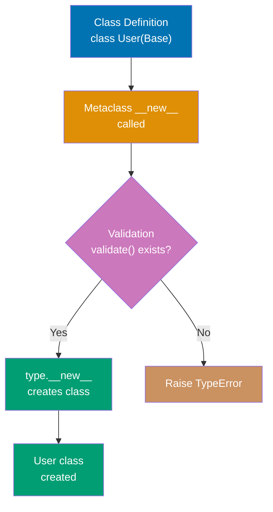

```python
class ValidatedMeta(type):                    # => Define metaclass (inherits from type)
                                               # => Controls class creation behavior
    """Metaclass that validates class attributes"""

    def __new__(mcs, name, bases, namespace):  # => Override class creation
                                               # => Called when class DEFINED (not instantiated)
        """Called when class is DEFINED (not instantiated)"""
        # => mcs: metaclass itself (ValidatedMeta)
        # => name: class name being created (string)
        # => bases: tuple of base classes
        # => namespace: dict of class attributes/methods

        # Validate required methods exist
        if name != 'Base' and 'validate' not in namespace:  # => Check for 'validate' method
                                                             # => Skip Base class itself
                                                             # => Prevents circular validation
            raise TypeError(f"{name} must implement 'validate' method")  # => Fail at definition time
                                                                          # => Caught before instantiation

        # Create class normally
        cls = super().__new__(mcs, name, bases, namespace)  # => Calls type.__new__
                                                             # => Creates actual class object
                                                             # => Returns class (not instance)
        return cls                                           # => Return new class
                                                             # => Class now available for use

class Base(metaclass=ValidatedMeta):          # => Specify metaclass via metaclass=
                                               # => ValidatedMeta.__new__ called
    """Base class using metaclass"""
    pass                                       # => No 'validate' method
                                               # => name='Base', skipped validation
                                               # => Base class created successfully

class User(Base):                             # => Inherits from Base
                                               # => Inherits ValidatedMeta metaclass
    """Valid subclass with required method"""
    def validate(self):                        # => Define required method
        return True                            # => Simple validation logic
                                               # => Required method present
                                               # => ValidatedMeta.__new__ called
                                               # => name='User', has 'validate'
                                               # => User class created successfully

# class Invalid(Base):                        # => Would inherit ValidatedMeta
                                               # => ValidatedMeta.__new__ called
#     pass                                     # => NO 'validate' method defined
                                               # => name='Invalid', NO 'validate'
                                               # => TypeError: Invalid must implement 'validate' method
                                               # => Class definition FAILS (not instantiation)

# Metaclass runs at CLASS DEFINITION time
user = User()                                 # => Normal instantiation
                                               # => Validation already done at definition
                                               # => No validation overhead at runtime
print(user.validate())                        # => Calls validate method
                                               # => Output: True
```

**Key Takeaway**: Metaclasses intercept class creation enabling framework-level validation and customization.

**Why It Matters**: Metaclasses enable framework-level customization and validation that executes at class definition time, catching design errors before instantiation. The pattern underlies ORM frameworks like SQLAlchemy and Django where metaclasses register models and validate field definitions. However, metaclasses add significant complexity and should only be used when simpler alternatives like decorators and **init_subclass** are insufficient.

## Example 56: **init_subclass** (Simpler Alternative)

**init_subclass** provides class customization without metaclasses for most use cases.

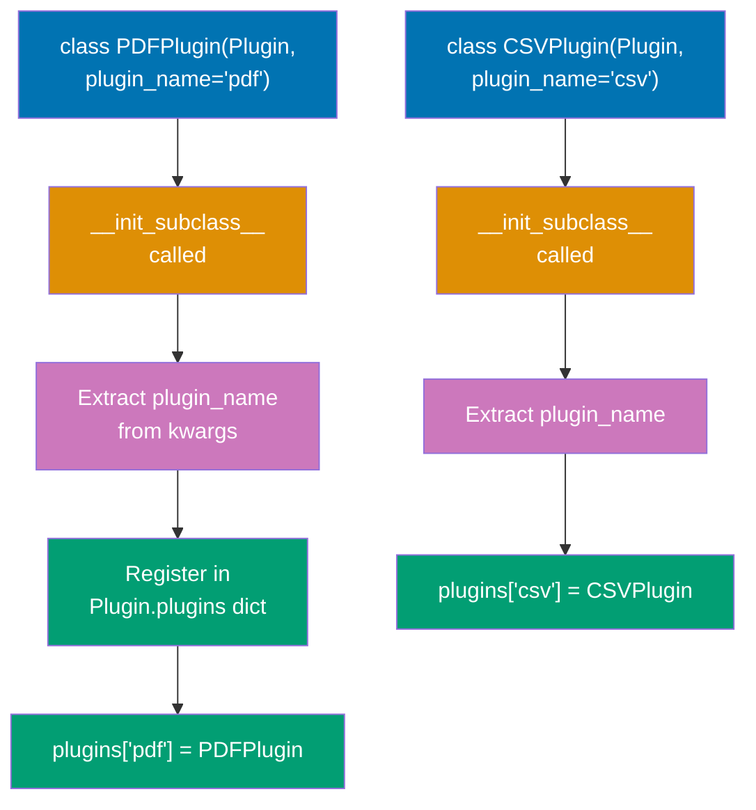

```python
class Plugin:                                 # => Define base class with registration
                                               # => Provides __init_subclass__ hook
    """Base class with automatic subclass registration"""
    plugins = {}                              # => Class-level registry (dict)
                                               # => Shared across all subclasses
                                               # => Stores {name: class} mappings

    def __init_subclass__(cls, plugin_name=None, **kwargs):  # => Hook called at subclass definition
                                                              # => Receives custom kwargs from class statement
        """Called when subclass is DEFINED"""
        # => cls: the subclass being created (PDFPlugin, CSVPlugin, etc.)
        # => plugin_name: custom kwarg from class definition
        # => kwargs: other custom kwargs (passed to super)

        super().__init_subclass__(**kwargs)   # => Call parent __init_subclass__
                                               # => Required for cooperative inheritance
                                               # => Enables multiple inheritance chains
        if plugin_name:                       # => If plugin_name provided (not None)
                                               # => Allows optional registration
            cls.plugins[plugin_name] = cls     # => Register in global registry
                                               # => Key: 'pdf', Value: PDFPlugin class
                                               # => Makes class discoverable by name
            print(f"Registered plugin: {plugin_name}")  # => Confirmation output
                                                         # => Output: Registered plugin: pdf

class PDFPlugin(Plugin, plugin_name='pdf'):   # => Subclass with custom kwarg
                                               # => plugin_name passed to __init_subclass__
    """Automatically registered as 'pdf'"""
    # => At definition time (not instantiation):
    # => __init_subclass__(PDFPlugin, plugin_name='pdf') called
    # => Plugin.plugins['pdf'] = PDFPlugin
    # => Output: Registered plugin: pdf
    pass                                       # => No body needed for registration

class CSVPlugin(Plugin, plugin_name='csv'):   # => Second subclass registration
                                               # => Same pattern, different name
    # => At definition time:
    # => __init_subclass__(CSVPlugin, plugin_name='csv') called
    # => Plugin.plugins['csv'] = CSVPlugin
    # => Output: Registered plugin: csv
    pass                                       # => Minimal implementation

# Access registered plugins
print(Plugin.plugins)                         # => Access class-level registry
                                               # => Contains all registered classes
                                               # => Output: {'pdf': <class 'PDFPlugin'>, 'csv': <class 'CSVPlugin'>}

# Factory pattern usage
plugin_class = Plugin.plugins['pdf']          # => Get PDFPlugin class from registry
                                               # => Returns class object (not instance)
instance = plugin_class()                     # => Instantiate PDFPlugin
                                               # => Creates PDFPlugin instance
```

**Key Takeaway**: **init_subclass** simplifies common metaclass patterns with cleaner syntax.

**Why It Matters**: **init_subclass** provides class customization without metaclass complexity, making it the preferred approach for most use cases requiring subclass registration or validation. The pattern enables plugin systems and factory registration with clearer syntax than metaclasses. Understanding when to use **init_subclass** versus metaclasses prevents over-engineering while achieving framework-level customization.

## Example 57: Descriptor Protocol

Descriptors customize attribute access using **get**, **set**, and **delete** methods.

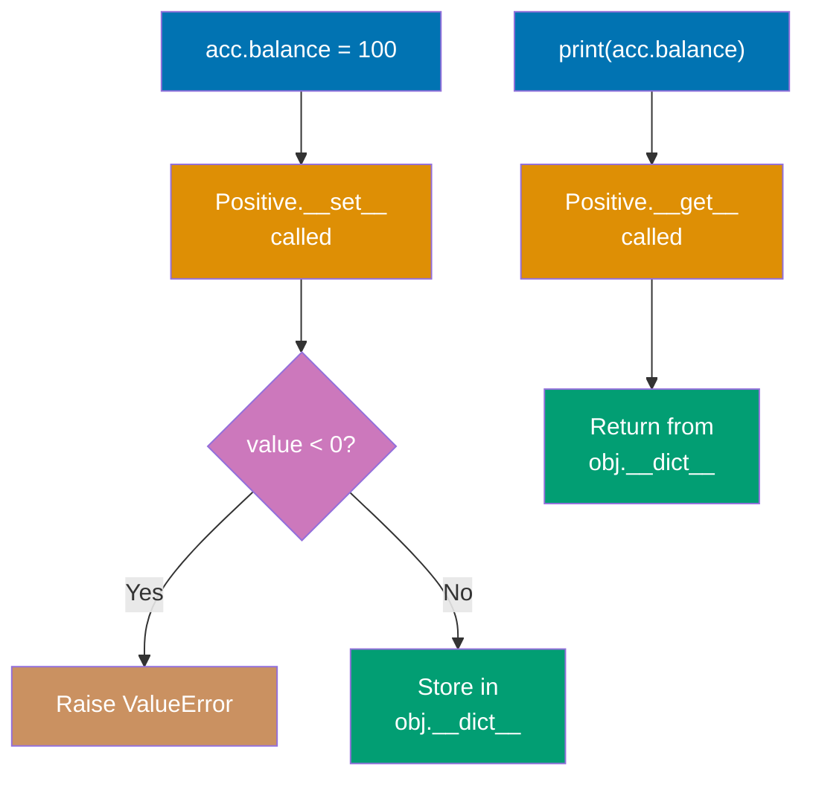

```python
class Positive:                               # => Define descriptor class
                                               # => Implements __get__ and __set__
    """Descriptor that enforces positive values"""

    def __init__(self, name):                 # => Descriptor constructor
                                               # => Called when descriptor created
        self.name = name                      # => Store attribute name
                                               # => Used as key in instance __dict__
                                               # => Example: 'balance'

    def __get__(self, obj, objtype=None):     # => Descriptor get protocol
                                               # => Called on attribute access
        """Called when accessing attribute (acc.balance)"""
        if obj is None:                       # => Accessed on class (Account.balance)
            return self                        # => Return descriptor itself
                                               # => Allows introspection
        return obj.__dict__.get(self.name, 0)  # => Get value from instance dict
                                               # => Default to 0 if not set
                                               # => Avoids KeyError

    def __set__(self, obj, value):            # => Descriptor set protocol
                                               # => Called on attribute assignment
        """Called when setting attribute (acc.balance = X)"""
        if value < 0:                         # => Validation check
                                               # => Enforces business rule
            raise ValueError(f"{self.name} must be positive")  # => Reject negative
                                                                # => Fails fast at assignment
        obj.__dict__[self.name] = value        # => Store in instance dict
                                               # => Key: 'balance', Value: value
                                               # => Bypasses descriptor recursion

class Account:                                # => Use descriptor in class
                                               # => balance becomes managed attribute
    """Account class using descriptor for balance validation"""
    balance = Positive('balance')             # => Class-level descriptor instance
                                               # => Intercepts all balance access
                                               # => Applies to all Account instances

    def __init__(self, balance):              # => Account constructor
        self.balance = balance                # => Assignment triggers __set__
                                               # => Calls Positive.__set__(self, balance)
                                               # => Validates before storing

acc = Account(100)                            # => Create Account instance
                                               # => Calls __init__(100)
                                               # => __set__ called, validates 100 >= 0
                                               # => Stores in acc.__dict__['balance']
print(acc.balance)                            # => Access balance attribute
                                               # => Calls __get__
                                               # => Returns acc.__dict__['balance']
                                               # => Output: 100
# acc.balance = -50                           # => Would trigger __set__(-50)
                                               # => Calls __set__(-50)
                                               # => Raises ValueError: balance must be positive
```

**Key Takeaway**: Descriptors enable reusable attribute validation and transformation logic.

**Why It Matters**: This concept is fundamental to understanding the language and helps build robust, maintainable code.

## Example 58: Property as Descriptor

Properties use descriptors internally for computed attributes.

```python
class Circle:                                 # => Define class with property-based API
                                               # => Uses descriptors internally
    """Circle with computed area using property"""

    def __init__(self, radius):               # => Constructor
                                               # => Accepts initial radius
        self._radius = radius                 # => Store in private attribute
                                               # => Uses setter validation via @radius.setter
                                               # => Convention: leading underscore = internal

    @property                                 # => Decorator creates property descriptor
                                               # => Replaces radius with property object
    def radius(self):                         # => Getter method
                                               # => Called on c.radius access
        """Getter for radius"""
        return self._radius                   # => Return stored value
                                               # => Called when accessing c.radius
                                               # => No computation needed

    @radius.setter                            # => Add setter to property
                                               # => Uses @<property_name>.setter syntax
    def radius(self, value):                  # => Setter method
                                               # => Called on c.radius = value
        """Setter with validation"""
        if value < 0:                         # => Validation check
                                               # => Enforces domain rule
            raise ValueError("Radius must be non-negative")  # => Reject invalid state
        self._radius = value                  # => Update private storage
                                               # => Called when setting c.radius = X
                                               # => Maintains invariant

    @property                                 # => Second property (read-only)
                                               # => No setter defined
    def area(self):                           # => Computed property getter
                                               # => Called on c.area access
        """Computed property (read-only)"""
        return 3.14159 * self._radius ** 2    # => Calculate dynamically
                                               # => No setter defined → read-only
                                               # => Always reflects current radius
                                               # => Lazy evaluation on access

c = Circle(5)                                 # => Create Circle instance
                                               # => Creates circle with radius 5
                                               # => Stores in c._radius = 5
print(c.radius)                               # => Access radius property
                                               # => Calls radius getter
                                               # => Returns 5
                                               # => Output: 5
print(c.area)                                 # => Access computed area
                                               # => Calls area getter
                                               # => Computes 3.14159 * 5^2
                                               # => Output: 78.53975
c.radius = 10                                 # => Assign new radius
                                               # => Calls radius setter
                                               # => Validates 10 >= 0
                                               # => Updates c._radius = 10
print(c.area)                                 # => Area automatically updated
                                               # => Recomputed with new radius
                                               # => Output: 314.159
# c.area = 100                                # => Would fail assignment
                                               # => AttributeError: can't set attribute
                                               # => No setter defined for area
```

**Key Takeaway**: Properties provide computed attributes and attribute validation with getter/setter syntax.

**Why It Matters**: Properties provide computed attributes and validation with attribute syntax rather than getter/setter methods, making APIs more Pythonic and user-friendly. The decorator-based pattern enables gradual addition of validation and computation without breaking existing code that accesses attributes directly. Understanding properties is essential for designing clean APIs that hide implementation details while maintaining attribute-like access patterns.

## Example 59: Asyncio Basics

Asyncio enables concurrent I/O operations using async/await syntax.

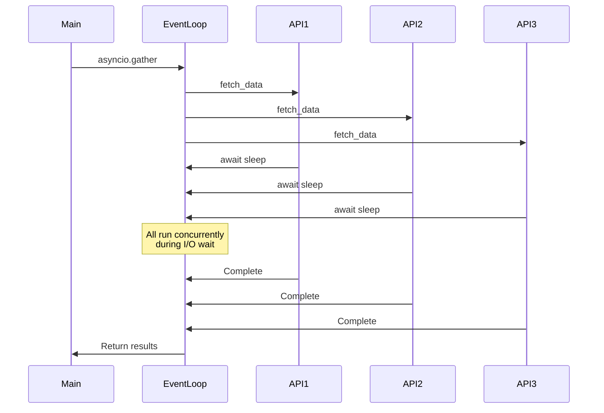

```python
import asyncio                                # => Import async framework
                                               # => Provides event loop and primitives

async def fetch_data(url):                    # => Define async function (coroutine)
                                               # => Uses async keyword
    """Simulated async HTTP request"""
    print(f"Fetching {url}...")              # => Output: Fetching https://api1.com...
                                               # => Does NOT block other coroutines
                                               # => Runs synchronously until await
    await asyncio.sleep(1)                    # => Yield control during I/O
                                               # => Simulate I/O (yields control)
                                               # => Event loop switches to other tasks
                                               # => NOT time.sleep (which blocks entire thread)
    print(f"Completed {url}")                 # => Resume after I/O complete
                                               # => Output: Completed https://api1.com
                                               # => After 1 second I/O wait
    return f"Data from {url}"                 # => Return coroutine result
                                               # => Return result string
                                               # => Becomes result in gather list

async def main():                             # => Main async function
                                               # => Entry point for async execution
    """Run multiple async operations concurrently"""
    # Sequential (slow) - NOT concurrent
    # result1 = await fetch_data("https://api1.com")  # => Wait 1s for api1
    # result2 = await fetch_data("https://api2.com")  # => Wait 1s for api2
    # => Total time: 2 seconds (sequential)

    # Concurrent (fast) - ALL run simultaneously
    results = await asyncio.gather(           # => Schedule all coroutines concurrently
                                               # => Waits for ALL to complete
                                               # => Returns list of results
        fetch_data("https://api1.com"),       # => First coroutine
                                               # => Starts immediately
        fetch_data("https://api2.com"),       # => Second coroutine
                                               # => Starts immediately (parallel)
        fetch_data("https://api3.com")        # => Third coroutine
                                               # => Starts immediately (parallel)
    )                                         # => All 3 run concurrently
                                               # => Total time: 1 second (max of 3x 1s operations)
                                               # => Results collected in order
    print(results)                            # => Print results list
                                               # => Output: ['Data from https://api1.com', 'Data from https://api2.com', 'Data from https://api3.com']
                                               # => List preserves call order

# Run the event loop
asyncio.run(main())                           # => Bootstrap async execution
                                               # => Creates event loop
                                               # => Runs main() coroutine until completion
                                               # => Closes event loop
                                               # => Total execution: ~1 second
```

**Key Takeaway**: asyncio enables concurrent I/O with async/await; gather runs multiple coroutines concurrently.

**Why It Matters**: Asyncio enables concurrent I/O operations on a single thread using cooperative multitasking, avoiding the overhead and complexity of threading for I/O-bound workloads. The async/await syntax makes asynchronous code readable compared to callback-based approaches, while gather() enables structured concurrency. Mastering asyncio is essential for high-performance network services and web scraping where I/O operations dominate execution time.

## Example 60: Asyncio Tasks

Tasks wrap coroutines for concurrent execution with more control than gather.

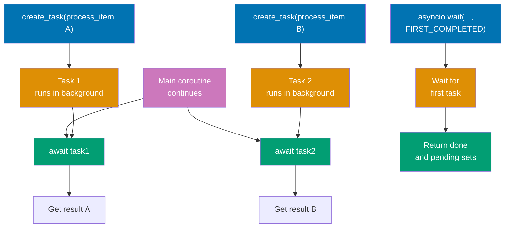

```python
import asyncio                                # => Import async framework
                                               # => Provides create_task and wait

async def process_item(item, delay):          # => Define async worker function
                                               # => Accepts item and delay params
    """Process single item"""
    await asyncio.sleep(delay)                # => Simulate async work (I/O)
                                               # => Yields control during delay
    return f"Processed {item}"                # => Return result after delay
                                               # => Returns string

async def main():                             # => Main async function
                                               # => Demonstrates task control
    # Create tasks (start immediately)
    task1 = asyncio.create_task(process_item("A", 2))  # => Create task from coroutine
                                                        # => Schedules coroutine on event loop
                                                        # => Starts running immediately
                                                        # => 2 second delay
    task2 = asyncio.create_task(process_item("B", 1))  # => Create second task
                                                        # => Starts in parallel
                                                        # => 1 second delay
                                                        # => Both tasks concurrent

    # Do other work while tasks run
    print("Tasks running in background...")    # => Print to stdout
                                                 # => Output: Tasks running in background...
                                                 # => Both tasks executing concurrently
    await asyncio.sleep(0.5)                    # => Yield control for 0.5s
                                                 # => Main coroutine sleeps 0.5s
                                                 # => Tasks continue running
    print("Still working...")                   # => Print after 0.5s
                                                 # => Output: Still working...
                                                 # => After 0.5s total elapsed

    # Wait for completion
    result1 = await task1                       # => Await task completion
                                                 # => Wait for task1 to finish
                                                 # => Already running for ~0.5s
                                                 # => Waits remaining ~1.5s
    result2 = await task2                       # => Await second task
                                                 # => Wait for task2
                                                 # => Already completed (1s < 2s)
                                                 # => Returns immediately
    print(result1, result2)                     # => Print both results
                                                 # => Output: Processed A Processed B

    # Wait for first completion
    tasks = [                                   # => Create task list
        asyncio.create_task(process_item(f"Item{i}", i))  # => Create 3 tasks
        for i in range(1, 4)                    # => Item1 (1s), Item2 (2s), Item3 (3s)
                                                 # => List comprehension
    ]                                           # => All start immediately
                                                 # => All 3 concurrent
    done, pending = await asyncio.wait(tasks, return_when=asyncio.FIRST_COMPLETED)  # => Wait for ANY completion
                                                 # => Wait until ANY task completes
                                                 # => Returns after 1 second (Item1 done)
                                                 # => done: set of completed tasks
                                                 # => pending: set of still-running tasks
    print(f"First completed: {done.pop().result()}")  # => Extract result from done set
                                                       # => Get result from completed task
                                                       # => Output: First completed: Processed Item1

asyncio.run(main())                             # => Bootstrap async execution
                                                 # => Run event loop with main()
```

**Key Takeaway**: Tasks provide fine-grained control over concurrent coroutines with early cancellation and result access.

**Why It Matters**: Tasks provide more control than gather() for managing concurrent coroutines, enabling early cancellation and result access before all tasks complete. The FIRST_COMPLETED pattern enables timeout handling and racing multiple operations for improved responsiveness. Understanding task management is critical for building robust asyncio applications with proper error handling and resource cleanup.

## Example 61: Async Context Managers

Async context managers handle async resource acquisition and cleanup.

```python
import asyncio                                # => Import async framework
                                               # => Provides sleep and run

class AsyncResource:                          # => Define async context manager
                                               # => Implements __aenter__ and __aexit__
    """Async context manager for resource management"""

    async def __aenter__(self):               # => Async entry point (setup)
                                               # => Called on async with statement
        """Async enter (setup)"""
        print("Acquiring resource...")        # => Print status message
                                               # => Output: Acquiring resource...
        await asyncio.sleep(1)                # => Yield during I/O
                                               # => Simulate async I/O (network, database)
                                               # => Yields control to event loop
        self.resource = "RESOURCE"            # => Store acquired resource
                                               # => Set instance state
        return self.resource                  # => Return value to 'as' clause
                                               # => Return value bound to 'as' variable
                                               # => Returns "RESOURCE"

    async def __aexit__(self, exc_type, exc_val, exc_tb):  # => Async exit point (cleanup)
                                                            # => Called when block exits
        """Async exit (cleanup)"""
        print("Releasing resource...")        # => Print cleanup status
                                               # => Output: Releasing resource...
        await asyncio.sleep(0.5)              # => Yield during cleanup
                                               # => Async cleanup operation
                                               # => Yields control during cleanup
        self.resource = None                  # => Release resource reference
                                               # => Clear resource reference
        return False                          # => Control exception propagation
                                               # => Return False → propagate exceptions
                                               # => Return True → suppress exceptions

async def main():                             # => Main async function
                                               # => Demonstrates async with usage
    async with AsyncResource() as res:        # => Enter async context
                                               # => Calls __aenter__
                                               # => Waits for async setup to complete
                                               # => res = "RESOURCE"
        print(f"Using {res}")                 # => Use acquired resource
                                               # => Output: Using RESOURCE
        await asyncio.sleep(0.1)              # => Simulate work
                                               # => Do work with resource
    # => Block exits here (automatic cleanup)
    # => Calls __aexit__(None, None, None)
    # => Waits for async cleanup
    # => Guaranteed cleanup even if exception occurs

asyncio.run(main())                           # => Bootstrap async execution
                                               # => Start event loop
                                               # => Run main() coroutine
                                               # => Complete execution order:
                                               # => 1. Acquiring resource... (1s wait)
                                               # => 2. Using RESOURCE
                                               # => 3. Releasing resource... (0.5s wait)
```

**Key Takeaway**: Async context managers enable safe async resource management with **aenter** and **aexit**.

**Why It Matters**: This concept is fundamental to understanding the language and helps build robust, maintainable code.

## Example 62: Protocol (Structural Subtyping)

Protocols define interfaces checked structurally (duck typing with type hints).

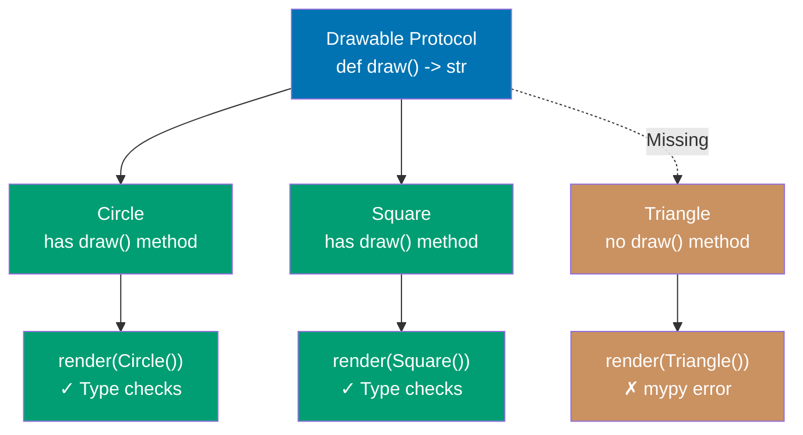

```python
from typing import Protocol                   # => Import Protocol class
                                               # => Enables structural subtyping

class Drawable(Protocol):                     # => Define protocol (interface)
                                               # => Inherits from Protocol
    """Protocol for drawable objects"""
    def draw(self) -> str:                    # => Define required method signature
                                               # => Must return string
        """Must have draw method returning string"""
        ...                                   # => Protocol methods use ... (ellipsis)
                                               # => No implementation required
                                               # => Defines interface contract only

class Circle:                                 # => Implement protocol implicitly
                                               # => No inheritance needed
    """Implicitly implements Drawable (no inheritance needed)"""
    def draw(self) -> str:                    # => Define draw method
                                               # => Matches protocol signature
        return "Drawing circle"               # => Has draw() -> str signature
                                               # => Matches Drawable protocol
                                               # => No explicit inheritance required

class Square:                                 # => Another protocol implementation
                                               # => Also implicit
    """Another class matching Drawable protocol"""
    def draw(self) -> str:                    # => Same signature as protocol
        return "Drawing square"               # => Also has draw() -> str
                                               # => Implicitly implements Drawable
                                               # => Structural typing (duck typing)

def render(obj: Drawable) -> None:            # => Type hint with protocol
                                               # => Accepts any Drawable-compatible type
    """Accepts any object with draw() method"""
    # => Type checker verifies obj has draw() -> str
    # => No runtime check (duck typing at runtime)
    # => Static verification only
    print(obj.draw())                         # => Call protocol method
                                               # => Calls draw() method
                                               # => Structural typing enables this

render(Circle())                              # => Pass Circle instance
                                               # => Creates Circle instance
                                               # => mypy: ✓ Circle has draw() -> str
                                               # => Output: Drawing circle
render(Square())                              # => Pass Square instance
                                               # => Creates Square instance
                                               # => mypy: ✓ Square has draw() -> str
                                               # => Output: Drawing square

# class Triangle:                             # => Non-compliant class
                                               # => Class without draw() method
#     pass
# render(Triangle())                          # => Would fail type check
                                               # => mypy error: Triangle has no attribute 'draw'
                                               # => Static type checking catches this
                                               # => Runtime would raise AttributeError
```

**Key Takeaway**: Protocols enable interface typing without inheritance using structural subtyping.

**Why It Matters**: Protocols enable structural subtyping (duck typing with type hints) that catches type errors statically without requiring inheritance, improving flexibility in API design. The pattern is essential for defining interfaces in libraries where you can't control client code inheritance. Understanding protocols is critical for modern Python type hinting, especially for framework APIs that need flexibility without sacrificing type safety.

## Example 63: Generic Types

Generic types enable type-safe containers and functions for multiple types.

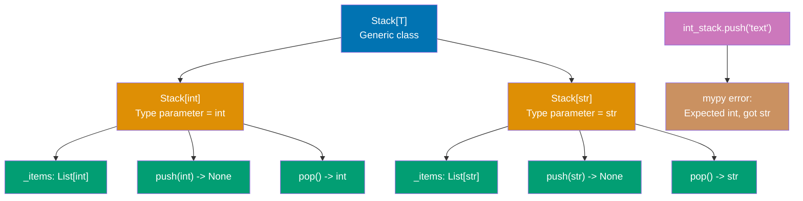

```python
from typing import TypeVar, Generic, List    # => Import typing utilities
                                               # => TypeVar for type parameters
                                               # => Generic for generic classes

T = TypeVar('T')                              # => Declare type variable T
                                               # => Placeholder for any type
                                               # => Will be substituted with concrete type
                                               # => Single letter convention (T, U, V)

class Stack(Generic[T]):                      # => Define generic class
                                               # => Generic[T] makes this parameterized
    """Generic stack for any type T"""
    # => Generic[T] makes this a generic class
    # => T will be bound to specific type at usage
    # => Example: Stack[int], Stack[str]

    def __init__(self) -> None:               # => Constructor
                                               # => No type parameter needed here
        self._items: List[T] = []             # => Type-safe internal list
                                               # => Type checker knows this is List[T]
                                               # => T inferred from class usage

    def push(self, item: T) -> None:          # => Push method with type T
                                               # => Parameter type matches class type
        """Push item of type T onto stack"""
        self._items.append(item)              # => Add to internal list
                                               # => item must match type T
                                               # => Type checker validates this

    def pop(self) -> T:                       # => Pop method returns type T
                                               # => Return type matches class type
        """Pop and return item of type T"""
        return self._items.pop()              # => Remove and return last item
                                               # => Return type is T
                                               # => Preserves type information

# Type-specific stacks
int_stack: Stack[int] = Stack()               # => Instantiate with int type
                                               # => T bound to int
                                               # => Type checker knows _items is List[int]
                                               # => push() expects int, pop() returns int
int_stack.push(1)                             # => Push integer
                                               # => mypy: ✓ Argument is int
int_stack.push(2)                             # => Push another integer
                                               # => mypy: ✓ Argument is int
# int_stack.push("text")                      # => Would fail type check
                                               # => mypy error: Expected int, got str
                                               # => Static type checking prevents this

str_stack: Stack[str] = Stack()               # => Instantiate with str type
                                               # => T bound to str
                                               # => Separate instance with different type
                                               # => push() expects str, pop() returns str
str_stack.push("hello")                       # => Push string
                                               # => mypy: ✓ Argument is str
result: str = str_stack.pop()                 # => Pop with type safety
                                               # => mypy: ✓ Return type is str
                                               # => result is "hello"
```

**Key Takeaway**: Generic types enable reusable type-safe containers with type parameter substitution.

**Why It Matters**: Generic types enable writing reusable, type-safe container classes and functions that work with multiple types while preserving type information for static analysis. The pattern is essential for library development where type safety improves user experience through IDE autocomplete and error detection. Mastering generics is critical for building type-safe collections, decorators, and higher-order functions in modern Python.

## Example 64: Profiling with cProfile

Identify performance bottlenecks using cProfile for function-level timing.

```python
import cProfile                               # => Import profiling module (C-based, fast)
import pstats                                 # => Import statistics formatter

def fibonacci(n):                             # => Define recursive function
    """Inefficient recursive Fibonacci"""
    if n < 2:                                 # => Base case: n=0 or n=1
        return n                               # => Returns 0 for n=0, 1 for n=1
    return fibonacci(n-1) + fibonacci(n-2)     # => Two recursive calls per invocation
                                               # => Exponential time O(2^n) - massive duplicate computation

def calculate_sequence():                     # => Define wrapper function
    """Calculate multiple Fibonacci numbers"""
    results = [fibonacci(i) for i in range(25)]  # => Calls fibonacci(0) through fibonacci(24)
                                                  # => fibonacci(24) alone makes ~46,368 recursive calls
    return results                            # => Returns [0, 1, 1, 2, 3, 5, 8, ...]

# Profile function execution
profiler = cProfile.Profile()                 # => Create profiler instance
profiler.enable()                             # => Start recording all function calls
                                               # => Tracks function name, call count, time spent
result = calculate_sequence()                 # => Execute target code (~150,000 calls recorded)
profiler.disable()                            # => Stop recording calls

# Analyze and print statistics
stats = pstats.Stats(profiler)                # => Create statistics object from profiler
stats.sort_stats('cumulative')                # => Sort by cumulative time (total time including subcalls)
stats.print_stats(10)                         # => Print top 10 slowest functions
                                               # => Output: ncalls, tottime, percall, cumtime, filename:lineno(function)

# Example output interpretation:
# ncalls: 150049                              # => fibonacci() called 150,049 times (recursion explosion)
# tottime: 0.05s                              # => Time in fibonacci() itself (excluding subcalls)
# cumtime: 0.05s                              # => Total time including ALL recursive subcalls
# filename:lineno(function)                   # => Source file location

# Performance bottleneck identified:
# => fibonacci() dominates with 150K+ calls, O(2^n) complexity
# => Solutions: (1) Memoization, (2) Iterative O(n), (3) Matrix exponentiation O(log n)
```

**Key Takeaway**: cProfile reveals performance hotspots showing call counts and time per function.

**Why It Matters**: This concept is fundamental to understanding the language and helps build robust, maintainable code.

## Example 65: Memory Profiling

Track memory usage with memory_profiler to identify memory leaks.

```python
from memory_profiler import profile           # => Import memory profiling decorator (line-by-line tracking)

@profile                                      # => Decorator instruments function for memory profiling
                                               # => Tracks line-by-line memory usage (~2x slowdown)
def process_large_data():                     # => Define function to profile
    """Function that uses memory"""
    data = [i ** 2 for i in range(1000000)]  # => Create list of 1 million integers (~38 MiB)
                                               # => Major allocation event
    filtered = [x for x in data if x % 2 == 0]  # => Create second large list (~500,000 even numbers)
                                               # => Additional ~37.7 MiB allocated (peak: 88.2 MiB total)
    result = sum(filtered)                    # => Compute sum (no additional memory allocation)
    return result                             # => Return sum value (lists remain until GC)

# Run function with memory profiling
# result = process_large_data()               # => Execute profiled function
                                               # => Prints line-by-line memory report

# Example output interpretation:
# Line    Mem usage    Increment   Line Contents
# ====    =========    =========   =============
#     3     50.5 MiB     50.5 MiB   data = [...]          # => Initial allocation (38 MiB + overhead)
#     4     88.2 MiB     37.7 MiB   filtered = [...]      # => Second allocation (peak memory: both lists)
#     5     88.2 MiB      0.0 MiB   result = sum(...)     # => No new allocation (constant space)

# Memory optimization insights:
# => Two large lists exist simultaneously (88 MiB total)
# => Use generators for streaming: (x for x in ... if x % 2 == 0) reduces peak to ~50 MiB
```

**Key Takeaway**: memory_profiler shows line-by-line memory usage revealing allocation hotspots.

**Why It Matters**: This concept is fundamental to understanding the language and helps build robust, maintainable code.

## Example 66: Threading for I/O-Bound Tasks

Use threading for I/O-bound operations bypassing GIL limitations.

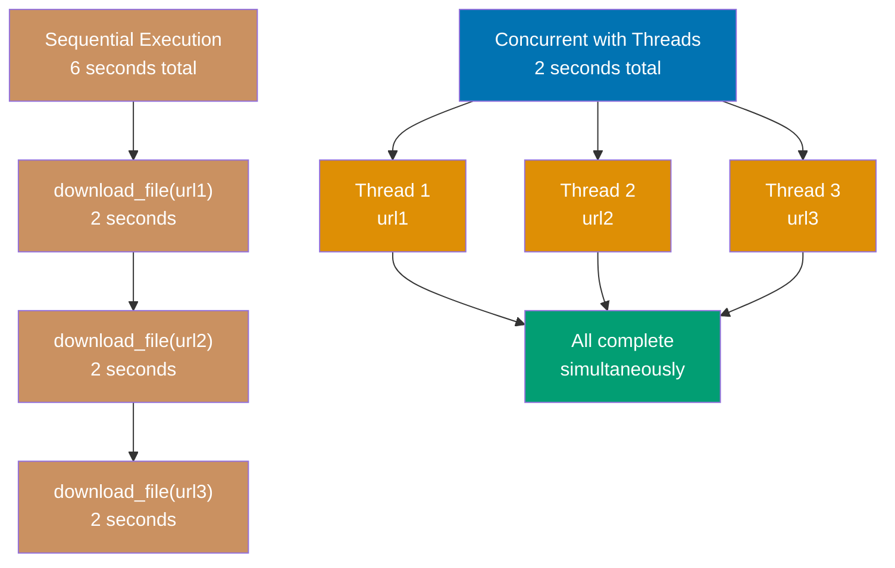

```python
import threading                              # => Import threading module
                                               # => Provides Thread class and sync primitives
import time                                   # => Import time module
                                               # => Provides sleep for simulation

def download_file(url):                       # => Define worker function
                                               # => Runs in separate thread
    """Simulated file download"""
    print(f"Downloading {url}...")            # => Print start message
                                               # => Output: Downloading url1...
    time.sleep(2)                             # => Simulate I/O wait
                                               # => Simulated I/O wait (network, disk)
                                               # => I/O operations RELEASE GIL
                                               # => Other threads can run during sleep
    print(f"Completed {url}")                 # => Print completion message
                                               # => Output: Completed url1

# Sequential (slow): 6 seconds total
# for url in ['url1', 'url2', 'url3']:       # => Execute one after another
#     download_file(url)                      # => url1 (2s) → url2 (2s) → url3 (2s)
                                               # => Total: 6 seconds

# Concurrent with threads (fast): 2 seconds total
threads = []                                  # => Initialize thread list
                                               # => List to track threads
for url in ['url1', 'url2', 'url3']:          # => Iterate over URLs
                                               # => Create thread for each URL
    thread = threading.Thread(target=download_file, args=(url,))  # => Create Thread object
                                               # => Create thread
                                               # => target: function to run
                                               # => args: tuple of function arguments
    thread.start()                            # => Launch thread
                                               # => Start thread immediately
                                               # => All 3 threads run concurrently
                                               # => Each calls download_file() in parallel
    threads.append(thread)                    # => Store thread reference
                                               # => Add to list for tracking

# Wait for all threads to complete
for thread in threads:                        # => Iterate over threads
                                               # => Join all threads
    thread.join()                             # => Wait for thread completion
                                               # => Wait for this thread to finish
                                               # => Blocks until thread completes
                                               # => Ensures all downloads complete

print("All downloads complete")               # => Print final message
                                               # => Output: All downloads complete
                                               # => Total elapsed: ~2 seconds (not 6)
                                               # => 3x speedup from concurrent I/O
```

**Key Takeaway**: Threading improves I/O-bound performance as I/O operations release the GIL.

**Why It Matters**: Threading improves I/O-bound performance by utilizing CPU time during I/O waits, as I/O operations release the GIL enabling true concurrency for network and disk operations. The pattern is simpler than asyncio for integrating with synchronous I/O libraries that lack async support. However, threading provides no parallelism for CPU-bound tasks due to the GIL, making it unsuitable for computational workloads.

## Example 67: ThreadPoolExecutor

ThreadPoolExecutor simplifies thread management with automatic pooling.

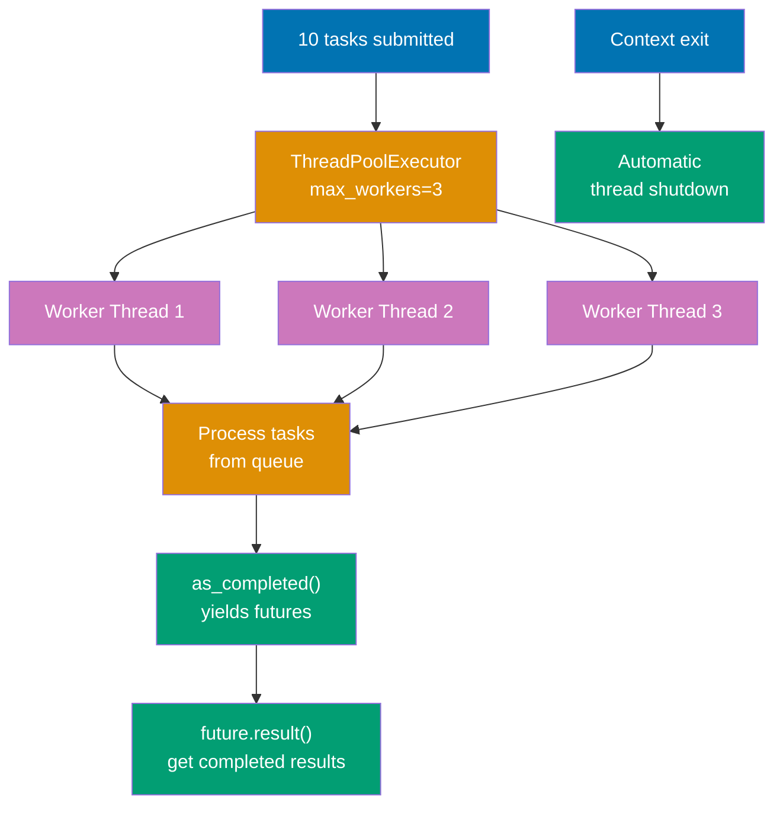

```python
from concurrent.futures import ThreadPoolExecutor, as_completed  # => ThreadPoolExecutor: thread pool management
                                                                  # => as_completed: yield futures as they finish
import time                                   # => Import time module for simulation

def process_task(task_id):                    # => Define worker function
    """Process single task"""
    time.sleep(1)                             # => Simulate I/O work (1 second delay)
    return f"Task {task_id} completed"        # => Return result string

# Thread pool with max 3 worker threads
with ThreadPoolExecutor(max_workers=3) as executor:  # => Create thread pool with 3 worker threads
    # => Threads are reused for multiple tasks, context manager ensures cleanup

    # Submit tasks
    futures = [executor.submit(process_task, i) for i in range(10)]  # => Submit 10 tasks to pool
    # => Returns list of Future objects
    # => First 3 tasks start immediately, remaining 7 tasks wait in queue

    # Process as completed (not in submission order)
    for future in as_completed(futures):      # => Iterate over futures as they complete
                                               # => NOT in submission order (first completed returns first)
        result = future.result()              # => Extract result value (blocks if not done yet)
                                               # => Returns "Task X completed"
        print(result)                         # => Output: Task X completed (order varies)

# Context manager exit: calls executor.shutdown(wait=True)
# => Waits for all tasks to complete, cleans up threads automatically
# => All 10 tasks complete in ~4 seconds (10 tasks / 3 workers ≈ 3.33 seconds)
```

**Key Takeaway**: ThreadPoolExecutor manages thread lifecycle with automatic pooling and cleanup.

**Why It Matters**: This concept is fundamental to understanding the language and helps build robust, maintainable code.

## Example 68: Multiprocessing for CPU-Bound Tasks

Use multiprocessing for CPU-bound tasks to bypass GIL with separate processes.

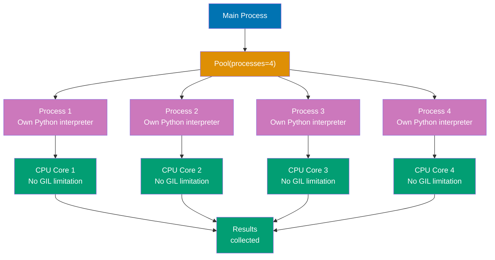

```python
from multiprocessing import Pool              # => Import process pool class for worker management
import time                                   # => Import time module (unused in this example)

def cpu_intensive_task(n):                    # => Define CPU-bound function (pure computation, no I/O)
    """CPU-bound computation"""
    total = 0                                 # => Initialize accumulator for sum of squares
    for i in range(n):                        # => Loop 10 million times (n=10,000,000)
                                               # => Pure CPU computation (GIL blocks parallel in threads)
        total += i ** 2                       # => Compute square and add to accumulator
    return total                              # => Return sum: 333,333,283,333,335,000

if __name__ == '__main__':                    # => Entry point guard (required for multiprocessing)
                                               # => Prevents recursive process spawning on Windows
    # Sequential (slow) - single core utilization
    # results = [cpu_intensive_task(10**7) for _ in range(4)]
    # => Calls 4 times sequentially (GIL blocks parallel, only 1 core used)
    # => Total time: ~4x single task time (e.g., 8 seconds)

    # Parallel with process pool (fast) - multi-core utilization
    with Pool(processes=4) as pool:           # => Create process pool with 4 workers
                                               # => Spawns 4 separate Python processes (each with own GIL)
                                               # => NO GIL contention (separate interpreters!)
        results = pool.map(cpu_intensive_task, [10**7] * 4)  # => Distribute work across processes
        # => Process 1-4: cpu_intensive_task(10**7) on CPU cores 1-4
        # => TRUE parallel execution (all cores simultaneously)
        # => Results serialized and returned as list
        # => Total time: ~1x single task time (4x speedup on 4-core CPU)

    print(f"Results: {results}")              # => Output: [333333283333335000, ...] (4 same sums)

# Multiprocessing overhead considerations:
# => Process creation: ~100ms startup, IPC: pickling/unpickling, memory: separate spaces
# => Only worth it for CPU-bound tasks >100ms
```

**Key Takeaway**: Multiprocessing achieves true parallelism for CPU-bound tasks using separate processes.

**Why It Matters**: Multiprocessing bypasses the GIL by using separate Python interpreters in different processes, achieving true parallelism for CPU-bound tasks on multi-core systems. The pattern is essential for computational workloads like data processing and scientific computing where the GIL severely limits performance. However, the process creation overhead and inter-process communication costs make multiprocessing unsuitable for I/O-bound or fine-grained parallel tasks.

## Example 69: Weak References

Weak references allow object references without preventing garbage collection.

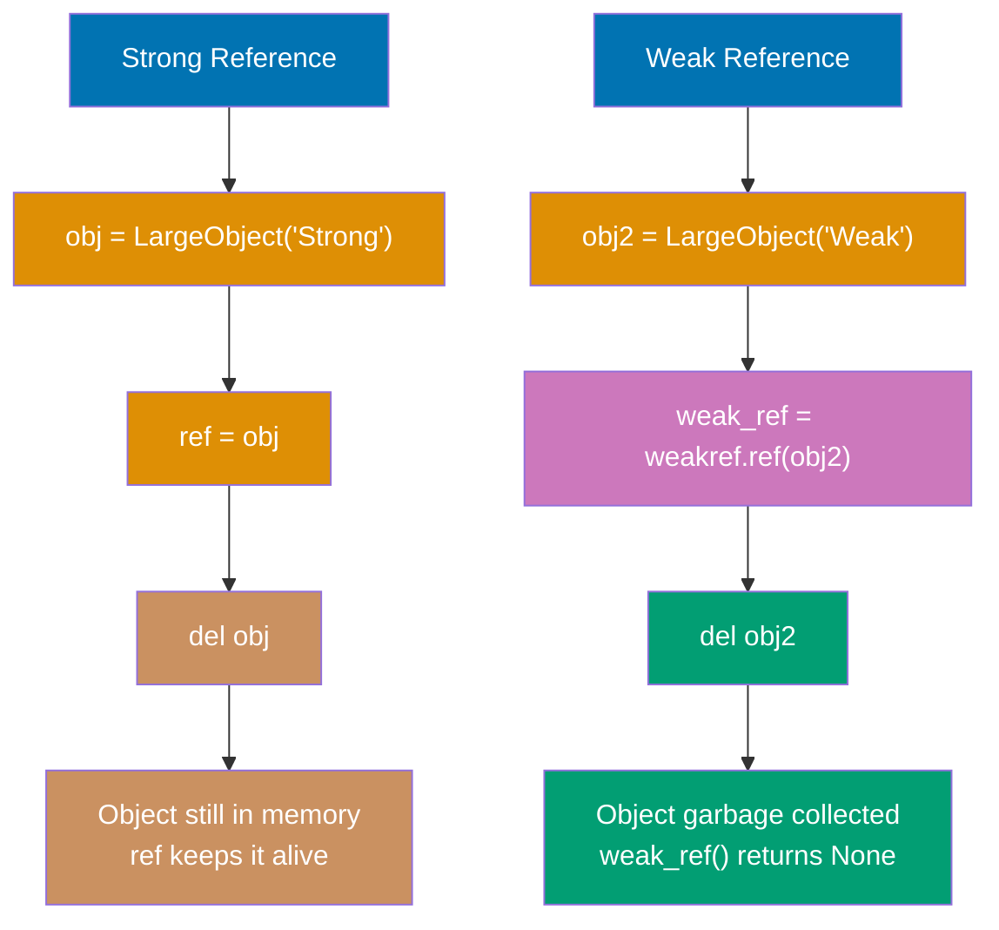

```python
import weakref                                # => Import weakref module
                                               # => Provides weak reference support

class LargeObject:                            # => Define object class
                                               # => Tracks creation and deletion
    """Object with lifecycle logging"""
    def __init__(self, name):                 # => Constructor
                                               # => Accepts name parameter
        self.name = name                      # => Store name attribute
                                               # => Store name
        print(f"Created {name}")              # => Log creation
                                               # => Output: Created [name]

    def __del__(self):                        # => Destructor method
                                               # => Called by garbage collector
        """Destructor called during garbage collection"""
        print(f"Deleted {self.name}")         # => Log deletion
                                               # => Called when GC collects object
                                               # => Output: Deleted [name]

# Strong reference (prevents GC)
obj = LargeObject("Strong")                   # => Create object with strong ref
                                               # => Output: Created Strong
                                               # => obj reference count = 1
ref = obj                                     # => Create second strong reference
                                               # => Another strong reference
                                               # => obj reference count = 2
del obj                                       # => Delete first reference
                                               # => Reference count = 1 (still in memory)
                                               # => No deletion output (ref still holds it)

# Weak reference (allows GC)
obj2 = LargeObject("Weak")                    # => Create object
                                               # => Output: Created Weak
                                               # => obj2 reference count = 1
weak_ref = weakref.ref(obj2)                  # => Create weak reference wrapper
                                               # => Create weak reference
                                               # => Does NOT increase reference count
print(weak_ref())                             # => Call weak reference
                                               # => Output: <LargeObject object at 0x...>
                                               # => Object still alive
del obj2                                      # => Delete strong reference
                                               # => Reference count = 0
                                               # => Output: Deleted Weak (GC immediately collects)
print(weak_ref())                             # => Call weak reference again
                                               # => Output: None
                                               # => Weak reference now dead (returns None)
```

**Key Takeaway**: Weak references enable caches and observers without preventing object cleanup.

**Why It Matters**: Weak references enable cache implementations and observer patterns that don't prevent garbage collection, avoiding memory leaks from circular references or retained observers. The pattern is essential for frameworks and libraries where automatic cleanup prevents resource exhaustion as objects are no longer needed. Understanding weak references is critical for advanced memory management in long-running applications.

## Example 70: Context Variables for Async Context

ContextVar provides task-local storage for asyncio applications.

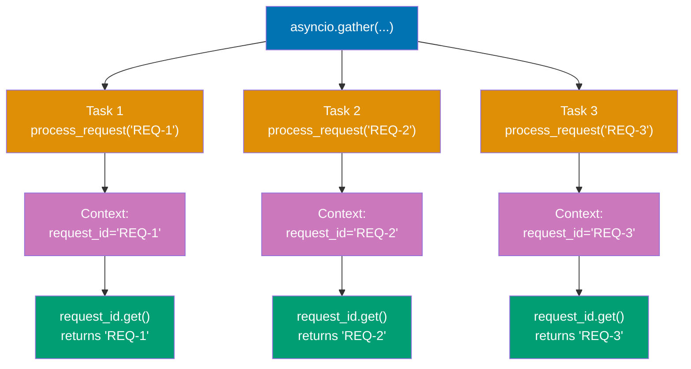

```python
import asyncio                                # => Import async framework
                                               # => Provides event loop and gather
from contextvars import ContextVar            # => Import context variable class
                                               # => Task-local storage for async

# Global context variable
request_id: ContextVar[str] = ContextVar('request_id', default='none')  # => Declare context variable
                                                                          # => Module-level declaration
# => Declare module-level context variable
# => Type: ContextVar[str]
# => Default value: 'none' (if not set)

async def process_request(req_id):           # => Define async worker function
                                               # => Accepts request ID parameter
    """Process request with context"""
    request_id.set(req_id)                    # => Set context value
                                               # => Set value for THIS task's context
                                               # => Isolated from other tasks
                                               # => Like thread-local but for async
    await asyncio.sleep(0.1)                  # => Yield control during I/O
                                               # => Simulate async work
                                               # => Context preserved across await
    current_id = request_id.get()             # => Get context value
                                               # => Get from THIS task's context
                                               # => Returns value set above
    print(f"Processing request: {current_id}")  # => Print request ID
                                                 # => Output: Processing request: REQ-1
                                                 # => Each task prints its own ID

async def main():                             # => Main async function
                                               # => Orchestrates concurrent tasks
    # Run concurrent tasks (each has own context)
    await asyncio.gather(                     # => Run tasks concurrently
                                               # => Each task gets own context
        process_request("REQ-1"),             # => First task
                                               # => Task 1 context: request_id = "REQ-1"
                                               # => Runs concurrently
        process_request("REQ-2"),             # => Second task
                                               # => Task 2 context: request_id = "REQ-2"
                                               # => Isolated from Task 1
        process_request("REQ-3")              # => Third task
                                               # => Task 3 context: request_id = "REQ-3"
                                               # => Isolated from Tasks 1 and 2
    )
    # => Each task maintains separate context value
    # => No interference between tasks
    # => Like thread-local storage but for async tasks

asyncio.run(main())                           # => Bootstrap async execution
                                               # => Run event loop
                                               # => Output (order may vary):
                                               # => Processing request: REQ-1
                                               # => Processing request: REQ-2
                                               # => Processing request: REQ-3
```

**Key Takeaway**: ContextVar provides task-local storage preserving isolation across concurrent async tasks.

**Why It Matters**: This concept is fundamental to understanding the language and helps build robust, maintainable code.

## Example 71: Advanced Decorators - Class Decorators

Class decorators modify classes enabling functionality injection.

```python
def singleton(cls):                           # => Define class decorator
                                               # => Accepts class as parameter
    """Decorator that makes class a singleton"""
    instances = {}                            # => Cache for singleton instances
                                               # => Outer scope, preserved across calls
                                               # => Closure variable

    def get_instance(*args, **kwargs):        # => Wrapper function
                                               # => Replaces class constructor
        """Wrapper that returns cached instance"""
        if cls not in instances:              # => First call check
                                               # => First call for this class
            instances[cls] = cls(*args, **kwargs)  # => Create and cache instance
                                                   # => Create instance once
                                                   # => Call original __init__
                                                   # => Store in cache
        return instances[cls]                 # => Return cached instance
                                               # => Return cached instance
                                               # => Same object every time

    return get_instance                       # => Return wrapper
                                               # => Replace class with wrapper function
                                               # => Class replaced by factory function

@singleton                                    # => Apply decorator
                                               # => Database = singleton(Database)
class Database:                               # => Define singleton class
                                               # => Will be replaced by get_instance
    """Singleton database connection"""
    def __init__(self):                       # => Constructor (called once max)
        print("Connecting to database...")    # => Log connection
                                               # => Output on first instantiation only
                                               # => Called only once

db1 = Database()                              # => First instantiation
                                               # => First call
                                               # => instances is empty
                                               # => Calls Database.__init__()
                                               # => Output: Connecting to database...
                                               # => Stores in instances[Database]
db2 = Database()                              # => Second instantiation
                                               # => Second call
                                               # => instances[Database] exists
                                               # => No __init__ call
                                               # => Returns cached instance
print(db1 is db2)                             # => Check identity
                                               # => Compare object identity
                                               # => Output: True (exact same object)
print(id(db1) == id(db2))                     # => Check memory address
                                               # => Same memory address
                                               # => Output: True
```

**Key Takeaway**: Class decorators enable class-level modifications like singleton pattern implementation.

**Why It Matters**: Class decorators enable modifying classes after definition for patterns like singletons, registration, and automatic attribute addition, providing an alternative to metaclasses with simpler syntax. The pattern is cleaner than metaclasses for many use cases while maintaining the same power. Understanding class decorators is essential for framework development and design pattern implementation in Python.

## Example 72: Introspection with inspect

Inspect module provides runtime code introspection capabilities.

```python
import inspect

def greet(name: str, greeting: str = "Hello") -> str:
    """Greet someone"""
    return f"{greeting}, {name}!"             # => Simple greeting function
                                               # => Type hints: name (str), greeting (str), return (str)

# Function signature introspection
sig = inspect.signature(greet)                # => Get Signature object
                                               # => Contains all parameter metadata
print(sig)                                    # => Output: (name: str, greeting: str = 'Hello') -> str
                                               # => Full signature with annotations and defaults

# Parameter details (iterate parameters)
for param_name, param in sig.parameters.items():  # => OrderedDict of parameters
                                               # => param_name: str ('name', 'greeting')
                                               # => param: Parameter object with metadata
    print(f"{param_name}: {param.annotation}, default={param.default}")
    # => Parameter 1: name
    #    annotation: <class 'str'> (type hint)
    #    default: <class 'inspect._empty'> (no default value)
    # => Output: name: <class 'str'>, default=<class 'inspect._empty'>
    # => Parameter 2: greeting
    #    annotation: <class 'str'> (type hint)
    #    default: 'Hello' (has default)
    # => Output: greeting: <class 'str'>, default=Hello

# Return annotation
print(sig.return_annotation)                  # => Output: <class 'str'>
                                               # => Return type hint from -> str

# Source code introspection
source = inspect.getsource(greet)             # => Get full source code as string
                                               # => Reads from module's .py file
print(source)                                 # => Output: def greet(name: str, greeting: str = "Hello") -> str:\n    """Greet someone"""\n    return f"{greeting}, {name}!"
                                               # => Complete function definition
                                               # => Useful for documentation generation

# Module and file location
print(inspect.getmodule(greet))               # => Output: <module '__main__' from '...'>
                                               # => Module where function defined
print(inspect.getfile(greet))                 # => Output: /path/to/file.py
                                               # => File path where function defined

# Call stack introspection
def outer():
    """Outer function"""
    def inner():
        """Inner function"""
        frame = inspect.currentframe()        # => Get current stack frame
                                               # => FrameType object (snapshot of execution)
        info = inspect.getframeinfo(frame)    # => Get FrameInfo (file, line, function)
        print(f"Function: {info.function}")   # => Output: Function: inner
                                               # => Current function name
        print(f"Line: {info.lineno}")         # => Output: Line: [line number]
                                               # => Current line number in source
        print(f"File: {info.filename}")       # => Output: File: /path/to/file.py
                                               # => Source file path
    inner()                                   # => Call inner to demonstrate

outer()                                       # => Execute outer → inner → introspection
                                               # => Stack: outer() → inner() → currentframe()

# Practical use cases:
# => Automatic API documentation generation (Sphinx, pdoc)
# => Validation frameworks (check parameter types at runtime)
# => Debugging tools (inspect call stack during errors)
# => Metaprogramming (generate code based on function signatures)
```

**Key Takeaway**: inspect enables runtime exploration of functions, classes, and call stack for metaprogramming.

**Why It Matters**: The inspect module enables runtime code introspection for metaprogramming, documentation generation, and debugging tools that need to examine function signatures and source code. The capabilities are essential for building frameworks that generate code, validate inputs, or provide interactive exploration. However, introspection should be used judiciously as it can make code harder to understand and breaks with compiled/obfuscated code.

## Example 73: Dynamic Code Execution

Execute Python code dynamically using eval, exec, and compile.

```python
# eval: Evaluate single expression (returns value)
expr = "2 + 3 * 4"                            # => String containing Python expression
                                               # => Must be single expression (no statements)
result = eval(expr)                           # => Parse string to AST
                                               # => Evaluate expression
                                               # => Follows operator precedence (* before +)
                                               # => result = 14 (3*4=12, 2+12=14)
print(result)                                 # => Output: 14

# eval with namespace (variable access)
eval_result = eval("x * 2", {'x': 10})        # => Namespace dict provides 'x' variable
                                               # => x * 2 → 10 * 2 = 20
                                               # => eval_result = 20

# exec: Execute statements (no return value, modifies namespace)
code = """
def dynamic_function(x):
    return x ** 2

result = dynamic_function(5)
"""                                           # => Multi-line code string
                                               # => Can contain statements (def, if, for, etc.)
                                               # => NOT limited to single expression
namespace = {}                                # => Empty dict for isolated namespace
                                               # => Prevents pollution of global namespace
exec(code, namespace)                         # => Execute code in namespace dict
                                               # => Parses and runs all statements
                                               # => Creates 'dynamic_function' key in namespace
                                               # => Creates 'result' key in namespace
print(namespace['result'])                    # => Access 'result' variable from namespace
                                               # => Output: 25 (5**2 = 25)
print(namespace['dynamic_function'](10))      # => Access function from namespace
                                               # => Output: 100 (10**2)

# compile: Compile code to bytecode (performance optimization)
compiled = compile("x + y", "<string>", "eval")  # => Compile to code object
                                               # => Source: "x + y" expression
                                               # => Filename: "<string>" (placeholder)
                                               # => Mode: "eval" for expressions
                                               # => Returns code object (bytecode)
result = eval(compiled, {'x': 10, 'y': 5})    # => Evaluate compiled bytecode
                                               # => Namespace: {'x': 10, 'y': 5}
                                               # => result = 15 (10 + 5)
                                               # => Faster if reused multiple times (no re-parsing)

# compile modes: "eval" (expression), "exec" (statements), "single" (interactive)
compiled_exec = compile("print('Hello')", "<string>", "exec")
                                               # => Mode: "exec" for statements
exec(compiled_exec)                           # => Output: Hello

# CRITICAL SECURITY WARNING: Never eval/exec untrusted input!
# user_input = "os.system('rm -rf /')"       # => Malicious code injection
# eval(user_input)                            # => DANGEROUS! Executes arbitrary code
                                               # => Can delete files, steal data, install malware
                                               # => NEVER run untrusted eval/exec

# Safe alternative: ast.literal_eval (only for literals)
import ast
safe_dict = ast.literal_eval("{'a': 1, 'b': 2}")  # => Parses Python literals only
                                               # => safe_dict = {'a': 1, 'b': 2}
                                               # => Supports: strings, bytes, numbers, tuples, lists, dicts, sets, booleans, None
                                               # => NO code execution allowed
safe_list = ast.literal_eval("[1, 2, 3]")    # => Output: [1, 2, 3]
# ast.literal_eval("os.system('rm -rf /')")   # => ValueError: malformed node or string
                                               # => Safe rejection of code
                                               # => Use for parsing JSON-like config data
```

**Key Takeaway**: eval/exec enable dynamic code execution but require careful security considerations.

**Why It Matters**: This concept is fundamental to understanding the language and helps build robust, maintainable code.

## Example 74: AST Module for Code Analysis

Abstract Syntax Tree module parses Python code for analysis and transformation.

```python
import ast                                    # => Import Abstract Syntax Tree module
                                               # => Enables code parsing and transformation

code = """
def add(a, b):
    return a + b

result = add(2, 3)
"""                                           # => Python source code as string
                                               # => Triple-quoted multiline string
                                               # => Contains function definition + function call

# Parse code into AST (Abstract Syntax Tree)
tree = ast.parse(code)                        # => Parse source to AST
                                               # => Returns Module node (root of tree)
                                               # => Tree structure: Module → [FunctionDef, Assign]
                                               # => Does NOT execute code (only parses syntax)
                                               # => Safe for untrusted code analysis
print(type(tree))                             # => Output: <class '_ast.Module'>
                                               # => Root node type
                                               # => Top-level AST node

# Walk AST nodes (breadth-first traversal)
for node in ast.walk(tree):                   # => Iterate ALL nodes recursively
                                               # => Visits: Module, FunctionDef, arguments, Return, BinOp, Assign, Call, etc.
                                               # => Depth-first traversal
    if isinstance(node, ast.FunctionDef):     # => Check if node is function definition
                                               # => Type check for function definitions
        print(f"Function: {node.name}")       # => Access function name attribute
                                               # => Output: Function: add
                                               # => node.name is string
        print(f"  Arguments: {[arg.arg for arg in node.args.args]}")  # => Extract argument names
                                                                        # => List comprehension over args
                                               # => Output:   Arguments: ['a', 'b']
                                               # => Extract parameter names
    elif isinstance(node, ast.Return):        # => Check if node is return statement
                                               # => Detects 'return' keyword usage
        print("Found return statement")       # => Output: Found return statement
                                               # => Located return node in AST
    elif isinstance(node, ast.BinOp):         # => Binary operation (+ - * / etc.)
                                               # => Arithmetic or comparison operations
        print(f"Binary operation: {type(node.op).__name__}")  # => Get operation type
                                                                # => node.op is Add/Sub/Mult/Div etc.
                                               # => Output: Binary operation: Add
                                               # => Identifies 'a + b' as Add operation

# Access specific node attributes
func_def = tree.body[0]                       # => Get first statement (FunctionDef)
                                               # => tree.body is list of top-level statements
                                               # => Index 0 is first statement
print(f"Function defined at line: {func_def.lineno}")  # => Access line number attribute
                                                        # => func_def.lineno stores source line
                                               # => Output: Function defined at line: 2
                                               # => Line number in source code

# Compile AST to bytecode (safe transformation)
compiled = compile(tree, "<string>", "exec")  # => Compile AST to bytecode
                                               # => tree: AST object (NOT string)
                                               # => filename: "<string>" (placeholder)
                                               # => mode: "exec" for statements
                                               # => Returns code object
namespace = {}                                # => Empty namespace for execution
                                               # => Dictionary to store variables
exec(compiled, namespace)                     # => Execute bytecode in namespace
                                               # => Defines 'add' function
                                               # => Executes 'result = add(2, 3)'
                                               # => Stores result = 5 in namespace
print(namespace['result'])                    # => Access 'result' variable
                                               # => Output: 5 (2 + 3)
                                               # => Demonstrates successful execution

# AST transformation example (code modification)
class DoubleNumbers(ast.NodeTransformer):     # => Define AST transformer class
                                               # => Inherits from NodeTransformer
    """AST transformer that doubles numeric literals"""
    def visit_Num(self, node):                # => Override visit_Num method
                                               # => Called for each Num node
        """Visit Num nodes and double their value"""
        node.n *= 2                           # => Double the numeric value
                                               # => Modifies AST in place
                                               # => Mutates node.n attribute
        return node                            # => Return modified node
                                               # => Required for tree reconstruction

tree2 = ast.parse("x = 10 + 5")               # => Parse simple expression
                                               # => Parse source code
DoubleNumbers().visit(tree2)                  # => Apply transformation
                                               # => Transform AST (10→20, 5→10)
                                               # => Modified tree: x = 20 + 10
ast.fix_missing_locations(tree2)              # => Repair line number metadata
                                               # => Fix line numbers after transformation
                                               # => Required for compilation
compiled2 = compile(tree2, "<string>", "exec")  # => Compile transformed AST
                                                 # => Creates bytecode from modified tree
namespace2 = {}                               # => Fresh namespace
                                               # => Isolated execution environment
exec(compiled2, namespace2)                   # => Execute transformed code
                                               # => Runs modified bytecode
print(namespace2['x'])                        # => Access result variable
                                               # => Output: 30 (20 + 10, not 15)
                                               # => Demonstrates AST transformation power

# Practical use cases:
# => Linters: Analyze code structure without execution (pylint, flake8)
# => Formatters: Parse → Transform → Regenerate (black, autopep8)
# => Code generators: Programmatically create Python code
# => Static analysis: Find bugs, security issues, type errors
# => Safer than exec: Can inspect/modify before execution
```

**Key Takeaway**: AST module enables safe code parsing and transformation without executing untrusted code.

**Why It Matters**: The AST module enables parsing and transforming Python code without executing it, providing safe code analysis for tools like linters, formatters, and code generators. The approach is safer than exec for code manipulation and enables building developer tools that understand Python syntax. Mastering AST is essential for tool development, custom linters, and code transformation utilities.

## Example 75: Packaging with pyproject.toml

Modern Python packaging uses pyproject.toml with setuptools or poetry.

```toml
# pyproject.toml
[build-system]
# => Build system metadata
# => Defines how to build package
requires = ["setuptools>=45", "wheel"]        # => Required build tools
                                               # => List of dependencies needed for build
build-backend = "setuptools.build_meta"       # => Build backend implementation
                                               # => Python module for build process

[project]
# => Project metadata section
# => Core package information
name = "mypackage"                            # => Package name on PyPI
                                               # => Must be unique globally
version = "0.1.0"                             # => Semantic version
                                               # => Format: major.minor.patch
description = "My awesome package"            # => Short description
                                               # => One-line summary
authors = [{name = "Your Name", email = "you@example.com"}]  # => Author info
                                                               # => Array of author objects
dependencies = [
    "requests>=2.28.0",                       # => Required runtime dependency
                                               # => Version constraint: >= 2.28.0
    "numpy>=1.24.0"                           # => Another runtime dependency
                                               # => Installed automatically with package
]

[project.optional-dependencies]
# => Optional dependency groups
# => Groups for specific use cases
dev = ["pytest>=7.0", "black>=22.0"]          # => Development dependencies
                                               # => Not required for runtime

[project.scripts]
# => CLI entry points (creates executable commands)
# => Defines command-line tools
mytool = "mypackage.cli:main"                 # => mytool command → mypackage.cli.main()
                                               # => Creates executable 'mytool' in PATH
```

**Package CLI entry point example**:

```python
# File: mypackage/cli.py
def main():                                   # => CLI entry point function
    """Main CLI entry point"""
    import sys                                # => Import sys for argv access
    print(f"mytool called with args: {sys.argv[1:]}")  # => Print command arguments
                                                        # => Output: mytool called with args: [...]
    # CLI logic here
    return 0                                  # => Return exit code (0 = success)

if __name__ == '__main__':                    # => Direct execution guard
    import sys                                # => Import sys for exit
    sys.exit(main())                          # => Call main and exit with return code
```

**Build and distribution commands**:

```bash
# Build distribution
python -m build                               # => Creates dist/mypackage-0.1.0.tar.gz (source)
                                               # => Creates dist/mypackage-0.1.0-py3-none-any.whl (wheel)

# Install in development mode
pip install -e .                              # => Editable install (changes reflect immediately)

# Install with optional dependencies
pip install -e ".[dev]"                       # => Install with dev dependencies (pytest, black)

# Publish to PyPI
twine upload dist/*                           # => Upload to PyPI (requires account and token)
```

**Key Takeaway**: pyproject.toml provides standardized packaging configuration for modern Python projects.

**Why It Matters**: Modern Python packaging with pyproject.toml standardizes build configuration across tools, replacing legacy setup.py with declarative metadata that supports multiple build backends. The standardization improves reproducibility and enables better tooling for dependency management and distribution. Understanding modern packaging is essential for library development and ensuring code can be easily installed and distributed through PyPI.

## Example 76: Advanced pytest - Mocking

Mock external dependencies for isolated unit testing.

```python
from unittest.mock import Mock, patch
import requests

def fetch_user_data(user_id):
    """Fetch user data from API"""
    response = requests.get(f"https://api.example.com/users/{user_id}")
    # => Makes HTTP request (slow, requires network)
    return response.json()                    # => Parse JSON response

# Test with mock
def test_fetch_user_data():
    """Test without actual HTTP request"""
    with patch('requests.get') as mock_get:   # => Replace requests.get with mock
                                               # => Only within this block
        # Configure mock behavior
        mock_get.return_value.json.return_value = {'id': 1, 'name': 'Alice'}
        # => When mock_get().json() called
        # => Returns configured dict
        # => No actual HTTP request

        # Call function (uses mock instead of real requests.get)
        result = fetch_user_data(1)           # => Calls mocked requests.get
                                               # => Returns mock response
                                               # => result = {'id': 1, 'name': 'Alice'}

        # Assertions
        assert result == {'id': 1, 'name': 'Alice'}  # => Verify return value
        mock_get.assert_called_once_with("https://api.example.com/users/1")
        # => Verify requests.get called exactly once
        # => Verify correct URL used

# Mock object (manual mock creation)
mock_db = Mock()                              # => Create mock object
                                               # => Auto-creates attributes on access
mock_db.query.return_value = [{'id': 1}]      # => Configure return value
                                               # => mock_db.query() will return this
result = mock_db.query("SELECT * FROM users") # => Call mocked method
                                               # => result = [{'id': 1}]
mock_db.query.assert_called_with("SELECT * FROM users")  # => Verify call arguments
                                               # => Ensures query called correctly
```

**Key Takeaway**: Mocking isolates tests from external dependencies with configurable return values and call verification.

**Why It Matters**: Mocking isolates unit tests from external dependencies like databases and APIs, enabling fast, reliable tests that don't require infrastructure. The patch decorator and return_value configuration enable complete control over dependency behavior for testing edge cases. Mastering mocking is essential for professional testing where isolated unit tests provide fast feedback without flaky failures from external services.

## Example 77: pytest Markers for Test Organization

Markers tag tests for selective execution and categorization.

```python
import pytest                                 # => Import pytest framework (provides @pytest.mark decorators)

@pytest.mark.slow                             # => Mark test as 'slow' (decorator applies metadata)
def test_long_running_operation():           # => Define test function (auto-discovered via 'test_' prefix)
    """Test marked as slow"""
    import time                                # => Import time module for sleep
    time.sleep(2)                             # => Sleep for 2 seconds (simulates slow operation)
    assert True                               # => Always passes (validates test infrastructure)

@pytest.mark.unit                             # => Mark test as 'unit' (indicates unit test category)
def test_fast_unit():                         # => Define unit test function (fast execution expected)
    """Unit test (fast)"""
    assert 1 + 1 == 2                         # => Fast assertion (~milliseconds, no I/O)

@pytest.mark.integration                      # => Mark test as 'integration'
@pytest.mark.slow                             # => Multiple markers allowed (has BOTH markers)
def test_database_integration():              # => Define integration test (combines both categories)
    """Integration test (slow)"""
    assert True                               # => Simple assertion (marked for selective execution)

# Run only specific markers:
# pytest -m unit                              # => Run only tests with 'unit' marker
                                               # => Skips slow and integration tests (fast feedback)
# pytest -m "not slow"                        # => Run all tests EXCEPT slow (boolean expression)
# pytest -m "slow and integration"            # => Run tests with BOTH markers (AND logic)
                                               # => Runs test_database_integration only

# Custom markers in pytest.ini or pyproject.toml:
# [tool:pytest]                               # => pytest configuration section
# markers =                                   # => Marker registration list
#     slow: marks tests as slow (>1 second)  # => Define 'slow' marker with description (documents purpose)
#     unit: marks tests as unit tests         # => Define 'unit' marker
#     integration: marks tests as integration tests  # => Define 'integration' marker
# => Declares markers (avoids warnings, enables IDE autocomplete)
```

**Key Takeaway**: Markers enable test categorization and selective execution for faster development workflows.

**Why It Matters**: Pytest markers enable selective test execution for faster development workflows, allowing developers to run only relevant tests during feature development. The categorization (unit, integration, slow) enables different test suites for different contexts like CI/CD, pre-commit, and release validation. Understanding marker-based test organization is critical for scaling test suites as projects grow without sacrificing development velocity.

## Example 78: Singleton Pattern (Pythonic)

Implement singleton using module-level instance or metaclass.

```python
# Approach 1: Module-level instance (simplest, most Pythonic)
# database.py
class _Database:                              # => Define private class
                                               # => Leading underscore indicates internal
    """Private database class"""
    def __init__(self):                       # => Constructor
                                               # => Called once on module import
        self.connection = "DB_CONNECTION"     # => Initialize connection
                                               # => Initialize once on import

database = _Database()                        # => Create single instance
                                               # => Single instance created on module import
                                               # => Module imported once per Python process
                                               # => Subsequent imports reuse cached module

# Usage: from database import database
# => All imports get same 'database' object
# => Python's module system provides singleton behavior
# => Simplest and most Pythonic approach

# Approach 2: __new__ method (explicit singleton)
class Singleton:                              # => Define singleton class
                                               # => Uses __new__ for instance control
    """Singleton using __new__"""
    _instance = None                          # => Class variable (shared)
                                               # => Shared across all instances

    def __new__(cls):                         # => Override instance creation
                                               # => Called before __init__
        """Control instance creation"""
        if cls._instance is None:             # => First instantiation check
                                               # => First instantiation
            cls._instance = super().__new__(cls)  # => Create instance once
                                                   # => Create instance once
                                                   # => Stores in class variable
        return cls._instance                   # => Return cached instance
                                               # => Return cached instance
                                               # => Same object every time

s1 = Singleton()                              # => First instantiation
                                               # => First call creates instance
s2 = Singleton()                              # => Second instantiation
                                               # => Second call returns cached
print(s1 is s2)                               # => Test object identity
                                               # => Output: True (same object)

# Approach 3: Metaclass (most flexible)
class SingletonMeta(type):                    # => Define singleton metaclass
                                               # => Inherits from type
    """Metaclass implementing singleton pattern"""
    _instances = {}                           # => Cache for all singleton classes
                                               # => Dictionary maps class to instance

    def __call__(cls, *args, **kwargs):       # => Override class instantiation
                                               # => Called when class called as function
        """Called when class is instantiated"""
        if cls not in cls._instances:         # => First instantiation check
                                               # => First instantiation
            cls._instances[cls] = super().__call__(*args, **kwargs)  # => Create and cache instance
                                                                      # => Calls __new__ then __init__
            # => Create instance with __new__ and __init__
            # => Store in metaclass cache
        return cls._instances[cls]             # => Return cached instance
                                               # => Return cached instance
                                               # => Same for all calls with this class

class Logger(metaclass=SingletonMeta):        # => Apply singleton metaclass
                                               # => Uses SingletonMeta for instance control
    """Logger using singleton metaclass"""
    pass                                      # => Singleton behavior from metaclass
                                               # => No special implementation needed

log1 = Logger()                               # => Create logger instance
                                               # => Creates instance
log2 = Logger()                               # => Create second logger
                                               # => Returns cached instance
print(log1 is log2)                           # => Test identity
                                               # => Output: True
```

**Key Takeaway**: Python offers multiple singleton implementations; module-level instance is most Pythonic.

**Why It Matters**: Singleton pattern ensures single instance existence for resources like database connections and configuration managers, preventing resource conflicts and inconsistent state. However, singletons can make testing harder and create global state that violates dependency injection principles. The module-level instance approach is most Pythonic and simplest, avoiding metaclass complexity while achieving the same goal.

## Example 79: Observer Pattern

Implement observer pattern for event-driven architectures.

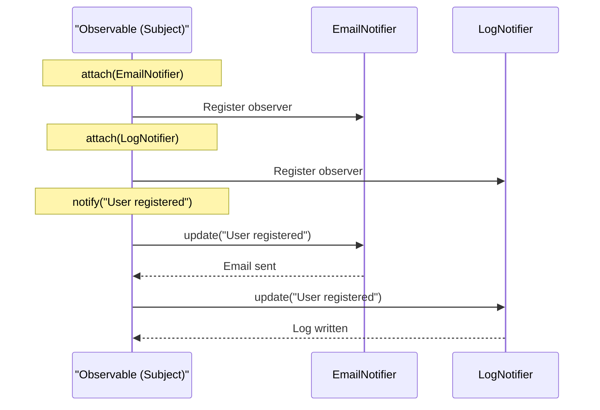

```python
class Observable:                             # => Define subject class
                                               # => Maintains list of observers and notifies them
    """Subject that observers watch"""

    def __init__(self):                       # => Initialize observable
        self._observers = []                  # => List of registered observers (initially empty)
                                               # => Private list prevents direct access

    def attach(self, observer):               # => Add observer method
        """Add observer to notification list"""
        self._observers.append(observer)      # => Register new observer (must have update() method)
                                               # => Appends to end of list

    def detach(self, observer):               # => Remove observer method
        """Remove observer from notification list"""
        self._observers.remove(observer)      # => Unregister observer (no longer receives notifications)
                                               # => Raises ValueError if not found

    def notify(self, event):                  # => Notify all observers method
        """Notify all observers of event"""
        for observer in self._observers:      # => Iterate registered observers
                                               # => Processes in registration order
            observer.update(event)             # => Call each observer's update() with event data
                                               # => Passes same event to all observers

class EmailNotifier:                          # => Define email observer class
                                               # => Concrete observer for email notifications
    """Observer that sends emails"""
    def update(self, event):                  # => Implement update() interface
        """React to event by sending email"""
        print(f"Email: {event}")              # => Simulated email send
                                               # => Output: Email: User registered

class LogNotifier:                            # => Define log observer class
                                               # => Concrete observer for logging
    """Observer that logs events"""
    def update(self, event):                  # => Implement update() interface
        """React to event by logging"""
        print(f"Log: {event}")                # => Simulated logging
                                               # => Output: Log: User registered

# Usage
subject = Observable()                        # => Create subject instance
                                               # => _observers = []
email = EmailNotifier()                       # => Create email observer instance
logger = LogNotifier()                        # => Create log observer instance

subject.attach(email)                         # => Register email observer
                                               # => _observers = [EmailNotifier]
subject.attach(logger)                        # => Register log observer
                                               # => _observers = [EmailNotifier, LogNotifier]

subject.notify("User registered")             # => Trigger notification to all observers
                                               # => Calls email.update("User registered")
                                               # => Calls logger.update("User registered")
                                               # => Output: Email: User registered
                                               # => Output: Log: User registered
```

**Key Takeaway**: Observer pattern decouples event producers from consumers for flexible event handling.

**Why It Matters**: Observer pattern decouples event producers from consumers, enabling flexible event handling where observers can be added or removed without modifying the subject. The pattern is fundamental to GUI frameworks, event-driven architectures, and plugin systems. Understanding observer pattern is essential for building extensible systems where components react to events without tight coupling.

## Example 80: Best Practices - EAFP and Duck Typing

Embrace Python's EAFP (Easier to Ask Forgiveness than Permission) and duck typing.

```python
# EAFP: Easier to Ask for Forgiveness than Permission
# Pythonic approach: Try operation, catch exceptions (optimistic execution)
def process_file(filename):                   # => Define file processing function (demonstrates EAFP)
    """EAFP approach (Pythonic)"""
    try:                                      # => Try block (assume operation succeeds)
        with open(filename) as f:             # => Try opening file directly (no pre-checks)
                                               # => Context manager handles cleanup
            return f.read()                    # => Read entire file contents and return
    except FileNotFoundError:                 # => Catch specific exception (file doesn't exist)
        return "File not found"                # => Graceful error handling (user-friendly message)
    except PermissionError:                   # => Catch permission denied (no read access)
        return "Permission denied"             # => Return different error message
    except IOError as e:                      # => Catch other I/O errors (disk full, network issues)
        return f"I/O error: {e}"               # => Return detailed error with exception info

# LBYL (Look Before You Leap) - less Pythonic, NOT recommended
# import os
# def process_file_lbyl(filename):
#     if os.path.exists(filename):            # => Check 1: File exists?
#         if os.access(filename, os.R_OK):    # => Check 2: Readable?
#             with open(filename) as f:       # => THEN open
#                 return f.read()
# => PROBLEMS: Race condition (TOCTOU), verbose, duplicates logic, not Pythonic
# => Use EAFP instead!

# Duck typing: "If it walks like a duck and quacks like a duck, it's a duck"
# Accept any object with required behavior (interface over inheritance)
def print_items(items):                       # => Define generic function (no type restrictions)
    """Accept any iterable (list, tuple, set, generator, custom class)"""
    for item in items:                        # => Iterate over items (requires __iter__() only)
                                               # => Duck typing: assumes iterable, no isinstance() check
        print(item)                            # => Output item value (polymorphic behavior)

print_items([1, 2, 3])                        # => Pass list (works: list has __iter__)
                                               # => Output: 1, 2, 3
print_items((1, 2, 3))                        # => Pass tuple (works: tuple has __iter__)
                                               # => Output: 1, 2, 3
print_items({1, 2, 3})                        # => Pass set (works: set has __iter__)
                                               # => Output: 1, 2, 3 (unordered)
print_items(x for x in range(3))              # => Pass generator expression (works: has __iter__)
                                               # => Output: 0, 1, 2
print_items("abc")                            # => Pass string (works: str has __iter__)
                                               # => Output: a, b, c

# Custom class with __iter__ also works
class MyIterable:                             # => Define custom iterable class (implements iterator protocol)
    def __iter__(self):                       # => Implement __iter__ method (required for iteration)
        return iter([10, 20, 30])             # => Return iterator (wraps list with iter())
print_items(MyIterable())                     # => Pass custom class instance (works: has __iter__)
                                               # => Output: 10, 20, 30

# Type checking reduces flexibility (anti-pattern)
# def print_list(items: list):                # => TOO restrictive
#     for item in items:
#         print(item)
# print_list((1, 2, 3))                       # => TypeError (rejects tuple despite being iterable)
                                               # => Not Pythonic (rigid type requirements)

# Better: Use protocols or abstract types for flexible type hints
from typing import Iterable                   # => Import Iterable type (generic abstract type)
def print_items_typed(items: Iterable):       # => Define typed function (accepts ANY object with __iter__)
                                               # => Type checker validates __iter__ presence (static type safety + runtime flexibility)
    for item in items:                        # => Iterate over items (same runtime behavior as untyped)
        print(item)                            # => Same behavior as duck typing (plus IDE autocomplete and mypy validation)

print_items_typed([1, 2, 3])                  # => Pass list (mypy: ✓ list is Iterable)
print_items_typed((1, 2, 3))                  # => Pass tuple (mypy: ✓ tuple is Iterable)
print_items_typed({1, 2, 3})                  # => Pass set (mypy: ✓ set is Iterable)
print_items_typed("abc")                      # => Pass string (mypy: ✓ str is Iterable)
# print_items_typed(123)                      # => Would pass int
                                               # => mypy error: int is not Iterable (static type checking catches error)

# EAFP + Duck typing = Pythonic code
# => Optimistic: Try operations, catch exceptions
# => Flexible: Accept any compatible object
# => Robust: Graceful error handling
# => Fast: No redundant checks
```

**Key Takeaway**: EAFP and duck typing embrace Python's dynamic nature for cleaner, more flexible code.

**Why It Matters**: EAFP (Easier to Ask Forgiveness than Permission) and duck typing embrace Python's dynamic nature, preferring exception handling over pre-checks that can create race conditions. The philosophy enables writing flexible, polymorphic code that works with any compatible object rather than requiring specific types. Mastering EAFP and duck typing is essential for writing Pythonic code that leverages Python's strengths rather than fighting its dynamic nature.

## Summary

Advanced Python (examples 55-80) covers expert-level techniques: metaclasses for class customization, asyncio for concurrent I/O, descriptors for attribute control, profiling and optimization, multiprocessing for CPU-bound parallelism, introspection and dynamic execution, modern packaging, advanced testing patterns, and Pythonic design patterns. Master these techniques to write production-grade Python systems operating at 95% language coverage.
