This section covers advanced Python techniques from examples 55-80, achieving 75-95% topic coverage.

## Example 55: Basic Metaclass

Metaclasses customize class creation, enabling class-level validation and modification.

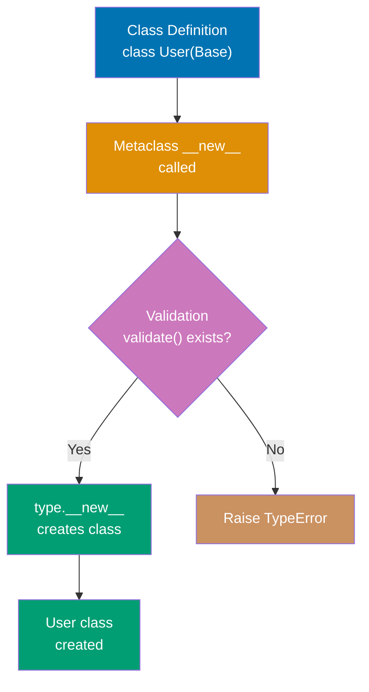

```python
class ValidatedMeta(type):
    """Metaclass that validates class attributes"""

    def __new__(mcs, name, bases, namespace):
        """Called when class is DEFINED (not instantiated)"""
        # => mcs: metaclass itself (ValidatedMeta)
        # => name: class name being created (string)
        # => bases: tuple of base classes
        # => namespace: dict of class attributes/methods

        # Validate required methods exist
        if name != 'Base' and 'validate' not in namespace:  # => Check for 'validate' method
                                                             # => Skip Base class itself
            raise TypeError(f"{name} must implement 'validate' method")  # => Fail at definition time

        # Create class normally
        cls = super().__new__(mcs, name, bases, namespace)  # => Calls type.__new__
                                                             # => Creates actual class object
        return cls                                           # => Return new class

class Base(metaclass=ValidatedMeta):
    """Base class using metaclass"""
    pass                                      # => ValidatedMeta.__new__ called
                                               # => name='Base', skipped validation
                                               # => Base class created

class User(Base):
    """Valid subclass with required method"""
    def validate(self):
        return True                           # => Required method present
                                               # => ValidatedMeta.__new__ called
                                               # => name='User', has 'validate'
                                               # => User class created successfully

# class Invalid(Base):                        # => ValidatedMeta.__new__ called
#     pass                                     # => name='Invalid', NO 'validate'
                                               # => TypeError: Invalid must implement 'validate' method
                                               # => Class definition FAILS (not instantiation)

# Metaclass runs at CLASS DEFINITION time
user = User()                                 # => Normal instantiation
                                               # => Validation already done at definition
print(user.validate())                        # => Output: True
```

**Key Takeaway**: Metaclasses intercept class creation enabling framework-level validation and customization.

**Why It Matters**: Metaclasses enable framework-level customization and validation that executes at class definition time, catching design errors before instantiation. The pattern underlies ORM frameworks like SQLAlchemy and Django where metaclasses register models and validate field definitions. However, metaclasses add significant complexity and should only be used when simpler alternatives like decorators and **init_subclass** are insufficient.

## Example 56: **init_subclass** (Simpler Alternative)

**init_subclass** provides class customization without metaclasses for most use cases.

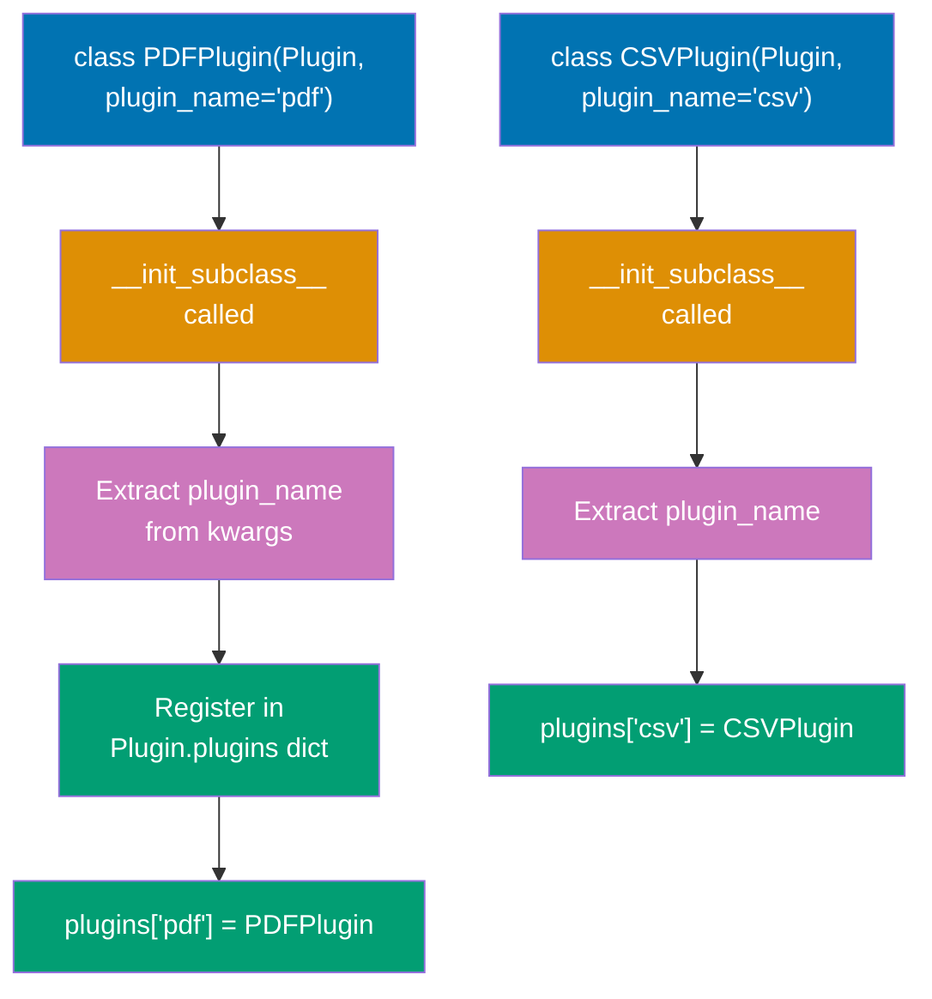

```python
class Plugin:
    """Base class with automatic subclass registration"""
    plugins = {}                              # => Class-level registry
                                               # => Shared across all subclasses

    def __init_subclass__(cls, plugin_name=None, **kwargs):
        """Called when subclass is DEFINED"""
        # => cls: the subclass being created (PDFPlugin, CSVPlugin, etc.)
        # => plugin_name: custom kwarg from class definition
        # => kwargs: other custom kwargs

        super().__init_subclass__(**kwargs)   # => Call parent __init_subclass__
                                               # => Required for cooperative inheritance
        if plugin_name:                       # => If plugin_name provided
            cls.plugins[plugin_name] = cls     # => Register in global registry
                                               # => Key: 'pdf', Value: PDFPlugin class
            print(f"Registered plugin: {plugin_name}")  # => Output: Registered plugin: pdf

class PDFPlugin(Plugin, plugin_name='pdf'):
    """Automatically registered as 'pdf'"""
    # => At definition time:
    # => __init_subclass__(PDFPlugin, plugin_name='pdf') called
    # => Plugin.plugins['pdf'] = PDFPlugin
    # => Output: Registered plugin: pdf
    pass

class CSVPlugin(Plugin, plugin_name='csv'):
    # => At definition time:
    # => __init_subclass__(CSVPlugin, plugin_name='csv') called
    # => Plugin.plugins['csv'] = CSVPlugin
    # => Output: Registered plugin: csv
    pass

# Access registered plugins
print(Plugin.plugins)                         # => Access class-level registry
                                               # => Output: {'pdf': <class 'PDFPlugin'>, 'csv': <class 'CSVPlugin'>}

# Factory pattern usage
plugin_class = Plugin.plugins['pdf']          # => Get PDFPlugin class from registry
instance = plugin_class()                     # => Instantiate PDFPlugin
```

**Key Takeaway**: **init_subclass** simplifies common metaclass patterns with cleaner syntax.

**Why It Matters**: **init_subclass** provides class customization without metaclass complexity, making it the preferred approach for most use cases requiring subclass registration or validation. The pattern enables plugin systems and factory registration with clearer syntax than metaclasses. Understanding when to use **init_subclass** versus metaclasses prevents over-engineering while achieving framework-level customization.

## Example 57: Descriptor Protocol

Descriptors customize attribute access using **get**, **set**, and **delete** methods.

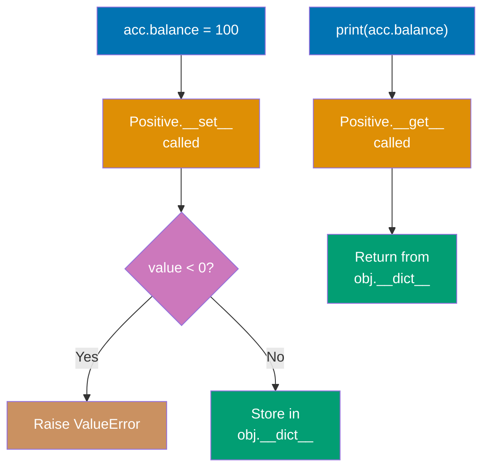

```python
class Positive:
    """Descriptor that enforces positive values"""

    def __init__(self, name):
        self.name = name                      # => Store attribute name
                                               # => Used as key in instance __dict__

    def __get__(self, obj, objtype=None):
        """Called when accessing attribute (acc.balance)"""
        if obj is None:                       # => Accessed on class (Account.balance)
            return self                        # => Return descriptor itself
        return obj.__dict__.get(self.name, 0)  # => Get value from instance dict
                                               # => Default to 0 if not set

    def __set__(self, obj, value):
        """Called when setting attribute (acc.balance = X)"""
        if value < 0:                         # => Validation check
            raise ValueError(f"{self.name} must be positive")  # => Reject negative
        obj.__dict__[self.name] = value        # => Store in instance dict
                                               # => Key: 'balance', Value: value

class Account:
    """Account class using descriptor for balance validation"""
    balance = Positive('balance')             # => Class-level descriptor instance
                                               # => Intercepts all balance access

    def __init__(self, balance):
        self.balance = balance                # => Calls Positive.__set__(self, balance)
                                               # => Validates before storing

acc = Account(100)                            # => Calls __init__(100)
                                               # => __set__ called, validates 100 >= 0
                                               # => Stores in acc.__dict__['balance']
print(acc.balance)                            # => Calls __get__
                                               # => Returns acc.__dict__['balance']
                                               # => Output: 100
# acc.balance = -50                           # => Calls __set__(-50)
                                               # => Raises ValueError: balance must be positive
```

**Key Takeaway**: Descriptors enable reusable attribute validation and transformation logic.

**Why It Matters**: Descriptors enable reusable attribute validation and transformation logic that works across multiple classes, reducing code duplication in large codebases. The protocol underlies properties, methods, and classmethods in Python, making it fundamental to understanding Python's attribute access model. Mastering descriptors is essential for framework development and building elegant APIs with computed or validated attributes.

## Example 58: Property as Descriptor

Properties use descriptors internally for computed attributes.

```python
class Circle:
    """Circle with computed area using property"""

    def __init__(self, radius):
        self._radius = radius                 # => Store in private attribute
                                               # => Uses setter validation via @radius.setter

    @property
    def radius(self):
        """Getter for radius"""
        return self._radius                   # => Return stored value
                                               # => Called when accessing c.radius

    @radius.setter
    def radius(self, value):
        """Setter with validation"""
        if value < 0:                         # => Validation check
            raise ValueError("Radius must be non-negative")
        self._radius = value                  # => Update private storage
                                               # => Called when setting c.radius = X

    @property
    def area(self):
        """Computed property (read-only)"""
        return 3.14159 * self._radius ** 2    # => Calculate dynamically
                                               # => No setter defined → read-only
                                               # => Always reflects current radius

c = Circle(5)                                 # => Creates circle with radius 5
                                               # => Stores in c._radius = 5
print(c.radius)                               # => Calls radius getter
                                               # => Returns 5
                                               # => Output: 5
print(c.area)                                 # => Calls area getter
                                               # => Computes 3.14159 * 5^2
                                               # => Output: 78.53975
c.radius = 10                                 # => Calls radius setter
                                               # => Validates 10 >= 0
                                               # => Updates c._radius = 10
print(c.area)                                 # => Recomputed with new radius
                                               # => Output: 314.159
# c.area = 100                                # => AttributeError: can't set attribute
                                               # => No setter defined for area
```

**Key Takeaway**: Properties provide computed attributes and attribute validation with getter/setter syntax.

**Why It Matters**: Properties provide computed attributes and validation with attribute syntax rather than getter/setter methods, making APIs more Pythonic and user-friendly. The decorator-based pattern enables gradual addition of validation and computation without breaking existing code that accesses attributes directly. Understanding properties is essential for designing clean APIs that hide implementation details while maintaining attribute-like access patterns.

## Example 59: Asyncio Basics

Asyncio enables concurrent I/O operations using async/await syntax.

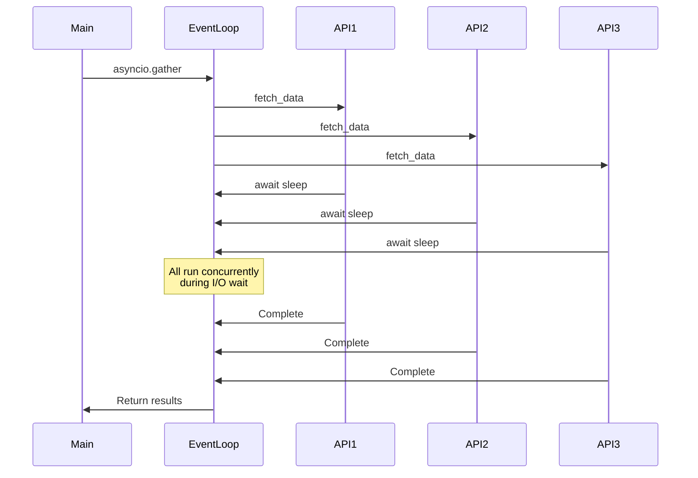

```python
import asyncio

async def fetch_data(url):
    """Simulated async HTTP request"""
    print(f"Fetching {url}...")              # => Output: Fetching https://api1.com...
                                               # => Does NOT block other coroutines
    await asyncio.sleep(1)                    # => Simulate I/O (yields control)
                                               # => Event loop switches to other tasks
                                               # => NOT time.sleep (which blocks entire thread)
    print(f"Completed {url}")                 # => Output: Completed https://api1.com
                                               # => After 1 second I/O wait
    return f"Data from {url}"                 # => Return result string
                                               # => Becomes result in gather list

async def main():
    """Run multiple async operations concurrently"""
    # Sequential (slow) - NOT concurrent
    # result1 = await fetch_data("https://api1.com")  # => Wait 1s for api1
    # result2 = await fetch_data("https://api2.com")  # => Wait 1s for api2
    # => Total time: 2 seconds (sequential)

    # Concurrent (fast) - ALL run simultaneously
    results = await asyncio.gather(           # => Schedule all coroutines concurrently
                                               # => Waits for ALL to complete
        fetch_data("https://api1.com"),       # => Starts immediately
        fetch_data("https://api2.com"),       # => Starts immediately (parallel)
        fetch_data("https://api3.com")        # => Starts immediately (parallel)
    )                                         # => Total time: 1 second (max of 3x 1s operations)
                                               # => Results collected in order
    print(results)                            # => Output: ['Data from https://api1.com', 'Data from https://api2.com', 'Data from https://api3.com']
                                               # => List preserves call order

# Run the event loop
asyncio.run(main())                           # => Creates event loop
                                               # => Runs main() coroutine until completion
                                               # => Closes event loop
                                               # => Total execution: ~1 second
```

**Key Takeaway**: asyncio enables concurrent I/O with async/await; gather runs multiple coroutines concurrently.

**Why It Matters**: Asyncio enables concurrent I/O operations on a single thread using cooperative multitasking, avoiding the overhead and complexity of threading for I/O-bound workloads. The async/await syntax makes asynchronous code readable compared to callback-based approaches, while gather() enables structured concurrency. Mastering asyncio is essential for high-performance network services and web scraping where I/O operations dominate execution time.

## Example 60: Asyncio Tasks

Tasks wrap coroutines for concurrent execution with more control than gather.

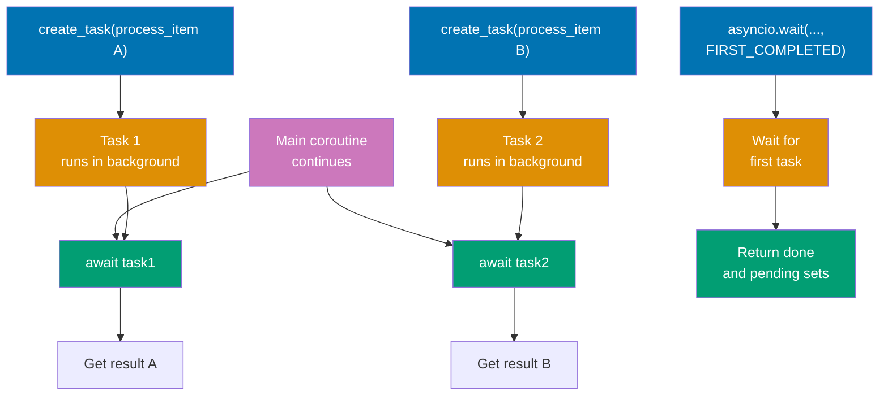

```python
import asyncio

async def process_item(item, delay):
    """Process single item"""
    await asyncio.sleep(delay)                # => Simulate async work
    return f"Processed {item}"                # => Return result after delay

async def main():
    # Create tasks (start immediately)
    task1 = asyncio.create_task(process_item("A", 2))  # => Schedules coroutine on event loop
                                                        # => Starts running immediately
                                                        # => 2 second delay
    task2 = asyncio.create_task(process_item("B", 1))  # => Starts in parallel
                                                        # => 1 second delay

    # Do other work while tasks run
    print("Tasks running in background...")    # => Output: Tasks running in background...
                                                 # => Both tasks executing concurrently
    await asyncio.sleep(0.5)                    # => Main coroutine sleeps 0.5s
                                                 # => Tasks continue running
    print("Still working...")                   # => Output: Still working...
                                                 # => After 0.5s total elapsed

    # Wait for completion
    result1 = await task1                       # => Wait for task1 to finish
                                                 # => Already running for ~0.5s
                                                 # => Waits remaining ~1.5s
    result2 = await task2                       # => Wait for task2
                                                 # => Already completed (1s < 2s)
                                                 # => Returns immediately
    print(result1, result2)                     # => Output: Processed A Processed B

    # Wait for first completion
    tasks = [
        asyncio.create_task(process_item(f"Item{i}", i))  # => Create 3 tasks
        for i in range(1, 4)                    # => Item1 (1s), Item2 (2s), Item3 (3s)
    ]                                           # => All start immediately
    done, pending = await asyncio.wait(tasks, return_when=asyncio.FIRST_COMPLETED)
                                                 # => Wait until ANY task completes
                                                 # => Returns after 1 second (Item1 done)
                                                 # => done: set of completed tasks
                                                 # => pending: set of still-running tasks
    print(f"First completed: {done.pop().result()}")  # => Get result from completed task
                                                       # => Output: First completed: Processed Item1

asyncio.run(main())                             # => Run event loop with main()
```

**Key Takeaway**: Tasks provide fine-grained control over concurrent coroutines with early cancellation and result access.

**Why It Matters**: Tasks provide more control than gather() for managing concurrent coroutines, enabling early cancellation and result access before all tasks complete. The FIRST_COMPLETED pattern enables timeout handling and racing multiple operations for improved responsiveness. Understanding task management is critical for building robust asyncio applications with proper error handling and resource cleanup.

## Example 61: Async Context Managers

Async context managers handle async resource acquisition and cleanup.

```python
import asyncio

class AsyncResource:
    """Async context manager for resource management"""

    async def __aenter__(self):
        """Async enter (setup)"""
        print("Acquiring resource...")        # => Output: Acquiring resource...
        await asyncio.sleep(1)                # => Simulate async I/O (network, database)
                                               # => Yields control to event loop
        self.resource = "RESOURCE"            # => Store acquired resource
        return self.resource                  # => Return value bound to 'as' variable
                                               # => Returns "RESOURCE"

    async def __aexit__(self, exc_type, exc_val, exc_tb):
        """Async exit (cleanup)"""
        print("Releasing resource...")        # => Output: Releasing resource...
        await asyncio.sleep(0.5)              # => Async cleanup operation
                                               # => Yields control during cleanup
        self.resource = None                  # => Clear resource reference
        return False                          # => Return False → propagate exceptions
                                               # => Return True → suppress exceptions

async def main():
    async with AsyncResource() as res:        # => Calls __aenter__
                                               # => Waits for async setup to complete
                                               # => res = "RESOURCE"
        print(f"Using {res}")                 # => Output: Using RESOURCE
        await asyncio.sleep(0.1)              # => Do work with resource
    # => Block exits here
    # => Calls __aexit__(None, None, None)
    # => Waits for async cleanup
    # => Guaranteed cleanup even if exception occurs

asyncio.run(main())                           # => Start event loop
                                               # => Run main() coroutine
                                               # => Complete execution order:
                                               # => 1. Acquiring resource... (1s wait)
                                               # => 2. Using RESOURCE
                                               # => 3. Releasing resource... (0.5s wait)
```

**Key Takeaway**: Async context managers enable safe async resource management with **aenter** and **aexit**.

**Why It Matters**: Async context managers enable safe resource management in asyncio applications where setup and cleanup operations require I/O, like database connections and network sockets. The **aenter** and **aexit** protocol parallels synchronous context managers but supports await for asynchronous operations. Mastering async context managers is essential for preventing resource leaks in production asyncio applications.

## Example 62: Protocol (Structural Subtyping)

Protocols define interfaces checked structurally (duck typing with type hints).

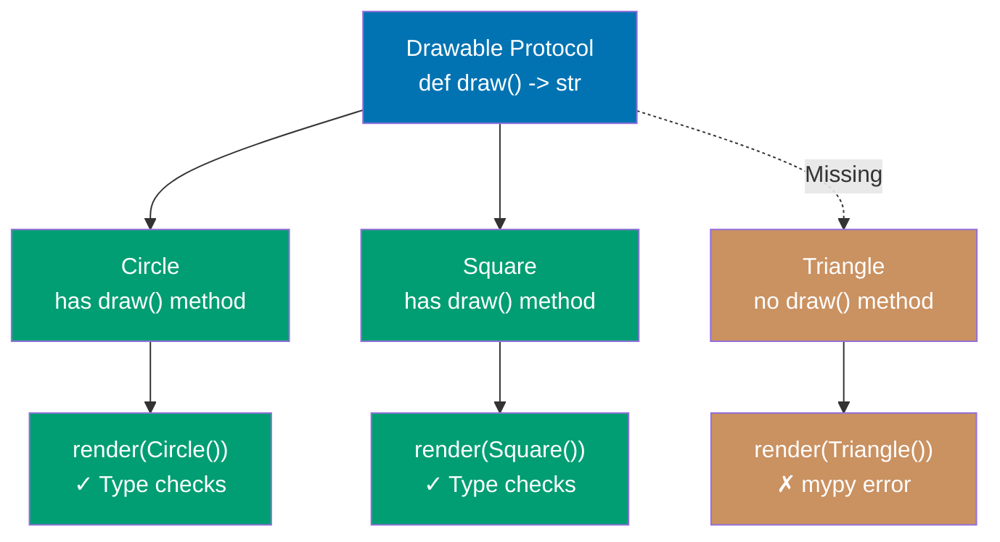

```python
from typing import Protocol

class Drawable(Protocol):
    """Protocol for drawable objects"""
    def draw(self) -> str:
        """Must have draw method returning string"""
        ...                                   # => Protocol methods use ... (ellipsis)
                                               # => No implementation required
                                               # => Defines interface contract

class Circle:
    """Implicitly implements Drawable (no inheritance needed)"""
    def draw(self) -> str:
        return "Drawing circle"               # => Has draw() -> str signature
                                               # => Matches Drawable protocol
                                               # => No explicit inheritance required

class Square:
    """Another class matching Drawable protocol"""
    def draw(self) -> str:
        return "Drawing square"               # => Also has draw() -> str
                                               # => Implicitly implements Drawable
                                               # => Structural typing (duck typing)

def render(obj: Drawable) -> None:
    """Accepts any object with draw() method"""
    # => Type checker verifies obj has draw() -> str
    # => No runtime check (duck typing at runtime)
    print(obj.draw())                         # => Calls draw() method
                                               # => Structural typing enables this

render(Circle())                              # => Creates Circle instance
                                               # => mypy: ✓ Circle has draw() -> str
                                               # => Output: Drawing circle
render(Square())                              # => Creates Square instance
                                               # => mypy: ✓ Square has draw() -> str
                                               # => Output: Drawing square

# class Triangle:                             # => Class without draw() method
#     pass
# render(Triangle())                          # => mypy error: Triangle has no attribute 'draw'
                                               # => Static type checking catches this
                                               # => Runtime would raise AttributeError
```

**Key Takeaway**: Protocols enable interface typing without inheritance using structural subtyping.

**Why It Matters**: Protocols enable structural subtyping (duck typing with type hints) that catches type errors statically without requiring inheritance, improving flexibility in API design. The pattern is essential for defining interfaces in libraries where you can't control client code inheritance. Understanding protocols is critical for modern Python type hinting, especially for framework APIs that need flexibility without sacrificing type safety.

## Example 63: Generic Types

Generic types enable type-safe containers and functions for multiple types.

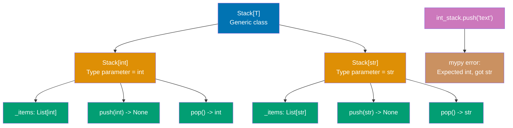

```python
from typing import TypeVar, Generic, List

T = TypeVar('T')                              # => Declare type variable T
                                               # => Placeholder for any type
                                               # => Will be substituted with concrete type

class Stack(Generic[T]):
    """Generic stack for any type T"""
    # => Generic[T] makes this a generic class
    # => T will be bound to specific type at usage

    def __init__(self) -> None:
        self._items: List[T] = []             # => Type-safe list
                                               # => Type checker knows this is List[T]

    def push(self, item: T) -> None:
        """Push item of type T onto stack"""
        self._items.append(item)              # => item must match type T
                                               # => Type checker validates this

    def pop(self) -> T:
        """Pop and return item of type T"""
        return self._items.pop()              # => Return type is T
                                               # => Preserves type information

# Type-specific stacks
int_stack: Stack[int] = Stack()               # => T bound to int
                                               # => Type checker knows _items is List[int]
                                               # => push() expects int, pop() returns int
int_stack.push(1)                             # => mypy: ✓ Argument is int
int_stack.push(2)                             # => mypy: ✓ Argument is int
# int_stack.push("text")                      # => mypy error: Expected int, got str
                                               # => Static type checking prevents this

str_stack: Stack[str] = Stack()               # => T bound to str
                                               # => Separate instance with different type
                                               # => push() expects str, pop() returns str
str_stack.push("hello")                       # => mypy: ✓ Argument is str
result: str = str_stack.pop()                 # => mypy: ✓ Return type is str
                                               # => result is "hello"
```

**Key Takeaway**: Generic types enable reusable type-safe containers with type parameter substitution.

**Why It Matters**: Generic types enable writing reusable, type-safe container classes and functions that work with multiple types while preserving type information for static analysis. The pattern is essential for library development where type safety improves user experience through IDE autocomplete and error detection. Mastering generics is critical for building type-safe collections, decorators, and higher-order functions in modern Python.

## Example 64: Profiling with cProfile

Identify performance bottlenecks using cProfile for function-level timing.

```python
import cProfile
import pstats

def fibonacci(n):
    """Inefficient recursive Fibonacci"""
    if n < 2:                                 # => Base case check
                                               # => True for n=0 or n=1
        return n                               # => Returns 0 for n=0, 1 for n=1
                                               # => Stops recursion
    return fibonacci(n-1) + fibonacci(n-2)     # => Two recursive calls per invocation
                                               # => fibonacci(24) calls fibonacci(23) + fibonacci(22)
                                               # => Exponential time: O(2^n)
                                               # => MASSIVE duplicate computation

def calculate_sequence():
    """Calculate multiple Fibonacci numbers"""
    results = [fibonacci(i) for i in range(25)]  # => Calls fibonacci(0), fibonacci(1), ..., fibonacci(24)
                                                  # => fibonacci(24) alone makes ~46,368 recursive calls
                                                  # => Total across all: 150,000+ function calls
    return results                            # => Returns [0, 1, 1, 2, 3, 5, 8, ...]
                                               # => List of first 25 Fibonacci numbers

# Profile function execution
profiler = cProfile.Profile()                 # => Create profiler object
                                               # => Low-overhead profiler (~5% slowdown)
profiler.enable()                             # => Start profiling
                                               # => Records all function calls from this point
                                               # => Tracks: function name, call count, time spent
result = calculate_sequence()                 # => Execute code to profile
                                               # => Profiler tracks EVERY fibonacci() call
                                               # => ~150,000 calls recorded
profiler.disable()                            # => Stop profiling
                                               # => Stops recording function calls
                                               # => All data stored in profiler object

# Analyze and print statistics
stats = pstats.Stats(profiler)                # => Create statistics object from profiler
                                               # => Provides sorting and formatting
stats.sort_stats('cumulative')                # => Sort by cumulative time
                                               # => Cumulative: total time including subcalls
                                               # => Shows functions with most total time first
stats.print_stats(10)                         # => Print top 10 slowest functions
                                               # => Output table with columns:
                                               # => ncalls, tottime, percall, cumtime, percall, filename:lineno(function)

# Example output interpretation:
# ncalls: 150049                              # => fibonacci() called 150,049 times!
                                               # => Massive number for just 25 calls
# tottime: 0.05s                              # => Time in fibonacci() itself (excluding subcalls)
                                               # => Only the arithmetic and comparisons
# cumtime: 0.05s                              # => Total time including ALL recursive subcalls
                                               # => Nearly identical to tottime (lightweight function)
# filename:lineno(function)                   # => Source file location

# Performance bottleneck identified:
# => fibonacci() dominates execution with 150K+ calls
# => Exponential time complexity O(2^n)
# => Solutions:
#    1. Memoization: Cache results (DP)
#    2. Iterative approach: O(n) time
#    3. Matrix exponentiation: O(log n)
```

**Key Takeaway**: cProfile reveals performance hotspots showing call counts and time per function.

**Why It Matters**: Profiling identifies performance bottlenecks through measurement rather than intuition, preventing premature optimization and guiding optimization efforts to code that matters. The cProfile module provides low-overhead profiling suitable for production systems to diagnose performance issues in real workloads. Understanding profiling is essential for optimization work where data-driven decisions prevent wasted effort on code that doesn't impact performance.

## Example 65: Memory Profiling

Track memory usage with memory_profiler to identify memory leaks.

```python
from memory_profiler import profile

@profile                                      # => Decorator instruments function for memory profiling
                                               # => Tracks line-by-line memory usage
                                               # => Adds ~2x slowdown during profiling
def process_large_data():
    """Function that uses memory"""
    data = [i ** 2 for i in range(1000000)]  # => Create list of 1 million integers
                                               # => Computes [0, 1, 4, 9, 16, ...]
                                               # => Each int ~28 bytes in Python
                                               # => Total: ~38 MiB for data
    filtered = [x for x in data if x % 2 == 0]  # => Filter even numbers only
                                               # => Creates SECOND list (not in-place)
                                               # => ~500,000 even numbers
                                               # => Additional ~37.7 MiB allocated
    result = sum(filtered)                    # => Sum all filtered values
                                               # => Single integer result
                                               # => No additional memory allocation
    return result                             # => Returns integer sum
                                               # => Lists remain in memory until GC

# Run function with memory profiling
# result = process_large_data()               # => Execute with @profile decorator active
                                               # => Prints line-by-line memory report

# Example output interpretation:
# Line    Mem usage    Increment   Line Contents
# ====    =========    =========   =============
#     3     50.5 MiB     50.5 MiB   data = [...]          # => Initial allocation (38 MiB data + overhead)
                                                            # => Memory usage jumps significantly
#     4     88.2 MiB     37.7 MiB   filtered = [...]      # => Second large allocation
                                                            # => Additional 37.7 MiB for filtered list
                                                            # => Total: 88.2 MiB (both lists in memory)
#     5     88.2 MiB      0.0 MiB   result = sum(...)     # => No new allocation
                                                            # => Just iterates and sums (O(1) space)

# Memory optimization insights:
# => Two large lists exist simultaneously (88 MiB total)
# => Could use generator expressions for streaming: (x for x in ... if x % 2 == 0)
# => Generator would reduce peak memory to ~50 MiB (only data list needed)
# => Trade-off: streaming uses less memory but may be slower
```

**Key Takeaway**: memory_profiler shows line-by-line memory usage revealing allocation hotspots.

**Why It Matters**: Memory profiling identifies memory leaks and allocation hotspots that cause production systems to crash or experience degraded performance over time. The line-by-line output pinpoints exactly where memory is allocated, enabling targeted optimization. Mastering memory profiling is critical for long-running applications and systems processing large datasets where memory efficiency impacts scalability.

## Example 66: Threading for I/O-Bound Tasks

Use threading for I/O-bound operations bypassing GIL limitations.

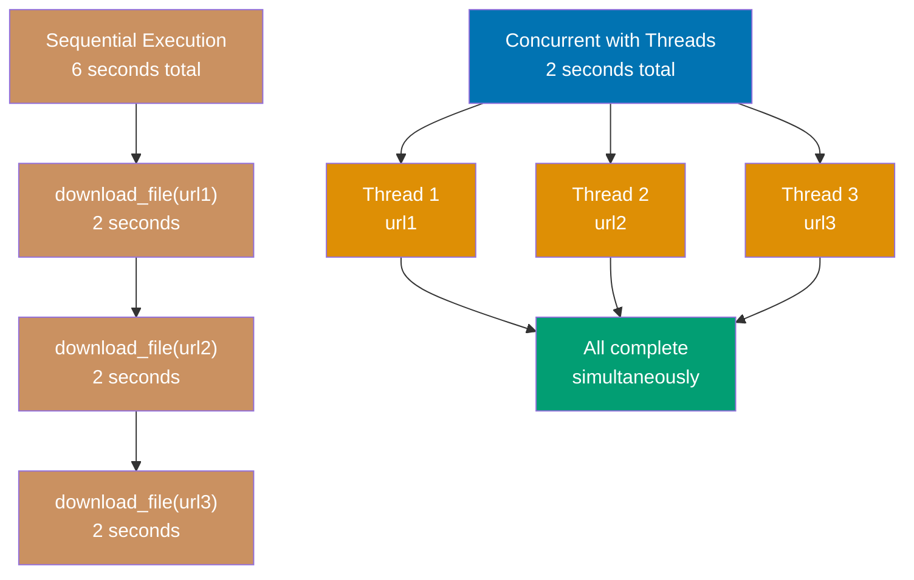

```python
import threading
import time

def download_file(url):
    """Simulated file download"""
    print(f"Downloading {url}...")            # => Output: Downloading url1...
    time.sleep(2)                             # => Simulated I/O wait (network, disk)
                                               # => I/O operations RELEASE GIL
                                               # => Other threads can run during sleep
    print(f"Completed {url}")                 # => Output: Completed url1

# Sequential (slow): 6 seconds total
# for url in ['url1', 'url2', 'url3']:       # => Execute one after another
#     download_file(url)                      # => url1 (2s) → url2 (2s) → url3 (2s)
                                               # => Total: 6 seconds

# Concurrent with threads (fast): 2 seconds total
threads = []                                  # => List to track threads
for url in ['url1', 'url2', 'url3']:
    thread = threading.Thread(target=download_file, args=(url,))  # => Create thread
                                               # => target: function to run
                                               # => args: tuple of function arguments
    thread.start()                            # => Start thread immediately
                                               # => All 3 threads run concurrently
                                               # => Each calls download_file() in parallel
    threads.append(thread)                    # => Add to list for tracking

# Wait for all threads to complete
for thread in threads:
    thread.join()                             # => Wait for this thread to finish
                                               # => Blocks until thread completes
                                               # => Ensures all downloads complete

print("All downloads complete")               # => Output: All downloads complete
                                               # => Total elapsed: ~2 seconds (not 6)
                                               # => 3x speedup from concurrent I/O
```

**Key Takeaway**: Threading improves I/O-bound performance as I/O operations release the GIL.

**Why It Matters**: Threading improves I/O-bound performance by utilizing CPU time during I/O waits, as I/O operations release the GIL enabling true concurrency for network and disk operations. The pattern is simpler than asyncio for integrating with synchronous I/O libraries that lack async support. However, threading provides no parallelism for CPU-bound tasks due to the GIL, making it unsuitable for computational workloads.

## Example 67: ThreadPoolExecutor

ThreadPoolExecutor simplifies thread management with automatic pooling.

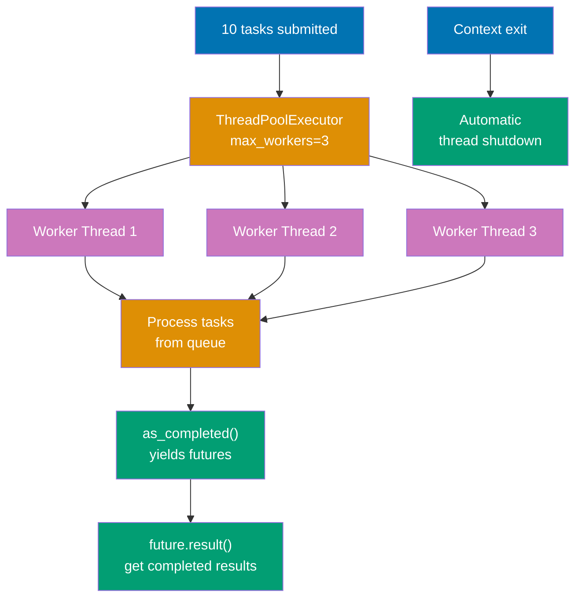

```python
from concurrent.futures import ThreadPoolExecutor, as_completed
import time

def process_task(task_id):
    """Process single task"""
    time.sleep(1)                             # => Simulate I/O work
    return f"Task {task_id} completed"        # => Return result string

# Thread pool with max 3 worker threads
with ThreadPoolExecutor(max_workers=3) as executor:
    # => Creates thread pool with 3 worker threads
    # => Threads are reused for multiple tasks
    # => Context manager ensures cleanup

    # Submit tasks
    futures = [executor.submit(process_task, i) for i in range(10)]
    # => Submits 10 tasks to thread pool
    # => Returns list of Future objects
    # => Tasks queued and distributed to 3 workers
    # => First 3 tasks start immediately
    # => Remaining 7 tasks wait in queue

    # Process as completed (not in submission order)
    for future in as_completed(futures):      # => Yields futures as they complete
                                               # => NOT in submission order
                                               # => Returns first completed task first
        result = future.result()              # => Get result from completed task
                                               # => Blocks if future not done yet
                                               # => Returns "Task X completed"
        print(result)                         # => Output: Task X completed
                                               # => Order varies (depends on completion)

# Context manager exit here
# => Calls executor.shutdown(wait=True)
# => Waits for all tasks to complete
# => Cleans up threads automatically
# => All 10 tasks complete in ~4 seconds (10 tasks / 3 workers ≈ 3.33 seconds)
```

**Key Takeaway**: ThreadPoolExecutor manages thread lifecycle with automatic pooling and cleanup.

**Why It Matters**: ThreadPoolExecutor simplifies thread management with automatic pooling and cleanup, preventing thread leaks and resource exhaustion from manual thread creation. The Future-based API enables flexible result collection with as_completed() and exception handling. Understanding executor patterns is essential for production I/O-bound applications where manual thread management is error-prone.

## Example 68: Multiprocessing for CPU-Bound Tasks

Use multiprocessing for CPU-bound tasks to bypass GIL with separate processes.

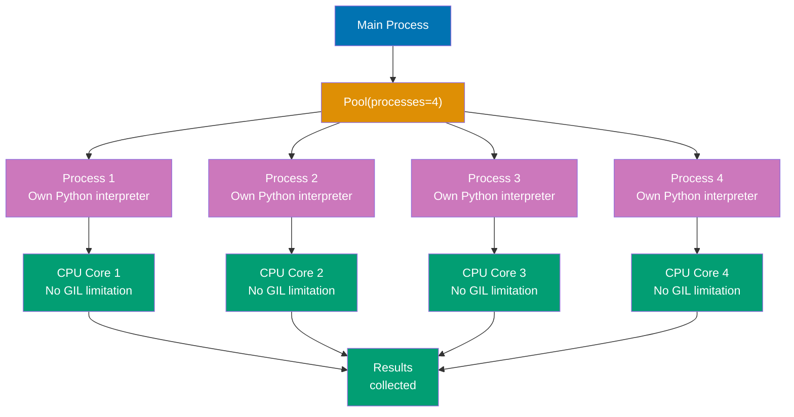

```python
from multiprocessing import Pool
import time

def cpu_intensive_task(n):
    """CPU-bound computation"""
    total = 0                                 # => Initialize accumulator to 0
                                               # => Will store sum of squares
    for i in range(n):                        # => Loop 10 million times (n=10,000,000)
                                               # => Pure CPU computation (no I/O waits)
        total += i ** 2                       # => Compute square: i * i
                                               # => Add to accumulator
                                               # => CPU-bound: GIL blocks parallel execution in threads
    return total                              # => Return computed sum
                                               # => Result: sum(i^2 for i in 0..9999999)
                                               # => = 333,333,283,333,335,000

if __name__ == '__main__':                    # => Guard required for multiprocessing
                                               # => Prevents recursive process spawning on Windows
                                               # => Entry point protection
    # Sequential (slow) - single core utilization
    # results = [cpu_intensive_task(10**7) for _ in range(4)]
    # => Calls cpu_intensive_task() 4 times sequentially
    # => GIL blocks parallel execution (one task at a time)
    # => Only 1 CPU core used (other cores idle)
    # => Total time: ~4x single task time (e.g., 8 seconds)

    # Parallel with process pool (fast) - multi-core utilization
    with Pool(processes=4) as pool:           # => Create process pool with 4 workers
                                               # => Spawns 4 separate Python processes
                                               # => Each process: own Python interpreter + own GIL
                                               # => NO GIL contention (separate interpreters!)
                                               # => Context manager handles pool.close() + pool.join()
        results = pool.map(cpu_intensive_task, [10**7] * 4)
        # => pool.map(func, iterable) distributes work
        # => Argument list: [10000000, 10000000, 10000000, 10000000]
        # => Process 1: cpu_intensive_task(10**7) on CPU core 1
        # => Process 2: cpu_intensive_task(10**7) on CPU core 2
        # => Process 3: cpu_intensive_task(10**7) on CPU core 3
        # => Process 4: cpu_intensive_task(10**7) on CPU core 4
        # => TRUE parallel execution (all cores running simultaneously)
        # => Results serialized and returned as list
        # => Total time: ~1x single task time (4x speedup on 4-core CPU)

    print(f"Results: {results}")              # => Output: [333333283333335000, 333333283333335000, 333333283333335000, 333333283333335000]
                                               # => All 4 processes computed same sum
                                               # => List preserves order from input iterable

# Multiprocessing overhead considerations:
# => Process creation: ~100ms startup cost per process
# => Inter-process communication: pickling/unpickling results
# => Memory: each process has own memory space (no shared state)
# => Only worth it for CPU-bound tasks taking >100ms
```

**Key Takeaway**: Multiprocessing achieves true parallelism for CPU-bound tasks using separate processes.

**Why It Matters**: Multiprocessing bypasses the GIL by using separate Python interpreters in different processes, achieving true parallelism for CPU-bound tasks on multi-core systems. The pattern is essential for computational workloads like data processing and scientific computing where the GIL severely limits performance. However, the process creation overhead and inter-process communication costs make multiprocessing unsuitable for I/O-bound or fine-grained parallel tasks.

## Example 69: Weak References

Weak references allow object references without preventing garbage collection.

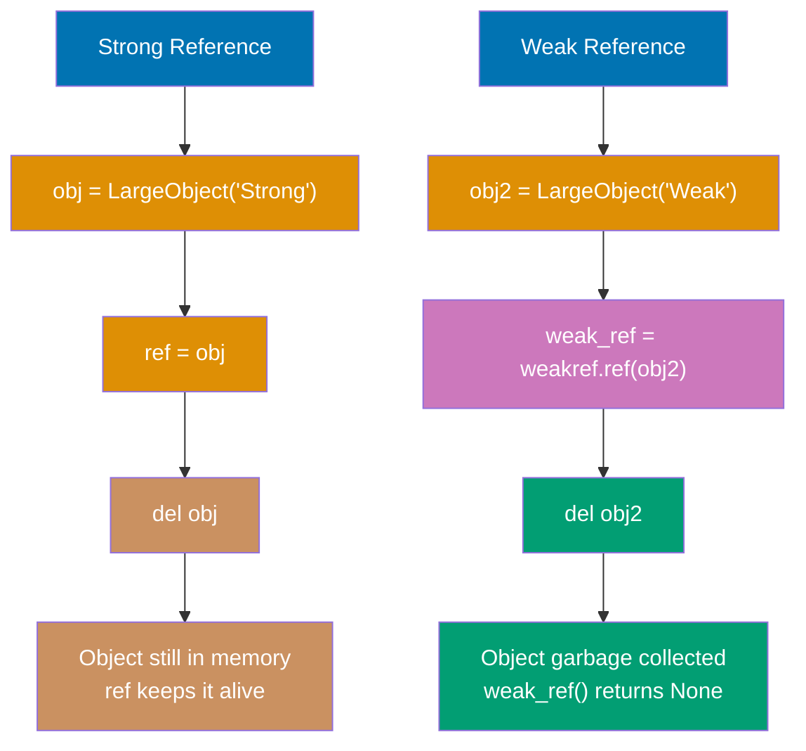

```python
import weakref

class LargeObject:
    """Object with lifecycle logging"""
    def __init__(self, name):
        self.name = name                      # => Store name
        print(f"Created {name}")              # => Output: Created [name]

    def __del__(self):
        """Destructor called during garbage collection"""
        print(f"Deleted {self.name}")         # => Called when GC collects object
                                               # => Output: Deleted [name]

# Strong reference (prevents GC)
obj = LargeObject("Strong")                   # => Output: Created Strong
                                               # => obj reference count = 1
ref = obj                                     # => Another strong reference
                                               # => obj reference count = 2
del obj                                       # => Reference count = 1 (still in memory)
                                               # => No deletion output (ref still holds it)

# Weak reference (allows GC)
obj2 = LargeObject("Weak")                    # => Output: Created Weak
                                               # => obj2 reference count = 1
weak_ref = weakref.ref(obj2)                  # => Create weak reference
                                               # => Does NOT increase reference count
print(weak_ref())                             # => Output: <LargeObject object at 0x...>
                                               # => Object still alive
del obj2                                      # => Reference count = 0
                                               # => Output: Deleted Weak (GC immediately collects)
print(weak_ref())                             # => Output: None
                                               # => Weak reference now dead (returns None)
```

**Key Takeaway**: Weak references enable caches and observers without preventing object cleanup.

**Why It Matters**: Weak references enable cache implementations and observer patterns that don't prevent garbage collection, avoiding memory leaks from circular references or retained observers. The pattern is essential for frameworks and libraries where automatic cleanup prevents resource exhaustion as objects are no longer needed. Understanding weak references is critical for advanced memory management in long-running applications.

## Example 70: Context Variables for Async Context

ContextVar provides task-local storage for asyncio applications.

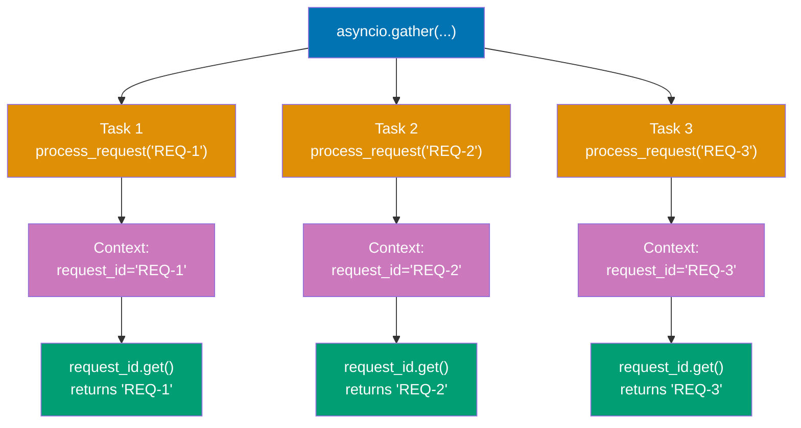

```python
import asyncio
from contextvars import ContextVar

# Global context variable
request_id: ContextVar[str] = ContextVar('request_id', default='none')
# => Declare module-level context variable
# => Type: ContextVar[str]
# => Default value: 'none' (if not set)

async def process_request(req_id):
    """Process request with context"""
    request_id.set(req_id)                    # => Set value for THIS task's context
                                               # => Isolated from other tasks
                                               # => Like thread-local but for async
    await asyncio.sleep(0.1)                  # => Simulate async work
                                               # => Context preserved across await
    current_id = request_id.get()             # => Get from THIS task's context
                                               # => Returns value set above
    print(f"Processing request: {current_id}")  # => Output: Processing request: REQ-1
                                                 # => Each task prints its own ID

async def main():
    # Run concurrent tasks (each has own context)
    await asyncio.gather(
        process_request("REQ-1"),             # => Task 1 context: request_id = "REQ-1"
                                               # => Runs concurrently
        process_request("REQ-2"),             # => Task 2 context: request_id = "REQ-2"
                                               # => Isolated from Task 1
        process_request("REQ-3")              # => Task 3 context: request_id = "REQ-3"
                                               # => Isolated from Tasks 1 and 2
    )
    # => Each task maintains separate context value
    # => No interference between tasks
    # => Like thread-local storage but for async tasks

asyncio.run(main())                           # => Run event loop
                                               # => Output (order may vary):
                                               # => Processing request: REQ-1
                                               # => Processing request: REQ-2
                                               # => Processing request: REQ-3
```

**Key Takeaway**: ContextVar provides task-local storage preserving isolation across concurrent async tasks.

**Why It Matters**: ContextVar provides task-local storage for asyncio applications, preserving isolation across concurrent tasks similar to thread-local storage but compatible with cooperative multitasking. The pattern is essential for request context in web frameworks where multiple requests are handled concurrently on the same thread. Mastering ContextVar is critical for building production asyncio applications that need per-request state like authentication tokens and request IDs.

## Example 71: Advanced Decorators - Class Decorators

Class decorators modify classes enabling functionality injection.

```python
def singleton(cls):
    """Decorator that makes class a singleton"""
    instances = {}                                # => Cache for singleton instances
                                                   # => Outer scope, preserved across calls

    def get_instance(*args, **kwargs):
        """Wrapper that returns cached instance"""
        if cls not in instances:              # => First call for this class
            instances[cls] = cls(*args, **kwargs)  # => Create instance once
                                                   # => Call original __init__
                                                   # => Store in cache
        return instances[cls]                      # => Return cached instance
                                                   # => Same object every time

    return get_instance                            # => Replace class with wrapper function

@singleton                                         # => Database = singleton(Database)
class Database:
    """Singleton database connection"""
    def __init__(self):
        print("Connecting to database...")    # => Output on first instantiation only
                                               # => Called only once

db1 = Database()                              # => First call
                                               # => instances is empty
                                               # => Calls Database.__init__()
                                               # => Output: Connecting to database...
                                               # => Stores in instances[Database]
db2 = Database()                              # => Second call
                                               # => instances[Database] exists
                                               # => No __init__ call
                                               # => Returns cached instance
print(db1 is db2)                             # => Compare object identity
                                               # => Output: True (exact same object)
print(id(db1) == id(db2))                     # => Same memory address
                                               # => Output: True
```

**Key Takeaway**: Class decorators enable class-level modifications like singleton pattern implementation.

**Why It Matters**: Class decorators enable modifying classes after definition for patterns like singletons, registration, and automatic attribute addition, providing an alternative to metaclasses with simpler syntax. The pattern is cleaner than metaclasses for many use cases while maintaining the same power. Understanding class decorators is essential for framework development and design pattern implementation in Python.

## Example 72: Introspection with inspect

Inspect module provides runtime code introspection capabilities.

```python
import inspect

def greet(name: str, greeting: str = "Hello") -> str:
    """Greet someone"""
    return f"{greeting}, {name}!"             # => Simple greeting function
                                               # => Type hints: name (str), greeting (str), return (str)

# Function signature introspection
sig = inspect.signature(greet)                # => Get Signature object
                                               # => Contains all parameter metadata
print(sig)                                    # => Output: (name: str, greeting: str = 'Hello') -> str
                                               # => Full signature with annotations and defaults

# Parameter details (iterate parameters)
for param_name, param in sig.parameters.items():  # => OrderedDict of parameters
                                               # => param_name: str ('name', 'greeting')
                                               # => param: Parameter object with metadata
    print(f"{param_name}: {param.annotation}, default={param.default}")
    # => Parameter 1: name
    #    annotation: <class 'str'> (type hint)
    #    default: <class 'inspect._empty'> (no default value)
    # => Output: name: <class 'str'>, default=<class 'inspect._empty'>
    # => Parameter 2: greeting
    #    annotation: <class 'str'> (type hint)
    #    default: 'Hello' (has default)
    # => Output: greeting: <class 'str'>, default=Hello

# Return annotation
print(sig.return_annotation)                  # => Output: <class 'str'>
                                               # => Return type hint from -> str

# Source code introspection
source = inspect.getsource(greet)             # => Get full source code as string
                                               # => Reads from module's .py file
print(source)                                 # => Output: def greet(name: str, greeting: str = "Hello") -> str:\n    """Greet someone"""\n    return f"{greeting}, {name}!"
                                               # => Complete function definition
                                               # => Useful for documentation generation

# Module and file location
print(inspect.getmodule(greet))               # => Output: <module '__main__' from '...'>
                                               # => Module where function defined
print(inspect.getfile(greet))                 # => Output: /path/to/file.py
                                               # => File path where function defined

# Call stack introspection
def outer():
    """Outer function"""
    def inner():
        """Inner function"""
        frame = inspect.currentframe()        # => Get current stack frame
                                               # => FrameType object (snapshot of execution)
        info = inspect.getframeinfo(frame)    # => Get FrameInfo (file, line, function)
        print(f"Function: {info.function}")   # => Output: Function: inner
                                               # => Current function name
        print(f"Line: {info.lineno}")         # => Output: Line: [line number]
                                               # => Current line number in source
        print(f"File: {info.filename}")       # => Output: File: /path/to/file.py
                                               # => Source file path
    inner()                                   # => Call inner to demonstrate

outer()                                       # => Execute outer → inner → introspection
                                               # => Stack: outer() → inner() → currentframe()

# Practical use cases:
# => Automatic API documentation generation (Sphinx, pdoc)
# => Validation frameworks (check parameter types at runtime)
# => Debugging tools (inspect call stack during errors)
# => Metaprogramming (generate code based on function signatures)
```

**Key Takeaway**: inspect enables runtime exploration of functions, classes, and call stack for metaprogramming.

**Why It Matters**: The inspect module enables runtime code introspection for metaprogramming, documentation generation, and debugging tools that need to examine function signatures and source code. The capabilities are essential for building frameworks that generate code, validate inputs, or provide interactive exploration. However, introspection should be used judiciously as it can make code harder to understand and breaks with compiled/obfuscated code.

## Example 73: Dynamic Code Execution

Execute Python code dynamically using eval, exec, and compile.

```python
# eval: Evaluate single expression (returns value)
expr = "2 + 3 * 4"                            # => String containing Python expression
                                               # => Must be single expression (no statements)
result = eval(expr)                           # => Parse string to AST
                                               # => Evaluate expression
                                               # => Follows operator precedence (* before +)
                                               # => result = 14 (3*4=12, 2+12=14)
print(result)                                 # => Output: 14

# eval with namespace (variable access)
eval_result = eval("x * 2", {'x': 10})        # => Namespace dict provides 'x' variable
                                               # => x * 2 → 10 * 2 = 20
                                               # => eval_result = 20

# exec: Execute statements (no return value, modifies namespace)
code = """
def dynamic_function(x):
    return x ** 2

result = dynamic_function(5)
"""                                           # => Multi-line code string
                                               # => Can contain statements (def, if, for, etc.)
                                               # => NOT limited to single expression
namespace = {}                                # => Empty dict for isolated namespace
                                               # => Prevents pollution of global namespace
exec(code, namespace)                         # => Execute code in namespace dict
                                               # => Parses and runs all statements
                                               # => Creates 'dynamic_function' key in namespace
                                               # => Creates 'result' key in namespace
print(namespace['result'])                    # => Access 'result' variable from namespace
                                               # => Output: 25 (5**2 = 25)
print(namespace['dynamic_function'](10))      # => Access function from namespace
                                               # => Output: 100 (10**2)

# compile: Compile code to bytecode (performance optimization)
compiled = compile("x + y", "<string>", "eval")  # => Compile to code object
                                               # => Source: "x + y" expression
                                               # => Filename: "<string>" (placeholder)
                                               # => Mode: "eval" for expressions
                                               # => Returns code object (bytecode)
result = eval(compiled, {'x': 10, 'y': 5})    # => Evaluate compiled bytecode
                                               # => Namespace: {'x': 10, 'y': 5}
                                               # => result = 15 (10 + 5)
                                               # => Faster if reused multiple times (no re-parsing)

# compile modes: "eval" (expression), "exec" (statements), "single" (interactive)
compiled_exec = compile("print('Hello')", "<string>", "exec")
                                               # => Mode: "exec" for statements
exec(compiled_exec)                           # => Output: Hello

# CRITICAL SECURITY WARNING: Never eval/exec untrusted input!
# user_input = "os.system('rm -rf /')"       # => Malicious code injection
# eval(user_input)                            # => DANGEROUS! Executes arbitrary code
                                               # => Can delete files, steal data, install malware
                                               # => NEVER run untrusted eval/exec

# Safe alternative: ast.literal_eval (only for literals)
import ast
safe_dict = ast.literal_eval("{'a': 1, 'b': 2}")  # => Parses Python literals only
                                               # => safe_dict = {'a': 1, 'b': 2}
                                               # => Supports: strings, bytes, numbers, tuples, lists, dicts, sets, booleans, None
                                               # => NO code execution allowed
safe_list = ast.literal_eval("[1, 2, 3]")    # => Output: [1, 2, 3]
# ast.literal_eval("os.system('rm -rf /')")   # => ValueError: malformed node or string
                                               # => Safe rejection of code
                                               # => Use for parsing JSON-like config data
```

**Key Takeaway**: eval/exec enable dynamic code execution but require careful security considerations.

**Why It Matters**: Dynamic code execution with eval/exec enables runtime code generation and scripting capabilities, but introduces severe security risks if used with untrusted input. The compile() function enables reusing compiled code for performance when executing the same code repeatedly. These tools should be avoided in production unless absolutely necessary, and ast.literal_eval provides safe literal evaluation when dynamic data parsing is needed.

## Example 74: AST Module for Code Analysis

Abstract Syntax Tree module parses Python code for analysis and transformation.

```python
import ast

code = """
def add(a, b):
    return a + b

result = add(2, 3)
"""                                           # => Python source code as string
                                               # => Contains function definition + function call

# Parse code into AST (Abstract Syntax Tree)
tree = ast.parse(code)                        # => Parse source to AST
                                               # => Returns Module node (root of tree)
                                               # => Tree structure: Module → [FunctionDef, Assign]
                                               # => Does NOT execute code (only parses syntax)
print(type(tree))                             # => Output: <class '_ast.Module'>
                                               # => Root node type

# Walk AST nodes (breadth-first traversal)
for node in ast.walk(tree):                   # => Iterate ALL nodes recursively
                                               # => Visits: Module, FunctionDef, arguments, Return, BinOp, Assign, Call, etc.
    if isinstance(node, ast.FunctionDef):     # => Check if node is function definition
        print(f"Function: {node.name}")       # => Access function name attribute
                                               # => Output: Function: add
        print(f"  Arguments: {[arg.arg for arg in node.args.args]}")
                                               # => Output:   Arguments: ['a', 'b']
                                               # => Extract parameter names
    elif isinstance(node, ast.Return):        # => Check if node is return statement
        print("Found return statement")       # => Output: Found return statement
                                               # => Located return node in AST
    elif isinstance(node, ast.BinOp):         # => Binary operation (+ - * / etc.)
        print(f"Binary operation: {type(node.op).__name__}")
                                               # => Output: Binary operation: Add
                                               # => Identifies 'a + b' as Add operation

# Access specific node attributes
func_def = tree.body[0]                       # => Get first statement (FunctionDef)
                                               # => tree.body is list of top-level statements
print(f"Function defined at line: {func_def.lineno}")
                                               # => Output: Function defined at line: 2
                                               # => Line number in source code

# Compile AST to bytecode (safe transformation)
compiled = compile(tree, "<string>", "exec")  # => Compile AST to bytecode
                                               # => tree: AST object (NOT string)
                                               # => filename: "<string>" (placeholder)
                                               # => mode: "exec" for statements
                                               # => Returns code object
namespace = {}                                # => Empty namespace for execution
exec(compiled, namespace)                     # => Execute bytecode in namespace
                                               # => Defines 'add' function
                                               # => Executes 'result = add(2, 3)'
                                               # => Stores result = 5 in namespace
print(namespace['result'])                    # => Access 'result' variable
                                               # => Output: 5 (2 + 3)

# AST transformation example (code modification)
class DoubleNumbers(ast.NodeTransformer):
    """AST transformer that doubles numeric literals"""
    def visit_Num(self, node):
        """Visit Num nodes and double their value"""
        node.n *= 2                           # => Double the numeric value
                                               # => Modifies AST in place
        return node                            # => Return modified node

tree2 = ast.parse("x = 10 + 5")               # => Parse source code
DoubleNumbers().visit(tree2)                  # => Transform AST (10→20, 5→10)
                                               # => Modified tree: x = 20 + 10
ast.fix_missing_locations(tree2)              # => Fix line numbers after transformation
                                               # => Required for compilation
compiled2 = compile(tree2, "<string>", "exec")
namespace2 = {}
exec(compiled2, namespace2)                   # => Execute transformed code
print(namespace2['x'])                        # => Output: 30 (20 + 10, not 15)
                                               # => Demonstrates AST transformation power

# Practical use cases:
# => Linters: Analyze code structure without execution (pylint, flake8)
# => Formatters: Parse → Transform → Regenerate (black, autopep8)
# => Code generators: Programmatically create Python code
# => Static analysis: Find bugs, security issues, type errors
# => Safer than exec: Can inspect/modify before execution
```

**Key Takeaway**: AST module enables safe code parsing and transformation without executing untrusted code.

**Why It Matters**: The AST module enables parsing and transforming Python code without executing it, providing safe code analysis for tools like linters, formatters, and code generators. The approach is safer than exec for code manipulation and enables building developer tools that understand Python syntax. Mastering AST is essential for tool development, custom linters, and code transformation utilities.

## Example 75: Packaging with pyproject.toml

Modern Python packaging uses pyproject.toml with setuptools or poetry.

```toml
# pyproject.toml
[build-system]
# => Build system metadata
requires = ["setuptools>=45", "wheel"]        # => Required build tools
build-backend = "setuptools.build_meta"       # => Build backend implementation

[project]
# => Project metadata section
name = "mypackage"                            # => Package name on PyPI
version = "0.1.0"                             # => Semantic version
description = "My awesome package"            # => Short description
authors = [{name = "Your Name", email = "you@example.com"}]  # => Author info
dependencies = [
    "requests>=2.28.0",                       # => Required runtime dependency
    "numpy>=1.24.0"                           # => Another runtime dependency
]

[project.optional-dependencies]
# => Optional dependency groups
dev = ["pytest>=7.0", "black>=22.0"]          # => Development dependencies

[project.scripts]
# => CLI entry points (creates executable commands)
mytool = "mypackage.cli:main"                 # => mytool command → mypackage.cli.main()
```

```python
# Build distribution
# python -m build                             # => Creates dist/mypackage-0.1.0.tar.gz (source)
                                               # => Creates dist/mypackage-0.1.0-py3-none-any.whl (wheel)

# Install in development mode
# pip install -e .                            # => Editable install (changes reflect immediately)
                                               # => Links to source directory

# Install with optional dependencies
# pip install -e ".[dev]"                     # => Install with dev dependencies

# Publish to PyPI
# twine upload dist/*                         # => Upload both .tar.gz and .whl to PyPI
                                               # => Requires PyPI account and token
```

**Key Takeaway**: pyproject.toml provides standardized packaging configuration for modern Python projects.

**Why It Matters**: Modern Python packaging with pyproject.toml standardizes build configuration across tools, replacing legacy setup.py with declarative metadata that supports multiple build backends. The standardization improves reproducibility and enables better tooling for dependency management and distribution. Understanding modern packaging is essential for library development and ensuring code can be easily installed and distributed through PyPI.

## Example 76: Advanced pytest - Mocking

Mock external dependencies for isolated unit testing.

```python
from unittest.mock import Mock, patch
import requests

def fetch_user_data(user_id):
    """Fetch user data from API"""
    response = requests.get(f"https://api.example.com/users/{user_id}")
    # => Makes HTTP request (slow, requires network)
    return response.json()                    # => Parse JSON response

# Test with mock
def test_fetch_user_data():
    """Test without actual HTTP request"""
    with patch('requests.get') as mock_get:   # => Replace requests.get with mock
                                               # => Only within this block
        # Configure mock behavior
        mock_get.return_value.json.return_value = {'id': 1, 'name': 'Alice'}
        # => When mock_get().json() called
        # => Returns configured dict
        # => No actual HTTP request

        # Call function (uses mock instead of real requests.get)
        result = fetch_user_data(1)           # => Calls mocked requests.get
                                               # => Returns mock response
                                               # => result = {'id': 1, 'name': 'Alice'}

        # Assertions
        assert result == {'id': 1, 'name': 'Alice'}  # => Verify return value
        mock_get.assert_called_once_with("https://api.example.com/users/1")
        # => Verify requests.get called exactly once
        # => Verify correct URL used

# Mock object (manual mock creation)
mock_db = Mock()                              # => Create mock object
                                               # => Auto-creates attributes on access
mock_db.query.return_value = [{'id': 1}]      # => Configure return value
                                               # => mock_db.query() will return this
result = mock_db.query("SELECT * FROM users") # => Call mocked method
                                               # => result = [{'id': 1}]
mock_db.query.assert_called_with("SELECT * FROM users")  # => Verify call arguments
                                               # => Ensures query called correctly
```

**Key Takeaway**: Mocking isolates tests from external dependencies with configurable return values and call verification.

**Why It Matters**: Mocking isolates unit tests from external dependencies like databases and APIs, enabling fast, reliable tests that don't require infrastructure. The patch decorator and return_value configuration enable complete control over dependency behavior for testing edge cases. Mastering mocking is essential for professional testing where isolated unit tests provide fast feedback without flaky failures from external services.

## Example 77: pytest Markers for Test Organization

Markers tag tests for selective execution and categorization.

```python
import pytest

@pytest.mark.slow                             # => Mark test as 'slow'
                                               # => Decorator applies metadata
def test_long_running_operation():
    """Test marked as slow"""
    import time
    time.sleep(2)                             # => 2 second delay
    assert True                               # => Always passes

@pytest.mark.unit                             # => Mark test as 'unit'
def test_fast_unit():
    """Unit test (fast)"""
    assert 1 + 1 == 2                         # => Fast test (~milliseconds)

@pytest.mark.integration                      # => Mark test as 'integration'
@pytest.mark.slow                             # => Multiple markers allowed
                                               # => Has BOTH 'integration' AND 'slow'
def test_database_integration():
    """Integration test (slow)"""
    assert True                               # => Marked for selective execution

# Run only specific markers:
# pytest -m unit                              # => Run only tests with 'unit' marker
                                               # => Skips slow and integration tests
# pytest -m "not slow"                        # => Run all tests EXCEPT slow
                                               # => Runs only fast tests
# pytest -m "slow and integration"            # => Run tests with BOTH markers
                                               # => Runs test_database_integration only

# Custom markers in pytest.ini or pyproject.toml:
# [tool:pytest]
# markers =
#     slow: marks tests as slow (>1 second)
#     unit: marks tests as unit tests
#     integration: marks tests as integration tests
# => Declares markers to avoid warnings
# => Documents marker purpose
```

**Key Takeaway**: Markers enable test categorization and selective execution for faster development workflows.

**Why It Matters**: Pytest markers enable selective test execution for faster development workflows, allowing developers to run only relevant tests during feature development. The categorization (unit, integration, slow) enables different test suites for different contexts like CI/CD, pre-commit, and release validation. Understanding marker-based test organization is critical for scaling test suites as projects grow without sacrificing development velocity.

## Example 78: Singleton Pattern (Pythonic)

Implement singleton using module-level instance or metaclass.

```python
# Approach 1: Module-level instance (simplest, most Pythonic)
# database.py
class _Database:
    """Private database class"""
    def __init__(self):
        self.connection = "DB_CONNECTION"     # => Initialize once on import

database = _Database()                        # => Single instance created on module import
                                               # => Module imported once per Python process
                                               # => Subsequent imports reuse cached module

# Usage: from database import database
# => All imports get same 'database' object
# => Python's module system provides singleton behavior

# Approach 2: __new__ method (explicit singleton)
class Singleton:
    """Singleton using __new__"""
    _instance = None                          # => Class variable (shared)

    def __new__(cls):
        """Control instance creation"""
        if cls._instance is None:             # => First instantiation
            cls._instance = super().__new__(cls)  # => Create instance once
                                               # => Stores in class variable
        return cls._instance                   # => Return cached instance
                                               # => Same object every time

s1 = Singleton()                              # => First call creates instance
s2 = Singleton()                              # => Second call returns cached
print(s1 is s2)                               # => Output: True (same object)

# Approach 3: Metaclass (most flexible)
class SingletonMeta(type):
    """Metaclass implementing singleton pattern"""
    _instances = {}                           # => Cache for all singleton classes

    def __call__(cls, *args, **kwargs):
        """Called when class is instantiated"""
        if cls not in cls._instances:         # => First instantiation
            cls._instances[cls] = super().__call__(*args, **kwargs)
            # => Create instance with __new__ and __init__
            # => Store in metaclass cache
        return cls._instances[cls]             # => Return cached instance

class Logger(metaclass=SingletonMeta):
    """Logger using singleton metaclass"""
    pass                                      # => Singleton behavior from metaclass

log1 = Logger()                               # => Creates instance
log2 = Logger()                               # => Returns cached instance
print(log1 is log2)                           # => Output: True
```

**Key Takeaway**: Python offers multiple singleton implementations; module-level instance is most Pythonic.

**Why It Matters**: Singleton pattern ensures single instance existence for resources like database connections and configuration managers, preventing resource conflicts and inconsistent state. However, singletons can make testing harder and create global state that violates dependency injection principles. The module-level instance approach is most Pythonic and simplest, avoiding metaclass complexity while achieving the same goal.

## Example 79: Observer Pattern

Implement observer pattern for event-driven architectures.

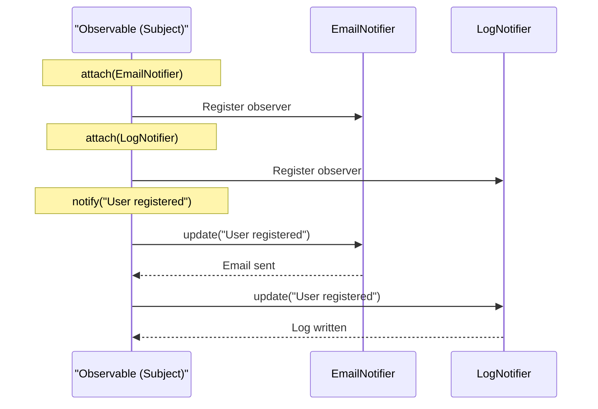

```python
class Observable:
    """Subject that observers watch"""

    def __init__(self):
        self._observers = []                  # => List of registered observers
                                               # => Initially empty

    def attach(self, observer):
        """Add observer to notification list"""
        self._observers.append(observer)      # => Register new observer
                                               # => Observer must have update() method

    def detach(self, observer):
        """Remove observer from notification list"""
        self._observers.remove(observer)      # => Unregister observer
                                               # => No longer receives notifications

    def notify(self, event):
        """Notify all observers of event"""
        for observer in self._observers:      # => Iterate registered observers
            observer.update(event)             # => Call each observer's update()
                                               # => Passes event data

class EmailNotifier:
    """Observer that sends emails"""
    def update(self, event):
        """React to event by sending email"""
        print(f"Email: {event}")              # => Simulated email send
                                               # => Output: Email: User registered

class LogNotifier:
    """Observer that logs events"""
    def update(self, event):
        """React to event by logging"""
        print(f"Log: {event}")                # => Simulated logging
                                               # => Output: Log: User registered

# Usage
subject = Observable()                        # => Create subject
email = EmailNotifier()                       # => Create email observer
logger = LogNotifier()                        # => Create log observer

subject.attach(email)                         # => Register email observer
                                               # => _observers = [EmailNotifier]
subject.attach(logger)                        # => Register log observer
                                               # => _observers = [EmailNotifier, LogNotifier]

subject.notify("User registered")             # => Trigger notification
                                               # => Calls email.update("User registered")
                                               # => Calls logger.update("User registered")
                                               # => Output: Email: User registered
                                               # => Output: Log: User registered
```

**Key Takeaway**: Observer pattern decouples event producers from consumers for flexible event handling.

**Why It Matters**: Observer pattern decouples event producers from consumers, enabling flexible event handling where observers can be added or removed without modifying the subject. The pattern is fundamental to GUI frameworks, event-driven architectures, and plugin systems. Understanding observer pattern is essential for building extensible systems where components react to events without tight coupling.

## Example 80: Best Practices - EAFP and Duck Typing

Embrace Python's EAFP (Easier to Ask Forgiveness than Permission) and duck typing.

```python
# EAFP: Easier to Ask for Forgiveness than Permission
# Pythonic approach: Try operation, catch exceptions
def process_file(filename):
    """EAFP approach (Pythonic)"""
    try:
        with open(filename) as f:             # => Try opening file directly
                                               # => No pre-checks (existence, permissions)
                                               # => Assumes success (optimistic)
            return f.read()                    # => Read entire file contents
                                               # => Return as string
    except FileNotFoundError:                 # => Catch specific exception type
                                               # => Only if file doesn't exist
        return "File not found"                # => Graceful error handling
                                               # => Return error message
    except PermissionError:                   # => Catch permission denied
                                               # => Only if no read access
        return "Permission denied"             # => Return different error message
    except IOError as e:                      # => Catch other I/O errors
                                               # => Disk full, network issues, etc.
        return f"I/O error: {e}"               # => Return detailed error

# LBYL (Look Before You Leap) - less Pythonic, NOT recommended
# import os
# def process_file_lbyl(filename):
#     if os.path.exists(filename):            # => Check 1: File exists?
#         if os.access(filename, os.R_OK):    # => Check 2: Readable?
#             with open(filename) as f:       # => THEN open
#                 return f.read()
# => PROBLEMS:
#    1. Race condition: File deleted BETWEEN check and open (TOCTOU)
#    2. More verbose: 2 checks + 1 operation vs 1 try block
#    3. Duplicates logic: os.path.exists + open both check existence
#    4. Not Pythonic: Defensive programming, not exception handling
# => Use EAFP instead!

# Duck typing: "If it walks like a duck and quacks like a duck, it's a duck"
# Accept any object with required behavior (no type checking)
def print_items(items):
    """Accept any iterable (list, tuple, set, generator, custom class)"""
    for item in items:                        # => Requires __iter__() method only
                                               # => Duck typing: assumes iterable
                                               # => No isinstance() check
                                               # => No type annotation
        print(item)                            # => Output: item value
                                               # => Works for ANY object with __iter__

print_items([1, 2, 3])                        # => Works: list has __iter__
                                               # => Output: 1
                                               # => Output: 2
                                               # => Output: 3
print_items((1, 2, 3))                        # => Works: tuple has __iter__
                                               # => Output: 1, 2, 3
print_items({1, 2, 3})                        # => Works: set has __iter__
                                               # => Output: 1, 2, 3 (unordered)
print_items(x for x in range(3))              # => Works: generator has __iter__
                                               # => Output: 0, 1, 2
print_items("abc")                            # => Works: str has __iter__
                                               # => Output: a, b, c

# Custom class with __iter__ also works
class MyIterable:
    def __iter__(self):
        return iter([10, 20, 30])             # => Return iterator
print_items(MyIterable())                     # => Works: has __iter__
                                               # => Output: 10, 20, 30

# Type checking reduces flexibility (anti-pattern)
# def print_list(items: list):                # => TOO restrictive
#     for item in items:
#         print(item)
# print_list((1, 2, 3))                       # => TypeError: expected list, got tuple
                                               # => Rejects tuple despite being iterable
                                               # => Forces list(tuple) conversion (inefficient)
                                               # => Not Pythonic (rigid type requirements)

# Better: Use protocols or abstract types for flexible type hints
from typing import Iterable
def print_items_typed(items: Iterable):       # => Generic iterable type
                                               # => Accepts ANY object with __iter__
                                               # => Type checker validates __iter__ presence
                                               # => Static type safety + runtime flexibility
    for item in items:
        print(item)                            # => Same behavior as duck typing
                                               # => Plus IDE autocomplete support
                                               # => Plus mypy validation

print_items_typed([1, 2, 3])                  # => mypy: ✓ list is Iterable
print_items_typed((1, 2, 3))                  # => mypy: ✓ tuple is Iterable
print_items_typed({1, 2, 3})                  # => mypy: ✓ set is Iterable
print_items_typed("abc")                      # => mypy: ✓ str is Iterable
# print_items_typed(123)                      # => mypy error: int is not Iterable
                                               # => Static type checking catches error

# EAFP + Duck typing = Pythonic code
# => Optimistic: Try operations, catch exceptions
# => Flexible: Accept any compatible object
# => Robust: Graceful error handling
# => Fast: No redundant checks
```

**Key Takeaway**: EAFP and duck typing embrace Python's dynamic nature for cleaner, more flexible code.

**Why It Matters**: EAFP (Easier to Ask Forgiveness than Permission) and duck typing embrace Python's dynamic nature, preferring exception handling over pre-checks that can create race conditions. The philosophy enables writing flexible, polymorphic code that works with any compatible object rather than requiring specific types. Mastering EAFP and duck typing is essential for writing Pythonic code that leverages Python's strengths rather than fighting its dynamic nature.

## Summary

Advanced Python (examples 55-80) covers expert-level techniques: metaclasses for class customization, asyncio for concurrent I/O, descriptors for attribute control, profiling and optimization, multiprocessing for CPU-bound parallelism, introspection and dynamic execution, modern packaging, advanced testing patterns, and Pythonic design patterns. Master these techniques to write production-grade Python systems operating at 95% language coverage.
