## Beginner Level (0-40% Coverage)

This level covers Python fundamentals through 27 self-contained examples. Each example is copy-paste-runnable and demonstrates core language features needed for basic Python programming.

---

## Example 1: Hello World and Print

Python's `print()` function outputs text to stdout, supporting multiple arguments, string formatting, and custom separators. It's the most basic way to produce visible output and debug programs.

```python
# Basic print
print("Hello, World!")           # => Calls print() with string argument
                                  # => Output: Hello, World!

# Multiple arguments (space-separated by default)
print("Hello", "Python", "3")    # => print() accepts multiple arguments
                                  # => Separator defaults to single space
                                  # => Output: Hello Python 3

# Custom separator
print("A", "B", "C", sep="-")    # => sep parameter overrides default space
                                  # => Joins arguments with hyphen
                                  # => Output: A-B-C

# Custom end character (default is newline)
print("Same line", end=" ")      # => end parameter overrides default '\n'
                                  # => Sets end character to space
                                  # => Output: Same line (no newline after)
print("continues")                # => Continues on same line
                                  # => Output: continues

# Printing variables
name = "Alice"                    # => name is "Alice" (type: str)
age = 30                          # => age is 30 (type: int)
print("Name:", name, "Age:", age) # => Mixes string literals and variables
                                  # => Automatically converts int to string
                                  # => Joins with space separator
                                  # => Output: Name: Alice Age: 30
```

**Key Takeaway**: Use `print()` for debugging and simple output - it accepts multiple arguments with customizable separators and handles automatic type-to-string conversion.

**Why It Matters**: Python's print() serves as both a debugging tool and production logging foundation, with its multiple-argument handling and custom separators enabling quick diagnostic output during development. The sep and end parameters provide flexibility for formatting output without string concatenation overhead. In production systems, understanding print()'s behavior helps developers transition smoothly to proper logging frameworks while maintaining similar output patterns.

---

## Example 2: Variables and Dynamic Typing

Python uses dynamic typing where variables can reference any type and types are determined at runtime. Variable names are case-sensitive and follow snake_case convention.

```python
# Dynamic typing - no type declarations needed
x = 42                            # => x references integer object 42
                                  # => type(x) is int
                                  # => Type inferred from assigned value
                                  # => No explicit type declaration (unlike Java/C++)
print(type(x))                    # => type() function returns object's class
                                  # => Introspects runtime type
                                  # => Output: <class 'int'>
                                  # => Confirms x is integer type

# Reassign to different type (dynamic typing in action)
x = "now a string"                # => Same variable name, NEW object
                                  # => x now references string object
                                  # => Previous int object (42) eligible for GC
                                  # => type(x) changes from int to str
                                  # => Dynamic typing allows type mutation
print(type(x))                    # => type() called again on same variable
                                  # => Returns different type now
                                  # => Output: <class 'str'>
                                  # => Confirms x is string type now

# Multiple assignment (tuple unpacking)
a, b, c = 1, 2, 3                 # => Right side: tuple (1, 2, 3) created implicitly
                                  # => Left side: unpacking into 3 variables
                                  # => a references int 1 (type: int)
                                  # => b references int 2 (type: int)
                                  # => c references int 3 (type: int)
                                  # => Single line replaces 3 assignments
print(a, b, c)                    # => Outputs all 3 values
                                  # => Output: 1 2 3

# Swap variables (Pythonic idiom - no temp variable!)
a, b = b, a                       # => Right side evaluated FIRST: creates tuple (2, 1)
                                  # => Uses current values: b=2, a=1
                                  # => Left side unpacks: a gets 2, b gets 1
                                  # => a is now 2 (was 1)
                                  # => b is now 1 (was 2)
                                  # => Atomic swap without temp variable
print(a, b)                       # => Outputs swapped values
                                  # => Output: 2 1

# Chain assignment (single object, multiple references)
x = y = z = 0                     # => Right-to-left evaluation order
                                  # => Creates single int object 0
                                  # => z references that object
                                  # => y references that same object
                                  # => x references that same object
                                  # => All three variables point to SAME 0 object
                                  # => id(x) == id(y) == id(z) returns True
print(x, y, z)                    # => All variables output same value
                                  # => Output: 0 0 0
```

**Key Takeaway**: Python's dynamic typing provides flexibility but requires discipline - use descriptive variable names and consider type hints for production code to improve readability and catch errors early.

**Why It Matters**: Dynamic typing enables rapid prototyping and flexible APIs, but comes with the cost of runtime type errors that statically-typed languages catch at compile time. Type hints (PEP 484) bridge this gap by enabling static analysis tools like mypy to catch type errors before deployment while preserving Python's dynamic runtime flexibility. This makes Python suitable for both scripting and large-scale production systems when combined with proper type annotations and testing.

---

## Example 3: Numbers and Arithmetic

Python supports integers (unlimited precision), floats (IEEE 754), and complex numbers with standard arithmetic operators plus floor division and exponentiation.

```python
# Integer arithmetic
a = 10                            # => a is 10 (type: int)
b = 3                             # => b is 3 (type: int)

print(a + b)                      # => 10 + 3
                                  # => Output: 13 (addition)
print(a - b)                      # => 10 - 3
                                  # => Output: 7 (subtraction)
print(a * b)                      # => 10 * 3
                                  # => Output: 30 (multiplication)
print(a / b)                      # => 10 / 3
                                  # => Always returns float
                                  # => Output: 3.3333... (float division)
print(a // b)                     # => 10 // 3
                                  # => Floor division (truncates decimal)
                                  # => Output: 3 (integer result)
print(a % b)                      # => 10 % 3
                                  # => Modulo operation
                                  # => Output: 1 (remainder)
print(a ** b)                     # => 10 ** 3
                                  # => Exponentiation operator
                                  # => Output: 1000 (10^3)

# Float arithmetic
pi = 3.14159                      # => pi is 3.14159 (type: float)
radius = 5.0                      # => radius is 5.0 (type: float)
area = pi * radius ** 2           # => radius ** 2 first (25.0)
                                  # => Then pi * 25.0
                                  # => area is 78.53975 (π × 5²)
print(f"Area: {area:.2f}")        # => f-string with format spec
                                  # => .2f = 2 decimal places
                                  # => Output: Area: 78.54

# Integer unlimited precision
big = 10 ** 100                   # => 10 to power of 100
                                  # => big is 1 followed by 100 zeros
                                  # => Python ints have arbitrary precision
print(big)                        # => Output: 100000000000... (no overflow!)

# Complex numbers
z = 3 + 4j                        # => z is (3+4j) (type: complex)
                                  # => j suffix denotes imaginary part
print(abs(z))                     # => abs() computes magnitude
                                  # => √(3²+4²) = √25 = 5
                                  # => Output: 5.0 (magnitude)
```

**Key Takeaway**: Python integers have unlimited precision (no overflow), division `/` always returns float, and floor division `//` returns integer quotient - use `/` for mathematical calculations and `//` when you need integer results.

**Why It Matters**: Python's unlimited-precision integers prevent overflow bugs that plague languages with fixed-size integers, making it ideal for financial calculations and cryptography where precision is critical. The distinction between `/` (true division) and `//` (floor division) prevents common gotchas from languages where division behavior depends on operand types. Understanding these fundamentals prevents subtle bugs in production code, especially when migrating from languages with different arithmetic semantics.

---

## Example 4: Strings and String Methods

Strings in Python are immutable sequences of Unicode characters with rich methods for manipulation, formatting, and searching.

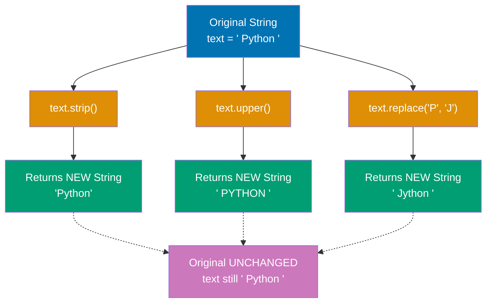

```python
# String creation (single or double quotes)
name = "Alice"                    # => name is "Alice" (type: str)
                                  # => Double quotes standard convention
greeting = 'Hello'                # => greeting is "Hello" (type: str)
                                  # => Single quotes functionally identical
                                  # => Use either consistently

# String concatenation
message = greeting + ", " + name  # => + operator concatenates strings
                                  # => Creates new string "Hello, Alice"
                                  # => message is "Hello, Alice"
print(message)                    # => Output: Hello, Alice

# String repetition
laugh = "ha" * 3                  # => * operator repeats string
                                  # => laugh is "hahaha" (type: str)
print(laugh)                      # => Output: hahaha

# String methods (immutable - return new strings)
text = "  Python Programming  "   # => text has leading/trailing spaces
                                  # => text is "  Python Programming  "
print(text.strip())               # => strip() removes whitespace
                                  # => Returns NEW string "Python Programming"
                                  # => Output: Python Programming
print(text.upper())               # => upper() converts to uppercase
                                  # => Returns NEW string "  PYTHON PROGRAMMING  "
                                  # => Output:   PYTHON PROGRAMMING
print(text.lower())               # => lower() converts to lowercase
                                  # => Returns NEW string "  python programming  "
                                  # => Output:   python programming
print(text.replace("Python", "Go"))# => replace() substitutes substring
                                  # => Returns NEW string "  Go Programming  "
                                  # => Output:   Go Programming

# Original string unchanged (immutability)
print(text)                       # => text still has original value
                                  # => Immutability guarantees no modifications
                                  # => Output:   Python Programming

# String splitting and joining
words = "apple,banana,cherry"     # => words is "apple,banana,cherry"
fruits = words.split(",")         # => split() converts string to list
                                  # => Delimiter is comma ","
                                  # => fruits is ["apple", "banana", "cherry"]
print(fruits)                     # => Output: ['apple', 'banana', 'cherry']

joined = "-".join(fruits)         # => join() converts list to string
                                  # => Joins elements with "-" separator
                                  # => joined is "apple-banana-cherry"
print(joined)                     # => Output: apple-banana-cherry

# String formatting (f-strings, Python 3.6+)
age = 30                          # => age is 30 (type: int)
print(f"{name} is {age} years old")# => f-string interpolates variables
                                  # => Evaluates expressions inside {}
                                  # => age auto-converts to string
                                  # => Output: Alice is 30 years old

# Multiline strings
poem = """Line one
Line two
Line three"""                     # => Triple quotes preserve newlines
                                  # => poem is "Line one\nLine two\nLine three"
                                  # => poem is 3-line string (type: str)
print(poem)                       # => Prints each line separately
                                  # => Output: Line one
                                  # =>         Line two
                                  # =>         Line three
```

**Key Takeaway**: Strings are immutable - all string methods return new strings rather than modifying originals. Use f-strings for readable formatting and `split()`/`join()` for transforming between strings and lists.

**Why It Matters**: String immutability guarantees thread safety without locks and enables memory optimizations through string interning, making concurrent Python programs more reliable. The rich set of string methods eliminates need for external libraries for common text processing tasks. F-strings (PEP 498) provide readable, performant formatting that compiles to optimized bytecode rather than runtime string concatenation, making them the preferred choice for production code.

---

## Example 5: Boolean Logic and Comparisons

Python provides boolean type with `True`/`False` values, comparison operators, and logical operators with short-circuit evaluation.

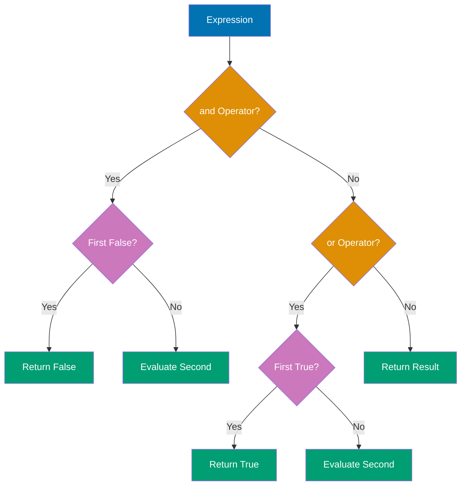

```python
# Boolean values
is_active = True                  # => is_active is True (type: bool)
                                  # => True is a boolean literal (capitalized)
is_deleted = False                # => is_deleted is False (type: bool)
                                  # => False is a boolean literal (capitalized)

# Comparison operators
x = 10                            # => x is 10 (type: int)
y = 20                            # => y is 20 (type: int)
                                  # => Comparisons return bool values

print(x == y)                     # => Compares: 10 == 20
                                  # => Returns False (values not equal)
                                  # => Output: False
print(x != y)                     # => Compares: 10 != 20
                                  # => Returns True (values differ)
                                  # => Output: True
print(x < y)                      # => Compares: 10 < 20
                                  # => Returns True (x less than y)
                                  # => Output: True
print(x <= y)                     # => Compares: 10 <= 20
                                  # => Returns True (x less or equal)
                                  # => Output: True
print(x > y)                      # => Compares: 10 > 20
                                  # => Returns False (x not greater)
                                  # => Output: False
print(x >= y)                     # => Compares: 10 >= 20
                                  # => Returns False (x not greater or equal)
                                  # => Output: False

# Logical operators (and, or, not)
a = True                          # => a is True (type: bool)
b = False                         # => b is False (type: bool)
                                  # => Testing logical operations

print(a and b)                    # => Evaluates: True and False
                                  # => Both must be True for and
                                  # => Returns False (not both True)
                                  # => Output: False
print(a or b)                     # => Evaluates: True or False
                                  # => At least one must be True for or
                                  # => Returns True (a is True)
                                  # => Output: True
print(not a)                      # => Evaluates: not True
                                  # => Negates boolean value
                                  # => Returns False (opposite of True)
                                  # => Output: False

# Short-circuit evaluation
def expensive():
    # => Function simulates expensive operation
    print("Expensive function called")
    # => Side effect: prints message
    return True               # => Returns True (but only if called)

result = False and expensive()    # => Left side: False
                                  # => 'and' with False always False
                                  # => expensive() NOT called (short-circuit!)
                                  # => Python stops evaluation early
                                  # => result is False
print(result)                     # => Output: False
                                  # => No "Expensive..." message printed

result = True or expensive()      # => Left side: True
                                  # => 'or' with True always True
                                  # => expensive() NOT called (short-circuit!)
                                  # => Python stops evaluation early
                                  # => result is True
print(result)                     # => Output: True
                                  # => No "Expensive..." message printed

# Truthy and falsy values
print(bool(0))                    # => Converts 0 to bool
                                  # => 0 is falsy (evaluates to False)
                                  # => Output: False
print(bool(""))                   # => Converts empty string to bool
                                  # => Empty string is falsy
                                  # => Output: False
print(bool([]))                   # => Converts empty list to bool
                                  # => Empty containers are falsy
                                  # => Output: False
print(bool(42))                   # => Converts 42 to bool
                                  # => Non-zero numbers are truthy
                                  # => Output: True
print(bool("text"))               # => Converts "text" to bool
                                  # => Non-empty strings are truthy
                                  # => Output: True
```

**Key Takeaway**: Python uses short-circuit evaluation for `and`/`or` operators (stops evaluating once result is determined), and many values are falsy (0, empty strings/lists/dicts, None) - use explicit comparisons when checking for specific values.

**Why It Matters**: Short-circuit evaluation optimizes performance by avoiding unnecessary function calls and prevents errors when accessing potentially undefined values (e.g., `obj and obj.method()`). Python's truthy/falsy semantics enable concise conditional checks but require awareness to avoid bugs when distinguishing between None, 0, and empty collections. Explicit comparisons (`if x is None`) are preferred in production code for clarity and correctness over implicit truthiness checks (`if x`).

---

## Example 6: Conditional Statements (if/elif/else)

Python uses indentation-based blocks for conditionals with `if`, `elif` (else-if), and `else` keywords. No parentheses required around conditions.

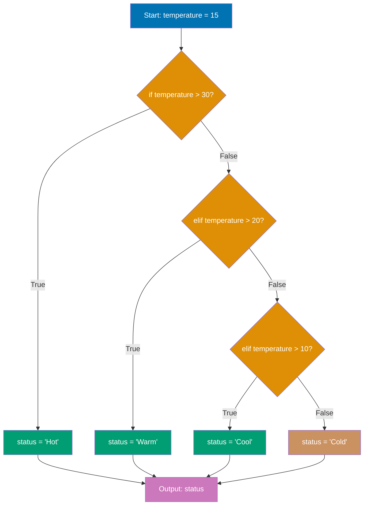

```python
# Basic if statement
age = 18                          # => age is 18 (type: int)
                                  # => Evaluates condition next
if age >= 18:
    # => Comparison: 18 >= 18 evaluates to True
    # => Enters if block (body must be indented)
    print("Adult")                # => Executes because condition True
                                  # => Output: Adult

# if-else
score = 75                        # => score is 75 (type: int)
                                  # => Two possible execution paths
if score >= 80:
    # => Comparison: 75 >= 80 evaluates to False
    # => Skips this block (not executed)
    grade = "A"
else:
    # => Executes when if condition False
    # => Provides alternative path
    grade = "B"                   # => grade is "B" (score < 80)
                                  # => else block executed
print(f"Grade: {grade}")          # => Prints final grade value
                                  # => Output: Grade: B

# if-elif-else chain
temperature = 15                  # => temperature is 15 (type: int)
                                  # => Multiple conditions tested in order
if temperature > 30:
    # => First check: 15 > 30 is False
    # => Skips to next condition (elif)
    status = "Hot"
elif temperature > 20:
    # => Second check: 15 > 20 is False
    # => Skips to next condition (elif)
    status = "Warm"
elif temperature > 10:
    # => Third check: 15 > 10 is True
    # => Enters this block, skips rest
    status = "Cool"               # => status is "Cool" (10 < temp <= 20)
                                  # => Matches third condition
else:
    # => Catch-all if all conditions False
    # => Not executed (third condition matched)
    status = "Cold"
print(f"Status: {status}")        # => Prints matched status
                                  # => Output: Status: Cool

# Nested conditions
x = 10                            # => x is 10 (type: int)
y = 20                            # => y is 20 (type: int)
                                  # => Checking both conditions with nesting
if x > 0:
    # => Outer check: 10 > 0 is True
    # => Enters outer if block
    if y > 0:
        # => Inner check: 20 > 0 is True
        # => Enters inner if block (nested)
        print("Both positive")    # => Both conditions True
                                  # => Output: Both positive
    else:
        # => Inner else (if y <= 0)
        # => Not executed (y > 0 was True)
        print("x positive, y not")
else:
    # => Outer else (if x <= 0)
    # => Not executed (x > 0 was True)
    print("x not positive")

# Ternary operator (conditional expression)
age = 25                          # => age is 25 (type: int)
                                  # => Compact if-else in single line
status = "adult" if age >= 18 else "minor"
                                  # => Condition: 25 >= 18 is True
                                  # => Evaluates to "adult" (left side)
                                  # => If False, would evaluate to "minor" (right side)
                                  # => status is "adult"
print(status)                     # => Output: adult

# Multiple conditions with logical operators
has_ticket = True                 # => has_ticket is True (type: bool)
is_vip = False                    # => is_vip is False (type: bool)
                                  # => Using 'and' and 'or' operators
if has_ticket and is_vip:
    # => First check: True and False evaluates to False
    # => Both must be True for 'and' (short-circuit)
    # => Skips this block
    print("VIP entrance")
elif has_ticket:
    # => Second check: has_ticket is True
    # => Only one condition needs to be True for elif
    # => Enters this block
    print("Regular entrance")     # => has_ticket is True, is_vip doesn't matter
                                  # => Output: Regular entrance
else:
    # => Executes if all conditions False
    # => Not reached (has_ticket matched)
    print("No entrance")
```

**Key Takeaway**: Python requires consistent indentation (typically 4 spaces) for code blocks - use `elif` instead of `else if`, and leverage ternary expressions for simple assignments based on conditions.

**Why It Matters**: Python's indentation-based syntax enforces consistent code formatting across teams and eliminates debates about brace placement that plague C-family languages. The elif keyword (unlike C's else-if) prevents deeply nested conditionals and improves readability in multi-branch decision logic. Ternary expressions provide concise conditional assignment while maintaining readability, reducing boilerplate in initialization and configuration code.

---

## Example 7: While Loops

The `while` loop repeats a block as long as a condition remains true, with `break` for early exit and `continue` for skipping iterations.

```python
# Basic while loop
count = 0                         # => count is 0 (initialization)
                                  # => Loop counter starts at 0
while count < 5:
    # => Condition: count < 5
    # => Checked before each iteration
    # => Loop body executes while True
    print(f"Count: {count}")      # => Prints current count value
                                  # => Output: Count: 0, Count: 1, ..., Count: 4
    count += 1                    # => Increment counter by 1
                                  # => count becomes 1, 2, 3, 4, 5
                                  # => Loop exits when count is 5 (5 < 5 is False)

# While with break
n = 0                             # => n is 0 (initialization)
while True:                       # => Infinite loop (condition always True)
                                  # => Must use break to exit
                                  # => Useful for event loops
    if n >= 3:
        # => Check exit condition
        # => n >= 3 evaluates to True when n is 3
        break                     # => break exits loop immediately
                                  # => Exits to after while block
    print(f"n: {n}")              # => Prints before break check
                                  # => Output: n: 0, n: 1, n: 2
    n += 1                        # => Increment: n becomes 1, 2, 3
                                  # => When n=3, break executes next iteration

# While with continue
i = 0                             # => i is 0 (initialization)
while i < 5:
    # => Condition: i < 5
    i += 1                        # => Increment FIRST (important!)
                                  # => i becomes 1, 2, 3, 4, 5
                                  # => Increment before continue avoids infinite loop
    if i % 2 == 0:
        # => Check if i is even (remainder 0)
        # => True for i = 2, 4
        continue                  # => continue skips rest of loop body
                                  # => Jumps back to while condition
    print(f"Odd: {i}")            # => Prints only for odd numbers
                                  # => Output: Odd: 1, Odd: 3, Odd: 5
                                  # => Even numbers skipped by continue

# While-else (else executes if loop completes without break)
x = 0                             # => x is 0 (initialization)
while x < 3:
    # => Condition: x < 3
    print(f"x: {x}")              # => Prints x value each iteration
                                  # => Output: x: 0, x: 1, x: 2
    x += 1                        # => Increment: x becomes 1, 2, 3
                                  # => When x=3, condition False, exits to else
else:
    # => else block after while
    # => Executes if loop exits normally (condition False)
    # => Does NOT execute if break used
    print("Loop completed")       # => Output: Loop completed (no break occurred)

# While-else with break (else skipped)
y = 0                             # => y is 0 (initialization)
while y < 10:
    # => Condition: y < 10
    # => Could iterate 10 times normally
    if y == 2:
        # => Early exit condition
        # => True when y is 2
        break                     # => break exits loop immediately
                                  # => Skips else block
    y += 1                        # => Increment (but doesn't reach after break)
                                  # => y becomes 1, 2 (then break)
else:
    # => else block after while
    # => NOT executed because break occurred
    print("This won't print")     # => Skipped (break caused early exit)

# Sentinel-controlled loop
user_input = ""                   # => user_input is "" (initialization)
                                  # => Sentinel value pattern
                                  # => Loop until specific value entered
# Uncomment to test interactively:
# while user_input != "quit":
#     # => Condition: continues until "quit" entered
#     # => Sentinel value is "quit"
#     user_input = input("Enter 'quit' to exit: ")
#     # => Reads user input each iteration
#     print(f"You entered: {user_input}")
#     # => Echoes input back to user
```

**Key Takeaway**: Use `while` for indefinite iteration when you don't know the loop count in advance - prefer `for` loops for iterating over sequences. The `while-else` clause is rarely needed but useful when you need to distinguish between normal completion and early exit.

**Why It Matters**: While loops excel for event-driven and sentinel-controlled iteration where the termination condition depends on runtime state rather than collection size. The while-else construct elegantly handles search patterns where else indicates 'not found' without requiring flag variables. However, for loops are preferred in production code when iterating over sequences to avoid off-by-one errors and infinite loops common with manual loop counter management.

---

## Example 8: For Loops and Range

Python's `for` loop iterates over sequences (lists, strings, ranges) with `range()` for numeric sequences and unpacking for tuples.

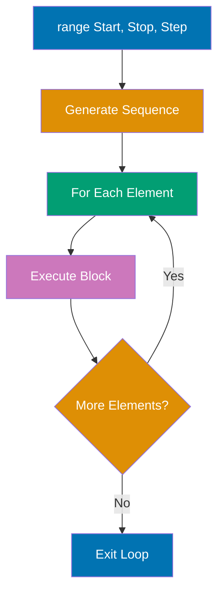

```python
# Basic for loop with range (0 to n-1)
for i in range(5):                # => range(5) generates 0, 1, 2, 3, 4
    print(f"i: {i}")              # => Output: i: 0, i: 1, ..., i: 4

# Range with start and stop
for i in range(2, 6):             # => range(2, 6) generates 2, 3, 4, 5
    print(f"i: {i}")              # => Output: i: 2, i: 3, i: 4, i: 5

# Range with step
for i in range(0, 10, 2):         # => range(0, 10, 2) generates 0, 2, 4, 6, 8
    print(f"i: {i}")              # => Output: i: 0, i: 2, i: 4, i: 6, i: 8

# Reverse range
for i in range(5, 0, -1):         # => range(5, 0, -1) generates 5, 4, 3, 2, 1
    print(f"i: {i}")              # => Output: i: 5, i: 4, i: 3, i: 2, i: 1

# Iterating over strings
name = "Python"                   # => name is "Python"
for char in name:                 # => Iterates: 'P', 'y', 't', 'h', 'o', 'n'
    print(char)                   # => Output: P, y, t, h, o, n (one per line)

# Iterating over lists
fruits = ["apple", "banana", "cherry"]
                                  # => fruits is ["apple", "banana", "cherry"]
for fruit in fruits:              # => Iterates through each element
    print(fruit)                  # => Output: apple, banana, cherry (one per line)

# Enumerate for index and value
for index, fruit in enumerate(fruits):
                                  # => enumerate yields (0, "apple"), (1, "banana"), (2, "cherry")
    print(f"{index}: {fruit}")    # => Output: 0: apple, 1: banana, 2: cherry

# For-else (else executes if loop completes without break)
for i in range(3):
    print(i)                      # => Output: 0, 1, 2
else:
    print("Loop completed")       # => Output: Loop completed

# Nested loops
for i in range(3):                # => Outer loop: 0, 1, 2
    for j in range(2):            # => Inner loop: 0, 1 (for each i)
        print(f"({i}, {j})")      # => Output: (0,0), (0,1), (1,0), (1,1), (2,0), (2,1)
```

**Key Takeaway**: Use `for` loops for iterating over sequences - `range()` generates numeric sequences efficiently (it's a generator, not a list), and `enumerate()` provides both index and value when needed.

**Why It Matters**: For loops in Python iterate over sequences directly rather than indices, reducing off-by-one errors and improving readability compared to C-style loops. The range() function generates values lazily without creating lists in memory, making it efficient for large iteration counts. Enumerate() eliminates manual index tracking, making code more maintainable and less error-prone than managing separate counter variables.

---

## Example 9: Lists - Creation and Access

Lists are mutable, ordered sequences that can contain mixed types, support indexing (including negative indices), and slicing.

**Positive Indexing:**

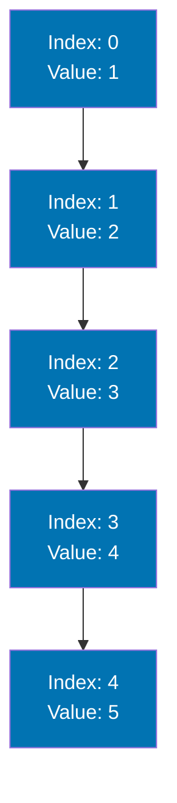

**Negative Indexing:**

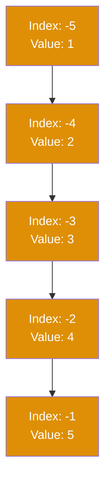

Python lists support both positive indexing (starting from 0) and negative indexing (counting from the end starting at -1). Both index systems refer to the same list elements.

```python
# List creation
numbers = [1, 2, 3, 4, 5]         # => numbers is [1, 2, 3, 4, 5] (type: list)
                                  # => Lists created with square brackets
                                  # => Elements separated by commas
mixed = [1, "two", 3.0, True]     # => mixed is [1, "two", 3.0, True]
                                  # => Lists can contain mixed types (unlike arrays in Java/C++)
                                  # => Python's dynamic typing enables heterogeneous collections
empty = []                        # => empty is [] (empty list)
                                  # => No elements, length is 0

# Indexing (0-based)
first = numbers[0]                # => first is 1 (index 0)
                                  # => Lists use 0-based indexing (like C/Java)
second = numbers[1]               # => second is 2 (index 1)
                                  # => Accesses second element
last = numbers[-1]                # => last is 5 (negative index from end)
                                  # => -1 means last element (Python feature)
second_last = numbers[-2]         # => second_last is 4
                                  # => -2 means second from end

print(first, last)                # => Prints first and last values
                                  # => Output: 1 5

# Slicing [start:stop:step]
subset = numbers[1:4]             # => Slice from index 1 to 4 (exclusive)
                                  # => Extracts elements at indices 1, 2, 3
                                  # => subset is [2, 3, 4]
print(subset)                     # => Output: [2, 3, 4]

first_three = numbers[:3]         # => Slice from start to index 3 (exclusive)
                                  # => Omitted start defaults to 0
                                  # => first_three is [1, 2, 3]
print(first_three)                # => Output: [1, 2, 3]

last_two = numbers[-2:]           # => Slice from -2 to end
                                  # => Omitted stop defaults to end of list
                                  # => last_two is [4, 5]
print(last_two)                   # => Output: [4, 5]

every_second = numbers[::2]       # => Slice with step of 2
                                  # => Takes every 2nd element (0, 2, 4)
                                  # => every_second is [1, 3, 5]
print(every_second)               # => Output: [1, 3, 5]

reversed_list = numbers[::-1]     # => Slice with negative step reverses
                                  # => Step of -1 iterates backwards
                                  # => reversed_list is [5, 4, 3, 2, 1]
print(reversed_list)              # => Output: [5, 4, 3, 2, 1]

# List length
length = len(numbers)             # => len() returns number of elements
                                  # => length is 5
print(f"Length: {length}")        # => Output: Length: 5

# Membership testing
has_three = 3 in numbers          # => 'in' operator checks membership
                                  # => Linear search O(n) for lists
                                  # => has_three is True (3 exists in list)
has_ten = 10 in numbers           # => Checks if 10 in list
                                  # => has_ten is False (10 not found)
print(has_three, has_ten)         # => Output: True False
```

**Key Takeaway**: Lists support negative indexing (counting from end) and powerful slicing with `[start:stop:step]` syntax - slices create new lists without modifying originals, making them safe for data inspection.

**Why It Matters**: Lists are Python's primary ordered collection with O(1) append and index access but O(n) insertion/deletion in the middle, making them ideal for sequential processing. Negative indexing eliminates fence-post errors when accessing end elements and simplifies reverse traversal patterns. Understanding list mutability is critical in production code to avoid unexpected aliasing bugs where multiple variables reference the same list.

---

## Example 10: Lists - Modification Methods

Lists are mutable with methods for adding, removing, and modifying elements. All modification methods change the list in-place (return `None`).

```python
# List modification methods
fruits = ["apple", "banana"]      # => fruits is ["apple", "banana"]

# append() - add single element to end
fruits.append("cherry")           # => fruits is ["apple", "banana", "cherry"]
print(fruits)                     # => Output: ['apple', 'banana', 'cherry']

# extend() - add multiple elements
fruits.extend(["date", "elderberry"])
                                  # => fruits is ["apple", ..., "elderberry"]
print(fruits)                     # => Output: ['apple', 'banana', 'cherry', 'date', 'elderberry']

# insert() - add element at specific index
fruits.insert(1, "apricot")       # => Insert at index 1
                                  # => fruits is ["apple", "apricot", "banana", ...]
print(fruits)                     # => Output: ['apple', 'apricot', 'banana', ...]

# remove() - remove first occurrence of value
fruits.remove("banana")           # => Removes "banana"
                                  # => fruits is ["apple", "apricot", "cherry", ...]
print(fruits)                     # => Output: ['apple', 'apricot', 'cherry', 'date', 'elderberry']

# pop() - remove and return element at index (default: last)
last = fruits.pop()               # => last is "elderberry", removed from list
print(last)                       # => Output: elderberry
print(fruits)                     # => Output: ['apple', 'apricot', 'cherry', 'date']

popped = fruits.pop(1)            # => popped is "apricot", removed from index 1
print(popped)                     # => Output: apricot
print(fruits)                     # => Output: ['apple', 'cherry', 'date']

# clear() - remove all elements
backup = fruits.copy()            # => backup is ["apple", "cherry", "date"] (shallow copy)
fruits.clear()                    # => fruits is [] (empty)
print(fruits)                     # => Output: []
print(backup)                     # => Output: ['apple', 'cherry', 'date'] (unchanged)

# Index assignment
numbers = [1, 2, 3, 4, 5]         # => numbers is [1, 2, 3, 4, 5]
numbers[0] = 10                   # => numbers is [10, 2, 3, 4, 5]
numbers[-1] = 50                  # => numbers is [10, 2, 3, 4, 50]
print(numbers)                    # => Output: [10, 2, 3, 4, 50]

# Slice assignment
numbers[1:3] = [20, 30, 35]       # => Replace indices 1-2 with 3 elements
                                  # => numbers is [10, 20, 30, 35, 4, 50]
print(numbers)                    # => Output: [10, 20, 30, 35, 4, 50]

# Sorting
unsorted = [3, 1, 4, 1, 5, 9]     # => unsorted is [3, 1, 4, 1, 5, 9]
unsorted.sort()                   # => unsorted is [1, 1, 3, 4, 5, 9] (in-place)
print(unsorted)                   # => Output: [1, 1, 3, 4, 5, 9]

# sorted() - returns new sorted list
original = [3, 1, 4]              # => original is [3, 1, 4]
sorted_copy = sorted(original)    # => sorted_copy is [1, 3, 4]
print(original)                   # => Output: [3, 1, 4] (unchanged)
print(sorted_copy)                # => Output: [1, 3, 4]
```

**Key Takeaway**: List methods like `append()`, `remove()`, `sort()` modify in-place and return `None` - use `sorted()` and slicing when you need new lists without modifying originals, and always use `copy()` or `list()` to create independent copies.

**Why It Matters**: List slicing creates shallow copies of subsequences with Pythonic syntax that eliminates explicit loop-based copying, reducing code complexity and potential errors. The step parameter enables efficient reversal and sampling patterns without allocating intermediate collections. Mastering slice notation is essential for idiomatic Python as it appears extensively in data processing, pagination, and windowing operations in production systems.

---

## Example 11: Tuples - Immutable Sequences

Tuples are immutable ordered sequences, often used for fixed collections of related values. Once created, elements cannot be changed, added, or removed.

```python
# Tuple creation
point = (3, 4)                    # => point is (3, 4) (type: tuple)
                                  # => Tuples use parentheses ()
                                  # => Immutable sequence type
colors = ("red", "green", "blue") # => colors is ("red", "green", "blue")
                                  # => Multiple elements separated by commas
single = (42,)                    # => single is (42,) (comma required!)
                                  # => Trailing comma makes it tuple
                                  # => Without comma, it's just parentheses
not_tuple = (42)                  # => not_tuple is 42 (type: int, NOT tuple!)
                                  # => No comma = just int in parentheses

print(type(point))                # => Output: <class 'tuple'>
print(type(single))               # => Output: <class 'tuple'>
print(type(not_tuple))            # => Output: <class 'int'> (gotcha!)

# Indexing and slicing (same as lists)
first = point[0]                  # => first is 3 (index 0)
                                  # => 0-based indexing like lists
second = point[1]                 # => second is 4 (index 1)
subset = colors[1:]               # => Slice from index 1 to end
                                  # => subset is ("green", "blue")
                                  # => Slicing returns new tuple
print(first, second)              # => Output: 3 4
print(subset)                     # => Output: ('green', 'blue')

# Unpacking
x, y = point                      # => Unpacks point into two variables
                                  # => x gets point[0], y gets point[1]
                                  # => x is 3, y is 4
print(f"x={x}, y={y}")            # => Output: x=3, y=4

# Multiple unpacking
r, g, b = colors                  # => Unpacks three elements
                                  # => r is "red", g is "green", b is "blue"
                                  # => Must match element count
print(r, g, b)                    # => Output: red green blue

# Unpacking with * (rest)
numbers = (1, 2, 3, 4, 5)         # => numbers is (1, 2, 3, 4, 5)
                                  # => Tuple with 5 elements
first, *rest, last = numbers      # => * captures middle elements
                                  # => first is 1 (first element)
                                  # => rest is [2, 3, 4] (middle as list!)
                                  # => last is 5 (last element)
print(first)                      # => Output: 1
print(rest)                       # => Output: [2, 3, 4] (list, not tuple!)
print(last)                       # => Output: 5

# Immutability
try:
    # => Attempt to modify tuple element
    point[0] = 10                 # => Tries to assign to point[0]
                                  # => Tuples are immutable (no item assignment)
except TypeError as e:
    # => Catches TypeError from attempted modification
    print(f"Error: {e}")          # => Output: Error: 'tuple' object does not support item assignment
                                  # => Demonstrates immutability

# Tuple methods (limited due to immutability)
nums = (1, 2, 3, 2, 1)            # => nums is (1, 2, 3, 2, 1)
                                  # => Has duplicate values
count_of_twos = nums.count(2)     # => count() returns occurrences
                                  # => count_of_twos is 2 (two 2s in tuple)
index_of_three = nums.index(3)    # => index() returns first occurrence position
                                  # => index_of_three is 2 (3 at index 2)
print(count_of_twos, index_of_three)
                                  # => Output: 2 2

# Tuple as dictionary key (lists can't do this!)
locations = {}                    # => locations is {} (empty dict)
                                  # => Dict needs hashable keys
locations[(0, 0)] = "origin"      # => Tuple as key works! (immutable = hashable)
                                  # => (0, 0) is hashable, can be dict key
locations[(1, 1)] = "diagonal"    # => Another tuple key
                                  # => Lists can't be keys (mutable)
print(locations[(0, 0)])          # => Accesses dict with tuple key
                                  # => Output: origin

# Named tuples (more readable alternative - requires import)
from collections import namedtuple
                                  # => Imports namedtuple factory

Point = namedtuple("Point", ["x", "y"])
                                  # => Creates Point class with named fields
                                  # => First arg: class name
                                  # => Second arg: field names
p = Point(3, 4)                   # => Creates Point instance
                                  # => p.x is 3, p.y is 4
                                  # => Named access more readable than indices
print(p.x, p.y)                   # => Access by field name
                                  # => Output: 3 4
print(p[0], p[1])                 # => Still supports index access
                                  # => Output: 3 4 (backwards compatible)
```

**Key Takeaway**: Use tuples for fixed collections where immutability is desired (function return values, dictionary keys) - they're more memory-efficient than lists and signal intent that data shouldn't change. Named tuples provide readability benefits for complex tuple structures.

**Why It Matters**: List methods provide in-place modification (append, extend, sort) versus returning new lists (copy), affecting both performance and correctness in multi-threaded code. The distinction between append (adds single element) and extend (adds multiple elements) prevents common bugs when adding collections to lists. Understanding mutability and return values of list methods is critical for avoiding subtle bugs in production code.

---

## Example 12: Dictionaries - Key-Value Pairs

Dictionaries store key-value pairs with fast lookup by key. Keys must be immutable (strings, numbers, tuples), while values can be any type.

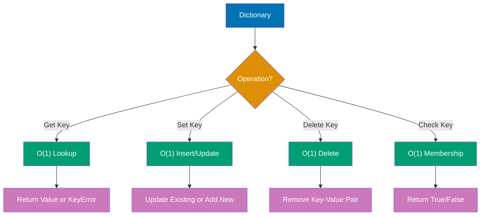

```python
# Dictionary creation
person = {
    "name": "Alice",
    "age": 30,
    "city": "New York"
}                                 # => person is {"name": "Alice", ...}

# Access by key
name = person["name"]             # => name is "Alice"
age = person["age"]               # => age is 30
print(name, age)                  # => Output: Alice 30

# Access with get() (returns None or default if key missing)
city = person.get("city")         # => city is "New York"
country = person.get("country")   # => country is None (key doesn't exist)
country_default = person.get("country", "USA")
                                  # => country_default is "USA" (default provided)
print(city, country, country_default)
                                  # => Output: New York None USA

# Add or update key-value pairs
person["email"] = "alice@example.com"
                                  # => person has new key "email"
person["age"] = 31                # => age updated to 31
print(person)                     # => Output: {'name': 'Alice', 'age': 31, ...}

# Delete key-value pairs
del person["city"]                # => "city" key removed
print(person)                     # => Output: {'name': 'Alice', 'age': 31, 'email': ...}

removed = person.pop("email")     # => removed is "alice@example.com", key deleted
print(removed)                    # => Output: alice@example.com
print(person)                     # => Output: {'name': 'Alice', 'age': 31}

# Membership testing (checks keys, not values)
has_name = "name" in person       # => has_name is True
has_city = "city" in person       # => has_city is False (deleted earlier)
print(has_name, has_city)         # => Output: True False

# Iterating over dictionaries
scores = {"Alice": 95, "Bob": 87, "Charlie": 92}

# Iterate over keys (default)
for name in scores:
    print(name)                   # => Output: Alice, Bob, Charlie

# Iterate over keys explicitly
for name in scores.keys():
    print(name)                   # => Output: Alice, Bob, Charlie

# Iterate over values
for score in scores.values():
    print(score)                  # => Output: 95, 87, 92

# Iterate over key-value pairs
for name, score in scores.items():
    print(f"{name}: {score}")     # => Output: Alice: 95, Bob: 87, Charlie: 92

# Dictionary methods
grades = {"math": 90, "english": 85}
                                  # => grades is {"math": 90, "english": 85}

# update() - merge another dictionary
grades.update({"science": 88, "math": 92})
                                  # => grades is {"math": 92, "english": 85, "science": 88}
print(grades)                     # => Output: {'math': 92, 'english': 85, 'science': 88}

# setdefault() - get value or set default if missing
history = grades.setdefault("history", 80)
                                  # => history is 80 (set because key missing)
math = grades.setdefault("math", 0)
                                  # => math is 92 (key exists, no change)
print(history, math)              # => Output: 80 92
print(grades)                     # => Output: {..., 'history': 80}
```

**Key Takeaway**: Dictionaries provide O(1) average lookup, insertion, and deletion by key - use `get()` instead of `[]` when keys might be missing to avoid `KeyError`, and iterate with `items()` when you need both keys and values.

**Why It Matters**: List comprehensions compile to optimized bytecode that runs faster than equivalent for loops with append(), making them the preferred choice for transforming sequences. The readability of comprehensions improves code maintainability by expressing intent (filter-map operations) more clearly than imperative loops. However, complex nested comprehensions should be avoided in favor of explicit loops for maintainability.

---

## Example 13: Sets - Unique Collections

Sets are unordered collections of unique elements supporting mathematical set operations (union, intersection, difference).

```python
# Set creation
numbers = {1, 2, 3, 4, 5}         # => numbers is {1, 2, 3, 4, 5} (type: set)
                                  # => Sets use curly braces {}
                                  # => Unordered, unique elements
empty_set = set()                 # => empty_set is set() (use set(), NOT {})
                                  # => set() function creates empty set
not_empty_set = {}                # => This is an empty DICT, not set!
                                  # => {} creates dict, not set (gotcha!)

print(type(numbers))              # => type() returns class
                                  # => Output: <class 'set'>
print(type(empty_set))            # => Output: <class 'set'>
print(type(not_empty_set))        # => Output: <class 'dict'> (not set!)

# Duplicate elimination
duplicates = {1, 2, 2, 3, 3, 3}   # => Sets automatically remove duplicates
                                  # => Only unique values stored
                                  # => duplicates is {1, 2, 3}
print(duplicates)                 # => Output: {1, 2, 3}

# Set from list (removes duplicates)
list_with_dupes = [1, 2, 2, 3, 3, 3]
                                  # => List with duplicate values
unique = set(list_with_dupes)     # => set() converts list to set
                                  # => Removes duplicates automatically
                                  # => unique is {1, 2, 3}
print(unique)                     # => Output: {1, 2, 3}

# Add and remove elements
fruits = {"apple", "banana"}      # => fruits is {"apple", "banana"}
                                  # => Initial set with 2 elements
fruits.add("cherry")              # => add() inserts single element
                                  # => fruits is {"apple", "banana", "cherry"}
                                  # => Modifies set in-place
print(fruits)                     # => Output: {'apple', 'banana', 'cherry'}

fruits.remove("banana")           # => remove() deletes element
                                  # => fruits is {"apple", "cherry"}
                                  # => Raises KeyError if not found
print(fruits)                     # => Output: {'apple', 'cherry'}

# discard() vs remove() - discard doesn't raise error if missing
fruits.discard("banana")          # => discard() deletes if present
                                  # => No error if element missing
                                  # => Safe removal method
try:
    fruits.remove("banana")       # => remove() raises KeyError if not found
                                  # => "banana" not in set (already removed)
except KeyError:
    # => Catches KeyError from remove()
    print("KeyError: banana not found")
                                  # => Output: KeyError: banana not found

# Membership testing
has_apple = "apple" in fruits     # => 'in' operator checks membership
                                  # => O(1) average time complexity (hash table)
                                  # => has_apple is True
has_banana = "banana" in fruits   # => "banana" not in fruits
                                  # => has_banana is False
print(has_apple, has_banana)      # => Output: True False

# Set operations
a = {1, 2, 3, 4}                  # => a is {1, 2, 3, 4}
b = {3, 4, 5, 6}                  # => b is {3, 4, 5, 6}
                                  # => Sets with overlapping elements

# Union (all elements from both sets)
union = a | b                     # => Pipe operator | performs union
                                  # => Combines all unique elements
                                  # => union is {1, 2, 3, 4, 5, 6}
union_method = a.union(b)         # => union() method same result
                                  # => More explicit than |
print(union)                      # => Output: {1, 2, 3, 4, 5, 6}

# Intersection (common elements)
intersection = a & b              # => Ampersand & performs intersection
                                  # => Elements present in BOTH sets
                                  # => intersection is {3, 4}
intersection_method = a.intersection(b)
                                  # => intersection() method same result
print(intersection)               # => Output: {3, 4}

# Difference (elements in a but not in b)
difference = a - b                # => Minus - performs difference
                                  # => Elements in a that are NOT in b
                                  # => difference is {1, 2}
difference_method = a.difference(b)
                                  # => difference() method same result
print(difference)                 # => Output: {1, 2}

# Symmetric difference (elements in either set but not both)
sym_diff = a ^ b                  # => Caret ^ performs symmetric difference
                                  # => Elements in a OR b but NOT both
                                  # => sym_diff is {1, 2, 5, 6}
sym_diff_method = a.symmetric_difference(b)
                                  # => symmetric_difference() method same result
print(sym_diff)                   # => Output: {1, 2, 5, 6}

# Subset and superset
small = {1, 2}                    # => small is {1, 2}
large = {1, 2, 3, 4}              # => large is {1, 2, 3, 4}
                                  # => small elements all in large
is_subset = small.issubset(large) # => issubset() checks if all elements in other
                                  # => is_subset is True (small ⊆ large)
is_superset = large.issuperset(small)
                                  # => issuperset() checks if contains all of other
                                  # => is_superset is True (large ⊇ small)
print(is_subset, is_superset)     # => Output: True True
```

**Key Takeaway**: Sets automatically eliminate duplicates and provide O(1) membership testing - use them for uniqueness constraints and mathematical set operations, but remember they're unordered (no indexing) and elements must be immutable.

**Why It Matters**: Tuples provide immutable sequences with lower memory overhead than lists, making them ideal for fixed collections and dictionary keys. Tuple unpacking enables elegant multiple return values and variable swaps without temporary variables, reducing code verbosity. Immutability guarantees make tuples thread-safe and hashable, essential for concurrent programming and using collections as dictionary keys.

---

## Example 14: Functions - Definition and Calls

Functions encapsulate reusable code blocks with parameters, return values, and default arguments. Python functions are first-class objects.

```python
# Basic function definition
def greet(name):
    """Return a greeting message."""# => Docstring (optional but recommended)
    return f"Hello, {name}!"

# Function call
message = greet("Alice")          # => message is "Hello, Alice!"
print(message)                    # => Output: Hello, Alice!

# Function with multiple parameters
def add(a, b):
    """Add two numbers and return result."""
    return a + b

result = add(5, 3)                # => result is 8
print(result)                     # => Output: 8

# Default arguments
def power(base, exponent=2):
    """Raise base to exponent (default: 2)."""
    return base ** exponent

square = power(5)                 # => square is 25 (5^2, default exponent)
cube = power(5, 3)                # => cube is 125 (5^3, explicit exponent)
print(square, cube)               # => Output: 25 125

# Keyword arguments
def describe_pet(animal, name):
    """Print pet description."""
    return f"I have a {animal} named {name}"

# Positional arguments
desc1 = describe_pet("dog", "Buddy")# => desc1 is "I have a dog named Buddy"

# Keyword arguments (order doesn't matter)
desc2 = describe_pet(name="Whiskers", animal="cat")
                                  # => desc2 is "I have a cat named Whiskers"
print(desc1)                      # => Output: I have a dog named Buddy
print(desc2)                      # => Output: I have a cat named Whiskers

# Multiple return values (returns tuple)
def min_max(numbers):
    """Return minimum and maximum of a list."""
    return min(numbers), max(numbers)

minimum, maximum = min_max([1, 5, 3, 9, 2])
                                  # => minimum is 1, maximum is 9
print(f"Min: {minimum}, Max: {maximum}")
                                  # => Output: Min: 1, Max: 9

# No return value (implicitly returns None)
def print_greeting(name):
    """Print greeting (no return)."""
    print(f"Hello, {name}!")

result = print_greeting("Bob")    # => Prints "Hello, Bob!", result is None
print(result)                     # => Output: None

# *args for variable positional arguments
def sum_all(*args):
    """Sum any number of arguments."""
    total = 0                     # => total is 0
    for num in args:              # => args is tuple of all arguments
        total += num
    return total

print(sum_all(1, 2, 3))           # => Output: 6
print(sum_all(1, 2, 3, 4, 5))     # => Output: 15

# **kwargs for variable keyword arguments
def print_info(**kwargs):
    """Print all keyword arguments."""
    for key, value in kwargs.items():
        print(f"{key}: {value}")

print_info(name="Alice", age=30, city="NYC")
                                  # => Output: name: Alice, age: 30, city: NYC

# Combining all parameter types
def complex_func(pos1, pos2, *args, kwarg1="default", **kwargs):
    """Demonstrate all parameter types."""
    print(f"Positional: {pos1}, {pos2}")
    print(f"*args: {args}")
    print(f"kwarg1: {kwarg1}")
    print(f"**kwargs: {kwargs}")

complex_func(1, 2, 3, 4, kwarg1="custom", extra="value")
# => Output: Positional: 1, 2
#    *args: (3, 4)
#    kwarg1: custom
#    **kwargs: {'extra': 'value'}
```

**Key Takeaway**: Functions support default arguments, keyword arguments, and variable arguments (`*args`/`**kwargs`) - use keyword arguments for clarity in calls with many parameters, and remember that default argument values are evaluated once at function definition (use `None` as default for mutable defaults).

**Why It Matters**: Dictionaries provide O(1) average-case lookup, insertion, and deletion, making them the foundation for efficient data storage and caching in production systems. The get() method with default values eliminates KeyError handling boilerplate, improving code readability. Understanding dictionary key requirements (hashable, immutable) prevents runtime errors and guides proper data structure design.

---

## Example 15: Function Scope and Global Variables

Python uses LEGB scope resolution (Local, Enclosing, Global, Built-in) with explicit `global`/`nonlocal` keywords for modifying outer scopes.

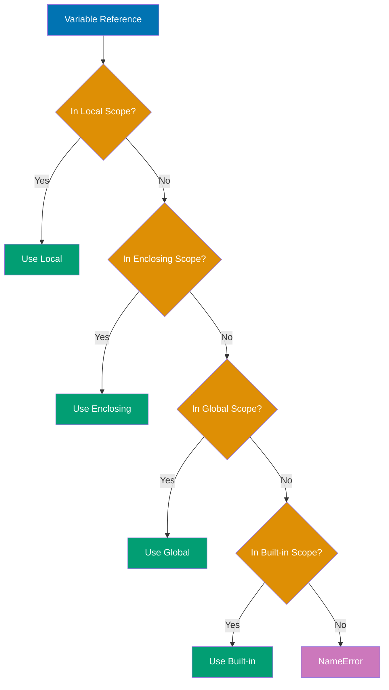

```python
# Global variable
counter = 0                       # => counter is 0 (global scope)
                                  # => Accessible from all functions

def increment():
    # => Function needs to modify global counter
    global counter                # => Declares intent to use global counter
                                  # => Without this, counter += 1 would error
                                  # => (UnboundLocalError: can't read before assignment)
    counter += 1                  # => Modifies global counter (not local)
                                  # => counter is now 1
    return counter                # => Returns updated value (1)

result = increment()              # => Calls function, modifies global
                                  # => result is 1 (return value)
                                  # => global counter also 1 (modified)
print(f"Result: {result}, Global: {counter}")
                                  # => Both show 1 (same value)
                                  # => Output: Result: 1, Global: 1

# Without global keyword (creates local variable)
x = 10                            # => x is 10 (global scope)
                                  # => Function can't modify without 'global'

def set_x():
    # => No 'global' keyword, so assignment creates local
    x = 20                        # => Creates NEW local variable x
                                  # => Shadows global x (different variable!)
                                  # => Local x is 20, global x still 10
    print(f"Local x: {x}")        # => Prints local x value
                                  # => Output: Local x: 20

set_x()                           # => Function creates and modifies local x
                                  # => Global x untouched
print(f"Global x: {x}")           # => Prints global x (unchanged)
                                  # => Output: Global x: 10

# Enclosing scope with nonlocal
def outer():
    # => Outer function with enclosing scope
    y = 5                         # => y is 5 (enclosing scope)
                                  # => Visible to inner function

    def inner():
        # => Inner function needs to modify enclosing y
        nonlocal y                # => Declares intent to use enclosing y
                                  # => Without this, y += 1 would error
        y += 1                    # => Modifies enclosing y (not local)
                                  # => y is now 6 in enclosing scope
        print(f"Inner y: {y}")    # => Prints modified enclosing y
                                  # => Output: Inner y: 6

    inner()                       # => Calls inner, modifies enclosing y
                                  # => outer's y now 6
    print(f"Outer y: {y}")        # => Prints enclosing y (modified by inner)
                                  # => Output: Outer y: 6

outer()                           # => Demonstrates nonlocal modification

# Without nonlocal (creates local variable)
def outer2():
    # => Similar structure but no 'nonlocal' in inner
    z = 10                        # => z is 10 (enclosing scope)

    def inner2():
        # => No 'nonlocal' keyword
        z = 20                    # => Creates NEW local z (shadows enclosing)
                                  # => Local z is 20, enclosing z still 10
        print(f"Inner z: {z}")    # => Prints local z
                                  # => Output: Inner z: 20

    inner2()                      # => Function creates local z
                                  # => Enclosing z untouched
    print(f"Outer z: {z}")        # => Prints enclosing z (unchanged)
                                  # => Output: Outer z: 10

outer2()                          # => Demonstrates shadowing without nonlocal

# LEGB demonstration
builtin_len = len                 # => Saves reference to built-in len
                                  # => Demonstrates Built-in scope (B in LEGB)
x = "global"                      # => x is "global" (Global scope)
                                  # => Outermost scope (G in LEGB)

def outer():
    # => Creates enclosing scope (E in LEGB)
    x = "enclosing"               # => x is "enclosing" (Enclosing scope)
                                  # => Shadows global x

    def inner():
        # => Creates local scope (L in LEGB)
        x = "local"               # => x is "local" (Local scope)
                                  # => Shadows both enclosing and global x
        print(f"Local: {x}")      # => Prints local x (L in LEGB)
                                  # => Output: Local: local
        print(f"Built-in len: {builtin_len([1, 2, 3])}")
                                  # => Uses built-in function (B in LEGB)
                                  # => Calls len on [1,2,3], returns 3
                                  # => Output: Built-in len: 3

    inner()                       # => Executes inner function
                                  # => Shows Local and Built-in scopes
    print(f"Enclosing: {x}")      # => Prints enclosing x (E in LEGB)
                                  # => Local x out of scope now
                                  # => Output: Enclosing: enclosing

outer()                           # => Executes outer function
                                  # => Shows Enclosing scope
print(f"Global: {x}")             # => Prints global x (G in LEGB)
                                  # => Enclosing x out of scope now
                                  # => Output: Global: global

# Reading global without global keyword (allowed)
config = {"debug": True}          # => config is dict (global scope)
                                  # => Reading doesn't need 'global' keyword

def is_debug():
    # => Function reads global config (no 'global' needed)
    # => Reading is allowed, assignment would create local
    return config["debug"]        # => Accesses global config dict
                                  # => Reads "debug" key, returns True
                                  # => No 'global' keyword required for reading

print(is_debug())                 # => Calls function, reads global
                                  # => Output: True
```

**Key Takeaway**: Use `global` to modify global variables from functions and `nonlocal` for enclosing function scopes - but prefer passing values as parameters and returning results over modifying outer scopes, as it makes functions more testable and reduces coupling.

**Why It Matters**: Dictionary iteration methods (keys(), values(), items()) enable efficient traversal patterns without duplicate lookups, improving both code clarity and performance. Dictionary comprehensions provide concise dictionary construction from sequences, reducing boilerplate for data transformation tasks. Mastering these iteration patterns is essential for data processing pipelines and API response transformation in production systems.

---

## Example 16: Lambda Functions

Lambda functions are anonymous, single-expression functions often used for short operations passed to higher-order functions.

```python
# Basic lambda syntax: lambda arguments: expression
square = lambda x: x ** 2         # => square is a function object
result = square(5)                # => result is 25
print(result)                     # => Output: 25

# Lambda with multiple arguments
add = lambda a, b: a + b          # => add is a function
sum_result = add(3, 7)            # => sum_result is 10
print(sum_result)                 # => Output: 10

# Lambda in sorted() with key parameter
students = [
    ("Alice", 25, 3.8),
    ("Bob", 22, 3.5),
    ("Charlie", 23, 3.9)
]                                 # => List of (name, age, gpa) tuples

# Sort by age (index 1)
by_age = sorted(students, key=lambda student: student[1])
                                  # => by_age sorted by age: Bob(22), Charlie(23), Alice(25)
print(by_age)                     # => Output: [('Bob', 22, 3.5), ('Charlie', 23, 3.9), ('Alice', 25, 3.8)]

# Sort by GPA (index 2)
by_gpa = sorted(students, key=lambda student: student[2])
                                  # => by_gpa sorted by GPA: Bob(3.5), Alice(3.8), Charlie(3.9)
print(by_gpa)                     # => Output: [('Bob', 22, 3.5), ('Alice', 25, 3.8), ('Charlie', 23, 3.9)]

# Lambda with map() - apply function to each element
numbers = [1, 2, 3, 4, 5]         # => numbers is [1, 2, 3, 4, 5]
squared = list(map(lambda x: x ** 2, numbers))
                                  # => squared is [1, 4, 9, 16, 25]
print(squared)                    # => Output: [1, 4, 9, 16, 25]

# Lambda with filter() - select elements matching condition
evens = list(filter(lambda x: x % 2 == 0, numbers))
                                  # => evens is [2, 4]
print(evens)                      # => Output: [2, 4]

# Lambda with reduce() - accumulate values
from functools import reduce

product = reduce(lambda acc, x: acc * x, numbers)
                                  # => product is 120 (1*2*3*4*5)
print(product)                    # => Output: 120

# Comparison: lambda vs regular function
# Lambda version (concise)
is_positive_lambda = lambda x: x > 0

# Equivalent regular function (more readable for complex logic)
def is_positive_func(x):
    """Check if number is positive."""
    return x > 0

print(is_positive_lambda(5))      # => Output: True
print(is_positive_func(5))        # => Output: True

# Lambda limitations - single expression only
# This works:
simple = lambda x: x * 2

# This does NOT work (multiple statements):
# complex = lambda x:
#     y = x * 2
#     return y + 1

# Use regular function for multiple statements
def complex_func(x):
    y = x * 2                     # => Multiple statements require regular function
    return y + 1

result = complex_func(5)          # => result is 11
print(result)                     # => Output: 11

# Lambda in list comprehension (avoid - use comprehension directly)
# Less Pythonic:
squares_lambda = list(map(lambda x: x ** 2, numbers))

# More Pythonic (list comprehension):
squares_comp = [x ** 2 for x in numbers]
                                  # => Both produce [1, 4, 9, 16, 25]
print(squares_comp)               # => Output: [1, 4, 9, 16, 25]
```

**Key Takeaway**: Use lambdas for simple, one-line operations passed to higher-order functions like `sorted()`, `map()`, `filter()` - but prefer list comprehensions over `map()`/`filter()` for Pythonic code, and use regular functions with docstrings for anything more complex than a single expression.

**Why It Matters**: Sets provide O(1) membership testing and automatic deduplication, making them essential for uniqueness constraints and efficient lookups in production code. Set operations (union, intersection, difference) express intent more clearly than manual iteration and improve performance for large collections. Understanding when to use sets versus lists prevents performance bottlenecks in applications processing large datasets.

---

## Example 17: List Comprehensions

List comprehensions provide concise syntax for creating lists by transforming and filtering existing sequences in a single readable expression.

```python
# Basic list comprehension: [expression for item in iterable]
numbers = [1, 2, 3, 4, 5]         # => numbers is [1, 2, 3, 4, 5] (type: list)
                                  # => Source data for transformation
squares = [x ** 2 for x in numbers]
                                  # => Iterates: x=1, x=2, x=3, x=4, x=5
                                  # => Applies: 1**2=1, 2**2=4, 3**2=9, 4**2=16, 5**2=25
                                  # => squares is [1, 4, 9, 16, 25] (type: list)
print(squares)                    # => Output: [1, 4, 9, 16, 25]

# Comprehension with condition: [expression for item in iterable if condition]
evens = [x for x in numbers if x % 2 == 0]
                                  # => Tests each: 1%2!=0 (skip), 2%2==0 (keep), 3%2!=0 (skip), 4%2==0 (keep), 5%2!=0 (skip)
                                  # => Filters to: [2, 4]
                                  # => evens is [2, 4] (type: list)
print(evens)                      # => Output: [2, 4]

# Transform and filter combined
even_squares = [x ** 2 for x in numbers if x % 2 == 0]
                                  # => First filters evens: [2, 4]
                                  # => Then squares: 2**2=4, 4**2=16
                                  # => even_squares is [4, 16] (type: list)
print(even_squares)               # => Output: [4, 16]

# Comprehension from string
word = "Python"                   # => word is "Python" (type: str)
                                  # => Strings are iterable (6 characters)
upper_chars = [char.upper() for char in word]
                                  # => Iterates: P, y, t, h, o, n
                                  # => Transforms: P.upper()='P', y.upper()='Y', etc.
                                  # => upper_chars is ['P', 'Y', 'T', 'H', 'O', 'N'] (type: list)
print(upper_chars)                # => Output: ['P', 'Y', 'T', 'H', 'O', 'N']

# Comprehension with range
first_ten_squares = [x ** 2 for x in range(1, 11)]
                                  # => range(1, 11) generates: 1, 2, 3, ..., 10
                                  # => Squares each: 1, 4, 9, 16, 25, 36, 49, 64, 81, 100
                                  # => first_ten_squares is [1, 4, 9, ..., 100] (10 elements)
print(first_ten_squares)          # => Output: [1, 4, 9, 16, 25, 36, 49, 64, 81, 100]

# Nested comprehension (flattening)
matrix = [[1, 2], [3, 4], [5, 6]] # => matrix is list of 3 lists (type: list of lists)
                                  # => Nested structure: 2D -> 1D conversion
flattened = [num for row in matrix for num in row]
                                  # => Outer: row=[1,2], then row=[3,4], then row=[5,6]
                                  # => Inner: num=1, num=2, then num=3, num=4, then num=5, num=6
                                  # => flattened is [1, 2, 3, 4, 5, 6] (type: list, 1D)
print(flattened)                  # => Output: [1, 2, 3, 4, 5, 6]

# Equivalent nested loop for comparison
flattened_loop = []               # => flattened_loop is [] (empty list)
                                  # => Manual approach for comparison
for row in matrix:                # => Outer loop iterates: [1,2], [3,4], [5,6]
                                  # => row variable holds each sublist
    for num in row:               # => Inner loop iterates elements: 1, 2 (first), 3, 4 (second), 5, 6 (third)
                                  # => num variable holds each element
        flattened_loop.append(num)# => Appends: 1, 2, 3, 4, 5, 6 sequentially
                                  # => flattened_loop grows: [1], [1,2], [1,2,3], ..., [1,2,3,4,5,6]
print(flattened_loop)             # => Output: [1, 2, 3, 4, 5, 6]
                                  # => Same result as comprehension version

# Comprehension with multiple conditions
numbers = range(1, 21)            # => numbers is range(1, 21) (generates 1-20)
                                  # => Range object (lazy evaluation)
special = [x for x in numbers if x % 2 == 0 if x % 3 == 0]
                                  # => First filter: divisible by 2 → [2,4,6,8,10,12,14,16,18,20]
                                  # => Second filter: divisible by 3 → [6,12,18]
                                  # => special is [6, 12, 18] (both conditions met)
print(special)                    # => Output: [6, 12, 18]

# Conditional expression in comprehension
nums = [-2, -1, 0, 1, 2]          # => nums is [-2, -1, 0, 1, 2] (type: list)
                                  # => Mix of negative, zero, positive
absolute = [x if x >= 0 else -x for x in nums]
                                  # => Evaluates: -2>=0? No, use -(-2)=2
                                  # => Evaluates: -1>=0? No, use -(-1)=1
                                  # => Evaluates: 0>=0? Yes, use 0
                                  # => Evaluates: 1>=0? Yes, use 1
                                  # => Evaluates: 2>=0? Yes, use 2
                                  # => absolute is [2, 1, 0, 1, 2] (all non-negative)
print(absolute)                   # => Output: [2, 1, 0, 1, 2]

# Comprehension with function calls
words = ["hello", "world", "python"]
                                  # => words is ["hello", "world", "python"] (type: list of str)
                                  # => Three strings to measure
lengths = [len(word) for word in words]
                                  # => Calls len("hello")=5, len("world")=5, len("python")=6
                                  # => lengths is [5, 5, 6] (type: list of int)
print(lengths)                    # => Output: [5, 5, 6]

# Nested list comprehension (2D matrix)
matrix_2d = [[i * j for j in range(1, 4)] for i in range(1, 4)]
                                  # => Outer: i=1, i=2, i=3
                                  # => Inner (i=1): 1*1=1, 1*2=2, 1*3=3 → [1,2,3]
                                  # => Inner (i=2): 2*1=2, 2*2=4, 2*3=6 → [2,4,6]
                                  # => Inner (i=3): 3*1=3, 3*2=6, 3*3=9 → [3,6,9]
                                  # => matrix_2d is [[1,2,3], [2,4,6], [3,6,9]] (3x3 multiplication table)
print(matrix_2d)                  # => Output: [[1, 2, 3], [2, 4, 6], [3, 6, 9]]

# When NOT to use comprehensions (too complex - use loops)
# Bad (hard to read):
# complex = [x if x > 0 else -x for x in range(-10, 10) if abs(x) % 2 == 0 if x != 0]
                                  # => Too many conditions and transformations
                                  # => Difficult to understand intent

# Better (use regular loop for complex logic):
complex = []                      # => complex is [] (empty list)
                                  # => Explicit loop more readable for complex logic
for x in range(-10, 10):          # => Iterates: -10, -9, ..., 8, 9
                                  # => 20 total values
    if x != 0 and abs(x) % 2 == 0:# => Filters: non-zero AND even absolute value
                                  # => Keeps: -10, -8, -6, -4, -2, 2, 4, 6, 8
        complex.append(x if x > 0 else -x)
                                  # => If positive (2,4,6,8): keep as is
                                  # => If negative (-10,-8,-6,-4,-2): negate to positive
                                  # => Appends: 10, 8, 6, 4, 2, 2, 4, 6, 8
print(complex)                    # => Output: [10, 8, 6, 4, 2, 2, 4, 6, 8]
                                  # => Clear logic flow beats compact syntax
```

**Key Takeaway**: List comprehensions are more Pythonic and often faster than equivalent loops for simple transformations and filtering - but use regular loops when logic becomes complex enough to hurt readability (if you need comments to explain a comprehension, it's too complex).

**Why It Matters**: Functions enable code reuse and abstraction, reducing duplication and improving maintainability in large codebases. Default arguments provide flexible APIs while maintaining backward compatibility as functions evolve. Keyword arguments improve code readability at call sites, making complex function calls self-documenting without requiring excessive comments.

---

## Example 18: Dictionary and Set Comprehensions

Python supports comprehensions for dictionaries and sets with similar syntax to list comprehensions, enabling concise creation of these data structures.

```python
# Dictionary comprehension: {key_expr: value_expr for item in iterable}
numbers = [1, 2, 3, 4, 5]         # => numbers is [1, 2, 3, 4, 5] (type: list)
                                  # => Source for key-value pairs
squares_dict = {x: x ** 2 for x in numbers}
                                  # => Iterates: x=1, x=2, x=3, x=4, x=5
                                  # => Creates pairs: 1:1, 2:4, 3:9, 4:16, 5:25
                                  # => squares_dict is {1: 1, 2: 4, 3: 9, 4: 16, 5: 25} (type: dict)
print(squares_dict)               # => Output: {1: 1, 2: 4, 3: 9, 4: 16, 5: 25}

# Dictionary comprehension with condition
even_squares = {x: x ** 2 for x in numbers if x % 2 == 0}
                                  # => Filters: 1%2=1 (skip), 2%2=0 (keep), 3%2=1 (skip), 4%2=0 (keep), 5%2=1 (skip)
                                  # => Creates pairs: 2:4, 4:16
                                  # => even_squares is {2: 4, 4: 16} (type: dict)
print(even_squares)               # => Output: {2: 4, 4: 16}

# Dictionary from two lists using zip
names = ["Alice", "Bob", "Charlie"]
                                  # => names is ["Alice", "Bob", "Charlie"] (type: list)
ages = [25, 30, 35]               # => ages is [25, 30, 35] (type: list)
                                  # => Parallel arrays to combine
people = {name: age for name, age in zip(names, ages)}
                                  # => zip() pairs: ("Alice",25), ("Bob",30), ("Charlie",35)
                                  # => Unpacks each: name="Alice", age=25, etc.
                                  # => people is {"Alice": 25, "Bob": 30, "Charlie": 35} (type: dict)
print(people)                     # => Output: {'Alice': 25, 'Bob': 30, 'Charlie': 35}

# Swapping keys and values
original = {"a": 1, "b": 2, "c": 3}
                                  # => original is {"a": 1, "b": 2, "c": 3} (type: dict)
                                  # => Keys become values, values become keys
swapped = {value: key for key, value in original.items()}
                                  # => original.items() yields: ("a",1), ("b",2), ("c",3)
                                  # => Creates pairs: 1:"a", 2:"b", 3:"c" (value:key)
                                  # => swapped is {1: "a", 2: "b", 3: "c"} (type: dict)
print(swapped)                    # => Output: {1: 'a', 2: 'b', 3: 'c'}

# Dictionary comprehension with string manipulation
words = ["apple", "banana", "cherry"]
                                  # => words is ["apple", "banana", "cherry"] (type: list)
                                  # => Mapping words to their lengths
word_lengths = {word: len(word) for word in words}
                                  # => Iterates: "apple", "banana", "cherry"
                                  # => Calls len(): len("apple")=5, len("banana")=6, len("cherry")=6
                                  # => word_lengths is {"apple": 5, "banana": 6, "cherry": 6} (type: dict)
print(word_lengths)               # => Output: {'apple': 5, 'banana': 6, 'cherry': 6}

# Set comprehension: {expression for item in iterable}
numbers = [1, 2, 2, 3, 3, 3, 4, 5]# => numbers is [1, 2, 2, 3, 3, 3, 4, 5] (type: list)
                                  # => Contains duplicates: two 2s, three 3s
unique_squares = {x ** 2 for x in numbers}
                                  # => Iterates: 1, 2, 2, 3, 3, 3, 4, 5
                                  # => Squares: 1, 4, 4, 9, 9, 9, 16, 25
                                  # => Set removes duplicates automatically
                                  # => unique_squares is {1, 4, 9, 16, 25} (type: set, 5 unique values)
print(unique_squares)             # => Output: {1, 4, 9, 16, 25}

# Set comprehension with condition
even_set = {x for x in numbers if x % 2 == 0}
                                  # => Filters: 1 (skip), 2 (keep), 2 (keep), 3 (skip), 3 (skip), 3 (skip), 4 (keep), 5 (skip)
                                  # => Keeps: [2, 2, 4]
                                  # => Set removes duplicates: {2, 4}
                                  # => even_set is {2, 4} (type: set)
print(even_set)                   # => Output: {2, 4}

# Set comprehension from string (unique characters)
text = "hello"                    # => text is "hello" (type: str)
                                  # => Contains duplicate 'l' characters
unique_chars = {char for char in text}
                                  # => Iterates: 'h', 'e', 'l', 'l', 'o'
                                  # => Set keeps unique only: 'h', 'e', 'l', 'o'
                                  # => unique_chars is {'h', 'e', 'l', 'o'} (type: set, 4 chars)
print(unique_chars)               # => Output: {'h', 'e', 'l', 'o'}

# Case-insensitive unique characters
text = "Hello World"              # => text is "Hello World" (type: str)
                                  # => Mixed case, contains spaces
unique_lower = {char.lower() for char in text if char.isalpha()}
                                  # => Filters: H(alpha), e(alpha), l(alpha), l(alpha), o(alpha), space(skip), W(alpha), o(alpha), r(alpha), l(alpha), d(alpha)
                                  # => Converts: h, e, l, l, o, w, o, r, l, d
                                  # => Set deduplicates: h, e, l, o, w, r, d
                                  # => unique_lower is {'h', 'e', 'l', 'o', 'w', 'r', 'd'} (type: set, 7 chars)
print(unique_lower)               # => Output: {'h', 'e', 'l', 'o', 'w', 'r', 'd'}

# Dictionary comprehension with conditional values
numbers = range(1, 6)             # => numbers is range(1, 6) (generates 1-5)
                                  # => Classifying each number by parity
parity = {x: "even" if x % 2 == 0 else "odd" for x in numbers}
                                  # => Evaluates: 1%2=1→"odd", 2%2=0→"even", 3%2=1→"odd", 4%2=0→"even", 5%2=1→"odd"
                                  # => Creates pairs: 1:"odd", 2:"even", 3:"odd", 4:"even", 5:"odd"
                                  # => parity is {1: "odd", 2: "even", 3: "odd", 4: "even", 5: "odd"} (type: dict)
print(parity)                     # => Output: {1: 'odd', 2: 'even', 3: 'odd', 4: 'even', 5: 'odd'}

# Nested dictionary comprehension
matrix = {
    i: {j: i * j for j in range(1, 4)}
    for i in range(1, 4)
}                                 # => Outer: i=1, i=2, i=3
                                  # => Inner (i=1): {1:1, 2:2, 3:3}
                                  # => Inner (i=2): {1:2, 2:4, 3:6}
                                  # => Inner (i=3): {1:3, 2:6, 3:9}
                                  # => matrix is {1: {1:1, 2:2, 3:3}, 2: {1:2, 2:4, 3:6}, 3: {1:3, 2:6, 3:9}}
print(matrix)                     # => Output: {1: {1: 1, 2: 2, 3: 3}, 2: {1: 2, 2: 4, 3: 6}, 3: {1: 3, 2: 6, 3: 9}}

# Filtering existing dictionary
grades = {"Alice": 95, "Bob": 72, "Charlie": 88, "David": 65}
                                  # => grades is {"Alice": 95, "Bob": 72, "Charlie": 88, "David": 65} (type: dict)
                                  # => Filtering students with passing grades
passing = {name: grade for name, grade in grades.items() if grade >= 75}
                                  # => grades.items(): ("Alice",95), ("Bob",72), ("Charlie",88), ("David",65)
                                  # => Filters: Alice(95>=75,keep), Bob(72>=75,skip), Charlie(88>=75,keep), David(65>=75,skip)
                                  # => passing is {"Alice": 95, "Charlie": 88} (type: dict, 2 entries)
print(passing)                    # => Output: {'Alice': 95, 'Charlie': 88}
```

**Key Takeaway**: Dictionary and set comprehensions follow the same pattern as list comprehensions with curly braces - use them for concise transformations of iterables into dicts/sets, and leverage `zip()` for creating dictionaries from parallel sequences.

**Why It Matters**: Arbitrary arguments (\*args, \*\*kwargs) enable flexible APIs and decorator patterns essential for framework development. Keyword-only arguments (PEP 3102) prevent positional argument errors in functions with many parameters, improving code robustness. Understanding argument patterns is critical for designing maintainable APIs and preventing breaking changes as software evolves.

---

## Example 19: Exception Handling - Try/Except

Python uses try/except blocks to handle errors gracefully, with optional else (runs if no exception) and finally (always runs) clauses.

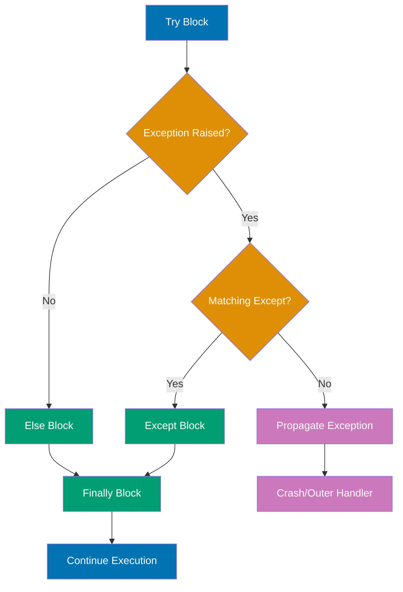

```python
# Basic try/except
def divide(a, b):
    # => Function demonstrates basic exception handling
    # => try-except structure for error recovery
    try:
        # => try block contains code that might raise exception
        # => Executes until exception or completion
        result = a / b            # => Division operation
                                  # => May raise ZeroDivisionError if b == 0
                                  # => Returns float result if successful
        return result             # => Returns result if no exception
    except ZeroDivisionError:
        # => except block handles specific exception type
        # => Executes only if ZeroDivisionError raised in try
        print("Error: Division by zero")
                                  # => Prints error message
        return None               # => Return None to indicate error
                                  # => Alternative error signaling

print(divide(10, 2))              # => Call: 10 / 2 = 5.0
                                  # => No exception, returns 5.0
                                  # => Output: 5.0
print(divide(10, 0))              # => Call: 10 / 0 raises ZeroDivisionError
                                  # => Caught by except, prints error
                                  # => Returns None
                                  # => Output: Error: Division by zero (then None)

# Multiple except clauses
def convert_to_int(value):
    # => Function shows handling multiple exception types
    # => Different handlers for different errors
    try:
        # => try block with conversion operation
        return int(value)         # => Convert value to int
                                  # => May raise ValueError (invalid format)
                                  # => May raise TypeError (wrong type)
    except ValueError:
        # => First except handles ValueError specifically
        # => Executes for format conversion errors
        print(f"ValueError: '{value}' is not a valid integer")
                                  # => Descriptive error message
        return None               # => Error indicator
    except TypeError:
        # => Second except handles TypeError specifically
        # => Executes for type compatibility errors
        print(f"TypeError: Cannot convert {type(value)} to int")
                                  # => Shows type that failed
        return None               # => Error indicator

print(convert_to_int("42"))       # => "42" is valid int format
                                  # => int("42") succeeds, returns 42
                                  # => Output: 42
print(convert_to_int("abc"))      # => "abc" not valid int format
                                  # => int("abc") raises ValueError
                                  # => Caught by first except
                                  # => Output: ValueError: 'abc' is not a valid integer (then None)
print(convert_to_int([1, 2]))     # => List cannot convert to int
                                  # => int([1,2]) raises TypeError
                                  # => Caught by second except
                                  # => Output: TypeError: Cannot convert <class 'list'> to int (then None)

# Catching multiple exceptions in one clause
def safe_operation(x, y):
    # => Function demonstrates catching multiple exception types together
    # => Tuple of exception types in single except
    try:
        # => Complex operation with multiple failure modes
        result = int(x) / int(y)  # => First: int(x) may raise ValueError
                                  # => Second: int(y) may raise ValueError
                                  # => Third: division may raise ZeroDivisionError
        return result             # => Returns result if all succeed
    except (ValueError, ZeroDivisionError) as e:
        # => Catches either ValueError OR ZeroDivisionError
        # => Tuple of exception types in parentheses
        # => 'as e' captures exception object
        print(f"Error: {type(e).__name__}: {e}")
                                  # => Prints exception type name and message
                                  # => Single handler for both error types
        return None               # => Error indicator

print(safe_operation("10", "2"))  # => Converts: int("10")=10, int("2")=2
                                  # => Division: 10 / 2 = 5.0
                                  # => No exception, returns 5.0
                                  # => Output: 5.0
print(safe_operation("abc", "2")) # => Convert: int("abc") raises ValueError
                                  # => Caught by except clause
                                  # => Output: Error: ValueError: invalid literal...
print(safe_operation("10", "0"))  # => Convert: int("10")=10, int("0")=0
                                  # => Division: 10 / 0 raises ZeroDivisionError
                                  # => Caught by except clause
                                  # => Output: Error: ZeroDivisionError: division by zero

# Accessing exception object
def parse_number(text):
    # => Function demonstrates exception object access
    # => 'as e' captures exception for inspection
    try:
        # => Attempt float conversion
        return float(text)        # => Convert text to float
                                  # => May raise ValueError
    except ValueError as e:
        # => Catches ValueError, stores in variable 'e'
        # => e is exception object with attributes
        print(f"Caught exception: {e}")
                                  # => Prints exception message (e.__str__())
                                  # => Shows what went wrong
        print(f"Exception type: {type(e)}")
                                  # => Prints exception class
                                  # => Shows exception hierarchy
        return 0.0                # => Returns default value on error
                                  # => 0.0 as fallback

result = parse_number("invalid")
                                  # => "invalid" not convertible to float
                                  # => float("invalid") raises ValueError
                                  # => Caught and handled
# => Output: Caught exception: could not convert string to float: 'invalid'
#    Exception type: <class 'ValueError'>
print(result)                     # => result is 0.0 (fallback value)
                                  # => Output: 0.0

# Try/except/else/finally
def process_file(filename):
    # => Function demonstrates complete exception handling structure
    # => try/except/else/finally all present
    try:
        # => try block: code that might raise exception
        # => Simulates file processing
        if filename == "":
            # => Validation check
            raise ValueError("Empty filename")
                                  # => Explicitly raises exception
                                  # => Validates input
        data = f"Data from {filename}"
                                  # => Success path (no exception)
                                  # => Creates result data
    except ValueError as e:
        # => except block: handles ValueError
        # => Executes if exception raised in try
        print(f"Error: {e}")      # => Prints error message
        data = None               # => Sets data to None on error
                                  # => Error indicator
    else:
        # => else block: runs ONLY if no exception in try
        # => Skipped if exception occurred
        # => Success-only code (not error handling)
        print("File processed successfully")
                                  # => Success message
                                  # => Confirms no exception
    finally:
        # => finally block: ALWAYS runs
        # => Executes after try/except/else regardless
        # => Used for cleanup (close files, release resources)
        print("Cleanup complete")
                                  # => Cleanup message
                                  # => Guaranteed execution

    return data                   # => Returns result (data or None)
                                  # => After all blocks executed

print(process_file("data.txt"))
                                  # => filename is "data.txt" (not empty)
                                  # => No exception in try
                                  # => else block executes
                                  # => finally block executes
# => Output: File processed successfully
#    Cleanup complete
#    Data from data.txt

print(process_file(""))
                                  # => filename is "" (empty)
                                  # => raise ValueError in try
                                  # => except block executes
                                  # => else block skipped
                                  # => finally block executes
# => Output: Error: Empty filename
#    Cleanup complete
#    None

# Bare except (catches all exceptions - use sparingly!)
def risky_operation():
    # => Function demonstrates bare except (no exception type)
    # => NOT RECOMMENDED - too broad, hard to debug
    try:
        # => try block with risky code
        x = 1 / 0                 # => Division by zero
                                  # => Raises ZeroDivisionError
    except:
        # => Bare except catches ALL exceptions
        # => Includes KeyboardInterrupt, SystemExit (bad!)
        # => No exception object access (no 'as e')
        print("Something went wrong")
                                  # => Generic error message
                                  # => Problem: Can't tell what went wrong!
                                  # => Hides exception details

risky_operation()                 # => Calls function
                                  # => ZeroDivisionError caught by bare except
                                  # => Output: Something went wrong
                                  # => No information about actual error

# Better: Catch specific exceptions
def better_operation():
    # => Improved version with specific exception handling
    # => Explicit exception types = better debugging
    try:
        # => Same risky code
        x = 1 / 0                 # => Raises ZeroDivisionError
    except ZeroDivisionError:
        # => Specific handler for division by zero
        # => Only catches expected error
        print("Attempted division by zero")
                                  # => Descriptive error message
                                  # => Clear what went wrong
    except Exception as e:
        # => General handler for unexpected exceptions
        # => Catches Exception subclasses (not SystemExit/KeyboardInterrupt)
        # => 'as e' provides exception details
        print(f"Unexpected error: {type(e).__name__}: {e}")
                                  # => Shows exception type and message
                                  # => Better debugging information

better_operation()                # => Calls improved function
                                  # => ZeroDivisionError matches first except
                                  # => Output: Attempted division by zero
                                  # => Clear error identification

# Re-raising exceptions
def validate_age(age):
    # => Function demonstrates re-raising exceptions
    # => Logs error but lets caller handle it
    try:
        # => Conversion and validation
        age_int = int(age)        # => Convert to int (may raise ValueError)
        if age_int < 0:
            # => Business logic validation
            raise ValueError("Age cannot be negative")
                                  # => Explicitly raises ValueError
                                  # => Custom error message
        return age_int            # => Returns valid age
    except ValueError as e:
        # => Catches ValueError from int() or validation
        # => Logs but doesn't suppress
        print(f"Validation failed: {e}")
                                  # => Logs error for monitoring
        raise                     # => Re-raises THE SAME exception
                                  # => 'raise' with no args re-raises caught exception
                                  # => Preserves exception traceback
                                  # => Lets caller decide how to handle

try:
    # => Outer try to catch re-raised exception
    validate_age("-5")            # => "-5" converts to -5
                                  # => -5 < 0 fails validation
                                  # => Raises ValueError in validate_age
                                  # => Caught, logged, re-raised
except ValueError:
    # => Catches re-raised ValueError from validate_age
    # => Exception propagated from inner function
    print("Caught re-raised exception")
                                  # => Confirms exception received
# => Output: Validation failed: Age cannot be negative (from validate_age)
#    Caught re-raised exception (from outer except)
```

**Key Takeaway**: Always catch specific exceptions rather than bare `except` to avoid masking unexpected errors - use `else` for code that should only run on success, and `finally` for cleanup that must always happen regardless of exceptions (like closing files or releasing locks).

**Why It Matters**: Local scope prevents naming conflicts and makes code easier to reason about by limiting variable visibility to function boundaries. The LEGB rule (Local, Enclosing, Global, Built-in) governs variable resolution and prevents subtle bugs from unexpected variable shadowing. Minimizing global variables improves testability and reduces coupling in production systems.

---

## Example 20: File I/O - Reading and Writing

Python provides simple file operations with automatic resource management using context managers (`with` statement).

```python
# Writing to a file
def write_example():
    # => Function demonstrates basic file writing
    # => Creates new file or overwrites existing
    with open("example.txt", "w") as file:
                                  # => open("example.txt", "w") creates file handle
                                  # => "w" mode = write (truncates if exists)
                                  # => 'as file' assigns handle to variable
                                  # => Context manager ensures file.close() called automatically
        file.write("Hello, World!\n")
                                  # => Writes 14 characters to file
                                  # => \n adds newline character
                                  # => Returns number of characters written (14)
        file.write("This is line 2.\n")
                                  # => Writes second line (17 characters)
                                  # => Appends to existing content in buffer
        file.write("This is line 3.")
                                  # => Writes third line (16 characters, no newline)
                                  # => Total file size: 47 characters
    # => with block exits here
    # => file.close() called automatically (context manager cleanup)
    # => All buffered data flushed to disk
    print("File written successfully")
                                  # => Confirms write operation completed
                                  # => Output: File written successfully

write_example()                   # => Calls function
                                  # => Creates example.txt with 3 lines in current directory

# Reading entire file
def read_entire_file():
    # => Function demonstrates reading complete file content
    # => Uses try-except for error handling
    try:
        # => Attempt to open file (may raise FileNotFoundError)
        with open("example.txt", "r") as file:
                                  # => open("example.txt", "r") opens for reading
                                  # => "r" mode = read (file must exist)
                                  # => Raises FileNotFoundError if file missing
            content = file.read() # => read() loads entire file into memory
                                  # => content is "Hello, World!\nThis is line 2.\nThis is line 3."
                                  # => Type: str (all 47 characters)
            print(content)        # => Outputs all file content
                                  # => Preserves newlines in output
    except FileNotFoundError:
        # => Catches specific exception when file doesn't exist
        # => Prevents program crash with graceful handling
        print("File not found")  # => User-friendly error message
                                  # => No stack trace shown

read_entire_file()                # => Calls function
                                  # => File exists from write_example()
# => Output: Hello, World!
#    This is line 2.
#    This is line 3.

# Reading line by line
def read_lines():
    # => Function demonstrates memory-efficient line iteration
    # => Useful for large files (doesn't load all into memory)
    try:
        # => Attempt to open file
        with open("example.txt", "r") as file:
                                  # => Opens file for reading
                                  # => File object is iterator over lines
            for line in file:     # => Iterates over lines: "Hello, World!\n", "This is line 2.\n", "This is line 3."
                                  # => Each line retains trailing newline (except possibly last)
                                  # => Memory-efficient: reads one line at a time
                print(line.strip())
                                  # => strip() removes leading/trailing whitespace
                                  # => Removes \n from end of line
                                  # => Outputs clean text without extra newline
    except FileNotFoundError:
        # => Handles missing file case
        print("File not found")  # => Graceful error handling

read_lines()                      # => Calls function
                                  # => Iterates through all 3 lines
# => Output: Hello, World!
#    This is line 2.
#    This is line 3.

# Reading into list
def read_as_list():
    # => Function demonstrates loading all lines into list
    # => Trade-off: more memory, but can manipulate lines
    try:
        # => Attempt to open file
        with open("example.txt", "r") as file:
                                  # => Opens file for reading
            lines = file.readlines()
                                  # => readlines() returns list of all lines
                                  # => Each line includes trailing \n
                                  # => lines is ['Hello, World!\n', 'This is line 2.\n', 'This is line 3.']
                                  # => Type: list (3 elements)
                                  # => All content loaded into memory at once
            print(lines)          # => Outputs list representation
                                  # => Shows quotes and \n characters
    except FileNotFoundError:
        # => Handles missing file case
        print("File not found")  # => Graceful error handling

read_as_list()                    # => Calls function
                                  # => Loads all lines into memory
# => Output: ['Hello, World!\n', 'This is line 2.\n', 'This is line 3.']

# Appending to file
def append_example():
    # => Function demonstrates appending to existing file
    # => Preserves existing content
    with open("example.txt", "a") as file:
                                  # => open("example.txt", "a") opens for appending
                                  # => "a" mode = append (creates if doesn't exist)
                                  # => File pointer positioned at end
                                  # => Existing content preserved
        file.write("\nAppended line.")
                                  # => Writes newline first (4th line)
                                  # => Then writes "Appended line." (15 characters)
                                  # => Total added: 16 characters
                                  # => New file size: 63 characters (47 + 16)
    # => Context manager closes file, flushes buffers
    print("Line appended")        # => Confirms append completed
                                  # => Output: Line appended

append_example()                  # => Calls function
                                  # => example.txt now has 4 lines

# Reading and writing (r+, w+, a+)
def read_write_example():
    # => Function demonstrates read+write mode
    # => Can both read and write in same handle
    with open("example.txt", "r+") as file:
                                  # => "r+" mode = read and write
                                  # => File must exist (like "r")
                                  # => File pointer starts at beginning
        content = file.read()     # => Reads all existing content
                                  # => File pointer now at end after read()
                                  # => content contains all 4 lines (63 chars)
        file.write("\nAdditional line")
                                  # => Writes at current position (end)
                                  # => Adds newline + "Additional line" (17 chars)
                                  # => New file size: 80 characters
    # => Context manager closes file
    print("Read and write complete")
                                  # => Confirms operation completed
                                  # => Output: Read and write complete

read_write_example()              # => Calls function
                                  # => example.txt now has 5 lines

# File modes summary:
# "r"  - Read (default, file must exist, pointer at start)
# "w"  - Write (creates file, truncates if exists, pointer at start)
# "a"  - Append (creates if doesn't exist, pointer at end)
# "r+" - Read and write (file must exist, pointer at start)
# "w+" - Write and read (creates file, truncates if exists, pointer at start)
# "a+" - Append and read (creates if doesn't exist, pointer at end)
# "b"  - Binary mode (combine with above: "rb", "wb", etc.)

# Binary file operations
def binary_example():
    # => Function demonstrates binary file operations
    # => Binary mode for non-text data (images, audio, etc.)

    # Write binary data
    with open("binary.dat", "wb") as file:
                                  # => "wb" mode = write binary
                                  # => Creates new binary file
        data = bytes([65, 66, 67])# => Creates bytes object from list of integers
                                  # => ASCII: 65='A', 66='B', 67='C'
                                  # => data is b'ABC' (type: bytes, 3 bytes)
        file.write(data)          # => Writes 3 bytes to file
                                  # => Returns 3 (bytes written)
                                  # => binary.dat size: 3 bytes
    # => File closed, data flushed

    # Read binary data
    with open("binary.dat", "rb") as file:
                                  # => "rb" mode = read binary
                                  # => Opens existing binary file
        content = file.read()     # => Reads all bytes from file
                                  # => content is b'ABC' (type: bytes)
                                  # => 3 bytes loaded into memory
        print(content)            # => Outputs bytes representation
                                  # => Output: b'ABC'
        print(list(content))      # => Converts bytes to list of integers
                                  # => list(content) is [65, 66, 67]
                                  # => Output: [65, 66, 67]

binary_example()                  # => Calls function
                                  # => Creates and reads binary.dat

# File operations without context manager (manual close - not recommended)
def manual_close_example():
    # => Demonstrates old-style file handling
    # => Error-prone: must remember to close
    file = open("example.txt", "r")
                                  # => Opens file, returns file handle
                                  # => No automatic cleanup
                                  # => Caller responsible for closing
    try:
        # => try-finally ensures cleanup even on error
        content = file.read()     # => Reads file content
                                  # => If exception here, finally still runs
        print(content)            # => Outputs content
    finally:
        # => finally block ALWAYS runs
        # => Even if exception in try block
        file.close()              # => Manually closes file
                                  # => Releases file handle to OS
                                  # => Must remember to call!

# Better: Use with statement (automatic cleanup)
def context_manager_example():
    # => Modern Pythonic approach
    # => Context manager handles cleanup automatically
    with open("example.txt", "r") as file:
                                  # => with calls file.__enter__()
                                  # => Returns file handle
        content = file.read()     # => Reads content
                                  # => If exception, cleanup still happens
        print(content)            # => Outputs content
    # => with calls file.__exit__() automatically
    # => Guarantees file.close() even if exception
    # => No manual close() needed
    # => Exception-safe, concise

# Check if file exists before opening
import os                         # => Imports os module for filesystem operations
                                  # => Provides os.path utilities

def safe_read(filename):
    # => Function with pre-opening validation
    # => Avoids exception handling for expected case
    if os.path.exists(filename):  # => Checks if file exists on filesystem
                                  # => Returns True if file/directory exists
                                  # => Avoids FileNotFoundError
        with open(filename, "r") as file:
                                  # => Opens existing file for reading
                                  # => Safe to open (exists check passed)
            return file.read()    # => Reads and returns file content
                                  # => Returns str with file contents
    else:
        # => File doesn't exist case
        # => Handles gracefully without exception
        print(f"{filename} does not exist")
                                  # => User-friendly message
                                  # => Shows which file missing
        return None               # => Returns None to indicate failure
                                  # => Caller can check for None

result = safe_read("example.txt")# => Calls with existing file
                                  # => os.path.exists() returns True
                                  # => File opened and read
                                  # => result contains file content (str)
# => Returns content if file exists

result = safe_read("nonexistent.txt")
                                  # => Calls with missing file
                                  # => os.path.exists() returns False
                                  # => Enters else block
# => Output: nonexistent.txt does not exist
# => result is None (no content returned)
```

**Key Takeaway**: Always use context managers (`with` statement) for file operations - they automatically handle closing files even if exceptions occur. Use `"r"`/`"w"`/`"a"` modes appropriately (write truncates, append preserves), and iterate over file objects directly for memory-efficient line-by-line reading.

**Why It Matters**: Lambda functions provide concise function definitions for simple transformations in functional-style operations like map, filter, and sorted. Their single-expression limitation encourages separation of complex logic into named functions, improving code maintainability. However, named functions are preferred in production code for testability and debuggability unless the logic is trivial.

---

## Example 21: Classes - Basics

Classes define custom types with data (attributes) and behavior (methods). Python uses `self` to reference the instance within methods.

```python
# Basic class definition
class Dog:
    """Represents a dog with name and age."""
    # => Defines new type called Dog
    # => Can create multiple Dog objects (instances)

    def __init__(self, name, age):
        """Initialize dog with name and age."""
        # => __init__ = constructor method
        # => Called automatically when creating instances
        # => self = reference to the instance being created
        self.name = name          # => Create instance attribute name
                                  # => self.name stores name for THIS dog
        self.age = age            # => Create instance attribute age
                                  # => Each dog has its own age

    def bark(self):
        """Make the dog bark."""
        # => Instance method (has self parameter)
        # => Can access instance attributes via self
        return f"{self.name} says Woof!"
                                  # => Returns string using this dog's name

# Creating instances
dog1 = Dog("Buddy", 3)            # => Calls Dog.__init__(dog1, "Buddy", 3)
                                  # => dog1 is Dog object with name="Buddy", age=3
                                  # => Instance variables: dog1.name, dog1.age
dog2 = Dog("Max", 5)              # => Creates DIFFERENT Dog object
                                  # => dog2.name="Max", dog2.age=5
                                  # => Separate from dog1

# Accessing attributes
print(dog1.name)                  # => Access instance attribute
                                  # => Output: Buddy
print(dog2.age)                   # => Access different instance's attribute
                                  # => Output: 5

# Calling methods
print(dog1.bark())                # => Calls bark method on dog1
                                  # => self=dog1, uses dog1.name
                                  # => Output: Buddy says Woof!
print(dog2.bark())                # => Calls bark method on dog2
                                  # => self=dog2, uses dog2.name
                                  # => Output: Max says Woof!

# Class attributes (shared by all instances)
class Circle:
    """Represents a circle."""
    pi = 3.14159                  # => Class attribute (shared)
                                  # => Defined at class level (not in __init__)
                                  # => All Circle instances share same pi value

    def __init__(self, radius):
        # => Constructor for Circle
        self.radius = radius      # => Instance attribute (unique per instance)
                                  # => Each circle has its own radius

    def area(self):
        """Calculate circle area."""
        # => Method uses both class attribute (pi) and instance attribute (radius)
        return Circle.pi * self.radius ** 2
                                  # => Circle.pi accesses class attribute
                                  # => self.radius accesses instance attribute
                                  # => Returns area = π × r²

circle1 = Circle(5)               # => circle1 = Circle object with radius=5
                                  # => circle1.radius = 5
circle2 = Circle(10)              # => circle2 = Circle object with radius=10
                                  # => circle2.radius = 10

print(circle1.area())             # => Calls area() on circle1
                                  # => 3.14159 × 5² = 78.53975
                                  # => Output: 78.53975
print(circle2.area())             # => Calls area() on circle2
                                  # => 3.14159 × 10² = 314.159
                                  # => Output: 314.159

# Access class attribute through class or instance
print(Circle.pi)                  # => Access via class name
                                  # => Output: 3.14159 (via class)
print(circle1.pi)                 # => Access via instance
                                  # => Python looks in instance first, then class
                                  # => Output: 3.14159 (via instance)

# Instance methods vs static methods vs class methods
class MathOperations:
    """Demonstrates different method types."""

    multiplier = 2                # => Class attribute
                                  # => Shared by all instances

    def instance_method(self, x):
        """Instance method (has access to self)."""
        # => Regular method with self parameter
        # => Can access instance and class attributes
        return x * self.multiplier  # => Uses class attribute via instance
                                  # => 5 * 2 = 10

    @staticmethod
    def static_method(x, y):
        """Static method (no access to self or cls)."""
        # => No self or cls parameter
        # => Cannot access instance or class attributes
        # => Just a regular function in class namespace
        return x + y              # => Simple addition
                                  # => 3 + 4 = 7

    @classmethod
    def class_method(cls, x):
        """Class method (has access to cls, not self)."""
        # => Has cls parameter (class itself)
        # => Can access class attributes, not instance attributes
        return x * cls.multiplier  # => Uses class attribute via cls
                                  # => 5 * 2 = 10

math = MathOperations()           # => Create instance of MathOperations

# Instance method (needs instance)
print(math.instance_method(5))    # => Calls with instance (self=math)
                                  # => 5 * math.multiplier = 5 * 2
                                  # => Output: 10

# Static method (can call on class or instance)
print(MathOperations.static_method(3, 4))
                                  # => Call via class name
                                  # => No self/cls passed
                                  # => Output: 7 (3 + 4)
print(math.static_method(3, 4))   # => Call via instance
                                  # => Still no self passed
                                  # => Output: 7 (same result)

# Class method (can call on class or instance)
print(MathOperations.class_method(5))
                                  # => Call via class (cls=MathOperations)
                                  # => 5 * MathOperations.multiplier
                                  # => Output: 10 (5 × 2)
print(math.class_method(5))       # => Call via instance
                                  # => cls still = MathOperations
                                  # => Output: 10 (same result)

# String representation
class Point:
    """Represents a 2D point."""

    def __init__(self, x, y):
        # => Constructor sets x and y coordinates
        self.x = x                # => x coordinate
        self.y = y                # => y coordinate

    def __str__(self):
        """Human-readable string representation."""
        # => Called by print() and str()
        # => Returns user-friendly format
        return f"Point({self.x}, {self.y})"

    def __repr__(self):
        """Developer-friendly representation."""
        # => Called by repr() and in REPL
        # => Returns unambiguous format
        return f"Point(x={self.x}, y={self.y})"

p = Point(3, 4)                   # => p is Point object with x=3, y=4
print(p)                          # => Calls p.__str__()
                                  # => Output: Point(3, 4)
print(repr(p))                    # => Calls p.__repr__()
                                  # => Output: Point(x=3, y=4)

# Private attributes (convention: prefix with _)
class BankAccount:
    """Represents a bank account."""

    def __init__(self, balance):
        # => Initialize with starting balance
        self._balance = balance   # => "Private" by convention (single underscore)
                                  # => Not enforced by Python
                                  # => Signals "internal use only"

    def deposit(self, amount):
        """Deposit money."""
        # => Public method to safely modify balance
        if amount > 0:            # => Validate amount is positive
            self._balance += amount  # => Update private attribute
                                  # => _balance = 100 + 50 = 150
            return True           # => Indicate success
        return False              # => Indicate failure for invalid amount

    def get_balance(self):
        """Get current balance."""
        # => Getter method for private attribute
        return self._balance      # => Returns current balance

account = BankAccount(100)        # => account._balance = 100
                                  # => Initial balance set
account.deposit(50)               # => Calls deposit with amount=50
                                  # => _balance = 100 + 50 = 150
                                  # => Returns True
print(account.get_balance())      # => Calls getter method
                                  # => Returns _balance = 150
                                  # => Output: 150

# Can still access "private" attribute (not truly private!)
print(account._balance)           # => Direct access possible
                                  # => Python doesn't enforce privacy
                                  # => Output: 150 (discouraged but works)
```

**Key Takeaway**: Use `__init__` for initialization, `self` to reference instance attributes/methods, and class attributes for shared data - follow conventions like single underscore prefix for "private" attributes (not enforced, just convention) and implement `__str__`/`__repr__` for readable object representations.

**Why It Matters**: Map applies functions to sequences without explicit loops, expressing transformations more declaratively and enabling potential parallel execution optimizations. Filter creates subsequences based on predicates with clearer intent than manual conditional appending. However, list comprehensions are often preferred in modern Python for their readability and equivalent performance.

---

## Example 22: Classes - Inheritance

Inheritance allows classes to extend other classes, inheriting attributes and methods while adding or overriding functionality.

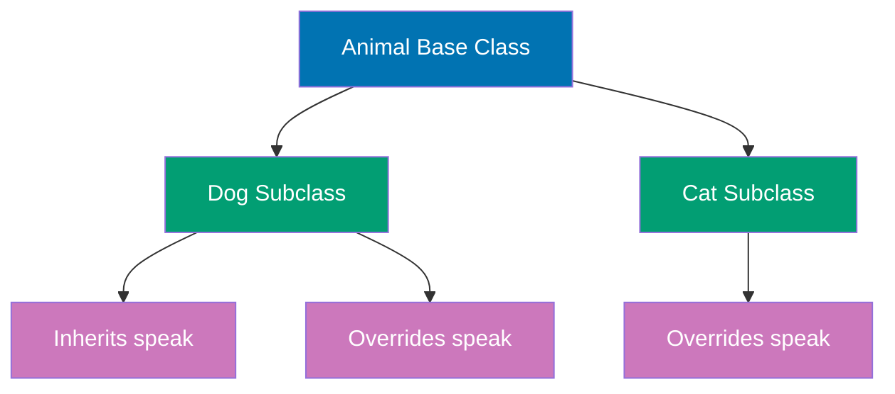

```python
# Base class
class Animal:
    """Base class for all animals."""
    # => Parent class that other classes inherit from

    def __init__(self, name, species):
        # => Constructor for base class
        self.name = name          # => Instance attribute name
        self.species = species    # => Instance attribute species

    def speak(self):
        """Generic animal sound."""
        # => Base implementation (can be overridden)
        return f"{self.name} makes a sound"
                                  # => Generic message for any animal

    def info(self):
        """Return animal information."""
        # => Method available to all animals
        return f"{self.name} is a {self.species}"
                                  # => Returns name and species

# Derived class (inherits from Animal)
class Dog(Animal):
    """Dog class inheriting from Animal."""
    # => Dog(Animal) means Dog inherits from Animal
    # => Dog gets all Animal's methods and attributes

    def __init__(self, name, breed):
        # => Dog constructor
        # => Takes name and breed (NOT species)
        # Call parent __init__
        super().__init__(name, "Dog")
                                  # => super() calls Animal.__init__
                                  # => Sets self.name = name
                                  # => Sets self.species = "Dog"
        self.breed = breed        # => Additional Dog-specific attribute
                                  # => Not in Animal class

    # Override parent method
    def speak(self):
        """Dog-specific sound."""
        # => Replaces Animal.speak() for Dog instances
        # => Called instead of parent version
        return f"{self.name} says Woof!"
                                  # => Dog-specific implementation

    # Additional method
    def fetch(self):
        """Dog-specific behavior."""
        # => New method NOT in Animal class
        # => Only Dog instances have this
        return f"{self.name} fetches the ball"

# Using derived class
dog = Dog("Buddy", "Golden Retriever")
                                  # => Calls Dog.__init__("Buddy", "Golden Retriever")
                                  # => Which calls Animal.__init__("Buddy", "Dog")
                                  # => dog.name = "Buddy"
                                  # => dog.species = "Dog"
                                  # => dog.breed = "Golden Retriever"

print(dog.info())                 # => Calls inherited Animal.info()
                                  # => Dog didn't override this method
                                  # => Output: Buddy is a Dog
print(dog.speak())                # => Calls overridden Dog.speak()
                                  # => NOT Animal.speak()
                                  # => Output: Buddy says Woof!
print(dog.fetch())                # => Calls Dog-specific method
                                  # => Not available on Animal
                                  # => Output: Buddy fetches the ball

# Another derived class
class Cat(Animal):
    """Cat class inheriting from Animal."""

    def __init__(self, name, color):
        super().__init__(name, "Cat")
        self.color = color

    def speak(self):
        """Cat-specific sound."""
        return f"{self.name} says Meow!"

    def scratch(self):
        """Cat-specific behavior."""
        return f"{self.name} scratches the furniture"

cat = Cat("Whiskers", "Orange")   # => cat is Cat object

print(cat.info())                 # => Output: Whiskers is a Cat
print(cat.speak())                # => Output: Whiskers says Meow!
print(cat.scratch())              # => Output: Whiskers scratches the furniture

# Polymorphism - same interface, different behavior
def animal_concert(animals):
    """Make all animals speak."""
    for animal in animals:
        print(animal.speak())     # => Calls appropriate speak() for each type

animals = [
    Dog("Buddy", "Golden Retriever"),
    Cat("Whiskers", "Orange"),
    Animal("Generic", "Unknown")
]

animal_concert(animals)
# => Output: Buddy says Woof!
#    Whiskers says Meow!
#    Generic makes a sound

# Multiple inheritance
class Flyer:
    """Mixin for flying behavior."""

    def fly(self):
        return f"{self.name} is flying"

class Bird(Animal, Flyer):
    """Bird class with multiple inheritance."""

    def __init__(self, name, can_fly=True):
        super().__init__(name, "Bird")
        self.can_fly = can_fly

    def speak(self):
        return f"{self.name} says Tweet!"

bird = Bird("Tweety")             # => bird inherits from Animal and Flyer

print(bird.info())                # => Output: Tweety is a Bird (from Animal)
print(bird.speak())               # => Output: Tweety says Tweet! (overridden)
print(bird.fly())                 # => Output: Tweety is flying (from Flyer)

# isinstance() and issubclass()
print(isinstance(dog, Dog))       # => Output: True
print(isinstance(dog, Animal))    # => Output: True (Dog is subclass of Animal)
print(isinstance(dog, Cat))       # => Output: False

print(issubclass(Dog, Animal))    # => Output: True
print(issubclass(Dog, Cat))       # => Output: False

# Method Resolution Order (MRO)
print(Bird.__mro__)               # => Output: (Bird, Animal, Flyer, object)
                                  # => Shows inheritance chain

# Calling parent method explicitly
class Employee:
    """Base employee class."""

    def __init__(self, name, salary):
        self.name = name
        self.salary = salary

    def annual_salary(self):
        return self.salary * 12

class Manager(Employee):
    """Manager with bonus."""

    def __init__(self, name, salary, bonus):
        super().__init__(name, salary)
        self.bonus = bonus

    def annual_salary(self):
        # Call parent method and add bonus
        base = super().annual_salary()# => Get base annual salary
        return base + self.bonus

manager = Manager("Alice", 5000, 10000)
                                  # => manager has salary=5000, bonus=10000

print(manager.annual_salary())    # => Output: 70000 (5000×12 + 10000)
```

**Key Takeaway**: Use `super()` to call parent class methods, especially `__init__` for proper initialization - inheritance enables code reuse and polymorphism (same interface, different behavior), but prefer composition over deep inheritance hierarchies to avoid complexity.

**Why It Matters**: File context managers guarantee resource cleanup even when exceptions occur, preventing resource leaks that plague manual file handling. The with statement makes resource management patterns explicit and reduces boilerplate compared to try-finally blocks. Understanding context managers is essential for reliable production systems handling files, network connections, and database transactions.

---

## Example 23: Class Properties and Magic Methods

Properties provide controlled access to attributes, while magic methods (double underscores) enable operator overloading and Python protocol implementations.

```python
# Properties with @property decorator
class Temperature:
    """Temperature class with Celsius and Fahrenheit."""
    # => Defines class for temperature conversions
    # => Uses properties for controlled attribute access

    def __init__(self, celsius):
        # => Constructor takes initial Celsius value
        self._celsius = celsius   # => Private attribute (underscore convention)
                                  # => Stores internal state in Celsius

    @property
    def celsius(self):
        """Get Celsius temperature."""
        # => @property decorator makes method accessible as attribute
        # => Getter method for celsius (no parentheses needed)
        return self._celsius      # => Returns private _celsius value
                                  # => Enables controlled read access

    @celsius.setter
    def celsius(self, value):
        """Set Celsius temperature."""
        # => @celsius.setter creates setter for celsius property
        # => Enables validation when setting temperature
        if value < -273.15:
            # => Checks for absolute zero (-273.15°C)
            raise ValueError("Temperature below absolute zero")
            # => Raises exception for invalid temperature
        self._celsius = value     # => Updates private attribute if valid
                                  # => Maintains class invariants

    @property
    def fahrenheit(self):
        """Get Fahrenheit temperature (computed)."""
        # => Property computed from celsius (no stored value)
        # => Conversion formula: F = C × 9/5 + 32
        return self._celsius * 9/5 + 32
        # => Always calculates from current celsius
        # => Ensures consistency (no stale data)

    @fahrenheit.setter
    def fahrenheit(self, value):
        """Set Fahrenheit temperature (updates Celsius)."""
        # => Setting fahrenheit updates underlying celsius
        # => Conversion formula: C = (F - 32) × 5/9
        self._celsius = (value - 32) * 5/9
        # => Stores result in celsius (single source of truth)
        # => Maintains consistency between representations

temp = Temperature(25)            # => Constructs Temperature with 25°C
                                  # => temp._celsius is 25 (type: float)
                                  # => Properties available for access

# Access via property (looks like attribute)
print(temp.celsius)               # => Accesses celsius property (calls getter)
                                  # => Output: 25
print(temp.fahrenheit)            # => Accesses fahrenheit property (calls getter)
                                  # => Computed: 25 * 9/5 + 32 = 77.0
                                  # => Output: 77.0

# Set via property (calls setter)
temp.celsius = 30                 # => Calls celsius.setter with value 30
                                  # => Validates: 30 >= -273.15 (passes)
                                  # => temp._celsius is now 30
print(temp.celsius)               # => Output: 30
print(temp.fahrenheit)            # => Recomputed: 30 * 9/5 + 32 = 86.0
                                  # => Output: 86.0

temp.fahrenheit = 68              # => Calls fahrenheit.setter with value 68
                                  # => Converts: (68 - 32) * 5/9 = 20.0
                                  # => temp._celsius updated to 20.0
print(temp.celsius)               # => Output: 20.0
                                  # => Shows updated celsius value

# Validation in setter
try:
    temp.celsius = -300           # => Attempts invalid temperature
                                  # => -300 < -273.15 (below absolute zero)
except ValueError as e:
    # => Catches ValueError from setter validation
    print(f"Error: {e}")          # => Output: Error: Temperature below absolute zero
                                  # => Exception message from setter

# Magic methods for arithmetic
class Vector:
    """2D vector with operator overloading."""
    # => Defines 2D vector class with x, y coordinates
    # => Implements magic methods for operators (+, -, *, ==)

    def __init__(self, x, y):
        # => Constructor takes x and y coordinates
        self.x = x                # => Stores x coordinate (type: int/float)
        self.y = y                # => Stores y coordinate (type: int/float)

    def __str__(self):
        """String representation."""
        # => __str__ defines string representation for print()
        # => Called by str() and print() functions
        return f"Vector({self.x}, {self.y})"
        # => Returns formatted string showing coordinates

    def __add__(self, other):
        """Vector addition (v1 + v2)."""
        # => __add__ enables + operator: v1 + v2
        # => Component-wise addition: (x1+x2, y1+y2)
        return Vector(self.x + other.x, self.y + other.y)
        # => Returns NEW Vector (doesn't modify originals)
        # => Addition is commutative in math, here too

    def __sub__(self, other):
        """Vector subtraction (v1 - v2)."""
        # => __sub__ enables - operator: v1 - v2
        # => Component-wise subtraction: (x1-x2, y1-y2)
        return Vector(self.x - other.x, self.y - other.y)
        # => Returns NEW Vector (immutable operation)
        # => Creates vector from self to other

    def __mul__(self, scalar):
        """Scalar multiplication (v * scalar)."""
        # => __mul__ enables * operator: v * scalar
        # => Scales both components by scalar
        return Vector(self.x * scalar, self.y * scalar)
        # => Returns NEW Vector with scaled components
        # => Useful for scaling, direction changes

    def __eq__(self, other):
        """Equality comparison (v1 == v2)."""
        # => __eq__ enables == operator: v1 == v2
        # => Compares both x and y components
        return self.x == other.x and self.y == other.y
        # => Returns True if both components equal
        # => Returns False if ANY component differs

    def __len__(self):
        """Length (magnitude) of vector."""
        # => __len__ enables len() function: len(v)
        # => Calculates magnitude: √(x²+y²)
        return int((self.x ** 2 + self.y ** 2) ** 0.5)
        # => Pythagorean theorem for magnitude
        # => Returns int (len() requires integer)

v1 = Vector(3, 4)                 # => Constructs Vector with x=3, y=4
                                  # => v1.x is 3, v1.y is 4
v2 = Vector(1, 2)                 # => Constructs Vector with x=1, y=2
                                  # => v2.x is 1, v2.y is 2

print(v1 + v2)                    # => Calls v1.__add__(v2)
                                  # => Component-wise: (3+1, 4+2) = (4, 6)
                                  # => Output: Vector(4, 6)
print(v1 - v2)                    # => Calls v1.__sub__(v2)
                                  # => Component-wise: (3-1, 4-2) = (2, 2)
                                  # => Output: Vector(2, 2)
print(v1 * 2)                     # => Calls v1.__mul__(2)
                                  # => Scales: (3*2, 4*2) = (6, 8)
                                  # => Output: Vector(6, 8)
print(v1 == v2)                   # => Calls v1.__eq__(v2)
                                  # => Compares: (3,4) vs (1,2)
                                  # => Output: False (coordinates differ)
print(v1 == Vector(3, 4))         # => Creates temporary Vector(3, 4)
                                  # => Compares: (3,4) vs (3,4)
                                  # => Output: True (coordinates match)
print(len(v1))                    # => Calls v1.__len__()
                                  # => Magnitude: √(3²+4²) = √25 = 5
                                  # => Output: 5

# Magic methods for containers
class Playlist:
    """Music playlist with container magic methods."""
    # => Implements container protocol (__len__, __getitem__, etc.)
    # => Behaves like built-in list but with custom behavior

    def __init__(self):
        # => Constructor initializes empty song list
        self._songs = []          # => Private list to store songs
                                  # => Encapsulates internal storage

    def add(self, song):
        """Add song to playlist."""
        # => Public method to add songs
        self._songs.append(song)  # => Appends song to internal list
                                  # => Maintains insertion order

    def __len__(self):
        """Number of songs (len(playlist))."""
        # => __len__ enables len() function
        # => Delegates to internal list's length
        return len(self._songs)   # => Returns count of songs
                                  # => Required for container protocol

    def __getitem__(self, index):
        """Access song by index (playlist[0])."""
        # => __getitem__ enables bracket notation: playlist[i]
        # => Supports positive and negative indices
        return self._songs[index] # => Returns song at index
                                  # => Raises IndexError if out of bounds

    def __setitem__(self, index, song):
        """Set song at index (playlist[0] = "song")."""
        # => __setitem__ enables assignment: playlist[i] = song
        # => Allows in-place modification
        self._songs[index] = song # => Updates song at index
                                  # => Maintains list mutability

    def __contains__(self, song):
        """Check if song in playlist ("song" in playlist)."""
        # => __contains__ enables 'in' operator
        # => Membership testing
        return song in self._songs
        # => Returns True if song found
        # => Returns False if song not in playlist

    def __iter__(self):
        """Make playlist iterable."""
        # => __iter__ enables for loops: for song in playlist
        # => Returns iterator over songs
        return iter(self._songs)  # => Delegates to list's iterator
                                  # => Enables foreach-style iteration

playlist = Playlist()             # => Constructs empty Playlist
                                  # => playlist._songs is []

playlist.add("Song A")            # => Appends "Song A" to internal list
                                  # => playlist._songs is ["Song A"]
playlist.add("Song B")            # => Appends "Song B" to list
                                  # => playlist._songs is ["Song A", "Song B"]
playlist.add("Song C")            # => Appends "Song C" to list
                                  # => playlist._songs is ["Song A", "Song B", "Song C"]

print(len(playlist))              # => Calls playlist.__len__()
                                  # => Returns 3 (number of songs)
                                  # => Output: 3
print(playlist[0])                # => Calls playlist.__getitem__(0)
                                  # => Returns first song
                                  # => Output: Song A
print("Song B" in playlist)       # => Calls playlist.__contains__("Song B")
                                  # => Checks membership
                                  # => Output: True

# Iterate over playlist
for song in playlist:             # => Calls playlist.__iter__()
                                  # => Gets iterator, loops over songs
    print(song)                   # => Prints each song
                                  # => Output: Song A (first iteration)
                                  # => Output: Song B (second iteration)
                                  # => Output: Song C (third iteration)

playlist[1] = "Song X"            # => Calls playlist.__setitem__(1, "Song X")
                                  # => Replaces "Song B" with "Song X"
                                  # => playlist._songs is ["Song A", "Song X", "Song C"]
print(playlist[1])                # => Calls playlist.__getitem__(1)
                                  # => Returns updated song at index 1
                                  # => Output: Song X

# Context manager magic methods
class FileLogger:
    """Context manager for file logging."""
    # => Implements context manager protocol (__enter__, __exit__)
    # => Enables 'with' statement for automatic resource cleanup

    def __init__(self, filename):
        # => Constructor stores filename for later use
        self.filename = filename  # => Stores filename as instance attribute
                                  # => File not opened yet (lazy opening)

    def __enter__(self):
        """Called when entering with block."""
        # => __enter__ called automatically at start of 'with' block
        # => Performs setup operations (opening file)
        print(f"Opening {self.filename}")
        # => Diagnostic output showing entry
        self.file = open(self.filename, "w")
        # => Opens file for writing (creates if not exists)
        # => Stores file handle as instance attribute
        return self.file          # => Returns file object
                                  # => Becomes value of 'as' variable

    def __exit__(self, exc_type, exc_val, exc_tb):
        """Called when exiting with block (even on exception)."""
        # => __exit__ called automatically at end of 'with' block
        # => Performs cleanup (closing file) even if exception occurred
        # => Parameters: exception type, value, traceback (or None)
        print(f"Closing {self.filename}")
        # => Diagnostic output showing exit
        self.file.close()         # => Closes file handle (flushes buffers)
                                  # => Releases system resources
        return False              # => False means propagate exceptions
                                  # => True would suppress exceptions

# Use custom context manager
with FileLogger("log.txt") as log_file:
    # => Calls FileLogger("log.txt").__enter__()
    # => log_file receives returned file object
    # => Output: Opening log.txt
    log_file.write("Log entry 1\n")
    # => Writes first line to file
    # => Buffered until close
    log_file.write("Log entry 2\n")
    # => Writes second line to file
# => Calls __exit__ automatically after block
# => Output: Closing log.txt
# => File closed and flushed (even if exception occurred)

# Callable objects
class Multiplier:
    """Callable class that multiplies by a factor."""
    # => Class instances can be called like functions
    # => Implements __call__ magic method

    def __init__(self, factor):
        # => Constructor stores multiplication factor
        self.factor = factor      # => Stores factor as instance attribute
                                  # => Each instance has its own factor

    def __call__(self, x):
        """Make instance callable like a function."""
        # => __call__ enables instance(x) syntax
        # => Instance behaves like function
        return x * self.factor    # => Multiplies argument by stored factor
                                  # => Returns computed result

times_three = Multiplier(3)       # => times_three is Multiplier object
print(times_three(10))            # => Output: 30 (uses __call__)
print(times_three(5))             # => Output: 15
```

**Key Takeaway**: Properties provide clean getter/setter interfaces without explicit method calls - use magic methods to make custom classes integrate seamlessly with Python operators and built-in functions, enabling natural, Pythonic APIs for your objects.

**Why It Matters**: Exception handling enables separation of error paths from happy paths, improving code readability and maintainability. The try-except-else-finally pattern provides fine-grained control over error handling and cleanup logic. However, exceptions should be used for exceptional conditions, not control flow, to maintain performance in production systems.

---

## Example 24: Modules and Imports

Modules organize code into reusable files, with imports enabling access to functions, classes, and variables from other modules.

```python
# Module: math_utils.py (example structure)
"""
# math_utils.py - Example module structure

def add(a, b):
    '''Add two numbers.'''
    return a + b

def multiply(a, b):
    '''Multiply two numbers.'''
    return a * b

PI = 3.14159

class Calculator:
    '''Simple calculator class.'''
    def __init__(self):
        self.result = 0

    def add(self, x):
        self.result += x
        return self.result
"""

# Import entire module
import math                       # => Import standard library math module

print(math.pi)                    # => Output: 3.141592653589793
print(math.sqrt(16))              # => Output: 4.0
print(math.sin(math.pi / 2))      # => Output: 1.0

# Import with alias
import math as m                  # => Import with shorter name

print(m.pi)                       # => Output: 3.141592653589793
print(m.cos(0))                   # => Output: 1.0

# Import specific items
from math import pi, sqrt         # => Import only pi and sqrt

print(pi)                         # => Output: 3.141592653589793 (no math. prefix)
print(sqrt(25))                   # => Output: 5.0

# Import with alias
from math import factorial as fact

print(fact(5))                    # => Output: 120 (5!)

# Import all (discouraged - namespace pollution)
# from math import *              # => Imports everything (avoid in production)

# Importing from packages
from collections import Counter, defaultdict

# Counter - count occurrences
words = ["apple", "banana", "apple", "cherry", "banana", "apple"]
counts = Counter(words)           # => counts is Counter({'apple': 3, 'banana': 2, 'cherry': 1})
print(counts)                     # => Output: Counter({'apple': 3, 'banana': 2, 'cherry': 1})
print(counts["apple"])            # => Output: 3

# defaultdict - dictionary with default values
scores = defaultdict(int)         # => Default value is 0 (int())
scores["Alice"] = 95
scores["Bob"] = 87
print(scores["Alice"])            # => Output: 95
print(scores["Charlie"])          # => Output: 0 (default for missing key)

# Nested imports
from collections.abc import Iterable

print(isinstance([1, 2, 3], Iterable))
                                  # => Output: True (lists are iterable)

# Module search path
import sys

print(sys.path)                   # => Output: List of directories Python searches
                                  # => Includes: current directory, PYTHONPATH, standard library

# Checking module attributes
import datetime

print(dir(datetime))              # => Output: List of all module attributes
                                  # => Includes: date, datetime, time, timedelta, etc.

# Using datetime example
from datetime import datetime, timedelta

now = datetime.now()              # => now is current datetime
print(now)                        # => Output: 2025-12-29 17:31:19.123456 (example)

tomorrow = now + timedelta(days=1)# => tomorrow is 24 hours from now
print(tomorrow)                   # => Output: 2025-12-30 17:31:19.123456

# Module __name__ attribute
# When script is run directly: __name__ == "__main__"
# When script is imported: __name__ == module name

# Example pattern (common in Python scripts):
"""
# example_script.py

def main():
    '''Main function.'''
    print("Running main function")

if __name__ == "__main__":
    # This runs only if script is executed directly
    main()
else:
    # This runs when module is imported
    print("Module imported")
"""

# Demonstrating __name__
print(f"Current module: {__name__}")
                                  # => Output: __main__ (if running directly)

# Package structure example:
"""
my_package/
├── __init__.py          # Makes directory a package
├── module1.py
├── module2.py
└── subpackage/
    ├── __init__.py
    └── module3.py

# Importing from package:
from my_package import module1
from my_package.subpackage import module3
"""

# Standard library useful modules
import os                         # => Operating system interface
import json                       # => JSON encoding/decoding
import random                     # => Random number generation

# os examples
print(os.getcwd())                # => Output: /current/working/directory
# print(os.listdir('.'))          # => List files in current directory

# json examples
data = {"name": "Alice", "age": 30}
json_string = json.dumps(data)    # => json_string is '{"name": "Alice", "age": 30}'
print(json_string)                # => Output: {"name": "Alice", "age": 30}

parsed = json.loads(json_string)  # => parsed is {"name": "Alice", "age": 30} (dict)
print(parsed["name"])             # => Output: Alice

# random examples
print(random.randint(1, 10))      # => Output: Random integer 1-10
print(random.choice(["a", "b", "c"]))
                                  # => Output: Random element from list
numbers = [1, 2, 3, 4, 5]
random.shuffle(numbers)           # => Shuffle list in-place
print(numbers)                    # => Output: [3, 1, 5, 2, 4] (example, randomized)
```

**Key Takeaway**: Import only what you need (`from module import specific_item`) to keep namespace clean and code readable - use `if __name__ == "__main__":` to distinguish between running a file directly and importing it, and organize related code into packages with `__init__.py` files.

**Why It Matters**: Custom exceptions provide domain-specific error types that improve error handling clarity and enable targeted exception handling in production systems. Exception hierarchies allow catching broad categories of errors while maintaining specificity for logging and recovery logic. Well-designed exception hierarchies are essential for framework development and library API design.

---

## Example 25: String Formatting

Python offers multiple string formatting approaches: f-strings (modern, preferred), `.format()`, and `%` formatting (legacy).

```python
# F-strings (Python 3.6+, recommended)
name = "Alice"                    # => name is "Alice" (type: str)
                                  # => Variable for interpolation
age = 30                          # => age is 30 (type: int)
                                  # => Variable for interpolation

# Basic f-string
message = f"My name is {name} and I am {age} years old"
                                  # => f-string interpolates variables at runtime
                                  # => {name} replaced with "Alice"
                                  # => {age} replaced with 30 (auto-converted to str)
                                  # => message is "My name is Alice and I am 30 years old"
print(message)                    # => Output: My name is Alice and I am 30 years old

# Expressions in f-strings
print(f"{name.upper()}")          # => {name.upper()} calls method inside {}
                                  # => Evaluates "Alice".upper() → "ALICE"
                                  # => Output: ALICE
print(f"Next year I'll be {age + 1}")
                                  # => {age + 1} evaluates expression
                                  # => Computes 30 + 1 = 31
                                  # => Output: Next year I'll be 31

# Formatting numbers
pi = 3.14159265359                # => pi is 3.14159265359 (type: float)
                                  # => Many decimal places to demonstrate rounding

print(f"Pi to 2 decimals: {pi:.2f}")
                                  # => :.2f = format specifier
                                  # => .2 = 2 decimal places (precision)
                                  # => f = float type
                                  # => Rounds 3.14159... to 3.14
                                  # => Output: Pi to 2 decimals: 3.14
print(f"Pi to 4 decimals: {pi:.4f}")
                                  # => :.4f = 4 decimal places
                                  # => Rounds 3.14159... to 3.1416
                                  # => Output: Pi to 4 decimals: 3.1416

# Width and alignment
print(f"{'left':<10}|")           # => :<10 = left-align, width 10
                                  # => "left" padded with 6 spaces on right
                                  # => Total width: 10 characters
                                  # => Output: left      | (6 spaces after "left")
print(f"{'center':^10}|")         # => :^10 = center-align, width 10
                                  # => "center" (6 chars) padded with 2 spaces each side
                                  # => Output:   center  | (2 spaces before, 2 after)
print(f"{'right':>10}|")          # => :>10 = right-align, width 10
                                  # => "right" (5 chars) padded with 5 spaces on left
                                  # => Output:      right| (5 spaces before "right")

# Padding with zeros
number = 42                       # => number is 42 (type: int)
                                  # => Two digits, need padding for width 5
print(f"{number:05}")             # => :05 = width 5, pad with zeros
                                  # => 42 becomes 00042 (3 zeros prepended)
                                  # => Output: 00042

# Thousands separator
large = 1000000                   # => large is 1000000 (type: int)
                                  # => One million (hard to read without separators)
print(f"{large:,}")               # => :, adds thousands separator
                                  # => Inserts comma every 3 digits
                                  # => 1000000 becomes 1,000,000
                                  # => Output: 1,000,000

# Percentage
ratio = 0.75                      # => ratio is 0.75 (type: float)
                                  # => Decimal representation of 75%
print(f"Success rate: {ratio:.1%}")
                                  # => :.1% = format as percentage with 1 decimal
                                  # => Multiplies 0.75 by 100 = 75.0
                                  # => Adds % symbol
                                  # => Output: Success rate: 75.0%

# Binary, octal, hexadecimal
num = 255                         # => num is 255 (type: int)
                                  # => Decimal value to convert to different bases
print(f"Binary: {num:b}")         # => :b = binary format
                                  # => 255 in binary: 11111111 (8 ones)
                                  # => Output: Binary: 11111111
print(f"Octal: {num:o}")          # => :o = octal format (base 8)
                                  # => 255 in octal: 377
                                  # => Output: Octal: 377
print(f"Hex: {num:x}")            # => :x = hexadecimal (lowercase)
                                  # => 255 in hex: ff
                                  # => Output: Hex: ff
print(f"HEX: {num:X}")            # => :X = hexadecimal (uppercase)
                                  # => 255 in hex: FF
                                  # => Output: HEX: FF

# .format() method (older, still valid)
template = "Name: {}, Age: {}"    # => template is str with {} placeholders
                                  # => Positional placeholders (no indices)
print(template.format(name, age)) # => format() fills {} in order
                                  # => First {} gets name ("Alice")
                                  # => Second {} gets age (30)
                                  # => Output: Name: Alice, Age: 30

# Named placeholders
template2 = "Name: {n}, Age: {a}" # => template with named placeholders
                                  # => {n} and {a} reference keywords
print(template2.format(n=name, a=age))
                                  # => n=name maps {n} to "Alice"
                                  # => a=age maps {a} to 30
                                  # => Order-independent (uses names)
                                  # => Output: Name: Alice, Age: 30

# Indexed placeholders
template3 = "{1} is {0} years old"# => template with indexed placeholders
                                  # => {0} = first arg, {1} = second arg
print(template3.format(age, name))# => format(age, name): age is [0], name is [1]
                                  # => {1} gets name ("Alice")
                                  # => {0} gets age (30)
                                  # => Output: Alice is 30 years old

# Formatting with .format()
print("Pi: {:.3f}".format(pi))    # => {:.3f} = 3 decimal places
                                  # => format(pi) supplies value
                                  # => Rounds to 3.142
                                  # => Output: Pi: 3.142
print("{:>10}".format("right"))   # => {:>10} = right-align, width 10
                                  # => "right" (5 chars) padded with 5 spaces left
                                  # => Output:      right

# % formatting (legacy, avoid in new code)
print("Name: %s, Age: %d" % (name, age))
                                  # => %s = string placeholder
                                  # => %d = decimal (integer) placeholder
                                  # => % (name, age) supplies values in order
                                  # => Legacy C-style formatting
                                  # => Output: Name: Alice, Age: 30
print("Pi: %.2f" % pi)            # => %.2f = float with 2 decimals
                                  # => Rounds pi to 3.14
                                  # => Output: Pi: 3.14

# Template strings (from string module)
from string import Template       # => Import Template class
                                  # => Alternative formatting approach

template = Template("$name is $age years old")
                                  # => Template with $variable syntax
                                  # => $name and $age are placeholders
result = template.substitute(name=name, age=age)
                                  # => substitute() replaces $name with "Alice"
                                  # => Replaces $age with 30
                                  # => result is "Alice is 30 years old"
print(result)                     # => Output: Alice is 30 years old

# safe_substitute (doesn't error on missing keys)
template2 = Template("Name: $name, City: $city")
                                  # => Template with two placeholders
                                  # => $city will be missing
result2 = template2.safe_substitute(name=name)
                                  # => safe_substitute() only replaces $name
                                  # => $city not provided, left unchanged
                                  # => Doesn't raise KeyError (unlike substitute())
                                  # => result2 is "Name: Alice, City: $city"
print(result2)                    # => Output: Name: Alice, City: $city

# Multiline f-strings
data = {
    "product": "Laptop",          # => data is dict with product details
    "price": 1200,                # => Price in dollars
    "quantity": 3                 # => Quantity ordered
}                                 # => Type: dict (3 key-value pairs)

report = f"""
Product: {data['product']}
Price: ${data['price']:,}
Quantity: {data['quantity']}
Total: ${data['price'] * data['quantity']:,}
"""                               # => Triple-quoted f-string (multiline)
                                  # => {data['product']} = "Laptop"
                                  # => {data['price']:,} = 1,200 (comma separator)
                                  # => {data['quantity']} = 3
                                  # => {data['price'] * data['quantity']:,} = 1200*3=3600 → 3,600
                                  # => report is multiline formatted string
print(report)                     # => Outputs formatted report
# => Output:
# Product: Laptop
# Price: $1,200
# Quantity: 3
# Total: $3,600

# Debug f-strings (Python 3.8+)
x = 10                            # => x is 10 (type: int)
y = 20                            # => y is 20 (type: int)
print(f"{x=}")                    # => {x=} syntax shows variable name AND value
                                  # => Debugging shorthand (Python 3.8+)
                                  # => Output: x=10
print(f"{x + y=}")                # => {x + y=} shows expression AND result
                                  # => Evaluates x + y = 30
                                  # => Output: x + y=30

# Format specification mini-language summary:
# {value:width.precision type}
# width: minimum field width (total characters)
# precision: decimal places for floats
# type: s (string), d (decimal), f (float), e (scientific), % (percentage)
# alignment: < (left), > (right), ^ (center)
# fill: character to pad with (default space)
# sign: + (always show), - (only negative), space (space for positive)

value = 42.7                      # => value is 42.7 (type: float)
                                  # => Demonstrating complex format spec
print(f"{value:+08.2f}")          # => Format breakdown:
                                  # => + = show sign (always)
                                  # => 0 = pad with zeros (not spaces)
                                  # => 8 = total width 8 characters
                                  # => .2 = 2 decimal places
                                  # => f = float type
                                  # => Result: +0042.70 (sign + zero-padding + 2 decimals)
                                  # => Output: +0042.70
```

**Key Takeaway**: Use f-strings for all new code - they're fastest, most readable, and support inline expressions and formatting. For simple formatting, f-strings with format specifiers (`:width.precisiontype`) handle most needs without external libraries.

**Why It Matters**: Classes encapsulate state and behavior, enabling object-oriented design patterns essential for large-scale software architecture. The **init** method provides initialization logic with validation, preventing invalid object states. Understanding Python's class mechanics is foundational for leveraging frameworks like Django, Flask, and data science libraries.

---

## Example 26: Iterators and the Iterator Protocol

Python's iterator protocol enables lazy evaluation and memory-efficient iteration over sequences, with built-in support via `__iter__` and `__next__` methods.

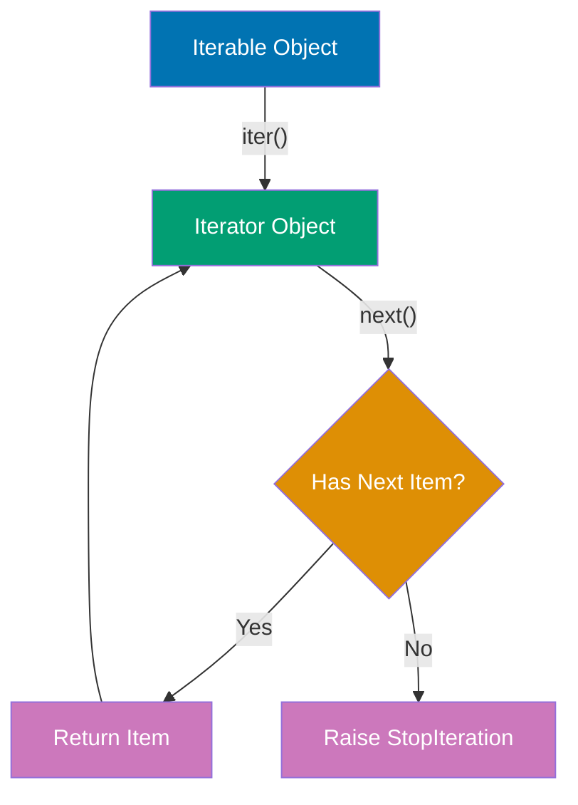

```python
# Built-in iterators
numbers = [1, 2, 3, 4, 5]         # => numbers is list (iterable)

# Get iterator from iterable
iterator = iter(numbers)          # => iterator is list_iterator object
print(type(iterator))             # => Output: <class 'list_iterator'>

# Manually iterate with next()
print(next(iterator))             # => Output: 1 (first item)
print(next(iterator))             # => Output: 2 (second item)
print(next(iterator))             # => Output: 3 (third item)

# Continue until StopIteration
try:
    print(next(iterator))         # => Output: 4
    print(next(iterator))         # => Output: 5
    print(next(iterator))         # => No more items, raises StopIteration
except StopIteration:
    print("Iterator exhausted")   # => Output: Iterator exhausted

# For loop uses iterator protocol internally
for num in [1, 2, 3]:             # => Calls iter([1,2,3]) then next() repeatedly
    print(num)                    # => Output: 1, 2, 3

# Custom iterator - countdown
class Countdown:
    """Iterator that counts down from start to 0."""

    def __init__(self, start):
        self.current = start      # => current is starting value

    def __iter__(self):
        """Return self (this object is its own iterator)."""
        return self

    def __next__(self):
        """Return next value or raise StopIteration."""
        if self.current <= 0:
            raise StopIteration   # => Signal iteration is complete

        self.current -= 1         # => Decrement before returning
        return self.current + 1   # => Return original value

countdown = Countdown(5)          # => countdown starts at 5

for num in countdown:             # => Uses iterator protocol
    print(num)                    # => Output: 5, 4, 3, 2, 1

# Iterator is exhausted after first use
for num in countdown:
    print(num)                    # => Output: (nothing - iterator exhausted)

# Custom iterable - range-like class
class MyRange:
    """Iterable that generates range of numbers."""

    def __init__(self, start, end):
        self.start = start
        self.end = end

    def __iter__(self):
        """Return a new iterator each time."""
        return MyRangeIterator(self.start, self.end)

class MyRangeIterator:
    """Iterator for MyRange."""

    def __init__(self, start, end):
        self.current = start
        self.end = end

    def __iter__(self):
        return self

    def __next__(self):
        if self.current >= self.end:
            raise StopIteration
        value = self.current
        self.current += 1
        return value

my_range = MyRange(1, 5)          # => my_range is iterable (1 to 4)

# Can iterate multiple times (new iterator each time)
for num in my_range:
    print(num)                    # => Output: 1, 2, 3, 4

for num in my_range:
    print(num)                    # => Output: 1, 2, 3, 4 (works again!)

# Iterator functions from itertools
import itertools

# count() - infinite counter
counter = itertools.count(10, 2)  # => Start at 10, step by 2
print(next(counter))              # => Output: 10
print(next(counter))              # => Output: 12
print(next(counter))              # => Output: 14

# cycle() - infinite cycle through iterable
colors = itertools.cycle(["red", "green", "blue"])
                                  # => Cycles through colors infinitely
print(next(colors))               # => Output: red
print(next(colors))               # => Output: green
print(next(colors))               # => Output: blue
print(next(colors))               # => Output: red (cycles back)

# islice() - slice an iterator
numbers = itertools.count(1)      # => Infinite counter starting at 1
first_five = itertools.islice(numbers, 5)
                                  # => First 5 elements
print(list(first_five))           # => Output: [1, 2, 3, 4, 5]

# chain() - chain multiple iterables
combined = itertools.chain([1, 2], [3, 4], [5, 6])
                                  # => Chains iterables together
print(list(combined))             # => Output: [1, 2, 3, 4, 5, 6]

# zip() - iterate over multiple sequences in parallel
names = ["Alice", "Bob", "Charlie"]
ages = [25, 30, 35]
cities = ["NYC", "LA", "Chicago"]

for name, age, city in zip(names, ages, cities):
    print(f"{name}, {age}, {city}")
# => Output: Alice, 25, NYC
#    Bob, 30, LA
#    Charlie, 35, Chicago

# zip stops at shortest iterable
short = zip([1, 2], ["a", "b", "c"])
print(list(short))                # => Output: [(1, 'a'), (2, 'b')] (stops at 2)

# itertools.zip_longest() - zip to longest iterable
from itertools import zip_longest

long = zip_longest([1, 2], ["a", "b", "c"], fillvalue=0)
print(list(long))                 # => Output: [(1, 'a'), (2, 'b'), (0, 'c')]

# enumerate() - get index and value
fruits = ["apple", "banana", "cherry"]

for index, fruit in enumerate(fruits):
    print(f"{index}: {fruit}")
# => Output: 0: apple
#    1: banana
#    2: cherry

# Start enumeration at custom index
for index, fruit in enumerate(fruits, start=1):
    print(f"{index}: {fruit}")
# => Output: 1: apple
#    2: banana
#    3: cherry

# reversed() - reverse iteration
for num in reversed([1, 2, 3, 4, 5]):
    print(num)                    # => Output: 5, 4, 3, 2, 1

# Memory efficiency demonstration
import sys

# List stores all items in memory
list_range = list(range(1000000)) # => Creates list with 1M items
print(f"List size: {sys.getsizeof(list_range)} bytes")
                                  # => Output: ~8MB (stores all items)

# Iterator generates items on-demand
iter_range = iter(range(1000000)) # => Iterator object (lightweight)
print(f"Iterator size: {sys.getsizeof(iter_range)} bytes")
                                  # => Output: ~48 bytes (just state!)
```

**Key Takeaway**: Iterators enable memory-efficient processing of large sequences by generating values on-demand rather than storing everything in memory - implement `__iter__` and `__next__` for custom iterators, and leverage `itertools` for common iteration patterns without reinventing the wheel.

**Why It Matters**: Inheritance enables code reuse through polymorphism, allowing subclasses to extend and override base class behavior. The super() function provides cooperative multiple inheritance essential for mixin patterns in framework development. However, composition is often preferred over deep inheritance hierarchies for maintainability in production systems.

---

## Example 27: Basic Error Handling Patterns

Common patterns for handling errors include EAFP (Easier to Ask for Forgiveness than Permission), LBYL (Look Before You Leap), custom exceptions, and exception chaining.

```python
# EAFP (Easier to Ask for Forgiveness than Permission) - Pythonic
def eafp_example(data, key):
    """Try operation, handle exception if it fails."""
    # => EAFP philosophy: Try first, handle errors later
    # => Pythonic approach for cleaner code
    try:
        # => Attempt operation without checking first
        return data[key]          # => Try to access key in dict
                                  # => If key exists, returns value
                                  # => If key missing, raises KeyError
    except KeyError:
        # => Exception handling catches KeyError
        # => Executes only if key not found
        return "Key not found"    # => Returns default message
                                  # => No exception propagates

data = {"name": "Alice", "age": 30}
                                  # => data is dict with 2 keys
                                  # => Test EAFP approach
print(eafp_example(data, "name")) # => Key "name" exists
                                  # => Returns "Alice" from try block
                                  # => Output: Alice
print(eafp_example(data, "city")) # => Key "city" doesn't exist
                                  # => Raises KeyError in try
                                  # => Caught by except, returns "Key not found"
                                  # => Output: Key not found

# LBYL (Look Before You Leap) - Check before action
def lbyl_example(data, key):
    """Check condition before operation."""
    # => LBYL philosophy: Check preconditions first
    # => More defensive programming style
    if key in data:               # => Check if key exists first
                                  # => Prevents exception from occurring
                                  # => 'in' operator checks membership
        return data[key]          # => Safe access (key confirmed to exist)
                                  # => Returns value for existing key
    else:
        # => Key doesn't exist path
        return "Key not found"    # => Returns default without exception

print(lbyl_example(data, "name")) # => Check: "name" in data → True
                                  # => Executes if block, returns "Alice"
                                  # => Output: Alice
print(lbyl_example(data, "city")) # => Check: "city" in data → False
                                  # => Executes else block
                                  # => Output: Key not found

# EAFP vs LBYL comparison
# => EAFP: More Pythonic, handles race conditions better
#    - Assumes success, handles failures
#    - Single dict access (faster when key exists)
#    - Thread-safe (no TOCTOU race between check and use)
# => LBYL: Clearer for simple cases, but verbose and prone to races
#    - Explicit precondition checking
#    - Double dict access (check + get)
#    - Race condition possible in multithreaded code

# Custom exceptions
class InvalidAgeError(ValueError):
    """Raised when age is invalid."""
    # => Custom exception extends ValueError
    # => Inherits all ValueError behavior
    # => Allows specific age validation errors
    pass                          # => No additional methods needed
                                  # => Uses parent class implementation

class NegativeAgeError(InvalidAgeError):
    """Raised when age is negative."""
    # => Specialized exception for negative ages
    # => Extends InvalidAgeError (exception hierarchy)
    # => Allows catching specific or general age errors
    pass                          # => No additional implementation
                                  # => Inherits from InvalidAgeError

def validate_age(age):
    """Validate age with custom exceptions."""
    # => Function validates age with multiple checks
    # => Raises specific exceptions for different errors
    if not isinstance(age, int):
        # => Type check: ensures age is integer
        # => isinstance() checks type at runtime
        raise InvalidAgeError(f"Age must be integer, got {type(age)}")
        # => Raises InvalidAgeError with descriptive message
        # => Function exits here if type wrong
    if age < 0:
        # => Value check: negative ages invalid
        # => Comparison: age < 0
        raise NegativeAgeError(f"Age cannot be negative: {age}")
        # => Raises more specific exception
        # => NegativeAgeError is subclass of InvalidAgeError
    if age > 150:
        # => Realistic upper bound check
        # => Prevents obviously wrong values
        raise InvalidAgeError(f"Age unrealistic: {age}")
        # => Raises general InvalidAgeError
        # => Not specific enough for own exception class
    return age                    # => Returns age if all validations pass
                                  # => No exception raised

# Using custom exceptions
try:
    # => Validation test case 1: valid age
    validate_age(25)              # => 25 passes all checks
                                  # => Returns 25, no exception
                                  # => try block continues
    print("Valid age")            # => Prints success message
                                  # => Output: Valid age
except InvalidAgeError as e:
    # => Exception handler (not executed for valid age)
    print(f"Error: {e}")

try:
    # => Validation test case 2: negative age
    validate_age(-5)              # => -5 fails age < 0 check
                                  # => Raises NegativeAgeError
                                  # => try block exits immediately
except NegativeAgeError as e:
    # => Catches NegativeAgeError specifically
    # => e holds exception object with message
    print(f"Negative age error: {e}")
                                  # => Prints exception message
                                  # => Output: Negative age error: Age cannot be negative: -5

try:
    # => Validation test case 3: wrong type
    validate_age("thirty")        # => "thirty" fails isinstance() check
                                  # => Raises InvalidAgeError (not int)
except InvalidAgeError as e:
    # => Catches InvalidAgeError
    # => Parent exception catches type error
    print(f"Invalid age error: {e}")
                                  # => Output: Invalid age error: Age must be integer...

# Catching exception hierarchy
try:
    # => Demonstrating exception hierarchy
    validate_age(-10)             # => -10 raises NegativeAgeError
                                  # => NegativeAgeError extends InvalidAgeError
except InvalidAgeError as e:      # => Catches parent class InvalidAgeError
                                  # => Also catches subclass NegativeAgeError
                                  # => Exception hierarchy enables polymorphic handling
    print(f"Caught via parent: {e}")
                                  # => Catches child exception via parent
                                  # => Output: Caught via parent: Age cannot be negative: -10

# Exception chaining (Python 3+)
def process_data(data):
    """Process data with exception chaining."""
    # => Demonstrates exception chaining (from keyword)
    # => Preserves original exception context
    try:
        result = int(data)        # => Attempts string to int conversion
                                  # => May raise ValueError if data not numeric
        return result             # => Returns converted int if successful
    except ValueError as e:
        # => Catches ValueError from int() conversion
        # => Chains new exception to original
        raise InvalidAgeError(f"Failed to process data: {data}") from e
        # => 'from e' chains original exception
        # => New exception has __cause__ attribute = e
        # => Preserves error context for debugging

try:
    # => Test exception chaining
    process_data("invalid")       # => "invalid" not convertible to int
                                  # => int("invalid") raises ValueError
                                  # => Caught and re-raised as InvalidAgeError
except InvalidAgeError as e:
    # => Catches chained exception
    print(f"Error: {e}")          # => Prints new exception message
                                  # => Output: Error: Failed to process data: invalid
    print(f"Original: {e.__cause__}")
                                  # => __cause__ attribute holds original ValueError
                                  # => Output: Original: invalid literal for int()...
                                  # => Preserves root cause for debugging

# Suppressing exception context (discouraged, hides root cause)
try:
    try:
        # => Inner try block
        int("invalid")            # => Raises ValueError
    except ValueError:
        # => Catches ValueError
        raise InvalidAgeError("Processing failed") from None
                                  # => 'from None' suppresses original exception
                                  # => No __cause__ attribute (None)
                                  # => Hides root cause (bad practice!)
except InvalidAgeError as e:
    # => Catches raised exception
    print(f"Error: {e}")          # => Prints new exception only
                                  # => Output: Error: Processing failed
    print(f"Cause: {e.__cause__}") # => __cause__ is None (suppressed)
                                  # => Output: Cause: None
                                  # => Root cause hidden (hard to debug)

# Multiple exception types
def divide_and_convert(a, b):
    """Demonstrate handling multiple exception types."""
    # => Function shows multiple except clauses
    # => Different handlers for different exception types
    try:
        result = a / b            # => Division operation
                                  # => May raise ZeroDivisionError if b == 0
                                  # => Returns float result
        return int(result)        # => Converts float to int
                                  # => May raise ValueError (rare)
                                  # => Returns int result
    except ZeroDivisionError:
        # => Specific handler for division by zero
        # => Catches only ZeroDivisionError
        print("Division by zero")
                                  # => Prints error message
        return None               # => Returns None as error indicator
    except ValueError:
        # => Specific handler for conversion errors
        # => Catches only ValueError
        print("Conversion failed")
        return None               # => Returns None as error indicator
    except Exception as e:
        # => General handler for unexpected exceptions
        # => Catches any Exception not caught above
        # => Catch-all for unexpected errors
        print(f"Unexpected error: {type(e).__name__}: {e}")
                                  # => Prints exception type and message
        return None               # => Returns None for any error

print(divide_and_convert(10, 2))  # => Division: 10 / 2 = 5.0
                                  # => Conversion: int(5.0) = 5
                                  # => No exception, returns 5
                                  # => Output: 5
print(divide_and_convert(10, 0))  # => Division: 10 / 0 raises ZeroDivisionError
                                  # => Caught by first except
                                  # => Prints "Division by zero"
                                  # => Returns None
                                  # => Output: Division by zero (then None)

# Context manager for automatic cleanup (exception-safe)
class Transaction:
    """Context manager for transactional operations."""
    # => Implements context manager protocol
    # => __enter__ and __exit__ magic methods

    def __enter__(self):
        # => Called when entering 'with' block
        # => Performs setup operations
        print("Starting transaction")
                                  # => Diagnostic output
        return self               # => Returns object for 'as' clause
                                  # => Becomes context variable

    def __exit__(self, exc_type, exc_val, exc_tb):
        # => Called when exiting 'with' block
        # => Always executes (even on exception)
        # => Parameters: exception type, value, traceback
        if exc_type is None:
            # => No exception occurred
            # => Block completed successfully
            print("Committing transaction")
                                  # => Success path
        else:
            # => Exception occurred in block
            # => exc_type is exception class
            print(f"Rolling back transaction: {exc_type.__name__}")
                                  # => Error path with exception name
                                  # => Rollback on failure
        return False              # => False means propagate exceptions
                                  # => True would suppress exceptions

# Success case
with Transaction():
    # => Calls Transaction().__enter__()
    # => Output: Starting transaction
    print("Performing operation")
                                  # => Normal operation
                                  # => Output: Performing operation
# => Calls __exit__(None, None, None) after block
# => exc_type is None (success)
# => Output: Committing transaction
# => Transaction committed automatically

# Failure case
try:
    # => Outer try to catch exception
    with Transaction():
        # => Calls __enter__
        # => Output: Starting transaction
        print("Performing operation")
                                  # => Output: Performing operation
        raise ValueError("Operation failed")
                                  # => Raises exception in context
                                  # => Triggers __exit__ with exception info
except ValueError:
    # => Catches exception after __exit__
    # => __exit__ returned False (propagated)
    print("Caught exception")
# => Output sequence:
#    1. Starting transaction (__enter__)
#    2. Performing operation (block execution)
#    3. Rolling back transaction: ValueError (__exit__)
#    4. Caught exception (except handler)

# Logging exceptions
import logging                    # => Imports standard logging module
                                  # => Provides structured error logging

logging.basicConfig(level=logging.ERROR)
                                  # => Configures logging to show ERROR and above
                                  # => Sets global logging configuration

def safe_divide(a, b):
    """Divide with error logging."""
    # => Function demonstrates exception logging
    # => Logs errors instead of just printing
    try:
        # => Attempt division
        return a / b              # => Division operation
                                  # => May raise ZeroDivisionError
    except ZeroDivisionError:
        # => Catches division by zero
        logging.error(f"Division by zero: {a} / {b}")
                                  # => Logs error with context
                                  # => Includes operand values
                                  # => Better than print for production
        return None               # => Returns None to indicate error
                                  # => Allows caller to detect failure

result = safe_divide(10, 0)       # => Division by zero
                                  # => Catches exception
                                  # => Logs error message via logging
                                  # => result is None
print(result)                     # => Output: None
                                  # => Logging output appears separately
```

**Key Takeaway**: Prefer EAFP (try/except) over LBYL (if checks) for Pythonic code - use custom exceptions to provide clear error semantics, implement exception chaining with `raise ... from e` to preserve root causes, and leverage context managers for automatic resource cleanup even when exceptions occur.

**Why It Matters**: Class and static methods provide alternative ways to organize related functionality without requiring instance state. Classmethods enable alternative constructors and factory patterns common in framework design. Understanding method types is essential for designing clean APIs and avoiding inappropriate instance state access in utility functions.

---

## Summary

You've completed **27 beginner examples** covering Python fundamentals (0-40% coverage):

- **Basics**: Hello World, variables, numbers, strings, booleans
- **Control flow**: If/elif/else, while loops, for loops
- **Data structures**: Lists, tuples, dictionaries, sets
- **Functions**: Definition, scope, lambdas
- **Comprehensions**: List, dict, set comprehensions
- **Error handling**: Try/except, custom exceptions, EAFP vs LBYL
- **File I/O**: Reading, writing, context managers
- **Classes**: Definition, inheritance, properties, magic methods
- **Modules**: Imports, standard library
- **Formatting**: F-strings, .format(), formatting specs
- **Iterators**: Iterator protocol, built-in iterators, itertools

**Next**: Continue to [Intermediate](/en/learn/software-engineering/programming-languages/python/by-example/intermediate) (Examples 28-54) for production patterns, decorators, testing, and advanced language features.
