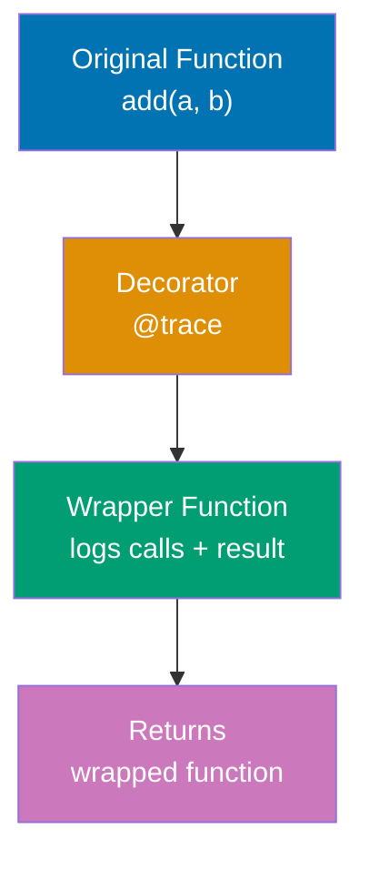
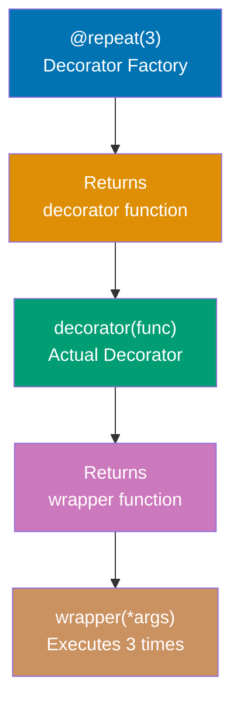
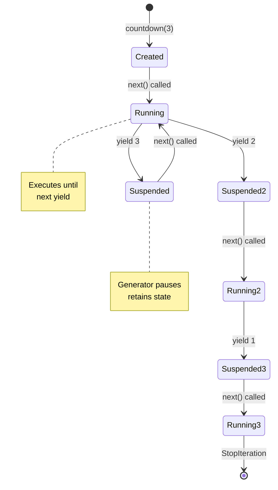
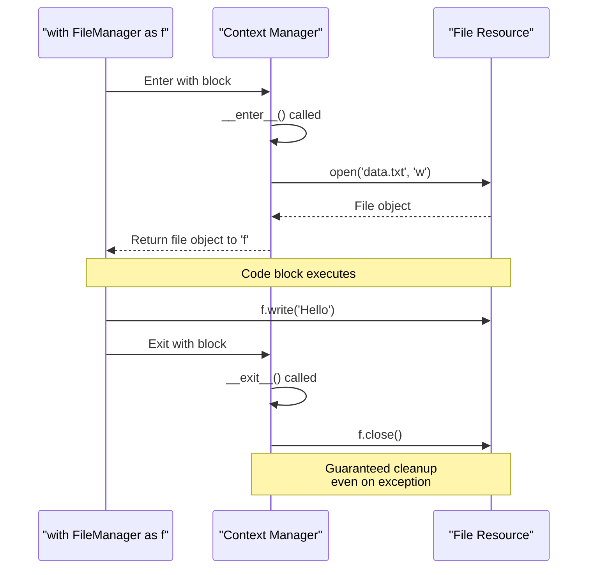
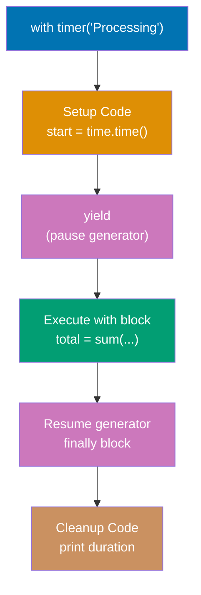
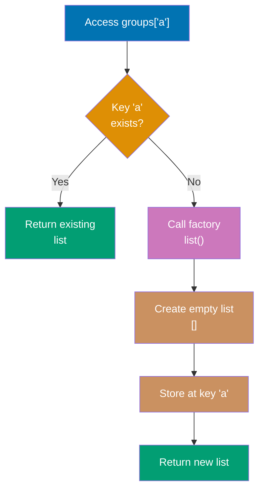
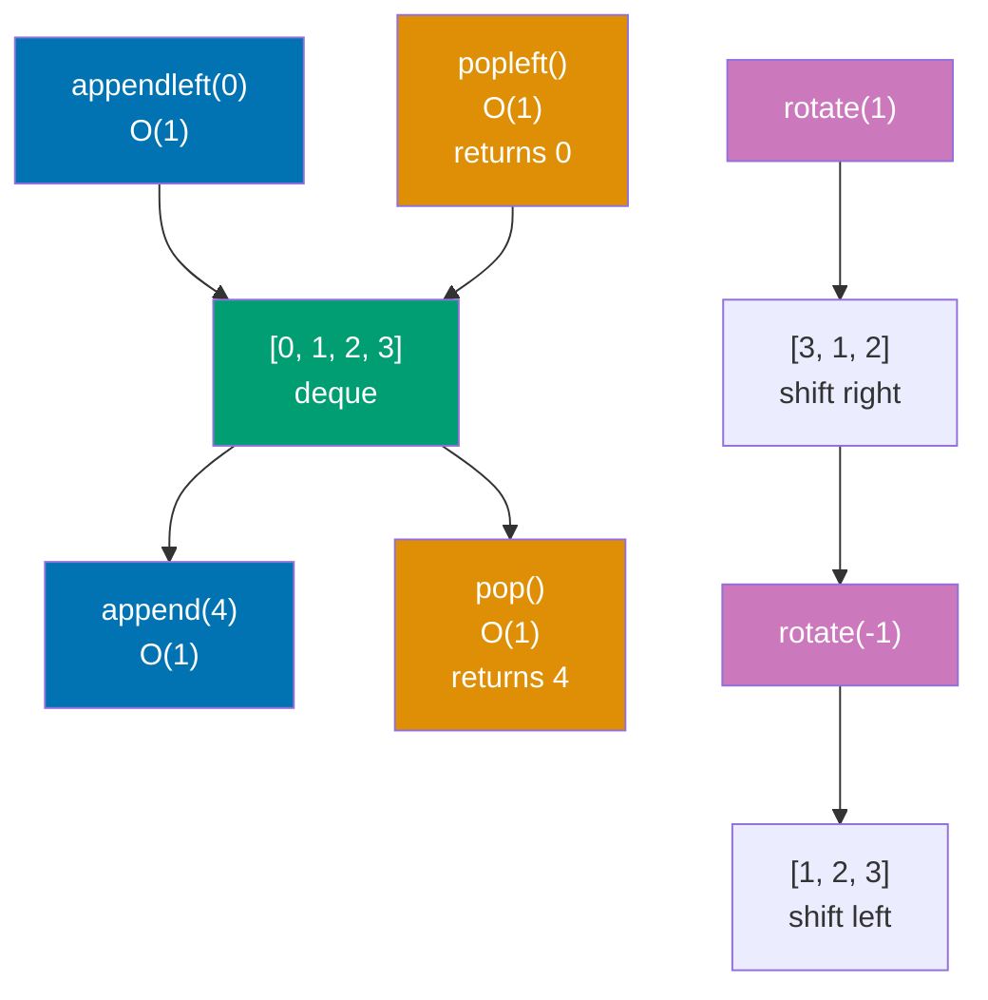
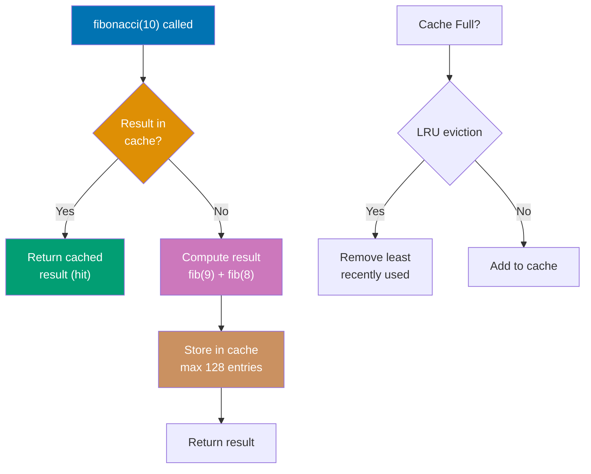
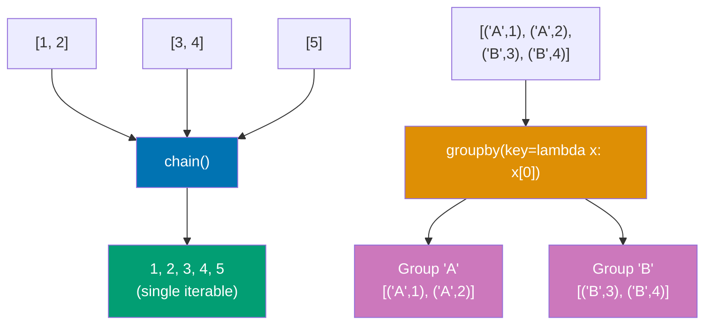
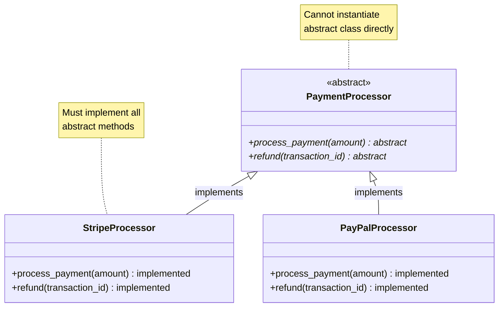

This section covers production Python patterns from examples 28-54, achieving 40-75% topic coverage.

## Example 28: Basic Decorator

Decorators wrap functions to modify behavior without changing function code.



```python
def trace(func):
    """Decorator that logs function calls"""
    def wrapper(*args, **kwargs):
        """Wrapper that adds logging behavior"""
        print(f"Calling {func.__name__}")  # => Output: Calling add
                                            # => Logs function name
        result = func(*args, **kwargs)      # => Execute original function
                                            # => result = add(3, 5) = 8
        print(f"Returned {result}")         # => Output: Returned 8
                                            # => Logs return value
        return result                       # => Return original result
                                            # => Returns 8
    return wrapper                          # => Return wrapper function
                                            # => Closure captures func

@trace                                      # => Apply decorator
                                            # => Equivalent to: add = trace(add)
def add(a, b):
    """Add two numbers"""
    return a + b                            # => Original function logic

result = add(3, 5)                          # => Calls wrapper(3, 5)
                                            # => Output: Calling add
                                            # => Output: Returned 8
                                            # => result = 8
```

**Key Takeaway**: Decorators use closure to wrap functions, enabling cross-cutting concerns like logging and timing.

**Why It Matters**: This concept is fundamental to understanding the language and helps build robust, maintainable code.

## Example 29: Decorator with Arguments

Decorators can accept configuration parameters for flexible behavior modification.



```python
def repeat(times):
    """Decorator factory that repeats function calls"""
    # => times parameter configures behavior
    # => Returns a decorator function
    def decorator(func):                   # => Actual decorator
                                            # => func = original function
        def wrapper(*args, **kwargs):
            """Innermost wrapper that executes multiple times"""
            results = []                   # => Collect all results
            for i in range(times):         # => Repeat 'times' times
                                            # => Loop 3 times in this example
                result = func(*args, **kwargs)  # => Call original function
                                            # => result = greet("Alice")
                results.append(result)      # => Add to results list
                                            # => results = ['Hello, Alice!', ...]
            return results                  # => Return list of all results
                                            # => ['Hello, Alice!', 'Hello, Alice!', 'Hello, Alice!']
        return wrapper                      # => Return configured wrapper
    return decorator                        # => Return decorator function
                                            # => Closure captures 'times'

@repeat(3)                                  # => Call repeat(3)
                                            # => Returns decorator
                                            # => Then: greet = decorator(greet)
def greet(name):
    """Greet someone"""
    return f"Hello, {name}!"                # => Original function

messages = greet("Alice")                   # => Calls wrapper("Alice")
                                            # => Executes greet("Alice") 3 times
                                            # => messages = ['Hello, Alice!', 'Hello, Alice!', 'Hello, Alice!']
```

**Key Takeaway**: Decorator factories return decorators configured with parameters, enabling reusable behavior customization.

**Why It Matters**: Decorator factories enable parameterized behavior modification, allowing the same decorator pattern to be reused with different configurations across a codebase. The three-layer nesting (factory → decorator → wrapper) is complex but essential for building flexible frameworks and libraries. Mastering decorator factories enables writing reusable infrastructure code that adapts to different requirements without duplication.

## Example 30: Preserving Function Metadata

Use functools.wraps to preserve original function metadata in decorated functions.

```python
from functools import wraps

def debug(func):
    """Decorator with metadata preservation"""
    @wraps(func)                           # => Copies __name__, __doc__, __module__ from func
                                           # => Without this, wrapper.__name__ would be 'wrapper'
    def wrapper(*args, **kwargs):
        """Inner wrapper function"""
        result = func(*args, **kwargs)     # => Call original function
                                           # => result = calculate(x, y)
        print(f"{func.__name__}: {result}")  # => Uses original function name
                                             # => Output: calculate: [result]
        return result                      # => Return original result
    return wrapper                         # => Return decorated wrapper

@debug                                     # => calculate = debug(calculate)
def calculate(x, y):
    """Adds two numbers"""                # => Original docstring preserved
    return x + y                           # => Original function logic

result = calculate(3, 5)                   # => Calls wrapper(3, 5)
                                           # => Output: calculate: 8
                                           # => result = 8
print(calculate.__name__)                  # => Output: 'calculate' (not 'wrapper')
                                           # => Thanks to @wraps
print(calculate.__doc__)                   # => Output: 'Adds two numbers'
                                           # => Original docstring preserved
print(calculate.__module__)                # => Output: '__main__' (or module name)
                                           # => Module info preserved
```

**Key Takeaway**: functools.wraps copies metadata from decorated function to wrapper, preserving introspection capabilities.

**Why It Matters**: This concept is fundamental to understanding the language and helps build robust, maintainable code.

## Example 31: Basic Generator

Generators produce values lazily using yield, enabling memory-efficient iteration.



```python
def countdown(n):
    """Generate numbers from n down to 1"""
    while n > 0:                            # => Loop condition
        yield n                             # => Pause and return current value
                                            # => Function state preserved
                                            # => Returns n to caller
        n -= 1                              # => Decrement for next iteration
                                            # => Executes when next() called again

gen = countdown(3)                          # => Creates generator object
                                            # => Does NOT execute function yet
                                            # => gen is iterator
print(next(gen))                            # => First next() call
                                            # => Executes until first yield
                                            # => Returns 3, n becomes 2
                                            # => Output: 3
print(next(gen))                            # => Second next() call
                                            # => Resumes from yield
                                            # => Returns 2, n becomes 1
                                            # => Output: 2
print(next(gen))                            # => Third next() call
                                            # => Returns 1, n becomes 0
                                            # => Output: 1
# next(gen)                                 # => Fourth next() call
                                            # => while condition false (n=0)
                                            # => Raises StopIteration

for num in countdown(3):                    # => for loop calls next() automatically
                                            # => Stops on StopIteration
    print(num)                              # => Output: 3
                                            # => Output: 2
                                            # => Output: 1
```

**Key Takeaway**: Generators compute values on demand using yield, ideal for large or infinite sequences.

**Why It Matters**: Generators enable memory-efficient iteration over large or infinite sequences by computing values lazily rather than materializing entire collections. The yield statement creates pausable functions that maintain state between calls, essential for processing large files and data streams. Understanding generators is critical for writing scalable Python applications that handle datasets larger than available memory.

## Example 32: Generator Expression

Generator expressions provide concise syntax for simple generators with minimal memory overhead.

```python
# List comprehension (creates full list in memory)
squares_list = [x**2 for x in range(5)]    # => Creates list immediately
                                            # => [0, 1, 4, 9, 16]
                                            # => All values computed and stored
                                            # => Uses memory for entire list

# Generator expression (computes values on demand)
squares_gen = (x**2 for x in range(5))     # => Generator object (lazy)
                                            # => Parentheses instead of brackets
                                            # => No values computed yet
                                            # => <generator object> in memory

print(next(squares_gen))                    # => First call: compute 0**2
                                            # => Output: 0
                                            # => Generator advances to next
print(next(squares_gen))                    # => Second call: compute 1**2
                                            # => Output: 1
                                            # => Previous value forgotten

# Use in sum (generator consumed automatically)
total = sum(x**2 for x in range(1000000))  # => Memory efficient
                                            # => Computes one value at a time
                                            # => No 1M-element list created
                                            # => total = 333332833333500000
                                            # => Generator exhausted after sum
```

**Key Takeaway**: Generator expressions use parentheses instead of brackets, computing values lazily without storing intermediate lists.

**Why It Matters**: This concept is fundamental to understanding the language and helps build robust, maintainable code.

## Example 33: Context Manager (with statement)

Context managers handle setup/cleanup automatically using **enter** and **exit** methods.



```python
class FileManager:
    """Context manager for file operations"""
    def __init__(self, filename, mode):
        self.filename = filename           # => Store filename
        self.mode = mode                   # => Store mode ('w', 'r', etc.)
        self.file = None                   # => File handle placeholder

    def __enter__(self):
        """Called when entering 'with' block"""
        self.file = open(self.filename, self.mode)  # => Open file
                                            # => self.file = file object
        return self.file                    # => Return to 'as' variable
                                            # => This becomes 'f' in with statement

    def __exit__(self, exc_type, exc_val, exc_tb):
        """Called when exiting 'with' block"""
        # => exc_type: Exception class if exception occurred, else None
        # => exc_val: Exception instance if exception occurred, else None
        # => exc_tb: Traceback object if exception occurred, else None
        if self.file:                       # => Check if file was opened
            self.file.close()                # => Always close file
                                             # => Guaranteed cleanup
        return False                        # => Return False → propagate exceptions
                                             # => Return True → suppress exceptions

with FileManager('data.txt', 'w') as f:    # => Calls __enter__
                                            # => f = returned file object
    f.write('Hello, World!')                # => File is open
                                            # => Write to file
# => Exits 'with' block
# => Calls __exit__(None, None, None) automatically
# => File closed even if exception occurs
```

**Key Takeaway**: Context managers guarantee cleanup code execution via **exit**, preventing resource leaks.

**Why It Matters**: This concept is fundamental to understanding the language and helps build robust, maintainable code.

## Example 34: contextlib for Simple Context Managers

Use @contextmanager decorator to create context managers from generator functions.



```python
from contextlib import contextmanager
import time

@contextmanager                            # => Decorator converts generator to context manager
def timer(label):
    """Context manager that measures execution time"""
    start = time.time()                    # => Setup code: record start time
                                           # => Runs BEFORE yield
    try:
        yield                              # => Pause generator
                                           # => Control returns to 'with' block
                                           # => Code inside 'with' executes here
    finally:
        end = time.time()                  # => Cleanup code: record end time
                                           # => Runs AFTER 'with' block
        duration = end - start             # => Calculate elapsed time
        print(f"{label}: {duration:.3f}s") # => Output: Processing: 0.XXX

with timer("Processing"):                  # => Calls timer("Processing")
                                           # => Executes setup (start = time.time())
                                           # => Pauses at yield
    total = sum(range(1000000))            # => Execute code being timed
                                           # => total = 499999500000
# => Exits 'with' block
# => Resumes generator at finally
# => Executes cleanup (print duration)
# => Output: Processing: 0.045s (example)
```

**Key Takeaway**: @contextmanager simplifies context manager creation using yield for separation of setup/cleanup logic.

**Why It Matters**: This concept is fundamental to understanding the language and helps build robust, maintainable code.

## Example 35: Regular Expression Matching

Use re module for pattern matching with compile for performance in repeated use.

```python
import re

# Pattern matching
text = "Email: user@example.com, Phone: 555-1234"
                                            # => Text to search
email_pattern = r'\b[A-Za-z0-9._%+-]+@[A-Za-z0-9.-]+\.[A-Z|a-z]{2,}\b'
                                            # => Raw string pattern (r'' prefix)
                                            # => \b = word boundary
                                            # => + = one or more, . = any char
                                            # => @ required, {2,} = 2+ chars

match = re.search(email_pattern, text)     # => Find first match
                                            # => Searches entire text
                                            # => Returns Match object or None
if match:                                   # => Check if pattern found
    print(match.group())                    # => Output: 'user@example.com'
                                            # => .group() returns matched string

# Find all matches
phone_pattern = r'\d{3}-\d{4}'             # => \d = digit [0-9]
                                            # => {3} = exactly 3 digits
                                            # => - literal hyphen
                                            # => {4} = exactly 4 digits
phones = re.findall(phone_pattern, text)   # => Returns list of all matches
                                            # => phones = ['555-1234']
                                            # => findall returns strings, not Match objects

# Compiled pattern (faster for repeated use)
email_re = re.compile(email_pattern)       # => Compile once
                                            # => Pre-processes pattern
                                            # => Improves performance for multiple uses
result = email_re.search(text)             # => Reuse compiled pattern
                                            # => result = Match object
                                            # => result.group() = 'user@example.com'
```

**Key Takeaway**: Compile patterns for repeated use; use search for first match, findall for all matches.

**Why It Matters**: This concept is fundamental to understanding the language and helps build robust, maintainable code.

## Example 36: Regular Expression Groups and Substitution

Capture groups extract parts of matches; sub performs replacements.

```python
import re

# Capture groups with named groups
pattern = r'(?P<year>\d{4})-(?P<month>\d{2})-(?P<day>\d{2})'
                                            # => (?P<name>...) = named capture group
                                            # => \d{4} = exactly 4 digits (year)
                                            # => \d{2} = exactly 2 digits (month, day)
text = "Date: 2025-12-30"                   # => Text with date format

match = re.search(pattern, text)            # => Search for date pattern
                                            # => Returns Match object with groups
if match:                                   # => Check if date found
    print(match.group('year'))              # => Access by name: '2025'
                                            # => Named group improves readability
    print(match.group('month'))             # => Access by name: '12'
                                            # => Better than numeric indices
    print(match.groups())                   # => Returns all groups as tuple
                                            # => Output: ('2025', '12', '30')
                                            # => Ordered by appearance in pattern

# Substitution with backreferences
phone_text = "Call 555-1234 or 555-5678"   # => Text with phone numbers
formatted = re.sub(r'(\d{3})-(\d{4})', r'(\1) \2', phone_text)
                                            # => sub(pattern, replacement, text)
                                            # => (\d{3}) = group 1 (area code)
                                            # => (\d{4}) = group 2 (number)
                                            # => \1 = reference to group 1
                                            # => \2 = reference to group 2
                                            # => formatted = 'Call (555) 1234 or (555) 5678'
                                            # => Replaces ALL occurrences
```

**Key Takeaway**: Named groups improve readability; backreferences in sub enable pattern-based transformations.

**Why It Matters**: This concept is fundamental to understanding the language and helps build robust, maintainable code.

## Example 37: JSON Serialization

Convert Python objects to JSON strings and vice versa for data interchange.

```python
import json

# Python to JSON
data = {
    'name': 'Alice',
    'age': 30,
    'skills': ['Python', 'SQL'],
    'active': True
}                                           # => Python dict with various types
                                            # => dict → JSON object
                                            # => list → JSON array
                                            # => bool → JSON boolean

json_str = json.dumps(data, indent=2)      # => Convert to JSON string
                                            # => dumps = "dump string"
                                            # => indent=2 for readable formatting
                                            # => json_str = '{\n  "name": "Alice",\n  "age": 30, ...'
                                            # => Returns string

# JSON to Python
parsed = json.loads(json_str)              # => Parse JSON string
                                            # => loads = "load string"
                                            # => Returns Python dict
                                            # => parsed = {'name': 'Alice', 'age': 30, ...}
print(parsed['name'])                       # => Output: 'Alice'
                                            # => Access dict key

# File operations
with open('data.json', 'w') as f:          # => Open file for writing
    json.dump(data, f, indent=2)           # => Write JSON directly to file
                                            # => dump (no 's') for files
                                            # => Creates formatted JSON file

with open('data.json', 'r') as f:          # => Open file for reading
    loaded = json.load(f)                  # => Read JSON from file
                                            # => load (no 's') for files
                                            # => Returns Python dict
                                            # => loaded = {'name': 'Alice', ...}
```

**Key Takeaway**: Use dumps/loads for strings, dump/load for files; indent parameter enables readable formatting.

**Why It Matters**: This concept is fundamental to understanding the language and helps build robust, maintainable code.

## Example 38: CSV Reading and Writing

Process tabular data with csv module for proper quoting and escaping.

```python
import csv

# Writing CSV
data = [
    ['Name', 'Age', 'City'],
    ['Alice', '30', 'NYC'],
    ['Bob', '25', 'LA']
]                                               # => List of lists (rows)
                                                # => First row is header

with open('people.csv', 'w', newline='') as f:  # => Open for writing
                                                # => newline='' prevents blank rows on Windows
                                                # => Required for csv module
    writer = csv.writer(f)                      # => Create writer object
                                                # => Handles escaping automatically
    writer.writerows(data)                      # => Write all rows at once
                                                # => Creates: Name,Age,City
                                                # =>          Alice,30,NYC
                                                # =>          Bob,25,LA

# Reading CSV
with open('people.csv', 'r') as f:             # => Open for reading
    reader = csv.reader(f)                     # => Create reader object
                                                # => Returns iterator of rows
    header = next(reader)                       # => Get first row
                                                # => header = ['Name', 'Age', 'City']
    for row in reader:                          # => Iterate remaining rows
                                                # => row = ['Alice', '30', 'NYC']
        print(f"{row[0]} is {row[1]}")          # => Access by index
                                                # => Output: Alice is 30
                                                # => Output: Bob is 25

# DictReader (dict per row)
with open('people.csv', 'r') as f:             # => Open for reading
    reader = csv.DictReader(f)                  # => Creates OrderedDict per row
                                                # => Uses first row as keys
                                                # => More readable than indices
    for row in reader:                          # => row = {'Name': 'Alice', 'Age': '30', 'City': 'NYC'}
        print(row['Name'])                      # => Access by column name
                                                # => Output: Alice
                                                # => Output: Bob
```

**Key Takeaway**: Use newline='' for writers; DictReader provides dict access for more readable code.

**Why It Matters**: CSV handling requires proper quoting and escaping to prevent data corruption from special characters in fields. The DictReader/DictWriter classes improve code readability by using field names rather than indices, reducing bugs in data processing pipelines. Understanding CSV nuances is essential for data import/export, reporting, and integration with spreadsheet applications.

## Example 39: Pathlib for Modern File Operations

Pathlib provides object-oriented path manipulation replacing os.path functions.

```python
from pathlib import Path

# Path creation and properties
p = Path('/home/user/documents/file.txt')     # => Creates Path object
                                              # => p is Path instance (not string)
print(p.name)                                 # => Output: 'file.txt'
                                              # => Basename with extension
print(p.stem)                                 # => Output: 'file'
                                              # => Basename without extension
print(p.suffix)                               # => Output: '.txt'
                                              # => File extension including dot
print(p.parent)                               # => Output: Path('/home/user/documents')
                                              # => Parent directory as Path object

# Path operations
config = Path.home() / '.config' / 'app.conf'  # => Path.home() = user's home directory
                                              # => / operator joins paths
                                              # => config = Path('/home/user/.config/app.conf')
print(config.exists())                        # => Check if path exists on filesystem
                                              # => Returns True or False

# Create directories
logs_dir = Path('logs')                       # => Creates Path object (relative)
                                              # => logs_dir = Path('logs')
logs_dir.mkdir(parents=True, exist_ok=True)   # => Create directory
                                              # => parents=True: create parent dirs
                                              # => exist_ok=True: no error if exists

# Read/write files
config_file = Path('config.ini')              # => Path object for config file
                                              # => config_file = Path('config.ini')
config_file.write_text('[Settings]\ntheme=dark')  # => Write string to file
                                              # => Creates/overwrites file
                                              # => Returns number of bytes written
content = config_file.read_text()             # => Read entire file as string
                                              # => content = '[Settings]\ntheme=dark'

# Glob patterns
py_files = list(Path('.').glob('**/*.py'))    # => Path('.') = current directory
                                              # => glob('**/*.py') = recursive search
                                              # => Returns generator of Path objects
                                              # => list() materializes to list
                                              # => py_files = [Path('script.py'), Path('src/main.py'), ...]
```

**Key Takeaway**: Pathlib unifies path operations with intuitive / operator and chainable methods.

**Why It Matters**: Pathlib provides cross-platform path handling with object-oriented API that prevents common path manipulation errors from string concatenation. The / operator for path joining improves readability over os.path.join and eliminates platform-specific separator issues. Modern Python code should prefer pathlib for its type safety and chainable methods over legacy os.path functions.

## Example 40: Collections - namedtuple

namedtuple creates lightweight immutable classes with named fields.

```python
from collections import namedtuple

# Define namedtuple
Point = namedtuple('Point', ['x', 'y'])       # => Creates new class 'Point'
                                              # => Class has fields: x, y
                                              # => Point is a callable factory
                                              # => Subclass of tuple

p1 = Point(3, 4)                              # => Call Point factory
                                              # => Creates Point instance
                                              # => p1 is tuple-like object
                                              # => p1.x = 3, p1.y = 4
print(p1.x, p1.y)                             # => Access by name
                                              # => Output: 3 4
                                              # => Named field access
print(p1[0], p1[1])                           # => Access by index (tuple interface)
                                              # => Output: 3 4
                                              # => p1[0] = x, p1[1] = y

# Unpacking
x, y = p1                                     # => Tuple unpacking works
                                              # => x = 3, y = 4
                                              # => Unpacks like regular tuple

# Immutable (like tuples)
# p1.x = 5                                    # => AttributeError: can't set attribute
                                              # => Namedtuples are immutable
                                              # => Fields cannot be changed

# _replace for creating modified copies
p2 = p1._replace(x=5)                         # => Creates NEW Point instance
                                              # => p2.x = 5, p2.y = 4
                                              # => p1 unchanged (immutable)
                                              # => Returns Point(x=5, y=4)

# _asdict for conversion to dict
dict_form = p1._asdict()                      # => Converts to OrderedDict
                                              # => dict_form = {'x': 3, 'y': 4}
print(dict_form)                              # => Output: {'x': 3, 'y': 4}
                                              # => Useful for serialization
```

**Key Takeaway**: namedtuples provide tuple efficiency with struct-like field access for readable code.

**Why It Matters**: This concept is fundamental to understanding the language and helps build robust, maintainable code.

## Example 41: Collections - Counter

Counter tallies hashable objects, providing convenient frequency counting.

```python
from collections import Counter

# Count occurrences
words = ['apple', 'banana', 'apple', 'cherry', 'banana', 'apple']
                                              # => List of strings to count
counts = Counter(words)                       # => Create Counter from iterable
                                              # => Counts each unique element
                                              # => counts = Counter({'apple': 3, 'banana': 2, 'cherry': 1})
                                              # => Counter is dict subclass

print(counts['apple'])                        # => Access count for 'apple'
                                              # => Output: 3
                                              # => Regular dict-like access
print(counts['orange'])                       # => Key doesn't exist
                                              # => Output: 0
                                              # => Returns 0 (not KeyError!)

# Most common elements
top_two = counts.most_common(2)               # => Get 2 most frequent items
                                              # => Returns list of (element, count) tuples
                                              # => Sorted by count descending
print(top_two)                                # => Output: [('apple', 3), ('banana', 2)]
                                              # => Useful for rankings

# Arithmetic operations
c1 = Counter(['a', 'b', 'c', 'a'])           # => c1 = Counter({'a': 2, 'b': 1, 'c': 1})
                                              # => Count each element
c2 = Counter(['a', 'b', 'd'])                # => c2 = Counter({'a': 1, 'b': 1, 'd': 1})
                                              # => Another counter
sum_counters = c1 + c2                        # => Add counts element-wise
                                              # => 'a': 2+1=3, 'b': 1+1=2, 'c': 1, 'd': 1
print(sum_counters)                           # => Output: Counter({'a': 3, 'b': 2, 'c': 1, 'd': 1})
                                              # => Union of elements
diff_counters = c1 - c2                       # => Subtract counts element-wise
                                              # => 'a': 2-1=1, 'b': 1-1=0 (removed), 'c': 1-0=1
                                              # => Negative/zero counts removed
print(diff_counters)                          # => Output: Counter({'a': 1, 'c': 1})
                                              # => Only positive counts remain
```

**Key Takeaway**: Counter simplifies frequency counting with arithmetic operations and most_common method.

**Why It Matters**: This concept is fundamental to understanding the language and helps build robust, maintainable code.

## Example 42: Collections - defaultdict

defaultdict provides default values for missing keys, eliminating KeyError checks.



```python
from collections import defaultdict

# Group items by first letter
words = ['apple', 'apricot', 'banana', 'blueberry', 'cherry']
                                              # => List of words to group
groups = defaultdict(list)                    # => Default factory: list()
                                              # => Missing keys auto-create empty list

for word in words:                            # => Iterate: 'apple', 'apricot', ...
    groups[word[0]].append(word)              # => word[0] = first letter
                                              # => groups['a'] auto-creates []
                                              # => No KeyError for new keys
                                              # => groups['a'].append('apple')
                                              # => groups = {'a': ['apple', 'apricot'], ...}

print(dict(groups))                           # => Convert to regular dict
                                              # => Output: {'a': ['apple', 'apricot'],
                                              # =>          'b': ['banana', 'blueberry'],
                                              # =>          'c': ['cherry']}

# Count with defaultdict(int)
counts = defaultdict(int)                     # => Default factory: int() = 0
                                              # => Missing keys return 0
for char in "mississippi":                    # => Iterate each character
    counts[char] += 1                         # => First access: counts['m'] = 0
                                              # => Then increment: counts['m'] = 1
                                              # => No KeyError check needed
                                              # => counts = {'m': 1, 'i': 4, 's': 4, 'p': 2}

print(dict(counts))                           # => Output: {'m': 1, 'i': 4, 's': 4, 'p': 2}
```

**Key Takeaway**: defaultdict eliminates missing key checks by calling factory function for new keys.

**Why It Matters**: This concept is fundamental to understanding the language and helps build robust, maintainable code.

## Example 43: Collections - deque

deque (double-ended queue) provides O(1) append/pop from both ends.



```python
from collections import deque

# Create deque
d = deque([1, 2, 3])                          # => Create deque from list
                                              # => d = deque([1, 2, 3])
                                              # => Double-ended queue (doubly-linked list)

# Add to both ends (O(1))
d.append(4)                                   # => Add to right end
                                              # => O(1) time complexity
                                              # => d = deque([1, 2, 3, 4])
d.appendleft(0)                               # => Add to left end
                                              # => O(1) time (list.insert(0) is O(n))
                                              # => d = deque([0, 1, 2, 3, 4])

# Remove from both ends (O(1))
right_val = d.pop()                           # => Remove from right end
                                              # => right_val = 4
                                              # => d = deque([0, 1, 2, 3])
left_val = d.popleft()                        # => Remove from left end
                                              # => O(1) time (list.pop(0) is O(n))
                                              # => left_val = 0
                                              # => d = deque([1, 2, 3])

# Rotation
d.rotate(1)                                   # => Rotate right by 1 position
                                              # => Last element moves to front
                                              # => d = deque([3, 1, 2])
                                              # => rotate(n) moves n items from right to left
d.rotate(-1)                                  # => Rotate left by 1 position
                                              # => First element moves to end
                                              # => d = deque([1, 2, 3])
                                              # => rotate(-n) moves n items from left to right

# Bounded deque (circular buffer)
buffer = deque(maxlen=3)                      # => Create bounded deque
                                              # => Maximum size = 3
                                              # => Auto-evicts when full
buffer.extend([1, 2, 3])                      # => Add multiple items
                                              # => buffer = deque([1, 2, 3], maxlen=3)
                                              # => Now at capacity
buffer.append(4)                              # => Add new item
                                              # => Evicts oldest (1) automatically
                                              # => buffer = deque([2, 3, 4], maxlen=3)
                                              # => Circular buffer behavior
```

**Key Takeaway**: deque optimizes both-end operations; maxlen creates circular buffers for sliding windows.

**Why It Matters**: Deque provides O(1) operations on both ends compared to list's O(n) for operations at the beginning, making it essential for queue and stack implementations. The maxlen parameter creates bounded collections that automatically evict old items, perfect for sliding windows and recent item caches. Choosing deque over list for queue operations prevents performance bottlenecks in high-throughput systems.

## Example 44: functools - partial

partial creates new functions with pre-filled arguments.

```python
from functools import partial

def power(base, exponent):
    return base ** exponent                   # => Calculate base^exponent
                                              # => power(2, 3) = 2^3 = 8

# Create specialized functions
square = partial(power, exponent=2)           # => Pre-fill exponent parameter
                                              # => square = power(base=?, exponent=2)
                                              # => Creates new function with one parameter
cube = partial(power, exponent=3)             # => cube = power(base=?, exponent=3)
                                              # => Another specialized version

print(square(4))                              # => Calls power(4, exponent=2)
                                              # => Output: 16 (4^2)
print(cube(4))                                # => Calls power(4, exponent=3)
                                              # => Output: 64 (4^3)

# Useful for callbacks with extra context
from operator import mul                      # => mul(a, b) = a * b
double = partial(mul, 2)                      # => Pre-fill first argument
                                              # => double(x) = mul(2, x) = 2 * x
numbers = [1, 2, 3, 4]                        # => List to process
doubled = list(map(double, numbers))          # => Apply double to each
                                              # => map(double, [1, 2, 3, 4])
                                              # => [double(1), double(2), double(3), double(4)]
                                              # => [2, 4, 6, 8]
```

**Key Takeaway**: partial binds arguments to functions, creating specialized versions without wrapper functions.

**Why It Matters**: Partial application reduces function parameter count by pre-binding arguments, improving code reuse and enabling adapter patterns. The technique is essential for creating specialized functions from general ones without writing wrapper functions. Understanding partial is critical for functional programming patterns and callback customization in event-driven systems.

## Example 45: functools - lru_cache

lru_cache memoizes function results for repeated calls with same arguments.



```python
from functools import lru_cache

@lru_cache(maxsize=128)                       # => Cache up to 128 results
                                              # => LRU = Least Recently Used
                                              # => Evicts oldest when full
def fibonacci(n):
    """Compute nth Fibonacci number"""
    if n < 2:                                 # => Base cases
        return n                              # => fib(0)=0, fib(1)=1
    return fibonacci(n-1) + fibonacci(n-2)    # => Recursive calls
                                              # => WITHOUT cache: exponential time
                                              # => WITH cache: linear time
                                              # => Each n computed once

# First call computes and caches
print(fibonacci(10))                          # => Output: 55
                                              # => Computes fib(0) to fib(10)
                                              # => Stores all intermediate results
                                              # => fibonacci(9) + fibonacci(8)

# Subsequent calls use cache
print(fibonacci(10))                          # => Output: 55
                                              # => Instant retrieval from cache
                                              # => No recomputation
                                              # => Cache hit

# Cache statistics
print(fibonacci.cache_info())                 # => Output: CacheInfo(hits=..., misses=..., maxsize=128, currsize=...)
                                              # => hits: successful cache lookups
                                              # => misses: cache misses (computed)
                                              # => currsize: entries in cache

# Clear cache if needed
fibonacci.cache_clear()                       # => Remove all cached results
                                              # => Resets hits/misses to 0
                                              # => Next call will recompute
```

**Key Takeaway**: lru_cache dramatically speeds up recursive functions by caching results keyed by arguments.

**Why It Matters**: This concept is fundamental to understanding the language and helps build robust, maintainable code.

## Example 46: itertools - Powerful Iteration

itertools provides composable iterator building blocks for efficient iteration.



```python
from itertools import chain, cycle, islice, combinations, groupby

# Chain multiple iterables
chained = chain([1, 2], [3, 4], [5])         # => Creates iterator over all items
                                              # => Flattens multiple iterables
                                              # => chained yields: 1, 2, 3, 4, 5
                                              # => Lazy evaluation (no list created)
result = list(chained)                        # => Materialize to list
                                              # => result = [1, 2, 3, 4, 5]

# Infinite cycling
counter = cycle(['A', 'B', 'C'])             # => Infinite iterator
                                              # => Repeats: A, B, C, A, B, C, ...
                                              # => Never raises StopIteration
first_6 = list(islice(counter, 6))           # => islice(iterable, stop)
                                              # => Takes first 6 elements
                                              # => Stops infinite cycle
                                              # => first_6 = ['A', 'B', 'C', 'A', 'B', 'C']

# Combinations
combos = list(combinations([1, 2, 3], 2))    # => All 2-element combinations
                                              # => Order doesn't matter (not permutations)
                                              # => combos = [(1, 2), (1, 3), (2, 3)]
                                              # => C(3,2) = 3 combinations

# Group consecutive items
data = [('A', 1), ('A', 2), ('B', 3), ('B', 4)]
                                              # => Sorted/grouped data
                                              # => CRITICAL: data must be sorted by key
for key, group in groupby(data, key=lambda x: x[0]):
                                              # => groupby groups consecutive items
                                              # => key function extracts grouping key
                                              # => lambda x: x[0] = first element of tuple
                                              # => Iteration 1: key='A', group=iterator
                                              # => Iteration 2: key='B', group=iterator
    group_list = list(group)                  # => Materialize group iterator
                                              # => MUST consume before next iteration
                                              # => Iteration 1: [('A', 1), ('A', 2)]
                                              # => Iteration 2: [('B', 3), ('B', 4)]
    print(key, group_list)                    # => Output: A [('A', 1), ('A', 2)]
                                              # => Output: B [('B', 3), ('B', 4)]
```

**Key Takeaway**: itertools functions compose for complex iterations without intermediate lists.

**Why It Matters**: Itertools functions compose to create complex iteration patterns without materializing intermediate collections, improving both memory efficiency and code clarity. The lazy evaluation enables processing infinite sequences and large datasets that don't fit in memory. Understanding itertools is essential for data pipeline development and functional-style programming in Python.

## Example 47: Datetime Basics

Datetime module handles dates, times, and timedeltas for temporal calculations.

```python
from datetime import datetime, date, time, timedelta

# Current datetime
now = datetime.now()                          # => Current local datetime
                                              # => now = datetime(2025, 12, 30, 15, 45, 23, ...)
                                              # => Includes year, month, day, hour, minute, second, microsecond
today = date.today()                          # => Current date only (no time)
                                              # => today = date(2025, 12, 30)
                                              # => No hour/minute/second fields

# Creating specific datetime
dt = datetime(2025, 12, 30, 14, 30, 0)       # => datetime(year, month, day, hour, minute, second)
                                              # => dt = datetime(2025, 12, 30, 14, 30, 0)
                                              # => December 30, 2025 at 2:30 PM

# Formatting (strftime = string from time)
formatted = dt.strftime("%Y-%m-%d %H:%M")    # => Convert datetime to string
                                              # => %Y = 4-digit year, %m = month, %d = day
                                              # => %H = 24-hour, %M = minute
                                              # => formatted = '2025-12-30 14:30'

# Parsing (strptime = string parse time)
parsed = datetime.strptime("2025-12-30", "%Y-%m-%d")
                                              # => Parse string to datetime object
                                              # => Format string must match input
                                              # => parsed = datetime(2025, 12, 30, 0, 0)
                                              # => Time defaults to midnight

# Timedelta (duration)
tomorrow = today + timedelta(days=1)         # => Add duration to date
                                              # => timedelta(days=1) = 1 day duration
                                              # => tomorrow = date(2025, 12, 31)
next_week = now + timedelta(weeks=1)         # => Add 1 week (7 days)
                                              # => timedelta(weeks=1) = timedelta(days=7)
                                              # => next_week = now + 7 days
difference = dt - now                        # => Subtract datetimes
                                              # => Returns timedelta object
                                              # => difference = negative/positive duration

print(difference.days)                        # => Total days in timedelta
                                              # => Output: -365 or 10 (depends on now)
                                              # => Can be negative
print(difference.seconds)                     # => Remaining seconds after days
                                              # => Output: 0-86399 (< 1 day)
                                              # => Does NOT include days
```

**Key Takeaway**: Use datetime for timestamps, date for calendar dates, timedelta for durations and arithmetic.

**Why It Matters**: This concept is fundamental to understanding the language and helps build robust, maintainable code.

## Example 48: Type Hints Basics

Type hints improve code clarity and enable static type checking with mypy.

```python
from typing import List, Dict, Optional, Union

def greet(name: str) -> str:
    """Function with type hints"""
    # => name: str = parameter type hint
    # => -> str = return type hint
    return f"Hello, {name}!"                  # => Return type: str
                                              # => Matches declared return type

def process_items(items: List[int]) -> int:
    """Process list of integers"""
    # => items: List[int] = list containing ints
    # => Generic type with type parameter
    return sum(items)                         # => Returns int (sum of list)
                                              # => Matches declared -> int

# Optional (can be None)
def find_user(user_id: int) -> Optional[Dict[str, str]]:
    """Returns user dict or None"""
    # => Optional[X] = Union[X, None]
    # => Can return Dict[str, str] OR None
    # => Dict[str, str] = dict with str keys and str values
    if user_id == 1:                          # => Check condition
        return {'name': 'Alice', 'role': 'admin'}  # => Return dict (valid)
    return None                               # => Return None (also valid)
                                              # => Optional allows both

# Union (multiple types)
def format_value(val: Union[int, str]) -> str:
    """Accept int or str"""
    # => Union[int, str] = can be int OR str
    # => Type checker accepts both types
    return str(val)                           # => Convert to string
                                              # => Works for both int and str

# Usage (types are hints, not enforced at runtime)
result = greet("Bob")                         # => Correct type: str
                                              # => Output: "Hello, Bob!"
                                              # => Type checker happy
# result = greet(123)                         # => Wrong type: int
                                              # => Still works at runtime (dynamic)
                                              # => But mypy/pyright warns: Expected str, got int
```

**Key Takeaway**: Type hints document expected types for tools like mypy without affecting runtime behavior.

**Why It Matters**: This concept is fundamental to understanding the language and helps build robust, maintainable code.

## Example 49: Dataclasses

Dataclasses reduce boilerplate for classes primarily used for storing data.

```python
from dataclasses import dataclass, field

@dataclass                                    # => Decorator auto-generates methods
class Product:
    """Product with automatic __init__, __repr__, __eq__"""
    name: str                                 # => Required field (no default)
                                              # => Type annotation required
    price: float                              # => Required field
    quantity: int = 0                         # => Optional with default
                                              # => Default values allowed
    tags: list = field(default_factory=list)  # => Mutable default (safe)
                                              # => field() prevents shared list bug
                                              # => default_factory calls list() per instance

    def total_value(self) -> float:
        return self.price * self.quantity     # => Custom method still works
                                              # => self.price = 999.99
                                              # => self.quantity = 5
                                              # => Returns 4999.95

# Automatic __init__
p1 = Product("Laptop", 999.99, 5)            # => No __init__ method written
                                              # => @dataclass creates it
                                              # => p1.name = "Laptop"
                                              # => p1.price = 999.99
                                              # => p1.quantity = 5

# Automatic __repr__
print(p1)                                     # => Output: Product(name='Laptop', price=999.99, quantity=5, tags=[])
                                              # => Readable representation
                                              # => Shows all field values

# Automatic __eq__
p2 = Product("Laptop", 999.99, 5)            # => Create second product
print(p1 == p2)                               # => Output: True
                                              # => Compares all fields
                                              # => name=='Laptop', price==999.99, etc.

# field() for complex defaults
p3 = Product("Mouse", 29.99, tags=["wireless", "ergonomic"])
                                              # => p3.tags = ["wireless", "ergonomic"]
                                              # => Each instance gets its own list
                                              # => No shared mutable default bug
```

**Key Takeaway**: @dataclass auto-generates **init**, **repr**, **eq** reducing boilerplate for data-focused classes.

**Why It Matters**: Dataclasses eliminate boilerplate for data-focused classes by auto-generating **init**, **repr**, and **eq** methods, reducing code size and maintenance burden. The field() function enables advanced default value handling and metadata for serialization frameworks. Understanding dataclasses is essential for modern Python development, especially for data transfer objects and API models.

## Example 50: Enums for Named Constants

Enums create type-safe named constants preventing magic values.

```python
from enum import Enum, auto

class Status(Enum):
    """Order status enumeration"""
    PENDING = 1                               # => Enum member with value 1
                                              # => Status.PENDING is singleton
    PROCESSING = 2                            # => Enum member with value 2
    SHIPPED = 3                               # => Enum member with value 3
    DELIVERED = 4                             # => Enum member with value 4

# Access by name or value
print(Status.PENDING)                         # => Access by name
                                              # => Output: Status.PENDING
                                              # => Returns enum member (not int)
print(Status.PENDING.value)                   # => Access underlying value
                                              # => Output: 1
                                              # => .value attribute holds int
print(Status(2))                              # => Lookup by value
                                              # => Output: Status.PROCESSING
                                              # => Value 2 maps to PROCESSING member

# Iteration
for status in Status:                         # => Iterate all enum members
                                              # => Order: PENDING, PROCESSING, SHIPPED, DELIVERED
    print(status.name, status.value)          # => .name = string name
                                              # => .value = underlying value
                                              # => Output: PENDING 1
                                              # => Output: PROCESSING 2
                                              # => Output: SHIPPED 3
                                              # => Output: DELIVERED 4

# Auto values
class Priority(Enum):
    """Priority levels with auto-assigned values"""
    LOW = auto()                              # => auto() generates 1
                                              # => First auto value starts at 1
    MEDIUM = auto()                           # => auto() generates 2
                                              # => Increments from previous
    HIGH = auto()                             # => auto() generates 3
                                              # => Increments from previous

# Comparison
if Status.PENDING == Status.PENDING:          # => Identity comparison
                                              # => Enum members are singletons
                                              # => Same instance always
                                              # => Result: True
    print("Same status")                      # => Output: Same status

# Cannot compare different enums
# Status.PENDING == Priority.LOW              # => False (different enum classes)
                                              # => Type-safe: different enums never equal
```

**Key Takeaway**: Enums replace magic numbers/strings with type-safe constants that prevent invalid values.

**Why It Matters**: This concept is fundamental to understanding the language and helps build robust, maintainable code.

## Example 51: Abstract Base Classes

ABCs define interfaces that subclasses must implement.



```python
from abc import ABC, abstractmethod

class PaymentProcessor(ABC):
    """Abstract payment processor interface"""
    # => ABC = Abstract Base Class
    # => Cannot be instantiated directly
    # => Enforces interface contract

    @abstractmethod                         # => Decorator marks method as abstract
    def process_payment(self, amount: float) -> bool:
        """All subclasses must implement this method"""
        pass                                # => No implementation in base class
                                             # => Subclasses MUST override this

    @abstractmethod
    def refund(self, transaction_id: str) -> bool:
        """All subclasses must implement this method"""
        pass                                # => Abstract methods use pass

class StripeProcessor(PaymentProcessor):
    """Concrete implementation of payment processor"""
    # => Must implement ALL abstract methods
    # => Otherwise TypeError on instantiation

    def process_payment(self, amount: float) -> bool:
        """Concrete implementation for Stripe"""
        print(f"Processing ${amount} via Stripe")  # => Output: Processing $100.00 via Stripe
        return True                           # => Return success status

    def refund(self, transaction_id: str) -> bool:
        """Concrete implementation for refunds"""
        print(f"Refunding transaction {transaction_id}")  # => Output: Refunding transaction TXN123
        return True                           # => Return success status

# processor = PaymentProcessor()            # => TypeError: Can't instantiate abstract class
                                             # => Abstract classes cannot be instantiated
processor = StripeProcessor()                # => OK, implements all abstract methods
                                             # => Creates concrete instance
processor.process_payment(100.00)            # => Output: Processing $100.00 via Stripe
                                             # => Returns True
```

**Key Takeaway**: ABCs enforce interface contracts at instantiation time preventing incomplete implementations.

**Why It Matters**: This concept is fundamental to understanding the language and helps build robust, maintainable code.

## Example 52: Basic pytest Tests

pytest provides powerful testing with minimal boilerplate.

```python
# test_calculator.py
def add(a, b):
    """Function to test"""
    return a + b                              # => Returns sum of a and b

def test_add_positive_numbers():
    """Test addition of positive numbers"""
    assert add(2, 3) == 5                     # => Verify 2 + 3 equals 5
                                               # => If false, pytest shows: AssertionError
                                               # => ✓ PASS (assertion true)

def test_add_negative_numbers():
    """Test addition of negative numbers"""
    assert add(-1, -1) == -2                  # => Verify -1 + -1 equals -2
                                               # => ✓ PASS

def test_add_zero():
    """Test addition with zero"""
    assert add(5, 0) == 5                     # => Verify 5 + 0 equals 5
                                               # => ✓ PASS
    assert add(0, 5) == 5                     # => Verify 0 + 5 equals 5
                                               # => ✓ PASS

# Run with: pytest test_calculator.py
# => pytest discovers test files (test_*.py, *_test.py)
# => Collects functions starting with test_
# => Executes each test function
# => Reports: test_add_positive_numbers PASSED
# =>         test_add_negative_numbers PASSED
# =>         test_add_zero PASSED
# => Summary: 3 passed in 0.01s
```

**Key Takeaway**: pytest uses simple assert statements with automatic discovery of test files and functions.

**Why It Matters**: Pytest's simple assert statements with automatic introspection provide clear failure messages without boilerplate assertion methods, improving test maintainability. The convention-based test discovery eliminates configuration overhead and encourages consistent test organization. Mastering pytest is essential for professional Python development where automated testing prevents regressions.

## Example 53: pytest Fixtures

Fixtures provide reusable test data and setup/teardown logic.

```python
import pytest

@pytest.fixture                               # => Decorator marks function as fixture
def sample_data():
    """Fixture providing sample data"""
    data = [1, 2, 3, 4, 5]                    # => Create test data
    print("Setup: creating data")             # => Run BEFORE test executes
                                               # => Output during test run
    yield data                                # => Provide data to test function
                                               # => Test receives data as parameter
    print("Teardown: cleaning up")            # => Run AFTER test completes
                                               # => Cleanup code here

def test_sum_with_fixture(sample_data):
    """Test using fixture (injected as parameter)"""
    # => pytest sees 'sample_data' parameter
    # => Calls sample_data() fixture
    # => Injects returned value
    # => sample_data = [1, 2, 3, 4, 5]
    assert sum(sample_data) == 15             # => Verify sum is 15
                                               # => ✓ PASS (15 == 15)

@pytest.fixture(scope="module")               # => Module-scoped fixture
                                               # => Created once per test module
                                               # => Shared across all tests in module
def database_connection():
    """Module-scoped fixture (created once per module)"""
    conn = "DB_CONNECTION"                    # => Setup once (expensive operation)
                                               # => Shared by all tests
    yield conn                                # => Provide to tests
    # Cleanup code here                       # => Runs once at module end
    # conn.close()                            # => Close connection

def test_query(database_connection):
    """Test using shared connection"""
    # => database_connection = "DB_CONNECTION"
    # => Same instance used by all module tests
    assert database_connection == "DB_CONNECTION"  # => ✓ PASS
```

**Key Takeaway**: Fixtures enable DRY tests with dependency injection and automatic setup/teardown.

**Why It Matters**: Fixtures enable test isolation and reusable test data setup, preventing test interdependencies that cause flaky tests in CI/CD pipelines. The scope management (function, module, session) balances test isolation with performance for expensive setup operations. Understanding pytest fixtures is critical for building maintainable test suites that scale with codebase growth.

## Example 54: pytest Parametrize

Parametrize runs same test with different inputs avoiding repetitive test functions.

```python
import pytest

def is_palindrome(s):
    """Check if string is palindrome"""
    return s == s[::-1]                       # => Compare string with reversed version

@pytest.mark.parametrize("text,expected", [  # => Decorator with parameter combinations
    ("racecar", True),                        # => Test case 1: palindrome
    ("hello", False),                         # => Test case 2: not palindrome
    ("level", True),                          # => Test case 3: palindrome
    ("python", False),                        # => Test case 4: not palindrome
])                                            # => Creates 4 test instances
def test_palindrome(text, expected):
    """Single test function, multiple executions"""
    # => pytest injects (text, expected) for each tuple
    # => Execution 1: text="racecar", expected=True
    # => Execution 2: text="hello", expected=False
    # => Execution 3: text="level", expected=True
    # => Execution 4: text="python", expected=False
    assert is_palindrome(text) == expected    # => Verify against expected result
                                               # => ✓ All 4 test cases PASS

# pytest generates 4 separate test runs:
# => test_palindrome[racecar-True] PASSED
# => test_palindrome[hello-False] PASSED
# => test_palindrome[level-True] PASSED
# => test_palindrome[python-False] PASSED

@pytest.mark.parametrize("a,b,expected", [   # => Another parametrized test
    (2, 3, 5),                                # => 2 + 3 should equal 5
    (0, 0, 0),                                # => 0 + 0 should equal 0
    (-1, 1, 0),                               # => -1 + 1 should equal 0
])                                            # => Creates 3 test instances
def test_add(a, b, expected):
    """Test addition with multiple cases"""
    # => Execution 1: a=2, b=3, expected=5
    # => Execution 2: a=0, b=0, expected=0
    # => Execution 3: a=-1, b=1, expected=0
    assert a + b == expected                  # => Verify each case
                                               # => ✓ All 3 cases PASS
```

**Key Takeaway**: @pytest.mark.parametrize eliminates duplicate test code by running same logic with different inputs.

**Why It Matters**: Parametrized tests eliminate duplicate test code for checking multiple inputs, improving test coverage while reducing maintenance burden. The pytest-generated test IDs enable pinpointing failures to specific parameter sets, improving debugging efficiency. Mastering parametrize is essential for thorough testing without code duplication, especially for validation logic and boundary condition testing.

## Summary

Intermediate Python (examples 28-54) covers production patterns for real-world development: decorators for behavior modification, generators for memory efficiency, context managers for resource safety, testing with pytest, and essential standard library modules. Master these patterns to write maintainable, professional Python code.
