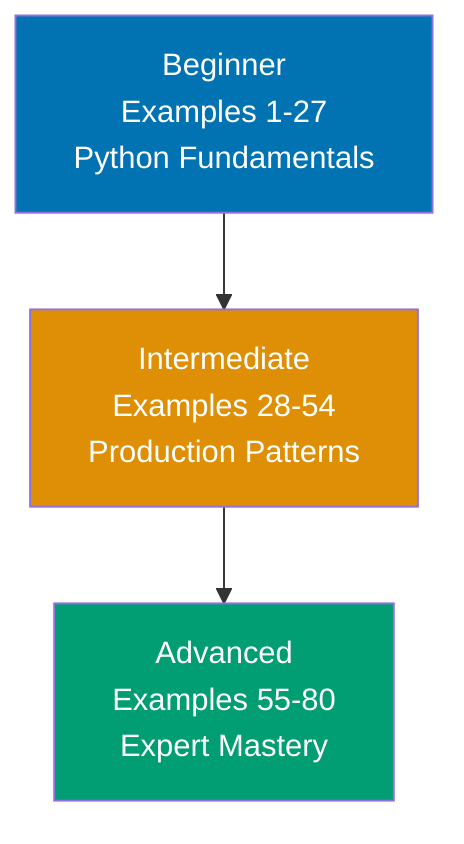
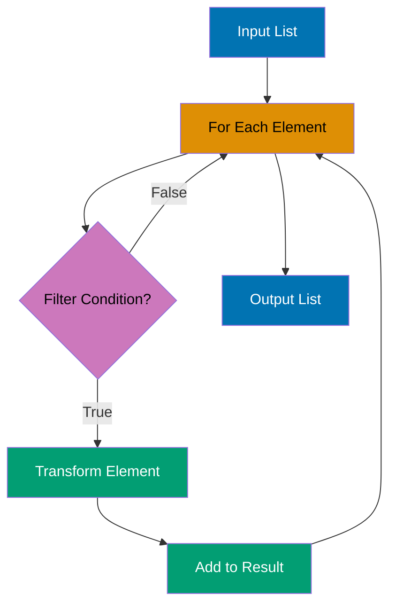

## What is Python by Example?

Python by Example is a code-first tutorial series designed for **experienced developers** switching to Python or deepening their Python expertise. Instead of narrative explanations, you learn through **80 self-contained, heavily annotated, runnable examples** that demonstrate Python concepts in action.

## Why By-Example?

Traditional tutorials explain concepts with prose, then show code. By-example **inverts this approach**:

1. **Show the code first** - Working, production-relevant examples
2. **Run it second** - Every example is copy-paste-runnable
3. **Understand through interaction** - Inline annotations reveal behavior
4. **Build pattern recognition** - 80 examples create comprehensive mental models

This approach works best for developers who **prefer learning through working code** rather than reading documentation.

## Learning Path



Progress from fundamentals through production patterns to expert mastery. Each level builds on the previous, increasing in sophistication and introducing more Pythonic idioms.

## Coverage Philosophy

This tutorial provides **95% coverage of Python** through practical, annotated examples. The 95% figure represents the depth and breadth of concepts covered, not a time estimate—focus is on **outcomes and understanding**, not duration.

### What's Covered

**Included (95%)**:

- Core syntax and semantics (variables, operators, control flow)
- Built-in types and data structures (lists, dicts, sets, tuples)
- Functions, lambdas, and closures
- Object-oriented programming (classes, inheritance, magic methods)
- Modules and packages
- File I/O and context managers
- Exception handling and custom exceptions
- Decorators and descriptors
- Comprehensions and generators
- Itertools and functools
- Type hints and protocols
- Asyncio and concurrency
- Testing with pytest
- Standard library essentials (pathlib, collections, datetime, json)
- Virtual environments and packaging

### What's NOT Covered

This guide focuses on **learning-oriented examples**, not problem-solving recipes or production deployment. For additional topics:

- **CPython internals and C extensions** - Implementation details beyond the language
- **Rare standard library modules** - aifc, sunau, uu, and other niche modules
- **Platform-specific features** - ctypes internals, Windows registry
- **Deprecated features** - imp module, old-style classes
- **Framework internals** - Django ORM source, Flask internals (covered at introductory level only)

The 95% coverage goal maintains humility—no tutorial can cover everything. This guide teaches the **core concepts that unlock the remaining 5%** through your own exploration and project work.

## Tutorial Structure

**80 examples across three levels**:

- **Beginner** (Examples 1-27, 0-40% coverage): Python fundamentals - variables, types, control flow, functions, basic data structures, simple OOP
- **Intermediate** (Examples 28-54, 40-75% coverage): Production patterns - modules, file I/O, exceptions, decorators, comprehensions, iterators, testing
- **Advanced** (Examples 55-80, 75-95% coverage): Expert mastery - metaclasses, asyncio, context managers, generators, protocols, type hints, packaging, performance

Coverage percentages indicate **depth and breadth** of Python knowledge, not time investment.

## Example Format

Every example follows a **five-part format**:

### 1. Brief Explanation (2-3 sentences)

Context and motivation for the concept:

```markdown
### Example 15: List Comprehensions

List comprehensions provide a concise syntax for creating lists based on existing sequences, combining mapping and filtering in a single expression. They are more readable and often faster than equivalent for-loop constructions, making them a Pythonic way to transform data.
```

### 2. Mermaid Diagram (when appropriate)

Visual representation for non-obvious concepts (30-50% of examples):



### 3. Heavily Annotated Code

Self-contained, runnable code with `# =>` annotations showing outputs and states:

```python
# Original list
numbers = [1, 2, 3, 4, 5]        # => numbers is [1, 2, 3, 4, 5]

# List comprehension: squares of even numbers
squares = [x**2 for x in numbers if x % 2 == 0]
                                  # => squares is [4, 16] (2^2=4, 4^2=16)

# Equivalent for-loop (for comparison)
squares_loop = []                # => squares_loop is []
for x in numbers:                # => Iterates: 1, 2, 3, 4, 5
    if x % 2 == 0:               # => True for 2, 4
        squares_loop.append(x**2)# => Appends 4, then 16
                                  # => squares_loop is [4, 16]

print(squares)                   # => Output: [4, 16]
print(squares == squares_loop)   # => Output: True
```

### 4. Key Takeaway (1-2 sentences)

Essential insight distilled:

```markdown
**Key Takeaway**: Use list comprehensions for simple transformations and filtering - they're more Pythonic and readable than equivalent loops, but switch to regular loops when logic becomes complex or requires multiple statements.
```

## How to Use This Tutorial

### For Complete Beginners to Python

1. Start with **Beginner** level (Examples 1-27)
2. Run every example in a Python REPL or `.py` file
3. Modify examples to test your understanding
4. Progress to **Intermediate** when comfortable with basics

### For Developers with Python Experience

1. Skim **Beginner** to identify gaps
2. Focus on **Intermediate** (Examples 28-54) for production patterns
3. Deep-dive **Advanced** (Examples 55-80) for expert techniques

### For Experienced Developers from Other Languages

1. Review **Beginner** quickly to learn syntax differences
2. Focus on Pythonic idioms in **Intermediate**
3. Use **Advanced** as a reference for Python-specific features

## Self-Containment Philosophy

Every example is **copy-paste-runnable** within its level scope:

- **Beginner examples**: Completely standalone - full imports, no dependencies on previous examples
- **Intermediate examples**: Assume beginner knowledge but include all necessary code to run
- **Advanced examples**: Assume beginner + intermediate concepts but remain fully runnable

**Golden rule**: If you delete all other examples, any single example should still run successfully.

## Educational Annotations

Examples use `# =>` notation to show:

- **Variable states**: `x = 10  # => x is 10 (type: int)`
- **Outputs**: `print(x)  # => Output: 10`
- **Intermediate values**: `y = x * 2  # => y is 20 (x remains 10)`
- **Side effects**: `lst.append(5)  # => lst is now [1, 2, 3, 5]`
- **Error cases**: `int("bad")  # => Raises ValueError: invalid literal for int()`

These annotations make code behavior explicit without needing to run examples (though running them is encouraged!).

## Diagram Guidelines

Diagrams use **color-blind friendly palette**:

- **Blue** (#0173B2): Primary elements, starting states
- **Orange** (#DE8F05): Processing states, operations
- **Teal** (#029E73): Success states, outputs
- **Purple** (#CC78BC): Conditional paths, options
- **Brown** (#CA9161): Neutral elements, helpers

This ensures accessibility for all learners.

## Prerequisites

- **Python 3.9+** installed (examples use modern Python features)
- **Basic programming knowledge** (variables, loops, functions in any language)
- **Text editor or IDE** (VS Code, PyCharm, or any editor)
- **Terminal/command prompt** access

Install Python from [python.org](https://python.org) or use your system package manager.

## Running Examples

### Option 1: Python REPL (Interactive)

```bash
python3
>>> # Paste example code here
```

### Option 2: Script File

```bash
# Save example to example.py
python3 example.py
```

### Option 3: Jupyter Notebook

```bash
pip install jupyter
jupyter notebook
# Create new notebook, paste examples in cells
```

## Learning Strategies

### For Java/C# Developers

You're used to static typing and verbose OOP. Python will feel liberating but initially unfamiliar:

- **Dynamic typing**: No type declarations required (though type hints are available)
- **Duck typing**: If it walks like a duck and quacks like a duck, it's a duck
- **No braces**: Indentation defines code blocks, whitespace matters

Focus on Examples 1-10 (Python basics) and Examples 40-45 (type hints) to bridge your static typing background.

### For JavaScript/TypeScript Developers

You understand dynamic typing and async patterns. Python has similar flexibility:

- **Similar feel**: Dynamic typing, first-class functions, flexible syntax
- **Different async model**: `async/await` works similarly but with different event loop semantics
- **No `this` confusion**: Methods receive `self` explicitly

Focus on Examples 55-65 (asyncio) and Examples 28-35 (decorators) to leverage your JS knowledge.

### For C/C++ Developers

You understand systems programming and pointers. Python abstracts all of that:

- **No manual memory**: Garbage collection handles everything
- **No pointers**: References are implicit, everything is an object
- **Slower but productive**: Rapid development, slower execution

Focus on Examples 70-80 (performance optimization, C extensions) to understand when Python's abstractions matter.

### For Ruby Developers

You know dynamic, expressive languages. Python is similar but more explicit:

- **Explicit is better**: No implicit returns, blocks, or magic methods (mostly)
- **One way to do it**: Python prefers single obvious solutions
- **Significant whitespace**: Indentation instead of `end` keywords

Focus on Examples 35-45 (comprehensions, generators) to see Python's expressive patterns.

## Code-First Philosophy

This tutorial prioritizes working code over theoretical discussion:

- **No lengthy prose**: Concepts are demonstrated, not explained at length
- **Runnable examples**: Every example runs in Python REPL or as scripts
- **Learn by doing**: Understanding comes from running and modifying code
- **Pattern recognition**: See the same patterns in different contexts across 80 examples

If you prefer narrative explanations. By-example learning works best when you learn through experimentation.

## What You'll Learn

By completing all 80 examples, you'll master:

- **Python fundamentals**: Syntax, types, control flow, functions
- **Data structures**: Lists, dicts, sets, tuples, and their methods
- **Pythonic patterns**: Comprehensions, generators, decorators, context managers
- **Object-oriented Python**: Classes, inheritance, magic methods, protocols
- **Functional programming**: Lambdas, map/filter/reduce, functools, itertools
- **Concurrency**: Asyncio, async/await, tasks, and event loops
- **Error handling**: Exceptions, custom errors, exception chaining
- **Testing**: Pytest, fixtures, parametrization, mocking
- **Type safety**: Type hints, protocols, generics, mypy
- **Packaging**: Modules, packages, virtual environments, pip, setup.py

## Navigation

- **[Beginner](/en/learn/software-engineering/programming-languages/python/by-example/beginner)** - Examples 1-27 (0-40% coverage)
- **[Intermediate](/en/learn/software-engineering/programming-languages/python/by-example/intermediate)** - Examples 28-54 (40-75% coverage)
- **[Advanced](/en/learn/software-engineering/programming-languages/python/by-example/advanced)** - Examples 55-80 (75-95% coverage)

---

**Ready to learn Python through code?** Start with [Beginner](/en/learn/software-engineering/programming-languages/python/by-example/beginner) examples!
