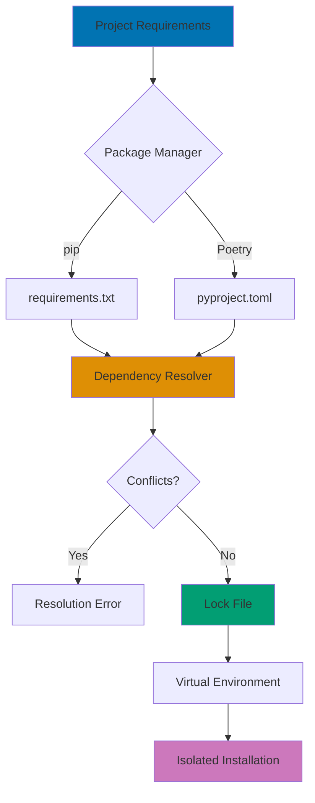

## Problem

Python projects require dependency isolation, version control, and reproducible installations. System-wide package installations cause conflicts and security risks. Manual dependency management becomes unmaintainable.

## Solution

### 1. Virtual Environments with venv

```bash
python -m venv venv

source venv/bin/activate

venv\Scripts\activate

pip install requests pandas numpy

pip freeze > requirements.txt

pip install -r requirements.txt

deactivate
```

**Python script to create venv programmatically**:

```python
import venv
import subprocess
from pathlib import Path

def create_virtual_environment(path: str) -> None:
    """Create virtual environment at specified path."""
    venv_path = Path(path)

    # Create venv
    venv.create(venv_path, with_pip=True)

    # Get pip path
    if venv_path.joinpath("Scripts").exists():  # Windows
        pip_path = venv_path / "Scripts" / "pip"
    else:  # Unix
        pip_path = venv_path / "bin" / "pip"

    # Install packages
    subprocess.run([str(pip_path), "install", "requests", "pytest"])

create_virtual_environment("./my_venv")
```

### 2. Modern Package Management with Poetry

```bash
curl -sSL https://install.python-poetry.org | python3 -

poetry new my-project
cd my-project

poetry init

poetry add requests pandas
poetry add --group dev pytest black mypy

poetry install

poetry update

poetry show --tree

poetry run python script.py
poetry run pytest

poetry build

poetry publish
```

**pyproject.toml structure**:

```toml
[tool.poetry]
name = "my-project"
version = "0.1.0"
description = "My awesome project"
authors = ["Your Name <you@example.com>"]
readme = "README.md"

[tool.poetry.dependencies]
python = "^3.11"
requests = "^2.31.0"
pandas = "^2.1.0"

[tool.poetry.group.dev.dependencies]
pytest = "^7.4.0"
black = "^23.7.0"
mypy = "^1.5.0"
ruff = "^0.0.287"

[build-system]
requires = ["poetry-core"]
build-backend = "poetry.core.masonry.api"

[tool.poetry.scripts]
my-cli = "my_project.cli:main"
```

### 3. Dependency Version Pinning

```python

requests==2.31.0
pandas==2.1.0

requests~=2.31.0  # >=2.31.0, <2.32.0
pandas~=2.1       # >=2.1.0, <2.2.0

requests>=2.31.0
pandas>=2.1.0

numpy>=1.24.0,<2.0.0

pywin32==306 ; sys_platform == 'win32'
uvloop==0.17.0 ; sys_platform != 'win32'

cryptography>=41.0.0 ; python_version >= '3.11'


```

**requirements-dev.txt for development dependencies**:

```txt
-r requirements.txt

pytest>=7.4.0
pytest-cov>=4.1.0
black>=23.7.0
ruff>=0.0.287
mypy>=1.5.0

sphinx>=7.2.0
sphinx-rtd-theme>=1.3.0
```

### 4. Dependency Resolution and Lock Files

```python

"""
requests
pandas
numpy
"""


"""
certifi==2023.7.22
charset-normalizer==3.2.0
idna==3.4
numpy==1.25.2
pandas==2.1.0
python-dateutil==2.8.2
pytz==2023.3
requests==2.31.0
six==1.16.0
tzdata==2023.3
urllib3==2.0.4
"""


```

**Poetry automatically creates poetry.lock**:

```bash
poetry install  # Uses poetry.lock for exact versions
poetry lock --no-update  # Regenerate lock without updating
poetry lock  # Update lock file with latest compatible versions
```

### 5. Creating Distributable Packages

**Project structure**:

```
my-package/
├── src/
│   └── my_package/
│       ├── __init__.py
│       ├── core.py
│       └── utils.py
├── tests/
│   ├── __init__.py
│   └── test_core.py
├── README.md
├── LICENSE
├── pyproject.toml
└── setup.py (optional, for backwards compatibility)
```

**pyproject.toml for packaging**:

```toml
[build-system]
requires = ["setuptools>=68.0", "wheel"]
build-backend = "setuptools.build_meta"

[project]
name = "my-package"
version = "0.1.0"
description = "A helpful package"
readme = "README.md"
authors = [
    {name = "Your Name", email = "you@example.com"}
]
license = {text = "MIT"}
classifiers = [
    "Development Status :: 3 - Alpha",
    "Intended Audience :: Developers",
    "License :: OSI Approved :: MIT License",
    "Programming Language :: Python :: 3",
    "Programming Language :: Python :: 3.11",
]
requires-python = ">=3.11"
dependencies = [
    "requests>=2.31.0",
    "pandas>=2.1.0",
]

[project.optional-dependencies]
dev = [
    "pytest>=7.4.0",
    "black>=23.7.0",
    "mypy>=1.5.0",
]

[project.urls]
Homepage = "https://github.com/user/my-package"
Documentation = "https://my-package.readthedocs.io"
Repository = "https://github.com/user/my-package"

[project.scripts]
my-cli = "my_package.cli:main"

[tool.setuptools.packages.find]
where = ["src"]
```

**Building and publishing**:

```bash
python -m build


pip install -e .

python -m twine upload dist/*

python -m twine upload --repository testpypi dist/*
```

### 6. Dependency Security Scanning

```bash
pip install safety

safety check

safety check -r requirements.txt

safety check --json

pip install pip-audit

pip-audit

pip-audit -r requirements.txt

pip-audit --fix
```

**Automated security scanning with GitHub Actions**:

```yaml
name: Security Scan

on: [push, pull_request]

jobs:
  security:
    runs-on: ubuntu-latest
    steps:
      - uses: actions/checkout@v3

      - name: Set up Python
        uses: actions/setup-python@v4
        with:
          python-version: "3.11"

      - name: Install dependencies
        run: |
          pip install safety pip-audit

      - name: Run safety check
        run: safety check

      - name: Run pip-audit
        run: pip-audit
```

## How It Works



**Dependency Resolution Process:**

1. **Requirements**: Define package dependencies with version constraints
2. **Resolution**: Solver finds compatible versions satisfying all constraints
3. **Lock File**: Record exact versions for reproducibility
4. **Installation**: Download and install packages in isolated environment
5. **Isolation**: Virtual environment prevents conflicts with other projects

## Variations

### Conda for Scientific Computing

```bash
conda create -n myenv python=3.11

conda activate myenv

conda install numpy pandas scikit-learn

conda install -c conda-forge xgboost

conda install numpy
pip install custom-package

conda env export > environment.yml

conda env create -f environment.yml

conda deactivate
```

### Docker for Complete Isolation

```dockerfile
FROM python:3.11-slim

WORKDIR /app

COPY requirements.txt .
RUN pip install --no-cache-dir -r requirements.txt

COPY . .

CMD ["python", "app.py"]
```

### pipx for CLI Tools

```bash
python -m pip install --user pipx
python -m pipx ensurepath

pipx install black
pipx install pytest
pipx install poetry

black myfile.py

pipx upgrade black

pipx uninstall black
```

## Common Pitfalls

### 1. Not Using Virtual Environments

**Problem**: Global package installations cause conflicts.

```bash
pip install requests  # Affects system Python!

python -m venv venv
source venv/bin/activate
pip install requests  # Isolated
```

### 2. Committing Virtual Environments to Git

**Problem**: Large venv directories bloat repository.

```gitignore
venv/
env/
.venv/
__pycache__/
*.pyc
.pytest_cache/
.mypy_cache/
dist/
build/
*.egg-info/
```

### 3. Not Pinning Dependencies

**Problem**: Builds become non-reproducible.

```txt
requests
pandas
numpy

requests==2.31.0
pandas==2.1.0
numpy==1.25.2

```

### 4. Mixing Package Managers

**Problem**: Dependency conflicts between pip and conda.

```bash
conda install numpy
pip install pandas  # May conflict with conda's numpy

conda install numpy pandas

conda install numpy
pip install custom-package-not-in-conda
```

### 5. Ignoring Dependency Vulnerabilities

**Problem**: Outdated packages have security issues.

```bash
pip install old-package==1.0.0

pip install pip-audit
pip-audit  # Check for vulnerabilities
pip-audit --fix  # Auto-upgrade vulnerable packages

```

## Related Patterns

**Related Tutorial**: See [Beginner Tutorial - Setup](/en/learn/software-engineering/programming-languages/python/tutorials/beginner#setup).
**Related How-To**: See [Implement Security Best Practices](/en/learn/software-engineering/programming-languages/python/how-to/security-best-practices).
**Related Cookbook**: See Cookbook recipe "Dependency Management".
