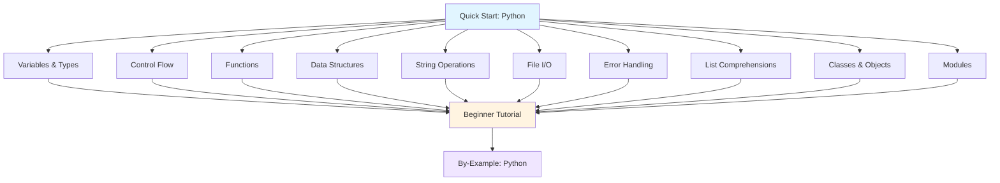

**Want to learn Python fundamentals quickly?** This quick start touches 8-12 core Python concepts with one example each. By the end, you'll have practical touchpoints for the most important language features.

This tutorial provides 5-30% coverage - rapid exposure to core concepts. For comprehensive mastery, continue to [Beginner Tutorial](/en/learn/software-engineering/programming-languages/python/by-concept/beginner) (0-60% coverage) or explore [By-Example](/en/learn/software-engineering/programming-languages/python/by-example) for heavily annotated code.

## Prerequisites

Before starting, you should have:

- Completed [Initial Setup](/en/learn/software-engineering/programming-languages/python/initial-setup) - Python installed and working
- A text editor or IDE (VS Code, PyCharm, or any editor)
- Basic understanding of programming concepts
- Willingness to write and run code

## Learning Objectives

By the end of this tutorial, you will have touchpoints for:

1. **Variables and Types** - Numbers, strings, booleans, type conversion
2. **Control Flow** - if/else, for loops, while loops
3. **Functions** - Define functions, parameters, return values
4. **Data Structures** - Lists, dictionaries, tuples, sets
5. **String Operations** - Formatting, slicing, methods
6. **File I/O** - Read and write files
7. **Error Handling** - Try/except blocks
8. **List Comprehensions** - Concise list creation
9. **Classes and Objects** - Object-oriented programming basics
10. **Modules and Imports** - Use standard library and packages

## Learning Path



## Concept 1: Variables and Types - Store and Manipulate Data

Python uses dynamic typing - no type declarations needed.

### Example: Basic Data Types

```python
age = 25
price = 19.99
complex_num = 3 + 4j

name = "Alice"
message = 'Hello, World!'
multiline = """This is
a multiline string"""

is_active = True
is_complete = False

result = None

print(type(age))        # <class 'int'>
print(type(price))      # <class 'float'>
print(type(name))       # <class 'str'>
print(type(is_active))  # <class 'bool'>

num_str = "42"
num = int(num_str)      # Convert string to int
print(num + 8)          # 50

float_str = str(3.14)   # Convert float to string
print(float_str)        # "3.14"
```

**Key types**: `int`, `float`, `str`, `bool`, `None`

**When to explore deeper**: [Beginner Tutorial - Variables and Types](/en/learn/software-engineering/programming-languages/python/by-concept/beginner#variables-types)

## Concept 2: Control Flow - Make Decisions and Loop

Control program execution with conditionals and loops.

### Example: Conditionals and Loops

```python
score = 85

if score >= 90:
    print("Grade: A")
elif score >= 80:
    print("Grade: B")
elif score >= 70:
    print("Grade: C")
else:
    print("Grade: F")

fruits = ["apple", "banana", "cherry"]
for fruit in fruits:
    print(f"I like {fruit}")

for i in range(5):
    print(i)  # 0, 1, 2, 3, 4

count = 0
while count < 3:
    print(f"Count: {count}")
    count += 1

for num in range(10):
    if num == 3:
        continue  # Skip 3
    if num == 7:
        break     # Stop at 7
    print(num)    # 0, 1, 2, 4, 5, 6
```

**Key keywords**: `if`, `elif`, `else`, `for`, `while`, `break`, `continue`, `range()`

**When to explore deeper**: [Beginner Tutorial - Control Flow](/en/learn/software-engineering/programming-languages/python/by-concept/beginner#control-flow)

## Concept 3: Functions - Organize Reusable Code

Define functions to encapsulate logic.

### Example: Function Definition and Usage

```python
def greet(name):
    return f"Hello, {name}!"

message = greet("Alice")
print(message)  # Hello, Alice!

def add(a, b):
    return a + b

result = add(5, 3)
print(result)   # 8

def greet_with_title(name, title="Mr."):
    return f"Hello, {title} {name}"

print(greet_with_title("Smith"))          # Hello, Mr. Smith
print(greet_with_title("Johnson", "Dr.")) # Hello, Dr. Johnson

def get_min_max(numbers):
    return min(numbers), max(numbers)

minimum, maximum = get_min_max([3, 7, 1, 9, 4])
print(f"Min: {minimum}, Max: {maximum}")  # Min: 1, Max: 9

def sum_all(*args):
    return sum(args)

print(sum_all(1, 2, 3, 4, 5))  # 15

def display_info(**kwargs):
    for key, value in kwargs.items():
        print(f"{key}: {value}")

display_info(name="Alice", age=30, city="NYC")
```

**Key concepts**: `def`, parameters, `return`, default values, `*args`, `**kwargs`

**When to explore deeper**: [Beginner Tutorial - Functions](/en/learn/software-engineering/programming-languages/python/by-concept/beginner#functions)

## Concept 4: Data Structures - Collections of Data

Python provides powerful built-in data structures.

### Example: Lists, Dictionaries, Tuples, Sets

```python
fruits = ["apple", "banana", "cherry"]
fruits.append("date")
fruits[1] = "blueberry"
print(fruits)  # ['apple', 'blueberry', 'cherry', 'date']

person = {
    "name": "Alice",
    "age": 30,
    "city": "NYC"
}
print(person["name"])   # Alice
person["email"] = "alice@example.com"
print(person.keys())    # dict_keys(['name', 'age', 'city', 'email'])
print(person.values())  # dict_values(['Alice', 30, 'NYC', 'alice@example.com'])

coordinates = (10, 20)
x, y = coordinates  # Unpacking
print(f"x={x}, y={y}")  # x=10, y=20

numbers = {1, 2, 3, 2, 1}
print(numbers)  # {1, 2, 3} (duplicates removed)
numbers.add(4)
print(numbers)  # {1, 2, 3, 4}

my_list = [1, 2, 3, 4, 5]
print(len(my_list))     # 5
print(3 in my_list)     # True
print(my_list[0])       # 1 (first element)
print(my_list[-1])      # 5 (last element)
print(my_list[1:3])     # [2, 3] (slicing)
```

**Key structures**: `list`, `dict`, `tuple`, `set`

**When to explore deeper**: [Beginner Tutorial - Data Structures](/en/learn/software-engineering/programming-languages/python/by-concept/beginner#data-structures)

## Concept 5: String Operations - Manipulate Text

Python provides rich string manipulation capabilities.

### Example: String Methods and Formatting

```python
text = "  Hello, World!  "
print(text.strip())           # "Hello, World!" (remove whitespace)
print(text.lower())           # "  hello, world!  "
print(text.upper())           # "  HELLO, WORLD!  "
print(text.replace("World", "Python"))  # "  Hello, Python!  "

sentence = "Python is amazing"
words = sentence.split()      # ['Python', 'is', 'amazing']
joined = "-".join(words)      # "Python-is-amazing"
print(joined)

text = "Python"
print(text[0])      # P
print(text[-1])     # n
print(text[0:3])    # Pyt
print(text[2:])     # thon
print(text[:4])     # Pyth

name = "Alice"
age = 30

message = f"My name is {name} and I am {age} years old"
print(message)  # My name is Alice and I am 30 years old

message = "My name is {} and I am {} years old".format(name, age)
print(message)

email = "alice@example.com"
print(email.startswith("alice"))  # True
print(email.endswith(".com"))     # True
print("@" in email)               # True
```

**Key methods**: `strip()`, `lower()`, `upper()`, `split()`, `join()`, `replace()`, f-strings

**When to explore deeper**: [Beginner Tutorial - Strings](/en/learn/software-engineering/programming-languages/python/by-concept/beginner#strings)

## Concept 6: File I/O - Read and Write Files

Work with files to persist and retrieve data.

### Example: File Operations

```python
with open("data.txt", "w") as file:
    file.write("Hello, File!\n")
    file.write("This is line 2\n")
    file.write("This is line 3\n")

with open("data.txt", "r") as file:
    content = file.read()
    print(content)

with open("data.txt", "r") as file:
    for line in file:
        print(line.strip())  # strip() removes newline

with open("data.txt", "r") as file:
    lines = file.readlines()
    print(lines)  # ['Hello, File!\n', 'This is line 2\n', ...]

with open("data.txt", "a") as file:
    file.write("Appended line\n")

import json

data = {"name": "Alice", "age": 30, "city": "NYC"}
with open("data.json", "w") as file:
    json.dump(data, file, indent=2)

with open("data.json", "r") as file:
    loaded_data = json.load(file)
    print(loaded_data["name"])  # Alice
```

**Key concepts**: `open()`, `with` statement, `read()`, `write()`, `json` module

**When to explore deeper**: [Beginner Tutorial - File I/O](/en/learn/software-engineering/programming-languages/python/by-concept/beginner#file-io)

## Concept 7: Error Handling - Handle Exceptions Gracefully

Use try/except to handle errors without crashing.

### Example: Exception Handling

```python
try:
    result = 10 / 0
except ZeroDivisionError:
    print("Cannot divide by zero!")

try:
    num = int("not a number")
except ValueError:
    print("Invalid number format")
except ZeroDivisionError:
    print("Cannot divide by zero")

try:
    risky_operation()
except Exception as e:
    print(f"An error occurred: {e}")

try:
    file = open("data.txt", "r")
    content = file.read()
except FileNotFoundError:
    print("File not found!")
else:
    print("File read successfully")
    print(content)
finally:
    print("This always executes")

def validate_age(age):
    if age < 0:
        raise ValueError("Age cannot be negative")
    if age > 150:
        raise ValueError("Age seems unrealistic")
    return age

try:
    validate_age(-5)
except ValueError as e:
    print(f"Validation error: {e}")
```

**Key keywords**: `try`, `except`, `else`, `finally`, `raise`

**When to explore deeper**: [Beginner Tutorial - Error Handling](/en/learn/software-engineering/programming-languages/python/by-concept/beginner#error-handling)

## Concept 8: List Comprehensions - Concise List Creation

Create lists in a single line using comprehensions.

### Example: Comprehensions

```python
numbers = [1, 2, 3, 4, 5]
squares = [n ** 2 for n in numbers]
print(squares)  # [1, 4, 9, 16, 25]

evens = [n for n in numbers if n % 2 == 0]
print(evens)  # [2, 4]

words = ["hello", "world", "python"]
uppercase = [word.upper() for word in words]
print(uppercase)  # ['HELLO', 'WORLD', 'PYTHON']

matrix = [[i * j for j in range(1, 4)] for i in range(1, 4)]
print(matrix)

numbers = [1, 2, 3, 4, 5]
squares_dict = {n: n ** 2 for n in numbers}
print(squares_dict)  # {1: 1, 2: 4, 3: 9, 4: 16, 5: 25}

numbers = [1, 2, 2, 3, 3, 3, 4]
unique_squares = {n ** 2 for n in numbers}
print(unique_squares)  # {1, 4, 9, 16}

large_numbers = (n ** 2 for n in range(1000000))
print(next(large_numbers))  # 0
print(next(large_numbers))  # 1
```

**Key concept**: `[expression for item in iterable if condition]`

**When to explore deeper**: [Beginner Tutorial - List Comprehensions](/en/learn/software-engineering/programming-languages/python/by-concept/beginner#list-comprehensions)

## Concept 9: Classes and Objects - Object-Oriented Programming

Define classes to create custom data types.

### Example: Class Definition and Usage

```python
class Person:
    def __init__(self, name, age):
        self.name = name
        self.age = age

    def greet(self):
        return f"Hello, my name is {self.name}"

    def is_adult(self):
        return self.age >= 18

alice = Person("Alice", 30)
bob = Person("Bob", 15)

print(alice.greet())        # Hello, my name is Alice
print(alice.is_adult())     # True
print(bob.is_adult())       # False

class Student(Person):
    def __init__(self, name, age, student_id):
        super().__init__(name, age)
        self.student_id = student_id

    def get_id(self):
        return self.student_id

student = Student("Charlie", 20, "S12345")
print(student.greet())      # Hello, my name is Charlie
print(student.get_id())     # S12345

class Circle:
    def __init__(self, radius):
        self._radius = radius

    @property
    def radius(self):
        return self._radius

    @radius.setter
    def radius(self, value):
        if value < 0:
            raise ValueError("Radius must be positive")
        self._radius = value

    @property
    def area(self):
        return 3.14159 * self._radius ** 2

circle = Circle(5)
print(circle.area)      # 78.53975
circle.radius = 10
print(circle.area)      # 314.159
```

**Key concepts**: `class`, `__init__`, `self`, inheritance, `@property`

**When to explore deeper**: [Beginner Tutorial - Classes and OOP](/en/learn/software-engineering/programming-languages/python/by-concept/beginner#classes-oop)

## Concept 10: Modules and Imports - Organize and Reuse Code

Use modules to organize code and leverage the standard library.

### Example: Importing and Using Modules

```python
import math
print(math.pi)          # 3.141592653589793
print(math.sqrt(16))    # 4.0

from math import pi, sqrt
print(pi)               # 3.141592653589793
print(sqrt(25))         # 5.0

import datetime as dt
now = dt.datetime.now()
print(now)

from collections import Counter, defaultdict

words = ["apple", "banana", "apple", "cherry", "banana", "apple"]
count = Counter(words)
print(count)            # Counter({'apple': 3, 'banana': 2, 'cherry': 1})
print(count["apple"])   # 3

import os
import sys
import random
import json

print(random.randint(1, 10))     # Random integer between 1 and 10
print(random.choice(['a', 'b', 'c']))  # Random choice

print(os.getcwd())      # Current working directory
print(os.listdir('.'))  # List files in current directory


```

**Key modules**: `math`, `datetime`, `random`, `json`, `os`, `sys`, `collections`

**When to explore deeper**: [Beginner Tutorial - Modules](/en/learn/software-engineering/programming-languages/python/by-concept/beginner#modules)

## Concept 11: Lambda Functions - Anonymous Functions

Create small anonymous functions for quick operations.

### Example: Lambda Expressions

```python
square = lambda x: x ** 2
print(square(5))  # 25

add = lambda a, b: a + b
print(add(3, 7))  # 10

numbers = [1, 2, 3, 4, 5]
squared = list(map(lambda x: x ** 2, numbers))
print(squared)  # [1, 4, 9, 16, 25]

evens = list(filter(lambda x: x % 2 == 0, numbers))
print(evens)  # [2, 4]

people = [
    {"name": "Alice", "age": 30},
    {"name": "Bob", "age": 25},
    {"name": "Charlie", "age": 35}
]
sorted_people = sorted(people, key=lambda p: p["age"])
print([p["name"] for p in sorted_people])  # ['Bob', 'Alice', 'Charlie']

operations = [lambda x: x + 1, lambda x: x * 2, lambda x: x ** 2]
result = [op(5) for op in operations]
print(result)  # [6, 10, 25]
```

**Key concepts**: `lambda`, `map()`, `filter()`, `sorted()` with `key`

**When to explore deeper**: [Beginner Tutorial - Lambda Functions](/en/learn/software-engineering/programming-languages/python/by-concept/beginner#lambda-functions)

## Concept 12: Working with External Packages - Pip and Virtual Environments

Install and manage third-party packages.

### Example: Package Management

```bash
python -m venv myenv

source myenv/bin/activate
myenv\Scripts\activate

pip install requests

pip install requests==2.28.0

pip install requests numpy pandas

pip list

pip freeze > requirements.txt

pip install -r requirements.txt

deactivate
```

Using installed packages:

```python
import requests

response = requests.get("https://api.github.com")
print(response.status_code)  # 200
data = response.json()
print(data.keys())

import pandas as pd

data = {
    "name": ["Alice", "Bob", "Charlie"],
    "age": [30, 25, 35],
    "city": ["NYC", "LA", "Chicago"]
}
df = pd.DataFrame(data)
print(df)

print(df["age"].mean())  # 30.0
```

**Key commands**: `pip install`, `pip freeze`, `python -m venv`

**When to explore deeper**: [Beginner Tutorial - Packages and Pip](/en/learn/software-engineering/programming-languages/python/by-concept/beginner#packages-pip)

## Summary

**What you've touched**:

- Variables and types (int, float, str, bool)
- Control flow (if/else, for, while)
- Functions (def, parameters, return values)
- Data structures (list, dict, tuple, set)
- String operations (formatting, slicing, methods)
- File I/O (reading, writing, JSON)
- Error handling (try/except)
- List comprehensions (concise syntax)
- Classes and objects (OOP basics)
- Modules and imports (standard library)
- Lambda functions (anonymous functions)
- External packages (pip, virtual environments)

**Key syntax learned**:

```python
x = 10
name = "Alice"

def greet(name):
    return f"Hello, {name}!"

class Person:
    def __init__(self, name):
        self.name = name

my_list = [1, 2, 3]
my_dict = {"key": "value"}

if condition:
    do_something()
for item in items:
    process(item)

try:
    risky_operation()
except Exception as e:
    handle_error(e)

squares = [x**2 for x in range(10)]

import math
from collections import Counter
```

## Next Steps

**Want comprehensive Python mastery?**

- [Beginner Tutorial](/en/learn/software-engineering/programming-languages/python/by-concept/beginner) (0-60% coverage) - Deep dive into Python fundamentals with extensive practice

**Prefer code-first learning?**

- [By-Example Tutorial](/en/learn/software-engineering/programming-languages/python/by-example) - Learn through heavily annotated Python examples

**Need specific solutions?**

- Browse by-example sections for specific patterns

**Want to understand Python philosophy?**

- [Overview](/en/learn/software-engineering/programming-languages/python/overview) - Why Python exists and when to use it

## Quick Reference Card

### Essential Syntax

```python
x = 42              # int
y = 3.14            # float
name = "Alice"      # str
is_valid = True     # bool

fruits = ["apple", "banana", "cherry"]
fruits.append("date")
fruits[0]           # First element
fruits[-1]          # Last element

person = {"name": "Alice", "age": 30}
person["name"]      # Access value
person["email"] = "alice@example.com"  # Add key

def add(a, b):
    return a + b

class Dog:
    def __init__(self, name):
        self.name = name

    def bark(self):
        return f"{self.name} says woof!"

if x > 0:
    print("Positive")
elif x < 0:
    print("Negative")
else:
    print("Zero")

for i in range(5):
    print(i)

for item in items:
    print(item)

squares = [x**2 for x in range(10)]
evens = [x for x in range(10) if x % 2 == 0]

with open("file.txt", "r") as f:
    content = f.read()

try:
    risky_operation()
except ValueError as e:
    print(f"Error: {e}")
```

### Useful Built-in Functions

```python
len([1, 2, 3])          # 3
sum([1, 2, 3])          # 6
max([1, 2, 3])          # 3
min([1, 2, 3])          # 1
sorted([3, 1, 2])       # [1, 2, 3]
reversed([1, 2, 3])     # [3, 2, 1]
enumerate(["a", "b"])   # [(0, 'a'), (1, 'b')]
zip([1, 2], [3, 4])     # [(1, 3), (2, 4)]
range(5)                # 0, 1, 2, 3, 4
type(x)                 # Get type
isinstance(x, int)      # Check type
```

This quick start provides touchpoints for essential Python operations. For production work, explore the beginner tutorial for comprehensive coverage and by-example content for heavily annotated code patterns.
