This section covers advanced Python techniques from examples 55-80, achieving 75-95% topic coverage.

## Example 55: Basic Metaclass

Metaclasses customize class creation, enabling class-level validation and modification.

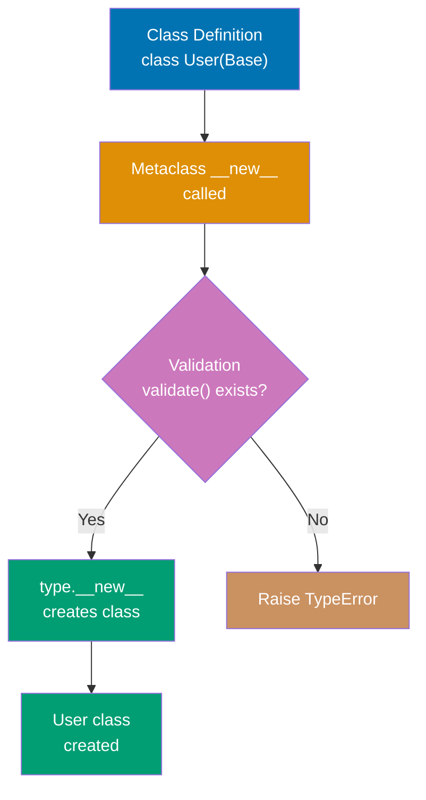

```python
class ValidatedMeta(type):
    """Metaclass that validates class attributes"""

    def __new__(mcs, name, bases, namespace):
        # Validate required methods exist
        if name != 'Base' and 'validate' not in namespace:
            raise TypeError(f"{name} must implement 'validate' method")
        # Create class normally                # => Calls type.__new__
        return super().__new__(mcs, name, bases, namespace)

class Base(metaclass=ValidatedMeta):
    """Base class using metaclass"""
    pass

class User(Base):
    def validate(self):
        return True                           # => Required method

# class Invalid(Base):                        # => TypeError: must implement 'validate'
#     pass
```

**Key Takeaway**: Metaclasses intercept class creation enabling framework-level validation and customization.

**Why It Matters**: Metaclasses enable framework-level customization and validation that executes at class definition time, catching design errors before instantiation. The pattern underlies ORM frameworks like SQLAlchemy and Django where metaclasses register models and validate field definitions. However, metaclasses add significant complexity and should only be used when simpler alternatives like decorators and **init_subclass** are insufficient.

## Example 56: **init_subclass** (Simpler Alternative)

**init_subclass** provides class customization without metaclasses for most use cases.

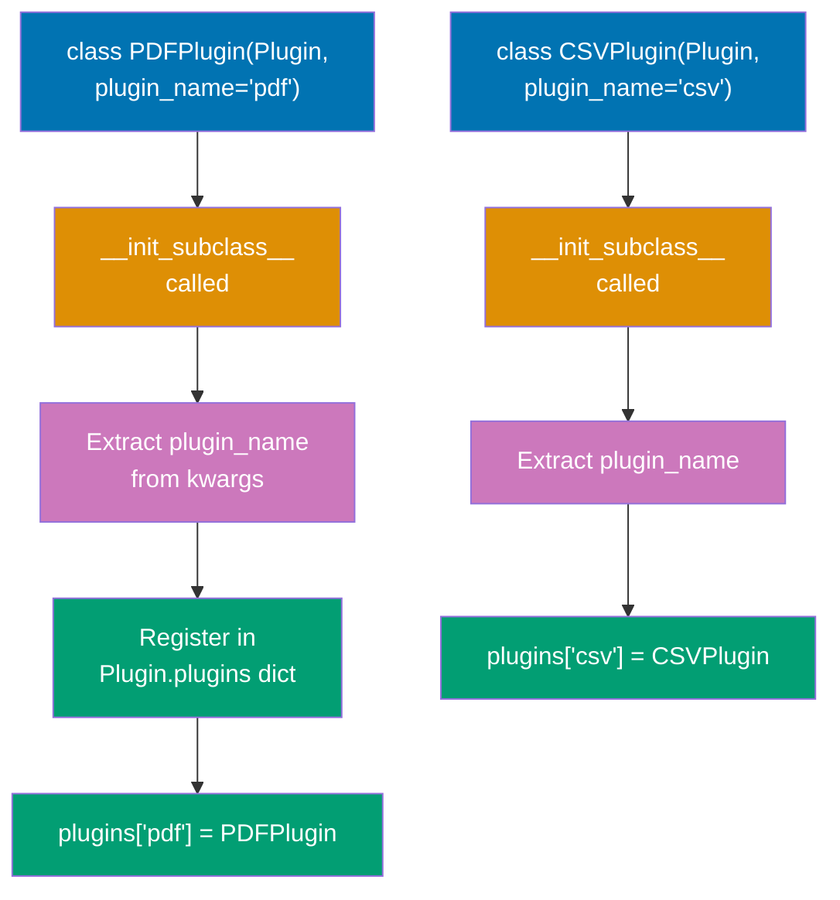

```python
class Plugin:
    """Base class with automatic subclass registration"""
    plugins = {}

    def __init_subclass__(cls, plugin_name=None, **kwargs):
        super().__init_subclass__(**kwargs)
        if plugin_name:
            cls.plugins[plugin_name] = cls     # => Register plugin by name
            print(f"Registered plugin: {plugin_name}")

class PDFPlugin(Plugin, plugin_name='pdf'):
    """Automatically registered as 'pdf'"""
    pass

class CSVPlugin(Plugin, plugin_name='csv'):
    pass

# Access registered plugins
print(Plugin.plugins)  # => {'pdf': PDFPlugin, 'csv': CSVPlugin}
```

**Key Takeaway**: **init_subclass** simplifies common metaclass patterns with cleaner syntax.

**Why It Matters**: **init_subclass** provides class customization without metaclass complexity, making it the preferred approach for most use cases requiring subclass registration or validation. The pattern enables plugin systems and factory registration with clearer syntax than metaclasses. Understanding when to use **init_subclass** versus metaclasses prevents over-engineering while achieving framework-level customization.

## Example 57: Descriptor Protocol

Descriptors customize attribute access using **get**, **set**, and **delete** methods.

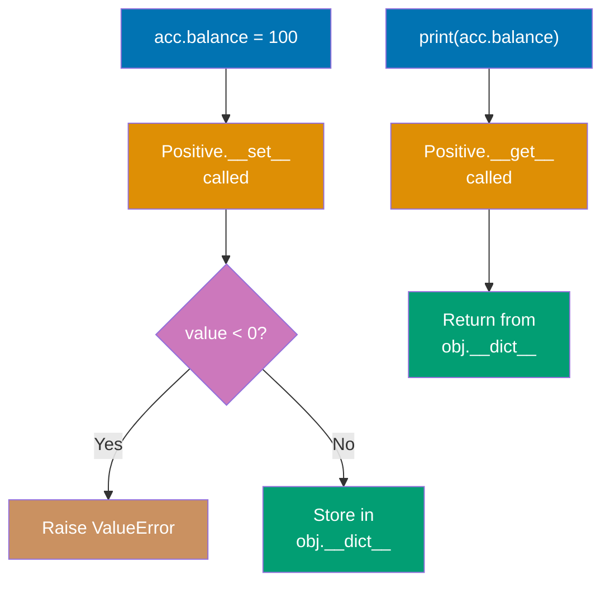

```python
class Positive:
    """Descriptor that enforces positive values"""

    def __init__(self, name):
        self.name = name

    def __get__(self, obj, objtype=None):
        if obj is None:
            return self                        # => Accessed on class
        return obj.__dict__.get(self.name, 0)  # => Return stored value

    def __set__(self, obj, value):
        if value < 0:
            raise ValueError(f"{self.name} must be positive")
        obj.__dict__[self.name] = value        # => Store value

class Account:
    balance = Positive('balance')             # => Descriptor instance

    def __init__(self, balance):
        self.balance = balance                # => Calls __set__

acc = Account(100)       # => OK
print(acc.balance)       # => 100 (calls __get__)
# acc.balance = -50      # => ValueError: balance must be positive
```

**Key Takeaway**: Descriptors enable reusable attribute validation and transformation logic.

**Why It Matters**: Descriptors enable reusable attribute validation and transformation logic that works across multiple classes, reducing code duplication in large codebases. The protocol underlies properties, methods, and classmethods in Python, making it fundamental to understanding Python's attribute access model. Mastering descriptors is essential for framework development and building elegant APIs with computed or validated attributes.

## Example 58: Property as Descriptor

Properties use descriptors internally for computed attributes.

```python
class Circle:
    """Circle with computed area using property"""

    def __init__(self, radius):
        self._radius = radius                 # => Private storage

    @property
    def radius(self):
        """Getter"""
        return self._radius                   # => Return value

    @radius.setter
    def radius(self, value):
        """Setter with validation"""
        if value < 0:
            raise ValueError("Radius must be non-negative")
        self._radius = value                  # => Update value

    @property
    def area(self):
        """Computed property (read-only)"""
        return 3.14159 * self._radius ** 2    # => Calculate on access

c = Circle(5)
print(c.radius)  # => 5 (calls getter)
print(c.area)    # => 78.53975 (computed)
c.radius = 10    # => Calls setter
# c.area = 100   # => AttributeError: can't set attribute
```

**Key Takeaway**: Properties provide computed attributes and attribute validation with getter/setter syntax.

**Why It Matters**: Properties provide computed attributes and validation with attribute syntax rather than getter/setter methods, making APIs more Pythonic and user-friendly. The decorator-based pattern enables gradual addition of validation and computation without breaking existing code that accesses attributes directly. Understanding properties is essential for designing clean APIs that hide implementation details while maintaining attribute-like access patterns.

## Example 59: Asyncio Basics

Asyncio enables concurrent I/O operations using async/await syntax.

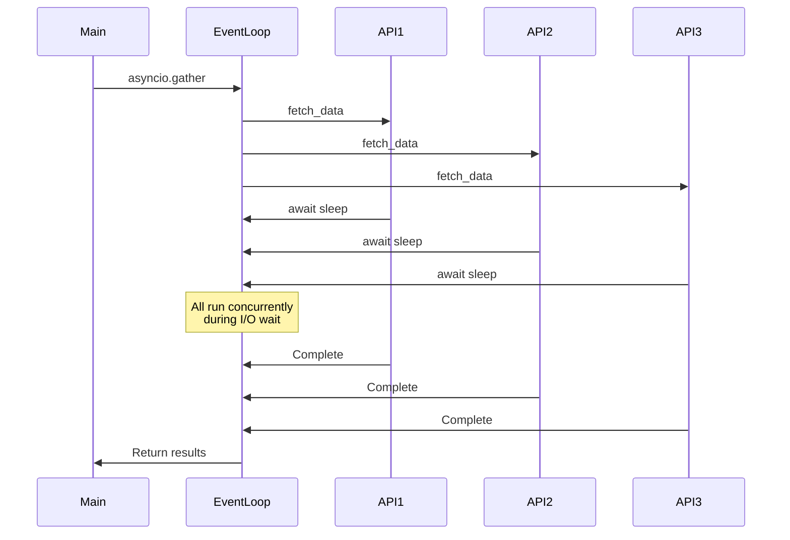

```python
import asyncio

async def fetch_data(url):
    """Simulated async HTTP request"""
    print(f"Fetching {url}...")
    await asyncio.sleep(1)                    # => Simulate I/O (yields control)
    print(f"Completed {url}")
    return f"Data from {url}"                 # => Return result

async def main():
    """Run multiple async operations concurrently"""
    # Sequential (slow)
    # result1 = await fetch_data("https://api1.com")
    # result2 = await fetch_data("https://api2.com")

    # Concurrent (fast)
    results = await asyncio.gather(           # => Run concurrently
        fetch_data("https://api1.com"),
        fetch_data("https://api2.com"),
        fetch_data("https://api3.com")
    )
    print(results)  # => List of results

# Run the event loop
asyncio.run(main())  # => Starts event loop, runs main()
```

**Key Takeaway**: asyncio enables concurrent I/O with async/await; gather runs multiple coroutines concurrently.

**Why It Matters**: Asyncio enables concurrent I/O operations on a single thread using cooperative multitasking, avoiding the overhead and complexity of threading for I/O-bound workloads. The async/await syntax makes asynchronous code readable compared to callback-based approaches, while gather() enables structured concurrency. Mastering asyncio is essential for high-performance network services and web scraping where I/O operations dominate execution time.

## Example 60: Asyncio Tasks

Tasks wrap coroutines for concurrent execution with more control than gather.

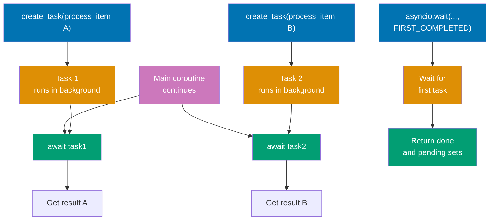

```python
import asyncio

async def process_item(item, delay):
    """Process single item"""
    await asyncio.sleep(delay)
    return f"Processed {item}"

async def main():
    # Create tasks (start immediately)
    task1 = asyncio.create_task(process_item("A", 2))  # => Start background task
    task2 = asyncio.create_task(process_item("B", 1))

    # Do other work while tasks run
    print("Tasks running in background...")
    await asyncio.sleep(0.5)
    print("Still working...")

    # Wait for completion
    result1 = await task1                     # => Wait for task1
    result2 = await task2                     # => Wait for task2
    print(result1, result2)

    # Wait for first completion
    tasks = [
        asyncio.create_task(process_item(f"Item{i}", i))
        for i in range(1, 4)
    ]
    done, pending = await asyncio.wait(tasks, return_when=asyncio.FIRST_COMPLETED)
    print(f"First completed: {done.pop().result()}")

asyncio.run(main())
```

**Key Takeaway**: Tasks provide fine-grained control over concurrent coroutines with early cancellation and result access.

**Why It Matters**: Tasks provide more control than gather() for managing concurrent coroutines, enabling early cancellation and result access before all tasks complete. The FIRST_COMPLETED pattern enables timeout handling and racing multiple operations for improved responsiveness. Understanding task management is critical for building robust asyncio applications with proper error handling and resource cleanup.

## Example 61: Async Context Managers

Async context managers handle async resource acquisition and cleanup.

```python
import asyncio

class AsyncResource:
    """Async context manager for resource management"""

    async def __aenter__(self):
        """Async enter (setup)"""
        print("Acquiring resource...")
        await asyncio.sleep(1)                # => Async setup
        self.resource = "RESOURCE"
        return self.resource

    async def __aexit__(self, exc_type, exc_val, exc_tb):
        """Async exit (cleanup)"""
        print("Releasing resource...")
        await asyncio.sleep(0.5)              # => Async cleanup
        self.resource = None
        return False                          # => Propagate exceptions

async def main():
    async with AsyncResource() as res:        # => Calls __aenter__
        print(f"Using {res}")
        await asyncio.sleep(0.1)
    # => Calls __aexit__ automatically

asyncio.run(main())
```

**Key Takeaway**: Async context managers enable safe async resource management with **aenter** and **aexit**.

**Why It Matters**: Async context managers enable safe resource management in asyncio applications where setup and cleanup operations require I/O, like database connections and network sockets. The **aenter** and **aexit** protocol parallels synchronous context managers but supports await for asynchronous operations. Mastering async context managers is essential for preventing resource leaks in production asyncio applications.

## Example 62: Protocol (Structural Subtyping)

Protocols define interfaces checked structurally (duck typing with type hints).

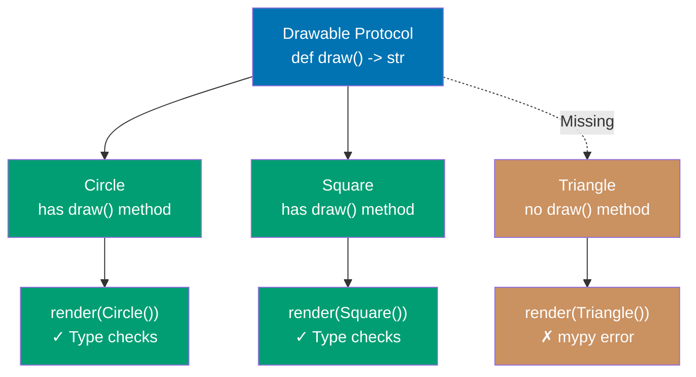

```python
from typing import Protocol

class Drawable(Protocol):
    """Protocol for drawable objects"""
    def draw(self) -> str:
        """Must have draw method returning string"""
        ...

class Circle:
    """Implicitly implements Drawable (no inheritance needed)"""
    def draw(self) -> str:
        return "Drawing circle"               # => Has draw() -> str

class Square:
    def draw(self) -> str:
        return "Drawing square"

def render(obj: Drawable) -> None:
    """Accepts any object with draw() method"""
    print(obj.draw())                         # => Structural typing

render(Circle())  # => OK, has draw()
render(Square())  # => OK, has draw()

# class Triangle:                             # => Missing draw()
#     pass
# render(Triangle())  # => mypy error (no draw method)
```

**Key Takeaway**: Protocols enable interface typing without inheritance using structural subtyping.

**Why It Matters**: Protocols enable structural subtyping (duck typing with type hints) that catches type errors statically without requiring inheritance, improving flexibility in API design. The pattern is essential for defining interfaces in libraries where you can't control client code inheritance. Understanding protocols is critical for modern Python type hinting, especially for framework APIs that need flexibility without sacrificing type safety.

## Example 63: Generic Types

Generic types enable type-safe containers and functions for multiple types.

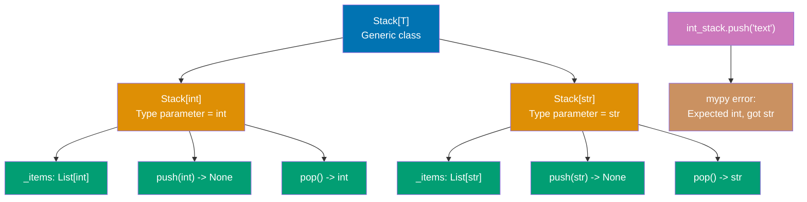

```python
from typing import TypeVar, Generic, List

T = TypeVar('T')                              # => Type variable

class Stack(Generic[T]):
    """Generic stack for any type T"""

    def __init__(self) -> None:
        self._items: List[T] = []             # => Type-safe list

    def push(self, item: T) -> None:
        self._items.append(item)

    def pop(self) -> T:
        return self._items.pop()

# Type-specific stacks
int_stack: Stack[int] = Stack()               # => Stack of integers
int_stack.push(1)
int_stack.push(2)
# int_stack.push("text")                      # => mypy error

str_stack: Stack[str] = Stack()               # => Stack of strings
str_stack.push("hello")
```

**Key Takeaway**: Generic types enable reusable type-safe containers with type parameter substitution.

**Why It Matters**: Generic types enable writing reusable, type-safe container classes and functions that work with multiple types while preserving type information for static analysis. The pattern is essential for library development where type safety improves user experience through IDE autocomplete and error detection. Mastering generics is critical for building type-safe collections, decorators, and higher-order functions in modern Python.

## Example 64: Profiling with cProfile

Identify performance bottlenecks using cProfile for function-level timing.

```python
import cProfile
import pstats

def fibonacci(n):
    """Inefficient recursive Fibonacci"""
    if n < 2:
        return n
    return fibonacci(n-1) + fibonacci(n-2)

def calculate_sequence():
    """Calculate multiple Fibonacci numbers"""
    results = [fibonacci(i) for i in range(25)]
    return results

# Profile function
profiler = cProfile.Profile()
profiler.enable()                             # => Start profiling
result = calculate_sequence()
profiler.disable()                            # => Stop profiling

# Print statistics
stats = pstats.Stats(profiler)
stats.sort_stats('cumulative')                # => Sort by cumulative time
stats.print_stats(10)                         # => Print top 10 functions

# Output shows:
# - ncalls: number of calls
# - tottime: time in this function (excluding subcalls)
# - cumtime: time in this function (including subcalls)
```

**Key Takeaway**: cProfile reveals performance hotspots showing call counts and time per function.

**Why It Matters**: Profiling identifies performance bottlenecks through measurement rather than intuition, preventing premature optimization and guiding optimization efforts to code that matters. The cProfile module provides low-overhead profiling suitable for production systems to diagnose performance issues in real workloads. Understanding profiling is essential for optimization work where data-driven decisions prevent wasted effort on code that doesn't impact performance.

## Example 65: Memory Profiling

Track memory usage with memory_profiler to identify memory leaks.

```python
from memory_profiler import profile

@profile                                      # => Decorate to profile memory
def process_large_data():
    """Function that uses memory"""
    data = [i ** 2 for i in range(1000000)]  # => Allocate large list
    filtered = [x for x in data if x % 2 == 0]  # => Another large list
    result = sum(filtered)                    # => Process data
    return result

# Run function (memory usage printed line by line)
# result = process_large_data()

# Output shows memory increase per line:
# Line    Mem usage    Increment
#     3     50.5 MiB     50.5 MiB   data = [...]
#     4     88.2 MiB     37.7 MiB   filtered = [...]
#     5     88.2 MiB      0.0 MiB   result = sum(...)
```

**Key Takeaway**: memory_profiler shows line-by-line memory usage revealing allocation hotspots.

**Why It Matters**: Memory profiling identifies memory leaks and allocation hotspots that cause production systems to crash or experience degraded performance over time. The line-by-line output pinpoints exactly where memory is allocated, enabling targeted optimization. Mastering memory profiling is critical for long-running applications and systems processing large datasets where memory efficiency impacts scalability.

## Example 66: Threading for I/O-Bound Tasks

Use threading for I/O-bound operations bypassing GIL limitations.

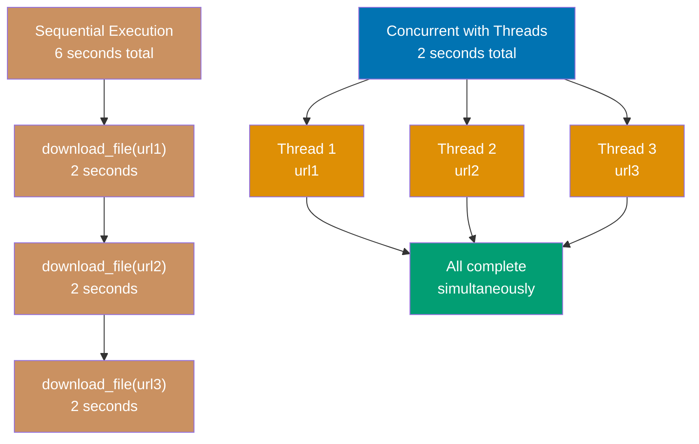

```python
import threading
import time

def download_file(url):
    """Simulated file download"""
    print(f"Downloading {url}...")
    time.sleep(2)                             # => Simulated I/O (releases GIL)
    print(f"Completed {url}")

# Sequential (slow): 6 seconds
# for url in ['url1', 'url2', 'url3']:
#     download_file(url)

# Concurrent with threads (fast): 2 seconds
threads = []
for url in ['url1', 'url2', 'url3']:
    thread = threading.Thread(target=download_file, args=(url,))
    thread.start()                            # => Start thread
    threads.append(thread)

# Wait for all threads
for thread in threads:
    thread.join()                             # => Wait for completion

print("All downloads complete")
```

**Key Takeaway**: Threading improves I/O-bound performance as I/O operations release the GIL.

**Why It Matters**: Threading improves I/O-bound performance by utilizing CPU time during I/O waits, as I/O operations release the GIL enabling true concurrency for network and disk operations. The pattern is simpler than asyncio for integrating with synchronous I/O libraries that lack async support. However, threading provides no parallelism for CPU-bound tasks due to the GIL, making it unsuitable for computational workloads.

## Example 67: ThreadPoolExecutor

ThreadPoolExecutor simplifies thread management with automatic pooling.

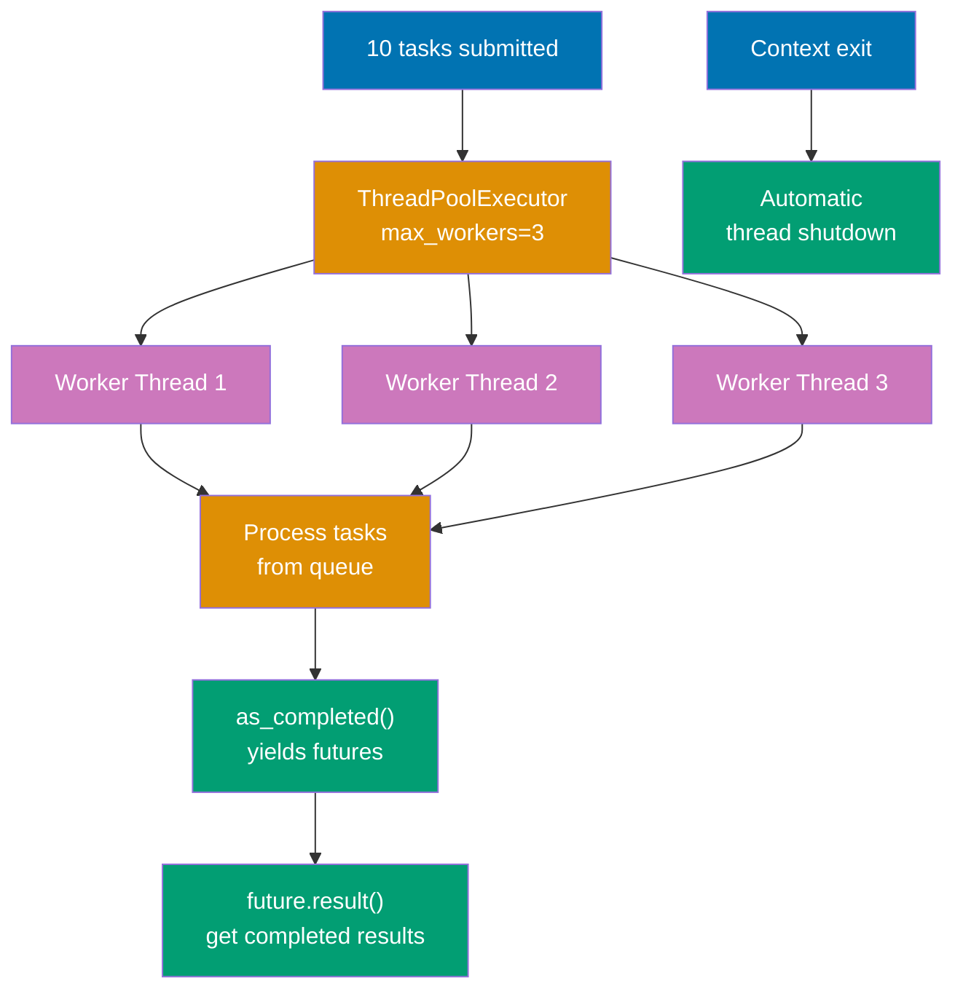

```python
from concurrent.futures import ThreadPoolExecutor, as_completed
import time

def process_task(task_id):
    """Process single task"""
    time.sleep(1)
    return f"Task {task_id} completed"

# Thread pool with max 3 worker threads
with ThreadPoolExecutor(max_workers=3) as executor:
    # Submit tasks
    futures = [executor.submit(process_task, i) for i in range(10)]

    # Process as completed (not in submission order)
    for future in as_completed(futures):      # => Yield as tasks complete
        result = future.result()              # => Get result
        print(result)

# Executor shutdown automatically (waits for completion)
```

**Key Takeaway**: ThreadPoolExecutor manages thread lifecycle with automatic pooling and cleanup.

**Why It Matters**: ThreadPoolExecutor simplifies thread management with automatic pooling and cleanup, preventing thread leaks and resource exhaustion from manual thread creation. The Future-based API enables flexible result collection with as_completed() and exception handling. Understanding executor patterns is essential for production I/O-bound applications where manual thread management is error-prone.

## Example 68: Multiprocessing for CPU-Bound Tasks

Use multiprocessing for CPU-bound tasks to bypass GIL with separate processes.

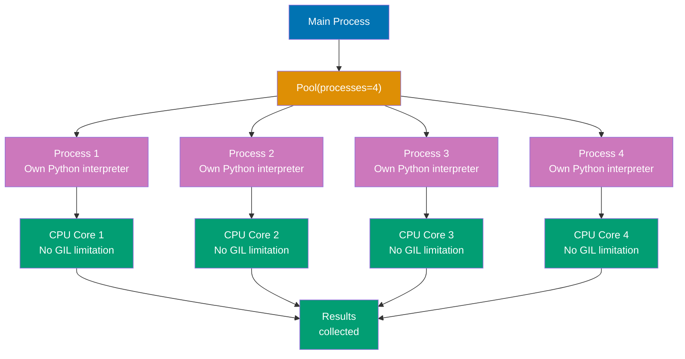

```python
from multiprocessing import Pool
import time

def cpu_intensive_task(n):
    """CPU-bound computation"""
    total = 0
    for i in range(n):
        total += i ** 2                       # => Heavy computation
    return total

if __name__ == '__main__':
    # Sequential (slow on multi-core)
    # results = [cpu_intensive_task(10**7) for _ in range(4)]

    # Parallel with process pool
    with Pool(processes=4) as pool:           # => 4 worker processes
        results = pool.map(cpu_intensive_task, [10**7] * 4)  # => Parallel execution

    print(f"Results: {results}")
```

**Key Takeaway**: Multiprocessing achieves true parallelism for CPU-bound tasks using separate processes.

**Why It Matters**: Multiprocessing bypasses the GIL by using separate Python interpreters in different processes, achieving true parallelism for CPU-bound tasks on multi-core systems. The pattern is essential for computational workloads like data processing and scientific computing where the GIL severely limits performance. However, the process creation overhead and inter-process communication costs make multiprocessing unsuitable for I/O-bound or fine-grained parallel tasks.

## Example 69: Weak References

Weak references allow object references without preventing garbage collection.

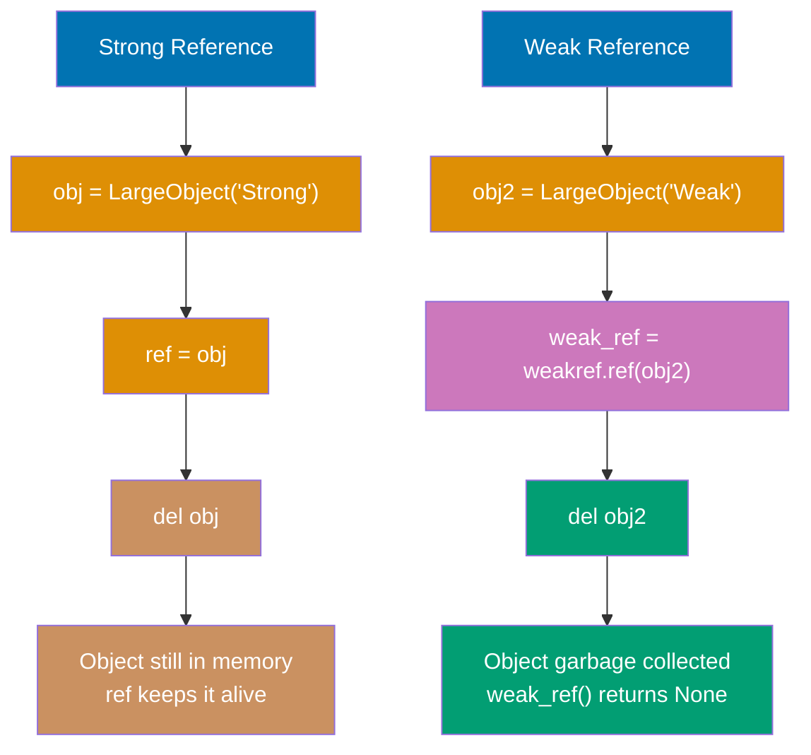

```python
import weakref

class LargeObject:
    def __init__(self, name):
        self.name = name
        print(f"Created {name}")

    def __del__(self):
        print(f"Deleted {name}")              # => Called when garbage collected

# Strong reference (prevents GC)
obj = LargeObject("Strong")                   # => Created Strong
ref = obj                                     # => Another strong reference
del obj                                       # => Still in memory (ref exists)

# Weak reference (allows GC)
obj2 = LargeObject("Weak")                    # => Created Weak
weak_ref = weakref.ref(obj2)                  # => Weak reference
print(weak_ref())                             # => <LargeObject object> (still alive)
del obj2                                      # => Deleted Weak (GC collects)
print(weak_ref())                             # => None (object collected)
```

**Key Takeaway**: Weak references enable caches and observers without preventing object cleanup.

**Why It Matters**: Weak references enable cache implementations and observer patterns that don't prevent garbage collection, avoiding memory leaks from circular references or retained observers. The pattern is essential for frameworks and libraries where automatic cleanup prevents resource exhaustion as objects are no longer needed. Understanding weak references is critical for advanced memory management in long-running applications.

## Example 70: Context Variables for Async Context

ContextVar provides task-local storage for asyncio applications.

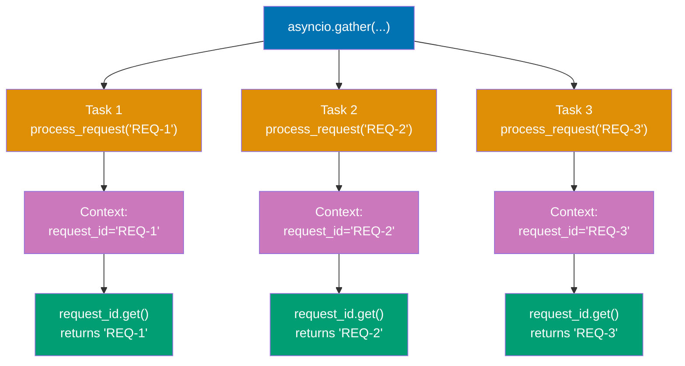

```python
import asyncio
from contextvars import ContextVar

# Global context variable
request_id: ContextVar[str] = ContextVar('request_id', default='none')

async def process_request(req_id):
    """Process request with context"""
    request_id.set(req_id)                    # => Set for this task
    await asyncio.sleep(0.1)
    current_id = request_id.get()             # => Get from context
    print(f"Processing request: {current_id}")

async def main():
    # Run concurrent tasks (each has own context)
    await asyncio.gather(
        process_request("REQ-1"),             # => Context: REQ-1
        process_request("REQ-2"),             # => Context: REQ-2
        process_request("REQ-3")              # => Context: REQ-3
    )
    # Each task maintains separate context value

asyncio.run(main())
```

**Key Takeaway**: ContextVar provides task-local storage preserving isolation across concurrent async tasks.

**Why It Matters**: ContextVar provides task-local storage for asyncio applications, preserving isolation across concurrent tasks similar to thread-local storage but compatible with cooperative multitasking. The pattern is essential for request context in web frameworks where multiple requests are handled concurrently on the same thread. Mastering ContextVar is critical for building production asyncio applications that need per-request state like authentication tokens and request IDs.

## Example 71: Advanced Decorators - Class Decorators

Class decorators modify classes enabling functionality injection.

```python
def singleton(cls):
    """Decorator that makes class a singleton"""
    instances = {}

    def get_instance(*args, **kwargs):
        if cls not in instances:
            instances[cls] = cls(*args, **kwargs)  # => Create once
        return instances[cls]                       # => Return same instance

    return get_instance

@singleton
class Database:
    """Singleton database connection"""
    def __init__(self):
        print("Connecting to database...")

db1 = Database()  # => Connecting to database...
db2 = Database()  # => (no output, returns existing instance)
print(db1 is db2)  # => True (same object)
```

**Key Takeaway**: Class decorators enable class-level modifications like singleton pattern implementation.

**Why It Matters**: Class decorators enable modifying classes after definition for patterns like singletons, registration, and automatic attribute addition, providing an alternative to metaclasses with simpler syntax. The pattern is cleaner than metaclasses for many use cases while maintaining the same power. Understanding class decorators is essential for framework development and design pattern implementation in Python.

## Example 72: Introspection with inspect

Inspect module provides runtime code introspection capabilities.

```python
import inspect

def greet(name: str, greeting: str = "Hello") -> str:
    """Greet someone"""
    return f"{greeting}, {name}!"

# Function signature
sig = inspect.signature(greet)
print(sig)  # => (name: str, greeting: str = 'Hello') -> str

# Parameter details
for param_name, param in sig.parameters.items():
    print(f"{param_name}: {param.annotation}, default={param.default}")

# Source code
source = inspect.getsource(greet)
print(source)  # => Function source as string

# Call stack
def outer():
    def inner():
        frame = inspect.currentframe()
        print(inspect.getframeinfo(frame).function)  # => 'inner'
    inner()
```

**Key Takeaway**: inspect enables runtime exploration of functions, classes, and call stack for metaprogramming.

**Why It Matters**: The inspect module enables runtime code introspection for metaprogramming, documentation generation, and debugging tools that need to examine function signatures and source code. The capabilities are essential for building frameworks that generate code, validate inputs, or provide interactive exploration. However, introspection should be used judiciously as it can make code harder to understand and breaks with compiled/obfuscated code.

## Example 73: Dynamic Code Execution

Execute Python code dynamically using eval, exec, and compile.

```python
# eval: Evaluate single expression
expr = "2 + 3 * 4"
result = eval(expr)                           # => 14

# exec: Execute statements
code = """
def dynamic_function(x):
    return x ** 2

result = dynamic_function(5)
"""
namespace = {}
exec(code, namespace)                         # => Execute in namespace
print(namespace['result'])  # => 25

# compile: Compile code for reuse
compiled = compile("x + y", "<string>", "eval")  # => Compile expression
result = eval(compiled, {'x': 10, 'y': 5})       # => 15

# Security warning: Never eval/exec untrusted input!
# Use ast.literal_eval for safe literal evaluation
import ast
safe_dict = ast.literal_eval("{'a': 1, 'b': 2}")  # => Safe for literals only
```

**Key Takeaway**: eval/exec enable dynamic code execution but require careful security considerations.

**Why It Matters**: Dynamic code execution with eval/exec enables runtime code generation and scripting capabilities, but introduces severe security risks if used with untrusted input. The compile() function enables reusing compiled code for performance when executing the same code repeatedly. These tools should be avoided in production unless absolutely necessary, and ast.literal_eval provides safe literal evaluation when dynamic data parsing is needed.

## Example 74: AST Module for Code Analysis

Abstract Syntax Tree module parses Python code for analysis and transformation.

```python
import ast

code = """
def add(a, b):
    return a + b

result = add(2, 3)
"""

# Parse code into AST
tree = ast.parse(code)                        # => Abstract syntax tree

# Walk AST nodes
for node in ast.walk(tree):
    if isinstance(node, ast.FunctionDef):
        print(f"Function: {node.name}")       # => Function: add
    elif isinstance(node, ast.Return):
        print("Found return statement")

# Compile AST to bytecode
compiled = compile(tree, "<string>", "exec")
namespace = {}
exec(compiled, namespace)
print(namespace['result'])  # => 5

# Safer than exec for code transformation
```

**Key Takeaway**: AST module enables safe code parsing and transformation without executing untrusted code.

**Why It Matters**: The AST module enables parsing and transforming Python code without executing it, providing safe code analysis for tools like linters, formatters, and code generators. The approach is safer than exec for code manipulation and enables building developer tools that understand Python syntax. Mastering AST is essential for tool development, custom linters, and code transformation utilities.

## Example 75: Packaging with pyproject.toml

Modern Python packaging uses pyproject.toml with setuptools or poetry.

```toml
# pyproject.toml
[build-system]
requires = ["setuptools>=45", "wheel"]
build-backend = "setuptools.build_meta"

[project]
name = "mypackage"
version = "0.1.0"
description = "My awesome package"
authors = [{name = "Your Name", email = "you@example.com"}]
dependencies = [
    "requests>=2.28.0",
    "numpy>=1.24.0"
]

[project.optional-dependencies]
dev = ["pytest>=7.0", "black>=22.0"]          # => Development dependencies

[project.scripts]
mytool = "mypackage.cli:main"                 # => CLI entry point
```

```python
# Build distribution
# python -m build  # => Creates dist/mypackage-0.1.0.tar.gz and .whl

# Install in development mode
# pip install -e .  # => Editable install

# Publish to PyPI
# twine upload dist/*  # => Upload to PyPI
```

**Key Takeaway**: pyproject.toml provides standardized packaging configuration for modern Python projects.

**Why It Matters**: Modern Python packaging with pyproject.toml standardizes build configuration across tools, replacing legacy setup.py with declarative metadata that supports multiple build backends. The standardization improves reproducibility and enables better tooling for dependency management and distribution. Understanding modern packaging is essential for library development and ensuring code can be easily installed and distributed through PyPI.

## Example 76: Advanced pytest - Mocking

Mock external dependencies for isolated unit testing.

```python
from unittest.mock import Mock, patch
import requests

def fetch_user_data(user_id):
    """Fetch user data from API"""
    response = requests.get(f"https://api.example.com/users/{user_id}")
    return response.json()

# Test with mock
def test_fetch_user_data():
    """Test without actual HTTP request"""
    with patch('requests.get') as mock_get:
        # Configure mock
        mock_get.return_value.json.return_value = {'id': 1, 'name': 'Alice'}

        # Call function (uses mock instead of real requests.get)
        result = fetch_user_data(1)

        # Assertions
        assert result == {'id': 1, 'name': 'Alice'}
        mock_get.assert_called_once_with("https://api.example.com/users/1")

# Mock object
mock_db = Mock()
mock_db.query.return_value = [{'id': 1}]      # => Configure return value
result = mock_db.query("SELECT * FROM users") # => Returns configured value
mock_db.query.assert_called_with("SELECT * FROM users")  # => Verify call
```

**Key Takeaway**: Mocking isolates tests from external dependencies with configurable return values and call verification.

**Why It Matters**: Mocking isolates unit tests from external dependencies like databases and APIs, enabling fast, reliable tests that don't require infrastructure. The patch decorator and return_value configuration enable complete control over dependency behavior for testing edge cases. Mastering mocking is essential for professional testing where isolated unit tests provide fast feedback without flaky failures from external services.

## Example 77: pytest Markers for Test Organization

Markers tag tests for selective execution and categorization.

```python
import pytest

@pytest.mark.slow
def test_long_running_operation():
    """Test marked as slow"""
    import time
    time.sleep(2)
    assert True

@pytest.mark.unit
def test_fast_unit():
    """Unit test (fast)"""
    assert 1 + 1 == 2

@pytest.mark.integration
@pytest.mark.slow
def test_database_integration():
    """Integration test (slow)"""
    assert True

# Run only specific markers:
# pytest -m unit           # => Run only unit tests
# pytest -m "not slow"     # => Skip slow tests
# pytest -m "slow and integration"  # => Run slow integration tests

# Custom markers in pytest.ini:
# [tool:pytest]
# markers =
#     slow: marks tests as slow
#     unit: marks tests as unit tests
#     integration: marks tests as integration tests
```

**Key Takeaway**: Markers enable test categorization and selective execution for faster development workflows.

**Why It Matters**: Pytest markers enable selective test execution for faster development workflows, allowing developers to run only relevant tests during feature development. The categorization (unit, integration, slow) enables different test suites for different contexts like CI/CD, pre-commit, and release validation. Understanding marker-based test organization is critical for scaling test suites as projects grow without sacrificing development velocity.

## Example 78: Singleton Pattern (Pythonic)

Implement singleton using module-level instance or metaclass.

```python
# Approach 1: Module-level instance (simplest)
# database.py
class _Database:
    def __init__(self):
        self.connection = "DB_CONNECTION"

database = _Database()  # => Single instance created on import

# Usage: from database import database

# Approach 2: __new__ method
class Singleton:
    _instance = None

    def __new__(cls):
        if cls._instance is None:
            cls._instance = super().__new__(cls)  # => Create once
        return cls._instance                      # => Return same instance

s1 = Singleton()
s2 = Singleton()
print(s1 is s2)  # => True

# Approach 3: Metaclass (most flexible)
class SingletonMeta(type):
    _instances = {}

    def __call__(cls, *args, **kwargs):
        if cls not in cls._instances:
            cls._instances[cls] = super().__call__(*args, **kwargs)
        return cls._instances[cls]

class Logger(metaclass=SingletonMeta):
    pass
```

**Key Takeaway**: Python offers multiple singleton implementations; module-level instance is most Pythonic.

**Why It Matters**: Singleton pattern ensures single instance existence for resources like database connections and configuration managers, preventing resource conflicts and inconsistent state. However, singletons can make testing harder and create global state that violates dependency injection principles. The module-level instance approach is most Pythonic and simplest, avoiding metaclass complexity while achieving the same goal.

## Example 79: Observer Pattern

Implement observer pattern for event-driven architectures.

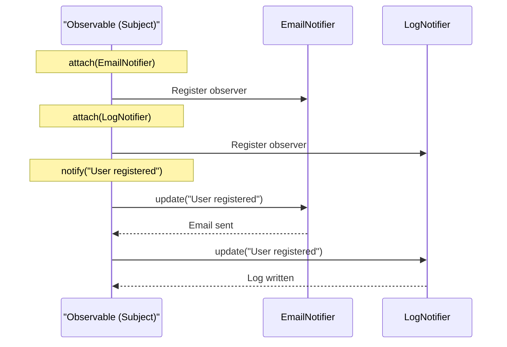

```python
class Observable:
    """Subject that observers watch"""

    def __init__(self):
        self._observers = []

    def attach(self, observer):
        """Add observer"""
        self._observers.append(observer)

    def detach(self, observer):
        """Remove observer"""
        self._observers.remove(observer)

    def notify(self, event):
        """Notify all observers of event"""
        for observer in self._observers:
            observer.update(event)            # => Call observer's update

class EmailNotifier:
    """Observer that sends emails"""
    def update(self, event):
        print(f"Email: {event}")              # => React to event

class LogNotifier:
    """Observer that logs events"""
    def update(self, event):
        print(f"Log: {event}")

# Usage
subject = Observable()
subject.attach(EmailNotifier())
subject.attach(LogNotifier())
subject.notify("User registered")             # => Email and log notifications
```

**Key Takeaway**: Observer pattern decouples event producers from consumers for flexible event handling.

**Why It Matters**: Observer pattern decouples event producers from consumers, enabling flexible event handling where observers can be added or removed without modifying the subject. The pattern is fundamental to GUI frameworks, event-driven architectures, and plugin systems. Understanding observer pattern is essential for building extensible systems where components react to events without tight coupling.

## Example 80: Best Practices - EAFP and Duck Typing

Embrace Python's EAFP (Easier to Ask Forgiveness than Permission) and duck typing.

```python
# EAFP: Try operation, handle exception
def process_file(filename):
    """EAFP approach"""
    try:
        with open(filename) as f:             # => Try operation directly
            return f.read()
    except FileNotFoundError:
        return "File not found"               # => Handle exception
    except PermissionError:
        return "Permission denied"

# LBYL (Look Before You Leap) - less Pythonic
# if os.path.exists(filename) and os.access(filename, os.R_OK):
#     with open(filename) as f:
#         return f.read()

# Duck typing: "If it walks like a duck and quacks like a duck, it's a duck"
def print_items(items):
    """Accept any iterable (list, tuple, set, generator, custom)"""
    for item in items:                        # => Works with any iterable
        print(item)

print_items([1, 2, 3])                        # => Works
print_items((1, 2, 3))                        # => Works
print_items({1, 2, 3})                        # => Works
print_items(x for x in range(3))              # => Works (generator)

# Type checking reduces flexibility
# def print_list(items: list):                # => Too restrictive
#     ...

# Prefer protocols or abstract types
from typing import Iterable
def print_items_typed(items: Iterable):       # => Flexible with type safety
    for item in items:
        print(item)
```

**Key Takeaway**: EAFP and duck typing embrace Python's dynamic nature for cleaner, more flexible code.

**Why It Matters**: EAFP (Easier to Ask Forgiveness than Permission) and duck typing embrace Python's dynamic nature, preferring exception handling over pre-checks that can create race conditions. The philosophy enables writing flexible, polymorphic code that works with any compatible object rather than requiring specific types. Mastering EAFP and duck typing is essential for writing Pythonic code that leverages Python's strengths rather than fighting its dynamic nature.

## Summary

Advanced Python (examples 55-80) covers expert-level techniques: metaclasses for class customization, asyncio for concurrent I/O, descriptors for attribute control, profiling and optimization, multiprocessing for CPU-bound parallelism, introspection and dynamic execution, modern packaging, advanced testing patterns, and Pythonic design patterns. Master these techniques to write production-grade Python systems operating at 95% language coverage.
