## Beginner Level (0-40% Coverage)

This level covers Python fundamentals through 27 self-contained examples. Each example is copy-paste-runnable and demonstrates core language features needed for basic Python programming.

---

### Example 1: Hello World and Print

Python's `print()` function outputs text to stdout, supporting multiple arguments, string formatting, and custom separators. It's the most basic way to produce visible output and debug programs.

```python
# Basic print
print("Hello, World!")           # => Output: Hello, World!

# Multiple arguments (space-separated by default)
print("Hello", "Python", "3")    # => Output: Hello Python 3

# Custom separator
print("A", "B", "C", sep="-")    # => Output: A-B-C

# Custom end character (default is newline)
print("Same line", end=" ")      # => Output: Same line (no newline)
print("continues")                # => Output: continues

# Printing variables
name = "Alice"                    # => name is "Alice" (type: str)
age = 30                          # => age is 30 (type: int)
print("Name:", name, "Age:", age) # => Output: Name: Alice Age: 30
```

**Key Takeaway**: Use `print()` for debugging and simple output - it accepts multiple arguments with customizable separators and handles automatic type-to-string conversion.

**Why It Matters**: Python's print() serves as both a debugging tool and production logging foundation, with its multiple-argument handling and custom separators enabling quick diagnostic output during development. The sep and end parameters provide flexibility for formatting output without string concatenation overhead. In production systems, understanding print()'s behavior helps developers transition smoothly to proper logging frameworks while maintaining similar output patterns.

---

### Example 2: Variables and Dynamic Typing

Python uses dynamic typing where variables can reference any type and types are determined at runtime. Variable names are case-sensitive and follow snake_case convention.

```python
# Dynamic typing - no type declarations needed
x = 42                            # => x is 42 (type: int)
print(type(x))                    # => Output: <class 'int'>

# Reassign to different type
x = "now a string"                # => x is "now a string" (type: str)
print(type(x))                    # => Output: <class 'str'>

# Multiple assignment
a, b, c = 1, 2, 3                 # => a is 1, b is 2, c is 3
print(a, b, c)                    # => Output: 1 2 3

# Swap variables (Pythonic idiom)
a, b = b, a                       # => a is 2, b is 1 (swapped!)
print(a, b)                       # => Output: 2 1

# Chain assignment
x = y = z = 0                     # => x, y, z all equal 0
print(x, y, z)                    # => Output: 0 0 0
```

**Key Takeaway**: Python's dynamic typing provides flexibility but requires discipline - use descriptive variable names and consider type hints for production code to improve readability and catch errors early.

**Why It Matters**: Dynamic typing enables rapid prototyping and flexible APIs, but comes with the cost of runtime type errors that statically-typed languages catch at compile time. Type hints (PEP 484) bridge this gap by enabling static analysis tools like mypy to catch type errors before deployment while preserving Python's dynamic runtime flexibility. This makes Python suitable for both scripting and large-scale production systems when combined with proper type annotations and testing.

---

### Example 3: Numbers and Arithmetic

Python supports integers (unlimited precision), floats (IEEE 754), and complex numbers with standard arithmetic operators plus floor division and exponentiation.

```python
# Integer arithmetic
a = 10                            # => a is 10 (type: int)
b = 3                             # => b is 3 (type: int)

print(a + b)                      # => Output: 13 (addition)
print(a - b)                      # => Output: 7 (subtraction)
print(a * b)                      # => Output: 30 (multiplication)
print(a / b)                      # => Output: 3.3333... (float division)
print(a // b)                     # => Output: 3 (floor division, integer result)
print(a % b)                      # => Output: 1 (modulo, remainder)
print(a ** b)                     # => Output: 1000 (exponentiation, 10^3)

# Float arithmetic
pi = 3.14159                      # => pi is 3.14159 (type: float)
radius = 5.0                      # => radius is 5.0 (type: float)
area = pi * radius ** 2           # => area is 78.53975 (π × 5²)
print(f"Area: {area:.2f}")        # => Output: Area: 78.54 (formatted to 2 decimals)

# Integer unlimited precision
big = 10 ** 100                   # => big is 1 followed by 100 zeros
print(big)                        # => Output: 100000000000... (no overflow!)

# Complex numbers
z = 3 + 4j                        # => z is (3+4j) (type: complex)
print(abs(z))                     # => Output: 5.0 (magnitude: √(3²+4²))
```

**Key Takeaway**: Python integers have unlimited precision (no overflow), division `/` always returns float, and floor division `//` returns integer quotient - use `/` for mathematical calculations and `//` when you need integer results.

**Why It Matters**: Python's unlimited-precision integers prevent overflow bugs that plague languages with fixed-size integers, making it ideal for financial calculations and cryptography where precision is critical. The distinction between `/` (true division) and `//` (floor division) prevents common gotchas from languages where division behavior depends on operand types. Understanding these fundamentals prevents subtle bugs in production code, especially when migrating from languages with different arithmetic semantics.

---

### Example 4: Strings and String Methods

Strings in Python are immutable sequences of Unicode characters with rich methods for manipulation, formatting, and searching.

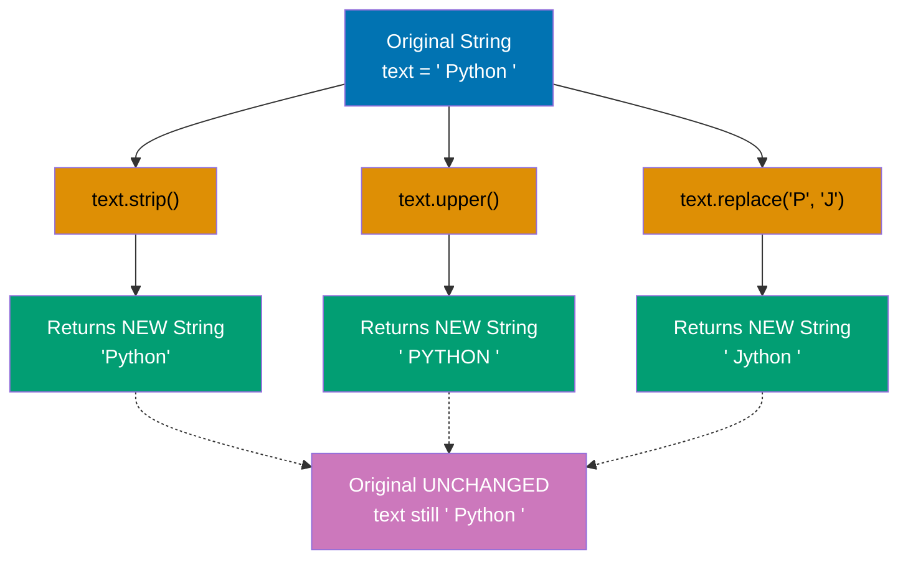

```python
# String creation (single or double quotes)
name = "Alice"                    # => name is "Alice" (type: str)
greeting = 'Hello'                # => greeting is "Hello" (single quotes equivalent)

# String concatenation
message = greeting + ", " + name  # => message is "Hello, Alice"
print(message)                    # => Output: Hello, Alice

# String repetition
laugh = "ha" * 3                  # => laugh is "hahahaha"
print(laugh)                      # => Output: hahaha

# String methods (immutable - return new strings)
text = "  Python Programming  "   # => text has leading/trailing spaces
print(text.strip())               # => Output: Python Programming (spaces removed)
print(text.upper())               # => Output:   PYTHON PROGRAMMING   (uppercase)
print(text.lower())               # => Output:   python programming   (lowercase)
print(text.replace("Python", "Go"))# => Output:   Go Programming   (replaced)

# Original string unchanged (immutability)
print(text)                       # => Output:   Python Programming   (unchanged!)

# String splitting and joining
words = "apple,banana,cherry"     # => words is "apple,banana,cherry"
fruits = words.split(",")         # => fruits is ["apple", "banana", "cherry"] (list)
print(fruits)                     # => Output: ['apple', 'banana', 'cherry']

joined = "-".join(fruits)         # => joined is "apple-banana-cherry"
print(joined)                     # => Output: apple-banana-cherry

# String formatting (f-strings, Python 3.6+)
age = 30                          # => age is 30
print(f"{name} is {age} years old")# => Output: Alice is 30 years old

# Multiline strings
poem = """Line one
Line two
Line three"""                     # => poem is 3-line string
print(poem)                       # => Output: (3 lines)
```

**Key Takeaway**: Strings are immutable - all string methods return new strings rather than modifying originals. Use f-strings for readable formatting and `split()`/`join()` for transforming between strings and lists.

**Why It Matters**: String immutability guarantees thread safety without locks and enables memory optimizations through string interning, making concurrent Python programs more reliable. The rich set of string methods eliminates need for external libraries for common text processing tasks. F-strings (PEP 498) provide readable, performant formatting that compiles to optimized bytecode rather than runtime string concatenation, making them the preferred choice for production code.

---

### Example 5: Boolean Logic and Comparisons

Python provides boolean type with `True`/`False` values, comparison operators, and logical operators with short-circuit evaluation.

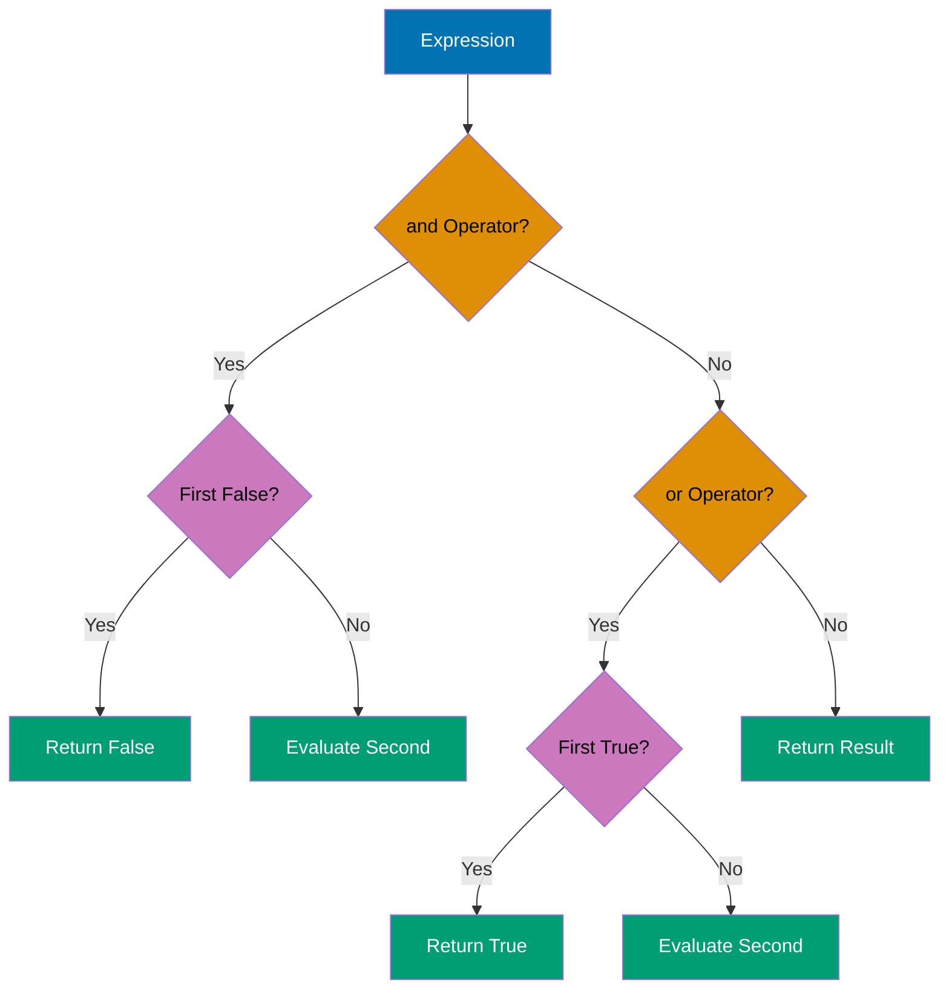

```python
# Boolean values
is_active = True                  # => is_active is True (type: bool)
is_deleted = False                # => is_deleted is False (type: bool)

# Comparison operators
x = 10                            # => x is 10
y = 20                            # => y is 20

print(x == y)                     # => Output: False (equal)
print(x != y)                     # => Output: True (not equal)
print(x < y)                      # => Output: True (less than)
print(x <= y)                     # => Output: True (less than or equal)
print(x > y)                      # => Output: False (greater than)
print(x >= y)                     # => Output: False (greater than or equal)

# Logical operators (and, or, not)
a = True                          # => a is True
b = False                         # => b is False

print(a and b)                    # => Output: False (both must be True)
print(a or b)                     # => Output: True (at least one True)
print(not a)                      # => Output: False (negation)

# Short-circuit evaluation
def expensive():
    print("Expensive function called")
    return True

result = False and expensive()    # => expensive() NOT called (short-circuit!)
print(result)                     # => Output: False (no "Expensive..." printed)

result = True or expensive()      # => expensive() NOT called (short-circuit!)
print(result)                     # => Output: True (no "Expensive..." printed)

# Truthy and falsy values
print(bool(0))                    # => Output: False (0 is falsy)
print(bool(""))                   # => Output: False (empty string is falsy)
print(bool([]))                   # => Output: False (empty list is falsy)
print(bool(42))                   # => Output: True (non-zero numbers truthy)
print(bool("text"))               # => Output: True (non-empty strings truthy)
```

**Key Takeaway**: Python uses short-circuit evaluation for `and`/`or` operators (stops evaluating once result is determined), and many values are falsy (0, empty strings/lists/dicts, None) - use explicit comparisons when checking for specific values.

**Why It Matters**: Short-circuit evaluation optimizes performance by avoiding unnecessary function calls and prevents errors when accessing potentially undefined values (e.g., `obj and obj.method()`). Python's truthy/falsy semantics enable concise conditional checks but require awareness to avoid bugs when distinguishing between None, 0, and empty collections. Explicit comparisons (`if x is None`) are preferred in production code for clarity and correctness over implicit truthiness checks (`if x`).

---

### Example 6: Conditional Statements (if/elif/else)

Python uses indentation-based blocks for conditionals with `if`, `elif` (else-if), and `else` keywords. No parentheses required around conditions.

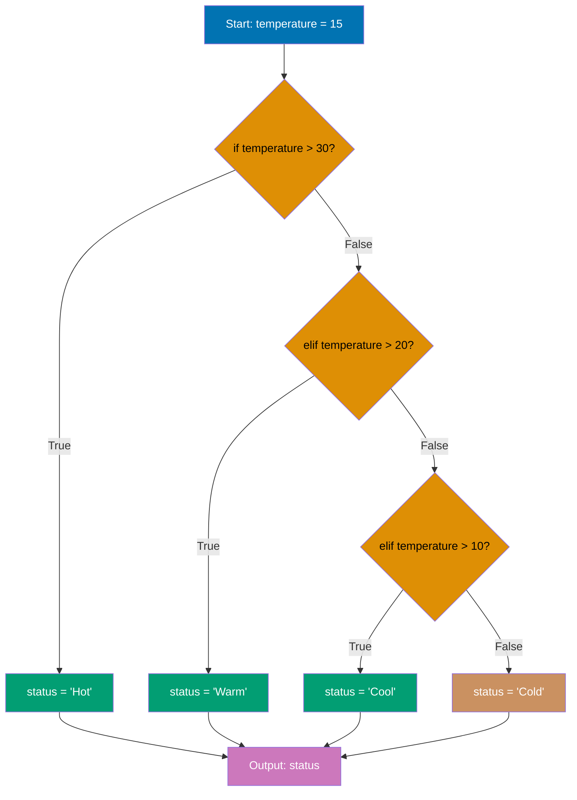

```python
# Basic if statement
age = 18                          # => age is 18
if age >= 18:
    print("Adult")                # => Output: Adult (condition is True)

# if-else
score = 75                        # => score is 75
if score >= 80:
    grade = "A"
else:
    grade = "B"                   # => grade is "B" (score < 80)
print(f"Grade: {grade}")          # => Output: Grade: B

# if-elif-else chain
temperature = 15                  # => temperature is 15
if temperature > 30:
    status = "Hot"
elif temperature > 20:
    status = "Warm"
elif temperature > 10:
    status = "Cool"               # => status is "Cool" (10 < temp <= 20)
else:
    status = "Cold"
print(f"Status: {status}")        # => Output: Status: Cool

# Nested conditions
x = 10                            # => x is 10
y = 20                            # => y is 20
if x > 0:
    if y > 0:
        print("Both positive")    # => Output: Both positive
    else:
        print("x positive, y not")
else:
    print("x not positive")

# Ternary operator (conditional expression)
age = 25                          # => age is 25
status = "adult" if age >= 18 else "minor"
                                  # => status is "adult" (age >= 18)
print(status)                     # => Output: adult

# Multiple conditions with logical operators
has_ticket = True                 # => has_ticket is True
is_vip = False                    # => is_vip is False
if has_ticket and is_vip:
    print("VIP entrance")
elif has_ticket:
    print("Regular entrance")     # => Output: Regular entrance
else:
    print("No entrance")
```

**Key Takeaway**: Python requires consistent indentation (typically 4 spaces) for code blocks - use `elif` instead of `else if`, and leverage ternary expressions for simple assignments based on conditions.

**Why It Matters**: Python's indentation-based syntax enforces consistent code formatting across teams and eliminates debates about brace placement that plague C-family languages. The elif keyword (unlike C's else-if) prevents deeply nested conditionals and improves readability in multi-branch decision logic. Ternary expressions provide concise conditional assignment while maintaining readability, reducing boilerplate in initialization and configuration code.

---

### Example 7: While Loops

The `while` loop repeats a block as long as a condition remains true, with `break` for early exit and `continue` for skipping iterations.

```python
# Basic while loop
count = 0                         # => count is 0
while count < 5:
    print(f"Count: {count}")      # => Output: Count: 0, Count: 1, ..., Count: 4
    count += 1                    # => count increments: 1, 2, 3, 4, 5
                                  # => Loop exits when count is 5

# While with break
n = 0                             # => n is 0
while True:                       # => Infinite loop
    if n >= 3:
        break                     # => Exit loop when n is 3
    print(f"n: {n}")              # => Output: n: 0, n: 1, n: 2
    n += 1                        # => n increments: 1, 2, 3

# While with continue
i = 0                             # => i is 0
while i < 5:
    i += 1                        # => i increments: 1, 2, 3, 4, 5
    if i % 2 == 0:
        continue                  # => Skip even numbers (2, 4)
    print(f"Odd: {i}")            # => Output: Odd: 1, Odd: 3, Odd: 5

# While-else (else executes if loop completes without break)
x = 0                             # => x is 0
while x < 3:
    print(f"x: {x}")              # => Output: x: 0, x: 1, x: 2
    x += 1                        # => x increments: 1, 2, 3
else:
    print("Loop completed")       # => Output: Loop completed (no break occurred)

# While-else with break (else skipped)
y = 0                             # => y is 0
while y < 10:
    if y == 2:
        break                     # => Exit early at y=2
    y += 1
else:
    print("This won't print")     # => NOT executed (break occurred)

# Sentinel-controlled loop
user_input = ""                   # => user_input is ""
# Uncomment to test interactively:
# while user_input != "quit":
#     user_input = input("Enter 'quit' to exit: ")
#     print(f"You entered: {user_input}")
```

**Key Takeaway**: Use `while` for indefinite iteration when you don't know the loop count in advance - prefer `for` loops for iterating over sequences. The `while-else` clause is rarely needed but useful when you need to distinguish between normal completion and early exit.

**Why It Matters**: While loops excel for event-driven and sentinel-controlled iteration where the termination condition depends on runtime state rather than collection size. The while-else construct elegantly handles search patterns where else indicates 'not found' without requiring flag variables. However, for loops are preferred in production code when iterating over sequences to avoid off-by-one errors and infinite loops common with manual loop counter management.

---

### Example 8: For Loops and Range

Python's `for` loop iterates over sequences (lists, strings, ranges) with `range()` for numeric sequences and unpacking for tuples.

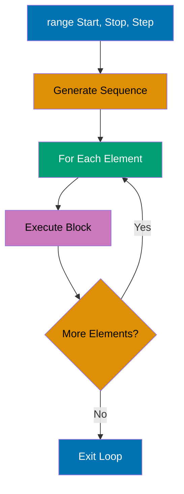

```python
# Basic for loop with range (0 to n-1)
for i in range(5):                # => range(5) generates 0, 1, 2, 3, 4
    print(f"i: {i}")              # => Output: i: 0, i: 1, ..., i: 4

# Range with start and stop
for i in range(2, 6):             # => range(2, 6) generates 2, 3, 4, 5
    print(f"i: {i}")              # => Output: i: 2, i: 3, i: 4, i: 5

# Range with step
for i in range(0, 10, 2):         # => range(0, 10, 2) generates 0, 2, 4, 6, 8
    print(f"i: {i}")              # => Output: i: 0, i: 2, i: 4, i: 6, i: 8

# Reverse range
for i in range(5, 0, -1):         # => range(5, 0, -1) generates 5, 4, 3, 2, 1
    print(f"i: {i}")              # => Output: i: 5, i: 4, i: 3, i: 2, i: 1

# Iterating over strings
name = "Python"                   # => name is "Python"
for char in name:                 # => Iterates: 'P', 'y', 't', 'h', 'o', 'n'
    print(char)                   # => Output: P, y, t, h, o, n (one per line)

# Iterating over lists
fruits = ["apple", "banana", "cherry"]
                                  # => fruits is ["apple", "banana", "cherry"]
for fruit in fruits:              # => Iterates through each element
    print(fruit)                  # => Output: apple, banana, cherry (one per line)

# Enumerate for index and value
for index, fruit in enumerate(fruits):
                                  # => enumerate yields (0, "apple"), (1, "banana"), (2, "cherry")
    print(f"{index}: {fruit}")    # => Output: 0: apple, 1: banana, 2: cherry

# For-else (else executes if loop completes without break)
for i in range(3):
    print(i)                      # => Output: 0, 1, 2
else:
    print("Loop completed")       # => Output: Loop completed

# Nested loops
for i in range(3):                # => Outer loop: 0, 1, 2
    for j in range(2):            # => Inner loop: 0, 1 (for each i)
        print(f"({i}, {j})")      # => Output: (0,0), (0,1), (1,0), (1,1), (2,0), (2,1)
```

**Key Takeaway**: Use `for` loops for iterating over sequences - `range()` generates numeric sequences efficiently (it's a generator, not a list), and `enumerate()` provides both index and value when needed.

**Why It Matters**: For loops in Python iterate over sequences directly rather than indices, reducing off-by-one errors and improving readability compared to C-style loops. The range() function generates values lazily without creating lists in memory, making it efficient for large iteration counts. Enumerate() eliminates manual index tracking, making code more maintainable and less error-prone than managing separate counter variables.

---

### Example 9: Lists - Creation and Access

Lists are mutable, ordered sequences that can contain mixed types, support indexing (including negative indices), and slicing.

**Positive Indexing:**

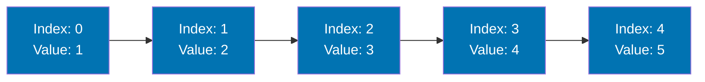

**Negative Indexing:**

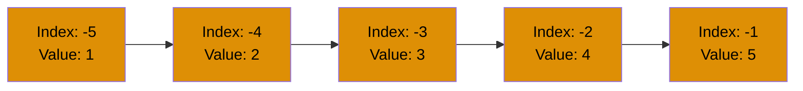

Python lists support both positive indexing (starting from 0) and negative indexing (counting from the end starting at -1). Both index systems refer to the same list elements.

```python
# List creation
numbers = [1, 2, 3, 4, 5]         # => numbers is [1, 2, 3, 4, 5] (type: list)
mixed = [1, "two", 3.0, True]     # => mixed is [1, "two", 3.0, True] (mixed types OK)
empty = []                        # => empty is [] (empty list)

# Indexing (0-based)
first = numbers[0]                # => first is 1 (index 0)
second = numbers[1]               # => second is 2 (index 1)
last = numbers[-1]                # => last is 5 (negative index from end)
second_last = numbers[-2]         # => second_last is 4

print(first, last)                # => Output: 1 5

# Slicing [start:stop:step]
subset = numbers[1:4]             # => subset is [2, 3, 4] (indices 1, 2, 3)
print(subset)                     # => Output: [2, 3, 4]

first_three = numbers[:3]         # => first_three is [1, 2, 3] (start to index 3)
print(first_three)                # => Output: [1, 2, 3]

last_two = numbers[-2:]           # => last_two is [4, 5] (last 2 elements)
print(last_two)                   # => Output: [4, 5]

every_second = numbers[::2]       # => every_second is [1, 3, 5] (step of 2)
print(every_second)               # => Output: [1, 3, 5]

reversed_list = numbers[::-1]     # => reversed_list is [5, 4, 3, 2, 1] (reversed)
print(reversed_list)              # => Output: [5, 4, 3, 2, 1]

# List length
length = len(numbers)             # => length is 5
print(f"Length: {length}")        # => Output: Length: 5

# Membership testing
has_three = 3 in numbers          # => has_three is True (3 exists in list)
has_ten = 10 in numbers           # => has_ten is False (10 not in list)
print(has_three, has_ten)         # => Output: True False
```

**Key Takeaway**: Lists support negative indexing (counting from end) and powerful slicing with `[start:stop:step]` syntax - slices create new lists without modifying originals, making them safe for data inspection.

**Why It Matters**: Lists are Python's primary ordered collection with O(1) append and index access but O(n) insertion/deletion in the middle, making them ideal for sequential processing. Negative indexing eliminates fence-post errors when accessing end elements and simplifies reverse traversal patterns. Understanding list mutability is critical in production code to avoid unexpected aliasing bugs where multiple variables reference the same list.

---

### Example 10: Lists - Modification Methods

Lists are mutable with methods for adding, removing, and modifying elements. All modification methods change the list in-place (return `None`).

```python
# List modification methods
fruits = ["apple", "banana"]      # => fruits is ["apple", "banana"]

# append() - add single element to end
fruits.append("cherry")           # => fruits is ["apple", "banana", "cherry"]
print(fruits)                     # => Output: ['apple', 'banana', 'cherry']

# extend() - add multiple elements
fruits.extend(["date", "elderberry"])
                                  # => fruits is ["apple", ..., "elderberry"]
print(fruits)                     # => Output: ['apple', 'banana', 'cherry', 'date', 'elderberry']

# insert() - add element at specific index
fruits.insert(1, "apricot")       # => Insert at index 1
                                  # => fruits is ["apple", "apricot", "banana", ...]
print(fruits)                     # => Output: ['apple', 'apricot', 'banana', ...]

# remove() - remove first occurrence of value
fruits.remove("banana")           # => Removes "banana"
                                  # => fruits is ["apple", "apricot", "cherry", ...]
print(fruits)                     # => Output: ['apple', 'apricot', 'cherry', 'date', 'elderberry']

# pop() - remove and return element at index (default: last)
last = fruits.pop()               # => last is "elderberry", removed from list
print(last)                       # => Output: elderberry
print(fruits)                     # => Output: ['apple', 'apricot', 'cherry', 'date']

popped = fruits.pop(1)            # => popped is "apricot", removed from index 1
print(popped)                     # => Output: apricot
print(fruits)                     # => Output: ['apple', 'cherry', 'date']

# clear() - remove all elements
backup = fruits.copy()            # => backup is ["apple", "cherry", "date"] (shallow copy)
fruits.clear()                    # => fruits is [] (empty)
print(fruits)                     # => Output: []
print(backup)                     # => Output: ['apple', 'cherry', 'date'] (unchanged)

# Index assignment
numbers = [1, 2, 3, 4, 5]         # => numbers is [1, 2, 3, 4, 5]
numbers[0] = 10                   # => numbers is [10, 2, 3, 4, 5]
numbers[-1] = 50                  # => numbers is [10, 2, 3, 4, 50]
print(numbers)                    # => Output: [10, 2, 3, 4, 50]

# Slice assignment
numbers[1:3] = [20, 30, 35]       # => Replace indices 1-2 with 3 elements
                                  # => numbers is [10, 20, 30, 35, 4, 50]
print(numbers)                    # => Output: [10, 20, 30, 35, 4, 50]

# Sorting
unsorted = [3, 1, 4, 1, 5, 9]     # => unsorted is [3, 1, 4, 1, 5, 9]
unsorted.sort()                   # => unsorted is [1, 1, 3, 4, 5, 9] (in-place)
print(unsorted)                   # => Output: [1, 1, 3, 4, 5, 9]

# sorted() - returns new sorted list
original = [3, 1, 4]              # => original is [3, 1, 4]
sorted_copy = sorted(original)    # => sorted_copy is [1, 3, 4]
print(original)                   # => Output: [3, 1, 4] (unchanged)
print(sorted_copy)                # => Output: [1, 3, 4]
```

**Key Takeaway**: List methods like `append()`, `remove()`, `sort()` modify in-place and return `None` - use `sorted()` and slicing when you need new lists without modifying originals, and always use `copy()` or `list()` to create independent copies.

**Why It Matters**: List slicing creates shallow copies of subsequences with Pythonic syntax that eliminates explicit loop-based copying, reducing code complexity and potential errors. The step parameter enables efficient reversal and sampling patterns without allocating intermediate collections. Mastering slice notation is essential for idiomatic Python as it appears extensively in data processing, pagination, and windowing operations in production systems.

---

### Example 11: Tuples - Immutable Sequences

Tuples are immutable ordered sequences, often used for fixed collections of related values. Once created, elements cannot be changed, added, or removed.

```python
# Tuple creation
point = (3, 4)                    # => point is (3, 4) (type: tuple)
colors = ("red", "green", "blue") # => colors is ("red", "green", "blue")
single = (42,)                    # => single is (42,) (comma required for single element!)
not_tuple = (42)                  # => not_tuple is 42 (type: int, NOT tuple!)

print(type(point))                # => Output: <class 'tuple'>
print(type(single))               # => Output: <class 'tuple'>
print(type(not_tuple))            # => Output: <class 'int'>

# Indexing and slicing (same as lists)
first = point[0]                  # => first is 3
second = point[1]                 # => second is 4
subset = colors[1:]               # => subset is ("green", "blue")
print(first, second)              # => Output: 3 4
print(subset)                     # => Output: ('green', 'blue')

# Unpacking
x, y = point                      # => x is 3, y is 4
print(f"x={x}, y={y}")            # => Output: x=3, y=4

# Multiple unpacking
r, g, b = colors                  # => r is "red", g is "green", b is "blue"
print(r, g, b)                    # => Output: red green blue

# Unpacking with * (rest)
numbers = (1, 2, 3, 4, 5)         # => numbers is (1, 2, 3, 4, 5)
first, *rest, last = numbers      # => first is 1, rest is [2, 3, 4], last is 5
print(first)                      # => Output: 1
print(rest)                       # => Output: [2, 3, 4] (list!)
print(last)                       # => Output: 5

# Immutability
try:
    point[0] = 10                 # => Attempt to modify
except TypeError as e:
    print(f"Error: {e}")          # => Output: Error: 'tuple' object does not support item assignment

# Tuple methods (limited due to immutability)
nums = (1, 2, 3, 2, 1)            # => nums is (1, 2, 3, 2, 1)
count_of_twos = nums.count(2)     # => count_of_twos is 2 (two occurrences of 2)
index_of_three = nums.index(3)    # => index_of_three is 2 (3 is at index 2)
print(count_of_twos, index_of_three)# => Output: 2 2

# Tuple as dictionary key (lists can't do this!)
locations = {}                    # => locations is {} (empty dict)
locations[(0, 0)] = "origin"      # => Tuple as key works!
locations[(1, 1)] = "diagonal"
print(locations[(0, 0)])          # => Output: origin

# Named tuples (more readable alternative - requires import)
from collections import namedtuple

Point = namedtuple("Point", ["x", "y"])
                                  # => Define Point type with x, y fields
p = Point(3, 4)                   # => p is Point(x=3, y=4)
print(p.x, p.y)                   # => Output: 3 4 (access by name)
print(p[0], p[1])                 # => Output: 3 4 (still indexable)
```

**Key Takeaway**: Use tuples for fixed collections where immutability is desired (function return values, dictionary keys) - they're more memory-efficient than lists and signal intent that data shouldn't change. Named tuples provide readability benefits for complex tuple structures.

**Why It Matters**: List methods provide in-place modification (append, extend, sort) versus returning new lists (copy), affecting both performance and correctness in multi-threaded code. The distinction between append (adds single element) and extend (adds multiple elements) prevents common bugs when adding collections to lists. Understanding mutability and return values of list methods is critical for avoiding subtle bugs in production code.

---

### Example 12: Dictionaries - Key-Value Pairs

Dictionaries store key-value pairs with fast lookup by key. Keys must be immutable (strings, numbers, tuples), while values can be any type.

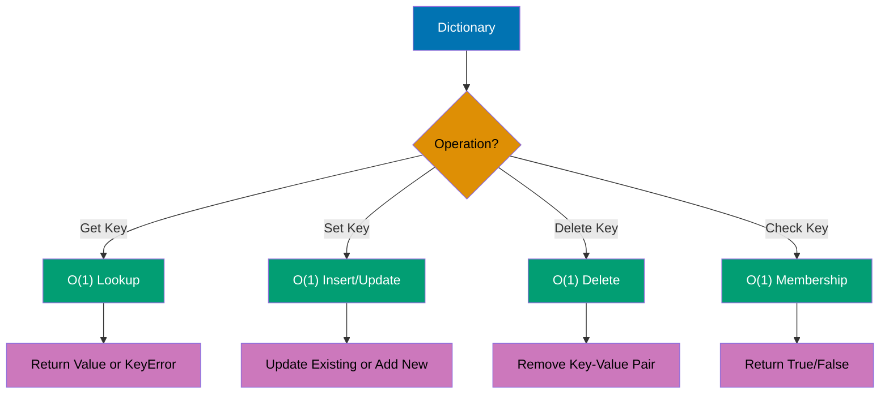

```python
# Dictionary creation
person = {
    "name": "Alice",
    "age": 30,
    "city": "New York"
}                                 # => person is {"name": "Alice", ...}

# Access by key
name = person["name"]             # => name is "Alice"
age = person["age"]               # => age is 30
print(name, age)                  # => Output: Alice 30

# Access with get() (returns None or default if key missing)
city = person.get("city")         # => city is "New York"
country = person.get("country")   # => country is None (key doesn't exist)
country_default = person.get("country", "USA")
                                  # => country_default is "USA" (default provided)
print(city, country, country_default)
                                  # => Output: New York None USA

# Add or update key-value pairs
person["email"] = "alice@example.com"
                                  # => person has new key "email"
person["age"] = 31                # => age updated to 31
print(person)                     # => Output: {'name': 'Alice', 'age': 31, ...}

# Delete key-value pairs
del person["city"]                # => "city" key removed
print(person)                     # => Output: {'name': 'Alice', 'age': 31, 'email': ...}

removed = person.pop("email")     # => removed is "alice@example.com", key deleted
print(removed)                    # => Output: alice@example.com
print(person)                     # => Output: {'name': 'Alice', 'age': 31}

# Membership testing (checks keys, not values)
has_name = "name" in person       # => has_name is True
has_city = "city" in person       # => has_city is False (deleted earlier)
print(has_name, has_city)         # => Output: True False

# Iterating over dictionaries
scores = {"Alice": 95, "Bob": 87, "Charlie": 92}

# Iterate over keys (default)
for name in scores:
    print(name)                   # => Output: Alice, Bob, Charlie

# Iterate over keys explicitly
for name in scores.keys():
    print(name)                   # => Output: Alice, Bob, Charlie

# Iterate over values
for score in scores.values():
    print(score)                  # => Output: 95, 87, 92

# Iterate over key-value pairs
for name, score in scores.items():
    print(f"{name}: {score}")     # => Output: Alice: 95, Bob: 87, Charlie: 92

# Dictionary methods
grades = {"math": 90, "english": 85}
                                  # => grades is {"math": 90, "english": 85}

# update() - merge another dictionary
grades.update({"science": 88, "math": 92})
                                  # => grades is {"math": 92, "english": 85, "science": 88}
print(grades)                     # => Output: {'math': 92, 'english': 85, 'science': 88}

# setdefault() - get value or set default if missing
history = grades.setdefault("history", 80)
                                  # => history is 80 (set because key missing)
math = grades.setdefault("math", 0)
                                  # => math is 92 (key exists, no change)
print(history, math)              # => Output: 80 92
print(grades)                     # => Output: {..., 'history': 80}
```

**Key Takeaway**: Dictionaries provide O(1) average lookup, insertion, and deletion by key - use `get()` instead of `[]` when keys might be missing to avoid `KeyError`, and iterate with `items()` when you need both keys and values.

**Why It Matters**: List comprehensions compile to optimized bytecode that runs faster than equivalent for loops with append(), making them the preferred choice for transforming sequences. The readability of comprehensions improves code maintainability by expressing intent (filter-map operations) more clearly than imperative loops. However, complex nested comprehensions should be avoided in favor of explicit loops for maintainability.

---

### Example 13: Sets - Unique Collections

Sets are unordered collections of unique elements supporting mathematical set operations (union, intersection, difference).

```python
# Set creation
numbers = {1, 2, 3, 4, 5}         # => numbers is {1, 2, 3, 4, 5} (type: set)
empty_set = set()                 # => empty_set is set() (use set(), NOT {})
not_empty_set = {}                # => This is an empty DICT, not set!

print(type(numbers))              # => Output: <class 'set'>
print(type(empty_set))            # => Output: <class 'set'>
print(type(not_empty_set))        # => Output: <class 'dict'>

# Duplicate elimination
duplicates = {1, 2, 2, 3, 3, 3}   # => duplicates is {1, 2, 3} (duplicates removed)
print(duplicates)                 # => Output: {1, 2, 3}

# Set from list (removes duplicates)
list_with_dupes = [1, 2, 2, 3, 3, 3]
unique = set(list_with_dupes)     # => unique is {1, 2, 3}
print(unique)                     # => Output: {1, 2, 3}

# Add and remove elements
fruits = {"apple", "banana"}      # => fruits is {"apple", "banana"}
fruits.add("cherry")              # => fruits is {"apple", "banana", "cherry"}
print(fruits)                     # => Output: {'apple', 'banana', 'cherry'}

fruits.remove("banana")           # => fruits is {"apple", "cherry"}
print(fruits)                     # => Output: {'apple', 'cherry'}

# discard() vs remove() - discard doesn't raise error if missing
fruits.discard("banana")          # => No error (banana already removed)
try:
    fruits.remove("banana")       # => Raises KeyError (banana not in set)
except KeyError:
    print("KeyError: banana not found")
                                  # => Output: KeyError: banana not found

# Membership testing
has_apple = "apple" in fruits     # => has_apple is True
has_banana = "banana" in fruits   # => has_banana is False
print(has_apple, has_banana)      # => Output: True False

# Set operations
a = {1, 2, 3, 4}                  # => a is {1, 2, 3, 4}
b = {3, 4, 5, 6}                  # => b is {3, 4, 5, 6}

# Union (all elements from both sets)
union = a | b                     # => union is {1, 2, 3, 4, 5, 6}
union_method = a.union(b)         # => Same result
print(union)                      # => Output: {1, 2, 3, 4, 5, 6}

# Intersection (common elements)
intersection = a & b              # => intersection is {3, 4}
intersection_method = a.intersection(b)# => Same result
print(intersection)               # => Output: {3, 4}

# Difference (elements in a but not in b)
difference = a - b                # => difference is {1, 2}
difference_method = a.difference(b)# => Same result
print(difference)                 # => Output: {1, 2}

# Symmetric difference (elements in either set but not both)
sym_diff = a ^ b                  # => sym_diff is {1, 2, 5, 6}
sym_diff_method = a.symmetric_difference(b)# => Same result
print(sym_diff)                   # => Output: {1, 2, 5, 6}

# Subset and superset
small = {1, 2}                    # => small is {1, 2}
large = {1, 2, 3, 4}              # => large is {1, 2, 3, 4}
is_subset = small.issubset(large) # => is_subset is True (small ⊆ large)
is_superset = large.issuperset(small)# => is_superset is True (large ⊇ small)
print(is_subset, is_superset)     # => Output: True True
```

**Key Takeaway**: Sets automatically eliminate duplicates and provide O(1) membership testing - use them for uniqueness constraints and mathematical set operations, but remember they're unordered (no indexing) and elements must be immutable.

**Why It Matters**: Tuples provide immutable sequences with lower memory overhead than lists, making them ideal for fixed collections and dictionary keys. Tuple unpacking enables elegant multiple return values and variable swaps without temporary variables, reducing code verbosity. Immutability guarantees make tuples thread-safe and hashable, essential for concurrent programming and using collections as dictionary keys.

---

### Example 14: Functions - Definition and Calls

Functions encapsulate reusable code blocks with parameters, return values, and default arguments. Python functions are first-class objects.

```python
# Basic function definition
def greet(name):
    """Return a greeting message."""# => Docstring (optional but recommended)
    return f"Hello, {name}!"

# Function call
message = greet("Alice")          # => message is "Hello, Alice!"
print(message)                    # => Output: Hello, Alice!

# Function with multiple parameters
def add(a, b):
    """Add two numbers and return result."""
    return a + b

result = add(5, 3)                # => result is 8
print(result)                     # => Output: 8

# Default arguments
def power(base, exponent=2):
    """Raise base to exponent (default: 2)."""
    return base ** exponent

square = power(5)                 # => square is 25 (5^2, default exponent)
cube = power(5, 3)                # => cube is 125 (5^3, explicit exponent)
print(square, cube)               # => Output: 25 125

# Keyword arguments
def describe_pet(animal, name):
    """Print pet description."""
    return f"I have a {animal} named {name}"

# Positional arguments
desc1 = describe_pet("dog", "Buddy")# => desc1 is "I have a dog named Buddy"

# Keyword arguments (order doesn't matter)
desc2 = describe_pet(name="Whiskers", animal="cat")
                                  # => desc2 is "I have a cat named Whiskers"
print(desc1)                      # => Output: I have a dog named Buddy
print(desc2)                      # => Output: I have a cat named Whiskers

# Multiple return values (returns tuple)
def min_max(numbers):
    """Return minimum and maximum of a list."""
    return min(numbers), max(numbers)

minimum, maximum = min_max([1, 5, 3, 9, 2])
                                  # => minimum is 1, maximum is 9
print(f"Min: {minimum}, Max: {maximum}")
                                  # => Output: Min: 1, Max: 9

# No return value (implicitly returns None)
def print_greeting(name):
    """Print greeting (no return)."""
    print(f"Hello, {name}!")

result = print_greeting("Bob")    # => Prints "Hello, Bob!", result is None
print(result)                     # => Output: None

# *args for variable positional arguments
def sum_all(*args):
    """Sum any number of arguments."""
    total = 0                     # => total is 0
    for num in args:              # => args is tuple of all arguments
        total += num
    return total

print(sum_all(1, 2, 3))           # => Output: 6
print(sum_all(1, 2, 3, 4, 5))     # => Output: 15

# **kwargs for variable keyword arguments
def print_info(**kwargs):
    """Print all keyword arguments."""
    for key, value in kwargs.items():
        print(f"{key}: {value}")

print_info(name="Alice", age=30, city="NYC")
                                  # => Output: name: Alice, age: 30, city: NYC

# Combining all parameter types
def complex_func(pos1, pos2, *args, kwarg1="default", **kwargs):
    """Demonstrate all parameter types."""
    print(f"Positional: {pos1}, {pos2}")
    print(f"*args: {args}")
    print(f"kwarg1: {kwarg1}")
    print(f"**kwargs: {kwargs}")

complex_func(1, 2, 3, 4, kwarg1="custom", extra="value")
# => Output: Positional: 1, 2
#    *args: (3, 4)
#    kwarg1: custom
#    **kwargs: {'extra': 'value'}
```

**Key Takeaway**: Functions support default arguments, keyword arguments, and variable arguments (`*args`/`**kwargs`) - use keyword arguments for clarity in calls with many parameters, and remember that default argument values are evaluated once at function definition (use `None` as default for mutable defaults).

**Why It Matters**: Dictionaries provide O(1) average-case lookup, insertion, and deletion, making them the foundation for efficient data storage and caching in production systems. The get() method with default values eliminates KeyError handling boilerplate, improving code readability. Understanding dictionary key requirements (hashable, immutable) prevents runtime errors and guides proper data structure design.

---

### Example 15: Function Scope and Global Variables

Python uses LEGB scope resolution (Local, Enclosing, Global, Built-in) with explicit `global`/`nonlocal` keywords for modifying outer scopes.

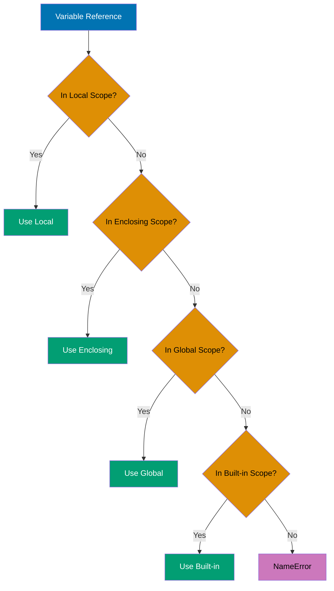

```python
# Global variable
counter = 0                       # => counter is 0 (global scope)

def increment():
    global counter                # => Declare intent to modify global counter
    counter += 1                  # => counter is now 1 (modifies global)
    return counter

result = increment()              # => result is 1, global counter is 1
print(f"Result: {result}, Global: {counter}")
                                  # => Output: Result: 1, Global: 1

# Without global keyword (creates local variable)
x = 10                            # => x is 10 (global)

def set_x():
    x = 20                        # => Creates local x (shadows global)
    print(f"Local x: {x}")        # => Output: Local x: 20

set_x()
print(f"Global x: {x}")           # => Output: Global x: 10 (unchanged!)

# Enclosing scope with nonlocal
def outer():
    y = 5                         # => y is 5 (enclosing scope)

    def inner():
        nonlocal y                # => Declare intent to modify enclosing y
        y += 1                    # => y is now 6 (modifies enclosing)
        print(f"Inner y: {y}")    # => Output: Inner y: 6

    inner()
    print(f"Outer y: {y}")        # => Output: Outer y: 6 (modified by inner!)

outer()

# Without nonlocal (creates local variable)
def outer2():
    z = 10                        # => z is 10 (enclosing scope)

    def inner2():
        z = 20                    # => Creates local z (shadows enclosing)
        print(f"Inner z: {z}")    # => Output: Inner z: 20

    inner2()
    print(f"Outer z: {z}")        # => Output: Outer z: 10 (unchanged!)

outer2()

# LEGB demonstration
builtin_len = len                 # => Save built-in len function
x = "global"                      # => x is "global" (Global)

def outer():
    x = "enclosing"               # => x is "enclosing" (Enclosing)

    def inner():
        x = "local"               # => x is "local" (Local)
        print(f"Local: {x}")      # => Output: Local: local
        print(f"Built-in len: {builtin_len([1, 2, 3])}")
                                  # => Output: Built-in len: 3

    inner()
    print(f"Enclosing: {x}")      # => Output: Enclosing: enclosing

outer()
print(f"Global: {x}")             # => Output: Global: global

# Reading global without global keyword (allowed)
config = {"debug": True}          # => config is dict (global)

def is_debug():
    # Reading global is OK (no global keyword needed)
    return config["debug"]        # => Returns True (reads global config)

print(is_debug())                 # => Output: True
```

**Key Takeaway**: Use `global` to modify global variables from functions and `nonlocal` for enclosing function scopes - but prefer passing values as parameters and returning results over modifying outer scopes, as it makes functions more testable and reduces coupling.

**Why It Matters**: Dictionary iteration methods (keys(), values(), items()) enable efficient traversal patterns without duplicate lookups, improving both code clarity and performance. Dictionary comprehensions provide concise dictionary construction from sequences, reducing boilerplate for data transformation tasks. Mastering these iteration patterns is essential for data processing pipelines and API response transformation in production systems.

---

### Example 16: Lambda Functions

Lambda functions are anonymous, single-expression functions often used for short operations passed to higher-order functions.

```python
# Basic lambda syntax: lambda arguments: expression
square = lambda x: x ** 2         # => square is a function object
result = square(5)                # => result is 25
print(result)                     # => Output: 25

# Lambda with multiple arguments
add = lambda a, b: a + b          # => add is a function
sum_result = add(3, 7)            # => sum_result is 10
print(sum_result)                 # => Output: 10

# Lambda in sorted() with key parameter
students = [
    ("Alice", 25, 3.8),
    ("Bob", 22, 3.5),
    ("Charlie", 23, 3.9)
]                                 # => List of (name, age, gpa) tuples

# Sort by age (index 1)
by_age = sorted(students, key=lambda student: student[1])
                                  # => by_age sorted by age: Bob(22), Charlie(23), Alice(25)
print(by_age)                     # => Output: [('Bob', 22, 3.5), ('Charlie', 23, 3.9), ('Alice', 25, 3.8)]

# Sort by GPA (index 2)
by_gpa = sorted(students, key=lambda student: student[2])
                                  # => by_gpa sorted by GPA: Bob(3.5), Alice(3.8), Charlie(3.9)
print(by_gpa)                     # => Output: [('Bob', 22, 3.5), ('Alice', 25, 3.8), ('Charlie', 23, 3.9)]

# Lambda with map() - apply function to each element
numbers = [1, 2, 3, 4, 5]         # => numbers is [1, 2, 3, 4, 5]
squared = list(map(lambda x: x ** 2, numbers))
                                  # => squared is [1, 4, 9, 16, 25]
print(squared)                    # => Output: [1, 4, 9, 16, 25]

# Lambda with filter() - select elements matching condition
evens = list(filter(lambda x: x % 2 == 0, numbers))
                                  # => evens is [2, 4]
print(evens)                      # => Output: [2, 4]

# Lambda with reduce() - accumulate values
from functools import reduce

product = reduce(lambda acc, x: acc * x, numbers)
                                  # => product is 120 (1*2*3*4*5)
print(product)                    # => Output: 120

# Comparison: lambda vs regular function
# Lambda version (concise)
is_positive_lambda = lambda x: x > 0

# Equivalent regular function (more readable for complex logic)
def is_positive_func(x):
    """Check if number is positive."""
    return x > 0

print(is_positive_lambda(5))      # => Output: True
print(is_positive_func(5))        # => Output: True

# Lambda limitations - single expression only
# This works:
simple = lambda x: x * 2

# This does NOT work (multiple statements):
# complex = lambda x:
#     y = x * 2
#     return y + 1

# Use regular function for multiple statements
def complex_func(x):
    y = x * 2                     # => Multiple statements require regular function
    return y + 1

result = complex_func(5)          # => result is 11
print(result)                     # => Output: 11

# Lambda in list comprehension (avoid - use comprehension directly)
# Less Pythonic:
squares_lambda = list(map(lambda x: x ** 2, numbers))

# More Pythonic (list comprehension):
squares_comp = [x ** 2 for x in numbers]
                                  # => Both produce [1, 4, 9, 16, 25]
print(squares_comp)               # => Output: [1, 4, 9, 16, 25]
```

**Key Takeaway**: Use lambdas for simple, one-line operations passed to higher-order functions like `sorted()`, `map()`, `filter()` - but prefer list comprehensions over `map()`/`filter()` for Pythonic code, and use regular functions with docstrings for anything more complex than a single expression.

**Why It Matters**: Sets provide O(1) membership testing and automatic deduplication, making them essential for uniqueness constraints and efficient lookups in production code. Set operations (union, intersection, difference) express intent more clearly than manual iteration and improve performance for large collections. Understanding when to use sets versus lists prevents performance bottlenecks in applications processing large datasets.

---

### Example 17: List Comprehensions

List comprehensions provide concise syntax for creating lists by transforming and filtering existing sequences in a single readable expression.

```python
# Basic list comprehension: [expression for item in iterable]
numbers = [1, 2, 3, 4, 5]         # => numbers is [1, 2, 3, 4, 5]
squares = [x ** 2 for x in numbers]
                                  # => squares is [1, 4, 9, 16, 25]
print(squares)                    # => Output: [1, 4, 9, 16, 25]

# Comprehension with condition: [expression for item in iterable if condition]
evens = [x for x in numbers if x % 2 == 0]
                                  # => evens is [2, 4]
print(evens)                      # => Output: [2, 4]

# Transform and filter combined
even_squares = [x ** 2 for x in numbers if x % 2 == 0]
                                  # => even_squares is [4, 16] (2^2, 4^2)
print(even_squares)               # => Output: [4, 16]

# Comprehension from string
word = "Python"                   # => word is "Python"
upper_chars = [char.upper() for char in word]
                                  # => upper_chars is ['P', 'Y', 'T', 'H', 'O', 'N']
print(upper_chars)                # => Output: ['P', 'Y', 'T', 'H', 'O', 'N']

# Comprehension with range
first_ten_squares = [x ** 2 for x in range(1, 11)]
                                  # => first_ten_squares is [1, 4, 9, ..., 100]
print(first_ten_squares)          # => Output: [1, 4, 9, 16, 25, 36, 49, 64, 81, 100]

# Nested comprehension (flattening)
matrix = [[1, 2], [3, 4], [5, 6]] # => matrix is [[1, 2], [3, 4], [5, 6]]
flattened = [num for row in matrix for num in row]
                                  # => flattened is [1, 2, 3, 4, 5, 6]
print(flattened)                  # => Output: [1, 2, 3, 4, 5, 6]

# Equivalent nested loop for comparison
flattened_loop = []
for row in matrix:                # => Outer loop: [1,2], [3,4], [5,6]
    for num in row:               # => Inner loop: 1, 2, then 3, 4, then 5, 6
        flattened_loop.append(num)
                                  # => flattened_loop is [1, 2, 3, 4, 5, 6]
print(flattened_loop)             # => Output: [1, 2, 3, 4, 5, 6]

# Comprehension with multiple conditions
numbers = range(1, 21)            # => numbers is 1 to 20
special = [x for x in numbers if x % 2 == 0 if x % 3 == 0]
                                  # => special is [6, 12, 18] (divisible by both 2 and 3)
print(special)                    # => Output: [6, 12, 18]

# Conditional expression in comprehension
nums = [-2, -1, 0, 1, 2]          # => nums is [-2, -1, 0, 1, 2]
absolute = [x if x >= 0 else -x for x in nums]
                                  # => absolute is [2, 1, 0, 1, 2]
print(absolute)                   # => Output: [2, 1, 0, 1, 2]

# Comprehension with function calls
words = ["hello", "world", "python"]
                                  # => words is ["hello", "world", "python"]
lengths = [len(word) for word in words]
                                  # => lengths is [5, 5, 6]
print(lengths)                    # => Output: [5, 5, 6]

# Nested list comprehension (2D matrix)
matrix_2d = [[i * j for j in range(1, 4)] for i in range(1, 4)]
                                  # => Creates 3x3 multiplication table
print(matrix_2d)                  # => Output: [[1, 2, 3], [2, 4, 6], [3, 6, 9]]

# When NOT to use comprehensions (too complex - use loops)
# Bad (hard to read):
# complex = [x if x > 0 else -x for x in range(-10, 10) if abs(x) % 2 == 0 if x != 0]

# Better (use regular loop for complex logic):
complex = []
for x in range(-10, 10):
    if x != 0 and abs(x) % 2 == 0:
        complex.append(x if x > 0 else -x)
print(complex)                    # => Output: [2, 4, 6, 8, 10, 2, 4, 6, 8]
```

**Key Takeaway**: List comprehensions are more Pythonic and often faster than equivalent loops for simple transformations and filtering - but use regular loops when logic becomes complex enough to hurt readability (if you need comments to explain a comprehension, it's too complex).

**Why It Matters**: Functions enable code reuse and abstraction, reducing duplication and improving maintainability in large codebases. Default arguments provide flexible APIs while maintaining backward compatibility as functions evolve. Keyword arguments improve code readability at call sites, making complex function calls self-documenting without requiring excessive comments.

---

### Example 18: Dictionary and Set Comprehensions

Python supports comprehensions for dictionaries and sets with similar syntax to list comprehensions, enabling concise creation of these data structures.

```python
# Dictionary comprehension: {key_expr: value_expr for item in iterable}
numbers = [1, 2, 3, 4, 5]         # => numbers is [1, 2, 3, 4, 5]
squares_dict = {x: x ** 2 for x in numbers}
                                  # => squares_dict is {1: 1, 2: 4, 3: 9, 4: 16, 5: 25}
print(squares_dict)               # => Output: {1: 1, 2: 4, 3: 9, 4: 16, 5: 25}

# Dictionary comprehension with condition
even_squares = {x: x ** 2 for x in numbers if x % 2 == 0}
                                  # => even_squares is {2: 4, 4: 16}
print(even_squares)               # => Output: {2: 4, 4: 16}

# Dictionary from two lists using zip
names = ["Alice", "Bob", "Charlie"]
                                  # => names is ["Alice", "Bob", "Charlie"]
ages = [25, 30, 35]               # => ages is [25, 30, 35]
people = {name: age for name, age in zip(names, ages)}
                                  # => people is {"Alice": 25, "Bob": 30, "Charlie": 35}
print(people)                     # => Output: {'Alice': 25, 'Bob': 30, 'Charlie': 35}

# Swapping keys and values
original = {"a": 1, "b": 2, "c": 3}
                                  # => original is {"a": 1, "b": 2, "c": 3}
swapped = {value: key for key, value in original.items()}
                                  # => swapped is {1: "a", 2: "b", 3: "c"}
print(swapped)                    # => Output: {1: 'a', 2: 'b', 3: 'c'}

# Dictionary comprehension with string manipulation
words = ["apple", "banana", "cherry"]
                                  # => words is ["apple", "banana", "cherry"]
word_lengths = {word: len(word) for word in words}
                                  # => word_lengths is {"apple": 5, "banana": 6, "cherry": 6}
print(word_lengths)               # => Output: {'apple': 5, 'banana': 6, 'cherry': 6}

# Set comprehension: {expression for item in iterable}
numbers = [1, 2, 2, 3, 3, 3, 4, 5]# => numbers is [1, 2, 2, 3, 3, 3, 4, 5]
unique_squares = {x ** 2 for x in numbers}
                                  # => unique_squares is {1, 4, 9, 16, 25} (no duplicates)
print(unique_squares)             # => Output: {1, 4, 9, 16, 25}

# Set comprehension with condition
even_set = {x for x in numbers if x % 2 == 0}
                                  # => even_set is {2, 4} (unique even numbers)
print(even_set)                   # => Output: {2, 4}

# Set comprehension from string (unique characters)
text = "hello"                    # => text is "hello"
unique_chars = {char for char in text}
                                  # => unique_chars is {'h', 'e', 'l', 'o'} (unique only)
print(unique_chars)               # => Output: {'h', 'e', 'l', 'o'}

# Case-insensitive unique characters
text = "Hello World"              # => text is "Hello World"
unique_lower = {char.lower() for char in text if char.isalpha()}
                                  # => unique_lower is {'h', 'e', 'l', 'o', 'w', 'r', 'd'}
print(unique_lower)               # => Output: {'h', 'e', 'l', 'o', 'w', 'r', 'd'}

# Dictionary comprehension with conditional values
numbers = range(1, 6)             # => numbers is 1 to 5
parity = {x: "even" if x % 2 == 0 else "odd" for x in numbers}
                                  # => parity is {1: "odd", 2: "even", 3: "odd", 4: "even", 5: "odd"}
print(parity)                     # => Output: {1: 'odd', 2: 'even', 3: 'odd', 4: 'even', 5: 'odd'}

# Nested dictionary comprehension
matrix = {
    i: {j: i * j for j in range(1, 4)}
    for i in range(1, 4)
}                                 # => Creates nested dict multiplication table
print(matrix)                     # => Output: {1: {1: 1, 2: 2, 3: 3}, 2: {1: 2, 2: 4, 3: 6}, 3: {1: 3, 2: 6, 3: 9}}

# Filtering existing dictionary
grades = {"Alice": 95, "Bob": 72, "Charlie": 88, "David": 65}
passing = {name: grade for name, grade in grades.items() if grade >= 75}
                                  # => passing is {"Alice": 95, "Charlie": 88}
print(passing)                    # => Output: {'Alice': 95, 'Charlie': 88}
```

**Key Takeaway**: Dictionary and set comprehensions follow the same pattern as list comprehensions with curly braces - use them for concise transformations of iterables into dicts/sets, and leverage `zip()` for creating dictionaries from parallel sequences.

**Why It Matters**: Arbitrary arguments (\*args, \*\*kwargs) enable flexible APIs and decorator patterns essential for framework development. Keyword-only arguments (PEP 3102) prevent positional argument errors in functions with many parameters, improving code robustness. Understanding argument patterns is critical for designing maintainable APIs and preventing breaking changes as software evolves.

---

### Example 19: Exception Handling - Try/Except

Python uses try/except blocks to handle errors gracefully, with optional else (runs if no exception) and finally (always runs) clauses.

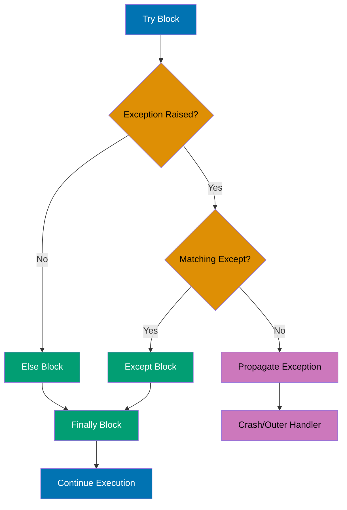

```python
# Basic try/except
def divide(a, b):
    try:
        result = a / b            # => May raise ZeroDivisionError
        return result
    except ZeroDivisionError:
        print("Error: Division by zero")
        return None               # => Return None on error

print(divide(10, 2))              # => Output: 5.0
print(divide(10, 0))              # => Output: Error: Division by zero, then None

# Multiple except clauses
def convert_to_int(value):
    try:
        return int(value)         # => May raise ValueError or TypeError
    except ValueError:
        print(f"ValueError: '{value}' is not a valid integer")
        return None
    except TypeError:
        print(f"TypeError: Cannot convert {type(value)} to int")
        return None

print(convert_to_int("42"))       # => Output: 42
print(convert_to_int("abc"))      # => Output: ValueError: 'abc' is not a valid integer, then None
print(convert_to_int([1, 2]))     # => Output: TypeError: Cannot convert <class 'list'> to int, then None

# Catching multiple exceptions in one clause
def safe_operation(x, y):
    try:
        result = int(x) / int(y)  # => May raise ValueError or ZeroDivisionError
        return result
    except (ValueError, ZeroDivisionError) as e:
        print(f"Error: {type(e).__name__}: {e}")
        return None

print(safe_operation("10", "2"))  # => Output: 5.0
print(safe_operation("abc", "2")) # => Output: Error: ValueError: invalid literal...
print(safe_operation("10", "0"))  # => Output: Error: ZeroDivisionError: division by zero

# Accessing exception object
def parse_number(text):
    try:
        return float(text)
    except ValueError as e:
        print(f"Caught exception: {e}")
        print(f"Exception type: {type(e)}")
        return 0.0

result = parse_number("invalid")
# => Output: Caught exception: could not convert string to float: 'invalid'
#    Exception type: <class 'ValueError'>
print(result)                     # => Output: 0.0

# Try/except/else/finally
def process_file(filename):
    try:
        # Simulate file opening (not actual file I/O)
        if filename == "":
            raise ValueError("Empty filename")
        data = f"Data from {filename}"# => Success path
    except ValueError as e:
        print(f"Error: {e}")
        data = None
    else:
        # Runs only if no exception occurred
        print("File processed successfully")
    finally:
        # Always runs (cleanup code)
        print("Cleanup complete")

    return data

print(process_file("data.txt"))
# => Output: File processed successfully
#    Cleanup complete
#    Data from data.txt

print(process_file(""))
# => Output: Error: Empty filename
#    Cleanup complete
#    None

# Bare except (catches all exceptions - use sparingly!)
def risky_operation():
    try:
        # Some risky code
        x = 1 / 0                 # => Raises ZeroDivisionError
    except:
        print("Something went wrong")
        # Problem: Can't tell what went wrong!

risky_operation()                 # => Output: Something went wrong

# Better: Catch specific exceptions
def better_operation():
    try:
        x = 1 / 0
    except ZeroDivisionError:
        print("Attempted division by zero")
    except Exception as e:
        # Catch other exceptions with access to details
        print(f"Unexpected error: {type(e).__name__}: {e}")

better_operation()                # => Output: Attempted division by zero

# Re-raising exceptions
def validate_age(age):
    try:
        age_int = int(age)
        if age_int < 0:
            raise ValueError("Age cannot be negative")
        return age_int
    except ValueError as e:
        print(f"Validation failed: {e}")
        raise                     # => Re-raise the same exception

try:
    validate_age("-5")
except ValueError:
    print("Caught re-raised exception")
# => Output: Validation failed: Age cannot be negative
#    Caught re-raised exception
```

**Key Takeaway**: Always catch specific exceptions rather than bare `except` to avoid masking unexpected errors - use `else` for code that should only run on success, and `finally` for cleanup that must always happen regardless of exceptions (like closing files or releasing locks).

**Why It Matters**: Local scope prevents naming conflicts and makes code easier to reason about by limiting variable visibility to function boundaries. The LEGB rule (Local, Enclosing, Global, Built-in) governs variable resolution and prevents subtle bugs from unexpected variable shadowing. Minimizing global variables improves testability and reduces coupling in production systems.

---

### Example 20: File I/O - Reading and Writing

Python provides simple file operations with automatic resource management using context managers (`with` statement).

```python
# Writing to a file
def write_example():
    # Create and write to file
    with open("example.txt", "w") as file:
        file.write("Hello, World!\n")
        file.write("This is line 2.\n")
        file.write("This is line 3.")
    # => File automatically closed when with block exits
    print("File written successfully")

write_example()                   # => Creates example.txt with 3 lines

# Reading entire file
def read_entire_file():
    try:
        with open("example.txt", "r") as file:
            content = file.read() # => content is all text as single string
            print(content)
    except FileNotFoundError:
        print("File not found")

read_entire_file()
# => Output: Hello, World!
#    This is line 2.
#    This is line 3.

# Reading line by line
def read_lines():
    try:
        with open("example.txt", "r") as file:
            for line in file:     # => Iterate over lines (memory-efficient)
                print(line.strip())# => strip() removes trailing newline
    except FileNotFoundError:
        print("File not found")

read_lines()
# => Output: Hello, World!
#    This is line 2.
#    This is line 3.

# Reading into list
def read_as_list():
    try:
        with open("example.txt", "r") as file:
            lines = file.readlines()
                                  # => lines is ['Hello, World!\n', 'This is line 2.\n', ...]
            print(lines)
    except FileNotFoundError:
        print("File not found")

read_as_list()
# => Output: ['Hello, World!\n', 'This is line 2.\n', 'This is line 3.']

# Appending to file
def append_example():
    with open("example.txt", "a") as file:
        file.write("\nAppended line.")
                                  # => Adds to end of file
    print("Line appended")

append_example()                  # => example.txt now has 4 lines

# Reading and writing (r+, w+, a+)
def read_write_example():
    with open("example.txt", "r+") as file:
        content = file.read()     # => Read existing content
        file.write("\nAdditional line")
                                  # => Write at end
    print("Read and write complete")

read_write_example()

# File modes summary:
# "r"  - Read (default, file must exist)
# "w"  - Write (creates file, truncates if exists)
# "a"  - Append (creates file if doesn't exist)
# "r+" - Read and write (file must exist)
# "w+" - Write and read (creates file, truncates if exists)
# "a+" - Append and read (creates file if doesn't exist)
# "b"  - Binary mode (combine with above: "rb", "wb", etc.)

# Binary file operations
def binary_example():
    # Write binary data
    with open("binary.dat", "wb") as file:
        data = bytes([65, 66, 67])# => data is b'ABC' (bytes object)
        file.write(data)

    # Read binary data
    with open("binary.dat", "rb") as file:
        content = file.read()     # => content is b'ABC'
        print(content)            # => Output: b'ABC'
        print(list(content))      # => Output: [65, 66, 67]

binary_example()

# File operations without context manager (manual close - not recommended)
def manual_close_example():
    file = open("example.txt", "r")
    try:
        content = file.read()
        print(content)
    finally:
        file.close()              # => Must manually close!

# Better: Use with statement (automatic cleanup)
def context_manager_example():
    with open("example.txt", "r") as file:
        content = file.read()
        print(content)
    # => File automatically closed, even if exception occurs

# Check if file exists before opening
import os

def safe_read(filename):
    if os.path.exists(filename):
        with open(filename, "r") as file:
            return file.read()
    else:
        print(f"{filename} does not exist")
        return None

result = safe_read("example.txt")
# => Returns content if file exists

result = safe_read("nonexistent.txt")
# => Output: nonexistent.txt does not exist
# => Returns None
```

**Key Takeaway**: Always use context managers (`with` statement) for file operations - they automatically handle closing files even if exceptions occur. Use `"r"`/`"w"`/`"a"` modes appropriately (write truncates, append preserves), and iterate over file objects directly for memory-efficient line-by-line reading.

**Why It Matters**: Lambda functions provide concise function definitions for simple transformations in functional-style operations like map, filter, and sorted. Their single-expression limitation encourages separation of complex logic into named functions, improving code maintainability. However, named functions are preferred in production code for testability and debuggability unless the logic is trivial.

---

### Example 21: Classes - Basics

Classes define custom types with data (attributes) and behavior (methods). Python uses `self` to reference the instance within methods.

```python
# Basic class definition
class Dog:
    """Represents a dog with name and age."""

    def __init__(self, name, age):
        """Initialize dog with name and age."""
        self.name = name          # => Instance attribute name
        self.age = age            # => Instance attribute age

    def bark(self):
        """Make the dog bark."""
        return f"{self.name} says Woof!"

# Creating instances
dog1 = Dog("Buddy", 3)            # => dog1 is Dog object with name="Buddy", age=3
dog2 = Dog("Max", 5)              # => dog2 is Dog object with name="Max", age=5

# Accessing attributes
print(dog1.name)                  # => Output: Buddy
print(dog2.age)                   # => Output: 5

# Calling methods
print(dog1.bark())                # => Output: Buddy says Woof!
print(dog2.bark())                # => Output: Max says Woof!

# Class attributes (shared by all instances)
class Circle:
    """Represents a circle."""
    pi = 3.14159                  # => Class attribute (shared)

    def __init__(self, radius):
        self.radius = radius      # => Instance attribute (unique per instance)

    def area(self):
        """Calculate circle area."""
        return Circle.pi * self.radius ** 2

circle1 = Circle(5)               # => circle1 has radius=5
circle2 = Circle(10)              # => circle2 has radius=10

print(circle1.area())             # => Output: 78.53975 (π × 5²)
print(circle2.area())             # => Output: 314.159 (π × 10²)

# Access class attribute through class or instance
print(Circle.pi)                  # => Output: 3.14159 (via class)
print(circle1.pi)                 # => Output: 3.14159 (via instance)

# Instance methods vs static methods vs class methods
class MathOperations:
    """Demonstrates different method types."""

    multiplier = 2                # => Class attribute

    def instance_method(self, x):
        """Instance method (has access to self)."""
        return x * self.multiplier

    @staticmethod
    def static_method(x, y):
        """Static method (no access to self or cls)."""
        return x + y

    @classmethod
    def class_method(cls, x):
        """Class method (has access to cls, not self)."""
        return x * cls.multiplier

math = MathOperations()

# Instance method (needs instance)
print(math.instance_method(5))    # => Output: 10 (5 × 2)

# Static method (can call on class or instance)
print(MathOperations.static_method(3, 4))
                                  # => Output: 7 (3 + 4)
print(math.static_method(3, 4))   # => Output: 7 (same via instance)

# Class method (can call on class or instance)
print(MathOperations.class_method(5))
                                  # => Output: 10 (5 × 2)
print(math.class_method(5))       # => Output: 10 (same via instance)

# String representation
class Point:
    """Represents a 2D point."""

    def __init__(self, x, y):
        self.x = x
        self.y = y

    def __str__(self):
        """Human-readable string representation."""
        return f"Point({self.x}, {self.y})"

    def __repr__(self):
        """Developer-friendly representation."""
        return f"Point(x={self.x}, y={self.y})"

p = Point(3, 4)                   # => p is Point object
print(p)                          # => Output: Point(3, 4) (uses __str__)
print(repr(p))                    # => Output: Point(x=3, y=4) (uses __repr__)

# Private attributes (convention: prefix with _)
class BankAccount:
    """Represents a bank account."""

    def __init__(self, balance):
        self._balance = balance   # => "Private" by convention (not enforced)

    def deposit(self, amount):
        """Deposit money."""
        if amount > 0:
            self._balance += amount
            return True
        return False

    def get_balance(self):
        """Get current balance."""
        return self._balance

account = BankAccount(100)        # => account has _balance=100
account.deposit(50)               # => _balance is now 150
print(account.get_balance())      # => Output: 150

# Can still access "private" attribute (not truly private!)
print(account._balance)           # => Output: 150 (discouraged but possible)
```

**Key Takeaway**: Use `__init__` for initialization, `self` to reference instance attributes/methods, and class attributes for shared data - follow conventions like single underscore prefix for "private" attributes (not enforced, just convention) and implement `__str__`/`__repr__` for readable object representations.

**Why It Matters**: Map applies functions to sequences without explicit loops, expressing transformations more declaratively and enabling potential parallel execution optimizations. Filter creates subsequences based on predicates with clearer intent than manual conditional appending. However, list comprehensions are often preferred in modern Python for their readability and equivalent performance.

---

### Example 22: Classes - Inheritance

Inheritance allows classes to extend other classes, inheriting attributes and methods while adding or overriding functionality.

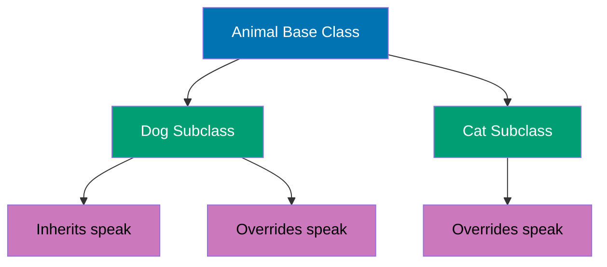

```python
# Base class
class Animal:
    """Base class for all animals."""

    def __init__(self, name, species):
        self.name = name
        self.species = species

    def speak(self):
        """Generic animal sound."""
        return f"{self.name} makes a sound"

    def info(self):
        """Return animal information."""
        return f"{self.name} is a {self.species}"

# Derived class (inherits from Animal)
class Dog(Animal):
    """Dog class inheriting from Animal."""

    def __init__(self, name, breed):
        # Call parent __init__
        super().__init__(name, "Dog")# => Initialize parent attributes
        self.breed = breed        # => Additional attribute

    # Override parent method
    def speak(self):
        """Dog-specific sound."""
        return f"{self.name} says Woof!"

    # Additional method
    def fetch(self):
        """Dog-specific behavior."""
        return f"{self.name} fetches the ball"

# Using derived class
dog = Dog("Buddy", "Golden Retriever")
                                  # => dog is Dog object with name, species, breed

print(dog.info())                 # => Output: Buddy is a Dog (inherited method)
print(dog.speak())                # => Output: Buddy says Woof! (overridden)
print(dog.fetch())                # => Output: Buddy fetches the ball (new method)

# Another derived class
class Cat(Animal):
    """Cat class inheriting from Animal."""

    def __init__(self, name, color):
        super().__init__(name, "Cat")
        self.color = color

    def speak(self):
        """Cat-specific sound."""
        return f"{self.name} says Meow!"

    def scratch(self):
        """Cat-specific behavior."""
        return f"{self.name} scratches the furniture"

cat = Cat("Whiskers", "Orange")   # => cat is Cat object

print(cat.info())                 # => Output: Whiskers is a Cat
print(cat.speak())                # => Output: Whiskers says Meow!
print(cat.scratch())              # => Output: Whiskers scratches the furniture

# Polymorphism - same interface, different behavior
def animal_concert(animals):
    """Make all animals speak."""
    for animal in animals:
        print(animal.speak())     # => Calls appropriate speak() for each type

animals = [
    Dog("Buddy", "Golden Retriever"),
    Cat("Whiskers", "Orange"),
    Animal("Generic", "Unknown")
]

animal_concert(animals)
# => Output: Buddy says Woof!
#    Whiskers says Meow!
#    Generic makes a sound

# Multiple inheritance
class Flyer:
    """Mixin for flying behavior."""

    def fly(self):
        return f"{self.name} is flying"

class Bird(Animal, Flyer):
    """Bird class with multiple inheritance."""

    def __init__(self, name, can_fly=True):
        super().__init__(name, "Bird")
        self.can_fly = can_fly

    def speak(self):
        return f"{self.name} says Tweet!"

bird = Bird("Tweety")             # => bird inherits from Animal and Flyer

print(bird.info())                # => Output: Tweety is a Bird (from Animal)
print(bird.speak())               # => Output: Tweety says Tweet! (overridden)
print(bird.fly())                 # => Output: Tweety is flying (from Flyer)

# isinstance() and issubclass()
print(isinstance(dog, Dog))       # => Output: True
print(isinstance(dog, Animal))    # => Output: True (Dog is subclass of Animal)
print(isinstance(dog, Cat))       # => Output: False

print(issubclass(Dog, Animal))    # => Output: True
print(issubclass(Dog, Cat))       # => Output: False

# Method Resolution Order (MRO)
print(Bird.__mro__)               # => Output: (Bird, Animal, Flyer, object)
                                  # => Shows inheritance chain

# Calling parent method explicitly
class Employee:
    """Base employee class."""

    def __init__(self, name, salary):
        self.name = name
        self.salary = salary

    def annual_salary(self):
        return self.salary * 12

class Manager(Employee):
    """Manager with bonus."""

    def __init__(self, name, salary, bonus):
        super().__init__(name, salary)
        self.bonus = bonus

    def annual_salary(self):
        # Call parent method and add bonus
        base = super().annual_salary()# => Get base annual salary
        return base + self.bonus

manager = Manager("Alice", 5000, 10000)
                                  # => manager has salary=5000, bonus=10000

print(manager.annual_salary())    # => Output: 70000 (5000×12 + 10000)
```

**Key Takeaway**: Use `super()` to call parent class methods, especially `__init__` for proper initialization - inheritance enables code reuse and polymorphism (same interface, different behavior), but prefer composition over deep inheritance hierarchies to avoid complexity.

**Why It Matters**: File context managers guarantee resource cleanup even when exceptions occur, preventing resource leaks that plague manual file handling. The with statement makes resource management patterns explicit and reduces boilerplate compared to try-finally blocks. Understanding context managers is essential for reliable production systems handling files, network connections, and database transactions.

---

### Example 23: Class Properties and Magic Methods

Properties provide controlled access to attributes, while magic methods (double underscores) enable operator overloading and Python protocol implementations.

```python
# Properties with @property decorator
class Temperature:
    """Temperature class with Celsius and Fahrenheit."""

    def __init__(self, celsius):
        self._celsius = celsius   # => Private attribute

    @property
    def celsius(self):
        """Get Celsius temperature."""
        return self._celsius

    @celsius.setter
    def celsius(self, value):
        """Set Celsius temperature."""
        if value < -273.15:
            raise ValueError("Temperature below absolute zero")
        self._celsius = value

    @property
    def fahrenheit(self):
        """Get Fahrenheit temperature (computed)."""
        return self._celsius * 9/5 + 32

    @fahrenheit.setter
    def fahrenheit(self, value):
        """Set Fahrenheit temperature (updates Celsius)."""
        self._celsius = (value - 32) * 5/9

temp = Temperature(25)            # => temp has _celsius=25

# Access via property (looks like attribute)
print(temp.celsius)               # => Output: 25 (calls getter)
print(temp.fahrenheit)            # => Output: 77.0 (computed)

# Set via property (calls setter)
temp.celsius = 30                 # => _celsius is now 30
print(temp.celsius)               # => Output: 30
print(temp.fahrenheit)            # => Output: 86.0

temp.fahrenheit = 68              # => _celsius updated to 20
print(temp.celsius)               # => Output: 20.0

# Validation in setter
try:
    temp.celsius = -300           # => Below absolute zero
except ValueError as e:
    print(f"Error: {e}")          # => Output: Error: Temperature below absolute zero

# Magic methods for arithmetic
class Vector:
    """2D vector with operator overloading."""

    def __init__(self, x, y):
        self.x = x
        self.y = y

    def __str__(self):
        """String representation."""
        return f"Vector({self.x}, {self.y})"

    def __add__(self, other):
        """Vector addition (v1 + v2)."""
        return Vector(self.x + other.x, self.y + other.y)

    def __sub__(self, other):
        """Vector subtraction (v1 - v2)."""
        return Vector(self.x - other.x, self.y - other.y)

    def __mul__(self, scalar):
        """Scalar multiplication (v * scalar)."""
        return Vector(self.x * scalar, self.y * scalar)

    def __eq__(self, other):
        """Equality comparison (v1 == v2)."""
        return self.x == other.x and self.y == other.y

    def __len__(self):
        """Length (magnitude) of vector."""
        return int((self.x ** 2 + self.y ** 2) ** 0.5)

v1 = Vector(3, 4)                 # => v1 is Vector(3, 4)
v2 = Vector(1, 2)                 # => v2 is Vector(1, 2)

print(v1 + v2)                    # => Output: Vector(4, 6) (uses __add__)
print(v1 - v2)                    # => Output: Vector(2, 2) (uses __sub__)
print(v1 * 2)                     # => Output: Vector(6, 8) (uses __mul__)
print(v1 == v2)                   # => Output: False (uses __eq__)
print(v1 == Vector(3, 4))         # => Output: True
print(len(v1))                    # => Output: 5 (uses __len__, √(3²+4²))

# Magic methods for containers
class Playlist:
    """Music playlist with container magic methods."""

    def __init__(self):
        self._songs = []

    def add(self, song):
        """Add song to playlist."""
        self._songs.append(song)

    def __len__(self):
        """Number of songs (len(playlist))."""
        return len(self._songs)

    def __getitem__(self, index):
        """Access song by index (playlist[0])."""
        return self._songs[index]

    def __setitem__(self, index, song):
        """Set song at index (playlist[0] = "song")."""
        self._songs[index] = song

    def __contains__(self, song):
        """Check if song in playlist ("song" in playlist)."""
        return song in self._songs

    def __iter__(self):
        """Make playlist iterable."""
        return iter(self._songs)

playlist = Playlist()             # => playlist is empty Playlist

playlist.add("Song A")            # => _songs is ["Song A"]
playlist.add("Song B")            # => _songs is ["Song A", "Song B"]
playlist.add("Song C")            # => _songs is ["Song A", "Song B", "Song C"]

print(len(playlist))              # => Output: 3 (uses __len__)
print(playlist[0])                # => Output: Song A (uses __getitem__)
print("Song B" in playlist)       # => Output: True (uses __contains__)

# Iterate over playlist
for song in playlist:             # => Uses __iter__
    print(song)                   # => Output: Song A, Song B, Song C

playlist[1] = "Song X"            # => Replace Song B (uses __setitem__)
print(playlist[1])                # => Output: Song X

# Context manager magic methods
class FileLogger:
    """Context manager for file logging."""

    def __init__(self, filename):
        self.filename = filename

    def __enter__(self):
        """Called when entering with block."""
        print(f"Opening {self.filename}")
        self.file = open(self.filename, "w")
        return self.file          # => Returned as "as" variable

    def __exit__(self, exc_type, exc_val, exc_tb):
        """Called when exiting with block (even on exception)."""
        print(f"Closing {self.filename}")
        self.file.close()
        return False              # => False means propagate exceptions

# Use custom context manager
with FileLogger("log.txt") as log_file:
    log_file.write("Log entry 1\n")
    log_file.write("Log entry 2\n")
# => Output: Opening log.txt
#    Closing log.txt (automatic cleanup)

# Callable objects
class Multiplier:
    """Callable class that multiplies by a factor."""

    def __init__(self, factor):
        self.factor = factor

    def __call__(self, x):
        """Make instance callable like a function."""
        return x * self.factor

times_three = Multiplier(3)       # => times_three is Multiplier object
print(times_three(10))            # => Output: 30 (uses __call__)
print(times_three(5))             # => Output: 15
```

**Key Takeaway**: Properties provide clean getter/setter interfaces without explicit method calls - use magic methods to make custom classes integrate seamlessly with Python operators and built-in functions, enabling natural, Pythonic APIs for your objects.

**Why It Matters**: Exception handling enables separation of error paths from happy paths, improving code readability and maintainability. The try-except-else-finally pattern provides fine-grained control over error handling and cleanup logic. However, exceptions should be used for exceptional conditions, not control flow, to maintain performance in production systems.

---

### Example 24: Modules and Imports

Modules organize code into reusable files, with imports enabling access to functions, classes, and variables from other modules.

```python
# Module: math_utils.py (example structure)
"""
# math_utils.py - Example module structure

def add(a, b):
    '''Add two numbers.'''
    return a + b

def multiply(a, b):
    '''Multiply two numbers.'''
    return a * b

PI = 3.14159

class Calculator:
    '''Simple calculator class.'''
    def __init__(self):
        self.result = 0

    def add(self, x):
        self.result += x
        return self.result
"""

# Import entire module
import math                       # => Import standard library math module

print(math.pi)                    # => Output: 3.141592653589793
print(math.sqrt(16))              # => Output: 4.0
print(math.sin(math.pi / 2))      # => Output: 1.0

# Import with alias
import math as m                  # => Import with shorter name

print(m.pi)                       # => Output: 3.141592653589793
print(m.cos(0))                   # => Output: 1.0

# Import specific items
from math import pi, sqrt         # => Import only pi and sqrt

print(pi)                         # => Output: 3.141592653589793 (no math. prefix)
print(sqrt(25))                   # => Output: 5.0

# Import with alias
from math import factorial as fact

print(fact(5))                    # => Output: 120 (5!)

# Import all (discouraged - namespace pollution)
# from math import *              # => Imports everything (avoid in production)

# Importing from packages
from collections import Counter, defaultdict

# Counter - count occurrences
words = ["apple", "banana", "apple", "cherry", "banana", "apple"]
counts = Counter(words)           # => counts is Counter({'apple': 3, 'banana': 2, 'cherry': 1})
print(counts)                     # => Output: Counter({'apple': 3, 'banana': 2, 'cherry': 1})
print(counts["apple"])            # => Output: 3

# defaultdict - dictionary with default values
scores = defaultdict(int)         # => Default value is 0 (int())
scores["Alice"] = 95
scores["Bob"] = 87
print(scores["Alice"])            # => Output: 95
print(scores["Charlie"])          # => Output: 0 (default for missing key)

# Nested imports
from collections.abc import Iterable

print(isinstance([1, 2, 3], Iterable))
                                  # => Output: True (lists are iterable)

# Module search path
import sys

print(sys.path)                   # => Output: List of directories Python searches
                                  # => Includes: current directory, PYTHONPATH, standard library

# Checking module attributes
import datetime

print(dir(datetime))              # => Output: List of all module attributes
                                  # => Includes: date, datetime, time, timedelta, etc.

# Using datetime example
from datetime import datetime, timedelta

now = datetime.now()              # => now is current datetime
print(now)                        # => Output: 2025-12-29 17:31:19.123456 (example)

tomorrow = now + timedelta(days=1)# => tomorrow is 24 hours from now
print(tomorrow)                   # => Output: 2025-12-30 17:31:19.123456

# Module __name__ attribute
# When script is run directly: __name__ == "__main__"
# When script is imported: __name__ == module name

# Example pattern (common in Python scripts):
"""
# example_script.py

def main():
    '''Main function.'''
    print("Running main function")

if __name__ == "__main__":
    # This runs only if script is executed directly
    main()
else:
    # This runs when module is imported
    print("Module imported")
"""

# Demonstrating __name__
print(f"Current module: {__name__}")
                                  # => Output: __main__ (if running directly)

# Package structure example:
"""
my_package/
├── __init__.py          # Makes directory a package
├── module1.py
├── module2.py
└── subpackage/
    ├── __init__.py
    └── module3.py

# Importing from package:
from my_package import module1
from my_package.subpackage import module3
"""

# Standard library useful modules
import os                         # => Operating system interface
import json                       # => JSON encoding/decoding
import random                     # => Random number generation

# os examples
print(os.getcwd())                # => Output: /current/working/directory
# print(os.listdir('.'))          # => List files in current directory

# json examples
data = {"name": "Alice", "age": 30}
json_string = json.dumps(data)    # => json_string is '{"name": "Alice", "age": 30}'
print(json_string)                # => Output: {"name": "Alice", "age": 30}

parsed = json.loads(json_string)  # => parsed is {"name": "Alice", "age": 30} (dict)
print(parsed["name"])             # => Output: Alice

# random examples
print(random.randint(1, 10))      # => Output: Random integer 1-10
print(random.choice(["a", "b", "c"]))
                                  # => Output: Random element from list
numbers = [1, 2, 3, 4, 5]
random.shuffle(numbers)           # => Shuffle list in-place
print(numbers)                    # => Output: [3, 1, 5, 2, 4] (example, randomized)
```

**Key Takeaway**: Import only what you need (`from module import specific_item`) to keep namespace clean and code readable - use `if __name__ == "__main__":` to distinguish between running a file directly and importing it, and organize related code into packages with `__init__.py` files.

**Why It Matters**: Custom exceptions provide domain-specific error types that improve error handling clarity and enable targeted exception handling in production systems. Exception hierarchies allow catching broad categories of errors while maintaining specificity for logging and recovery logic. Well-designed exception hierarchies are essential for framework development and library API design.

---

### Example 25: String Formatting

Python offers multiple string formatting approaches: f-strings (modern, preferred), `.format()`, and `%` formatting (legacy).

```python
# F-strings (Python 3.6+, recommended)
name = "Alice"                    # => name is "Alice"
age = 30                          # => age is 30

# Basic f-string
message = f"My name is {name} and I am {age} years old"
                                  # => message is "My name is Alice and I am 30 years old"
print(message)                    # => Output: My name is Alice and I am 30 years old

# Expressions in f-strings
print(f"{name.upper()}")          # => Output: ALICE (expression evaluated)
print(f"Next year I'll be {age + 1}")
                                  # => Output: Next year I'll be 31

# Formatting numbers
pi = 3.14159265359                # => pi is 3.14159265359

print(f"Pi to 2 decimals: {pi:.2f}")
                                  # => Output: Pi to 2 decimals: 3.14
print(f"Pi to 4 decimals: {pi:.4f}")
                                  # => Output: Pi to 4 decimals: 3.1416

# Width and alignment
print(f"{'left':<10}|")           # => Output: left      | (left-aligned, width 10)
print(f"{'center':^10}|")         # => Output:   center  | (center-aligned)
print(f"{'right':>10}|")          # => Output:      right| (right-aligned)

# Padding with zeros
number = 42                       # => number is 42
print(f"{number:05}")             # => Output: 00042 (pad with zeros, width 5)

# Thousands separator
large = 1000000                   # => large is 1000000
print(f"{large:,}")               # => Output: 1,000,000 (comma separator)

# Percentage
ratio = 0.75                      # => ratio is 0.75
print(f"Success rate: {ratio:.1%}")
                                  # => Output: Success rate: 75.0%

# Binary, octal, hexadecimal
num = 255                         # => num is 255
print(f"Binary: {num:b}")         # => Output: Binary: 11111111
print(f"Octal: {num:o}")          # => Output: Octal: 377
print(f"Hex: {num:x}")            # => Output: Hex: ff
print(f"HEX: {num:X}")            # => Output: HEX: FF (uppercase)

# .format() method (older, still valid)
template = "Name: {}, Age: {}"    # => template with positional placeholders
print(template.format(name, age)) # => Output: Name: Alice, Age: 30

# Named placeholders
template2 = "Name: {n}, Age: {a}"
print(template2.format(n=name, a=age))
                                  # => Output: Name: Alice, Age: 30

# Indexed placeholders
template3 = "{1} is {0} years old"
print(template3.format(age, name))# => Output: Alice is 30 years old

# Formatting with .format()
print("Pi: {:.3f}".format(pi))    # => Output: Pi: 3.142
print("{:>10}".format("right"))   # => Output:      right

# % formatting (legacy, avoid in new code)
print("Name: %s, Age: %d" % (name, age))
                                  # => Output: Name: Alice, Age: 30
print("Pi: %.2f" % pi)            # => Output: Pi: 3.14

# Template strings (from string module)
from string import Template

template = Template("$name is $age years old")
result = template.substitute(name=name, age=age)
                                  # => result is "Alice is 30 years old"
print(result)                     # => Output: Alice is 30 years old

# safe_substitute (doesn't error on missing keys)
template2 = Template("Name: $name, City: $city")
result2 = template2.safe_substitute(name=name)
                                  # => result2 is "Name: Alice, City: $city" (city missing)
print(result2)                    # => Output: Name: Alice, City: $city

# Multiline f-strings
data = {
    "product": "Laptop",
    "price": 1200,
    "quantity": 3
}

report = f"""
Product: {data['product']}
Price: ${data['price']:,}
Quantity: {data['quantity']}
Total: ${data['price'] * data['quantity']:,}
"""                               # => report is multiline string with formatting
print(report)
# => Output:
# Product: Laptop
# Price: $1,200
# Quantity: 3
# Total: $3,600

# Debug f-strings (Python 3.8+)
x = 10                            # => x is 10
y = 20                            # => y is 20
print(f"{x=}")                    # => Output: x=10 (variable name and value)
print(f"{x + y=}")                # => Output: x + y=30 (expression and result)

# Format specification mini-language summary:
# {value:width.precision type}
# width: minimum field width
# precision: decimal places for floats
# type: s (string), d (decimal), f (float), e (scientific), % (percentage)
# alignment: < (left), > (right), ^ (center)
# fill: character to pad with
# sign: + (always show), - (only negative), space (space for positive)

value = 42.7                      # => value is 42.7
print(f"{value:+08.2f}")          # => Output: +0042.70 (sign, zero-pad, width 8, 2 decimals)
```

**Key Takeaway**: Use f-strings for all new code - they're fastest, most readable, and support inline expressions and formatting. For simple formatting, f-strings with format specifiers (`:width.precisiontype`) handle most needs without external libraries.

**Why It Matters**: Classes encapsulate state and behavior, enabling object-oriented design patterns essential for large-scale software architecture. The **init** method provides initialization logic with validation, preventing invalid object states. Understanding Python's class mechanics is foundational for leveraging frameworks like Django, Flask, and data science libraries.

---

### Example 26: Iterators and the Iterator Protocol

Python's iterator protocol enables lazy evaluation and memory-efficient iteration over sequences, with built-in support via `__iter__` and `__next__` methods.

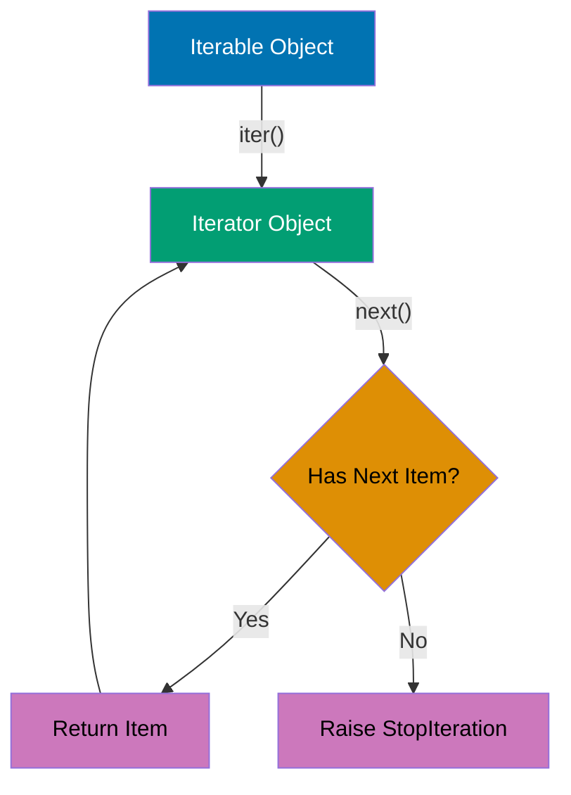

```python
# Built-in iterators
numbers = [1, 2, 3, 4, 5]         # => numbers is list (iterable)

# Get iterator from iterable
iterator = iter(numbers)          # => iterator is list_iterator object
print(type(iterator))             # => Output: <class 'list_iterator'>

# Manually iterate with next()
print(next(iterator))             # => Output: 1 (first item)
print(next(iterator))             # => Output: 2 (second item)
print(next(iterator))             # => Output: 3 (third item)

# Continue until StopIteration
try:
    print(next(iterator))         # => Output: 4
    print(next(iterator))         # => Output: 5
    print(next(iterator))         # => No more items, raises StopIteration
except StopIteration:
    print("Iterator exhausted")   # => Output: Iterator exhausted

# For loop uses iterator protocol internally
for num in [1, 2, 3]:             # => Calls iter([1,2,3]) then next() repeatedly
    print(num)                    # => Output: 1, 2, 3

# Custom iterator - countdown
class Countdown:
    """Iterator that counts down from start to 0."""

    def __init__(self, start):
        self.current = start      # => current is starting value

    def __iter__(self):
        """Return self (this object is its own iterator)."""
        return self

    def __next__(self):
        """Return next value or raise StopIteration."""
        if self.current <= 0:
            raise StopIteration   # => Signal iteration is complete

        self.current -= 1         # => Decrement before returning
        return self.current + 1   # => Return original value

countdown = Countdown(5)          # => countdown starts at 5

for num in countdown:             # => Uses iterator protocol
    print(num)                    # => Output: 5, 4, 3, 2, 1

# Iterator is exhausted after first use
for num in countdown:
    print(num)                    # => Output: (nothing - iterator exhausted)

# Custom iterable - range-like class
class MyRange:
    """Iterable that generates range of numbers."""

    def __init__(self, start, end):
        self.start = start
        self.end = end

    def __iter__(self):
        """Return a new iterator each time."""
        return MyRangeIterator(self.start, self.end)

class MyRangeIterator:
    """Iterator for MyRange."""

    def __init__(self, start, end):
        self.current = start
        self.end = end

    def __iter__(self):
        return self

    def __next__(self):
        if self.current >= self.end:
            raise StopIteration
        value = self.current
        self.current += 1
        return value

my_range = MyRange(1, 5)          # => my_range is iterable (1 to 4)

# Can iterate multiple times (new iterator each time)
for num in my_range:
    print(num)                    # => Output: 1, 2, 3, 4

for num in my_range:
    print(num)                    # => Output: 1, 2, 3, 4 (works again!)

# Iterator functions from itertools
import itertools

# count() - infinite counter
counter = itertools.count(10, 2)  # => Start at 10, step by 2
print(next(counter))              # => Output: 10
print(next(counter))              # => Output: 12
print(next(counter))              # => Output: 14

# cycle() - infinite cycle through iterable
colors = itertools.cycle(["red", "green", "blue"])
                                  # => Cycles through colors infinitely
print(next(colors))               # => Output: red
print(next(colors))               # => Output: green
print(next(colors))               # => Output: blue
print(next(colors))               # => Output: red (cycles back)

# islice() - slice an iterator
numbers = itertools.count(1)      # => Infinite counter starting at 1
first_five = itertools.islice(numbers, 5)
                                  # => First 5 elements
print(list(first_five))           # => Output: [1, 2, 3, 4, 5]

# chain() - chain multiple iterables
combined = itertools.chain([1, 2], [3, 4], [5, 6])
                                  # => Chains iterables together
print(list(combined))             # => Output: [1, 2, 3, 4, 5, 6]

# zip() - iterate over multiple sequences in parallel
names = ["Alice", "Bob", "Charlie"]
ages = [25, 30, 35]
cities = ["NYC", "LA", "Chicago"]

for name, age, city in zip(names, ages, cities):
    print(f"{name}, {age}, {city}")
# => Output: Alice, 25, NYC
#    Bob, 30, LA
#    Charlie, 35, Chicago

# zip stops at shortest iterable
short = zip([1, 2], ["a", "b", "c"])
print(list(short))                # => Output: [(1, 'a'), (2, 'b')] (stops at 2)

# itertools.zip_longest() - zip to longest iterable
from itertools import zip_longest

long = zip_longest([1, 2], ["a", "b", "c"], fillvalue=0)
print(list(long))                 # => Output: [(1, 'a'), (2, 'b'), (0, 'c')]

# enumerate() - get index and value
fruits = ["apple", "banana", "cherry"]

for index, fruit in enumerate(fruits):
    print(f"{index}: {fruit}")
# => Output: 0: apple
#    1: banana
#    2: cherry

# Start enumeration at custom index
for index, fruit in enumerate(fruits, start=1):
    print(f"{index}: {fruit}")
# => Output: 1: apple
#    2: banana
#    3: cherry

# reversed() - reverse iteration
for num in reversed([1, 2, 3, 4, 5]):
    print(num)                    # => Output: 5, 4, 3, 2, 1

# Memory efficiency demonstration
import sys

# List stores all items in memory
list_range = list(range(1000000)) # => Creates list with 1M items
print(f"List size: {sys.getsizeof(list_range)} bytes")
                                  # => Output: ~8MB (stores all items)

# Iterator generates items on-demand
iter_range = iter(range(1000000)) # => Iterator object (lightweight)
print(f"Iterator size: {sys.getsizeof(iter_range)} bytes")
                                  # => Output: ~48 bytes (just state!)
```

**Key Takeaway**: Iterators enable memory-efficient processing of large sequences by generating values on-demand rather than storing everything in memory - implement `__iter__` and `__next__` for custom iterators, and leverage `itertools` for common iteration patterns without reinventing the wheel.

**Why It Matters**: Inheritance enables code reuse through polymorphism, allowing subclasses to extend and override base class behavior. The super() function provides cooperative multiple inheritance essential for mixin patterns in framework development. However, composition is often preferred over deep inheritance hierarchies for maintainability in production systems.

---

### Example 27: Basic Error Handling Patterns

Common patterns for handling errors include EAFP (Easier to Ask for Forgiveness than Permission), LBYL (Look Before You Leap), custom exceptions, and exception chaining.

```python
# EAFP (Easier to Ask for Forgiveness than Permission) - Pythonic
def eafp_example(data, key):
    """Try operation, handle exception if it fails."""
    try:
        return data[key]          # => Try to access key
    except KeyError:
        return "Key not found"    # => Handle if key doesn't exist

data = {"name": "Alice", "age": 30}
print(eafp_example(data, "name")) # => Output: Alice
print(eafp_example(data, "city")) # => Output: Key not found

# LBYL (Look Before You Leap) - Check before action
def lbyl_example(data, key):
    """Check condition before operation."""
    if key in data:               # => Check first
        return data[key]
    else:
        return "Key not found"

print(lbyl_example(data, "name")) # => Output: Alice
print(lbyl_example(data, "city")) # => Output: Key not found

# EAFP vs LBYL comparison
# EAFP: More Pythonic, handles race conditions better
# LBYL: Clearer for simple cases, but verbose and prone to races

# Custom exceptions
class InvalidAgeError(ValueError):
    """Raised when age is invalid."""
    pass

class NegativeAgeError(InvalidAgeError):
    """Raised when age is negative."""
    pass

def validate_age(age):
    """Validate age with custom exceptions."""
    if not isinstance(age, int):
        raise InvalidAgeError(f"Age must be integer, got {type(age)}")
    if age < 0:
        raise NegativeAgeError(f"Age cannot be negative: {age}")
    if age > 150:
        raise InvalidAgeError(f"Age unrealistic: {age}")
    return age

# Using custom exceptions
try:
    validate_age(25)              # => Output: (nothing - valid age)
    print("Valid age")
except InvalidAgeError as e:
    print(f"Error: {e}")

try:
    validate_age(-5)              # => Raises NegativeAgeError
except NegativeAgeError as e:
    print(f"Negative age error: {e}")
                                  # => Output: Negative age error: Age cannot be negative: -5

try:
    validate_age("thirty")        # => Raises InvalidAgeError
except InvalidAgeError as e:
    print(f"Invalid age error: {e}")
                                  # => Output: Invalid age error: Age must be integer...

# Catching exception hierarchy
try:
    validate_age(-10)
except InvalidAgeError as e:      # => Catches NegativeAgeError too (parent class)
    print(f"Caught via parent: {e}")
                                  # => Output: Caught via parent: Age cannot be negative: -10

# Exception chaining (Python 3+)
def process_data(data):
    """Process data with exception chaining."""
    try:
        result = int(data)        # => May raise ValueError
        return result
    except ValueError as e:
        # Chain original exception to new exception
        raise InvalidAgeError(f"Failed to process data: {data}") from e

try:
    process_data("invalid")
except InvalidAgeError as e:
    print(f"Error: {e}")          # => Output: Error: Failed to process data: invalid
    print(f"Original: {e.__cause__}")
                                  # => Output: Original: invalid literal for int()...

# Suppressing exception context (discouraged, hides root cause)
try:
    try:
        int("invalid")
    except ValueError:
        raise InvalidAgeError("Processing failed") from None
                                  # => Suppress original exception (no __cause__)
except InvalidAgeError as e:
    print(f"Error: {e}")          # => Output: Error: Processing failed
    print(f"Cause: {e.__cause__}") # => Output: Cause: None

# Multiple exception types
def divide_and_convert(a, b):
    """Demonstrate handling multiple exception types."""
    try:
        result = a / b            # => May raise ZeroDivisionError
        return int(result)        # => May raise ValueError (unlikely here)
    except ZeroDivisionError:
        print("Division by zero")
        return None
    except ValueError:
        print("Conversion failed")
        return None
    except Exception as e:
        print(f"Unexpected error: {type(e).__name__}: {e}")
        return None

print(divide_and_convert(10, 2))  # => Output: 5
print(divide_and_convert(10, 0))  # => Output: Division by zero, then None

# Context manager for automatic cleanup (exception-safe)
class Transaction:
    """Context manager for transactional operations."""

    def __enter__(self):
        print("Starting transaction")
        return self

    def __exit__(self, exc_type, exc_val, exc_tb):
        if exc_type is None:
            print("Committing transaction")
        else:
            print(f"Rolling back transaction: {exc_type.__name__}")
        return False              # => Propagate exceptions

# Success case
with Transaction():
    print("Performing operation")
# => Output: Starting transaction
#    Performing operation
#    Committing transaction

# Failure case
try:
    with Transaction():
        print("Performing operation")
        raise ValueError("Operation failed")
except ValueError:
    print("Caught exception")
# => Output: Starting transaction
#    Performing operation
#    Rolling back transaction: ValueError
#    Caught exception

# Logging exceptions
import logging

logging.basicConfig(level=logging.ERROR)

def safe_divide(a, b):
    """Divide with error logging."""
    try:
        return a / b
    except ZeroDivisionError:
        logging.error(f"Division by zero: {a} / {b}")
        return None

result = safe_divide(10, 0)       # => Logs error message
print(result)                     # => Output: None
```

**Key Takeaway**: Prefer EAFP (try/except) over LBYL (if checks) for Pythonic code - use custom exceptions to provide clear error semantics, implement exception chaining with `raise ... from e` to preserve root causes, and leverage context managers for automatic resource cleanup even when exceptions occur.

**Why It Matters**: Class and static methods provide alternative ways to organize related functionality without requiring instance state. Classmethods enable alternative constructors and factory patterns common in framework design. Understanding method types is essential for designing clean APIs and avoiding inappropriate instance state access in utility functions.

---

## Summary

You've completed **27 beginner examples** covering Python fundamentals (0-40% coverage):

- **Basics**: Hello World, variables, numbers, strings, booleans
- **Control flow**: If/elif/else, while loops, for loops
- **Data structures**: Lists, tuples, dictionaries, sets
- **Functions**: Definition, scope, lambdas
- **Comprehensions**: List, dict, set comprehensions
- **Error handling**: Try/except, custom exceptions, EAFP vs LBYL
- **File I/O**: Reading, writing, context managers
- **Classes**: Definition, inheritance, properties, magic methods
- **Modules**: Imports, standard library
- **Formatting**: F-strings, .format(), formatting specs
- **Iterators**: Iterator protocol, built-in iterators, itertools

**Next**: Continue to [Intermediate](/en/learn/software-engineering/programming-languages/python/tutorials/by-example/intermediate) (Examples 28-54) for production patterns, decorators, testing, and advanced language features.
