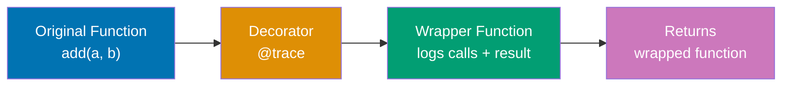
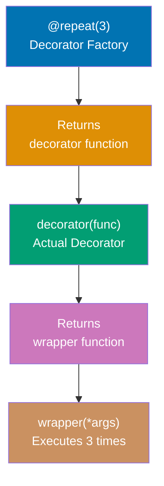
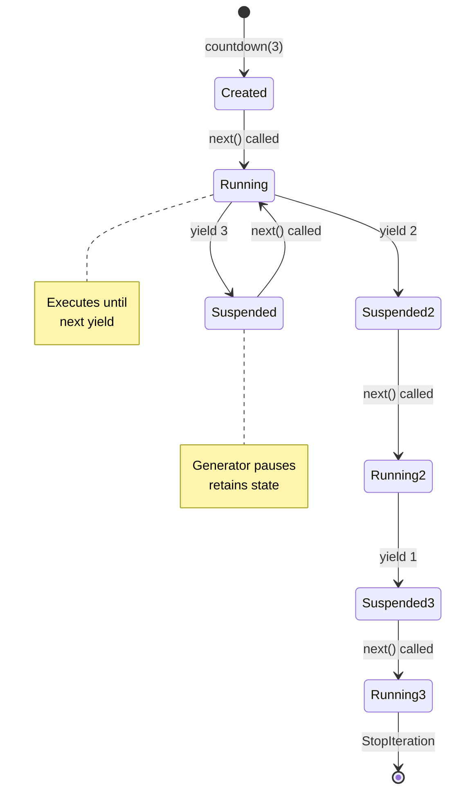
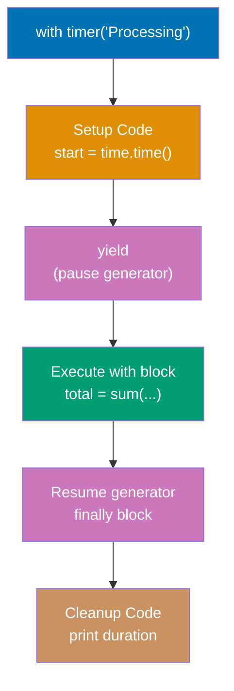
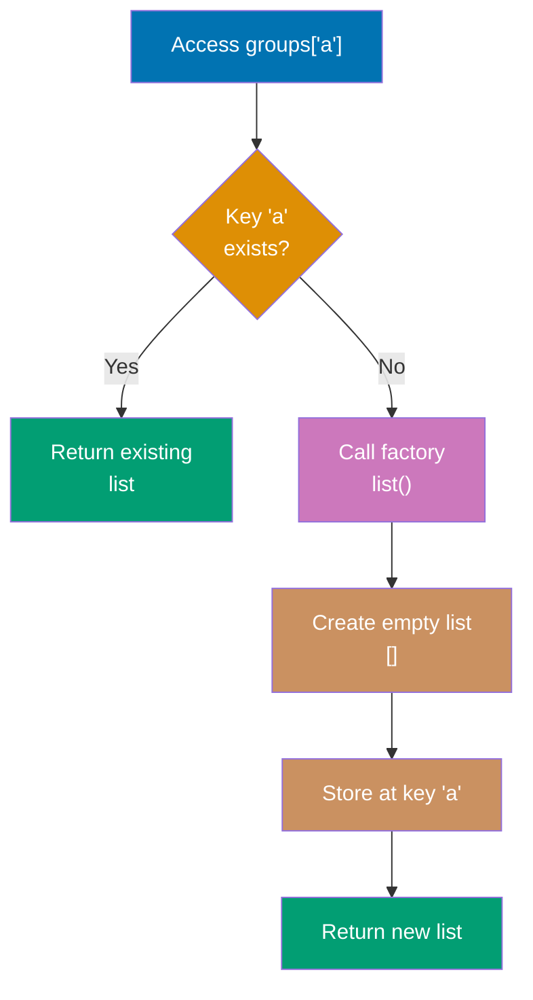
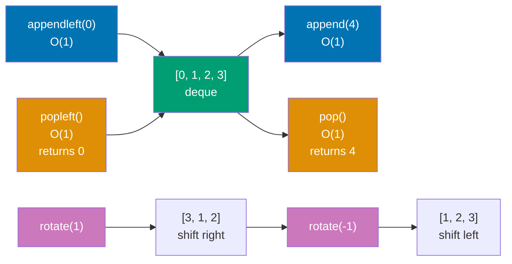
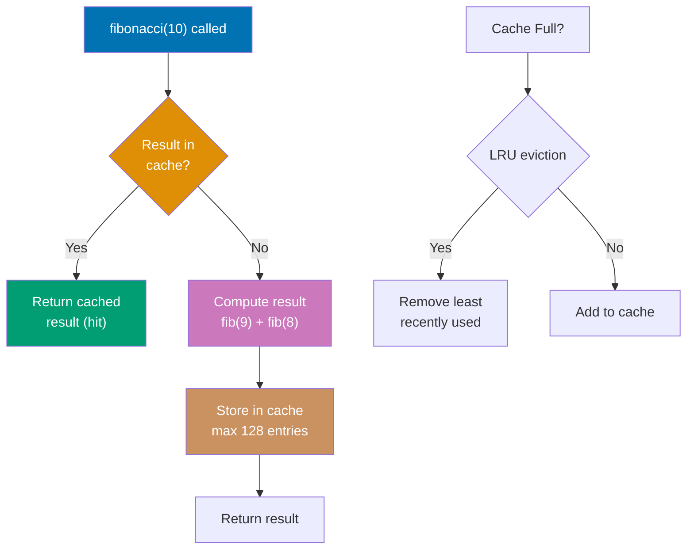
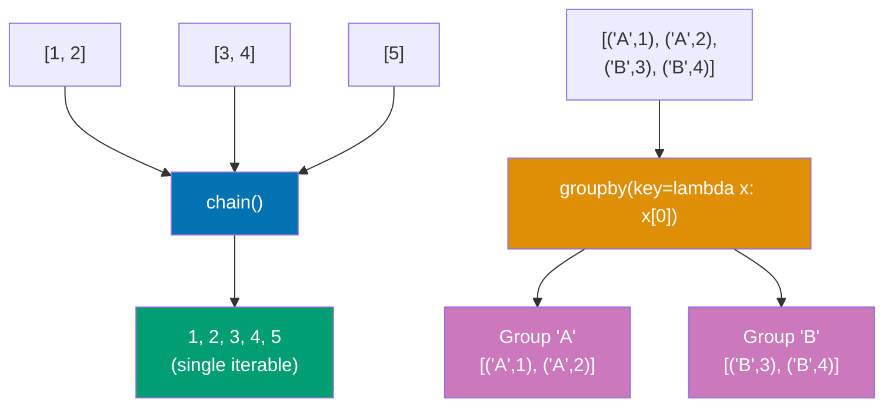
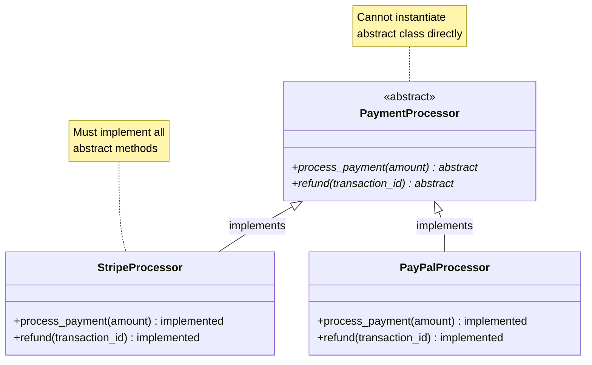

This section covers production Python patterns from examples 28-54, achieving 40-75% topic coverage.

## Example 28: Basic Decorator

Decorators wrap functions to modify behavior without changing function code.



```python
def trace(func):
    """Decorator that logs function calls"""
    def wrapper(*args, **kwargs):
        print(f"Calling {func.__name__}")  # => Logs function name
        result = func(*args, **kwargs)     # => Execute original function
        print(f"Returned {result}")        # => Logs return value
        return result                      # => Return original result
    return wrapper                         # => Return wrapper function

@trace                                     # => Apply decorator
def add(a, b):
    return a + b                           # => Original function logic

result = add(3, 5)  # => Calling add, Returned 8, result = 8
```

**Key Takeaway**: Decorators use closure to wrap functions, enabling cross-cutting concerns like logging and timing.

## Example 29: Decorator with Arguments

Decorators can accept configuration parameters for flexible behavior modification.



```python
def repeat(times):
    """Decorator factory that repeats function calls"""
    def decorator(func):                   # => Actual decorator
        def wrapper(*args, **kwargs):
            results = []
            for i in range(times):         # => Repeat 'times' times
                result = func(*args, **kwargs)
                results.append(result)     # => Collect results
            return results                 # => Return all results
        return wrapper
    return decorator                       # => Return configured decorator

@repeat(3)                                 # => Call decorator factory
def greet(name):
    return f"Hello, {name}!"

messages = greet("Alice")  # => ['Hello, Alice!', 'Hello, Alice!', 'Hello, Alice!']
```

**Key Takeaway**: Decorator factories return decorators configured with parameters, enabling reusable behavior customization.

## Example 30: Preserving Function Metadata

Use functools.wraps to preserve original function metadata in decorated functions.

```python
from functools import wraps

def debug(func):
    @wraps(func)                           # => Preserves __name__, __doc__, etc.
    def wrapper(*args, **kwargs):
        result = func(*args, **kwargs)
        print(f"{func.__name__}: {result}")  # => Uses original name
        return result
    return wrapper

@debug
def calculate(x, y):
    """Adds two numbers"""               # => Original docstring
    return x + y

print(calculate.__name__)  # => 'calculate' (not 'wrapper')
print(calculate.__doc__)   # => 'Adds two numbers'
```

**Key Takeaway**: functools.wraps copies metadata from decorated function to wrapper, preserving introspection capabilities.

## Example 31: Basic Generator

Generators produce values lazily using yield, enabling memory-efficient iteration.



```python
def countdown(n):
    """Generate numbers from n down to 1"""
    while n > 0:
        yield n                            # => Pause and return value
        n -= 1                             # => Continue on next iteration

gen = countdown(3)                         # => Creates generator object
print(next(gen))  # => 3 (first yield)
print(next(gen))  # => 2 (second yield)
print(next(gen))  # => 1 (third yield)
# next(gen) would raise StopIteration

for num in countdown(3):                   # => Generators are iterable
    print(num)                             # => 3, 2, 1
```

**Key Takeaway**: Generators compute values on demand using yield, ideal for large or infinite sequences.

## Example 32: Generator Expression

Generator expressions provide concise syntax for simple generators with minimal memory overhead.

```python
# List comprehension (creates full list in memory)
squares_list = [x**2 for x in range(5)]    # => [0, 1, 4, 9, 16]

# Generator expression (computes values on demand)
squares_gen = (x**2 for x in range(5))     # => Generator object

print(next(squares_gen))  # => 0
print(next(squares_gen))  # => 1

# Use in sum (generator consumed automatically)
total = sum(x**2 for x in range(1000000))  # => Memory efficient
```

**Key Takeaway**: Generator expressions use parentheses instead of brackets, computing values lazily without storing intermediate lists.

## Example 33: Context Manager (with statement)

Context managers handle setup/cleanup automatically using **enter** and **exit** methods.

```mermaid
%% Context manager lifecycle
sequenceDiagram
    participant Code as with FileManager as f
    participant CM as Context Manager
    participant File as File Resource

    Code->>CM: Enter with block
    CM->>CM: __enter__() called
    CM->>File: open('data.txt', 'w')
    File-->>CM: File object
    CM-->>Code: Return file object to 'f'

    Note over Code,File: Code block executes
    Code->>File: f.write('Hello')

    Code->>CM: Exit with block
    CM->>CM: __exit__() called
    CM->>File: f.close()
    Note over CM,File: Guaranteed cleanup<br/>even on exception

    style CM fill:#0173B2,color:#fff
    style File fill:#029E73,color:#fff
```

```python
class FileManager:
    def __init__(self, filename, mode):
        self.filename = filename
        self.mode = mode
        self.file = None

    def __enter__(self):
        """Called when entering 'with' block"""
        self.file = open(self.filename, self.mode)  # => Open file
        return self.file                            # => Return to 'as' variable

    def __exit__(self, exc_type, exc_val, exc_tb):
        """Called when exiting 'with' block"""
        if self.file:
            self.file.close()                       # => Always close file
        # Return False to propagate exceptions, True to suppress

with FileManager('data.txt', 'w') as f:    # => Calls __enter__
    f.write('Hello, World!')               # => File is open
# => Calls __exit__ automatically (file closed even if error occurs)
```

**Key Takeaway**: Context managers guarantee cleanup code execution via **exit**, preventing resource leaks.

## Example 34: contextlib for Simple Context Managers

Use @contextmanager decorator to create context managers from generator functions.



```python
from contextlib import contextmanager
import time

@contextmanager
def timer(label):
    """Context manager that measures execution time"""
    start = time.time()                    # => Setup: record start time
    try:
        yield                              # => Execute with block
    finally:
        end = time.time()                  # => Cleanup: calculate duration
        print(f"{label}: {end - start:.3f}s")

with timer("Processing"):                  # => Calls setup (start timer)
    total = sum(range(1000000))            # => Execute code
# => Calls cleanup (print duration)
```

**Key Takeaway**: @contextmanager simplifies context manager creation using yield for separation of setup/cleanup logic.

## Example 35: Regular Expression Matching

Use re module for pattern matching with compile for performance in repeated use.

```python
import re

# Pattern matching
text = "Email: user@example.com, Phone: 555-1234"
email_pattern = r'\b[A-Za-z0-9._%+-]+@[A-Za-z0-9.-]+\.[A-Z|a-z]{2,}\b'

match = re.search(email_pattern, text)     # => Find first match
if match:
    print(match.group())  # => 'user@example.com'

# Find all matches
phone_pattern = r'\d{3}-\d{4}'
phones = re.findall(phone_pattern, text)   # => ['555-1234']

# Compiled pattern (faster for repeated use)
email_re = re.compile(email_pattern)       # => Compile once
result = email_re.search(text)             # => Reuse compiled pattern
```

**Key Takeaway**: Compile patterns for repeated use; use search for first match, findall for all matches.

## Example 36: Regular Expression Groups and Substitution

Capture groups extract parts of matches; sub performs replacements.

```python
import re

# Capture groups with named groups
pattern = r'(?P<year>\d{4})-(?P<month>\d{2})-(?P<day>\d{2})'
text = "Date: 2025-12-30"

match = re.search(pattern, text)
if match:
    print(match.group('year'))   # => '2025'
    print(match.group('month'))  # => '12'
    print(match.groups())        # => ('2025', '12', '30')

# Substitution with backreferences
phone_text = "Call 555-1234 or 555-5678"
formatted = re.sub(r'(\d{3})-(\d{4})', r'(\1) \2', phone_text)
# => 'Call (555) 1234 or (555) 5678'
```

**Key Takeaway**: Named groups improve readability; backreferences in sub enable pattern-based transformations.

## Example 37: JSON Serialization

Convert Python objects to JSON strings and vice versa for data interchange.

```python
import json

# Python to JSON
data = {
    'name': 'Alice',
    'age': 30,
    'skills': ['Python', 'SQL'],
    'active': True
}

json_str = json.dumps(data, indent=2)      # => Convert to JSON string
# => '{\n  "name": "Alice",\n  "age": 30, ...'

# JSON to Python
parsed = json.loads(json_str)              # => Parse JSON string
print(parsed['name'])  # => 'Alice'

# File operations
with open('data.json', 'w') as f:
    json.dump(data, f, indent=2)           # => Write to file

with open('data.json', 'r') as f:
    loaded = json.load(f)                  # => Read from file
```

**Key Takeaway**: Use dumps/loads for strings, dump/load for files; indent parameter enables readable formatting.

## Example 38: CSV Reading and Writing

Process tabular data with csv module for proper quoting and escaping.

```python
import csv

# Writing CSV
data = [
    ['Name', 'Age', 'City'],
    ['Alice', '30', 'NYC'],
    ['Bob', '25', 'LA']
]

with open('people.csv', 'w', newline='') as f:  # => newline='' prevents blank rows
    writer = csv.writer(f)
    writer.writerows(data)                      # => Write all rows

# Reading CSV
with open('people.csv', 'r') as f:
    reader = csv.reader(f)
    header = next(reader)                       # => ['Name', 'Age', 'City']
    for row in reader:
        print(f"{row[0]} is {row[1]}")          # => Alice is 30, Bob is 25

# DictReader (dict per row)
with open('people.csv', 'r') as f:
    reader = csv.DictReader(f)                  # => Uses first row as keys
    for row in reader:
        print(row['Name'])                      # => Alice, Bob
```

**Key Takeaway**: Use newline='' for writers; DictReader provides dict access for more readable code.

## Example 39: Pathlib for Modern File Operations

Pathlib provides object-oriented path manipulation replacing os.path functions.

```python
from pathlib import Path

# Path creation and properties
p = Path('/home/user/documents/file.txt')
print(p.name)       # => 'file.txt'
print(p.stem)       # => 'file' (without extension)
print(p.suffix)     # => '.txt'
print(p.parent)     # => '/home/user/documents'

# Path operations
config = Path.home() / '.config' / 'app.conf'  # => Path joining with /
print(config.exists())                          # => True/False

# Create directories
logs_dir = Path('logs')
logs_dir.mkdir(parents=True, exist_ok=True)    # => Create with parents

# Read/write files
config_file = Path('config.ini')
config_file.write_text('[Settings]\ntheme=dark')  # => Write text
content = config_file.read_text()                 # => Read text

# Glob patterns
py_files = list(Path('.').glob('**/*.py'))     # => All .py files recursively
```

**Key Takeaway**: Pathlib unifies path operations with intuitive / operator and chainable methods.

## Example 40: Collections - namedtuple

namedtuple creates lightweight immutable classes with named fields.

```python
from collections import namedtuple

# Define namedtuple
Point = namedtuple('Point', ['x', 'y'])       # => Class with x, y fields

p1 = Point(3, 4)                              # => Create instance
print(p1.x, p1.y)  # => 3 4 (field access by name)
print(p1[0], p1[1])  # => 3 4 (also accessible by index)

# Unpacking
x, y = p1                                     # => Tuple unpacking works

# Immutable (like tuples)
# p1.x = 5  # => AttributeError: can't set attribute

# _replace for creating modified copies
p2 = p1._replace(x=5)                         # => Point(x=5, y=4)

# _asdict for conversion to dict
print(p1._asdict())  # => {'x': 3, 'y': 4}
```

**Key Takeaway**: namedtuples provide tuple efficiency with struct-like field access for readable code.

## Example 41: Collections - Counter

Counter tallies hashable objects, providing convenient frequency counting.

```python
from collections import Counter

# Count occurrences
words = ['apple', 'banana', 'apple', 'cherry', 'banana', 'apple']
counts = Counter(words)                       # => Counter({'apple': 3, 'banana': 2, ...})

print(counts['apple'])     # => 3
print(counts['orange'])    # => 0 (missing keys default to 0)

# Most common elements
print(counts.most_common(2))  # => [('apple', 3), ('banana', 2)]

# Arithmetic operations
c1 = Counter(['a', 'b', 'c', 'a'])
c2 = Counter(['a', 'b', 'd'])
print(c1 + c2)  # => Counter({'a': 3, 'b': 2, 'c': 1, 'd': 1})
print(c1 - c2)  # => Counter({'a': 1, 'c': 1}) (removes common counts)
```

**Key Takeaway**: Counter simplifies frequency counting with arithmetic operations and most_common method.

## Example 42: Collections - defaultdict

defaultdict provides default values for missing keys, eliminating KeyError checks.



```python
from collections import defaultdict

# Group items by first letter
words = ['apple', 'apricot', 'banana', 'blueberry', 'cherry']
groups = defaultdict(list)                    # => Default factory: list()

for word in words:
    groups[word[0]].append(word)              # => No KeyError for new keys

print(dict(groups))  # => {'a': ['apple', 'apricot'], 'b': [...], 'c': [...]}

# Count with defaultdict(int)
counts = defaultdict(int)                     # => Default factory: int() = 0
for char in "mississippi":
    counts[char] += 1                         # => No need to check if key exists

print(dict(counts))  # => {'m': 1, 'i': 4, 's': 4, 'p': 2}
```

**Key Takeaway**: defaultdict eliminates missing key checks by calling factory function for new keys.

## Example 43: Collections - deque

deque (double-ended queue) provides O(1) append/pop from both ends.



```python
from collections import deque

# Create deque
d = deque([1, 2, 3])                          # => deque([1, 2, 3])

# Add to both ends (O(1))
d.append(4)                                   # => deque([1, 2, 3, 4])
d.appendleft(0)                               # => deque([0, 1, 2, 3, 4])

# Remove from both ends (O(1))
d.pop()                                       # => 4, deque([0, 1, 2, 3])
d.popleft()                                   # => 0, deque([1, 2, 3])

# Rotation
d.rotate(1)                                   # => deque([3, 1, 2]) (rotate right)
d.rotate(-1)                                  # => deque([1, 2, 3]) (rotate left)

# Bounded deque (circular buffer)
buffer = deque(maxlen=3)                      # => Fixed size
buffer.extend([1, 2, 3])                      # => deque([1, 2, 3])
buffer.append(4)                              # => deque([2, 3, 4]) (1 dropped)
```

**Key Takeaway**: deque optimizes both-end operations; maxlen creates circular buffers for sliding windows.

## Example 44: functools - partial

partial creates new functions with pre-filled arguments.

```python
from functools import partial

def power(base, exponent):
    return base ** exponent                   # => Calculate power

# Create specialized functions
square = partial(power, exponent=2)           # => Pre-fill exponent
cube = partial(power, exponent=3)

print(square(4))  # => 16 (4^2)
print(cube(4))    # => 64 (4^3)

# Useful for callbacks with extra context
from operator import mul
double = partial(mul, 2)                      # => Multiply by 2
numbers = [1, 2, 3, 4]
doubled = list(map(double, numbers))          # => [2, 4, 6, 8]
```

**Key Takeaway**: partial binds arguments to functions, creating specialized versions without wrapper functions.

## Example 45: functools - lru_cache

lru_cache memoizes function results for repeated calls with same arguments.



```python
from functools import lru_cache

@lru_cache(maxsize=128)                       # => Cache up to 128 results
def fibonacci(n):
    """Compute nth Fibonacci number"""
    if n < 2:
        return n
    return fibonacci(n-1) + fibonacci(n-2)    # => Recursive calls cached

# First call computes and caches
print(fibonacci(10))  # => 55 (computes full tree)

# Subsequent calls use cache
print(fibonacci(10))  # => 55 (instant, from cache)

# Cache statistics
print(fibonacci.cache_info())  # => hits, misses, maxsize, currsize

# Clear cache if needed
fibonacci.cache_clear()                       # => Remove all cached results
```

**Key Takeaway**: lru_cache dramatically speeds up recursive functions by caching results keyed by arguments.

## Example 46: itertools - Powerful Iteration

itertools provides composable iterator building blocks for efficient iteration.



```python
from itertools import chain, cycle, islice, combinations, groupby

# Chain multiple iterables
chained = chain([1, 2], [3, 4], [5])         # => 1, 2, 3, 4, 5

# Infinite cycling
counter = cycle(['A', 'B', 'C'])             # => A, B, C, A, B, C, ...
first_6 = list(islice(counter, 6))           # => ['A', 'B', 'C', 'A', 'B', 'C']

# Combinations
combos = list(combinations([1, 2, 3], 2))    # => [(1, 2), (1, 3), (2, 3)]

# Group consecutive items
data = [('A', 1), ('A', 2), ('B', 3), ('B', 4)]
for key, group in groupby(data, key=lambda x: x[0]):
    print(key, list(group))
    # => A [('A', 1), ('A', 2)]
    # => B [('B', 3), ('B', 4)]
```

**Key Takeaway**: itertools functions compose for complex iterations without intermediate lists.

## Example 47: Datetime Basics

Datetime module handles dates, times, and timedeltas for temporal calculations.

```python
from datetime import datetime, date, time, timedelta

# Current datetime
now = datetime.now()                          # => Current local datetime
today = date.today()                          # => Current date (no time)

# Creating specific datetime
dt = datetime(2025, 12, 30, 14, 30, 0)       # => 2025-12-30 14:30:00

# Formatting (strftime = string from time)
formatted = dt.strftime("%Y-%m-%d %H:%M")    # => '2025-12-30 14:30'

# Parsing (strptime = string parse time)
parsed = datetime.strptime("2025-12-30", "%Y-%m-%d")  # => datetime object

# Timedelta (duration)
tomorrow = today + timedelta(days=1)         # => Add 1 day
next_week = now + timedelta(weeks=1)         # => Add 7 days
difference = dt - now                        # => timedelta object

print(difference.days)      # => Number of days
print(difference.seconds)   # => Remaining seconds (< 1 day)
```

**Key Takeaway**: Use datetime for timestamps, date for calendar dates, timedelta for durations and arithmetic.

## Example 48: Type Hints Basics

Type hints improve code clarity and enable static type checking with mypy.

```python
from typing import List, Dict, Optional, Union

def greet(name: str) -> str:
    """Function with type hints"""
    return f"Hello, {name}!"                  # => Return type: str

def process_items(items: List[int]) -> int:
    """Process list of integers"""
    return sum(items)                         # => items must be List[int]

# Optional (can be None)
def find_user(user_id: int) -> Optional[Dict[str, str]]:
    """Returns user dict or None"""
    if user_id == 1:
        return {'name': 'Alice', 'role': 'admin'}
    return None                               # => Valid (Optional allows None)

# Union (multiple types)
def format_value(val: Union[int, str]) -> str:
    """Accept int or str"""
    return str(val)                           # => val can be int or str

# Usage (types are hints, not enforced at runtime)
result = greet("Bob")                         # => Works fine
# result = greet(123)                         # => Works but mypy warns
```

**Key Takeaway**: Type hints document expected types for tools like mypy without affecting runtime behavior.

## Example 49: Dataclasses

Dataclasses reduce boilerplate for classes primarily used for storing data.

```python
from dataclasses import dataclass, field

@dataclass
class Product:
    """Product with automatic __init__, __repr__, __eq__"""
    name: str
    price: float
    quantity: int = 0                         # => Default value
    tags: list = field(default_factory=list)  # => Mutable default (safe)

    def total_value(self) -> float:
        return self.price * self.quantity     # => Custom method

# Automatic __init__
p1 = Product("Laptop", 999.99, 5)            # => No need to write __init__

# Automatic __repr__
print(p1)  # => Product(name='Laptop', price=999.99, quantity=5, tags=[])

# Automatic __eq__
p2 = Product("Laptop", 999.99, 5)
print(p1 == p2)  # => True (compares all fields)

# field() for complex defaults
p3 = Product("Mouse", 29.99, tags=["wireless", "ergonomic"])
```

**Key Takeaway**: @dataclass auto-generates **init**, **repr**, **eq** reducing boilerplate for data-focused classes.

## Example 50: Enums for Named Constants

Enums create type-safe named constants preventing magic values.

```python
from enum import Enum, auto

class Status(Enum):
    """Order status enumeration"""
    PENDING = 1
    PROCESSING = 2
    SHIPPED = 3
    DELIVERED = 4

# Access by name or value
print(Status.PENDING)        # => Status.PENDING
print(Status.PENDING.value)  # => 1
print(Status(2))             # => Status.PROCESSING

# Iteration
for status in Status:
    print(status.name, status.value)  # => PENDING 1, PROCESSING 2, ...

# Auto values
class Priority(Enum):
    LOW = auto()      # => 1
    MEDIUM = auto()   # => 2
    HIGH = auto()     # => 3

# Comparison
if Status.PENDING == Status.PENDING:  # => True
    print("Same status")
```

**Key Takeaway**: Enums replace magic numbers/strings with type-safe constants that prevent invalid values.

## Example 51: Abstract Base Classes

ABCs define interfaces that subclasses must implement.



```python
from abc import ABC, abstractmethod

class PaymentProcessor(ABC):
    """Abstract payment processor interface"""

    @abstractmethod
    def process_payment(self, amount: float) -> bool:
        """All subclasses must implement this method"""
        pass

    @abstractmethod
    def refund(self, transaction_id: str) -> bool:
        """All subclasses must implement this method"""
        pass

class StripeProcessor(PaymentProcessor):
    def process_payment(self, amount: float) -> bool:
        print(f"Processing ${amount} via Stripe")
        return True                           # => Implementation required

    def refund(self, transaction_id: str) -> bool:
        print(f"Refunding transaction {transaction_id}")
        return True                           # => Implementation required

# processor = PaymentProcessor()  # => TypeError: Can't instantiate abstract class
processor = StripeProcessor()     # => OK, implements all abstract methods
```

**Key Takeaway**: ABCs enforce interface contracts at instantiation time preventing incomplete implementations.

## Example 52: Basic pytest Tests

pytest provides powerful testing with minimal boilerplate.

```python
# test_calculator.py
def add(a, b):
    return a + b

def test_add_positive_numbers():
    """Test addition of positive numbers"""
    assert add(2, 3) == 5                     # => Simple assertion

def test_add_negative_numbers():
    """Test addition of negative numbers"""
    assert add(-1, -1) == -2

def test_add_zero():
    """Test addition with zero"""
    assert add(5, 0) == 5
    assert add(0, 5) == 5

# Run with: pytest test_calculator.py
# pytest discovers tests (test_*.py, *_test.py)
# Collects functions starting with test_
# Reports pass/fail with helpful assertion messages
```

**Key Takeaway**: pytest uses simple assert statements with automatic discovery of test files and functions.

## Example 53: pytest Fixtures

Fixtures provide reusable test data and setup/teardown logic.

```python
import pytest

@pytest.fixture
def sample_data():
    """Fixture providing sample data"""
    data = [1, 2, 3, 4, 5]
    print("Setup: creating data")             # => Run before test
    yield data                                # => Provide to test
    print("Teardown: cleaning up")            # => Run after test

def test_sum_with_fixture(sample_data):
    """Test using fixture (injected as parameter)"""
    assert sum(sample_data) == 15             # => Use fixture data

@pytest.fixture(scope="module")
def database_connection():
    """Module-scoped fixture (created once per module)"""
    conn = "DB_CONNECTION"                    # => Setup once
    yield conn
    # Close connection (teardown)             # => Cleanup once

def test_query(database_connection):
    assert database_connection == "DB_CONNECTION"
```

**Key Takeaway**: Fixtures enable DRY tests with dependency injection and automatic setup/teardown.

## Example 54: pytest Parametrize

Parametrize runs same test with different inputs avoiding repetitive test functions.

```python
import pytest

def is_palindrome(s):
    return s == s[::-1]

@pytest.mark.parametrize("text,expected", [
    ("racecar", True),                        # => Test case 1
    ("hello", False),                         # => Test case 2
    ("level", True),                          # => Test case 3
    ("python", False),                        # => Test case 4
])
def test_palindrome(text, expected):
    """Single test function, multiple executions"""
    assert is_palindrome(text) == expected    # => Run for each parameter set

# pytest generates 4 separate test runs:
# test_palindrome[racecar-True]
# test_palindrome[hello-False]
# test_palindrome[level-True]
# test_palindrome[python-False]

@pytest.mark.parametrize("a,b,expected", [
    (2, 3, 5),
    (0, 0, 0),
    (-1, 1, 0),
])
def test_add(a, b, expected):
    assert a + b == expected
```

**Key Takeaway**: @pytest.mark.parametrize eliminates duplicate test code by running same logic with different inputs.

## Summary

Intermediate Python (examples 28-54) covers production patterns for real-world development: decorators for behavior modification, generators for memory efficiency, context managers for resource safety, testing with pytest, and essential standard library modules. Master these patterns to write maintainable, professional Python code.
