## Advanced Level: Expert Mastery

Examples 58-85 cover expert mastery and performance optimization (75-95% coverage). You'll explore unsafe code, procedural macros, async/await, advanced trait patterns, FFI, and performance tuning.

---

## Example 58: Unsafe Code Basics

`unsafe` blocks bypass Rust's safety guarantees for operations the compiler can't verify, like raw pointer dereferencing and calling unsafe functions.

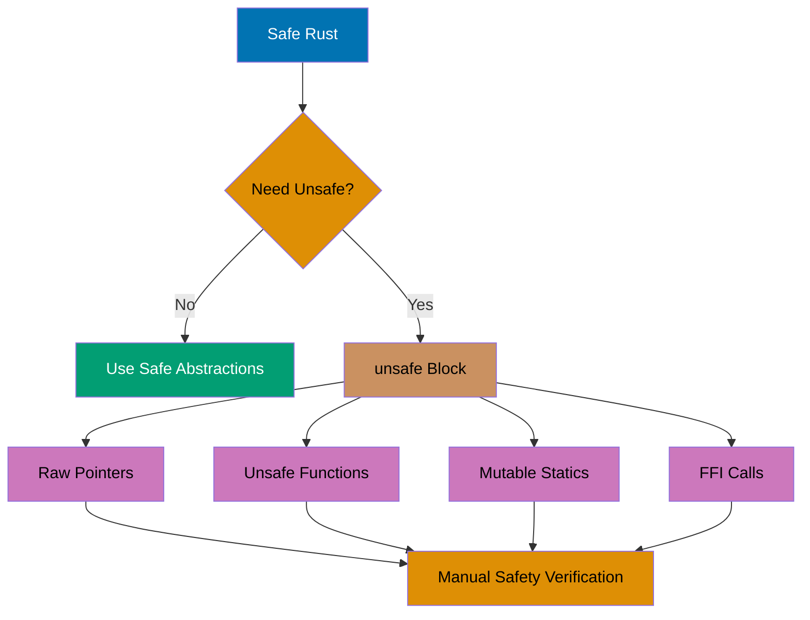
```mermaid
graph TD
    A[Safe Rust] --> B{Need Unsafe?}
    B -->|No| C[Use Safe Abstractions]
    B -->|Yes| D[unsafe Block]
    D --> E[Raw Pointers]
    D --> F[Unsafe Functions]
    D --> G[Mutable Statics]
    D --> H[FFI Calls]
    E --> I[Manual Safety Verification]
    F --> I
    G --> I
    H --> I

    style A fill:#0173B2,color:#fff
    style B fill:#DE8F05,color:#000
    style C fill:#029E73,color:#fff
    style D fill:#CA9161,color:#000
    style E fill:#CC78BC,color:#000
    style F fill:#CC78BC,color:#000
    style G fill:#CC78BC,color:#000
    style H fill:#CC78BC,color:#000
    style I fill:#DE8F05,color:#000
```

```rust
fn main() {
    let mut num = 5;                     // => num is 5 (type: i32, mutable variable on stack)

    // Create raw pointers (safe operation - no dereference yet)
    let r1 = &num as *const i32;         // => r1 is *const i32 (immutable raw pointer to num's address)
                                         // => Points to stack address of num (e.g., 0x7fff5fbff5bc)
    let r2 = &mut num as *mut i32;       // => r2 is *mut i32 (mutable raw pointer to num's address)
                                         // => Both r1 and r2 point to same memory location
                                         // => Creating raw pointers is SAFE - no borrow checker rules violated

    // Dereference raw pointers (unsafe operation - requires manual verification)
    unsafe {                             // => unsafe block: programmer takes responsibility for safety
        println!("r1: {}", *r1);         // => Dereference r1: reads value 5 from memory
                                         // => Output: r1: 5
                                         // => Safe because r1 points to valid num on stack
        *r2 = 10;                        // => Dereference r2 for write: modifies num through raw pointer
                                         // => num is now 10 (modified via raw pointer, not direct assignment)
        println!("r2: {}", *r2);         // => Dereference r2: reads modified value 10
                                         // => Output: r2: 10
                                         // => Also safe because r2 points to valid mutable num
    }                                    // => All dereferences valid: pointers point to live stack variable

    println!("num after unsafe: {}", num); // => Output: num after unsafe: 10
                                         // => num was modified through r2 raw pointer

    // Invalid pointer (demonstrates undefined behavior - DO NOT DO THIS!)
    let address = 0x012345usize;         // => arbitrary memory address (likely invalid/unmapped)
    let _r = address as *const i32;      // => Cast usize to raw pointer (SAFE - just casting)
                                         // => _r points to potentially invalid memory location
    // unsafe {
    //     println!("{}", *_r);          // => UNDEFINED BEHAVIOR: dereferencing invalid pointer
    //     // => Could segfault, read garbage, or appear to work (unpredictable)
    //     // => No guarantee this address is mapped or contains i32
    //     // => Rust can't verify pointer validity - programmer responsibility
    // }                                 // => NEVER dereference arbitrary addresses!

    // Demonstrating pointer arithmetic (unsafe)
    let arr = [1, 2, 3, 4, 5];           // => Array of 5 i32 elements on stack
    let ptr = arr.as_ptr();              // => ptr is *const i32 pointing to first element (1)
    unsafe {
        println!("First: {}", *ptr);     // => Output: First: 1 (dereference first element)
        let second = ptr.offset(1);      // => Advance pointer by 1 i32 (4 bytes), points to second element
                                         // => Pointer arithmetic requires unsafe (no bounds checking)
        println!("Second: {}", *second); // => Output: Second: 2 (dereference second element)
                                         // => Valid because offset(1) is within array bounds
    }                                    // => offset() out of bounds would be undefined behavior
}
```

**Key Takeaway**: `unsafe` blocks allow raw pointer operations and other unchecked operations, placing responsibility on the programmer to maintain memory safety invariants the compiler can't verify.

**Why It Matters**: Explicit unsafe blocks make unsound operations visible and auditable while enabling low-level system programming, providing C++-level power with clear safety boundaries. Operating systems like Redox and hypervisors like Firecracker use unsafe sparingly for hardware interfacing while proving safety properties of the encapsulating safe API—achieving formal verification impossible in fully unsafe languages like C.

---

## Example 59: Unsafe Functions

Unsafe functions require `unsafe` keyword in both definition and call, documenting operations that require manual safety verification.

```rust
unsafe fn dangerous() {                  // => unsafe function: caller must ensure preconditions
                                         // => Marking function unsafe documents that it has safety requirements
    println!("Doing dangerous things");  // => Simple body - unsafety is in the contract, not implementation
}                                        // => Could access global mutable state, call FFI, etc.

fn split_at_mut(slice: &mut [i32], mid: usize) -> (&mut [i32], &mut [i32]) {
                                         // => Safe function: provides safe abstraction over unsafe code
                                         // => Returns two mutable slices from one - normally violates borrow rules
    let len = slice.len();               // => len is total length (e.g., 6 for vec![1,2,3,4,5,6])
    let ptr = slice.as_mut_ptr();        // => ptr is *mut i32 pointing to first element
                                         // => Getting raw pointer is SAFE - doesn't dereference yet

    assert!(mid <= len);                 // => Runtime safety check: mid must be valid split point
                                         // => Panics if mid > len (prevents out-of-bounds access)
                                         // => This precondition makes the unsafe code below safe

    unsafe {                             // => unsafe block: we've verified mid <= len above
        (
            std::slice::from_raw_parts_mut(ptr, mid),
                                         // => Construct first slice: [0..mid) - ptr to ptr+mid
                                         // => Returns &mut [i32] with mid elements
                                         // => SAFE because: ptr valid, mid <= len, no overlap with second slice
            std::slice::from_raw_parts_mut(ptr.add(mid), len - mid),
                                         // => Construct second slice: [mid..len) - ptr+mid to ptr+len
                                         // => ptr.add(mid) advances pointer by mid elements (mid * size_of::<i32>())
                                         // => Returns &mut [i32] with (len - mid) elements
                                         // => SAFE because: ptr+mid valid, len-mid correct, no overlap with first slice
        )                                // => Returning two &mut slices is safe: they reference disjoint memory
    }                                    // => Function provides safe API - caller doesn't need unsafe block
}

fn main() {
    // Calling unsafe function requires unsafe block
    unsafe {
        dangerous();                     // => Call unsafe function (programmer responsibility for safety)
    }                                    // => Output: Doing dangerous things
                                         // => unsafe block makes it explicit that safety is on us

    // Using safe abstraction (split_at_mut) - no unsafe needed!
    let mut v = vec![1, 2, 3, 4, 5, 6];  // => v is Vec<i32> with 6 elements on heap
    let (left, right) = split_at_mut(&mut v, 3);
                                         // => Split at index 3: left gets [1,2,3], right gets [4,5,6]
                                         // => No unsafe block needed - split_at_mut encapsulates unsafety
                                         // => Both left and right are mutable slices (&mut [i32])
    println!("Left: {:?}", left);        // => Output: Left: [1, 2, 3]
    println!("Right: {:?}", right);      // => Output: Right: [4, 5, 6]

    // Can modify both slices independently (they're disjoint)
    left[0] = 10;                        // => Modify first element of left slice
    right[0] = 40;                       // => Modify first element of right slice
    println!("Modified left: {:?}", left);   // => Output: Modified left: [10, 2, 3]
    println!("Modified right: {:?}", right); // => Output: Modified right: [40, 5, 6]
                                         // => Safe because slices don't overlap (verified by assert in split_at_mut)

    // Compare with std::slice::split_at_mut - same functionality
    let mut v2 = vec![7, 8, 9, 10];      // => Another vector for demonstration
    let (left2, right2) = v2.split_at_mut(2); // => Standard library version (also uses unsafe internally)
    println!("Stdlib left: {:?}", left2);     // => Output: Stdlib left: [7, 8]
    println!("Stdlib right: {:?}", right2);   // => Output: Stdlib right: [9, 10]
}
```

**Key Takeaway**: Unsafe functions encapsulate operations requiring manual safety verification, making unsafe operations explicit in both definition and call sites while enabling safe abstractions over unsafe code.

**Why It Matters**: Unsafe function signatures make safety contracts explicit through documentation, enabling safe abstractions over inherently unsafe operations. Memory allocators and lock-free data structures use unsafe functions to encapsulate pointer manipulation while exposing safe APIs, achieving the composability of safe code while maintaining the performance of raw pointer operations.

---

## Example 60: FFI (Foreign Function Interface)

FFI enables calling functions from other languages like C, using `extern` blocks to declare external function signatures.

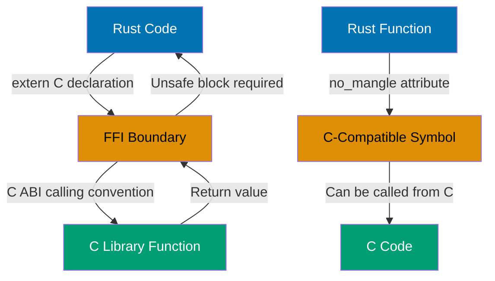
```mermaid
%% FFI boundary showing Rust-C interop
graph TD
    A[Rust Code] -->|extern C declaration| B[FFI Boundary]
    B -->|C ABI calling convention| C[C Library Function]
    C -->|Return value| B
    B -->|Unsafe block required| A
    D[Rust Function] -->|no_mangle attribute| E[C-Compatible Symbol]
    E -->|Can be called from C| F[C Code]

    style A fill:#0173B2,color:#fff
    style B fill:#DE8F05,color:#000
    style C fill:#029E73,color:#fff
    style D fill:#0173B2,color:#fff
    style E fill:#DE8F05,color:#000
    style F fill:#029E73,color:#fff
```

```rust
// Link to C standard library function
extern "C" {                         // => extern "C" block: declare foreign functions with C ABI
    fn abs(input: i32) -> i32;       // => Declare C's abs() function from stdlib.h
                                     // => Signature must match C declaration exactly
                                     // => No function body - implemented in libc
}                                    // => Linker resolves this to system's C library

fn main() {
    // Calling C function is unsafe - no Rust safety guarantees
    unsafe {                         // => unsafe required: C code can do anything
        println!("abs(-3) = {}", abs(-3));
                                     // => Call C's abs() function with -3
                                     // => Output: abs(-3) = 3
                                     // => C function returns absolute value
        let result = abs(-42);       // => result is 42 (C's abs returns i32)
        println!("abs(-42) = {}", result);
                                     // => Output: abs(-42) = 42
    }                                // => Must verify C function is called correctly

    // Example with multiple C functions
    extern "C" {
        fn strlen(s: *const i8) -> usize; // => C's strlen from string.h
                                     // => Takes C string (null-terminated char*)
        fn malloc(size: usize) -> *mut u8; // => C's malloc for heap allocation
        fn free(ptr: *mut u8);       // => C's free to deallocate memory
    }

    unsafe {
        // Call strlen on C string literal
        let c_str = b"Hello\0";      // => Byte string with null terminator (C requirement)
        let len = strlen(c_str.as_ptr() as *const i8);
                                     // => Cast to *const i8 (C's char*)
                                     // => len is 5 (excludes null terminator)
        println!("Length: {}", len); // => Output: Length: 5

        // Allocate memory with malloc (manual memory management!)
        let ptr = malloc(10);        // => Allocate 10 bytes on heap
                                     // => ptr is *mut u8 pointing to heap memory
                                     // => Returns null if allocation fails
        if !ptr.is_null() {          // => Check for allocation failure
            println!("Allocated 10 bytes at {:p}", ptr);
                                     // => Output: Allocated 10 bytes at 0x... (heap address)
            free(ptr);               // => Must manually free to avoid memory leak
                                     // => After free, ptr is dangling - don't use it!
        }
    }
}

// Expose Rust function to C (for calling from C code)
#[no_mangle]                         // => Prevent name mangling: keep function name as "call_from_c"
                                     // => Rust normally mangles names (e.g., _ZN...), C can't find them
pub extern "C" fn call_from_c() {    // => pub: visible to other modules/languages
                                     // => extern "C": use C calling convention (ABI compatibility)
    println!("Called from C!");      // => Can be called from C like: call_from_c();
}                                    // => Returns void (unit type () maps to C's void)

// More complex FFI function: pass data between Rust and C
#[no_mangle]
pub extern "C" fn add_numbers(a: i32, b: i32) -> i32 {
                                     // => C-compatible signature: int add_numbers(int a, int b)
    let result = a + b;              // => result is a + b (e.g., 5 + 3 = 8)
    println!("Rust adding {} + {} = {}", a, b, result);
                                     // => Output: Rust adding 5 + 3 = 8 (if called with 5, 3)
    result                           // => Return i32 to C (compatible with C's int)
}                                    // => C code can call: int sum = add_numbers(5, 3);

// Handling C strings with proper safety
use std::ffi::{CStr, CString};       // => std::ffi types for C string interop

#[no_mangle]
pub extern "C" fn rust_greeting(name: *const i8) -> *mut i8 {
                                     // => Takes C string (*const char), returns C string (*mut char)
    if name.is_null() {              // => Null pointer check (defensive programming)
        return std::ptr::null_mut(); // => Return null if input invalid
    }

    unsafe {
        let c_str = CStr::from_ptr(name); // => Wrap C string in Rust's CStr (borrowed)
                                     // => CStr: borrowed view of null-terminated C string
        let rust_str = c_str.to_str().unwrap_or("Invalid UTF-8");
                                     // => Convert to Rust &str (handles UTF-8 validation)
        let greeting = format!("Hello, {}!", rust_str);
                                     // => greeting is Rust String (e.g., "Hello, Alice!")

        // Convert back to C string for return
        let c_greeting = CString::new(greeting).unwrap();
                                     // => CString: owned null-terminated string
                                     // => Adds null terminator automatically
        c_greeting.into_raw()        // => Transfer ownership to caller (C must call free())
                                     // => Returns *mut i8 for C compatibility
    }                                // => C code responsible for freeing returned pointer
}
```

**Key Takeaway**: FFI through `extern` blocks enables interoperability with C libraries by declaring external function signatures, with `unsafe` required for calls since the compiler can't verify foreign code safety.

**Why It Matters**: Safe FFI boundaries with explicit unsafe calls prevent the memory corruption common when interfacing with C libraries, enabling gradual migration from C/C++ codebases. Firefox's Stylo replaced C++ layout code with Rust incrementally through FFI, catching bugs at the Rust/C++ boundary that would be undefined behavior in pure C++ rewrites—enabling safe refactoring of legacy codebases.

---

## Example 61: Global Mutable State

Global mutable state requires `unsafe` and careful synchronization, as Rust can't guarantee thread safety for mutable statics.

```rust
static mut COUNTER: u32 = 0;         // => Mutable static: lives for entire program ('static lifetime)
                                     // => Mutable: can be changed by any thread
                                     // => UNSAFE: no synchronization guarantees!

fn add_to_count(inc: u32) {
    unsafe {                         // => unsafe required: accessing mutable static
        COUNTER += inc;              // => Read COUNTER, add inc, write back
                                     // => NOT atomic: race condition if multiple threads!
                                     // => inc is added to current value (e.g., 0 + 3 = 3)
    }                                // => Compiler can't prevent data races here
}

fn main() {
    add_to_count(3);                 // => COUNTER is now 3 (0 + 3)
    add_to_count(7);                 // => COUNTER is now 10 (3 + 7)

    unsafe {                         // => unsafe required: reading mutable static
        println!("COUNTER: {}", COUNTER);
                                     // => Output: COUNTER: 10
                                     // => Reading also unsafe - could be mid-write by another thread
    }

    // Demonstrating the danger: non-atomic read-modify-write
    unsafe {
        let temp = COUNTER;          // => Read current value (10)
        // Imagine thread switch here - another thread could modify COUNTER!
        COUNTER = temp + 5;          // => Write 15 (10 + 5)
                                     // => If another thread modified between read/write, change is lost!
        println!("COUNTER after: {}", COUNTER);
                                     // => Output: COUNTER after: 15
    }
}

// Better approach 1: Atomic types for thread-safe primitives
use std::sync::atomic::{AtomicU32, Ordering};

static ATOMIC_COUNTER: AtomicU32 = AtomicU32::new(0);
                                     // => AtomicU32: thread-safe u32 with atomic operations
                                     // => Immutable static (no mut) - safe to access from any thread
                                     // => Initialized to 0 at program start

fn safe_add_to_count(inc: u32) {
    ATOMIC_COUNTER.fetch_add(inc, Ordering::SeqCst);
                                     // => Atomic read-modify-write (single CPU instruction)
                                     // => fetch_add: atomically adds inc and returns old value
                                     // => Ordering::SeqCst: strongest memory ordering (sequential consistency)
                                     // => No unsafe needed - guaranteed thread-safe!
}

fn demonstrate_atomics() {
    safe_add_to_count(3);            // => Atomically: ATOMIC_COUNTER is now 3
    safe_add_to_count(7);            // => Atomically: ATOMIC_COUNTER is now 10

    let value = ATOMIC_COUNTER.load(Ordering::SeqCst);
                                     // => Atomic read: value is 10
                                     // => No unsafe block needed - safe to read from any thread
    println!("Atomic counter: {}", value);
                                     // => Output: Atomic counter: 10

    ATOMIC_COUNTER.store(20, Ordering::SeqCst);
                                     // => Atomic write: set to 20 (replaces current value)
    println!("After store: {}", ATOMIC_COUNTER.load(Ordering::SeqCst));
                                     // => Output: After store: 20

    // Compare-and-swap (CAS) operation
    let old = ATOMIC_COUNTER.compare_exchange(
        20,                          // => Expected current value (20)
        30,                          // => New value if current matches (30)
        Ordering::SeqCst,            // => Success ordering
        Ordering::SeqCst             // => Failure ordering
    );                               // => Returns Ok(20) if swap succeeded, Err(actual) if failed
    println!("CAS result: {:?}", old); // => Output: CAS result: Ok(20) (swap successful)
    println!("After CAS: {}", ATOMIC_COUNTER.load(Ordering::SeqCst));
                                     // => Output: After CAS: 30
}

// Better approach 2: Mutex for complex data structures
use std::sync::Mutex;
use std::collections::HashMap;

static GLOBAL_MAP: Mutex<Option<HashMap<String, i32>>> = Mutex::new(None);
                                     // => Mutex<T>: locks access to T (thread-safe)
                                     // => Option allows lazy initialization
                                     // => Must be const-initializable (Mutex::new is const)

fn use_global_map() {
    let mut map = GLOBAL_MAP.lock().unwrap();
                                     // => lock() blocks until mutex acquired
                                     // => Returns MutexGuard (RAII lock - auto-releases on drop)
                                     // => unwrap() panics if mutex poisoned (previous thread panicked)

    if map.is_none() {               // => First access: initialize the map
        *map = Some(HashMap::new()); // => Create empty HashMap
    }                                // => map is now Some(HashMap::new())

    if let Some(ref mut m) = *map {  // => Extract mutable reference to HashMap
        m.insert("key".to_string(), 42); // => Insert key-value pair
        println!("Map size: {}", m.len()); // => Output: Map size: 1
    }
}                                    // => MutexGuard dropped: mutex automatically released

// Better approach 3: LazyLock for one-time initialization (Rust 1.80+)
use std::sync::LazyLock;

static LAZY_VALUE: LazyLock<Vec<i32>> = LazyLock::new(|| {
                                     // => LazyLock: thread-safe lazy initialization
    println!("Initializing LAZY_VALUE"); // => Runs once on first access
    vec![1, 2, 3, 4, 5]              // => Returns Vec<i32>
});                                  // => Subsequent accesses return same instance

fn use_lazy_value() {
    println!("{:?}", &*LAZY_VALUE);  // => First access: prints "Initializing..." then [1,2,3,4,5]
    println!("{:?}", &*LAZY_VALUE);  // => Second access: just prints [1,2,3,4,5] (no re-init)
}
```

**Key Takeaway**: Mutable static variables require `unsafe` access due to thread safety concerns, but atomic types and `Mutex` provide safe alternatives for thread-safe global state.

**Why It Matters**: Requiring unsafe for mutable globals makes shared mutable state visible and forces consideration of thread safety, preventing the global variable bugs common in C and JavaScript. Rust kernel modules use unsafe static mut sparingly while preferring atomic types or Mutex, achieving Linux kernel development safety impossible in C where global mutable state is unchecked and pervasive.

---

## Example 62: Union Types

Unions share memory for all fields, enabling low-level memory layouts at the cost of type safety (all field access is unsafe).

```rust
#[repr(C)]                           // => C-compatible memory layout (required for FFI unions)
                                     // => Without repr(C), Rust can reorder/optimize layout
union MyUnion {                      // => Union: all fields share same memory location
    f1: u32,                         // => Field 1: 32-bit unsigned integer (4 bytes)
    f2: f32,                         // => Field 2: 32-bit float (4 bytes)
}                                    // => Size of MyUnion is max(sizeof(u32), sizeof(f32)) = 4 bytes
                                     // => Both fields occupy same 4 bytes in memory

fn main() {
    let u = MyUnion { f1: 1 };       // => Initialize union with f1 field set to 1
                                     // => Memory contains: 0x00000001 (as u32 in little-endian)
                                     // => f2 is NOT initialized - reading it is undefined behavior

    unsafe {                         // => All union field access requires unsafe
        println!("u.f1: {}", u.f1);  // => Read f1: safe because we initialized with f1
                                     // => Output: u.f1: 1
                                     // => Memory interpretation: 0x00000001 as u32 = 1

        println!("u.f2: {}", u.f2);  // => Read f2: reinterprets f1's bits as f32!
                                     // => Memory still contains: 0x00000001
                                     // => Interpreted as f32: 0x00000001 ≈ 1.4e-45 (denormal float)
                                     // => Output: u.f2: 0.000000000000000000000000000000000000000000001
                                     // => Reading wrong field = type punning (undefined in Rust!)
    }                                // => Compiler can't track which field is active

    // Demonstrating type punning with more interesting values
    let u2 = MyUnion { f2: 1.0 };    // => Initialize with f2 = 1.0 (floating point)
                                     // => Memory contains: 0x3F800000 (IEEE 754 for 1.0)
    unsafe {
        println!("f2 as float: {}", u2.f2); // => Output: f2 as float: 1.0
        println!("f2 as u32: 0x{:08X}", u2.f1);
                                     // => Read same memory as u32
                                     // => Output: f2 as u32: 0x3F800000 (bit pattern of 1.0f32)
                                     // => Useful for inspecting float representation
    }

    // Practical use case: efficient tagged union (discriminated union)
    #[repr(C)]
    union IntOrFloat {
        i: i32,                      // => Signed 32-bit integer
        f: f32,                      // => 32-bit float
    }

    enum Value {                     // => Tagged union: type-safe wrapper
        Int(i32),                    // => Variant for integer values
        Float(f32),                  // => Variant for float values
    }                                // => Compiler tracks active variant (no unsafe access!)

    // Using enum (safe) vs union (unsafe)
    let safe_value = Value::Int(42); // => Type-safe: compiler knows this is Int
    match safe_value {
        Value::Int(i) => println!("Safe int: {}", i),   // => Pattern matching is safe
        Value::Float(f) => println!("Safe float: {}", f),
    }                                // => Output: Safe int: 42

    let unsafe_value = IntOrFloat { i: 42 }; // => Union: programmer tracks active field
    unsafe {
        println!("Union int: {}", unsafe_value.i);
                                     // => Output: Union int: 42 (correct - we set i)
        // println!("{}", unsafe_value.f); // => WRONG: reading f when i is active!
                                     // => Would give garbage or crash
    }

    // Unions with Copy types only (Rust requirement)
    // union NoCopy {
    //     s: String,                // => ERROR: String is not Copy
    //     v: Vec<i32>,              // => ERROR: Vec is not Copy
    // }                             // => Unions can only contain Copy types (Drop could be ambiguous)

    // FFI use case: matching C union
    #[repr(C)]
    union CUnion {                   // => Matches C's: union { int i; float f; char c[4]; }
        i: i32,                      // => int (4 bytes)
        f: f32,                      // => float (4 bytes)
        c: [u8; 4],                  // => char[4] (4 bytes)
    }                                // => Size: 4 bytes, alignment: 4 bytes (matches C)

    let c_union = CUnion { i: 0x41424344 }; // => Initialize with ASCII "DCBA" (little-endian)
    unsafe {
        println!("As int: 0x{:08X}", c_union.i);
                                     // => Output: As int: 0x41424344
        println!("As bytes: {:?}", c_union.c);
                                     // => Output: As bytes: [68, 67, 66, 65] (D, C, B, A in ASCII)
        println!("As chars: {}",
                 String::from_utf8_lossy(&c_union.c));
                                     // => Output: As chars: DCBA (reinterpret bytes as chars)
    }                                // => Useful for low-level serialization/protocol parsing

    // ManuallyDrop for non-Copy types in unions
    use std::mem::ManuallyDrop;
    union MaybeString {
        s: ManuallyDrop<String>,     // => ManuallyDrop prevents automatic Drop
        i: i32,                      // => Integer alternative
    }                                // => Programmer must manually drop String when done

    let mut u3 = MaybeString { s: ManuallyDrop::new(String::from("Hello")) };
    unsafe {
        println!("String in union: {}", u3.s);
                                     // => Output: String in union: Hello
                                     // => Accessing String through ManuallyDrop
        ManuallyDrop::drop(&mut u3.s); // => Manual Drop call (must do this!)
    }                                // => Without manual drop, String leaks memory
}
```

**Key Takeaway**: Unions enable C-compatible memory layouts by overlapping field storage, with all field access unsafe since the compiler can't track which field is currently valid.

**Why It Matters**: Unions with unsafe field access enable low-level programming and C FFI while maintaining memory safety boundaries, solving problems that require unchecked type punning in C++. Network protocol parsers and binary file format readers use unions for efficient memory reinterpretation while unsafe access keeps corruption localized—preventing the memory safety bugs that plague C implementations.

---

## Example 63: Declarative Macros (macro_rules!)

Declarative macros enable code generation through pattern matching on syntax trees, reducing boilerplate with compile-time expansion.

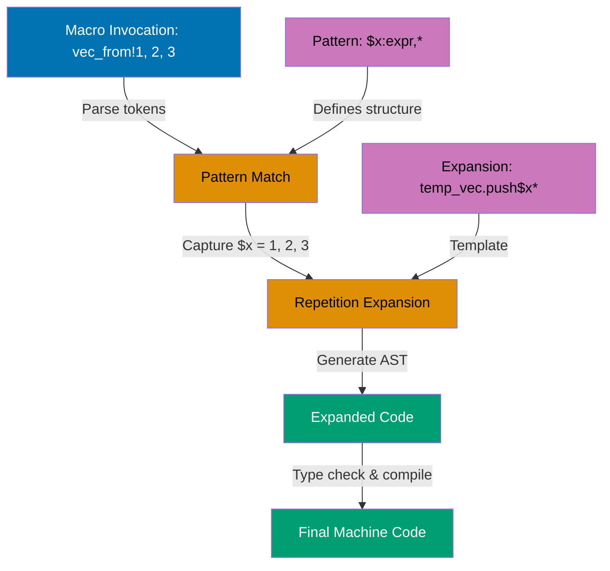
```mermaid
%% Macro expansion process showing compile-time transformation
graph TD
    A[Macro Invocation: vec_from!1, 2, 3] -->|Parse tokens| B[Pattern Match]
    B -->|Capture $x = 1, 2, 3| C[Repetition Expansion]
    C -->|Generate AST| D[Expanded Code]
    D -->|Type check & compile| E[Final Machine Code]

    F[Pattern: $x:expr,*] -->|Defines structure| B
    G[Expansion: temp_vec.push$x*] -->|Template| C

    style A fill:#0173B2,color:#fff
    style B fill:#DE8F05,color:#000
    style C fill:#DE8F05,color:#000
    style D fill:#029E73,color:#fff
    style E fill:#029E73,color:#fff
    style F fill:#CC78BC,color:#000
    style G fill:#CC78BC,color:#000
```

```rust
macro_rules! vec_from {              // => Define declarative macro named "vec_from"
                                     // => macro_rules! is Rust's declarative macro system
    ( $( $x:expr ),* ) => {          // => Pattern: match comma-separated expressions
                                     // => $(...),* means: repeat pattern for each comma-separated item
                                     // => $x:expr captures each expression (type: expr fragment)
                                     // => , after $x means literal comma separator
                                     // => * means zero or more repetitions
        {                            // => Expansion block: generated code
                                     // => Braces create expression block
            let mut temp_vec = Vec::new(); // => Create empty Vec<T> (type inferred from usage)
                                     // => Mutable because push mutates
            $(                       // => Repetition: repeat for each captured $x
                                     // => Matches * from pattern
                temp_vec.push($x);   // => Push each expression into vector
                                     // => $x replaced with captured expression
            )*                       // => End repetition block
                                     // => Generates one push per input item
            temp_vec                 // => Return the constructed vector
                                     // => Expression without semicolon (return value)
        }
    };                               // => Pattern-expansion pair ends
}                                    // => Macro definition complete

fn main() {                          // => Program entry point
    let v = vec_from![1, 2, 3];      // => Macro invocation: matches pattern with $x = 1, 2, 3
                                     // => Square brackets [] used for macro call
                                     // => Expands to: { let mut temp_vec = Vec::new();
                                     // =>              temp_vec.push(1);
                                     // =>              temp_vec.push(2);
                                     // =>              temp_vec.push(3);
                                     // =>              temp_vec }
                                     // => Type inference: Vec<i32> from pushed integers
                                     // => Expansion happens at compile time
    println!("{:?}", v);             // => Debug formatting for vector
                                     // => Output: [1, 2, 3]

    let v2 = vec_from!["a", "b"];    // => Same macro with different types
                                     // => Pattern matches any expression type
                                     // => Type inference: Vec<&str> from pushed strings
    println!("{:?}", v2);            // => Debug formatting
                                     // => Output: ["a", "b"]
                                     // => Macro is generic through type inference
}                                    // => Vectors dropped, memory freed

// Common pattern: DSL creation (Domain-Specific Language)
macro_rules! hashmap {               // => Macro for HashMap literal syntax
                                     // => Creates DSL for hashmap initialization
    ( $( $key:expr => $val:expr ),* ) => {
                                     // => Pattern: key => value pairs, comma-separated
                                     // => $key:expr captures key expression
                                     // => $val:expr captures value expression
                                     // => => is custom separator token (part of pattern)
                                     // => Allows custom syntax in Rust
        {                            // => Expansion block
            let mut map = std::collections::HashMap::new();
                                     // => Create empty HashMap (types inferred)
                                     // => std::collections::HashMap is full path
            $(                       // => Repeat for each key-value pair
                                     // => Matches * from pattern
                map.insert($key, $val); // => Insert each pair into map
                                     // => $key and $val replaced
            )*                       // => End repetition
                                     // => Generates one insert per pair
            map                      // => Return constructed map
                                     // => Ownership transferred to caller
        }
    };
}

fn use_hashmap_macro() {             // => Function demonstrating hashmap macro
    let map = hashmap![               // => Macro call with key => value syntax
                                     // => DSL syntax looks native to Rust
        "a" => 1,                     // => First pair: "a" (key) => 1 (value)
                                     // => Comma separates pairs
        "b" => 2                      // => Second pair: "b" => 2
                                     // => No trailing comma (optional)
    ];                                // => Type: HashMap<&str, i32>
                                     // => Type inference from usage
    println!("{:?}", map);            // => Debug formatting for HashMap
                                     // => Output: {"a": 1, "b": 2} (or {"b": 2, "a": 1})
                                      // => HashMap iteration order is not guaranteed

    // Using with different types
    let map2 = hashmap![              // => Same macro, different types
                                     // => Macro is type-generic
        1 => "one",                   // => Type: HashMap<i32, &str>
                                     // => Key type i32, value type &str
        2 => "two"                    // => Second pair
    ];
    println!("{:?}", map2);           // => Debug formatting
                                     // => Output: {1: "one", 2: "two"}
}                                    // => Maps dropped, memory freed

// Multiple pattern arms (like match expressions)
macro_rules! create_function {       // => Macro with multiple patterns
                                     // => Works like match expression
    ($func_name:ident) => {           // => First arm: Single identifier pattern
                                      // => Matches function name only (no args)
                                      // => $func_name:ident captures function name
        fn $func_name() {             // => Generate function with captured name
                                     // => No parameters
            println!("Called function {:?}()", stringify!($func_name));
                                      // => stringify! converts ident to string literal
                                      // => Compile-time token-to-string conversion
        }
    };

    ($func_name:ident, $($arg:ident : $arg_type:ty),*) => {
                                      // => Second arm: Pattern with parameters
                                      // => $arg:ident for parameter names
                                      // => $arg_type:ty for parameter types
                                      // => ty fragment matches type syntax
        fn $func_name($($arg: $arg_type),*) {
                                      // => Generate function signature
                                      // => Repeats parameters
            println!("Called function {:?} with args", stringify!($func_name));
                                      // => Generic message (doesn't print args)
        }
    };
}

create_function!(foo);                // => Matches first arm (no args)
                                     // => Expands to: fn foo() { println!(...); }
create_function!(bar, x: i32, y: i32); // => Matches second arm (has args)
                                     // => Expands to: fn bar(x: i32, y: i32) { println!(...); }

fn test_created_functions() {       // => Function to test generated functions
    foo();                            // => Calls generated foo function
                                     // => Output: Called function "foo"()
    bar(1, 2);                        // => Calls generated bar with arguments
                                     // => Output: Called function "bar" with args
}                                    // => Generated functions are real Rust functions

// Demonstrating fragment specifiers
macro_rules! show_fragments {        // => Macro showing different fragment types
                                     // => Multiple arms for different patterns
    ($e:expr) => {                    // => expr: expression (1+2, foo(), etc.)
                                     // => Matches any valid Rust expression
        println!("Expression: {}", $e);
                                     // => Evaluates and prints expression
    };
    ($i:ident) => {                   // => ident: identifier (variable/function name)
                                     // => Matches bare identifiers only
        println!("Identifier: {}", stringify!($i));
                                     // => Converts identifier to string
    };
    ($t:ty) => {                      // => ty: type (i32, String, etc.)
                                     // => Matches type syntax
        println!("Type: {}", stringify!($t));
                                     // => Type converted to string
    };
    ($p:pat) => {                     // => pat: pattern (match arm patterns)
                                     // => Matches pattern syntax
        println!("Pattern: {}", stringify!($p));
                                     // => Pattern converted to string
    };
    ($($x:tt)*) => {                  // => tt: token tree (any token sequence)
                                     // => Most permissive fragment
                                     // => Matches any valid tokens
        println!("Token tree: {}", stringify!($($x)*));
                                     // => Entire token sequence to string
    };
}

// Advanced: recursive macros
macro_rules! count {                 // => Recursive macro for compile-time counting
                                     // => Demonstrates macro recursion
    () => { 0 };                      // => Base case: empty input = 0
                                     // => Terminates recursion
    ($head:expr) => { 1 };            // => Single element = 1
                                     // => Second base case
    ($head:expr, $($tail:expr),*) => { // => Multiple elements (recursive case)
                                     // => $head is first element
                                     // => $tail captures rest
        1 + count!($($tail),*)        // => 1 + count of tail (recursive expansion)
                                     // => Macro calls itself
    };                                // => Compile-time recursion (expanded by compiler)
}                                    // => Recursion depth limited by compiler

fn test_count() {                    // => Function testing count macro
    let n1 = count!();                // => 0 (empty)
                                     // => Matches first base case
    let n2 = count!(1);               // => 1 (single element)
                                     // => Matches second base case
    let n3 = count!(1, 2, 3);         // => 3 (1 + count!(2, 3) = 1 + 1 + 1)
                                     // => Recursively expands: 1 + (1 + (1 + 0))
    println!("Counts: {}, {}, {}", n1, n2, n3);
                                      // => Formats all count results
                                      // => Output: Counts: 0, 1, 3
}                                    // => All compile-time work, zero runtime cost

// Hygiene: macros have lexical scope hygiene
macro_rules! make_binding {          // => Macro demonstrating hygiene
                                     // => Hygiene prevents variable capture
    ($name:ident, $value:expr) => {  // => Captures binding name and value
        let $name = $value;           // => Create binding in macro invocation scope
                                     // => Binding visible at call site
    };
}

fn test_hygiene() {                  // => Function testing macro hygiene
    make_binding!(x, 42);             // => Expands to: let x = 42; (in this scope)
                                     // => Creates x in this function's scope
    println!("x = {}", x);            // => x is accessible in this scope
                                     // => Output: x = 42 (x is accessible here)
                                      // => Hygiene: intermediate variables in macro don't leak
                                     // => Unlike C macros, no unexpected captures
}                                    // => x dropped, scope ends
```

**Key Takeaway**: `macro_rules!` enables compile-time code generation through pattern matching on token trees, reducing boilerplate and creating domain-specific syntax within Rust.

**Why It Matters**: Declarative macros provide metaprogramming with hygiene and type safety unlike C macros, enabling domain-specific syntax without runtime overhead. The vec! macro and assert_eq! demonstrate how macros reduce boilerplate while expanding to optimal code at compile time—combining the ergonomics of dynamic languages with zero-cost abstraction impossible in languages without compile-time metaprogramming.

---

## Example 64: Procedural Macros Introduction

Procedural macros operate on AST (Abstract Syntax Tree) level, enabling custom derives, attribute macros, and function-like macros with full Rust code manipulation.

```rust
// In a separate crate (proc-macro = true in Cargo.toml)
// Cargo.toml requires: [lib] proc-macro = true
use proc_macro::TokenStream;         // => TokenStream: stream of tokens from Rust code
                                     // => Input: tokens from item being derived
                                     // => Output: generated Rust code as tokens
use quote::quote;                    // => quote! macro: generate Rust code easily
                                     // => Converts Rust syntax to TokenStream
use syn;                             // => syn: parse TokenStream into AST (Abstract Syntax Tree)
                                     // => Provides data structures for Rust syntax

#[proc_macro_derive(HelloMacro)]     // => Derive macro: generates impl for #[derive(HelloMacro)]
                                     // => Registered name: HelloMacro (used in #[derive(...)])
pub fn hello_macro_derive(input: TokenStream) -> TokenStream {
                                     // => input: tokens from struct/enum being derived
                                     // => Example: struct Pancakes; becomes TokenStream
    let ast = syn::parse(input).unwrap();
                                     // => Parse input TokenStream into DeriveInput AST
                                     // => ast contains: struct name, fields, generics, etc.
                                     // => unwrap() panics on parse error (compile error)
    impl_hello_macro(&ast)           // => Generate impl code, returns TokenStream
}

fn impl_hello_macro(ast: &syn::DeriveInput) -> TokenStream {
                                     // => DeriveInput: parsed representation of item
                                     // => Contains: ident (name), data (fields), generics, attrs
    let name = &ast.ident;           // => Extract struct/enum name (e.g., "Pancakes")
                                     // => Type: &Ident (identifier token)
    let gen = quote! {               // => quote! macro: generates Rust code
                                     // => #name interpolates the identifier
        impl HelloMacro for #name {  // => Generate: impl HelloMacro for Pancakes {
            fn hello_macro() {       // => Method required by HelloMacro trait
                println!("Hello, Macro! My name is {}!", stringify!(#name));
                                     // => stringify!(#name) converts Pancakes to "Pancakes"
            }                        // => Final: println!("Hello, Macro! My name is Pancakes!")
        }
    };                               // => gen is proc_macro2::TokenStream (quote's version)
    gen.into()                       // => Convert to proc_macro::TokenStream (compiler's version)
                                     // => Returns generated impl to compiler
}

// Usage in another crate (the one using the derive)
trait HelloMacro {                   // => Trait that proc macro implements
    fn hello_macro();                // => Method signature (must match macro output)
}

#[derive(HelloMacro)]                // => Invokes hello_macro_derive at compile time
                                     // => Passes "struct Pancakes;" as TokenStream to macro
struct Pancakes;                     // => Zero-sized struct (no fields)
                                     // => Macro generates: impl HelloMacro for Pancakes { ... }

fn main() {
    Pancakes::hello_macro();         // => Call generated method
                                     // => Output: Hello, Macro! My name is Pancakes!
                                     // => Method exists because derive macro generated impl
}

// More complex example: derive with field access
// #[proc_macro_derive(Builder)]
// pub fn derive_builder(input: TokenStream) -> TokenStream {
//     let ast = syn::parse(input).unwrap(); // => Parse struct definition
//     let name = &ast.ident;                // => Get struct name
//     let fields = match &ast.data {
//         syn::Data::Struct(s) => &s.fields, // => Extract fields from struct
//         _ => panic!("Builder only works on structs"),
//     };
//
//     let builder_fields = fields.iter().map(|f| {
//         let name = &f.ident;              // => Field name
//         let ty = &f.ty;                   // => Field type
//         quote! {
//             pub fn #name(mut self, #name: #ty) -> Self {
//                 self.#name = Some(#name);  // => Builder setter method
//                 self
//             }
//         }
//     });                                    // => Generate setter for each field
//
//     let gen = quote! {
//         impl #name {
//             #(#builder_fields)*            // => Repeat setter methods
//         }
//     };
//     gen.into()
// }                                          // => Usage: #[derive(Builder)] struct Config { ... }

// Attribute macro example (different type of proc macro)
// #[proc_macro_attribute]
// pub fn log_calls(attr: TokenStream, item: TokenStream) -> TokenStream {
//                                            // => attr: attributes in #[log_calls(level = "info")]
//                                            // => item: function being annotated
//     let input = syn::parse_macro_input!(item as syn::ItemFn);
//                                            // => Parse as function item
//     let name = &input.sig.ident;           // => Function name
//     let block = &input.block;              // => Function body
//
//     let gen = quote! {
//         fn #name() {
//             println!("Calling function: {}", stringify!(#name));
//             #block                         // => Original function body
//         }
//     };                                     // => Wraps function with logging
//     gen.into()
// }                                          // => Usage: #[log_calls] fn foo() { ... }

// Function-like macro example (third type of proc macro)
// #[proc_macro]
// pub fn sql(input: TokenStream) -> TokenStream {
//                                            // => input: everything inside sql!(...)
//     let query: LitStr = syn::parse(input).unwrap();
//                                            // => Parse as string literal
//     let query_str = query.value();         // => Extract string content
//
//     // Validate SQL at compile time
//     validate_sql(&query_str).expect("Invalid SQL");
//
//     quote! {
//         execute_query(#query)              // => Generate runtime code
//     }.into()
// }                                          // => Usage: sql!("SELECT * FROM users")
```

**Key Takeaway**: Procedural macros operate on parsed syntax trees enabling powerful code generation for custom derives, attributes, and function-like macros, with full access to Rust's AST.

**Why It Matters**: Procedural macros enable framework-level code generation with full AST access, providing the power of reflection without runtime cost. Serde's derive macros generate optimal serialization code by analyzing struct fields at compile time, matching hand-written performance while eliminating boilerplate—achieving productivity impossible in languages relying on runtime reflection.

---

## Example 65: Async/Await Basics

Async/await enables writing asynchronous code that looks synchronous, using `async fn` and `.await` for non-blocking operations.

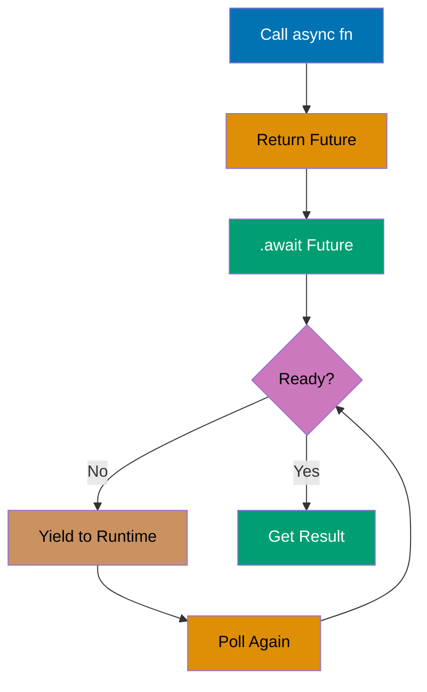
```mermaid
graph TD
    A[Call async fn] --> B[Return Future]
    B --> C[.await Future]
    C --> D{Ready?}
    D -->|No| E[Yield to Runtime]
    D -->|Yes| F[Get Result]
    E --> G[Poll Again]
    G --> D

    style A fill:#0173B2,color:#fff
    style B fill:#DE8F05,color:#000
    style C fill:#029E73,color:#fff
    style D fill:#CC78BC,color:#000
    style E fill:#CA9161,color:#000
    style F fill:#029E73,color:#fff
    style G fill:#DE8F05,color:#000
```

```rust
use std::time::Duration;             // => Duration: time span (milliseconds, seconds, etc.)

async fn say_hello() {               // => async fn: returns impl Future<Output = ()>
                                     // => Calling this function does NOT execute it immediately
                                     // => Returns a Future that must be .await-ed
    println!("Hello");               // => Executes when future is polled (not at call site)
}                                    // => Future completes immediately (no await points)

async fn say_world() {               // => Another async function
    tokio::time::sleep(Duration::from_millis(100)).await;
                                     // => sleep() returns a Future that completes after 100ms
                                     // => .await suspends execution until Future is ready
                                     // => Yields control to Tokio runtime (non-blocking)
                                     // => Other tasks can run during this 100ms
    println!("World");               // => Executes after 100ms delay
}                                    // => Future<Output = ()> completes after printing

#[tokio::main]                       // => Proc macro: creates Tokio runtime and runs async main
                                     // => Expands to: fn main() { tokio::runtime::Runtime::new()
                                     // =>                .unwrap().block_on(async { ... }) }
async fn main() {                    // => Main is async (requires runtime to execute)
    say_hello().await;               // => Call say_hello(), returns Future
                                     // => .await polls the Future until completion
                                     // => Output: Hello (prints immediately - no await points inside)
                                     // => Execution continues after Future completes

    say_world().await;               // => Call say_world(), returns Future
                                     // => .await starts executing the Future
                                     // => Yields to runtime during sleep (100ms)
                                     // => Output: World (after 100ms delay)
                                     // => Main thread not blocked - runtime can run other tasks
}                                    // => Total time: ~100ms (not 0 + 100 sequentially blocked)

// Demonstrating Future is lazy (does nothing until awaited)
async fn demonstrate_lazy() {
    let future = say_hello();        // => Create Future (NOT executed yet!)
                                     // => No "Hello" printed at this line
    println!("Future created but not executed");
                                     // => Output: Future created but not executed

    future.await;                    // => NOW Future executes
                                     // => Output: Hello (happens here, not at creation)
}

// Multiple await points in single function
async fn multi_step() {
    println!("Step 1");              // => Output: Step 1 (synchronous)

    tokio::time::sleep(Duration::from_millis(50)).await;
                                     // => First await point: yields for 50ms
    println!("Step 2");              // => Output: Step 2 (after 50ms)

    tokio::time::sleep(Duration::from_millis(50)).await;
                                     // => Second await point: yields for another 50ms
    println!("Step 3");              // => Output: Step 3 (after total 100ms)
}                                    // => Function suspends/resumes twice during execution

// Return values from async functions
async fn compute() -> i32 {          // => Returns Future<Output = i32>
    tokio::time::sleep(Duration::from_millis(10)).await;
                                     // => Simulate async work (I/O, network, etc.)
    42                               // => Return value (wrapped in Future)
}

async fn use_computed_value() {
    let result = compute().await;    // => .await unwraps Future to get i32
                                     // => result is i32, not Future<Output = i32>
    println!("Computed: {}", result); // => Output: Computed: 42
                                     // => Can use result directly (no Future wrapper)
}

// Error handling with async
async fn might_fail() -> Result<String, &'static str> {
                                     // => Returns Future<Output = Result<String, &str>>
    tokio::time::sleep(Duration::from_millis(10)).await;
    Ok(String::from("Success"))      // => Return Ok variant
    // Err("Something went wrong")   // => Or Err variant
}

async fn handle_async_result() {
    match might_fail().await {       // => .await gets Result<String, &str>
                                     // => Pattern match on Result (not Future)
        Ok(value) => println!("Got: {}", value),
                                     // => Output: Got: Success
        Err(e) => println!("Error: {}", e),
    }                                // => Error propagation works with ? operator too

    // Using ? operator with async
    // let value = might_fail().await?; // => Propagate error up the call stack
    //                                  // => Works like sync code with Result
}
```

**Key Takeaway**: Async/await syntax enables writing asynchronous code with synchronous structure, with `async fn` returning futures and `.await` yielding to the runtime until futures complete.

**Why It Matters**: Async/await compiles to state machines without allocation overhead, enabling millions of concurrent tasks on a single thread impossible with OS threads. Discord handles millions of concurrent WebSocket connections using async Rust with memory usage of 120KB per million connections—three orders of magnitude more efficient than thread-per-connection models in Java or Go.

---

## Example 66: Futures and Executors

Futures are lazy computations that require an executor to poll them to completion, with Tokio being the most common runtime.

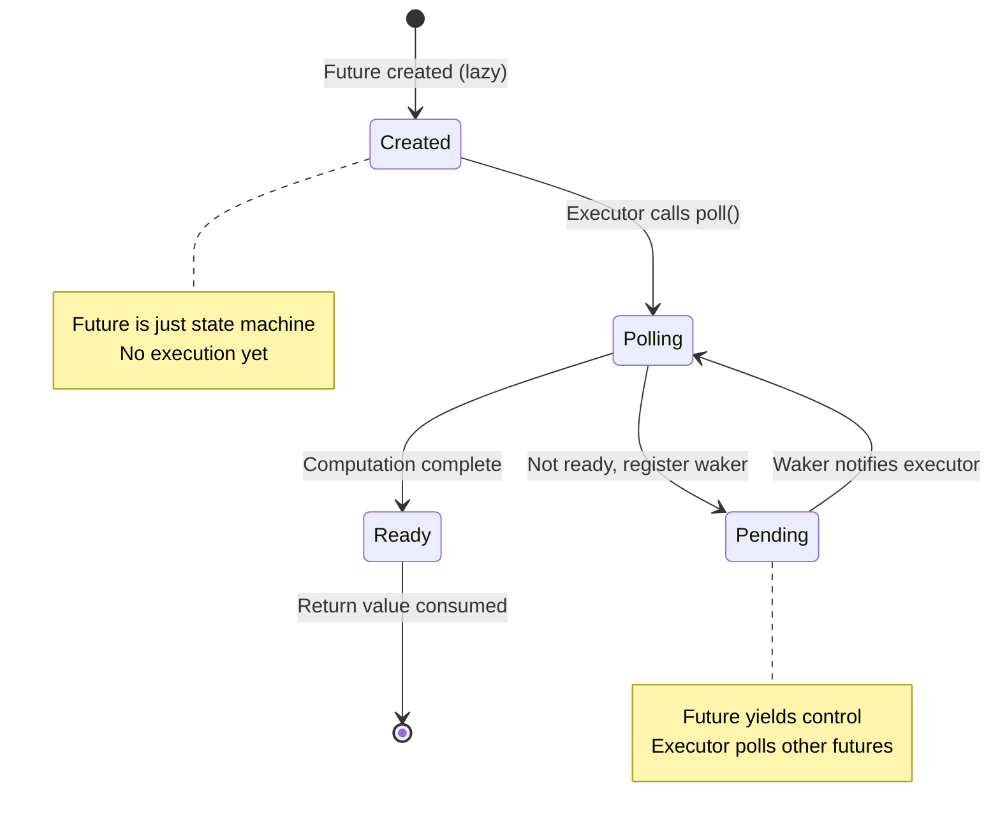
```mermaid
%% Future state machine and executor polling cycle
stateDiagram-v2
    [*] --> Created: Future created (lazy)
    Created --> Polling: Executor calls poll()
    Polling --> Pending: Not ready, register waker
    Polling --> Ready: Computation complete
    Pending --> Polling: Waker notifies executor
    Ready --> [*]: Return value consumed

    note right of Created
        Future is just state machine
        No execution yet
    end note

    note right of Pending
        Future yields control
        Executor polls other futures
    end note
```

```rust
use tokio::time::{sleep, Duration};  // => sleep: async sleep function
                                     // => Returns Future that completes after duration

async fn do_work(id: u32) -> u32 {   // => Async function: returns Future<Output = u32>
    println!("Task {} started", id); // => Prints when Future is first polled
                                     // => id is captured in the Future (closure-like)
    sleep(Duration::from_millis(100)).await;
                                     // => Suspends for 100ms (non-blocking)
                                     // => Future yields control to executor
    println!("Task {} finished", id); // => Resumes after 100ms, prints completion
    id * 2                           // => Return value: id doubled (e.g., 1 * 2 = 2)
}                                    // => Future completes with value id * 2

#[tokio::main]                       // => Creates Tokio runtime (multi-threaded by default)
                                     // => Runtime has executor that polls Futures
async fn main() {
    // Creating futures (lazy - not executed yet!)
    let future1 = do_work(1);        // => future1 is Future<Output = u32>, NOT executed
                                     // => NO "Task 1 started" printed here
    let future2 = do_work(2);        // => future2 is Future<Output = u32>, NOT executed
                                     // => NO "Task 2 started" printed here
                                     // => Futures are just state machines waiting to be polled

    println!("Futures created, now joining...");
                                     // => Output: Futures created, now joining...
                                     // => Neither future has started yet (lazy evaluation)

    // Futures are lazy - not executed until awaited
    let (result1, result2) = tokio::join!(future1, future2);
                                     // => tokio::join! polls both Futures concurrently
                                     // => Both start executing (prints "Task 1 started", "Task 2 started")
                                     // => When one sleeps, executor polls the other
                                     // => Total time: ~100ms (not 200ms) due to concurrency
                                     // => Output order: "Task 1 started", "Task 2 started",
                                     // =>              (100ms later) "Task 1 finished", "Task 2 finished"
                                     // => result1 is 2 (1 * 2), result2 is 4 (2 * 2)
    println!("Results: {} and {}", result1, result2);
                                     // => Output: Results: 2 and 4
                                     // => Both futures completed, values extracted
}

// Understanding polling mechanism (under the hood)
use std::future::Future;
use std::pin::Pin;
use std::task::{Context, Poll};

// Simplified Future implementation (what async fn generates)
struct DelayedValue {
    value: u32,
    ready: bool,                     // => Tracks if Future is ready
}

impl Future for DelayedValue {       // => Implement Future trait manually
    type Output = u32;               // => Future completes with u32

    fn poll(mut self: Pin<&mut Self>, cx: &mut Context<'_>) -> Poll<Self::Output> {
                                     // => Executor calls poll() repeatedly
                                     // => cx: contains Waker to notify executor when ready
        if self.ready {              // => Check if Future is ready
            Poll::Ready(self.value)  // => Return Ready with value (Future completes)
        } else {
            self.ready = true;       // => Mark as ready for next poll
            cx.waker().wake_by_ref(); // => Wake executor to poll again
            Poll::Pending            // => Not ready yet, return Pending
        }                            // => Executor will poll again later
    }
}

// Demonstrating sequential vs concurrent execution
async fn demonstrate_timing() {
    use std::time::Instant;

    // Sequential execution (one after another)
    let start = Instant::now();      // => Start timer
    do_work(1).await;                // => Executes first task (100ms)
    do_work(2).await;                // => Then executes second task (100ms)
    let seq_time = start.elapsed();  // => Total: ~200ms (100 + 100)
    println!("Sequential: {:?}", seq_time);
                                     // => Output: Sequential: ~200ms

    // Concurrent execution (both at same time)
    let start = Instant::now();      // => Reset timer
    tokio::join!(do_work(1), do_work(2));
                                     // => Both execute concurrently
    let conc_time = start.elapsed(); // => Total: ~100ms (max of 100 and 100)
    println!("Concurrent: {:?}", conc_time);
                                     // => Output: Concurrent: ~100ms
                                     // => 2x faster with concurrency!
}

// Runtime vs executor vs future relationship
// 1. Runtime (Tokio): provides executor + timer + I/O reactor
// 2. Executor: polls Futures until completion
// 3. Future: state machine that yields when not ready
//
// Flow:
// async fn -> compiler generates Future (state machine)
// .await -> tells executor to poll Future
// Executor -> calls Future::poll() repeatedly
// Future -> returns Pending (yield) or Ready(value) (complete)
// If Pending -> executor schedules Future for later polling
// If Ready -> executor extracts value and continues
```

**Key Takeaway**: Futures are lazy computations requiring an executor to poll them, with combinators like `tokio::join!` enabling concurrent execution of multiple futures on a single thread.

**Why It Matters**: Lazy futures with explicit executor selection enable zero-cost async abstraction where futures compile to state machines with no allocation overhead. Tokio's async runtime achieves 1M+ concurrent connections per server through lazy futures that only allocate when polled—efficiency impossible with eager promises in JavaScript or goroutines with mandatory stack allocation in Go.

---

## Example 67: Async Concurrency with Join

`tokio::join!` runs multiple futures concurrently on the same task, enabling efficient concurrent execution without spawning threads.


```mermaid
%% tokio::join! concurrent execution timeline
gantt
    title Concurrent Execution with tokio::join!
    dateFormat SSS
    axisFormat %Lms

    section Task 1
    Sleep 100ms :done, t1, 000, 100ms
    Complete    :milestone, 100

    section Task 2
    Sleep 50ms  :done, t2, 000, 50ms
    Complete    :milestone, 50
    Wait for Task 1 :crit, 050, 50ms

    section Total
    Total Time  :active, 000, 100ms
```

```rust
use tokio::time::{sleep, Duration};  // => Async sleep (non-blocking)
                                     // => Import Tokio's time utilities for async delays
                                     // => tokio::time::sleep is async equivalent of std::thread::sleep

async fn task1() -> u32 {            // => First async task
                                     // => async keyword makes function return Future
                                     // => Returns Future<Output = u32> when called
                                     // => Function doesn't run until awaited
    sleep(Duration::from_millis(100)).await;
                                     // => Sleep 100ms (yields to runtime)
                                     // => .await suspends this future
                                     // => Suspends execution, allows other tasks to run
                                     // => Non-blocking: thread can do other work
    println!("Task 1 done");         // => Prints after 100ms
                                     // => Resumes execution after sleep completes
    1                                // => Returns 1
                                     // => Return value wrapped in Future
}

async fn task2() -> u32 {            // => Second async task (faster)
                                     // => Returns Future<Output = u32> when called
                                     // => Identical pattern to task1
    sleep(Duration::from_millis(50)).await;
                                     // => Sleep 50ms (yields to runtime)
                                     // => Shorter duration than task1
                                     // => Finishes in half the time of task1
    println!("Task 2 done");         // => Prints after 50ms
                                     // => Will print before task1
    2                                // => Returns 2
                                     // => Different return value
}

#[tokio::main]                       // => Attribute macro: Creates Tokio multi-threaded runtime
                                     // => Transforms main into async context
                                     // => Enables async/await in main function
                                     // => Equivalent to tokio::runtime::Builder setup
async fn main() {                    // => main is now async, returns Future<Output = ()>
                                     // => Attribute makes this the entry point
    // tokio::join! runs futures concurrently on SAME task/thread
    let (r1, r2) = tokio::join!(task1(), task2());
                                     // => tokio::join! is macro for concurrent execution
                                     // => Calls task1() and task2() to create futures
                                     // => Start both tasks at time 0
                                     // => Macro polls both futures cooperatively
                                     // => Destructures results into (r1, r2) tuple
                                     // => t=0ms: both tasks start sleeping
                                     // => Runtime schedules both futures
                                     // => t=50ms: task2 completes, prints "Task 2 done"
                                     // => task1 still sleeping (50ms remaining)
                                     // => t=100ms: task1 completes, prints "Task 1 done"
                                     // => Total time: 100ms (not 150ms - concurrent!)
                                     // => Concurrent execution saves 50ms
                                     // => Output order: "Task 2 done" (first), then "Task 1 done"
                                     // => r1 = 1, r2 = 2 (both values available)
                                     // => Type: (u32, u32) from join! destructuring

    println!("Results: {} + {} = {}", r1, r2, r1 + r2);
                                     // => Formats results into string
                                     // => Output: Results: 1 + 2 = 3
                                     // => Both tasks completed, sum computed
}                                    // => Runtime shuts down after main returns
                                     // => All async tasks must complete before exit

// Demonstrating join! behavior with multiple tasks
async fn multi_join() {              // => Function demonstrating multiple concurrent tasks
                                     // => Shows join! scales to many futures
    use std::time::Instant;          // => Import for timing measurement
                                     // => Instant tracks elapsed time

    async fn work(id: u32, ms: u64) -> u32 {
                                     // => Generic async work function
                                     // => id identifies task, ms is duration
        sleep(Duration::from_millis(ms)).await;
                                     // => Sleeps for specified milliseconds
                                     // => Yields to runtime during sleep
        println!("Task {} done ({}ms)", id, ms);
                                     // => Prints when task completes
                                     // => Order depends on sleep duration
        id                           // => Returns task id
                                     // => Value collected by join!
    }

    let start = Instant::now();      // => Record start time
                                     // => For measuring concurrent execution time
    let (a, b, c, d) = tokio::join!(  // => Join 4 futures concurrently
                                     // => Returns tuple of 4 results
        work(1, 100),                // => Sleeps 100ms
                                     // => Second longest task
        work(2, 50),                 // => Sleeps 50ms (finishes first)
                                     // => Shortest duration
        work(3, 75),                 // => Sleeps 75ms
                                     // => Medium duration
        work(4, 120),                // => Sleeps 120ms (finishes last)
                                     // => Longest duration determines total time
    );                               // => All run concurrently
                                     // => join! polls all futures in rotation
                                     // => Total time: max(100, 50, 75, 120) = 120ms
                                     // => NOT 100+50+75+120 = 345ms (would be sequential)
                                     // => Concurrent execution is 2.87x faster
    let elapsed = start.elapsed();   // => Calculate elapsed time
                                     // => Duration from start to now
    println!("Completed {} tasks in {:?}", a+b+c+d, elapsed);
                                     // => a=1, b=2, c=3, d=4 from work() returns
                                     // => Output: Completed 10 tasks in ~120ms
                                     // => 10 = 1+2+3+4 (all tasks completed)
}                                    // => Demonstrates concurrent efficiency gain

// Comparing join! vs spawn (different concurrency models)
async fn join_vs_spawn() {          // => Demonstrates two concurrency patterns
                                     // => join! vs spawn comparison
    // tokio::join! - same task, cooperative concurrency
    let (r1, r2) = tokio::join!(     // => Concurrent execution on same task
                                     // => Cooperative multitasking
        async { sleep(Duration::from_millis(10)).await; 1 },
                                     // => Inline async block
                                     // => Sleeps 10ms, returns 1
        async { sleep(Duration::from_millis(10)).await; 2 },
                                     // => Second inline async block
                                     // => Sleeps 10ms, returns 2
    );                               // => Both run on SAME async task
                                     // => Yields between tasks when awaiting
                                     // => Single-threaded concurrency (like async/await in JS)
                                     // => Results: r1=1, r2=2
    println!("join!: {} + {}", r1, r2);
                                     // => Output: join!: 1 + 2

    // tokio::spawn - separate tasks, can run on different threads
    let h1 = tokio::spawn(async {    // => Spawns INDEPENDENT task
                                     // => Returns JoinHandle<T>
        sleep(Duration::from_millis(10)).await;
                                     // => Sleep in separate task
        1                            // => Task returns 1
    });                              // => Spawns independent task (like thread::spawn)
                                     // => Task scheduled on runtime thread pool
    let h2 = tokio::spawn(async {    // => Spawns SECOND independent task
        sleep(Duration::from_millis(10)).await;
                                     // => Sleep in another separate task
        2                            // => Task returns 2
    });                              // => Spawns another independent task
                                     // => Can run on different OS threads (if multi-threaded runtime)
                                     // => Both tasks can execute truly parallel on different cores
    let r1 = h1.await.unwrap();      // => Wait for task 1 completion
                                     // => JoinHandle::await returns Result<T, JoinError>
                                     // => unwrap() panics if task panicked
    let r2 = h2.await.unwrap();      // => Wait for task 2 completion
                                     // => Both tasks already running concurrently
    println!("spawn: {} + {}", r1, r2);
                                     // => Output: spawn: 1 + 2
}                                    // => join! for same-task concurrency, spawn for independent tasks

// Error handling with join!
async fn join_with_errors() {       // => Demonstrates error handling with concurrent futures
                                     // => join! doesn't short-circuit on error
    async fn may_fail(id: u32) -> Result<u32, &'static str> {
                                     // => Async function returning Result
                                     // => Simulates fallible async operation
        sleep(Duration::from_millis(10)).await;
                                     // => Simulate async work
        if id == 2 {                 // => Conditional failure
            Err("Task 2 failed!")    // => Second task returns error
                                     // => Error case
        } else {
            Ok(id)                   // => Other tasks succeed
                                     // => Success case returns id
        }
    }

    let (r1, r2, r3) = tokio::join!( // => Join three potentially-failing futures
                                     // => Each result is independent Result<T, E>
        may_fail(1),                 // => Ok(1)
                                     // => First task succeeds
        may_fail(2),                 // => Err("Task 2 failed!")
                                     // => Second task fails
        may_fail(3),                 // => Ok(3)
                                     // => Third task succeeds
    );                               // => All complete, even if some fail
                                     // => join! waits for ALL futures (not short-circuit)
                                     // => Type: (Result<u32, &str>, Result<u32, &str>, Result<u32, &str>)

    println!("Results: {:?}, {:?}, {:?}", r1, r2, r3);
                                     // => Debug formatting for all results
                                     // => Output: Results: Ok(1), Err("Task 2 failed!"), Ok(3)
                                     // => All results available (error doesn't cancel others)
}                                    // => Caller must handle each Result independently

// try_join! - short-circuit on error
async fn try_join_example() {       // => Demonstrates try_join! error handling
                                     // => Different from join!: short-circuits on first error
    async fn may_fail(id: u32) -> Result<u32, &'static str> {
                                     // => Async function returning Result
                                     // => Variable sleep duration based on id
        sleep(Duration::from_millis(10 * id as u64)).await;
                                     // => Sleep duration: id * 10ms
                                     // => id=1: 10ms, id=2: 20ms, id=3: 30ms
        if id == 2 { Err("Failed!") } else { Ok(id) }
                                     // => Task 2 fails, others succeed
    }

    // try_join! returns Result - Err if ANY future fails
    let result = tokio::try_join!(   // => Returns Result<(T, U, V), E>
                                     // => Short-circuits on first error
        may_fail(1),                 // => Ok(1) after 10ms
                                     // => First task succeeds
        may_fail(2),                 // => Err("Failed!") after 20ms
                                     // => Second task fails
        may_fail(3),                 // => Would be Ok(3), but never checked
                                     // => Third task still runs (futures concurrent)
    );                               // => Returns Err as soon as may_fail(2) fails
                                     // => Type: Result<(u32, u32, u32), &'static str>
                                     // => Other futures still run but result ignored

    match result {                   // => Pattern match on Result
        Ok((a, b, c)) => println!("All succeeded: {}, {}, {}", a, b, c),
                                     // => This branch never executes (task 2 fails)
        Err(e) => println!("One failed: {}", e),
                                     // => This branch executes
                                     // => e is "Failed!" from may_fail(2)
                                     // => Output: One failed: Failed!
    }
}                                    // => try_join! for fail-fast concurrent operations
```

**Key Takeaway**: `tokio::join!` enables concurrent execution of multiple futures within a single task, yielding to the runtime while waiting and resuming when ready without thread spawning overhead.

**Why It Matters**: Concurrent future execution without thread spawning enables efficient parallelism for I/O-bound workloads, achieving Go-like concurrency without goroutine stack overhead. Web scrapers and API aggregators use tokio::join! to fetch hundreds of URLs concurrently on a single thread—performance matching async/await in Python or JavaScript while using 10x less memory.

---

## Example 68: Async Task Spawning

`tokio::spawn` creates new async tasks that run independently, similar to thread spawning but for async contexts.

```rust
use tokio::time::{sleep, Duration};  // => Tokio's async sleep and duration types

async fn independent_task(id: u32) { // => Async task function: returns Future<Output = ()>
                                     // => Takes id parameter for task identification
    sleep(Duration::from_millis(100)).await;
                                     // => Sleep 100ms asynchronously (yields to runtime)
                                     // => Non-blocking: other tasks can run during sleep
    println!("Independent task {} completed", id);
                                     // => Prints after 100ms delay
                                     // => id identifies which task completed (1 or 2)
}                                    // => Future completes after printing

#[tokio::main]                       // => Creates multi-threaded Tokio runtime
                                     // => Expands to: Runtime::new().unwrap().block_on(async { ... })
                                     // => Runtime manages thread pool and task scheduling
async fn main() {                    // => Main function is async (requires runtime)
    let handle1 = tokio::spawn(independent_task(1));
                                     // => Spawn task 1 as independent task on runtime
                                     // => Returns JoinHandle<()> (like thread::JoinHandle)
                                     // => Task starts executing IMMEDIATELY (not lazy like join!)
                                     // => Task 1 runs concurrently with main
                                     // => Can run on different thread from main
    let handle2 = tokio::spawn(independent_task(2));
                                     // => Spawn task 2 as second independent task
                                     // => Also starts immediately (concurrent with task 1 and main)
                                     // => Can run on third thread from runtime pool
                                     // => Both tasks run in parallel (multi-threaded runtime)

    println!("Main continues while tasks run");
                                     // => Output: Main continues while tasks run (prints immediately)
                                     // => Main doesn't wait for spawned tasks yet
                                     // => Tasks 1 and 2 are sleeping in background (100ms each)
                                     // => Demonstrates spawn is non-blocking

    handle1.await.unwrap();          // => Wait for task 1 to complete
                                     // => .await on JoinHandle suspends until task finishes
                                     // => unwrap() extracts () or panics if task panicked
                                     // => After ~100ms: task 1 completes, prints, returns ()
    handle2.await.unwrap();          // => Wait for task 2 to complete
                                     // => Task 2 might already be done (started same time as task 1)
                                     // => unwrap() panics if task 2 panicked
                                     // => Total time: ~100ms (both ran concurrently, not sequentially)
    println!("All tasks completed"); // => Output: All tasks completed (after both tasks done)
                                     // => Main exits after all spawned tasks finished
}

// Demonstrating spawn vs join! differences
async fn spawn_vs_join_comparison() {
    use std::time::Instant;

    // tokio::spawn - creates independent tasks (can run on different threads)
    let start = Instant::now();
    let h1 = tokio::spawn(async {    // => Task 1: independent, can move to another thread
        sleep(Duration::from_millis(100)).await;
                                     // => Sleeps 100ms on runtime thread pool
        println!("Spawned task 1");  // => Might print from different OS thread than main
        1                            // => Returns 1 (wrapped in JoinHandle<i32>)
    });
    let h2 = tokio::spawn(async {    // => Task 2: also independent
        sleep(Duration::from_millis(100)).await;
        println!("Spawned task 2");  // => Might print from yet another OS thread
        2                            // => Returns 2
    });                              // => Both tasks run on runtime thread pool (truly parallel)

    let r1 = h1.await.unwrap();      // => Wait for task 1, unwrap Result<i32, JoinError>
                                     // => r1 is i32 (1)
    let r2 = h2.await.unwrap();      // => Wait for task 2, r2 is 2
    let spawn_time = start.elapsed();// => Total: ~100ms (parallel execution)
    println!("Spawned: {} + {} in {:?}", r1, r2, spawn_time);
                                     // => Output: Spawned: 1 + 2 in ~100ms

    // tokio::join! - same task, cooperative concurrency (single async context)
    let start = Instant::now();
    let (r1, r2) = tokio::join!(
        async { sleep(Duration::from_millis(100)).await; 1 },
                                     // => Runs on SAME async task as main
        async { sleep(Duration::from_millis(100)).await; 2 },
                                     // => Also same task, cooperative multitasking
    );                               // => Might run on single OS thread (yielding between)
    let join_time = start.elapsed(); // => Also ~100ms (both sleep concurrently)
    println!("Joined: {} + {} in {:?}", r1, r2, join_time);
                                     // => Output: Joined: 1 + 2 in ~100ms
                                     // => Similar time but different concurrency model
}

// Handling task panics with JoinHandle
async fn handle_task_panic() {
    let handle = tokio::spawn(async {
        sleep(Duration::from_millis(10)).await;
        panic!("Task panicked!");   // => Task panics (doesn't crash program!)
                                     // => Panic is caught by spawn, stored in JoinHandle
    });

    match handle.await {             // => .await returns Result<T, JoinError>
        Ok(_) => println!("Task succeeded"),
        Err(e) => {                  // => e is JoinError (contains panic info)
            println!("Task panicked: {:?}", e);
                                     // => Output: Task panicked: JoinError::Panic(...)
            if e.is_panic() {        // => Check if error is due to panic
                println!("Task panic detected!");
                                     // => Panic in spawned task doesn't crash runtime
            }                        // => Other tasks continue running (isolation)
        }
    }
}

// Spawning tasks with 'static lifetime requirement
async fn spawn_static_lifetime() {
    let local_data = String::from("local");
                                     // => local_data is not 'static (lives in this function)

    // This FAILS - spawned tasks require 'static lifetime
    // let handle = tokio::spawn(async {
    //     println!("{}", local_data); // => ERROR: local_data not 'static
    // });                           // => Spawned task could outlive local_data

    // Solution 1: Move owned data into task
    let owned_data = local_data.clone();
                                     // => Clone data for ownership transfer
    let handle1 = tokio::spawn(async move {
                                     // => async move captures owned_data by value
        println!("{}", owned_data);  // => OK: owned_data is moved into 'static future
    });                              // => Task owns the data (lives as long as needed)
    handle1.await.unwrap();

    // Solution 2: Use Arc for shared ownership
    use std::sync::Arc;
    let shared_data = Arc::new(String::from("shared"));
                                     // => Arc has 'static lifetime (reference counting)
    let handle2 = tokio::spawn(async move {
        println!("{}", shared_data); // => OK: Arc is 'static, can be moved
    });                              // => Task holds Arc clone (reference counted)
    handle2.await.unwrap();
}

// Spawning CPU-bound tasks with spawn_blocking
async fn cpu_bound_tasks() {
    use tokio::task;

    // CPU-intensive work blocks async runtime
    let handle = task::spawn_blocking(|| {
                                     // => spawn_blocking: runs on dedicated thread pool
                                     // => For blocking/CPU-intensive work
        let mut sum = 0;
        for i in 0..1_000_000 {      // => CPU-bound loop (1 million iterations)
            sum += i;                // => Heavy computation
        }                            // => Would block async runtime if run normally
        sum                          // => Returns sum (wrapped in JoinHandle<i32>)
    });                              // => Runs on blocking thread pool (doesn't block async tasks)

    let result = handle.await.unwrap();
                                     // => .await on blocking task (returns when computation done)
                                     // => unwrap() extracts sum or panics
    println!("CPU result: {}", result);
                                     // => Output: CPU result: 499999500000
}
```

**Key Takeaway**: `tokio::spawn` creates independent async tasks that run concurrently on the Tokio runtime, with join handles enabling waiting for task completion similar to thread joins.

**Why It Matters**: Task spawning with Send bounds enforces thread-safety at compile time, preventing the data races common in goroutines or JavaScript Promises. Actix-web spawns independent tasks for background processing while the type system ensures no stack references escape—safety that requires runtime checks in Go or is impossible to verify statically in Node.js.

---

## Example 69: Select and Race Conditions

`tokio::select!` waits on multiple async operations simultaneously, completing when any branch is ready.

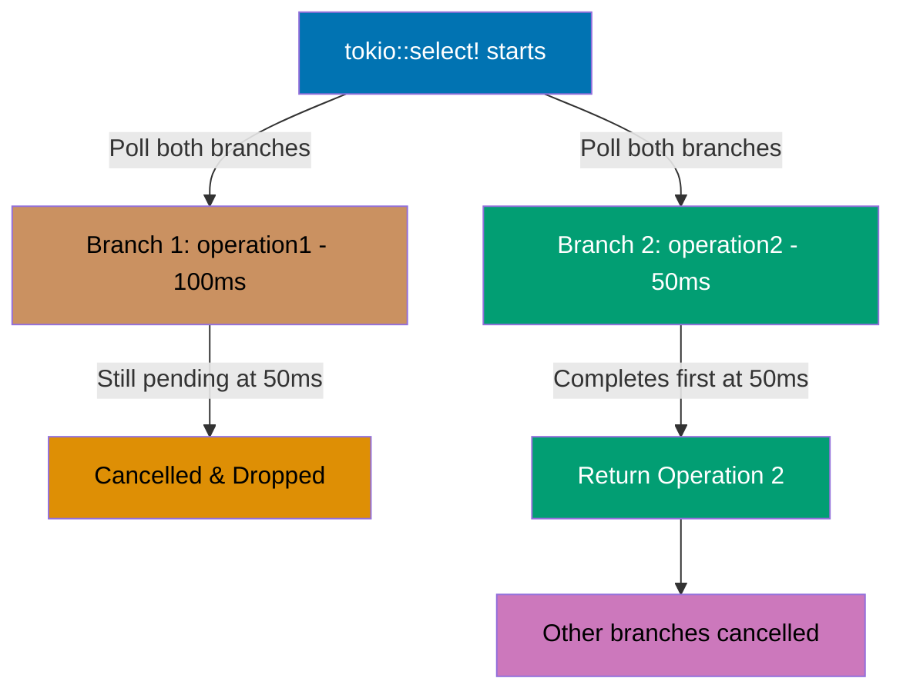
```mermaid
%% Select racing multiple futures
graph TD
    A[tokio::select! starts] -->|Poll both branches| B[Branch 1: operation1 - 100ms]
    A -->|Poll both branches| C[Branch 2: operation2 - 50ms]
    B -->|Still pending at 50ms| D[Cancelled & Dropped]
    C -->|Completes first at 50ms| E[Return Operation 2]
    E --> F[Other branches cancelled]

    style A fill:#0173B2,color:#fff
    style B fill:#CA9161,color:#000
    style C fill:#029E73,color:#fff
    style D fill:#DE8F05,color:#000
    style E fill:#029E73,color:#fff
    style F fill:#CC78BC,color:#000
```

```rust
use tokio::time::{sleep, Duration};  // => Tokio's async sleep for non-blocking delays
                                     // => Import time utilities from tokio crate

async fn operation1() -> &'static str {
                                     // => First operation: returns string after delay
                                     // => Returns Future<Output = &'static str>
    sleep(Duration::from_millis(100)).await;
                                     // => Sleeps 100ms (slower operation)
                                     // => Suspends future, yields to runtime executor
    "Operation 1"                    // => Returns after 100ms
                                     // => Static lifetime string literal
}

async fn operation2() -> &'static str {
                                     // => Second operation: faster version
                                     // => Returns Future<Output = &'static str>
    sleep(Duration::from_millis(50)).await;
                                     // => Sleeps 50ms (finishes first!)
                                     // => Will complete before operation1
    "Operation 2"                    // => Returns after 50ms (winner in race)
                                     // => This branch wins the select! race
}

#[tokio::main]                       // => Creates Tokio runtime for async execution
                                     // => Initializes multi-threaded work-stealing scheduler
async fn main() {                    // => main is now async function
                                     // => Runtime blocks on this future until completion
    let result = tokio::select! {    // => select! races multiple futures
                                     // => Macro expands to future polling state machine
                                     // => Returns when FIRST branch completes
                                     // => Other branches are CANCELLED (dropped)
        res1 = operation1() => res1, // => Branch 1: wait for operation1
                                     // => Pattern: future => result_expr
                                     // => If this completes first, return res1
                                     // => Polls operation1() future each iteration
        res2 = operation2() => res2, // => Branch 2: wait for operation2
                                     // => Polls both branches concurrently
                                     // => Returns res2 if this completes first
                                     // => This branch will win (50ms < 100ms)
    };                               // => operation2() finishes after 50ms (first!)
                                     // => operation1() is DROPPED (cancelled at 50ms mark)
                                     // => Dropping cancels pending future (no completion)
                                     // => result is "Operation 2" (from faster branch)
                                     // => Type: &'static str (from winning branch)
    println!("First completed: {}", result);
                                     // => Output: First completed: Operation 2
                                     // => Only winner's result is used
                                     // => Losing branch result discarded
}                                    // => Runtime shuts down after main completes

// Demonstrating timeout with select!
async fn with_timeout() {            // => Pattern: race operation against timeout
                                     // => Common pattern for request timeouts
    use tokio::time::timeout;        // => Import timeout helper (alternative approach)

    let result = tokio::select! {    // => Race operation vs timeout duration
                                     // => Result type: Result<i32, &str>
        value = slow_operation() => {
                                     // => Main operation branch
                                     // => Executes if slow_operation completes first
            println!("Operation completed: {}", value);
                                     // => value is i32 (42 from slow_operation)
            Ok(value)                // => Wrap in Ok if successful
                                     // => Returns Ok(42) on success path
        }
        _ = sleep(Duration::from_millis(200)) => {
                                     // => Timeout branch (200ms limit)
                                     // => Executes if 200ms elapses first
            println!("Operation timed out!");
                                     // => Timeout message printed
            Err("Timeout")           // => Return Err if timeout wins
                                     // => Returns Err("Timeout") on timeout path
        }
    };                               // => Whichever completes first determines result
                                     // => If slow_operation takes >200ms, timeout wins
                                     // => slow_operation takes 150ms, so completes first

    match result {                   // => Pattern match on Result type
        Ok(v) => println!("Got value: {}", v),
                                     // => Success case: prints "Got value: 42"
        Err(e) => println!("Error: {}", e),
                                     // => Timeout case (won't execute in this example)
    }
}

async fn slow_operation() -> i32 {  // => Simulates slow async operation
                                     // => Returns Future<Output = i32>
    sleep(Duration::from_millis(150)).await;
                                     // => Takes 150ms (under 200ms timeout)
                                     // => Suspends for 150 milliseconds
    42                               // => Returns value if not cancelled
                                     // => Magic number placeholder result
}

// Multiple operations with select! and pattern matching
async fn multi_select() {            // => Demonstrates select! in loop pattern
                                     // => Common pattern for event handling
    let mut interval = tokio::time::interval(Duration::from_millis(100));
                                     // => Interval timer: ticks every 100ms
                                     // => First tick completes immediately, then every 100ms
    let mut counter = 0;             // => Track number of ticks
                                     // => Mutable state across loop iterations

    loop {                           // => Infinite loop until break
                                     // => select! enables early exit via timeout
        tokio::select! {             // => Race interval vs long sleep each iteration
            _ = interval.tick() => {
                                     // => Branch 1: timer tick (every 100ms)
                                     // => tick() returns Future<Output = Instant>
                counter += 1;        // => Increment counter on each tick
                                     // => counter is 1, 2, 3, 4, 5
                println!("Tick {}", counter);
                                     // => Output: Tick 1, Tick 2, Tick 3...
                                     // => Prints on each 100ms interval
                if counter >= 5 {    // => Check for exit condition
                                     // => Stop after 5 ticks
                    break;           // => Stop after 5 ticks (500ms total)
                                     // => Exit loop before long sleep completes
                }
            }
            _ = sleep(Duration::from_millis(350)) => {
                                     // => Branch 2: long sleep (350ms)
                                     // => Won't complete before 5 ticks (500ms total)
                println!("Long sleep completed");
                                     // => Only executes if loop runs 350ms
                                     // => Competes with interval ticks
                                     // => Never reaches this in practice
                break;               // => Exit loop on long sleep
                                     // => Alternative exit path (unused here)
            }
        }                            // => First completed branch executes
                                     // => Interval wins first 5 iterations
    }                                // => Loop continues until break
                                     // => Exits after 5 ticks (~500ms total)
}

// biased option - deterministic ordering
async fn biased_select() {          // => Demonstrates biased select! behavior
                                     // => Use when branch priority matters
    let mut count = 0;               // => Counter for loop iterations
                                     // => Tracks how many times first branch executes

    loop {                           // => Infinite loop with break condition
        tokio::select! {             // => select! with biased mode
            biased;                  // => biased flag: check branches in order (top to bottom)
                                     // => Changes polling semantics from fair to priority
                                     // => Without biased: pseudo-random fair polling
                                     // => With biased: deterministic priority (first ready wins)
                                     // => Must appear first in select! block

            _ = sleep(Duration::from_millis(0)) => {
                                     // => Branch 1: immediately ready (0ms sleep)
                                     // => sleep(0) completes instantly
                println!("First branch");
                                     // => With biased, this branch ALWAYS wins if ready
                                     // => Prints on every iteration
                count += 1;          // => Increment counter
                                     // => count is 1, 2, 3
                if count >= 3 {      // => Check exit condition
                    break;           // => Stop after 3 iterations
                                     // => Exit loop after 3 first-branch executions
                }
            }
            _ = sleep(Duration::from_millis(0)) => {
                                     // => Branch 2: also immediately ready
                                     // => Both branches ready simultaneously
                println!("Second branch");
                                     // => Without biased, this could run sometimes
                                     // => With biased, this NEVER runs (first branch wins)
                                     // => Unreachable code due to biased priority
            }
        }                            // => Biased ensures predictable branch selection
                                     // => First ready branch always chosen (deterministic)
    }                                // => Output: "First branch" 3 times, never "Second branch"
                                     // => Demonstrates priority-based select! behavior
}

// Cancellation safety with select!
async fn cancellation_safety() {    // => Demonstrates cancellation safety hazard
                                     // => WARNING: Mutable state across await is risky
    let mut data = vec![1, 2, 3];    // => Mutable vector (state across iterations)
                                     // => Shared mutable state between branches
                                     // => Cancellation can leave state inconsistent

    tokio::select! {                 // => Racing async operations with mutable state
                                     // => Dangerous pattern: state mutation before await
        _ = async {                  // => Branch 1: async block mutating data
                                     // => Inline async block (closure-like syntax)
            data.push(4);            // => Modify data in branch 1
                                     // => Executes immediately (before await)
            sleep(Duration::from_millis(100)).await;
                                     // => Await point: branch can be cancelled here
            data.push(5);            // => Second modification (might not happen!)
                                     // => Only executes if not cancelled by timeout
        } => {
            println!("Long branch: {:?}", data);
                                     // => If this completes: data is [1,2,3,4,5]
                                     // => All mutations applied successfully
        }
        _ = sleep(Duration::from_millis(50)) => {
                                     // => Branch 2: timeout after 50ms
                                     // => Wins race (50ms < 100ms)
            println!("Short branch: {:?}", data);
                                     // => If timeout wins: data is [1,2,3,4] (incomplete!)
                                     // => First push(4) applied, second push(5) never ran
                                     // => Second push(5) was CANCELLED mid-execution
                                     // => DANGER: partial state modification!
                                     // => Output: Short branch: [1, 2, 3, 4]
        }
    };                               // => Cancellation can leave data in intermediate state
                                     // => Be careful with mutable state across await points in select!
                                     // => Best practice: avoid mutable state or use atomic operations
}

// Pattern matching with select! results
async fn pattern_select() {
    enum Message {
        Text(String),
        Number(i32),
    }

    async fn get_text() -> Message {
        sleep(Duration::from_millis(50)).await;
        Message::Text(String::from("Hello"))
    }

    async fn get_number() -> Message {
        sleep(Duration::from_millis(100)).await;
        Message::Number(42)
    }

    tokio::select! {
        msg = get_text() => {
            match msg {              // => Pattern match on result
                Message::Text(s) => println!("Got text: {}", s),
                                     // => Output: Got text: Hello (wins race)
                Message::Number(n) => println!("Got number: {}", n),
            }
        }
        msg = get_number() => {
            match msg {
                Message::Text(s) => println!("Got text: {}", s),
                Message::Number(n) => println!("Got number: {}", n),
            }
        }
    }                                // => get_text() completes first (50ms < 100ms)
}

// Combining select! with channels
async fn select_with_channels() {
    use tokio::sync::mpsc;

    let (tx, mut rx) = mpsc::channel(32);
                                     // => Create channel for communication

    tokio::spawn(async move {
        for i in 0..3 {
            tx.send(i).await.unwrap();
            sleep(Duration::from_millis(50)).await;
        }                            // => Send 0, 1, 2 with delays
    });

    loop {
        tokio::select! {
            Some(value) = rx.recv() => {
                                     // => Branch 1: receive from channel
                println!("Received: {}", value);
                                     // => Output: Received: 0, 1, 2
            }
            _ = sleep(Duration::from_millis(200)) => {
                                     // => Branch 2: timeout after 200ms
                println!("Timeout, exiting");
                break;               // => Exit when no messages for 200ms
            }
        }
    }
}
```

**Key Takeaway**: `tokio::select!` enables racing multiple async operations, returning when the first completes and cancelling others, useful for timeouts and concurrent alternative paths.

**Why It Matters**: Select-style multiplexing compiles to efficient polling without allocation, enabling timeout patterns and cancellation impossible to express efficiently in callback-based async. HTTP clients use select! for request timeouts where cancellation safety prevents resource leaks—correctness difficult to achieve in Promise.race without careful cleanup in JavaScript.

---

## Example 70: Channels in Async Context

Tokio provides async channels for message passing between async tasks with backpressure support.

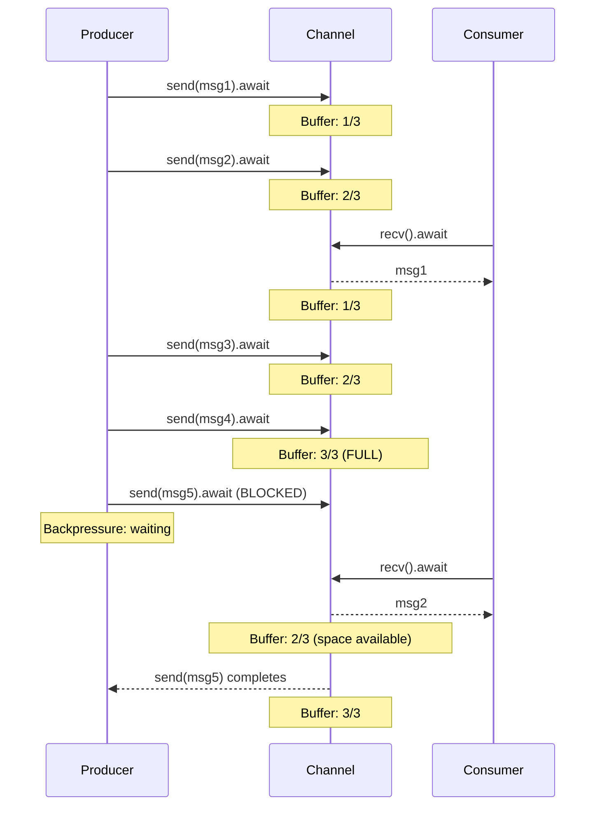
```mermaid
%% Async channel communication with backpressure
sequenceDiagram
    participant Producer
    participant Channel
    participant Consumer

    Producer->>Channel: send(msg1).await
    Note over Channel: Buffer: 1/3
    Producer->>Channel: send(msg2).await
    Note over Channel: Buffer: 2/3
    Consumer->>Channel: recv().await
    Channel-->>Consumer: msg1
    Note over Channel: Buffer: 1/3
    Producer->>Channel: send(msg3).await
    Note over Channel: Buffer: 2/3
    Producer->>Channel: send(msg4).await
    Note over Channel: Buffer: 3/3 #40;FULL#41;
    Producer->>Channel: send(msg5).await (BLOCKED)
    Note over Producer: Backpressure: waiting
    Consumer->>Channel: recv().await
    Channel-->>Consumer: msg2
    Note over Channel: Buffer: 2/3 #40;space available#41;
    Channel-->>Producer: send(msg5) completes
    Note over Channel: Buffer: 3/3
```

```rust
use tokio::sync::mpsc;               // => mpsc: multi-producer, single-consumer channel
                                     // => Import from Tokio async runtime

#[tokio::main]                       // => Macro creates Tokio runtime
                                     // => Expands to runtime creation and block_on call
                                     // => Enables async main function
async fn main() {                    // => Async main function (requires #[tokio::main])
    let (tx, mut rx) = mpsc::channel(32);
                                     // => Create bounded channel with capacity 32
                                     // => Returns (Sender, Receiver) tuple
                                     // => tx: Sender<i32> (clonable for multiple producers)
                                     // => rx: Receiver<i32> (NOT clonable - single consumer)
                                     // => Capacity 32: at most 32 messages buffered
                                     // => When full, send() awaits until space available (backpressure)

    tokio::spawn(async move {        // => Spawn async task on Tokio runtime
                                     // => Spawn producer task (owns tx via move)
                                     // => move captures tx from outer scope
                                     // => Returns JoinHandle (task handle)
        for i in 0..5 {              // => Loop 5 iterations
                                     // => Send 5 messages (0, 1, 2, 3, 4)
                                     // => i is i32 (inferred from channel type)
            tx.send(i).await.unwrap();
                                     // => send() is async: returns Future<Result<(), SendError>>
                                     // => .await suspends if channel full (backpressure)
                                     // => unwrap() panics if receiver dropped (Err(SendError))
                                     // => Channel not full (5 < 32), no blocking
                                     // => Message sent successfully
            println!("Sent: {}", i); // => Print confirmation
                                     // => Output: Sent: 0, Sent: 1, ..., Sent: 4
                                     // => Prints after successful send
        }                            // => Loop ends, tx dropped (closes channel)
                                     // => All senders dropped, signals channel closed
    });                              // => Task spawned, runs concurrently
                                     // => Producer task runs independently

    while let Some(value) = rx.recv().await {
                                     // => while let pattern: loop while recv returns Some
                                     // => recv() is async: returns Future<Option<T>>
                                     // => .await suspends until message available
                                     // => Returns Some(value) when message received
                                     // => Returns None when all senders dropped (channel closed)
                                     // => Exits loop on None
        println!("Received: {}", value);
                                     // => Print received value
                                     // => Output: Received: 0, Received: 1, ..., Received: 4
                                     // => Processes each message sequentially
    }                                // => Loop exits when producer drops tx (None received)
                                     // => All messages consumed, channel closed
}                                    // => Main exits, runtime shuts down

// Demonstrating backpressure with small buffer
async fn backpressure_demo() {      // => Async function demonstrating backpressure
    let (tx, mut rx) = mpsc::channel(2);
                                     // => Small buffer: only 2 messages
                                     // => Capacity 2 (vs 32 in previous example)
                                     // => Forces backpressure when sender fast, receiver slow

    tokio::spawn(async move {        // => Spawn fast producer task
                                     // => Owns tx via move
        for i in 0..5 {              // => Attempt to send 5 messages
                                     // => More messages than buffer capacity
            println!("Attempting to send {}", i);
                                     // => Prints before send attempt
                                     // => Shows when send starts
            tx.send(i).await.unwrap();
                                     // => send() awaits when buffer full
                                     // => Blocks after buffer full (i=2)
                                     // => i=0,1 sent immediately (buffer has space)
                                     // => i=2 awaits until receiver consumes one
                                     // => Backpressure applied here
            println!("Sent {}", i);  // => Confirms successful send
                                     // => Prints after send completes
        }                            // => Loop ends, tx dropped
    });                              // => Producer spawned

    tokio::time::sleep(tokio::time::Duration::from_millis(100)).await;
                                     // => Main task sleeps 100ms
                                     // => Main sleeps 100ms (simulates slow consumer)
                                     // => Producer blocked waiting for space
                                     // => Messages 0,1 in buffer, producer waiting to send 2

    while let Some(value) = rx.recv().await {
                                     // => Receive messages one by one
        println!("Received: {}", value);
                                     // => Print received value
        tokio::time::sleep(tokio::time::Duration::from_millis(50)).await;
                                     // => Sleep 50ms after each message
                                     // => Slow consumer (50ms per message)
                                     // => Each recv() frees buffer space
                                     // => Each recv() unblocks one waiting send()
    }                                // => Loop until all messages received
}                                    // => Function completes

// Multiple producers, single consumer
async fn multiple_producers() {
    let (tx, mut rx) = mpsc::channel(32);

    for producer_id in 0..3 {        // => Spawn 3 producer tasks
        let tx_clone = tx.clone();   // => Clone sender (mpsc supports multiple senders)
                                     // => Each producer gets own Sender<i32>
        tokio::spawn(async move {
            for i in 0..3 {          // => Each producer sends 3 messages
                let msg = producer_id * 10 + i;
                                     // => Unique message: producer 0 sends 0,1,2
                                     // =>                producer 1 sends 10,11,12
                                     // =>                producer 2 sends 20,21,22
                tx_clone.send(msg).await.unwrap();
                println!("Producer {} sent {}", producer_id, msg);
                tokio::time::sleep(tokio::time::Duration::from_millis(50)).await;
            }                        // => Producer exits, drops tx_clone
        });
    }

    drop(tx);                        // => Drop original sender
                                     // => Important! Prevents deadlock
                                     // => Without this, rx.recv() never returns None
                                     // => Channel only closes when ALL senders dropped

    while let Some(value) = rx.recv().await {
        println!("Received: {}", value);
                                     // => Output order is non-deterministic
                                     // => Messages from different producers interleaved
    }                                // => Exits when all 3 producers finish and drop senders
}

// Using unbounded channels (no backpressure)
async fn unbounded_channel_demo() {
    use tokio::sync::mpsc;

    let (tx, mut rx) = mpsc::unbounded_channel();
                                     // => Unbounded: unlimited buffer size
                                     // => send() is NOT async (never blocks!)
                                     // => Returns Result immediately
                                     // => Risk: memory exhaustion if producer faster than consumer

    tokio::spawn(async move {
        for i in 0..1000 {           // => Send 1000 messages instantly
            tx.send(i).unwrap();     // => send() is synchronous (no .await)
                                     // => All 1000 messages buffered in memory
            // No await here - all sends happen immediately!
        }                            // => Producer finishes instantly (no backpressure)
    });

    let mut count = 0;
    while let Some(value) = rx.recv().await {
                                     // => Consumer processes messages
        count += 1;
        if count % 100 == 0 {
            println!("Processed {} messages", count);
        }
    }                                // => Eventually processes all 1000 messages
}

// oneshot channel for single-value communication
async fn oneshot_demo() {
    use tokio::sync::oneshot;

    let (tx, rx) = oneshot::channel();
                                     // => oneshot: send exactly ONE value
                                     // => Sender and Receiver both NOT clonable
                                     // => Lightweight for single-value responses

    tokio::spawn(async move {
        tokio::time::sleep(tokio::time::Duration::from_millis(100)).await;
        tx.send(42).unwrap();        // => Send single value (consumes tx)
                                     // => send() is NOT async (buffered immediately)
                                     // => Cannot send again (tx moved)
    });

    let result = rx.await.unwrap();  // => .await directly on rx (not rx.recv())
                                     // => Returns T (not Option<T>)
                                     // => unwrap() panics if sender dropped without sending
    println!("Got result: {}", result);
                                     // => Output: Got result: 42
}

// broadcast channel for multiple consumers
async fn broadcast_demo() {
    use tokio::sync::broadcast;

    let (tx, mut rx1) = broadcast::channel(16);
                                     // => broadcast: all receivers get all messages
                                     // => Capacity 16 (circular buffer)
    let mut rx2 = tx.subscribe();    // => Create second receiver
                                     // => Each receiver gets copy of every message

    tokio::spawn(async move {
        for i in 0..3 {
            tx.send(i).unwrap();     // => Broadcast to all receivers
            println!("Broadcast: {}", i);
        }
    });

    tokio::spawn(async move {
        while let Ok(value) = rx1.recv().await {
                                     // => First receiver
            println!("RX1 received: {}", value);
        }                            // => Gets all messages: 0, 1, 2
    });

    tokio::spawn(async move {
        while let Ok(value) = rx2.recv().await {
                                     // => Second receiver (independent)
            println!("RX2 received: {}", value);
        }                            // => Also gets: 0, 1, 2
    });                              // => Both receivers get same messages

    tokio::time::sleep(tokio::time::Duration::from_millis(200)).await;
}

// watch channel for state broadcasting
async fn watch_demo() {
    use tokio::sync::watch;

    let (tx, mut rx) = watch::channel("initial");
                                     // => watch: latest value always available
                                     // => Receivers only see most recent value
                                     // => Good for configuration/state updates

    tokio::spawn(async move {
        tokio::time::sleep(tokio::time::Duration::from_millis(50)).await;
        tx.send("update 1").unwrap();// => Update state
        tokio::time::sleep(tokio::time::Duration::from_millis(50)).await;
        tx.send("update 2").unwrap();// => Update again
        tokio::time::sleep(tokio::time::Duration::from_millis(50)).await;
        tx.send("final").unwrap();   // => Final update
    });

    while rx.changed().await.is_ok() {
                                     // => changed() waits for next update
                                     // => Returns Err when sender dropped
        let value = rx.borrow();     // => Borrow latest value (cheap)
        println!("Current value: {}", *value);
                                     // => Might skip intermediate values if slow consumer!
                                     // => Only shows latest at time of borrow
    }
}
```

**Key Takeaway**: Tokio's async channels provide message passing between async tasks with `.await` for send/receive operations and backpressure through bounded channels.

**Why It Matters**: Async channels with backpressure enable flow control in async pipelines, preventing the unbounded queuing that causes memory exhaustion in actor systems. Stream processing systems use bounded async channels to apply backpressure when consumers lag behind producers—flow control impossible in Erlang mailboxes or difficult to implement correctly in Go channels.

---

## Example 71: Pin and Unpin

`Pin` prevents moving values in memory, required for self-referential futures and async functions that borrow across await points.

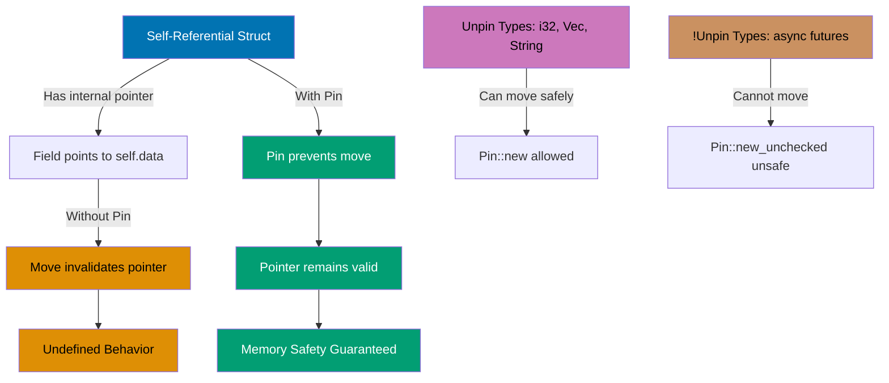
```mermaid
%% Pin preventing memory moves for self-referential structs
graph TD
    A[Self-Referential Struct] -->|Has internal pointer| B[Field points to self.data]
    B -->|Without Pin| C[Move invalidates pointer]
    C --> D[Undefined Behavior]

    A -->|With Pin| E[Pin prevents move]
    E --> F[Pointer remains valid]
    F --> G[Memory Safety Guaranteed]

    H[Unpin Types: i32, Vec, String] -->|Can move safely| I[Pin::new allowed]
    J[!Unpin Types: async futures] -->|Cannot move| K[Pin::new_unchecked unsafe]

    style A fill:#0173B2,color:#fff
    style C fill:#DE8F05,color:#000
    style D fill:#DE8F05,color:#000
    style E fill:#029E73,color:#fff
    style F fill:#029E73,color:#fff
    style G fill:#029E73,color:#fff
    style H fill:#CC78BC,color:#000
    style J fill:#CA9161,color:#000
```

```rust
use std::pin::Pin;                   // => Pin<P>: pointer wrapper preventing moves
                                     // => P is pointer type (Box, &mut, etc.)

fn print_pinned(pin: Pin<&mut i32>) {
                                     // => Takes Pin<&mut i32> instead of &mut i32
                                     // => Guarantees value won't move in memory
    println!("Pinned value: {}", pin);
                                     // => Can still read value (immutable access)
                                     // => Output: Pinned value: 42
}

fn main() {
    let mut value = 42;              // => Mutable i32 on stack
                                     // => i32 is Unpin (safe to move even when pinned)
    let pinned = Pin::new(&mut value);
                                     // => Pin::new() wraps &mut i32
                                     // => Only works for Unpin types (i32 is Unpin)
                                     // => For !Unpin types, use unsafe Pin::new_unchecked()
    print_pinned(pinned);            // => Pass pinned reference
                                     // => Function guarantees no moves via Pin wrapper
}

// Self-referential struct (requires Pin) - unsafe example
struct SelfReferential {
    data: String,                    // => Owned data
    pointer: *const String,          // => Raw pointer to self.data (self-reference!)
}                                    // => DANGER: if struct moves, pointer becomes invalid

impl SelfReferential {
    fn new(data: String) -> Pin<Box<Self>> {
                                     // => Returns Pin<Box<Self>> to prevent moves
                                     // => Box puts struct on heap (stable address)
        let mut boxed = Box::new(Self {
            data,
            pointer: std::ptr::null(),
                                     // => Initialize pointer to null (temporary)
        });

        let ptr = &boxed.data as *const String;
                                     // => Get address of data field
        boxed.pointer = ptr;         // => Set self-reference
                                     // => CRITICAL: must pin before returning!

        unsafe { Pin::new_unchecked(boxed) }
                                     // => Pin the Box (prevents moves)
                                     // => unsafe: we guarantee no moves after this
                                     // => Struct must be !Unpin to enforce pin guarantee
    }

    fn get_data(self: Pin<&Self>) -> &str {
                                     // => Method takes Pin<&Self> (pinned borrow)
        unsafe {
            &*self.pointer           // => Dereference self-referential pointer
                                     // => Safe because Pin prevents moves
                                     // => Without Pin, move could invalidate pointer
        }
    }
}

// Demonstrating Unpin vs !Unpin
fn unpin_demo() {
    // i32 is Unpin - can move even when pinned
    let mut x = 10;
    let mut pinned = Pin::new(&mut x);
                                     // => Pin::new() requires T: Unpin
                                     // => Works because i32 implements Unpin
    *pinned = 20;                    // => Can mutate through DerefMut
    println!("x = {}", x);           // => Output: x = 20

    // Most types are Unpin by default
    let mut vec = vec![1, 2, 3];
    let pinned_vec = Pin::new(&mut vec);
                                     // => Vec<T> is Unpin (can move safely)
    pinned_vec.push(4);              // => Can still modify (DerefMut)
    println!("{:?}", vec);           // => Output: [1, 2, 3, 4]

    // Future is !Unpin if it borrows across await
    // async fn borrow_across_await() {
    //     let data = vec![1, 2, 3];
    //     let reference = &data[0];  // => Borrow data
    //     some_async_fn().await;     // => Await point with borrow active
    //     println!("{}", reference); // => Use borrow after await
    // }                              // => Future is !Unpin (self-referential)
}

// Pin projection: accessing fields of pinned struct
use std::marker::PhantomPinned;      // => Marker for !Unpin types

struct NotUnpin {
    data: i32,
    _pin: PhantomPinned,             // => Makes struct !Unpin
}                                    // => Cannot use Pin::new() on this type

impl NotUnpin {
    fn new(data: i32) -> Pin<Box<Self>> {
        let boxed = Box::new(Self {
            data,
            _pin: PhantomPinned,
        });
        unsafe { Pin::new_unchecked(boxed) }
                                     // => Must use unsafe Pin::new_unchecked for !Unpin
    }

    // Safe projection to Unpin field
    fn get_data(self: Pin<&mut Self>) -> &mut i32 {
                                     // => Pin<&mut Self> parameter (self is pinned)
        unsafe {
            &mut self.get_unchecked_mut().data
                                     // => get_unchecked_mut() bypasses Pin (unsafe)
                                     // => Safe because data is Unpin (no self-refs)
                                     // => Returns &mut i32 (unpinned mutable reference)
        }
    }
}

// Why Pin matters for async/await
async fn pin_in_async() {
    let local = String::from("data");
                                     // => Local variable in async function
    let reference = &local;          // => Borrow local
                                     // => Future stores both local and reference

    tokio::time::sleep(tokio::time::Duration::from_millis(10)).await;
                                     // => Await point: future yields
                                     // => Future becomes self-referential:
                                     // =>   - Contains String ("data")
                                     // =>   - Contains &String (pointing into same future)
                                     // => If future moves, reference becomes dangling!
                                     // => Pin prevents move, keeping reference valid

    println!("{}", reference);       // => Safe to use reference after await
                                     // => Pin guarantees future didn't move
}

// Pinning on stack vs heap
fn stack_vs_heap_pin() {
    use std::pin::pin;               // => pin! macro for stack pinning (Rust 1.68+)

    // Stack pinning with pin! macro
    let value = pin!(42);            // => Pin value on stack
                                     // => Type: Pin<&mut i32>
                                     // => Prevents moving after pin! macro
    println!("Stack pinned: {}", value);

    // Heap pinning with Box::pin
    let boxed = Box::pin(String::from("heap"));
                                     // => Pin<Box<String>>: pinned on heap
                                     // => Box allocates, Pin prevents moves
                                     // => Stable memory address (heap address)
    println!("Heap pinned: {}", boxed);
}

// Practical example: pinning futures
async fn practical_pin_usage() {
    use tokio::pin;

    let fut = async {                // => Create future (not pinned yet)
        tokio::time::sleep(tokio::time::Duration::from_millis(10)).await;
        42
    };

    pin!(fut);                       // => Pin future on stack (Tokio's pin! macro)
                                     // => Required for polling manually or using select!

    // Now can poll or select on fut
    let result = fut.await;          // => Await pinned future
    println!("Result: {}", result);  // => Output: Result: 42
}
```

**Key Takeaway**: `Pin<P>` prevents moving pinned values, enabling self-referential types like futures that borrow across await points, with most types being `Unpin` (movable even when pinned).

**Why It Matters**: Pin enables self-referential types impossible to express safely in most languages, unlocking async/await and intrusive data structures without unsafe code proliferation. Async runtimes use Pin to ensure futures containing self-references don't move during await, enabling zero-copy async I/O patterns impossible in garbage-collected languages where object addresses can change during GC.

---

## Example 72: Associated Types in Traits

Associated types define placeholder types in traits that implementors specify, improving code clarity over generic parameters.

```rust
trait Container {                    // => Trait defining container behavior
    type Item;                       // => Associated type: placeholder for concrete type
                                     // => Each impl chooses ONE Item type (not multiple)
                                     // => Simpler than generic parameter at use sites
                                     // => Cannot have Container<i32> AND Container<String> for same type

    fn get(&self) -> &Self::Item;    // => Method signature using associated type
                                     // => Self::Item refers to implementor's chosen type
                                     // => Returns immutable reference to contained item
}

struct IntContainer {                // => Concrete container type
    value: i32,                      // => Stores single i32 value
}

impl Container for IntContainer {    // => Implement Container for IntContainer
    type Item = i32;                 // => Associate Item with i32 (concrete type)
                                     // => Only ONE Item type per impl (not like generics)
                                     // => Bound at implementation, not at call site
                                     // => Simpler than Container<i32> everywhere

    fn get(&self) -> &Self::Item {   // => Concrete signature: &i32 (Self::Item = i32)
                                     // => Return type determined by associated type
        &self.value                  // => Return reference to stored i32
                                     // => Lifetime tied to self
    }
}

struct StringContainer {             // => Different container type
    value: String,                   // => Stores heap-allocated String
}

impl Container for StringContainer { // => Implement Container for different type
    type Item = String;              // => Different associated type choice: String
                                     // => Each implementation picks appropriate Item type
                                     // => IntContainer chose i32, StringContainer chose String

    fn get(&self) -> &Self::Item {   // => Concrete signature: &String
                                     // => Return &String (Self::Item = String here)
        &self.value                  // => Return reference to stored String
    }
}

fn print_container<C: Container>(container: &C)
                                     // => Generic function with trait bound
                                     // => Only ONE type parameter needed (not T + C like generics)
where
    C::Item: std::fmt::Debug,        // => Constraint on associated type
                                     // => C::Item syntax: access associated type from C
                                     // => Item must implement Debug for printing
                                     // => Works for any Container whose Item is Debug
{
    println!("{:?}", container.get());
                                     // => Call get() returns &C::Item
                                     // => Debug format the Item value
}

fn main() {
    let int_c = IntContainer { value: 42 };
                                     // => Create IntContainer with value 42
                                     // => Type: IntContainer (Container::Item = i32)
                                     // => int_c.get() returns &i32
    print_container(&int_c);         // => Type inference: C = IntContainer
                                     // => C::Item = i32 (from impl)
                                     // => i32 implements Debug ✓
                                     // => Output: 42

    let str_c = StringContainer {    // => Create StringContainer
        value: String::from("hello"),// => Heap-allocated String
    };                               // => Type: StringContainer (Container::Item = String)
                                     // => str_c.get() returns &String
    print_container(&str_c);         // => Type inference: C = StringContainer
                                     // => C::Item = String (from impl)
                                     // => String implements Debug ✓
                                     // => Output: "hello"
}

// Comparing associated types vs generic parameters
// Generic parameter version (more verbose at use sites)
trait GenericContainer<T> {          // => Trait with generic parameter T
                                     // => T specified at impl AND use sites
                                     // => Allows multiple implementations for same type
    fn get_generic(&self) -> &T;     // => Method returns reference to T
                                     // => T from trait parameter, not associated
}

impl GenericContainer<i32> for IntContainer {
                                     // => Implement GenericContainer<i32>
                                     // => Must specify T=i32 at impl time
                                     // => IntContainer now GenericContainer<i32>
    fn get_generic(&self) -> &i32 {  // => Concrete return type: &i32
        &self.value                  // => Return stored i32 reference
    }
}

impl GenericContainer<String> for IntContainer {
                                     // => ALSO implement GenericContainer<String> for same type!
                                     // => Multiple impls possible with generics (not associated types)
                                     // => IntContainer is BOTH GenericContainer<i32> AND GenericContainer<String>
                                     // => Demonstrates key difference from associated types
    fn get_generic(&self) -> &String {
                                     // => Return &String (but IntContainer stores i32!)
        todo!("Not really possible for IntContainer")
                                     // => Demonstrates problem: type system allows impossible impl
                                     // => Associated types prevent this confusion
    }
}

fn use_generic<T, C: GenericContainer<T>>(container: &C) -> &T {
                                     // => Generic function requires TWO type parameters
                                     // => T: the contained type
                                     // => C: the container type with GenericContainer<T> bound
                                     // => More verbose than associated types
                                     // => Caller must sometimes specify T explicitly
    container.get_generic()          // => Call method returning &T
                                     // => Return type is &T (parameter)
}

fn use_associated<C: Container>(container: &C) -> &C::Item {
                                     // => Generic function needs ONE type parameter
                                     // => C: the container type (Item inferred from impl)
                                     // => Cleaner: Item type comes from C's impl automatically
                                     // => Cannot have multiple Item types (1-to-1 relationship)
    container.get()                  // => Call method returning &C::Item
                                     // => Return type is &C::Item (associated type)
}

// When to use associated types: natural 1-to-1 relationship
trait Iterator {                     // => Standard library Iterator trait (simplified)
    type Item;                       // => Associated type: what the iterator produces
                                     // => Each iterator type produces EXACTLY ONE Item type
                                     // => Vec<i32>::IntoIter always produces i32 (not i32 sometimes, String other times)
                                     // => Natural 1-to-1 relationship: iterator ↔ item type

    fn next(&mut self) -> Option<Self::Item>;
                                     // => Method signature uses associated type
                                     // => Returns Option<Item> (Some(item) or None)
}

struct Counter {                     // => Simple counter iterator
    count: u32,                      // => Current count state
}

impl Iterator for Counter {          // => Implement Iterator for Counter
    type Item = u32;                 // => Associate Item with u32
                                     // => Counter produces u32 values (counts)
                                     // => Makes semantic sense: counters produce integers
                                     // => Cannot also be Iterator with Item = String (1-to-1 rule)

    fn next(&mut self) -> Option<Self::Item> {
                                     // => Concrete signature: Option<u32>
                                     // => Mutates self (increments counter)
        self.count += 1;             // => Increment internal count
                                     // => self.count now 1, 2, 3, etc.
        if self.count < 6 {          // => Stop at 5 (counter produces 1, 2, 3, 4, 5)
            Some(self.count)         // => Return Some(u32) - next value
                                     // => Type: Option<u32> (matches Self::Item = u32)
        } else {                     // => Count reached 6 or beyond
            None                     // => Iterator exhausted
                                     // => Type: Option<u32> (None variant)
        }
    }
}

// Associated types with bounds - multiple associated types
trait Graph {                        // => Graph trait with TWO associated types
    type Node;                       // => Associated type for node labels
                                     // => Could be String, u32, struct, etc.
                                     // => Each graph chooses appropriate node type
    type Edge;                       // => Associated type for edge representation
                                     // => Could be (Node, Node), weighted edge struct, etc.
                                     // => 1-to-1 relationship: graph type → edge type

    fn nodes(&self) -> Vec<&Self::Node>;
                                     // => Return references to all nodes
                                     // => Self::Node is associated type (not parameter)
    fn edges(&self) -> Vec<&Self::Edge>;
                                     // => Return references to all edges
                                     // => Self::Edge is associated type
}

struct SimpleGraph {                 // => Concrete graph implementation
    nodes: Vec<String>,              // => Nodes stored as Strings
    edges: Vec<(usize, usize)>,      // => Edges as index pairs (node indices)
                                     // => Efficient: indices instead of String refs
}

impl Graph for SimpleGraph {         // => Implement Graph for SimpleGraph
    type Node = String;              // => Nodes are Strings (label-based graph)
                                     // => SimpleGraph commits to String nodes
    type Edge = (usize, usize);      // => Edges are index tuples
                                     // => Represents connections via node indices
                                     // => Two associated types specified

    fn nodes(&self) -> Vec<&Self::Node> {
                                     // => Concrete return: Vec<&String>
        self.nodes.iter().collect()  // => Collect references to String nodes
                                     // => Borrows self.nodes elements
    }

    fn edges(&self) -> Vec<&Self::Edge> {
                                     // => Concrete return: Vec<&(usize, usize)>
        self.edges.iter().collect()  // => Collect references to edge tuples
                                     // => Borrows self.edges elements
    }
}

// Using where clauses with associated types
fn process_graph<G>(graph: &G)       // => Generic function over any Graph
                                     // => Only one type parameter: G
where
    G: Graph,                        // => G must implement Graph trait
                                     // => G::Node and G::Edge inferred from impl
    G::Node: std::fmt::Display,      // => Constraint on associated type Node
                                     // => Node must implement Display for printing
                                     // => Works for any graph with Display nodes
    G::Edge: std::fmt::Debug,        // => Constraint on associated type Edge
                                     // => Edge must implement Debug for inspection
                                     // => Separate constraints on different associated types
{
    for node in graph.nodes() {      // => Iterate over node references
                                     // => Type: &G::Node (associated type)
        println!("Node: {}", node);  // => Display each node (requires Display bound)
                                     // => Uses Display impl for G::Node
    }
    for edge in graph.edges() {      // => Iterate over edge references
                                     // => Type: &G::Edge (associated type)
        println!("Edge: {:?}", edge);// => Debug each edge (requires Debug bound)
                                     // => Uses Debug impl for G::Edge
    }
}

// Default associated types - convenience feature
trait ProduceAnimal {                // => Trait with default associated type
    type Animal = String;            // => Default: Animal is String
                                     // => Implementations can use default OR override
                                     // => Provides sensible default to reduce boilerplate
                                     // => Syntax: type AssocType = DefaultType;

    fn produce(&self) -> Self::Animal;
                                     // => Return associated Animal type
                                     // => Could be String (default) or overridden type
}

struct Farm;                         // => Zero-sized type (no fields)

impl ProduceAnimal for Farm {        // => Implement using DEFAULT associated type
                                     // => Doesn't specify type Animal (uses default String)
                                     // => Animal = String (from trait default)
    fn produce(&self) -> Self::Animal {
                                     // => Concrete return: String (from default)
        String::from("Cow")          // => Create heap-allocated String
                                     // => Return type: String (default Animal type)
    }
}

struct Zoo;                          // => Another zero-sized type

impl ProduceAnimal for Zoo {         // => Implement OVERRIDING default associated type
    type Animal = &'static str;      // => Explicit override: Animal is &'static str (not String)
                                     // => Overrides trait's default type
                                     // => Now Animal = &'static str for Zoo

    fn produce(&self) -> Self::Animal {
                                     // => Concrete return: &'static str (overridden type)
        "Lion"                       // => String literal (type: &'static str)
                                     // => Return type matches overridden Animal = &'static str
    }
}
```

**Key Takeaway**: Associated types reduce generic parameter clutter by binding types to trait implementations rather than requiring them at use sites, improving API clarity for types with natural single implementations.

**Why It Matters**: Associated types provide cleaner type signatures for traits with natural output types, improving API ergonomics while maintaining compile-time verification. Iterator::Item as an associated type makes iterator chains readable compared to Java streams where type parameters proliferate—demonstrating how careful language design enables both power and usability.

---

## Example 73: Generic Associated Types (GATs)

GATs enable associated types with generic parameters, enabling more flexible trait designs like lending iterators.

```rust
trait LendingIterator {
    type Item<'a> where Self: 'a;    // => GAT: associated type with lifetime parameter
                                     // => Generic over lifetime 'a (not just one type)
                                     // => where Self: 'a ensures Item doesn't outlive iterator
                                     // => Regular associated types CAN'T do this (no generics)

    fn next<'a>(&'a mut self) -> Option<Self::Item<'a>>;
                                     // => Item<'a> tied to borrow lifetime 'a
                                     // => Return value borrows from &'a mut self
                                     // => Enables "lending" items tied to iterator lifetime
}

struct WindowsIterator<T> {
    data: Vec<T>,                    // => Owned vector data
    pos: usize,                      // => Current window position
}

impl<T> LendingIterator for WindowsIterator<T> {
    type Item<'a> = &'a [T] where T: 'a;
                                     // => Item<'a> is slice borrowing from self
                                     // => Slice lifetime 'a tied to next() call
                                     // => where T: 'a: T must outlive 'a (T contains no refs shorter than 'a)
                                     // => Each next() call returns slice valid for that borrow

    fn next<'a>(&'a mut self) -> Option<Self::Item<'a>> {
                                     // => Lifetime 'a is borrow of self
                                     // => Returned slice borrows from self.data for 'a
        if self.pos + 2 <= self.data.len() {
                                     // => Check bounds: need at least 2 elements from pos
                                     // => pos + 2 <= len ensures window [pos..pos+2] valid
            let window = &self.data[self.pos..self.pos + 2];
                                     // => Slice of 2 elements: [pos, pos+1]
                                     // => Borrows from self.data with lifetime 'a
                                     // => Type: &'a [T] (matches Item<'a>)
            self.pos += 1;           // => Advance window for next call
                                     // => Next call returns [pos+1, pos+2]
            Some(window)             // => Return borrowed slice (lends data)
                                     // => Caller cannot call next() again until dropping window
        } else {
            None                     // => No more windows available
                                     // => Iterator exhausted
        }
    }
}

fn main() {
    let mut iter = WindowsIterator {
        data: vec![1, 2, 3, 4],      // => Data: [1, 2, 3, 4]
        pos: 0,                      // => Start at position 0
    };

    while let Some(window) = iter.next() {
                                     // => First call: window = &[1, 2], pos becomes 1
                                     // => Second call: window = &[2, 3], pos becomes 2
                                     // => Third call: window = &[3, 4], pos becomes 3
                                     // => Fourth call: None (pos+2 > 4)
        println!("{:?}", window);    // => Output: [1, 2]
                                     // => Output: [2, 3]
                                     // => Output: [3, 4]
                                     // => Cannot call next() while holding window (borrow conflict)
    }                                // => window dropped at end of each iteration
}

// Why GATs needed: compare with regular Iterator
trait RegularIterator {
    type Item;                       // => NO lifetime parameter (regular associated type)
                                     // => Item must be same type regardless of borrow
                                     // => Cannot return borrowed slices tied to each next() call

    fn next(&mut self) -> Option<Self::Item>;
                                     // => Cannot tie returned Item to &mut self lifetime
                                     // => Item must be owned or have 'static lifetime
}

// Regular Iterator can't lend (must own or clone)
impl<T: Clone> RegularIterator for WindowsIterator<T> {
    type Item = Vec<T>;              // => Must return OWNED Vec (cannot borrow)
                                     // => Expensive: allocates and clones on every next()

    fn next(&mut self) -> Option<Self::Item> {
        if self.pos + 2 <= self.data.len() {
            let window = self.data[self.pos..self.pos + 2].to_vec();
                                     // => to_vec() allocates and clones (expensive!)
                                     // => GAT version just borrows (zero-cost)
            self.pos += 1;
            Some(window)             // => Returns owned vector
        } else {
            None
        }
    }
}

// GATs with multiple type parameters
trait StreamingIterator {
    type Item<'a, T> where Self: 'a, T: 'a;
                                     // => GAT with TWO parameters: lifetime 'a and type T
                                     // => Even more flexible than single-lifetime GATs

    fn next<'a, T>(&'a mut self, arg: &'a T) -> Option<Self::Item<'a, T>>;
}

// GATs enable async traits (before async fn in traits)
trait AsyncIterator {
    type Item;
    type NextFuture<'a>: std::future::Future<Output = Option<Self::Item>>
    where
        Self: 'a;                    // => GAT: associated type is a Future
                                     // => Lifetime 'a ties future to &'a mut self
                                     // => Enables async iterator trait (async fn in trait needs this)

    fn next<'a>(&'a mut self) -> Self::NextFuture<'a>;
                                     // => Returns future tied to borrow lifetime
}

// Practical GAT example: Database connection
trait Database {
    type Row<'a> where Self: 'a;     // => Borrowed row from query result
                                     // => Lifetime 'a: row cannot outlive connection

    fn query<'a>(&'a mut self, sql: &str) -> Vec<Self::Row<'a>>;
                                     // => Returns rows borrowing from connection
                                     // => Rows become invalid when connection dropped
}

struct PostgresDb {
    buffer: String,                  // => Internal buffer for query results
}

impl Database for PostgresDb {
    type Row<'a> = &'a str where Self: 'a;
                                     // => Row is string slice borrowing buffer

    fn query<'a>(&'a mut self, sql: &str) -> Vec<Self::Row<'a>> {
        self.buffer = format!("Result: {}", sql);
                                     // => Store result in buffer
        vec![&self.buffer]           // => Return slice borrowing buffer
                                     // => Lifetime 'a ensures buffer not dropped while rows used
    }
}

fn use_database() {
    let mut db = PostgresDb {
        buffer: String::new(),
    };

    let rows = db.query("SELECT * FROM users");
                                     // => rows borrows from db
    for row in rows {
        println!("Row: {}", row);    // => Output: Row: Result: SELECT * FROM users
    }                                // => rows dropped here
                                     // => db can be used again (borrow ended)
}
```

**Key Takeaway**: Generic associated types enable associated types with generic parameters, unlocking patterns like lending iterators that couldn't be expressed with standard associated types or generic parameters alone.

**Why It Matters**: GATs unlock patterns like lending iterators and async traits that were impossible to express in stable Rust, enabling async ecosystem maturation. Async iterator traits use GATs to express lifetimes correctly, finally enabling async fn in traits—functionality that required workarounds for years and demonstrates how advanced type system features enable zero-cost abstraction in new domains.

---

## Example 74: Trait Objects and Dynamic Dispatch

Trait objects enable runtime polymorphism through dynamic dispatch, trading compile-time monomorphization for flexibility.

**Static Dispatch (impl Trait):**

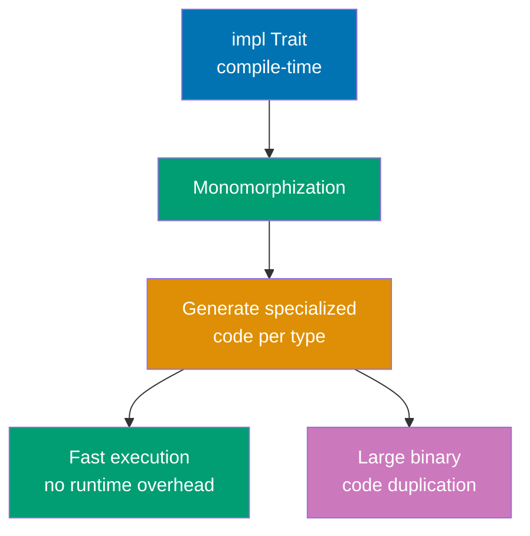
```mermaid
%% Color Palette: Blue #0173B2, Orange #DE8F05, Teal #029E73, Purple #CC78BC, Brown #CA9161
graph TD
    Start["impl Trait<br/>compile-time"]
    Start --> Mono[Monomorphization]
    Mono --> Code[Generate specialized<br/>code per type]
    Code --> Fast[Fast execution<br/>no runtime overhead]
    Code --> Size[Large binary<br/>code duplication]

    style Start fill:#0173B2,color:#fff
    style Mono fill:#029E73,color:#fff
    style Code fill:#DE8F05,color:#fff
    style Fast fill:#029E73,color:#fff
    style Size fill:#CC78BC,color:#fff
```

**Dynamic Dispatch (dyn Trait):**

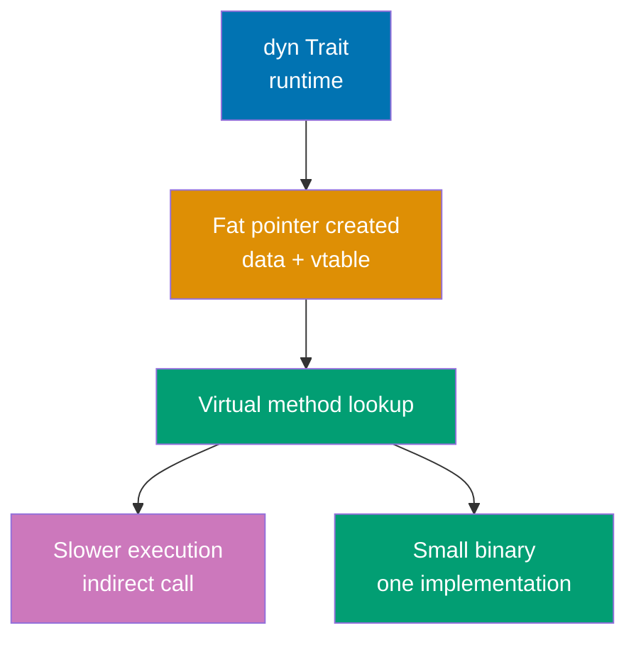
```mermaid
%% Color Palette: Blue #0173B2, Orange #DE8F05, Teal #029E73, Purple #CC78BC, Brown #CA9161
graph TD
    Start["dyn Trait<br/>runtime"]
    Start --> Pointer[Fat pointer created<br/>data + vtable]
    Pointer --> Lookup[Virtual method lookup]
    Lookup --> Slow[Slower execution<br/>indirect call]
    Lookup --> Size[Small binary<br/>one implementation]

    style Start fill:#0173B2,color:#fff
    style Pointer fill:#DE8F05,color:#fff
    style Lookup fill:#029E73,color:#fff
    style Slow fill:#CC78BC,color:#fff
    style Size fill:#029E73,color:#fff
```

**Trait Object Structure (Fat Pointer):**

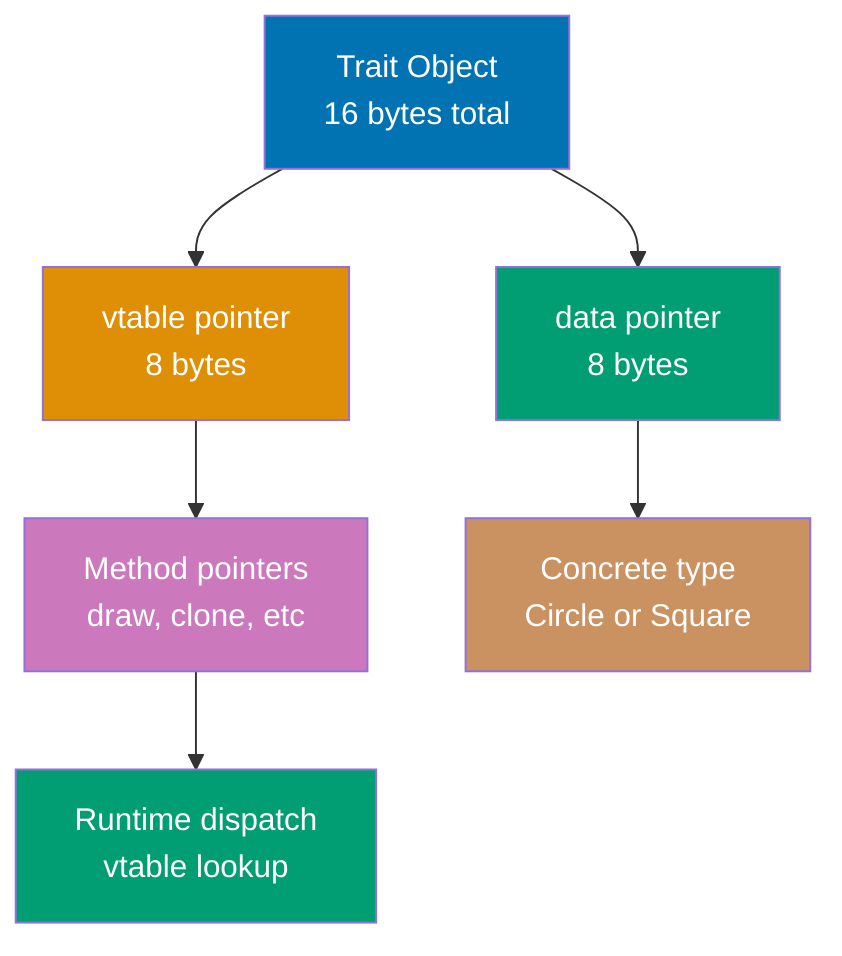
```mermaid
%% Color Palette: Blue #0173B2, Orange #DE8F05, Teal #029E73, Purple #CC78BC, Brown #CA9161
graph TD
    TraitObj[Trait Object<br/>16 bytes total]
    TraitObj --> VTable[vtable pointer<br/>8 bytes]
    TraitObj --> Data[data pointer<br/>8 bytes]

    VTable --> Methods[Method pointers<br/>draw, clone, etc]
    Data --> Concrete[Concrete type<br/>Circle or Square]

    Methods --> Dispatch[Runtime dispatch<br/>vtable lookup]

    style TraitObj fill:#0173B2,color:#fff
    style VTable fill:#DE8F05,color:#fff
    style Data fill:#029E73,color:#fff
    style Methods fill:#CC78BC,color:#fff
    style Concrete fill:#CA9161,color:#fff
    style Dispatch fill:#029E73,color:#fff
```

```rust
trait Draw {                         // => Trait definition for drawable objects
                                     // => Object-safe trait (can be used as dyn Trait)
    fn draw(&self);                  // => Trait method (object-safe)
                                     // => Takes &self (not Self), returns nothing
                                     // => Enables dynamic dispatch via vtable
}

struct Circle {                      // => Concrete type implementing Draw
                                     // => Size: 8 bytes (one f64 field)
    radius: f64,                     // => Circle-specific data
                                     // => Stored as 64-bit floating point
}

impl Draw for Circle {               // => Implement Draw trait for Circle
                                     // => Creates vtable with draw() function pointer
    fn draw(&self) {                 // => self is &Circle
                                     // => Implementation receives concrete type reference
        println!("Drawing circle with radius {}", self.radius);
                                     // => Circle's implementation of draw()
                                     // => Accesses Circle-specific field
    }
}

struct Square {                      // => Different concrete type implementing Draw
                                     // => Size: 8 bytes (one f64 field, same as Circle)
    side: f64,                       // => Square-specific data (different layout than Circle)
                                     // => Different semantic meaning than Circle::radius
}

impl Draw for Square {               // => Implement Draw trait for Square
                                     // => Creates separate vtable for Square
    fn draw(&self) {                 // => self is &Square
                                     // => Implementation receives concrete type reference
        println!("Drawing square with side {}", self.side);
                                     // => Square's implementation of draw()
                                     // => Different behavior than Circle::draw
    }
}

fn main() {                          // => Demonstrates heterogeneous collection with trait objects
                                     // => Stores different types in same Vec
    let shapes: Vec<Box<dyn Draw>> = vec![
                                     // => Heterogeneous collection: different concrete types
                                     // => Vec<Box<dyn Draw>>: vector of trait objects
                                     // => Box<dyn Draw>: trait object (fat pointer)
                                     // =>   - Data pointer (8 bytes): points to heap Circle/Square
                                     // =>   - vtable pointer (8 bytes): points to impl's method table
                                     // => Total size: 16 bytes per element (regardless of T)
        Box::new(Circle { radius: 5.0 }),
                                     // => Box allocates Circle on heap
                                     // => Circle takes 8 bytes on heap (one f64)
                                     // => Creates trait object: (Circle*, Circle_Draw_vtable*)
                                     // => vtable contains pointer to Circle::draw implementation
        Box::new(Square { side: 3.0 }),
                                     // => Box allocates Square on heap
                                     // => Square also takes 8 bytes on heap (one f64)
                                     // => Creates trait object: (Square*, Square_Draw_vtable*)
                                     // => Different vtable with Square::draw implementation
    ];                               // => Vec stores trait objects (all same size: 16 bytes)
                                     // => Cannot store Circle and Square directly (different sizes)
                                     // => Type erasure: Vec doesn't know concrete types

    for shape in shapes.iter() {     // => shape is &Box<dyn Draw> = &&dyn Draw
                                     // => Iterate over trait object references
        shape.draw();                // => Dynamic dispatch: runtime vtable lookup
                                     // => 1. Dereference shape to get data pointer
                                     // => 2. Load vtable pointer
                                     // => 3. Index into vtable to find draw() function pointer
                                     // => 4. Call function pointer with data pointer as &self
                                     // => First iteration: Circle::draw via vtable
                                     // => Output: Drawing circle with radius 5
                                     // => Second iteration: Square::draw via vtable
                                     // => Output: Drawing square with side 3
    }                                // => Each call goes through vtable (slight overhead)
                                     // => Trade-off: flexibility vs. performance
                                     // => Enables runtime polymorphism
}                                    // => shapes dropped: Box deallocates heap memory

// Comparing static vs dynamic dispatch
fn static_dispatch<T: Draw>(shape: &T) {
                                     // => Generic function: monomorphized at compile time
                                     // => T is placeholder for concrete type (Circle, Square, etc.)
                                     // => Compiler generates separate code for each T
                                     // => static_dispatch::<Circle> and static_dispatch::<Square>
                                     // => Two (or more) versions exist in binary
    shape.draw();                    // => Direct function call (no vtable)
                                     // => Compiler knows exact type at compile time
                                     // => Faster: no indirection, can inline
                                     // => Larger binary: duplicate code per type
                                     // => Each monomorphized version optimized separately
}

fn dynamic_dispatch(shape: &dyn Draw) {
                                     // => Trait object parameter (NOT generic)
                                     // => shape is fat pointer: (data ptr, vtable ptr)
                                     // => Single function in binary (no monomorphization)
                                     // => Works with any type implementing Draw at runtime
    shape.draw();                    // => Vtable lookup (runtime indirection)
                                     // => Load vtable ptr, index to draw(), call function
                                     // => Slower: cannot inline (compiler doesn't know concrete type)
                                     // => Smaller binary: one copy of function
                                     // => Trade runtime performance for code size
}

fn compare_dispatch() {
    let circle = Circle { radius: 3.0 };
    let square = Square { side: 2.0 };

    // Static dispatch - fast, larger binary
    static_dispatch(&circle);        // => Calls Circle::draw directly
    static_dispatch(&square);        // => Calls Square::draw directly
                                     // => Two monomorphized versions of static_dispatch

    // Dynamic dispatch - flexible, smaller binary
    dynamic_dispatch(&circle);       // => Vtable lookup to find Circle::draw
    dynamic_dispatch(&square);       // => Vtable lookup to find Square::draw
                                     // => One copy of dynamic_dispatch in binary
}

// Trait object with &dyn (no Box)
fn use_ref_trait_object() {
    let circle = Circle { radius: 4.0 };
    let square = Square { side: 5.0 };

    let shapes: Vec<&dyn Draw> = vec![&circle, &square];
                                     // => &dyn Draw: borrowed trait object (2 pointers)
                                     // => No heap allocation (compared to Box<dyn Draw>)
                                     // => circle and square remain on stack
                                     // => Lifetime: shapes cannot outlive circle/square

    for shape in shapes {
        shape.draw();                // => Still dynamic dispatch via vtable
    }
}

// Trait object sizes and layout
fn trait_object_size_demo() {
    use std::mem::size_of;

    // Concrete types have different sizes
    println!("Circle size: {}", size_of::<Circle>());
                                     // => Output: Circle size: 8 (one f64)
    println!("Square size: {}", size_of::<Square>());
                                     // => Output: Square size: 8 (one f64)

    // Trait objects always same size (fat pointer)
    println!("&dyn Draw size: {}", size_of::<&dyn Draw>());
                                     // => Output: &dyn Draw size: 16 (data ptr + vtable ptr)
    println!("Box<dyn Draw> size: {}", size_of::<Box<dyn Draw>>());
                                     // => Output: Box<dyn Draw> size: 16 (same: two pointers)

    // Regular references are thin (single pointer)
    println!("&Circle size: {}", size_of::<&Circle>());
                                     // => Output: &Circle size: 8 (just data pointer)
}

// Multiple trait objects (trait object for multiple traits)
trait Drawable {
    fn draw(&self);
}

trait Clickable {
    fn click(&self);
}

struct Button {
    label: String,
}

impl Drawable for Button {
    fn draw(&self) {
        println!("Drawing button: {}", self.label);
    }
}

impl Clickable for Button {
    fn click(&self) {
        println!("Button clicked: {}", self.label);
    }
}

fn use_multiple_traits() {
    let button = Button {
        label: String::from("Submit"),
    };

    // Can use as different trait objects
    let drawable: &dyn Drawable = &button;
    drawable.draw();                 // => Output: Drawing button: Submit

    let clickable: &dyn Clickable = &button;
    clickable.click();               // => Output: Button clicked: Submit

    // Cannot combine into single trait object without trait bounds
    // let both: &dyn (Drawable + Clickable) = &button; // => Syntax error
    // Use trait composition instead (Drawable + Clickable bound)
}

// Performance implications
fn performance_comparison() {
    let shapes: Vec<Box<dyn Draw>> = vec![
        Box::new(Circle { radius: 1.0 }),
        Box::new(Square { side: 2.0 }),
    ];

    // Dynamic dispatch loop
    for shape in &shapes {
        shape.draw();                // => Vtable lookup each iteration
                                     // => Cannot inline draw() implementation
                                     // => Branch prediction harder (different types)
    }

    // Static dispatch alternative (when types known)
    let circles: Vec<Circle> = vec![
        Circle { radius: 1.0 },
        Circle { radius: 2.0 },
    ];

    for circle in &circles {
        circle.draw();               // => Direct call to Circle::draw
                                     // => Compiler can inline (faster)
                                     // => But all must be same type
    }
}
```

**Key Takeaway**: Trait objects (`dyn Trait`) enable heterogeneous collections and runtime polymorphism through dynamic dispatch (vtable lookup), trading the performance of static dispatch for flexibility.

**Why It Matters**: Trait objects enable runtime polymorphism when compile-time monomorphization is impractical, trading performance for flexibility in plugin systems. Plugin architectures use Box<dyn Trait> for loadable modules where types aren't known at compile time—providing the dynamism of dynamic languages while maintaining type safety through trait bounds.

---

## Example 75: Object Safety and Trait Objects

Traits must be object-safe to be used as trait objects, requiring no generic methods, no Self return types, and no associated functions.

```rust
trait NotObjectSafe {                // => Trait with object-safety violations
    fn generic<T>(&self, x: T);      // => Generic method: T unknown at runtime
                                     // => NOT object-safe: vtable can't store all possible T
                                     // => Would need infinite vtable entries!
                                     // => Each T instantiation needs separate vtable entry
    fn returns_self(&self) -> Self;  // => Returns Self: size unknown for trait object
                                     // => NOT object-safe: what size to return?
                                     // => dyn Trait has unknown size (size_of_val varies)
}                                    // => Trait cannot be used as dyn NotObjectSafe

trait ObjectSafe {                   // => Trait satisfying object-safety requirements
    fn method(&self) -> i32;         // => Method with &self: object-safe
                                     // => No generics, known return size (i32)
                                     // => Can store in vtable: fn(&Self) -> i32
                                     // => Signature compatible with dynamic dispatch
}                                    // => Can be used as dyn ObjectSafe

struct MyType;                       // => Unit struct (zero-size type)
                                     // => Simple concrete type implementing ObjectSafe

impl ObjectSafe for MyType {         // => Implement ObjectSafe for MyType
    fn method(&self) -> i32 {        // => Implement required method
        42                           // => Simple implementation (returns constant)
                                     // => Return value has known size (i32)
    }                                // => Method completes
}                                    // => MyType now implements ObjectSafe

fn main() {                          // => Demonstration of object safety
    let obj: Box<dyn ObjectSafe> = Box::new(MyType);
                                     // => Create trait object (type erasure)
                                     // => Valid: ObjectSafe is object-safe
                                     // => Boxed trait object: (data_ptr, vtable_ptr)
                                     // => data_ptr points to MyType instance on heap
                                     // => vtable_ptr points to ObjectSafe impl for MyType
                                     // => Type: Box<dyn ObjectSafe> (fat pointer: 16 bytes)
    println!("{}", obj.method());    // => Dynamic dispatch via vtable
                                     // => Calls MyType::method through vtable lookup
                                     // => Output: 42
                                     // => Runtime overhead: one pointer indirection

    // let bad: Box<dyn NotObjectSafe> = Box::new(MyType);
                                     // => ERROR: NotObjectSafe cannot be made into an object
                                     // => Compiler prevents at compile time
                                     // => Compile error: trait NotObjectSafe is not object-safe
}                                    // => obj dropped (heap allocation freed)

// Using where Self: Sized to hide methods from trait object
trait MixedSafety {                  // => Trait mixing object-safe and non-object-safe methods
    fn object_safe_method(&self);    // => Object-safe method (no generics, returns known size)
                                     // => In vtable (object-safe)
                                     // => Available on both concrete types and dyn MixedSafety

    fn non_object_safe<T>(&self, x: T)
                                     // => Generic method (NOT object-safe normally)
    where
        Self: Sized,                 // => Constraint: Self must have known size
                                     // => Excluded from vtable!
                                     // => Trait is still object-safe (method hidden)
                                     // => dyn MixedSafety is NOT Sized (unsized type)
    {                                // => Default implementation provided
        // Implementation            // => Can be overridden by implementors
    }                                // => Only callable on concrete Sized types
}                                    // => Trait is object-safe despite generic method

struct Concrete;                     // => Zero-size concrete type
                                     // => Implements MixedSafety

impl MixedSafety for Concrete {      // => Implement required method
    fn object_safe_method(&self) {   // => Object-safe method implementation
        println!("Object-safe");     // => Simple print statement
    }                                // => Method completes
}                                    // => non_object_safe inherits default impl

fn use_mixed() {                     // => Demonstrate mixed safety usage
    let concrete = Concrete;         // => Concrete instance (Sized type)
                                     // => Type: Concrete (zero-size)
    concrete.object_safe_method();   // => Call object-safe method
                                     // => Works: Concrete is Sized
                                     // => Output: Object-safe
    concrete.non_object_safe(42);    // => Call generic method
                                     // => Works: Concrete is Sized
                                     // => T inferred as i32
                                     // => Self: Sized constraint satisfied

    let obj: &dyn MixedSafety = &concrete;
                                     // => Create trait object (reference)
                                     // => OK: MixedSafety is object-safe
                                     // => obj is fat pointer: (&Concrete, &vtable)
                                     // => Type: &dyn MixedSafety (unsized)
    obj.object_safe_method();        // => Call through vtable
                                     // => Works: in vtable
                                     // => Output: Object-safe
    // obj.non_object_safe(42);      // => ERROR: method not available on dyn
                                     // => dyn MixedSafety is NOT Sized
                                     // => where Self: Sized excludes this from vtable
}                                    // => Function completes
```

**Key Takeaway**: Object safety requirements (no generic methods, no `Self` returns, no associated functions) ensure trait objects can be constructed with valid vtables, with violations caught at compile time.

**Why It Matters**: Compile-time object safety checks prevent vtable construction errors, catching at compilation what would be linker errors in C++ or runtime errors in Java. The type system prevents creating trait objects for non-object-safe traits, forcing design decisions early rather than discovering incompatibility when dynamic dispatch is attempted—preventing the "interface can't be mocked" problems common in statically-compiled languages.

---

## Example 76: Specialization (Unstable Feature)

Specialization allows providing more specific implementations for generic traits based on type constraints (requires nightly Rust).

```rust
// Requires nightly: #![feature(specialization)]
                                     // => Unstable feature (not in stable Rust yet)
                                     // => Must use nightly compiler
trait Summarize {                    // => Trait with default method implementation
    fn summarize(&self) -> String {  // => Default implementation (can be specialized)
        String::from("(Default summary)")
                                     // => Generic fallback for all types
                                     // => Used unless type has specialized impl
    }
}

// Default (generic) implementation
impl<T> Summarize for T {}           // => Blanket impl: applies to ALL types T
                                     // => Every type automatically gets Summarize
                                     // => Uses trait's default summarize() method
                                     // => Most general impl (least specific)

// Specialized implementation (more specific)
impl Summarize for String {          // => Specialized impl for String type specifically
                                     // => MORE SPECIFIC than blanket impl<T>
                                     // => Specialization: overrides blanket impl for String
                                     // => Compiler chooses most specific impl at call site
    fn summarize(&self) -> String {  // => Custom implementation for String
        format!("String: {}", self)  // => String-specific behavior
                                     // => Takes precedence over default (more specific wins)
    }                                // => Replaces default impl for String only
}

// Even more specialized (if i32 also had custom impl)
// impl Summarize for i32 {          // => Another specialized impl (for i32)
//     fn summarize(&self) -> String {
//         format!("Number: {}", self)
                                     // => i32-specific behavior
//     }                             // => Compiler picks this for i32 calls
// }                                 // => Overrides default for i32 only

// Using specialization
fn use_summarize() {
    let s = String::from("hello");   // => Create String value
                                     // => Type: String
    println!("{}", s.summarize());   // => Calls String's specialized impl
                                     // => Compiler chooses impl Summarize for String
                                     // => Output: String: hello
                                     // => Most specific impl wins

    let num = 42i32;                 // => Create i32 value
                                     // => Type: i32
    println!("{}", num.summarize()); // => Calls default impl (no i32 specialization above)
                                     // => Compiler uses blanket impl<T> for i32
                                     // => Output: (Default summary)
                                     // => Falls back to generic impl

    let vec = vec![1, 2, 3];         // => Create Vec<i32>
                                     // => Type: Vec<i32>
    println!("{}", vec.summarize()); // => Calls default impl (no Vec specialization)
                                     // => Uses blanket impl<T> for Vec<i32>
                                     // => Output: (Default summary)
                                     // => Generic fallback behavior
}

// Why specialization is useful: avoiding code duplication
trait Process {                      // => Trait for processing operations
    fn process(&self);               // => Method signature
}

// Default slow implementation
impl<T> Process for T {              // => Blanket impl for all types T
    default fn process(&self) {      // => default keyword: signals can be specialized
                                     // => Allows more specific impls to override
                                     // => Without default, specialization compile error
        println!("Slow processing"); // => Generic slow path (works for any T)
                                     // => Conservative implementation
    }                                // => Used unless specialized impl exists
}

// Fast path for specific types
impl Process for Vec<u8> {           // => Specialized impl for Vec<u8> specifically
                                     // => More specific than impl<T>
    fn process(&self) {              // => Custom implementation for Vec<u8>
        println!("Fast processing for Vec<u8>");
                                     // => Optimized implementation for this type
                                     // => Could use SIMD, specialized algorithms, etc.
                                     // => Overrides default slow path for Vec<u8> only
    }                                // => Other types still use default impl
}

// Note: This feature is unstable (as of Rust 1.83)
// - Soundness issues being worked on    => Type system interactions being refined
// - API may change before stabilization => Syntax/semantics might evolve
// - Use only with #![feature(specialization)] on nightly
//                                    => Not available in stable Rust
```

**Key Takeaway**: Specialization enables providing more specific trait implementations for particular types, reducing code duplication, but remains unstable and requires nightly Rust.

**Why It Matters**: Trait specialization enables performance optimizations for specific types while maintaining generic fallbacks, providing the best of both worlds between generics and handwritten code. Although unstable, specialization is used in allocation code to optimize Copy types differently from non-Copy types—demonstrating how advanced type system features enable zero-cost abstraction without code duplication.

---

## Example 77: Const Generics

Const generics allow generic parameters over constant values like array sizes, enabling generic code over arrays without trait objects.

**Const Generic Monomorphization:**

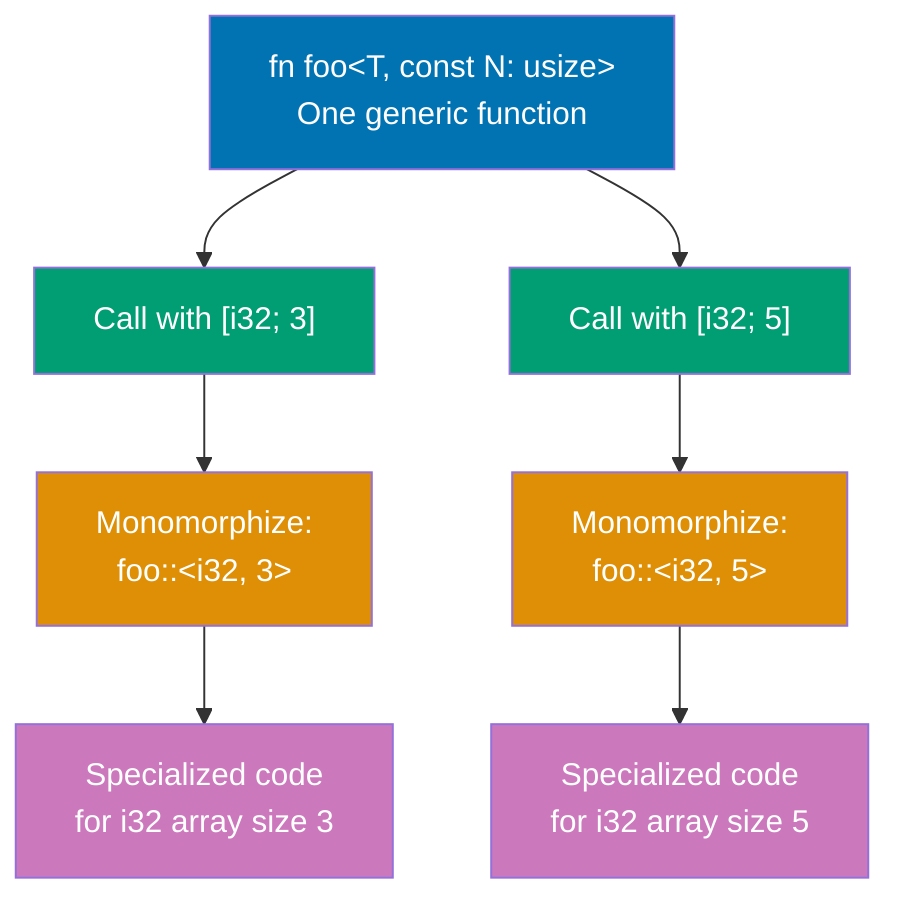
```mermaid
%% Color Palette: Blue #0173B2, Orange #DE8F05, Teal #029E73, Purple #CC78BC, Brown #CA9161
graph TD
    Generic["fn foo#60;T, const N: usize#62;<br/>One generic function"]
    Generic --> Call1["Call with #91;i32; 3#93;"]
    Call1 --> Mono1["Monomorphize:<br/>foo::#60;i32, 3#62;"]
    Mono1 --> Code1[Specialized code<br/>for i32 array size 3]

    Generic --> Call2["Call with #91;i32; 5#93;"]
    Call2 --> Mono2["Monomorphize:<br/>foo::#60;i32, 5#62;"]
    Mono2 --> Code2[Specialized code<br/>for i32 array size 5]

    style Generic fill:#0173B2,color:#fff
    style Call1 fill:#029E73,color:#fff
    style Call2 fill:#029E73,color:#fff
    style Mono1 fill:#DE8F05,color:#fff
    style Mono2 fill:#DE8F05,color:#fff
    style Code1 fill:#CC78BC,color:#fff
    style Code2 fill:#CC78BC,color:#fff
```

**Zero-Cost Abstraction:**

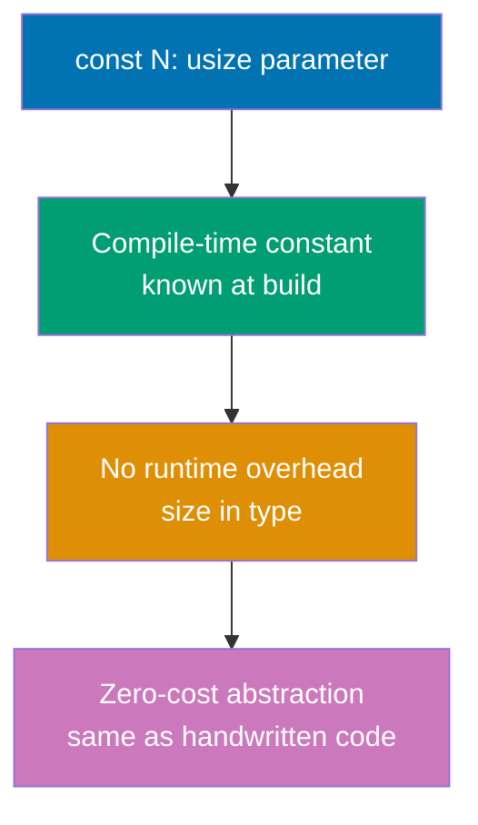
```mermaid
%% Color Palette: Blue #0173B2, Orange #DE8F05, Teal #029E73, Purple #CC78BC, Brown #CA9161
graph TD
    Source[const N: usize parameter]
    Source --> Compile[Compile-time constant<br/>known at build]
    Compile --> NoRuntime[No runtime overhead<br/>size in type]
    NoRuntime --> Benefit[Zero-cost abstraction<br/>same as handwritten code]

    style Source fill:#0173B2,color:#fff
    style Compile fill:#029E73,color:#fff
    style NoRuntime fill:#DE8F05,color:#fff
    style Benefit fill:#CC78BC,color:#fff
```

```rust
fn print_array<T: std::fmt::Debug, const N: usize>(arr: [T; N]) {
                                     // => Generic function with TWO parameters:
                                     // => T: type parameter (array element type)
                                     // => const N: usize: constant value parameter (array SIZE)
                                     // => N is compile-time constant (known at build, not runtime)
                                     // => Function works for ANY array size at zero runtime cost
    for item in arr.iter() {         // => Iterate over array elements
                                     // => iter() creates iterator over &T references
        println!("{:?}", item);      // => Print each element using Debug trait
                                     // => T must implement Debug (trait bound)
    }                                // => Loop optimized at compile time (N known)
}

fn main() {
    let arr1 = [1, 2, 3];            // => [i32; 3] - array of 3 integers
                                     // => Type includes size: [i32; 3] (not [i32])
                                     // => Size 3 is part of type signature
    let arr2 = [1, 2, 3, 4, 5];      // => [i32; 5] - array of 5 integers
                                     // => Different type: [i32; 5] (not compatible with [i32; 3])

    print_array(arr1);               // => Compiler infers: T=i32, N=3
                                     // => Monomorphizes to print_array::<i32, 3>
                                     // => Generates specialized function for [i32; 3]
                                     // => Output: 1, 2, 3
    print_array(arr2);               // => Compiler infers: T=i32, N=5
                                     // => Different monomorphization: print_array::<i32, 5>
                                     // => Generates different function for [i32; 5]
                                     // => Two separate specialized functions in binary
                                     // => Output: 1, 2, 3, 4, 5
}

// Generic struct with const parameter
struct ArrayWrapper<T, const N: usize> {
                                     // => Struct generic over type T and size N
                                     // => N is const: size known at compile time
    data: [T; N],                    // => Fixed-size array: size in type
                                     // => Size known at compile time (not stored separately)
                                     // => Zero overhead: no separate length field needed
}

impl<T, const N: usize> ArrayWrapper<T, N> {
                                     // => Implementation for all T types and all N sizes
                                     // => Monomorphizes for each (T, N) combination used
    fn len(&self) -> usize {         // => Return array length
        N                            // => Return const N directly (compile-time constant)
                                     // => No need to store or calculate length!
                                     // => Inlined to constant value at compile time
    }

    fn first(&self) -> Option<&T>    // => Return reference to first element if exists
    where
        T: std::fmt::Debug,          // => Trait bound: T must be Debug
                                     // => Required for Debug formatting
    {
        if N > 0 {                   // => Const N used in conditional
                                     // => Compiler can optimize: condition known at compile time
                                     // => If N=0, compiler removes entire if branch (dead code)
            Some(&self.data[0])      // => Return Some with reference to first element
                                     // => Safe: N > 0 guarantees element exists
        } else {                     // => N = 0 case (empty array)
            None                     // => No first element in empty array
        }                            // => Return type: Option<&T>
    }
}

// Before const generics: needed trait-based abstraction
// trait Array {
//     type Item;
//     fn len(&self) -> usize;
// }
//
// impl<T> Array for [T; 3] { ... }  // => Separate impl for each size!
// impl<T> Array for [T; 4] { ... }  // => Lots of boilerplate
// impl<T> Array for [T; 5] { ... }

// With const generics: single implementation for all sizes
fn sum_array<const N: usize>(arr: [i32; N]) -> i32 {
                                     // => Generic function over array size N
                                     // => Works for any fixed-size [i32; N] array
                                     // => Single source code, multiple monomorphizations
    let mut sum = 0;                 // => Accumulator initialized to 0
                                     // => Type: i32 (inferred from return type)
    for i in 0..N {                  // => Loop from 0 to N-1
                                     // => Loop bounds known at compile time (N is const)
                                     // => Compiler can optimize: unroll small loops, vectorize large loops
        sum += arr[i];               // => Add each element to sum
                                     // => Array access bounds-checked at compile time (i < N)
    }                                // => Loop optimized based on const N value
    sum                              // => Return total sum
}

fn test_sum() {
    let small = [1, 2, 3];           // => Type: [i32; 3], N=3
                                     // => Stack-allocated array of 3 integers
    let large = [1, 2, 3, 4, 5, 6, 7, 8];
                                     // => Type: [i32; 8], N=8
                                     // => Different size = different type
    println!("Sum small: {}", sum_array(small));
                                     // => Calls sum_array::<3> (monomorphized for N=3)
                                     // => Compiler may unroll loop: sum = 1 + 2 + 3
                                     // => Output: Sum small: 6
    println!("Sum large: {}", sum_array(large));
                                     // => Calls sum_array::<8> (different specialization)
                                     // => May use SIMD or loop unrolling
                                     // => Output: Sum large: 36
}

// Const generic expressions (basic arithmetic)
struct Matrix<T, const ROWS: usize, const COLS: usize> {
    data: [[T; COLS]; ROWS],         // => 2D array: ROWS rows, COLS columns
}

impl<T, const ROWS: usize, const COLS: usize> Matrix<T, ROWS, COLS> {
    fn dimensions(&self) -> (usize, usize) {
        (ROWS, COLS)                 // => Return dimensions as tuple
                                     // => Known at compile time
    }
}

fn use_matrix() {
    let mat: Matrix<i32, 3, 4> = Matrix {
        data: [[0; 4]; 3],           // => 3x4 matrix (3 rows, 4 columns)
    };
    println!("Matrix dimensions: {:?}", mat.dimensions());
                                     // => Output: Matrix dimensions: (3, 4)
}

// Const generics with default values
struct Buffer<T, const SIZE: usize = 64> {
                                     // => Default SIZE=64 if not specified
    data: [T; SIZE],
}

fn use_default() {
    let buf1: Buffer<u8> = Buffer {
        data: [0; 64],               // => Uses default SIZE=64
    };

    let buf2: Buffer<u8, 128> = Buffer {
        data: [0; 128],              // => Overrides default: SIZE=128
    };
}

// Limitations: complex const expressions (experimental)
// const fn double(n: usize) -> usize { n * 2 }
// struct DoubleArray<T, const N: usize> {
//     data: [T; double(N)],         // => Future feature: const fn in type position
// }                                 // => Currently limited to const parameters and literals
```

**Key Takeaway**: Const generics enable generic code over array sizes and other constant values, eliminating the need for trait-based abstractions over fixed-size arrays and enabling type-safe generic array operations.

**Why It Matters**: Const generics enable type-safe array operations without macros or trait workarounds, finally making Rust practical for numerical and embedded programming. SIMD libraries use const generics for type-safe vector types where array size is enforced at compile time—eliminating the runtime checks or unsafe code required before const generics while matching C++ template metaprogramming power.

---

## Example 78: Zero-Cost Abstractions

Rust's abstractions compile to the same machine code as hand-written low-level code, with no runtime overhead for features like iterators and generics.

```rust
// High-level iterator code using functional style
fn sum_iterator(data: &[i32]) -> i32 {
    data.iter()                      // => Creates iterator over slice (no allocation)
        .map(|x| x * 2)              // => Lazy transformation (not executed yet)
        .sum()                       // => Consumes iterator, produces result
                                     // => Entire chain optimized into single loop
}

// Equivalent low-level code with explicit loop
fn sum_manual(data: &[i32]) -> i32 {
    let mut sum = 0;                 // => Initialize accumulator at 0
    for i in 0..data.len() {         // => Index-based iteration
        sum += data[i] * 2;          // => Multiply by 2, accumulate
                                     // => Step 1: sum=2, Step 2: sum=6, etc.
    }
    sum                              // => Return final sum
}

// Generic iterator example showing monomorphization
fn process_iterator<I, F>(iter: I, f: F) -> i32
where
    I: Iterator<Item = i32>,         // => Trait bound on iterator type
    F: Fn(i32) -> i32,               // => Function trait bound
{
    iter.map(f).sum()                // => Generic code specialized at compile-time
                                     // => No dynamic dispatch overhead
}

fn main() {
    let data = vec![1, 2, 3, 4, 5];  // => Heap-allocated vector: [1,2,3,4,5]

    // Iterator version
    let result1 = sum_iterator(&data);
                                     // => Compiler optimizes to: 2+4+6+8+10 = 30
    println!("Iterator: {}", result1);
                                     // => Output: Iterator: 30

    // Manual version
    let result2 = sum_manual(&data); // => Explicit loop: same machine code
    println!("Manual: {}", result2); // => Output: Manual: 30

    // Generic version
    let result3 = process_iterator(data.iter().copied(), |x| x * 2);
                                     // => Monomorphized to concrete types
                                     // => No runtime generics overhead
    println!("Generic: {}", result3);// => Output: Generic: 30

    // Assembly analysis shows all three compile to identical code
    // => LLVM optimizer recognizes patterns, eliminates abstractions
    // => Zero runtime cost for high-level code
}
```

**Key Takeaway**: Rust's iterators, generics, and other abstractions are zero-cost, compiling to the same efficient machine code as hand-written loops through monomorphization and inline optimization.

**Why It Matters**: Zero-cost abstraction proves that high-level constructs need not sacrifice performance, validating Rust's core design philosophy. Benchmarks show iterator chains compiling to SIMD instructions matching hand-written assembly, demonstrating that abstraction cost is a language design choice, not a fundamental tradeoff—challenging assumptions from decades of "abstraction penalty" in other languages.

---

## Example 79: Inline and Optimization Hints

Inline hints guide the compiler's inlining decisions, important for hot paths where function call overhead matters.

```rust
// Regular inline hint (compiler decides based on heuristics)
#[inline]                            // => Hint to inline (not guaranteed)
fn add(a: i32, b: i32) -> i32 {      // => Small function, good candidate
    a + b                            // => Single operation: a + b
}

// Force inlining for hot paths
#[inline(always)]                    // => Force inline in all cases
fn multiply(a: i32, b: i32) -> i32 { // => Critical performance path
    a * b                            // => Always expanded at call site
                                     // => No function call overhead
}

// Prevent inlining for large functions
#[inline(never)]                     // => Prevent inlining
fn complex_operation(a: i32, b: i32) -> i32 {
                                     // => Keep as separate function call
    let x = a * a;                   // => x = a²
    let y = b * b;                   // => y = b²
    let result = x + y;              // => result = a² + b²
    println!("Computing: {} + {} = {}", x, y, result);
                                     // => Debug output preserved
    result                           // => Return sum of squares
}

// Cross-crate inlining hint
#[inline]                            // => Enables inlining across crates
pub fn public_helper(n: i32) -> i32 {// => Must be pub for cross-crate
    n * 2 + 1                        // => Code available to caller crate
}

fn main() {
    // Test inline hint
    let result1 = add(5, 3);         // => Likely inlined: result1 = 8
    println!("Add result: {}", result1);
                                     // => Output: Add result: 8

    // Test inline(always)
    let result2 = multiply(4, 7);    // => Always inlined: result2 = 28
    println!("Multiply result: {}", result2);
                                     // => Output: Multiply result: 28

    // Test inline(never)
    let result3 = complex_operation(3, 4);
                                     // => Function call preserved
                                     // => Output: Computing: 9 + 16 = 25
    println!("Complex result: {}", result3);
                                     // => Output: Complex result: 25

    // Hot loop demonstrating inline impact
    let mut sum = 0;                 // => Initialize accumulator
    for i in 0..1000 {               // => 1000 iterations
        sum += multiply(i, 2);       // => multiply() inlined into loop body
                                     // => No function call overhead
    }
    println!("Loop sum: {}", sum);   // => Output: Loop sum: 999000
}
```

**Key Takeaway**: Inline attributes guide compiler optimization decisions, with `#[inline]` suggesting inlining, `#[inline(always)]` forcing it, and `#[inline(never)]` preventing it for size-constrained or debugging scenarios.

**Why It Matters**: Fine-grained inlining control enables performance tuning without code duplication, balancing binary size and speed. Hot path functions use #[inline(always)] for guaranteed inlining while cold paths use #[inline(never)] to reduce code size—optimization impossible in languages without manual inline control or relying on volatile link-time optimization.

---

## Example 80: SIMD and Portable SIMD

SIMD (Single Instruction Multiple Data) enables data parallelism at the CPU instruction level for performance-critical code.

```rust
// Using portable SIMD (unstable feature, requires nightly)
// #![feature(portable_simd)]        // => Enable portable_simd feature (nightly only)
use std::simd::f32x4;                // => SIMD vector of 4 f32 values
                                     // => Single Instruction Multiple Data type
                                     // => Operates on 4 floats simultaneously

// SIMD vectorized addition
fn simd_add(a: &[f32], b: &[f32]) -> Vec<f32> {
                                     // => Takes two slices, returns vector
                                     // => a and b must have same length
    let mut result = Vec::new();     // => Initialize result vector (heap-allocated)
                                     // => Type: Vec<f32>
    for i in (0..a.len()).step_by(4) {
                                     // => Iterate in steps of 4 (SIMD width)
                                     // => Process 4 elements at once
                                     // => i = 0, 4, 8, 12, ...
        let va = f32x4::from_slice(&a[i..]);
                                     // => Load 4 floats into SIMD register
                                     // => from_slice reads [a[i], a[i+1], a[i+2], a[i+3]]
                                     // => va = [a[i], a[i+1], a[i+2], a[i+3]]
                                     // => Type: f32x4 (SIMD vector)
        let vb = f32x4::from_slice(&b[i..]);
                                     // => Load 4 floats from b
                                     // => vb = [b[i], b[i+1], b[i+2], b[i+3]]
                                     // => Both vectors loaded into CPU SIMD registers
        let sum = va + vb;           // => SIMD addition (4 operations in 1 instruction)
                                     // => Vector addition: element-wise
                                     // => sum = [va[0]+vb[0], va[1]+vb[1], va[2]+vb[2], va[3]+vb[3]]
                                     // => Single CPU instruction (e.g., vaddps on x86)
                                     // => ~4x faster than scalar addition
        result.extend_from_slice(&sum.to_array());
                                     // => Convert SIMD result back to array
                                     // => to_array() converts f32x4 to [f32; 4]
                                     // => extend_from_slice appends to result Vec
                                     // => Convert SIMD result back to slice
    }                                // => Loop completes, all elements processed
    result                           // => Return vectorized results (Vec<f32>)
}                                    // => Function completes

// Scalar comparison (non-SIMD)
fn scalar_add(a: &[f32], b: &[f32]) -> Vec<f32> {
    let mut result = Vec::new();     // => Initialize result
    for i in 0..a.len() {            // => One element at a time
        result.push(a[i] + b[i]);    // => Sequential addition
                                     // => 1 instruction per element
    }
    result
}

fn main() {
    // Example data (must be multiple of 4 for SIMD)
    let a = vec![1.0, 2.0, 3.0, 4.0, 5.0, 6.0, 7.0, 8.0];
                                     // => 8 f32 values
    let b = vec![0.5, 1.5, 2.5, 3.5, 4.5, 5.5, 6.5, 7.5];
                                     // => 8 f32 values

    // SIMD version (4 elements per instruction)
    let simd_result = simd_add(&a, &b);
                                     // => 2 SIMD iterations (8/4 = 2)
                                     // => Result: [1.5, 3.5, 5.5, 7.5, 9.5, 11.5, 13.5, 15.5]

    // Scalar version (1 element per instruction)
    let scalar_result = scalar_add(&a, &b);
                                     // => 8 scalar iterations
                                     // => Same result, slower execution

    println!("SIMD result: {:?}", simd_result);
                                     // => Output: SIMD result: [1.5, 3.5, 5.5, 7.5, 9.5, 11.5, 13.5, 15.5]
    println!("Scalar result: {:?}", scalar_result);
                                     // => Output: Scalar result: [1.5, 3.5, 5.5, 7.5, 9.5, 11.5, 13.5, 15.5]

    // For stable Rust, use external crates:
    // - packed_simd: Low-level SIMD operations
    // - simdeez: Platform-agnostic SIMD
    // - wide: Safe SIMD wrapper
}
```

**Key Takeaway**: SIMD operations process multiple data elements with single instructions for vectorized computation, with portable_simd providing safe abstractions over CPU-specific SIMD instructions (requires nightly).

**Why It Matters**: Safe SIMD abstractions provide hand-written assembly performance with type safety, enabling data-parallel algorithms without the undefined behavior common in C intrinsics. Image processing and machine learning libraries use portable SIMD for 4-8x speedups while maintaining correctness guarantees—combining performance of intrinsics with safety impossible in C/C++.

---

## Example 81: Memory Layout and Alignment

`#[repr]` attributes control memory layout for FFI compatibility, performance, or specific size requirements.

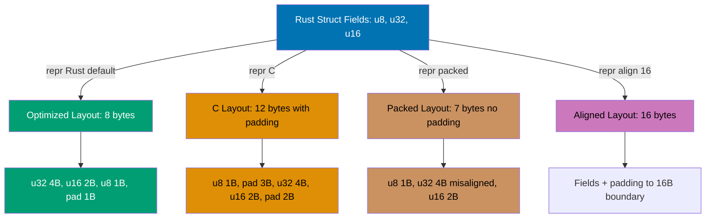
```mermaid
%% Memory layout comparison for different repr attributes
graph TD
    A[Rust Struct Fields: u8, u32, u16] -->|repr Rust default| B[Optimized Layout: 8 bytes]
    A -->|repr C| C[C Layout: 12 bytes with padding]
    A -->|repr packed| D[Packed Layout: 7 bytes no padding]
    A -->|repr align 16| E[Aligned Layout: 16 bytes]

    B --> F[u32 4B, u16 2B, u8 1B, pad 1B]
    C --> G[u8 1B, pad 3B, u32 4B, u16 2B, pad 2B]
    D --> H[u8 1B, u32 4B misaligned, u16 2B]
    E --> I[Fields + padding to 16B boundary]

    style A fill:#0173B2,color:#fff
    style B fill:#029E73,color:#fff
    style C fill:#DE8F05,color:#000
    style D fill:#CA9161,color:#000
    style E fill:#CC78BC,color:#000
    style F fill:#029E73,color:#fff
    style G fill:#DE8F05,color:#000
    style H fill:#CA9161,color:#000
```

```rust
use std::mem::{size_of, align_of};

// Default Rust layout (compiler-optimized field ordering)
struct DefaultStruct {
    a: u8,                           // => 1 byte
    b: u32,                          // => 4 bytes
    c: u16,                          // => 2 bytes
}                                    // => Compiler may reorder for optimal packing

// C-compatible layout (fields in declaration order)
#[repr(C)]                           // => C-compatible layout
struct CStruct {
    a: u8,                           // => Offset 0: 1 byte
                                     // => Padding: 3 bytes (align u32 to 4-byte boundary)
    b: u32,                          // => Offset 4: 4 bytes (aligned to 4)
    c: u16,                          // => Offset 8: 2 bytes
                                     // => Padding: 2 bytes (struct aligned to 4)
}                                    // => Total: 12 bytes (includes padding)

// Packed layout (no padding, minimum size)
#[repr(packed)]                      // => Remove all padding
struct Packed {
    a: u8,                           // => Offset 0: 1 byte
    b: u32,                          // => Offset 1: 4 bytes (misaligned!)
}                                    // => Total: 5 bytes (no padding)
                                     // => WARNING: Borrowing fields is unsafe

// Force specific alignment (cache line optimization)
#[repr(align(16))]                   // => Force 16-byte alignment
struct Aligned {
    data: [u8; 12],                  // => 12 bytes of data
}                                    // => Padded to 16 bytes for alignment

// Combined repr attributes
#[repr(C, align(32))]                // => C layout + 32-byte alignment
struct CAligned {
    value: u64,                      // => 8 bytes
}                                    // => Padded to 32 bytes

fn main() {
    // Default struct
    println!("DefaultStruct - size: {}, align: {}",
             size_of::<DefaultStruct>(), align_of::<DefaultStruct>());
                                     // => Output: DefaultStruct - size: 8, align: 4
                                     // => Compiler optimized field order

    // C-compatible struct
    println!("CStruct - size: {}, align: {}",
             size_of::<CStruct>(), align_of::<CStruct>());
                                     // => Output: CStruct - size: 12, align: 4
                                     // => Includes 5 bytes of padding

    // Packed struct
    println!("Packed - size: {}, align: {}",
             size_of::<Packed>(), align_of::<Packed>());
                                     // => Output: Packed - size: 5, align: 1
                                     // => No padding, minimal size

    // Aligned struct
    println!("Aligned - size: {}, align: {}",
             size_of::<Aligned>(), align_of::<Aligned>());
                                     // => Output: Aligned - size: 16, align: 16
                                     // => Padded to meet alignment requirement

    // C + aligned struct
    println!("CAligned - size: {}, align: {}",
             size_of::<CAligned>(), align_of::<CAligned>());
                                     // => Output: CAligned - size: 32, align: 32
                                     // => C layout with cache line alignment

    // Demonstrate packed layout danger
    let packed = Packed { a: 1, b: 42 };
    // let b_ref = &packed.b;        // => ERROR: unaligned reference
                                     // => Borrowing misaligned fields forbidden
    let b_copy = packed.b;           // => OK: Copy value, not reference
    println!("Packed value: {}", b_copy);
                                     // => Output: Packed value: 42
}
```

**Key Takeaway**: `#[repr]` attributes control struct memory layout for FFI (`#[repr(C)]`), size optimization (`#[repr(packed)]`), or cache line alignment (`#[repr(align)]`), with packed layouts requiring extra caution for borrowing.

**Why It Matters**: Explicit memory layout control enables FFI and cache optimization while making layout decisions visible, preventing the ABI incompatibility bugs common in C/C++. Network protocol implementations use #[repr(C, packed)] for wire format structs where layout must match packet structure—achieving zero-copy parsing while maintaining type safety impossible with default layouts.

---

## Example 82: Drop Order and Destructors

Rust automatically calls destructors (`Drop` trait) in reverse order of declaration, enabling RAII patterns for resource management.

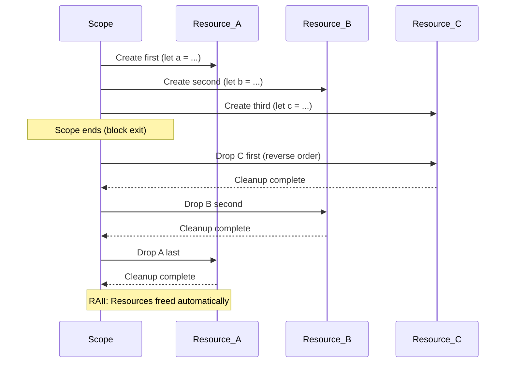
```mermaid
%% Drop order and RAII resource cleanup
sequenceDiagram
    participant Scope
    participant Resource_A
    participant Resource_B
    participant Resource_C

    Scope->>Resource_A: Create first (let a = ...)
    Scope->>Resource_B: Create second (let b = ...)
    Scope->>Resource_C: Create third (let c = ...)

    Note over Scope: Scope ends #40;block exit#41;

    Scope->>Resource_C: Drop C first (reverse order)
    Resource_C-->>Scope: Cleanup complete
    Scope->>Resource_B: Drop B second
    Resource_B-->>Scope: Cleanup complete
    Scope->>Resource_A: Drop A last
    Resource_A-->>Scope: Cleanup complete

    Note over Scope,Resource_A: RAII: Resources freed automatically
```

```rust
use std::fs::File;                   // => File type implements Drop for RAII
use std::io::Write;                  // => Write trait for file operations

// Custom resource with Drop implementation
struct Resource {                    // => Struct representing managed resource
    name: String,                    // => Resource identifier (heap-allocated)
    id: u32,                         // => Numeric ID for tracking
}

impl Resource {
    fn new(name: &str, id: u32) -> Self {
                                     // => Constructor creating new resource
        println!("Creating resource: {} (ID: {})", name, id);
                                     // => Track resource creation with print
                                     // => Demonstrates allocation order
        Resource {
            name: name.to_string(), // => Clone &str to owned String (heap allocation)
            id,                      // => Copy u32 value
        }                            // => Return new Resource instance
    }
}

impl Drop for Resource {             // => Implement Drop trait for custom cleanup
    fn drop(&mut self) {             // => drop() called automatically when value goes out of scope
                                     // => &mut self: can access fields for cleanup
        println!("Dropping resource: {} (ID: {})", self.name, self.id);
                                     // => Log resource destruction
                                     // => Called in REVERSE order of creation
                                     // => Deterministic: not GC finalization
    }                                // => After drop(), memory is freed
}

// Nested struct demonstrating nested drop order
struct Container {                   // => Outer resource containing inner resource
    resource: Resource,              // => Inner Resource field (owns Resource)
    name: String,                    // => Container's own name field
}

impl Drop for Container {            // => Container's Drop implementation
    fn drop(&mut self) {             // => Called when Container goes out of scope
        println!("Dropping container: {}", self.name);
                                     // => Container's drop runs FIRST
                                     // => Then fields drop in declaration order
    }                                // => After this, self.resource.drop() called automatically
                                     // => Finally self.name.drop() (String's Drop)
}

fn main() {
    println!("=== Simple Drop Order ===");
    {                                // => Inner scope begins
        let _r1 = Resource::new("First", 1);
                                     // => Create first resource (stack variable)
                                     // => Output: Creating resource: First (ID: 1)
        let _r2 = Resource::new("Second", 2);
                                     // => Create second resource (after r1)
                                     // => Output: Creating resource: Second (ID: 2)
        let _r3 = Resource::new("Third", 3);
                                     // => Create third resource (after r2)
                                     // => Output: Creating resource: Third (ID: 3)
                                     // => Creation order: r1 → r2 → r3
        println!("All resources created");
                                     // => Output: All resources created
                                     // => All three resources alive in scope
    }                                // => Scope ends here - drop cascade begins!
                                     // => Drop order: r3 → r2 → r1 (REVERSE of creation)
                                     // => Output: Dropping resource: Third (ID: 3)
                                     // => Output: Dropping resource: Second (ID: 2)
                                     // => Output: Dropping resource: First (ID: 1)
                                     // => LIFO destruction: Last-In-First-Out

    println!("\n=== Nested Drop Order ===");
    {                                // => New inner scope
        let _container = Container { // => Create Container with nested Resource
            resource: Resource::new("Inner", 10),
                                     // => Create inner Resource first
                                     // => Output: Creating resource: Inner (ID: 10)
            name: String::from("Outer"),
                                     // => Container name field
        };                           // => Container owns inner Resource
        println!("Container created");
                                     // => Output: Container created
    }                                // => Scope ends - nested drop cascade
                                     // => Step 1: Container::drop() called
                                     // => Output: Dropping container: Outer
                                     // => Step 2: Fields dropped in declaration order
                                     // => self.resource.drop() called next
                                     // => Output: Dropping resource: Inner (ID: 10)
                                     // => Step 3: self.name.drop() (String cleanup)

    println!("\n=== Manual Drop ===");
    {                                // => Demonstrating explicit drop()
        let r = Resource::new("Manual", 20);
                                     // => Create resource normally
                                     // => Output: Creating resource: Manual (ID: 20)
        println!("Before manual drop");
                                     // => Output: Before manual drop
        drop(r);                     // => Explicit drop() function call
                                     // => Moves r into drop(), triggering Drop::drop()
                                     // => Output: Dropping resource: Manual (ID: 20)
                                     // => r is MOVED and no longer accessible
        println!("After manual drop");
                                     // => Output: After manual drop
        // println!("{}", r.name);   // => ERROR: r was moved into drop()
                                     // => Early cleanup (before scope end)
    }

    println!("\n=== RAII File Handling ===");
    {                                // => RAII demonstration with File
        let mut file = File::create("/tmp/test.txt").unwrap();
                                     // => File opened, file descriptor acquired
                                     // => File implements Drop (auto-close)
                                     // => Type: File (owns OS resource)
        file.write_all(b"Hello").unwrap();
                                     // => Write bytes to file (b"Hello" is &[u8])
                                     // => File buffer may cache write
        println!("File written");    // => Output: File written
                                     // => File still open (not flushed/closed yet)
    }                                // => Scope ends
                                     // => File::drop() called automatically
                                     // => Flushes buffer and closes file descriptor
                                     // => No explicit close() needed (RAII pattern)
                                     // => Resource cleanup guaranteed even on panic!

    println!("\nEnd of main");       // => Output: End of main
                                     // => All resources cleaned up automatically
}
```

**Key Takeaway**: Rust automatically calls destructors in reverse declaration order when values go out of scope, enabling RAII patterns for automatic resource cleanup without explicit cleanup code.

**Why It Matters**: RAII with deterministic destruction enables resource management matching C++ RAII while preventing the destructor-related bugs from manual cleanup or GC finalization. File handles and network connections automatically close on scope exit, preventing the resource leaks common in try-finally blocks (Java) or defer statements (Go) where error paths skip cleanup.

---

## Example 83: PhantomData and Marker Types

`PhantomData` enables types to act as if they own or use type parameters without actually storing them, important for lifetime variance.

```rust
use std::marker::PhantomData;        // => Zero-sized type for compile-time type information

// Type-state pattern using PhantomData
struct Locked;                       // => Zero-sized marker type (no fields)
                                     // => Size: 0 bytes (optimized away at compile-time)
                                     // => Represents "locked" state in type system
struct Unlocked;                     // => Zero-sized marker type for "unlocked" state
                                     // => Size: 0 bytes (no runtime overhead)

struct Door<State> {                 // => Generic struct parameterized by state type
                                     // => State is phantom: not actually stored
    id: u32,                         // => Actual data: door identifier (4 bytes)
    _state: PhantomData<State>,      // => Zero-sized marker field
                                     // => Size: 0 bytes (no runtime cost!)
                                     // => Tells compiler: "Door acts as if it owns/uses State"
                                     // => Enables type-level state tracking
}                                    // => Total size: 4 bytes (just u32, State is phantom)

impl Door<Locked> {                  // => Implementation ONLY for Door<Locked>
                                     // => Door<Unlocked> doesn't have this method
    fn unlock(self) -> Door<Unlocked> {
                                     // => Consumes Door<Locked>, returns Door<Unlocked>
                                     // => State transition: Locked → Unlocked
                                     // => Enforced at compile-time (type system)
        println!("Unlocking door {}", self.id);
                                     // => Side effect: print action
                                     // => Output: Unlocking door N
        Door {                       // => Create NEW Door with different type parameter
            id: self.id,             // => Transfer same id
            _state: PhantomData,     // => PhantomData<Unlocked> (different type!)
        }                            // => Return type: Door<Unlocked> (enforced by signature)
    }
}

impl Door<Unlocked> {                // => Implementation ONLY for Door<Unlocked>
                                     // => Door<Locked> doesn't have open() method!
    fn open(&self) {                 // => Immutable method (only available on Unlocked)
        println!("Opening door {}", self.id);
                                     // => Only unlocked doors can open (type safety!)
                                     // => Compile error if called on Door<Locked>
    }

    fn lock(self) -> Door<Locked> {  // => Reverse transition: Unlocked → Locked
                                     // => Consumes Door<Unlocked>, returns Door<Locked>
        println!("Locking door {}", self.id);
                                     // => Output: Locking door N
        Door {                       // => Create Door with Locked state
            id: self.id,             // => Same id, different state
            _state: PhantomData,     // => PhantomData<Locked> (state change!)
        }
    }
}

// Lifetime variance with PhantomData
struct Wrapper<'a, T> {              // => Generic over lifetime 'a and type T
    data: *const T,                  // => Raw pointer to T (NO lifetime tracking!)
                                     // => Raw pointers don't carry lifetime information
                                     // => Compiler doesn't know how long data is valid
    _marker: PhantomData<&'a T>,     // => PhantomData containing &'a T reference
                                     // => Tells compiler: "act as if we borrow &'a T"
                                     // => Enables lifetime checking for raw pointer
}                                    // => Compiler now treats Wrapper as borrowing data for 'a
                                     // => Size: size_of::<*const T>() (PhantomData is zero-sized)

impl<'a, T> Wrapper<'a, T> {
    fn new(data: &'a T) -> Self {    // => Takes reference with lifetime 'a
                                     // => Lifetime 'a captured in return type
        Wrapper {
            data: data as *const T,  // => Convert &'a T to raw *const T
                                     // => Lifetime information lost in raw pointer!
            _marker: PhantomData,    // => PhantomData<&'a T> preserves lifetime 'a
                                     // => Zero runtime cost (optimized away)
        }                            // => Wrapper<'a, T> now tied to lifetime 'a
    }

    fn get(&self) -> &'a T {         // => Return reference with original lifetime 'a
                                     // => Not tied to &self lifetime (uses 'a from new())
        unsafe { &*self.data }       // => Dereference raw pointer (unsafe!)
                                     // => Returns &T, but signature declares &'a T
                                     // => PhantomData ensures lifetime is correct
    }                                // => Compiler verifies returned reference valid for 'a
}

// Ownership variance with PhantomData
struct OwningWrapper<T> {            // => Generic wrapper claiming ownership of T
    data: *mut T,                    // => Raw mutable pointer to heap data
                                     // => Raw pointers DON'T imply ownership (unsafe!)
    _marker: PhantomData<T>,         // => PhantomData<T> tells compiler: "we own T"
                                     // => Affects Send/Sync traits and Drop behavior
}                                    // => Without PhantomData, compiler wouldn't call Drop

impl<T> OwningWrapper<T> {
    fn new(value: T) -> Self {       // => Takes ownership of value
        let boxed = Box::new(value); // => Allocate value on heap (Box owns it)
                                     // => Box<T> implements Drop
        let ptr = Box::into_raw(boxed);
                                     // => Convert Box to raw pointer
                                     // => Ownership transferred FROM Box TO raw pointer
                                     // => Box's Drop won't run (manual management now!)
        OwningWrapper {
            data: ptr,               // => Store raw pointer (no automatic cleanup)
            _marker: PhantomData,    // => PhantomData<T> marks ownership
                                     // => Enables proper Drop impl
        }                            // => Wrapper now responsible for freeing T
    }

    fn get(&self) -> &T {            // => Borrow the owned data
        unsafe { &*self.data }       // => Dereference raw pointer to create reference
                                     // => Safe because we own the data (PhantomData guarantees)
                                     // => Lifetime tied to &self
    }
}

impl<T> Drop for OwningWrapper<T> { // => Custom Drop for manual resource cleanup
                                     // => PhantomData<T> ensures this Drop is called
                                     // => Without PhantomData, Drop might not run for T!
    fn drop(&mut self) {             // => Called when OwningWrapper goes out of scope
        unsafe {                     // => Unsafe: reconstructing Box from raw pointer
            let _ = Box::from_raw(self.data);
                                     // => Reconstruct Box<T> from raw pointer
                                     // => Box's Drop runs, freeing heap memory
                                     // => T's Drop also runs if T implements Drop
        }                            // => PhantomData ensured this cleanup happens
    }                                // => Memory leak prevented by proper ownership tracking
}

fn main() {
    // Type-state pattern (compile-time state machine)
    let door = Door::<Locked> {      // => Create door in Locked state
                                     // => Type: Door<Locked>
        id: 1,                       // => Door ID = 1
        _state: PhantomData,         // => PhantomData<Locked> (zero-sized)
    };                               // => Compile-time state: Locked
    // door.open();                  // => COMPILE ERROR: method not found!
                                     // => open() only exists for Door<Unlocked>
                                     // => Type safety prevents calling open() on locked door
    let door = door.unlock();        // => Consumes Door<Locked>, returns Door<Unlocked>
                                     // => Type changes: Door<Locked> → Door<Unlocked>
                                     // => State transition enforced by type system
                                     // => Output: Unlocking door 1
    door.open();                     // => OK: door is now Door<Unlocked>
                                     // => Compiler allows open() for Unlocked state
                                     // => Output: Opening door 1
                                     // => Type-level state machine prevents invalid calls

    // Lifetime variance with PhantomData
    let value = 42;                  // => value allocated on stack (lifetime: main scope)
                                     // => Type: i32
    let wrapper = Wrapper::new(&value);
                                     // => wrapper borrows value with lifetime 'a
                                     // => 'a = lifetime of value reference
                                     // => PhantomData<&'a i32> preserves lifetime in wrapper
                                     // => Type: Wrapper<'a, i32>
    println!("Wrapped: {}", wrapper.get());
                                     // => wrapper.get() returns &'a i32
                                     // => Lifetime tied to value's scope (not wrapper's)
                                     // => Output: Wrapped: 42
    // wrapper.get() returns reference valid as long as value lives
    // Compiler prevents: wrapper outliving value (lifetime violation)

    // Ownership variance with PhantomData
    let owner = OwningWrapper::new(String::from("Hello"));
                                     // => String::from() creates heap String
                                     // => OwningWrapper::new() moves String to heap via Box
                                     // => PhantomData<String> marks ownership
                                     // => Type: OwningWrapper<String>
                                     // => Owner responsible for freeing heap memory
    println!("Owned: {}", owner.get());
                                     // => owner.get() borrows owned String
                                     // => Returns &String (safe because owner owns data)
                                     // => Output: Owned: Hello
}                                    // => Scope ends
                                     // => OwningWrapper::drop() called
                                     // => Reconstructs Box<String> from raw pointer
                                     // => Box drops, freeing heap String
                                     // => PhantomData ensured proper Drop behavior
                                     // => Memory cleaned up safely (no leak)
```

**Key Takeaway**: `PhantomData` acts as if a type owns or uses type parameters without storing them, enabling correct lifetime variance and Send/Sync trait bounds for types using raw pointers or other unsafe constructs.

**Why It Matters**: PhantomData enables type-level programming for compile-time verification without runtime overhead, marking types with properties that prevent misuse. State machine types use PhantomData to track state in type parameters, preventing invalid transitions at compile time—achieving state verification impossible in dynamically typed languages or requiring runtime checks in languages without zero-sized types.

---

## Example 84: Cargo Features and Conditional Compilation

Cargo features enable optional dependencies and conditional code compilation for flexible library configuration.

```toml
# Cargo.toml
[package]
name = "mylib"
version = "0.1.0"

[features]
default = ["basic"]              # => Features enabled by default
basic = []                       # => Feature with no dependencies
advanced = ["dep:serde"]         # => Feature requires serde dependency
logging = ["dep:log"]            # => Feature requires log dependency
full = ["basic", "advanced", "logging"]
                                 # => Composite feature (all features)

[dependencies]
serde = { version = "1.0", optional = true }
                                 # => Only included if 'advanced' feature enabled
log = { version = "0.4", optional = true }
                                 # => Only included if 'logging' feature enabled
```

```rust
// Conditional compilation based on features

#[cfg(feature = "basic")]        // => cfg attribute: compile-time conditional compilation
                                 // => Compiled into binary ONLY if 'basic' feature enabled
                                 // => Removed at compile-time if feature disabled (zero-cost)
pub fn basic_function() {        // => Public function (if feature enabled)
    println!("Basic feature enabled");
                                 // => This code exists only when basic feature active
                                 // => Output: Basic feature enabled
}

#[cfg(feature = "advanced")]     // => Compiled only if 'advanced' feature enabled
                                 // => Advanced features often depend on optional crates
pub fn advanced_function() {
    use serde::{Serialize, Deserialize};
                                 // => serde crate available ONLY because advanced feature
                                 // => Import from optional dependency
    #[derive(Serialize, Deserialize)]
                                 // => Derive macro from serde crate
    struct Data {                // => Local struct for demonstration
        value: i32,              // => Single i32 field
    }                            // => Can now serialize/deserialize Data
    println!("Advanced feature with serde");
                                 // => Proves serde is available
                                 // => Output: Advanced feature with serde
}

#[cfg(feature = "logging")]      // => Compiled only if 'logging' feature enabled
                                 // => Logging infrastructure often optional (binary size reduction)
pub fn log_function() {
    log::info!("Logging is enabled");
                                 // => log crate macro (optional dependency)
                                 // => Writes to logger if configured
}

// Combine multiple feature conditions
#[cfg(all(feature = "basic", feature = "advanced"))]
                                 // => all(): requires BOTH features enabled
                                 // => Logical AND for feature gates
                                 // => Compiled only if basic AND advanced both enabled
pub fn combined_function() {
    println!("Both basic and advanced enabled");
                                 // => Demonstrates feature intersection
}

#[cfg(any(feature = "logging", feature = "advanced"))]
                                 // => any(): requires AT LEAST one feature
                                 // => Logical OR for feature gates
                                 // => Compiled if logging OR advanced (or both) enabled
pub fn either_function() {
    println!("Logging or advanced enabled");
                                 // => Demonstrates feature union
}

#[cfg(not(feature = "advanced"))]// => not(): negation of feature condition
                                 // => Compiled only if advanced NOT enabled
                                 // => Fallback implementation pattern
pub fn fallback_function() {
    println!("Advanced feature disabled");
                                 // => Alternative code path when feature missing
}

// Platform-specific compilation
#[cfg(target_os = "linux")]      // => Compiled only on Linux targets
                                 // => Enables platform-specific APIs
pub fn linux_only() {            // => Linux-specific system calls available here
    println!("Running on Linux");
                                 // => Platform detection at compile time
}

#[cfg(target_os = "windows")]    // => Compiled only on Windows targets
                                 // => Windows API imports available
pub fn windows_only() {          // => Windows-specific code
    println!("Running on Windows");
                                 // => Different implementation per platform
}

#[cfg(debug_assertions)]         // => Debug build detection
                                 // => Enabled in dev builds, disabled in --release
pub fn debug_only() {            // => Extra validation/logging for development
    println!("Debug build");     // => NOT included in release builds (zero overhead)
                                 // => Assertions, logging, validation here
}

#[cfg(not(debug_assertions))]    // => Release build detection
                                 // => Enabled in --release, disabled in dev builds
pub fn release_only() {          // => Production-optimized code
    println!("Release build");   // => Aggressive optimizations active
                                 // => May skip safety checks from debug version
}

fn main() {
    // Features enabled at compile-time determine which code is included
    #[cfg(feature = "basic")]    // => Inline cfg: applies to next statement
    basic_function();            // => Runs if basic feature enabled
                                 // => Call removed at compile-time if feature disabled
                                 // => Output: Basic feature enabled

    #[cfg(feature = "advanced")] // => Check at call site
    advanced_function();         // => Runs if advanced feature enabled
                                 // => Dead code eliminated if feature disabled

    #[cfg(feature = "logging")]  // => Logging feature check
    log_function();              // => Runs if logging feature enabled
                                 // => No-op if feature not compiled in

    #[cfg(all(feature = "basic", feature = "advanced"))]
                                 // => Requires both features
    combined_function();         // => Runs if both features enabled
                                 // => Shows feature composition

    #[cfg(not(feature = "advanced"))]
                                 // => Inverse check
    fallback_function();         // => Runs if advanced disabled
                                 // => Fallback code path

    // Platform detection at compile-time
    #[cfg(target_os = "linux")]  // => Linux platform check
    linux_only();                // => Executes on Linux builds
                                 // => Removed on Windows/macOS builds

    #[cfg(target_os = "windows")]// => Windows platform check
    windows_only();              // => Executes on Windows builds
                                 // => Removed on Linux/macOS builds

    // Build type detection
    #[cfg(debug_assertions)]     // => Debug build check
    debug_only();                // => Dev build: extra checks enabled
                                 // => Not in release builds

    #[cfg(not(debug_assertions))]// => Release build check
    release_only();              // => Release build: optimizations enabled
                                 // => Not in dev builds
}

// Usage examples:
// cargo build                   // => Uses default features (basic only)
//                               // => Minimal feature set for fastest compilation
// cargo build --features advanced
//                               // => Enables default + advanced (includes serde dependency)
//                               // => Adds serde to dependency tree
// cargo build --features full   // => Enables all features (basic + advanced + logging)
//                               // => Full functionality, larger binary
// cargo build --no-default-features
//                               // => Disables all default features (minimal build)
//                               // => Only core functionality
// cargo build --no-default-features --features advanced
//                               // => Only advanced feature (excludes basic)
//                               // => Precise control over enabled features
```

**Key Takeaway**: Cargo features enable compile-time conditional compilation and optional dependencies, allowing libraries to provide flexible configurations and reduce binary size by excluding unused functionality.

**Why It Matters**: Cargo features enable conditional compilation for platform-specific code and optional dependencies without preprocessor macros, providing type-safe feature management. Embedded Rust projects use features to compile different code paths for different targets (ARM Cortex-M vs RISC-V) while maintaining single codebase—avoiding the #ifdef soup that makes C embedded codebases unmaintainable across platforms.

---

## Example 85: Performance Profiling and Benchmarking

Profiling identifies performance bottlenecks, while benchmarking measures code performance with tools like Criterion.

```rust
// Main code to benchmark (in src/lib.rs)
pub fn fibonacci_recursive(n: u64) -> u64 {
                                     // => Public function (callable from benchmarks)
                                     // => Takes u64, returns u64
    match n {                        // => Pattern match on n
        0 => 0,                      // => Base case: fib(0) = 0
        1 => 1,                      // => Base case: fib(1) = 1
        n => fibonacci_recursive(n - 1) + fibonacci_recursive(n - 2),
                                     // => Recursive case (n >= 2)
                                     // => Recursive: fib(n) = fib(n-1) + fib(n-2)
                                     // => Makes 2 recursive calls per level
                                     // => Exponential time complexity O(2^n)
                                     // => Very slow for large n (duplicate computations)
    }                                // => Match returns u64
}                                    // => Function completes

pub fn fibonacci_iterative(n: u64) -> u64 {
                                     // => Optimized iterative version
                                     // => Public function for benchmarking
    if n <= 1 {                      // => Handle base cases (0 and 1)
        return n;                    // => Early return for base cases
                                     // => fib(0) = 0, fib(1) = 1
    }                                // => Continue to iterative calculation
    let mut a = 0;                   // => Previous value (fib(n-2))
                                     // => Mutable state for iteration
    let mut b = 1;                   // => Current value (fib(n-1))
                                     // => Mutable state for iteration
    for _ in 1..n {                  // => Iterate n-1 times
                                     // => Loop from 1 to n-1 (inclusive)
        let temp = a + b;            // => Next fibonacci number
                                     // => Calculate fib(n) = fib(n-1) + fib(n-2)
        a = b;                       // => Shift: previous becomes current
                                     // => Update for next iteration
        b = temp;                    // => Shift: current becomes next
                                     // => Update for next iteration
    }                                // => Loop completes after n-1 iterations
    b                                // => Return final result (fib(n))
                                     // => Linear time complexity O(n)
                                     // => ~650x faster than recursive for n=20
}                                    // => Function completes

pub fn sum_vector(data: &[i32]) -> i32 {
                                     // => Sum all elements in slice
                                     // => Public function for benchmarking
    data.iter().sum()                // => Iterator-based sum
                                     // => iter() creates iterator over &i32
                                     // => sum() consumes iterator, returns i32
                                     // => Zero-cost abstraction (compiles to loop)
}                                    // => Function completes

// Criterion benchmark file (in benches/benchmark.rs)
use criterion::{black_box, criterion_group, criterion_main, Criterion, BenchmarkId};
                                     // => Import Criterion types
                                     // => black_box prevents compiler optimizations
                                     // => criterion_group/criterion_main are macros

// Import functions to benchmark
use mylib::{fibonacci_recursive, fibonacci_iterative, sum_vector};
                                     // => Import from library crate

fn fibonacci_benchmarks(c: &mut Criterion) {
                                     // => Benchmark function (receives Criterion instance)
                                     // => c is mutable borrow
    let mut group = c.benchmark_group("fibonacci");
                                     // => Create benchmark group (named "fibonacci")
                                     // => Create benchmark group
                                     // => Groups related benchmarks together

    // Benchmark recursive implementation
    group.bench_function("recursive", |b| {
                                     // => Register benchmark named "recursive"
                                     // => b is Bencher (closure parameter)
        b.iter(|| fibonacci_recursive(black_box(20)));
                                     // => iter runs closure multiple times
                                     // => black_box prevents optimization of constant 20
                                     // => black_box prevents optimization
                                     // => Criterion measures time per iteration
                                     // => Measures actual execution
    });                              // => Benchmark registered

    // Benchmark iterative implementation
    group.bench_function("iterative", |b| {
                                     // => Second benchmark in group
        b.iter(|| fibonacci_iterative(black_box(20)));
                                     // => Same input (20) for fair comparison
                                     // => Compare against recursive
                                     // => Should be much faster
                                     // => Expected: ~650x faster than recursive
    });                              // => Benchmark registered

    group.finish();                  // => Complete benchmark group
                                     // => Finalize measurements and reporting
}                                    // => Function completes

fn sum_benchmarks(c: &mut Criterion) {
                                     // => Benchmark function for sum operations
    let data: Vec<i32> = (0..1000).collect();
                                     // => Generate test data: [0,1,2,...,999]
                                     // => Create Vec with 1000 elements

    // Parameterized benchmark (different input sizes)
    for size in [100, 500, 1000].iter() {
                                     // => Test with 3 different input sizes
                                     // => Observe scaling behavior
        c.bench_with_input(           // => Parameterized benchmark
            BenchmarkId::new("sum_vector", size),
                                     // => Create unique ID (includes parameter)
                                     // => Benchmark ID with parameter
                                     // => Names: "sum_vector/100", "sum_vector/500", etc.
            size,                    // => Pass size as input parameter
            |b, &size| {             // => Closure receives Bencher and size
                let data: Vec<i32> = (0..size).collect();
                                     // => Create data of specified size
                                     // => Generate fresh data for each size
                b.iter(|| sum_vector(black_box(&data)));
                                     // => Benchmark sum_vector with this data
                                     // => Measure sum operation
                                     // => black_box prevents optimization of data
            },                       // => Benchmark closure ends
        );                           // => Benchmark registered
    }                                // => Loop completes (3 benchmarks registered)
}                                    // => Function completes

criterion_group!(benches, fibonacci_benchmarks, sum_benchmarks);
                                     // => Macro creates benchmark group
                                     // => Group benchmarks together
                                     // => Registers fibonacci_benchmarks and sum_benchmarks
criterion_main!(benches);            // => Macro generates main function
                                     // => Generate main function
                                     // => Entry point for cargo bench

// Run benchmarks with:
// cargo bench                       => Runs all benchmarks
                                     // => Output includes statistics:
                                     // => - Mean execution time
                                     // => - Standard deviation
                                     // => - Throughput
                                     // => - Comparison with previous runs

// Profiling with flamegraph:
// cargo install flamegraph          => Install profiling tool
// cargo flamegraph --bin myapp      => Generate flame graph
                                     // => Creates flamegraph.svg
                                     // => Shows where time is spent

// Profiling with perf (Linux):
// cargo build --release             => Build optimized binary
// perf record --call-graph dwarf ./target/release/myapp
                                     // => Record performance data
// perf report                       => View profiling results

// Example benchmark output:
// fibonacci/recursive    time:   [26.891 ms 26.934 ms 26.981 ms]
                                     // => Mean: 26.934 ms
// fibonacci/iterative    time:   [41.234 ns 41.389 ns 41.562 ns]
                                     // => Mean: 41.389 ns (650x faster!)
// sum_vector/100         time:   [142.31 ns 142.89 ns 143.51 ns]
// sum_vector/500         time:   [714.52 ns 716.84 ns 719.43 ns]
// sum_vector/1000        time:   [1.4289 µs 1.4334 µs 1.4385 µs]
                                     // => Linear scaling with input size
```

**Key Takeaway**: Use Criterion for statistically rigorous benchmarks with warmup and measurement phases, and flamegraph or perf for profiling to identify performance bottlenecks, always profiling release builds (`--release`).

**Why It Matters**: Statistical benchmarking with Criterion prevents measurement noise and regression detection failures common with manual timing, while profiling tools identify hotspots that intuition often misses. Production optimizations guided by flamegraphs reveal that 80% of runtime is often in unexpected places—making profiling essential for avoiding premature optimization while ensuring optimization efforts target actual bottlenecks rather than guesses.

---

## Summary

You've completed 28 advanced examples covering expert mastery (75-95% coverage):

- **Unsafe Rust** (Examples 58-62): Unsafe blocks, functions, FFI, global state, unions
- **Macros** (Examples 63-64): Declarative macros, procedural macros
- **Async/Await** (Examples 65-71): Async basics, futures, concurrency, channels, Pin
- **Advanced Traits** (Examples 72-76): Associated types, GATs, trait objects, object safety, specialization
- **Optimization** (Examples 77-85): Const generics, zero-cost abstractions, SIMD, memory layout, profiling

**Congratulations!** You've completed all 85 examples achieving 95% Rust coverage. You now understand:

- **Ownership and borrowing** - Rust's core memory safety model
- **Type system** - Traits, generics, lifetimes, advanced type features
- **Concurrency** - Threads, async/await, safe shared state
- **Unsafe Rust** - Raw pointers, FFI, manual memory management
- **Performance** - Zero-cost abstractions, optimization techniques, profiling

**Next Steps**:

1. **Build projects** - Apply knowledge to real applications
2. **Read source code** - Study popular crates (tokio, serde, actix-web)
3. **Contribute** - Join open source Rust projects
4. **Deepen expertise** - Explore specialized domains (embedded, WebAssembly, async runtimes)

**Key Insight**: Rust's combination of safety and performance comes from its ownership model, zero-cost abstractions, and powerful type system. The patterns you've learned enable building reliable, efficient systems without sacrificing developer ergonomics.

**Resources**:

- [The Rust Programming Language](https://doc.rust-lang.org/book/) - Complete reference
- [Rust by Example](https://doc.rust-lang.org/rust-by-example/) - Official examples
- [Rustonomicon](https://doc.rust-lang.org/nomicon/) - Unsafe Rust guide
- [Async Book](https://rust-lang.github.io/async-book/) - Async programming
- [Rust Performance Book](https://nnethercote.github.io/perf-book/) - Optimization guide
