## Intermediate Level: Production Patterns

Examples 29-57 cover production patterns and idiomatic Rust (40-75% coverage). You'll master lifetimes, traits, generics, iterators, closures, smart pointers, and concurrent programming.

---

## Example 29: Lifetime Annotations Basics

Lifetimes ensure references remain valid by tracking how long borrowed data lives. Lifetime annotations explicitly connect input and output reference lifetimes, allowing the compiler to verify that returned references don't outlive the data they point to.

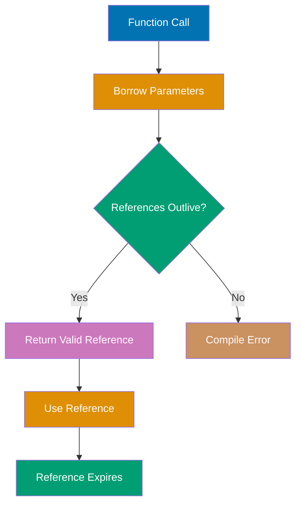

```rust
// Lifetime parameter 'a connects input and output references
fn longest<'a>(x: &'a str, y: &'a str) -> &'a str {
                                     // => Generic lifetime parameter 'a
                                     // => x and y must both live at least as long as 'a
                                     // => Return value lives as long as 'a
                                     // => This means: returned reference valid while both inputs valid
    if x.len() > y.len() {           // => Compare lengths (borrows don't affect comparison)
        x                            // => Return x (type: &'a str)
                                     // => Compiler knows: returned ref lives as long as 'a
    } else {
        y                            // => Return y (type: &'a str)
                                     // => Same lifetime constraint applies
    }
}                                    // => Function signature guarantees safety

fn main() {
    let string1 = String::from("long string");
                                     // => string1 owns heap-allocated "long string"
                                     // => Type: String, lifetime: 'string1 (entire main scope)
    let result;                      // => result declared without initialization
                                     // => Type: &str (will be determined by assignment)
                                     // => Lifetime: unknown yet (compiler will infer)
    {                                // => Inner scope begins
        let string2 = String::from("xyz");
                                     // => string2 owns heap-allocated "xyz"
                                     // => Type: String, lifetime: 'string2 (inner scope only)
        result = longest(string1.as_str(), string2.as_str());
                                     // => string1.as_str() creates &str (lifetime: 'string1)
                                     // => string2.as_str() creates &str (lifetime: 'string2)
                                     // => 'a = shorter of 'string1 and 'string2 = 'string2
                                     // => result gets type &'string2 str
                                     // => result is valid only while string2 is valid
    }                                // => Inner scope ends
                                     // => string2 dropped (heap memory freed)
                                     // => result now points to freed memory (dangling!)
    // println!("{}", result);       // => COMPILE ERROR: string2 doesn't live long enough
                                     // => Error: result has lifetime 'string2, but 'string2 ended
                                     // => Compiler prevents use-after-free at compile time!
}

// Working example - both strings have same lifetime
fn working_example() {
    let string1 = String::from("long string");
                                     // => string1 lifetime: entire function scope
    let string2 = String::from("xyz");
                                     // => string2 lifetime: entire function scope
    let result = longest(string1.as_str(), string2.as_str());
                                     // => 'a = min('string1, 'string2) = both live to function end
                                     // => result valid until both strings dropped
    println!("{}", result);          // => Output: "long string" (OK - references still valid)
}                                    // => string1, string2, result all dropped together
```

**Key Takeaway**: Lifetime annotations (`'a`) tell the compiler how long references must remain valid, enabling it to prevent dangling references at compile time without runtime overhead. The returned reference's lifetime is constrained by the shortest-lived input parameter.

**Why It Matters**: Lifetime annotations enable zero-cost compile-time guarantees that references won't dangle, eliminating use-after-free bugs that plague C++ without runtime overhead or garbage collection. Servo's parallel layout engine uses lifetimes to prove that DOM node references remain valid across threads, achieving parallelism impossible in garbage-collected browsers where reference validity can't be statically verified.

---

## Example 30: Lifetime Elision Rules

Rust infers lifetimes in common patterns through elision rules, eliminating explicit annotations when the relationship is unambiguous. Three elision rules cover most cases: (1) each parameter gets its own lifetime, (2) if one input lifetime, output gets it, (3) if `&self` or `&mut self`, output gets self's lifetime.

```rust
// Explicit lifetimes - shows what compiler infers
fn first_word_explicit<'a>(s: &'a str) -> &'a str {
                                     // => Explicit lifetime 'a
                                     // => Input s has lifetime 'a
                                     // => Output has lifetime 'a (tied to input)
    let bytes = s.as_bytes();        // => Borrow s as byte slice (&[u8])
                                     // => bytes has same lifetime as s (borrows from s)
                                     // => Type: &'a [u8]
    for (i, &byte) in bytes.iter().enumerate() {
                                     // => Iterate with index and byte
                                     // => i is usize (index), byte is u8 (copied from slice)
        if byte == b' ' {            // => b' ' is byte literal (u8) for space character
                                     // => Compare byte with space
            return &s[..i];          // => Return slice from start to index i
                                     // => Type: &'a str (borrows from s)
                                     // => Lifetime: same as s ('a)
        }
    }
    &s[..]                           // => Return entire string (no space found)
                                     // => &s[..] is equivalent to s (full slice)
                                     // => Type: &'a str
}

// Elided lifetimes - compiler applies rule #2
fn first_word(s: &str) -> &str {     // => No explicit lifetime annotations
                                     // => Compiler sees: one input reference, one output reference
                                     // => Applies rule #2: output inherits input's lifetime
                                     // => Desugars to: fn first_word<'a>(s: &'a str) -> &'a str
    let bytes = s.as_bytes();        // => Borrow s as &[u8]
    for (i, &byte) in bytes.iter().enumerate() {
                                     // => Pattern matching: &byte extracts u8 from &u8
        if byte == b' ' {            // => Check for space
            return &s[..i];          // => Slice borrows from s (same lifetime)
        }
    }
    &s[..]                           // => Full string slice
}

// Multiple inputs - elision rule #1 (each input gets own lifetime)
fn longest_no_elision<'a, 'b>(x: &'a str, y: &'b str) -> &'a str {
                                     // => x has lifetime 'a, y has lifetime 'b
                                     // => Return tied to x's lifetime only
    x                                // => Always return first parameter
}                                    // => This function doesn't need y's lifetime for output

// Method with &self - elision rule #3
struct StringWrapper {
    text: String,
}

impl StringWrapper {
    fn get_text(&self) -> &str {     // => Elided: fn get_text<'a>(&'a self) -> &'a str
                                     // => Rule #3: output lifetime tied to &self
        &self.text                   // => Borrow from self (lifetime: 'a)
                                     // => Returns &str with same lifetime as &self
    }
}

fn main() {
    let s = String::from("hello world");
                                     // => s owns "hello world"
    let word = first_word(&s);       // => Borrow s, get slice "hello"
                                     // => word type: &str (lifetime tied to s)
    println!("{}", word);            // => Output: hello
                                     // => word valid because s still in scope

    let wrapper = StringWrapper {
        text: String::from("wrapped"),
    };                               // => wrapper owns String
    let text = wrapper.get_text();   // => Borrow from wrapper
                                     // => text lifetime tied to wrapper
    println!("{}", text);            // => Output: wrapped
}                                    // => s, wrapper, word, text all dropped
```

**Key Takeaway**: Rust's lifetime elision rules automatically infer lifetimes for common patterns (single input reference, method self), reducing annotation burden while maintaining safety guarantees. Rule #2 (one input → output inherits) covers most function cases, while rule #3 handles methods.

**Why It Matters**: Lifetime elision eliminates annotation noise in 90% of cases while preserving safety guarantees, making Rust code as concise as garbage-collected languages without sacrificing compile-time verification. This design choice makes Rust practical for large-scale systems where C++ would drown in annotation burden and Java would impose GC pauses.

---

## Example 31: Struct Lifetimes

Structs holding references need lifetime annotations to ensure referenced data outlives the struct instance. The lifetime parameter declares a relationship: "this struct cannot outlive the data it references."

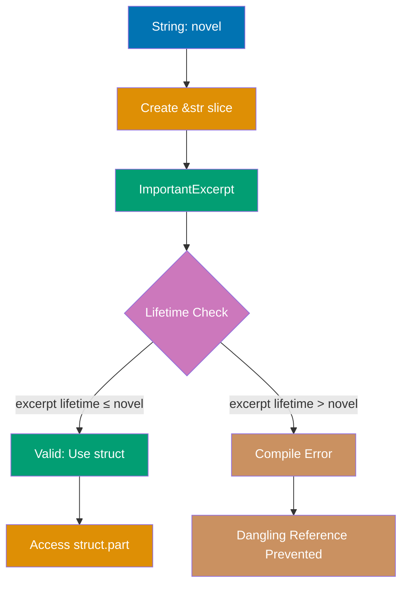

```rust
// Struct with lifetime parameter - holds reference
struct ImportantExcerpt<'a> {        // => 'a is lifetime parameter for struct
    part: &'a str,                   // => part references data with lifetime 'a
                                     // => Constraint: ImportantExcerpt<'a> cannot outlive 'a
                                     // => This prevents dangling references in fields
}

impl<'a> ImportantExcerpt<'a> {      // => impl block repeats lifetime parameter
                                     // => Methods can use 'a to refer to struct's lifetime
    fn level(&self) -> i32 {         // => Lifetime elided (rule #3: &self)
                                     // => Desugars to: fn level<'b>(&'b self) -> i32
                                     // => 'b is separate from 'a (method borrow vs field lifetime)
        3                            // => Return constant (no references involved)
    }

    fn announce_and_return_part(&self, announcement: &str) -> &str {
                                     // => Multiple references: &self and announcement
                                     // => Compiler can't infer output lifetime (rule #3 ambiguous)
                                     // => Actually elides to: (&'a self, &'b str) -> &'a str
                                     // => Output tied to self's lifetime, not announcement
        println!("Attention: {}", announcement);
                                     // => announcement used temporarily (shorter lifetime OK)
        self.part                    // => Return reference from self (type: &'a str)
                                     // => Returned reference lives as long as struct
    }
}

fn main() {
    let novel = String::from("Call me Ishmael. Some years ago...");
                                     // => novel owns heap-allocated String
                                     // => Type: String, lifetime: 'novel (main scope)
    let first_sentence = novel.split('.').next().expect("No sentence");
                                     // => split('.') creates iterator over &str slices
                                     // => next() gets first slice: Some("Call me Ishmael")
                                     // => expect() unwraps Option<&str> -> &str
                                     // => Type: &str, borrows from novel
                                     // => Lifetime: same as novel
    let excerpt = ImportantExcerpt {
        part: first_sentence,        // => excerpt.part borrows from novel
    };                               // => excerpt type: ImportantExcerpt<'novel>
                                     // => Compiler constraint: excerpt lifetime ≤ 'novel
                                     // => This means: excerpt cannot outlive novel

    println!("Excerpt: {}", excerpt.part);
                                     // => Output: Excerpt: Call me Ishmael
                                     // => Access is safe: novel still in scope
}                                    // => Drops in reverse order: excerpt, first_sentence, novel
                                     // => All borrows end before novel is freed

// Compile error example - struct outlives referenced data
fn broken_example() {
    let excerpt;                     // => Declare without initialization
    {
        let novel = String::from("text");
                                     // => novel in inner scope
        excerpt = ImportantExcerpt {
            part: &novel,            // => excerpt.part borrows novel
        };                           // => excerpt type: ImportantExcerpt<'inner_scope>
    }                                // => novel dropped (inner scope ends)
    // println!("{}", excerpt.part); // => ERROR: novel doesn't live long enough
                                     // => Compiler prevents dangling reference
}
```

**Key Takeaway**: Structs storing references require lifetime parameters to ensure the struct doesn't outlive the data it borrows, preventing dangling references in struct fields. The lifetime constraint is enforced at compile time with zero runtime cost.

**Why It Matters**: This concept is fundamental to understanding the language and helps build robust, maintainable code.

---

## Example 32: Static Lifetime

The `'static` lifetime indicates references valid for the entire program duration, typically for string literals stored in the binary. It's the longest possible lifetime and should be used sparingly.

```rust
fn main() {
    // String literal has 'static lifetime
    let s: &'static str = "I have a static lifetime";
                                     // => Type: &'static str
                                     // => String literal stored in program binary (read-only data segment)
                                     // => Lives for entire program execution
                                     // => Never deallocated (not on heap or stack)
    println!("{}", s);               // => Output: I have a static lifetime

    // Static lifetime without type annotation
    let static_string: &'static str = "fixed";
                                     // => "fixed" is string literal (always 'static)
                                     // => Stored in binary, accessible entire program

    // Owned String does NOT have 'static lifetime
    let owned = String::from("dynamic");
                                     // => owned type: String (heap-allocated)
                                     // => Lifetime: scope-bound (NOT 'static)
                                     // => &owned has shorter lifetime than 'static

    // Static variables have 'static lifetime
    static GLOBAL: &str = "global";  // => GLOBAL lives entire program
                                     // => Type: &'static str
                                     // => Initialized at compile time
    println!("{}", GLOBAL);          // => Output: global
}

// Function with mixed lifetimes
fn longest_with_announcement<'a>(x: &'a str, y: &'a str, ann: &str) -> &'a str {
                                     // => x and y have lifetime 'a (must outlive function call)
                                     // => ann can have ANY lifetime (including 'static)
                                     // => Compiler infers ann doesn't affect return value
    println!("Announcement: {}", ann);
                                     // => ann used only for printing (no lifetime constraint)
    if x.len() > y.len() {           // => Compare lengths
        x                            // => Return x (lifetime 'a)
    } else {
        y                            // => Return y (lifetime 'a)
    }
}

// Common mistake: unnecessary 'static bound
fn process_static(s: &'static str) { // => Requires 'static lifetime
    println!("{}", s);               // => Only accepts string literals or static variables
}

fn process_any(s: &str) {            // => Accepts ANY lifetime
    println!("{}", s);               // => More flexible (preferred)
}

fn example_usage() {
    // 'static works with both functions
    process_static("literal");       // => OK: "literal" is 'static
    process_any("literal");          // => OK: 'static satisfies any lifetime

    let owned = String::from("owned");
    // process_static(&owned);       // => ERROR: owned is not 'static
    process_any(&owned);             // => OK: accepts any lifetime
}

// Leaking to create 'static references (avoid in production)
fn leak_example() {
    let boxed = Box::new(String::from("leaked"));
                                     // => boxed owns heap String
    let leaked: &'static str = Box::leak(boxed);
                                     // => Box::leak consumes Box, never frees memory
                                     // => Returns &'static str (lives forever - memory leak!)
    println!("{}", leaked);          // => Output: leaked
}                                    // => Memory never freed (intentional leak for 'static)
```

**Key Takeaway**: The `'static` lifetime marks references valid for the program's entire duration (like string literals stored in the binary), but it's rarely needed in function signatures—prefer generic lifetimes for flexibility. Only use `'static` when you truly need references that outlive all scopes.

**Why It Matters**: Explicit 'static lifetime requirements in APIs force developers to consider reference validity across thread boundaries, preventing the "reference escaped scope" bugs common in concurrent C++ code. Tokio's async runtime requires 'static bounds for spawned tasks to ensure no stack references escape into background tasks—a constraint that prevents data races impossible to catch in Go or JavaScript runtimes.

---

## Example 33: Traits Basics

Traits define shared behavior across types, similar to interfaces in other languages. Types implement traits to gain functionality and enable polymorphism. Traits enable compile-time polymorphism without runtime overhead.

```rust
// Define trait - shared behavior contract
trait Summary {                      // => Trait defines shared interface
                                     // => Similar to interface in Java/C#, protocol in Swift
    fn summarize(&self) -> String;   // => Method signature (no implementation yet)
                                     // => &self means: method takes immutable reference to self
                                     // => Types implementing this trait MUST provide implementation
                                     // => Return type: String (owned, heap-allocated)
}

// First type implementing Summary
struct NewsArticle {                 // => Define NewsArticle type
    headline: String,                // => Owned String fields (heap-allocated)
    content: String,                 // => Each NewsArticle owns its strings
}                                    // => No trait implementation yet

impl Summary for NewsArticle {       // => Implement Summary trait for NewsArticle
                                     // => "impl TraitName for TypeName" syntax
                                     // => NewsArticle now satisfies Summary contract
    fn summarize(&self) -> String {  // => Provide concrete implementation
                                     // => Must match trait signature exactly
                                     // => self is &NewsArticle (immutable borrow)
        format!("{}: {}", self.headline, self.content)
                                     // => format! creates new String (heap allocation)
                                     // => Combines headline and content with ": " separator
                                     // => Returns owned String to caller
    }
}                                    // => NewsArticle implementation complete

// Second type implementing Summary (different implementation)
struct Tweet {                       // => Define Tweet type (different from NewsArticle)
    username: String,                // => Owned String (heap-allocated)
    content: String,                 // => Tweet-specific fields (username instead of headline)
}                                    // => Different structure, same trait capability

impl Summary for Tweet {             // => Same trait, different type
                                     // => Tweet now also satisfies Summary contract
    fn summarize(&self) -> String {  // => Different implementation than NewsArticle
                                     // => Same signature, different behavior
        format!("@{}: {}", self.username, self.content)
                                     // => Uses @ prefix for username (Twitter-style)
                                     // => Different format than NewsArticle version
                                     // => Returns owned String
    }
}                                    // => Two types, one trait, different implementations

// Function accepting any type implementing Summary
fn notify(item: &impl Summary) {     // => item can be ANY type implementing Summary
                                     // => "impl Trait" syntax (syntactic sugar)
                                     // => Desugars to: fn notify<T: Summary>(item: &T)
                                     // => Accepts NewsArticle, Tweet, or any Summary implementer
    println!("Breaking news: {}", item.summarize());
                                     // => Call summarize() - works for any Summary type
                                     // => Polymorphism: method dispatch determined at compile time
                                     // => No runtime overhead (monomorphization)
}                                    // => item borrow ends, no ownership transfer

fn main() {
    let article = NewsArticle {      // => Create NewsArticle instance
        headline: String::from("Breaking News"),
                                     // => Heap-allocate "Breaking News"
        content: String::from("Something happened"),
                                     // => Heap-allocate "Something happened"
    };                               // => article type: NewsArticle (owns both strings)
    println!("{}", article.summarize());
                                     // => Call NewsArticle's summarize implementation
                                     // => Returns new String: "Breaking News: Something happened"
                                     // => Output: Breaking News: Something happened

    let tweet = Tweet {              // => Create Tweet instance
        username: String::from("user123"),
                                     // => Heap-allocate "user123"
        content: String::from("Hello world"),
                                     // => Heap-allocate "Hello world"
    };                               // => tweet type: Tweet (owns both strings)
    println!("{}", tweet.summarize());
                                     // => Call Tweet's summarize implementation
                                     // => Returns new String: "@user123: Hello world"
                                     // => Output: @user123: Hello world

    // Polymorphism - same function, different types
    notify(&article);                // => Passes &NewsArticle (implements Summary)
                                     // => Compiler monomorphizes: generates notify::<NewsArticle>
                                     // => Output: Breaking news: Breaking News: Something happened
    notify(&tweet);                  // => Passes &Tweet (implements Summary)
                                     // => Compiler monomorphizes: generates notify::<Tweet>
                                     // => Output: Breaking news: @user123: Hello world
}                                    // => article, tweet dropped (heap memory freed)

// Multiple traits on same type
trait Display {                      // => Define second trait (independent from Summary)
    fn display(&self) -> String;     // => Different method name and purpose
}                                    // => Types can implement multiple traits

impl Display for Tweet {             // => Tweet can implement multiple traits
                                     // => Tweet now satisfies BOTH Summary and Display
    fn display(&self) -> String {    // => Provide Display implementation
        format!("Tweet by {}", self.username)
                                     // => Different behavior than summarize()
                                     // => Returns "Tweet by <username>"
    }
}                                    // => Tweet has two trait implementations
```

**Key Takeaway**: Traits enable polymorphism by defining shared method signatures that multiple types can implement differently, allowing generic code to work with any type implementing the trait. Trait dispatch is resolved at compile time (monomorphization), providing zero-cost abstraction.

**Why It Matters**: Trait-based polymorphism with monomorphization provides C++ template-style zero-cost abstraction with better compile-time error messages and no code bloat from duplicate instantiations. Diesel ORM uses traits to provide database-agnostic query builders where type safety prevents SQL injection at compile time—protection that requires runtime validation in ORMs for dynamic languages.

---

## Example 34: Default Trait Implementations

Traits can provide default method implementations that types can use or override, reducing boilerplate for common patterns. Default methods can call other trait methods, enabling composition.

```rust
// Trait with required and default methods
trait Summary {                      // => Trait with mixed method types
    fn summarize_author(&self) -> String;
                                     // => Required method (no default)
                                     // => No {} body - types MUST implement this
                                     // => Abstract method (must be provided)

    fn summarize(&self) -> String {  // => Default implementation provided
                                     // => Has {} body - types CAN override, but don't have to
                                     // => Concrete method (optional override)
        format!("(Read more from {}...)", self.summarize_author())
                                     // => Default calls required method
                                     // => Composition: default uses other trait methods
                                     // => Creates String: "(Read more from <author>...)"
    }
}                                    // => Trait complete: 1 required + 1 default

struct Tweet {                       // => Define Tweet type
    username: String,                // => Owned fields
    content: String,
}                                    // => No trait implementation yet

impl Summary for Tweet {             // => Implement Summary for Tweet
                                     // => Must provide summarize_author (required)
                                     // => Can inherit summarize (has default)
    fn summarize_author(&self) -> String {
                                     // => Implement ONLY required method
                                     // => Minimal implementation strategy
        format!("@{}", self.username)
                                     // => Returns "@user123" (Twitter-style username)
                                     // => Creates new String (heap allocation)
    }                                // => summarize() inherited from default
                                     // => No need to implement summarize() - uses default
}                                    // => Tweet implementation complete (1 method)

struct Article {                     // => Define Article type (different from Tweet)
    title: String,                   // => Article-specific fields
    author: String,
}                                    // => Different structure, same trait

impl Summary for Article {           // => Implement Summary for Article
                                     // => Will override default behavior
    fn summarize_author(&self) -> String {
                                     // => Implement required method
                                     // => Must provide this (no default available)
        self.author.clone()          // => Clone author string (creates new String)
                                     // => Returns owned String (not &str)
    }                                // => Required method complete

    fn summarize(&self) -> String {  // => Override default implementation
                                     // => Replaces default behavior with custom
        format!("{} by {}", self.title, self.author)
                                     // => Custom format: "title by author"
                                     // => Ignores default "Read more from..." format
                                     // => Creates new String
    }
}                                    // => Article implementation complete (2 methods)

fn main() {
    let tweet = Tweet {              // => Create Tweet instance
        username: String::from("user123"),
                                     // => Heap-allocate username
        content: String::from("Hello"),
                                     // => Heap-allocate content
    };                               // => tweet uses default summarize()
    println!("{}", tweet.summarize());
                                     // => Calls default implementation (not overridden)
                                     // => Default calls tweet.summarize_author() -> "@user123"
                                     // => Returns: "(Read more from @user123...)"
                                     // => Output: (Read more from @user123...)

    let article = Article {          // => Create Article instance
        title: String::from("Rust Traits"),
                                     // => Heap-allocate title
        author: String::from("Alice"),
                                     // => Heap-allocate author
    };                               // => article overrides summarize()
    println!("{}", article.summarize());
                                     // => Calls overridden implementation (custom)
                                     // => Returns: "Rust Traits by Alice"
                                     // => Output: Rust Traits by Alice
}                                    // => tweet, article dropped (heap freed)

// Default methods can call other defaults
trait Advanced {                     // => Trait with all default methods
                                     // => No required methods (unusual but valid)
    fn process(&self) -> String {    // => Default implementation 1
                                     // => Calls another default method (prepare)
        self.prepare() + " processed"
                                     // => String concatenation (prepare() + " processed")
                                     // => Creates new String
    }                                // => Default chaining example

    fn prepare(&self) -> String {    // => Default implementation 2
                                     // => Provides base data
        String::from("data")         // => Returns "data" string
                                     // => Heap-allocated String
    }
}                                    // => Trait with composable defaults

struct Handler;                      // => Unit-like struct (no fields)
                                     // => Zero-sized type (no memory overhead)

impl Advanced for Handler {}         // => Implement trait WITHOUT any methods
                                     // => Empty impl block (valid!)
                                     // => Uses BOTH defaults (process and prepare)
                                     // => Minimal boilerplate implementation

fn advanced_example() {              // => Demonstrate default chaining
    let handler = Handler;           // => Create Handler instance (zero size)
    println!("{}", handler.process());
                                     // => Calls default process()
                                     // => process() calls default prepare() -> "data"
                                     // => Returns: "data processed"
                                     // => Output: data processed
}                                    // => handler dropped (no-op, zero-sized)
```

**Key Takeaway**: Default trait implementations reduce code duplication by providing common behavior that types can inherit or override, enabling flexible trait-based abstraction. Default methods can call other trait methods, creating composable behavior hierarchies.

**Why It Matters**: This concept is fundamental to understanding the language and helps build robust, maintainable code.

---

## Example 35: Trait Bounds

Generic functions can require types to implement specific traits using trait bounds, enabling operations only valid for those traits. Trait bounds provide compile-time guarantees about type capabilities.

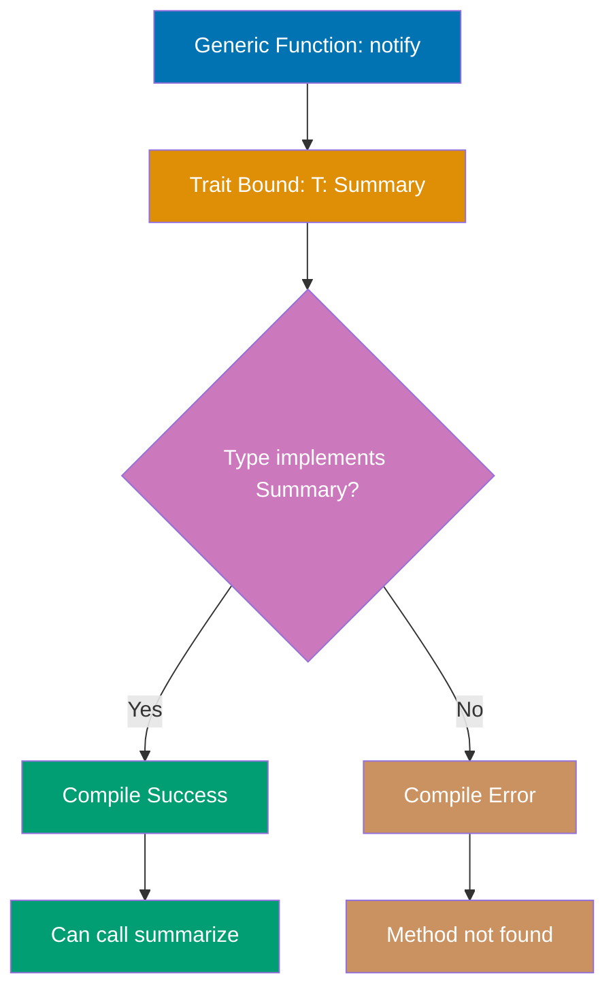

```rust
trait Summary {                      // => Trait defining summarization capability
    fn summarize(&self) -> String;   // => Method signature (no implementation)
}                                    // => Types implementing this can be summarized

struct Article { title: String }    // => Struct with single String field

impl Summary for Article {           // => Implement Summary trait for Article type
                                     // => Makes Article "summarizable"
    fn summarize(&self) -> String {  // => Provide concrete implementation
        self.title.clone()           // => Clone heap String from article.title
                                     // => Returns owned String copy
    }
}

// Trait bound syntax: T must implement Summary
fn notify<T: Summary>(item: &T) {    // => Generic function with type parameter T
                                     // => Trait bound: T: Summary (T MUST implement Summary)
                                     // => Compiler verifies at call site (compile-time check)
                                     // => item is immutable reference to any T
    println!("News: {}", item.summarize());
                                     // => Can call summarize() because bound guarantees it exists
                                     // => Compile error if called with non-Summary type
}

// Alternative syntax: impl Trait (syntactic sugar)
fn notify_impl(item: &impl Summary) { // => Equivalent to notify<T: Summary>
                                     // => Shorter syntax for single trait bound
                                     // => Compiler desugars to generic with bound
    println!("News: {}", item.summarize());
                                     // => Same behavior as notify()
}

// Multiple trait bounds with + operator
fn notify_display<T: Summary + std::fmt::Display>(item: &T) {
                                     // => T must implement BOTH Summary AND Display
                                     // => Multiple bounds separated by + operator
                                     // => Intersection of trait requirements
    println!("{}", item);            // => Uses Display trait implementation
                                     // => Compile error if T doesn't implement Display
    println!("Summary: {}", item.summarize());
                                     // => Uses Summary trait implementation
                                     // => Both methods available due to + bound
}

// where clause for complex bounds (more readable)
fn complex<T, U>(t: &T, u: &U) -> String
where                                // => where clause: separates bounds from signature
    T: Summary + Clone,              // => T implements Summary AND Clone
    U: Summary,                      // => U implements Summary (not Clone required)
                                     // => More readable than inline bounds for multiple params
{
    let cloned = t.clone();          // => Can clone t (Clone bound guarantees clone() exists)
                                     // => Creates owned copy of t
    format!("{} - {}", t.summarize(), u.summarize())
                                     // => Can call summarize on both (Summary bound)
                                     // => Returns formatted String
}

// Returning types with trait bounds
fn returns_summarizable() -> impl Summary {
                                     // => Return type: "some type implementing Summary"
                                     // => Actual type hidden (opaque type)
                                     // => MUST return single concrete type (not multiple different types)
                                     // => Caller can only use Summary trait methods
    Article {                        // => Create Article instance
        title: String::from("Return type"),
    }                                // => Article implements Summary, so valid return
}

fn main() {
    let article = Article { title: String::from("Rust") };
                                     // => article owns Article with title "Rust"
    notify(&article);                // => Type check: Article implements Summary ✓
                                     // => Compiler verifies trait bound at compile time
                                     // => Output: News: Rust

    notify_impl(&article);           // => Same as notify (different syntax sugar)
                                     // => Both desugar to same generic code
                                     // => Output: News: Rust

    let returned = returns_summarizable();
                                     // => returned type: impl Summary (opaque Article)
                                     // => Concrete type hidden by impl trait
    println!("{}", returned.summarize());
                                     // => Can call trait methods on opaque type
                                     // => Output: Return type
}

// Blanket implementations - implement trait for all types with bounds
trait AsString {                     // => Custom trait for string conversion
    fn as_string(&self) -> String;   // => Method signature
}

impl<T: std::fmt::Display> AsString for T {
                                     // => Blanket impl: for ALL types T implementing Display
                                     // => Applies to infinite set of types (i32, String, etc.)
                                     // => Conditional trait implementation
    fn as_string(&self) -> String {  // => Provide implementation using Display
        format!("{}", self)          // => Use Display trait to create String
                                     // => Works for any T with Display
    }
}

fn blanket_example() {
    let num = 42;                    // => i32 value
                                     // => i32 implements Display (std library)
    println!("{}", num.as_string()); // => Can use AsString via blanket impl
                                     // => Trait available because i32: Display
                                     // => Output: 42
}
```

**Key Takeaway**: Trait bounds constrain generic types to those implementing specific traits, enabling type-safe generic functions that can call trait methods while maintaining compile-time verification. Use `where` clauses for complex bounds to improve readability.

**Why It Matters**: Trait bounds enable compile-time verification of generic constraints, catching type errors at compilation rather than runtime while enabling aggressive optimization through monomorphization. Rayon's parallel iterators use trait bounds to ensure only thread-safe types can be processed in parallel, eliminating data races that would be runtime panics in Java's parallel streams.

---

## Example 36: Generics with Structs and Enums

Structs and enums can be generic over types, enabling reusable data structures like `Option<T>` and `Result<T, E>`. Generics are monomorphized at compile time, creating specialized versions for each concrete type with zero runtime cost.

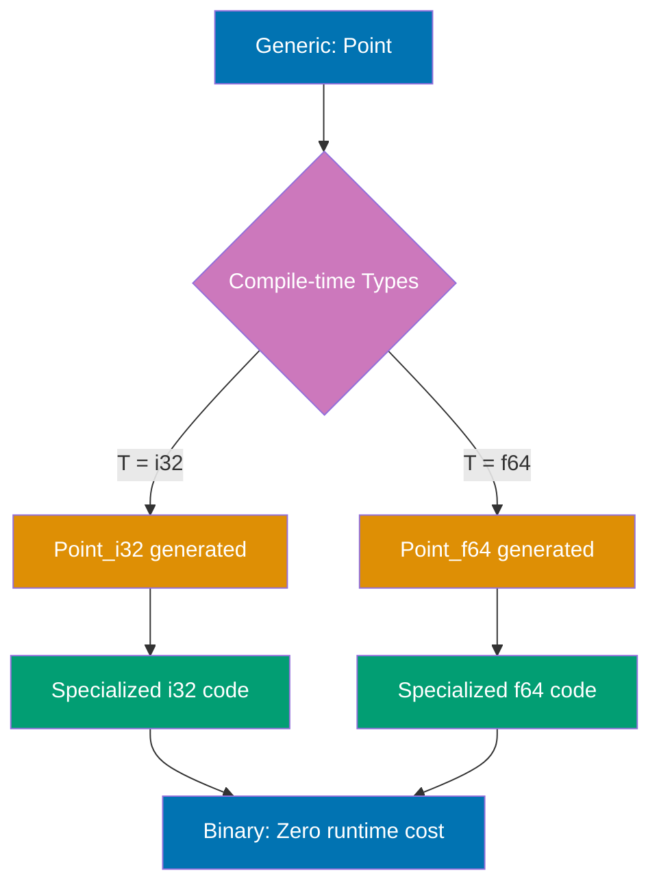

```rust
// Generic struct with one type parameter
struct Point<T> {                    // => T is type parameter (can be any type)
    x: T,                            // => Both fields use same type T
    y: T,                            // => x and y must be same type
}

// Generic impl block - methods for all Point<T>
impl<T> Point<T> {                   // => impl<T> declares type parameter
                                     // => Methods work for Point<any T>
    fn x(&self) -> &T {              // => Return reference to T
                                     // => Works for Point<i32>, Point<f64>, etc.
        &self.x                      // => Borrow x field (type: &T)
    }

    fn new(x: T, y: T) -> Self {     // => Constructor for any T
        Point { x, y }               // => Return Point<T>
    }
}

// Specialized impl - methods ONLY for Point<f64>
impl Point<f64> {                    // => No <T> - this is for concrete type f64
                                     // => Methods only available for Point<f64>
    fn distance_from_origin(&self) -> f64 {
                                     // => Can use f64-specific operations
        (self.x.powi(2) + self.y.powi(2)).sqrt()
                                     // => powi() and sqrt() available for f64
    }
}

// Multiple type parameters
struct Pair<T, U> {                  // => Two different type parameters
    first: T,                        // => first has type T
    second: U,                       // => second has type U (can differ from T)
}

// Generic enum - like Result<T, E> from std library
enum MyResult<T, E> {                // => Generic over success (T) and error (E) types
    Ok(T),                           // => Success variant holds T
    Err(E),                          // => Error variant holds E
}

fn main() {
    // Type inference from field values
    let integer_point = Point { x: 5, y: 10 };
                                     // => Compiler infers: Point<i32>
                                     // => Monomorphization creates Point_i32 version
    let float_point = Point { x: 1.0, y: 4.0 };
                                     // => Compiler infers: Point<f64>
                                     // => Monomorphization creates Point_f64 version

    // Methods from generic impl (available for all T)
    println!("x: {}", integer_point.x());
                                     // => Calls Point<i32>::x()
                                     // => Output: x: 5
    println!("x: {}", float_point.x());
                                     // => Calls Point<f64>::x()
                                     // => Output: x: 1.0

    // Method from specialized impl (only Point<f64>)
    println!("Distance: {}", float_point.distance_from_origin());
                                     // => Calls Point<f64>::distance_from_origin()
                                     // => Output: Distance: 4.123105625617661
    // integer_point.distance_from_origin();
                                     // => ERROR: method not available for Point<i32>

    // Multiple type parameters
    let pair = Pair { first: 5, second: "hello" };
                                     // => Pair<i32, &str>
                                     // => first: i32, second: &str

    // Generic enum usage
    let success: MyResult<i32, String> = MyResult::Ok(42);
                                     // => Type: MyResult<i32, String>
                                     // => Holds i32 in Ok variant
    let error: MyResult<i32, String> = MyResult::Err(String::from("failed"));
                                     // => Holds String in Err variant
}
```

**Key Takeaway**: Generic structs and enums enable type-safe reusable data structures through compile-time monomorphization (zero runtime cost), while specialized `impl` blocks can provide type-specific methods for particular generic instantiations.

**Why It Matters**: Generic types with monomorphization provide the performance of specialized code without the maintenance burden of manual duplication, matching C++ templates without the infamous error messages. AWS SDK for Rust uses generics extensively for API clients where each service gets a monomorphized implementation—providing type safety and performance impossible with reflection-based approaches in Java or Python.

---

## Example 37: Iterator Trait

Iterators enable sequential processing of collections through the `Iterator` trait, which requires implementing `next()` method. Iterators are lazy (compute on demand) and provide zero-cost abstractions.

```rust
fn main() {
    let v = vec![1, 2, 3];           // => v owns vector [1, 2, 3] on heap
                                     // => Type: Vec<i32>

    // Create iterator from vector
    let mut iter = v.iter();         // => iter borrows elements immutably
                                     // => Type: std::slice::Iter<'_, i32>
                                     // => Iterates over &i32 (references to elements)
    println!("{:?}", iter.next());   // => Calls Iterator::next() -> Option<&i32>
                                     // => Returns Some(&1) (reference to first element)
                                     // => Output: Some(1)
    println!("{:?}", iter.next());   // => Returns Some(&2)
                                     // => Output: Some(2)
    println!("{:?}", iter.next());   // => Returns Some(&3)
                                     // => Output: Some(3)
    println!("{:?}", iter.next());   // => No more elements, returns None
                                     // => Output: None

    // Different iterator types
    let v2 = vec![1, 2, 3];
    let mut_iter = v2.iter();        // => Immutable references: &i32
    let own_iter = v2.into_iter();   // => Takes ownership: i32 (v2 moved!)
    // let mut_ref_iter = v2.iter_mut(); // => Mutable references: &mut i32

    // Consuming adaptors - consume iterator
    let v3 = vec![1, 2, 3, 4];
    let sum: i32 = v3.iter().sum();  // => sum() consumes iterator
                                     // => Type inference: i32
                                     // => Adds all elements: 1+2+3+4=10
    println!("Sum: {}", sum);        // => Output: Sum: 10

    // Iterator adaptors - transform lazily
    let v4 = vec![1, 2, 3];
    let mapped = v4.iter()
        .map(|x| x + 1);             // => map() is LAZY (no computation yet)
                                     // => Returns Map<Iter, Closure> (iterator adapter)
                                     // => Computation happens when consumed
    let v5: Vec<i32> = mapped.collect();
                                     // => collect() consumes iterator
                                     // => NOW map closure executes: [1+1, 2+1, 3+1]
                                     // => Returns Vec<i32>: [2, 3, 4]
    println!("{:?}", v5);            // => Output: [2, 3, 4]

    // Method chaining - all lazy until collect()
    let v6: Vec<i32> = vec![1, 2, 3, 4, 5, 6]
        .iter()                      // => Create iterator
        .filter(|x| *x % 2 == 0)     // => Lazy: keep only even numbers
                                     // => Returns Filter<Iter, Closure>
        .map(|x| x * x)              // => Lazy: square each element
                                     // => Returns Map<Filter<...>>
        .collect();                  // => Consume: execute filter then map
                                     // => filter: [2, 4, 6]
                                     // => map: [4, 16, 36]
    println!("{:?}", v6);            // => Output: [4, 16, 36]
}
```

**Key Takeaway**: The `Iterator` trait enables lazy, composable data transformations through methods like `map()`, `filter()`, and `fold()`, providing zero-cost abstractions over collection processing. Iterators compute on demand (lazy evaluation) until consumed by methods like `collect()` or `sum()`.

**Why It Matters**: Iterator chains compile to efficient imperative loops with no overhead, matching hand-written C while providing functional programming ergonomics. Ripgrep's text search achieves grep-beating performance using iterator chains that the compiler optimizes to SIMD instructions—combining zero-cost abstraction with maintainable functional style impossible in interpreted languages.

---

## Example 38: Closures Basics

Closures are anonymous functions that capture their environment, enabling functional programming patterns and callbacks. Rust automatically infers the minimal capture mode (immutable borrow, mutable borrow, or move) based on closure body usage.

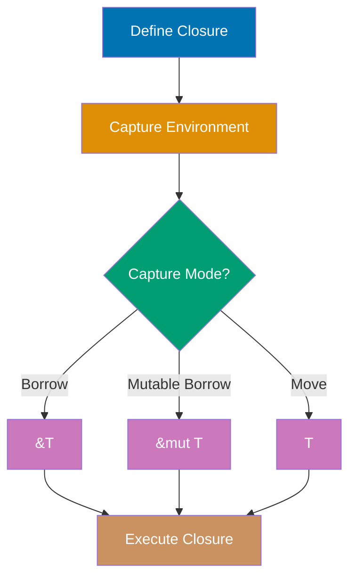

```rust
fn main() {
    let x = 4;                       // => x is i32 on stack
                                     // => Type: i32, value: 4

    // Closure capturing x by immutable borrow
    let equal_to_x = |z| z == x;     // => Closure type: anonymous (unique per closure)
                                     // => Captures x by &i32 (immutable borrow)
                                     // => z type inferred from usage: i32
                                     // => Closure implements Fn trait (immutable)
    let y = 4;                       // => y is i32, value: 4
    println!("{}", equal_to_x(y));   // => Call closure with y
                                     // => Evaluates: 4 == 4 -> true
                                     // => Output: true
    println!("{}", x);               // => x still accessible (borrowed, not moved)
                                     // => Output: 4

    // Closure with explicit type annotations
    let add_one = |num: i32| -> i32 { num + 1 };
                                     // => Type annotations optional but allowed
                                     // => Input: i32, Output: i32
                                     // => No environment capture (pure function)
    println!("{}", add_one(5));      // => Call with 5 -> 5 + 1 = 6
                                     // => Output: 6

    // Closure capturing by mutable borrow
    let mut list = vec![1, 2, 3];    // => list owns Vec<i32> on heap
    let mut add_to_list = || list.push(4);
                                     // => Closure captures list by &mut Vec<i32>
                                     // => Implements FnMut trait (can mutate captures)
                                     // => Must be mut to call (FnMut requirement)
    add_to_list();                   // => Call closure: mutates list
                                     // => list becomes [1, 2, 3, 4]
    println!("{:?}", list);          // => list accessible after closure
                                     // => Output: [1, 2, 3, 4]

    // move keyword forces ownership transfer
    let list2 = vec![1, 2, 3];       // => list2 owns Vec<i32>
    let consume = move || println!("{:?}", list2);
                                     // => move forces ownership transfer to closure
                                     // => list2 moved into closure's environment
                                     // => Closure implements FnOnce (consumes captures)
    consume();                       // => Execute closure (owns list2)
                                     // => Output: [1, 2, 3]
    // println!("{:?}", list2);      // => ERROR: list2 moved into closure

    // Closure as function parameter
    fn apply<F>(f: F, val: i32) -> i32
    where
        F: Fn(i32) -> i32,           // => F must implement Fn trait
    {
        f(val)                       // => Call closure with val
    }

    let double = |x| x * 2;          // => Closure: Fn(i32) -> i32
    let result = apply(double, 5);   // => Pass closure to function
                                     // => Calls double(5) -> 10
    println!("Result: {}", result);  // => Output: Result: 10
}
```

**Key Takeaway**: Closures capture environment variables automatically with the minimal required mode (immutable borrow, mutable borrow, or move), providing flexible anonymous functions for callbacks, iterators, and functional programming patterns. Use `move` keyword to force ownership transfer into the closure.

**Why It Matters**: Closures with explicit move semantics prevent the capturing bugs that cause memory leaks in JavaScript and use-after-free in C++ lambda captures. Actix-web's request handlers use move closures to transfer ownership of request data into async tasks, ensuring type-safe concurrency without the closure-related race conditions common in Node.js callback hell.

---

## Example 39: Closure Type Inference

Closures have unique anonymous types inferred from usage, implementing `Fn`, `FnMut`, or `FnOnce` traits based on how they capture variables.

```rust
fn main() {
    // Compiler infers closure types
    let add = |x, y| x + y;          // => Closure with inferred parameter and return types
                                     // => Type: impl Fn(i32, i32) -> i32 (inferred from first use)
                                     // => Captures nothing from environment
    println!("{}", add(1, 2));       // => First call: compiler infers x, y as i32
                                     // => Executes: 1 + 2 = 3
                                     // => Output: 3
    // println!("{}", add(1.0, 2.0)); // => ERROR: type already locked to i32 from first call
                                     // => Can't call with f64 after i32 inference

    // FnOnce: consumes captured variables
    let consume_list = || {          // => Closure that moves ownership
                                     // => Type: impl FnOnce() -> Vec<i32>
        let list = vec![1, 2, 3];    // => Creates local Vec
        list                         // => Moves ownership of list out of closure
                                     // => Closure consumes itself when called
    };
    let list = consume_list();       // => Calls closure, receives moved Vec
                                     // => list is [1, 2, 3]
                                     // => consume_list moved (FnOnce consumed)
    // consume_list();               // => ERROR: closure was FnOnce, already consumed
                                     // => Can only call FnOnce closures once

    // FnMut: mutates captured variables
    let mut count = 0;               // => Mutable variable in outer scope
    let mut increment = || count += 1;
                                     // => Closure captures &mut count
                                     // => Type: impl FnMut() (mutably borrows environment)
                                     // => Modifies captured count
    increment();                     // => First call: count becomes 1
                                     // => Mutates through mutable borrow
    increment();                     // => Second call: count becomes 2
                                     // => Can call multiple times (FnMut, not FnOnce)
    println!("Count: {}", count);    // => Mutable borrow ends, can access count
                                     // => Output: Count: 2

    // Fn: borrows immutably
    let message = String::from("Hello");
                                     // => message owns heap-allocated string
    let print = || println!("{}", message);
                                     // => Closure captures &message (immutable borrow)
                                     // => Type: impl Fn() (borrows immutably, can call many times)
                                     // => Does NOT move or mutate message
    print();                         // => First call: borrows message
                                     // => Output: Hello
    print();                         // => Second call: borrows again (Fn allows repeated calls)
                                     // => Output: Hello
    println!("{}", message);         // => message still owned by outer scope
                                     // => Immutable borrow compatible with other reads
                                     // => Output: Hello
}
```

**Key Takeaway**: Closures automatically implement `Fn`, `FnMut`, or `FnOnce` traits based on how they capture and use environment variables, with the compiler inferring the most restrictive trait possible.

**Why It Matters**: Automatic trait selection based on closure behavior enables the compiler to optimize closure calls (Fn types can inline, FnOnce types can move), matching function pointer performance while maintaining type safety. Rocket's route handlers leverage this to compile closure-based request handling to direct function calls—zero-cost abstraction impossible in frameworks that box all closures.

---

## Example 40: Iterator Methods

Iterator methods enable declarative data processing with methods like `map()`, `filter()`, `fold()`, and `collect()`.

```rust
fn main() {
    let numbers = vec![1, 2, 3, 4, 5];
                                     // => numbers owns heap vector [1, 2, 3, 4, 5]
                                     // => Type: Vec<i32>

    // map: transform elements
    let doubled: Vec<i32> = numbers.iter()
                                     // => Creates iterator over &i32 references
                                     // => Borrows numbers immutably
        .map(|x| x * 2)              // => Closure takes &i32, returns i32
                                     // => Lazy: transforms [1, 2, 3, 4, 5] → [2, 4, 6, 8, 10]
                                     // => Returns Map<Iter, Closure> iterator adapter
        .collect();                  // => Consumes iterator, executes map closure
                                     // => Collects transformed values into Vec<i32>
                                     // => doubled is [2, 4, 6, 8, 10]
    println!("{:?}", doubled);       // => Output: [2, 4, 6, 8, 10]

    // filter: select elements
    let evens: Vec<&i32> = numbers.iter()
                                     // => Creates new iterator over &i32
        .filter(|x| *x % 2 == 0)     // => Closure checks if **x is even
                                     // => Lazy: keeps only [&2, &4] references
                                     // => Returns Filter<Iter, Closure> adapter
        .collect();                  // => Consumes iterator, applies filter predicate
                                     // => Collects references: Vec<&i32> containing [&2, &4]
    println!("{:?}", evens);         // => Output: [2, 4] (derefs for display)

    // fold: accumulate
    let sum = numbers.iter()         // => Iterator over &i32
        .fold(0, |acc, x| acc + x);  // => fold(initial, |accumulator, element| ...)
                                     // => Step 1: acc=0, x=&1 → 0+1=1
                                     // => Step 2: acc=1, x=&2 → 1+2=3
                                     // => Step 3: acc=3, x=&3 → 3+3=6
                                     // => Step 4: acc=6, x=&4 → 6+4=10
                                     // => Step 5: acc=10, x=&5 → 10+5=15
                                     // => Returns final accumulator: 15 (type: i32)
    println!("Sum: {}", sum);        // => Output: Sum: 15

    // Method chaining
    let result: i32 = numbers.iter()
                                     // => Start with iterator over [1, 2, 3, 4, 5]
        .filter(|x| *x % 2 == 0)     // => Lazy: filter to [&2, &4] (even numbers only)
                                     // => Still an iterator, no computation yet
        .map(|x| x * x)              // => Lazy: square each → [4, 16]
                                     // => Chains: Filter → Map adapters
        .sum();                      // => Consuming adapter: executes entire chain
                                     // => Applies filter: [&2, &4]
                                     // => Applies map: [4, 16]
                                     // => Sums: 4 + 16 = 20
                                     // => Type inference: i32 from annotation
    println!("Result: {}", result);  // => Output: Result: 20
}
```

**Key Takeaway**: Iterator methods provide composable, lazy data transformations that compile to efficient loops, enabling functional programming style without performance penalty.

**Why It Matters**: Zero-cost iterator chains enable functional programming that compiles to efficient imperative code, proving abstraction doesn't require runtime overhead. Tokio's stream combinators use this pattern to build complex async pipelines that compile to state machines matching hand-written async/await—providing composability without allocation or dynamic dispatch overhead.

---

## Example 41: Box Smart Pointer

`Box<T>` allocates data on the heap with single ownership, enabling recursive types and trait objects. Unlike stack allocation with fixed size, Box provides indirection through a pointer, allowing dynamically-sized types and breaking infinite size recursion in type definitions.

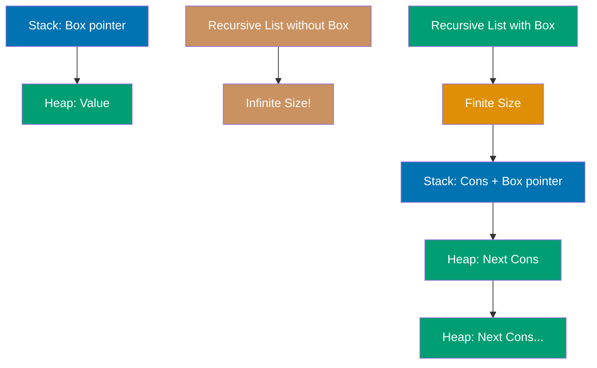

```rust
fn main() {
    // Basic heap allocation with Box
    let b = Box::new(5);             // => b type: Box<i32>
                                     // => Allocates i32 value 5 on heap
                                     // => b owns heap allocation (unique ownership)
                                     // => b itself stored on stack (pointer + metadata)
                                     // => Size of b: 8 bytes (pointer) on 64-bit systems
    println!("b = {}", b);           // => Deref coercion: *b automatic
                                     // => Output: b = 5
                                     // => Box implements Deref trait for transparent access
    println!("Address: {:p}", &*b);  // => Print heap address of value
                                     // => Output: Address: 0x... (heap location)

    // Dereferencing Box
    let value = *b;                  // => Dereference Box to get i32
                                     // => value is 5 (copied from heap to stack)
                                     // => value type: i32 (not Box<i32>)
    println!("value = {}", value);   // => Output: value = 5
    println!("b still = {}", b);     // => b still valid (i32 is Copy)
                                     // => Output: b still = 5

    // Box with non-Copy type
    let s = Box::new(String::from("heap"));
                                     // => s type: Box<String>
                                     // => String itself on heap (two allocations total!)
                                     // => Box pointer on stack -> String on heap -> string data on heap
    // let moved = *s;               // => ERROR: String doesn't implement Copy
                                     // => Would move String out of Box (partial move)
    println!("s = {}", s);           // => Deref coercion works with String too
                                     // => Output: s = heap
}                                    // => b dropped: heap memory for 5 freed
                                     // => s dropped: String freed, then Box freed

// Recursive type (requires Box)
enum List {                          // => Recursive enum definition
    Cons(i32, Box<List>),            // => Box breaks infinite size requirement
                                     // => Without Box: List size = i32 + List size (infinite!)
                                     // => With Box: List size = i32 + pointer size (finite!)
                                     // => Cons variant size: 16 bytes (i32: 4, Box: 8, padding: 4)
    Nil,                             // => Base case (empty list)
                                     // => Nil variant size: 0 bytes (unit-like)
}                                    // => Total enum size: 16 bytes (size of largest variant)

use List::{Cons, Nil};

fn example_recursive() {
    // Building linked list structure
    let list = Cons(1, Box::new(      // => Cons holds 1 and pointer to next
        Cons(2, Box::new(             // => Nested Cons holds 2 and pointer to next
            Cons(3, Box::new(Nil))   // => Final Cons holds 3 and pointer to Nil
        ))                           // => Memory layout: Stack -> Heap -> Heap -> Heap
    ));                              // => list type: List
                                     // => Structure: 1 -> 2 -> 3 -> Nil
                                     // => Each Cons allocated separately on heap

    // Pattern matching on recursive structure
    match list {                     // => Match consumes list (moves ownership)
        Cons(head, _tail) => {       // => head is i32, _tail is Box<List>
                                     // => head: 1 (first element)
                                     // => _tail: pointer to rest of list (ignored)
            println!("First: {}", head);
                                     // => Output: First: 1
        }
        Nil => println!("Empty"),    // => Handle empty list case
                                     // => Not reached in this example
    }                                // => list dropped: all Cons nodes freed recursively
                                     // => Drop order: head Cons -> tail Box -> nested Cons -> ...
}

// Box enables trait objects (dynamic dispatch)
trait Drawable {
    fn draw(&self);
}

struct Circle { radius: f64 }
struct Rectangle { width: f64, height: f64 }

impl Drawable for Circle {
    fn draw(&self) {
        println!("Drawing circle: radius {}", self.radius);
    }
}

impl Drawable for Rectangle {
    fn draw(&self) {
        println!("Drawing rectangle: {}x{}", self.width, self.height);
    }
}

fn trait_object_example() {
    let shapes: Vec<Box<dyn Drawable>> = vec![
                                     // => Vec of trait objects (heterogeneous collection)
                                     // => dyn Drawable: dynamically dispatched trait
                                     // => Box required because dyn Drawable is unsized
        Box::new(Circle { radius: 5.0 }),
                                     // => Box<Circle> coerced to Box<dyn Drawable>
                                     // => Box contains vtable pointer for dynamic dispatch
        Box::new(Rectangle { width: 10.0, height: 20.0 }),
                                     // => Box<Rectangle> coerced to Box<dyn Drawable>
    ];                               // => All shapes stored on heap

    for shape in shapes {            // => Iterate over trait objects
        shape.draw();                // => Dynamic dispatch via vtable
                                     // => Output: Drawing circle: radius 5
                                     // => Output: Drawing rectangle: 10x20
    }                                // => Each Box freed after iteration
}
```

**Key Takeaway**: `Box<T>` provides heap allocation with unique ownership, enabling recursive data structures (by breaking infinite size with indirection), trait objects (storing unsized types), and explicit heap allocation when needed. Box has zero runtime overhead beyond the allocation itself—dereferencing is free.

**Why It Matters**: Box enables heap allocation with unique ownership semantics, providing the performance of C++ unique_ptr while preventing the double-free bugs through Rust's ownership system. Servo's DOM implementation uses Box for tree nodes to prevent the cyclic reference memory leaks common in garbage-collected DOM implementations while maintaining C++-level allocation performance.

---

## Example 42: Rc Smart Pointer

`Rc<T>` (Reference Counted) enables multiple ownership through runtime reference counting, useful for shared read-only data. Unlike Box's single ownership, Rc allows multiple owners with automatic deallocation when the reference count reaches zero.

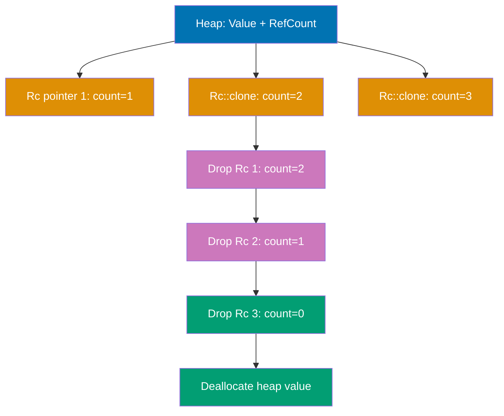

```rust
use std::rc::Rc;                     // => Import reference counted pointer
                                     // => Rc is NOT thread-safe (use Arc for threads)

fn main() {
    // Creating first Rc reference
    let a = Rc::new(5);              // => a type: Rc<i32>
                                     // => Allocates i32(5) on heap with reference count
                                     // => Initial strong_count: 1 (a is only owner)
                                     // => Rc layout: [strong_count: 1, weak_count: 0, value: 5]
    println!("a = {}", a);           // => Deref coercion: access value transparently
                                     // => Output: a = 5
    println!("Count: {}", Rc::strong_count(&a));
                                     // => strong_count checks active owners
                                     // => &a passed to avoid moving Rc
                                     // => Output: Count: 1

    // Cloning Rc (increment reference count)
    let b = Rc::clone(&a);           // => Rc::clone is shallow copy (NOT deep clone)
                                     // => Increments strong_count atomically
                                     // => a and b point to SAME heap allocation
                                     // => strong_count now: 2
                                     // => Rc::clone(&a) preferred over a.clone() (explicit intent)
    println!("b = {}", b);           // => Both a and b access same value
                                     // => Output: b = 5
    println!("Count after b: {}", Rc::strong_count(&a));
                                     // => Can check count via any Rc reference
                                     // => Output: Count after b: 2
    println!("Count via b: {}", Rc::strong_count(&b));
                                     // => Same count (shared allocation)
                                     // => Output: Count via b: 2

    // Inner scope with additional reference
    {
        let c = Rc::clone(&a);       // => c shares ownership (third owner)
                                     // => strong_count incremented to 3
                                     // => All three (a, b, c) point to same allocation
        println!("c = {}", c);       // => Output: c = 5
        println!("Count with c: {}", Rc::strong_count(&a));
                                     // => Output: Count with c: 3

        // Demonstrating shared access
        println!("a still accessible: {}", a);
                                     // => Output: a still accessible: 5
        println!("b still accessible: {}", b);
                                     // => Output: b still accessible: 5
    }                                // => c goes out of scope
                                     // => Rc::drop called on c
                                     // => strong_count decremented to 2
                                     // => Heap allocation NOT freed (count > 0)

    println!("Count after c dropped: {}", Rc::strong_count(&a));
                                     // => Output: Count after c dropped: 2
    println!("a and b still valid: {} {}", a, b);
                                     // => Both still access same value
                                     // => Output: a and b still valid: 5 5

    // Rc with complex type
    let data = Rc::new(vec![1, 2, 3, 4]);
                                     // => Rc<Vec<i32>>
                                     // => Vec itself on heap, Rc metadata on heap
    let data_ref1 = Rc::clone(&data);// => Multiple references to Vec
    let data_ref2 = Rc::clone(&data);// => strong_count: 3

    println!("Len via data: {}", data.len());
                                     // => Access Vec methods via deref
                                     // => Output: Len via data: 4
    println!("First via data_ref1: {}", data_ref1[0]);
                                     // => Index access through Rc
                                     // => Output: First via data_ref1: 1
    println!("Strong count: {}", Rc::strong_count(&data));
                                     // => Output: Strong count: 3

    // Cannot mutate through Rc (immutable sharing)
    // data.push(5);                 // => ERROR: cannot borrow as mutable
                                     // => Rc provides shared immutable access only
                                     // => Use Rc<RefCell<T>> for interior mutability
}                                    // => a and b dropped at end of main
                                     // => strong_count decremented to 1, then 0
                                     // => When count reaches 0: heap allocation freed
                                     // => Drop order: Rc metadata freed, then value freed

// Rc use case: shared data structure
fn graph_example() {
    #[derive(Debug)]
    struct Node {
        value: i32,
        neighbors: Vec<Rc<Node>>,    // => Multiple nodes can share neighbors
    }

    let leaf = Rc::new(Node {
        value: 3,
        neighbors: vec![],           // => Leaf node (no neighbors)
    });                              // => leaf strong_count: 1

    let branch1 = Rc::new(Node {
        value: 5,
        neighbors: vec![Rc::clone(&leaf)],
                                     // => branch1 shares ownership of leaf
    });                              // => leaf strong_count: 2

    let branch2 = Rc::new(Node {
        value: 7,
        neighbors: vec![Rc::clone(&leaf)],
                                     // => branch2 also shares ownership of leaf
    });                              // => leaf strong_count: 3

    println!("Leaf count: {}", Rc::strong_count(&leaf));
                                     // => Output: Leaf count: 3
                                     // => leaf owned by: leaf, branch1, branch2
}                                    // => All Rc dropped: leaf freed after branches
```

**Key Takeaway**: `Rc<T>` enables multiple ownership through runtime reference counting for read-only shared data, automatically freeing memory when the last reference is dropped. It's ideal for graph-like data structures where multiple parts need to share ownership, but it's NOT thread-safe (use Arc for concurrent access).

**Why It Matters**: Reference counting with compile-time non-thread-safety enforcement prevents the data races possible with C++ shared_ptr while avoiding garbage collection overhead. React-like UI frameworks in Rust use Rc for virtual DOM nodes where multiple components share ownership, achieving memory safety without GC pauses that cause frame drops in JavaScript frameworks.

---

## Example 43: RefCell and Interior Mutability

`RefCell<T>` enables interior mutability through runtime borrow checking, allowing mutation of data behind shared references. It moves Rust's borrowing rules from compile time to runtime, enabling patterns impossible with standard borrowing while maintaining safety through runtime panics.

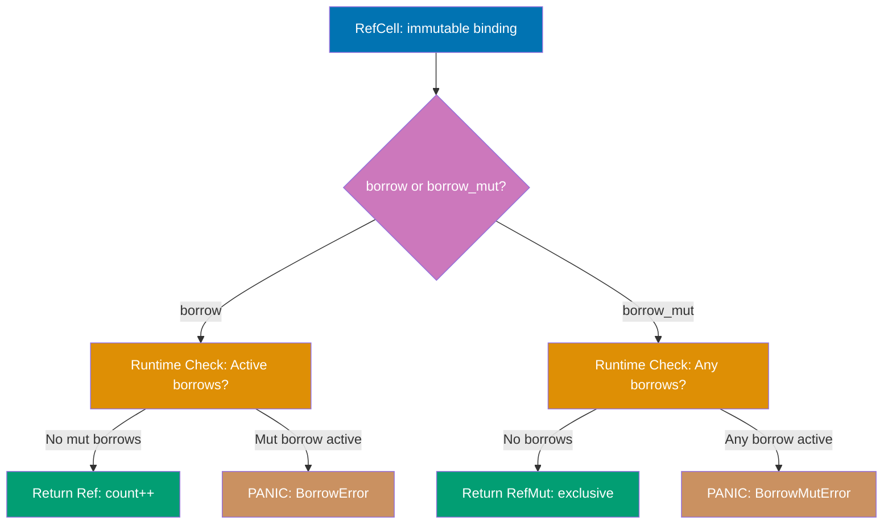

```rust
use std::cell::RefCell;              // => Import RefCell for interior mutability
                                     // => RefCell is NOT thread-safe (single-threaded only)

fn main() {
    // Creating RefCell with initial value
    let value = RefCell::new(5);     // => value type: RefCell<i32>
                                     // => value itself is immutable binding
                                     // => Interior i32 can be mutated despite &value being immutable
                                     // => RefCell tracks borrows at runtime (borrow count)
    println!("Initial: {}", value.borrow());
                                     // => borrow() returns Ref<i32> (immutable guard)
                                     // => Deref to access value: *value.borrow()
                                     // => Output: Initial: 5

    // Immutable borrow through borrow()
    {
        let borrowed = value.borrow();
                                     // => borrowed type: Ref<i32> (smart pointer)
                                     // => RefCell immutable borrow count: 1
                                     // => Ref implements Deref for transparent access
                                     // => Borrow checked at runtime (not compile time)
        println!("Value: {}", *borrowed);
                                     // => Explicit deref to show mechanism
                                     // => Output: Value: 5
        println!("Can borrow multiple times immutably");

        let borrowed2 = value.borrow();
                                     // => Multiple immutable borrows allowed
                                     // => RefCell immutable borrow count: 2
                                     // => Same rules as compile-time: multiple &T ok
        println!("Value2: {}", *borrowed2);
                                     // => Output: Value2: 5
    }                                // => borrowed and borrowed2 dropped
                                     // => RefCell immutable borrow count: 0
                                     // => Runtime borrow tracking updated

    // Mutable borrow through borrow_mut()
    {
        let mut borrowed_mut = value.borrow_mut();
                                     // => borrowed_mut type: RefMut<i32>
                                     // => RefCell mutable borrow count: 1
                                     // => RefMut implements DerefMut for mutable access
        println!("Before mutation: {}", *borrowed_mut);
                                     // => Output: Before mutation: 5

        *borrowed_mut += 10;         // => Modify through mutable borrow
                                     // => Deref to get &mut i32, then modify
                                     // => Interior value now: 15
        println!("After mutation: {}", *borrowed_mut);
                                     // => Output: After mutation: 15

        // let _borrow = value.borrow();
                                     // => RUNTIME PANIC if uncommented!
                                     // => Cannot borrow immutably while mutable borrow active
                                     // => Enforced at runtime, not compile time
    }                                // => borrowed_mut dropped
                                     // => RefCell mutable borrow count: 0
                                     // => Now safe to borrow again

    // Accessing modified value
    println!("New value: {}", *value.borrow());
                                     // => Output: New value: 15
                                     // => Mutation persisted despite value being immutable binding

    // Runtime borrow checking demonstration
    let _immut_borrow = value.borrow();
                                     // => Immutable borrow active
                                     // => RefCell immutable borrow count: 1
    // let _mut_borrow = value.borrow_mut();
                                     // => PANIC: already borrowed as immutable
                                     // => thread 'main' panicked at 'already borrowed: BorrowMutError'
                                     // => Runtime check prevents violation
    drop(_immut_borrow);             // => Explicitly drop to end borrow
                                     // => RefCell immutable borrow count: 0

    // Now mutable borrow succeeds
    let mut mut_borrow = value.borrow_mut();
                                     // => OK: no active borrows
    *mut_borrow = 100;               // => Set to 100
    drop(mut_borrow);                // => Drop before next borrow

    println!("Final value: {}", value.borrow());
                                     // => Output: Final value: 100

    // RefCell with complex type
    let data = RefCell::new(vec![1, 2, 3]);
                                     // => RefCell<Vec<i32>>
                                     // => Allows mutation of Vec through shared reference

    {
        let mut vec_ref = data.borrow_mut();
                                     // => Mutable access to Vec
        vec_ref.push(4);             // => Mutate Vec (add element)
                                     // => Vec now: [1, 2, 3, 4]
        vec_ref.push(5);             // => Vec now: [1, 2, 3, 4, 5]
    }                                // => Mutable borrow ends

    println!("Vec: {:?}", data.borrow());
                                     // => Output: Vec: [1, 2, 3, 4, 5]
                                     // => Mutation visible despite data being immutable

    // try_borrow for safe runtime checks
    let borrow_result = value.try_borrow();
                                     // => try_borrow returns Result<Ref<T>, BorrowError>
                                     // => Doesn't panic on failure
    match borrow_result {
        Ok(r) => println!("Borrowed: {}", *r),
                                     // => Output: Borrowed: 100
        Err(_) => println!("Already borrowed mutably"),
    }

    // Interior mutability pattern: mutate through &self
    struct Counter {
        count: RefCell<i32>,         // => Interior mutable field
    }

    impl Counter {
        fn increment(&self) {        // => Takes &self (not &mut self)
                                     // => Can still mutate count!
            *self.count.borrow_mut() += 1;
                                     // => Mutate through RefCell
        }

        fn get(&self) -> i32 {       // => Immutable method
            *self.count.borrow()     // => Read through RefCell
        }
    }

    let counter = Counter { count: RefCell::new(0) };
                                     // => counter is immutable binding
    counter.increment();             // => Mutate through &self
    counter.increment();             // => count now: 2
    println!("Counter: {}", counter.get());
                                     // => Output: Counter: 2
                                     // => Mutation succeeded despite immutable binding
}                                    // => All RefCell dropped, no runtime borrows remain
```

**Key Takeaway**: `RefCell<T>` moves borrow checking from compile time to runtime, enabling interior mutability patterns like mutation through shared references (`&self`), with panics on borrow rule violations. Use it when you need to mutate data that's shared immutably, but be aware of the runtime cost and potential panics—static borrowing is always preferred when possible.

**Why It Matters**: RefCell enables mutation through shared references with runtime borrow checking, solving the interior mutability problems that require unsafe code in C++ or pervasive locks in Java. Game engines written in Rust use RefCell for entity component systems where static borrow checking is too restrictive, trading compile-time guarantees for runtime checks that still prevent undefined behavior unlike C++ mutable access.

---

## Example 44: Rc and RefCell Combined

Combining `Rc<RefCell<T>>` enables multiple ownership of mutable data, a common pattern for shared mutable state. This powerful combination allows multiple owners to mutate shared data while maintaining memory safety through runtime checks.

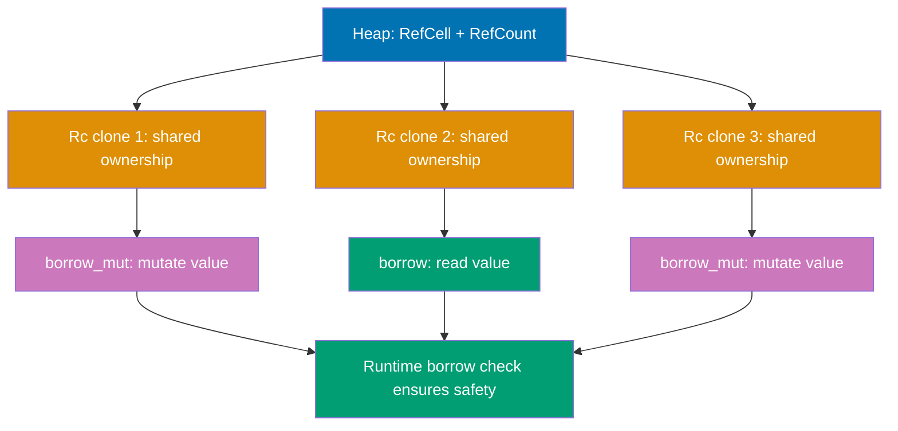

```rust
use std::cell::RefCell;              // => Interior mutability
use std::rc::Rc;                     // => Multiple ownership

fn main() {
    // Creating shared mutable state
    let value = Rc::new(RefCell::new(5));
                                     // => value type: Rc<RefCell<i32>>
                                     // => Outer Rc: enables multiple ownership
                                     // => Inner RefCell: enables mutation through shared reference
                                     // => Pattern: shared mutable state (single-threaded)
                                     // => Memory layout: Rc metadata -> RefCell -> i32

    println!("Initial value: {}", value.borrow());
                                     // => Deref through Rc to get RefCell
                                     // => Then borrow() to get Ref<i32>
                                     // => Output: Initial value: 5

    // Multiple owners of same mutable data
    let a = Rc::clone(&value);       // => a shares ownership
                                     // => Rc strong_count: 2
                                     // => Both value and a point to same RefCell
    let b = Rc::clone(&value);       // => b shares ownership
                                     // => Rc strong_count: 3
    let c = Rc::clone(&value);       // => c shares ownership
                                     // => Rc strong_count: 4

    println!("Strong count: {}", Rc::strong_count(&value));
                                     // => Output: Strong count: 4
                                     // => Four owners: value, a, b, c

    // Mutating through first owner (a)
    {
        let mut a_mut = a.borrow_mut();
                                     // => a_mut type: RefMut<i32>
                                     // => Deref Rc to get &RefCell, then borrow_mut()
                                     // => RefCell mutable borrow count: 1
        *a_mut += 10;                // => Modify: 5 + 10 = 15
                                     // => Mutation visible to ALL owners
        println!("After a mutates: {}", *a_mut);
                                     // => Output: After a mutates: 15
    }                                // => a_mut dropped (mutable borrow ends)
                                     // => RefCell mutable borrow count: 0

    // Observing mutation through different owner (b)
    println!("Value via b: {}", b.borrow());
                                     // => Output: Value via b: 15
                                     // => b sees mutation from a (shared state)

    // Mutating through second owner (b)
    {
        let mut b_mut = b.borrow_mut();
                                     // => Mutable borrow through b
        *b_mut += 20;                // => Modify: 15 + 20 = 35
                                     // => All owners will see this change
        println!("After b mutates: {}", *b_mut);
                                     // => Output: After b mutates: 35
    }                                // => b_mut dropped

    // All owners see updated value
    println!("Value via value: {}", value.borrow());
                                     // => Output: Value via value: 35
    println!("Value via a: {}", a.borrow());
                                     // => Output: Value via a: 35
    println!("Value via b: {}", b.borrow());
                                     // => Output: Value via b: 35
    println!("Value via c: {}", c.borrow());
                                     // => Output: Value via c: 35
                                     // => All four owners see same value (shared state)

    // Demonstrating borrow checking across owners
    let _immut_ref = value.borrow(); // => Immutable borrow via value
                                     // => RefCell immutable borrow count: 1
    // let _mut_ref = a.borrow_mut();
                                     // => PANIC: already borrowed immutably
                                     // => RefCell tracks borrows globally (not per Rc)
                                     // => Cannot have mutable borrow while immutable exists
    drop(_immut_ref);                // => End immutable borrow

    // Now mutable borrow succeeds
    *c.borrow_mut() = 100;           // => Mutate through c
                                     // => Set to 100 (overwrites 35)
    println!("After c reset: {}", value.borrow());
                                     // => Output: After c reset: 100

    // Practical use case: shared mutable graph
    #[derive(Debug)]
    struct Node {
        value: i32,
        neighbors: Vec<Rc<RefCell<Node>>>,
                                     // => Nodes can share AND mutate neighbors
    }

    let node1 = Rc::new(RefCell::new(Node {
        value: 1,
        neighbors: vec![],           // => Empty initially
    }));                             // => node1 strong_count: 1

    let node2 = Rc::new(RefCell::new(Node {
        value: 2,
        neighbors: vec![],
    }));                             // => node2 strong_count: 1

    // Create bidirectional link (cycle)
    node1.borrow_mut().neighbors.push(Rc::clone(&node2));
                                     // => node1 -> node2
                                     // => node2 strong_count: 2
    node2.borrow_mut().neighbors.push(Rc::clone(&node1));
                                     // => node2 -> node1 (cycle!)
                                     // => node1 strong_count: 2
                                     // => Memory leak: cycle prevents deallocation

    // Mutating node through graph
    node1.borrow_mut().value = 10;   // => Mutate node1's value
    println!("Node1 value: {}", node1.borrow().value);
                                     // => Output: Node1 value: 10

    // Access neighbor through node1
    let neighbor = &node1.borrow().neighbors[0];
                                     // => neighbor type: &Rc<RefCell<Node>>
    println!("Neighbor value: {}", neighbor.borrow().value);
                                     // => Output: Neighbor value: 2
                                     // => Accessing node2 through node1's neighbor

    // WARNING: Cycles cause memory leaks with Rc
    println!("node1 count: {}", Rc::strong_count(&node1));
                                     // => Output: node1 count: 2
                                     // => Cycle keeps count > 0 forever
                                     // => Use Weak<T> to break cycles
}                                    // => value, a, b, c dropped
                                     // => Rc strong_count decremented
                                     // => When count reaches 0: RefCell freed, then value freed
                                     // => node1, node2 NOT freed (cycle keeps count=1)
```

**Key Takeaway**: `Rc<RefCell<T>>` combines multiple ownership with interior mutability, enabling shared mutable state patterns while maintaining memory safety through runtime borrow checking. It's perfect for graph-like structures or shared state in single-threaded contexts, but beware of reference cycles causing memory leaks—use `Weak<T>` to break cycles.

**Why It Matters**: Combining reference counting with interior mutability enables graph-like data structures with safe mutation, solving problems that require garbage collection in most languages or unsafe code in C++. Tree-sitter's parsing library uses Rc<RefCell> for AST nodes where parent-child bidirectional references need shared mutable access—achieving safety impossible with raw pointers while avoiding GC pauses.

---

## Example 45: Thread Basics

Threads enable concurrent execution through `std::thread::spawn`, which takes a closure and returns a `JoinHandle`. Rust's ownership system prevents data races at compile time, making concurrent programming safe by default.

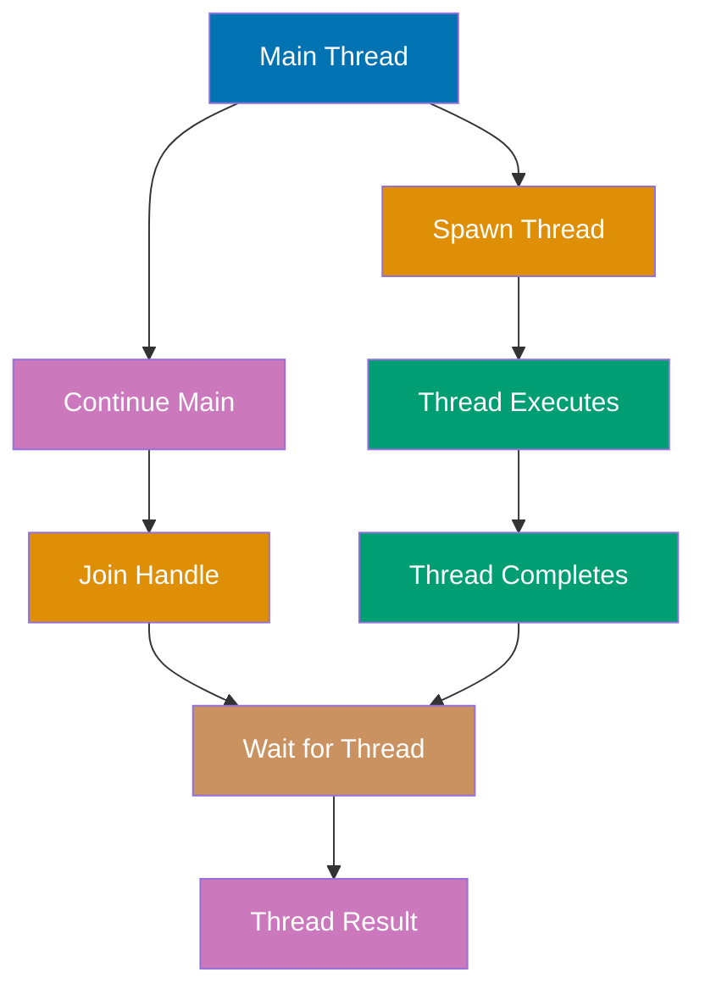

```rust
use std::thread;                     // => std::thread for OS thread management
use std::time::Duration;             // => Duration for sleep intervals

fn main() {
    println!("Main thread starting"); // => Main thread executes first
                                     // => Output: Main thread starting

    // Spawning new OS thread
    let handle = thread::spawn(|| {  // => spawn takes FnOnce closure
                                     // => Closure must be 'static lifetime (no borrowed data)
                                     // => Returns JoinHandle<T> where T is closure return type
                                     // => Creates new OS thread (NOT green thread)
        println!("Thread started");  // => Executes in spawned thread
                                     // => Output: Thread started (timing varies)

        for i in 1..5 {              // => Loop 4 times (1, 2, 3, 4)
                                     // => Each iteration runs in spawned thread
            println!("Thread: {}", i);
                                     // => Output: Thread: 1, Thread: 2, Thread: 3, Thread: 4
                                     // => Order may interleave with main thread output
            thread::sleep(Duration::from_millis(1));
                                     // => Sleep for 1 millisecond
                                     // => Yields CPU to other threads
                                     // => OS scheduler may switch to main thread
        }

        println!("Thread finishing"); // => Last message from spawned thread
                                     // => Output: Thread finishing
        42                           // => Return value (i32)
                                     // => Accessible through JoinHandle::join()
    });                              // => Thread executes concurrently with main
                                     // => handle type: JoinHandle<i32>

    // Main thread continues executing
    for i in 1..3 {                  // => Loop 2 times (1, 2)
                                     // => Executes concurrently with spawned thread
        println!("Main: {}", i);     // => Output: Main: 1, Main: 2
                                     // => May interleave with "Thread: X" messages
        thread::sleep(Duration::from_millis(1));
                                     // => Sleep 1ms (same as spawned thread)
                                     // => Both threads wake around same time
    }

    println!("Main waiting for thread");
                                     // => Main finished its loop
                                     // => Output: Main waiting for thread
                                     // => Spawned thread may still be running

    // Waiting for spawned thread to complete
    let result = handle.join().unwrap();
                                     // => join() blocks until thread completes
                                     // => Returns Result<T, Any> (T is closure return type)
                                     // => Ok(T) if thread succeeded
                                     // => Err(Any) if thread panicked
                                     // => unwrap() panics if thread panicked
                                     // => result is i32 (42 from closure)
    println!("Thread returned: {}", result);
                                     // => Output: Thread returned: 42

    println!("Thread completed");    // => Prints after join() returns
                                     // => Output: Thread completed
                                     // => Guaranteed to print AFTER thread finishes

    // Multiple threads example
    let mut handles = vec![];        // => Store JoinHandles for multiple threads

    for thread_num in 0..3 {         // => Spawn 3 threads
        let handle = thread::spawn(move || {
                                     // => move captures thread_num by value
                                     // => Each thread gets its own copy
            println!("Thread {} executing", thread_num);
                                     // => Output varies: Thread 0, Thread 1, Thread 2
                                     // => Order non-deterministic (depends on scheduler)
            thread::sleep(Duration::from_millis(10));
            thread_num * 10          // => Return thread_num * 10
        });
        handles.push(handle);        // => Store handle for later join
                                     // => handles[i] corresponds to thread i
    }                                // => All 3 threads now running concurrently

    // Join all threads and collect results
    for (i, handle) in handles.into_iter().enumerate() {
                                     // => Iterate over handles
                                     // => into_iter() takes ownership
                                     // => enumerate() provides index
        let result = handle.join().unwrap();
                                     // => Wait for thread i to complete
                                     // => Join in order (0, 1, 2) but threads may finish in any order
        println!("Thread {} returned: {}", i, result);
                                     // => Output: Thread 0 returned: 0
                                     // => Output: Thread 1 returned: 10
                                     // => Output: Thread 2 returned: 20
    }

    // Thread with panic handling
    let panic_handle = thread::spawn(|| {
        println!("About to panic");  // => Output: About to panic
        panic!("Thread panic!");     // => Thread panics (doesn't crash program)
    });

    match panic_handle.join() {      // => join() returns Result
        Ok(_) => println!("Thread succeeded"),
        Err(e) => println!("Thread panicked: {:?}", e),
                                     // => Output: Thread panicked: Any { .. }
                                     // => Main thread survives spawned thread panic
    }
}                                    // => All threads joined before main exits
                                     // => If main exits without join, spawned threads killed
```

**Key Takeaway**: `thread::spawn()` creates OS threads for concurrent execution, with `join()` blocking until thread completion, enabling parallelism while preventing data races through Rust's ownership system. Threads run independently, panic isolation prevents crashes, and join() ensures synchronization when needed.

**Why It Matters**: OS threads with ownership-based safety prevent the data races that plague pthreads in C and require defensive copying in Java, enabling fearless parallelism. Rayon's parallel iterators spawn threads safely because Rust's Send/Sync traits ensure only thread-safe data crosses thread boundaries—compile-time verification that prevents the concurrency bugs requiring expensive ThreadSanitizer in C++.

---

## Example 46: Move Semantics with Threads

Threads require ownership of captured variables through `move` closures to prevent data races across thread boundaries. This ensures thread safety at compile time by transferring ownership rather than borrowing.

```rust
use std::thread;                     // => Import thread module

fn main() {
    // Attempting to borrow without move (doesn't compile)
    let v = vec![1, 2, 3];           // => v type: Vec<i32>
                                     // => v owned by main thread
                                     // => Stored on main's stack (pointer) + heap (data)

    // This won't compile (borrow without move)
    // let handle = thread::spawn(|| {
    //     println!("Vector: {:?}", v);
    //                                  // => ERROR: closure may outlive v
    //                                  // => Compiler doesn't know when spawned thread ends
    //                                  // => v might be dropped while thread still uses it
    //                                  // => Prevents use-after-free at compile time!
    // });

    // Correct approach: move ownership to thread
    let handle = thread::spawn(move || {
                                     // => move keyword forces ownership transfer
                                     // => v moved into closure's environment
                                     // => Closure now owns v (not borrowing)
                                     // => v's stack metadata moved to closure
                                     // => Heap data ownership transferred
        println!("Vector: {:?}", v); // => OK: closure owns v
                                     // => Output: Vector: [1, 2, 3]
                                     // => v guaranteed valid (owned by closure)
        println!("Length: {}", v.len());
                                     // => Output: Length: 3
        let sum: i32 = v.iter().sum();
                                     // => Use v within thread
        println!("Sum: {}", sum);    // => Output: Sum: 6
        v                            // => Return v from closure
                                     // => Ownership transferred to join() caller
    });                              // => Thread owns v for its lifetime
                                     // => Main thread CANNOT access v

    // println!("{:?}", v);          // => ERROR: v moved into closure
                                     // => borrow of moved value: `v`
                                     // => Compile-time prevention of data race

    // Get v back through join
    let returned_v = handle.join().unwrap();
                                     // => join() returns Result<Vec<i32>>
                                     // => Closure returned v
                                     // => Ownership transferred back to main
    println!("Returned: {:?}", returned_v);
                                     // => Output: Returned: [1, 2, 3]
                                     // => Main thread regains ownership

    // Moving multiple variables
    let x = 5;                       // => x type: i32 (Copy type)
    let s = String::from("hello");   // => s type: String (non-Copy)
    let v2 = vec![1, 2];             // => v2 type: Vec<i32> (non-Copy)

    thread::spawn(move || {          // => move captures ALL used variables
                                     // => x copied (i32 is Copy)
                                     // => s moved (String not Copy)
                                     // => v2 moved (Vec not Copy)
        println!("x: {}", x);        // => Output: x: 5 (copied value)
        println!("s: {}", s);        // => Output: s: hello (moved value)
        println!("v2: {:?}", v2);    // => Output: v2: [1, 2] (moved value)
    }).join().unwrap();              // => Join immediately

    println!("x still accessible: {}", x);
                                     // => Output: x still accessible: 5
                                     // => x copied (not moved) because i32 is Copy
    // println!("{}", s);            // => ERROR: s moved
    // println!("{:?}", v2);         // => ERROR: v2 moved

    // Clone before move pattern
    let data = vec![10, 20, 30];     // => data owned by main
    let data_clone = data.clone();   // => Deep clone for thread
                                     // => data_clone is independent copy

    thread::spawn(move || {          // => Move clone into thread
                                     // => data_clone owned by thread
        println!("Clone: {:?}", data_clone);
                                     // => Output: Clone: [10, 20, 30]
    }).join().unwrap();

    println!("Original: {:?}", data);// => Output: Original: [10, 20, 30]
                                     // => data still owned by main (we moved clone)

    // Multiple threads with independent data
    let mut handles = vec![];

    for i in 0..3 {                  // => Spawn 3 threads
        let thread_data = vec![i, i * 10, i * 100];
                                     // => Each thread gets own vector
        let handle = thread::spawn(move || {
                                     // => move thread_data into closure
                                     // => Each thread owns independent data
            println!("Thread {}: {:?}", i, thread_data);
                                     // => i also moved (Copy type)
                                     // => Output: Thread 0: [0, 0, 0]
                                     // => Output: Thread 1: [1, 10, 100]
                                     // => Output: Thread 2: [2, 20, 200]
            thread_data.len()        // => Return length
        });
        handles.push(handle);        // => Store handle
    }

    for handle in handles {          // => Join all threads
        let len = handle.join().unwrap();
        println!("Returned length: {}", len);
                                     // => Output: Returned length: 3 (three times)
    }

    // Rc cannot be moved to threads (not Send)
    use std::rc::Rc;
    let rc_data = Rc::new(vec![1, 2, 3]);

    // thread::spawn(move || {       // => ERROR: Rc<Vec<i32>> cannot be sent between threads
    //     println!("{:?}", rc_data);
    // });                           // => Rc is not Send trait (not thread-safe)
                                     // => Compile-time prevention of data races
                                     // => Use Arc<T> instead for thread-safe sharing
}                                    // => All threads completed before main exits
```

**Key Takeaway**: Threads require `move` closures to transfer ownership of captured variables, preventing data races by ensuring only one thread can access non-thread-safe data at a time. The compiler enforces this through the `Send` trait—types that can't be safely sent across threads (like `Rc<T>`) are rejected at compile time, forcing you to use thread-safe alternatives like `Arc<T>`.

**Why It Matters**: Move semantics for thread captures eliminate the lifetime bugs that cause segfaults in C++ thread lambdas and force defensive cloning in Java. WebAssembly runtimes like Wasmtime use move closures for parallel compilation where ownership transfer ensures no shared mutable state between compilation threads—preventing data races statically rather than through locks.

---

## Example 47: Message Passing with Channels

Channels enable safe message passing between threads through `mpsc` (multiple producer, single consumer) channels. Ownership transfer through channels prevents data races while enabling concurrent communication.

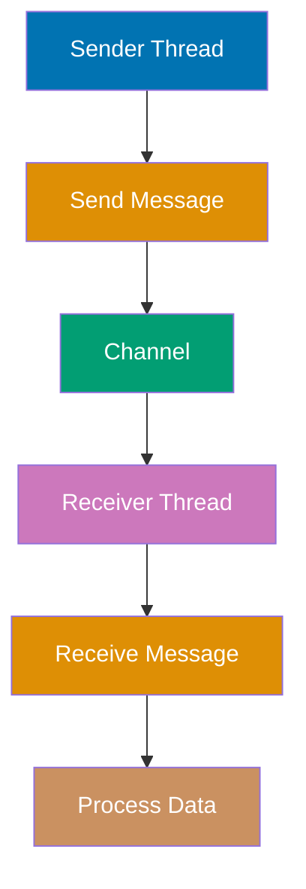

```rust
use std::sync::mpsc;                 // => mpsc: multiple producer, single consumer
use std::thread;                     // => Thread support
use std::time::Duration;             // => For sleep demonstrations

fn main() {
    // Creating channel
    let (tx, rx) = mpsc::channel();  // => channel() returns (Sender<T>, Receiver<T>)
                                     // => tx (transmitter): Sender<T> for sending
                                     // => rx (receiver): Receiver<T> for receiving
                                     // => Channel is unbounded (grows as needed)
                                     // => T inferred from first send() or recv()
                                     // => Creates new FIFO queue in heap

    println!("Channel created");     // => Prints to stdout
                                     // => Output: Channel created

    // Spawning sender thread
    thread::spawn(move || {          // => spawn() creates new OS thread
                                     // => move captures tx (ownership transfer)
                                     // => rx remains in main thread
                                     // => Closure runs concurrently
        let messages = vec![         // => Vector of messages to send
            String::from("hello"),   // => Each message is owned String
            String::from("from"),
            String::from("thread"),
        ];                           // => messages type: Vec<String>

        for msg in messages {        // => Iterate, taking ownership of each msg
                                     // => msg type: String (not &String)
            println!("Sending: {}", msg);
                                     // => Output: Sending: hello
                                     // => Output: Sending: from
                                     // => Output: Sending: thread

            tx.send(msg).unwrap();   // => send() takes ownership of msg
                                     // => msg MOVED through channel
                                     // => Returns Result<(), SendError<T>>
                                     // => Ok(()) if sent successfully
                                     // => Err if receiver dropped
                                     // => Cannot use msg after send (moved!)

            thread::sleep(Duration::from_millis(100));
                                     // => Sleep between sends
                                     // => Simulates work/delay
        }                            // => Loop ends, messages fully consumed

        println!("All messages sent");
                                     // => Output: All messages sent
    });                              // => tx dropped when closure ends
                                     // => Channel closes when all senders dropped
                                     // => Receiver will get None after all messages

    // Receiving messages in main thread
    println!("Waiting for messages");// => Output: Waiting for messages

    for received in rx {             // => rx implements Iterator
                                     // => Iterates until channel closed (all senders dropped)
                                     // => Each iteration calls recv() internally
                                     // => Blocks waiting for next message
                                     // => received type: String (owned, not &String)
        println!("Got: {}", received);
                                     // => Output: Got: hello
                                     // => Output: Got: from
                                     // => Output: Got: thread
                                     // => Ownership transferred from sender to receiver
    }                                // => Loop exits when channel closed

    println!("All messages received");
                                     // => Output: All messages received
                                     // => Prints after channel closes

    // Multiple producers example
    let (tx, rx) = mpsc::channel();  // => New channel
    let tx2 = tx.clone();            // => Clone sender (mpsc: multiple producers)
                                     // => tx and tx2 both can send
                                     // => tx type: Sender<String>
    let tx3 = tx.clone();            // => Third sender

    // First producer thread
    thread::spawn(move || {          // => move tx
        for i in 1..4 {
            let msg = format!("Producer 1: {}", i);
            tx.send(msg).unwrap();   // => Send from first producer
                                     // => Ownership transferred through channel
            thread::sleep(Duration::from_millis(50));
        }
        println!("Producer 1 done");
    });                              // => tx dropped

    // Second producer thread
    thread::spawn(move || {          // => move tx2
        for i in 1..4 {
            let msg = format!("Producer 2: {}", i);
            tx2.send(msg).unwrap();  // => Send from second producer
            thread::sleep(Duration::from_millis(75));
        }
        println!("Producer 2 done");
    });                              // => tx2 dropped

    // Third producer thread
    thread::spawn(move || {          // => move tx3
        for i in 1..4 {
            let msg = format!("Producer 3: {}", i);
            tx3.send(msg).unwrap();  // => Send from third producer
            thread::sleep(Duration::from_millis(100));
        }
        println!("Producer 3 done");
    });                              // => tx3 dropped
                                     // => After all tx, tx2, tx3 dropped: channel closes

    // Single consumer receives from all producers
    for received in rx {             // => Receives from all three producers
                                     // => Messages interleaved based on timing
        println!("Received: {}", received);
                                     // => Output order non-deterministic:
                                     // => Received: Producer 1: 1
                                     // => Received: Producer 2: 1
                                     // => Received: Producer 1: 2
                                     // => etc. (depends on thread scheduling)
    }                                // => Exits when all senders dropped

    println!("Multiple producers done");

    // try_recv for non-blocking receive
    let (tx_try, rx_try) = mpsc::channel();

    thread::spawn(move || {
        thread::sleep(Duration::from_millis(500));
                                     // => Delay before sending
        tx_try.send("delayed message").unwrap();
    });

    // Polling with try_recv
    for i in 1..6 {                  // => Poll 5 times
        match rx_try.try_recv() {    // => try_recv() doesn't block
                                     // => Returns Result<T, TryRecvError>
                                     // => Ok(msg) if message available
                                     // => Err(Empty) if no message yet
                                     // => Err(Disconnected) if all senders dropped
            Ok(msg) => {
                println!("try_recv got: {}", msg);
                                     // => Output: try_recv got: delayed message
                                     // => Only prints on 5th iteration (after 500ms delay)
                break;               // => Exit loop when message received
            }
            Err(mpsc::TryRecvError::Empty) => {
                println!("Poll {}: No message yet", i);
                                     // => Output: Poll 1: No message yet
                                     // => Output: Poll 2: No message yet
                                     // => etc.
                thread::sleep(Duration::from_millis(100));
                                     // => Wait between polls
            }
            Err(mpsc::TryRecvError::Disconnected) => {
                println!("Channel disconnected");
                break;
            }
        }
    }

    // recv_timeout for bounded waiting
    let (tx_timeout, rx_timeout) = mpsc::channel();

    thread::spawn(move || {
        thread::sleep(Duration::from_millis(200));
        tx_timeout.send("timeout test").unwrap();
    });

    match rx_timeout.recv_timeout(Duration::from_millis(100)) {
                                     // => Wait max 100ms for message
        Ok(msg) => println!("Got: {}", msg),
        Err(mpsc::RecvTimeoutError::Timeout) => {
            println!("Timeout: no message within 100ms");
                                     // => Output: Timeout: no message within 100ms
                                     // => Message arrives after 200ms (too late)
        }
        Err(mpsc::RecvTimeoutError::Disconnected) => {
            println!("Disconnected");
        }
    }

    // Wait for actual message
    let msg = rx_timeout.recv().unwrap();
                                     // => Blocks until message arrives (200ms)
    println!("Got after timeout: {}", msg);
                                     // => Output: Got after timeout: timeout test
}                                    // => All threads completed, all channels closed
```

**Key Takeaway**: Channels provide safe message passing between threads with `send()` and `recv()` methods, transferring ownership of messages to prevent data races and enable concurrent communication. The mpsc design allows multiple producers but only one consumer, with channel closure automatic when all senders are dropped—use `try_recv()` for polling or `recv_timeout()` for bounded waiting.

**Why It Matters**: Ownership-transferring channels enable lock-free communication patterns, preventing the deadlocks and race conditions common in shared-memory concurrency. Tokio's async ecosystem uses channels extensively for task communication where message ownership transfer eliminates the need for locks, achieving the concurrency safety of Erlang actors with zero runtime overhead.

---

## Example 48: Shared State with Mutex

`Mutex<T>` enables shared mutable state across threads through mutual exclusion locks, ensuring only one thread accesses data at a time. However, Mutex alone doesn't provide multiple ownership—it needs Arc for multi-threaded sharing.

```rust
use std::sync::Mutex;                // => Mutex for mutual exclusion
use std::thread;                     // => Thread support

fn main() {
    // Basic Mutex usage (single-threaded)
    let counter = Mutex::new(0);     // => counter type: Mutex<i32>
                                     // => Wraps i32 value 0
                                     // => Mutex provides interior mutability
                                     // => Lock state tracked internally

    {
        let mut num = counter.lock().unwrap();
                                     // => lock() acquires mutex
                                     // => Blocks if another thread holds lock
                                     // => Returns Result<MutexGuard<T>, PoisonError>
                                     // => MutexGuard<i32> implements DerefMut
                                     // => num type: MutexGuard<i32>
        *num += 1;                   // => Deref to get &mut i32
                                     // => Increment: 0 -> 1
        println!("Counter: {}", *num);
                                     // => Output: Counter: 1
    }                                // => MutexGuard dropped (lock released)
                                     // => RAII pattern: lock released automatically

    // Attempting multi-threaded access (won't compile)
    let counter_shared = Mutex::new(0);
    let mut handles = vec![];        // => Store thread handles

    // This pattern doesn't work (Mutex moved in first iteration)
    // for _ in 0..10 {
    //     let handle = thread::spawn(move || {
    //         let mut num = counter_shared.lock().unwrap();
    //                                  // => ERROR: counter_shared moved
    //         *num += 1;
    //     });
    //     handles.push(handle);
    // }                             // => Mutex doesn't provide shared ownership!
                                     // => Need Arc<Mutex<T>> for multiple threads

    // Demonstrating why Arc is needed
    println!("Single thread Mutex: {:?}", counter_shared);
                                     // => Output: Single thread Mutex: Mutex { data: 0, .. }

    // Poison error demonstration
    let poisoned = Mutex::new(vec![1, 2, 3]);

    let handle = thread::spawn(move || {
        let mut data = poisoned.lock().unwrap();
                                     // => Acquire lock
        data.push(4);                // => Modify data
        panic!("Thread panics!");    // => Panic while holding lock
                                     // => Lock not explicitly released
                                     // => Mutex enters "poisoned" state
    });                              // => Thread panics, mutex poisoned

    match handle.join() {
        Ok(_) => println!("Thread succeeded"),
        Err(e) => println!("Thread panicked: {:?}", e),
                                     // => Output: Thread panicked: Any { .. }
    }

    // Attempting to lock poisoned mutex
    // let result = poisoned.lock(); // => Returns Err(PoisonError)
                                     // => Indicates previous thread panicked while holding lock
                                     // => Data may be in inconsistent state
                                     // => Can still access via into_inner() if desired

    // lock() vs try_lock()
    let try_mutex = Mutex::new(5);

    {
        let _guard1 = try_mutex.lock().unwrap();
                                     // => First lock acquired

        // Try to acquire second lock (would deadlock with lock())
        match try_mutex.try_lock() { // => try_lock() doesn't block
                                     // => Returns immediately
                                     // => Result<MutexGuard<T>, TryLockError>
            Ok(_guard2) => {
                println!("Got second lock");
            }
            Err(std::sync::TryLockError::WouldBlock) => {
                println!("Lock already held");
                                     // => Output: Lock already held
                                     // => Prevents deadlock in same thread
            }
            Err(std::sync::TryLockError::Poisoned(_)) => {
                println!("Mutex poisoned");
            }
        }
    }                                // => _guard1 dropped, lock released

    // Now second try_lock succeeds
    match try_mutex.try_lock() {
        Ok(guard) => {
            println!("Got lock after release: {}", *guard);
                                     // => Output: Got lock after release: 5
        }
        Err(_) => println!("Still locked"),
    }

    // into_inner for consuming Mutex
    let consumed = Mutex::new(vec![1, 2, 3]);
    let inner = consumed.into_inner().unwrap();
                                     // => into_inner() consumes Mutex
                                     // => Returns Result<T, PoisonError<T>>
                                     // => Extracts inner value without locking
                                     // => inner type: Vec<i32> (not Mutex)
    println!("Inner value: {:?}", inner);
                                     // => Output: Inner value: [1, 2, 3]
    // println!("{:?}", consumed);   // => ERROR: consumed moved

    // get_mut for mutable access without locking
    let mut get_mut_example = Mutex::new(10);
    {
        let data = get_mut_example.get_mut().unwrap();
                                     // => get_mut() requires &mut Mutex
                                     // => No locking needed (exclusive &mut borrow)
                                     // => data type: &mut i32
        *data += 5;                  // => Modify directly
                                     // => No MutexGuard involved
    }
    println!("After get_mut: {}", get_mut_example.lock().unwrap());
                                     // => Output: After get_mut: 15
}                                    // => All mutexes dropped
```

**Key Takeaway**: `Mutex<T>` provides interior mutability for thread-safe shared state through lock acquisition, but requires `Arc` for multiple ownership across threads. The RAII pattern (lock released on MutexGuard drop) prevents deadlocks, and poison errors detect panics while locked.

**Why It Matters**: Mutex with RAII lock guards prevents the deadlocks from forgotten unlocks and use-after-free from accessing unlocked data that plague C pthreads. Database connection pools in Rust use Mutex to protect shared state with automatic lock release on panic, preventing the resource leaks and corruption common in exception-heavy Java code or error-prone manual lock management in C.

---

## Example 49: Arc and Mutex Combined

`Arc<Mutex<T>>` combines atomic reference counting with mutual exclusion, enabling thread-safe shared mutable state. This is the standard pattern for sharing mutable data across threads in Rust.

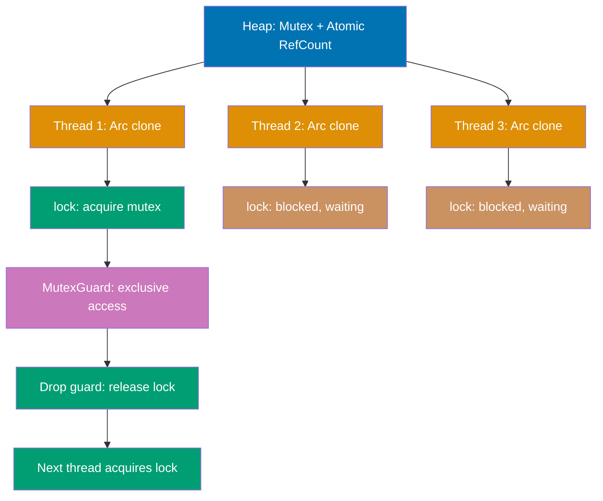

```rust
use std::sync::{Arc, Mutex};         // => Arc for thread-safe sharing
use std::thread;                     // => Mutex for synchronized access

fn main() {
    // Creating thread-safe shared mutable state
    let counter = Arc::new(Mutex::new(0));
                                     // => Mutex::new(0) wraps i32 in Mutex
                                     // => Arc::new() wraps Mutex in Arc
                                     // => counter type: Arc<Mutex<i32>>
                                     // => Arc: atomic reference counting (thread-safe Rc)
                                     // => Mutex: interior mutability with locking
                                     // => Pattern: shared mutable state (multi-threaded)
                                     // => Arc strong_count: 1 initially
                                     // => Heap-allocated: Arc + Mutex + i32
    let mut handles = vec![];        // => Store thread handles
                                     // => Type: Vec<JoinHandle<()>>

    println!("Initial count: {}", *counter.lock().unwrap());
                                     // => counter.lock() acquires mutex
                                     // => .unwrap() handles potential poison error
                                     // => lock() through Arc (deref to Mutex)
                                     // => * dereferences MutexGuard to access i32
                                     // => Output: Initial count: 0

    // Spawning 10 threads that share counter
    for i in 0..10 {                 // => Create 10 threads
                                     // => i ranges from 0 to 9
        let counter = Arc::clone(&counter);
                                     // => Arc::clone increments reference count atomically
                                     // => Arc::clone increments reference count
                                     // => counter moved into closure
                                     // => Each thread gets Arc pointing to same Mutex
                                     // => Arc strong_count increments: 2, 3, 4, ..., 11
                                     // => Clones Arc pointer, not underlying data
        let handle = thread::spawn(move || {
                                     // => spawn() creates new OS thread
                                     // => move transfers Arc ownership to thread
                                     // => Closure owns this Arc clone
                                     // => Thread runs concurrently
            let mut num = counter.lock().unwrap();
                                     // => Deref Arc to get &Mutex
                                     // => lock() acquires mutex (blocks if held)
                                     // => unwrap() handles PoisonError
                                     // => num type: MutexGuard<i32>
                                     // => Only ONE thread can hold lock at a time
            *num += 1;               // => Deref MutexGuard to get &mut i32
                                     // => Increment counter atomically
                                     // => Modifies shared state safely
                                     // => Other threads blocked until lock released
            println!("Thread {} incremented to {}", i, *num);
                                     // => Output order non-deterministic
                                     // => Thread 3 incremented to 4 (example)
        });                          // => MutexGuard dropped: lock released
                                     // => Arc decremented when thread ends
        handles.push(handle);        // => Store handle for joining
    }                                // => All 10 threads now running concurrently

    // Wait for all threads to complete
    for handle in handles {          // => Iterate over JoinHandles
                                     // => handles consumed (into_iter implicit)
        handle.join().unwrap();      // => Wait for thread to finish
                                     // => Ensures all increments complete
                                     // => unwrap() panics if thread panicked
    }                                // => All threads joined

    // Final result after all threads
    println!("Result: {}", *counter.lock().unwrap());
                                     // => All threads incremented counter
                                     // => 10 increments: 0 -> 10
                                     // => Output: Result: 10
                                     // => Guaranteed correct due to mutex synchronization

    // Demonstrating race-free mutation
    let data = Arc::new(Mutex::new(vec![1, 2, 3]));
                                     // => Arc<Mutex<Vec<i32>>>
                                     // => Shared mutable vector
    let mut vec_handles = vec![];

    // Multiple threads mutating shared vector
    for i in 4..8 {                  // => Spawn 4 threads (add 4, 5, 6, 7)
        let data = Arc::clone(&data);// => Clone Arc for each thread
        let handle = thread::spawn(move || {
            let mut vec = data.lock().unwrap();
                                     // => Acquire lock on Vec
            vec.push(i);             // => Add element (synchronized)
                                     // => Only one thread modifies at a time
            println!("Thread pushed {}, vec is now {:?}", i, *vec);
                                     // => Output shows growing vec
        });                          // => Lock released
        vec_handles.push(handle);
    }

    for handle in vec_handles {      // => Join all threads
        handle.join().unwrap();
    }

    println!("Final vec: {:?}", *data.lock().unwrap());
                                     // => Output: Final vec: [1, 2, 3, 4, 5, 6, 7]
                                     // => All elements added (order may vary during execution)

    // Shared state pattern with struct
    #[derive(Debug)]
    struct SharedData {
        counter: i32,
        message: String,
    }

    let shared = Arc::new(Mutex::new(SharedData {
        counter: 0,
        message: String::from("Start"),
    }));                             // => Arc<Mutex<SharedData>>

    let mut struct_handles = vec![];

    for i in 0..5 {
        let shared = Arc::clone(&shared);
        let handle = thread::spawn(move || {
            let mut data = shared.lock().unwrap();
                                     // => Lock entire struct
            data.counter += 1;       // => Modify field
            data.message = format!("Updated by thread {}", i);
                                     // => Replace message
            println!("Thread {}: {:?}", i, *data);
        });                          // => Lock released
        struct_handles.push(handle);
    }

    for handle in struct_handles {
        handle.join().unwrap();
    }

    let final_data = shared.lock().unwrap();
    println!("Final state: {:?}", *final_data);
                                     // => Output: Final state: SharedData { counter: 5, message: "Updated by thread X" }
                                     // => counter correct (5), message from last thread

    // Minimizing lock contention (clone before lock)
    let config = Arc::new(Mutex::new(String::from("config")));
    let mut read_handles = vec![];

    for i in 0..3 {
        let config = Arc::clone(&config);
        let handle = thread::spawn(move || {
            // BAD: holding lock while doing work
            // let cfg = config.lock().unwrap();
            // expensive_operation(&cfg); // Blocks other threads!

            // GOOD: clone under lock, release quickly
            let cfg = {
                let locked = config.lock().unwrap();
                                     // => Acquire lock
                locked.clone()       // => Clone data
            };                       // => Lock released immediately
                                     // => Other threads can proceed

            // Work with cloned data (lock-free)
            println!("Thread {} using: {}", i, cfg);
                                     // => No lock held during println
        });
        read_handles.push(handle);
    }

    for handle in read_handles {
        handle.join().unwrap();
    }

    // Arc strong_count tracking
    let tracked = Arc::new(Mutex::new(0));
    println!("Initial Arc count: {}", Arc::strong_count(&tracked));
                                     // => Output: Initial Arc count: 1

    {
        let clone1 = Arc::clone(&tracked);
        println!("After clone1: {}", Arc::strong_count(&tracked));
                                     // => Output: After clone1: 2

        let clone2 = Arc::clone(&tracked);
        println!("After clone2: {}", Arc::strong_count(&tracked));
                                     // => Output: After clone2: 3
    }                                // => clone1 and clone2 dropped

    println!("After scope: {}", Arc::strong_count(&tracked));
                                     // => Output: After scope: 1
                                     // => Reference count automatically decremented
}                                    // => All Arc dropped, Mutex freed when count=0
```

**Key Takeaway**: `Arc<Mutex<T>>` enables safe shared mutable state across threads by combining atomic reference counting for multiple ownership with mutex locks for synchronized access. This is Rust's standard pattern for concurrent mutable state—minimize time spent holding locks by cloning data or doing work outside critical sections.

**Why It Matters**: Combining atomic reference counting with mutexes provides thread-safe shared mutable state without garbage collection overhead or undefined behavior. Actix-web's application state uses Arc<Mutex> for request handler shared state, achieving the safety of immutable data structures in functional languages while allowing efficient in-place mutation unavailable in garbage-collected runtimes.

---

## Example 50: Send and Sync Traits

`Send` and `Sync` marker traits ensure types are safe to transfer or share across threads, with compiler enforcing thread safety. These auto traits are the foundation of Rust's fearless concurrency.

```rust
use std::rc::Rc;                     // => NOT Send (single-threaded reference counting)
use std::sync::Arc;                  // => Send + Sync (thread-safe reference counting)
use std::marker::PhantomData;        // => For custom Send/Sync implementations

fn main() {
    // Arc<T> is Send + Sync (thread-safe)
    let arc = Arc::new(5);           // => arc type: Arc<i32>
                                     // => Arc<T> implements Send (can transfer to thread)
                                     // => Arc<T> implements Sync (can share &Arc across threads)
    std::thread::spawn(move || {     // => move transfers Arc ownership
                                     // => OK: Arc is Send
        println!("{}", arc);         // => Output: 5
                                     // => Thread owns Arc (safe transfer)
    }).join().unwrap();

    // Rc<T> is NOT Send (not thread-safe)
    let rc = Rc::new(5);             // => rc type: Rc<i32>
                                     // => Rc<T> does NOT implement Send
                                     // => Rc uses non-atomic reference counting
                                     // => Sharing across threads would cause data races
    // std::thread::spawn(move || {  // => ERROR: Rc<i32> cannot be sent between threads
    //     println!("{}", rc);
    // });                           // => Compiler error at compile time
                                     // => error[E0277]: `Rc<i32>` cannot be sent between threads safely
                                     // => Prevents data race before runtime!

    // Understanding Send trait
    fn assert_send<T: Send>() {}     // => Generic function requiring Send
    assert_send::<Arc<i32>>();       // => OK: Arc<i32> is Send
    assert_send::<i32>();            // => OK: i32 is Send (primitive)
    assert_send::<String>();         // => OK: String is Send
    assert_send::<Vec<i32>>();       // => OK: Vec<i32> is Send
    // assert_send::<Rc<i32>>();     // => ERROR: Rc<i32> is not Send

    // Understanding Sync trait
    fn assert_sync<T: Sync>() {}     // => Generic function requiring Sync
    assert_sync::<Arc<i32>>();       // => OK: Arc<i32> is Sync
                                     // => &Arc<i32> can be shared across threads
    assert_sync::<i32>();            // => OK: i32 is Sync
    assert_sync::<String>();         // => OK: String is Sync
    // assert_sync::<Rc<i32>>();     // => ERROR: Rc<i32> is not Sync
                                     // => &Rc<i32> NOT safe to share

    // Relationship: T is Sync if &T is Send
    // &Arc<i32> is Send => Arc<i32> is Sync
    // &Rc<i32> is NOT Send => Rc<i32> is NOT Sync

    // RefCell is Send but NOT Sync
    use std::cell::RefCell;
    assert_send::<RefCell<i32>>();   // => OK: RefCell is Send
                                     // => Can transfer RefCell ownership
    // assert_sync::<RefCell<i32>>(); // => ERROR: RefCell is not Sync
                                     // => Sharing &RefCell unsafe (runtime borrow tracking not atomic)

    // Mutex is Send + Sync
    use std::sync::Mutex;
    assert_send::<Mutex<i32>>();     // => OK: Mutex is Send
    assert_sync::<Mutex<i32>>();     // => OK: Mutex is Sync
                                     // => &Mutex safe to share (uses atomic locking)

    // Demonstrating Send requirement
    fn spawn_with_value<T: Send + 'static>(value: T) {
                                     // => T must be Send (transferable to thread)
                                     // => T must be 'static (lives entire program or owned)
        std::thread::spawn(move || {
            let _value = value;      // => value moved to thread
        }).join().unwrap();
    }

    spawn_with_value(5);             // => OK: i32 is Send
    spawn_with_value(String::from("hello"));
                                     // => OK: String is Send
    spawn_with_value(Arc::new(42));  // => OK: Arc<i32> is Send
    // spawn_with_value(Rc::new(42)); // => ERROR: Rc is not Send

    // Demonstrating Sync requirement (sharing references)
    fn share_reference<T: Sync>(value: &T) {
                                     // => T must be Sync (&T can be sent to thread)
        let handle = std::thread::spawn(move || {
                                     // => Can't actually compile this without 'static
                                     // => Demonstrating concept only
            // Use value...
        });
    }

    // Most types are Send + Sync automatically
    #[derive(Debug)]
    struct MyStruct {
        data: i32,                   // => i32 is Send + Sync
        text: String,                // => String is Send + Sync
    }                                // => MyStruct automatically Send + Sync
                                     // => Auto trait derives when all fields are Send + Sync

    assert_send::<MyStruct>();       // => OK: auto-derived
    assert_sync::<MyStruct>();       // => OK: auto-derived

    // Type with non-Send field becomes non-Send
    struct NotSend {
        _rc: Rc<i32>,                // => Rc is NOT Send
    }                                // => NotSend automatically NOT Send
                                     // => Compiler infers from field types

    // assert_send::<NotSend>();     // => ERROR: NotSend is not Send
                                     // => Cannot transfer to thread

    // Manually implementing Send/Sync (unsafe)
    struct ManualSendSync {
        data: *mut i32,              // => Raw pointer (NOT Send/Sync by default)
    }

    // UNSAFE: Manual implementation
    unsafe impl Send for ManualSendSync {}
                                     // => Declare type is Send
                                     // => Programmer promises this is safe
                                     // => UNSAFE: must verify safety manually
    unsafe impl Sync for ManualSendSync {}
                                     // => Declare type is Sync
                                     // => Violating this can cause data races!

    // PhantomData for marker types
    struct MyBox<T> {
        ptr: *mut T,                 // => Raw pointer
        _marker: PhantomData<T>,     // => Tells compiler this owns T
    }                                // => PhantomData affects Send/Sync derivation

    // If T: Send, MyBox<T>: Send automatically
    // PhantomData makes compiler treat MyBox as if it contains T

    // Real-world example: thread-local storage
    use std::cell::Cell;
    let thread_local = Cell::new(5); // => Cell is Send but NOT Sync
                                     // => Can move to thread (Send)
                                     // => Cannot share reference (not Sync)

    std::thread::spawn(move || {
        thread_local.set(10);        // => OK: Cell moved to thread
        println!("Thread local: {}", thread_local.get());
                                     // => Output: Thread local: 10
    }).join().unwrap();

    // Summary demonstration
    println!("Send: type can be transferred to another thread");
    println!("Sync: type can be shared (&T) across threads");
    println!("Arc<T>: Send + Sync (thread-safe sharing)");
    println!("Rc<T>: neither Send nor Sync (single-threaded only)");
    println!("RefCell<T>: Send but not Sync (ownership transfer ok, sharing not)");
    println!("Mutex<T>: Send + Sync (lock-based sharing)");
}                                    // => All values dropped
```

**Key Takeaway**: `Send` and `Sync` marker traits automatically enforced by the compiler prevent data races by ensuring only thread-safe types can cross thread boundaries (`Send`) or be shared concurrently (`Sync`). Most types derive these traits automatically based on their fields—compiler rejects thread operations on non-Send/non-Sync types at compile time, providing fearless concurrency.

**Why It Matters**: This concept is fundamental to understanding the language and helps build robust, maintainable code.

---

## Example 51: Error Propagation Patterns

Combining `Result`, `?` operator, and custom error types enables robust error handling in production code. The `?` operator propagates errors up the call stack, converting error types automatically when `From` trait is implemented.

```rust
use std::fs::File;                   // => File type for file operations
use std::io::{self, Read};          // => io module for I/O operations and Read trait

// Function with error propagation using ?
fn read_file_to_string(path: &str) -> Result<String, io::Error> {
                                     // => Returns Result<String, io::Error>
                                     // => Ok(String): file contents on success
                                     // => Err(io::Error): error details on failure
                                     // => path: &str (borrowed string slice)
    let mut file = File::open(path)?;// => File::open returns Result<File, io::Error>
                                     // => ? operator: unwrap Ok or return Err early
                                     // => Early return if file doesn't exist
                                     // => file type: File (mutable binding)
    let mut contents = String::new();// => contents: empty String buffer
                                     // => Mutable to receive file data
    file.read_to_string(&mut contents)?;
                                     // => Read entire file into contents
                                     // => &mut contents: mutable borrow for writing
                                     // => ? propagates read errors (permissions, encoding)
                                     // => Returns Err if read fails
    Ok(contents)                     // => Wrap contents in Ok variant
                                     // => Return success with file contents
}

// Chaining multiple operations with ?
fn process_file(path: &str) -> Result<usize, io::Error> {
                                     // => Returns word count or error
    let contents = read_file_to_string(path)?;
                                     // => Call previous function
                                     // => ? propagates any errors from reading
                                     // => contents: String if successful
    let word_count = contents.split_whitespace().count();
                                     // => split_whitespace(): iterator over words
                                     // => count(): number of words
                                     // => word_count: usize
    Ok(word_count)                   // => Return word count wrapped in Ok
}

// Multiple error types in single function
fn read_and_parse_number(path: &str) -> Result<i32, io::Error> {
                                     // => Returns parsed number or I/O error
    let contents = read_file_to_string(path)?;
                                     // => ? propagates io::Error
    let trimmed = contents.trim();   // => Remove whitespace
                                     // => trimmed: &str

    // parse() returns different error type
    let number: i32 = trimmed.parse()
        .map_err(|e| io::Error::new(io::ErrorKind::InvalidData, e))?;
                                     // => parse() returns Result<i32, ParseIntError>
                                     // => map_err converts ParseIntError to io::Error
                                     // => ErrorKind::InvalidData: semantic error type
                                     // => ? propagates converted error
                                     // => number: i32 if parsing succeeds

    Ok(number)                       // => Return parsed number
}

// Demonstrating error short-circuiting
fn multi_step_operation() -> Result<String, io::Error> {
                                     // => Multiple operations, any can fail
    let step1 = read_file_to_string("file1.txt")?;
                                     // => If file1.txt fails, function returns immediately
                                     // => No subsequent operations execute
    let step2 = read_file_to_string("file2.txt")?;
                                     // => Only executes if step1 succeeds
                                     // => Short-circuit on first error
    let step3 = read_file_to_string("file3.txt")?;
                                     // => Only executes if step1 and step2 succeed

    Ok(format!("{} {} {}", step1, step2, step3))
                                     // => Combine all results if all succeed
                                     // => All-or-nothing semantics
}

fn main() {
    // Basic error handling
    match read_file_to_string("hello.txt") {
                                     // => Pattern match on Result
        Ok(contents) => {            // => Success case
            println!("File contents:\n{}", contents);
                                     // => Output: File contents: [file data]
        }
        Err(e) => {                  // => Error case
            eprintln!("Error reading file: {}", e);
                                     // => eprintln! prints to stderr
                                     // => e: io::Error with error details
                                     // => Output: Error reading file: No such file or directory
        }
    }

    // Processing with error propagation
    match process_file("document.txt") {
        Ok(count) => println!("Word count: {}", count),
                                     // => Output: Word count: 42
        Err(e) => eprintln!("Error processing: {}", e),
                                     // => Output: Error processing: [error details]
    }

    // Parse and handle conversion errors
    match read_and_parse_number("number.txt") {
        Ok(num) => println!("Parsed number: {}", num),
                                     // => Output: Parsed number: 123
        Err(e) => eprintln!("Error: {}", e),
                                     // => Handles both I/O and parse errors
                                     // => Output: Error: invalid digit found in string
    }

    // Using unwrap_or for default values
    let contents = read_file_to_string("optional.txt")
        .unwrap_or_else(|_| String::from("default content"));
                                     // => unwrap_or_else: provide fallback on error
                                     // => |_| closure ignores error value
                                     // => contents: String (never panics)
                                     // => Returns file contents or "default content"
    println!("Contents: {}", contents);
                                     // => Output: Contents: default content (if file missing)

    // Expect for programmer errors (should never happen)
    let config = read_file_to_string("config.toml")
        .expect("config.toml must exist");
                                     // => expect: unwrap with custom panic message
                                     // => Use for essential files (should never fail)
                                     // => Panics with message if file missing
                                     // => config: String (or panic)
}                                    // => All Result values handled or propagated
```

**Key Takeaway**: The `?` operator combined with `Result<T, E>` provides concise error propagation with early returns, enabling clean error handling chains while maintaining explicit error types in function signatures. Use `map_err` to convert between error types, and choose between `match`, `unwrap_or`, and `expect` based on whether errors are expected, recoverable, or impossible.

**Why It Matters**: Zero-cost error propagation without exceptions or manual checking makes error handling explicit and performant, solving the "error handling is tedious" problem of C while avoiding the hidden control flow of exceptions. Diesel database queries use ? to propagate connection errors with zero overhead compared to manual checking, achieving the ergonomics of exception handling without stack unwinding costs or exception safety bugs.

---

## Example 52: Custom Error Types

Custom error types with `std::error::Error` trait enable domain-specific error handling with rich context. Implementing `From` trait allows automatic error conversions with the `?` operator, reducing boilerplate while maintaining type safety.

```rust
use std::fmt;                        // => Formatting traits for Display
use std::error::Error;              // => Error trait for error types

// Custom error enum with multiple variants
#[derive(Debug)]                     // => Debug trait for {:?} formatting
                                     // => Auto-derives Debug implementation
enum AppError {                      // => AppError: enum for domain errors
                                     // => Sum type with 4 variants
    Io(std::io::Error),              // => Wrap I/O errors
                                     // => Holds original io::Error
    Parse(std::num::ParseIntError),  // => Wrap parse errors
                                     // => Holds original ParseIntError
    Custom(String),                  // => Custom error messages
                                     // => Holds owned String
    Validation(String),              // => Validation errors
                                     // => Holds error description
}                                    // => Each variant holds error details

// Implement Display for user-friendly error messages
impl fmt::Display for AppError {    // => Display trait for {} formatting
                                     // => Required for Error trait
    fn fmt(&self, f: &mut fmt::Formatter) -> fmt::Result {
                                     // => self: error instance to format
                                     // => fmt: format error message
                                     // => f: formatter reference
                                     // => Result: formatting succeeded or failed
                                     // => Returns fmt::Result (Ok or Err)
        match self {                 // => Pattern match on error variant
                                     // => Extract variant data
            AppError::Io(e) => write!(f, "IO error: {}", e),
                                     // => e: wrapped io::Error
                                     // => Delegate to wrapped error's Display
                                     // => write! macro formats output
                                     // => Output: IO error: No such file
            AppError::Parse(e) => write!(f, "Parse error: {}", e),
                                     // => e: wrapped ParseIntError
                                     // => Output: Parse error: invalid digit
            AppError::Custom(s) => write!(f, "Error: {}", s),
                                     // => s: custom message String
                                     // => Output: Error: custom message
            AppError::Validation(s) => write!(f, "Validation error: {}", s),
                                     // => s: validation message
                                     // => Output: Validation error: message
        }
    }
}

// Implement Error trait (standard library)
impl Error for AppError {}           // => Marks AppError as standard error type
                                     // => Enables ? operator and error handling
                                     // => source() method uses default implementation
                                     // => Empty impl uses default trait methods

// Implement From for automatic io::Error conversion
impl From<std::io::Error> for AppError {
                                     // => From<io::Error> enables automatic conversion
    fn from(error: std::io::Error) -> Self {
                                     // => error: original io::Error
                                     // => Self: AppError type
        AppError::Io(error)          // => Wrap io::Error in Io variant
                                     // => ? operator calls this automatically
    }                                // => Return AppError::Io
}

// Implement From for ParseIntError conversion
impl From<std::num::ParseIntError> for AppError {
                                     // => From<ParseIntError> enables auto-conversion
    fn from(error: std::num::ParseIntError) -> Self {
        AppError::Parse(error)       // => Wrap ParseIntError in Parse variant
    }
}

// Function using custom error type
fn process() -> Result<i32, AppError> {
                                     // => Returns i32 or AppError
    let content = std::fs::read_to_string("number.txt")?;
                                     // => read_to_string returns Result<String, io::Error>
                                     // => ? calls From<io::Error>::from automatically
                                     // => Converts io::Error to AppError::Io
                                     // => content: String if successful

    let number: i32 = content.trim().parse()?;
                                     // => trim(): remove whitespace
                                     // => parse() returns Result<i32, ParseIntError>
                                     // => ? calls From<ParseIntError>::from automatically
                                     // => Converts ParseIntError to AppError::Parse
                                     // => number: i32 if successful

    Ok(number * 2)                   // => Double the number
                                     // => Wrap in Ok variant
}

// Function with validation
fn validate_and_process(input: &str) -> Result<i32, AppError> {
                                     // => Returns validated number or error
    if input.is_empty() {            // => Check for empty input
        return Err(AppError::Validation("Input cannot be empty".to_string()));
                                     // => Create Validation error
                                     // => Return early with error
    }

    let number: i32 = input.parse()
        .map_err(|e| AppError::Parse(e))?;
                                     // => parse() returns ParseIntError
                                     // => map_err: manual conversion (alternative to From)
                                     // => ? propagates converted error

    if number < 0 {                  // => Validate number range
        return Err(AppError::Validation("Number must be positive".to_string()));
                                     // => Custom validation error
    }

    Ok(number)                       // => Return validated number
}

// Combining multiple error sources
fn complex_operation(path: &str) -> Result<i32, AppError> {
                                     // => Uses all error variants
    let content = std::fs::read_to_string(path)?;
                                     // => Io error auto-converted via From

    if content.len() > 1000 {        // => Custom validation
        return Err(AppError::Custom("File too large".to_string()));
                                     // => Manual error creation
    }

    let number = validate_and_process(&content)?;
                                     // => Propagates Validation or Parse errors
                                     // => ? works because all are AppError

    Ok(number * 2)                   // => Success result
}

fn main() {
    // Basic usage
    match process() {                // => Pattern match on Result
        Ok(n) => println!("Result: {}", n),
                                     // => Output: Result: 84 (if number.txt contains "42")
        Err(e) => eprintln!("{}", e),// => Display-formatted error
                                     // => Output: IO error: No such file (if missing)
    }

    // Validation errors
    match validate_and_process("") { // => Empty string
        Ok(n) => println!("Valid: {}", n),
        Err(e) => eprintln!("{}", e),// => Output: Validation error: Input cannot be empty
    }

    match validate_and_process("-5") {
                                     // => Negative number
        Ok(n) => println!("Valid: {}", n),
        Err(e) => eprintln!("{}", e),// => Output: Validation error: Number must be positive
    }

    match validate_and_process("abc") {
                                     // => Invalid number
        Ok(n) => println!("Valid: {}", n),
        Err(e) => eprintln!("{}", e),// => Output: Parse error: invalid digit found in string
    }

    // Complex operation with all error types
    match complex_operation("data.txt") {
        Ok(n) => println!("Processed: {}", n),
        Err(e) => {
            eprintln!("Operation failed: {}", e);
                                     // => Handles any AppError variant
                                     // => Single error type simplifies handling
            // Debug format shows variant and details
            eprintln!("Debug: {:?}", e);
                                     // => Output: Debug: Io(Os { code: 2, kind: NotFound, message: "No such file..." })
        }
    }

    // Checking error type
    let result = process();
    if let Err(e) = result {         // => Extract error if present
        match e {                    // => Match on error variant
            AppError::Io(_) => eprintln!("File system error"),
                                     // => Output: File system error
            AppError::Parse(_) => eprintln!("Number parsing failed"),
            AppError::Custom(msg) => eprintln!("Custom: {}", msg),
            AppError::Validation(msg) => eprintln!("Invalid: {}", msg),
        }
    }
}                                    // => All error types unified under AppError
```

**Key Takeaway**: Custom error types implementing `Error` trait and `From` conversions enable type-safe error handling with automatic error type conversions through the `?` operator. This pattern unifies different error sources into a single error type while preserving error context and enabling pattern matching on error variants.

**Why It Matters**: Type-safe error hierarchies with automatic conversions provide the structure of exception hierarchies without the performance cost of stack unwinding, enabling zero-overhead error handling in hot paths. Web frameworks like Axum use custom error types to provide detailed API error responses while maintaining the performance of explicit Result returns—impossible to achieve with exception-based frameworks without sacrificing latency.

---

## Example 53: Panic and Unwinding

`panic!` aborts execution for unrecoverable errors, unwinding the stack and running destructors unless compiled with `panic=abort`. Panics indicate programming bugs rather than expected errors, making them fundamentally different from `Result` which handles recoverable failures.

```rust
use std::panic;                      // => panic module for panic handling

// Function that might panic
fn divide(a: i32, b: i32) -> i32 {  // => No Result, expects valid input
    if b == 0 {                      // => Programmer error check
        panic!("Division by zero!");  // => Unrecoverable error
                                     // => Stack unwinds from this point
                                     // => Destructors run during unwinding
    }
    a / b                            // => Return quotient
}

// Safer alternative using Result
fn safe_divide(a: i32, b: i32) -> Result<i32, String> {
                                     // => Result for recoverable errors
    if b == 0 {                      // => Expected error case
        Err(String::from("Division by zero"))
                                     // => Return error (no panic)
                                     // => Caller decides how to handle
    } else {
        Ok(a / b)                    // => Success case
    }
}

// Function with unwrap (can panic)
fn get_config_value() -> String {   // => Returns String or panics
    let config = Some("database_url");
                                     // => Option<&str>
    config.unwrap().to_string()      // => unwrap panics if None
                                     // => Use only when None is impossible
}

// Demonstrating panic catch
fn risky_operation() -> Result<i32, Box<dyn std::error::Error>> {
                                     // => Box<dyn Error> for any error type
    let result = panic::catch_unwind(|| {
                                     // => catch_unwind: capture panics
                                     // => Closure may panic
        let v = vec![1, 2, 3];       // => Create vector
        v[10]                        // => Out of bounds: PANICS!
                                     // => Panic caught by catch_unwind
    });                              // => result: Result<i32, Box<dyn Any>>

    match result {                   // => Pattern match on panic result
        Ok(value) => Ok(value),      // => No panic occurred
        Err(_) => {                  // => Panic was caught
            eprintln!("Caught panic!");
                                     // => Output: Caught panic!
            Err("Operation panicked".into())
                                     // => Convert to error
        }
    }
}

fn main() {
    let v = vec![1, 2, 3];           // => v: Vec<i32> with 3 elements
                                     // => v.len() is 3

    // Panic with custom message (commented to prevent crash)
    // if v.len() < 5 {               // => Condition is true (3 < 5)
    //     panic!("Vector too small: {}", v.len());
    //                                  // => Would panic with message
    //                                  // => Output: thread 'main' panicked at 'Vector too small: 3'
    //                                  // => Stack trace printed
    //                                  // => Program terminates
    // }

    // Index out of bounds panics (commented)
    // let item = v[10];             // => v only has indices 0, 1, 2
    //                                  // => Accessing v[10] is out of bounds
    //                                  // => Panics: index out of bounds: the len is 3 but the index is 10
    //                                  // => Stack unwinds, program crashes

    // Safe alternative: use get() instead of indexing
    match v.get(10) {                // => get() returns Option<&i32>
                                     // => Returns None for out-of-bounds
        Some(item) => println!("Item: {}", item),
                                     // => Won't execute (index 10 doesn't exist)
        None => println!("No item"), // => Executes: safe handling
                                     // => Output: No item
    }

    // Using safe_divide (Result-based)
    match safe_divide(10, 0) {       // => Division by zero
        Ok(result) => println!("Result: {}", result),
        Err(e) => println!("Error: {}", e),
                                     // => Output: Error: Division by zero
                                     // => No panic, graceful error handling
    }

    match safe_divide(10, 2) {       // => Valid division
        Ok(result) => println!("Result: {}", result),
                                     // => Output: Result: 5
        Err(e) => println!("Error: {}", e),
    }

    // Using divide (panic-based) - commented to prevent crash
    // let result = divide(10, 0);   // => Would panic
    //                                  // => panic!("Division by zero!")
    //                                  // => Program terminates

    let result = divide(10, 2);      // => Valid input: no panic
                                     // => result: 5
    println!("Divide result: {}", result);
                                     // => Output: Divide result: 5

    // Unwrap on Some (safe)
    let some_value = Some(42);       // => Option<i32> with value
    let value = some_value.unwrap(); // => Extract value
                                     // => value: 42
                                     // => Safe: we know it's Some
    println!("Unwrapped: {}", value);// => Output: Unwrapped: 42

    // Unwrap on None panics (commented)
    // let none_value: Option<i32> = None;
    // let value = none_value.unwrap();
    //                                  // => Panics: called `Option::unwrap()` on a `None` value
    //                                  // => Stack unwinds, program crashes

    // Using expect (unwrap with custom message)
    let config = Some("localhost");  // => Configuration value
    let host = config.expect("Config must have host");
                                     // => expect: unwrap with message
                                     // => host: "localhost"
                                     // => Safe: we know it's Some
    println!("Host: {}", host);      // => Output: Host: localhost

    // Catching panics
    match risky_operation() {        // => Call function that catches panic
        Ok(value) => println!("Success: {}", value),
        Err(e) => println!("Caught: {}", e),
                                     // => Output: Caught panic!
                                     // => Output: Caught: Operation panicked
                                     // => Program continues running
    }

    // Assert macros (panic on failure)
    assert_eq!(2 + 2, 4);            // => Passes: no panic
                                     // => Check equality in tests and runtime
    assert!(v.len() == 3);           // => Passes: no panic
                                     // => Check boolean condition

    // assert_eq!(2 + 2, 5);         // => Would panic
    //                                  // => panic: assertion failed: `(left == right)`
    //                                  // => Prints left and right values

    println!("Program continues");   // => Output: Program continues
                                     // => Only reaches here if no panics
}                                    // => All destructors run when scope ends
                                     // => v dropped safely
```

**Key Takeaway**: Use `panic!` for unrecoverable errors that indicate bugs (out-of-bounds access, invariant violations), while `Result<T, E>` handles recoverable errors (I/O failures, user input errors). Panics trigger stack unwinding with destructor cleanup, can be caught with `catch_unwind`, but represent programming errors rather than expected failures—prefer `Result` for expected error cases and `panic!` for "this should never happen" scenarios.

**Why It Matters**: Explicit panic vs. Result distinction forces developers to reason about error recoverability, preventing the "catch all exceptions" anti-pattern common in Java. High-frequency trading systems written in Rust use panic for invariant violations (impossible states) while Result handles expected failures (network timeouts), achieving predictable latency impossible when exceptions are used for control flow.

---

## Example 54: Testing Basics

Rust's built-in test framework uses `#[test]` attribute and `cargo test` command for unit and integration tests. Tests are compiled only when running `cargo test`, keeping production binaries clean.

```rust
// Public functions to test
pub fn add(a: i32, b: i32) -> i32 { // => Public function for addition
                                     // => Parameters: a, b (both i32)
    a + b                            // => Return sum
                                     // => Expression (no semicolon) returns value
}

pub fn subtract(a: i32, b: i32) -> i32 {
                                     // => Subtraction function
                                     // => Returns difference
    a - b                            // => Return difference
                                     // => Computes a minus b
}

pub fn multiply(a: i32, b: i32) -> i32 {
                                     // => Multiplication function
                                     // => Returns product of a and b
    a * b                            // => Return product
                                     // => Computes a times b
}

pub fn divide(a: i32, b: i32) -> Result<i32, String> {
                                     // => Division with error handling
                                     // => Returns Result for fallible operation
    if b == 0 {                      // => Check for division by zero
                                     // => Condition: b equals 0
        Err(String::from("Division by zero"))
                                     // => Create error String
                                     // => Return error
                                     // => Prevents divide-by-zero crash
    } else {
        Ok(a / b)                    // => Return quotient
                                     // => Integer division (truncates)
                                     // => Wrap result in Ok variant
    }
}

pub fn is_even(n: i32) -> bool {    // => Check if number is even
                                     // => Returns true or false
    n % 2 == 0                       // => Return true if divisible by 2
                                     // => Modulo operator checks remainder
}

// Test module (compiled only for tests)
#[cfg(test)]                         // => Conditional compilation for tests
                                     // => Code inside only compiled with `cargo test`
                                     // => Excluded from production builds
mod tests {                          // => Module containing tests
    use super::*;                    // => Import all items from parent module
                                     // => Brings add, divide, etc. into scope

    // Basic assertion test
    #[test]                          // => Marks function as test
                                     // => Run by `cargo test`
    fn test_add() {                  // => Test function name
                                     // => Convention: test_<function_name>
        assert_eq!(add(2, 3), 5);    // => assert_eq!(left, right)
                                     // => Panics if 2 + 3 != 5
                                     // => Test passes if no panic
        assert_eq!(add(0, 0), 0);    // => Test edge case: zero
        assert_eq!(add(-1, 1), 0);   // => Test negative numbers
    }                                // => All assertions must pass

    #[test]
    fn test_subtract() {             // => Test subtraction
        assert_eq!(subtract(5, 3), 2);
                                     // => 5 - 3 = 2
        assert_eq!(subtract(10, 10), 0);
                                     // => Same numbers
        assert_eq!(subtract(3, 5), -2);
                                     // => Negative result
    }

    #[test]
    fn test_multiply() {             // => Test multiplication
        assert_eq!(multiply(2, 3), 6);
        assert_eq!(multiply(0, 100), 0);
                                     // => Multiplication by zero
        assert_eq!(multiply(-2, 3), -6);
                                     // => Negative operand
    }

    // Testing Result success case
    #[test]
    fn test_divide_success() {       // => Test successful division
        assert_eq!(divide(10, 2), Ok(5));
                                     // => Compare Result values
                                     // => 10 / 2 = Ok(5)
        assert_eq!(divide(7, 2), Ok(3));
                                     // => Integer division: 7 / 2 = 3
        assert_eq!(divide(0, 5), Ok(0));
                                     // => Zero divided by anything
    }

    // Testing Result error case
    #[test]
    fn test_divide_by_zero() {       // => Test error condition
        assert!(divide(10, 0).is_err());
                                     // => assert!(boolean_expr)
                                     // => is_err() returns true for Err
                                     // => Test passes
        assert!(divide(0, 0).is_err());
                                     // => Even 0/0 is error

        // Alternative: match on specific error
        match divide(5, 0) {         // => Pattern match on Result
            Err(e) => assert_eq!(e, "Division by zero"),
                                     // => Verify error message
            Ok(_) => panic!("Expected error!"),
                                     // => Fail if division succeeded
        }
    }

    // Boolean assertions
    #[test]
    fn test_is_even() {              // => Test boolean function
        assert!(is_even(2));         // => assert!(true) passes
                                     // => 2 is even
        assert!(is_even(0));         // => 0 is even
        assert!(is_even(-4));        // => Negative even number
        assert!(!is_even(1));        // => assert!(!false) passes
                                     // => 1 is odd (not even)
        assert!(!is_even(3));        // => 3 is odd
    }

    // Testing panic with should_panic
    #[test]
    #[should_panic(expected = "assertion failed")]
                                     // => Test expects panic
                                     // => expected: substring of panic message
    fn test_panic() {                // => Test panicking behavior
        assert_eq!(1, 2);            // => Assertion fails: panics
                                     // => Panic message contains "assertion failed"
                                     // => Test passes because panic occurred
    }

    #[test]
    #[should_panic(expected = "Division by zero")]
                                     // => Expect specific panic message
    fn test_panic_on_divide_by_zero() {
        let _ = divide(10, 0).unwrap();
                                     // => unwrap on Err panics
                                     // => Panic message is "Division by zero"
                                     // => Test passes
    }

    // Testing with custom failure messages
    #[test]
    fn test_with_custom_message() {  // => Add context to assertions
        let result = add(2, 2);      // => Calculate result
        assert_eq!(
            result, 4,
            "Expected 2 + 2 = 4, got {}", result
        );                           // => Custom message on failure
                                     // => Only printed if assertion fails
    }

    // Ignored test (skip by default)
    #[test]
    #[ignore]                        // => Skip test by default
                                     // => Run with `cargo test -- --ignored`
    fn expensive_test() {            // => Long-running test
        assert_eq!(add(1, 1), 2);    // => Normal test code
                                     // => Not run unless explicitly requested
    }

    // Using assert_ne! (not equal)
    #[test]
    fn test_not_equal() {            // => Test inequality
        assert_ne!(add(2, 3), 6);    // => assert_ne!(left, right)
                                     // => Panics if 2 + 3 == 6
                                     // => Test passes (5 != 6)
        assert_ne!(subtract(5, 2), 2);
                                     // => 5 - 2 = 3, not 2
    }

    // Multiple assertions in one test
    #[test]
    fn test_comprehensive() {        // => Test multiple related cases
        let x = 10;                  // => Test value
        assert!(x > 0);              // => Positive check
        assert!(x < 100);            // => Upper bound check
        assert!(is_even(x));         // => Evenness check
        assert_eq!(x / 2, 5);        // => Division check
                                     // => All assertions must pass
    }                                // => Test fails on first failed assertion
}

// Run tests with: cargo test
// Run specific test: cargo test test_add
// Run ignored tests: cargo test -- --ignored
// Show output: cargo test -- --nocapture
```

**Key Takeaway**: Rust's test framework enables unit testing with `#[test]` attribute, assertions (`assert!`, `assert_eq!`, `assert_ne!`), panic testing with `#[should_panic]`, and `#[ignore]` for expensive tests. Tests are conditionally compiled with `#[cfg(test)]`, keeping production binaries lean, and run with `cargo test` which provides parallel execution and filtering capabilities.

**Why It Matters**: Integrated testing with parallel execution and filtering provides developer ergonomics matching pytest while maintaining the performance of compiled tests. Cargo's test harness runs thousands of tests in parallel with zero flakiness from race conditions because Rust's ownership prevents shared mutable state—achieving test speed and reliability difficult in dynamic language test frameworks.

---

## Example 55: Documentation Tests

Documentation examples in `///` comments are automatically tested, ensuring documentation stays accurate. Doc tests are extracted, compiled, and run as separate test programs, validating both code examples and documentation correctness.

````rust
/// Adds two numbers together.                    // => Triple-slash doc comment
///                                                // => Appears in generated docs
/// This function performs addition on two `i32` values and returns the sum.
///                                                // => Function description
/// # Examples                                    // => Standard section header
///                                                // => Markdown formatting supported
/// ```                                            // => Code block start
/// let result = intermediate_example::add(2, 3); // => Example code
/// assert_eq!(result, 5);                        // => Assertion tested by cargo test --doc
/// ```                                            // => Code block end
///                                                // => This code is compiled and run!
/// # Edge Cases                                  // => Custom section
///
/// ```
/// // Zero addition
/// assert_eq!(intermediate_example::add(0, 0), 0);
///                                                // => Test zero case
/// // Negative numbers
/// assert_eq!(intermediate_example::add(-5, 3), -2);
///                                                // => Test negative operands
/// ```
pub fn add(a: i32, b: i32) -> i32 {             // => Public function
    a + b                                        // => Implementation
}

/// Subtracts two numbers.
///
/// Returns the difference of `a` minus `b`.
///
/// # Examples
///
/// ```
/// let diff = intermediate_example::subtract(10, 3);
/// assert_eq!(diff, 7);                          // => 10 - 3 = 7
/// ```
///
/// ```
/// // Negative result
/// let result = intermediate_example::subtract(5, 10);
/// assert_eq!(result, -5);                       // => 5 - 10 = -5
/// ```
pub fn subtract(a: i32, b: i32) -> i32 {
    a - b
}

/// Divides two numbers.                          // => Function with error handling
///
/// # Arguments
///
/// * `a` - The dividend                         // => Parameter documentation
/// * `b` - The divisor                          // => Must be non-zero
///
/// # Returns
///
/// Returns `Ok(quotient)` on success, or `Err(message)` if `b` is zero.
///
/// # Errors                                      // => Error documentation section
///
/// Returns `Err` if divisor is zero.            // => Describe error conditions
///
/// # Examples
///
/// Successful division:                         // => Example with context
///
/// ```
/// let result = intermediate_example::divide(10, 2).unwrap();
/// assert_eq!(result, 5);                        // => 10 / 2 = 5
/// ```
///
/// Handling division by zero:                   // => Error case example
///
/// ```
/// let result = intermediate_example::divide(10, 0);
/// assert!(result.is_err());                     // => Test error case
/// ```
///
/// Using pattern matching:                      // => Advanced usage
///
/// ```
/// match intermediate_example::divide(15, 3) {
///     Ok(quotient) => assert_eq!(quotient, 5),  // => Success path
///     Err(_) => panic!("Unexpected error"),     // => Error path
/// }
/// ```
pub fn divide(a: i32, b: i32) -> Result<i32, String> {
    if b == 0 {                                  // => Error condition
        Err(String::from("Division by zero"))   // => Return error
    } else {
        Ok(a / b)                                // => Return success
    }
}

/// Calculates the factorial of a number.        // => Recursive function
///
/// # Panics
///
/// Panics if `n` is negative.                   // => Document panic conditions
///
/// # Examples
///
/// ```
/// assert_eq!(intermediate_example::factorial(0), 1);
///                                                // => 0! = 1 (base case)
/// assert_eq!(intermediate_example::factorial(5), 120);
///                                                // => 5! = 120
/// ```
///
/// # Panics Example
///
/// ```should_panic                               // => Annotate panic tests
/// intermediate_example::factorial(-1);          // => This should panic
/// ```                                            // => Test passes if code panics
pub fn factorial(n: i32) -> i32 {
    if n < 0 {                                   // => Validate input
        panic!("Factorial of negative number");  // => Panic on invalid input
    }
    if n == 0 {                                  // => Base case
        1                                        // => 0! = 1
    } else {
        n * factorial(n - 1)                     // => Recursive case
    }
}

/// Checks if a string is a palindrome.          // => String processing function
///
/// A palindrome reads the same forwards and backwards, ignoring case and spaces.
///
/// # Examples
///
/// ```
/// assert!(intermediate_example::is_palindrome("racecar"));
///                                                // => Simple palindrome
/// assert!(intermediate_example::is_palindrome("A man a plan a canal Panama"));
///                                                // => Case and spaces ignored
/// assert!(!intermediate_example::is_palindrome("hello"));
///                                                // => Not a palindrome
/// ```
///
/// Empty strings:                                // => Edge case
///
/// ```
/// assert!(intermediate_example::is_palindrome(""));
///                                                // => Empty is palindrome
/// ```
pub fn is_palindrome(s: &str) -> bool {          // => Takes string slice
    let cleaned: String = s.chars()              // => Remove non-alphanumeric
        .filter(|c| c.is_alphanumeric())         // => Keep only letters/digits
        .map(|c| c.to_lowercase().next().unwrap())
                                                 // => Convert to lowercase
        .collect();                              // => Collect into String

    cleaned == cleaned.chars().rev().collect::<String>()
                                                 // => Compare with reverse
}

/// Demonstrates code that won't compile.        // => Negative test
///
/// # Examples
///
/// This code is marked as `compile_fail`:
///
/// ```compile_fail                               // => Expect compilation failure
/// let x: i32 = "not a number";                  // => Type error
/// ```                                            // => Test passes if won't compile
///
/// This code is marked as `ignore`:
///
/// ```ignore                                      // => Skip this example
/// // This example won't be tested
/// let unreachable = "code";                     // => Useful for pseudocode
/// ```
pub fn compile_examples() {
    // Function demonstrating compile_fail and ignore annotations
}

// Run documentation tests with: cargo test --doc
// Run both unit tests and doc tests: cargo test
// Show doc test output: cargo test --doc -- --nocapture

// Generated documentation available at: target/doc/intermediate_example/index.html
// Generate docs: cargo doc --open
````

**Key Takeaway**: Documentation examples in `///` comments are automatically tested by `cargo test --doc`, ensuring documentation remains accurate and providing usage examples. Use `#[should_panic]` annotation for panic tests, `compile_fail` for code that shouldn't compile, and `ignore` for examples that shouldn't run—doc tests serve as both documentation and living tests that validate code examples stay synchronized with implementation.

**Why It Matters**: Executable documentation prevents the documentation drift common in manually maintained examples, ensuring code examples stay synchronized with implementation. Rust's standard library uses doc tests extensively for API documentation that's guaranteed to compile and run, providing correctness impossible with copy-pasted code snippets in Javadoc or Python docstrings.

---

## Example 56: Common Traits (Debug, Clone, Copy)

Deriving common traits reduces boilerplate for types needing debug printing, cloning, or copy semantics. `Debug` enables formatting, `Clone` provides explicit deep copying, and `Copy` allows implicit stack-based copying for simple types.

```rust
// Point: Copy type (all fields are Copy)
#[derive(Debug, Clone, Copy)]       // => Auto-implement three traits
                                     // => Debug: {:?} and {:#?} formatting
                                     // => Clone: .clone() method
                                     // => Copy: implicit copy on assignment
struct Point {                       // => Simple struct with Copy fields
    x: i32,                          // => i32 is Copy
    y: i32,                          // => i32 is Copy
}                                    // => Point is Copy (all fields Copy)

// Person: Clone but not Copy (contains String)
#[derive(Debug, Clone)]              // => Can't derive Copy
                                     // => String is NOT Copy (heap data)
                                     // => Copy requires all fields to be Copy
struct Person {
    name: String,                    // => String is Clone, not Copy
    age: u32,                        // => u32 is Copy
}                                    // => Person is Clone, not Copy

// Wrapper: Demonstrates default behavior
#[derive(Debug)]                     // => Only Debug derived
struct Wrapper {                     // => Not Clone or Copy
    value: i32,                      // => Contained value is Copy
}                                    // => But Wrapper itself is not

// Custom Clone implementation (manual)
#[derive(Debug)]
struct CustomClone {
    data: Vec<i32>,                  // => Heap-allocated vector
    id: u32,                         // => Unique identifier
}

impl Clone for CustomClone {         // => Manual Clone implementation
    fn clone(&self) -> Self {        // => Create new instance
        println!("Cloning CustomClone with id {}", self.id);
                                     // => Side effect during clone
        CustomClone {
            data: self.data.clone(), // => Deep clone the vector
            id: self.id + 1000,      // => Modified id in clone
        }                            // => Custom cloning logic
    }
}

fn main() {
    // Using Copy types
    let p1 = Point { x: 1, y: 2 };   // => p1: Point
                                     // => p1 owns Point instance
    let p2 = p1;                     // => Copy (not move)
                                     // => p1 still valid after assignment
                                     // => p2 is independent copy
    println!("{:?}", p1);            // => Debug format: Point { x: 1, y: 2 }
                                     // => Output: Point { x: 1, y: 2 }
                                     // => p1 still accessible (Copy occurred)
    println!("{:?}", p2);            // => Output: Point { x: 1, y: 2 }
                                     // => p2 has same values

    // Both are independent
    let mut p3 = p1;                 // => Another copy
    p3.x = 10;                       // => Modify p3
                                     // => p3.x is now 10
    println!("p1: {:?}, p3: {:?}", p1, p3);
                                     // => p1 unchanged: Point { x: 1, y: 2 }
                                     // => p3 modified: Point { x: 10, y: 2 }
                                     // => Output: p1: Point { x: 1, y: 2 }, p3: Point { x: 10, y: 2 }

    // Pretty-print with {:#?}
    println!("{:#?}", p1);           // => Pretty Debug format
                                     // => Output:
                                     // => Point {
                                     // =>     x: 1,
                                     // =>     y: 2,
                                     // => }

    // Using Clone types (not Copy)
    let person1 = Person {
        name: String::from("Alice"), // => Heap-allocated String
        age: 30,                     // => Stack value
    };                               // => person1 owns Person instance

    // let person2 = person1;        // => Would MOVE person1
                                     // => person1 becomes invalid
                                     // => ERROR: use after move

    let person2 = person1.clone();   // => Explicit clone
                                     // => Deep copy of entire Person
                                     // => name: new String allocation
                                     // => age: copied (u32 is Copy)
                                     // => person1 still valid
    println!("{:?}", person1);       // => person1 still accessible
                                     // => Output: Person { name: "Alice", age: 30 }
    println!("{:?}", person2);       // => person2 has cloned data
                                     // => Output: Person { name: "Alice", age: 30 }

    // Clone creates independent copies
    let mut person3 = person2.clone();
                                     // => Clone person2
    person3.name = String::from("Bob");
                                     // => Modify person3's name
    person3.age = 25;                // => Modify person3's age
    println!("person2: {:?}", person2);
                                     // => person2 unchanged
                                     // => Output: person2: Person { name: "Alice", age: 30 }
    println!("person3: {:?}", person3);
                                     // => person3 modified
                                     // => Output: person3: Person { name: "Bob", age: 25 }

    // Wrapper without Clone/Copy
    let w1 = Wrapper { value: 42 };  // => w1: Wrapper
    // let w2 = w1;                  // => Would MOVE w1
                                     // => Wrapper doesn't implement Clone or Copy
    // println!("{:?}", w1);         // => ERROR: use after move

    // Must use reference instead
    let w2 = &w1;                    // => Borrow w1
    println!("{:?}", w1);            // => w1 still valid
                                     // => Output: Wrapper { value: 42 }
    println!("{:?}", w2);            // => w2 is reference to w1
                                     // => Output: Wrapper { value: 42 }

    // Custom Clone implementation
    let custom1 = CustomClone {
        data: vec![1, 2, 3],         // => Heap-allocated vector
        id: 100,                     // => Original id
    };

    let custom2 = custom1.clone();   // => Call custom clone
                                     // => Output: Cloning CustomClone with id 100
                                     // => custom2.id is 1100 (100 + 1000)
    println!("custom1: id={}, data={:?}", custom1.id, custom1.data);
                                     // => Output: custom1: id=100, data=[1, 2, 3]
    println!("custom2: id={}, data={:?}", custom2.id, custom2.data);
                                     // => Output: custom2: id=1100, data=[1, 2, 3]
                                     // => Modified id in clone

    // Clone vs Copy summary
    println!("\nCopy trait:");
    println!("  - Implicit: assignment copies value");
    println!("  - Bitwise copy (stack only)");
    println!("  - Original remains valid");
    println!("  - Examples: i32, f64, bool, char, Point");

    println!("\nClone trait:");
    println!("  - Explicit: call .clone()");
    println!("  - Can be expensive (heap allocation)");
    println!("  - Deep copy of data");
    println!("  - Examples: String, Vec, Person");

    println!("\nDebug trait:");
    println!("  - Enables {:?} formatting");
    println!("  - Pretty format with {:#?}");
    println!("  - Used in assertions and debugging");
}                                    // => All values dropped
                                     // => Copy types: trivial drop
                                     // => Clone types: run destructors
```

**Key Takeaway**: Derive macros automatically implement common traits like `Debug` (formatting with `{:?}`), `Clone` (explicit deep copy via `.clone()`), and `Copy` (implicit bitwise copy on assignment)—`Copy` requires all fields to be `Copy` and enables value semantics, while `Clone` works for any type and provides explicit duplication with potential custom logic, reducing boilerplate while maintaining type safety and ownership semantics.

**Why It Matters**: Automatic trait derivation eliminates boilerplate while maintaining type safety, providing the convenience of reflection-based frameworks without runtime overhead. Serialization libraries like Serde derive serialization traits at compile time, generating optimal serialization code matching hand-written implementations—combining productivity of dynamic languages with C++ performance.

---

## Example 57: PartialEq and Eq Traits

`PartialEq` enables equality comparison (`==`, `!=`), while `Eq` marks types with reflexive equality (a == a always true). `PartialEq` allows for partial equivalence (like floats with NaN), whereas `Eq` requires full equivalence relation.

```rust
use std::collections::HashSet;       // => HashSet requires Eq + Hash
                                     // => Import from standard library collections module
                                     // => Brings HashSet type into scope

// Point with derived PartialEq
#[derive(Debug, PartialEq, Eq, Hash)] // => Auto-implement equality traits
                                     // => derive attribute macro generates code at compile-time
                                     // => Debug: enables {:?} formatting
                                     // => PartialEq: == and != operators
                                     // => Eq: marker trait (reflexive equality)
                                     // => Hash: enables use in HashMap/HashSet
struct Point {                       // => Simple coordinate struct
                                     // => Two-field coordinate type
    x: i32,                          // => i32 implements PartialEq + Eq + Hash
                                     // => X coordinate (signed 32-bit)
    y: i32,                          // => i32 implements PartialEq + Eq + Hash
                                     // => Y coordinate (signed 32-bit)
}                                    // => Point derives all traits
                                     // => Derived PartialEq compares all fields
                                     // => Field-by-field equality check

// Person with custom PartialEq
#[derive(Debug)]                     // => Only Debug, no PartialEq
                                     // => Manual PartialEq impl below
                                     // => Auto-derive Debug formatting
struct Person {                      // => Person struct definition
                                     // => Custom equality logic required
    name: String,                    // => Person name (owned String)
                                     // => Heap-allocated string buffer
    age: u32,                        // => Person age (unsigned 32-bit)
                                     // => Stack-allocated integer
    id: u64,                         // => Unique identifier (unsigned 64-bit)
                                     // => Primary key for equality
}                                    // => 3 fields but equality based on id only
                                     // => Name and age ignored in comparisons

impl PartialEq for Person {          // => Manual PartialEq implementation
                                     // => Implements PartialEq trait for Person type
    fn eq(&self, other: &Self) -> bool {
                                     // => Trait method signature (required)
                                     // => Compare two Person instances
                                     // => self: left operand (immutable borrow)
                                     // => other: right operand (immutable borrow)
                                     // => Returns bool (true if equal)
        self.id == other.id          // => Compare only by id
                                     // => Ignore name and age
                                     // => Same id = same person
                                     // => Custom equality logic (not field-by-field)
    }                                // => Return bool (true/false)
}                                    // => Person now has == and != operators

// Temperature: PartialEq but NOT Eq (contains f64)
#[derive(Debug, PartialEq)]          // => Can't derive Eq (f64 is not Eq)
                                     // => derive(Eq) would fail compilation
                                     // => f64 is PartialEq but not Eq
                                     // => NaN != NaN in floating point (violates reflexivity)
                                     // => Auto-implements Debug and PartialEq
struct Temperature {                 // => Temperature wrapper around f64
                                     // => Single-field newtype pattern
    celsius: f64,                    // => f64 implements PartialEq only
                                     // => f64 is NOT Eq due to NaN behavior
                                     // => 64-bit floating point (stack-allocated)
}                                    // => Temperature is PartialEq, not Eq
                                     // => Cannot be used in HashSet (requires Eq)
                                     // => Partial equivalence relation only

// Custom comparison logic
#[derive(Debug)]                     // => Debug only, custom PartialEq below
                                     // => No auto-derived equality
struct CaseInsensitiveString {       // => String wrapper with custom equality
                                     // => Newtype pattern around String
    value: String,                   // => Internal string storage (owned)
                                     // => Heap-allocated UTF-8 string
}                                    // => Struct holds one field
                                     // => Custom eq() implementation below

impl PartialEq for CaseInsensitiveString {
                                     // => Manual PartialEq with custom logic
                                     // => Case-insensitive comparison
    fn eq(&self, other: &Self) -> bool {
                                     // => Takes two &Self references
                                     // => Returns true if equal (ignoring case)
        self.value.to_lowercase() == other.value.to_lowercase()
                                     // => Convert both to lowercase
                                     // => Compare normalized values
                                     // => "Hello" == "HELLO" (true)
                                     // => "hello" == "world" (false)
    }                                // => Return comparison result
}                                    // => CaseInsensitiveString now has == operator

fn main() {                          // => Example program demonstrating PartialEq/Eq
    // Using derived PartialEq
    let p1 = Point { x: 1, y: 2 };   // => p1: Point at (1, 2)
                                     // => Type: Point (derived PartialEq + Eq + Hash)
    let p2 = Point { x: 1, y: 2 };   // => p2: same coordinates as p1
                                     // => Separate instance, same values
    let p3 = Point { x: 2, y: 3 };   // => p3: different coordinates
                                     // => Different values from p1 and p2

    println!("{}", p1 == p2);        // => == operator calls PartialEq::eq
                                     // => Field-by-field comparison (derived impl)
                                     // => p1.x == p2.x && p1.y == p2.y
                                     // => 1 == 1 && 2 == 2
                                     // => Output: true
    println!("{}", p1 == p3);        // => Compare p1 and p3
                                     // => 1 != 2 (x differs)
                                     // => Output: false
    println!("{}", p1 != p3);        // => != operator is !PartialEq::eq
                                     // => !(p1 == p3) = !false = true
                                     // => Output: true

    // PartialEq enables comparisons in conditions
    if p1 == p2 {                    // => Use in if statement
                                     // => Condition evaluates to true
        println!("p1 and p2 are equal");
                                     // => Output: p1 and p2 are equal
                                     // => This branch executes
    }                                // => if body completes

    // Using in collections (requires Eq + Hash)
    let mut points = HashSet::new(); // => Create empty HashSet
                                     // => HashSet<Point> (type inferred from inserts)
                                     // => Requires Point: Eq + Hash (both derived)
    points.insert(p1);               // => Insert p1 (owns p1, moves it)
                                     // => Set now contains Point { x: 1, y: 2 }
    points.insert(p2);               // => Insert p2 (duplicate of p1)
                                     // => Hash and equality check detect duplicate
                                     // => Only one Point { x: 1, y: 2 } stored
                                     // => p2 not inserted (already present)
    points.insert(p3);               // => Insert p3 (different)
                                     // => Set now has 2 unique points

    println!("Points in set: {}", points.len());
                                     // => len() returns number of unique elements
                                     // => Output: Points in set: 2
                                     // => p1 and p2 are equal (same point, deduplicated)

    // Custom PartialEq: Person compared by id only
    let alice1 = Person {
        name: String::from("Alice"),
        age: 30,
        id: 1,                       // => Same id
    };

    let alice2 = Person {
        name: String::from("Alice Smith"),
                                     // => Different name
        age: 31,                     // => Different age
        id: 1,                       // => Same id as alice1
    };

    let bob = Person {
        name: String::from("Bob"),
        age: 25,
        id: 2,                       // => Different id
    };

    println!("{}", alice1 == alice2);// => Compare by id only
                                     // => id 1 == id 1
                                     // => Output: true (same person)
    println!("{}", alice1 == bob);   // => Different ids
                                     // => Output: false

    // Temperature with f64 (PartialEq, not Eq)
    let temp1 = Temperature { celsius: 20.0 };
    let temp2 = Temperature { celsius: 20.0 };
    let temp3 = Temperature { celsius: 25.0 };

    println!("{}", temp1 == temp2);  // => 20.0 == 20.0
                                     // => Output: true
    println!("{}", temp1 == temp3);  // => 20.0 != 25.0
                                     // => Output: false

    // NaN behavior (why f64 is not Eq)
    let nan_temp = Temperature { celsius: f64::NAN };
    println!("{}", nan_temp == nan_temp);
                                     // => NaN != NaN by IEEE 754
                                     // => Output: false
                                     // => Violates reflexivity (a == a)
                                     // => This is why f64 is not Eq

    // Case-insensitive string comparison
    let s1 = CaseInsensitiveString {
        value: String::from("Hello"),
    };

    let s2 = CaseInsensitiveString {
        value: String::from("HELLO"),
    };

    let s3 = CaseInsensitiveString {
        value: String::from("World"),
    };

    println!("{}", s1 == s2);        // => "hello" == "hello" (lowercased)
                                     // => Output: true
    println!("{}", s1 == s3);        // => "hello" != "world"
                                     // => Output: false

    // Using assert_eq! (requires PartialEq)
    assert_eq!(p1, p2);              // => Test equality
                                     // => Passes: p1 == p2
    // assert_eq!(p1, p3);           // => Would panic
                                     // => p1 != p3

    // PartialEq in pattern matching
    match p1 {                       // => Match on point
        p if p == p2 => println!("Matches p2"),
                                     // => Guard uses PartialEq
                                     // => Output: Matches p2
        _ => println!("No match"),
    }

    // Difference: PartialEq vs Eq
    println!("\nPartialEq trait:");
    println!("  - Enables == and != operators");
    println!("  - Allows partial equivalence (NaN example)");
    println!("  - Required for equality comparisons");
    println!("  - Can have custom comparison logic");

    println!("\nEq trait:");
    println!("  - Marker trait (no methods)");
    println!("  - Requires PartialEq");
    println!("  - Guarantees reflexivity (a == a always true)");
    println!("  - Required for HashMap/HashSet keys");
    println!("  - Cannot include f32/f64 (NaN breaks reflexivity)");
}                                    // => All values dropped
```

**Key Takeaway**: `PartialEq` enables equality comparison for custom types through `==` and `!=` operators with automatic field-by-field comparison via derive macro or manual implementation for custom logic, while `Eq` is a marker trait requiring reflexivity (a == a must be true) needed for hash-based collections. Types containing floating-point numbers can only implement `PartialEq` (not `Eq`) because NaN != NaN violates reflexivity, demonstrating Rust's precise type system for mathematical correctness.

**Why It Matters**: Explicit distinction between partial equality (NaN != NaN) and total equality (Eq for hash keys) prevents the subtle bugs from floating-point comparisons common in other languages. Rust's type system prevents accidentally using floats as hash map keys without custom equality, catching bugs at compile time that cause incorrect lookups in JavaScript objects or Java HashMaps with Double keys.

---

## Summary

You've completed 29 intermediate examples covering production patterns (40-75% coverage):

- **Lifetimes** (Examples 29-32): Annotations, elision, struct lifetimes, static lifetime
- **Traits** (Examples 33-36): Definitions, defaults, bounds, generics with traits
- **Iterators and closures** (Examples 37-40): Iterator trait, closure capture modes, iterator methods
- **Smart pointers** (Examples 41-44): Box, Rc, RefCell, interior mutability
- **Concurrency** (Examples 45-50): Threads, channels, Mutex, Arc, Send/Sync
- **Error handling** (Examples 51-53): Propagation, custom errors, panic
- **Testing and traits** (Examples 54-57): Testing, documentation tests, common traits

**Next Steps**: Continue to [Advanced](/en/learn/software-engineering/programming-languages/rust/by-example/advanced) (Examples 58-85) for unsafe code, macros, async/await, and performance optimization.

**Key Insight**: Mastering traits, lifetimes, and smart pointers unlocks Rust's full power for building safe, concurrent systems with zero-cost abstractions.
