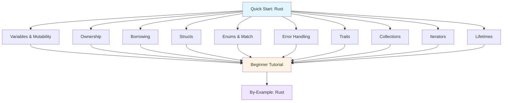

**Want to learn Rust fundamentals quickly?** This quick start touches 8-12 core Rust concepts with one example each. By the end, you'll have practical touchpoints for the most important language features.

## Prerequisites

Before starting, you should have:

- Completed [Initial Setup](/en/learn/software-engineering/programming-languages/rust/initial-setup) - Rust toolchain installed and working
- A text editor or IDE (VS Code with rust-analyzer, IntelliJ with Rust plugin, or any editor)
- Basic understanding of programming concepts
- Willingness to write and run code

## Learning Objectives

By the end of this tutorial, you will have touchpoints for:

1. **Variables and Mutability** - Immutable by default, mut keyword
2. **Ownership** - Move semantics, ownership rules
3. **Borrowing and References** - Immutable and mutable references
4. **Structs** - Define custom types, methods, associated functions
5. **Enums and Pattern Matching** - Sum types, match expressions
6. **Error Handling** - Result and Option types
7. **Traits** - Define shared behavior
8. **Vectors and Collections** - Dynamic arrays, HashMaps
9. **Iterators** - Functional iteration
10. **Lifetimes** - Reference validity

## Learning Path



## Concept 1: Variables and Mutability - Immutable by Default

Rust variables are immutable by default for safety.

### Example: Variables, Mutability, and Shadowing

```rust
fn main() {
    // Immutable variable (default)
    let x = 5;
    println!("x = {}", x);
    // x = 6;  // Compile error! Cannot reassign immutable variable

    // Mutable variable
    let mut y = 10;
    println!("y = {}", y);
    y = 15;  // OK - y is mutable
    println!("y = {}", y);

    // Shadowing - redefine variable
    let z = 20;
    let z = z + 5;      // Different variable, same name
    let z = z * 2;      // Can change type too
    println!("z = {}", z);  // 50

    // Type annotation
    let age: u32 = 30;
    let price: f64 = 19.99;
    let name: &str = "Alice";

    // Constants (must have type annotation, UPPERCASE convention)
    const MAX_POINTS: u32 = 100_000;
    println!("Max points: {}", MAX_POINTS);

    // Destructuring
    let (a, b, c) = (1, 2, 3);
    println!("a={}, b={}, c={}", a, b, c);

    // Type inference
    let inferred = 42;  // i32 inferred
    let also_inferred = 3.14;  // f64 inferred
}
```

**Key concepts**: `let`, `mut`, shadowing, `const`, type inference

**Key concepts**: `let`, `mut`, shadowing, `const`, type inference

## Concept 2: Ownership - Rust's Core Feature

Ownership rules ensure memory safety without garbage collection.

### Example: Ownership and Move Semantics

```rust
fn main() {
    // Ownership rule 1: Each value has one owner
    let s1 = String::from("hello");  // s1 owns the String

    // Move semantics - ownership transfers
    let s2 = s1;  // s1's ownership moved to s2
    // println!("{}", s1);  // Compile error! s1 no longer valid
    println!("{}", s2);  // OK - s2 owns the data

    // Copy types (stack-only data)
    let x = 5;
    let y = x;  // Copy, not move (i32 implements Copy trait)
    println!("x={}, y={}", x, y);  // Both valid

    // Functions take ownership
    let s = String::from("hello");
    takes_ownership(s);  // s moved into function
    // println!("{}", s);  // Compile error! s no longer valid

    // Return ownership
    let s1 = gives_ownership();  // Function returns ownership
    println!("{}", s1);

    // Clone for deep copy
    let s1 = String::from("hello");
    let s2 = s1.clone();  // Explicit deep copy
    println!("s1={}, s2={}", s1, s2);  // Both valid
}

fn takes_ownership(some_string: String) {
    println!("{}", some_string);
}  // some_string dropped here

fn gives_ownership() -> String {
    let some_string = String::from("hello");
    some_string  // Ownership returned to caller
}
```

**Key concepts**: Ownership, move semantics, `Copy` trait, `clone()`

## Concept 3: Borrowing and References - Temporary Access

Borrowing allows references without transferring ownership.

### Example: Immutable and Mutable References

```rust
fn main() {
    // Immutable reference (borrowing)
    let s1 = String::from("hello");
    let len = calculate_length(&s1);  // Borrow with &
    println!("Length of '{}' is {}", s1, len);  // s1 still valid

    // Mutable reference
    let mut s = String::from("hello");
    change(&mut s);  // Mutable borrow with &mut
    println!("{}", s);  // "hello, world"

    // Reference rules:
    // Rule 1: Multiple immutable references OK
    let r1 = &s;
    let r2 = &s;
    println!("{} and {}", r1, r2);  // OK

    // Rule 2: Only ONE mutable reference at a time
    let r1 = &mut s;
    // let r2 = &mut s;  // Compile error! Can't have two mutable refs
    println!("{}", r1);

    // Rule 3: Can't mix mutable and immutable references
    let r1 = &s;
    // let r2 = &mut s;  // Compile error! Can't borrow as mutable while immutable ref exists
    println!("{}", r1);

    // References must be valid (no dangling references)
    // let reference_to_nothing = dangle();  // Compile error!
    let no_dangle = no_dangle_example();
    println!("{}", no_dangle);
}

fn calculate_length(s: &String) -> usize {
    s.len()  // Can read but not modify
}  // s goes out of scope, but doesn't own data, so nothing dropped

fn change(s: &mut String) {
    s.push_str(", world");  // Can modify through mutable reference
}

fn no_dangle_example() -> String {
    let s = String::from("hello");
    s  // Return ownership, not reference
}
```

**Key concepts**: `&` (immutable reference), `&mut` (mutable reference), borrowing rules

## Concept 4: Structs - Custom Data Types

Define custom types to structure related data.

### Example: Struct Definition and Methods

```rust
// Struct definition
struct User {
    username: String,
    email: String,
    active: bool,
    sign_in_count: u64,
}

// Tuple struct
struct Color(i32, i32, i32);
struct Point(i32, i32, i32);

// Unit struct (no fields)
struct AlwaysEqual;

// Implementation block for methods
impl User {
    // Associated function (constructor)
    fn new(username: String, email: String) -> User {
        User {
            username,  // Field init shorthand
            email,
            active: true,
            sign_in_count: 1,
        }
    }

    // Method (takes &self)
    fn is_active(&self) -> bool {
        self.active
    }

    // Mutable method
    fn deactivate(&mut self) {
        self.active = false;
    }
}

fn main() {
    // Create struct instance
    let mut user1 = User {
        email: String::from("alice@example.com"),
        username: String::from("alice"),
        active: true,
        sign_in_count: 1,
    };

    // Access fields
    println!("{}", user1.email);

    // Modify field (requires mut)
    user1.email = String::from("newemail@example.com");

    // Using constructor
    let user2 = User::new(
        String::from("bob"),
        String::from("bob@example.com"),
    );

    // Struct update syntax
    let user3 = User {
        email: String::from("charlie@example.com"),
        username: String::from("charlie"),
        ..user2  // Copy remaining fields from user2
    };

    // Method calls
    println!("User active: {}", user1.is_active());
    user1.deactivate();
    println!("User active: {}", user1.is_active());

    // Tuple structs
    let black = Color(0, 0, 0);
    let origin = Point(0, 0, 0);
}
```

**Key concepts**: `struct`, `impl`, methods, associated functions, field init shorthand

## Concept 5: Enums and Pattern Matching - Sum Types

Enums represent data that can be one of several variants.

### Example: Enums and Match

```rust
// Basic enum
enum IpAddrKind {
    V4,
    V6,
}

// Enum with data
enum IpAddr {
    V4(u8, u8, u8, u8),
    V6(String),
}

// Enum with multiple data types
enum Message {
    Quit,
    Move { x: i32, y: i32 },
    Write(String),
    ChangeColor(i32, i32, i32),
}

impl Message {
    fn call(&self) {
        match self {
            Message::Quit => println!("Quit"),
            Message::Move { x, y } => println!("Move to ({}, {})", x, y),
            Message::Write(text) => println!("Write: {}", text),
            Message::ChangeColor(r, g, b) => println!("Color: {}, {}, {}", r, g, b),
        }
    }
}

fn main() {
    // Create enum values
    let four = IpAddrKind::V4;
    let six = IpAddrKind::V6;

    let home = IpAddr::V4(127, 0, 0, 1);
    let loopback = IpAddr::V6(String::from("::1"));

    // Match expression
    let ip = IpAddr::V4(192, 168, 1, 1);
    match ip {
        IpAddr::V4(a, b, c, d) => {
            println!("IPv4: {}.{}.{}.{}", a, b, c, d);
        }
        IpAddr::V6(addr) => {
            println!("IPv6: {}", addr);
        }
    }

    // Match with _ (catch-all)
    let number = 7;
    match number {
        1 => println!("One"),
        2 => println!("Two"),
        3 | 4 | 5 => println!("Three, four, or five"),
        _ => println!("Something else"),
    }

    // if let (concise pattern matching)
    let some_value = Some(3);
    if let Some(3) = some_value {
        println!("Three!");
    }

    // Calling enum methods
    let msg = Message::Write(String::from("Hello"));
    msg.call();
}
```

**Key concepts**: `enum`, `match`, pattern matching, `if let`

## Concept 6: Error Handling - Result and Option

Rust uses Result and Option for explicit error handling.

### Example: Result and Option Types

```rust
use std::fs::File;
use std::io::ErrorKind;

fn main() {
    // Option<T> - value or None
    let some_number = Some(5);
    let no_number: Option<i32> = None;

    // Unwrap Option
    let x = some_number.unwrap();  // 5
    // let y = no_number.unwrap();  // Panics!

    // Match on Option
    match some_number {
        Some(value) => println!("Got value: {}", value),
        None => println!("No value"),
    }

    // if let with Option
    if let Some(value) = some_number {
        println!("Value: {}", value);
    }

    // Result<T, E> - Ok(T) or Err(E)
    let f = File::open("hello.txt");

    let f = match f {
        Ok(file) => file,
        Err(error) => match error.kind() {
            ErrorKind::NotFound => match File::create("hello.txt") {
                Ok(fc) => fc,
                Err(e) => panic!("Problem creating file: {:?}", e),
            },
            other_error => panic!("Problem opening file: {:?}", other_error),
        },
    };

    // unwrap and expect
    let f = File::open("hello.txt").unwrap();  // Panics on error
    let f = File::open("hello.txt")
        .expect("Failed to open hello.txt");  // Panics with custom message

    // ? operator (propagate errors)
    let result = read_username_from_file();
    match result {
        Ok(username) => println!("Username: {}", username),
        Err(e) => println!("Error: {}", e),
    }
}

fn read_username_from_file() -> Result<String, std::io::Error> {
    let mut f = File::open("username.txt")?;  // ? returns error if Err
    let mut s = String::new();
    f.read_to_string(&mut s)?;
    Ok(s)
}

fn divide(a: f64, b: f64) -> Result<f64, String> {
    if b == 0.0 {
        Err(String::from("Division by zero"))
    } else {
        Ok(a / b)
    }
}
```

**Key concepts**: `Option<T>`, `Result<T, E>`, `match`, `unwrap`, `expect`, `?` operator

## Concept 7: Traits - Shared Behavior

Traits define shared behavior across types.

### Example: Trait Definition and Implementation

```rust
// Define trait
trait Summary {
    fn summarize(&self) -> String;

    // Default implementation
    fn default_summary(&self) -> String {
        String::from("(Read more...)")
    }
}

struct NewsArticle {
    headline: String,
    content: String,
}

struct Tweet {
    username: String,
    content: String,
}

// Implement trait for NewsArticle
impl Summary for NewsArticle {
    fn summarize(&self) -> String {
        format!("{}: {}", self.headline, self.content)
    }
}

// Implement trait for Tweet
impl Summary for Tweet {
    fn summarize(&self) -> String {
        format!("@{}: {}", self.username, self.content)
    }
}

// Trait as parameter
fn notify(item: &impl Summary) {
    println!("Breaking news! {}", item.summarize());
}

// Trait bound syntax
fn notify_bound<T: Summary>(item: &T) {
    println!("Breaking news! {}", item.summarize());
}

// Multiple trait bounds
fn notify_multiple<T: Summary + Clone>(item: &T) {
    println!("{}", item.summarize());
}

fn main() {
    let article = NewsArticle {
        headline: String::from("Rust 2.0 Released"),
        content: String::from("The Rust team announced..."),
    };

    let tweet = Tweet {
        username: String::from("rustlang"),
        content: String::from("New features in Rust!"),
    };

    println!("{}", article.summarize());
    println!("{}", tweet.summarize());

    notify(&article);
    notify(&tweet);
}
```

**Key concepts**: `trait`, `impl Trait for Type`, trait bounds, default implementations

## Concept 8: Vectors and Collections - Dynamic Data

Rust provides powerful collection types.

### Example: Vec, HashMap, HashSet

```rust
use std::collections::HashMap;
use std::collections::HashSet;

fn main() {
    // Vector (dynamic array)
    let mut v: Vec<i32> = Vec::new();
    v.push(1);
    v.push(2);
    v.push(3);

    // vec! macro
    let v = vec![1, 2, 3, 4, 5];

    // Access elements
    let third = &v[2];  // Panics if out of bounds
    let third = v.get(2);  // Returns Option<&T>

    match v.get(2) {
        Some(value) => println!("Third element: {}", value),
        None => println!("No third element"),
    }

    // Iterate
    for i in &v {
        println!("{}", i);
    }

    // Mutable iteration
    let mut v = vec![1, 2, 3];
    for i in &mut v {
        *i += 50;
    }

    // HashMap (key-value)
    let mut scores = HashMap::new();
    scores.insert(String::from("Blue"), 10);
    scores.insert(String::from("Yellow"), 50);

    // Access value
    let team_name = String::from("Blue");
    let score = scores.get(&team_name);  // Returns Option<&V>

    // Iterate over HashMap
    for (key, value) in &scores {
        println!("{}: {}", key, value);
    }

    // Update value
    scores.insert(String::from("Blue"), 25);  // Overwrite

    // Insert if key doesn't exist
    scores.entry(String::from("Red")).or_insert(50);

    // HashSet (unique values)
    let mut set = HashSet::new();
    set.insert(1);
    set.insert(2);
    set.insert(2);  // Duplicate ignored
    println!("Set contains: {:?}", set);  // {1, 2}
}
```

**Key concepts**: `Vec<T>`, `HashMap<K, V>`, `HashSet<T>`, `push`, `get`, `insert`

## Concept 9: Iterators - Functional Iteration

Iterators enable functional-style data processing.

### Example: Iterator Methods

```rust
fn main() {
    let v = vec![1, 2, 3, 4, 5];

    // map - transform elements
    let doubled: Vec<i32> = v.iter().map(|x| x * 2).collect();
    println!("{:?}", doubled);  // [2, 4, 6, 8, 10]

    // filter - select elements
    let evens: Vec<&i32> = v.iter().filter(|&&x| x % 2 == 0).collect();
    println!("{:?}", evens);  // [2, 4]

    // fold - reduce
    let sum: i32 = v.iter().fold(0, |acc, x| acc + x);
    println!("Sum: {}", sum);  // 15

    // Chain operations
    let result: Vec<i32> = v.iter()
        .filter(|&&x| x % 2 == 0)
        .map(|x| x * x)
        .collect();
    println!("{:?}", result);  // [4, 16]

    // any and all
    let has_even = v.iter().any(|&x| x % 2 == 0);
    let all_positive = v.iter().all(|&x| x > 0);
    println!("Has even: {}, All positive: {}", has_even, all_positive);

    // find
    let first_even = v.iter().find(|&&x| x % 2 == 0);
    match first_even {
        Some(&num) => println!("First even: {}", num),
        None => println!("No even numbers"),
    }

    // Infinite iterators
    let first_10_evens: Vec<i32> = (0..).filter(|x| x % 2 == 0).take(10).collect();
    println!("{:?}", first_10_evens);
}
```

**Key concepts**: `iter()`, `map`, `filter`, `fold`, `collect`, lazy evaluation

## Concept 10: Lifetimes - Reference Validity

Lifetimes ensure references are always valid.

### Example: Lifetime Annotations

```rust
// Function with lifetime annotations
fn longest<'a>(x: &'a str, y: &'a str) -> &'a str {
    if x.len() > y.len() {
        x
    } else {
        y
    }
}

// Struct with lifetime
struct ImportantExcerpt<'a> {
    part: &'a str,
}

impl<'a> ImportantExcerpt<'a> {
    fn level(&self) -> i32 {
        3
    }

    fn announce_and_return_part(&self, announcement: &str) -> &str {
        println!("Attention: {}", announcement);
        self.part
    }
}

fn main() {
    let string1 = String::from("long string");
    let string2 = String::from("xyz");

    let result = longest(string1.as_str(), string2.as_str());
    println!("Longest: {}", result);

    // Lifetime with struct
    let novel = String::from("Call me Ishmael. Some years ago...");
    let first_sentence = novel.split('.').next().expect("No '.' found");
    let i = ImportantExcerpt {
        part: first_sentence,
    };

    // 'static lifetime (lives for entire program)
    let s: &'static str = "I have a static lifetime.";
}
```

**Key concepts**: Lifetime annotations `'a`, lifetime elision, `'static`

## Summary

**What you've touched**:

- Variables and mutability (immutable by default, `mut`)
- Ownership (move semantics, single owner)
- Borrowing and references (`&`, `&mut`, borrowing rules)
- Structs (custom types, methods, associated functions)
- Enums and pattern matching (`enum`, `match`, `if let`)
- Error handling (`Result`, `Option`, `?` operator)
- Traits (shared behavior, trait bounds)
- Vectors and collections (`Vec`, `HashMap`, `HashSet`)
- Iterators (functional iteration, `map`, `filter`)
- Lifetimes (reference validity, lifetime annotations)

**Key syntax learned**:

```rust
// Variables
let x = 5;          // Immutable
let mut y = 10;     // Mutable

// Ownership
let s1 = String::from("hello");
let s2 = s1;        // Move (s1 invalid)
let s3 = s2.clone(); // Deep copy

// References
let r = &s3;        // Immutable reference
let r = &mut s3;    // Mutable reference

// Structs
struct Point { x: i32, y: i32 }
impl Point {
    fn new(x: i32, y: i32) -> Point {
        Point { x, y }
    }
}

// Enums
enum Option<T> {
    Some(T),
    None,
}

// Match
match value {
    Some(x) => println!("{}", x),
    None => println!("No value"),
}

// Result
fn divide(a: f64, b: f64) -> Result<f64, String> {
    if b == 0.0 { Err("div by zero".to_string()) }
    else { Ok(a / b) }
}
```

## Next Steps

**Want comprehensive Rust mastery?**

**Prefer code-first learning?**

- [By-Example Tutorial](/en/learn/software-engineering/programming-languages/rust/by-example) - Heavily annotated Rust examples

**Want to understand Rust philosophy?**

- [Overview](/en/learn/software-engineering/programming-languages/rust/overview) - Why Rust exists and when to use it

## Quick Reference Card

### Essential Syntax

```rust
// Variables
let x = 5;          // Immutable
let mut y = 10;     // Mutable
const MAX: u32 = 100;

// Functions
fn add(a: i32, b: i32) -> i32 {
    a + b  // No semicolon for return
}

// Control flow
if x > 0 {
    println!("Positive");
}

for i in 0..5 {
    println!("{}", i);
}

// Collections
let v = vec![1, 2, 3];
let mut map = HashMap::new();
map.insert("key", "value");

// Error handling
let result = File::open("file.txt")?;
```

### Common Patterns

```rust
// Iterate and transform
let doubled: Vec<_> = nums.iter().map(|x| x * 2).collect();

// Filter
let evens: Vec<_> = nums.iter().filter(|&&x| x % 2 == 0).collect();

// Pattern matching
match value {
    Ok(v) => println!("Success: {}", v),
    Err(e) => println!("Error: {}", e),
}

// Option handling
if let Some(x) = optional_value {
    println!("{}", x);
}

// Reference  patterns
let x = &value;      // Immutable borrow
let y = &mut value;  // Mutable borrow
```

This quick start provides touchpoints for essential Rust operations. For production work, explore the beginner tutorial for comprehensive coverage and by-example content for heavily annotated code patterns.
