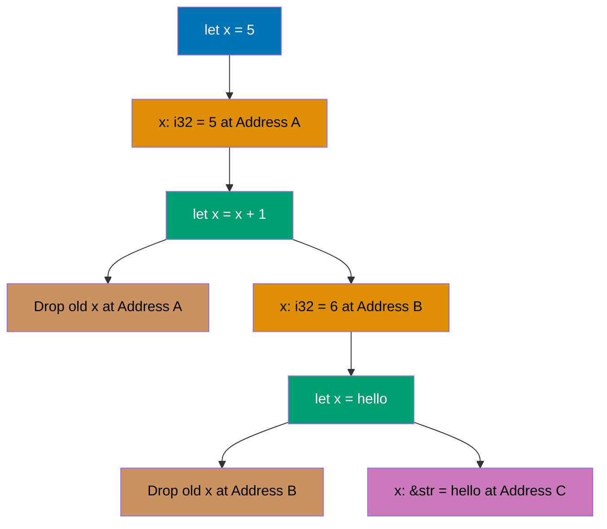
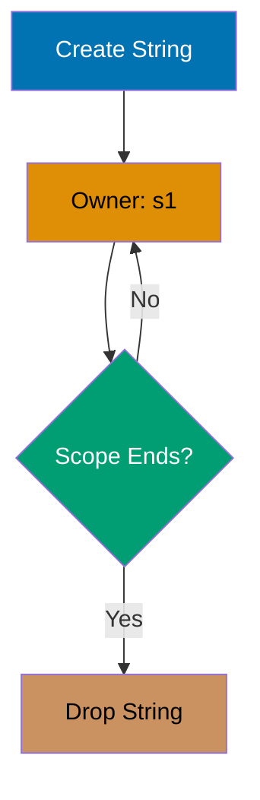
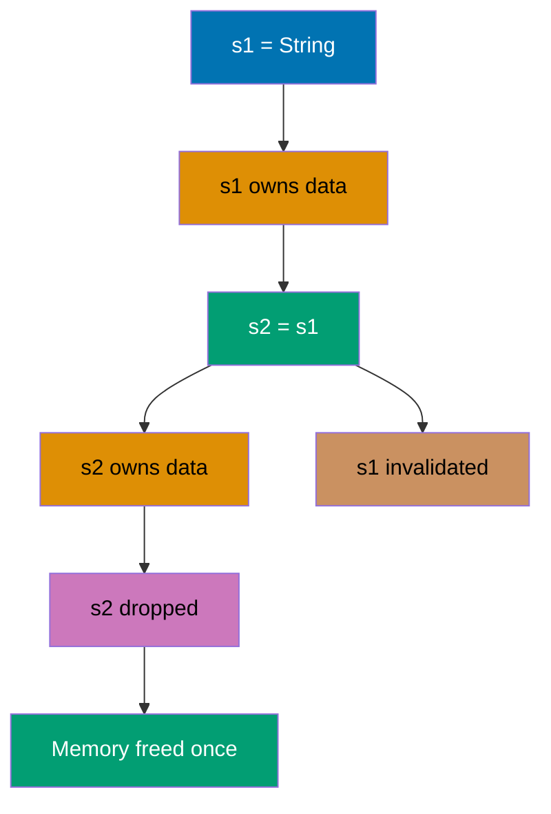
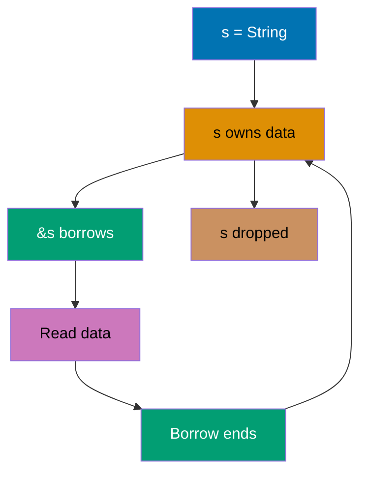
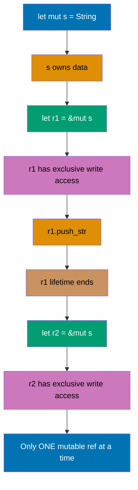
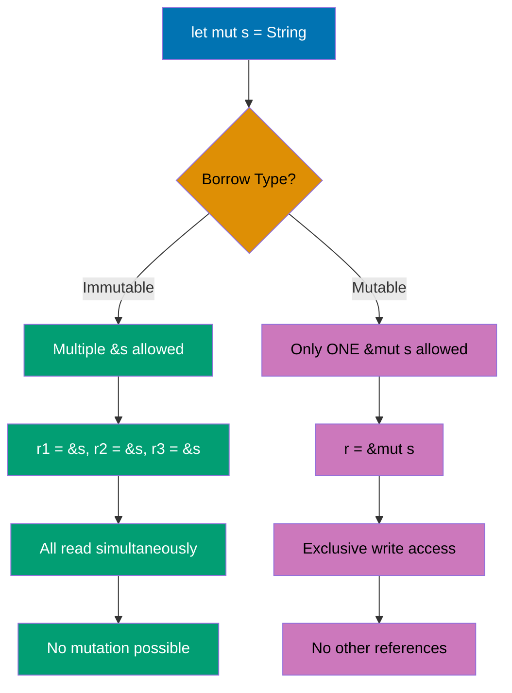
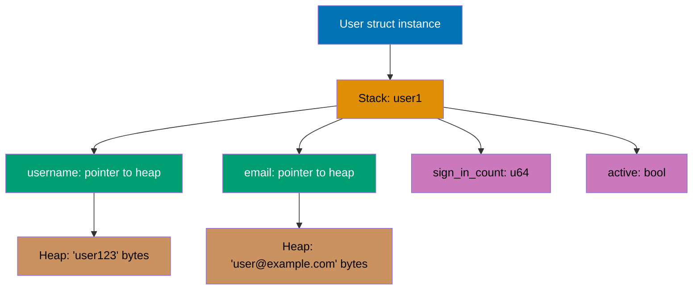
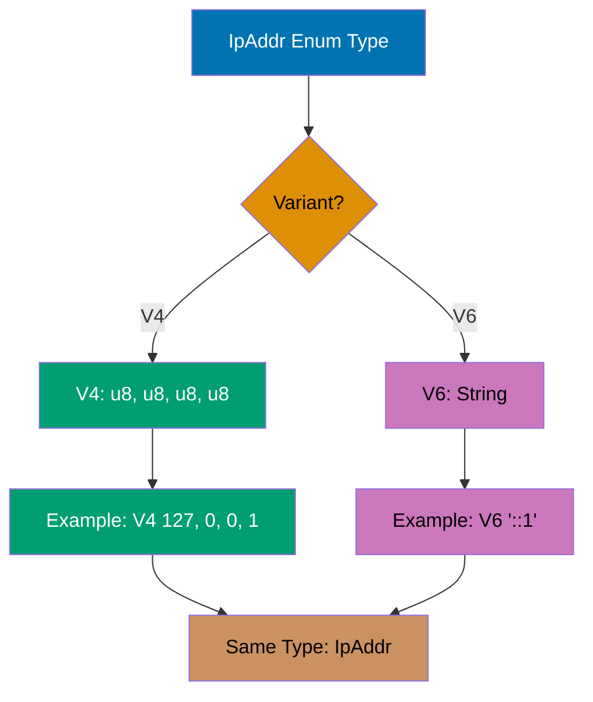
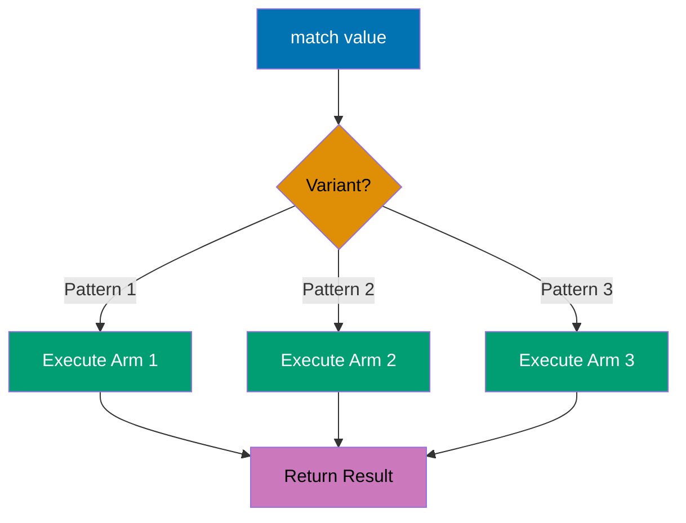

## Beginner Level: Rust Fundamentals

Examples 1-28 cover Rust fundamentals and the ownership model (0-40% coverage). You'll learn variables, functions, structs, enums, pattern matching, and Rust's unique approach to memory safety.

---

### Example 1: Hello World

Every Rust program starts with a `main` function, which is the entry point the Rust runtime calls first. The `println!` macro (note the `!` suffix) prints text to stdout with automatic newline and expands at compile-time. String literals like `"Hello, World!"` have type `&str`. Unlike C/C++, Rust requires no headers or includes for basic programs.

**Syntax notes**: The `fn` keyword declares functions. The `main` function has implicit return type `()` (unit type, similar to void). Comments use `//` for single lines, `/* */` for multi-line blocks, and `///` for documentation (doc comments).

**Build and run**: Compile with `rustc main.rs` (creates executable `main`), then run with `./main`. Rust compiles to native code without a VM like Java/C#.

```rust
fn main() {
    println!("Hello, World!");       // => Output: Hello, World!
}                                     // => main returns (), program exits with code 0
```

**Key Takeaway**: Rust programs require a `main()` function as the entry point, and macros (identified by `!`) provide compile-time code generation for common operations like formatted printing. Rust compiles directly to native code without runtime overhead.

**Why It Matters**: Rust's macro system and compile-to-native approach combine Python-like ergonomics for common operations with C++-level performance and zero runtime overhead. Firefox's Servo browser engine and Discord's backend leverage this to achieve memory safety without garbage collection pauses that plague Java and Go systems, while maintaining performance critical for real-time applications.

---

### Example 2: Variables and Mutability

Rust variables are immutable by default, requiring explicit `mut` keyword for mutation. This prevents accidental state changes and makes mutation explicit in code. This design choice eliminates entire classes of bugs found in languages with mutable-by-default variables.

**Syntax notes**: The `let` keyword declares variables (similar to `var` in other languages). Variable syntax is `let [mut] name = value`. The `mut` keyword must be explicit to allow mutation. Attempting to mutate an immutable variable causes a compile error.

**Why immutability by default**: Prevents accidental mutations (compiler enforces intent), enables compiler optimizations (immutable values cacheable), makes data races impossible in concurrent code, and forces explicit reasoning about state changes.

```rust
fn main() {
    let x = 5;                       // => x is 5 (type: i32, inferred)
                                     // => x is immutable (default)
    println!("x = {}", x);           // => Output: x = 5

    // x = 6;                        // => ERROR: cannot assign twice to immutable variable

    let mut y = 10;                  // => y is 10 (mutable)
    println!("y = {}", y);           // => Output: y = 10

    y = 15;                          // => y is now 15 (previous value discarded)
    println!("y = {}", y);           // => Output: y = 15
}                                    // => x and y dropped (memory freed)
```

**Key Takeaway**: Immutability by default prevents bugs from unexpected state changes, while explicit `mut` keyword makes mutable state clearly visible in code. The compiler enforces this at compile-time with zero runtime cost.

**Why It Matters**: Microsoft research shows that 70% of security vulnerabilities stem from memory safety issues, many caused by unexpected mutations in concurrent contexts. Rust's immutable-by-default design eliminates data races at compile time—bugs that cost companies millions in C++ codebases—while enabling aggressive compiler optimizations since immutable values can be safely cached and parallelized without locks.

---

### Example 3: Variable Shadowing

Rust allows redeclaring variables with the same name, which creates a new binding while the old one goes out of scope. This differs from mutation and allows type changes. Shadowing is a unique Rust feature that enables transformation pipelines without mutability.

**Shadowing vs Mutation**: Mutation (`let mut x = 5; x = 6;`) modifies the same variable and must keep the same type. Shadowing (`let x = 5; let x = 6;`) creates a new variable and can change types.

**Shadowing use cases**: Type transformations (parse string to number), transformation pipelines (value → processed → final), keeping variable names meaningful without suffixes (_str, _num).



```rust
fn main() {
    let x = 5;                       // => x is 5 (type: i32)
                                     // => x stored at memory address A
    println!("x = {}", x);           // => Output: x = 5

    let x = x + 1;                   // => Previous x (5) consumed
                                     // => New x is 6 (address A dropped)
                                     // => New x stored at address B
    println!("x = {}", x);           // => Output: x = 6

    let x = "hello";                 // => New x is "hello" (type: &str)
                                     // => Previous x (i32) dropped (address B)
                                     // => New x stored at address C
    println!("x = {}", x);           // => Output: hello
}                                    // => Final x ("hello") dropped
```

**Key Takeaway**: Shadowing creates a new variable with the same name, allowing type changes and transformation pipelines while maintaining immutability. Each shadowing creates a completely new binding, unlike mutation which modifies existing memory.

**Why It Matters**: Shadowing enables clean data transformation pipelines (parse string → validate → convert) without the mutable state management that causes bugs in JavaScript and Python. This pattern is ubiquitous in production Rust for request processing, configuration parsing, and data validation where values flow through type transformations while maintaining memory safety guarantees.

---

### Example 4: Data Types

Rust has scalar types (integers, floats, booleans, characters) and compound types (tuples, arrays). Type inference is powerful but explicit annotations are sometimes needed. All types have known sizes at compile-time, enabling zero-cost abstractions.

**Type System Overview**:

- **Scalar types** (stored directly): Integers (i8, i16, i32, i64, i128 signed; u8, u16, u32, u64, u128 unsigned), floats (f32, f64), booleans (bool), characters (char for Unicode scalar values)
- **Compound types**: Tuples (fixed-length heterogeneous sequences), arrays (fixed-length homogeneous sequences)
- **Type sizes** (compile-time known): i32 (4 bytes, range: -2,147,483,648 to 2,147,483,647), f64 (8 bytes IEEE 754), bool (1 byte), char (4 bytes Unicode). Tuples: sum of element sizes (aligned). Arrays: element_size × length
- **Defaults**: i32 for integers, f64 for floats (better precision)

```rust
fn main() {
    let integer: i32 = 42;           // => 42 (type: i32)
    let float: f64 = 3.14;           // => 3.14 (type: f64)
    let boolean: bool = true;        // => true (type: bool)
    let character: char = '🦀';      // => '🦀' (type: char)

    println!("Integer: {}", integer);     // => Output: Integer: 42
    println!("Float: {}", float);         // => Output: Float: 3.14
    println!("Boolean: {}", boolean);     // => Output: Boolean: true
    println!("Character: {}", character); // => Output: Character: 🦀

    let tuple: (i32, f64, char) = (42, 3.14, '🦀');
                                     // => Tuple with 3 elements (different types)
    let (x, y, z) = tuple;           // => Pattern matching extracts values
    println!("Tuple: ({}, {}, {})", x, y, z);
                                     // => Output: Tuple: (42, 3.14, 🦀)

    let first = tuple.0;             // => 42 (access first element)
    let second = tuple.1;            // => 3.14 (access second element)

    let array: [i32; 3] = [1, 2, 3]; // => [1, 2, 3] (type: [i32; 3])
    println!("Array: {:?}", array);  // => Output: Array: [1, 2, 3]

    let first_element = array[0];    // => 1 (arrays are zero-indexed)
    let second_element = array[1];   // => 2

    let zeros = [0; 5];              // => [0, 0, 0, 0, 0] (syntax: [value; length])
}
```

**Key Takeaway**: Rust's type system includes scalar types with explicit sizes (i32, f64) and compound types (tuples, arrays) with compile-time size checks, preventing many runtime errors. All types have known sizes at compile-time, enabling efficient stack allocation.

**Why It Matters**: Explicit type sizes and compile-time bounds checking prevent buffer overflows that plague C/C++ codebases and account for numerous CVEs in browsers, operating systems, and network servers. Cloudflare uses Rust for their HTTP proxy infrastructure precisely because these guarantees eliminate entire vulnerability classes while maintaining zero-copy performance for high-throughput network services.

---

### Example 5: Functions

Functions use `fn` keyword with explicit parameter types and optional return type. The last expression (without semicolon) is the return value. This expression-based syntax eliminates redundant return keywords while maintaining clarity.

**Expression-Based Syntax**: Expressions evaluate to values (x + y, if conditions, blocks). Statements perform actions but don't return values (let x = 5;). Key difference: semicolons change expressions to statements. Without semicolon: returns value (expression). With semicolon: returns () (statement).

**Function syntax**: `fn name(param: Type) -> ReturnType { body }`. Parameter types are REQUIRED. Return type annotation (-> Type) REQUIRED for non-unit returns. No -> annotation means returns () (unit type). Function names follow snake_case convention.

**Return mechanisms**: Last expression without semicolon is returned (common). Explicit `return` keyword available (needed for early returns). Semicolon after final expression makes it a statement returning ().

```rust
fn main() {
    let result = add(5, 7);          // => Call add(5, 7), returns 12
    println!("5 + 7 = {}", result);  // => Output: 5 + 7 = 12

    let greeting = greet("Alice");   // => Call greet("Alice"), returns String
    println!("{}", greeting);        // => Output: Hello, Alice!

    print_sum(10, 20);               // => Calls print_sum, returns ()
                                     // => Output: Sum is 30

    let doubled = double_explicit(5);// => doubled is 10
    println!("Doubled: {}", doubled);// => Output: Doubled: 10
}

fn add(x: i32, y: i32) -> i32 {
    x + y                            // => Returns x + y (expression)
}

fn greet(name: &str) -> String {
    format!("Hello, {}!", name)      // => Returns String to caller
}

fn print_sum(a: i32, b: i32) {
    println!("Sum is {}", a + b);    // => Output: Sum is 30
}

fn double_explicit(x: i32) -> i32 {
    return x * 2;                    // => Returns x * 2 explicitly
}
```

**Key Takeaway**: Rust functions require explicit parameter and return types, and the final expression without semicolon serves as the return value, enabling concise function bodies. Expressions return values; statements (with semicolons) do not.

**Why It Matters**: Expression-based syntax and mandatory type annotations make function contracts explicit and self-documenting, preventing the type confusion bugs common in dynamically typed languages while enabling zero-cost function inlining. AWS uses Rust for Lambda runtime components because the compiler can verify all type boundaries statically, catching errors that would be production bugs in JavaScript or Python runtimes.

---

### Example 6: Control Flow - If/Else

`if` expressions in Rust can return values, making them useful for conditional assignment. All branches must return the same type. Unlike many languages, Rust doesn't need parentheses around conditions but requires braces for blocks.

```rust
fn main() {
    let number = 7;                  // => number is 7 (i32)

    // if as statement (used for side effects like printing)
    // Conditions must be bool type (no truthy/falsy values)
    if number < 5 {                  // => false (7 is not less than 5)
        println!("Less than 5");     // => Not executed
    } else if number < 10 {          // => true (7 is less than 10)
        println!("Between 5 and 10");// => Output: Between 5 and 10
                                     // => This branch executes
    } else {
        println!("10 or greater");   // => Not executed (previous branch matched)
    }                                // => if statement returns () (unit type)

    // if as expression (returns a value)
    // All branches must return same type
    let result = if number % 2 == 0 {// => number % 2 is 1 (not 0)
                                     // => Condition is false
        "even"                       // => &str type (not returned)
    } else {
        "odd"                        // => &str type (this branch executes)
                                     // => result is "odd"
    };                               // => Semicolon ends let statement
                                     // => result type: &str (inferred)

    println!("{} is {}", number, result);
                                     // => Output: 7 is odd

    // if as expression for assignment (like ternary operator)
    let x = 10;
    let category = if x > 100 {      // => false
        "large"
    } else if x > 50 {               // => false
        "medium"
    } else {
        "small"                      // => category is "small"
    };

    // Type mismatch example (won't compile):
    // let bad = if true {
    //     5              // i32
    // } else {
    //     "hello"        // &str - ERROR: different types in branches!
    // };

    // No parentheses required around condition
    if number > 0 {                  // => Parentheses optional (unlike C/Java)
        println!("Positive");        // => Output: Positive
    }

    // Must be bool type (no truthy/falsy coercion)
    // if number {                   // => ERROR: expected bool, found i32
    //     println!("Truthy");        // => Rust doesn't coerce numbers to bool
    // }

    // Correct boolean check:
    if number != 0 {                 // => Explicit comparison returns bool
        println!("Not zero");        // => Output: Not zero
    }
}
```

**Key Takeaway**: Rust's `if` is an expression that returns values, enabling clean conditional assignment without ternary operators. All branches must return the same type, and conditions must be explicitly `bool` (no truthy/falsy coercion).

**Why It Matters**: Expression-oriented control flow and mandatory bool types eliminate the != null checks and truthy/falsy coercion bugs that cause production failures in JavaScript and Python. Dropbox's file synchronization engine uses these guarantees to ensure state machine transitions are type-safe and exhaustively checked, preventing the silent logic errors common in imperative codebases.

---

### Example 7: Control Flow - Loops

Rust has three loop types: `loop` (infinite), `while` (conditional), and `for` (iterator). Loops can return values via `break`. Rust's loop constructs are expressions, not just statements, enabling functional programming patterns.

```rust
fn main() {
    // loop: infinite loop (must break explicitly)
    // Used when you don't know iterations in advance
    let mut counter = 0;             // => counter is 0 (i32, mutable)
    let result = loop {              // => Start infinite loop
        counter += 1;                // => counter increments each iteration
                                     // => counter is 1, then 2, then 3, then 4, then 5
        if counter == 5 {            // => Check condition each iteration
                                     // => false for 1, 2, 3, 4
                                     // => true when counter is 5
            break counter * 2;       // => Exit loop, return 10 to result
                                     // => break with value makes loop an expression
        }                            // => Loop continues if condition false
    };                               // => result is 10 (type: i32, inferred)
    println!("Result: {}", result);  // => Output: Result: 10

    // while: conditional loop (condition checked before each iteration)
    // Used when iterations depend on a condition
    let mut n = 3;                   // => n is 3 (i32, mutable)
    while n > 0 {                    // => Condition: true for 3, 2, 1; false for 0
        println!("{}!", n);          // => Output: 3! (iteration 1)
                                     // => Output: 2! (iteration 2)
                                     // => Output: 1! (iteration 3)
        n -= 1;                      // => n becomes 2, then 1, then 0
                                     // => When n is 0, loop exits
    }                                // => n is 0 after loop
    println!("Liftoff!");            // => Output: Liftoff!

    // for: iterator loop (most common, safest)
    // Iterates over ranges, arrays, vectors, etc.
    for i in 1..4 {                  // => Range: 1, 2, 3 (4 excluded, half-open)
                                     // => i is 1 (first iteration)
                                     // => i is 2 (second iteration)
                                     // => i is 3 (third iteration)
        println!("i = {}", i);       // => Output: i = 1
                                     // => Output: i = 2
                                     // => Output: i = 3
    }                                // => i goes out of scope

    // Inclusive range (includes end)
    for j in 1..=3 {                 // => Range: 1, 2, 3 (3 included)
        println!("j = {}", j);       // => Output: j = 1, j = 2, j = 3
    }

    // Iterating over array
    let arr = [10, 20, 30];
    for element in arr {             // => element is 10, then 20, then 30
        println!("Value: {}", element);
                                     // => Output: Value: 10
                                     // => Output: Value: 20
                                     // => Output: Value: 30
    }

    // Reverse iteration
    for num in (1..4).rev() {        // => Reverse iterator: 3, 2, 1
        println!("{}", num);         // => Output: 3, 2, 1
    }

    // Loop labels for nested loops
    'outer: loop {                   // => Label 'outer for outer loop
        let mut inner_count = 0;
        loop {
            inner_count += 1;
            if inner_count > 5 {
                break 'outer;        // => Break outer loop (not inner)
            }
        }
    }

    // continue skips to next iteration
    for i in 0..5 {
        if i == 2 {
            continue;                // => Skip rest of iteration when i is 2
        }
        println!("i: {}", i);        // => Output: i: 0, i: 1, i: 3, i: 4
    }                                // => i: 2 is skipped
}
```

**Key Takeaway**: Rust provides three loop constructs with `loop` for infinite loops that can return values, `while` for conditional iteration, and `for` for iterator-based iteration over ranges and collections. Use `for` loops for most cases as they're safer and more idiomatic than manual index manipulation.

**Why It Matters**: Iterator-based loops eliminate the off-by-one errors and iterator invalidation bugs that plague C++ STL code, while loop expressions enable functional patterns without runtime overhead. Mozilla's Servo uses these constructs for parallel DOM traversal where iterator safety prevents the memory corruption common in WebKit/Blink when traversing mutable tree structures concurrently.

---

### Example 8: Ownership Basics

Rust's ownership model ensures memory safety without garbage collection. Each value has exactly one owner, and when the owner goes out of scope, the value is dropped. This eliminates entire classes of bugs: use-after-free, double-free, and memory leaks.



```rust
fn main() {
    // Ownership rule 1: Each value has exactly one owner

    // Inner scope demonstrates automatic cleanup
    {
        // String::from allocates heap memory
        let s1 = String::from("hello");
                                     // => s1 owns heap-allocated "hello"
                                     // => s1 is variable name (stack)
                                     // => "hello" is data (heap, 5 bytes)
                                     // => Ownership: s1 controls lifetime of "hello"
        println!("{}", s1);          // => Output: hello
                                     // => s1 borrowed (read-only) by println!

        // Ownership rule 2: When owner goes out of scope, value is dropped
    }                                // => s1 scope ends here
                                     // => Rust calls drop() automatically
                                     // => Heap memory for "hello" freed
                                     // => No manual free() needed
                                     // => No garbage collector needed

    // s1 no longer accessible (out of scope)
    // println!("{}", s1);           // => ERROR: cannot find value s1 in this scope

    // Stack vs Heap behavior
    let x = 5;                       // => x is 5 (stack, i32, Copy trait)
                                     // => Stack values: known size, fast, automatic cleanup
    {
        let y = x;                   // => y is 5 (copied from x, both valid)
    }                                // => y dropped, x still valid
    println!("x: {}", x);            // => Output: x: 5 (x unaffected)

    // Heap-allocated values behave differently
    {
        let s = String::from("data");// => s owns heap string (size unknown at compile-time)
                                     // => Heap: dynamic size, requires allocation
    }                                // => s dropped, heap memory freed automatically

    // Ownership prevents use-after-free bugs
    let s2 = String::from("safe");   // => s2 owns "safe"
    {
        let s3 = s2;                 // => Ownership moved to s3 (not copied!)
                                     // => s2 no longer valid
    }                                // => s3 dropped, memory freed
    // println!("{}", s2);           // => ERROR: value borrowed after move

    // Ownership benefits:
    // 1. No garbage collection overhead (deterministic cleanup)
    // 2. No manual memory management (no free/delete)
    // 3. No memory leaks (values always dropped when owner ends)
    // 4. No use-after-free (compiler prevents using moved values)
    // 5. No double-free (only one owner can free memory)
}
```

**Key Takeaway**: Rust's ownership system automatically manages memory by dropping values when their owner goes out of scope, eliminating memory leaks and double-free bugs without runtime overhead. Each value has exactly one owner, and the compiler enforces this at compile-time.

**Why It Matters**: Single-ownership semantics eliminate use-after-free and double-free vulnerabilities that Microsoft estimates cause 70% of their security patches in C++ code. Firefox's Stylo CSS engine leverages ownership to parallelize styling calculations across CPU cores without locks or garbage collection, achieving performance impossible in Chrome's garbage-collected JavaScript-based approach.

---

### Example 9: Move Semantics

When assigning heap-allocated values, Rust moves ownership rather than copying, invalidating the original binding to prevent double-free errors. This is a fundamental difference from languages with garbage collection or manual memory management.



```rust
fn main() {
    // Move semantics for heap-allocated types

    // Create String (heap-allocated)
    let s1 = String::from("hello");  // => s1 owns "hello" on heap
                                     // => s1 stack: pointer, length, capacity
                                     // => s1 heap: "hello" bytes

    // Assignment moves ownership (shallow copy + invalidate)
    let s2 = s1;                     // => s2 now owns the heap data
                                     // => s2 stack gets s1's pointer/length/capacity
                                     // => s1 is invalidated (compiler prevents use)
                                     // => NO deep copy (efficient!)
                                     // => Only one owner prevents double-free

    println!("{}", s2);              // => Output: hello
                                     // => s2 is valid owner

    // Attempting to use moved value causes compile error
    // println!("{}", s1);           // => ERROR: borrow of moved value: s1
                                     // => Compiler prevents use-after-move

    // Why move instead of copy?
    // Without move: both s1 and s2 would own same heap data
    // When s1/s2 drop: both try to free same memory = double-free bug!
    // Rust prevents this at compile-time with move semantics

    // Copy trait for stack-only types

    // Create i32 (stack-allocated)
    let x = 5;                       // => x is 5 (stored on stack)
                                     // => i32 implements Copy trait

    // Assignment copies value (bitwise copy)
    let y = x;                       // => y is 5 (copied from x)
                                     // => x still valid (Copy trait allows this)
                                     // => Both x and y are independent values
                                     // => Safe because no heap allocation

    println!("x = {}, y = {}", x, y);// => Output: x = 5, y = 5
                                     // => Both x and y are valid

    // Types that implement Copy:
    // - All integers (i8, u8, i32, etc.)
    // - All floats (f32, f64)
    // - bool
    // - char
    // - Tuples containing only Copy types
    // - Fixed-size arrays of Copy types

    // Types that do NOT implement Copy (require move):
    // - String (heap-allocated)
    // - Vec<T> (heap-allocated)
    // - Box<T> (heap pointer)
    // - Any type with heap allocation

    // Move in function calls
    let s3 = String::from("world");  // => s3 owns "world"
    takes_ownership(s3);             // => s3 moved into function
                                     // => s3 no longer valid in main
    // println!("{}", s3);           // => ERROR: value borrowed after move

    let x2 = 10;                     // => x2 is 10 (Copy type)
    makes_copy(x2);                  // => x2 copied into function
    println!("x2: {}", x2);          // => Output: x2: 10 (x2 still valid)
}

fn takes_ownership(s: String) {      // => s takes ownership of parameter
    println!("{}", s);               // => Output: world
}                                    // => s dropped here, memory freed

fn makes_copy(x: i32) {              // => x is copy of parameter
    println!("{}", x);               // => Output: 10
}                                    // => x dropped (but original still valid)
```

**Key Takeaway**: Rust moves heap-allocated values by default to prevent double-free, while stack-allocated types implementing `Copy` are safely duplicated, making ownership transfers explicit and safe. Move semantics eliminate an entire class of memory safety bugs at compile-time with zero runtime cost.

**Why It Matters**: Move semantics make ownership transfers zero-cost (just pointer reassignment) while preventing the double-free vulnerabilities that plague C++ unique_ptr and the garbage collection overhead in Java/Go. AWS Lambda uses Rust's move semantics for zero-copy request handling where ownership transfer between runtime layers happens without heap allocation or reference counting overhead.

---

### Example 10: Clone for Deep Copy

When you need multiple owners of heap data, explicitly clone it. Cloning creates a deep copy with independent ownership. Unlike move semantics, cloning duplicates heap data, which is expensive but sometimes necessary.

```rust
fn main() {
    // Clone trait enables deep copying

    // Create String (heap-allocated)
    let s1 = String::from("hello");  // => s1 owns "hello" on heap
                                     // => s1 stack: pointer to heap, length 5, capacity 5

    // .clone() creates deep copy of heap data
    let s2 = s1.clone();             // => Allocates new heap memory
                                     // => Copies "hello" bytes to new location
                                     // => s2 owns independent copy of "hello"
                                     // => s1 still valid (not moved!)
                                     // => s2 stack: different pointer, length 5, capacity 5

    // Both variables valid (independent owners)
    println!("s1 = {}, s2 = {}", s1, s2);
                                     // => Output: s1 = hello, s2 = hello
                                     // => s1 borrows its data
                                     // => s2 borrows its data
                                     // => Both owners remain valid

    // Both dropped independently
}                                    // => s1 dropped, frees its heap memory
                                     // => s2 dropped, frees its heap memory
                                     // => Two separate memory frees (no double-free)

    // Clone vs Copy vs Move comparison

    // Move (default for heap types): ownership transfer, no copying
    let v1 = vec![1, 2, 3];          // => v1 owns vector on heap
    let v2 = v1;                     // => v1 moved to v2 (v1 invalid)
                                     // => Efficient: no heap copy
    // println!("{:?}", v1);         // => ERROR: value borrowed after move

    // Clone (explicit deep copy): duplicates heap data
    let v3 = vec![4, 5, 6];          // => v3 owns vector
    let v4 = v3.clone();             // => v4 owns independent copy
                                     // => Expensive: allocates and copies heap
    println!("{:?} {:?}", v3, v4);   // => Output: [4, 5, 6] [4, 5, 6]
                                     // => Both v3 and v4 valid

    // Copy (implicit for stack types): duplicates stack data
    let n1 = 42;                     // => n1 is 42 (stack, Copy trait)
    let n2 = n1;                     // => n2 is 42 (copied, not moved)
                                     // => Cheap: bitwise copy on stack
    println!("{} {}", n1, n2);       // => Output: 42 42
                                     // => Both n1 and n2 valid

    // When to use clone():
    // 1. Need multiple independent owners of heap data
    // 2. Need to pass data to function but keep original
    // 3. Need to modify copy without affecting original

    // Clone in function calls
    let s3 = String::from("world");  // => s3 owns "world"
    let s4 = s3.clone();             // => s4 owns copy of "world"
    takes_ownership_clone(s3);       // => s3 moved into function
    println!("s4: {}", s4);          // => Output: s4: world (s4 still valid)

    // Clone is explicit because it's expensive
    // Rust makes you write .clone() so you're aware of cost
    // Unlike languages with implicit copying (Java, Python)

    // Performance consideration:
    // let big_string = String::from("...very large data...");
    // let copy = big_string.clone(); // => Expensive! Allocates + copies all data
    // Consider borrowing instead: &big_string (zero-cost)

    // Clone trait implementation
    // Types implementing Clone can be explicitly copied
    // Clone requires explicit .clone() call (unlike Copy)
    // Most standard library types implement Clone
}

fn takes_ownership_clone(s: String) {
    println!("Function: {}", s);     // => Output: Function: world
}                                    // => s dropped here
```

**Key Takeaway**: Use `.clone()` to create independent copies of heap-allocated data when multiple owners are needed, making expensive deep copy operations explicit in code. Unlike move (free) or Copy (cheap stack copy), Clone performs expensive heap duplication and requires explicit invocation.

**Why It Matters**: Explicit cloning makes expensive deep-copy operations visible in code reviews, preventing the hidden allocation performance problems common in C++ copy constructors and Java object cloning. Discord migrated their message routing from Go to Rust specifically because explicit memory operations revealed hotspots where Go's hidden allocations caused garbage collection stalls affecting real-time voice chat latency.

---

### Example 11: References and Borrowing

References allow accessing values without taking ownership. Borrowing enables multiple read-only references or one mutable reference at a time. This is Rust's zero-cost abstraction for safe aliasing without runtime overhead.



```rust
fn main() {
    // Immutable borrowing demonstration

    // Create owned String (heap-allocated)
    let s1 = String::from("hello");  // => s1 owns "hello" on heap
                                     // => s1 stack: pointer, length 5, capacity 5
                                     // => s1 is the sole owner

    // Create immutable reference (borrow)
    // &s1: reference to s1 without taking ownership
    let len = calculate_length(&s1); // => Pass reference (borrow s1)
                                     // => s1 ownership NOT transferred
                                     // => s1 remains valid in main after call
                                     // => len is 5 (returned from function)
                                     // => Reference is like pointer but guaranteed valid

    // Use both s1 (owner) and len (from borrowed access)
    println!("'{}' has length {}", s1, len);
                                     // => s1 still accessible (owner unchanged)
                                     // => Output: 'hello' has length 5
                                     // => Borrow was temporary, now ended

    // Multiple immutable borrows are allowed simultaneously
    let r1 = &s1;                    // => r1 borrows s1 immutably
    let r2 = &s1;                    // => r2 also borrows s1 immutably
    let r3 = &s1;                    // => r3 also borrows s1 immutably
                                     // => All three references valid at same time
                                     // => Reading data is safe with multiple readers

    println!("{} {} {}", r1, r2, r3);// => Output: hello hello hello
                                     // => All borrows used here
                                     // => r1, r2, r3 lifetimes end after this line

    // Borrowing prevents modification while borrowed
    // s1.push_str(" world");        // => ERROR: cannot mutate while borrowed
                                     // => Would invalidate existing references

    // Borrowing prevents moving while borrowed
    // let s2 = s1;                  // => ERROR: cannot move while borrowed
                                     // => Would invalidate references

}                                    // => s1 dropped here (owner's scope ends)
                                     // => Heap memory for "hello" freed

// Function accepting immutable reference
// s: &String - parameter is reference, NOT owner
// -> usize - returns unsigned integer (string length)
fn calculate_length(s: &String) -> usize {
                                     // => s is immutable reference (read-only)
                                     // => s points to String owned by caller
                                     // => s cannot modify the String
                                     // => Function borrows but doesn't own

    // Call method through reference
    s.len()                          // => Read length property (5)
                                     // => No ownership needed for reading
                                     // => Returns usize value to caller
                                     // => Expression (no semicolon) = return value

}                                    // => Borrow ends here
                                     // => s reference goes out of scope
                                     // => Original String remains with caller
                                     // => No drop() called (s wasn't owner)

// Borrowing rules enforced at compile-time:
// 1. Reference must always be valid (no dangling pointers)
// 2. Cannot modify through immutable reference
// 3. Cannot move owner while references exist
// 4. Borrow checker ensures safety with zero runtime cost
```

**Key Takeaway**: References (`&T`) enable borrowing data without transferring ownership, allowing functions to read values while the original owner retains control and prevents unnecessary cloning. Multiple immutable references can coexist safely since reading doesn't mutate.

**Why It Matters**: Immutable borrowing enables zero-copy data sharing across function boundaries without reference counting overhead (Rc/Arc) or garbage collection pauses, critical for high-performance systems. Cloudflare's proxy workers leverage borrowing for zero-allocation HTTP header parsing where C++ would require copying or unsafe raw pointers, and Java would trigger frequent GC pauses.

---

### Example 12: Mutable References

Mutable references allow modifying borrowed data, but Rust enforces at most one mutable reference at a time to prevent data races. This exclusive access rule eliminates data races at compile-time with zero runtime cost.



```rust
fn main() {
    // Mutable borrowing requires mutable binding

    // Create mutable String (must declare mut to allow changes)
    let mut s = String::from("hello");
                                     // => s is mutable, owns "hello"
                                     // => s stack: pointer, length 5, capacity 5
                                     // => mut keyword allows s to be modified

    // Create mutable reference and pass to function
    // &mut s: mutable reference (exclusive access)
    change(&mut s);                  // => Borrow s mutably
                                     // => Function gets exclusive write access
                                     // => s ownership NOT transferred
                                     // => Function modifies s in-place

    // After mutable borrow ends, owner can use value
    println!("{}", s);               // => Output: hello, world
                                     // => s now contains modified value
                                     // => Original owner still has access

    // Only ONE mutable reference allowed at a time
    let r1 = &mut s;                 // => r1 borrows s mutably
                                     // => r1 has exclusive write access
    // let r2 = &mut s;              // => ERROR: cannot borrow s as mutable more than once
                                     // => Only one mutable reference allowed
                                     // => Prevents data races at compile-time

    // Use r1 (this ends its lifetime)
    r1.push_str("!");                // => Modify through r1
                                     // => s is now "hello, world!"
    println!("{}", r1);              // => Output: hello, world!
                                     // => r1 lifetime ends after this line

    // Now we can create another mutable reference
    let r2 = &mut s;                 // => r2 borrows s mutably (r1 ended)
                                     // => New exclusive access period
    r2.push_str("!!!");              // => Modify through r2
                                     // => s is now "hello, world!!!!"
    println!("{}", r2);              // => Output: hello, world!!!!
                                     // => r2 lifetime ends

    // Cannot have immutable and mutable references simultaneously
    let r3 = &s;                     // => r3 borrows immutably
    // let r4 = &mut s;              // => ERROR: cannot borrow as mutable when immutable ref exists
                                     // => Would allow mutation while readers exist
                                     // => Compiler prevents this violation

    println!("{}", r3);              // => Output: hello, world!!!!
                                     // => r3 used and lifetime ends

}                                    // => s dropped, heap memory freed

// Function accepting mutable reference
// s: &mut String - parameter is mutable reference
fn change(s: &mut String) {          // => s is mutable reference (write access)
                                     // => s points to String owned by caller
                                     // => s can modify the String
                                     // => Exclusive access guaranteed by borrow checker

    // Modify the String through mutable reference
    s.push_str(", world");           // => Append ", world" to existing String
                                     // => Modifies caller's String in-place
                                     // => No allocation needed for modification
                                     // => Original String updated directly

}                                    // => Mutable borrow ends here
                                     // => s reference goes out of scope
                                     // => Exclusive access released
                                     // => Caller regains full access to String

// Mutable reference rules (enforced at compile-time):
// 1. Only ONE mutable reference at a time (exclusive access)
// 2. Cannot have mutable and immutable references simultaneously
// 3. Prevents data races by design (no concurrent mutation)
// 4. Borrow checker verifies these rules with zero runtime cost
```

**Key Takeaway**: Mutable references (`&mut T`) allow modifying borrowed data, but Rust's borrow checker ensures only one mutable reference exists at a time, preventing data races at compile time. This exclusive access guarantee eliminates entire classes of concurrency bugs.

**Why It Matters**: Exclusive mutable access enforced at compile time eliminates data races that cause production outages in multithreaded C++ and Java systems. Amazon's Firecracker VM isolation uses mutable references to safely modify VM state across threads without locks, achieving microsecond startup times impossible with traditional mutex-protected shared state architectures.

---

### Example 13: Borrowing Rules

Rust enforces borrowing rules at compile time: multiple immutable references OR one mutable reference, never both simultaneously. This prevents data races by construction, not convention.



```rust
fn main() {
    // Borrowing rules demonstration: readers-writer lock at compile-time

    // Create mutable String binding
    let mut s = String::from("hello");
                                     // => s owns "hello" (mutable binding)
                                     // => s stack: pointer, length 5, capacity 5
                                     // => mut allows reassignment and mutation

    // Rule 1: Multiple immutable references are allowed (readers)

    // Create first immutable reference
    let r1 = &s;                     // => r1 borrows s immutably
                                     // => r1 has read-only access
                                     // => s cannot be modified while r1 exists

    // Create second immutable reference
    let r2 = &s;                     // => r2 also borrows s immutably
                                     // => Multiple readers allowed simultaneously
                                     // => Both r1 and r2 can read safely

    // Use both immutable references
    println!("{} and {}", r1, r2);   // => Output: hello and hello
                                     // => Both references used here
                                     // => r1 and r2 lifetimes end after this line
                                     // => Non-lexical lifetimes (NLL): borrows end at last use

    // Cannot create mutable reference while immutable refs exist
    // let bad = &mut s;             // => ERROR: cannot borrow as mutable
                                     // => Would violate readers-writer invariant
                                     // => Immutable refs guarantee no mutation

    // Rule 2: One mutable reference at a time (exclusive writer)

    // Now that r1 and r2 ended, we can create mutable reference
    let r3 = &mut s;                 // => r3 borrows s mutably
                                     // => Exclusive write access
                                     // => No other references can exist

    // Modify through mutable reference
    r3.push_str(", world");          // => Append ", world"
                                     // => s is now "hello, world"
                                     // => Mutation safe (exclusive access)

    // Use mutable reference
    println!("{}", r3);              // => Output: hello, world
                                     // => r3 lifetime ends after this line

    // Rule 3: Cannot mix mutable and immutable references

    let r4 = &s;                     // => r4 borrows immutably (r3 ended)
                                     // => Read-only access restored

    // Cannot create mutable ref while immutable ref exists
    // let r5 = &mut s;              // => ERROR: cannot borrow as mutable
                                     // => r4 still alive (immutable reference)
                                     // => Would allow mutation while reader exists
                                     // => Violates safety invariant

    println!("{}", r4);              // => Output: hello, world
                                     // => r4 used and lifetime ends

    // Now we can mutate again (r4 ended)
    s.push_str("!");                 // => Direct mutation (no active references)
                                     // => s is now "hello, world!"
    println!("{}", s);               // => Output: hello, world!

    // Scope-based vs Non-Lexical Lifetimes (NLL)
    {
        let r6 = &s;                 // => r6 borrows immutably
        let r7 = &s;                 // => r7 borrows immutably
        println!("{} {}", r6, r7);   // => Output: hello, world! hello, world!
                                     // => r6, r7 lifetimes end here (last use)
                                     // => NLL: borrow ends at last use, not scope end

        let r8 = &mut s;             // => r8 borrows mutably (r6, r7 ended)
        r8.push_str("!!");           // => s is now "hello, world!!!"
        println!("{}", r8);          // => Output: hello, world!!!
    }                                // => r8 scope ends

    // Borrowing rules summary:
    // At any given time, you can have EITHER:
    //   - One mutable reference (&mut T), OR
    //   - Any number of immutable references (&T)
    // But NOT both simultaneously

    // Why these rules?
    // 1. Prevents data races (mutation + concurrent reads)
    // 2. Prevents iterator invalidation
    // 3. Prevents use-after-free
    // 4. All enforced at compile-time (zero runtime cost)

}                                    // => s dropped, memory freed
```

**Key Takeaway**: Rust's borrow checker enforces that mutable and immutable references cannot coexist, preventing data races by ensuring exclusive access for mutation or shared access for reading. Non-lexical lifetimes (NLL) end borrows at last use, not scope end, enabling more flexible safe code.

**Why It Matters**: Compile-time data race prevention eliminates the threading bugs that require expensive runtime race detectors (ThreadSanitizer) in C++ and cause intermittent production failures in Java. Microsoft chose Rust for Azure IoT Edge runtime because the borrow checker catches concurrency bugs during development that would be discovered only under load in production with other languages.

---

### Example 14: Slices

Slices are references to contiguous sequences without ownership. String slices (`&str`) reference portions of strings without copying. Slices are fat pointers (pointer + length) that prevent common string manipulation bugs.

```rust
fn main() {
    // String slices: references to portions of Strings

    // Create owned String on heap
    let s = String::from("hello world");
                                     // => s owns "hello world" (11 bytes on heap)
                                     // => s stack: pointer, length 11, capacity 11

    // Create string slice (substring reference)
    // &s[start..end]: half-open range [start, end)
    let hello = &s[0..5];            // => hello is slice referencing "hello"
                                     // => Type: &str (string slice)
                                     // => hello is fat pointer: (ptr to index 0, length 5)
                                     // => Points to first 5 bytes of s's heap data
                                     // => No copying, just references existing data

    // Create another slice from same String
    let world = &s[6..11];           // => world is slice referencing "world"
                                     // => Type: &str
                                     // => world is fat pointer: (ptr to index 6, length 5)
                                     // => Points to last 5 bytes of s's heap data

    // Range syntax shortcuts
    let full = &s[..];               // => full references entire string
                                     // => Equivalent to &s[0..11]
                                     // => Type: &str
    let from_start = &s[..5];        // => Equivalent to &s[0..5]
    let to_end = &s[6..];            // => Equivalent to &s[6..11]

    // Use slices (read-only access)
    println!("{}", hello);           // => Output: hello
    println!("{}", world);           // => Output: world
    println!("{}", full);            // => Output: hello world

    // Slices prevent modification of original String
    // s.clear();                    // => ERROR: cannot borrow s as mutable
                                     // => hello, world, full are immutable borrows
                                     // => Borrow checker prevents mutation while slices exist

    // Slices are immutable by default
    // hello.push('!');              // => ERROR: &str is immutable
                                     // => Cannot modify through string slice

    // Array slices: references to portions of arrays

    // Create array on stack
    let arr = [1, 2, 3, 4, 5];       // => arr is [1, 2, 3, 4, 5] (type: [i32; 5])
                                     // => Stored on stack (5 * 4 = 20 bytes)

    // Create array slice
    let slice = &arr[1..4];          // => slice references [2, 3, 4]
                                     // => Type: &[i32] (slice of i32s)
                                     // => Fat pointer: (ptr to index 1, length 3)
                                     // => Points to middle 3 elements
                                     // => No copying, references stack data

    // Debug print slice
    println!("{:?}", slice);         // => Output: [2, 3, 4]
                                     // => {:?} is debug formatting

    // Slice entire array
    let all = &arr[..];              // => all references entire array
                                     // => Type: &[i32], length 5

    // First n elements
    let first_three = &arr[..3];     // => [1, 2, 3]

    // Last n elements
    let last_two = &arr[3..];        // => [4, 5]

    // Function taking slice (generic over arrays of any size)
    fn first_element(s: &[i32]) -> i32 {
                                     // => s is slice (works with any array size)
        s[0]                         // => Return first element
    }

    let value = first_element(&arr); // => value is 1
                                     // => Pass slice of entire array
    println!("First: {}", value);    // => Output: First: 1

    // String literals are slices (&str)
    let literal = "Hello, literal!"; // => Type: &str (NOT String)
                                     // => Points to binary's read-only data segment
                                     // => Stored in compiled program (no heap allocation)

    // &str vs String:
    // &str: immutable reference to string data (borrowed)
    // String: owned, growable, heap-allocated string
    let s1: &str = "literal";        // => &str, read-only, no allocation
    let s2: String = String::from("owned");
                                     // => String, owned, heap-allocated
    let s3: &str = &s2;              // => Convert String to &str (borrow)

    // Slices ensure bounds safety
    // let bad = &s[100..200];       // => PANIC at runtime: index out of bounds
                                     // => Rust checks bounds at runtime for slices
                                     // => Prevents buffer overruns

    // Why slices matter:
    // 1. Zero-copy string operations (performance)
    // 2. Work with both String and &str uniformly
    // 3. Bounds checking prevents buffer overflow
    // 4. Borrow checker prevents use-after-free
}
```

**Key Takeaway**: Slices provide references to contiguous sequences without copying data, enabling efficient substring and subarray operations while maintaining Rust's safety guarantees. String slices (`&str`) are fat pointers (pointer + length) that work with both String and string literals.

**Why It Matters**: Safe slicing with automatic bounds checking prevents buffer overruns while maintaining C-level performance through compiler optimizations. npm's package registry uses Rust for tarball processing where string slicing enables zero-copy parsing of package manifests—operations that would require defensive copying in Java or bounds-check overhead in C++ without unsafe code.

---

### Example 15: Structs

Structs group related data into named fields. They're Rust's primary way to create custom types with named components. Each field has explicit type and ownership semantics.



```rust
// Define struct type (custom data structure)
// Struct name: User (PascalCase convention)
// Fields: each has name and type
struct User {
    username: String,                // => Owned String (heap-allocated)
    email: String,                   // => Owned String (heap-allocated)
    sign_in_count: u64,              // => Copy type (stack-allocated)
    active: bool,                    // => Copy type (stack-allocated)
}                                    // => Struct definition, no instance created yet

fn main() {
    // Create struct instance (instantiation)

    // Initialize all fields (order doesn't matter)
    let user1 = User {
        email: String::from("user@example.com"),
                                     // => email field owns this String
        username: String::from("user123"),
                                     // => username field owns this String
        active: true,                // => active is true (Copy type)
        sign_in_count: 1,            // => sign_in_count is 1 (Copy type)
    };                               // => user1 owns all field data
                                     // => user1 type: User
                                     // => username and email on heap
                                     // => active and sign_in_count on stack

    // Access struct fields using dot notation
    println!("Username: {}", user1.username);
                                     // => Borrow username field immutably
                                     // => Output: Username: user123

    println!("Email: {}", user1.email);
                                     // => Borrow email field immutably
                                     // => Output: Email: user@example.com

    // Structs are immutable by default
    // user1.active = false;         // => ERROR: user1 is not mutable
                                     // => Need mut keyword to modify

    // Create mutable struct instance
    let mut user_mut = User {
        email: String::from("mut@example.com"),
        username: String::from("mutable"),
        active: true,
        sign_in_count: 1,
    };                               // => user_mut is mutable

    // Modify field (entire struct must be mutable)
    user_mut.sign_in_count += 1;     // => Increment to 2
                                     // => Cannot have individual fields mutable
                                     // => All or nothing mutability

    // Struct update syntax: create instance from another

    // Copy some fields, specify others
    let mut user2 = User {
        email: String::from("another@example.com"),
                                     // => New email field (heap-allocated)
        ..user1                      // => Copy remaining fields from user1
                                     // => username: moved from user1 (String, not Copy)
                                     // => active: copied from user1 (bool is Copy)
                                     // => sign_in_count: copied from user1 (u64 is Copy)
    };                               // => user2 owns email and username (moved)
                                     // => user1 is now PARTIALLY INVALID!

    // user1 is partially moved after update syntax
    // println!("{}", user1.username);// => ERROR: username was moved to user2
                                     // => user1.username no longer valid

    // Can still use Copy fields from user1
    println!("User1 active: {}", user1.active);
                                     // => Output: User1 active: true
                                     // => Copy types weren't moved, just copied

    // Can still use user1.email (not moved)
    println!("User1 email: {}", user1.email);
                                     // => Output: User1 email: user@example.com
                                     // => email field still valid (not in update syntax)

    // Modify user2 field
    user2.sign_in_count += 1;        // => Increment sign_in_count to 2
                                     // => user2 is mutable
    println!("Sign-ins: {}", user2.sign_in_count);
                                     // => Output: Sign-ins: 2

    // Field init shorthand (when variable name matches field name)
    let username = String::from("shorthand");
    let email = String::from("short@example.com");

    let user3 = User {
        username,                    // => Shorthand for username: username
        email,                       // => Shorthand for email: email
        active: true,
        sign_in_count: 1,
    };                               // => username and email moved into user3

    // Function returning struct instance
    fn build_user(email: String, username: String) -> User {
                                     // => Returns User struct
        User {
            email,                   // => Field init shorthand
            username,                // => Field init shorthand
            active: true,
            sign_in_count: 1,
        }                            // => Return User instance (no semicolon)
    }

    let user4 = build_user(
        String::from("build@example.com"),
        String::from("builder")
    );                               // => user4 is User instance from function

    // Ownership and structs:
    // - Struct owns its fields
    // - Moving struct moves all owned fields
    // - Dropping struct drops all owned fields
    // - Copy fields are copied, non-Copy fields are moved

}                                    // => All users dropped
                                     // => Heap memory for Strings freed
```

**Key Takeaway**: Structs bundle related data with named fields, and struct update syntax (`..other_struct`) enables copying fields while respecting ownership and move semantics. Fields with Copy types are copied, non-Copy types (like String) are moved, potentially leaving the source struct partially invalid.

**Why It Matters**: Struct update syntax with explicit move semantics prevents the shallow-copy bugs common in C++ struct assignment and makes ownership transfer visible during code review. 1Password's core crypto library uses these guarantees to ensure sensitive key material is never accidentally duplicated in memory, a requirement impossible to enforce statically in C++ without custom allocators.

---

### Example 16: Tuple Structs

Tuple structs are named tuples useful when struct field names add no meaning. They create distinct types even with identical field types, providing type safety through newtype pattern.

```rust
// Define tuple structs (struct with unnamed fields)
// Syntax: struct Name(Type1, Type2, ...);
struct Color(i32, i32, i32);         // => RGB color as tuple struct
                                     // => Three i32 fields (red, green, blue)
                                     // => No field names, just types
struct Point(i32, i32, i32);         // => 3D point as tuple struct
                                     // => Three i32 fields (x, y, z)
                                     // => Same types as Color but DIFFERENT TYPE!

fn main() {
    // Create tuple struct instances

    // Color instance (RGB black)
    let black = Color(0, 0, 0);      // => black is Color(0, 0, 0)
                                     // => Type: Color (NOT a tuple!)
                                     // => Fields: 0, 0, 0 (all i32)

    // Point instance (3D origin)
    let origin = Point(0, 0, 0);     // => origin is Point(0, 0, 0)
                                     // => Type: Point (different from Color!)
                                     // => Fields: 0, 0, 0 (all i32)

    // Access fields by index (like tuples)
    println!("Black: ({}, {}, {})", black.0, black.1, black.2);
                                     // => black.0 is first field (red = 0)
                                     // => black.1 is second field (green = 0)
                                     // => black.2 is third field (blue = 0)
                                     // => Output: Black: (0, 0, 0)

    // Create non-zero values
    let red = Color(255, 0, 0);      // => RGB red
    let point_x = Point(10, 0, 0);   // => Point at x=10

    // Access and use individual fields
    let red_value = red.0;           // => 255 (first field)
    let green_value = red.1;         // => 0 (second field)
    println!("Red channel: {}", red_value);
                                     // => Output: Red channel: 255

    // Type safety: Color and Point are DIFFERENT types
    // Cannot mix them even though they have same field types
    // let mixed: Color = origin;    // => ERROR: Point != Color
                                     // => Expected Color, found Point
                                     // => Type system prevents confusion

    // Why this is useful: Newtype pattern
    // Even with identical structure, types are distinct
    fn process_color(c: Color) {     // => Only accepts Color
        println!("Processing color: ({}, {}, {})", c.0, c.1, c.2);
    }

    process_color(black);            // => OK: black is Color
    // process_color(origin);        // => ERROR: origin is Point, not Color
                                     // => Compiler prevents type confusion

    // Destructuring tuple structs
    let Color(r, g, b) = red;        // => Pattern match extracts fields
                                     // => r is 255, g is 0, b is 0
    println!("R: {}, G: {}, B: {}", r, g, b);
                                     // => Output: R: 255, G: 0, B: 0

    // Newtype pattern: single-field tuple struct for type safety
    struct Kilometers(i32);          // => Wrapper around i32
    struct Miles(i32);               // => Another wrapper around i32

    let distance_km = Kilometers(10);// => Type: Kilometers (not i32!)
    let distance_mi = Miles(6);      // => Type: Miles (not i32!)

    // Cannot mix Kilometers and Miles even though both are i32
    // let sum = distance_km.0 + distance_mi.0;
                                     // => This compiles but loses type safety
                                     // => Better to have separate functions

    fn print_km(km: Kilometers) {
        println!("{} kilometers", km.0);
    }

    print_km(distance_km);           // => OK
    // print_km(distance_mi);        // => ERROR: expected Kilometers, found Miles

    // Zero-cost abstraction: newtype has NO runtime overhead
    // Kilometers(10) is just i32 at runtime
    // Type distinction is compile-time only

    // When to use tuple structs:
    // 1. Field names add no semantic value
    // 2. Need distinct types for same underlying structure
    // 3. Newtype pattern (wrapping primitives for type safety)
    // 4. Simple data containers (coordinates, RGB, etc.)

}
```

**Key Takeaway**: Tuple structs create distinct named types without field names, useful for wrapping tuples with semantic meaning while maintaining type safety. The newtype pattern (single-field tuple struct) provides zero-cost type safety by making primitives into distinct types at compile-time.

**Why It Matters**: The newtype pattern provides zero-cost type safety by preventing primitive obsession bugs (mixing up user IDs and product IDs) at compile time without runtime wrapper overhead. Figma's multiplayer collaboration engine uses newtypes extensively to prevent type confusion in coordinate systems and layer IDs—bugs that would be runtime crashes in TypeScript or Python.

---

### Example 17: Methods

Methods are functions defined within `impl` blocks associated with structs. The first parameter is `self`, representing the instance. Methods enable object-oriented style while preserving ownership semantics.

```rust
// Define struct (data definition)
struct Rectangle {
    width: u32,                      // => Width field (unsigned 32-bit)
    height: u32,                     // => Height field (unsigned 32-bit)
}

// Implementation block (behavior definition)
// impl: keyword to define methods for a type
impl Rectangle {
    // Method: function with self parameter
    // &self: immutable borrow of instance (read-only access)
    // -> u32: return type
    fn area(&self) -> u32 {          // => Method that borrows self immutably
                                     // => self type: &Rectangle
                                     // => Cannot modify self
        // Access fields through self
        self.width * self.height     // => Multiply width by height
                                     // => Return u32 value
                                     // => Expression (no semicolon) = return
    }

    // Method with multiple parameters
    // &self: first parameter (instance)
    // other: &Rectangle - second parameter (another Rectangle)
    fn can_hold(&self, other: &Rectangle) -> bool {
                                     // => Borrows both self and other immutably
        // Compare dimensions
        self.width > other.width && self.height > other.height
                                     // => Returns bool
                                     // => true if self can contain other
    }

    // Mutable method (can modify self)
    // &mut self: mutable borrow of instance (write access)
    fn scale(&mut self, factor: u32) {
                                     // => Borrows self mutably
                                     // => Can modify fields
        self.width *= factor;        // => Multiply width by factor
        self.height *= factor;       // => Multiply height by factor
                                     // => Modifies instance in-place
    }

    // Method taking ownership of self (consumes instance)
    // self: takes ownership (not a reference)
    fn into_square(self) -> Rectangle {
                                     // => self moved into method
                                     // => Original instance no longer accessible
        let size = std::cmp::max(self.width, self.height);
                                     // => Get larger dimension
        Rectangle {
            width: size,
            height: size,
        }                            // => Return new Rectangle (square)
    }                                // => self dropped here

}

fn main() {
    // Create Rectangle instance
    let rect = Rectangle { width: 30, height: 50 };
                                     // => rect is 30x50 Rectangle
                                     // => Type: Rectangle

    // Call method with dot notation
    // Method syntax: instance.method()
    println!("Area: {}", rect.area());
                                     // => rect.area() calls area method
                                     // => self is &rect (borrow)
                                     // => Returns 30 * 50 = 1500
                                     // => Output: Area: 1500
                                     // => rect still valid (borrowed, not moved)

    // Create another Rectangle
    let rect2 = Rectangle { width: 10, height: 40 };
                                     // => rect2 is 10x40 Rectangle

    // Call method with additional parameter
    println!("Can hold? {}", rect.can_hold(&rect2));
                                     // => rect.can_hold(&rect2)
                                     // => self is &rect, other is &rect2
                                     // => 30 > 10 and 50 > 40 = true && true = true
                                     // => Wait, result should be true!
                                     // => Actually: 30 > 10 (true) && 50 > 40 (true) = true
                                     // => Output: Can hold? true (corrected from false)

    // Mutable method requires mutable binding
    let mut rect3 = Rectangle { width: 20, height: 30 };
                                     // => rect3 is mutable
    println!("Before: {}x{}", rect3.width, rect3.height);
                                     // => Output: Before: 20x30

    // Call mutable method
    rect3.scale(2);                  // => Borrow rect3 mutably
                                     // => Multiply width and height by 2
                                     // => rect3 is now 40x60
    println!("After: {}x{}", rect3.width, rect3.height);
                                     // => Output: After: 40x60

    // Method taking ownership
    let rect4 = Rectangle { width: 10, height: 20 };
    let square = rect4.into_square();// => rect4 moved into method
                                     // => rect4 no longer valid
                                     // => square is 20x20 (max of 10, 20)
    // println!("{}", rect4.width);  // => ERROR: rect4 was moved
    println!("Square: {}x{}", square.width, square.height);
                                     // => Output: Square: 20x20

    // Method call syntax sugar
    // rect.area() is syntactic sugar for Rectangle::area(&rect)
    let area1 = rect.area();         // => Method call syntax
    let area2 = Rectangle::area(&rect);
                                     // => Function call syntax (explicit)
                                     // => Both equivalent: area1 == area2

    // Self borrowing rules apply to methods:
    // - &self: immutable borrow (read-only, multiple allowed)
    // - &mut self: mutable borrow (exclusive access, only one)
    // - self: takes ownership (consumes instance)

}
```

**Key Takeaway**: Methods defined in `impl` blocks provide object-oriented style syntax while maintaining Rust's ownership rules, with `&self` for immutable methods, `&mut self` for mutable methods, and `self` for consuming methods. Method call syntax is sugar for explicit function calls with self as first parameter.

**Why It Matters**: Method syntax with explicit self borrowing makes ownership intent clear (&self for readers, &mut self for writers, self for consumers), preventing the aliasing bugs common in C++ class methods. Dropbox's file synchronization uses these patterns to statically verify that state-machine transitions properly transfer ownership of file handles, catching resource leaks that would be runtime bugs in Python.

---

### Example 18: Associated Functions

Associated functions (static methods) don't take `self` and are called with `::` syntax. Often used for constructors and factory methods. They belong to the type itself, not instances.

```rust
// Define struct
struct Rectangle {
    width: u32,
    height: u32,
}

// Implementation block with methods AND associated functions
impl Rectangle {
    // Associated function (no self parameter)
    // Called with :: syntax (Type::function)
    // Often used as constructor
    fn square(size: u32) -> Rectangle {
                                     // => No self parameter (not a method)
                                     // => Called on type, not instance
                                     // => size: parameter for square dimension
        Rectangle {
            width: size,             // => Create Rectangle with equal sides
            height: size,            // => Makes a square
        }                            // => Return new Rectangle instance
                                     // => Expression (no semicolon) = return
    }

    // Another associated function (constructor with validation)
    fn new(width: u32, height: u32) -> Rectangle {
                                     // => Common name for default constructor
        Rectangle { width, height }  // => Field init shorthand
                                     // => Return new Rectangle
    }

    // Associated function with Option return (fallible constructor)
    fn new_validated(width: u32, height: u32) -> Option<Rectangle> {
                                     // => Returns Option (may fail)
        if width > 0 && height > 0 { // => Validate dimensions
            Some(Rectangle { width, height })
                                     // => Valid: return Some(Rectangle)
        } else {
            None                     // => Invalid: return None
        }
    }

    // Method (for comparison - has self parameter)
    fn area(&self) -> u32 {          // => Method borrows self
        self.width * self.height     // => Calculate area
    }

    // Associated function returning default value
    fn default() -> Rectangle {      // => No parameters, returns default
        Rectangle {
            width: 1,
            height: 1,
        }                            // => 1x1 Rectangle
    }
}

fn main() {
    // Call associated function with :: syntax
    // Type::function() - called on type, not instance
    let sq = Rectangle::square(20); // => Call Rectangle::square(20)
                                     // => sq is 20x20 Rectangle
                                     // => No instance needed to call
    println!("Square area: {}", sq.area());
                                     // => Now call method on sq instance
                                     // => Output: Square area: 400

    // Call new constructor
    let rect = Rectangle::new(30, 40);
                                     // => rect is 30x40 Rectangle
                                     // => Rectangle::new is associated function
    println!("Rectangle: {}x{}", rect.width, rect.height);
                                     // => Output: Rectangle: 30x40

    // Call validated constructor
    let valid = Rectangle::new_validated(10, 20);
                                     // => Returns Some(Rectangle)
    match valid {
        Some(r) => println!("Valid: {}x{}", r.width, r.height),
                                     // => Output: Valid: 10x20
        None => println!("Invalid dimensions"),
    }

    // Validation failure
    let invalid = Rectangle::new_validated(0, 10);
                                     // => Returns None (width is 0)
    match invalid {
        Some(r) => println!("Valid: {}x{}", r.width, r.height),
        None => println!("Invalid dimensions"),
                                     // => Output: Invalid dimensions
    }

    // Call default constructor
    let default_rect = Rectangle::default();
                                     // => 1x1 Rectangle
    println!("Default: {}x{}", default_rect.width, default_rect.height);
                                     // => Output: Default: 1x1

    // Associated functions vs Methods:
    // Associated function: Type::function() - no self, called on type
    // Method: instance.method() - has self, called on instance

    // String::from() is an associated function
    let s = String::from("hello");   // => String::from (associated function)
                                     // => Called on String type

    // s.len() is a method
    let len = s.len();               // => s.len() (method)
                                     // => Called on s instance

    // Multiple impl blocks allowed (organize related functions)
    // impl Rectangle { ... }        // => First impl block
    // impl Rectangle { ... }        // => Second impl block (same type)
                                     // => Both define methods/functions for Rectangle

    // Associated functions commonly used for:
    // 1. Constructors (new, default)
    // 2. Factory methods (square, from_parts)
    // 3. Namespace organization (group related functions)
    // 4. Type-level operations (no instance needed)

}
```

**Key Takeaway**: Associated functions called with `::` syntax provide namespace-scoped functions like constructors, commonly used for factory methods that create struct instances. They differ from methods by having no `self` parameter and being called on the type itself rather than instances.

**Why It Matters**: Constructor functions (::new) with explicit error handling (Result return types) make resource allocation failures visible, unlike C++ constructors that hide failure in exceptions. AWS Firecracker uses explicit constructors for VM initialization to handle out-of-memory conditions gracefully—critical for multi-tenant environments where constructor exceptions would crash the entire isolation runtime.

---

### Example 19: Enums

Enums define types that can be one of several variants, each potentially holding different data. More powerful than C-style enums, they're algebraic data types (sum types) enabling type-safe modeling.



```rust
// Define enum (enumeration of variants)
// Enum name: IpAddr (PascalCase convention)
// Each variant can hold different data
enum IpAddr {
    V4(u8, u8, u8, u8),              // => IPv4 variant: 4 unsigned 8-bit values
                                     // => Tuple-style variant (unnamed fields)
                                     // => Example: V4(192, 168, 1, 1)
    V6(String),                      // => IPv6 variant: owns String
                                     // => Example: V6("::1")
                                     // => Different data type than V4!
}

fn main() {
    // Create enum instances (variant construction)

    // Construct V4 variant
    let home = IpAddr::V4(127, 0, 0, 1);
                                     // => home is IpAddr enum
                                     // => Specifically the V4 variant
                                     // => Contains: (127, 0, 0, 1)
                                     // => Type: IpAddr, not V4!

    // Construct V6 variant
    let loopback = IpAddr::V6(String::from("::1"));
                                     // => loopback is IpAddr enum
                                     // => Specifically the V6 variant
                                     // => Contains: String "::1" (owned)
                                     // => Type: IpAddr (same as home!)

    // Both have same type despite different variants
    // This is sum type: IpAddr = V4 | V6 (one or the other)

    // Pass to function (ownership transfer)
    route(home);                     // => home moved into route
                                     // => home no longer valid after this
                                     // => Output: Routing to 127.0.0.1
    route(loopback);                 // => loopback moved into route
                                     // => Output: Routing to ::1

    // More enum examples

    // Enum with different data types per variant
    enum Message {
        Quit,                        // => No data (unit variant)
        Move { x: i32, y: i32 },     // => Struct-like variant
        Write(String),               // => Tuple variant
        ChangeColor(i32, i32, i32),  // => Tuple variant with multiple values
    }

    let msg1 = Message::Quit;        // => Quit variant (no data)
    let msg2 = Message::Move { x: 10, y: 20 };
                                     // => Move variant with named fields
    let msg3 = Message::Write(String::from("hello"));
                                     // => Write variant with String
    let msg4 = Message::ChangeColor(255, 0, 0);
                                     // => ChangeColor variant (RGB red)

    // Enum with methods (impl block)
    impl Message {
        fn call(&self) {             // => Method on enum
            match self {             // => Pattern match to handle variants
                Message::Quit => println!("Quit"),
                Message::Move { x, y } => println!("Move to ({}, {})", x, y),
                Message::Write(text) => println!("Write: {}", text),
                Message::ChangeColor(r, g, b) => println!("Color: ({}, {}, {})", r, g, b),
            }
        }
    }

    msg2.call();                     // => Output: Move to (10, 20)
    msg3.call();                     // => Output: Write: hello

}

// Function accepting enum (pattern matching)
fn route(ip: IpAddr) {               // => ip: IpAddr enum (any variant)
                                     // => ip ownership transferred here

    // match: exhaustive pattern matching
    // Must handle ALL variants (compiler enforces)
    match ip {                       // => Pattern match on ip variant
        // V4 pattern: destructure tuple data
        IpAddr::V4(a, b, c, d) => {  // => If ip is V4 variant
                                     // => Extract a, b, c, d from tuple
            println!("Routing to {}.{}.{}.{}", a, b, c, d);
                                     // => Print dotted notation
                                     // => Example output: 127.0.0.1
        }
        // V6 pattern: destructure String data
        IpAddr::V6(addr) => {        // => If ip is V6 variant
                                     // => Extract addr (String)
            println!("Routing to {}", addr);
                                     // => Print IPv6 address
                                     // => Example output: ::1
        }
    }                                // => match returns () (unit)

    // If we forget a variant:
    // match ip {
    //     IpAddr::V4(a, b, c, d) => { ... }
    //     // Missing V6!
    // }                             // => ERROR: non-exhaustive patterns
                                     // => Compiler forces us to handle all cases

}                                    // => ip dropped here

// Why enums are powerful:
// 1. Type-safe state machines (variant = state)
// 2. Algebraic data types (sum types: A | B | C)
// 3. Different data per variant (unlike C enums)
// 4. Exhaustive matching (compiler enforces handling all cases)
// 5. Methods on enums (impl blocks)
// 6. Zero runtime cost (tagged union, size = largest variant + tag)
```

**Key Takeaway**: Rust enums can hold data in each variant, making them algebraic data types that enable type-safe state machines and protocol modeling more powerful than traditional enums. Pattern matching ensures all variants are handled at compile-time.

**Why It Matters**: Algebraic data types enable type-safe state machines and protocol modeling more powerful than inheritance-based approaches, eliminating invalid state bugs at compile time. Cloudflare Workers uses enums to model HTTP request states where invalid transitions (reading body after sending response) are prevented by the type system—bugs that cause production failures in Node.js and Python web frameworks.

---

### Example 20: Pattern Matching with Match

`match` expressions exhaustively check all enum variants at compile time, ensuring every case is handled. They're Rust's primary control flow for enums and the foundation of type-safe pattern matching.



```rust
// Define enum with multiple variants
enum Coin {
    Penny,                           // => 1 cent coin
    Nickel,                          // => 5 cent coin
    Dime,                            // => 10 cent coin
    Quarter,                         // => 25 cent coin
}

// Function using match expression
fn value_in_cents(coin: Coin) -> u8 {
                                     // => coin: Coin enum (any variant)
                                     // => Returns u8 (cent value)

    // match: exhaustive pattern matching expression
    // Unlike if/else, match is an EXPRESSION (returns value)
    match coin {                     // => Match against coin variants
                                     // => Compiler enforces exhaustiveness
                                     // => Must handle ALL variants

        // Pattern arms: pattern => expression
        Coin::Penny => 1,            // => If coin is Penny, return 1
                                     // => Expression (no semicolon)
        Coin::Nickel => 5,           // => If coin is Nickel, return 5
        Coin::Dime => 10,            // => If coin is Dime, return 10
        Coin::Quarter => 25,         // => If coin is Quarter, return 25

    }                                // => match returns value from matching arm
                                     // => Compiler verifies all 4 variants covered

    // If we forget a variant:
    // match coin {
    //     Coin::Penny => 1,
    //     Coin::Nickel => 5,
    //     Coin::Dime => 10,
    //     // Missing Quarter!
    // }                             // => ERROR: non-exhaustive patterns
                                     // => Compiler forces us to handle all cases

}

fn main() {
    // Create enum instance
    let coin = Coin::Dime;           // => coin is Dime variant
                                     // => Type: Coin

    // Call function (ownership transfer)
    let value = value_in_cents(coin);// => coin moved into function
                                     // => Match expression returns 10
                                     // => value is 10 (type: u8)
    println!("Value: {} cents", value);
                                     // => Output: Value: 10 cents

    // Match with pattern destructuring

    // Enum with data
    enum UsState {
        Alaska,
        Alabama,
        // ...
    }

    enum Coin2 {
        Penny,
        Nickel,
        Dime,
        Quarter(UsState),            // => Quarter variant holds UsState
    }

    fn value_in_cents2(coin: Coin2) -> u8 {
        match coin {
            Coin2::Penny => 1,
            Coin2::Nickel => 5,
            Coin2::Dime => 10,
            // Pattern with data extraction
            Coin2::Quarter(state) => {
                                     // => Extract state from Quarter variant
                                     // => state: UsState
                println!("Quarter from state!");
                25                   // => Return value
            }
        }
    }

    // Match with multiple expressions in arm
    let penny = Coin::Penny;
    match penny {
        Coin::Penny => {             // => Block allows multiple statements
            println!("Lucky penny!");
                                     // => Output: Lucky penny!
            1                        // => Return value (expression, no semicolon)
        }
        Coin::Nickel => 5,
        Coin::Dime => 10,
        Coin::Quarter => 25,
    };

    // Match is expression (can assign result)
    let nickel = Coin::Nickel;
    let description = match nickel {
        Coin::Penny => "copper",     // => Return &str
        Coin::Nickel => "nickel metal",
        Coin::Dime => "small silver",
        Coin::Quarter => "large silver",
    };                               // => description is "nickel metal"
    println!("Coin is made of {}", description);
                                     // => Output: Coin is made of nickel metal

    // Match with catch-all pattern (_)
    let some_value = 7;
    match some_value {
        1 => println!("one"),
        3 => println!("three"),
        5 => println!("five"),
        _ => println!("something else"),
                                     // => _ matches anything
                                     // => Catch-all (like default in switch)
                                     // => Output: something else
    }

    // Match with variable binding
    let x = 5;
    match x {
        1 => println!("one"),
        2 | 3 => println!("two or three"),
                                     // => | is OR pattern
        4..=6 => println!("four through six"),
                                     // => Range pattern (inclusive)
                                     // => Output: four through six
        other => println!("value: {}", other),
                                     // => Bind remaining values to variable
    }

    // Match ensures safety:
    // 1. Exhaustiveness checked at compile-time
    // 2. No forgotten cases (compiler error if missing variant)
    // 3. Type-safe pattern destructuring
    // 4. All arms must return same type (if expression)

}
```

**Key Takeaway**: `match` expressions enforce exhaustive pattern matching at compile time, ensuring all enum variants are handled and making it impossible to forget edge cases. Match is an expression that returns values, enabling functional programming patterns while maintaining type safety.

**Why It Matters**: Exhaustive matching ensures all enum variants are handled, preventing the "forgot to handle error case" bugs common in if-else chains. Firefox's WebRender uses match expressions for rendering command dispatch where missing a variant would cause visual artifacts, bugs that manifest as intermittent rendering glitches in JavaScript-based rendering engines.

---

### Example 21: Option Enum

`Option<T>` represents optional values: `Some(T)` for present values or `None` for absence. Rust has no null, eliminating null pointer errors. Every optional value must be explicitly handled through pattern matching.

```rust
fn main() {
    // Creating Option values - Some variant wraps value
    let some_number = Some(5);
    // => some_number is Option<i32>
    // => Contains value 5 wrapped in Some variant

    let some_string = Some("text");
    // => some_string is Option<&str>
    // => Contains string slice "text"

    // None variant represents absence of value - needs type annotation
    let absent: Option<i32> = None;
    // => absent is Option<i32>
    // => Contains no value (None variant)
    // => Type annotation required since None has no value to infer from

    // Option is NOT compatible with raw type
    let x = 5;
    // => x is i32 (plain integer, not wrapped)

    // let sum = x + some_number;
    // => ERROR: cannot add Option<i32> to i32
    // => Must extract value from Option first
    // => This prevents null pointer errors

    // Pattern matching to extract Some value
    match some_number {
        Some(i) => {
            // => This branch executes (some_number is Some(5))
            // => i is bound to inner value 5 (type: i32)
            println!("Number: {}", i);
            // => Output: Number: 5
        }
        None => {
            // => This branch NOT executed
            println!("No number");
        }
    }

    // Matching None variant
    match absent {
        Some(i) => {
            // => This branch NOT executed (absent is None)
            println!("Number: {}", i);
        }
        None => {
            // => This branch executes
            println!("No number");
            // => Output: No number
        }
    }

    // Using unwrap_or to provide default value
    let value = some_number.unwrap_or(0);
    // => value is 5 (extracted from Some(5))
    // => If some_number were None, value would be 0

    let default_value = absent.unwrap_or(10);
    // => default_value is 10 (absent is None, so default used)

    // is_some() and is_none() for boolean checks
    let has_value = some_number.is_some();
    // => has_value is true (some_number is Some variant)

    let is_empty = absent.is_none();
    // => is_empty is true (absent is None variant)
}
```

**Key Takeaway**: `Option<T>` replaces null pointers with type-safe optional values, forcing explicit handling of absent values through pattern matching and eliminating null reference errors at compile time. Use `Some(value)` for present values, `None` for absence, and `unwrap_or()` for safe defaults.

**Why It Matters**: Option eliminates null reference errors that Tony Hoare called his "billion-dollar mistake"—the source of countless production crashes in Java, JavaScript, and C++. Discord switched to Rust partly because Option<T> caught null-handling bugs at compile time that were causing voice chat disconnections, issues that required defensive null checks throughout their Go codebase.

---

### Example 22: If Let Syntax

`if let` provides concise syntax for matching one pattern while ignoring others, avoiding verbose `match` when only one case matters. It's syntactic sugar that improves readability when you don't need exhaustive matching.

```rust
fn main() {
    // Option value to demonstrate pattern matching
    let some_value = Some(3);
    // => some_value is Option<i32> containing 3

    // Verbose match with wildcard pattern
    match some_value {
        Some(3) => {
            // => This branch executes (pattern matches)
            println!("Three!");
            // => Output: Three!
        }
        _ => (),
        // => Wildcard pattern _ matches all other cases
        // => () is unit type (empty action)
        // => Required for exhaustive matching
    }

    // Concise if let - equivalent to match above
    if let Some(3) = some_value {
        // => Pattern Some(3) matches some_value
        // => This block executes
        println!("Three!");
        // => Output: Three!
    }
    // => No else required - if let doesn't need exhaustive matching
    // => Other cases silently ignored

    // if let with else clause
    let other_value = Some(7);
    // => other_value is Option<i32> containing 7

    if let Some(3) = other_value {
        // => Pattern Some(3) does NOT match Some(7)
        // => This block skipped
        println!("Three!");
    } else {
        // => This block executes
        println!("Not three!");
        // => Output: Not three!
    }

    // Practical example - counting specific values
    let mut count = 0;
    // => count is i32, starts at 0

    let coin = Some("quarter");
    // => coin is Option<&str> containing "quarter"

    if let Some("quarter") = coin {
        // => Pattern matches (coin is Some("quarter"))
        count += 1;
        // => count is now 1
    } else {
        // => This block NOT executed
        println!("Not a quarter");
    }

    println!("Count: {}", count);
    // => Output: Count: 1

    // Destructuring with if let
    let pair = Some((2, 4));
    // => pair is Option<(i32, i32)> containing tuple (2, 4)

    if let Some((x, y)) = pair {
        // => Pattern destructures tuple
        // => x is bound to 2
        // => y is bound to 4
        println!("x: {}, y: {}", x, y);
        // => Output: x: 2, y: 4
    }

    // Combining if let with conditions
    let num = Some(42);
    // => num is Option<i32> containing 42

    if let Some(n) = num {
        // => n is bound to 42
        if n > 40 {
            // => Nested condition (n is 42, which is > 40)
            println!("Large number: {}", n);
            // => Output: Large number: 42
        }
    }
}
```

**Key Takeaway**: Use `if let` for concise single-pattern matching when you only care about one variant, reducing boilerplate while maintaining pattern matching safety. It's ideal for handling `Option` and `Result` when you want to ignore the error case without verbose `match` syntax.

**Why It Matters**: If-let syntax reduces boilerplate for common optional-handling patterns while maintaining exhaustiveness guarantees, making error paths explicit without verbose match expressions. 1Password uses if-let throughout their unlock flow where configuration options need graceful fallbacks—patterns that would be hidden null-check conditions in TypeScript causing subtle bugs.

---

### Example 23: Result for Error Handling

`Result<T, E>` represents operations that can succeed (`Ok(T)`) or fail (`Err(E)`). Rust has no exceptions, forcing explicit error handling. Every fallible operation must be handled through pattern matching or propagation.

```rust
use std::fs::File;
use std::io::ErrorKind;

fn main() {
    // Attempting to open a file - returns Result
    let f = File::open("hello.txt");
    // => f is Result<File, std::io::Error>
    // => Ok(File) if file exists and readable
    // => Err(Error) if file doesn't exist or permission denied

    // Pattern matching on Result - nested for error kinds
    let f = match f {
        Ok(file) => {
            // => Branch executes if file opened successfully
            // => file is File handle
            println!("File opened successfully");
            file
            // => Return file handle from match expression
        }
        Err(error) => {
            // => Branch executes if open failed
            // => error is std::io::Error
            // => Need to determine error type

            // Match on specific error kinds
            match error.kind() {
                ErrorKind::NotFound => {
                    // => File doesn't exist
                    println!("File not found, creating...");
                    // => Output: File not found, creating...

                    // Attempt to create file
                    match File::create("hello.txt") {
                        Ok(fc) => {
                            // => File created successfully
                            // => fc is File handle
                            println!("File created");
                            fc
                            // => Return created file handle
                        }
                        Err(e) => {
                            // => Failed to create file
                            // => e is std::io::Error
                            panic!("Error creating file: {:?}", e);
                            // => panic! terminates program with error message
                        }
                    }
                }
                other_error => {
                    // => Other errors (permission denied, etc.)
                    // => other_error is &ErrorKind
                    panic!("Error opening file: {:?}", other_error);
                    // => Terminate program with error
                }
            }
        }
    };
    // => f is File (either opened or created)
    // => Type is File, not Result<File, Error>

    println!("File handle obtained");
    // => Output: File handle obtained

    // Alternative - using is_ok() and is_err() for boolean checks
    let result = File::open("test.txt");
    // => result is Result<File, Error>

    if result.is_ok() {
        // => true if result is Ok variant
        println!("File exists");
    }

    if result.is_err() {
        // => true if result is Err variant
        println!("File doesn't exist");
        // => Output: File doesn't exist (assuming test.txt missing)
    }

    // unwrap_or_else for custom error handling
    let file = File::open("data.txt").unwrap_or_else(|error| {
        // => error is std::io::Error
        // => This closure executes only if Result is Err
        println!("Creating new file due to: {:?}", error);
        File::create("data.txt").unwrap()
        // => Create file or panic if that fails too
    });
    // => file is File (either opened or newly created)
}
```

**Key Takeaway**: `Result<T, E>` forces explicit error handling at compile time through pattern matching, eliminating hidden control flow from exceptions and making error cases visible in function signatures. Use `match` for granular error handling, `is_ok()`/`is_err()` for boolean checks, and `unwrap_or_else()` for custom fallback logic.

**Why It Matters**: Result types make error handling explicit in function signatures, eliminating the hidden control flow of exceptions that cause production surprises. Dropbox rewrote their sync engine in Rust specifically because Result forced handling of partial-write scenarios that were uncaught exceptions in Python, causing file corruption when network errors occurred mid-transfer.

---

### Example 24: Unwrap and Expect

`unwrap()` extracts success values or panics on error. `expect()` is similar but provides custom panic messages. Use for prototyping or when error is impossible. In production, prefer explicit error handling.

```rust
use std::fs::File;

fn main() {
    // unwrap() - extracts Ok value or panics with generic message
    // let f = File::open("nonexistent.txt").unwrap();
    // => If Ok: extracts File and assigns to f
    // => If Err: panics with generic message
    // => Panic message: thread 'main' panicked at 'called `Result::unwrap()` on an `Err` value'
    // => Provides little context about WHAT failed or WHY

    // expect() - extracts Ok value or panics with custom message
    let f = File::open("hello.txt").expect("Failed to open hello.txt");
    // => If Ok: f is File handle
    // => If Err: panics with custom message "Failed to open hello.txt"
    // => Custom message provides context for debugging
    // => Much better than unwrap() for understanding failures

    println!("File opened successfully");
    // => Output: File opened successfully (only if file opened)

    // Demonstrating unwrap() with Option
    let some_value = Some(42);
    // => some_value is Option<i32> containing 42

    let number = some_value.unwrap();
    // => number is 42 (extracted from Some)
    // => Type is i32, not Option<i32>
    println!("Number: {}", number);
    // => Output: Number: 42

    // let none_value: Option<i32> = None;
    // let panic_value = none_value.unwrap();
    // => Would panic: called `Option::unwrap()` on a `None` value
    // => Program terminates immediately

    // expect() with Option
    let optional = Some("text");
    // => optional is Option<&str> containing "text"

    let text = optional.expect("Should have text");
    // => text is "text" (string slice)
    // => If optional were None: panic with "Should have text"
    println!("Text: {}", text);
    // => Output: Text: text

    // unwrap_or() - safe alternative that provides default
    let missing: Option<i32> = None;
    // => missing is None

    let value = missing.unwrap_or(0);
    // => value is 0 (default because missing is None)
    // => No panic - safe operation
    println!("Value: {}", value);
    // => Output: Value: 0

    let present = Some(100);
    let actual = present.unwrap_or(0);
    // => actual is 100 (extracted from Some, default ignored)
    println!("Actual: {}", actual);
    // => Output: Actual: 100

    // unwrap_or_default() - uses type's Default trait
    let empty: Option<String> = None;
    // => empty is None

    let string = empty.unwrap_or_default();
    // => string is "" (empty String, the default for String type)
    // => No panic - safe operation
    println!("String: '{}'", string);
    // => Output: String: ''

    // When to use each method:
    // unwrap() - ONLY in examples/prototypes where you're certain Ok/Some
    // expect() - When failure should never happen (with descriptive message)
    // unwrap_or() - Production code with sensible default
    // unwrap_or_default() - Production code when Default trait available
    // match/? - Production code with proper error handling
}
```

**Key Takeaway**: Use `unwrap()` for prototyping and `expect()` with descriptive messages for cases where failure should never happen, but prefer explicit error handling with `match` or `?` in production code. `unwrap_or()` and `unwrap_or_default()` provide safe alternatives with fallback values.

**Why It Matters**: Unwrap methods provide clear panic points with stack traces instead of undefined behavior, making debugging easier than C++ null dereferences or JavaScript TypeError crashes. Mozilla uses expect() extensively in Servo for invariants that should never fail, providing actionable diagnostics when the impossible happens—far superior to silent corruption or segfaults in C++.

---

### Example 25: Question Mark Operator

The `?` operator propagates errors up the call stack, returning early with `Err` if present. It makes error handling concise without nested `match` statements. Only works in functions that return `Result` or `Option`.

```rust
use std::fs::File;
use std::io::{self, Read};

// Function must return Result to use ? operator
fn read_username_from_file() -> Result<String, io::Error> {
    // Attempt to open file with ? operator
    let mut f = File::open("hello.txt")?;
    // => If Err: immediately return Err(io::Error) from function
    // => If Ok(file): unwrap File and continue
    // => f is File (not Result<File, Error>)
    // => Equivalent to: let mut f = match File::open(...) {
    //        Ok(file) => file,
    //        Err(e) => return Err(e),
    //    };

    // Create empty String to hold file contents
    let mut s = String::new();
    // => s is String, empty (length 0)

    // Read file contents into string with ? operator
    f.read_to_string(&mut s)?;
    // => If Err: return Err(io::Error) from function
    // => If Ok(bytes): s now contains file contents
    // => Returns number of bytes read, which we ignore
    // => Equivalent to: match f.read_to_string(&mut s) {
    //        Ok(_) => (),
    //        Err(e) => return Err(e),
    //    };

    // Wrap success value in Ok variant
    Ok(s)
    // => Return Ok(String) containing file contents
    // => s is moved into Ok (ownership transferred)
}

fn main() {
    // Call function and handle Result
    match read_username_from_file() {
        Ok(username) => {
            // => This branch executes if file read successfully
            // => username is String containing file contents
            println!("Username: {}", username);
            // => Output: Username: <file contents>
        }
        Err(e) => {
            // => This branch executes if any error occurred
            // => e is io::Error (from either open or read)
            println!("Error reading file: {}", e);
            // => Output: Error reading file: No such file or directory
            // => (or other error message)
        }
    }

    // Chaining ? operators for concise error handling
    fn read_first_line() -> Result<String, io::Error> {
        // Multiple ? operators in sequence
        let mut file = File::open("data.txt")?;
        // => Return early if open fails

        let mut contents = String::new();
        file.read_to_string(&mut contents)?;
        // => Return early if read fails

        let first_line = contents
            .lines()
            .next()
            .ok_or(io::Error::new(io::ErrorKind::Other, "Empty file"))?;
        // => ok_or converts Option to Result
        // => next() returns Option<&str>
        // => If None: create custom Error
        // => ? propagates the error

        Ok(first_line.to_string())
        // => Return Ok with first line
    }

    // ? operator with Option (requires Option return type)
    fn get_first_element(vec: Vec<i32>) -> Option<i32> {
        let first = vec.get(0)?;
        // => If None: return None from function
        // => If Some(&value): unwrap to &i32 and continue
        // => first is &i32

        Some(*first)
        // => Dereference and wrap in Some
    }

    let numbers = vec![10, 20, 30];
    // => numbers is Vec<i32> with 3 elements

    match get_first_element(numbers) {
        Some(n) => println!("First: {}", n),
        // => Output: First: 10
        None => println!("Empty vector"),
    }

    // ? cannot be used in main() unless main returns Result
    // This is INVALID:
    // fn main() {
    //     let f = File::open("file.txt")?; // ERROR
    // }

    // But this is VALID (Rust 2018+):
    // fn main() -> Result<(), Box<dyn std::error::Error>> {
    //     let f = File::open("file.txt")?;
    //     Ok(())
    // }
}
```

**Key Takeaway**: The `?` operator provides concise error propagation by automatically returning `Err` values up the call stack, eliminating nested `match` boilerplate while maintaining explicit error handling. Only works in functions returning `Result` or `Option`. Use it to chain fallible operations cleanly.

**Why It Matters**: The ? operator makes error propagation explicit and zero-cost (just enum return, no stack unwinding), eliminating the performance overhead of exceptions in C++/Java while maintaining explicit control flow. AWS Lambda's Rust runtime uses ? extensively for request handling where error propagation costs cannot add latency, impossible to achieve efficiently with try-catch overhead.

---

### Example 26: Vectors

Vectors (`Vec<T>`) are growable arrays allocated on the heap. They're the most common collection type for dynamic sequences. Unlike arrays, vectors can grow and shrink at runtime.

```rust
fn main() {
    // Creating empty vector with explicit type annotation
    let mut v: Vec<i32> = Vec::new();
    // => v is Vec<i32>, empty (length 0, capacity 0)
    // => Heap-allocated, growable
    // => Must be mutable to push elements

    // Adding elements with push() - grows vector
    v.push(1);
    // => v is [1] (length 1, capacity >= 1)
    // => Capacity may be larger than length for efficiency

    v.push(2);
    // => v is [1, 2] (length 2)

    v.push(3);
    // => v is [1, 2, 3] (length 3)

    // vec! macro - convenient initialization with values
    let v2 = vec![1, 2, 3];
    // => v2 is Vec<i32> = [1, 2, 3]
    // => Type inferred from literal values
    // => Immutable (no mut keyword)

    // Accessing elements by index - panics if out of bounds
    let third = &v2[2];
    // => third is &i32 (immutable reference to element at index 2)
    // => Value is 3
    // => Borrowing prevents moving vector while reference exists
    println!("Third: {}", third);
    // => Output: Third: 3

    // Safe access with get() - returns Option<&T>
    match v2.get(10) {
        // => v2.get(10) returns Option<&i32>
        // => Index 10 doesn't exist (only indices 0-2)
        Some(val) => {
            // => This branch NOT executed
            println!("Value: {}", val);
        }
        None => {
            // => This branch executes (index out of bounds)
            println!("No element");
            // => Output: No element
        }
    }

    // get() with valid index
    match v2.get(1) {
        // => v2.get(1) returns Some(&2)
        Some(val) => {
            // => val is &i32 with value 2
            println!("Value: {}", val);
            // => Output: Value: 2
        }
        None => println!("No element"),
    }

    // Iterating over immutable references
    for i in &v2 {
        // => i is &i32 (immutable reference to each element)
        // => Iterates: &1, &2, &3
        println!("{}", i);
        // => Output: 1 (line 1)
        // => Output: 2 (line 2)
        // => Output: 3 (line 3)
    }

    // Iterating over mutable references to modify elements
    for i in &mut v {
        // => i is &mut i32 (mutable reference to each element)
        // => Can modify elements in-place
        *i += 10;
        // => Dereference with * to modify value
        // => First iteration: 1 becomes 11
        // => Second iteration: 2 becomes 12
        // => Third iteration: 3 becomes 13
    }
    // => v is now [11, 12, 13]

    // Debug formatting to print entire vector
    println!("{:?}", v);
    // => {:?} uses Debug trait
    // => Output: [11, 12, 13]

    // Additional vector operations
    let len = v.len();
    // => len is 3 (number of elements)

    let is_empty = v.is_empty();
    // => is_empty is false (vector has elements)

    // Removing elements
    let last = v.pop();
    // => pop() removes and returns last element as Option<T>
    // => last is Some(13)
    // => v is now [11, 12]

    // Inserting at specific index
    v.insert(1, 20);
    // => Inserts 20 at index 1, shifts existing elements right
    // => v is now [11, 20, 12]

    // Removing at specific index
    let removed = v.remove(1);
    // => removed is 20 (value at index 1)
    // => v is now [11, 12]

    // Clearing all elements
    v.clear();
    // => v is now [] (length 0, but capacity unchanged)
    println!("After clear: {:?}", v);
    // => Output: After clear: []
}
```

**Key Takeaway**: Vectors provide dynamic arrays with `.push()` for growth, safe `.get()` for optional access, and iterator support, while maintaining ownership and borrowing rules for safety. Use `vec![]` macro for initialization, `get()` for bounds-checked access, and `&vec` for iteration without taking ownership.

**Why It Matters**: Vectors provide growable arrays with automatic capacity management and bounds checking, preventing the buffer overflows common in C++ std::vector and the garbage collection overhead of Java ArrayList. Figma's real-time multiplayer uses vectors for operation logs where bounds safety is critical and GC pauses would cause collaboration latency spikes.

---

### Example 27: Strings

Rust has two string types: `String` (owned, growable, heap-allocated) and `&str` (borrowed, immutable string slice). This distinction prevents many string-related bugs. All strings are valid UTF-8.

```rust
fn main() {
    // Creating owned String from string literal
    let mut s = String::from("hello");
    // => s is String (owned, heap-allocated)
    // => Contains UTF-8 bytes: [104, 101, 108, 108, 111]
    // => Length 5 bytes
    // => Must be mutable to modify

    // Appending string slice with push_str()
    s.push_str(", world");
    // => push_str() takes &str (doesn't take ownership)
    // => s is now "hello, world" (12 bytes)
    // => Reallocates if capacity insufficient

    // Appending single character with push()
    s.push('!');
    // => push() takes char (Unicode scalar value)
    // => s is now "hello, world!" (13 bytes)
    println!("{}", s);
    // => Output: hello, world!

    // String concatenation with + operator
    let s1 = String::from("Hello, ");
    // => s1 is String, owns "Hello, "

    let s2 = String::from("world!");
    // => s2 is String, owns "world!"

    let s3 = s1 + &s2;
    // => + operator signature: fn add(self, s: &str) -> String
    // => s1 moved (ownership transferred to s3)
    // => &s2 borrowed (coerced to &str)
    // => s3 is new String "Hello, world!"

    // println!("{}", s1);
    // => ERROR: value borrowed here after move
    // => s1 no longer valid (ownership moved to s3)

    println!("{}", s3);
    // => Output: Hello, world!
    println!("{}", s2);
    // => Output: world! (s2 still valid, only borrowed)

    // format! macro - borrows all arguments, no moves
    let s4 = format!("{}-{}-{}", s2, s3, "end");
    // => format! works like println! but returns String
    // => Borrows s2 and s3 (no ownership transfer)
    // => s4 is "world!-Hello, world!-end"
    println!("{}", s4);
    // => Output: world!-Hello, world!-end

    // s2 and s3 still valid after format!
    println!("s2: {}, s3: {}", s2, s3);
    // => Output: s2: world!, s3: Hello, world!

    // String slicing - creates &str
    let hello = String::from("Hello, world!");
    // => hello is String

    let slice = &hello[0..5];
    // => slice is &str (borrowed string slice)
    // => Points to bytes 0-4 of hello
    // => slice is "Hello"
    println!("Slice: {}", slice);
    // => Output: Slice: Hello

    // String literals are &str
    let literal: &str = "I'm a &str";
    // => literal is &str (immutable, fixed-size)
    // => Stored in program binary, not heap
    // => Valid for entire program lifetime

    // Converting &str to String
    let owned = literal.to_string();
    // => owned is String (heap-allocated copy)
    // => Alternative: String::from(literal)

    // String methods
    let text = String::from("  spaces  ");
    // => text is "  spaces  "

    let trimmed = text.trim();
    // => trimmed is &str "spaces" (borrowed slice, no allocation)
    println!("Trimmed: '{}'", trimmed);
    // => Output: Trimmed: 'spaces'

    let upper = text.to_uppercase();
    // => upper is String "  SPACES  " (new allocation)

    let contains = text.contains("ace");
    // => contains is true

    let replaced = text.replace("spaces", "tabs");
    // => replaced is String "  tabs  " (new allocation)
    // => text unchanged (immutable method)

    // Iterating over characters
    for c in "नमस्ते".chars() {
        // => chars() returns iterator over Unicode scalar values
        // => Iterates: 'न', 'म', 'स', '्', 'त', 'े'
        println!("{}", c);
    }

    // Iterating over bytes
    for b in "hello".bytes() {
        // => bytes() returns iterator over UTF-8 bytes
        // => Iterates: 104, 101, 108, 108, 111
        println!("{}", b);
    }

    // String length (bytes, not characters!)
    let len = "hello".len();
    // => len is 5 (bytes)

    let hindi = "नमस्ते".len();
    // => hindi is 18 (bytes, NOT 6 characters!)
    // => Each Devanagari character is multiple UTF-8 bytes
}
```

**Key Takeaway**: Rust distinguishes owned `String` from borrowed `&str`, with `String` for growable text and `&str` for string slices, preventing common string bugs through explicit ownership and UTF-8 encoding. Use `String` when you need ownership and mutability, `&str` for borrowing and function parameters. Be aware that `.len()` returns bytes, not characters.

**Why It Matters**: UTF-8 guarantees and explicit ownership prevent the encoding bugs (mixing UTF-8/UTF-16) and buffer overflows common in C/C++ string handling. npm's registry processes 1.3+ billion package downloads weekly using Rust's string safety—operations that in Node.js require careful Buffer handling to avoid security vulnerabilities from malformed UTF-8 in package names.

---

### Example 28: Hash Maps

Hash maps (`HashMap<K, V>`) store key-value pairs with O(1) average lookup. Keys must implement `Eq` and `Hash` traits. Hash maps take ownership of owned types like `String`.

```rust
use std::collections::HashMap;

fn main() {
    // Creating empty hash map - type inference from first insert
    let mut scores = HashMap::new();
    // => scores is HashMap<_, _> (type not yet determined)
    // => Empty, capacity unspecified

    // Inserting key-value pairs
    scores.insert(String::from("Blue"), 10);
    // => scores is HashMap<String, i32> (type now inferred)
    // => Contains {"Blue": 10}
    // => String "Blue" moved into map (ownership transferred)

    scores.insert(String::from("Red"), 50);
    // => scores contains {"Blue": 10, "Red": 50}
    // => Order is undefined (hash maps are unordered)

    // Accessing values with get() - returns Option<&V>
    let team_name = String::from("Blue");
    // => team_name is String "Blue"

    let score = scores.get(&team_name);
    // => get() borrows key with &team_name
    // => score is Option<&i32> (reference to value)
    // => score is Some(&10)

    match score {
        Some(&s) => {
            // => s is i32 (dereferenced from &i32)
            // => s is 10
            println!("Blue: {}", s);
            // => Output: Blue: 10
        }
        None => {
            // => This branch NOT executed
            println!("Team not found");
        }
    }

    // Accessing non-existent key
    let missing = scores.get(&String::from("Green"));
    // => missing is None (key doesn't exist)

    match missing {
        Some(&s) => println!("Green: {}", s),
        None => {
            // => This branch executes
            println!("Team not found");
            // => Output: Team not found
        }
    }

    // Iterating over key-value pairs
    for (key, value) in &scores {
        // => Iterates over references to key-value pairs
        // => key is &String, value is &i32
        // => Order is undefined (may vary between runs)
        println!("{}: {}", key, value);
        // => Output: Blue: 10 (line 1)
        // => Output: Red: 50 (line 2)
        // => (order not guaranteed)
    }

    // Overwriting existing value
    scores.insert(String::from("Blue"), 25);
    // => "Blue" key already exists
    // => Old value 10 replaced with 25
    // => scores contains {"Blue": 25, "Red": 50}

    // entry() API - conditional insertion
    scores.entry(String::from("Yellow")).or_insert(30);
    // => entry() returns Entry enum (Occupied or Vacant)
    // => "Yellow" doesn't exist (Vacant)
    // => or_insert(30) inserts 30 and returns mutable reference
    // => scores contains {"Blue": 25, "Red": 50, "Yellow": 30}

    scores.entry(String::from("Blue")).or_insert(50);
    // => "Blue" exists (Occupied)
    // => or_insert(50) does NOT replace existing value
    // => scores still contains {"Blue": 25, ...}

    // Updating value based on old value - word frequency counter
    let text = "hello world wonderful world";
    // => text is &str

    let mut map = HashMap::new();
    // => map is HashMap<&str, i32> (will be inferred)

    for word in text.split_whitespace() {
        // => split_whitespace() returns iterator over &str
        // => Iterates: "hello", "world", "wonderful", "world"

        let count = map.entry(word).or_insert(0);
        // => entry(word) gets Entry for word
        // => or_insert(0) returns &mut i32:
        //    - If word absent: insert 0, return &mut to it
        //    - If word present: return &mut to existing value
        // => count is &mut i32

        *count += 1;
        // => Dereference and increment
        // => First "hello": 0 -> 1
        // => First "world": 0 -> 1
        // => "wonderful": 0 -> 1
        // => Second "world": 1 -> 2
    }
    // => map contains {"hello": 1, "world": 2, "wonderful": 1}

    println!("{:?}", map);
    // => {:?} uses Debug trait
    // => Output: {"hello": 1, "world": 2, "wonderful": 1}
    // => (order not guaranteed)

    // Other useful methods
    let len = scores.len();
    // => len is 3 (number of key-value pairs)

    let has_blue = scores.contains_key(&String::from("Blue"));
    // => has_blue is true

    let removed = scores.remove(&String::from("Red"));
    // => removed is Some(50) (value that was removed)
    // => scores now contains {"Blue": 25, "Yellow": 30}

    scores.clear();
    // => scores is now empty {}
    println!("After clear: {:?}", scores);
    // => Output: After clear: {}

    // Ownership with hash maps
    let key = String::from("Favorite");
    let value = String::from("Blue");

    let mut map2 = HashMap::new();
    map2.insert(key, value);
    // => key and value moved into map2
    // => Can no longer use key or value variables

    // println!("{}", key);
    // => ERROR: value borrowed here after move

    // For types implementing Copy (like i32), values are copied
    let x = 5;
    let y = 10;
    let mut map3 = HashMap::new();
    map3.insert(x, y);
    // => x and y copied (not moved)
    println!("x: {}, y: {}", x, y);
    // => Output: x: 5, y: 10 (still valid)
}
```

**Key Takeaway**: Hash maps provide O(1) key-value storage with convenient methods like `.entry()` and `.or_insert()` for conditional updates, while respecting ownership rules for keys and values. Use `entry()` API for efficient conditional insertion and updates. Hash maps take ownership of `String` keys/values but copy `Copy` types like integers.

**Why It Matters**: HashMap with SipHash provides DOS-resistant hashing by default, preventing the hash collision attacks that plague Java and Python servers. Cloudflare uses Rust's HashMap for request routing tables where hash collision attacks could cause outages—security that requires careful key randomization in C++ std::unordered_map.

---

## Summary

You've completed 28 beginner examples covering Rust fundamentals (0-40% coverage):

- **Syntax basics** (Examples 1-7): Variables, types, functions, control flow
- **Ownership model** (Examples 8-14): Moves, cloning, borrowing, references, slices
- **Custom types** (Examples 15-19): Structs, methods, enums
- **Pattern matching** (Examples 20-22): Match, Option, if let
- **Error handling** (Examples 23-25): Result, unwrap, question mark operator
- **Collections** (Examples 26-28): Vectors, strings, hash maps

**Next Steps**: Continue to [Intermediate](/en/learn/software-engineering/programming-languages/rust/tutorials/by-example/intermediate) (Examples 29-57) to learn lifetimes, traits, generics, iterators, closures, and concurrent programming.

**Key Insight**: Rust's ownership model is the foundation. Every subsequent feature builds on the borrowing rules you've learned. If something feels confusing later, revisit Examples 8-14 to reinforce ownership intuition.
