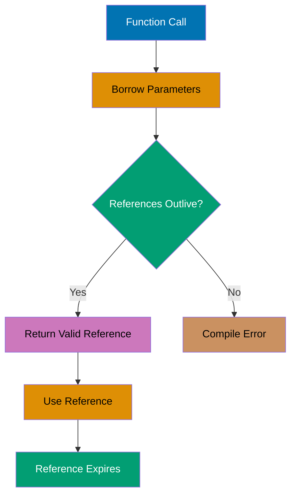
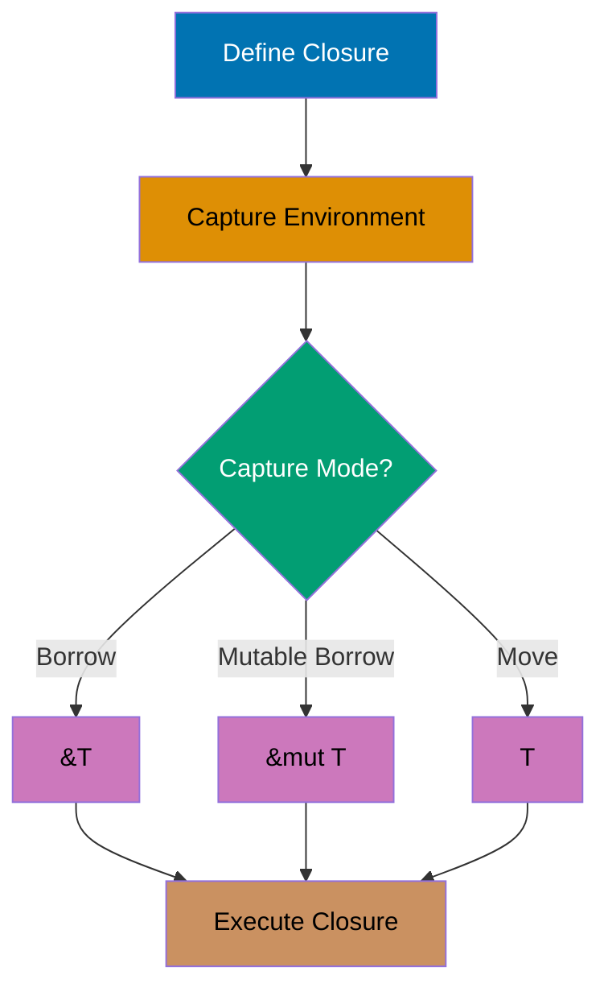
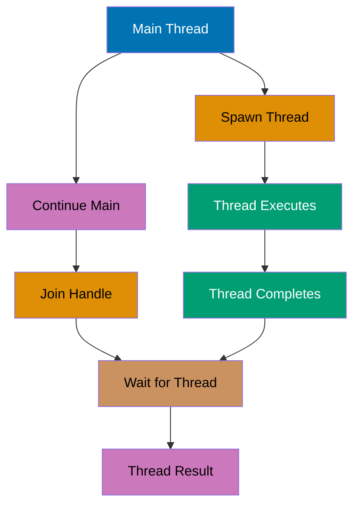
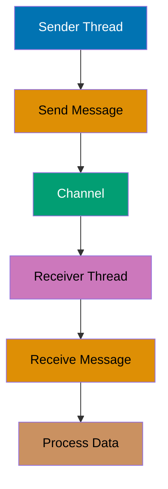

## Intermediate Level: Production Patterns

Examples 29-57 cover production patterns and idiomatic Rust (40-75% coverage). You'll master lifetimes, traits, generics, iterators, closures, smart pointers, and concurrent programming.

---

### Example 29: Lifetime Annotations Basics

Lifetimes ensure references remain valid by tracking how long borrowed data lives. Lifetime annotations explicitly connect input and output reference lifetimes.



```rust
fn longest<'a>(x: &'a str, y: &'a str) -> &'a str {
                                     // => 'a means x, y, and return have same lifetime
    if x.len() > y.len() {
        x                            // => Return x (valid as long as 'a)
    } else {
        y                            // => Return y (valid as long as 'a)
    }
}

fn main() {
    let string1 = String::from("long string");
                                     // => string1 owns "long string"
    let result;                      // => result declared but not initialized
    {
        let string2 = String::from("xyz");
                                     // => string2 owns "xyz"
        result = longest(string1.as_str(), string2.as_str());
                                     // => result borrows from shorter lifetime
    }                                // => string2 dropped, result now invalid!
    // println!("{}", result);       // => ERROR: string2 doesn't live long enough
}
```

**Key Takeaway**: Lifetime annotations (`'a`) tell the compiler how long references must remain valid, enabling it to prevent dangling references at compile time without runtime overhead.

---

### Example 30: Lifetime Elision Rules

Rust infers lifetimes in common patterns through elision rules, eliminating explicit annotations when the relationship is unambiguous.

```rust
// Explicit lifetimes
fn first_word_explicit<'a>(s: &'a str) -> &'a str {
    let bytes = s.as_bytes();        // => Borrow s as bytes
    for (i, &byte) in bytes.iter().enumerate() {
        if byte == b' ' {
            return &s[..i];          // => Return slice to first word
        }
    }
    &s[..]                           // => Return entire string if no space
}

// Elided lifetimes (compiler infers)
fn first_word(s: &str) -> &str {     // => Same as first_word_explicit
    let bytes = s.as_bytes();
    for (i, &byte) in bytes.iter().enumerate() {
        if byte == b' ' {
            return &s[..i];
        }
    }
    &s[..]
}

fn main() {
    let s = String::from("hello world");
    let word = first_word(&s);       // => word is "hello"
    println!("{}", word);            // => Output: hello
}
```

**Key Takeaway**: Rust's lifetime elision rules automatically infer lifetimes for common patterns (single input reference, method self), reducing annotation burden while maintaining safety guarantees.

---

### Example 31: Struct Lifetimes

Structs holding references need lifetime annotations to ensure referenced data outlives the struct instance.

```rust
struct ImportantExcerpt<'a> {
    part: &'a str,                   // => part references data with lifetime 'a
}

impl<'a> ImportantExcerpt<'a> {
    fn level(&self) -> i32 {         // => Lifetime elided (self reference)
        3
    }

    fn announce_and_return_part(&self, announcement: &str) -> &str {
                                     // => Return lifetime tied to self, not announcement
        println!("Attention: {}", announcement);
        self.part                    // => Return reference from self
    }
}

fn main() {
    let novel = String::from("Call me Ishmael. Some years ago...");
                                     // => novel owns full text
    let first_sentence = novel.split('.').next().expect("No sentence");
                                     // => first_sentence borrows from novel
    let excerpt = ImportantExcerpt {
        part: first_sentence,        // => excerpt.part borrows from novel
    };                               // => excerpt lifetime tied to novel

    println!("Excerpt: {}", excerpt.part);
                                     // => Output: Excerpt: Call me Ishmael
}                                    // => excerpt and novel dropped together
```

**Key Takeaway**: Structs storing references require lifetime parameters to ensure the struct doesn't outlive the data it borrows, preventing dangling references in struct fields.

---

### Example 32: Static Lifetime

The `'static` lifetime indicates references valid for the entire program duration, typically for string literals stored in the binary.

```rust
fn main() {
    let s: &'static str = "I have a static lifetime";
                                     // => s references data in binary (lives forever)
    println!("{}", s);               // => Output: I have a static lifetime

    // Use with caution - most references don't need 'static
    let static_string: &'static str = "fixed";
                                     // => Lives entire program
}

// Function accepting any lifetime OR static
fn longest_with_announcement<'a>(x: &'a str, y: &'a str, ann: &str) -> &'a str {
                                     // => ann can have any lifetime
    println!("Announcement: {}", ann);
    if x.len() > y.len() { x } else { y }
}
```

**Key Takeaway**: The `'static` lifetime marks references valid for the program's entire duration (like string literals), but it's rarely needed and often indicates overly restrictive lifetime constraints.

---

### Example 33: Traits Basics

Traits define shared behavior across types, similar to interfaces. Types implement traits to gain functionality and enable polymorphism.

```rust
trait Summary {
    fn summarize(&self) -> String;   // => Method signature (no implementation)
}

struct NewsArticle {
    headline: String,
    content: String,
}

impl Summary for NewsArticle {
    fn summarize(&self) -> String {  // => Implement trait method
        format!("{}: {}", self.headline, self.content)
    }
}

struct Tweet {
    username: String,
    content: String,
}

impl Summary for Tweet {
    fn summarize(&self) -> String {
        format!("@{}: {}", self.username, self.content)
    }
}

fn main() {
    let article = NewsArticle {
        headline: String::from("Breaking News"),
        content: String::from("Something happened"),
    };
    println!("{}", article.summarize());
                                     // => Output: Breaking News: Something happened

    let tweet = Tweet {
        username: String::from("user123"),
        content: String::from("Hello world"),
    };
    println!("{}", tweet.summarize());
                                     // => Output: @user123: Hello world
}
```

**Key Takeaway**: Traits enable polymorphism by defining shared method signatures that multiple types can implement differently, allowing generic code to work with any type implementing the trait.

---

### Example 34: Default Trait Implementations

Traits can provide default method implementations that types can use or override, reducing boilerplate for common patterns.

```rust
trait Summary {
    fn summarize_author(&self) -> String;

    fn summarize(&self) -> String {  // => Default implementation
        format!("(Read more from {}...)", self.summarize_author())
    }
}

struct Tweet {
    username: String,
    content: String,
}

impl Summary for Tweet {
    fn summarize_author(&self) -> String {
        format!("@{}", self.username)
    }                                // => Use default summarize(), override author
}

fn main() {
    let tweet = Tweet {
        username: String::from("user123"),
        content: String::from("Hello"),
    };
    println!("{}", tweet.summarize());
                                     // => Output: (Read more from @user123...)
}
```

**Key Takeaway**: Default trait implementations reduce code duplication by providing common behavior that types can inherit or override, enabling flexible trait-based abstraction.

---

### Example 35: Trait Bounds

Generic functions can require types to implement specific traits using trait bounds, enabling operations only valid for those traits.

```rust
trait Summary {
    fn summarize(&self) -> String;
}

struct Article { title: String }

impl Summary for Article {
    fn summarize(&self) -> String {
        self.title.clone()
    }
}

// Trait bound: T must implement Summary
fn notify<T: Summary>(item: &T) {    // => T must implement Summary trait
    println!("News: {}", item.summarize());
}

// Multiple trait bounds with +
fn notify_display<T: Summary + std::fmt::Display>(item: &T) {
                                     // => T must implement both traits
    println!("{}", item);
}

// where clause for complex bounds
fn complex<T, U>(t: &T, u: &U) -> String
where
    T: Summary + Clone,              // => T implements Summary and Clone
    U: Summary,                      // => U implements Summary
{
    format!("{} - {}", t.summarize(), u.summarize())
}

fn main() {
    let article = Article { title: String::from("Rust") };
    notify(&article);                // => Output: News: Rust
}
```

**Key Takeaway**: Trait bounds constrain generic types to those implementing specific traits, enabling type-safe generic functions that can call trait methods while maintaining compile-time verification.

---

### Example 36: Generics with Structs and Enums

Structs and enums can be generic over types, enabling reusable data structures like `Option<T>` and `Result<T, E>`.

```rust
struct Point<T> {
    x: T,
    y: T,
}

impl<T> Point<T> {
    fn x(&self) -> &T {              // => Method works for any T
        &self.x
    }
}

impl Point<f64> {
    fn distance_from_origin(&self) -> f64 {
                                     // => Method only for Point<f64>
        (self.x.powi(2) + self.y.powi(2)).sqrt()
    }
}

enum Result<T, E> {                  // => Generic over success and error types
    Ok(T),
    Err(E),
}

fn main() {
    let integer_point = Point { x: 5, y: 10 };
                                     // => Point<i32>
    let float_point = Point { x: 1.0, y: 4.0 };
                                     // => Point<f64>

    println!("x: {}", integer_point.x());
                                     // => Output: x: 5
    println!("Distance: {}", float_point.distance_from_origin());
                                     // => Output: Distance: 4.123105625617661
}
```

**Key Takeaway**: Generic structs and enums enable type-safe reusable data structures, while specialized `impl` blocks can provide type-specific methods for particular generic instantiations.

---

### Example 37: Iterator Trait

Iterators enable sequential processing of collections through the `Iterator` trait, which requires implementing `next()` method.

```rust
fn main() {
    let v = vec![1, 2, 3];           // => v is [1, 2, 3]

    let mut iter = v.iter();         // => iter borrows elements immutably
    println!("{:?}", iter.next());   // => Output: Some(1)
    println!("{:?}", iter.next());   // => Output: Some(2)
    println!("{:?}", iter.next());   // => Output: Some(3)
    println!("{:?}", iter.next());   // => Output: None

    // Consuming adaptors
    let v2 = vec![1, 2, 3, 4];
    let sum: i32 = v2.iter().sum();  // => sum is 10
    println!("Sum: {}", sum);        // => Output: Sum: 10

    // Iterator adaptors
    let v3: Vec<i32> = vec![1, 2, 3]
        .iter()
        .map(|x| x + 1)              // => Transform each element
        .collect();                  // => Collect into Vec
    println!("{:?}", v3);            // => Output: [2, 3, 4]
}
```

**Key Takeaway**: The `Iterator` trait enables lazy, composable data transformations through methods like `map()`, `filter()`, and `fold()`, providing zero-cost abstractions over collection processing.

---

### Example 38: Closures Basics

Closures are anonymous functions that capture their environment, enabling functional programming patterns and callbacks.



```rust
fn main() {
    let x = 4;                       // => x is 4

    // Closure capturing x by immutable borrow
    let equal_to_x = |z| z == x;     // => Closure captures x
    let y = 4;
    println!("{}", equal_to_x(y));   // => Output: true

    // Closure with type annotations
    let add_one = |num: i32| -> i32 { num + 1 };
    println!("{}", add_one(5));      // => Output: 6

    // Closure capturing by mutable borrow
    let mut list = vec![1, 2, 3];
    let mut add_to_list = || list.push(4);
                                     // => Captures list mutably
    add_to_list();                   // => list is now [1, 2, 3, 4]
    println!("{:?}", list);          // => Output: [1, 2, 3, 4]

    // move keyword forces ownership transfer
    let consume = move || println!("{:?}", list);
                                     // => list moved into closure
    consume();                       // => Output: [1, 2, 3, 4]
    // println!("{:?}", list);       // => ERROR: list moved
}
```

**Key Takeaway**: Closures capture environment variables automatically (by borrow, mutable borrow, or move), providing flexible anonymous functions for callbacks, iterators, and functional programming patterns.

---

### Example 39: Closure Type Inference

Closures have unique anonymous types inferred from usage, implementing `Fn`, `FnMut`, or `FnOnce` traits based on how they capture variables.

```rust
fn main() {
    // Compiler infers closure types
    let add = |x, y| x + y;          // => Type inferred from usage
    println!("{}", add(1, 2));       // => Output: 3
    // println!("{}", add(1.0, 2.0)); // => ERROR: type already inferred as integers

    // FnOnce: consumes captured variables
    let consume_list = || {
        let list = vec![1, 2, 3];
        list                         // => Return list (move)
    };
    let list = consume_list();       // => list is [1, 2, 3]
    // consume_list();               // => ERROR: closure already called

    // FnMut: mutates captured variables
    let mut count = 0;
    let mut increment = || count += 1;
                                     // => Captures count mutably
    increment();
    increment();
    println!("Count: {}", count);    // => Output: Count: 2

    // Fn: borrows immutably
    let message = String::from("Hello");
    let print = || println!("{}", message);
                                     // => Captures message immutably
    print();                         // => Output: Hello
    print();                         // => Can call multiple times
    println!("{}", message);         // => message still accessible
}
```

**Key Takeaway**: Closures automatically implement `Fn`, `FnMut`, or `FnOnce` traits based on how they capture and use environment variables, with the compiler inferring the most restrictive trait possible.

---

### Example 40: Iterator Methods

Iterator methods enable declarative data processing with methods like `map()`, `filter()`, `fold()`, and `collect()`.

```rust
fn main() {
    let numbers = vec![1, 2, 3, 4, 5];

    // map: transform elements
    let doubled: Vec<i32> = numbers.iter()
        .map(|x| x * 2)              // => [2, 4, 6, 8, 10]
        .collect();
    println!("{:?}", doubled);       // => Output: [2, 4, 6, 8, 10]

    // filter: select elements
    let evens: Vec<&i32> = numbers.iter()
        .filter(|x| *x % 2 == 0)     // => [2, 4]
        .collect();
    println!("{:?}", evens);         // => Output: [2, 4]

    // fold: accumulate
    let sum = numbers.iter()
        .fold(0, |acc, x| acc + x);  // => 0 + 1 + 2 + 3 + 4 + 5 = 15
    println!("Sum: {}", sum);        // => Output: Sum: 15

    // Method chaining
    let result: i32 = numbers.iter()
        .filter(|x| *x % 2 == 0)     // => [2, 4]
        .map(|x| x * x)              // => [4, 16]
        .sum();                      // => 20
    println!("Result: {}", result);  // => Output: Result: 20
}
```

**Key Takeaway**: Iterator methods provide composable, lazy data transformations that compile to efficient loops, enabling functional programming style without performance penalty.

---

### Example 41: Box Smart Pointer

`Box<T>` allocates data on the heap with single ownership, enabling recursive types and trait objects.

```rust
fn main() {
    let b = Box::new(5);             // => b owns 5 on heap
    println!("b = {}", b);           // => Output: b = 5
}                                    // => b dropped, heap memory freed

// Recursive type (requires Box)
enum List {
    Cons(i32, Box<List>),            // => Box breaks infinite size
    Nil,
}

use List::{Cons, Nil};

fn main() {
    let list = Cons(1, Box::new(Cons(2, Box::new(Cons(3, Box::new(Nil))))));
                                     // => Linked list: 1 -> 2 -> 3 -> Nil
    // Pattern matching on recursive structure
    match list {
        Cons(head, _) => println!("First: {}", head),
                                     // => Output: First: 1
        Nil => println!("Empty"),
    }
}
```

**Key Takeaway**: `Box<T>` provides heap allocation with unique ownership, enabling recursive data structures and fixed-size types that wrap dynamic data.

---

### Example 42: Rc Smart Pointer

`Rc<T>` (Reference Counted) enables multiple ownership through runtime reference counting, useful for shared read-only data.

```rust
use std::rc::Rc;

fn main() {
    let a = Rc::new(5);              // => a owns 5, ref count = 1
    println!("Count: {}", Rc::strong_count(&a));
                                     // => Output: Count: 1

    let b = Rc::clone(&a);           // => b shares ownership, ref count = 2
    println!("Count: {}", Rc::strong_count(&a));
                                     // => Output: Count: 2

    {
        let c = Rc::clone(&a);       // => c shares ownership, ref count = 3
        println!("Count: {}", Rc::strong_count(&a));
                                     // => Output: Count: 3
    }                                // => c dropped, ref count = 2

    println!("Count: {}", Rc::strong_count(&a));
                                     // => Output: Count: 2
}                                    // => a and b dropped, value freed when count = 0
```

**Key Takeaway**: `Rc<T>` enables multiple ownership through runtime reference counting for read-only shared data, automatically freeing memory when the last reference is dropped.

---

### Example 43: RefCell and Interior Mutability

`RefCell<T>` enables interior mutability through runtime borrow checking, allowing mutation of data behind shared references.

```rust
use std::cell::RefCell;

fn main() {
    let value = RefCell::new(5);     // => value owns RefCell containing 5

    // Borrow immutably
    {
        let borrowed = value.borrow();
                                     // => borrowed is Ref<i32>
        println!("Value: {}", *borrowed);
                                     // => Output: Value: 5
    }                                // => Borrow ends

    // Borrow mutably
    {
        let mut borrowed_mut = value.borrow_mut();
                                     // => borrowed_mut is RefMut<i32>
        *borrowed_mut += 10;         // => Modify through mutable borrow
    }                                // => Mutable borrow ends

    println!("New value: {}", *value.borrow());
                                     // => Output: New value: 15

    // Runtime borrow check violation
    let _borrow1 = value.borrow();
    // let _borrow2 = value.borrow_mut();
                                     // => PANIC: already borrowed
}
```

**Key Takeaway**: `RefCell<T>` moves borrow checking from compile time to runtime, enabling interior mutability patterns like mutation through shared references, with panics on borrow rule violations.

---

### Example 44: Rc and RefCell Combined

Combining `Rc<RefCell<T>>` enables multiple ownership of mutable data, a common pattern for shared mutable state.

```rust
use std::cell::RefCell;
use std::rc::Rc;

fn main() {
    let value = Rc::new(RefCell::new(5));
                                     // => Multiple ownership of mutable data

    let a = Rc::clone(&value);       // => a shares ownership
    let b = Rc::clone(&value);       // => b shares ownership

    *a.borrow_mut() += 10;           // => Modify through a: 15
    *b.borrow_mut() += 20;           // => Modify through b: 35

    println!("Value: {}", *value.borrow());
                                     // => Output: Value: 35
}
```

**Key Takeaway**: `Rc<RefCell<T>>` combines multiple ownership with interior mutability, enabling shared mutable state patterns while maintaining memory safety through runtime borrow checking.

---

### Example 45: Thread Basics

Threads enable concurrent execution through `std::thread::spawn`, which takes a closure and returns a `JoinHandle`.



```rust
use std::thread;
use std::time::Duration;

fn main() {
    let handle = thread::spawn(|| {  // => Spawn new thread
        for i in 1..5 {
            println!("Thread: {}", i);
            thread::sleep(Duration::from_millis(1));
        }
    });                              // => Thread executes concurrently

    for i in 1..3 {                  // => Main thread continues
        println!("Main: {}", i);
        thread::sleep(Duration::from_millis(1));
    }

    handle.join().unwrap();          // => Wait for spawned thread to finish
    println!("Thread completed");    // => Output after thread joins
}
```

**Key Takeaway**: `thread::spawn()` creates OS threads for concurrent execution, with `join()` blocking until thread completion, enabling parallelism while preventing data races through Rust's ownership system.

---

### Example 46: Move Semantics with Threads

Threads require ownership of captured variables through `move` closures to prevent data races across thread boundaries.

```rust
use std::thread;

fn main() {
    let v = vec![1, 2, 3];           // => v owns vector

    let handle = thread::spawn(move || {
                                     // => move transfers v ownership to thread
        println!("Vector: {:?}", v); // => Output: Vector: [1, 2, 3]
    });

    // println!("{:?}", v);          // => ERROR: v moved into thread

    handle.join().unwrap();
}
```

**Key Takeaway**: Threads require `move` closures to transfer ownership of captured variables, preventing data races by ensuring only one thread can access non-thread-safe data at a time.

---

### Example 47: Message Passing with Channels

Channels enable safe message passing between threads through `mpsc` (multiple producer, single consumer) channels.



```rust
use std::sync::mpsc;
use std::thread;

fn main() {
    let (tx, rx) = mpsc::channel();  // => Create channel: tx (sender), rx (receiver)

    thread::spawn(move || {          // => Spawn sender thread
        let messages = vec![
            String::from("hello"),
            String::from("from"),
            String::from("thread"),
        ];
        for msg in messages {
            tx.send(msg).unwrap();   // => Send message through channel
        }
    });                              // => tx dropped, channel closed

    for received in rx {             // => Iterate over received messages
        println!("Got: {}", received);
                                     // => Output: Got: hello, Got: from, Got: thread
    }
}
```

**Key Takeaway**: Channels provide safe message passing between threads with `send()` and `recv()` methods, transferring ownership of messages to prevent data races and enable concurrent communication.

---

### Example 48: Shared State with Mutex

`Mutex<T>` enables shared mutable state across threads through mutual exclusion locks, ensuring only one thread accesses data at a time.

```rust
use std::sync::Mutex;
use std::thread;

fn main() {
    let counter = Mutex::new(0);     // => counter wraps 0 in mutex
    let mut handles = vec![];

    for _ in 0..10 {
        let handle = thread::spawn(move || {
            let mut num = counter.lock().unwrap();
                                     // => Acquire lock, blocks if held
            *num += 1;               // => Increment counter
        });                          // => Lock released when num dropped
        // ERROR: counter moved in first iteration
        handles.push(handle);
    }

    // This doesn't work - need Arc<Mutex<T>>
}
```

**Key Takeaway**: `Mutex<T>` provides interior mutability for thread-safe shared state through lock acquisition, but requires `Arc` for multiple ownership across threads.

---

### Example 49: Arc and Mutex Combined

`Arc<Mutex<T>>` combines atomic reference counting with mutual exclusion, enabling thread-safe shared mutable state.

```rust
use std::sync::{Arc, Mutex};
use std::thread;

fn main() {
    let counter = Arc::new(Mutex::new(0));
                                     // => Atomic reference counted mutex
    let mut handles = vec![];

    for _ in 0..10 {
        let counter = Arc::clone(&counter);
                                     // => Clone Arc (not inner data)
        let handle = thread::spawn(move || {
            let mut num = counter.lock().unwrap();
                                     // => Acquire lock
            *num += 1;               // => Increment counter safely
        });                          // => Lock released
        handles.push(handle);
    }

    for handle in handles {
        handle.join().unwrap();      // => Wait for all threads
    }

    println!("Result: {}", *counter.lock().unwrap());
                                     // => Output: Result: 10
}
```

**Key Takeaway**: `Arc<Mutex<T>>` enables safe shared mutable state across threads by combining atomic reference counting for multiple ownership with mutex locks for synchronized access.

---

### Example 50: Send and Sync Traits

`Send` and `Sync` marker traits ensure types are safe to transfer or share across threads, with compiler enforcing thread safety.

```rust
use std::rc::Rc;
use std::sync::Arc;

fn main() {
    // Arc<T> is Send + Sync (thread-safe)
    let arc = Arc::new(5);
    std::thread::spawn(move || {     // => OK: Arc is Send
        println!("{}", arc);
    }).join().unwrap();

    // Rc<T> is NOT Send (not thread-safe)
    let rc = Rc::new(5);
    // std::thread::spawn(move || {  // => ERROR: Rc is not Send
    //     println!("{}", rc);
    // });
}

// Send: type can be transferred to another thread
// Sync: type can be shared between threads (via &T)
// Most types are Send + Sync automatically
```

**Key Takeaway**: `Send` and `Sync` marker traits automatically enforced by the compiler prevent data races by ensuring only thread-safe types can cross thread boundaries or be shared concurrently.

---

### Example 51: Error Propagation Patterns

Combining `Result`, `?` operator, and custom error types enables robust error handling in production code.

```rust
use std::fs::File;
use std::io::{self, Read};

fn read_file_to_string(path: &str) -> Result<String, io::Error> {
    let mut file = File::open(path)?;// => Propagate error if open fails
    let mut contents = String::new();
    file.read_to_string(&mut contents)?;
                                     // => Propagate error if read fails
    Ok(contents)                     // => Return success
}

fn main() {
    match read_file_to_string("hello.txt") {
        Ok(contents) => println!("File contents:\n{}", contents),
        Err(e) => eprintln!("Error reading file: {}", e),
                                     // => Output: Error reading file: ...
    }
}
```

**Key Takeaway**: The `?` operator combined with `Result<T, E>` provides concise error propagation, enabling clean error handling chains while maintaining explicit error types in function signatures.

---

### Example 52: Custom Error Types

Custom error types with `std::error::Error` trait enable domain-specific error handling with rich context.

```rust
use std::fmt;

#[derive(Debug)]
enum AppError {
    Io(std::io::Error),
    Parse(std::num::ParseIntError),
    Custom(String),
}

impl fmt::Display for AppError {
    fn fmt(&self, f: &mut fmt::Formatter) -> fmt::Result {
        match self {
            AppError::Io(e) => write!(f, "IO error: {}", e),
            AppError::Parse(e) => write!(f, "Parse error: {}", e),
            AppError::Custom(s) => write!(f, "Error: {}", s),
        }
    }
}

impl std::error::Error for AppError {}

impl From<std::io::Error> for AppError {
    fn from(error: std::io::Error) -> Self {
        AppError::Io(error)          // => Auto-convert io::Error
    }
}

fn process() -> Result<i32, AppError> {
    let content = std::fs::read_to_string("number.txt")?;
                                     // => Auto-converts io::Error to AppError
    let number: i32 = content.trim().parse()
        .map_err(|e| AppError::Parse(e))?;
                                     // => Convert parse error
    Ok(number * 2)
}

fn main() {
    match process() {
        Ok(n) => println!("Result: {}", n),
        Err(e) => eprintln!("{}", e),
    }
}
```

**Key Takeaway**: Custom error types implementing `Error` trait and `From` conversions enable type-safe error handling with automatic error type conversions through the `?` operator.

---

### Example 53: Panic and Unwinding

`panic!` aborts execution for unrecoverable errors, unwinding the stack and running destructors unless compiled with `panic=abort`.

```rust
fn main() {
    let v = vec![1, 2, 3];

    // Panic with custom message
    if v.len() < 5 {
        panic!("Vector too small: {}", v.len());
                                     // => Panics: Vector too small: 3
    }

    // Index out of bounds panics
    // let item = v[10];             // => Panics: index out of bounds

    // Use Result for recoverable errors
    match v.get(10) {
        Some(item) => println!("Item: {}", item),
        None => println!("No item"),
                                     // => Output: No item
    }
}
```

**Key Takeaway**: Use `panic!` for unrecoverable errors that indicate bugs, while `Result<T, E>` handles recoverable errors, with panics triggering stack unwinding and cleanup unless disabled.

---

### Example 54: Testing Basics

Rust's built-in test framework uses `#[test]` attribute and `cargo test` command for unit and integration tests.

```rust
pub fn add(a: i32, b: i32) -> i32 {
    a + b
}

pub fn divide(a: i32, b: i32) -> Result<i32, String> {
    if b == 0 {
        Err(String::from("Division by zero"))
    } else {
        Ok(a / b)
    }
}

#[cfg(test)]
mod tests {
    use super::*;

    #[test]
    fn test_add() {
        assert_eq!(add(2, 3), 5);    // => Test passes if equal
    }

    #[test]
    fn test_divide_success() {
        assert_eq!(divide(10, 2), Ok(5));
    }

    #[test]
    fn test_divide_by_zero() {
        assert!(divide(10, 0).is_err());
                                     // => Test passes if Err
    }

    #[test]
    #[should_panic(expected = "assertion failed")]
    fn test_panic() {
        assert_eq!(1, 2);            // => Panics, test passes
    }
}
```

**Key Takeaway**: Rust's test framework enables unit testing with `#[test]` attribute, assertions (`assert!`, `assert_eq!`), and panic testing with `#[should_panic]`, integrated with `cargo test`.

---

### Example 55: Documentation Tests

Documentation examples in `///` comments are automatically tested, ensuring documentation stays accurate.

````rust
/// Adds two numbers together.
///
/// # Examples
///
/// ```
/// let result = intermediate_example::add(2, 3);
/// assert_eq!(result, 5);
/// ```
pub fn add(a: i32, b: i32) -> i32 {
    a + b
}

/// Divides two numbers.
///
/// # Errors
///
/// Returns `Err` if divisor is zero.
///
/// # Examples
///
/// ```
/// let result = intermediate_example::divide(10, 2).unwrap();
/// assert_eq!(result, 5);
/// ```
pub fn divide(a: i32, b: i32) -> Result<i32, String> {
    if b == 0 {
        Err(String::from("Division by zero"))
    } else {
        Ok(a / b)
    }
}

// Run with: cargo test --doc
````

**Key Takeaway**: Documentation examples in `///` comments are automatically tested by `cargo test --doc`, ensuring documentation remains accurate and providing usage examples.

---

### Example 56: Common Traits (Debug, Clone, Copy)

Deriving common traits reduces boilerplate for types needing debug printing, cloning, or copy semantics.

```rust
#[derive(Debug, Clone, Copy)]       // => Auto-implement traits
struct Point {
    x: i32,
    y: i32,
}

#[derive(Debug, Clone)]              // => Can't derive Copy (contains String)
struct Person {
    name: String,
    age: u32,
}

fn main() {
    let p1 = Point { x: 1, y: 2 };
    let p2 = p1;                     // => Copy (not move)
    println!("{:?}", p1);            // => Output: Point { x: 1, y: 2 }
    println!("{:?}", p2);            // => Output: Point { x: 1, y: 2 }

    let person1 = Person {
        name: String::from("Alice"),
        age: 30,
    };
    let person2 = person1.clone();   // => Deep clone
    println!("{:?}", person1);       // => Output: Person { name: "Alice", age: 30 }
    println!("{:?}", person2);       // => Output: Person { name: "Alice", age: 30 }
}
```

**Key Takeaway**: Derive macros automatically implement common traits like `Debug` (formatting), `Clone` (deep copy), and `Copy` (stack copy), reducing boilerplate while maintaining correctness.

---

### Example 57: PartialEq and Eq Traits

`PartialEq` enables equality comparison (`==`, `!=`), while `Eq` marks types with reflexive equality (a == a always true).

```rust
#[derive(Debug, PartialEq)]          // => Auto-implement == and !=
struct Point {
    x: i32,
    y: i32,
}

fn main() {
    let p1 = Point { x: 1, y: 2 };
    let p2 = Point { x: 1, y: 2 };
    let p3 = Point { x: 2, y: 3 };

    println!("{}", p1 == p2);        // => Output: true
    println!("{}", p1 == p3);        // => Output: false
    println!("{}", p1 != p3);        // => Output: true
}

// Manual implementation
struct CustomPoint {
    x: i32,
    y: i32,
}

impl PartialEq for CustomPoint {
    fn eq(&self, other: &Self) -> bool {
        self.x == other.x && self.y == other.y
    }
}
```

**Key Takeaway**: `PartialEq` enables equality comparison for custom types through `==` and `!=` operators, with derive macro providing automatic field-by-field comparison or manual implementation for custom logic.

---

## Summary

You've completed 29 intermediate examples covering production patterns (40-75% coverage):

- **Lifetimes** (Examples 29-32): Annotations, elision, struct lifetimes, static lifetime
- **Traits** (Examples 33-36): Definitions, defaults, bounds, generics with traits
- **Iterators and closures** (Examples 37-40): Iterator trait, closure capture modes, iterator methods
- **Smart pointers** (Examples 41-44): Box, Rc, RefCell, interior mutability
- **Concurrency** (Examples 45-50): Threads, channels, Mutex, Arc, Send/Sync
- **Error handling** (Examples 51-53): Propagation, custom errors, panic
- **Testing and traits** (Examples 54-57): Testing, documentation tests, common traits

**Next Steps**: Continue to [Advanced](/en/learn/software-engineering/programming-languages/rust/tutorials/by-example/advanced) (Examples 58-85) for unsafe code, macros, async/await, and performance optimization.

**Key Insight**: Mastering traits, lifetimes, and smart pointers unlocks Rust's full power for building safe, concurrent systems with zero-cost abstractions.
