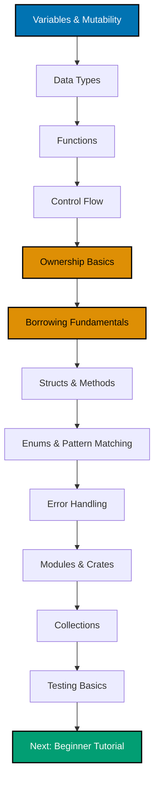
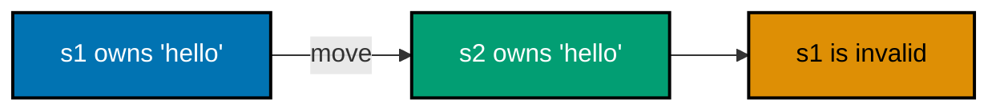

**Want to get productive with Rust fast?** This quick start teaches you 12 essential Rust concepts through focused touchpoint examples, giving you a rapid tour from variables to testing.

## Coverage

This tutorial covers **5-30%** of Rust knowledge - enough to read Rust code and write simple programs.

## Prerequisites

- [Initial Setup](/en/learn/software-engineering/programming-languages/rust/tutorials/initial-setup) complete (Rust installed and working)
- Basic programming knowledge helpful but not required

## Learning Outcomes

By the end of this tutorial, you will:

- Understand Rust's variable binding and mutability model
- Work with Rust's type system (scalar and compound types)
- Write functions following Rust's expression-oriented style
- Use control flow constructs (if, loop, while, for, match)
- **Grasp ownership basics** (move semantics and copy trait)
- **Understand borrowing fundamentals** (immutable and mutable references)
- Define and use structs with methods
- Work with enums and pattern matching
- Handle errors with Result and Option
- Organize code with modules and crates
- Use common collections (Vec, HashMap, String)
- Write basic tests

This tutorial introduces ownership and borrowing gently. For comprehensive coverage, see the [Beginner tutorial](/en/learn/software-engineering/programming-languages/rust/tutorials/beginner).

---

## Learning Path



**Color Palette**: Blue (#0173B2 - fundamentals), Orange (#DE8F05 - ownership concepts), Teal (#029E73 - next step)

**Estimated completion**: Read at your own pace. Focus on understanding concepts, not speed.

---

## Touchpoint 1: Variables and Mutability

Rust variables are **immutable by default** - they cannot be changed after binding.

### Immutable Variables

```rust
fn main() {
    let x = 5;
    println!("The value of x is: {}", x);

    // This would cause compilation error:
    // x = 6;  // error: cannot assign twice to immutable variable
}
```

**Key insight**: Immutability by default prevents accidental mutations and makes code easier to reason about.

### Mutable Variables

Use `mut` keyword to make variables mutable:

```rust
fn main() {
    let mut x = 5;
    println!("The value of x is: {}", x);

    x = 6;  // ✅ Allowed because x is mutable
    println!("The value of x is: {}", x);
}
```

**Output**:

```
The value of x is: 5
The value of x is: 6
```

### Shadowing

You can declare a new variable with the same name:

```rust
fn main() {
    let x = 5;
    let x = x + 1;  // Shadows previous x

    {
        let x = x * 2;  // Shadows again in inner scope
        println!("The value of x in inner scope is: {}", x);  // 12
    }

    println!("The value of x is: {}", x);  // 6
}
```

**Shadowing vs mutation**:

- Shadowing creates a new variable (can change type)
- Mutation changes existing variable (type must stay same)

### Constants

```rust
const THREE_HOURS_IN_SECONDS: u32 = 60 * 60 * 3;

fn main() {
    println!("Three hours: {} seconds", THREE_HOURS_IN_SECONDS);
}
```

**Constants vs immutable variables**:

- Constants: Always immutable, global scope allowed, must be type-annotated
- Immutable variables: Can be shadowed, local scope, type often inferred

**Takeaway**: Rust defaults to immutability for safety. Use `mut` only when needed.

---

## Touchpoint 2: Data Types

Rust is **statically typed** - all types known at compile time.

### Scalar Types

#### Integers

```rust
fn main() {
    let a: i32 = 42;        // Signed 32-bit
    let b: u64 = 1000;      // Unsigned 64-bit
    let c = 10;             // i32 by default

    println!("a: {}, b: {}, c: {}", a, b, c);
}
```

**Integer types**: `i8`, `i16`, `i32`, `i64`, `i128`, `isize` (signed) and `u8`, `u16`, `u32`, `u64`, `u128`, `usize` (unsigned)

#### Floating-Point

```rust
fn main() {
    let x = 2.0;      // f64 by default
    let y: f32 = 3.0; // f32

    println!("x: {}, y: {}", x, y);
}
```

**Float types**: `f32` (single-precision), `f64` (double-precision)

#### Boolean

```rust
fn main() {
    let t = true;
    let f: bool = false;

    println!("t: {}, f: {}", t, f);
}
```

#### Character

```rust
fn main() {
    let c = 'z';
    let z: char = 'ℤ';
    let heart = '💙';

    println!("c: {}, z: {}, heart: {}", c, z, heart);
}
```

**Note**: `char` represents a Unicode Scalar Value (4 bytes), not just ASCII.

### Compound Types

#### Tuples

```rust
fn main() {
    let tup: (i32, f64, u8) = (500, 6.4, 1);

    // Destructuring
    let (x, y, z) = tup;
    println!("x: {}, y: {}, z: {}", x, y, z);

    // Direct access
    println!("First: {}", tup.0);
    println!("Second: {}", tup.1);
}
```

#### Arrays

```rust
fn main() {
    let a = [1, 2, 3, 4, 5];
    let months = ["January", "February", "March"];

    // Array with type annotation and length
    let b: [i32; 5] = [1, 2, 3, 4, 5];

    // Initialize array with same value
    let c = [3; 5];  // [3, 3, 3, 3, 3]

    println!("First element: {}", a[0]);
    println!("Array length: {}", a.len());
}
```

**Arrays vs Vectors**:

- Arrays: Fixed length, stack allocated
- Vectors: Dynamic length, heap allocated (covered in Touchpoint 11)

**Takeaway**: Rust's type system prevents many common bugs at compile time.

---

## Touchpoint 3: Functions

Functions are defined with `fn` keyword.

### Basic Function

```rust
fn main() {
    println!("Hello, world!");

    another_function();
}

fn another_function() {
    println!("Another function.");
}
```

### Parameters

```rust
fn main() {
    print_labeled_measurement(5, 'h');
}

fn print_labeled_measurement(value: i32, unit_label: char) {
    println!("The measurement is: {}{}", value, unit_label);
}
```

**Note**: Parameter types must be explicitly declared.

### Return Values

Rust is **expression-oriented** - the last expression is returned implicitly:

```rust
fn five() -> i32 {
    5  // No semicolon - this is an expression
}

fn plus_one(x: i32) -> i32 {
    x + 1  // Returns x + 1
}

fn main() {
    let x = five();
    println!("The value of x is: {}", x);

    let y = plus_one(5);
    println!("The value of y is: {}", y);
}
```

**Expressions vs Statements**:

```rust
fn main() {
    let y = {
        let x = 3;
        x + 1  // Expression (no semicolon) - returns 4
    };

    println!("The value of y is: {}", y);  // 4
}
```

**Takeaway**: Expressions return values, statements don't. Final expression in function is return value.

---

## Touchpoint 4: Control Flow

### if Expressions

```rust
fn main() {
    let number = 6;

    if number % 4 == 0 {
        println!("number is divisible by 4");
    } else if number % 3 == 0 {
        println!("number is divisible by 3");
    } else if number % 2 == 0 {
        println!("number is divisible by 2");
    } else {
        println!("number is not divisible by 4, 3, or 2");
    }
}
```

**if as expression** (returns value):

```rust
fn main() {
    let condition = true;
    let number = if condition { 5 } else { 6 };

    println!("The value of number is: {}", number);  // 5
}
```

### loop (Infinite Loop)

```rust
fn main() {
    let mut counter = 0;

    let result = loop {
        counter += 1;

        if counter == 10 {
            break counter * 2;  // break can return value
        }
    };

    println!("The result is: {}", result);  // 20
}
```

### while Loop

```rust
fn main() {
    let mut number = 3;

    while number != 0 {
        println!("{}!", number);
        number -= 1;
    }

    println!("LIFTOFF!!!");
}
```

### for Loop

```rust
fn main() {
    let a = [10, 20, 30, 40, 50];

    for element in a {
        println!("the value is: {}", element);
    }
}
```

**Range syntax**:

```rust
fn main() {
    for number in 1..4 {  // 1, 2, 3 (excludes 4)
        println!("{}!", number);
    }

    for number in 1..=4 {  // 1, 2, 3, 4 (includes 4)
        println!("{}!", number);
    }
}
```

### match Expressions

```rust
fn main() {
    let number = 3;

    match number {
        1 => println!("One!"),
        2 | 3 => println!("Two or Three!"),
        4..=9 => println!("Four through Nine!"),
        _ => println!("Something else!"),
    }
}
```

**match is exhaustive** - all possible cases must be covered.

**Takeaway**: Control flow in Rust is expression-oriented, enabling concise and functional-style code.

---

## Touchpoint 5: Ownership Basics

**Ownership** is Rust's most unique feature - it enables memory safety without garbage collection.

### Ownership Rules

1. Each value has an **owner**
2. There can only be **one owner** at a time
3. When the owner goes **out of scope**, the value is **dropped**

### Move Semantics

```rust
fn main() {
    let s1 = String::from("hello");
    let s2 = s1;  // s1 is moved to s2

    // println!("{}", s1);  // ❌ Error: value borrowed after move
    println!("{}", s2);  // ✅ Works
}
```

**What happened**:



**String is moved** (not copied) when assigned. After the move, `s1` is no longer valid.

**Why?** String data is on the heap. Moving transfers ownership without copying heap data (efficient).

### Copy Trait Types

Simple types implement **Copy trait** - they are copied instead of moved:

```rust
fn main() {
    let x = 5;
    let y = x;  // x is copied (not moved)

    println!("x: {}, y: {}", x, y);  // ✅ Both x and y are valid
}
```

**Types that implement Copy**:

- Integers (`i32`, `u64`, etc.)
- Floats (`f32`, `f64`)
- Booleans (`bool`)
- Characters (`char`)
- Tuples containing only Copy types (e.g., `(i32, i32)`)

**Why move vs copy?** Copy types are small and stack-only. Copying them is cheap. String and other heap types are expensive to copy, so Rust moves them instead.

### Functions and Ownership

```rust
fn main() {
    let s = String::from("hello");

    takes_ownership(s);  // s is moved into function

    // println!("{}", s);  // ❌ Error: value moved

    let x = 5;
    makes_copy(x);  // x is copied

    println!("x: {}", x);  // ✅ Works (x was copied, not moved)
}

fn takes_ownership(some_string: String) {
    println!("{}", some_string);
}  // some_string goes out of scope and is dropped

fn makes_copy(some_integer: i32) {
    println!("{}", some_integer);
}
```

**Takeaway**: Ownership prevents memory bugs (double-free, use-after-free) at compile time. This is Rust's superpower.

**For more depth**: See [Beginner tutorial ownership section](/en/learn/software-engineering/programming-languages/rust/tutorials/beginner#section-5-ownership-system) for comprehensive coverage.

---

## Touchpoint 6: Borrowing Fundamentals

**Borrowing** allows you to reference a value without taking ownership.

### Immutable References

```rust
fn main() {
    let s1 = String::from("hello");

    let len = calculate_length(&s1);  // Borrow s1 (don't move it)

    println!("The length of '{}' is {}.", s1, len);  // s1 still valid
}

fn calculate_length(s: &String) -> usize {
    s.len()
}  // s goes out of scope, but doesn't drop the String (it doesn't own it)
```

**`&s1` creates a reference** to `s1` without taking ownership.


### Mutable References

```rust
fn main() {
    let mut s = String::from("hello");

    change(&mut s);  // Mutable borrow

    println!("{}", s);  // "hello, world"
}

fn change(some_string: &mut String) {
    some_string.push_str(", world");
}
```

**`&mut s` creates a mutable reference** allowing modification.

### Borrowing Rules (Preview)

1. You can have **multiple immutable references** OR **one mutable reference** (not both)
2. References must always be **valid** (no dangling references)

```rust
fn main() {
    let mut s = String::from("hello");

    let r1 = &s;  // ✅ Immutable borrow
    let r2 = &s;  // ✅ Multiple immutable borrows OK
    println!("{} and {}", r1, r2);

    // r1 and r2 are no longer used after this point

    let r3 = &mut s;  // ✅ Now mutable borrow OK
    r3.push_str(", world");
    println!("{}", r3);
}
```

**Why these rules?** They prevent data races at compile time. Can't modify while someone is reading, can't have two writers at once.

**Takeaway**: Borrowing gives you references without ownership transfer. Rust's rules prevent concurrent access bugs.

**For more depth**: See [Beginner tutorial borrowing section](/en/learn/software-engineering/programming-languages/rust/tutorials/beginner#section-6-references-and-borrowing) for comprehensive coverage.

---

## Touchpoint 7: Structs and Methods

### Defining Structs

```rust
struct User {
    username: String,
    email: String,
    sign_in_count: u64,
    active: bool,
}

fn main() {
    let user1 = User {
        email: String::from("someone@example.com"),
        username: String::from("someusername123"),
        active: true,
        sign_in_count: 1,
    };

    println!("User email: {}", user1.email);
}
```

### Mutable Structs

```rust
fn main() {
    let mut user1 = User {
        email: String::from("someone@example.com"),
        username: String::from("someusername123"),
        active: true,
        sign_in_count: 1,
    };

    user1.email = String::from("anotheremail@example.com");
}
```

**Note**: Entire struct must be mutable (can't make individual fields mutable).

### Methods

```rust
struct Rectangle {
    width: u32,
    height: u32,
}

impl Rectangle {
    fn area(&self) -> u32 {
        self.width * self.height
    }

    fn can_hold(&self, other: &Rectangle) -> bool {
        self.width > other.width && self.height > other.height
    }
}

fn main() {
    let rect1 = Rectangle {
        width: 30,
        height: 50,
    };

    println!("Area: {} square pixels", rect1.area());

    let rect2 = Rectangle {
        width: 10,
        height: 40,
    };

    println!("Can rect1 hold rect2? {}", rect1.can_hold(&rect2));
}
```

**Method syntax**:

- `&self`: Borrow self immutably
- `&mut self`: Borrow self mutably
- `self`: Take ownership (rare)

### Associated Functions

```rust
impl Rectangle {
    fn square(size: u32) -> Rectangle {
        Rectangle {
            width: size,
            height: size,
        }
    }
}

fn main() {
    let sq = Rectangle::square(3);
}
```

**Associated functions** don't take `self` - called with `::` syntax (like `String::from`).

**Takeaway**: Structs group related data. Methods add behavior. `impl` blocks organize code.

---

## Touchpoint 8: Enums and Pattern Matching

### Defining Enums

```rust
enum IpAddrKind {
    V4,
    V6,
}

fn main() {
    let four = IpAddrKind::V4;
    let six = IpAddrKind::V6;
}
```

### Enums with Data

```rust
enum IpAddr {
    V4(u8, u8, u8, u8),
    V6(String),
}

fn main() {
    let home = IpAddr::V4(127, 0, 0, 1);
    let loopback = IpAddr::V6(String::from("::1"));
}
```

### Option<T>

Rust doesn't have null. Instead, use `Option<T>`:

```rust
fn main() {
    let some_number = Some(5);
    let some_string = Some("a string");
    let absent_number: Option<i32> = None;

    // Must handle None case to access value
}
```

### Result<T, E>

For operations that can fail:

```rust
use std::fs::File;

fn main() {
    let f = File::open("hello.txt");

    let f = match f {
        Ok(file) => file,
        Err(error) => panic!("Problem opening file: {:?}", error),
    };
}
```

### Pattern Matching

```rust
enum Coin {
    Penny,
    Nickel,
    Dime,
    Quarter,
}

fn value_in_cents(coin: Coin) -> u8 {
    match coin {
        Coin::Penny => 1,
        Coin::Nickel => 5,
        Coin::Dime => 10,
        Coin::Quarter => 25,
    }
}
```

**match with Option**:

```rust
fn plus_one(x: Option<i32>) -> Option<i32> {
    match x {
        None => None,
        Some(i) => Some(i + 1),
    }
}

fn main() {
    let five = Some(5);
    let six = plus_one(five);
    let none = plus_one(None);
}
```

**Takeaway**: Enums represent choices. match enforces handling all cases. No null pointer errors!

---

## Touchpoint 9: Error Handling

### Panic for Unrecoverable Errors

```rust
fn main() {
    panic!("crash and burn");
}
```

Use `panic!` for bugs that should never happen.

### Result for Recoverable Errors

```rust
use std::fs::File;
use std::io::ErrorKind;

fn main() {
    let f = File::open("hello.txt");

    let f = match f {
        Ok(file) => file,
        Err(error) => match error.kind() {
            ErrorKind::NotFound => match File::create("hello.txt") {
                Ok(fc) => fc,
                Err(e) => panic!("Problem creating file: {:?}", e),
            },
            other_error => panic!("Problem opening file: {:?}", other_error),
        },
    };
}
```

### Shortcuts: unwrap and expect

```rust
use std::fs::File;

fn main() {
    // Panics if Result is Err
    let f = File::open("hello.txt").unwrap();

    // Panics with custom message
    let f = File::open("hello.txt")
        .expect("Failed to open hello.txt");
}
```

### Propagating Errors with ?

```rust
use std::fs::File;
use std::io::{self, Read};

fn read_username_from_file() -> Result<String, io::Error> {
    let mut f = File::open("hello.txt")?;  // Returns error if opening fails
    let mut s = String::new();
    f.read_to_string(&mut s)?;  // Returns error if reading fails
    Ok(s)
}
```

**`?` operator**:

- If `Ok`: unwraps value and continues
- If `Err`: returns error from function

**Takeaway**: Use `Result` for recoverable errors, `panic!` for bugs. `?` makes error propagation concise.

---

## Touchpoint 10: Modules and Crates

### Modules

Organize code into namespaces:

```rust
mod front_of_house {
    pub mod hosting {
        pub fn add_to_waitlist() {}
    }
}

pub fn eat_at_restaurant() {
    // Absolute path
    crate::front_of_house::hosting::add_to_waitlist();

    // Relative path
    front_of_house::hosting::add_to_waitlist();
}
```

**`pub` keyword** makes items public (default is private).

### use Keyword

Bring paths into scope:

```rust
mod front_of_house {
    pub mod hosting {
        pub fn add_to_waitlist() {}
    }
}

use crate::front_of_house::hosting;

pub fn eat_at_restaurant() {
    hosting::add_to_waitlist();
}
```

### External Crates

Add to `Cargo.toml`:

```toml
[dependencies]
rand = "0.8"
```

Use in code:

```rust
use rand::Rng;

fn main() {
    let secret_number = rand::thread_rng().gen_range(1..=100);
    println!("Secret number: {}", secret_number);
}
```

**Takeaway**: Modules organize code. `pub` controls visibility. Cargo manages dependencies.

---

## Touchpoint 11: Collections

### Vec<T> (Vector)

Dynamic array:

```rust
fn main() {
    // Creating vectors
    let v: Vec<i32> = Vec::new();
    let v = vec![1, 2, 3];  // vec! macro

    // Adding elements
    let mut v = Vec::new();
    v.push(5);
    v.push(6);
    v.push(7);

    // Reading elements
    let third: &i32 = &v[2];
    println!("The third element is {}", third);

    match v.get(2) {
        Some(third) => println!("The third element is {}", third),
        None => println!("There is no third element."),
    }

    // Iterating
    for i in &v {
        println!("{}", i);
    }
}
```

### String

UTF-8 encoded text:

```rust
fn main() {
    // Creating strings
    let mut s = String::new();
    let s = "initial contents".to_string();
    let s = String::from("initial contents");

    // Appending
    let mut s = String::from("foo");
    s.push_str("bar");
    s.push('!');
    println!("{}", s);  // "foobar!"

    // Concatenation
    let s1 = String::from("Hello, ");
    let s2 = String::from("world!");
    let s3 = s1 + &s2;  // s1 is moved

    // format! macro (doesn't take ownership)
    let s1 = String::from("tic");
    let s2 = String::from("tac");
    let s3 = String::from("toe");
    let s = format!("{}-{}-{}", s1, s2, s3);
}
```

**String vs &str**:

- `String`: Owned, mutable, heap-allocated
- `&str`: Borrowed string slice, immutable

### HashMap<K, V>

Key-value store:

```rust
use std::collections::HashMap;

fn main() {
    let mut scores = HashMap::new();

    scores.insert(String::from("Blue"), 10);
    scores.insert(String::from("TeamA"), 50);

    // Getting values
    let team_name = String::from("Blue");
    let score = scores.get(&team_name);

    match score {
        Some(s) => println!("Score: {}", s),
        None => println!("Team not found"),
    }

    // Iterating
    for (key, value) in &scores {
        println!("{}: {}", key, value);
    }

    // Updating
    scores.insert(String::from("Blue"), 25);  // Overwrite

    // Insert if key doesn't exist
    scores.entry(String::from("TeamB")).or_insert(50);
}
```

**Takeaway**: Vec for sequences, String for text, HashMap for key-value pairs.

---

## Touchpoint 12: Testing Basics

### Writing Tests

```rust
#[cfg(test)]
mod tests {
    #[test]
    fn it_works() {
        let result = 2 + 2;
        assert_eq!(result, 4);
    }

    #[test]
    fn another() {
        assert!(true);
    }

    #[test]
    #[should_panic]
    fn this_should_panic() {
        panic!("Make this test fail");
    }
}
```

**Test attributes**:

- `#[test]`: Marks function as test
- `#[cfg(test)]`: Compiles module only when testing
- `#[should_panic]`: Test passes if function panics

### Assertion Macros

```rust
#[cfg(test)]
mod tests {
    #[test]
    fn test_assertions() {
        assert!(2 + 2 == 4);
        assert_eq!(2 + 2, 4);
        assert_ne!(2 + 2, 5);
    }
}
```

### Running Tests

```bash
cargo test

cargo test it_works

cargo test -- --show-output
```

**Takeaway**: Rust makes testing a first-class citizen. Write tests in same file as code.

---

## Summary

Congratulations! You've learned 12 essential Rust concepts:

1. ✅ **Variables and Mutability**: Immutable by default, `mut` for mutation
2. ✅ **Data Types**: Scalars (int, float, bool, char), compounds (tuple, array)
3. ✅ **Functions**: Expression-oriented, explicit return types
4. ✅ **Control Flow**: if, loop, while, for, match
5. ✅ **Ownership Basics**: Move semantics, Copy trait, ownership rules
6. ✅ **Borrowing Fundamentals**: Immutable (`&T`) and mutable (`&mut T`) references
7. ✅ **Structs and Methods**: Custom types, `impl` blocks
8. ✅ **Enums and Pattern Matching**: Option, Result, exhaustive matching
9. ✅ **Error Handling**: panic!, Result, ?, unwrap, expect
10. ✅ **Modules and Crates**: Code organization, external dependencies
11. ✅ **Collections**: Vec, String, HashMap
12. ✅ **Testing Basics**: #[test], assertions, cargo test

You now have 5-30% Rust knowledge - enough to read Rust code and write simple programs!

---

## Next Steps

Ready for comprehensive Rust mastery?

### Continue Learning

- **[Beginner Tutorial](/en/learn/software-engineering/programming-languages/rust/tutorials/beginner)** - Deep dive into ownership, lifetimes, and all fundamentals (0-60% coverage)
- **[Cookbook](/en/learn/software-engineering/programming-languages/rust/how-to/cookbook)** - Practical recipes for common tasks

### Practice

- Rewrite examples yourself - don't just read!
- Modify examples to test understanding
- Build a small project (CLI calculator, todo list, file parser)

### Resources

- **Internal Resources**:
  - [Rust Cheat Sheet](/en/learn/software-engineering/programming-languages/rust/reference/cheat-sheet) - Quick syntax reference
  - [Rust Cookbook](/en/learn/software-engineering/programming-languages/rust/how-to/cookbook) - Code recipes
  - [Intermediate Rust](/en/learn/software-engineering/programming-languages/rust/tutorials/intermediate) - Production patterns

- [Rust Book](https://doc.rust-lang.org/book/) - Comprehensive official guide
- [Rust by Example](https://doc.rust-lang.org/rust-by-example/) - Learn by running examples
- [Rustlings](https://github.com/rust-lang/rustlings) - Small exercises to practice

---

**You've completed the Quick Start!** Continue to the [Beginner Tutorial](/en/learn/software-engineering/programming-languages/rust/tutorials/beginner) for comprehensive ownership mastery and production Rust skills.
