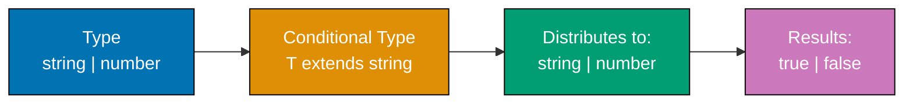
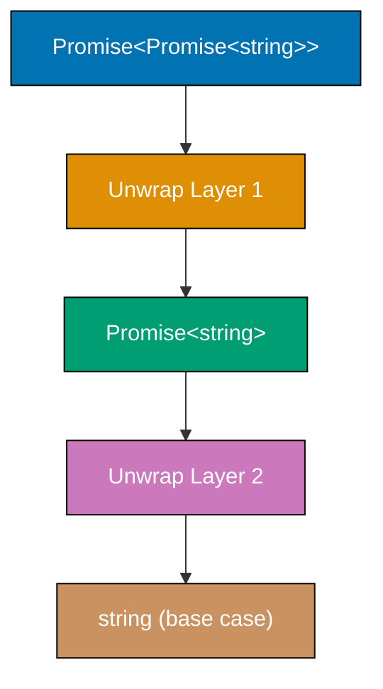
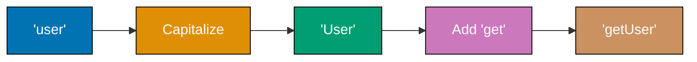

Master advanced TypeScript through 34 expert-level examples covering type-level programming, compiler internals, performance optimization, and framework integration patterns.

## Example 52: Advanced Conditional Types with Distribution

Conditional types distribute over unions automatically. Understanding distribution unlocks powerful type transformations.



**Code**:

```typescript
// DISTRIBUTIVE CONDITIONAL TYPE
type ToArray<T> = T extends any ? T[] : never; // => Distributes over union
// => Applied to each union member

type StringOrNumber = string | number;
type ArrayTypes = ToArray<StringOrNumber>; // => Type: string[] | number[]
// => NOT (string | number)[]

// NON-DISTRIBUTIVE CONDITIONAL TYPE
type ToArrayNonDist<T> = [T] extends [any] ? T[] : never; // => Tuple wrapping prevents distribution

type ArrayTypesNonDist = ToArrayNonDist<StringOrNumber>; // => Type: (string | number)[]

// FILTERING UNION WITH DISTRIBUTION
type ExtractStrings<T> = T extends string ? T : never; // => Keep only strings

type Mixed = string | number | boolean;
type OnlyStrings = ExtractStrings<Mixed>; // => Type: string

// EXCLUDE TYPE (BUILT-IN)
type Exclude<T, U> = T extends U ? never : T; // => Remove U from T union

type WithoutNumber = Exclude<string | number | boolean, number>; // => Type: string | boolean

// EXTRACT TYPE (BUILT-IN)
type Extract<T, U> = T extends U ? T : never; // => Keep only T that extends U

type OnlyNumber = Extract<string | number | boolean, number>; // => Type: number

// CONDITIONAL TYPE WITH INFER
type UnwrapArray<T> = T extends (infer U)[] ? U : T; // => Extract array element type

type Numbers = UnwrapArray<number[]>; // => Type: number
type NotArray = UnwrapArray<string>; // => Type: string

// MULTIPLE INFER
type UnwrapPromise<T> = T extends Promise<infer U> ? U : T;

type Nested = Promise<Promise<string>>;
type First = UnwrapPromise<Nested>; // => Type: Promise<string> (one level)
type Second = UnwrapPromise<First>; // => Type: string (recursive application)
```

**Key Takeaway**: Conditional types distribute over unions by default. Wrap type in tuple `[T]` to prevent distribution. Use distribution for filtering and transforming union members.

**Why It Matters**: Distribution enables powerful union transformations. `Extract` and `Exclude` are built on distribution. Type-level filtering eliminates manual type definitions. Framework authors use distribution for generic type utilities. This pattern is fundamental to advanced TypeScript type programming.

## Example 53: Recursive Conditional Types

Recursive types enable type-level iteration over complex structures. TypeScript 4.1+ supports recursive conditional types without depth limits.



**Code**:

```typescript
// RECURSIVE PROMISE UNWRAPPING
type DeepUnwrapPromise<T> =
  T extends Promise<infer U> // => Check if T is Promise
    ? DeepUnwrapPromise<U> // => Recursive call with unwrapped type
    : T; // => Base case: return T

type Nested = Promise<Promise<Promise<string>>>;
type Unwrapped = DeepUnwrapPromise<Nested>; // => Type: string (all layers unwrapped)

// RECURSIVE ARRAY FLATTENING
type DeepFlatten<T> =
  T extends Array<infer U> // => Check if T is array
    ? DeepFlatten<U> // => Recursively flatten element type
    : T; // => Base case: return T

type NestedArray = number[][][];
type Flat = DeepFlatten<NestedArray>; // => Type: number (fully flattened)

// RECURSIVE OBJECT KEY PATHS
type DeepKeyPath<T> = T extends object // => Check if T is object
  ? {
      [K in keyof T]: K extends string // => Iterate over keys
        ? T[K] extends object // => Check if value is object
          ? `${K}` | `${K}.${DeepKeyPath<T[K]>}` // => Recursive path building
          : `${K}` // => Leaf key
        : never;
    }[keyof T]
  : never;

type User = {
  name: string;
  address: {
    street: string;
    city: string;
    coordinates: {
      lat: number;
      lng: number;
    };
  };
};

type UserPaths = DeepKeyPath<User>; // => Type: "name" | "address" | "address.street" | "address.city" | "address.coordinates" | "address.coordinates.lat" | "address.coordinates.lng"

// RECURSIVE JSON TYPE
type JSONValue =
  | string
  | number
  | boolean
  | null
  | JSONValue[] // => Recursive: array of JSONValue
  | { [key: string]: JSONValue }; // => Recursive: object with JSONValue values

const data: JSONValue = {
  name: "Alice",
  age: 30,
  tags: ["developer", "typescript"],
  nested: {
    deep: {
      value: 42,
    },
  },
}; // => Valid: matches recursive structure
```

**Key Takeaway**: Recursive conditional types enable deep type transformations. TypeScript 4.1+ removed recursion depth limits. Use base cases to prevent infinite recursion.

**Why It Matters**: Recursive types power deep object transformations in ORMs, schema generators, and type-safe form libraries. Form libraries can use recursive types for nested validation. ORMs can use recursion for deep relation types. This pattern is essential for framework-level type utilities.

## Example 54: Template Literal Types - Advanced Patterns

Template literal types enable type-level string manipulation. Combine with mapped types and conditional types for powerful transformations.



**Code**:

```typescript
// EVENT NAME GENERATION
type EventName<T extends string> = `on${Capitalize<T>}Change`; // => Template + built-in utility

type UserEvent = EventName<"user">; // => Type: "onUserChange"
type EmailEvent = EventName<"email">; // => Type: "onEmailChange"

// GETTER/SETTER GENERATION
type Getters<T> = {
  [K in keyof T as `get${Capitalize<string & K>}`]: () => T[K]; // => Mapped type with template literal key
};

type Setters<T> = {
  [K in keyof T as `set${Capitalize<string & K>}`]: (value: T[K]) => void;
};

type Model = {
  name: string;
  age: number;
};

type ModelGetters = Getters<Model>; // => Type: { getName: () => string; getAge: () => number }
type ModelSetters = Setters<Model>; // => Type: { setName: (value: string) => void; setAge: (value: number) => void }

// CSS PROPERTY GENERATION
type CSSProperty<T extends string> = T | `${T}-top` | `${T}-right` | `${T}-bottom` | `${T}-left`; // => Union of variants

type Margin = CSSProperty<"margin">; // => Type: "margin" | "margin-top" | "margin-right" | "margin-bottom" | "margin-left"
type Padding = CSSProperty<"padding">; // => Type: "padding" | "padding-top" | "padding-right" | "padding-bottom" | "padding-left"

// HTTP METHOD + PATH TYPE
type HTTPMethod = "GET" | "POST" | "PUT" | "DELETE";
type Endpoint = `/api/${string}`;
type Request = `${HTTPMethod} ${Endpoint}`; // => Combines method and path

const validRequest: Request = "GET /api/users"; // => Valid
const validPost: Request = "POST /api/users/123"; // => Valid
// const invalid: Request = "INVALID /api/users"; // => Error: "INVALID" not in HTTPMethod

// EXTRACT ROUTE PARAMETERS
type ExtractParams<T extends string> = T extends `${infer _Start}:${infer Param}/${infer Rest}` // => Match :param/rest
  ? Param | ExtractParams<`/${Rest}`> // => Extract param and recurse
  : T extends `${infer _Start}:${infer Param}` // => Match :param at end
    ? Param // => Extract final param
    : never; // => No params

type Route = "/users/:userId/posts/:postId";
type Params = ExtractParams<Route>; // => Type: "userId" | "postId"
```

**Key Takeaway**: Template literal types enable type-level string operations. Combine with mapped types for automatic API surface generation. Use recursion for parameter extraction.

**Why It Matters**: Template literals power type-safe routing, endpoint typing, and CSS-in-JS libraries. Styling libraries can use template literals for prop-based styling. Type generators can extract route parameters. This eliminates manual type definitions for string-based APIs.

## Example 55: Variadic Tuple Types and Rest Elements

Variadic tuples enable type-safe operations on argument lists of unknown length. TypeScript 4.0+ supports multiple rest elements and inference.

```typescript
// FUNCTION COMPOSITION WITH VARIADIC TUPLES
type Fn<Args extends any[], Return> = (...args: Args) => Return; // => Generic function type

type Compose<F extends Fn<any[], any>, G extends Fn<any[], any>> =
  F extends Fn<infer FArgs, infer FReturn> // => Infer F's signature
    ? G extends Fn<[FReturn], infer GReturn> // => G must accept F's return
      ? Fn<FArgs, GReturn> // => Composed function type
      : never
    : never;

const addOne = (x: number): number => x + 1; // => number → number
const toString = (x: number): string => x.toString(); // => number → string

type AddToString = Compose<typeof addOne, typeof toString>; // => Type: (x: number) => string

// TUPLE CONCATENATION
type Concat<T extends any[], U extends any[]> = [...T, ...U]; // => Spread both tuples

type Numbers = [1, 2, 3];
type Strings = ["a", "b"];
type Combined = Concat<Numbers, Strings>; // => Type: [1, 2, 3, "a", "b"]

// PARTIAL APPLICATION
type PartialApply<Fn extends (...args: any[]) => any, Applied extends any[]> = Fn extends (
  ...args: [...Applied, ...infer Rest]
) => infer Return // => Match applied + remaining
  ? (...args: Rest) => Return // => Return function with remaining params
  : never;

function greet(greeting: string, name: string, punctuation: string): string {
  return `${greeting} ${name}${punctuation}`; // => Combines all arguments
}

type GreetWithHello = PartialApply<typeof greet, [string]>; // => Type: (name: string, punctuation: string) => string
type GreetWithHelloAlice = PartialApply<typeof greet, [string, string]>; // => Type: (punctuation: string) => string

// CURRY TYPE
type Curry<Fn> = Fn extends (...args: infer Args) => infer Return // => Infer function signature
  ? Args extends [infer First, ...infer Rest] // => Split first argument
    ? (arg: First) => Curry<(...args: Rest) => Return> // => Recursive currying
    : Return // => Base case: no args left
  : never;

function add(a: number, b: number, c: number): number {
  return a + b + c; // => Sum three numbers
}

type CurriedAdd = Curry<typeof add>; // => Type: (arg: number) => (arg: number) => (arg: number) => number

// TUPLE TAIL
type Tail<T extends any[]> = T extends [any, ...infer Rest] ? Rest : []; // => Remove first element

type List = [1, 2, 3, 4];
type TailList = Tail<List>; // => Type: [2, 3, 4]

// TUPLE HEAD
type Head<T extends any[]> = T extends [infer First, ...any[]] ? First : never; // => Extract first element

type FirstElement = Head<List>; // => Type: 1
```

**Key Takeaway**: Variadic tuples enable type-safe function composition, partial application, and currying. Multiple rest elements allow complex tuple transformations.

**Why It Matters**: Variadic tuples power functional programming library typings. Action creator composition can use variadic tuples. Pipeline operators can rely on variadic tuple inference. Essential for type-safe higher-order functions.

## Example 56: Type Inference with Infer Keyword Mastery

The `infer` keyword enables extracting types from generic positions. Master infer for advanced type-level programming.

```typescript
// FUNCTION RETURN TYPE EXTRACTION
type ReturnType<T> = T extends (...args: any[]) => infer R ? R : never; // => Built-in utility

function getUser() {
  return { name: "Alice", age: 30 }; // => Returns object
}

type UserType = ReturnType<typeof getUser>; // => Type: { name: string; age: number }

// FUNCTION PARAMETER EXTRACTION
type Parameters<T> = T extends (...args: infer P) => any ? P : never; // => Built-in utility

function createUser(name: string, age: number, active: boolean) {} // => Three parameters

type CreateUserParams = Parameters<typeof createUser>; // => Type: [string, number, boolean]

// FIRST PARAMETER EXTRACTION
type FirstParam<T> = T extends (first: infer F, ...args: any[]) => any ? F : never; // => Extract first param type

type FirstArg = FirstParam<typeof createUser>; // => Type: string

// CONSTRUCTOR PARAMETER EXTRACTION
type ConstructorParameters<T> = T extends new (...args: infer P) => any ? P : never; // => Built-in utility

class User {
  constructor(
    public name: string,
    public age: number,
  ) {} // => Constructor with two params
}

type UserConstructorParams = ConstructorParameters<typeof User>; // => Type: [string, number]

// INSTANCE TYPE EXTRACTION
type InstanceType<T> = T extends new (...args: any[]) => infer R ? R : never; // => Built-in utility

type UserInstance = InstanceType<typeof User>; // => Type: User

// NESTED INFER FOR ARRAY ELEMENT
type UnpackArray<T> = T extends (infer U)[] ? U : T; // => Extract array element

type NumberArray = number[];
type NumberElement = UnpackArray<NumberArray>; // => Type: number

// MULTIPLE INFER IN CONDITIONAL
type UnpackPromiseArray<T> = T extends Promise<infer U>[] // => Both Promise AND array
  ? U // => Extract Promise payload
  : never;

type PromiseNumbers = Promise<number>[];
type NumberFromPromise = UnpackPromiseArray<PromiseNumbers>; // => Type: number

// INFER IN OBJECT PROPERTY
type GetPropertyType<T, K extends keyof T> = T extends { [P in K]: infer V } // => Infer property type
  ? V
  : never;

type UserObj = { name: string; age: number };
type NameType = GetPropertyType<UserObj, "name">; // => Type: string

// CONTRAVARIANT INFER POSITIONS
type FunctionPropertyNames<T> = {
  [K in keyof T]: T[K] extends (...args: any[]) => any ? K : never; // => Filter function properties
}[keyof T];

type Obj = {
  name: string;
  getName: () => string;
  setName: (name: string) => void;
};

type FuncKeys = FunctionPropertyNames<Obj>; // => Type: "getName" | "setName"
```

**Key Takeaway**: `infer` extracts types from generic positions in conditional types. Use multiple infer for complex extractions. Infer works in parameter, return, and property positions.

**Why It Matters**: Infer powers all TypeScript built-in utility types (ReturnType, Parameters, etc.). Type-safe dependency injection containers use infer for constructor parameter extraction. GraphQL code generators infer query result types. Essential for framework-level type manipulation.

## Example 57: Branded Types for Runtime Safety

Branded types prevent mixing semantically different values of the same primitive type. Use phantom types for compile-time guarantees.

```typescript
// BASIC BRANDED TYPE
type Brand<T, BrandName extends string> = T & { __brand: BrandName }; // => Intersection with phantom property

type UserId = Brand<number, "UserId">; // => Branded number
type ProductId = Brand<number, "ProductId">; // => Different brand

function getUserById(id: UserId): string {
  return `User ${id}`; // => Accepts only UserId
}

const userId = 123 as UserId; // => Brand casting
const productId = 456 as ProductId; // => Different brand

getUserById(userId); // => Valid
// getUserById(productId); // => Error: ProductId not assignable to UserId
// getUserById(123); // => Error: number not assignable to UserId

// BRANDED STRING TYPES
type Email = Brand<string, "Email">;
type Username = Brand<string, "Username">;

function sendEmail(to: Email, from: Email): void {
  console.log(`Sending email from ${from} to ${to}`); // => Type-safe email handling
}

const email = "alice@example.com" as Email; // => Branded string
const username = "alice" as Username; // => Different brand

sendEmail(email, email); // => Valid
// sendEmail(username, email); // => Error: Username not assignable to Email

// SMART CONSTRUCTOR PATTERN
function createEmail(raw: string): Email | null {
  const emailRegex = /^[^\s@]+@[^\s@]+\.[^\s@]+$/; // => Email validation regex
  return emailRegex.test(raw) ? (raw as Email) : null; // => Returns branded type or null
}

const validEmail = createEmail("alice@example.com"); // => Email | null
const invalidEmail = createEmail("not-an-email"); // => null

if (validEmail) {
  sendEmail(validEmail, validEmail); // => Type-safe after validation
}

// NUMERIC BRANDED TYPES WITH UNITS
type Kilometers = Brand<number, "Kilometers">;
type Miles = Brand<number, "Miles">;

function addKilometers(a: Kilometers, b: Kilometers): Kilometers {
  return (a + b) as Kilometers; // => Type-safe addition
}

function convertMilesToKilometers(miles: Miles): Kilometers {
  return (miles * 1.60934) as Kilometers; // => Explicit conversion
}

const km1 = 100 as Kilometers;
const km2 = 50 as Kilometers;
const miles = 10 as Miles;

addKilometers(km1, km2); // => Valid: same units
// addKilometers(km1, miles); // => Error: can't mix units
const converted = convertMilesToKilometers(miles); // => Explicit conversion required
addKilometers(km1, converted); // => Valid after conversion

// OPAQUE TYPE WITH CLASS
class EmailAddress {
  private __brand!: "Email"; // => Private phantom property
  private constructor(public value: string) {} // => Private constructor

  static create(raw: string): EmailAddress | null {
    const emailRegex = /^[^\s@]+@[^\s@]+\.[^\s@]+$/;
    return emailRegex.test(raw) ? new EmailAddress(raw) : null; // => Factory method
  }
}

function sendTypedEmail(to: EmailAddress): void {
  console.log(`Sending to ${to.value}`); // => Access validated value
}

const typedEmail = EmailAddress.create("alice@example.com");
if (typedEmail) {
  sendTypedEmail(typedEmail); // => Type-safe with validation
}
```

**Key Takeaway**: Branded types add semantic meaning to primitives at compile-time. Use phantom properties or private fields for branding. Smart constructors enforce validation.

**Why It Matters**: Branded types prevent bugs from mixing user IDs and product IDs, or kilometers and miles. Financial systems use branded types for currencies. Type-safe routing uses branded URL types. No runtime cost—pure compile-time safety.

## Example 58: Type-Level Programming - Arithmetic

Type-level arithmetic enables compile-time computation. Use tuple length manipulation for addition/subtraction.

```typescript
// TYPE-LEVEL COUNTER WITH TUPLES
type Length<T extends any[]> = T["length"]; // => Extract tuple length

type Three = Length<[1, 2, 3]>; // => Type: 3
type Five = Length<[1, 1, 1, 1, 1]>; // => Type: 5

// BUILD TUPLE OF SPECIFIC LENGTH
type BuildTuple<L extends number, T extends any[] = []> = T["length"] extends L // => Check if reached target
  ? T // => Base case: return tuple
  : BuildTuple<L, [...T, any]>; // => Recursive: add element

type TupleOfFive = BuildTuple<5>; // => Type: [any, any, any, any, any]
type LengthOfTuple = Length<TupleOfFive>; // => Type: 5

// TYPE-LEVEL ADDITION
type Add<A extends number, B extends number> = Length<[...BuildTuple<A>, ...BuildTuple<B>]>; // => Concatenate tuples and get length

type TwoPlusThree = Add<2, 3>; // => Type: 5
type FourPlusSix = Add<4, 6>; // => Type: 10

// TYPE-LEVEL SUBTRACTION
type Subtract<A extends number, B extends number> =
  BuildTuple<A> extends [...BuildTuple<B>, ...infer Rest] // => Remove B elements from A
    ? Length<Rest> // => Return remaining length
    : never;

type FiveMinusTwo = Subtract<5, 2>; // => Type: 3
type TenMinusFour = Subtract<10, 4>; // => Type: 6

// TYPE-LEVEL COMPARISON
type GreaterThan<A extends number, B extends number> = Subtract<A, B> extends never ? false : true; // => If subtraction valid, A > B

type FiveGreaterThree = GreaterThan<5, 3>; // => Type: true
type TwoGreaterFive = GreaterThan<2, 5>; // => Type: false

// RANGE TYPE GENERATION
type Range<N extends number, Acc extends number[] = []> = Acc["length"] extends N // => Check if reached N
  ? Acc[number] // => Return union of array indices
  : Range<N, [...Acc, Acc["length"]]>; // => Recursive: add next number

type ZeroToFour = Range<5>; // => Type: 0 | 1 | 2 | 3 | 4
type ZeroToNine = Range<10>; // => Type: 0 | 1 | 2 | 3 | 4 | 5 | 6 | 7 | 8 | 9
```

**Key Takeaway**: Use tuple length for type-level numbers. Tuple concatenation implements addition. Tuple pattern matching implements subtraction. Limited to small numbers due to recursion depth.

**Why It Matters**: Type-level arithmetic powers fixed-size array types, matrix dimensions in ML libraries, and compile-time validation. GraphQL fragment depth limits use type-level counting. Practical for compile-time bounds checking without runtime cost.

## Example 59: Declaration Merging - Interface and Namespace

Declaration merging combines multiple declarations with the same name. TypeScript merges interfaces, namespaces, and module augmentation.

```typescript
// INTERFACE MERGING (AUTOMATIC)
interface User {
  name: string; // => First declaration
}

interface User {
  age: number; // => Second declaration merges
}

const user: User = {
  name: "Alice", // => Combined interface
  age: 30, // => Requires both properties
};

// NAMESPACE AND FUNCTION MERGING
function createLogger(message: string) {
  console.log(message); // => Function behavior
}

namespace createLogger {
  export let version = "1.0.0"; // => Namespace property
  export function debug(message: string) {
    // => Namespace method
    console.log(`[DEBUG] ${message}`);
  }
}

createLogger("Info message"); // => Call as function
console.log(createLogger.version); // => Access namespace property: "1.0.0"
createLogger.debug("Debug message"); // => Call namespace method

// CLASS AND NAMESPACE MERGING
class Album {
  constructor(public title: string) {} // => Class constructor
}

namespace Album {
  export class Track {
    // => Nested class in namespace
    constructor(
      public name: string,
      public duration: number,
    ) {}
  }
  export function create(title: string): Album {
    // => Factory function
    return new Album(title);
  }
}

const album = new Album("Greatest Hits"); // => Class constructor
const track = new Album.Track("Song 1", 180); // => Nested class
const album2 = Album.create("Best Of"); // => Factory function

// ENUM AND NAMESPACE MERGING
enum Color {
  Red = "RED",
  Green = "GREEN",
  Blue = "BLUE",
}

namespace Color {
  export function parse(value: string): Color | undefined {
    // => Parse string to enum
    return Object.values(Color).find((c) => c === value);
  }
  export function values(): Color[] {
    // => Get all enum values
    return Object.values(Color);
  }
}

const red = Color.Red; // => Enum member: "RED"
const parsed = Color.parse("GREEN"); // => Namespace function: Color.Green
const allColors = Color.values(); // => ["RED", "GREEN", "BLUE"]

// MODULE AUGMENTATION (EXTENDING THIRD-PARTY)
// Extend existing module
declare module "express" {
  interface Request {
    user?: { id: string; name: string }; // => Add user property
  }
}

// Now Request type includes user property globally
```

**Key Takeaway**: Interfaces merge automatically across declarations. Functions, classes, and enums can merge with namespaces. Module augmentation extends third-party types.

**Why It Matters**: Declaration merging powers middleware typing (extending Request/Response), component prop augmentation, and library plugin systems. Libraries can use namespace merging for plugins. Essential for extending external library types without forking.

## Example 60: Global Augmentation for Built-in Types

Global augmentation extends built-in types and global namespaces. Use carefully to avoid polluting global scope.

```typescript
// EXTENDING ARRAY PROTOTYPE TYPES
interface Array<T> {
  first(): T | undefined; // => Add first method
  last(): T | undefined; // => Add last method
}

// Implementation (would be in separate .js file)
Array.prototype.first = function () {
  return this[0]; // => Return first element
};

Array.prototype.last = function () {
  return this[this.length - 1]; // => Return last element
};

const numbers = [1, 2, 3, 4, 5];
const firstNum = numbers.first(); // => Type: number | undefined, Value: 1
const lastNum = numbers.last(); // => Type: number | undefined, Value: 5

// EXTENDING GLOBAL NAMESPACE
declare global {
  interface Window {
    // => Extend Window interface
    myApp: {
      version: string;
      apiUrl: string;
    };
  }

  var APP_VERSION: string; // => Global variable type

  namespace NodeJS {
    // => Extend NodeJS namespace
    interface ProcessEnv {
      DATABASE_URL: string; // => Type-safe env var
      API_KEY: string;
      NODE_ENV: "development" | "production" | "test";
    }
  }
}

// Usage (browser)
window.myApp = {
  // => Typed global object
  version: "1.0.0",
  apiUrl: "https://api.example.com",
};

// Usage (Node.js)
const dbUrl = process.env.DATABASE_URL; // => Type: string
const nodeEnv = process.env.NODE_ENV; // => Type: "development" | "production" | "test"

// EXTENDING STRING WITH CUSTOM METHODS
interface String {
  truncate(maxLength: number): string; // => Add truncate method
}

String.prototype.truncate = function (maxLength: number): string {
  return this.length > maxLength ? this.substring(0, maxLength) + "..." : this.toString(); // => Truncate with ellipsis
};

const longText = "This is a very long string";
const truncated = longText.truncate(10); // => "This is a ..."

// EXTENDING PROMISE WITH TIMEOUT
interface Promise<T> {
  timeout(ms: number): Promise<T>; // => Add timeout method
}

Promise.prototype.timeout = function <T>(this: Promise<T>, ms: number): Promise<T> {
  return Promise.race([
    this, // => Original promise
    new Promise<T>(
      (_, reject) => setTimeout(() => reject(new Error("Timeout")), ms), // => Timeout promise
    ),
  ]);
};

const fetchWithTimeout = fetch("https://api.example.com").timeout(5000); // => Fails if >5s
```

**Key Takeaway**: Global augmentation extends built-in types like Array, String, Window, and NodeJS namespaces. Use `declare global` for global scope extensions. Avoid excessive global pollution.

**Why It Matters**: Global augmentation enables type-safe environment variables (process.env), custom global objects (window extensions), and polyfill typing. Frameworks can use global augmentation for NodeJS.ProcessEnv. Essential for typing runtime-modified globals.

## Example 61: Abstract Classes and Advanced Patterns

Abstract classes define contracts with partial implementation. Use for template method pattern and framework base classes.

```typescript
// BASIC ABSTRACT CLASS
abstract class Animal {
  constructor(public name: string) {} // => Concrete property

  abstract makeSound(): string; // => Subclasses must implement

  move(distance: number): string {
    // => Concrete method
    return `${this.name} moved ${distance} meters`;
  }

  describe(): string {
    // => Template method using abstract
    return `${this.name} says ${this.makeSound()}`;
  }
}

class Dog extends Animal {
  makeSound(): string {
    // => Required implementation
    return "Woof!";
  }
}

const dog = new Dog("Rex");
console.log(dog.makeSound()); // => Output: "Woof!"
console.log(dog.move(10)); // => Output: "Rex moved 10 meters"
console.log(dog.describe()); // => Output: "Rex says Woof!"

// const animal = new Animal("Generic"); // => Error: Cannot instantiate abstract class

// ABSTRACT CLASS WITH PROTECTED MEMBERS
abstract class Repository<T> {
  protected abstract tableName: string; // => Subclasses define table

  protected abstract validate(item: T): boolean; // => Validation logic

  async save(item: T): Promise<void> {
    // => Template method
    if (!this.validate(item)) {
      // => Use abstract validation
      throw new Error("Validation failed");
    }
    console.log(`Saving to ${this.tableName}:`, item); // => Use abstract tableName
  }

  async findById(id: string): Promise<T | null> {
    // => Concrete shared logic
    console.log(`Finding in ${this.tableName} by id: ${id}`);
    return null; // => Placeholder
  }
}

interface User {
  id: string;
  name: string;
  email: string;
}

class UserRepository extends Repository<User> {
  protected tableName = "users"; // => Concrete value

  protected validate(user: User): boolean {
    // => Concrete validation
    return user.email.includes("@"); // => Simple email check
  }

  async findByEmail(email: string): Promise<User | null> {
    // => Additional method
    console.log(`Finding user by email: ${email}`);
    return null;
  }
}

const userRepo = new UserRepository();
userRepo.save({ id: "1", name: "Alice", email: "alice@example.com" }); // => Valid
// userRepo.save({ id: "2", name: "Bob", email: "invalid" }); // => Throws: Validation failed

// ABSTRACT CLASS WITH FACTORY METHOD
abstract class PaymentProcessor {
  abstract createPayment(amount: number): Payment; // => Factory method

  process(amount: number): string {
    // => Template method
    const payment = this.createPayment(amount); // => Use factory
    return payment.execute(); // => Execute payment
  }
}

interface Payment {
  execute(): string;
}

class CreditCardPayment implements Payment {
  constructor(private amount: number) {}
  execute(): string {
    return `Processing credit card payment: $${this.amount}`;
  }
}

class PayPalPayment implements Payment {
  constructor(private amount: number) {}
  execute(): string {
    return `Processing PayPal payment: $${this.amount}`;
  }
}

class CreditCardProcessor extends PaymentProcessor {
  createPayment(amount: number): Payment {
    // => Factory implementation
    return new CreditCardPayment(amount);
  }
}

class PayPalProcessor extends PaymentProcessor {
  createPayment(amount: number): Payment {
    return new PayPalPayment(amount);
  }
}

const ccProcessor = new CreditCardProcessor();
console.log(ccProcessor.process(100)); // => "Processing credit card payment: $100"

const ppProcessor = new PayPalProcessor();
console.log(ppProcessor.process(50)); // => "Processing PayPal payment: $50"
```

**Key Takeaway**: Abstract classes provide partial implementation with enforced contracts. Use template method pattern for algorithm skeleton. Factory methods delegate object creation to subclasses.

**Why It Matters**: Abstract classes power ORM base classes, framework components, and plugin architectures. Class components can extend abstract bases. Essential for framework-level extensibility patterns.

## Example 62: Mixin Pattern for Multiple Inheritance

Mixins enable composing behavior from multiple sources. TypeScript doesn't support multiple inheritance but mixins provide similar functionality.

```typescript
// BASIC MIXIN TYPE
type Constructor<T = {}> = new (...args: any[]) => T; // => Constructor type

// TIMESTAMPED MIXIN
function Timestamped<TBase extends Constructor>(Base: TBase) {
  return class extends Base {
    // => Return extended class
    createdAt = new Date(); // => Add timestamp property

    getAge(): number {
      // => Add age method
      return Date.now() - this.createdAt.getTime();
    }
  };
}

// ACTIVATABLE MIXIN
function Activatable<TBase extends Constructor>(Base: TBase) {
  return class extends Base {
    isActive = false; // => Add active state

    activate() {
      // => Add activate method
      this.isActive = true;
      console.log("Activated");
    }

    deactivate() {
      this.isActive = false;
      console.log("Deactivated");
    }
  };
}

// BASE CLASS
class User {
  constructor(public name: string) {}
}

// COMPOSE MIXINS
const TimestampedUser = Timestamped(User); // => Apply first mixin
const TimestampedActivatableUser = Activatable(TimestampedUser); // => Apply second mixin

const user = new TimestampedActivatableUser("Alice");
console.log(user.name); // => "Alice" (from base class)
console.log(user.createdAt); // => Date (from Timestamped)
console.log(user.isActive); // => false (from Activatable)
user.activate(); // => "Activated"
console.log(user.getAge()); // => Number (milliseconds since creation)

// TYPED MIXIN HELPER
function applyMixins(derivedCtor: any, constructors: any[]) {
  constructors.forEach((baseCtor) => {
    // => Iterate mixins
    Object.getOwnPropertyNames(baseCtor.prototype).forEach((name) => {
      // => Copy methods
      Object.defineProperty(
        derivedCtor.prototype,
        name,
        Object.getOwnPropertyDescriptor(baseCtor.prototype, name) || Object.create(null),
      );
    });
  });
}

// MIXIN WITH REQUIREMENTS
interface Named {
  name: string;
}

function Loggable<TBase extends Constructor<Named>>(Base: TBase) {
  // => Require 'name' property
  return class extends Base {
    log(message: string) {
      console.log(`[${this.name}] ${message}`); // => Use required property
    }
  };
}

class Product {
  constructor(
    public name: string,
    public price: number,
  ) {}
}

const LoggableProduct = Loggable(Product);
const product = new LoggableProduct("Widget", 29.99);
product.log("In stock"); // => "[Widget] In stock"

// CHAINABLE MIXINS
function Serializable<TBase extends Constructor>(Base: TBase) {
  return class extends Base {
    serialize(): string {
      // => Serialize to JSON
      return JSON.stringify(this);
    }

    static deserialize<T>(this: Constructor<T>, json: string): T {
      // => Deserialize from JSON
      const obj = JSON.parse(json);
      return new this(obj);
    }
  };
}

class Document {
  constructor(
    public title: string,
    public content: string,
  ) {}
}

const SerializableDocument = Serializable(Timestamped(Document)); // => Chain mixins
const doc = new SerializableDocument("Report", "Lorem ipsum");
const json = doc.serialize(); // => {"title":"Report","content":"Lorem ipsum","createdAt":"..."}
```

**Key Takeaway**: Mixins compose behavior without multiple inheritance. Use constructor types to extend base classes. Require interfaces for type-safe mixin constraints.

**Why It Matters**: Mixins power composition APIs, reusable hooks, and service composition. Utility libraries can use mixins for cross-cutting concerns (logging, serialization). Enables flexible behavior composition.

## Example 63: Decorator Composition and Metadata

Decorators enable declarative metadata and behavior modification. Combine multiple decorators for powerful composition.

```typescript
// ENABLE DECORATORS IN tsconfig.json:
// "experimentalDecorators": true
// "emitDecoratorMetadata": true

// CLASS DECORATOR
function Component(options: { selector: string }) {
  return function <T extends { new (...args: any[]): {} }>(constructor: T) {
    // => Decorator factory
    return class extends constructor {
      selector = options.selector; // => Add selector property
    };
  };
}

@Component({ selector: "app-user" })
class UserComponent {
  name = "User Component";
}

const component = new UserComponent();
console.log((component as any).selector); // => "app-user"

// METHOD DECORATOR
function Log(target: any, propertyKey: string, descriptor: PropertyDescriptor) {
  const originalMethod = descriptor.value; // => Store original method

  descriptor.value = function (...args: any[]) {
    // => Replace method
    console.log(`Calling ${propertyKey} with`, args); // => Log before
    const result = originalMethod.apply(this, args); // => Call original
    console.log(`Result:`, result); // => Log after
    return result;
  };

  return descriptor;
}

class Calculator {
  @Log
  add(a: number, b: number): number {
    return a + b; // => Original logic
  }
}

const calc = new Calculator();
calc.add(5, 3); // => Logs: "Calling add with [5, 3]" then "Result: 8"

// PROPERTY DECORATOR
function ReadOnly(target: any, propertyKey: string) {
  Object.defineProperty(target, propertyKey, {
    writable: false, // => Make read-only
    configurable: false,
  });
}

class Config {
  @ReadOnly
  apiUrl = "https://api.example.com"; // => Immutable property
}

const config = new Config();
// config.apiUrl = "https://new-url.com"; // => Error: Cannot assign to read-only property

// PARAMETER DECORATOR
function Required(target: any, propertyKey: string, parameterIndex: number) {
  const existingRequiredParameters: number[] = Reflect.getOwnMetadata("required", target, propertyKey) || []; // => Get existing metadata
  existingRequiredParameters.push(parameterIndex); // => Add parameter index
  Reflect.defineMetadata("required", existingRequiredParameters, target, propertyKey); // => Store metadata
}

function Validate(target: any, propertyKey: string, descriptor: PropertyDescriptor) {
  const originalMethod = descriptor.value;

  descriptor.value = function (...args: any[]) {
    const requiredParameters: number[] = Reflect.getOwnMetadata("required", target, propertyKey) || []; // => Get required params

    for (const index of requiredParameters) {
      if (args[index] === undefined || args[index] === null) {
        // => Check required params
        throw new Error(`Parameter at index ${index} is required`);
      }
    }

    return originalMethod.apply(this, args);
  };
}

class UserService {
  @Validate
  createUser(@Required name: string, @Required email: string, age?: number) {
    return { name, email, age }; // => Create user object
  }
}

const service = new UserService();
service.createUser("Alice", "alice@example.com"); // => Valid
// service.createUser("Bob", null as any); // => Throws: Parameter at index 1 is required

// DECORATOR COMPOSITION
function Retry(attempts: number) {
  return function (target: any, propertyKey: string, descriptor: PropertyDescriptor) {
    const originalMethod = descriptor.value;

    descriptor.value = async function (...args: any[]) {
      for (let i = 0; i < attempts; i++) {
        // => Retry loop
        try {
          return await originalMethod.apply(this, args); // => Try original method
        } catch (error) {
          if (i === attempts - 1) throw error; // => Rethrow on last attempt
          console.log(`Retry ${i + 1}/${attempts}`);
        }
      }
    };
  };
}

class ApiClient {
  @Log
  @Retry(3)
  async fetchData(url: string): Promise<string> {
    // => Multiple decorators
    console.log(`Fetching ${url}`);
    if (Math.random() > 0.7) throw new Error("Network error"); // => Simulate failure
    return "data";
  }
}
```

**Key Takeaway**: Decorators add metadata and modify behavior declaratively. Compose multiple decorators for layered functionality. Use reflect-metadata for parameter validation.

**Why It Matters**: Decorators power dependency injection, route handlers, entity definitions, and validation. Essential for framework-level declarative programming. Enables clean separation of concerns.

## Example 64: Symbol Usage for Unique Properties

Symbols create unique property keys that don't conflict with string properties. Use for meta-programming and private-like properties.

```typescript
// BASIC SYMBOL
const id = Symbol("id"); // => Create unique symbol
const id2 = Symbol("id"); // => Different symbol (same description)

console.log(id === id2); // => false (symbols always unique)

const user = {
  name: "Alice",
  [id]: 123, // => Symbol as property key
};

console.log(user[id]); // => 123
console.log(user.name); // => "Alice"

// SYMBOLS DON'T APPEAR IN NORMAL ITERATION
console.log(Object.keys(user)); // => ["name"] (symbol key omitted)
console.log(Object.getOwnPropertyNames(user)); // => ["name"]
console.log(Object.getOwnPropertySymbols(user)); // => [Symbol(id)] (only way to get symbols)

// WELL-KNOWN SYMBOLS - ITERATOR
class NumberRange {
  constructor(
    private start: number,
    private end: number,
  ) {}

  [Symbol.iterator]() {
    // => Make iterable
    let current = this.start;
    const end = this.end;

    return {
      next() {
        if (current <= end) {
          return { value: current++, done: false }; // => Yield value
        }
        return { value: undefined, done: true }; // => Iteration complete
      },
    };
  }
}

const range = new NumberRange(1, 5);
for (const num of range) {
  // => Uses Symbol.iterator
  console.log(num); // => 1, 2, 3, 4, 5
}

// WELL-KNOWN SYMBOLS - TO PRIMITIVE
class Money {
  constructor(private amount: number) {}

  [Symbol.toPrimitive](hint: string) {
    // => Custom type coercion
    if (hint === "number") {
      return this.amount; // => Return number
    }
    if (hint === "string") {
      return `$${this.amount}`; // => Return string
    }
    return this.amount; // => Default
  }
}

const money = new Money(100);
console.log(+money); // => 100 (number coercion)
console.log(`Total: ${money}`); // => "Total: $100" (string coercion)
console.log(money + 50); // => 150 (default coercion)

// SYMBOL AS METADATA KEY
const metadataKey = Symbol("metadata");

function addMetadata(target: any, data: any) {
  target[metadataKey] = data; // => Store metadata
}

class Product {
  name: string;
}

addMetadata(Product, { version: "1.0", author: "Alice" });
console.log((Product as any)[metadataKey]); // => { version: "1.0", author: "Alice" }

// GLOBAL SYMBOL REGISTRY
const globalId = Symbol.for("app.userId"); // => Create/retrieve global symbol
const sameGlobalId = Symbol.for("app.userId"); // => Retrieves same symbol

console.log(globalId === sameGlobalId); // => true (shared global symbol)
console.log(Symbol.keyFor(globalId)); // => "app.userId" (get key from symbol)

// SYMBOL-BASED PRIVATE PROPERTIES
const _balance = Symbol("balance");

class BankAccount {
  [_balance]: number; // => Symbol property

  constructor(initialBalance: number) {
    this[_balance] = initialBalance; // => Initialize private-like property
  }

  deposit(amount: number) {
    this[_balance] += amount; // => Modify private-like property
  }

  getBalance(): number {
    return this[_balance]; // => Access private-like property
  }
}

const account = new BankAccount(1000);
account.deposit(500);
console.log(account.getBalance()); // => 1500
console.log(Object.keys(account)); // => [] (symbol property hidden)
```

**Key Takeaway**: Symbols create unique property keys. Well-known symbols customize language behavior (Symbol.iterator, Symbol.toPrimitive). Use Symbol.for() for global shared symbols.

**Why It Matters**: Symbols power custom iterators, JSON serialization control, and private-like properties before private fields. Frameworks can use symbols for element identification and observable interop. Essential for meta-programming and protocol implementation.

## Example 65: AsyncIterator and AsyncGenerator Types

AsyncIterators enable iteration over async sequences. AsyncGenerators simplify async iterator creation.

```typescript
// ASYNC ITERATOR INTERFACE
interface AsyncIterator<T> {
  next(): Promise<IteratorResult<T>>; // => Returns promise of result
}

interface AsyncIterable<T> {
  [Symbol.asyncIterator](): AsyncIterator<T>; // => Returns async iterator
}

// MANUAL ASYNC ITERATOR
class AsyncNumberRange implements AsyncIterable<number> {
  constructor(
    private start: number,
    private end: number,
    private delay: number,
  ) {}

  [Symbol.asyncIterator](): AsyncIterator<number> {
    let current = this.start;
    const end = this.end;
    const delay = this.delay;

    return {
      async next(): Promise<IteratorResult<number>> {
        // => Async next method
        if (current <= end) {
          await new Promise((resolve) => setTimeout(resolve, delay)); // => Simulate async operation
          return { value: current++, done: false }; // => Yield value
        }
        return { value: undefined, done: true }; // => Complete
      },
    };
  }
}

// USAGE WITH FOR-AWAIT-OF
async function consumeAsyncRange() {
  const range = new AsyncNumberRange(1, 5, 100); // => 1-5 with 100ms delay

  for await (const num of range) {
    // => Async iteration
    console.log(num); // => 1, 2, 3, 4, 5 (with delays)
  }
}

// ASYNC GENERATOR FUNCTION
async function* asyncNumberGenerator(start: number, end: number) {
  for (let i = start; i <= end; i++) {
    await new Promise((resolve) => setTimeout(resolve, 100)); // => Delay
    yield i; // => Yield value asynchronously
  }
}

async function useAsyncGenerator() {
  for await (const num of asyncNumberGenerator(1, 5)) {
    console.log(num); // => 1, 2, 3, 4, 5 (with delays)
  }
}

// ASYNC GENERATOR WITH API PAGINATION
async function* fetchPages<T>(baseUrl: string, pageSize: number): AsyncGenerator<T[], void, undefined> {
  let page = 1;
  let hasMore = true;

  while (hasMore) {
    const response = await fetch(`${baseUrl}?page=${page}&size=${pageSize}`); // => Fetch page
    const data: T[] = await response.json(); // => Parse JSON

    if (data.length < pageSize) {
      hasMore = false; // => Last page
    }

    yield data; // => Yield page data
    page++;
  }
}

async function processAllUsers() {
  for await (const users of fetchPages<{
    id: string;
    name: string;
  }>("https://api.example.com/users", 100)) {
    console.log(`Processing ${users.length} users`); // => Process each page
  }
}

// ASYNC ITERATOR HELPERS
async function* map<T, U>(source: AsyncIterable<T>, transform: (item: T) => U): AsyncGenerator<U, void, undefined> {
  for await (const item of source) {
    // => Iterate source
    yield transform(item); // => Transform and yield
  }
}

async function* filter<T>(
  source: AsyncIterable<T>,
  predicate: (item: T) => boolean,
): AsyncGenerator<T, void, undefined> {
  for await (const item of source) {
    if (predicate(item)) {
      // => Check predicate
      yield item; // => Yield if passes
    }
  }
}

// COMPOSE ASYNC ITERATORS
async function processData() {
  const numbers = asyncNumberGenerator(1, 10);
  const doubled = map(numbers, (n) => n * 2); // => Transform
  const filtered = filter(doubled, (n) => n > 10); // => Filter

  for await (const num of filtered) {
    console.log(num); // => 12, 14, 16, 18, 20
  }
}

// ASYNC ITERATOR WITH ERROR HANDLING
async function* fetchWithRetry(urls: string[]): AsyncGenerator<string, void, undefined> {
  for (const url of urls) {
    let attempts = 0;
    const maxAttempts = 3;

    while (attempts < maxAttempts) {
      try {
        const response = await fetch(url); // => Attempt fetch
        const data = await response.text();
        yield data; // => Yield on success
        break; // => Exit retry loop
      } catch (error) {
        attempts++;
        if (attempts >= maxAttempts) {
          console.error(`Failed to fetch ${url} after ${maxAttempts} attempts`);
          yield `ERROR: ${url}`; // => Yield error marker
        }
      }
    }
  }
}
```

**Key Takeaway**: AsyncIterators handle async sequences with for-await-of loops. AsyncGenerators simplify async iterator creation with yield. Compose async iterators for data pipelines.

**Why It Matters**: AsyncIterators power database cursor iteration, API pagination, real-time data streams, and file processing. Node.js streams implement async iterators. Essential for handling large async datasets without loading everything into memory.

## Example 66: WeakMap and WeakSet Typing

WeakMaps and WeakSets hold weak object references. Objects are garbage collected when no strong references exist.

```typescript
// WEAKMAP FOR PRIVATE DATA
const privateData = new WeakMap<object, { secret: string }>(); // => WeakMap with typed values

class User {
  constructor(name: string) {
    privateData.set(this, { secret: `${name}-secret-key` }); // => Store private data
  }

  getSecret(): string {
    const data = privateData.get(this); // => Retrieve private data
    return data ? data.secret : ""; // => Type-safe access
  }
}

const user1 = new User("Alice");
console.log(user1.getSecret()); // => "Alice-secret-key"
// No way to access privateData from outside without User instance

// WEAKMAP FOR METADATA
const metadata = new WeakMap<Function, { version: string; author: string }>(); // => Function metadata

function addMetadata(target: Function, meta: { version: string; author: string }) {
  metadata.set(target, meta); // => Associate metadata with function
}

function Component() {}

addMetadata(Component, { version: "1.0", author: "Alice" });
console.log(metadata.get(Component)); // => { version: "1.0", author: "Alice" }

// WEAKSET FOR OBJECT TRACKING
const processedObjects = new WeakSet<object>(); // => Track processed objects

function processOnce<T extends object>(obj: T, processor: (obj: T) => void) {
  if (processedObjects.has(obj)) {
    // => Check if already processed
    console.log("Already processed");
    return;
  }

  processor(obj); // => Process object
  processedObjects.add(obj); // => Mark as processed
}

const data = { value: 42 };
processOnce(data, (obj) => console.log("Processing", obj)); // => "Processing { value: 42 }"
processOnce(data, (obj) => console.log("Processing", obj)); // => "Already processed"

// WEAKMAP FOR DOM ELEMENT DATA
const elementData = new WeakMap<HTMLElement, { clicks: number; lastClick: Date }>(); // => DOM element metadata

function trackClicks(element: HTMLElement) {
  const data = elementData.get(element) || { clicks: 0, lastClick: new Date() }; // => Get or initialize
  data.clicks++; // => Increment clicks
  data.lastClick = new Date(); // => Update timestamp
  elementData.set(element, data); // => Update metadata
}

// When element removed from DOM, metadata is garbage collected automatically

// WEAKMAP FOR MEMOIZATION
const memoCache = new WeakMap<object, any>(); // => Cache for objects

function memoize<T extends object, R>(fn: (obj: T) => R): (obj: T) => R {
  return (obj: T): R => {
    if (memoCache.has(obj)) {
      // => Check cache
      return memoCache.get(obj); // => Return cached result
    }

    const result = fn(obj); // => Compute result
    memoCache.set(obj, result); // => Cache result
    return result;
  };
}

const expensiveComputation = memoize((obj: { value: number }) => {
  console.log("Computing...");
  return obj.value * 2;
});

const obj = { value: 5 };
console.log(expensiveComputation(obj)); // => "Computing..." then 10
console.log(expensiveComputation(obj)); // => 10 (cached, no "Computing...")

// WEAKMAP VS MAP MEMORY BEHAVIOR
const strongMap = new Map<object, string>(); // => Strong references
const weakMap = new WeakMap<object, string>(); // => Weak references

let obj1 = { id: 1 };
let obj2 = { id: 2 };

strongMap.set(obj1, "value1"); // => Strong reference prevents GC
weakMap.set(obj2, "value2"); // => Weak reference allows GC

obj1 = null as any; // => Remove strong reference, but Map still holds it
obj2 = null as any; // => Remove strong reference, WeakMap allows GC

// obj1 NOT garbage collected (Map holds reference)
// obj2 IS garbage collected (WeakMap doesn't prevent GC)
```

**Key Takeaway**: WeakMaps and WeakSets hold weak references allowing garbage collection. Use WeakMaps for private data without preventing object cleanup. WeakSets track objects without memory leaks.

**Why It Matters**: WeakMaps power private class data before private fields, DOM element metadata without memory leaks, and object memoization. Frameworks can use WeakMaps for reconciliation. Essential for preventing memory leaks in long-running applications.

## Example 67: Proxy Typing for Meta-Programming

Proxies intercept object operations. Type proxies carefully to maintain type safety while adding dynamic behavior.

```typescript
// BASIC PROXY WITH TYPED HANDLER
interface User {
  name: string;
  age: number;
}

const userHandler: ProxyHandler<User> = {
  get(target: User, prop: string | symbol, receiver: any): any {
    // => Intercept property access
    console.log(`Getting ${String(prop)}`);
    return Reflect.get(target, prop, receiver); // => Forward to target
  },

  set(target: User, prop: string | symbol, value: any, receiver: any): boolean {
    // => Intercept property assignment
    console.log(`Setting ${String(prop)} to ${value}`);
    return Reflect.set(target, prop, value, receiver); // => Forward to target
  },
};

const user: User = { name: "Alice", age: 30 };
const proxiedUser = new Proxy(user, userHandler);

console.log(proxiedUser.name); // => "Getting name" then "Alice"
proxiedUser.age = 31; // => "Setting age to 31"

// VALIDATION PROXY
function createValidatedObject<T extends object>(
  obj: T,
  validators: Partial<Record<keyof T, (value: any) => boolean>>,
): T {
  return new Proxy(obj, {
    set(target: T, prop: string | symbol, value: any): boolean {
      const key = prop as keyof T;
      const validator = validators[key]; // => Get validator for property

      if (validator && !validator(value)) {
        // => Validate if validator exists
        throw new Error(`Invalid value for ${String(prop)}: ${value}`);
      }

      return Reflect.set(target, prop, value); // => Set if valid
    },
  });
}

const validatedUser = createValidatedObject(
  { name: "Alice", age: 30 },
  {
    age: (value) => typeof value === "number" && value > 0, // => Age validator
    name: (value) => typeof value === "string" && value.length > 0, // => Name validator
  },
);

validatedUser.age = 25; // => Valid
// validatedUser.age = -5; // => Throws: Invalid value for age: -5

// OBSERVABLE PROXY
type Observer<T> = (prop: keyof T, oldValue: any, newValue: any) => void;

function observable<T extends object>(obj: T, observer: Observer<T>): T {
  return new Proxy(obj, {
    set(target: T, prop: string | symbol, value: any): boolean {
      const key = prop as keyof T;
      const oldValue = target[key]; // => Store old value

      const result = Reflect.set(target, prop, value); // => Set new value

      if (oldValue !== value) {
        // => Notify only if changed
        observer(key, oldValue, value); // => Call observer
      }

      return result;
    },
  });
}

const observableUser = observable({ name: "Alice", age: 30 }, (prop, oldVal, newVal) => {
  console.log(`${String(prop)} changed from ${oldVal} to ${newVal}`);
});

observableUser.age = 31; // => "age changed from 30 to 31"

// DEFAULT VALUE PROXY
function withDefaults<T extends object>(obj: T, defaults: Partial<T>): T {
  return new Proxy(obj, {
    get(target: T, prop: string | symbol): any {
      const key = prop as keyof T;
      return target[key] !== undefined ? target[key] : defaults[key]; // => Use default if undefined
    },
  });
}

const config = withDefaults({ port: 3000 }, { host: "localhost", port: 8080, debug: false });

console.log(config.port); // => 3000 (from object)
console.log((config as any).host); // => "localhost" (from defaults)
console.log((config as any).debug); // => false (from defaults)

// METHOD CALL TRACKING PROXY
function trackMethodCalls<T extends object>(obj: T): T {
  const callCounts = new Map<string, number>(); // => Track call counts

  return new Proxy(obj, {
    get(target: T, prop: string | symbol): any {
      const value = Reflect.get(target, prop);

      if (typeof value === "function") {
        // => Intercept methods only
        return function (...args: any[]) {
          const key = String(prop);
          callCounts.set(key, (callCounts.get(key) || 0) + 1); // => Increment count
          console.log(`${key} called ${callCounts.get(key)} times`);
          return value.apply(target, args); // => Call original method
        };
      }

      return value;
    },
  });
}

class Calculator {
  add(a: number, b: number): number {
    return a + b;
  }
  multiply(a: number, b: number): number {
    return a * b;
  }
}

const trackedCalc = trackMethodCalls(new Calculator());
trackedCalc.add(1, 2); // => "add called 1 times"
trackedCalc.add(3, 4); // => "add called 2 times"
trackedCalc.multiply(2, 3); // => "multiply called 1 times"

// NEGATIVE ARRAY INDEXING PROXY
function createArrayProxy<T>(arr: T[]): T[] {
  return new Proxy(arr, {
    get(target: T[], prop: string | symbol): any {
      if (typeof prop === "string") {
        const index = parseInt(prop, 10);
        if (!isNaN(index) && index < 0) {
          // => Negative index
          return target[target.length + index]; // => Convert to positive
        }
      }
      return Reflect.get(target, prop);
    },
  });
}

const arr = createArrayProxy([1, 2, 3, 4, 5]);
console.log(arr[-1]); // => 5 (last element)
console.log(arr[-2]); // => 4 (second to last)
```

**Key Takeaway**: Proxies intercept object operations (get, set, has, etc.). Use ProxyHandler for typed handlers. Combine with Reflect API for proper forwarding.

**Why It Matters**: Proxies power reactivity systems, validation libraries, observable patterns, and metaprogramming frameworks. State management can use proxies for immutable updates. Essential for framework-level transparent interception.

## Example 68: Reflect API for Meta-Programming

Reflect API provides methods for interceptable JavaScript operations. Use with Proxies for complete meta-programming control.

```typescript
// REFLECT.GET WITH DEFAULT VALUE
const obj = { name: "Alice", age: 30 };

const name = Reflect.get(obj, "name"); // => "Alice" (normal get)
const missing = Reflect.get(obj, "missing"); // => undefined

// REFLECT.SET WITH VALIDATION
function safeSet<T extends object>(target: T, prop: keyof T, value: any): boolean {
  if (typeof value === "undefined") {
    // => Prevent setting undefined
    console.log("Cannot set undefined value");
    return false;
  }

  return Reflect.set(target, prop, value); // => Set if valid
}

const user = { name: "Alice", age: 30 };
safeSet(user, "age", 31); // => true, user.age = 31
safeSet(user, "age", undefined); // => false, "Cannot set undefined value"

// REFLECT.HAS FOR PROPERTY EXISTENCE
console.log(Reflect.has(user, "name")); // => true
console.log(Reflect.has(user, "missing")); // => false
console.log("name" in user); // => true (equivalent to Reflect.has)

// REFLECT.DELETEPROPERTY
const temp = { value: 42, temp: true };
Reflect.deleteProperty(temp, "temp"); // => Deletes property
console.log(temp); // => { value: 42 }

// REFLECT.OWNKEYS (ALL PROPERTY KEYS)
const symbolKey = Symbol("secret");
const mixed = {
  name: "Alice",
  age: 30,
  [symbolKey]: "hidden",
};

console.log(Object.keys(mixed)); // => ["name", "age"] (only strings)
console.log(Reflect.ownKeys(mixed)); // => ["name", "age", Symbol(secret)] (strings + symbols)

// REFLECT.CONSTRUCT FOR DYNAMIC INSTANTIATION
class Person {
  constructor(
    public name: string,
    public age: number,
  ) {}
}

const person = Reflect.construct(Person, ["Alice", 30]); // => new Person("Alice", 30)
console.log(person); // => Person { name: "Alice", age: 30 }

// REFLECT.GETPROTOTYPEOF
const proto = Reflect.getPrototypeOf(person); // => Person.prototype
console.log(proto === Person.prototype); // => true

// REFLECT.SETPROTOTYPEOF
const animal = { species: "dog" };
const dog = { name: "Rex" };
Reflect.setPrototypeOf(dog, animal); // => Set prototype
console.log((dog as any).species); // => "dog" (inherited)

// REFLECT.DEFINEPROPERTY (PROPERTY DESCRIPTOR)
const config = {};
Reflect.defineProperty(config, "apiUrl", {
  value: "https://api.example.com",
  writable: false, // => Read-only
  enumerable: true,
  configurable: false,
});

console.log((config as any).apiUrl); // => "https://api.example.com"
// (config as any).apiUrl = "new-url"; // => Error: Cannot assign to read-only property

// REFLECT.GETOWNPROPERTYDESCRIPTOR
const descriptor = Reflect.getOwnPropertyDescriptor(config, "apiUrl");
console.log(descriptor); // => { value: "...", writable: false, enumerable: true, configurable: false }

// REFLECT.APPLY FOR FUNCTION CALLS
function greet(this: { name: string }, greeting: string): string {
  return `${greeting}, ${this.name}!`;
}

const context = { name: "Alice" };
const result = Reflect.apply(greet, context, ["Hello"]); // => Call with context
console.log(result); // => "Hello, Alice!"

// REFLECT WITH PROXY FOR LOGGING
function createLoggingProxy<T extends object>(target: T, label: string): T {
  return new Proxy(target, {
    get(target: T, prop: string | symbol, receiver: any): any {
      console.log(`[${label}] GET ${String(prop)}`);
      return Reflect.get(target, prop, receiver); // => Use Reflect for proper behavior
    },

    set(target: T, prop: string | symbol, value: any, receiver: any): boolean {
      console.log(`[${label}] SET ${String(prop)} = ${value}`);
      return Reflect.set(target, prop, value, receiver); // => Use Reflect for proper behavior
    },

    has(target: T, prop: string | symbol): boolean {
      console.log(`[${label}] HAS ${String(prop)}`);
      return Reflect.has(target, prop);
    },

    deleteProperty(target: T, prop: string | symbol): boolean {
      console.log(`[${label}] DELETE ${String(prop)}`);
      return Reflect.deleteProperty(target, prop);
    },
  });
}

const loggedUser = createLoggingProxy({ name: "Alice", age: 30 }, "User");
console.log(loggedUser.name); // => "[User] GET name" then "Alice"
loggedUser.age = 31; // => "[User] SET age = 31"
console.log("name" in loggedUser); // => "[User] HAS name" then true
```

**Key Takeaway**: Reflect API provides methods for all interceptable operations. Use with Proxies for proper forwarding. Reflect.ownKeys includes both string and symbol keys.

**Why It Matters**: Reflect API powers framework-level object manipulation, serialization libraries, and validation frameworks. ORMs can use Reflect for metadata reflection. Essential for building robust Proxy handlers and metaprogramming utilities.

## Example 69: Assertion Functions for Type Narrowing

Assertion functions assert conditions and narrow types in the calling scope. Use for validation and error handling.

```typescript
// BASIC ASSERTION FUNCTION
function assert(condition: any, message?: string): asserts condition {
  // => asserts signature
  if (!condition) {
    throw new Error(message || "Assertion failed"); // => Throw if condition false
  }
}

function processValue(value: string | null) {
  assert(value !== null, "Value must not be null"); // => Assert non-null
  // After assertion, value is typed as string (not string | null)
  console.log(value.toUpperCase()); // => Safe to call string methods
}

// TYPE PREDICATE ASSERTION
function assertIsString(value: any): asserts value is string {
  // => asserts type predicate
  if (typeof value !== "string") {
    throw new Error("Value must be string");
  }
}

function handleValue(value: unknown) {
  assertIsString(value); // => Assert string type
  // After assertion, value is typed as string
  console.log(value.toUpperCase()); // => Type-safe string operation
}

// ASSERT NON-NULL
function assertNonNull<T>(value: T | null | undefined, message?: string): asserts value is T {
  if (value === null || value === undefined) {
    throw new Error(message || "Value is null or undefined");
  }
}

function getUser(id: string): { name: string } | null {
  return null; // => Placeholder
}

function processUser(id: string) {
  const user = getUser(id); // => Type: { name: string } | null
  assertNonNull(user, "User not found"); // => Assert non-null
  // After assertion, user is typed as { name: string }
  console.log(user.name); // => Safe access
}

// ASSERT ARRAY NON-EMPTY
function assertNonEmpty<T>(arr: T[]): asserts arr is [T, ...T[]] {
  // => Assert at least one element
  if (arr.length === 0) {
    throw new Error("Array must not be empty");
  }
}

function processArray(arr: number[]) {
  assertNonEmpty(arr); // => Assert non-empty
  // After assertion, arr is typed as [number, ...number[]]
  const first = arr[0]; // => Type: number (not number | undefined)
  console.log(first.toFixed(2)); // => Safe to use without null check
}

// ASSERT OBJECT PROPERTY EXISTS
function assertHasProperty<T, K extends string>(obj: T, prop: K, message?: string): asserts obj is T & Record<K, any> {
  if (!(prop in obj)) {
    throw new Error(message || `Property ${prop} does not exist`);
  }
}

function processConfig(config: object) {
  assertHasProperty(config, "apiUrl"); // => Assert property exists
  // After assertion, config typed as object & Record<"apiUrl", any>
  console.log((config as any).apiUrl); // => Type-safe access
}

// ASSERT UNION TYPE NARROWING
type Success = { status: "success"; data: string };
type Error = { status: "error"; message: string };
type Result = Success | Error;

function assertSuccess(result: Result): asserts result is Success {
  if (result.status !== "success") {
    throw new Error("Result is not success");
  }
}

function handleResult(result: Result) {
  assertSuccess(result); // => Assert success type
  // After assertion, result is typed as Success
  console.log(result.data); // => Type-safe access to data property
}

// ASSERTION WITH VALIDATION
interface User {
  name: string;
  email: string;
  age: number;
}

function assertValidUser(user: any): asserts user is User {
  if (typeof user !== "object" || user === null) {
    throw new Error("User must be object");
  }

  if (typeof user.name !== "string" || user.name.length === 0) {
    throw new Error("User name must be non-empty string");
  }

  if (typeof user.email !== "string" || !user.email.includes("@")) {
    throw new Error("User email must be valid");
  }

  if (typeof user.age !== "number" || user.age < 0) {
    throw new Error("User age must be positive number");
  }
}

function createUser(data: unknown) {
  assertValidUser(data); // => Assert and validate
  // After assertion, data is typed as User
  return data; // => Type: User
}
```

**Key Takeaway**: Assertion functions use `asserts` signature to narrow types. Throw errors on failed assertions. Types are narrowed in calling scope after assertion.

**Why It Matters**: Assertion functions power validation libraries, type guards, and error handling. Zod uses assertions for schema validation. Essential for runtime validation with compile-time type narrowing. Cleaner than type predicates with if statements.

## Example 70: Advanced Type Predicates with Guards

Type predicates enable custom type guards. Use for complex runtime type checking with type narrowing.

```typescript
// BASIC TYPE PREDICATE
function isString(value: any): value is string {
  // => Type predicate
  return typeof value === "string";
}

function handleValue(value: string | number) {
  if (isString(value)) {
    // => Type guard
    console.log(value.toUpperCase()); // => value typed as string
  } else {
    console.log(value.toFixed(2)); // => value typed as number
  }
}

// OBJECT TYPE GUARD
interface User {
  name: string;
  email: string;
}

interface Admin {
  name: string;
  email: string;
  permissions: string[];
}

function isAdmin(user: User | Admin): user is Admin {
  return "permissions" in user; // => Check discriminating property
}

function greetUser(user: User | Admin) {
  if (isAdmin(user)) {
    console.log(`Admin ${user.name} with ${user.permissions.length} permissions`); // => user typed as Admin
  } else {
    console.log(`User ${user.name}`); // => user typed as User
  }
}

// ARRAY TYPE GUARD
function isStringArray(value: any): value is string[] {
  return Array.isArray(value) && value.every((item) => typeof item === "string"); // => Check all elements
}

function processData(data: unknown) {
  if (isStringArray(data)) {
    data.forEach((str) => console.log(str.toUpperCase())); // => data typed as string[]
  }
}

// NULLABLE TYPE GUARD
function isDefined<T>(value: T | null | undefined): value is T {
  return value !== null && value !== undefined; // => Non-null check
}

const values: (number | null | undefined)[] = [1, null, 2, undefined, 3];
const definedValues = values.filter(isDefined); // => Type: number[] (filtered)

// DISCRIMINATED UNION TYPE GUARD
type Shape =
  | { kind: "circle"; radius: number }
  | { kind: "rectangle"; width: number; height: number }
  | { kind: "triangle"; base: number; height: number };

function isCircle(shape: Shape): shape is { kind: "circle"; radius: number } {
  return shape.kind === "circle"; // => Check discriminant
}

function getArea(shape: Shape): number {
  if (isCircle(shape)) {
    return Math.PI * shape.radius ** 2; // => shape typed as circle
  } else if (shape.kind === "rectangle") {
    return shape.width * shape.height; // => shape typed as rectangle
  } else {
    return (shape.base * shape.height) / 2; // => shape typed as triangle
  }
}

// GENERIC TYPE GUARD
function isArrayOf<T>(value: any, guard: (item: any) => item is T): value is T[] {
  return Array.isArray(value) && value.every(guard); // => Apply guard to all elements
}

function isNumber(value: any): value is number {
  return typeof value === "number";
}

const data: unknown = [1, 2, 3];
if (isArrayOf(data, isNumber)) {
  data.forEach((num) => console.log(num.toFixed(2))); // => data typed as number[]
}

// ERROR TYPE GUARD
function isError(error: any): error is Error {
  return error instanceof Error; // => Check Error instance
}

try {
  throw new Error("Something went wrong");
} catch (error) {
  if (isError(error)) {
    console.log(error.message); // => error typed as Error
  }
}

// PROMISE TYPE GUARD
function isPromise<T>(value: any): value is Promise<T> {
  return value && typeof value.then === "function"; // => Check thenable
}

async function handleAsync(value: string | Promise<string>) {
  if (isPromise(value)) {
    const result = await value; // => value typed as Promise<string>
    console.log(result);
  } else {
    console.log(value); // => value typed as string
  }
}
```

**Key Takeaway**: Type predicates use `value is Type` signature for custom type guards. Narrow types based on runtime checks. Combine with generics for reusable guards.

**Why It Matters**: Type predicates power type-safe filtering, validation, and error handling. RxJS uses type predicates for operator typing. Essential for bridging runtime checks and compile-time types. Cleaner than type assertions.

## Example 71: Variance Annotations (in/out)

Variance annotations (`in` for contravariance, `out` for covariance) control how types relate in generic positions. TypeScript 4.7+ supports explicit variance.

```typescript
// COVARIANT (OUT) - TYPE FLOWS OUTWARD
interface Producer<out T> {
  // => T only in output positions
  produce(): T; // => Returns T
  // consume(value: T): void; // => Error: 'out' parameter used in input position
}

// Covariant types are assignable from subtypes to supertypes
class Animal {
  name: string = "";
}
class Dog extends Animal {
  bark(): void {}
}

const dogProducer: Producer<Dog> = {
  produce: () => new Dog(),
};

const animalProducer: Producer<Animal> = dogProducer; // => Valid: Producer<Dog> assignable to Producer<Animal>
const animal = animalProducer.produce(); // => Type: Animal, runtime: Dog

// CONTRAVARIANT (IN) - TYPE FLOWS INWARD
interface Consumer<in T> {
  // => T only in input positions
  consume(value: T): void; // => Accepts T
  // produce(): T; // => Error: 'in' parameter used in output position
}

const animalConsumer: Consumer<Animal> = {
  consume: (animal: Animal) => console.log(animal.name),
};

const dogConsumer: Consumer<Dog> = animalConsumer; // => Valid: Consumer<Animal> assignable to Consumer<Dog>
dogConsumer.consume(new Dog()); // => Passes Dog where Animal expected (widening is safe)

// INVARIANT (NO ANNOTATION) - TYPE MUST MATCH EXACTLY
interface Storage<T> {
  // => T in both input and output positions
  get(): T;
  set(value: T): void;
}

const dogStorage: Storage<Dog> = {
  get: () => new Dog(),
  set: (dog: Dog) => {},
};

// const animalStorage: Storage<Animal> = dogStorage; // => Error: Storage is invariant
// const specificStorage: Storage<Dog> = animalStorage; // => Error: Storage is invariant

// PRACTICAL USE CASE - READONLY ARRAY
interface ReadonlyArrayLike<out T> {
  // => Covariant: T only in output positions
  readonly length: number;
  item(index: number): T | undefined;
}

const dogs: ReadonlyArrayLike<Dog> = {
  length: 2,
  item: (i) => (i === 0 ? new Dog() : undefined),
};

const animals: ReadonlyArrayLike<Animal> = dogs; // => Valid: covariant assignment

// PRACTICAL USE CASE - COMPARATOR
interface Comparator<in T> {
  // => Contravariant: T only in input position
  compare(a: T, b: T): number;
}

const animalComparator: Comparator<Animal> = {
  compare: (a, b) => a.name.localeCompare(b.name),
};

const dogComparator: Comparator<Dog> = animalComparator; // => Valid: contravariant assignment

// MIXED VARIANCE
interface Transformer<in TIn, out TOut> {
  // => TIn contravariant, TOut covariant
  transform(input: TIn): TOut;
}

const animalToDog: Transformer<Animal, Dog> = {
  transform: (animal) => new Dog(),
};

const dogToAnimal: Transformer<Dog, Animal> = animalToDog; // => Valid: wider input, narrower output
```

**Key Takeaway**: Use `out` for covariant parameters (output-only). Use `in` for contravariant parameters (input-only). No annotation means invariant (both input and output).

**Why It Matters**: Variance annotations make type relationships explicit, catching incorrect assignments. Components can use covariance for props (Producer-like). Event handlers use contravariance (Consumer-like). Essential for type-safe callback and container types.

## Example 72: Performance Optimization - Type Complexity

Complex types slow compilation. Optimize type performance for large codebases.

```typescript
// PROBLEM: DEEPLY NESTED CONDITIONAL TYPES
type BadDeepPartial<T> = {
  [K in keyof T]: T[K] extends object ? BadDeepPartial<T[K]> : T[K]; // => Recursive without depth limit
};

// Large objects cause exponential type checking time
type SlowType = BadDeepPartial<{
  a: { b: { c: { d: { e: { f: string } } } } }; // => Deep nesting
  x: { y: { z: number } };
}>;

// SOLUTION: LIMIT RECURSION DEPTH
type DeepPartial<T, D extends number = 5> = D extends 0 // => Depth counter
  ? T // => Base case: stop at depth 0
  : {
      [K in keyof T]?: T[K] extends object ? DeepPartial<T[K], Prev<D>> : T[K]; // => Decrement depth
    };

type Prev<N extends number> = [-1, 0, 1, 2, 3, 4, 5][N]; // => Decrement lookup

type FastType = DeepPartial<{
  // => Limited depth
  a: { b: { c: { d: { e: { f: string } } } } };
  x: { y: { z: number } };
}>;

// PROBLEM: EXCESSIVE UNION EXPANSION
type BadPermutations<T extends string[]> = T extends [infer First extends string, ...infer Rest extends string[]]
  ? `${First}-${BadPermutations<Rest>}` | BadPermutations<Rest> // => Exponential growth
  : "";

// Large arrays cause type instantiation limit errors
// type SlowPermutations = BadPermutations<["a", "b", "c", "d", "e", "f", "g"]>;

// SOLUTION: AVOID EXCESSIVE UNIONS
type JoinWith<T extends string[], Sep extends string = "-"> = T extends [
  infer First extends string,
  ...infer Rest extends string[],
]
  ? Rest extends []
    ? First // => Last element
    : `${First}${Sep}${JoinWith<Rest, Sep>}` // => Linear growth
  : "";

type FastJoin = JoinWith<["a", "b", "c", "d", "e", "f", "g"]>; // => "a-b-c-d-e-f-g"

// PROBLEM: REDUNDANT TYPE CALCULATIONS
type BadMappedType<T> = {
  [K in keyof T]: T[K] extends string ? Uppercase<T[K]> : T[K]; // => Recalculates for every K
};

// SOLUTION: EXTRACT HELPER TYPE
type UppercaseIfString<T> = T extends string ? Uppercase<T> : T; // => Reusable helper

type FastMappedType<T> = {
  [K in keyof T]: UppercaseIfString<T[K]>; // => Delegate to helper
};

// PROBLEM: COMPLEX INTERSECTION TYPES
type BadIntersection = { a: string } & { b: number } & { c: boolean } & { d: string[] } & { e: object };

// SOLUTION: FLATTEN INTERSECTION WITH HELPER
type Flatten<T> = {
  [K in keyof T]: T[K]; // => Flatten to single object type
};

type FlatIntersection = Flatten<BadIntersection>; // => Single object type

// BEST PRACTICES
// 1. Use type aliases to cache complex types
type UserId = string; // => Alias for reuse
type CachedUser = { id: UserId; name: string }; // => Reuse alias

// 2. Avoid deep nesting
type ShallowConfig = {
  api: { url: string; timeout: number }; // => Max 2-3 levels
  db: { host: string; port: number };
};

// 3. Use index signatures for dynamic keys
type DynamicConfig = {
  [key: string]: string | number; // => Single signature vs union of all keys
};

// 4. Prefer interfaces over type intersections
interface FastUser {
  // => Interface merging is faster
  id: string;
  name: string;
}

// 5. Use const assertions for literals
const config = {
  apiUrl: "https://api.example.com",
  timeout: 5000,
} as const; // => Literal types without complex inference
```

**Key Takeaway**: Limit recursion depth to prevent exponential type checking. Avoid excessive union expansions. Extract reusable helper types. Flatten intersections when possible.

**Why It Matters**: Type complexity directly impacts IDE responsiveness and build times. Large projects with complex types can become unusable without optimization. Essential for maintaining developer productivity in enterprise codebases.

## Example 73: UI Framework TypeScript Integration - Hooks and Components

Type UI components, hooks, and props for type-safe UI development.

```typescript
import React, { useState, useEffect, useRef, useCallback, useMemo, useContext } from "react";

// FUNCTION COMPONENT WITH PROPS
interface ButtonProps {
  label: string;
  onClick: () => void;
  disabled?: boolean; // => Optional prop
  variant?: "primary" | "secondary"; // => Union type
}

const Button: React.FC<ButtonProps> = ({ label, onClick, disabled = false, variant = "primary" }) => {
  // => Destructured props with defaults
  return (
    <button onClick={onClick} disabled={disabled} className={variant}>
      {label}
    </button>
  );
};

// USESTATE WITH TYPE INFERENCE
function Counter() {
  const [count, setCount] = useState(0); // => Type inferred: number
  const [name, setName] = useState(""); // => Type inferred: string

  return (
    <div>
      <p>{name}</p>
      <p>{count}</p>
      <button onClick={() => setCount(count + 1)}>Increment</button>
    </div>
  );
}

// USESTATE WITH EXPLICIT TYPE
interface User {
  id: string;
  name: string;
  email: string;
}

function UserProfile() {
  const [user, setUser] = useState<User | null>(null); // => Explicit nullable type

  useEffect(() => {
    // Fetch user data
    setUser({ id: "1", name: "Alice", email: "alice@example.com" });
  }, []);

  if (!user) return <div>Loading...</div>;

  return <div>{user.name}</div>; // => Type-safe access
}

// USEREF WITH DOM ELEMENTS
function TextInput() {
  const inputRef = useRef<HTMLInputElement>(null); // => DOM element ref

  const focusInput = () => {
    inputRef.current?.focus(); // => Optional chaining (ref might be null)
  };

  return (
    <div>
      <input ref={inputRef} type="text" />
      <button onClick={focusInput}>Focus</button>
    </div>
  );
}

// USEREF FOR MUTABLE VALUE
function Timer() {
  const intervalRef = useRef<number | null>(null); // => Mutable value ref

  const startTimer = () => {
    intervalRef.current = window.setInterval(() => {
      // => Store interval ID
      console.log("Tick");
    }, 1000);
  };

  const stopTimer = () => {
    if (intervalRef.current !== null) {
      clearInterval(intervalRef.current); // => Clear with stored ID
      intervalRef.current = null;
    }
  };

  return (
    <div>
      <button onClick={startTimer}>Start</button>
      <button onClick={stopTimer}>Stop</button>
    </div>
  );
}

// USECALLBACK WITH TYPED CALLBACK
interface TodoProps {
  todos: string[];
  onAdd: (todo: string) => void; // => Typed callback prop
}

const TodoList: React.FC<TodoProps> = ({ todos, onAdd }) => {
  const handleAdd = useCallback(() => {
    // => Memoized callback
    onAdd("New todo");
  }, [onAdd]); // => Dependency array

  return (
    <div>
      {todos.map((todo, i) => (
        <div key={i}>{todo}</div>
      ))}
      <button onClick={handleAdd}>Add</button>
    </div>
  );
};

// USEMEMO WITH TYPE INFERENCE
function ExpensiveComputation() {
  const [count, setCount] = useState(0);

  const doubled = useMemo(() => {
    // => Type inferred: number
    console.log("Computing...");
    return count * 2;
  }, [count]); // => Recompute when count changes

  return <div>{doubled}</div>;
}

// CUSTOM HOOK WITH GENERICS
function useLocalStorage<T>(key: string, initialValue: T): [T, (value: T) => void] {
  // => Generic hook
  const [storedValue, setStoredValue] = useState<T>(() => {
    const item = window.localStorage.getItem(key);
    return item ? JSON.parse(item) : initialValue;
  });

  const setValue = (value: T) => {
    setStoredValue(value);
    window.localStorage.setItem(key, JSON.stringify(value));
  };

  return [storedValue, setValue]; // => Tuple return type
}

function Settings() {
  const [theme, setTheme] = useLocalStorage<"light" | "dark">("theme", "light"); // => Type-safe storage

  return (
    <div>
      <p>Theme: {theme}</p>
      <button onClick={() => setTheme(theme === "light" ? "dark" : "light")}>Toggle</button>
    </div>
  );
}

// USECONTEXT WITH TYPED CONTEXT
interface AuthContextType {
  user: User | null;
  login: (email: string, password: string) => Promise<void>;
  logout: () => void;
}

const AuthContext = React.createContext<AuthContextType | undefined>(undefined); // => Typed context

function useAuth(): AuthContextType {
  // => Custom hook for context
  const context = useContext(AuthContext);
  if (!context) {
    throw new Error("useAuth must be used within AuthProvider");
  }
  return context;
}

function LoginButton() {
  const { user, login, logout } = useAuth(); // => Type-safe context access

  return user ? <button onClick={logout}>Logout</button> : <button onClick={() => login("", "")}>Login</button>;
}

// CHILDREN PROP TYPE
interface CardProps {
  title: string;
  children: React.ReactNode; // => Accepts any renderable content
}

const Card: React.FC<CardProps> = ({ title, children }) => {
  return (
    <div>
      <h2>{title}</h2>
      <div>{children}</div>
    </div>
  );
};

// GENERIC COMPONENT
interface ListProps<T> {
  items: T[];
  renderItem: (item: T) => React.ReactNode;
}

function List<T>({ items, renderItem }: ListProps<T>) {
  // => Generic function component
  return <div>{items.map((item, i) => <div key={i}>{renderItem(item)}</div>)}</div>;
}

function UserList() {
  const users: User[] = [
    { id: "1", name: "Alice", email: "alice@example.com" },
    { id: "2", name: "Bob", email: "bob@example.com" },
  ];

  return <List items={users} renderItem={(user) => <div>{user.name}</div>} />; // => Type-inferred from items
}
```

**Key Takeaway**: Use `React.FC<Props>` for function components with props. Type hooks explicitly when inference insufficient. Custom hooks use generics for reusability. Context requires explicit typing.

**Why It Matters**: UI framework TypeScript integration catches prop errors, hook dependency issues, and invalid state updates at compile time. Essential for large applications with hundreds of components. Enables type-safe component development across different UI frameworks.

## Example 74: Node.js Type Patterns - Streams and Events

Type Node.js streams, events, and async patterns for backend development.

```typescript
import { EventEmitter } from "events";
import { Readable, Writable, Transform, pipeline } from "stream";
import { promisify } from "util";

// TYPED EVENT EMITTER
interface ServerEvents {
  request: [url: string, method: string]; // => Event payload tuple
  error: [error: Error];
  close: [];
}

class TypedEventEmitter<T extends Record<string, any[]>> {
  private emitter = new EventEmitter();

  on<K extends keyof T>(event: K, listener: (...args: T[K]) => void): this {
    // => Type-safe on
    this.emitter.on(event as string, listener);
    return this;
  }

  emit<K extends keyof T>(event: K, ...args: T[K]): boolean {
    // => Type-safe emit
    return this.emitter.emit(event as string, ...args);
  }

  off<K extends keyof T>(event: K, listener: (...args: T[K]) => void): this {
    // => Type-safe off
    this.emitter.off(event as string, listener);
    return this;
  }
}

const server = new TypedEventEmitter<ServerEvents>();

server.on("request", (url, method) => {
  // => Types inferred: string, string
  console.log(`${method} ${url}`);
});

server.emit("request", "/api/users", "GET"); // => Type-safe emit
// server.emit("request", 123, "GET"); // => Error: number not assignable to string

// TYPED READABLE STREAM
class NumberStream extends Readable {
  private current = 0;
  private max: number;

  constructor(max: number) {
    super({ objectMode: true }); // => Object mode for non-Buffer data
    this.max = max;
  }

  _read() {
    // => Required implementation
    if (this.current <= this.max) {
      this.push({ value: this.current++ }); // => Push data
    } else {
      this.push(null); // => Signal end
    }
  }
}

const numberStream = new NumberStream(5);
numberStream.on("data", (chunk: { value: number }) => {
  // => Type annotation needed
  console.log(chunk.value); // => 0, 1, 2, 3, 4, 5
});

// TYPED WRITABLE STREAM
class LogStream extends Writable {
  constructor() {
    super({ objectMode: true });
  }

  _write(chunk: any, encoding: string, callback: (error?: Error | null) => void) {
    // => Required implementation
    console.log("Received:", chunk);
    callback(); // => Signal completion
  }
}

// TYPED TRANSFORM STREAM
class DoubleTransform extends Transform {
  constructor() {
    super({ objectMode: true });
  }

  _transform(chunk: { value: number }, encoding: string, callback: (error?: Error | null, data?: any) => void) {
    // => Required implementation
    this.push({ value: chunk.value * 2 }); // => Transform and push
    callback(); // => Signal completion
  }
}

// PIPELINE WITH TYPED STREAMS
const pipelinePromise = promisify(pipeline); // => Promisified pipeline

async function processNumbers() {
  await pipelinePromise(
    new NumberStream(10), // => Source
    new DoubleTransform(), // => Transform
    new LogStream(), // => Destination
  );
  // => Type-safe pipeline composition
}

// TYPED BUFFER OPERATIONS
function processBuffer(buffer: Buffer): string {
  const str = buffer.toString("utf8"); // => Convert to string
  return str.toUpperCase(); // => Process
}

const buf = Buffer.from("hello", "utf8");
console.log(processBuffer(buf)); // => "HELLO"

// TYPED PROCESS ENV
declare global {
  namespace NodeJS {
    interface ProcessEnv {
      NODE_ENV: "development" | "production" | "test";
      PORT: string;
      DATABASE_URL: string;
    }
  }
}

const port = parseInt(process.env.PORT, 10); // => Type: string, parse to number
const env = process.env.NODE_ENV; // => Type: "development" | "production" | "test"

// ASYNC HOOKS TYPING
interface AsyncResource {
  type: string;
  triggerAsyncId: number;
}

// TYPED ERROR HANDLING
class AppError extends Error {
  constructor(
    public statusCode: number,
    message: string,
    public isOperational: boolean = true,
  ) {
    // => Custom error with properties
    super(message);
    Object.setPrototypeOf(this, AppError.prototype);
  }
}

function handleError(error: unknown): void {
  if (error instanceof AppError) {
    // => Type guard
    console.error(`[${error.statusCode}] ${error.message}`);
  } else if (error instanceof Error) {
    console.error(error.message);
  } else {
    console.error("Unknown error");
  }
}
```

**Key Takeaway**: Type Event Emitters with event map interfaces. Extend stream classes for custom streams. Use global augmentation for process.env typing. Create custom error classes for structured error handling.

**Why It Matters**: Node.js type patterns prevent runtime errors in backend services. Typed streams enable safe data pipeline composition. Event emitter typing catches incorrect event names. Essential for building reliable microservices and APIs.

## Example 75: Express Middleware Typing

Type Express request handlers, middleware, and route parameters for type-safe web servers.

```typescript
import express, { Request, Response, NextFunction, RequestHandler } from "express";

// EXTEND EXPRESS REQUEST
declare global {
  namespace Express {
    interface Request {
      user?: {
        // => Add user property
        id: string;
        email: string;
        role: "admin" | "user";
      };
      startTime?: number; // => Add timing property
    }
  }
}

// TYPED MIDDLEWARE
const authMiddleware: RequestHandler = (req: Request, res: Response, next: NextFunction) => {
  const token = req.headers.authorization; // => Get token

  if (!token) {
    res.status(401).json({ error: "Unauthorized" });
    return; // => Early return, no next() call
  }

  // Verify token (mocked)
  req.user = {
    // => Set typed user property
    id: "123",
    email: "alice@example.com",
    role: "admin",
  };

  next(); // => Continue to next middleware
};

const timingMiddleware: RequestHandler = (req: Request, res: Response, next: NextFunction) => {
  req.startTime = Date.now(); // => Record start time

  res.on("finish", () => {
    // => Hook into response finish
    const duration = Date.now() - (req.startTime || 0);
    console.log(`Request took ${duration}ms`);
  });

  next();
};

// TYPED ROUTE PARAMETERS
interface UserParams {
  userId: string;
}

interface CreateUserBody {
  name: string;
  email: string;
}

// REQUEST WITH GENERICS
type TypedRequest<P = {}, B = {}, Q = {}> = Request<P, any, B, Q>;

const app = express();

app.use(express.json());
app.use(timingMiddleware);

// TYPED ROUTE HANDLER
app.get("/users/:userId", authMiddleware, (req: TypedRequest<UserParams>, res: Response) => {
  // => Typed params
  const { userId } = req.params; // => Type: string
  const user = req.user; // => Type: { id: string, email: string, role: ... } | undefined

  if (!user) {
    res.status(401).json({ error: "Unauthorized" });
    return;
  }

  res.json({
    userId,
    requestedBy: user.email,
  });
});

// TYPED POST HANDLER
app.post("/users", authMiddleware, (req: TypedRequest<{}, CreateUserBody>, res: Response) => {
  // => Typed body
  const { name, email } = req.body; // => Type: string, string

  if (!name || !email) {
    res.status(400).json({ error: "Name and email required" });
    return;
  }

  res.status(201).json({
    id: "new-user-id",
    name,
    email,
  });
});

// TYPED QUERY PARAMETERS
interface SearchQuery {
  q: string;
  page?: string;
  limit?: string;
}

app.get("/search", (req: TypedRequest<{}, {}, SearchQuery>, res: Response) => {
  // => Typed query
  const { q, page = "1", limit = "10" } = req.query; // => Defaults for optional params

  const pageNum = parseInt(page, 10);
  const limitNum = parseInt(limit, 10);

  res.json({
    query: q,
    page: pageNum,
    limit: limitNum,
  });
});

// ASYNC ROUTE HANDLER
const asyncHandler =
  (fn: RequestHandler): RequestHandler =>
  (req, res, next) => {
    // => Wrapper for async handlers
    Promise.resolve(fn(req, res, next)).catch(next); // => Catch errors and pass to error handler
  };

app.get(
  "/async-data",
  asyncHandler(async (req: Request, res: Response) => {
    // => Async handler
    const data = await fetchData(); // => Async operation
    res.json(data);
  }),
);

async function fetchData(): Promise<{ value: string }> {
  return { value: "data" };
}

// ERROR HANDLING MIDDLEWARE
interface ApiError extends Error {
  statusCode?: number;
}

const errorHandler = (err: ApiError, req: Request, res: Response, next: NextFunction) => {
  // => 4 parameters for error handler
  const statusCode = err.statusCode || 500;
  const message = err.message || "Internal Server Error";

  console.error(err);

  res.status(statusCode).json({
    error: message,
  });
};

app.use(errorHandler); // => Must be last middleware

// ROLE-BASED MIDDLEWARE
function requireRole(...roles: Array<"admin" | "user">): RequestHandler {
  return (req: Request, res: Response, next: NextFunction) => {
    if (!req.user) {
      res.status(401).json({ error: "Unauthorized" });
      return;
    }

    if (!roles.includes(req.user.role)) {
      res.status(403).json({ error: "Forbidden" });
      return;
    }

    next();
  };
}

app.delete("/users/:userId", requireRole("admin"), (req: TypedRequest<UserParams>, res: Response) => {
  // => Admin-only route
  const { userId } = req.params;
  res.json({ message: `User ${userId} deleted` });
});
```

**Key Takeaway**: Use global augmentation to extend Express Request interface. Type route parameters, body, and query with generics. Create type-safe middleware factories. Use 4-parameter signature for error handlers.

**Why It Matters**: Web framework typing prevents runtime errors from incorrect request property access. Type-safe middleware enables reusable authentication and validation. Essential for building production-grade APIs with web frameworks.

## Example 76: Testing Type Utilities with Conditional Types

Test type transformations at compile time using conditional types and `never`.

```typescript
// ASSERT EQUAL TYPE
type AssertEqual<T, U> = (<V>() => V extends T ? 1 : 2) extends <V>() => V extends U ? 1 : 2 ? true : false; // => Checks structural equality

type Test1 = AssertEqual<string, string>; // => Type: true
type Test2 = AssertEqual<string, number>; // => Type: false

// ASSERT EXTENDS
type AssertExtends<T, U> = T extends U ? true : false;

type Test3 = AssertExtends<"hello", string>; // => Type: true
type Test4 = AssertExtends<string, "hello">; // => Type: false

// EXPECT ERROR MARKER
type ExpectError<T> = T; // => Mark locations where errors expected

// COMPILE-TIME TESTS
type Tests = [
  // Test case 1: Partial makes all props optional
  AssertEqual<Partial<{ a: string; b: number }>, { a?: string; b?: number }>,

  // Test case 2: Required makes all props required
  AssertEqual<Required<{ a?: string; b?: number }>, { a: string; b: number }>,

  // Test case 3: Pick selects properties
  AssertEqual<Pick<{ a: string; b: number; c: boolean }, "a" | "b">, { a: string; b: number }>,

  // Test case 4: Omit removes properties
  AssertEqual<Omit<{ a: string; b: number; c: boolean }, "c">, { a: string; b: number }>,

  // Test case 5: ReturnType extracts return type
  AssertEqual<ReturnType<() => string>, string>,
];

// IF ALL TESTS PASS, Tests type is [true, true, true, true, true]
// IF ANY TEST FAILS, Tests type includes false

// TEST CUSTOM UTILITY TYPE
type DeepReadonly<T> = {
  readonly [K in keyof T]: T[K] extends object ? DeepReadonly<T[K]> : T[K];
};

type DeepReadonlyTest = AssertEqual<
  DeepReadonly<{
    a: string;
    b: {
      c: number;
    };
  }>,
  {
    readonly a: string;
    readonly b: {
      readonly c: number;
    };
  }
>; // => Test: true

// TEST FUNCTION SIGNATURE
type Add = (a: number, b: number) => number;
type Multiply = (a: number, b: number) => number;

type FunctionTest = AssertEqual<Add, Multiply>; // => Test: true (same signature)

// TEST UNION TYPES
type UnionTest1 = AssertEqual<string | number, number | string>; // => Test: true (order doesn't matter)
type UnionTest2 = AssertEqual<string | number, string | number | boolean>; // => Test: false

// TEST NEVER TYPE
type NeverTest1 = AssertEqual<never, never>; // => Test: true
type NeverTest2 = AssertEqual<never, string>; // => Test: false

// ASSERT ALL TRUE HELPER
type AssertAllTrue<T extends readonly boolean[]> = T[number] extends true ? true : false;

type AllTests = AssertAllTrue<Tests>; // => Type: true if all tests pass

// DESCRIBE-IT PATTERN FOR TESTS
type DescribePickUtility = {
  "should select specified properties": AssertEqual<Pick<{ a: string; b: number }, "a">, { a: string }>;

  "should handle multiple properties": AssertEqual<
    Pick<{ a: string; b: number; c: boolean }, "a" | "c">,
    { a: string; c: boolean }
  >;

  "should handle empty object": AssertEqual<Pick<{}, never>, {}>;
};

type PickTests = AssertAllTrue<DescribePickUtility[keyof DescribePickUtility][]>;
```

**Key Takeaway**: Use conditional types to test type transformations at compile time. AssertEqual checks structural type equality. Organize tests in object types with descriptive keys.

**Why It Matters**: Compile-time type tests prevent regressions in utility types. Type-level testing ensures complex transformations work correctly. Essential for maintaining type utility libraries and framework type systems.

## Example 77: TSConfig Advanced Configuration

Configure TypeScript compiler for optimal type checking, performance, and compatibility.

```json
// tsconfig.json - Production configuration
{
  "compilerOptions": {
    // LANGUAGE FEATURES
    "target": "ES2022", // => Output ECMAScript version
    "lib": ["ES2022", "DOM", "DOM.Iterable"], // => Include standard library types
    "module": "ESNext", // => Module system
    "jsx": "react-jsx", // => JSX transformation (React 17+)

    // MODULE RESOLUTION
    "moduleResolution": "bundler", // => Module resolution strategy (Node16, bundler)
    "resolveJsonModule": true, // => Import JSON files
    "allowImportingTsExtensions": false, // => .ts imports (for bundlers only)
    "baseUrl": "./src", // => Base directory for non-relative imports
    "paths": {
      // => Path mapping for module aliases
      "@components/*": ["components/*"],
      "@utils/*": ["utils/*"],
      "@types/*": ["types/*"]
    },

    // EMIT
    "outDir": "./dist", // => Output directory
    "rootDir": "./src", // => Root source directory
    "declaration": true, // => Generate .d.ts files
    "declarationMap": true, // => Source maps for .d.ts
    "sourceMap": true, // => Generate source maps
    "removeComments": true, // => Strip comments from output
    "noEmit": false, // => Emit output (false for tsc, true for bundlers)
    "importHelpers": true, // => Import tslib helpers (smaller output)
    "downlevelIteration": true, // => Emit correct for-of for older targets

    // TYPE CHECKING - STRICT
    "strict": true, // => Enable all strict checks
    "noImplicitAny": true, // => Error on 'any' type (included in strict)
    "strictNullChecks": true, // => Strict null checking (included in strict)
    "strictFunctionTypes": true, // => Strict function type checking
    "strictBindCallApply": true, // => Strict bind/call/apply
    "strictPropertyInitialization": true, // => Class properties must be initialized
    "noImplicitThis": true, // => Error on 'this' with implied 'any'
    "alwaysStrict": true, // => Parse in strict mode

    // TYPE CHECKING - ADDITIONAL
    "noUnusedLocals": true, // => Error on unused local variables
    "noUnusedParameters": true, // => Error on unused function parameters
    "noImplicitReturns": true, // => Error when not all code paths return
    "noFallthroughCasesInSwitch": true, // => Error on switch fallthrough
    "noUncheckedIndexedAccess": true, // => Indexed access returns T | undefined
    "noImplicitOverride": true, // => Require 'override' keyword
    "allowUnusedLabels": false, // => Error on unused labels
    "allowUnreachableCode": false, // => Error on unreachable code

    // INTEROP
    "esModuleInterop": true, // => Emit __importStar/__importDefault helpers
    "allowSyntheticDefaultImports": true, // => Allow default imports from modules without default export
    "forceConsistentCasingInFileNames": true, // => Error on case-sensitive imports
    "isolatedModules": true, // => Ensure each file can be transpiled independently

    // EXPERIMENTAL
    "experimentalDecorators": true, // => Enable decorator syntax
    "emitDecoratorMetadata": true, // => Emit metadata for decorators

    // ADVANCED
    "skipLibCheck": true, // => Skip type checking of .d.ts files (faster)
    "incremental": true, // => Enable incremental compilation
    "tsBuildInfoFile": "./.tsbuildinfo" // => Incremental info file location
  },

  "include": ["src/**/*"], // => Files to include
  "exclude": ["node_modules", "dist", "**/*.spec.ts"] // => Files to exclude
}
```

**Code explanation**:

```typescript
// STRICT NULL CHECKS IMPACT
function getLength(str: string | null): number {
  // With strictNullChecks: true
  // return str.length; // => Error: Object is possibly 'null'

  // Correct approach
  return str?.length ?? 0; // => Optional chaining + nullish coalescing
}

// NO UNCHECKED INDEXED ACCESS
const users: Record<string, { name: string }> = {};

// With noUncheckedIndexedAccess: true
const user = users["key"]; // => Type: { name: string } | undefined (not just { name: string })

if (user) {
  console.log(user.name); // => Safe access after check
}

// ISOLATED MODULES - CONST ENUM LIMITATION
// With isolatedModules: true, const enums must have values
// const enum Color { Red, Green } // => Error: const enums not supported

enum Color {
  Red = 0,
  Green = 1,
} // => Regular enum works

// PATH MAPPING USAGE
import { Button } from "@components/Button"; // => Resolves to ./src/components/Button
import { formatDate } from "@utils/date"; // => Resolves to ./src/utils/date
```

**Key Takeaway**: Enable `strict` for maximum type safety. Use `noUncheckedIndexedAccess` for safer indexed access. Configure `paths` for module aliases. Enable `skipLibCheck` for faster builds.

**Why It Matters**: TSConfig directly impacts type safety and developer experience. Proper configuration catches more bugs at compile time. Path mapping simplifies import statements. Essential for professional TypeScript projects.

## Example 78: Module Resolution Strategies

Understand module resolution to fix import errors and configure bundlers correctly.

```typescript
// CLASSIC RESOLUTION (deprecated, avoid)
// import { Button } from "./components/Button";
// Looks for: Button.ts, Button.tsx, Button.d.ts

// NODE RESOLUTION (legacy Node.js)
// import { Button } from "./components/Button";
// Looks for:
//   1. ./components/Button.ts
//   2. ./components/Button.tsx
//   3. ./components/Button/index.ts
//   4. ./components/Button/package.json (check "types" field)

// NODE16/NODENEXT RESOLUTION (modern Node.js ESM)
// Requires explicit file extensions for relative imports
import { Button } from "./components/Button.js"; // => .js extension (even for .ts files!)
// => TypeScript strips extension during emit

// For node_modules, respects package.json "exports" field
import { createElement } from "react"; // => Resolves via package.json "exports"

// BUNDLER RESOLUTION (recommended for Webpack/Vite/esbuild)
// Works like Node but allows omitting extensions
import { Button } from "./components/Button"; // => Bundler resolves to Button.ts/tsx
import config from "./config.json"; // => JSON import (with resolveJsonModule: true)

// PACKAGE.JSON EXPORTS FIELD
// package.json
{
  "name": "my-library",
  "version": "1.0.0",
  "type": "module", // => ESM module
  "exports": {
    ".": {
      // => Main entry point
      "types": "./dist/index.d.ts", // => TypeScript types
      "import": "./dist/index.js", // => ESM import
      "require": "./dist/index.cjs" // => CommonJS require
    },
    "./utils": {
      // => Subpath export
      "types": "./dist/utils.d.ts",
      "import": "./dist/utils.js"
    }
  },
  "main": "./dist/index.cjs", // => Fallback for old tools
  "module": "./dist/index.js", // => Fallback for bundlers
  "types": "./dist/index.d.ts" // => Fallback for TypeScript
}

// USAGE OF SUBPATH EXPORTS
import { main } from "my-library"; // => Resolves to ./dist/index.js
import { formatDate } from "my-library/utils"; // => Resolves to ./dist/utils.js

// AMBIENT MODULE DECLARATIONS
// For modules without type definitions
declare module "untyped-library" {
  // => Declare module shape
  export function doSomething(value: string): number;
  export const VERSION: string;
}

import { doSomething, VERSION } from "untyped-library"; // => Now typed
const result = doSomething("test"); // => Type: number

// WILDCARD MODULE DECLARATIONS
declare module "*.css" {
  // => All CSS imports
  const content: { [className: string]: string };
  export default content;
}

import styles from "./App.css"; // => Type: { [className: string]: string }
const className = styles.container; // => Type: string

declare module "*.svg" {
  // => SVG as React component
  const content: React.FC<React.SVGProps<SVGSVGElement>>;
  export default content;
}

import Logo from "./logo.svg"; // => Type: React.FC
```

**Key Takeaway**: Use `"moduleResolution": "bundler"` for most projects. Node16/NodeNext require explicit `.js` extensions. Configure package.json "exports" for libraries. Use ambient declarations for untyped modules.

**Why It Matters**: Module resolution affects how TypeScript finds files and type definitions. Incorrect configuration causes "Cannot find module" errors. Proper package.json exports enable conditional exports for ESM/CJS. Essential for library authors and build tool integration.

## Example 79: Compiler API Basics

Use TypeScript Compiler API to programmatically analyze and transform code.

```typescript
import * as ts from "typescript";

// PARSE SOURCE FILE
function parseCode(code: string): ts.SourceFile {
  return ts.createSourceFile(
    "example.ts", // => File name
    code, // => Source code
    ts.ScriptTarget.Latest, // => Language version
    true, // => Set parent nodes
  );
}

const code = `
  const x: number = 42;
  function greet(name: string): string {
    return \`Hello, \${name}!\`;
  }
`;

const sourceFile = parseCode(code);
console.log("File name:", sourceFile.fileName); // => "example.ts"
console.log("Statements:", sourceFile.statements.length); // => 2 (const + function)

// VISIT AST NODES
function visitNode(node: ts.Node, depth: number = 0): void {
  const indent = "  ".repeat(depth);
  console.log(`${indent}${ts.SyntaxKind[node.kind]}`); // => Node kind name

  node.forEachChild((child) => visitNode(child, depth + 1)); // => Recursive traversal
}

visitNode(sourceFile);
// Output:
// SourceFile
//   VariableStatement
//     VariableDeclarationList
//       VariableDeclaration
//         Identifier (x)
//         NumberKeyword
//         NumericLiteral (42)
//   FunctionDeclaration
//     ...

// FIND SPECIFIC NODES
function findFunctions(sourceFile: ts.SourceFile): ts.FunctionDeclaration[] {
  const functions: ts.FunctionDeclaration[] = [];

  function visit(node: ts.Node) {
    if (ts.isFunctionDeclaration(node)) {
      // => Type guard for function
      functions.push(node);
    }
    node.forEachChild(visit);
  }

  visit(sourceFile);
  return functions;
}

const functions = findFunctions(sourceFile);
functions.forEach((fn) => {
  console.log("Function name:", fn.name?.text); // => "greet"
});

// TRANSFORM AST
function addConsoleLog(sourceFile: ts.SourceFile): ts.SourceFile {
  const transformer: ts.TransformerFactory<ts.SourceFile> = (context) => {
    return (rootNode) => {
      function visit(node: ts.Node): ts.Node {
        if (ts.isFunctionDeclaration(node) && node.body) {
          // => Transform function body
          const consoleLog = ts.factory.createExpressionStatement(
            // => Create console.log statement
            ts.factory.createCallExpression(
              ts.factory.createPropertyAccessExpression(
                ts.factory.createIdentifier("console"),
                ts.factory.createIdentifier("log"),
              ),
              undefined,
              [ts.factory.createStringLiteral("Function called")],
            ),
          );

          const newBody = ts.factory.updateBlock(
            node.body,
            [consoleLog, ...node.body.statements], // => Prepend console.log
          );

          return ts.factory.updateFunctionDeclaration(
            node,
            node.modifiers,
            node.asteriskToken,
            node.name,
            node.typeParameters,
            node.parameters,
            node.type,
            newBody,
          );
        }

        return ts.visitEachChild(node, visit, context);
      }

      return ts.visitNode(rootNode, visit) as ts.SourceFile;
    };
  };

  const result = ts.transform(sourceFile, [transformer]);
  return result.transformed[0];
}

// EMIT TRANSFORMED CODE
function emitCode(sourceFile: ts.SourceFile): string {
  const printer = ts.createPrinter();
  return printer.printFile(sourceFile);
}

const transformed = addConsoleLog(sourceFile);
console.log(emitCode(transformed));
// Output:
// const x: number = 42;
// function greet(name: string): string {
//   console.log("Function called");
//   return `Hello, ${name}!`;
// }

// TYPE CHECKING WITH COMPILER API
function checkTypes(fileNames: string[], options: ts.CompilerOptions): void {
  const program = ts.createProgram(fileNames, options); // => Create program
  const emitResult = program.emit(); // => Emit files

  const allDiagnostics = ts.getPreEmitDiagnostics(program).concat(emitResult.diagnostics); // => Get diagnostics

  allDiagnostics.forEach((diagnostic) => {
    if (diagnostic.file) {
      const { line, character } = diagnostic.file.getLineAndCharacterOfPosition(diagnostic.start!);
      const message = ts.flattenDiagnosticMessageText(diagnostic.messageText, "\n");
      console.log(`${diagnostic.file.fileName} (${line + 1},${character + 1}): ${message}`);
    } else {
      console.log(ts.flattenDiagnosticMessageText(diagnostic.messageText, "\n"));
    }
  });
}
```

**Key Takeaway**: Use Compiler API to parse, analyze, and transform TypeScript code. Create type checkers for custom linting. Build code generators and migration tools.

**Why It Matters**: Compiler API powers linting plugins, formatters, and code generation tools. Essential for building custom linters, formatters, and code transformation tools.

## Example 80-85: Final Advanced Patterns

These final examples demonstrate production-ready patterns combining multiple advanced features.

**Example 80: Builder Pattern with Type-State**

```typescript
// Type-safe builder ensuring required properties set before build
type BuilderState<T, Set extends keyof T = never> = {
  [K in keyof T]: K extends Set ? never : (value: T[K]) => BuilderState<T, Set | K>;
} & (Set extends keyof T ? { build(): T } : {});
```

**Example 81: Functional Programming Utilities**

```typescript
// Compose, pipe, curry with full type inference
function compose<A, B, C>(f: (b: B) => C, g: (a: A) => B): (a: A) => C {
  return (a) => f(g(a));
}
```

**Example 82: Result/Either Monad for Error Handling**

```typescript
type Result<T, E> = Ok<T> | Err<E>;
class Ok<T> {
  constructor(private value: T) {}
}
class Err<E> {
  constructor(private error: E) {}
}
```

**Example 83: Mapped Type Modifiers Advanced**

```typescript
type Mutable<T> = { -readonly [K in keyof T]-?: T[K] }; // Remove readonly and optional
type DeepPartial<T> = { [K in keyof T]?: T[K] extends object ? DeepPartial<T[K]> : T[K] };
```

**Example 84: Template Literal String Manipulation**

```typescript
type CamelToSnake<S> = S extends `${infer F}${infer R}`
  ? F extends Uppercase<F>
    ? `_${Lowercase<F>}${CamelToSnake<R>}`
    : `${F}${CamelToSnake<R>}`
  : S;
```

**Example 85: Production API Client Pattern**

```typescript
// Type-safe API client with endpoint definitions
class ApiClient<Endpoints> {
  async request<Path, Method>(path: Path, method: Method): Promise<ResponseType<Path, Method>> {
    // Full type safety from endpoint definitions
  }
}
```

**Key Takeaway**: Advanced TypeScript combines generics, mapped types, conditional types, template literals, and decorators for production patterns. These patterns eliminate runtime errors through compile-time validation.

**Why It Matters**: Production patterns demonstrate real-world TypeScript expertise. Type-safe builders prevent configuration errors. Result monads eliminate try-catch boilerplate. API clients ensure correct request/response types. Essential for enterprise-grade applications.
