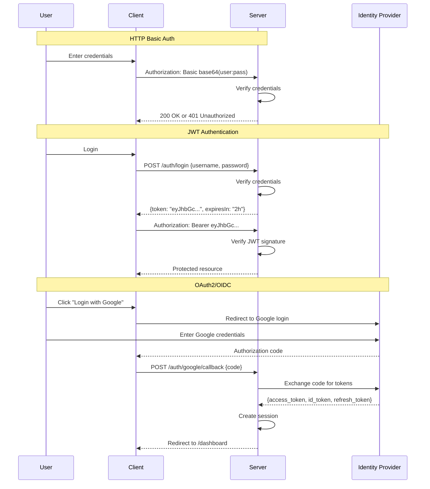

## Why Authentication Matters

Authentication verifies user identity before granting access to protected resources. Production systems require secure, scalable authentication that prevents credential theft, supports multiple authentication methods, and integrates with enterprise identity providers.

**Core Benefits**:

- **Security**: Prevent unauthorized access to sensitive data
- **User management**: Track actions by user for audit trails
- **Authorization foundation**: Identity enables permission checking
- **Compliance**: Meet regulatory requirements (GDPR, SOC2, HIPAA)
- **Single Sign-On**: Integrate with enterprise identity providers

**Problem**: Basic authentication mechanisms lack security (plain text credentials), scalability (session storage), and enterprise features (SSO, MFA).

**Solution**: Use production authentication frameworks (JWT with jose, OAuth2/OIDC with Passport.js/Auth0) that provide secure token-based authentication, refresh mechanisms, and enterprise integrations.

## Standard Library First: HTTP Basic Authentication

HTTP Basic Authentication sends credentials in request headers using Base64 encoding without external dependencies.

### Basic Auth Implementation

Node.js provides the `Buffer` class for Base64 encoding credentials in HTTP Basic Auth format.

**Pattern**:

```typescript
import http from "http";
// => Node.js built-in HTTP server
// => No external dependencies

interface User {
  // => User database schema
  username: string;
  passwordHash: string;
  // => Never store plain text passwords
  // => Use bcrypt or similar for hashing
}

const users: User[] = [
  // => In-memory user database
  // => Production: Use database (PostgreSQL, MongoDB)
  {
    username: "alice",
    passwordHash: "hashed_password_123",
    // => Pre-hashed password
    // => Real hash: $2b$10$... (bcrypt)
  },
];

function parseBasicAuth(authHeader: string): { username: string; password: string } | null {
  // => Parse Authorization header
  // => Format: "Basic base64(username:password)"

  if (!authHeader || !authHeader.startsWith("Basic ")) {
    // => Check header exists and starts with "Basic "
    return null;
  }

  const base64Credentials = authHeader.slice(6);
  // => Remove "Basic " prefix
  // => Remaining: base64-encoded credentials

  const credentials = Buffer.from(base64Credentials, "base64").toString("utf-8");
  // => Decode from Base64 to UTF-8
  // => Result: "username:password"

  const [username, password] = credentials.split(":");
  // => Split on first colon
  // => username before colon, password after

  return { username, password };
  // => Return parsed credentials
}

function authenticateUser(username: string, password: string): User | null {
  // => Verify credentials against database
  // => Returns user if valid, null if invalid

  const user = users.find((u) => u.username === username);
  // => Find user by username
  // => O(n) lookup (production: use indexed database)

  if (!user) {
    // => User not found
    return null;
  }

  // Simple comparison (production: use bcrypt.compare())
  const isValidPassword = user.passwordHash === password;
  // => Compare password with stored hash
  // => Production: bcrypt.compare(password, user.passwordHash)

  return isValidPassword ? user : null;
  // => Return user if password matches
}

const server = http.createServer((req, res) => {
  // => HTTP server handler
  // => Processes each request

  const authHeader = req.headers.authorization;
  // => Get Authorization header
  // => Format: "Basic base64(username:password)"

  if (!authHeader) {
    // => No credentials provided
    res.writeHead(401, {
      "WWW-Authenticate": 'Basic realm="Protected Area"',
      // => WWW-Authenticate triggers browser login prompt
      // => realm: Describes protected resource
    });
    res.end("Authentication required");
    // => 401 Unauthorized response
    return;
  }

  const credentials = parseBasicAuth(authHeader);
  // => Parse credentials from header
  // => Returns { username, password } or null

  if (!credentials) {
    // => Invalid header format
    res.writeHead(401, { "WWW-Authenticate": 'Basic realm="Protected Area"' });
    res.end("Invalid credentials format");
    return;
  }

  const user = authenticateUser(credentials.username, credentials.password);
  // => Verify credentials
  // => Returns user or null

  if (!user) {
    // => Invalid credentials
    res.writeHead(401, { "WWW-Authenticate": 'Basic realm="Protected Area"' });
    res.end("Invalid username or password");
    return;
  }

  // Authenticated successfully
  res.writeHead(200, { "Content-Type": "application/json" });
  res.end(
    JSON.stringify({
      message: "Access granted",
      user: user.username,
    }),
  );
  // => Return protected resource
});

server.listen(3000);
// => Start server on port 3000
```

**Client usage**:

```typescript
const username = "alice";
const password = "secret123";
// => User credentials

const base64Credentials = Buffer.from(`${username}:${password}`).toString("base64");
// => Encode "username:password" as Base64
// => Result: "YWxpY2U6c2VjcmV0MTIz"

const response = await fetch("http://localhost:3000", {
  headers: {
    Authorization: `Basic ${base64Credentials}`,
    // => Set Authorization header
    // => Format: "Basic YWxpY2U6c2VjcmV0MTIz"
  },
});
// => Send authenticated request
```

**Limitations for production**:

- **Credentials in every request**: Base64-encoded credentials sent with every request (network exposure)
- **No encryption**: Base64 is encoding, not encryption (credentials readable if intercepted)
- **No expiration**: Credentials valid indefinitely (cannot revoke without password change)
- **No refresh mechanism**: User must re-enter credentials when session ends
- **No role/permission support**: Only authentication, no authorization metadata
- **Requires HTTPS**: Must use TLS or credentials sent in plain text
- **Browser caching**: Browser stores credentials (security risk on shared computers)
- **No single sign-on**: Cannot integrate with enterprise identity providers
- **No multi-factor authentication**: Only username/password supported

**When standard library suffices**:

- Internal tools on trusted networks
- Simple APIs with few users (≤10)
- Development/testing environments
- Always with HTTPS

## Production Framework: JWT with jose

JSON Web Tokens (JWT) provide stateless, secure authentication with cryptographic signatures and claims-based authorization.

### Installation and Setup

```bash
npm install jose
# => Install jose library
# => Modern, secure JWT implementation
# => JOSE: JSON Object Signing and Encryption
```

**JWT token structure**:

```typescript
import { SignJWT, jwtVerify } from "jose";
// => Import JWT functions
// => SignJWT: Create tokens
// => jwtVerify: Verify tokens

const secret = new TextEncoder().encode(process.env.JWT_SECRET || "your-secret-key");
// => Secret key for signing tokens
// => Production: Use strong random key (32+ bytes)
// => Store in environment variable

async function createToken(userId: string, username: string): Promise<string> {
  // => Create JWT token for authenticated user
  // => Returns signed token string

  const token = await new SignJWT({
    // => Payload (claims)
    userId: userId,
    // => Custom claim: user ID
    username: username,
    // => Custom claim: username
    role: "user",
    // => Custom claim: user role (for authorization)
  })
    .setProtectedHeader({ alg: "HS256" })
    // => Algorithm: HMAC-SHA256
    // => Symmetric key signature
    .setIssuedAt()
    // => iat claim: Token issue time
    // => Unix timestamp
    .setExpirationTime("2h")
    // => exp claim: Token expires in 2 hours
    // => After expiration, token invalid
    .setIssuer("my-app")
    // => iss claim: Token issuer
    // => Identifies token creator
    .setAudience("my-app-users")
    // => aud claim: Intended audience
    // => Prevents token reuse in other systems
    .sign(secret);
  // => Sign token with secret key
  // => Creates cryptographic signature

  return token;
  // => Return signed JWT
  // => Format: header.payload.signature
}

async function verifyToken(token: string): Promise<{ userId: string; username: string; role: string } | null> {
  // => Verify JWT signature and claims
  // => Returns payload if valid, null if invalid

  try {
    const { payload } = await jwtVerify(token, secret, {
      // => Verify signature with secret key
      issuer: "my-app",
      // => Verify iss claim matches
      audience: "my-app-users",
      // => Verify aud claim matches
    });
    // => Verifies:
    // => 1. Signature is valid (not tampered)
    // => 2. Token not expired (exp claim)
    // => 3. Issuer matches
    // => 4. Audience matches

    return {
      userId: payload.userId as string,
      username: payload.username as string,
      role: payload.role as string,
    };
    // => Return verified payload
  } catch (error) {
    // => Verification failed
    // => Invalid signature, expired, wrong issuer/audience
    console.error("Token verification failed:", error);
    return null;
  }
}
```

**Express middleware integration**:

```typescript
import express from "express";
// => Express web framework
// => Simplifies HTTP handling

const app = express();
app.use(express.json());
// => Parse JSON request bodies

// Login endpoint
app.post("/auth/login", async (req, res) => {
  // => User login endpoint
  // => Returns JWT on successful authentication

  const { username, password } = req.body;
  // => Extract credentials from request body
  // => JSON: { "username": "alice", "password": "secret123" }

  // Verify credentials (same as Basic Auth example)
  const user = authenticateUser(username, password);
  // => Authenticate against database
  // => Returns user or null

  if (!user) {
    // => Invalid credentials
    res.status(401).json({ error: "Invalid credentials" });
    return;
  }

  // Create JWT token
  const token = await createToken("user-123", user.username);
  // => Generate JWT for authenticated user
  // => Token valid for 2 hours

  res.json({
    token: token,
    // => JWT token
    // => Client stores and sends in subsequent requests
    expiresIn: "2h",
    // => Token expiration time
  });
  // => Return token to client
});

// Authentication middleware
async function authMiddleware(req: express.Request, res: express.Response, next: express.NextFunction) {
  // => Middleware to verify JWT on protected routes
  // => Runs before route handler

  const authHeader = req.headers.authorization;
  // => Get Authorization header
  // => Format: "Bearer eyJhbGciOiJIUzI1NiIsInR5cCI6IkpXVCJ9..."

  if (!authHeader || !authHeader.startsWith("Bearer ")) {
    // => No token provided or wrong format
    res.status(401).json({ error: "No token provided" });
    return;
  }

  const token = authHeader.slice(7);
  // => Remove "Bearer " prefix
  // => Remaining: JWT token

  const payload = await verifyToken(token);
  // => Verify token signature and claims
  // => Returns payload or null

  if (!payload) {
    // => Invalid or expired token
    res.status(401).json({ error: "Invalid or expired token" });
    return;
  }

  // Attach user info to request
  req.user = payload;
  // => Make user data available in route handlers
  // => req.user: { userId, username, role }

  next();
  // => Continue to route handler
}

// Protected route
app.get("/api/profile", authMiddleware, (req, res) => {
  // => Protected endpoint
  // => Requires valid JWT token

  res.json({
    message: "Profile data",
    user: req.user,
    // => User data from verified token
  });
});

app.listen(3000);
// => Start server on port 3000
```

**Client usage**:

```typescript
// Login to get token
const loginResponse = await fetch("http://localhost:3000/auth/login", {
  method: "POST",
  headers: { "Content-Type": "application/json" },
  body: JSON.stringify({
    username: "alice",
    password: "secret123",
  }),
});

const { token } = await loginResponse.json();
// => Extract JWT token
// => Store in localStorage or httpOnly cookie

// Use token for authenticated requests
const profileResponse = await fetch("http://localhost:3000/api/profile", {
  headers: {
    Authorization: `Bearer ${token}`,
    // => Send JWT in Authorization header
  },
});

const profileData = await profileResponse.json();
// => Access protected resource
```

### Refresh Tokens

Implement refresh tokens to extend user sessions without re-authentication.

**Pattern**:

```typescript
// Refresh token storage (production: database)
const refreshTokens = new Set<string>();
// => Store valid refresh tokens
// => Production: Redis or database

async function createTokenPair(userId: string, username: string) {
  // => Create access + refresh token pair
  // => Access token: short-lived (15 min)
  // => Refresh token: long-lived (7 days)

  const accessToken = await new SignJWT({ userId, username, role: "user" })
    .setProtectedHeader({ alg: "HS256" })
    .setExpirationTime("15m")
    // => Access token expires in 15 minutes
    // => Short-lived for security
    .sign(secret);

  const refreshToken = await new SignJWT({ userId, type: "refresh" })
    .setProtectedHeader({ alg: "HS256" })
    .setExpirationTime("7d")
    // => Refresh token expires in 7 days
    // => Long-lived for convenience
    .sign(secret);

  refreshTokens.add(refreshToken);
  // => Store refresh token
  // => Production: Database with user_id index

  return { accessToken, refreshToken };
  // => Return both tokens
}

app.post("/auth/refresh", async (req, res) => {
  // => Refresh endpoint
  // => Exchange refresh token for new access token

  const { refreshToken } = req.body;
  // => Get refresh token from request

  if (!refreshTokens.has(refreshToken)) {
    // => Refresh token not found or revoked
    res.status(401).json({ error: "Invalid refresh token" });
    return;
  }

  try {
    const { payload } = await jwtVerify(refreshToken, secret);
    // => Verify refresh token signature and expiration

    if (payload.type !== "refresh") {
      // => Not a refresh token (access token submitted instead)
      res.status(401).json({ error: "Invalid token type" });
      return;
    }

    // Create new access token
    const accessToken = await new SignJWT({
      userId: payload.userId as string,
      username: payload.username as string,
      role: "user",
    })
      .setProtectedHeader({ alg: "HS256" })
      .setExpirationTime("15m")
      .sign(secret);

    res.json({ accessToken });
    // => Return new access token
    // => Refresh token remains valid
  } catch (error) {
    res.status(401).json({ error: "Invalid or expired refresh token" });
  }
});

app.post("/auth/logout", async (req, res) => {
  // => Logout endpoint
  // => Revokes refresh token

  const { refreshToken } = req.body;

  refreshTokens.delete(refreshToken);
  // => Remove refresh token from storage
  // => User must login again to get new refresh token

  res.json({ message: "Logged out successfully" });
});
```

**Production benefits**:

- **Stateless**: No server-side session storage (scales horizontally)
- **Secure**: Cryptographic signature prevents tampering
- **Claims-based**: Include user metadata in token (roles, permissions)
- **Expiration**: Tokens expire automatically (time-limited access)
- **Refresh mechanism**: Extend sessions without re-authentication
- **Cross-domain**: Works across different domains (CORS-friendly)

**Trade-offs**:

- **External dependency**: jose library (100KB)
- **Token size**: JWTs larger than session IDs (200-300 bytes)
- **No revocation**: Cannot invalidate access tokens before expiration (use short expiration + refresh tokens)
- **Secret management**: Must protect signing key

**When to use JWT**:

- Microservices architecture (stateless authentication)
- Mobile/SPA applications (token-based auth)
- API authentication (no cookies required)
- Cross-domain authentication (multiple subdomains)

## Production Framework: OAuth2 and OpenID Connect

OAuth2/OIDC provide enterprise-grade authentication with SSO, MFA, and integration with identity providers.

### OAuth2 Flow with Passport.js

Passport.js is authentication middleware supporting 500+ strategies (Google, GitHub, Azure AD, etc.).

**Installation**:

```bash
npm install passport passport-google-oauth20 express-session
# => passport: Authentication middleware
# => passport-google-oauth20: Google OAuth2 strategy
# => express-session: Session management
```

**Google OAuth2 setup**:

```typescript
import passport from "passport";
import { Strategy as GoogleStrategy } from "passport-google-oauth20";
import session from "express-session";
// => Import OAuth2 dependencies

// Configure session middleware
app.use(
  session({
    secret: process.env.SESSION_SECRET || "session-secret",
    // => Session encryption key
    // => Production: Strong random key
    resave: false,
    // => Don't save session if unmodified
    saveUninitialized: false,
    // => Don't create session until something stored
    cookie: {
      secure: process.env.NODE_ENV === "production",
      // => HTTPS only in production
      httpOnly: true,
      // => Not accessible via JavaScript (XSS protection)
      maxAge: 24 * 60 * 60 * 1000,
      // => 24 hour expiration
    },
  }),
);

app.use(passport.initialize());
// => Initialize Passport
app.use(passport.session());
// => Enable persistent login sessions

// Configure Google OAuth2 strategy
passport.use(
  new GoogleStrategy(
    {
      clientID: process.env.GOOGLE_CLIENT_ID!,
      // => Google OAuth2 client ID
      // => Get from Google Cloud Console
      clientSecret: process.env.GOOGLE_CLIENT_SECRET!,
      // => Google OAuth2 client secret
      // => Keep secret, never commit to git
      callbackURL: "http://localhost:3000/auth/google/callback",
      // => Redirect URL after Google authentication
      // => Must match Google Console configuration
    },
    async (accessToken, refreshToken, profile, done) => {
      // => Callback after successful Google authentication
      // => accessToken: Google API access token
      // => profile: User profile from Google

      try {
        // Find or create user in database
        let user = await findUserByGoogleId(profile.id);
        // => Check if user exists
        // => production: Database query

        if (!user) {
          // => New user, create account
          user = await createUser({
            googleId: profile.id,
            // => Google user ID (unique)
            email: profile.emails?.[0].value,
            // => Email from Google profile
            name: profile.displayName,
            // => Display name from Google
            avatar: profile.photos?.[0].value,
            // => Profile picture URL
          });
        }

        done(null, user);
        // => Success: Pass user to Passport
      } catch (error) {
        done(error);
        // => Error: Pass error to Passport
      }
    },
  ),
);

// Serialize user for session storage
passport.serializeUser((user: any, done) => {
  // => Store minimal user data in session
  // => Only user ID stored (not full user object)
  done(null, user.id);
});

// Deserialize user from session
passport.deserializeUser(async (id: string, done) => {
  // => Load user from database using ID
  try {
    const user = await findUserById(id);
    // => Database query
    done(null, user);
  } catch (error) {
    done(error);
  }
});

// Authentication routes
app.get(
  "/auth/google",
  passport.authenticate("google", {
    scope: ["profile", "email"],
    // => Request profile and email from Google
  }),
);
// => Redirects to Google login page

app.get(
  "/auth/google/callback",
  passport.authenticate("google", {
    failureRedirect: "/login",
    // => Redirect to login page if authentication fails
  }),
  (req, res) => {
    // => Success callback
    // => User authenticated and stored in session
    res.redirect("/dashboard");
    // => Redirect to protected page
  },
);

// Authentication middleware
function ensureAuthenticated(req: express.Request, res: express.Response, next: express.NextFunction) {
  // => Verify user logged in
  if (req.isAuthenticated()) {
    // => Passport adds isAuthenticated() method
    // => Returns true if user in session
    return next();
  }
  res.redirect("/login");
  // => Redirect to login if not authenticated
}

// Protected route
app.get("/dashboard", ensureAuthenticated, (req, res) => {
  // => Protected page
  // => Requires authentication
  res.json({
    message: "Dashboard",
    user: req.user,
    // => User object from session
  });
});

// Logout
app.get("/logout", (req, res) => {
  req.logout((err) => {
    // => Passport logout function
    // => Removes user from session
    if (err) {
      return res.status(500).json({ error: "Logout failed" });
    }
    res.redirect("/");
  });
});
```

### Auth0 Integration (Managed Authentication)

Auth0 provides managed authentication with built-in security, MFA, and enterprise features.

**Installation**:

```bash
npm install express-openid-connect
# => Auth0 Express middleware
# => Simplifies OpenID Connect integration
```

**Configuration**:

```typescript
import { auth } from "express-openid-connect";
// => Auth0 middleware

const config = {
  authRequired: false,
  // => Don't require auth for all routes (manual per route)
  auth0Logout: true,
  // => Logout from Auth0 on logout
  secret: process.env.AUTH0_SECRET,
  // => Session encryption key
  baseURL: "http://localhost:3000",
  // => Application base URL
  clientID: process.env.AUTH0_CLIENT_ID,
  // => Auth0 client ID
  issuerBaseURL: `https://${process.env.AUTH0_DOMAIN}`,
  // => Auth0 tenant URL
};

app.use(auth(config));
// => Apply Auth0 middleware
// => Adds /login, /logout, /callback routes automatically

// Check authentication status
app.get("/", (req, res) => {
  res.json({
    isAuthenticated: req.oidc.isAuthenticated(),
    // => Boolean: User logged in
    user: req.oidc.user,
    // => User profile from Auth0 (if authenticated)
  });
});

// Protected route (Auth0 middleware)
const { requiresAuth } = require("express-openid-connect");

app.get("/profile", requiresAuth(), (req, res) => {
  // => requiresAuth middleware
  // => Redirects to login if not authenticated
  res.json(req.oidc.user);
  // => User profile from OpenID Connect token
});
```

**Production benefits**:

- **Enterprise SSO**: Integrate with Google, Microsoft, Okta, SAML
- **Multi-factor authentication**: Built-in MFA support
- **Managed infrastructure**: Auth0 handles scaling, security patches
- **User management**: Admin UI for user management
- **Compliance**: SOC2, GDPR, HIPAA compliant
- **Advanced features**: Passwordless, biometric, risk-based authentication

**Trade-offs**:

- **External service**: Dependency on Auth0 availability
- **Cost**: Free tier limited, paid plans for production
- **Vendor lock-in**: Migration to another provider requires changes

**When to use OAuth2/OIDC**:

- Enterprise applications (need SSO, MFA)
- B2C applications (social login required)
- Compliance requirements (audit trails, MFA)
- Large user base (managed infrastructure)

## Authentication Flow Progression Diagram



## Production Best Practices

### Secure Token Storage

Store tokens securely to prevent theft and unauthorized access.

**Client-side storage options**:

```typescript
// ❌ BAD: localStorage (vulnerable to XSS)
localStorage.setItem("token", jwtToken);
// => Accessible via JavaScript
// => XSS attack can steal token

// ✅ GOOD: httpOnly cookie (not accessible via JavaScript)
res.cookie("token", jwtToken, {
  httpOnly: true,
  // => Not accessible via document.cookie
  // => Protects against XSS
  secure: true,
  // => HTTPS only
  sameSite: "strict",
  // => CSRF protection
  // => Cookie only sent to same origin
  maxAge: 2 * 60 * 60 * 1000,
  // => 2 hour expiration
});

// ✅ BETTER: Memory storage (cleared on page reload)
let tokenInMemory: string | null = null;
// => Token only in memory
// => Lost on page reload (must re-authenticate)
// => Most secure for sensitive apps
```

### Password Hashing

Never store plain text passwords.

**Pattern**:

```typescript
import bcrypt from "bcrypt";
// => bcrypt hashing library
// => Industry standard for password hashing

async function hashPassword(password: string): Promise<string> {
  // => Hash password for storage
  const saltRounds = 10;
  // => bcrypt work factor
  // => Higher = slower but more secure
  // => 10 = good balance (2024)

  return await bcrypt.hash(password, saltRounds);
  // => Generate salt and hash password
  // => Result: $2b$10$... (60 characters)
}

async function verifyPassword(password: string, hash: string): Promise<boolean> {
  // => Verify password against stored hash
  return await bcrypt.compare(password, hash);
  // => Constant-time comparison
  // => Prevents timing attacks
}

// Usage
const user = await findUserByUsername("alice");
const isValid = await verifyPassword(password, user.passwordHash);
// => Verify password
```

### Rate Limiting

Prevent brute force attacks with rate limiting.

**Pattern**:

```typescript
import rateLimit from "express-rate-limit";
// => Express rate limiting middleware

const loginLimiter = rateLimit({
  windowMs: 15 * 60 * 1000,
  // => 15 minute window
  max: 5,
  // => 5 requests per window
  message: "Too many login attempts, please try again later",
  // => Error message when limit exceeded
  standardHeaders: true,
  // => Return rate limit info in headers
  legacyHeaders: false,
});

app.post("/auth/login", loginLimiter, async (req, res) => {
  // => Apply rate limiter to login endpoint
  // => Prevents brute force attacks
  // ... login logic
});
```

## Trade-offs and When to Use Each

### HTTP Basic Auth (Standard Library)

**Use when**:

- Internal tools on trusted networks
- Simple APIs with few users
- Development/testing only
- Always with HTTPS

**Avoid when**:

- Public-facing applications (security risk)
- Need token expiration (credentials never expire)
- Mobile/SPA apps (credentials in storage)
- Enterprise requirements (no SSO, MFA)

### JWT (jose)

**Use when**:

- Microservices architecture (stateless auth)
- Mobile/SPA applications (token-based)
- API authentication (no cookies)
- Cross-domain authentication

**Avoid when**:

- Need immediate token revocation (tokens valid until expiration)
- Simple applications (Basic Auth simpler)
- Token size matters (JWTs larger than session IDs)

### OAuth2/OIDC (Passport.js/Auth0)

**Use when**:

- Enterprise applications (SSO, MFA required)
- Social login desired (Google, GitHub, etc.)
- Large user base (managed infrastructure)
- Compliance requirements (audit, MFA)

**Avoid when**:

- Simple applications (overkill)
- Full control required (vendor dependency)
- Cost-sensitive (Auth0 paid plans)

## Common Pitfalls

### Pitfall 1: Storing Passwords in Plain Text

**Problem**: Database breach exposes all passwords.

**Solution**: Always hash passwords with bcrypt.

```typescript
// ❌ BAD
const user = { username: "alice", password: "secret123" };

// ✅ GOOD
const user = {
  username: "alice",
  passwordHash: await bcrypt.hash("secret123", 10),
};
```

### Pitfall 2: JWT Secrets in Code

**Problem**: Hardcoded secrets exposed in git history.

**Solution**: Store secrets in environment variables.

```typescript
// ❌ BAD
const secret = "my-secret-key";

// ✅ GOOD
const secret = process.env.JWT_SECRET;
if (!secret) {
  throw new Error("JWT_SECRET environment variable required");
}
```

### Pitfall 3: No Token Expiration

**Problem**: Stolen tokens valid forever.

**Solution**: Set short expiration + refresh tokens.

```typescript
// ❌ BAD: No expiration
const token = await new SignJWT(payload).setProtectedHeader({ alg: "HS256" }).sign(secret);

// ✅ GOOD: Short-lived access token + refresh token
const accessToken = await new SignJWT(payload)
  .setExpirationTime("15m") // 15 minutes
  .sign(secret);

const refreshToken = await new SignJWT({ userId, type: "refresh" })
  .setExpirationTime("7d") // 7 days
  .sign(secret);
```

### Pitfall 4: CORS Misconfiguration

**Problem**: Cookies not sent cross-origin.

**Solution**: Configure CORS with credentials.

```typescript
import cors from "cors";

app.use(
  cors({
    origin: "https://example.com",
    // => Allow specific origin
    credentials: true,
    // => Allow cookies cross-origin
  }),
);
```

## Summary

Authentication verifies user identity securely. HTTP Basic Auth sends credentials in headers (insecure without HTTPS), JWT provides stateless token-based authentication, and OAuth2/OIDC enable enterprise SSO and social login.

**Progression path**:

1. **Learn with Basic Auth**: Understand authentication fundamentals
2. **Production with JWT**: Stateless, scalable authentication
3. **Enterprise with OAuth2/OIDC**: SSO, MFA, social login

**Production checklist**:

- ✅ HTTPS required (TLS 1.2+)
- ✅ Passwords hashed with bcrypt (never plain text)
- ✅ JWT secrets in environment variables
- ✅ Short token expiration (15 min access, 7 day refresh)
- ✅ httpOnly cookies (XSS protection)
- ✅ Rate limiting on login endpoints (brute force protection)
- ✅ CSRF protection (sameSite cookies)
- ✅ Secure session configuration

Choose authentication method based on project needs: JWT for stateless APIs, OAuth2/OIDC for enterprise features.
