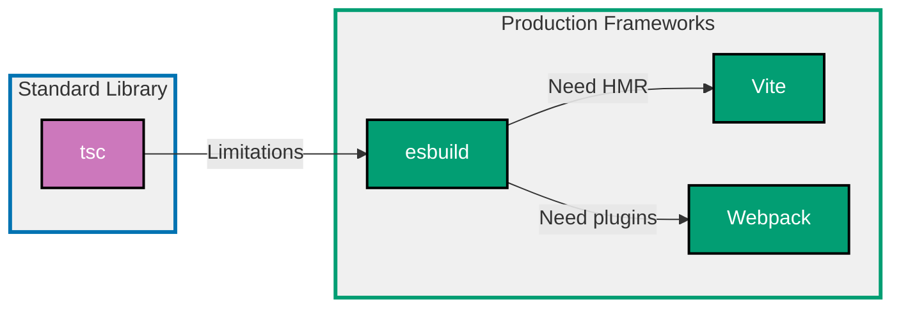

## Why Build Tools Matter

Build tools transform TypeScript source code into optimized JavaScript bundles for production deployment. Modern applications require bundling, tree-shaking, code splitting, minification, and asset optimization that standard compilers cannot provide alone.

**Core Benefits**:

- **Bundle optimization**: Reduce bundle size by 50-80% through tree-shaking
- **Development speed**: Hot Module Replacement (HMR) provides instant feedback
- **Production readiness**: Minification, source maps, and code splitting
- **Asset management**: Handle CSS, images, fonts alongside JavaScript
- **Framework integration**: Seamless integration with React, Vue, Svelte

**Problem**: TypeScript's `tsc` compiler only transpiles TypeScript to JavaScript without bundling, optimization, or asset management.

**Solution**: Use production build tools (esbuild, Vite, Webpack) that provide bundling, optimization, and modern development workflows.

## Standard Library First: TypeScript Compiler (tsc)

TypeScript provides the official compiler `tsc` for transpiling TypeScript to JavaScript without external dependencies.

### Basic Compilation with tsc

The TypeScript compiler transforms TypeScript syntax into JavaScript that browsers and Node.js can execute.

**Pattern**:

```typescript
// src/calculator.ts
export class Calculator {
  // => Export for use in other modules
  // => TypeScript class with type annotations

  add(a: number, b: number): number {
    // => Method signature with type parameters
    // => Returns number type
    return a + b;
    // => Simple addition operation
  }

  multiply(a: number, b: number): number {
    // => Another typed method
    return a * b;
    // => Multiplication operation
  }
}

// src/index.ts
import { Calculator } from "./calculator";
// => Import Calculator from local module
// => Relative path with .ts extension omitted

const calc = new Calculator();
// => Create instance of Calculator
// => Type inference from class definition

console.log(calc.add(5, 3));
// => Output: 8
// => Call add method with numbers

console.log(calc.multiply(4, 7));
// => Output: 28
// => Call multiply method with numbers
```

**Configuration** (tsconfig.json):

```json
{
  "compilerOptions": {
    "target": "ES2020",
    // => Output JavaScript version (ES2020)
    // => Determines available language features
    "module": "ESNext",
    // => Module system (ESNext for modern imports)
    // => Alternatives: CommonJS, AMD, UMD
    "outDir": "./dist",
    // => Output directory for compiled JavaScript
    // => Keeps source and output separate
    "rootDir": "./src",
    // => Source directory root
    // => Preserves directory structure in output
    "strict": true,
    // => Enable all strict type-checking options
    // => Catches more type errors at compile time
    "esModuleInterop": true,
    // => Allow default imports from CommonJS modules
    // => Better interoperability with npm packages
    "skipLibCheck": true,
    // => Skip type checking of declaration files
    // => Faster compilation
    "forceConsistentCasingInFileNames": true
    // => Ensure case-sensitive file imports
    // => Prevents issues on case-insensitive filesystems
  },
  "include": ["src/**/*"],
  // => Include all files in src directory
  // => Glob pattern matches all TypeScript files
  "exclude": ["node_modules", "dist"]
  // => Exclude dependencies and output
  // => Faster compilation by ignoring these
}
```

**Build command**:

```bash
tsc
# => Compiles TypeScript to JavaScript
# => Uses tsconfig.json configuration
# => Output goes to dist/ directory
```

**Output** (dist/calculator.js):

```javascript
export class Calculator {
  add(a, b) {
    // => Type annotations removed
    // => JavaScript doesn't support TypeScript types
    return a + b;
  }
  multiply(a, b) {
    return a * b;
  }
}
```

**Limitations for production**:

- **No bundling**: Each file stays separate, causing many HTTP requests
- **No tree-shaking**: Unused code included in output
- **No minification**: Full variable names and whitespace remain
- **No code splitting**: Can't split bundles by route or feature
- **No asset handling**: Can't process CSS, images, or fonts
- **No HMR**: Full page reload required for every change
- **Slow builds**: Single-threaded compilation for large projects

**When standard library suffices**:

- Small Node.js scripts (≤5 files)
- Internal tools without deployment constraints
- Learning TypeScript fundamentals
- Libraries published to npm (consumers handle bundling)

## Production Framework: esbuild

esbuild is an extremely fast JavaScript/TypeScript bundler written in Go that provides production-ready bundling with minimal configuration.

### Installation and Basic Setup

```bash
npm install --save-dev esbuild
# => Install esbuild as development dependency
# => Only needed during build process
# => Not required in production runtime
```

**Build script** (package.json):

```json
{
  "scripts": {
    "build": "esbuild src/index.ts --bundle --outfile=dist/bundle.js --minify --sourcemap",
    // => esbuild command with flags
    // => --bundle: Combines all imports into single file
    // => --outfile: Specifies output location
    // => --minify: Reduces bundle size
    // => --sourcemap: Generates source maps for debugging
    "watch": "esbuild src/index.ts --bundle --outfile=dist/bundle.js --watch"
    // => --watch: Rebuild on file changes
    // => Faster development workflow
  }
}
```

**Advanced configuration** (build.js):

```javascript
// build.js
import * as esbuild from "esbuild";
// => Import esbuild API
// => Programmatic build control

await esbuild.build({
  // => async build function
  // => Returns Promise with build result
  entryPoints: ["src/index.ts"],
  // => Entry point for bundling
  // => esbuild traces all imports from here
  bundle: true,
  // => Enable bundling (combine all modules)
  // => Without this, only transpiles
  outfile: "dist/bundle.js",
  // => Output file path
  // => Single bundle file
  minify: true,
  // => Minify output (reduce size)
  // => Removes whitespace, shortens names
  sourcemap: true,
  // => Generate source maps
  // => Maps minified code to original source
  target: "es2020",
  // => Target JavaScript version
  // => Determines transpilation level
  platform: "browser",
  // => Target platform (browser or node)
  // => Affects module resolution
  format: "esm",
  // => Output module format
  // => esm = ES modules, cjs = CommonJS
  splitting: true,
  // => Enable code splitting
  // => Creates multiple bundles
  outdir: "dist",
  // => Output directory (when splitting)
  // => Required with splitting: true
  loader: {
    ".png": "file",
    ".svg": "dataurl",
  },
  // => Asset loaders
  // => file: Copy to output, dataurl: Inline as base64
  define: {
    "process.env.NODE_ENV": '"production"',
  },
  // => Global replacements
  // => Enables dead code elimination
  logLevel: "info",
  // => Build logging verbosity
  // => info shows warnings and errors
});

console.log("Build complete");
// => Confirmation message
```

**Production benefits**:

- **10-100x faster**: Parallel processing in Go
- **Automatic bundling**: Single bundle or code-split chunks
- **Tree-shaking**: Removes unused code automatically
- **Minification**: Reduces bundle size by 60-80%
- **Source maps**: Debug minified production code
- **Asset handling**: Process CSS, images, fonts
- **Watch mode**: Instant rebuilds during development

**Trade-offs**:

- **External dependency**: 8MB binary (written in Go)
- **Limited plugins**: Smaller ecosystem than Webpack
- **Less flexibility**: Optimized for speed, not configurability

**When to use esbuild**:

- Production applications requiring fast builds
- Libraries needing optimized bundles
- Projects prioritizing build speed over plugin ecosystem

## Production Framework: Vite

Vite is a modern build tool that uses esbuild for development and Rollup for production, providing instant HMR and optimized production builds.

### Installation and Setup

```bash
npm create vite@latest my-app -- --template vanilla-ts
# => Create Vite project with TypeScript template
# => Initializes project structure
# => Installs Vite and dependencies

cd my-app
npm install
# => Install dependencies
# => Includes Vite, TypeScript, esbuild
```

**Configuration** (vite.config.ts):

```typescript
import { defineConfig } from "vite";
// => Import Vite configuration helper
// => Provides TypeScript types for config

export default defineConfig({
  // => Export Vite configuration object
  // => Type-safe configuration
  build: {
    // => Production build options
    target: "es2020",
    // => Target JavaScript version
    // => Same as tsconfig.json target
    outDir: "dist",
    // => Output directory
    // => Default is 'dist'
    minify: "esbuild",
    // => Minification method
    // => esbuild (fast) or terser (smaller)
    sourcemap: true,
    // => Generate source maps
    // => Enable debugging production builds
    rollupOptions: {
      // => Rollup-specific configuration
      // => Advanced bundling control
      output: {
        manualChunks: {
          // => Manual code splitting
          // => Separate vendor code from app code
          vendor: ["lodash", "axios"],
          // => Create vendor.js bundle
          // => Contains lodash and axios
        },
      },
    },
  },
  server: {
    // => Development server configuration
    port: 3000,
    // => Dev server port
    // => Default is 5173
    open: true,
    // => Auto-open browser
    // => Convenience during development
    hmr: {
      // => Hot Module Replacement config
      overlay: true,
      // => Show errors as overlay
      // => Better debugging experience
    },
  },
  resolve: {
    // => Module resolution options
    alias: {
      // => Path aliases
      // => Cleaner imports
      "@": "/src",
      // => @/utils instead of ../../../utils
    },
  },
});
```

**Development workflow**:

```bash
npm run dev
# => Start Vite dev server
# => Instant HMR (sub-100ms rebuilds)
# => esbuild pre-bundles dependencies
```

**Production build**:

```bash
npm run build
# => Build for production
# => Uses Rollup (better optimization than esbuild)
# => Generates optimized bundles with tree-shaking
```

**Production benefits**:

- **Instant HMR**: Sub-100ms hot module replacement
- **Dependency pre-bundling**: esbuild caches node_modules
- **Optimized production**: Rollup generates smaller bundles
- **Framework integration**: Official React, Vue, Svelte plugins
- **TypeScript support**: Zero-config TypeScript compilation

**Trade-offs**:

- **Two bundlers**: esbuild (dev) + Rollup (prod) = different behavior
- **Learning curve**: More concepts than simple esbuild
- **Opinionated**: Less flexible than raw Webpack

**When to use Vite**:

- Modern web applications (React, Vue, Svelte)
- Projects prioritizing DX (developer experience)
- Teams wanting fast HMR and simple config

## Production Framework: Webpack

Webpack is a mature, highly configurable bundler with extensive plugin ecosystem for complex production requirements.

### Installation and Setup

```bash
npm install --save-dev webpack webpack-cli typescript ts-loader
# => Install Webpack, CLI, and TypeScript loader
# => ts-loader: Compiles TypeScript via tsc
# => webpack-cli: Command-line interface
```

**Configuration** (webpack.config.js):

```javascript
const path = require("path");
// => Node.js path module
// => Resolve absolute paths

module.exports = {
  // => Webpack configuration object
  // => CommonJS export
  mode: "production",
  // => Build mode (production or development)
  // => production: enables minification, tree-shaking
  entry: "./src/index.ts",
  // => Entry point
  // => Webpack starts bundling from here
  output: {
    // => Output configuration
    filename: "bundle.[contenthash].js",
    // => Output filename with content hash
    // => [contenthash]: Cache busting
    path: path.resolve(__dirname, "dist"),
    // => Absolute output path
    // => __dirname: Current directory
    clean: true,
    // => Clean dist/ before build
    // => Removes old bundles
  },
  module: {
    // => Module processing rules
    rules: [
      {
        test: /\.tsx?$/,
        // => Match .ts and .tsx files
        // => Regular expression pattern
        use: "ts-loader",
        // => Use ts-loader for TypeScript
        // => Compiles TypeScript via tsc
        exclude: /node_modules/,
        // => Skip node_modules
        // => Faster builds
      },
      {
        test: /\.css$/,
        // => Match CSS files
        use: ["style-loader", "css-loader"],
        // => style-loader: Inject CSS into DOM
        // => css-loader: Process CSS imports
        // => Loaders execute right to left
      },
      {
        test: /\.(png|svg|jpg|jpeg|gif)$/i,
        // => Match image files
        // => i flag: case-insensitive
        type: "asset/resource",
        // => Copy assets to output
        // => Generates hashed filenames
      },
    ],
  },
  resolve: {
    // => Module resolution configuration
    extensions: [".tsx", ".ts", ".js"],
    // => Resolve these extensions
    // => Import without extension: import './module'
    alias: {
      "@": path.resolve(__dirname, "src"),
      // => Path alias
      // => import '@/utils' instead of '../../../utils'
    },
  },
  optimization: {
    // => Optimization configuration
    splitChunks: {
      // => Code splitting
      chunks: "all",
      // => Split all chunks (async + sync)
      cacheGroups: {
        // => Custom chunk groups
        vendor: {
          // => Vendor chunk
          test: /[\\/]node_modules[\\/]/,
          // => Match node_modules
          name: "vendor",
          // => Chunk name: vendor.js
          priority: 10,
          // => Higher priority than default
        },
      },
    },
    minimize: true,
    // => Minify output
    // => Uses TerserPlugin by default
    usedExports: true,
    // => Tree-shaking
    // => Remove unused exports
  },
  devtool: "source-map",
  // => Source map type
  // => source-map: Separate .map file (production)
  devServer: {
    // => Development server config
    static: "./dist",
    // => Serve static files from dist/
    hot: true,
    // => Hot Module Replacement
    port: 3000,
    // => Dev server port
  },
};
```

**Production benefits**:

- **Mature ecosystem**: 1000+ plugins and loaders
- **Maximum flexibility**: Configure every aspect
- **Advanced optimization**: Split chunks, lazy loading, prefetch
- **Asset management**: Process any file type
- **Production-tested**: Used by major companies

**Trade-offs**:

- **Complex configuration**: Steep learning curve
- **Slower builds**: Slower than esbuild/Vite
- **Maintenance overhead**: More configuration to maintain

**When to use Webpack**:

- Complex applications with specific requirements
- Projects needing custom loaders/plugins
- Teams with Webpack expertise
- Legacy projects already using Webpack

## Build Tool Progression Diagram



## Production Best Practices

### Environment-Specific Builds

Separate development and production configurations for optimal workflows.

**Development priorities**:

- Fast rebuilds (esbuild, Vite HMR)
- Source maps for debugging
- Detailed error messages
- No minification (readable output)

**Production priorities**:

- Smallest bundle size (minification, tree-shaking)
- Code splitting (lazy loading)
- Asset optimization (images, CSS)
- Cache busting (content hashes)

**Pattern** (Vite):

```typescript
// vite.config.ts
import { defineConfig } from "vite";

export default defineConfig(({ mode }) => {
  // => mode: 'development' or 'production'
  // => Passed via --mode flag or NODE_ENV
  const isDev = mode === "development";
  // => Check current mode

  return {
    build: {
      minify: isDev ? false : "esbuild",
      // => No minification in dev (faster builds)
      // => esbuild minification in production
      sourcemap: isDev ? "inline" : true,
      // => Inline maps in dev (no separate file)
      // => Separate map file in production
      rollupOptions: {
        output: {
          manualChunks: isDev
            ? undefined
            : {
                // => No splitting in dev (simpler debugging)
                // => Split vendor code in production
                vendor: ["react", "react-dom"],
              },
        },
      },
    },
  };
});
```

### Bundle Analysis

Analyze bundle size to identify optimization opportunities.

**Installation**:

```bash
npm install --save-dev rollup-plugin-visualizer
# => Bundle analysis plugin for Vite/Rollup
# => Generates interactive HTML report
```

**Configuration** (Vite):

```typescript
import { defineConfig } from "vite";
import { visualizer } from "rollup-plugin-visualizer";

export default defineConfig({
  plugins: [
    visualizer({
      // => Bundle analysis plugin
      filename: "./dist/stats.html",
      // => Output path for analysis report
      open: true,
      // => Auto-open report in browser
      gzipSize: true,
      // => Show gzipped sizes (realistic network transfer)
    }),
  ],
});
```

**Use analysis to**:

- Identify large dependencies (e.g., moment.js 300KB → date-fns 20KB)
- Find duplicate code in chunks
- Verify tree-shaking effectiveness
- Monitor bundle size over time

### Performance Monitoring

Track build performance and bundle size metrics.

**Pattern** (package.json):

```json
{
  "scripts": {
    "build:measure": "MEASURE=true vite build",
    "size-limit": "size-limit"
  }
}
```

**Size limit configuration** (size-limit config):

```bash
npm install --save-dev size-limit @size-limit/preset-big-lib
# => Install size-limit for bundle size monitoring
# => Fails CI if bundle exceeds threshold
```

```json
// .size-limit.json
[
  {
    "path": "dist/bundle.js",
    "limit": "50 KB",
    // => Maximum allowed bundle size
    // => Fails build if exceeded
    "gzip": true
    // => Measure gzipped size
  }
]
```

## Trade-offs and When to Use Each

### tsc (Standard Library)

**Use when**:

- Building npm libraries (consumers handle bundling)
- Small Node.js scripts (≤5 files)
- Learning TypeScript fundamentals
- No bundling required

**Avoid when**:

- Building web applications (need bundling)
- Production deployments (need optimization)
- Need asset processing (CSS, images)

### esbuild

**Use when**:

- Prioritizing build speed (10-100x faster than Webpack)
- Simple bundling requirements
- Building libraries or CLIs
- Monorepo builds (fast parallel builds)

**Avoid when**:

- Need extensive plugin ecosystem
- Complex transformation pipelines
- Maximum bundle size optimization (Rollup/Webpack better)

### Vite

**Use when**:

- Building modern web apps (React, Vue, Svelte)
- Want instant HMR (sub-100ms rebuilds)
- Prefer simple configuration
- Starting new projects

**Avoid when**:

- Need consistent dev/prod behavior (uses different bundlers)
- Building Node.js libraries
- Legacy browser support (ES modules only)

### Webpack

**Use when**:

- Complex applications with specific needs
- Need maximum configurability
- Using specialized loaders/plugins
- Maintaining existing Webpack projects

**Avoid when**:

- Prioritizing build speed
- Want simple configuration
- Starting new projects (Vite/esbuild simpler)

## Common Pitfalls

### Pitfall 1: No Code Splitting

**Problem**: Single bundle includes all code, even unused routes.

**Solution**: Configure code splitting by route or feature.

**Pattern** (Vite):

```typescript
// vite.config.ts
export default defineConfig({
  build: {
    rollupOptions: {
      output: {
        manualChunks(id) {
          // => Custom chunk splitting logic
          // => id: Module file path
          if (id.includes("node_modules")) {
            // => Separate vendor code
            return "vendor";
          }
          if (id.includes("/routes/")) {
            // => Split by route
            // => Each route in separate chunk
            const route = id.split("/routes/")[1].split("/")[0];
            return `route-${route}`;
          }
        },
      },
    },
  },
});
```

### Pitfall 2: Missing Source Maps

**Problem**: Cannot debug minified production code.

**Solution**: Always generate source maps for production.

```typescript
// vite.config.ts
export default defineConfig({
  build: {
    sourcemap: true,
    // => Generate .js.map files
    // => Browser DevTools map to original source
  },
});
```

### Pitfall 3: Unoptimized Dependencies

**Problem**: Large dependencies bloat bundle (e.g., moment.js 300KB).

**Solution**: Use bundle analysis and replace large dependencies.

```bash
# Replace moment.js (300KB) with date-fns (20KB)
npm uninstall moment
npm install date-fns
```

### Pitfall 4: No Build Performance Monitoring

**Problem**: Bundle size grows unnoticed until it's too large.

**Solution**: Use size-limit in CI to enforce bundle size budgets.

```json
// .size-limit.json
[
  {
    "path": "dist/bundle.js",
    "limit": "100 KB"
    // => CI fails if bundle > 100KB
  }
]
```

## Summary

Build tools transform TypeScript into optimized production bundles. Standard library `tsc` transpiles TypeScript without bundling, while production tools provide bundling, optimization, and development workflows.

**Progression path**:

1. **Learn with tsc**: Understand TypeScript compilation fundamentals
2. **Production with esbuild**: Fast bundling for simple requirements
3. **Modern apps with Vite**: Instant HMR and optimal DX
4. **Complex apps with Webpack**: Maximum flexibility and plugins

**Production checklist**:

- ✅ Minification enabled (reduce bundle size)
- ✅ Source maps generated (debug production code)
- ✅ Code splitting configured (lazy loading)
- ✅ Bundle analysis setup (monitor size)
- ✅ Size limits enforced (prevent bloat)
- ✅ Environment-specific builds (dev vs prod)

Choose build tools based on project needs: esbuild for speed, Vite for modern DX, Webpack for maximum control.
