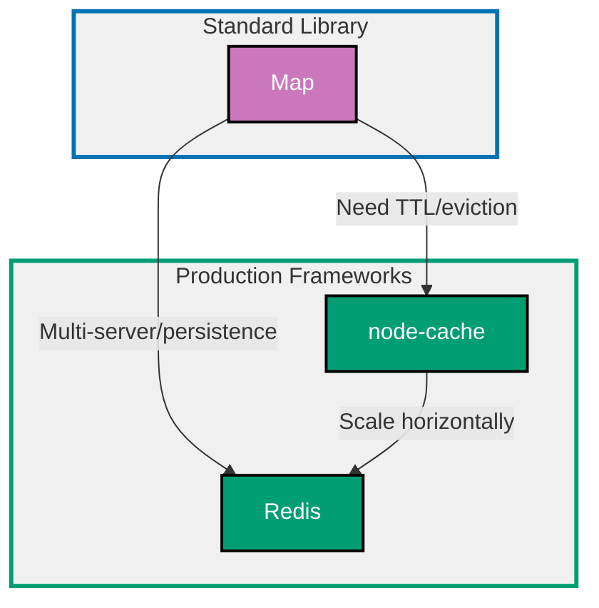

## Why Caching Matters

Caching stores frequently accessed data in fast storage to reduce latency, decrease database load, improve throughput, and enhance user experience. Proper caching strategy is critical for production systems handling significant traffic.

**Core Benefits**:

- **Reduced latency**: Serve data from memory (microseconds) vs database (milliseconds)
- **Lower database load**: Fewer queries reduce database costs and prevent overload
- **Higher throughput**: Handle more requests with same infrastructure
- **Improved reliability**: Graceful degradation when database unavailable
- **Cost savings**: Reduce expensive database queries and API calls

**Problem**: Built-in Map lacks TTL (time-to-live), LRU eviction, persistence, and distributed caching across multiple servers.

**Solution**: Use caching libraries (node-cache for single-server, Redis for distributed) that provide TTL, eviction policies, persistence, and cluster support.

## Standard Library First: Map

JavaScript/TypeScript provides the `Map` data structure for in-memory key-value storage without external dependencies.

### Basic In-Memory Caching with Map

The Map object stores key-value pairs and maintains insertion order.

**Pattern**:

```typescript
const cache = new Map<string, any>();
// => Create in-memory cache
// => Type: Map<string, any>
// => Keys are strings, values are any type

function getCachedUser(userId: string): User | undefined {
  // => Retrieve user from cache
  // => Returns undefined if not cached
  const cached = cache.get(userId);
  // => Map.get returns value or undefined
  // => O(1) lookup time

  if (cached) {
    // => Cache hit
    console.log(`Cache hit for user ${userId}`);
    return cached;
  }

  // => Cache miss
  console.log(`Cache miss for user ${userId}`);
  return undefined;
}

function cacheUser(userId: string, user: User): void {
  // => Store user in cache
  cache.set(userId, user);
  // => Map.set stores key-value pair
  // => O(1) insertion time
  console.log(`Cached user ${userId}`);
}

// Usage
const user = { id: "123", name: "Alice", email: "alice@example.com" };
cacheUser("123", user);
// => Stores user in cache

const retrieved = getCachedUser("123");
// => Output: Cache hit for user 123
// => Returns: { id: "123", name: "Alice", email: "alice@example.com" }

const notFound = getCachedUser("999");
// => Output: Cache miss for user 999
// => Returns: undefined
```

**Cache-aside pattern** (lazy loading):

```typescript
async function getUser(userId: string): Promise<User> {
  // => Get user with cache-aside pattern
  // => Check cache first, load from database if miss

  const cached = cache.get(userId);
  // => Check cache first (fast)
  if (cached) {
    // => Cache hit - return immediately
    return cached;
  }

  // => Cache miss - load from database
  const user = await database.users.findById(userId);
  // => Database query (slow)
  // => Simulated async database call

  if (user) {
    cache.set(userId, user);
    // => Store in cache for future requests
    // => Next request will be cache hit
  }

  return user;
}

// First call: Cache miss, loads from database
await getUser("123");
// => Loads from database, caches result

// Second call: Cache hit, no database query
await getUser("123");
// => Served from cache (much faster)
```

**Manual TTL with timestamps**:

```typescript
interface CacheEntry<T> {
  value: T;
  // => Cached value
  expiresAt: number;
  // => Expiration timestamp (milliseconds since epoch)
}

const cache = new Map<string, CacheEntry<any>>();
// => Cache with expiration metadata

function set<T>(key: string, value: T, ttlMs: number): void {
  // => Set cache entry with TTL
  // => ttlMs: time-to-live in milliseconds
  const expiresAt = Date.now() + ttlMs;
  // => Calculate expiration timestamp
  // => Date.now() returns current time in ms

  cache.set(key, { value, expiresAt });
  // => Store value with expiration
}

function get<T>(key: string): T | undefined {
  // => Get cache entry with expiration check
  const entry = cache.get(key);
  // => Retrieve entry from Map

  if (!entry) {
    // => Key not found
    return undefined;
  }

  if (Date.now() > entry.expiresAt) {
    // => Entry expired
    cache.delete(key);
    // => Remove expired entry
    return undefined;
  }

  // => Entry valid
  return entry.value;
}

// Usage
set("user:123", { name: "Alice" }, 5000);
// => Cache for 5 seconds (5000ms)

console.log(get("user:123"));
// => Output: { name: "Alice" } (within 5 seconds)

await new Promise((resolve) => setTimeout(resolve, 6000));
// => Wait 6 seconds (simulated delay)

console.log(get("user:123"));
// => Output: undefined (expired after 5 seconds)
```

**LRU eviction simulation** (limited size):

```typescript
class LRUCache<K, V> {
  // => Least Recently Used cache
  // => Evicts oldest entry when full
  private cache: Map<K, V>;
  // => Underlying Map storage
  private maxSize: number;
  // => Maximum number of entries

  constructor(maxSize: number) {
    // => Initialize cache with size limit
    this.cache = new Map();
    this.maxSize = maxSize;
  }

  get(key: K): V | undefined {
    // => Get value and mark as recently used
    const value = this.cache.get(key);
    // => Retrieve value

    if (value !== undefined) {
      // => Key exists - refresh position
      this.cache.delete(key);
      // => Remove from current position
      this.cache.set(key, value);
      // => Re-insert at end (most recent)
      // => Map maintains insertion order
    }

    return value;
  }

  set(key: K, value: V): void {
    // => Set value with LRU eviction
    if (this.cache.has(key)) {
      // => Key exists - update position
      this.cache.delete(key);
      // => Remove old entry
    } else if (this.cache.size >= this.maxSize) {
      // => Cache full - evict oldest
      const oldestKey = this.cache.keys().next().value;
      // => First key is oldest (insertion order)
      this.cache.delete(oldestKey);
      // => Evict least recently used
      console.log(`Evicted ${oldestKey}`);
    }

    this.cache.set(key, value);
    // => Insert at end (most recent)
  }
}

const lruCache = new LRUCache<string, string>(3);
// => Cache with max size 3

lruCache.set("a", "Alice");
lruCache.set("b", "Bob");
lruCache.set("c", "Charlie");
// => Cache: [a, b, c] (full)

lruCache.set("d", "David");
// => Output: Evicted a
// => Cache: [b, c, d] (oldest 'a' evicted)

lruCache.get("b");
// => Marks 'b' as recently used
// => Cache: [c, d, b] (b moved to end)

lruCache.set("e", "Eve");
// => Output: Evicted c
// => Cache: [d, b, e] (oldest 'c' evicted)
```

**Limitations for production**:

- **No automatic TTL**: Must manually track and clean expired entries
- **No background cleanup**: Expired entries remain until accessed
- **No LRU eviction**: Map grows indefinitely (memory leak risk)
- **No persistence**: Data lost on process restart
- **No distributed caching**: Cannot share cache across servers
- **No atomic operations**: Race conditions in concurrent updates
- **No memory management**: No automatic eviction when memory full

**When standard library suffices**:

- Single-server applications with low traffic
- Short-lived processes (scripts, CLI tools)
- Small cache size (<1000 entries)
- Simple cache-aside pattern only
- No persistence required

## Production Framework: node-cache

node-cache is a simple in-memory caching library with TTL, automatic cleanup, and statistics for single-server applications.

### Installation and Basic Setup

```bash
npm install node-cache
# => Install node-cache library
# => Lightweight, no external dependencies
# => Single-server in-memory caching
```

**Basic configuration**:

```typescript
import NodeCache from "node-cache";
// => Import node-cache library
// => Provides TTL and automatic cleanup

const cache = new NodeCache({
  // => Create cache instance
  stdTTL: 600,
  // => Default TTL: 600 seconds (10 minutes)
  // => Applied to all keys unless overridden
  checkperiod: 120,
  // => Cleanup interval: 120 seconds (2 minutes)
  // => Background task removes expired keys
  useClones: false,
  // => Return references (not clones) for performance
  // => Warning: Mutations affect cached objects
});

// Set with default TTL
cache.set("user:123", { id: "123", name: "Alice" });
// => Stored with 600s TTL (default)
// => Automatically expires after 10 minutes

// Set with custom TTL
cache.set("session:abc", { userId: "123" }, 300);
// => Stored with 300s TTL (5 minutes)
// => Third argument overrides default TTL

// Get value
const user = cache.get<User>("user:123");
// => Returns: { id: "123", name: "Alice" } or undefined
// => Type-safe with TypeScript generics

if (user) {
  console.log("Cache hit:", user.name);
  // => Output: Cache hit: Alice
} else {
  console.log("Cache miss");
}
```

**Cache-aside pattern with node-cache**:

```typescript
async function getUser(userId: string): Promise<User> {
  // => Get user with caching
  const cacheKey = `user:${userId}`;
  // => Cache key with namespace prefix
  // => Pattern: entity:id

  const cached = cache.get<User>(cacheKey);
  // => Check cache first
  if (cached) {
    // => Cache hit
    return cached;
  }

  // => Cache miss - load from database
  const user = await database.users.findById(userId);
  // => Database query

  if (user) {
    cache.set(cacheKey, user, 600);
    // => Cache for 10 minutes
    // => Future requests served from cache
  }

  return user;
}

// First call: Database query + cache store
await getUser("123");
// => Loads from database, caches for 10 minutes

// Subsequent calls: Cache hit (within 10 minutes)
await getUser("123");
// => Served from cache (no database query)
```

### Cache Statistics and Monitoring

node-cache provides built-in statistics for monitoring cache performance.

**Pattern**:

```typescript
const cache = new NodeCache({ stdTTL: 600 });

// Perform cache operations
cache.set("a", 1);
cache.set("b", 2);
cache.get("a");
cache.get("a");
cache.get("c"); // => Miss

// Get statistics
const stats = cache.getStats();
// => Returns cache statistics object

console.log("Cache statistics:");
console.log(`  Keys: ${stats.keys}`);
// => Number of keys in cache: 2
console.log(`  Hits: ${stats.hits}`);
// => Cache hits: 2 (two gets for "a")
console.log(`  Misses: ${stats.misses}`);
// => Cache misses: 1 (get for "c")
console.log(`  Hit rate: ${((stats.hits / (stats.hits + stats.misses)) * 100).toFixed(2)}%`);
// => Hit rate: 66.67% (2 hits / 3 total requests)
```

**Cache events for monitoring**:

```typescript
cache.on("set", (key, value) => {
  // => Event: Key set in cache
  console.log(`Cache set: ${key}`);
  // => Useful for debugging and monitoring
});

cache.on("del", (key, value) => {
  // => Event: Key deleted (manual or expired)
  console.log(`Cache deleted: ${key}`);
});

cache.on("expired", (key, value) => {
  // => Event: Key expired due to TTL
  console.log(`Cache expired: ${key}`);
  // => Automatically triggered by cleanup
});

cache.on("flush", () => {
  // => Event: Cache cleared
  console.log("Cache flushed");
});

cache.set("user:123", { name: "Alice" }, 5);
// => Output: Cache set: user:123

await new Promise((resolve) => setTimeout(resolve, 6000));
// => Wait 6 seconds (TTL = 5 seconds)
// => Output: Cache expired: user:123 (triggered by cleanup)
```

### Multi-Key Operations

node-cache supports batch operations for efficiency.

**Pattern**:

```typescript
// Set multiple keys
cache.mset([
  // => Set multiple keys in single operation
  { key: "user:1", val: { name: "Alice" }, ttl: 600 },
  // => User 1 with 10 minute TTL
  { key: "user:2", val: { name: "Bob" }, ttl: 600 },
  // => User 2 with 10 minute TTL
  { key: "user:3", val: { name: "Charlie" }, ttl: 600 },
  // => User 3 with 10 minute TTL
]);
// => More efficient than three separate set() calls

// Get multiple keys
const users = cache.mget<User>(["user:1", "user:2", "user:3"]);
// => Get multiple keys in single operation
// => Returns: { "user:1": {...}, "user:2": {...}, "user:3": {...} }

console.log(users["user:1"]);
// => Output: { name: "Alice" }

// Delete multiple keys
cache.del(["user:1", "user:2"]);
// => Delete multiple keys
// => Returns: number of deleted keys (2)

const remaining = cache.keys();
// => Get all cache keys
// => Returns: ["user:3"]
```

### Cache Invalidation Patterns

**Time-based invalidation** (TTL):

```typescript
cache.set("user:123", user, 600);
// => Auto-expires after 10 minutes
// => Simplest invalidation strategy
```

**Event-based invalidation**:

```typescript
async function updateUser(userId: string, updates: Partial<User>): Promise<User> {
  // => Update user and invalidate cache
  const updated = await database.users.update(userId, updates);
  // => Update database

  const cacheKey = `user:${userId}`;
  cache.del(cacheKey);
  // => Invalidate cache immediately
  // => Next read will fetch fresh data

  return updated;
}

// Alternative: Update cache instead of invalidating
async function updateUserWithCache(userId: string, updates: Partial<User>): Promise<User> {
  const updated = await database.users.update(userId, updates);

  const cacheKey = `user:${userId}`;
  cache.set(cacheKey, updated, 600);
  // => Update cache with new data
  // => Avoids cache miss on next read

  return updated;
}
```

**Tag-based invalidation** (manual implementation):

```typescript
const tagIndex = new Map<string, Set<string>>();
// => Map tags to cache keys
// => Example: "team:sales" -> ["user:1", "user:2"]

function setWithTags(key: string, value: any, ttl: number, tags: string[]): void {
  // => Set cache entry with tags
  cache.set(key, value, ttl);
  // => Store in cache

  tags.forEach((tag) => {
    // => Add key to each tag's index
    if (!tagIndex.has(tag)) {
      tagIndex.set(tag, new Set());
      // => Create new tag set
    }
    tagIndex.get(tag)!.add(key);
    // => Add key to tag's set
  });
}

function invalidateByTag(tag: string): void {
  // => Invalidate all keys with tag
  const keys = tagIndex.get(tag);
  // => Get all keys for tag

  if (keys) {
    cache.del([...keys]);
    // => Delete all keys in batch
    tagIndex.delete(tag);
    // => Remove tag from index
    console.log(`Invalidated ${keys.size} keys for tag: ${tag}`);
  }
}

// Usage
setWithTags("user:1", { name: "Alice", team: "sales" }, 600, ["team:sales", "active:true"]);
setWithTags("user:2", { name: "Bob", team: "sales" }, 600, ["team:sales", "active:true"]);
setWithTags("user:3", { name: "Charlie", team: "eng" }, 600, ["team:eng", "active:true"]);

invalidateByTag("team:sales");
// => Output: Invalidated 2 keys for tag: team:sales
// => Deletes user:1 and user:2
// => user:3 still cached (different tag)
```

### Production Benefits

- **Automatic TTL**: Built-in expiration without manual tracking
- **Background cleanup**: Periodic removal of expired entries
- **Statistics**: Hit/miss rates for monitoring
- **Events**: Hooks for logging and alerting
- **Multi-key operations**: Efficient batch get/set/delete
- **Type safety**: TypeScript generics for type-safe caching

### Trade-offs

- **Single-server only**: No distributed caching across multiple servers
- **No persistence**: Data lost on process restart
- **Memory-only**: Limited by available RAM
- **No replication**: Single point of failure

### When to use node-cache

- Single-server applications (no horizontal scaling)
- Short-lived cache data (minutes to hours)
- Low to medium traffic (<10,000 req/min)
- No persistence required (ephemeral data)

## Production Framework: Redis with ioredis

Redis is a distributed, persistent key-value store that supports caching, pub/sub, and advanced data structures for multi-server production systems.

### Installation and Basic Setup

```bash
npm install ioredis
# => Install ioredis (Redis client)
# => Fastest and most feature-complete Node.js Redis client
# => Supports clustering, pipelining, pub/sub

# Redis server (Docker)
docker run -d -p 6379:6379 redis:7-alpine
# => Run Redis 7 in Docker
# => Port 6379 (default Redis port)
```

**Basic configuration**:

```typescript
import Redis from "ioredis";
// => Import ioredis library
// => TypeScript-friendly Redis client

const redis = new Redis({
  // => Create Redis connection
  host: process.env.REDIS_HOST || "localhost",
  // => Redis server host (from environment)
  port: parseInt(process.env.REDIS_PORT || "6379"),
  // => Redis server port (default: 6379)
  password: process.env.REDIS_PASSWORD,
  // => Optional password for AUTH
  db: 0,
  // => Database number (0-15, default: 0)
  retryStrategy: (times) => {
    // => Retry logic for connection failures
    const delay = Math.min(times * 50, 2000);
    // => Exponential backoff (max 2 seconds)
    return delay;
  },
  maxRetriesPerRequest: 3,
  // => Max retries per command (prevents infinite loops)
});

redis.on("connect", () => {
  // => Event: Connected to Redis
  console.log("Connected to Redis");
});

redis.on("error", (err) => {
  // => Event: Connection error
  console.error("Redis error:", err);
});

// Basic operations
await redis.set("user:123", JSON.stringify({ id: "123", name: "Alice" }));
// => Set key-value (must stringify objects)
// => Redis stores strings only

await redis.expire("user:123", 600);
// => Set TTL: 600 seconds (10 minutes)
// => Automatically expires after TTL

const cached = await redis.get("user:123");
// => Get value by key
// => Returns: string or null

if (cached) {
  const user = JSON.parse(cached);
  // => Parse JSON string to object
  console.log("Cache hit:", user.name);
  // => Output: Cache hit: Alice
}
```

**Cache-aside pattern with Redis**:

```typescript
async function getUser(userId: string): Promise<User | null> {
  // => Get user with Redis caching
  const cacheKey = `user:${userId}`;
  // => Cache key with namespace

  const cached = await redis.get(cacheKey);
  // => Check cache (async operation)

  if (cached) {
    // => Cache hit
    return JSON.parse(cached);
    // => Deserialize JSON
  }

  // => Cache miss - load from database
  const user = await database.users.findById(userId);

  if (user) {
    await redis.setex(cacheKey, 600, JSON.stringify(user));
    // => setex: set with expiration in single command
    // => Atomic operation (no race condition)
    // => TTL: 600 seconds
  }

  return user;
}

// First call: Database query + Redis store
await getUser("123");
// => Loads from database, caches in Redis

// Subsequent calls: Redis hit (within 10 minutes)
await getUser("123");
// => Served from Redis (no database query)
```

### Advanced Caching Strategies

**Read-through cache**:

```typescript
class ReadThroughCache<T> {
  // => Automatic cache loading on miss
  constructor(
    private redis: Redis,
    private loader: (key: string) => Promise<T | null>,
    // => Function to load data on cache miss
    private ttl: number = 600,
  ) {}

  async get(key: string): Promise<T | null> {
    // => Get with automatic loading
    const cached = await this.redis.get(key);

    if (cached) {
      // => Cache hit
      return JSON.parse(cached);
    }

    // => Cache miss - load automatically
    const value = await this.loader(key);
    // => Call loader function

    if (value) {
      await this.redis.setex(key, this.ttl, JSON.stringify(value));
      // => Cache loaded value
    }

    return value;
  }
}

// Usage
const userCache = new ReadThroughCache<User>(
  redis,
  async (userId) => {
    // => Loader function
    return await database.users.findById(userId);
  },
  600,
);

const user = await userCache.get("user:123");
// => Automatically loads from database if not cached
// => Transparent caching (caller doesn't handle miss)
```

**Write-through cache**:

```typescript
async function updateUserWriteThrough(userId: string, updates: Partial<User>): Promise<User> {
  // => Update database AND cache synchronously
  const updated = await database.users.update(userId, updates);
  // => Update database first (source of truth)

  const cacheKey = `user:${userId}`;
  await redis.setex(cacheKey, 600, JSON.stringify(updated));
  // => Update cache immediately
  // => Cache always consistent with database

  return updated;
  // => Both database and cache updated before returning
}

// Benefit: Cache always fresh (no stale data)
// Trade-off: Slower writes (two operations)
```

**Write-behind cache** (async write):

```typescript
const writeQueue = new Map<string, any>();
// => Queue of pending database writes

async function updateUserWriteBehind(userId: string, updates: Partial<User>): Promise<void> {
  // => Update cache immediately, database asynchronously
  const cacheKey = `user:${userId}`;

  const currentCached = await redis.get(cacheKey);
  const current = currentCached ? JSON.parse(currentCached) : {};
  // => Get current cached value

  const updated = { ...current, ...updates };
  // => Merge updates

  await redis.setex(cacheKey, 600, JSON.stringify(updated));
  // => Update cache immediately (fast)

  writeQueue.set(userId, updated);
  // => Add to write queue
  // => Database write happens asynchronously
}

// Background worker flushes queue periodically
setInterval(async () => {
  // => Flush write queue every 5 seconds
  for (const [userId, user] of writeQueue.entries()) {
    await database.users.update(userId, user);
    // => Write to database
    writeQueue.delete(userId);
    // => Remove from queue
  }
}, 5000);

// Benefit: Faster writes (cache only)
// Trade-off: Risk of data loss if server crashes before flush
```

### Cache Invalidation with Redis

**Pattern-based invalidation** (SCAN + DEL):

```typescript
async function invalidateByPattern(pattern: string): Promise<number> {
  // => Delete all keys matching pattern
  // => Example: "user:*" deletes all user keys

  let cursor = "0";
  // => SCAN cursor (start at 0)
  let deletedCount = 0;

  do {
    const [newCursor, keys] = await redis.scan(cursor, "MATCH", pattern, "COUNT", 100);
    // => SCAN returns cursor and matching keys
    // => COUNT: hint for batch size (not exact)
    // => Non-blocking iteration (safe for production)

    cursor = newCursor;
    // => Update cursor for next iteration

    if (keys.length > 0) {
      const deleted = await redis.del(...keys);
      // => Delete keys in batch
      deletedCount += deleted;
    }
  } while (cursor !== "0");
  // => cursor = "0" means iteration complete

  console.log(`Invalidated ${deletedCount} keys matching ${pattern}`);
  return deletedCount;
}

// Usage
await invalidateByPattern("user:*");
// => Deletes all user cache entries
// => Safe for large datasets (uses SCAN, not KEYS)

await invalidateByPattern("session:*");
// => Deletes all session cache entries
```

**Pub/Sub invalidation** (distributed):

```typescript
// Publisher (invalidation trigger)
const publisher = new Redis();

async function invalidateCache(key: string): Promise<void> {
  // => Invalidate cache across all servers
  await redis.del(key);
  // => Delete from local Redis

  await publisher.publish("cache:invalidate", key);
  // => Publish invalidation event
  // => All subscribers receive event
}

// Subscriber (cache invalidation listener)
const subscriber = new Redis();

subscriber.subscribe("cache:invalidate", (err, count) => {
  // => Subscribe to invalidation channel
  if (err) {
    console.error("Subscribe error:", err);
  } else {
    console.log(`Subscribed to ${count} channel(s)`);
  }
});

subscriber.on("message", (channel, key) => {
  // => Handle invalidation message
  console.log(`Invalidating key: ${key}`);
  redis.del(key);
  // => Delete key from local cache
  // => Ensures consistency across servers
});

// Usage (from any server)
await invalidateCache("user:123");
// => Deletes "user:123" on ALL servers
// => Distributed invalidation
```

### Redis Clustering for High Availability

**Cluster mode** (horizontal scaling):

```typescript
import { Cluster } from "ioredis";
// => Import Cluster class

const cluster = new Cluster(
  [
    // => Cluster nodes (seed nodes)
    { host: "redis-1", port: 6379 },
    { host: "redis-2", port: 6379 },
    { host: "redis-3", port: 6379 },
  ],
  {
    // => Cluster options
    redisOptions: {
      password: process.env.REDIS_PASSWORD,
      // => Password for all nodes
    },
    scaleReads: "slave",
    // => Read from replicas (slaves)
    // => Distributes read load
  },
);

// API identical to single Redis instance
await cluster.set("user:123", JSON.stringify(user));
await cluster.get("user:123");
// => ioredis handles sharding and routing automatically
// => Data distributed across cluster nodes
```

### Production Benefits

- **Distributed caching**: Shared cache across multiple servers
- **Persistence**: Optional disk persistence (RDB, AOF)
- **High availability**: Clustering and replication support
- **Advanced data structures**: Lists, sets, sorted sets, hashes
- **Pub/Sub**: Real-time messaging and cache invalidation
- **Performance**: Extremely fast (100k+ ops/sec per server)
- **Atomic operations**: Race-condition-free updates

### Trade-offs

- **External dependency**: Requires Redis server infrastructure
- **Network latency**: Slower than in-memory cache (sub-millisecond vs microsecond)
- **Complexity**: Clustering, replication, persistence configuration
- **Serialization overhead**: JSON.stringify/parse required

### When to use Redis

- Multi-server applications (horizontal scaling required)
- Shared cache across services (microservices architecture)
- Persistence required (survive restarts)
- High traffic (>10,000 req/min per server)
- Advanced features (pub/sub, sorted sets, etc.)

## Caching Strategy Progression Diagram



## CDN Caching Patterns

Content Delivery Networks (CDNs) cache static and dynamic content at edge locations for reduced latency worldwide.

### HTTP Cache Headers

```typescript
import express from "express";
// => Express web framework

const app = express();

app.get("/api/users/:id", async (req, res) => {
  // => API endpoint with caching headers
  const user = await getUser(req.params.id);

  res.set("Cache-Control", "public, max-age=300");
  // => Cache-Control header
  // => public: CDN can cache
  // => max-age=300: 5 minutes TTL
  // => CDN caches response for 5 minutes

  res.set("ETag", `"user-${user.id}-${user.updatedAt}"`);
  // => ETag: entity tag for cache validation
  // => Client sends If-None-Match header on subsequent requests
  // => Server returns 304 Not Modified if unchanged

  res.json(user);
});

app.get("/static/logo.png", (req, res) => {
  // => Static asset with long cache
  res.set("Cache-Control", "public, max-age=31536000, immutable");
  // => max-age=31536000: 1 year
  // => immutable: never revalidate (use versioned URLs)

  res.sendFile("/path/to/logo.png");
});
```

### Cache Invalidation via CDN API

```typescript
import axios from "axios";
// => HTTP client for CDN API

async function invalidateCDNCache(paths: string[]): Promise<void> {
  // => Invalidate CDN cache (example: Cloudflare)
  const response = await axios.post(
    `https://api.cloudflare.com/client/v4/zones/${ZONE_ID}/purge_cache`,
    // => Cloudflare purge cache API
    { files: paths },
    // => Files to invalidate
    {
      headers: {
        Authorization: `Bearer ${CLOUDFLARE_API_TOKEN}`,
        // => Authentication
        "Content-Type": "application/json",
      },
    },
  );

  console.log(`Invalidated ${paths.length} CDN cache entries`);
}

// Usage
await updateUser("123", { name: "Alice Updated" });
// => Update user in database

await invalidateCDNCache([
  "https://example.com/api/users/123",
  // => Invalidate user API endpoint
]);
// => CDN re-fetches fresh data on next request
```

## Production Best Practices

### Layered Caching

Combine multiple cache layers for optimal performance.

**Pattern** (in-memory → Redis → database):

```typescript
const localCache = new NodeCache({ stdTTL: 60 });
// => L1 cache: In-memory (fastest, 1 minute TTL)

const redis = new Redis();
// => L2 cache: Redis (fast, shared across servers)

async function getUserLayered(userId: string): Promise<User | null> {
  // => Multi-layer cache lookup
  const cacheKey = `user:${userId}`;

  // L1: Check local memory cache
  let user = localCache.get<User>(cacheKey);
  if (user) {
    console.log("L1 cache hit (memory)");
    return user;
  }

  // L2: Check Redis cache
  const redisCached = await redis.get(cacheKey);
  if (redisCached) {
    console.log("L2 cache hit (Redis)");
    user = JSON.parse(redisCached);
    localCache.set(cacheKey, user, 60);
    // => Populate L1 cache for subsequent requests
    return user;
  }

  // L3: Load from database
  console.log("Cache miss - loading from database");
  user = await database.users.findById(userId);

  if (user) {
    await redis.setex(cacheKey, 600, JSON.stringify(user));
    // => Populate L2 cache (10 minutes)
    localCache.set(cacheKey, user, 60);
    // => Populate L1 cache (1 minute)
  }

  return user;
}

// Benefits:
// - Fastest: In-memory cache (microseconds)
// - Shared: Redis cache across servers (milliseconds)
// - Authoritative: Database (tens of milliseconds)
```

### Cache Warming

Pre-populate cache before traffic arrives.

**Pattern**:

```typescript
async function warmCache(): Promise<void> {
  // => Pre-populate cache with hot data
  console.log("Warming cache...");

  const popularUsers = await database.users.findPopular(100);
  // => Load 100 most popular users

  for (const user of popularUsers) {
    const cacheKey = `user:${user.id}`;
    await redis.setex(cacheKey, 600, JSON.stringify(user));
    // => Pre-cache popular users
  }

  console.log(`Cached ${popularUsers.length} popular users`);
}

// Run on application startup
warmCache().catch(console.error);
// => Cache ready before first request
```

### Monitoring and Observability

Track cache performance metrics for optimization.

**Pattern**:

```typescript
class MonitoredCache {
  // => Cache with metrics tracking
  private hits = 0;
  private misses = 0;

  async get(key: string): Promise<any> {
    const cached = await redis.get(key);

    if (cached) {
      this.hits++;
      // => Increment hit counter
      console.log(`Cache hit rate: ${this.getHitRate().toFixed(2)}%`);
    } else {
      this.misses++;
      // => Increment miss counter
    }

    return cached ? JSON.parse(cached) : null;
  }

  getHitRate(): number {
    // => Calculate cache hit rate
    const total = this.hits + this.misses;
    return total > 0 ? (this.hits / total) * 100 : 0;
  }

  getMetrics(): object {
    // => Export metrics for monitoring systems
    return {
      hits: this.hits,
      misses: this.misses,
      hitRate: this.getHitRate(),
      total: this.hits + this.misses,
    };
  }
}

const cache = new MonitoredCache();

// Expose metrics endpoint (Prometheus format)
app.get("/metrics", (req, res) => {
  const metrics = cache.getMetrics();
  res.set("Content-Type", "text/plain");
  res.send(`
# HELP cache_hits_total Total cache hits
# TYPE cache_hits_total counter
cache_hits_total ${metrics.hits}

# HELP cache_misses_total Total cache misses
# TYPE cache_misses_total counter
cache_misses_total ${metrics.misses}

# HELP cache_hit_rate Cache hit rate percentage
# TYPE cache_hit_rate gauge
cache_hit_rate ${metrics.hitRate}
  `);
});
```

## Trade-offs and When to Use Each

### Map (Standard Library)

**Use when**:

- Single-server, low-traffic applications
- Short-lived processes (scripts, CLI tools)
- Small cache size (<1000 entries)
- No TTL or eviction required
- Learning caching fundamentals

**Avoid when**:

- Production systems (need TTL, eviction)
- Multi-server deployments (need shared cache)
- Large cache size (risk of memory leak)

### node-cache

**Use when**:

- Single-server applications (no horizontal scaling)
- Need TTL and automatic eviction
- Want built-in statistics and events
- No persistence required
- Medium traffic (<10,000 req/min)

**Avoid when**:

- Multi-server deployments (no distributed cache)
- Need persistence (data lost on restart)
- High traffic (limited to single server)

### Redis

**Use when**:

- Multi-server applications (horizontal scaling)
- Need shared cache across services
- Persistence required (survive restarts)
- High traffic (>10,000 req/min)
- Advanced features (pub/sub, sorted sets)
- Microservices architecture

**Avoid when**:

- Single-server applications (node-cache simpler)
- Infrastructure complexity not justified
- Extremely low latency required (use in-memory)

## Common Pitfalls

### Pitfall 1: Cache Stampede

**Problem**: Many requests simultaneously load same data on cache miss (thundering herd).

**Solution**: Use locking to ensure only one request loads data.

```typescript
const loadingKeys = new Set<string>();
// => Track keys currently loading

async function getUserWithLock(userId: string): Promise<User | null> {
  const cacheKey = `user:${userId}`;

  const cached = await redis.get(cacheKey);
  if (cached) return JSON.parse(cached);

  // Check if another request is loading this key
  if (loadingKeys.has(cacheKey)) {
    // => Wait and retry
    await new Promise((resolve) => setTimeout(resolve, 50));
    return getUserWithLock(userId); // Retry
  }

  // Mark key as loading
  loadingKeys.add(cacheKey);

  try {
    const user = await database.users.findById(userId);
    // => Only first request loads from database

    if (user) {
      await redis.setex(cacheKey, 600, JSON.stringify(user));
    }

    return user;
  } finally {
    loadingKeys.delete(cacheKey);
    // => Release lock
  }
}
```

### Pitfall 2: Stale Data

**Problem**: Cache contains outdated data after database update.

**Solution**: Invalidate cache on writes.

```typescript
async function updateUser(userId: string, updates: Partial<User>): Promise<User> {
  const updated = await database.users.update(userId, updates);

  // Invalidate cache immediately
  await redis.del(`user:${userId}`);

  return updated;
}
```

### Pitfall 3: Over-Caching

**Problem**: Caching too much data wastes memory and reduces hit rate.

**Solution**: Cache only frequently accessed data.

```typescript
// Bad: Cache everything
cache.set(`report:${reportId}`, largeReport, 3600);
// => Large reports rarely accessed (waste memory)

// Good: Cache only popular items
if (accessCount > 10) {
  // => Only cache if accessed >10 times
  cache.set(`report:${reportId}`, largeReport, 3600);
}
```

### Pitfall 4: Cache Key Collisions

**Problem**: Different data types share same cache key namespace.

**Solution**: Use prefixed namespaces.

```typescript
// Bad: No namespacing
cache.set("123", user);
cache.set("123", post); // => Collision! Overwrites user

// Good: Namespaced keys
cache.set("user:123", user);
cache.set("post:123", post); // => No collision
```

## Summary

Caching stores frequently accessed data in fast storage to reduce latency and database load. Standard library Map lacks TTL and eviction, while production frameworks provide automatic expiration, distributed caching, and persistence.

**Progression path**:

1. **Start with Map**: Learn caching fundamentals
2. **Add node-cache**: Single-server with TTL and eviction
3. **Scale with Redis**: Multi-server distributed caching

**Production checklist**:

- ✅ TTL configured (prevent stale data)
- ✅ Eviction policy (LRU, LFU, or size-based)
- ✅ Cache invalidation strategy (time, event, or tag-based)
- ✅ Monitoring (hit rate, size, latency)
- ✅ Layered caching (in-memory + Redis)
- ✅ Cache warming (pre-populate hot data)
- ✅ Stampede protection (locking on miss)

Choose caching strategy based on scale: Map for learning, node-cache for single-server, Redis for distributed systems.
