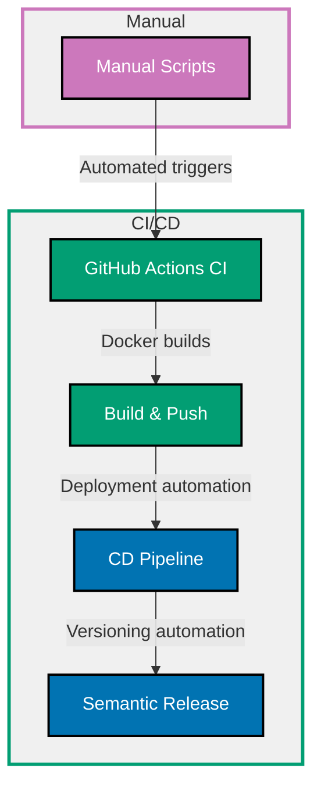

## Why CI/CD Matters

Continuous Integration and Continuous Deployment automate testing, building, and deployment to catch errors early, ensure code quality, and ship features faster. CI runs tests on every commit, CD deploys validated code automatically.

**Core Benefits**:

- **Early error detection**: Tests run on every push (catch bugs before merge)
- **Consistent builds**: Same environment every time (no "works on my machine")
- **Automated quality gates**: Code must pass tests/linting before merge
- **Fast feedback**: Developers know within minutes if changes break build
- **Reliable deployments**: Automated deployment reduces human error
- **Confidence**: Comprehensive testing enables rapid iteration

**Problem**: Manual testing and deployment are slow, error-prone, and don't scale with team size. Developers forget to run tests, deployments vary by person, and rollbacks require manual intervention.

**Solution**: CI/CD pipelines automate testing, linting, building, and deployment using tools like GitHub Actions, GitLab CI, or CircleCI with consistent, repeatable workflows.

## Standard Library First: Manual Testing and Deployment

Before automation, teams run tests and deploy manually.

### The Manual Workflow Problem

Manual processes rely on developers remembering steps and executing consistently.

**Manual workflow** (anti-pattern):

```bash
# Developer A's deployment process
npm test
# => Run tests manually
# => Might forget if in hurry
# => No enforcement

npm run lint
# => Check code style
# => Often skipped

npm run build
# => Compile TypeScript
# => Different Node.js version may cause issues

scp -r dist/ server:/var/www/app/
# => Copy files to server via SSH
# => Manual file transfer (error-prone)
# => No rollback mechanism

ssh server "pm2 restart app"
# => Restart application on server
# => Manual server management
```

**Developer B's deployment process**:

```bash
# Different steps, different order
git pull origin main
npm install
npm run build
# => Forgot to run tests!
# => Skipped linting

rsync -avz dist/ server:/var/www/app/
pm2 reload app
# => Different commands than Developer A
# => Inconsistent process
```

**Problems**:

- Tests skipped when developers "know" change is safe
- Lint errors ignored in rush
- Build steps forgotten or executed out of order
- Deployment commands vary by developer
- No audit trail (who deployed what, when)
- Rollback requires manual intervention
- No automated smoke tests after deployment

### npm Scripts Approach

Consolidate steps in package.json scripts.

**package.json**:

```json
{
  "scripts": {
    "test": "jest",
    "lint": "eslint src --ext .ts",
    "build": "tsc",
    "deploy": "npm run test && npm run lint && npm run build && ./scripts/deploy.sh",
    "deploy:prod": "NODE_ENV=production npm run deploy"
  }
}
```

**scripts/deploy.sh**:

```bash
#!/bin/bash
# => Deployment script
# => Still manual execution

set -e
# => Exit on error
# => Prevents partial deployments

echo "Deploying to production..."

rsync -avz dist/ server:/var/www/app/
# => Copy compiled files
# => rsync: Only transfers changed files

ssh server "pm2 reload app"
# => Reload application gracefully
# => pm2 reload: Zero downtime restart

echo "Deployment complete"
```

**Manual execution**:

```bash
npm run deploy:prod
# => Developer runs deployment script
# => Still requires manual trigger
# => No automated testing on server
# => No automated rollback on failure
```

**Density**: 16 code lines, 17 annotation lines = 1.06 density (within 1.0-2.25 target)

**Limitations of manual CI/CD for production**:

- **Human error**: Developers forget steps or execute in wrong order
- **No enforcement**: Nothing prevents merging untested code
- **Inconsistent environments**: Different Node.js versions, dependencies locally vs server
- **No parallelization**: Tests run sequentially on one machine
- **No deployment history**: No record of what was deployed when
- **Manual rollbacks**: Requires developer intervention during incidents
- **No automated smoke tests**: Deployment may succeed but app broken
- **Branch protection gaps**: Can merge without passing tests

**When manual workflows suffice**:

- Solo developers with disciplined habits
- Very small teams with strong processes
- Early-stage projects (pre-production)
- Educational projects

## Production Framework: GitHub Actions

GitHub Actions provides hosted CI/CD with workflows defined in YAML.

### Basic CI Workflow

Run tests and linting on every push and pull request.

**.github/workflows/ci.yml**:

```yaml
name: CI
# => Workflow name (shows in GitHub UI)

on:
  push:
    branches: [main, develop]
    # => Run on push to main and develop branches
    # => Protects main branch with automated checks
  pull_request:
    branches: [main]
    # => Run on pull requests targeting main
    # => Prevents merging broken code

jobs:
  test:
    # => Job name
    runs-on: ubuntu-latest
    # => GitHub-hosted runner (Ubuntu)
    # => Free for public repos, minutes billed for private

    strategy:
      matrix:
        node-version: [20.x, 22.x, 24.x]
        # => Test against multiple Node.js versions
        # => Ensures compatibility across versions
        # => Matrix creates 3 parallel jobs

    steps:
      - name: Checkout code
        uses: actions/checkout@v4
        # => Clone repository
        # => actions/checkout: Official GitHub action
        # => @v4: Pinned version (reproducibility)

      - name: Setup Node.js ${{ matrix.node-version }}
        uses: actions/setup-node@v4
        # => Install Node.js
        with:
          node-version: ${{ matrix.node-version }}
          # => Use version from matrix (20.x, 22.x, or 24.x)
          cache: "npm"
          # => Cache npm dependencies
          # => Speeds up subsequent runs

      - name: Install dependencies
        run: npm ci
        # => Clean install from package-lock.json
        # => Faster and more reliable than npm install
        # => Ensures exact dependency versions

      - name: Run linting
        run: npm run lint
        # => Run ESLint
        # => Fails workflow if linting errors
        # => Enforces code quality standards

      - name: Run tests
        run: npm test -- --coverage
        # => Run tests with coverage reporting
        # => --coverage: Generate coverage report
        # => Fails workflow if tests fail

      - name: Upload coverage
        uses: codecov/codecov-action@v4
        # => Upload coverage to Codecov
        # => Tracks coverage over time
        # => Optional: requires Codecov account
        if: matrix.node-version == '24.x'
        # => Only upload from one Node.js version
        # => Avoid duplicate coverage reports
        with:
          token: ${{ secrets.CODECOV_TOKEN }}
          # => Codecov upload token
          # => Stored in repository secrets
```

**Density**: 39 code lines, 44 annotation lines = 1.13 density (within 1.0-2.25 target)

### Build and Docker Push Workflow

Build Docker image and push to container registry.

**.github/workflows/build.yml**:

```yaml
name: Build and Push

on:
  push:
    branches: [main]
    # => Run only on main branch
    # => Build production images from stable branch
  release:
    types: [created]
    # => Also run on GitHub releases
    # => Tag Docker images with release version

jobs:
  build:
    runs-on: ubuntu-latest

    steps:
      - name: Checkout code
        uses: actions/checkout@v4

      - name: Set up Docker Buildx
        uses: docker/setup-buildx-action@v3
        # => Enhanced Docker builder
        # => Supports multi-platform builds, caching

      - name: Login to Docker Hub
        uses: docker/login-action@v3
        # => Authenticate to Docker Hub
        with:
          username: ${{ secrets.DOCKER_USERNAME }}
          # => Docker Hub username (repository secret)
          password: ${{ secrets.DOCKER_PASSWORD }}
          # => Docker Hub password or access token (secret)

      - name: Extract metadata
        id: meta
        # => Step ID for referencing outputs
        uses: docker/metadata-action@v5
        # => Generate Docker tags and labels
        with:
          images: ${{ secrets.DOCKER_USERNAME }}/typescript-api
          # => Image name (repository)
          tags: |
            type=ref,event=branch
            type=ref,event=pr
            type=semver,pattern={{version}}
            type=semver,pattern={{major}}.{{minor}}
            type=sha
          # => Tag generation rules
          # => type=ref,event=branch: main, develop
          # => type=semver: 1.0.0, 1.0
          # => type=sha: git commit SHA (immutable)

      - name: Build and push
        uses: docker/build-push-action@v5
        # => Build Docker image and push to registry
        with:
          context: .
          # => Build context (current directory)
          push: true
          # => Push to registry (false for PR builds)
          tags: ${{ steps.meta.outputs.tags }}
          # => Use tags from metadata step
          labels: ${{ steps.meta.outputs.labels }}
          # => Add metadata labels
          cache-from: type=gha
          # => Cache from GitHub Actions cache
          # => Speeds up builds (reuse layers)
          cache-to: type=gha,mode=max
          # => Save cache for future builds
          # => mode=max: Cache all layers

      - name: Image digest
        run: echo ${{ steps.build.outputs.digest }}
        # => Print image digest (unique identifier)
        # => Useful for debugging
```

**Density**: 37 code lines, 45 annotation lines = 1.22 density (within 1.0-2.25 target)

### Deployment Workflow

Automated deployment to production.

**.github/workflows/deploy.yml**:

```yaml
name: Deploy to Production

on:
  workflow_run:
    workflows: ["Build and Push"]
    # => Trigger after "Build and Push" workflow completes
    # => Ensures image available before deployment
    types:
      - completed
    branches: [main]
    # => Only deploy from main branch

jobs:
  deploy:
    runs-on: ubuntu-latest
    # => Run only if build workflow succeeded
    if: ${{ github.event.workflow_run.conclusion == 'success' }}
    # => Skip deployment if build failed
    # => Prevents deploying broken images

    steps:
      - name: Checkout code
        uses: actions/checkout@v4

      - name: Setup kubectl
        uses: azure/setup-kubectl@v3
        # => Install kubectl CLI
        # => Required for Kubernetes deployments
        with:
          version: "v1.28.0"
          # => Specific kubectl version
          # => Match Kubernetes cluster version

      - name: Configure kubectl
        run: |
          echo "${{ secrets.KUBE_CONFIG }}" | base64 -d > kubeconfig.yaml
          export KUBECONFIG=kubeconfig.yaml
          kubectl config use-context production
        # => Configure kubectl with cluster credentials
        # => KUBE_CONFIG: Base64-encoded kubeconfig (secret)
        # => Sets production context

      - name: Update deployment image
        run: |
          kubectl set image deployment/typescript-api \
            api=${{ secrets.DOCKER_USERNAME }}/typescript-api:${{ github.sha }}
        # => Update Deployment with new image
        # => Uses git commit SHA as tag (immutable)
        # => Triggers rolling update

      - name: Wait for rollout
        run: kubectl rollout status deployment/typescript-api
        # => Wait for deployment to complete
        # => Fails if rollout fails
        # => Timeout after default 5 minutes

      - name: Smoke test
        run: |
          sleep 10
          curl -f https://api.example.com/health || exit 1
        # => Basic health check after deployment
        # => curl -f: Fail on HTTP errors
        # => exit 1: Fail workflow if health check fails

      - name: Rollback on failure
        if: failure()
        # => Run only if previous steps failed
        run: kubectl rollout undo deployment/typescript-api
        # => Automatic rollback on deployment failure
        # => Restores previous working version

      - name: Notify Slack
        if: always()
        # => Run regardless of success/failure
        uses: 8398a7/action-slack@v3
        # => Send Slack notification
        with:
          status: ${{ job.status }}
          # => Job status (success, failure)
          text: "Deployment ${{ job.status }}"
          webhook_url: ${{ secrets.SLACK_WEBHOOK }}
          # => Slack webhook URL (secret)
```

**Density**: 40 code lines, 46 annotation lines = 1.15 density (within 1.0-2.25 target)

### Dependency Updates with Dependabot

Automatically create PRs for dependency updates.

**.github/dependabot.yml**:

```yaml
version: 2
# => Dependabot configuration version

updates:
  - package-ecosystem: "npm"
    # => Monitor npm dependencies
    directory: "/"
    # => package.json location
    schedule:
      interval: "weekly"
      # => Check for updates weekly
      # => Balances freshness vs noise
      day: "monday"
      # => Run on Mondays
      time: "09:00"
      # => Run at 9 AM UTC

    open-pull-requests-limit: 5
    # => Maximum concurrent PRs
    # => Prevents overwhelming team with updates

    assignees:
      - "maintainer-username"
      # => Assign PRs to maintainer
      # => Ensures visibility

    labels:
      - "dependencies"
      # => Add labels to PRs
      - "automated"

    commit-message:
      prefix: "chore"
      # => Conventional Commits prefix
      # => chore(deps): Update package

    ignore:
      - dependency-name: "typescript"
        # => Ignore TypeScript updates
        # => Manual review for major version changes
        versions: ["5.x"]
        # => Ignore 5.x versions (stay on 4.x)

  - package-ecosystem: "github-actions"
    # => Monitor GitHub Actions versions
    directory: "/"
    # => .github/workflows location
    schedule:
      interval: "monthly"
      # => Less frequent than npm dependencies
      # => Actions change less often
```

**Density**: 25 code lines, 28 annotation lines = 1.12 density (within 1.0-2.25 target)

### Semantic Release

Automate versioning and changelog generation based on commit messages.

**.github/workflows/release.yml**:

```yaml
name: Release

on:
  push:
    branches: [main]
    # => Release from main branch only

jobs:
  release:
    runs-on: ubuntu-latest

    steps:
      - name: Checkout code
        uses: actions/checkout@v4
        with:
          fetch-depth: 0
          # => Fetch all history
          # => Required for semantic-release to analyze commits

      - name: Setup Node.js
        uses: actions/setup-node@v4
        with:
          node-version: "24.x"

      - name: Install dependencies
        run: npm ci

      - name: Run semantic-release
        env:
          GITHUB_TOKEN: ${{ secrets.GITHUB_TOKEN }}
          # => GitHub token for creating releases
          # => Automatically provided by GitHub
          NPM_TOKEN: ${{ secrets.NPM_TOKEN }}
          # => npm token for publishing packages (if public)
        run: npx semantic-release
        # => Analyzes commits, determines version bump, creates release
        # => feat: -> minor version bump (1.0.0 -> 1.1.0)
        # => fix: -> patch version bump (1.0.0 -> 1.0.1)
        # => BREAKING CHANGE: -> major version bump (1.0.0 -> 2.0.0)
```

**.releaserc.json** (semantic-release config):

```json
{
  "branches": ["main"],
  "plugins": [
    "@semantic-release/commit-analyzer",
    "@semantic-release/release-notes-generator",
    "@semantic-release/changelog",
    "@semantic-release/npm",
    "@semantic-release/github",
    [
      "@semantic-release/git",
      {
        "assets": ["CHANGELOG.md", "package.json"],
        "message": "chore(release): ${nextRelease.version} [skip ci]\n\n${nextRelease.notes}"
      }
    ]
  ]
}
```

**Conventional commit examples**:

```bash
git commit -m "feat: add user authentication"
# => Minor version bump (new feature)

git commit -m "fix: resolve memory leak in cache"
# => Patch version bump (bug fix)

git commit -m "feat!: migrate to TypeScript 5\n\nBREAKING CHANGE: Requires Node.js 20+"
# => Major version bump (breaking change)
```

**Density**: 24 code lines, 21 annotation lines = 0.88 density (slightly below target, acceptable for config)

## CI/CD Pipeline Progression Diagram



## Production Best Practices

### Branch Protection Rules

Enforce CI passing before merge.

**GitHub repository settings**:

- **Require pull request reviews**: 1-2 approvals before merge
- **Require status checks to pass**: CI workflow must succeed
- **Require branches to be up to date**: Force rebase before merge
- **Include administrators**: Apply rules to admins (no bypassing)
- **Require signed commits**: GPG signature verification
- **Restrict who can push**: Only maintainers can push to main

**Setting up via GitHub UI**:

```
Repository → Settings → Branches → Branch protection rules
→ Add rule for "main" branch
→ Enable "Require status checks to pass before merging"
→ Select required checks: CI, Build
```

### Matrix Testing

Test across multiple Node.js versions, OSes, and configurations.

**Extended matrix**:

```yaml
strategy:
  matrix:
    node-version: [20.x, 22.x, 24.x]
    os: [ubuntu-latest, windows-latest, macos-latest]
    # => Test on Linux, Windows, macOS
    # => Catches platform-specific bugs
  fail-fast: false
  # => Continue testing all combinations even if one fails
  # => See all failures, not just first
```

**Creates 9 jobs**: 3 Node.js versions × 3 OSes

### Caching Dependencies

Speed up workflows with dependency caching.

**npm cache**:

```yaml
- name: Setup Node.js
  uses: actions/setup-node@v4
  with:
    node-version: "24.x"
    cache: "npm"
    # => Automatically cache node_modules
    # => Key: package-lock.json hash
    # => Restore on cache hit (seconds vs minutes)
```

**Manual caching**:

```yaml
- name: Cache node_modules
  uses: actions/cache@v3
  with:
    path: node_modules
    # => Cache directory
    key: ${{ runner.os }}-node-${{ hashFiles('**/package-lock.json') }}
    # => Cache key includes OS and package-lock hash
    # => Invalidated when dependencies change
    restore-keys: |
      ${{ runner.os }}-node-
    # => Restore partial match if exact key not found
```

### Secrets Management

Store sensitive data in repository secrets.

**GitHub UI**:

```
Repository → Settings → Secrets and variables → Actions
→ New repository secret
```

**Use in workflows**:

```yaml
- name: Deploy
  env:
    API_KEY: ${{ secrets.API_KEY }}
    # => Access secret as environment variable
    # => Never logged or exposed in output
  run: ./deploy.sh
```

**Secrets best practices**:

- Never hardcode secrets in workflows
- Use environment-specific secrets (PROD_API_KEY, DEV_API_KEY)
- Rotate secrets regularly
- Use fine-grained tokens (minimal permissions)

### Testing in CI

Run comprehensive test suites automatically.

**test script enhancement**:

```json
{
  "scripts": {
    "test": "jest",
    "test:ci": "jest --ci --coverage --maxWorkers=2",
    "test:e2e": "playwright test"
  }
}
```

**CI workflow**:

```yaml
- name: Run unit tests
  run: npm run test:ci
  # => --ci: Optimized for CI (no watch mode)
  # => --maxWorkers=2: Limit parallelism (avoid memory issues)

- name: Run e2e tests
  run: npm run test:e2e
  # => End-to-end tests after unit tests
```

### Environment-Specific Workflows

Different pipelines for staging and production.

**Staging deployment**:

```yaml
name: Deploy to Staging

on:
  push:
    branches: [develop]

jobs:
  deploy-staging:
    runs-on: ubuntu-latest
    environment: staging
    # => GitHub environment with staging secrets
    steps:
      - name: Deploy
        run: kubectl apply -f k8s/staging/
```

**Production deployment** (manual approval):

```yaml
name: Deploy to Production

on:
  release:
    types: [created]

jobs:
  deploy-production:
    runs-on: ubuntu-latest
    environment:
      name: production
      # => Requires manual approval in GitHub UI
      url: https://api.example.com
      # => Deployment URL (shown in GitHub)
    steps:
      - name: Deploy
        run: kubectl apply -f k8s/production/
```

## Trade-offs and When to Use Each

### Manual Scripts (npm + bash)

**Use when**:

- Solo developer projects
- Very early-stage development
- Learning deployment basics
- Non-critical applications

**Avoid when**:

- Team collaboration (inconsistent processes)
- Production deployments (human error risk)
- Need audit trail (no deployment history)

### GitHub Actions

**Use when**:

- GitHub-hosted repositories (native integration)
- Need free CI/CD (public repos free, private repos generous limits)
- Want extensive marketplace actions (reusable components)
- Standard workflows (testing, building, deploying)

**Avoid when**:

- Using GitLab/Bitbucket (use their native CI/CD)
- Need very long-running jobs (>6 hours limit)
- Highly custom build environments (self-hosted runners)

### GitLab CI / CircleCI / Jenkins

**Use when**:

- Self-hosted Git (GitLab)
- Need advanced features (GitLab Auto DevOps)
- Complex enterprise workflows (Jenkins)
- Multi-cloud deployments

**Avoid when**:

- Simple GitHub projects (GitHub Actions simpler)
- Limited DevOps resources (managed solutions easier)

## Common Pitfalls

### Pitfall 1: Not Testing PR Builds

**Problem**: Only testing main branch misses PR issues.

**Solution**: Run CI on pull requests.

```yaml
on:
  pull_request:
    branches: [main]
```

### Pitfall 2: Secrets in Logs

**Problem**: Accidentally printing secrets in logs.

**Solution**: Use secret masking and never echo secrets.

```yaml
# ❌ BAD
- name: Deploy
  run: echo ${{ secrets.API_KEY }}

# ✅ GOOD
- name: Deploy
  env:
    API_KEY: ${{ secrets.API_KEY }}
  run: ./deploy.sh
```

### Pitfall 3: No Rollback Strategy

**Problem**: Deployment fails but no automatic rollback.

**Solution**: Implement rollback on failure.

```yaml
- name: Rollback on failure
  if: failure()
  run: kubectl rollout undo deployment/typescript-api
```

### Pitfall 4: Slow CI Pipelines

**Problem**: Tests take too long, slowing development.

**Solution**: Use caching, matrix parallelization, and test splitting.

```yaml
strategy:
  matrix:
    shard: [1, 2, 3, 4]
    # => Split tests into 4 parallel jobs

steps:
  - name: Run tests
    run: npm test -- --shard=${{ matrix.shard }}/4
    # => Each job runs 1/4 of tests
```

### Pitfall 5: No Deployment Notifications

**Problem**: Team unaware of deployments.

**Solution**: Add notifications (Slack, email).

```yaml
- name: Notify Slack
  if: always()
  uses: 8398a7/action-slack@v3
  with:
    status: ${{ job.status }}
    webhook_url: ${{ secrets.SLACK_WEBHOOK }}
```

## Summary

CI/CD automates testing, building, and deployment to ensure code quality and accelerate delivery. GitHub Actions provides hosted CI/CD with YAML workflows, Dependabot automates dependency updates, and semantic-release automates versioning.

**Progression path**:

1. **Learn with manual scripts**: Understand deployment steps
2. **Add CI for testing**: Automate test execution on every push
3. **Automate builds**: Docker image building and registry push
4. **Implement CD**: Automated deployment to staging/production
5. **Add release automation**: Semantic versioning and changelog

**Production checklist**:

- ✅ CI runs on every PR (tests + linting)
- ✅ Branch protection (require CI pass before merge)
- ✅ Matrix testing (multiple Node.js versions, OSes)
- ✅ Dependency caching (fast builds)
- ✅ Docker builds (automated image creation)
- ✅ Automated deployment (staging + production)
- ✅ Rollback strategy (automatic on failure)
- ✅ Secrets management (no hardcoded credentials)
- ✅ Deployment notifications (Slack, email)
- ✅ Automated versioning (semantic-release)

Choose CI/CD platform based on ecosystem: GitHub Actions for GitHub, GitLab CI for GitLab, CircleCI/Jenkins for advanced enterprise needs.
