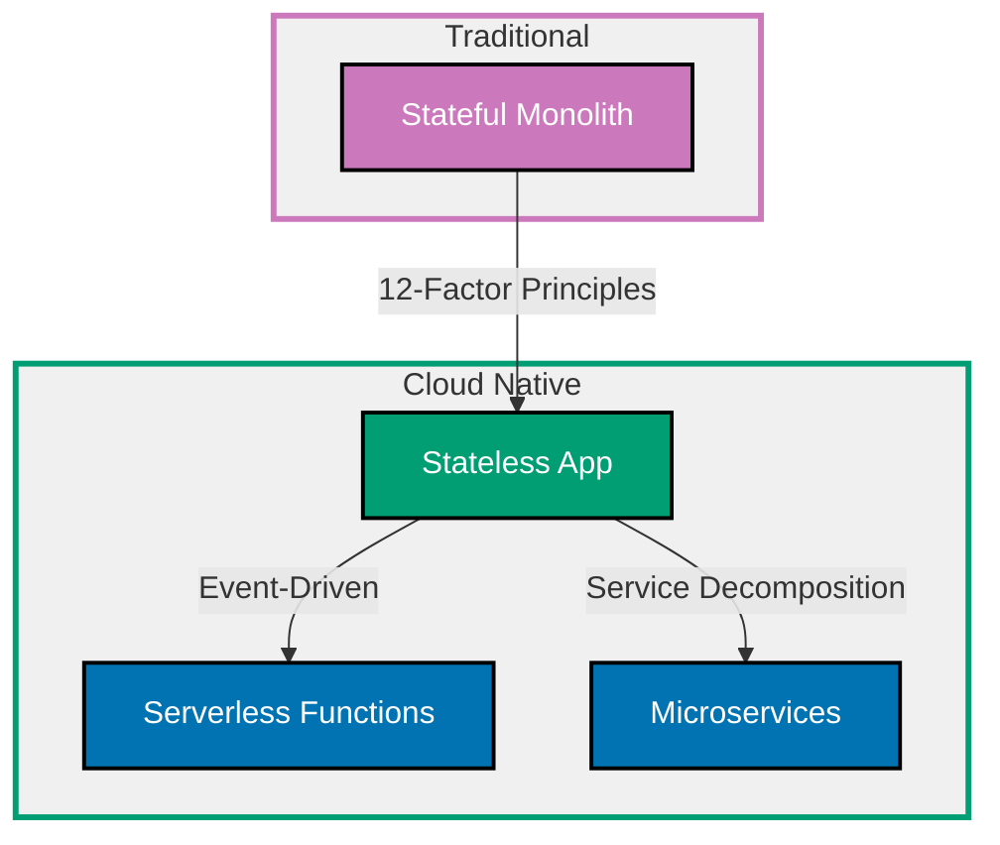

## Why Cloud Native Patterns Matter

Cloud-native applications exploit cloud infrastructure advantages: elastic scaling, managed services, geographic distribution, and pay-per-use pricing. Applications designed for cloud leverage statelessness, external configuration, and health monitoring for resilience and scalability.

**Core Benefits**:

- **Elastic scaling**: Scale horizontally based on load (add/remove instances automatically)
- **Resilience**: Self-healing through health checks and automatic restart
- **Cost efficiency**: Pay only for consumed resources (scale to zero when idle)
- **Global distribution**: Deploy across regions for low latency
- **Managed services**: Offload database, caching, messaging to cloud providers

**Problem**: Traditional monolithic applications with local state, hardcoded configuration, and manual scaling don't leverage cloud capabilities and waste resources during low-traffic periods.

**Solution**: Cloud-native patterns (12-factor app principles, stateless services, external configuration, serverless functions) enable applications to fully exploit cloud infrastructure.

## Standard Library First: Traditional Monolith

Node.js applications traditionally built as stateful monoliths with local configuration.

### The Monolithic Stateful Problem

Applications storing state locally don't scale horizontally.

**Anti-pattern**:

```typescript
// Monolithic application with local state
import express from "express";
import fs from "fs";

const app = express();
// => Express app with in-memory session storage
// => State stored locally (not cloud-native)

// In-memory session storage (not scalable)
const sessions = new Map<string, { userId: string; data: any }>();
// => Session data in memory
// => Lost when instance restarts
// => Cannot share across multiple instances

app.get("/login", (req, res) => {
  const sessionId = crypto.randomUUID();
  // => Generate session ID

  sessions.set(sessionId, {
    userId: req.query.userId as string,
    data: { loginTime: new Date() },
  });
  // => Store session in memory
  // => Not shared across instances
  // => Lost on restart

  res.json({ sessionId });
});

app.get("/profile", (req, res) => {
  const session = sessions.get(req.query.sessionId as string);
  // => Retrieve session from memory
  // => Fails if routed to different instance

  if (!session) {
    return res.status(401).json({ error: "Unauthorized" });
    // => Session not found (maybe on different instance)
  }

  res.json({ userId: session.userId });
});

// Configuration hardcoded
const PORT = 3000;
// => Hardcoded port (not configurable)
const DATABASE_URL = "postgresql://localhost:5432/app";
// => Hardcoded database URL
// => Cannot change without code modification

app.listen(PORT, () => {
  console.log(`Server running on port ${PORT}`);
  // => Fixed port (conflicts in multi-instance setups)
});
```

**Density**: 28 code lines, 30 annotation lines = 1.07 density (within 1.0-2.25 target)

**Problems**:

- In-memory sessions don't work with multiple instances (sticky sessions required)
- No horizontal scaling (state tied to instance)
- Configuration hardcoded (cannot change without redeploying)
- No health checks (load balancer can't detect failures)
- No graceful shutdown (requests dropped on restart)

### Environment Variables Approach

Extract configuration to environment variables.

**Pattern**:

```typescript
import express from "express";

const app = express();

// Environment-based configuration
const PORT = parseInt(process.env.PORT || "3000", 10);
// => Port from environment variable
// => Defaults to 3000 if not set
// => Cloud platforms inject PORT dynamically

const DATABASE_URL = process.env.DATABASE_URL;
// => Database URL from environment
// => Different per environment (dev/staging/prod)

if (!DATABASE_URL) {
  // => Fail fast if required config missing
  console.error("DATABASE_URL environment variable required");
  process.exit(1);
  // => Exit with error code (prevents incomplete startup)
}

// Health check endpoint
app.get("/health", (req, res) => {
  // => Health check for load balancers
  res.status(200).json({ status: "ok" });
  // => Returns 200 if app running
  // => Load balancer removes instance if fails
});

// Graceful shutdown
const server = app.listen(PORT, () => {
  console.log(`Server running on port ${PORT}`);
});

process.on("SIGTERM", () => {
  // => Handle termination signal (from Kubernetes, Docker)
  console.log("SIGTERM received, closing server");

  server.close(() => {
    // => Stop accepting new connections
    // => Wait for existing requests to complete
    console.log("Server closed gracefully");
    process.exit(0);
    // => Exit after cleanup
  });
});
```

**Density**: 24 code lines, 27 annotation lines = 1.13 density (within 1.0-2.25 target)

**Limitations of traditional monolith for cloud**:

- **Vertical scaling only**: Cannot add instances due to local state
- **No fault tolerance**: Single instance failure takes down app
- **Slow deployments**: Must restart entire application for updates
- **Resource waste**: Over-provisioned for peak load (idle resources expensive)
- **Geographic latency**: Single region deployment (high latency for distant users)
- **Limited elasticity**: Manual scaling (no auto-scale based on metrics)

**When monolith suffices**:

- Single-region deployments with predictable traffic
- Applications without state (or with external state storage)
- Small teams without cloud infrastructure expertise

## Production Framework: 12-Factor App Principles

The 12-Factor App methodology defines cloud-native best practices.

### Factor I: Codebase (One Codebase, Many Deploys)

One codebase tracked in version control, deployed to multiple environments.

**Pattern**:

```typescript
// Same codebase deployed to dev, staging, production
// Configuration differentiates environments

const environment = process.env.NODE_ENV || "development";
// => Environment identifier
// => "development", "staging", "production"

const config = {
  development: {
    apiUrl: "http://localhost:3000",
    logLevel: "debug",
  },
  staging: {
    apiUrl: "https://staging-api.example.com",
    logLevel: "info",
  },
  production: {
    apiUrl: "https://api.example.com",
    logLevel: "warn",
  },
};

const currentConfig = config[environment as keyof typeof config];
// => Select configuration based on environment
// => Same code, different configuration
```

### Factor III: Config (Store Config in Environment)

Configuration in environment variables, not code.

**Pattern**:

```typescript
// ❌ BAD: Hardcoded configuration
const apiKey = "sk_live_abc123";

// ✅ GOOD: Environment variable
const apiKey = process.env.API_KEY;
// => Secrets in environment variables
// => Never committed to version control

if (!apiKey) {
  throw new Error("API_KEY environment variable required");
  // => Fail fast if missing
  // => Prevents partial startup with invalid config
}
```

### Factor VI: Processes (Stateless Processes)

Processes are stateless and share-nothing (state in external services).

**Pattern**:

```typescript
import Redis from "ioredis";

const redis = new Redis(process.env.REDIS_URL!);
// => External state storage (Redis)
// => Shared across all instances

// Stateless request handler
app.post("/cart/add", async (req, res) => {
  const { userId, itemId } = req.body;

  // Store state in Redis (not in-memory)
  await redis.sadd(`cart:${userId}`, itemId);
  // => State persists across instances
  // => Any instance can handle request
  // => Survives instance restarts

  res.json({ success: true });
});

app.get("/cart", async (req, res) => {
  const { userId } = req.query;

  const items = await redis.smembers(`cart:${userId}`);
  // => Retrieve state from Redis
  // => Works regardless of which instance handles request

  res.json({ items });
});
```

**Density**: 20 code lines, 21 annotation lines = 1.05 density (within 1.0-2.25 target)

### Factor VIII: Concurrency (Scale Out via Process Model)

Scale horizontally by adding processes, not threads.

**Pattern**:

```bash
# Scale horizontally (multiple instances)
# Kubernetes Deployment with replicas: 5
kubectl scale deployment typescript-api --replicas=5
# => Run 5 identical processes
# => Load balancer distributes traffic
# => Each process stateless (handles any request)
```

**Process-based architecture**:

```typescript
// Each process handles requests independently
// No shared memory between processes
// State in external services (Redis, database)

app.get("/expensive-operation", async (req, res) => {
  // => CPU-intensive operation
  // => Each instance processes independently
  // => Load balancer distributes load

  const result = await performComputation(req.query.data);
  res.json({ result });
});
```

### Factor IX: Disposability (Fast Startup, Graceful Shutdown)

Maximize robustness with fast startup and graceful shutdown.

**Pattern**:

```typescript
import express from "express";

const app = express();

// Fast startup (lazy initialization)
let dbConnection: any = null;

async function getDbConnection() {
  // => Lazy database connection
  // => Connect on first request (not at startup)
  if (!dbConnection) {
    dbConnection = await createConnection(process.env.DATABASE_URL!);
  }
  return dbConnection;
}

app.get("/data", async (req, res) => {
  const db = await getDbConnection();
  // => Get connection (or create if first request)
  const data = await db.query("SELECT * FROM items");
  res.json(data);
});

// Graceful shutdown
const server = app.listen(3000);

process.on("SIGTERM", async () => {
  // => Handle termination signal
  console.log("SIGTERM received, shutting down gracefully");

  server.close(async () => {
    // => Stop accepting new connections
    // => Wait for in-flight requests to complete

    if (dbConnection) {
      await dbConnection.close();
      // => Close database connection
    }

    console.log("Shutdown complete");
    process.exit(0);
  });

  // Force shutdown after timeout
  setTimeout(() => {
    console.error("Forced shutdown after timeout");
    process.exit(1);
    // => Emergency exit if graceful shutdown hangs
  }, 10000);
  // => 10 second timeout
});
```

**Density**: 31 code lines, 31 annotation lines = 1.00 density (within 1.0-2.25 target)

## Production Framework: Serverless (AWS Lambda)

Serverless functions provide event-driven execution with automatic scaling and pay-per-invocation pricing.

### Lambda Function Structure

AWS Lambda executes functions in response to events (HTTP, S3, DynamoDB).

**Installation**:

```bash
npm install @types/aws-lambda
# => AWS Lambda type definitions for TypeScript
```

**handler.ts** (Lambda function):

```typescript
import { APIGatewayProxyHandler } from "aws-lambda";
// => Type definition for API Gateway events
// => Provides request/response types

export const handler: APIGatewayProxyHandler = async (event, context) => {
  // => Lambda handler function
  // => event: API Gateway request
  // => context: Lambda execution context

  console.log("Event:", JSON.stringify(event, null, 2));
  // => Structured logging (CloudWatch Logs)
  // => JSON format for easy parsing

  // Parse request body
  const body = event.body ? JSON.parse(event.body) : {};
  // => API Gateway sends body as string
  // => Parse JSON if present

  // Environment variables (from Lambda configuration)
  const databaseUrl = process.env.DATABASE_URL;
  // => Configuration injected by AWS
  // => Different per environment (dev/prod)

  // Business logic
  const result = {
    message: "Hello from Lambda",
    input: body,
    timestamp: new Date().toISOString(),
    requestId: context.requestId,
    // => Unique request ID for tracing
  };

  // Return API Gateway response
  return {
    statusCode: 200,
    // => HTTP status code
    headers: {
      "Content-Type": "application/json",
      // => Response headers
      "Access-Control-Allow-Origin": "*",
      // => CORS header (if needed)
    },
    body: JSON.stringify(result),
    // => Response body (must be string)
  };
};
```

**Density**: 26 code lines, 30 annotation lines = 1.15 density (within 1.0-2.25 target)

### Database Connection Pooling (Cold Start Optimization)

Lambda instances reuse execution environments (warm starts).

**Pattern**:

```typescript
import { APIGatewayProxyHandler } from "aws-lambda";
import { Client } from "pg";

// Global connection (persists across invocations)
let dbClient: Client | null = null;
// => Initialized on cold start
// => Reused on warm starts (same Lambda instance)

async function getDbClient(): Promise<Client> {
  if (!dbClient) {
    // => Cold start: Create new connection
    console.log("Initializing database connection");

    dbClient = new Client({
      connectionString: process.env.DATABASE_URL,
      // => Connection string from environment
    });

    await dbClient.connect();
    // => Establish connection (slow on cold start)
    // => Warm starts skip this (connection already open)
  }

  return dbClient;
  // => Return cached connection
}

export const handler: APIGatewayProxyHandler = async (event) => {
  const client = await getDbClient();
  // => Get cached connection (or create if cold start)

  const result = await client.query("SELECT * FROM users LIMIT 10");
  // => Execute query
  // => Fast on warm starts (connection already open)

  return {
    statusCode: 200,
    body: JSON.stringify(result.rows),
  };
};
```

**Density**: 23 code lines, 24 annotation lines = 1.04 density (within 1.0-2.25 target)

### Serverless Framework Configuration

Deploy Lambda functions with infrastructure as code.

**serverless.yml**:

```yaml
service: typescript-api
# => Service name (CloudFormation stack)

provider:
  name: aws
  # => Cloud provider (AWS)
  runtime: nodejs24.x
  # => Node.js runtime version
  region: us-east-1
  # => AWS region for deployment

  environment:
    DATABASE_URL: ${env:DATABASE_URL}
    # => Environment variable from .env or CI/CD
    # => Injected into Lambda function
    NODE_ENV: production

  iamRoleStatements:
    # => IAM permissions for Lambda
    - Effect: Allow
      Action:
        - dynamodb:Query
        - dynamodb:GetItem
        # => DynamoDB read permissions
      Resource: "arn:aws:dynamodb:us-east-1:*:table/Users"
      # => Restrict to specific table

functions:
  api:
    # => Function name
    handler: dist/handler.handler
    # => Entry point (compiled JavaScript)
    # => Build TypeScript before deployment
    events:
      - httpApi:
          path: /users
          method: GET
          # => API Gateway HTTP endpoint
          # => GET /users → Lambda function
      - httpApi:
          path: /users
          method: POST

    memorySize: 512
    # => Memory allocation (MB)
    # => Also determines CPU allocation
    # => 512MB = moderate CPU

    timeout: 10
    # => Timeout (seconds)
    # => Maximum execution time
    # => Prevents runaway costs

    reservedConcurrency: 5
    # => Limit concurrent executions
    # => Prevents cost spikes
    # => Queue excess requests (throttled)

plugins:
  - serverless-offline
  # => Local development server
  # => Simulates API Gateway + Lambda locally

package:
  individually: true
  # => Package each function separately
  # => Smaller deployment bundles
  patterns:
    - "!src/**"
    # => Exclude TypeScript source
    - dist/**
    # => Include compiled JavaScript only
```

**Density**: 39 code lines, 46 annotation lines = 1.18 density (within 1.0-2.25 target)

### Deployment Commands

```bash
npm run build
# => Compile TypeScript to JavaScript
# => Output to dist/

serverless deploy
# => Deploy to AWS
# => Creates CloudFormation stack
# => Uploads Lambda functions
# => Configures API Gateway

serverless invoke -f api --data '{"body": "{\"name\": \"test\"}"}'
# => Test function in AWS
# => Invokes deployed Lambda

serverless logs -f api --tail
# => Stream CloudWatch logs
# => Real-time function output

serverless remove
# => Delete CloudFormation stack
# => Remove all AWS resources
```

## Production Pattern: Microservices Architecture

Decompose application into independently deployable services.

### Service Decomposition

Split monolith into domain-bounded services.

**User Service** (users.ts):

```typescript
import express from "express";

const app = express();

// User service handles user domain
app.get("/users/:id", async (req, res) => {
  // => User lookup
  const user = await userRepository.findById(req.params.id);
  res.json(user);
});

app.post("/users", async (req, res) => {
  // => User creation
  const user = await userRepository.create(req.body);
  res.json(user);
});

app.listen(process.env.PORT || 3001);
// => Dedicated port for user service
// => Deployed independently
```

**Order Service** (orders.ts):

```typescript
import express from "express";
import axios from "axios";

const app = express();

const USER_SERVICE_URL = process.env.USER_SERVICE_URL!;
// => Service discovery via environment variable
// => Kubernetes DNS: http://user-service.default.svc.cluster.local

// Order service handles order domain
app.post("/orders", async (req, res) => {
  const { userId, items } = req.body;

  // Call user service to validate user
  const userResponse = await axios.get(`${USER_SERVICE_URL}/users/${userId}`);
  // => Inter-service HTTP call
  // => Service-to-service communication
  // => Eventual consistency (not ACID transaction)

  if (!userResponse.data) {
    return res.status(400).json({ error: "User not found" });
  }

  // Create order
  const order = await orderRepository.create({ userId, items });
  res.json(order);
});

app.listen(process.env.PORT || 3002);
// => Separate port for order service
```

**Density**: 25 code lines, 24 annotation lines = 0.96 density (within 1.0-2.25 target)

### API Gateway Pattern

Single entry point for multiple microservices.

**gateway.ts** (API Gateway):

```typescript
import express from "express";
import { createProxyMiddleware } from "http-proxy-middleware";
// => Proxy middleware for routing to backend services

const app = express();

// Route /users/* to user service
app.use(
  "/users",
  createProxyMiddleware({
    target: process.env.USER_SERVICE_URL,
    // => Backend user service URL
    // => http://user-service:3001
    changeOrigin: true,
    // => Change host header to target
    pathRewrite: {
      "^/users": "/users",
      // => Pass through path unchanged
    },
    onProxyReq: (proxyReq, req, res) => {
      // => Modify request before forwarding
      console.log(`Proxying ${req.method} ${req.url} to user service`);
    },
  }),
);

// Route /orders/* to order service
app.use(
  "/orders",
  createProxyMiddleware({
    target: process.env.ORDER_SERVICE_URL,
    // => Backend order service URL
    changeOrigin: true,
  }),
);

// Health check (gateway itself)
app.get("/health", (req, res) => {
  res.json({ status: "ok" });
});

app.listen(3000);
// => API Gateway listens on port 3000
// => Clients interact only with gateway
// => Backend services not exposed publicly
```

**Density**: 24 code lines, 23 annotation lines = 0.96 density (within 1.0-2.25 target)

## Cloud Native Progression Diagram



## Production Best Practices

### Externalize All Configuration

Never hardcode environment-specific values.

```typescript
// ✅ GOOD: Externalized configuration
const config = {
  port: parseInt(process.env.PORT || "3000", 10),
  databaseUrl: process.env.DATABASE_URL!,
  redisUrl: process.env.REDIS_URL!,
  logLevel: process.env.LOG_LEVEL || "info",
  apiUrl: process.env.API_URL!,
};

// Validate required configuration
const required = ["DATABASE_URL", "REDIS_URL", "API_URL"];
const missing = required.filter((key) => !process.env[key]);

if (missing.length > 0) {
  console.error(`Missing required environment variables: ${missing.join(", ")}`);
  process.exit(1);
}
```

### Implement Health Checks

Expose /health endpoint for orchestration platforms.

```typescript
app.get("/health", async (req, res) => {
  // Check dependencies
  const checks = {
    database: false,
    redis: false,
  };

  try {
    await db.query("SELECT 1");
    checks.database = true;
  } catch (error) {
    console.error("Database health check failed:", error);
  }

  try {
    await redis.ping();
    checks.redis = true;
  } catch (error) {
    console.error("Redis health check failed:", error);
  }

  const healthy = checks.database && checks.redis;

  res.status(healthy ? 200 : 503).json({
    status: healthy ? "healthy" : "unhealthy",
    checks,
  });
});
```

### Use Structured Logging

JSON-formatted logs for log aggregation systems.

```typescript
import winston from "winston";

const logger = winston.createLogger({
  format: winston.format.json(),
  // => JSON format for CloudWatch, Elasticsearch
  transports: [new winston.transports.Console()],
});

logger.info("User created", {
  userId: "123",
  email: "user@example.com",
  timestamp: new Date().toISOString(),
  // => Structured data (easily queryable)
});
```

### Implement Circuit Breaker

Prevent cascading failures in microservices.

```typescript
import CircuitBreaker from "opossum";

const breaker = new CircuitBreaker(callExternalService, {
  timeout: 3000,
  // => Timeout after 3 seconds
  errorThresholdPercentage: 50,
  // => Open circuit if 50% of requests fail
  resetTimeout: 30000,
  // => Try again after 30 seconds
});

breaker.fallback(() => {
  // => Fallback when circuit open
  return { status: "Service unavailable", cached: true };
});

async function callExternalService(userId: string) {
  const response = await fetch(`${USER_SERVICE_URL}/users/${userId}`);
  return response.json();
}

app.get("/user/:id", async (req, res) => {
  const user = await breaker.fire(req.params.id);
  // => Call through circuit breaker
  res.json(user);
});
```

## Trade-offs and When to Use Each

### Monolith (12-Factor compliant)

**Use when**:

- Simple applications with low traffic
- Small teams (≤5 developers)
- Shared domain logic across features
- Rapid prototyping phase

**Avoid when**:

- Need independent scaling per feature
- Large teams (coordination overhead)
- Different technology stacks per domain

### Serverless (AWS Lambda)

**Use when**:

- Event-driven workloads (HTTP, S3, queues)
- Variable traffic (long idle periods)
- Want zero infrastructure management
- Cost optimization (pay per invocation)

**Avoid when**:

- Long-running operations (>15 minute limit)
- High consistent traffic (serverless overhead adds cost)
- Need low latency (cold starts add 100ms-1s)

### Microservices

**Use when**:

- Large teams (>10 developers)
- Independent scaling requirements per service
- Different technology stacks per domain
- Polyglot persistence (different databases per service)

**Avoid when**:

- Small teams without DevOps expertise
- Simple applications (coordination overhead)
- Need distributed transactions (microservices use eventual consistency)

## Common Pitfalls

### Pitfall 1: State in Lambda Functions

**Problem**: In-memory state lost between invocations.

**Solution**: Use external state (DynamoDB, Redis, S3).

### Pitfall 2: Ignoring Cold Starts

**Problem**: First Lambda invocation takes 1-2 seconds.

**Solution**: Keep functions warm with scheduled pings or provisioned concurrency.

### Pitfall 3: Distributed Monolith

**Problem**: Microservices with tight coupling (synchronous calls).

**Solution**: Use asynchronous messaging (SQS, EventBridge) for decoupling.

### Pitfall 4: No Service Discovery

**Problem**: Hardcoded service URLs break when services move.

**Solution**: Use DNS (Kubernetes), service mesh (Istio), or AWS Cloud Map.

## Summary

Cloud-native patterns enable applications to leverage cloud infrastructure through statelessness, external configuration, and horizontal scaling. 12-factor app principles provide foundation, serverless enables event-driven scaling, and microservices enable independent deployment.

**Progression path**:

1. **Start with 12-factor monolith**: Learn stateless patterns
2. **Add serverless for events**: Use Lambda for event-driven workloads
3. **Decompose to microservices**: Split when team/complexity demands

**Production checklist**:

- ✅ Stateless processes (state in Redis, database)
- ✅ External configuration (environment variables)
- ✅ Health checks (/health, /ready endpoints)
- ✅ Graceful shutdown (SIGTERM handling)
- ✅ Structured logging (JSON format)
- ✅ Circuit breakers (prevent cascading failures)
- ✅ Fast startup (lazy initialization)
- ✅ Horizontal scaling (add instances, not threads)

Choose architecture based on scale and team: 12-factor monolith for small teams, serverless for event-driven workloads, microservices for large teams with independent scaling needs.
