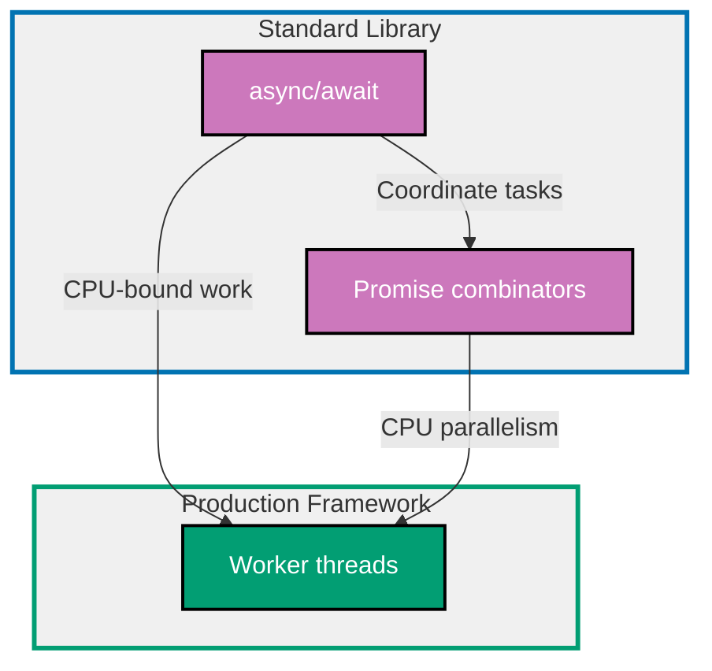

## Why Concurrency and Parallelism Matter

Concurrency (managing multiple tasks) and parallelism (executing tasks simultaneously) are essential for building responsive, high-performance applications that efficiently utilize system resources and handle I/O-bound and CPU-bound workloads.

**Core Benefits**:

- **Improved throughput**: Process multiple requests simultaneously
- **Reduced latency**: Non-blocking I/O prevents waiting
- **Better resource utilization**: Use all CPU cores for CPU-intensive tasks
- **Responsive applications**: UI remains responsive during long operations
- **Scalability**: Handle more concurrent users with same hardware

**Problem**: Single-threaded JavaScript blocks on I/O and CPU-intensive operations. Built-in async/await handles I/O concurrency but cannot parallelize CPU-bound tasks across cores.

**Solution**: Use async/await for I/O concurrency, Promise combinators for coordinating multiple async operations, and Worker threads for CPU-bound parallelism.

## Standard Library First: async/await

Node.js provides async/await syntax for non-blocking I/O operations using the event loop without external dependencies.

### Basic Async/Await for I/O Concurrency

Async functions return Promises and can await other async operations without blocking the event loop.

**Pattern**:

```typescript
async function fetchUser(userId: string): Promise<User> {
  // => Async function returns Promise<User>
  // => Can use await inside
  const response = await fetch(`https://api.example.com/users/${userId}`);
  // => await pauses function execution until Promise resolves
  // => Event loop continues processing other tasks
  // => Non-blocking I/O

  const user = await response.json();
  // => await Promise from json() parsing
  // => Returns User object when complete

  return user;
  // => Automatically wrapped in Promise
}

// Usage
const user = await fetchUser("123");
// => Waits for HTTP request and JSON parsing
// => Other code can run while waiting (non-blocking)

console.log(user.name);
// => Output: Alice
```

**Sequential vs concurrent I/O**:

```typescript
// Sequential (slow): 600ms total
async function fetchUsersSequential(ids: string[]): Promise<User[]> {
  // => Fetch users one at a time
  const users: User[] = [];

  for (const id of ids) {
    const user = await fetchUser(id);
    // => Waits for each request to complete before next
    // => 200ms per request × 3 requests = 600ms total
    users.push(user);
  }

  return users;
  // => Returns after all requests complete (sequential)
}

await fetchUsersSequential(["1", "2", "3"]);
// => Takes 600ms (3 × 200ms sequential)

// Concurrent (fast): 200ms total
async function fetchUsersConcurrent(ids: string[]): Promise<User[]> {
  // => Fetch all users concurrently
  const promises = ids.map((id) => fetchUser(id));
  // => Create array of Promises (not awaited yet)
  // => All requests start simultaneously

  const users = await Promise.all(promises);
  // => Wait for ALL Promises to resolve
  // => Requests run in parallel (I/O concurrency)
  // => Returns when slowest request completes

  return users;
}

await fetchUsersConcurrent(["1", "2", "3"]);
// => Takes 200ms (concurrent, not sequential)
// => 3× faster than sequential approach
```

**Error handling with try/catch**:

```typescript
async function fetchUserWithErrorHandling(userId: string): Promise<User | null> {
  // => Returns null on error instead of throwing
  try {
    const response = await fetch(`https://api.example.com/users/${userId}`);
    // => May throw network error

    if (!response.ok) {
      // => Check HTTP status code
      throw new Error(`HTTP ${response.status}: ${response.statusText}`);
      // => Throw error for 4xx/5xx responses
    }

    const user = await response.json();
    // => May throw JSON parsing error
    return user;
  } catch (error) {
    // => Catch any error in try block
    console.error(`Failed to fetch user ${userId}:`, error);
    // => Log error for debugging
    return null;
    // => Return null instead of propagating error
  }
}

const user = await fetchUserWithErrorHandling("123");
// => Returns null if request fails
// => Caller doesn't need try/catch
```

**Concurrent I/O with error isolation**:

```typescript
async function fetchUsersWithErrors(ids: string[]): Promise<(User | Error)[]> {
  // => Fetch users, isolate errors per request
  const promises = ids.map(async (id) => {
    // => Map to async function
    try {
      return await fetchUser(id);
      // => Returns User on success
    } catch (error) {
      return error as Error;
      // => Returns Error on failure (not thrown)
      // => Prevents one failure from stopping all requests
    }
  });

  const results = await Promise.all(promises);
  // => All promises resolve (success or error)
  // => No promise rejection

  return results;
}

const results = await fetchUsersWithErrors(["1", "invalid", "3"]);
// => Returns: [User, Error, User]
// => Request 2 failed, but 1 and 3 succeeded

const users = results.filter((r) => !(r instanceof Error)) as User[];
// => Extract successful results
// => users: [User1, User3]

const errors = results.filter((r) => r instanceof Error) as Error[];
// => Extract errors
// => errors: [Error]
```

### Promise Combinators (Standard Library)

JavaScript provides Promise combinators for coordinating multiple async operations.

**Promise.all** (all succeed or fail):

```typescript
const [users, posts, comments] = await Promise.all([
  // => Wait for ALL promises to resolve
  // => Returns array of results in order
  fetchUsers(),
  // => First promise result
  fetchPosts(),
  // => Second promise result
  fetchComments(),
  // => Third promise result
]);
// => All requests run concurrently
// => Rejects if ANY promise rejects (fail-fast)

console.log(`Loaded ${users.length} users, ${posts.length} posts, ${comments.length} comments`);
```

**Promise.allSettled** (all complete, ignore failures):

```typescript
const results = await Promise.allSettled([
  // => Wait for ALL promises to settle (resolve OR reject)
  // => Never rejects, always resolves with results
  fetchUsers(),
  fetchPosts(),
  fetchComments(),
]);
// => Returns array of {status, value/reason} objects

results.forEach((result, index) => {
  // => Process each result
  if (result.status === "fulfilled") {
    // => Promise resolved successfully
    console.log(`Promise ${index} succeeded:`, result.value);
    // => result.value contains resolved value
  } else {
    // => Promise rejected
    console.error(`Promise ${index} failed:`, result.reason);
    // => result.reason contains error
  }
});

// Extract successful results
const successful = results.filter((r) => r.status === "fulfilled").map((r) => (r as PromiseFulfilledResult<any>).value);
// => Only successful results
```

**Promise.race** (first to complete wins):

```typescript
const result = await Promise.race([
  // => Returns first promise to settle (resolve OR reject)
  // => Ignores other promises (they continue running)
  fetchFromPrimaryAPI(),
  // => Primary data source
  fetchFromFallbackAPI(),
  // => Backup data source
]);
// => Returns whichever API responds first
// => Use case: Redundant requests for low latency

// Timeout pattern with Promise.race
function timeout(ms: number): Promise<never> {
  // => Promise that rejects after timeout
  return new Promise((_, reject) => {
    setTimeout(() => reject(new Error(`Timeout after ${ms}ms`)), ms);
    // => Reject after ms milliseconds
  });
}

try {
  const user = await Promise.race([
    fetchUser("123"),
    // => Actual request
    timeout(5000),
    // => 5 second timeout
  ]);
  // => Returns user if completes within 5 seconds
  // => Throws error if exceeds 5 seconds
  console.log("User fetched:", user);
} catch (error) {
  console.error("Request failed or timed out:", error);
}
```

**Promise.any** (first success wins):

```typescript
const result = await Promise.any([
  // => Returns first promise to RESOLVE (ignores rejections)
  // => Only rejects if ALL promises reject (AggregateError)
  fetchFromServer1(),
  fetchFromServer2(),
  fetchFromServer3(),
]);
// => Returns result from fastest responding server
// => Continues even if some servers fail
// => Use case: Multiple redundant servers

// All fail scenario
try {
  await Promise.any([
    Promise.reject(new Error("Server 1 down")),
    Promise.reject(new Error("Server 2 down")),
    Promise.reject(new Error("Server 3 down")),
  ]);
} catch (error) {
  console.error("All servers failed:", error);
  // => AggregateError with all rejection reasons
}
```

**Limitations for production**:

- **I/O concurrency only**: Cannot parallelize CPU-bound tasks
- **Single-threaded**: Cannot utilize multiple CPU cores
- **No true parallelism**: Tasks interleaved, not simultaneous
- **Blocking operations**: CPU-intensive code blocks event loop
- **Limited control**: No thread priorities, affinity, or pooling

**When standard library suffices**:

- I/O-bound operations only (HTTP, database, file system)
- CPU-intensive operations are rare and short (<100ms)
- Single-core servers acceptable
- Simplicity preferred over maximum performance

## Production Framework: Worker Threads

Worker threads enable true parallelism for CPU-bound tasks by running JavaScript in separate threads, utilizing multiple CPU cores.

### Installation and Basic Setup

Worker threads are built into Node.js (no installation required).

```bash
# No installation needed (built-in since Node.js 10.5.0)
node --version
# => Ensure Node.js >= 10.5.0
```

**Basic worker thread pattern**:

```typescript
// main.ts (main thread)
import { Worker } from "worker_threads";
// => Import Worker from built-in module
// => No external dependencies

const worker = new Worker("./worker.ts");
// => Create new worker thread
// => Runs worker.ts in separate thread
// => Thread has own V8 isolate (separate memory)

worker.on("message", (result) => {
  // => Receive message from worker
  console.log("Worker result:", result);
  // => Output: Worker result: 42
});

worker.on("error", (error) => {
  // => Worker threw unhandled error
  console.error("Worker error:", error);
});

worker.on("exit", (code) => {
  // => Worker exited (normal or error)
  if (code !== 0) {
    console.error(`Worker stopped with exit code ${code}`);
  }
});

worker.postMessage({ task: "compute", value: 10 });
// => Send message to worker
// => Serialized via structured clone algorithm
// => Worker receives message in its context
```

**worker.ts** (worker thread):

```typescript
import { parentPort } from "worker_threads";
// => Import parentPort to communicate with main thread

if (!parentPort) {
  // => parentPort is null if not running as worker
  throw new Error("This file must run as a Worker");
}

parentPort.on("message", (message) => {
  // => Receive message from main thread
  const { task, value } = message;

  if (task === "compute") {
    const result = expensiveComputation(value);
    // => CPU-intensive computation
    // => Runs in separate thread (doesn't block main thread)

    parentPort!.postMessage(result);
    // => Send result back to main thread
  }
});

function expensiveComputation(n: number): number {
  // => Simulate CPU-intensive task
  let result = 0;
  for (let i = 0; i < n * 1000000; i++) {
    result += Math.sqrt(i);
  }
  return result;
}
```

### Promise-Based Worker Wrapper

Wrap Worker API with Promises for async/await compatibility.

**Pattern**:

```typescript
function runWorker<T>(workerPath: string, data: any): Promise<T> {
  // => Run worker and return Promise
  // => Generic type T for type-safe results
  return new Promise((resolve, reject) => {
    const worker = new Worker(workerPath);
    // => Create worker

    worker.on("message", (result) => {
      // => Worker completed successfully
      resolve(result);
      // => Resolve Promise with result
      worker.terminate();
      // => Cleanup worker thread
    });

    worker.on("error", (error) => {
      // => Worker error
      reject(error);
      // => Reject Promise
    });

    worker.on("exit", (code) => {
      // => Worker exited
      if (code !== 0) {
        reject(new Error(`Worker exited with code ${code}`));
      }
    });

    worker.postMessage(data);
    // => Send data to worker
  });
}

// Usage with async/await
const result = await runWorker<number>("./worker.ts", { task: "compute", value: 10 });
// => Returns: number (typed result)
console.log("Computation result:", result);
```

### Parallel Processing with Multiple Workers

Distribute CPU-intensive work across multiple workers to utilize all CPU cores.

**Pattern** (parallel map):

```typescript
import os from "os";
// => Operating system utilities

const CPU_COUNT = os.cpus().length;
// => Number of CPU cores
// => Example: 8 cores on modern laptop

async function parallelMap<T, R>(
  items: T[],
  // => Items to process
  workerPath: string,
  // => Worker script path
  maxWorkers: number = CPU_COUNT,
  // => Max concurrent workers (default: all cores)
): Promise<R[]> {
  // => Process items in parallel using workers
  // => Returns results in same order as items

  const results: R[] = new Array(items.length);
  // => Pre-allocate results array
  const workers: Worker[] = [];
  // => Active workers
  let nextIndex = 0;
  // => Next item to process

  return new Promise((resolve, reject) => {
    const createWorker = () => {
      // => Create worker and assign task
      if (nextIndex >= items.length) {
        // => All items queued
        if (workers.length === 0) {
          // => All workers finished
          resolve(results);
        }
        return;
      }

      const index = nextIndex++;
      // => Claim next item index
      const worker = new Worker(workerPath);
      // => Create new worker
      workers.push(worker);

      worker.on("message", (result) => {
        // => Worker completed task
        results[index] = result;
        // => Store result at correct index

        const workerIndex = workers.indexOf(worker);
        workers.splice(workerIndex, 1);
        // => Remove worker from active list

        worker.terminate();
        // => Cleanup worker

        createWorker();
        // => Process next item (recursive)
      });

      worker.on("error", (error) => {
        reject(error);
        // => Fail entire operation on any error
        workers.forEach((w) => w.terminate());
        // => Cleanup all workers
      });

      worker.postMessage(items[index]);
      // => Send item to worker
    };

    // Create initial workers (up to maxWorkers or items.length)
    const workerCount = Math.min(maxWorkers, items.length);
    for (let i = 0; i < workerCount; i++) {
      createWorker();
    }
  });
}

// Usage: Parallel image processing
const imagePaths = ["image1.jpg", "image2.jpg", "image3.jpg" /* ... */];

const processedImages = await parallelMap<string, Buffer>(imagePaths, "./image-processor-worker.ts", CPU_COUNT);
// => Processes images in parallel (uses all CPU cores)
// => Returns: Buffer[] (processed images)

console.log(`Processed ${processedImages.length} images`);
```

**image-processor-worker.ts**:

```typescript
import { parentPort } from "worker_threads";
import sharp from "sharp";
// => Image processing library (CPU-intensive)

if (!parentPort) throw new Error("Must run as Worker");

parentPort.on("message", async (imagePath: string) => {
  // => Receive image path
  try {
    const processed = await sharp(imagePath)
      // => Load image
      .resize(800, 600)
      // => Resize (CPU-intensive)
      .jpeg({ quality: 80 })
      // => Convert to JPEG
      .toBuffer();
    // => Get buffer

    parentPort!.postMessage(processed);
    // => Send processed image back
  } catch (error) {
    throw error;
    // => Propagate error to main thread
  }
});
```

### Thread Pool Pattern

Reuse worker threads for multiple tasks to avoid thread creation overhead.

**Pattern**:

```typescript
class WorkerPool {
  // => Pool of reusable worker threads
  private workers: Worker[] = [];
  // => Available workers
  private queue: Array<{
    data: any;
    resolve: (value: any) => void;
    reject: (error: Error) => void;
  }> = [];
  // => Task queue when all workers busy

  constructor(
    private workerPath: string,
    // => Worker script path
    private poolSize: number = CPU_COUNT,
    // => Number of workers in pool
  ) {
    // Initialize worker pool
    for (let i = 0; i < poolSize; i++) {
      this.createWorker();
    }
  }

  private createWorker(): void {
    // => Create and configure worker
    const worker = new Worker(this.workerPath);
    // => Create worker thread

    worker.on("message", (result) => {
      // => Worker completed task
      const task = this.queue.shift();
      // => Get next task from queue

      if (task) {
        // => More tasks waiting
        task.resolve(result);
        // => Resolve previous task's Promise

        worker.postMessage(task.data);
        // => Assign new task to worker
      } else {
        // => No tasks waiting
        this.workers.push(worker);
        // => Return worker to pool (idle)
      }
    });

    worker.on("error", (error) => {
      // => Worker error
      console.error("Worker error:", error);
      const task = this.queue.shift();
      if (task) {
        task.reject(error);
      }
      this.createWorker();
      // => Replace failed worker
    });

    this.workers.push(worker);
    // => Add to pool (idle workers)
  }

  async exec<T>(data: any): Promise<T> {
    // => Execute task on worker from pool
    return new Promise((resolve, reject) => {
      const worker = this.workers.shift();
      // => Get idle worker from pool

      if (worker) {
        // => Worker available
        worker.postMessage(data);
        // => Send task to worker immediately

        // Store Promise callbacks for when worker completes
        worker.once("message", resolve);
        worker.once("error", reject);
      } else {
        // => All workers busy
        this.queue.push({ data, resolve, reject });
        // => Queue task for next available worker
      }
    });
  }

  async terminate(): Promise<void> {
    // => Shutdown worker pool
    await Promise.all(this.workers.map((worker) => worker.terminate()));
    // => Terminate all workers
    this.workers = [];
  }
}

// Usage
const pool = new WorkerPool("./compute-worker.ts", 4);
// => Create pool with 4 workers

const tasks = Array.from({ length: 100 }, (_, i) => i);
// => 100 tasks to process

const results = await Promise.all(tasks.map((task) => pool.exec<number>(task)));
// => Process all tasks using pool
// => Workers reused for multiple tasks
// => Much faster than creating 100 workers

console.log(`Processed ${results.length} tasks`);

await pool.terminate();
// => Cleanup pool
```

### Shared Memory with SharedArrayBuffer

Share memory between threads for high-performance communication (advanced).

**Pattern**:

```typescript
// main.ts
const sharedBuffer = new SharedArrayBuffer(1024);
// => Create shared memory buffer (1KB)
// => Shared across all threads
const sharedArray = new Int32Array(sharedBuffer);
// => Typed array view of shared buffer
// => 256 int32 values (4 bytes each)

const worker = new Worker("./shared-worker.ts", {
  workerData: { sharedBuffer },
  // => Pass shared buffer to worker
});

sharedArray[0] = 42;
// => Write to shared memory
// => Worker can read this value

worker.on("message", (msg) => {
  if (msg === "done") {
    console.log("Worker wrote:", sharedArray[1]);
    // => Read value written by worker
    // => Zero-copy communication (very fast)
  }
});

worker.postMessage("start");
```

**shared-worker.ts**:

```typescript
import { parentPort, workerData } from "worker_threads";

const sharedArray = new Int32Array(workerData.sharedBuffer);
// => Access shared buffer

parentPort!.on("message", (msg) => {
  if (msg === "start") {
    console.log("Main thread wrote:", sharedArray[0]);
    // => Read value from main thread (42)

    sharedArray[1] = 100;
    // => Write to shared memory
    // => Main thread can read this

    parentPort!.postMessage("done");
  }
});
```

### Production Benefits

- **True parallelism**: Utilize all CPU cores simultaneously
- **Non-blocking**: CPU-intensive tasks don't block event loop
- **Shared memory**: High-performance inter-thread communication
- **Type safety**: TypeScript support for worker messages
- **Built-in**: No external dependencies (part of Node.js)
- **Isolation**: Separate memory per worker (crash isolation)

### Trade-offs

- **Thread creation overhead**: Creating workers is expensive (~10ms)
- **Serialization cost**: Message passing requires serialization
- **Complexity**: Harder to debug than single-threaded code
- **Memory usage**: Each worker has separate V8 heap
- **Not suitable for I/O**: Event loop better for I/O concurrency

### When to use Worker Threads

- **CPU-bound tasks**: Image processing, video encoding, encryption
- **Parallel computations**: Data processing, simulations, ML inference
- **Large datasets**: Processing millions of records
- **Multi-core servers**: Want to utilize all CPU cores
- **Blocking operations**: Want to avoid blocking event loop

## Concurrency Pattern Progression Diagram



## Production Patterns and Best Practices

### Concurrency Limiting (Rate Limiting)

Prevent overwhelming external services by limiting concurrent requests.

**Pattern**:

```typescript
async function mapWithConcurrencyLimit<T, R>(
  items: T[],
  // => Items to process
  mapper: (item: T) => Promise<R>,
  // => Async function to apply
  limit: number,
  // => Max concurrent operations
): Promise<R[]> {
  const results: R[] = [];
  // => Accumulated results
  const executing: Promise<void>[] = [];
  // => Currently executing promises

  for (const item of items) {
    const p = mapper(item).then((result) => {
      results.push(result);
      // => Store result
      executing.splice(executing.indexOf(p), 1);
      // => Remove from executing list
    });

    executing.push(p);
    // => Add to executing list

    if (executing.length >= limit) {
      // => Limit reached
      await Promise.race(executing);
      // => Wait for ANY to complete before continuing
      // => Maintains max 'limit' concurrent operations
    }
  }

  await Promise.all(executing);
  // => Wait for remaining operations

  return results;
}

// Usage: Fetch 100 users with max 5 concurrent requests
const userIds = Array.from({ length: 100 }, (_, i) => String(i));

const users = await mapWithConcurrencyLimit(
  userIds,
  (id) => fetchUser(id),
  5,
  // => Max 5 concurrent HTTP requests
);
// => Prevents overwhelming API server
// => Total time: ~(100 / 5) × 200ms = ~4 seconds
```

### Batch Processing

Process large datasets in batches to control memory usage.

**Pattern**:

```typescript
async function processBatches<T, R>(
  items: T[],
  batchSize: number,
  // => Items per batch
  processor: (batch: T[]) => Promise<R[]>,
  // => Process one batch
): Promise<R[]> {
  const results: R[] = [];

  for (let i = 0; i < items.length; i += batchSize) {
    const batch = items.slice(i, i + batchSize);
    // => Extract batch (max batchSize items)

    const batchResults = await processor(batch);
    // => Process batch
    // => Sequential batch processing (controlled memory)

    results.push(...batchResults);
    // => Accumulate results

    console.log(`Processed batch ${i / batchSize + 1}: ${batchResults.length} items`);
  }

  return results;
}

// Usage: Process 10,000 records in batches of 100
const records = Array.from({ length: 10000 }, (_, i) => ({ id: i }));

const processed = await processBatches(records, 100, async (batch) => {
  // => Process batch of 100 records
  return await Promise.all(batch.map((record) => processRecord(record)));
  // => Concurrent within batch
});
// => 10,000 records / 100 per batch = 100 batches
// => Memory footprint controlled
```

### Task Queue with Worker Pool

Combine task queue with worker pool for production workload management.

**Pattern**:

```typescript
interface Task<T> {
  id: string;
  data: any;
  resolve: (value: T) => void;
  reject: (error: Error) => void;
}

class TaskQueue<T> {
  // => Production task queue with worker pool
  private queue: Task<T>[] = [];
  // => Pending tasks
  private pool: WorkerPool;
  // => Worker thread pool
  private processing = 0;
  // => Currently processing count

  constructor(workerPath: string, concurrency: number = CPU_COUNT) {
    this.pool = new WorkerPool(workerPath, concurrency);
  }

  async enqueue(taskId: string, data: any): Promise<T> {
    // => Add task to queue
    return new Promise((resolve, reject) => {
      this.queue.push({ id: taskId, data, resolve, reject });
      // => Add to queue
      this.processNext();
      // => Start processing if workers available
    });
  }

  private async processNext(): Promise<void> {
    // => Process next task from queue
    if (this.queue.length === 0 || this.processing >= this.pool["poolSize"]) {
      // => No tasks or all workers busy
      return;
    }

    const task = this.queue.shift()!;
    // => Get next task
    this.processing++;

    try {
      const result = await this.pool.exec<T>(task.data);
      // => Execute on worker
      task.resolve(result);
      // => Resolve task Promise
    } catch (error) {
      task.reject(error as Error);
      // => Reject task Promise
    } finally {
      this.processing--;
      this.processNext();
      // => Process next task
    }
  }

  async shutdown(): Promise<void> {
    await this.pool.terminate();
  }
}

// Usage
const queue = new TaskQueue<number>("./compute-worker.ts", 4);

const tasks = Array.from({ length: 1000 }, (_, i) => i);

const results = await Promise.all(tasks.map((task) => queue.enqueue(`task-${task}`, { value: task })));
// => 1000 tasks processed by 4 workers
// => Queue manages backlog automatically

await queue.shutdown();
```

### Graceful Shutdown

Properly shutdown workers on application termination.

**Pattern**:

```typescript
const workerPool = new WorkerPool("./worker.ts", 4);

process.on("SIGTERM", async () => {
  // => Handle termination signal (e.g., from Kubernetes)
  console.log("SIGTERM received, shutting down gracefully...");

  // Stop accepting new work
  // (application-specific logic)

  // Wait for active tasks to complete (with timeout)
  const shutdownTimeout = setTimeout(() => {
    console.error("Shutdown timeout, forcing exit");
    process.exit(1);
  }, 30000);
  // => Force exit after 30 seconds

  await workerPool.terminate();
  // => Terminate all workers

  clearTimeout(shutdownTimeout);
  console.log("Graceful shutdown complete");
  process.exit(0);
});

process.on("SIGINT", async () => {
  // => Handle Ctrl+C
  console.log("SIGINT received, shutting down...");
  await workerPool.terminate();
  process.exit(0);
});
```

## Trade-offs and When to Use Each

### async/await (Standard Library)

**Use when**:

- I/O-bound operations (HTTP, database, file system)
- Web servers handling concurrent requests
- Simple concurrency requirements
- Want maximum compatibility (all Node.js versions)

**Avoid when**:

- CPU-bound tasks (image processing, encryption)
- Need to utilize multiple CPU cores
- Blocking operations would hurt responsiveness

### Promise Combinators (Standard Library)

**Use when**:

- Coordinating multiple async operations
- Need all results (Promise.all)
- Want partial success (Promise.allSettled)
- Need fastest result (Promise.race)
- Redundant requests (Promise.any)

**Avoid when**:

- CPU-bound parallelism required
- Need fine-grained control over concurrency

### Worker Threads (Production)

**Use when**:

- CPU-intensive computations
- Want to utilize all CPU cores
- Processing large datasets in parallel
- Need true parallelism (not just concurrency)
- Blocking operations must not affect responsiveness

**Avoid when**:

- I/O-bound operations (event loop better)
- Thread creation overhead too high
- Tasks complete quickly (<10ms)
- Memory constrained (each worker has overhead)

## Common Pitfalls

### Pitfall 1: Blocking the Event Loop

**Problem**: CPU-intensive code blocks event loop, making server unresponsive.

**Solution**: Use Worker threads for CPU-bound tasks.

```typescript
// Bad: Blocks event loop
app.get("/compute", (req, res) => {
  const result = expensiveCPUTask();
  // => Blocks for seconds (no other requests processed)
  res.json({ result });
});

// Good: Offload to worker
app.get("/compute", async (req, res) => {
  const result = await runWorker("./compute-worker.ts", req.body);
  // => Non-blocking (event loop continues)
  res.json({ result });
});
```

### Pitfall 2: Unhandled Promise Rejections

**Problem**: Forgotten await or .catch() causes unhandled rejections.

**Solution**: Always handle Promise rejections.

```typescript
// Bad: Unhandled rejection
async function fetchData() {
  fetchUser("123"); // Missing await!
  // => Promise rejection not handled
}

// Good: Proper error handling
async function fetchData() {
  try {
    await fetchUser("123");
    // => Await Promise, catch errors
  } catch (error) {
    console.error("Failed to fetch user:", error);
  }
}

// Global handler (fallback)
process.on("unhandledRejection", (error) => {
  console.error("Unhandled Promise rejection:", error);
  // => Log unhandled rejections
  // => Should investigate and fix root cause
});
```

### Pitfall 3: Race Conditions with Shared State

**Problem**: Multiple async operations modify shared state concurrently.

**Solution**: Use locks or atomic operations.

```typescript
// Bad: Race condition
let counter = 0;

async function increment() {
  const current = counter;
  await delay(10); // Simulate async operation
  counter = current + 1;
  // => Race: Multiple calls can read same value
}

// Good: Atomic operation
let counter = 0;

async function increment() {
  counter++;
  // => Atomic (but only works for simple operations)
}

// Better: Use lock for complex operations
import { Mutex } from "async-mutex";

const mutex = new Mutex();
let counter = 0;

async function increment() {
  const release = await mutex.acquire();
  // => Acquire lock
  try {
    const current = counter;
    await delay(10);
    counter = current + 1;
    // => Protected by lock (no race)
  } finally {
    release();
    // => Release lock
  }
}
```

### Pitfall 4: Creating Too Many Workers

**Problem**: Creating worker for every task wastes resources.

**Solution**: Use worker pool with limited size.

```typescript
// Bad: Creates 1000 workers
const tasks = Array.from({ length: 1000 }, () => "task");
await Promise.all(tasks.map((task) => runWorker("./worker.ts", task)));
// => 1000 workers created (huge overhead)

// Good: Worker pool with CPU_COUNT workers
const pool = new WorkerPool("./worker.ts", CPU_COUNT);
await Promise.all(tasks.map((task) => pool.exec(task)));
// => Only CPU_COUNT workers created (reused)
await pool.terminate();
```

## Summary

Concurrency (managing multiple tasks) and parallelism (executing tasks simultaneously) improve throughput and responsiveness. Standard library async/await handles I/O concurrency, while Worker threads enable CPU-bound parallelism across multiple cores.

**Progression path**:

1. **Start with async/await**: I/O concurrency with event loop
2. **Add Promise combinators**: Coordinate multiple async operations
3. **Use Worker threads**: CPU-bound parallelism across cores

**Production checklist**:

- ✅ I/O-bound operations use async/await (non-blocking)
- ✅ CPU-bound tasks offloaded to Worker threads
- ✅ Worker pool limits thread creation overhead
- ✅ Concurrency limits prevent overwhelming external services
- ✅ Error handling for all Promises (no unhandled rejections)
- ✅ Graceful shutdown terminates workers properly
- ✅ Monitoring tracks worker utilization and queue depth

Choose concurrency strategy based on workload: async/await for I/O, Worker threads for CPU-intensive tasks.
