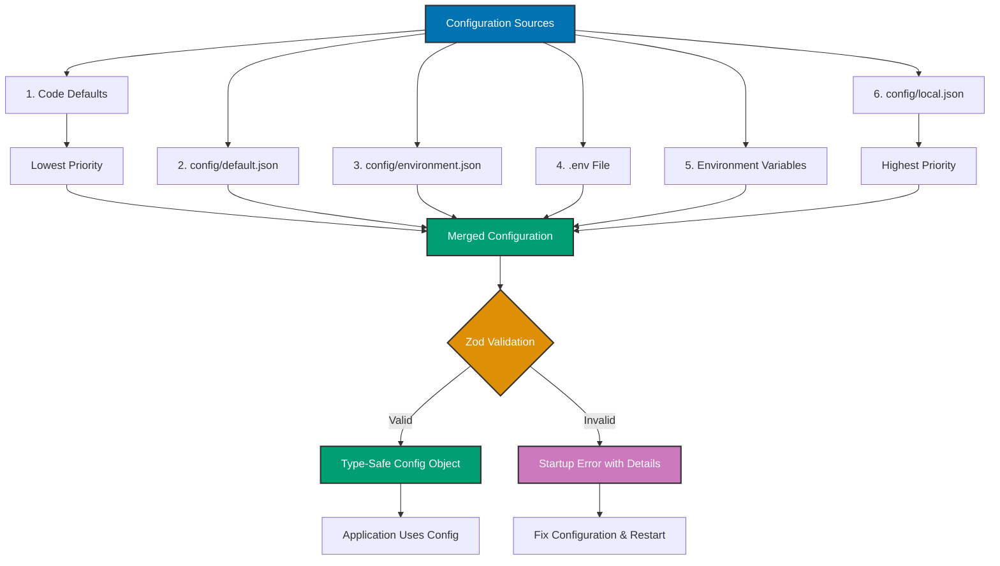

## Why Configuration Management Matters

Configuration separates code from environment-specific settings (database URLs, API keys, feature flags) enabling the same code to run across development, staging, and production without modification. Production systems require secure secret management, type-safe configuration, validation, and environment-specific overrides.

**Core Benefits**:

- **Environment flexibility**: Same code runs in dev, staging, production
- **Secret security**: Credentials never committed to git
- **Type safety**: Configuration errors caught at startup
- **Validation**: Invalid configuration rejected before deployment
- **Audit trail**: Configuration changes tracked separately from code

**Problem**: Hardcoded configuration couples code to environment, exposes secrets in git, lacks type safety, and requires code changes for configuration updates.

**Solution**: Use environment variables with `.env` files (dotenv), structured configuration (node-config), and schema validation (Zod) to manage configuration securely and safely.

## Standard Library First: process.env

Node.js provides `process.env` to access environment variables without external dependencies.

### Basic Environment Variable Access

Environment variables are set in the shell and accessed via the global `process.env` object.

**Pattern**:

```typescript
// Access environment variables
const dbHost = process.env.DB_HOST;
// => Read DB_HOST environment variable
// => Returns string | undefined
// => undefined if variable not set

const dbPort = process.env.DB_PORT || "5432";
// => Default value if not set
// => All environment variables are strings
// => Must parse numbers manually

const apiKey = process.env.API_KEY;
// => Read API_KEY for authentication
// => Should be set in environment, never hardcoded

if (!apiKey) {
  // => Check required variables
  // => Fail fast if missing
  throw new Error("API_KEY environment variable required");
}

// Configuration object
const config = {
  database: {
    host: process.env.DB_HOST || "localhost",
    // => Database hostname
    // => Default: localhost for development
    port: parseInt(process.env.DB_PORT || "5432"),
    // => Parse string to number
    // => Default: PostgreSQL default port
    name: process.env.DB_NAME || "myapp",
    // => Database name
    user: process.env.DB_USER || "postgres",
    // => Database username
    password: process.env.DB_PASSWORD,
    // => Database password (no default - required)
  },
  api: {
    key: process.env.API_KEY,
    // => API key for external service
    url: process.env.API_URL || "https://api.example.com",
    // => API base URL
    timeout: parseInt(process.env.API_TIMEOUT || "5000"),
    // => Timeout in milliseconds
  },
  server: {
    port: parseInt(process.env.PORT || "3000"),
    // => HTTP server port
    nodeEnv: process.env.NODE_ENV || "development",
    // => Environment: development, staging, production
  },
};

// Validate required configuration
if (!config.database.password) {
  throw new Error("DB_PASSWORD environment variable required");
}

// Use configuration
import { Pool } from "pg";

const pool = new Pool({
  host: config.database.host,
  port: config.database.port,
  database: config.database.name,
  user: config.database.user,
  password: config.database.password,
});
// => Initialize database with configuration
```

**Setting environment variables**:

```bash
# Shell export (temporary)
export DB_HOST=localhost
export DB_PORT=5432
export API_KEY=secret123

# Run application with environment variables
node app.js
# => process.env.DB_HOST = "localhost"
# => process.env.DB_PORT = "5432"

# Inline environment variables (single command)
DB_HOST=localhost DB_PORT=5432 node app.js
# => Variables only set for this command
```

**Type conversion**:

```typescript
// String to number
const port = parseInt(process.env.PORT || "3000");
// => Parse string to integer
// => Returns number or NaN if invalid

const timeout = Number(process.env.TIMEOUT || "5000");
// => Alternative parsing
// => Returns number or NaN

if (isNaN(port)) {
  // => Check for invalid number
  throw new Error("PORT must be a number");
}

// String to boolean
const enableFeature = process.env.ENABLE_FEATURE === "true";
// => String comparison
// => true if "true", false otherwise
// => Environment variables are always strings

// String to array
const allowedOrigins = (process.env.ALLOWED_ORIGINS || "").split(",");
// => Split comma-separated string
// => "http://localhost:3000,http://example.com" → ["http://localhost:3000", "http://example.com"]
// => Empty string → [""]
```

**Limitations for production**:

- **No file loading**: Environment variables must be set manually in shell
- **No type safety**: All values are strings, manual parsing required
- **No validation**: Invalid values cause runtime errors
- **No defaults structure**: Default values scattered throughout code
- **No environment files**: Cannot load from `.env` file automatically
- **No nesting**: Flat namespace (DB_HOST, DB_PORT vs structured config)
- **No secrets management**: Secrets visible in process environment
- **Manual error checking**: Must validate each variable individually

**When standard library suffices**:

- Simple applications (≤5 configuration values)
- Container deployments (Kubernetes ConfigMaps, Docker env)
- Cloud platforms (Heroku, AWS Lambda environment variables)
- Configuration set by deployment system

## Production Framework: dotenv

dotenv loads environment variables from `.env` files into `process.env` for local development.

### Installation and Setup

```bash
npm install dotenv
# => Install dotenv library
# => Loads .env file into process.env
```

**Create .env file** (root directory):

```bash
# .env file
# => Never commit to git (.gitignore)
# => Local development only

# Database configuration
DB_HOST=localhost
# => Database hostname
# => Local PostgreSQL server
DB_PORT=5432
# => PostgreSQL default port
DB_NAME=myapp_dev
# => Development database name
DB_USER=postgres
# => Database user
DB_PASSWORD=dev_password_123
# => Database password (development only)

# API configuration
API_KEY=dev_api_key_xyz
# => Development API key
# => Production key set in deployment environment
API_URL=https://api-dev.example.com
# => Development API URL
API_TIMEOUT=5000
# => API timeout in milliseconds

# Server configuration
PORT=3000
# => HTTP server port
NODE_ENV=development
# => Environment name
LOG_LEVEL=debug
# => Logging level (debug in development)

# Feature flags
ENABLE_ANALYTICS=false
# => Feature toggle
# => Boolean represented as string
```

**Load configuration** (top of entry file):

```typescript
import dotenv from "dotenv";
// => Import dotenv library

dotenv.config();
// => Load .env file into process.env
// => Reads .env from current working directory
// => Must call before accessing process.env
// => Call at application startup (top of index.ts)

// Now process.env contains values from .env
const dbHost = process.env.DB_HOST;
// => "localhost" (from .env file)
const apiKey = process.env.API_KEY;
// => "dev_api_key_xyz" (from .env)
```

**Environment-specific files**:

```typescript
// Load different .env files by environment
const envFile = process.env.NODE_ENV === "production" ? ".env.production" : ".env.development";
// => Choose .env file based on NODE_ENV
// => .env.development for local development
// => .env.production for production (rarely used, prefer system env vars)

dotenv.config({ path: envFile });
// => Load specific .env file
// => path option specifies file location

// Alternative: Multiple .env files
dotenv.config({ path: ".env" });
// => Load default .env first
dotenv.config({ path: ".env.local" });
// => Load local overrides (git-ignored)
// => .env.local values override .env values
// => Pattern: .env for defaults, .env.local for personal overrides
```

**Type-safe configuration**:

```typescript
// config.ts - Centralized configuration
import dotenv from "dotenv";

dotenv.config();
// => Load .env file

interface Config {
  // => Type-safe configuration interface
  database: {
    host: string;
    port: number;
    name: string;
    user: string;
    password: string;
  };
  api: {
    key: string;
    url: string;
    timeout: number;
  };
  server: {
    port: number;
    nodeEnv: string;
    logLevel: string;
  };
  features: {
    analytics: boolean;
  };
}

function loadConfig(): Config {
  // => Load and validate configuration
  // => Returns type-safe Config object
  // => Throws error if invalid

  // Helper function for required strings
  function requireEnv(key: string): string {
    // => Get required environment variable
    // => Throws error if missing
    const value = process.env[key];
    if (!value) {
      throw new Error(`Missing required environment variable: ${key}`);
    }
    return value;
  }

  // Helper function for optional strings with default
  function getEnv(key: string, defaultValue: string): string {
    // => Get optional environment variable
    // => Returns default if missing
    return process.env[key] || defaultValue;
  }

  // Helper function for integers
  function getEnvInt(key: string, defaultValue: number): number {
    // => Parse integer environment variable
    // => Returns default if missing or invalid
    const value = process.env[key];
    if (!value) return defaultValue;

    const parsed = parseInt(value, 10);
    if (isNaN(parsed)) {
      throw new Error(`Environment variable ${key} must be a number, got: ${value}`);
    }
    return parsed;
  }

  // Helper function for booleans
  function getEnvBool(key: string, defaultValue: boolean): boolean {
    // => Parse boolean environment variable
    // => "true" → true, anything else → false
    const value = process.env[key];
    if (!value) return defaultValue;
    return value.toLowerCase() === "true";
  }

  return {
    database: {
      host: getEnv("DB_HOST", "localhost"),
      // => Default to localhost if not set
      port: getEnvInt("DB_PORT", 5432),
      // => Default to PostgreSQL port
      name: requireEnv("DB_NAME"),
      // => Required, no default
      user: requireEnv("DB_USER"),
      password: requireEnv("DB_PASSWORD"),
      // => Passwords always required
    },
    api: {
      key: requireEnv("API_KEY"),
      // => Required API key
      url: getEnv("API_URL", "https://api.example.com"),
      timeout: getEnvInt("API_TIMEOUT", 5000),
    },
    server: {
      port: getEnvInt("PORT", 3000),
      nodeEnv: getEnv("NODE_ENV", "development"),
      logLevel: getEnv("LOG_LEVEL", "info"),
    },
    features: {
      analytics: getEnvBool("ENABLE_ANALYTICS", false),
      // => Feature flag from environment
    },
  };
}

export const config = loadConfig();
// => Load configuration at module import
// => Fails fast if invalid
// => Export singleton config object

// Usage in other modules
import { config } from "./config";

console.log(config.database.host);
// => Type-safe access
// => TypeScript knows host is string
console.log(config.api.timeout);
// => TypeScript knows timeout is number
```

**Production benefits**:

- **File-based loading**: Load environment variables from `.env` file
- **Local development**: Easy local configuration without setting shell variables
- **Git-ignored secrets**: `.env` in `.gitignore` prevents secret commits
- **Quick onboarding**: New developers copy `.env.example` → `.env`
- **Centralized configuration**: All configuration in one file

**Trade-offs**:

- **External dependency**: dotenv library (10KB)
- **Still manual parsing**: Must parse types manually
- **No validation**: Invalid values only caught at runtime
- **File management**: Multiple .env files can be confusing

**When to use dotenv**:

- Local development environments (always)
- Applications with >5 configuration values
- Teams (easier onboarding with .env.example)
- Not for production deployment (use system environment variables)

## Production Framework: node-config

node-config provides hierarchical configuration with environment-specific files and structured defaults.

### Installation and Setup

```bash
npm install config
# => Install node-config library
# => Hierarchical configuration management

npm install --save-dev @types/config
# => TypeScript type definitions
```

**Directory structure**:

```
project/
├── config/
│   ├── default.json          # Default configuration
│   ├── development.json      # Development overrides
│   ├── production.json       # Production overrides
│   ├── custom-environment-variables.json  # Environment variable mapping
│   └── local.json            # Local overrides (git-ignored)
├── src/
│   └── index.ts
└── package.json
```

**Default configuration** (config/default.json):

```json
{
  "database": {
    "host": "localhost",
    "port": 5432,
    "name": "myapp",
    "user": "postgres",
    "pool": {
      "min": 2,
      "max": 10
    }
  },
  "api": {
    "url": "https://api.example.com",
    "timeout": 5000,
    "retries": 3
  },
  "server": {
    "port": 3000,
    "logLevel": "info"
  },
  "features": {
    "analytics": false,
    "newUi": false
  }
}
```

**Development overrides** (config/development.json):

```json
{
  "database": {
    "name": "myapp_dev",
    "pool": {
      "max": 5
    }
  },
  "server": {
    "logLevel": "debug"
  }
}
```

**Production overrides** (config/production.json):

```json
{
  "database": {
    "pool": {
      "min": 5,
      "max": 20
    }
  },
  "server": {
    "logLevel": "warn"
  },
  "features": {
    "analytics": true
  }
}
```

**Environment variable mapping** (config/custom-environment-variables.json):

```json
{
  "database": {
    "host": "DB_HOST",
    "port": "DB_PORT",
    "name": "DB_NAME",
    "user": "DB_USER",
    "password": "DB_PASSWORD"
  },
  "api": {
    "key": "API_KEY",
    "url": "API_URL"
  },
  "server": {
    "port": "PORT"
  }
}
```

**Usage**:

```typescript
import config from "config";
// => Import node-config
// => Automatically loads configuration based on NODE_ENV

// Access configuration with get()
const dbHost = config.get<string>("database.host");
// => Get nested configuration value
// => Generic type parameter for type safety
// => Returns "localhost" in development
// => Returns environment variable value if DB_HOST set

const dbPort = config.get<number>("database.port");
// => Type-safe number access
// => TypeScript knows dbPort is number

const dbConfig = config.get<{
  // => Get entire configuration section
  host: string;
  port: number;
  name: string;
  user: string;
  password?: string;
  pool: {
    min: number;
    max: number;
  };
}>("database");
// => Returns entire database config object
// => Type-safe with interface

// Check if configuration exists
if (config.has("database.password")) {
  // => Check if value exists
  // => Returns boolean
  const password = config.get<string>("database.password");
  // => Safe to access
}

// Use configuration
import { Pool } from "pg";

const pool = new Pool({
  host: config.get<string>("database.host"),
  port: config.get<number>("database.port"),
  database: config.get<string>("database.name"),
  user: config.get<string>("database.user"),
  password: config.get<string>("database.password"),
  min: config.get<number>("database.pool.min"),
  max: config.get<number>("database.pool.max"),
});
// => Initialize with node-config values
// => Automatically uses environment-specific configuration
```

**Configuration merging hierarchy**:

```typescript
// node-config loads files in order (later overrides earlier):
// 1. default.json                     ← Base configuration
// 2. {NODE_ENV}.json                  ← Environment-specific (development.json, production.json)
// 3. local.json                       ← Local overrides (git-ignored)
// 4. custom-environment-variables.json ← Environment variable mapping

// Example merging:
// default.json:        { database: { host: "localhost", port: 5432 } }
// development.json:    { database: { port: 5433 } }
// Environment: DB_HOST=192.168.1.100
// Result:              { database: { host: "192.168.1.100", port: 5433 } }
```

**Type-safe configuration wrapper**:

```typescript
// config/index.ts
import config from "config";

interface DatabaseConfig {
  host: string;
  port: number;
  name: string;
  user: string;
  password: string;
  pool: {
    min: number;
    max: number;
  };
}

interface ApiConfig {
  key: string;
  url: string;
  timeout: number;
  retries: number;
}

interface ServerConfig {
  port: number;
  logLevel: "debug" | "info" | "warn" | "error";
}

interface FeaturesConfig {
  analytics: boolean;
  newUi: boolean;
}

interface AppConfig {
  database: DatabaseConfig;
  api: ApiConfig;
  server: ServerConfig;
  features: FeaturesConfig;
}

class ConfigService {
  // => Type-safe configuration wrapper
  // => Provides typed access to node-config

  private config: AppConfig;

  constructor() {
    this.config = {
      database: config.get<DatabaseConfig>("database"),
      api: config.get<ApiConfig>("api"),
      server: config.get<ServerConfig>("server"),
      features: config.get<FeaturesConfig>("features"),
    };
    // => Load all configuration at initialization
    // => Fails fast if missing required values
  }

  get database(): DatabaseConfig {
    return this.config.database;
  }

  get api(): ApiConfig {
    return this.config.api;
  }

  get server(): ServerConfig {
    return this.config.server;
  }

  get features(): FeaturesConfig {
    return this.config.features;
  }

  isProduction(): boolean {
    // => Helper method
    return process.env.NODE_ENV === "production";
  }

  isDevelopment(): boolean {
    return process.env.NODE_ENV === "development";
  }
}

export const appConfig = new ConfigService();
// => Export singleton config service

// Usage
import { appConfig } from "./config";

console.log(appConfig.database.host);
// => Type-safe access
console.log(appConfig.features.analytics);
// => Boolean type enforced
```

**Production benefits**:

- **Hierarchical configuration**: Base + environment-specific + local overrides
- **Structured files**: JSON files instead of flat environment variables
- **Environment variable mapping**: Map env vars to nested configuration
- **Type hints**: Generic types on get() method
- **Documentation**: Configuration schema visible in default.json

**Trade-offs**:

- **External dependency**: node-config library (40KB)
- **File proliferation**: Multiple JSON files to manage
- **No runtime validation**: Types are hints, not enforced
- **Learning curve**: Understanding merge hierarchy

**When to use node-config**:

- Applications with complex configuration (>20 values)
- Multiple environments (dev, staging, production)
- Structured configuration preferred over flat env vars
- Teams (easier to see all configuration options)

## Production Framework: Zod Validation

Zod provides runtime schema validation to ensure configuration is correct before application starts.

### Installation and Setup

```bash
npm install zod
# => Install Zod validation library
# => Runtime type validation

npm install dotenv
# => Also use dotenv for .env loading
```

**Schema definition**:

```typescript
import { z } from "zod";
// => Import Zod library
import dotenv from "dotenv";

dotenv.config();
// => Load .env file

const configSchema = z.object({
  // => Define configuration schema
  // => Validates structure and types
  database: z.object({
    host: z.string().min(1),
    // => String, minimum 1 character
    // => Rejects empty strings
    port: z.coerce.number().int().positive(),
    // => Coerce string to number
    // => Must be positive integer
    name: z.string().min(1),
    user: z.string().min(1),
    password: z.string().min(8),
    // => Password minimum 8 characters
    pool: z.object({
      min: z.coerce.number().int().min(1),
      // => Pool size at least 1
      max: z.coerce.number().int().min(1),
    }),
  }),
  api: z.object({
    key: z.string().regex(/^[A-Za-z0-9_-]+$/),
    // => API key format validation
    // => Only alphanumeric, underscore, hyphen
    url: z.string().url(),
    // => Must be valid URL
    // => Validates http:// or https://
    timeout: z.coerce.number().int().positive().max(30000),
    // => Timeout: 1-30000 ms
    retries: z.coerce.number().int().min(0).max(5),
    // => Retries: 0-5
  }),
  server: z.object({
    port: z.coerce.number().int().min(1).max(65535),
    // => Valid port range
    nodeEnv: z.enum(["development", "staging", "production"]),
    // => Only allowed values
    // => Rejects typos like "developmnet"
    logLevel: z.enum(["debug", "info", "warn", "error"]),
    // => Valid log levels only
  }),
  features: z.object({
    analytics: z.coerce.boolean(),
    // => Coerce "true"/"false" string to boolean
    newUi: z.coerce.boolean(),
  }),
});
// => Complete schema definition

type Config = z.infer<typeof configSchema>;
// => Infer TypeScript type from schema
// => Config type matches schema structure
// => No need to manually define interface

function loadConfig(): Config {
  // => Load and validate configuration
  // => Returns validated Config object
  // => Throws error with details if invalid

  const rawConfig = {
    // => Raw configuration from environment
    database: {
      host: process.env.DB_HOST || "localhost",
      port: process.env.DB_PORT || "5432",
      // => String values from process.env
      // => Will be coerced to number by Zod
      name: process.env.DB_NAME || "myapp",
      user: process.env.DB_USER || "postgres",
      password: process.env.DB_PASSWORD,
      pool: {
        min: process.env.DB_POOL_MIN || "2",
        max: process.env.DB_POOL_MAX || "10",
      },
    },
    api: {
      key: process.env.API_KEY,
      url: process.env.API_URL || "https://api.example.com",
      timeout: process.env.API_TIMEOUT || "5000",
      retries: process.env.API_RETRIES || "3",
    },
    server: {
      port: process.env.PORT || "3000",
      nodeEnv: process.env.NODE_ENV || "development",
      logLevel: process.env.LOG_LEVEL || "info",
    },
    features: {
      analytics: process.env.ENABLE_ANALYTICS || "false",
      newUi: process.env.ENABLE_NEW_UI || "false",
    },
  };

  try {
    const validatedConfig = configSchema.parse(rawConfig);
    // => Validate against schema
    // => Throws ZodError if invalid
    // => Returns typed, validated config
    return validatedConfig;
  } catch (error) {
    if (error instanceof z.ZodError) {
      // => Zod validation error
      console.error("Configuration validation failed:");
      console.error(error.errors);
      // => Detailed error information
      // => Shows which fields failed validation
      /*
      Example error output:
      [
        {
          code: 'too_small',
          minimum: 8,
          type: 'string',
          inclusive: true,
          message: 'String must contain at least 8 character(s)',
          path: ['database', 'password']
        }
      ]
      */
    }
    throw new Error("Invalid configuration");
  }
}

export const config = loadConfig();
// => Load and validate configuration at startup
// => Application fails to start if configuration invalid
// => Prevents runtime errors from bad configuration

// Usage
console.log(config.database.port);
// => TypeScript knows port is number (not string)
// => Already validated and coerced

console.log(config.server.nodeEnv);
// => TypeScript knows nodeEnv is "development" | "staging" | "production"
// => Enum type from schema
```

**Advanced validation**:

```typescript
const advancedConfigSchema = z
  .object({
    database: z.object({
      host: z.string().min(1),
      port: z.coerce.number().int().positive(),
      ssl: z.coerce.boolean().default(false),
      // => Default value if not provided
    }),
    redis: z.object({
      url: z.string().url(),
      password: z.string().optional(),
      // => Optional field
      // => Can be undefined
    }),
    email: z.object({
      from: z.string().email(),
      // => Must be valid email format
      smtpHost: z.string().min(1),
      smtpPort: z.coerce.number().int().positive(),
      smtpUser: z.string().min(1),
      smtpPassword: z.string().min(1),
    }),
    cors: z.object({
      allowedOrigins: z
        .string()
        .transform((str) => str.split(","))
        .pipe(z.array(z.string().url())),
      // => Transform comma-separated string to array
      // => Then validate each item is URL
      // => "http://localhost:3000,https://example.com" → ["http://localhost:3000", "https://example.com"]
    }),
  })
  .refine((data) => data.database.port !== data.redis.url.split(":")[2], {
    // => Custom validation across fields
    // => Database and Redis can't use same port
    message: "Database and Redis ports must be different",
  });
```

**Environment-specific schemas**:

```typescript
const baseSchema = z.object({
  // => Base schema for all environments
  database: z.object({
    host: z.string().min(1),
    port: z.coerce.number().int().positive(),
    name: z.string().min(1),
  }),
});

const developmentSchema = baseSchema.extend({
  // => Extend base schema for development
  database: baseSchema.shape.database.extend({
    // => Extend nested object
    seed: z.coerce.boolean().default(true),
    // => Seed database in development
  }),
});

const productionSchema = baseSchema.extend({
  database: baseSchema.shape.database.extend({
    ssl: z.literal(true),
    // => SSL required in production
    // => Must be exactly true
    password: z.string().min(16),
    // => Stronger password requirement in production
  }),
});

function loadConfig(): z.infer<typeof baseSchema> {
  const rawConfig = {
    /* ... */
  };

  const schema = process.env.NODE_ENV === "production" ? productionSchema : developmentSchema;
  // => Choose schema based on environment
  // => Different validation rules per environment

  return schema.parse(rawConfig);
}
```

**Production benefits**:

- **Runtime validation**: Catch configuration errors at startup
- **Detailed errors**: Exact field and reason for validation failure
- **Type inference**: TypeScript types automatically generated from schema
- **Coercion**: Automatically convert strings to numbers/booleans
- **Default values**: Specify defaults in schema
- **Custom validation**: Complex validation rules (regex, min/max, cross-field)
- **Fail fast**: Application won't start with invalid configuration

**Trade-offs**:

- **External dependency**: Zod library (57KB)
- **Schema maintenance**: Must keep schema synchronized with configuration
- **Learning curve**: Zod API and schema syntax

**When to use Zod**:

- Production applications (always - validation critical)
- Complex configuration (>15 values)
- Team environments (catch configuration errors early)
- Strict validation required (regulatory compliance)

## Configuration Hierarchy Progression Diagram



## Production Best Practices

### Secret Management

Never commit secrets to git. Use environment variables and secret management services.

**Pattern**:

```typescript
// ✅ GOOD: Secrets from environment
const config = {
  database: {
    password: process.env.DB_PASSWORD,
    // => Environment variable
    // => Set by deployment system
  },
  api: {
    key: process.env.API_KEY,
    // => Secret never in code
  },
};

// ❌ BAD: Hardcoded secret
const config = {
  database: {
    password: "super_secret_password",
    // => Committed to git
    // => Visible in git history
  },
};

// .env file (git-ignored)
DB_PASSWORD=dev_password_123
API_KEY=dev_api_key_xyz
// => Local development secrets
// => Never committed

// .env.example file (committed to git)
DB_PASSWORD=
API_KEY=
# => Template for required variables
# => No actual values
# => Developers copy to .env and fill in
```

**Cloud secret management**:

```typescript
// AWS Secrets Manager
import { SecretsManagerClient, GetSecretValueCommand } from "@aws-sdk/client-secrets-manager";

const client = new SecretsManagerClient({ region: "us-east-1" });

async function getSecret(secretName: string): Promise<string> {
  // => Retrieve secret from AWS Secrets Manager
  const command = new GetSecretValueCommand({ SecretId: secretName });
  const response = await client.send(command);
  return response.SecretString!;
}

const dbPassword = await getSecret("prod/database/password");
// => Secret retrieved at runtime
// => Not in code or environment variables
// => Rotated automatically by AWS
```

### Validation at Startup

Validate all configuration before application starts accepting requests.

**Pattern**:

```typescript
import { config } from "./config";
import { appConfig } from "./config/zod-config";

async function bootstrap() {
  // => Application initialization
  // => Validate configuration before starting server

  try {
    // Validate configuration
    console.log("Validating configuration...");
    const validatedConfig = appConfig;
    // => Zod validation runs at import
    // => Throws if invalid

    console.log(`✓ Configuration valid (environment: ${validatedConfig.server.nodeEnv})`);

    // Test critical connections
    console.log("Testing database connection...");
    await pool.query("SELECT 1");
    // => Verify database accessible
    console.log("✓ Database connection successful");

    console.log("Testing external API...");
    const response = await fetch(validatedConfig.api.url);
    if (!response.ok) {
      throw new Error(`API returned ${response.status}`);
    }
    console.log("✓ External API accessible");

    // Start server only after validation
    app.listen(validatedConfig.server.port, () => {
      console.log(`Server started on port ${validatedConfig.server.port}`);
    });
  } catch (error) {
    console.error("Application startup failed:", error);
    process.exit(1);
    // => Exit with error code
    // => Container orchestrator will retry
  }
}

bootstrap();
// => Start application with validation
```

### Configuration Documentation

Document all configuration options in .env.example.

**Pattern**:

```bash
# .env.example
# => Copy to .env and fill in values
# => Committed to git (no secrets)

# ========================================
# Database Configuration
# ========================================
# Database hostname (localhost for local development)
DB_HOST=localhost

# Database port (default: 5432 for PostgreSQL)
DB_PORT=5432

# Database name
DB_NAME=myapp_dev

# Database user
DB_USER=postgres

# Database password (REQUIRED, min 8 characters)
DB_PASSWORD=

# Connection pool minimum connections (default: 2)
DB_POOL_MIN=2

# Connection pool maximum connections (default: 10, production: 20)
DB_POOL_MAX=10

# ========================================
# API Configuration
# ========================================
# External API key (REQUIRED, get from https://example.com/api-keys)
API_KEY=

# API base URL (default: production URL)
API_URL=https://api.example.com

# API timeout in milliseconds (default: 5000)
API_TIMEOUT=5000

# ========================================
# Server Configuration
# ========================================
# HTTP server port (default: 3000)
PORT=3000

# Environment name (development | staging | production)
NODE_ENV=development

# Log level (debug | info | warn | error)
LOG_LEVEL=debug

# ========================================
# Feature Flags
# ========================================
# Enable analytics (true | false)
ENABLE_ANALYTICS=false

# Enable new UI (true | false)
ENABLE_NEW_UI=false
```

## Trade-offs and When to Use Each

### process.env (Standard Library)

**Use when**:

- Simple applications (≤5 configuration values)
- Container deployments (Kubernetes, Docker)
- Cloud platforms (AWS Lambda, Heroku)
- Configuration set by deployment system

**Avoid when**:

- Local development (tedious to set variables manually)
- Complex configuration (>10 values)
- Need type safety (all values are strings)
- Team collaboration (hard to onboard)

### dotenv

**Use when**:

- Local development (always)
- Need .env file loading
- Simple to moderate configuration (5-20 values)
- Team environments (easier onboarding)

**Avoid when**:

- Production deployment (use system environment variables)
- Need hierarchical configuration (flat .env files)
- Complex validation required (manual parsing)

### node-config

**Use when**:

- Complex configuration (>20 values)
- Multiple environments (dev, staging, production)
- Hierarchical structure preferred
- Default values needed

**Avoid when**:

- Simple applications (overkill)
- Container deployments (prefer environment variables)
- Need runtime validation (types are hints only)

### Zod

**Use when**:

- Production applications (always)
- Strict validation required
- Type safety critical
- Complex validation rules needed

**Avoid when**:

- Simple scripts (validation overhead)
- Configuration rarely changes (manual validation acceptable)

### Combined Approach (Recommended)

**Use dotenv + Zod for most applications**:

```typescript
import dotenv from "dotenv";
import { z } from "zod";

dotenv.config();
// => Load .env file

const configSchema = z.object({
  /* ... */
});
// => Define schema

export const config = configSchema.parse({
  /* process.env values */
});
// => Validate configuration
```

## Common Pitfalls

### Pitfall 1: Committing Secrets to Git

**Problem**: `.env` file committed to git repository.

**Solution**: Add `.env` to `.gitignore`, commit `.env.example` instead.

```bash
# .gitignore
.env
.env.local
config/local.json
# => Ignore files with secrets

# Committed files:
# .env.example ✅
# .env ❌
```

### Pitfall 2: No Type Coercion

**Problem**: `process.env.PORT` is string `"3000"`, not number `3000`.

**Solution**: Use Zod coercion or parse manually.

```typescript
// ❌ BAD: Type confusion
const port = process.env.PORT || 3000;
// => Returns "3000" (string) or 3000 (number)
// => Type: string | number

// ✅ GOOD: Explicit parsing
const port = parseInt(process.env.PORT || "3000");
// => Always returns number

// ✅ BETTER: Zod coercion
const configSchema = z.object({
  port: z.coerce.number().int().positive(),
});
```

### Pitfall 3: No Validation

**Problem**: Invalid configuration causes runtime errors deep in application.

**Solution**: Validate configuration at startup with Zod.

```typescript
// ❌ BAD: No validation
const config = {
  port: process.env.PORT, // Could be undefined
};

app.listen(config.port); // Runtime error if PORT not set

// ✅ GOOD: Validation at startup
const configSchema = z.object({
  port: z.coerce.number().int().positive(),
});

const config = configSchema.parse({
  port: process.env.PORT || "3000",
});
// => Throws detailed error if invalid
```

### Pitfall 4: Missing .env.example

**Problem**: New developers don't know which environment variables required.

**Solution**: Maintain `.env.example` with all variables and documentation.

```bash
# ❌ BAD: No .env.example
# New developer: "What environment variables do I need?"

# ✅ GOOD: .env.example with documentation
# .env.example
DB_HOST=localhost # Database hostname
DB_PASSWORD= # REQUIRED: Database password (min 8 characters)
API_KEY= # REQUIRED: Get from https://example.com/api-keys

# Onboarding:
# 1. cp .env.example .env
# 2. Fill in required values
# 3. npm start
```

## Summary

Configuration separates code from environment-specific settings. `process.env` provides basic environment variable access, dotenv loads `.env` files for local development, node-config offers hierarchical configuration with environment-specific files, and Zod validates configuration at startup to catch errors early.

**Progression path**:

1. **Learn with process.env**: Understand environment variables fundamentals
2. **Develop with dotenv**: Load .env files for local development
3. **Structure with node-config**: Hierarchical configuration for complex apps (optional)
4. **Validate with Zod**: Runtime validation for production safety (always)

**Production checklist**:

- ✅ Secrets in environment variables (never hardcoded)
- ✅ .env file git-ignored (with .env.example committed)
- ✅ Configuration validated at startup (Zod schema)
- ✅ Type-safe configuration access (Zod type inference)
- ✅ Environment-specific defaults (NODE_ENV=development|production)
- ✅ Required variables documented (.env.example with comments)
- ✅ Cloud secret management for production (AWS Secrets Manager, etc.)
- ✅ Validation before accepting requests (fail fast)

**Recommended approach**: dotenv (local development) + Zod (validation) for most applications. Add node-config for complex hierarchical configuration needs.

Choose configuration strategy based on application complexity: process.env for simple scripts, dotenv for local development, Zod for production validation.
