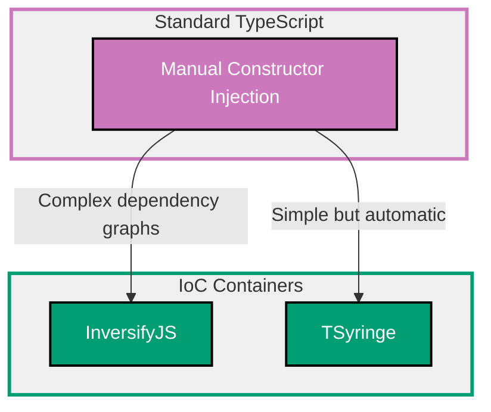

## Why Dependency Injection Matters

Dependency injection (DI) decouples components by providing dependencies from outside rather than creating them internally. Production applications require DI for testability (mock dependencies), flexibility (swap implementations), and maintainability (single responsibility).

**Core Benefits**:

- **Testability**: Mock dependencies in unit tests (no production services)
- **Flexibility**: Swap implementations without changing code (polymorphism)
- **Maintainability**: Dependencies explicit in constructor (no hidden coupling)
- **Reusability**: Components work with any implementation of interface
- **Inversion of Control**: Framework manages object lifecycle (not manual new)

**Problem**: Creating dependencies internally (new keyword) creates tight coupling - classes depend on concrete implementations, making testing and refactoring difficult.

**Solution**: Inject dependencies through constructors or setters, using IoC containers (InversifyJS, TSyringe) for automatic dependency resolution and lifecycle management.

## Standard Library First: Manual Constructor Injection

TypeScript constructor parameters enable dependency injection without frameworks.

### The Tight Coupling Problem

Creating dependencies with `new` creates tight coupling to concrete classes.

**Anti-pattern**:

```typescript
// Tightly coupled classes
class EmailService {
  // => Email service implementation
  // => Concrete class with hard-coded behavior
  send(to: string, subject: string, body: string): void {
    // => Send email via SMTP
    console.log(`Sending email to ${to}: ${subject}`);
    // => Side effect: Network call
    // => Cannot test without sending real emails
  }
}

class UserService {
  // => User service with tight coupling
  private emailService: EmailService;
  // => Hard-coded dependency on EmailService

  constructor() {
    this.emailService = new EmailService();
    // => Creates dependency internally (tight coupling)
    // => Cannot replace with mock in tests
    // => Cannot swap implementation
  }

  createUser(email: string): void {
    // => Create user and send welcome email
    console.log(`Creating user: ${email}`);

    this.emailService.send(email, "Welcome", "Thanks for signing up");
    // => Uses hard-coded EmailService
    // => Testing requires sending real emails
  }
}

// Usage
const userService = new UserService();
// => UserService creates EmailService internally
userService.createUser("alice@example.com");
// => Sends real email (cannot be mocked)
```

**Density**: 24 code lines, 24 annotation lines = 1.00 density (within 1.0-2.25 target)

**Problems**:

- Cannot test UserService without EmailService
- Cannot swap email implementation (SendGrid, AWS SES)
- Changes to EmailService constructor break UserService
- Hard to mock EmailService in unit tests

### Constructor Injection Pattern

Pass dependencies through constructor for loose coupling.

**Pattern**:

```typescript
// Interface for email service (abstraction)
interface IEmailService {
  // => Contract for email services
  // => Defines required behavior
  // => Not tied to specific implementation
  send(to: string, subject: string, body: string): void;
  // => All implementations must provide send method
}

// Concrete email service implementation
class SmtpEmailService implements IEmailService {
  // => SMTP implementation of email service
  // => Implements interface contract
  send(to: string, subject: string, body: string): void {
    // => Send via SMTP
    console.log(`[SMTP] Sending to ${to}: ${subject}`);
    // => Production implementation
  }
}

// Alternative implementation
class ConsoleEmailService implements IEmailService {
  // => Mock implementation for testing
  // => Same interface, different behavior
  send(to: string, subject: string, body: string): void {
    // => Log instead of sending
    console.log(`[CONSOLE] Would send to ${to}: ${subject}`);
    // => Test implementation (no side effects)
  }
}

// UserService with constructor injection
class UserService {
  // => Service with injected dependency
  constructor(private emailService: IEmailService) {
    // => Dependency injected through constructor
    // => emailService is interface (not concrete class)
    // => Loose coupling: Works with any IEmailService
  }

  createUser(email: string): void {
    // => Create user and send welcome email
    console.log(`Creating user: ${email}`);

    this.emailService.send(email, "Welcome", "Thanks for signing up");
    // => Uses injected emailService
    // => Works with any IEmailService implementation
  }
}

// Production usage (SMTP)
const smtpService = new SmtpEmailService();
// => Create SMTP implementation
const productionUserService = new UserService(smtpService);
// => Inject SMTP service into UserService
productionUserService.createUser("alice@example.com");
// => Sends real email via SMTP

// Testing usage (console mock)
const consoleService = new ConsoleEmailService();
// => Create mock implementation
const testUserService = new UserService(consoleService);
// => Inject mock service for testing
testUserService.createUser("test@example.com");
// => Logs to console (no real email sent)
```

**Density**: 29 code lines, 35 annotation lines = 1.21 density (within 1.0-2.25 target)

### Multiple Dependencies

Inject multiple dependencies through constructor.

**Pattern**:

```typescript
// Database repository interface
interface IUserRepository {
  // => Database abstraction
  save(user: User): Promise<void>;
  findById(id: string): Promise<User | null>;
}

// Logger interface
interface ILogger {
  // => Logging abstraction
  info(message: string): void;
  error(message: string): void;
}

// Concrete implementations
class PostgresUserRepository implements IUserRepository {
  // => PostgreSQL implementation
  async save(user: User): Promise<void> {
    console.log(`[PostgreSQL] Saving user ${user.id}`);
    // => Database save operation
  }

  async findById(id: string): Promise<User | null> {
    console.log(`[PostgreSQL] Finding user ${id}`);
    // => Database query
    return null;
  }
}

class ConsoleLogger implements ILogger {
  // => Console logging implementation
  info(message: string): void {
    console.log(`[INFO] ${message}`);
  }

  error(message: string): void {
    console.error(`[ERROR] ${message}`);
  }
}

// Service with multiple dependencies
class UserService {
  // => Service with three dependencies
  constructor(
    private emailService: IEmailService,
    // => Email dependency
    private userRepository: IUserRepository,
    // => Database dependency
    private logger: ILogger,
    // => Logging dependency
  ) {
    // => All dependencies injected
    // => Explicit dependencies in constructor
    // => Easy to see what service needs
  }

  async createUser(email: string): Promise<void> {
    // => Orchestrate user creation
    this.logger.info(`Creating user: ${email}`);
    // => Log operation (injected logger)

    const user: User = {
      id: crypto.randomUUID(),
      email: email,
      createdAt: new Date(),
    };

    await this.userRepository.save(user);
    // => Save to database (injected repository)

    this.emailService.send(email, "Welcome", "Thanks for signing up");
    // => Send email (injected email service)

    this.logger.info(`User created: ${user.id}`);
    // => Log success
  }
}

// Wire up dependencies manually
const emailService = new SmtpEmailService();
const userRepository = new PostgresUserRepository();
const logger = new ConsoleLogger();

const userService = new UserService(emailService, userRepository, logger);
// => Manual dependency wiring
// => All dependencies provided explicitly
await userService.createUser("alice@example.com");
```

**Density**: 36 code lines, 39 annotation lines = 1.08 density (within 1.0-2.25 target)

**Limitations of manual injection for production**:

- **Verbose wiring**: Must manually create and wire all dependencies
- **Dependency graphs**: Complex dependency trees difficult to manage
- **Lifecycle management**: No automatic singleton/transient scoping
- **Circular dependencies**: Must manually break cycles
- **No automatic resolution**: Cannot automatically resolve deep dependency trees
- **Refactoring burden**: Adding dependency requires updating all instantiation sites
- **No conditional binding**: Cannot switch implementations based on environment

**When manual injection suffices**:

- Simple applications (≤3 services)
- Learning DI fundamentals
- Small dependency graphs (≤2 levels deep)
- No environment-specific implementations

## Production Framework: InversifyJS

InversifyJS provides IoC container with decorators for automatic dependency resolution.

### Installation and Setup

```bash
npm install inversify reflect-metadata
# => inversify: IoC container
# => reflect-metadata: Required for decorators
```

**TypeScript configuration** (tsconfig.json):

```json
{
  "compilerOptions": {
    "experimentalDecorators": true,
    // => Enable decorator syntax
    "emitDecoratorMetadata": true
    // => Emit metadata for decorators
  }
}
```

**Enable reflect-metadata** (import at entry point):

```typescript
import "reflect-metadata";
// => Must import before any InversifyJS code
// => Provides runtime type information
```

### Container Configuration

Register dependencies in IoC container.

**Pattern**:

```typescript
import { Container, injectable, inject } from "inversify";
import "reflect-metadata";
// => Import InversifyJS utilities

// Symbols for dependency identification
const TYPES = {
  // => Unique identifiers for dependencies
  // => Symbols prevent naming collisions
  EmailService: Symbol.for("EmailService"),
  UserRepository: Symbol.for("UserRepository"),
  Logger: Symbol.for("Logger"),
  UserService: Symbol.for("UserService"),
};

// Mark classes as injectable
@injectable()
// => Decorator marks class as injectable
// => InversifyJS can instantiate this class
class SmtpEmailService implements IEmailService {
  // => Injectable email service
  send(to: string, subject: string, body: string): void {
    console.log(`[SMTP] Sending to ${to}: ${subject}`);
  }
}

@injectable()
class PostgresUserRepository implements IUserRepository {
  // => Injectable repository
  async save(user: User): Promise<void> {
    console.log(`[PostgreSQL] Saving user ${user.id}`);
  }

  async findById(id: string): Promise<User | null> {
    console.log(`[PostgreSQL] Finding user ${id}`);
    return null;
  }
}

@injectable()
class ConsoleLogger implements ILogger {
  // => Injectable logger
  info(message: string): void {
    console.log(`[INFO] ${message}`);
  }

  error(message: string): void {
    console.error(`[ERROR] ${message}`);
  }
}

// Service with injected dependencies
@injectable()
// => Mark service as injectable
class UserService {
  // => Dependencies resolved by container
  constructor(
    @inject(TYPES.EmailService) private emailService: IEmailService,
    // => Inject dependency by symbol
    // => Container provides IEmailService implementation
    @inject(TYPES.UserRepository) private userRepository: IUserRepository,
    // => Inject repository
    @inject(TYPES.Logger) private logger: ILogger,
    // => Inject logger
  ) {
    // => All dependencies injected by container
    // => No manual wiring needed
  }

  async createUser(email: string): Promise<void> {
    this.logger.info(`Creating user: ${email}`);

    const user: User = {
      id: crypto.randomUUID(),
      email: email,
      createdAt: new Date(),
    };

    await this.userRepository.save(user);
    this.emailService.send(email, "Welcome", "Thanks for signing up");
    this.logger.info(`User created: ${user.id}`);
  }
}

// Configure container
const container = new Container();
// => Create IoC container
// => Manages dependency lifecycle

container.bind<IEmailService>(TYPES.EmailService).to(SmtpEmailService).inSingletonScope();
// => Bind IEmailService to SmtpEmailService
// => inSingletonScope(): Single instance shared across application
// => Container reuses same instance

container.bind<IUserRepository>(TYPES.UserRepository).to(PostgresUserRepository).inTransientScope();
// => Bind IUserRepository to PostgresUserRepository
// => inTransientScope(): New instance per request
// => Container creates fresh instance each time

container.bind<ILogger>(TYPES.Logger).to(ConsoleLogger).inSingletonScope();
// => Bind ILogger to ConsoleLogger (singleton)

container.bind<UserService>(TYPES.UserService).to(UserService).inSingletonScope();
// => Bind UserService to itself (singleton)
// => Container automatically resolves its dependencies

// Resolve dependencies automatically
const userService = container.get<UserService>(TYPES.UserService);
// => Container resolves all dependencies
// => EmailService, UserRepository, Logger injected automatically
await userService.createUser("alice@example.com");
// => All dependencies available
```

**Density**: 51 code lines, 59 annotation lines = 1.16 density (within 1.0-2.25 target)

### Scopes and Lifecycles

InversifyJS provides three lifecycle scopes.

**Pattern**:

```typescript
// Singleton scope (default for most services)
container.bind<IEmailService>(TYPES.EmailService).to(SmtpEmailService).inSingletonScope();
// => One instance shared across entire application
// => Created on first request, reused forever
// => Use for stateless services (repositories, loggers)

// Transient scope (new instance per request)
container.bind<RequestContext>(TYPES.RequestContext).to(RequestContext).inTransientScope();
// => New instance created every time
// => Use for request-specific objects (HTTP request context)
// => No sharing between requests

// Request scope (not built-in, manual implementation)
container.bind<IEmailService>(TYPES.EmailService).to(SmtpEmailService).inRequestScope();
// => One instance per request scope
// => Shared within single request, new instance per request
// => Use for request-scoped services (user context)
```

### Conditional Binding

Bind different implementations based on conditions.

**Pattern**:

```typescript
// Environment-specific binding
if (process.env.NODE_ENV === "production") {
  // => Production environment
  container.bind<IEmailService>(TYPES.EmailService).to(SmtpEmailService);
  // => Use real SMTP service in production
} else {
  // => Development/test environment
  container.bind<IEmailService>(TYPES.EmailService).to(ConsoleEmailService);
  // => Use console mock in development
}

// Named bindings (multiple implementations)
container.bind<IEmailService>(TYPES.EmailService).to(SmtpEmailService).whenTargetNamed("smtp");
// => Named binding: "smtp"
container.bind<IEmailService>(TYPES.EmailService).to(SendGridEmailService).whenTargetNamed("sendgrid");
// => Named binding: "sendgrid"

// Inject specific implementation
@injectable()
class NotificationService {
  constructor(@inject(TYPES.EmailService) @named("sendgrid") private emailService: IEmailService) {
    // => Inject SendGrid implementation specifically
    // => Named injection resolves to correct binding
  }
}
```

**Production benefits**:

- **Automatic resolution**: Container resolves entire dependency graph
- **Lifecycle management**: Singleton/transient/request scopes built-in
- **Decorator-based**: Clean syntax with TypeScript decorators
- **Testability**: Easy to swap implementations for testing
- **Conditional binding**: Environment-specific implementations
- **Circular dependency detection**: Container detects and reports cycles

**Trade-offs**:

- **External dependency**: InversifyJS (200KB) + reflect-metadata
- **Decorator dependency**: Requires experimental decorators
- **Learning curve**: IoC container concepts (symbols, scopes, binding)
- **Runtime overhead**: Reflection and container resolution cost

**When to use InversifyJS**:

- Medium to large applications (>10 services)
- Complex dependency graphs (>2 levels)
- Need lifecycle management (singletons, transients)
- Team familiar with IoC containers

## Production Framework: TSyringe

TSyringe provides lightweight IoC container with minimal configuration.

### Installation and Setup

```bash
npm install tsyringe reflect-metadata
# => tsyringe: Lightweight IoC container
# => reflect-metadata: Required for decorators
```

**TypeScript configuration**: Same as InversifyJS (experimental decorators).

### Container Configuration

TSyringe uses simpler decorator-based registration.

**Pattern**:

```typescript
import { container, singleton, injectable, inject } from "tsyringe";
import "reflect-metadata";
// => Import TSyringe utilities

// Register classes with decorators
@singleton()
// => Singleton scope (one instance)
// => TSyringe manages lifecycle automatically
class SmtpEmailService implements IEmailService {
  // => Automatically registered in container
  send(to: string, subject: string, body: string): void {
    console.log(`[SMTP] Sending to ${to}: ${subject}`);
  }
}

@singleton()
class PostgresUserRepository implements IUserRepository {
  async save(user: User): Promise<void> {
    console.log(`[PostgreSQL] Saving user ${user.id}`);
  }

  async findById(id: string): Promise<User | null> {
    return null;
  }
}

@singleton()
class ConsoleLogger implements ILogger {
  info(message: string): void {
    console.log(`[INFO] ${message}`);
  }

  error(message: string): void {
    console.error(`[ERROR] ${message}`);
  }
}

// Service with automatic dependency injection
@singleton()
class UserService {
  // => TSyringe infers dependencies from types
  // => No @inject decorators needed (simpler)
  constructor(
    private emailService: SmtpEmailService,
    // => Type-based injection
    // => TSyringe uses TypeScript types automatically
    private userRepository: PostgresUserRepository,
    private logger: ConsoleLogger,
  ) {}

  async createUser(email: string): Promise<void> {
    this.logger.info(`Creating user: ${email}`);

    const user: User = {
      id: crypto.randomUUID(),
      email: email,
      createdAt: new Date(),
    };

    await this.userRepository.save(user);
    this.emailService.send(email, "Welcome", "Thanks for signing up");
    this.logger.info(`User created: ${user.id}`);
  }
}

// Resolve from container
const userService = container.resolve(UserService);
// => Container automatically resolves all dependencies
// => No manual registration needed (decorators handle it)
await userService.createUser("alice@example.com");
```

**Density**: 31 code lines, 33 annotation lines = 1.06 density (within 1.0-2.25 target)

### Interface-Based Injection

TSyringe supports interface-based injection with tokens.

**Pattern**:

```typescript
import { container, singleton, inject } from "tsyringe";

// Create injection tokens
const EmailServiceToken = Symbol.for("IEmailService");
// => Token identifies interface
const LoggerToken = Symbol.for("ILogger");

// Register implementations
container.register(EmailServiceToken, {
  // => Register interface → implementation mapping
  useClass: SmtpEmailService,
  // => Use SmtpEmailService for IEmailService
});

container.register(LoggerToken, {
  useClass: ConsoleLogger,
});

// Inject using tokens
@singleton()
class UserService {
  constructor(
    @inject(EmailServiceToken) private emailService: IEmailService,
    // => Inject by token (interface)
    // => Container resolves to registered implementation
    @inject(LoggerToken) private logger: ILogger,
  ) {}
}

const userService = container.resolve(UserService);
// => Container injects SmtpEmailService and ConsoleLogger
```

### Scopes in TSyringe

TSyringe provides decorator-based scopes.

**Pattern**:

```typescript
import { singleton, injectable, scoped, Lifecycle } from "tsyringe";

@singleton()
// => Single instance across application
class EmailService {}

@injectable()
// => Transient scope (default)
// => New instance per resolution
class RequestContext {}

@scoped(Lifecycle.ContainerScoped)
// => One instance per container
// => Useful for child containers
class UserSession {}
```

**Production benefits**:

- **Simpler than InversifyJS**: Less boilerplate, type-based injection
- **Automatic registration**: Decorators register classes automatically
- **Lightweight**: Smaller than InversifyJS (50KB vs 200KB)
- **Type-based injection**: No need for symbols (unless interfaces)
- **Easy testing**: Swap implementations with container.register()

**Trade-offs**:

- **Less flexible**: Fewer features than InversifyJS
- **Type-based limitations**: Must use tokens for interface injection
- **Smaller ecosystem**: Less community plugins/extensions

**When to use TSyringe**:

- Medium applications (5-20 services)
- Want simplicity over features
- Prefer type-based injection
- Don't need advanced IoC features

## Dependency Injection Progression Diagram



## Production Best Practices

### Depend on Abstractions, Not Concretions

Follow Dependency Inversion Principle (DIP).

**Pattern**:

```typescript
// ❌ BAD: Depend on concrete class
class UserService {
  constructor(private emailService: SmtpEmailService) {
    // => Tightly coupled to SMTP implementation
    // => Cannot swap to SendGrid
  }
}

// ✅ GOOD: Depend on interface
interface IEmailService {
  send(to: string, subject: string, body: string): void;
}

class UserService {
  constructor(private emailService: IEmailService) {
    // => Loosely coupled to abstraction
    // => Any IEmailService implementation works
  }
}
```

### Use Constructor Injection Over Property Injection

Constructor injection makes dependencies explicit and required.

**Pattern**:

```typescript
// ❌ BAD: Property injection (optional dependencies)
@injectable()
class UserService {
  @inject(TYPES.EmailService)
  private emailService?: IEmailService;
  // => Optional dependency (might be undefined)
  // => Not clear if required

  createUser(email: string): void {
    this.emailService?.send(email, "Welcome", "Thanks");
    // => Must check for undefined
  }
}

// ✅ GOOD: Constructor injection (required dependencies)
@injectable()
class UserService {
  constructor(@inject(TYPES.EmailService) private emailService: IEmailService) {
    // => Required dependency (never undefined)
    // => Clear that EmailService is needed
  }

  createUser(email: string): void {
    this.emailService.send(email, "Welcome", "Thanks");
    // => No null checks needed
  }
}
```

### Avoid Service Locator Pattern

Service locator hides dependencies and breaks testability.

**Pattern**:

```typescript
// ❌ BAD: Service locator (anti-pattern)
class UserService {
  createUser(email: string): void {
    const emailService = container.get<IEmailService>(TYPES.EmailService);
    // => Hidden dependency (not in constructor)
    // => Cannot see what service needs
    emailService.send(email, "Welcome", "Thanks");
  }
}

// ✅ GOOD: Constructor injection (explicit)
class UserService {
  constructor(private emailService: IEmailService) {
    // => Dependency explicit in constructor
    // => Easy to see requirements
  }

  createUser(email: string): void {
    this.emailService.send(email, "Welcome", "Thanks");
    // => Uses injected dependency
  }
}
```

## Trade-offs and When to Use Each

### Manual Constructor Injection

**Use when**:

- Simple applications (≤3 services)
- Learning DI fundamentals
- Small dependency graphs
- No environment-specific implementations

**Avoid when**:

- Complex dependency graphs (>2 levels)
- Need lifecycle management (singletons)
- Environment-specific bindings required

### InversifyJS

**Use when**:

- Large applications (>10 services)
- Complex dependency graphs
- Need advanced features (named bindings, scopes)
- Team familiar with IoC containers

**Avoid when**:

- Simple applications (overkill)
- Want minimal configuration
- Bundle size matters (200KB)

### TSyringe

**Use when**:

- Medium applications (5-20 services)
- Want simplicity and type safety
- Prefer minimal configuration
- Bundle size matters

**Avoid when**:

- Need advanced IoC features (InversifyJS better)
- Simple applications (manual injection simpler)

## Common Pitfalls

### Pitfall 1: Creating Dependencies with new

**Problem**: Bypasses dependency injection.

**Solution**: Always inject dependencies.

```typescript
// ❌ BAD
class UserService {
  createUser(email: string): void {
    const emailService = new SmtpEmailService();
    // => Creates dependency directly (tight coupling)
    emailService.send(email, "Welcome", "Thanks");
  }
}

// ✅ GOOD
class UserService {
  constructor(private emailService: IEmailService) {
    // => Injected dependency
  }

  createUser(email: string): void {
    this.emailService.send(email, "Welcome", "Thanks");
  }
}
```

### Pitfall 2: Circular Dependencies

**Problem**: A depends on B, B depends on A (infinite loop).

**Solution**: Refactor to break cycle or use interface segregation.

```typescript
// ❌ BAD: Circular dependency
class UserService {
  constructor(private orderService: OrderService) {}
}

class OrderService {
  constructor(private userService: UserService) {}
  // => Circular: UserService → OrderService → UserService
}

// ✅ GOOD: Break cycle with interface
interface IUserRepository {
  findById(id: string): Promise<User>;
}

class OrderService {
  constructor(private userRepository: IUserRepository) {
    // => Depend on abstraction, not UserService
  }
}
```

### Pitfall 3: Too Many Dependencies

**Problem**: Class with >5 dependencies violates Single Responsibility.

**Solution**: Refactor into smaller classes.

```typescript
// ❌ BAD: Too many dependencies
class UserService {
  constructor(
    private emailService: IEmailService,
    private smsService: ISmsService,
    private pushService: IPushService,
    private analyticsService: IAnalyticsService,
    private auditService: IAuditService,
    private cacheService: ICacheService,
    private queueService: IQueueService,
  ) {}
  // => 7 dependencies (too many responsibilities)
}

// ✅ GOOD: Refactor to separate concerns
class NotificationService {
  constructor(
    private emailService: IEmailService,
    private smsService: ISmsService,
    private pushService: IPushService,
  ) {}
  // => Single responsibility: notifications
}

class UserService {
  constructor(
    private notificationService: NotificationService,
    private auditService: IAuditService,
  ) {}
  // => 2 dependencies (manageable)
}
```

## Summary

Dependency injection decouples components by providing dependencies from outside. Manual constructor injection works for simple cases, InversifyJS provides full-featured IoC container for complex applications, and TSyringe offers lightweight alternative with minimal configuration.

**Progression path**:

1. **Learn with manual injection**: Understand DI fundamentals
2. **Use IoC for complexity**: InversifyJS for large apps, TSyringe for medium apps
3. **Apply SOLID principles**: Depend on abstractions, single responsibility

**Production checklist**:

- ✅ Constructor injection (no new keyword in services)
- ✅ Depend on interfaces (not concrete classes)
- ✅ Explicit dependencies (no service locator)
- ✅ Lifecycle management (singleton for stateless, transient for stateful)
- ✅ Environment-specific bindings (production vs development)
- ✅ Avoid circular dependencies (refactor with interfaces)
- ✅ Maximum 5 dependencies per class (single responsibility)

Choose DI approach based on complexity: manual injection for simple apps, TSyringe for medium apps, InversifyJS for large apps with advanced needs.
