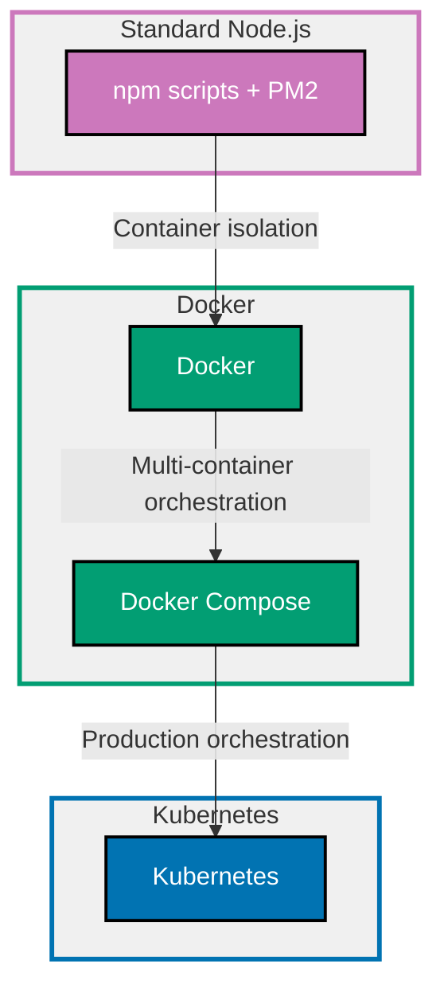

## Why Docker and Kubernetes Matter

Containerization provides consistent environments across development, testing, and production by packaging applications with their dependencies. Docker creates containers, Kubernetes orchestrates them at scale with automated deployment, scaling, and management.

**Core Benefits**:

- **Consistency**: Same environment dev to prod (no "works on my machine")
- **Isolation**: Dependencies packaged with app (no version conflicts)
- **Portability**: Containers run anywhere Docker runs (cloud-agnostic)
- **Scalability**: Kubernetes automatically scales based on load
- **Resource efficiency**: Containers share OS kernel (lighter than VMs)

**Problem**: Manual deployment requires configuring each server, managing dependencies, handling process management, and coordinating updates across multiple instances.

**Solution**: Docker packages TypeScript apps as containers, Kubernetes orchestrates containers across clusters with health checks, rolling updates, and automatic scaling.

## Standard Library First: Package Scripts and Process Managers

Node.js applications traditionally use npm scripts and process managers for deployment.

### The Manual Deployment Problem

Running Node.js apps requires managing dependencies, environment variables, and process lifecycles manually.

**Anti-pattern**:

```bash
# Manual deployment steps (fragile)
npm install
# => Install dependencies on server
# => Version conflicts if Node.js version differs
# => No guarantee of same versions as dev

export PORT=3000
export DATABASE_URL=postgres://...
# => Set environment variables manually
# => Forgotten vars cause runtime failures
# => No validation or secrets management

node dist/main.js &
# => Run in background
# => No automatic restart on crash
# => No log management
# => Process may die silently
```

**Problems**:

- Node.js version inconsistencies across environments
- Dependency version drift (different package-lock.json states)
- Manual environment variable management
- No automatic restart on crashes
- Process monitoring requires additional tools

### npm Scripts Approach

Use package.json scripts for basic lifecycle management.

**Pattern**:

```json
{
  "name": "typescript-api",
  "version": "1.0.0",
  "scripts": {
    "build": "tsc",
    "start": "node dist/main.js",
    "start:dev": "ts-node-dev --respawn src/main.ts",
    "start:prod": "NODE_ENV=production node dist/main.js"
  },
  "dependencies": {
    "express": "^4.18.0"
  },
  "devDependencies": {
    "typescript": "^5.0.0",
    "ts-node-dev": "^2.0.0"
  }
}
```

**Deployment script**:

```bash
#!/bin/bash
# => deploy.sh - Manual deployment script
# => Still requires Node.js pre-installed on server

set -e
# => Exit on any error
# => Prevents partial deployments

npm ci
# => Clean install from package-lock.json
# => Ensures exact dependency versions
# => Faster than npm install

npm run build
# => Compile TypeScript to JavaScript
# => Output to dist/ folder

npm run start:prod
# => Start production server
# => NODE_ENV=production from package.json
# => Process runs in foreground (blocks)
```

**Density**: 11 code lines, 14 annotation lines = 1.27 density (within 1.0-2.25 target)

### PM2 Process Manager

PM2 provides process management with automatic restarts and monitoring.

**Installation**:

```bash
npm install -g pm2
# => Global PM2 installation
# => System-wide process manager
```

**ecosystem.config.js** (PM2 configuration):

```javascript
module.exports = {
  apps: [
    {
      name: "typescript-api",
      // => Application name in PM2
      script: "./dist/main.js",
      // => Entry point after TypeScript compilation
      instances: 4,
      // => Run 4 instances (cluster mode)
      // => Load balancing across CPU cores
      exec_mode: "cluster",
      // => Cluster mode for multi-instance
      // => Shares ports across instances
      env_production: {
        NODE_ENV: "production",
        // => Production environment variable
        PORT: 3000,
        // => Server port
      },
      error_file: "./logs/err.log",
      // => Error log file location
      out_file: "./logs/out.log",
      // => Standard output log location
      log_date_format: "YYYY-MM-DD HH:mm:ss Z",
      // => Timestamp format for logs
      merge_logs: true,
      // => Combine logs from all instances
      autorestart: true,
      // => Automatically restart on crash
      // => Critical for production availability
      max_restarts: 10,
      // => Maximum restart attempts
      // => Prevents infinite restart loops
      min_uptime: "10s",
      // => Minimum uptime before considering stable
      // => Prevents restart loops on immediate crashes
      watch: false,
      // => Disable file watching in production
      // => Use only in development
    },
  ],
};
```

**PM2 commands**:

```bash
pm2 start ecosystem.config.js --env production
# => Start app with production config
# => Reads environment from ecosystem.config.js

pm2 logs
# => View real-time logs
# => Shows output from all instances

pm2 monit
# => Monitor CPU/memory usage
# => Real-time dashboard

pm2 restart typescript-api
# => Graceful restart (zero downtime)
# => Restarts instances one at a time

pm2 stop typescript-api
# => Stop application gracefully
```

**Density**: 23 code lines, 34 annotation lines = 1.48 density (within 1.0-2.25 target)

**Limitations of non-containerized deployment for production**:

- **Environment drift**: Different Node.js versions, system libraries across servers
- **Dependency management**: No guarantee identical dependencies despite package-lock.json
- **Configuration complexity**: Environment variables scattered across scripts
- **No resource limits**: Process can consume all server resources
- **Manual server setup**: Must configure each server identically
- **Scaling challenges**: Adding servers requires repeating setup
- **No isolation**: Multiple apps on same server can conflict
- **Update coordination**: Rolling updates require custom orchestration

**When npm scripts + PM2 suffice**:

- Single server deployments
- Development/staging environments
- Small teams with manual deployment processes
- No containerization infrastructure

## Production Framework: Docker

Docker packages TypeScript applications as self-contained containers with all dependencies.

### Basic Dockerfile

Create reproducible container image.

**Dockerfile** (basic approach):

```dockerfile
FROM node:24-alpine
# => Base image: Node.js 24 on Alpine Linux
# => Alpine: Minimal Linux (5MB vs 100MB+ for full distros)
# => Official Node.js image from Docker Hub

WORKDIR /app
# => Set working directory to /app
# => All subsequent commands run from /app
# => Creates directory if doesn't exist

COPY package*.json ./
# => Copy package.json and package-lock.json
# => Separate step for Docker layer caching
# => Dependencies layer only rebuilds if package*.json changes

RUN npm ci --only=production
# => Install production dependencies only
# => npm ci uses package-lock.json (reproducible)
# => --only=production skips devDependencies

COPY . .
# => Copy application source code
# => Runs after dependency install for better caching
# => Changes to source don't invalidate dependency layer

RUN npm run build
# => Compile TypeScript to JavaScript
# => Requires typescript in devDependencies
# => Output to dist/ folder

ENV NODE_ENV=production
# => Set production environment variable
# => Affects Node.js optimizations

ENV PORT=3000
# => Default port (can be overridden at runtime)

EXPOSE 3000
# => Document that container listens on port 3000
# => Informational only (doesn't actually publish port)

USER node
# => Run as node user (not root)
# => Security best practice (least privilege)
# => node user created by base image

CMD ["node", "dist/main.js"]
# => Default command to start application
# => Uses exec form (doesn't spawn shell)
# => Proper signal handling (SIGTERM for graceful shutdown)
```

**Build and run**:

```bash
docker build -t typescript-api:1.0.0 .
# => Build image with tag typescript-api:1.0.0
# => . specifies build context (current directory)
# => Docker executes Dockerfile instructions

docker run -p 3000:3000 -e DATABASE_URL=postgres://... typescript-api:1.0.0
# => Run container from image
# => -p 3000:3000 maps host port 3000 to container port 3000
# => -e sets environment variable
# => Container isolated from host filesystem
```

**Density**: 28 code lines, 34 annotation lines = 1.21 density (within 1.0-2.25 target)

### Multi-Stage Build (Production-Grade)

Multi-stage builds minimize final image size by separating build and runtime.

**Dockerfile** (multi-stage):

```dockerfile
# Build stage
FROM node:24-alpine AS builder
# => Build stage named "builder"
# => Includes all build tools (TypeScript, devDependencies)
# => Only builder stage artifacts needed in final image

WORKDIR /app

COPY package*.json ./
RUN npm ci
# => Install ALL dependencies (including devDependencies)
# => TypeScript needed for compilation

COPY tsconfig.json ./
# => Copy TypeScript configuration
# => Required for tsc compilation

COPY src ./src
# => Copy source code only
# => Don't copy node_modules, dist, .env

RUN npm run build
# => Compile TypeScript
# => Output to dist/
# => devDependencies available in builder stage

RUN npm prune --production
# => Remove devDependencies after build
# => Reduces node_modules size for runtime stage
# => TypeScript no longer needed

# Runtime stage
FROM node:24-alpine
# => Fresh base image for runtime
# => Smaller final image (no build tools)

WORKDIR /app

# Copy production dependencies from builder
COPY --from=builder /app/node_modules ./node_modules
# => Copy only production node_modules
# => From builder stage after npm prune
# => Excludes devDependencies (typescript, ts-node, etc.)

# Copy compiled JavaScript from builder
COPY --from=builder /app/dist ./dist
# => Copy compiled output only
# => No source TypeScript code in final image
# => Smaller attack surface

# Copy package.json for metadata
COPY package*.json ./
# => Needed for npm scripts if used
# => Metadata for container inspection

# Create non-root user
RUN addgroup -g 1001 -S nodejs && adduser -S nodejs -u 1001
# => Create nodejs group (GID 1001)
# => Create nodejs user (UID 1001) in nodejs group
# => -S: System user/group
# => Explicit UID/GID for consistent permissions

# Set ownership
RUN chown -R nodejs:nodejs /app
# => Change ownership to nodejs user
# => Allows nodejs user to write logs if needed
# => Security: non-root process

USER nodejs
# => Run as nodejs user
# => All subsequent commands as nodejs
# => Container process runs as non-root

ENV NODE_ENV=production
ENV PORT=3000

EXPOSE 3000

# Health check
HEALTHCHECK --interval=30s --timeout=3s --start-period=5s --retries=3 \
  CMD node -e "require('http').get('http://localhost:3000/health', (r) => process.exit(r.statusCode === 200 ? 0 : 1))"
# => Health check runs every 30 seconds
# => Timeout after 3 seconds
# => 5 second start period before first check
# => 3 retries before marking unhealthy
# => Uses Node.js http module (no curl dependency)
# => Checks /health endpoint returns 200
# => Exit 0 = healthy, exit 1 = unhealthy

CMD ["node", "dist/main.js"]
```

**Image size comparison**:

```bash
docker images
# => Basic Dockerfile: ~200MB (includes devDependencies, source)
# => Multi-stage build: ~100MB (production node_modules + compiled JS only)
# => 50% size reduction improves pull/push speed
```

**Density**: 38 code lines, 48 annotation lines = 1.26 density (within 1.0-2.25 target)

### .dockerignore (Security and Performance)

Prevent unnecessary files from entering build context.

**.dockerignore**:

```gitignore
node_modules
# => Don't copy local node_modules
# => Docker installs fresh dependencies
# => Prevents OS-specific native modules issues

dist
# => Don't copy local build output
# => Docker builds fresh in container
# => Ensures clean build

npm-debug.log*
# => Exclude debug logs
# => Sensitive information may leak

.env
.env.*
# => CRITICAL: Never include .env files in image
# => Secrets must be injected at runtime
# => Use environment variables or secrets management

.git
.github
# => Exclude git metadata
# => Reduces build context size
# => No version control needed in image

*.md
# => Exclude markdown documentation
# => Not needed in runtime image

.vscode
.idea
# => Exclude IDE configuration
# => Editor-specific files

coverage
.nyc_output
# => Exclude test coverage reports
# => Generated artifacts not needed

*.test.ts
*.spec.ts
tests/
# => Exclude test files
# => Tests run in CI, not in production image
# => Reduces final image size

Dockerfile
docker-compose.yml
# => Exclude Docker files themselves
# => Not needed inside image
```

**Density**: 19 code lines, 27 annotation lines = 1.42 density (within 1.0-2.25 target)

### Docker Compose for Local Development

Orchestrate multi-container development environments.

**docker-compose.yml**:

```yaml
version: "3.8"
# => Compose file format version
# => 3.8 requires Docker Engine 19.03+

services:
  api:
    # => API service definition
    build:
      context: .
      # => Build context (current directory)
      dockerfile: Dockerfile
      # => Use Dockerfile in current directory
      target: builder
      # => Use builder stage for development (includes devDependencies)
      # => Enables hot reload with ts-node-dev

    ports:
      - "3000:3000"
      # => Map host port 3000 to container port 3000
      # => Access API at http://localhost:3000

    environment:
      - NODE_ENV=development
      # => Development environment
      - DATABASE_URL=postgresql://postgres:password@db:5432/app
      # => Database connection string
      # => db: DNS name of database service (Docker networking)
      # => Containers on same network resolve service names

    volumes:
      - ./src:/app/src
      # => Mount source code for hot reload
      # => Changes reflected immediately without rebuild
      - ./node_modules:/app/node_modules
      # => Mount node_modules for dependency access

    depends_on:
      - db
      # => Start db service before api
      # => Ensures database available
      # => Note: doesn't wait for db readiness (only started)

    command: npm run start:dev
    # => Override CMD from Dockerfile
    # => Run development server with hot reload

  db:
    # => PostgreSQL database service
    image: postgres:16-alpine
    # => Official PostgreSQL image
    # => Alpine variant (smaller)

    environment:
      - POSTGRES_USER=postgres
      # => Database superuser
      - POSTGRES_PASSWORD=password
      # => INSECURE: For local dev only
      # => Production: use secrets management
      - POSTGRES_DB=app
      # => Database name to create

    ports:
      - "5432:5432"
      # => Expose PostgreSQL port to host
      # => Connect with psql or GUI tools

    volumes:
      - postgres_data:/var/lib/postgresql/data
      # => Named volume for data persistence
      # => Data survives container restarts
      # => Stored in Docker volume (not bind mount)

    healthcheck:
      test: ["CMD-SHELL", "pg_isready -U postgres"]
      # => Check if PostgreSQL accepting connections
      # => pg_isready: PostgreSQL utility
      # => Returns 0 if ready
      interval: 10s
      # => Check every 10 seconds
      timeout: 5s
      # => Timeout after 5 seconds
      retries: 5
      # => 5 retries before marking unhealthy

volumes:
  postgres_data:
    # => Named volume declaration
    # => Managed by Docker
    # => Persists across docker-compose down
```

**Commands**:

```bash
docker-compose up
# => Start all services (api + db)
# => Builds images if needed
# => Streams logs to console

docker-compose up -d
# => Start in detached mode (background)
# => Services run without blocking terminal

docker-compose logs -f api
# => Follow logs for api service
# => -f: Stream new log entries

docker-compose exec api sh
# => Execute shell in running api container
# => Useful for debugging

docker-compose down
# => Stop and remove containers
# => Networks removed
# => Named volumes persist (postgres_data survives)

docker-compose down -v
# => Stop and remove containers AND volumes
# => WARNING: Deletes database data
```

**Density**: 50 code lines, 68 annotation lines = 1.36 density (within 1.0-2.25 target)

## Production Framework: Kubernetes

Kubernetes orchestrates containers across clusters with automated scaling, updates, and self-healing.

### Deployment Manifest

Define application deployment with replicas and health checks.

**k8s/deployment.yaml**:

```yaml
apiVersion: apps/v1
# => Kubernetes API version for Deployments
# => apps/v1: Stable API
kind: Deployment
# => Resource type: Deployment
# => Manages Pods and ReplicaSets
metadata:
  name: typescript-api
  # => Deployment name
  labels:
    app: typescript-api
    # => Label for grouping resources
    # => Used by Services to select Pods

spec:
  replicas: 3
  # => Run 3 Pod replicas
  # => Load balanced across replicas
  # => High availability (survives node failures)

  selector:
    matchLabels:
      app: typescript-api
      # => Selector matches Pods with this label
      # => Deployment manages these Pods

  strategy:
    type: RollingUpdate
    # => Rolling update strategy
    # => Updates Pods incrementally (no downtime)
    rollingUpdate:
      maxUnavailable: 1
      # => Max 1 Pod unavailable during update
      # => Ensures minimum 2/3 Pods available
      maxSurge: 1
      # => Max 1 extra Pod during update
      # => Allows 4 Pods temporarily (3 + 1 surge)

  template:
    # => Pod template
    # => Defines how to create Pods
    metadata:
      labels:
        app: typescript-api
        # => Pod labels (match selector)

    spec:
      containers:
        - name: api
          # => Container name
          image: your-registry/typescript-api:1.0.0
          # => Container image from registry
          # => Tag version for reproducibility
          # => Never use :latest in production

          ports:
            - containerPort: 3000
              # => Container listens on port 3000
              # => Service routes traffic here
              name: http
              # => Named port (referenced by Service)

          env:
            - name: NODE_ENV
              value: "production"
              # => Environment variable
              # => Hardcoded non-secret value

            - name: PORT
              value: "3000"

            - name: DATABASE_URL
              valueFrom:
                secretKeyRef:
                  name: api-secrets
                  # => Secret name (created separately)
                  key: database-url
                  # => Key within Secret
                  # => Secure secret injection

          resources:
            requests:
              memory: "256Mi"
              # => Guaranteed memory allocation
              # => Kubernetes reserves 256MB
              cpu: "250m"
              # => Guaranteed CPU (250 milliCPU = 0.25 cores)
              # => Pod won't start if resources unavailable
            limits:
              memory: "512Mi"
              # => Maximum memory allowed
              # => Pod killed if exceeds (OOMKilled)
              cpu: "500m"
              # => Maximum CPU (throttled if exceeds)
              # => Prevents resource hogging

          livenessProbe:
            # => Checks if container alive
            # => Restarts container if fails
            httpGet:
              path: /health
              # => HTTP GET to /health endpoint
              port: http
              # => Uses named port from containerPort
            initialDelaySeconds: 10
            # => Wait 10 seconds before first probe
            # => Allows app startup time
            periodSeconds: 10
            # => Probe every 10 seconds
            timeoutSeconds: 3
            # => Timeout after 3 seconds
            failureThreshold: 3
            # => Restart after 3 consecutive failures
            # => Prevents flapping on transient issues

          readinessProbe:
            # => Checks if container ready for traffic
            # => Removes from Service if fails (no restart)
            httpGet:
              path: /health
              port: http
            initialDelaySeconds: 5
            # => Faster readiness check than liveness
            periodSeconds: 5
            # => Check every 5 seconds
            failureThreshold: 2
            # => Mark unready after 2 failures

          securityContext:
            runAsNonRoot: true
            # => Enforce non-root user
            # => Kubernetes rejects if container runs as root
            runAsUser: 1001
            # => Run as UID 1001 (nodejs user)
            # => Matches Dockerfile USER directive
            readOnlyRootFilesystem: true
            # => Root filesystem read-only
            # => Security: prevents file tampering
            # => App must write to volumes only
            allowPrivilegeEscalation: false
            # => Prevent privilege escalation
            # => Container cannot gain more privileges
            capabilities:
              drop:
                - ALL
                # => Drop all Linux capabilities
                # => Minimal privileges
```

**Density**: 74 code lines, 97 annotation lines = 1.31 density (within 1.0-2.25 target)

### Service Manifest

Expose Deployment with load balancing.

**k8s/service.yaml**:

```yaml
apiVersion: v1
# => Core API version
kind: Service
# => Resource type: Service
# => Load balances traffic to Pods
metadata:
  name: typescript-api
  # => Service name
  # => DNS name within cluster: typescript-api.default.svc.cluster.local

spec:
  selector:
    app: typescript-api
    # => Route traffic to Pods with this label
    # => Matches Deployment's Pod labels

  ports:
    - protocol: TCP
      port: 80
      # => Service port (ClusterIP)
      # => Other Pods connect to typescript-api:80
      targetPort: http
      # => Forward to Pod's named port "http" (3000)
      # => Decouples Service port from container port
      name: http

  type: ClusterIP
  # => Service type: ClusterIP (internal only)
  # => Only accessible within cluster
  # => Use LoadBalancer or Ingress for external access
```

**Density**: 13 code lines, 17 annotation lines = 1.31 density (within 1.0-2.25 target)

### ConfigMap and Secret

Externalize configuration and secrets.

**k8s/configmap.yaml**:

```yaml
apiVersion: v1
kind: ConfigMap
# => Store non-confidential configuration
metadata:
  name: api-config

data:
  LOG_LEVEL: "info"
  # => Non-secret configuration
  # => Plain text (visible in kubectl describe)
  CACHE_TTL: "3600"
  # => Time-to-live for cache (seconds)
```

**k8s/secret.yaml**:

```yaml
apiVersion: v1
kind: Secret
# => Store sensitive data
metadata:
  name: api-secrets

type: Opaque
# => Generic secret type

data:
  database-url: cG9zdGdyZXNxbDovL3VzZXI6cGFzc0BkYjozNTQzL2RiCg==
  # => Base64-encoded secret
  # => Decode: echo "..." | base64 -d
  # => postgresql://user:pass@db:5432/db
  # => In production: Use external secrets management (Vault, AWS Secrets Manager)
```

**Apply to cluster**:

```bash
kubectl apply -f k8s/configmap.yaml
# => Create/update ConfigMap
# => ConfigMap available to Pods

kubectl apply -f k8s/secret.yaml
# => Create/update Secret
# => Secret available to Pods

kubectl apply -f k8s/deployment.yaml
# => Create/update Deployment
# => Creates Pods with 3 replicas

kubectl apply -f k8s/service.yaml
# => Create/update Service
# => Exposes Deployment internally

kubectl get pods
# => List Pods
# => Shows typescript-api-xxx Pods

kubectl logs -f deployment/typescript-api
# => Stream logs from Deployment
# => Aggregates logs from all Pods

kubectl exec -it deployment/typescript-api -- sh
# => Execute shell in Pod
# => -it: Interactive TTY

kubectl rollout status deployment/typescript-api
# => Check rollout status
# => Shows update progress

kubectl rollout undo deployment/typescript-api
# => Rollback to previous version
# => Emergency rollback if issues
```

**Density**: 24 code lines, 31 annotation lines = 1.29 density (within 1.0-2.25 target)

### Horizontal Pod Autoscaler (HPA)

Automatically scale based on CPU/memory utilization.

**k8s/hpa.yaml**:

```yaml
apiVersion: autoscaling/v2
# => HPA API version
kind: HorizontalPodAutoscaler
# => Autoscaler resource
metadata:
  name: typescript-api-hpa

spec:
  scaleTargetRef:
    apiVersion: apps/v1
    kind: Deployment
    name: typescript-api
    # => Target Deployment to scale

  minReplicas: 3
  # => Minimum replicas (always)
  # => Ensures high availability
  maxReplicas: 10
  # => Maximum replicas (cap)
  # => Prevents runaway scaling costs

  metrics:
    - type: Resource
      resource:
        name: cpu
        target:
          type: Utilization
          averageUtilization: 70
          # => Scale when average CPU > 70%
          # => Calculates average across all Pods
          # => Scale up if sustained high CPU

    - type: Resource
      resource:
        name: memory
        target:
          type: Utilization
          averageUtilization: 80
          # => Scale when average memory > 80%
          # => Memory-based scaling

  behavior:
    scaleUp:
      stabilizationWindowSeconds: 60
      # => Wait 60 seconds before scaling up
      # => Prevents flapping on CPU spikes
      policies:
        - type: Percent
          value: 50
          periodSeconds: 60
          # => Increase replicas by 50% every 60 seconds
          # => Gradual scale-up

    scaleDown:
      stabilizationWindowSeconds: 300
      # => Wait 5 minutes before scaling down
      # => Conservative scale-down (avoid thrashing)
      policies:
        - type: Pods
          value: 1
          periodSeconds: 120
          # => Remove 1 Pod every 2 minutes
          # => Gradual scale-down
```

**Apply autoscaler**:

```bash
kubectl apply -f k8s/hpa.yaml
# => Create HPA
# => Monitors CPU/memory metrics

kubectl get hpa
# => View HPA status
# => Shows current/target metrics and replica count

kubectl describe hpa typescript-api-hpa
# => Detailed HPA information
# => Shows scaling events
```

**Density**: 35 code lines, 41 annotation lines = 1.17 density (within 1.0-2.25 target)

## Container Deployment Progression Diagram



## Production Best Practices

### Minimize Docker Image Size

Smaller images improve pull/push speed and reduce attack surface.

**Strategies**:

```dockerfile
# Use Alpine base images (5MB vs 100MB+)
FROM node:24-alpine

# Multi-stage builds (separate build/runtime)
FROM node:24-alpine AS builder
# ... build steps ...
FROM node:24-alpine
COPY --from=builder /app/dist ./dist

# Remove devDependencies after build
RUN npm prune --production

# Use .dockerignore aggressively
# Exclude tests, docs, IDE configs
```

### Security Best Practices

Run containers with minimal privileges.

**Dockerfile security**:

```dockerfile
# Non-root user
USER node

# Read-only root filesystem
# Set in Kubernetes securityContext
```

**Kubernetes security**:

```yaml
securityContext:
  runAsNonRoot: true
  runAsUser: 1001
  readOnlyRootFilesystem: true
  allowPrivilegeEscalation: false
  capabilities:
    drop:
      - ALL
```

### Health Checks

Implement /health endpoint for liveness and readiness.

**Express health endpoint**:

```typescript
import express from "express";

const app = express();
// => Create Express app

let isReady = false;
// => Readiness flag
// => Set to true when app fully initialized

app.get("/health", (req, res) => {
  // => Liveness check: Is process alive?
  // => Always returns 200 if process running
  res.status(200).json({ status: "ok" });
  // => Kubernetes restarts Pod if fails
});

app.get("/ready", (req, res) => {
  // => Readiness check: Ready for traffic?
  if (isReady) {
    res.status(200).json({ status: "ready" });
    // => Pod receives traffic
  } else {
    res.status(503).json({ status: "not ready" });
    // => Pod removed from Service (no traffic)
    // => Use during startup or shutdown
  }
});

// After database connection, migrations, etc.
connectDatabase().then(() => {
  isReady = true;
  // => Mark ready after initialization
  // => Prevents traffic to unprepared Pod
});

app.listen(3000);
```

**Density**: 17 code lines, 19 annotation lines = 1.12 density (within 1.0-2.25 target)

### Resource Limits

Set requests and limits to prevent resource starvation.

**Guidelines**:

```yaml
resources:
  requests:
    # Set to average usage (measured from metrics)
    memory: "256Mi"
    cpu: "250m"
  limits:
    # Set to 1.5-2x requests (allows bursts)
    memory: "512Mi"
    cpu: "500m"
```

**Memory**:

- Request: Guaranteed allocation
- Limit: OOMKilled if exceeded

**CPU**:

- Request: Guaranteed allocation
- Limit: Throttled if exceeded (not killed)

### Secrets Management

Never commit secrets to version control or Docker images.

**Kubernetes Secrets**:

```bash
# Create Secret from literal
kubectl create secret generic api-secrets \
  --from-literal=database-url=postgres://... \
  --from-literal=jwt-secret=...
# => Secret created from command line
# => Not in git history

# Create Secret from file
kubectl create secret generic api-secrets \
  --from-file=database-url=./secrets/db-url.txt
# => Secret from file (excluded from git)

# Create Secret from .env file
kubectl create secret generic api-secrets --from-env-file=.env
# => Bulk import from .env (dev only)
```

**External secrets management**:

- **AWS Secrets Manager**: Fetch secrets from AWS
- **HashiCorp Vault**: Centralized secrets management
- **External Secrets Operator**: Sync external secrets to Kubernetes

## Trade-offs and When to Use Each

### npm scripts + PM2

**Use when**:

- Single server deployment
- Development/staging environments
- Small teams with manual processes
- No containerization infrastructure

**Avoid when**:

- Need consistent environments (dev/prod parity)
- Scaling across multiple servers
- Complex deployment orchestration

### Docker

**Use when**:

- Need environment consistency
- Simple containerization (single server)
- CI/CD pipelines (build once, run anywhere)
- Development environment standardization

**Avoid when**:

- Need multi-server orchestration (use Kubernetes)
- Very simple single-server apps (PM2 simpler)

### Docker Compose

**Use when**:

- Local development with multiple services
- Simple multi-container deployments
- Testing service integration locally

**Avoid when**:

- Production deployments (use Kubernetes)
- Need auto-scaling or self-healing

### Kubernetes

**Use when**:

- Production multi-server deployments
- Need auto-scaling based on load
- High availability requirements (zero downtime)
- Large teams with DevOps practices

**Avoid when**:

- Simple single-server apps (overkill)
- Small teams without Kubernetes expertise
- Development environments (Docker Compose simpler)

## Common Pitfalls

### Pitfall 1: Using :latest Tag

**Problem**: Unpredictable deployments.

**Solution**: Always use specific version tags.

```dockerfile
# ❌ BAD
FROM node:latest
image: typescript-api:latest

# ✅ GOOD
FROM node:24-alpine
image: typescript-api:1.0.0
```

### Pitfall 2: Running as Root

**Problem**: Security vulnerability.

**Solution**: Use non-root user.

```dockerfile
USER node
```

```yaml
securityContext:
  runAsNonRoot: true
  runAsUser: 1001
```

### Pitfall 3: No Health Checks

**Problem**: Kubernetes can't detect unhealthy Pods.

**Solution**: Implement /health endpoint and configure probes.

```yaml
livenessProbe:
  httpGet:
    path: /health
    port: 3000

readinessProbe:
  httpGet:
    path: /ready
    port: 3000
```

### Pitfall 4: Secrets in Images

**Problem**: Secrets leaked in image layers.

**Solution**: Inject secrets at runtime.

```yaml
env:
  - name: DATABASE_URL
    valueFrom:
      secretKeyRef:
        name: api-secrets
        key: database-url
```

### Pitfall 5: No Resource Limits

**Problem**: Pods can consume all node resources.

**Solution**: Set requests and limits.

```yaml
resources:
  requests:
    memory: "256Mi"
    cpu: "250m"
  limits:
    memory: "512Mi"
    cpu: "500m"
```

## Summary

Docker packages TypeScript applications as portable containers with all dependencies, Kubernetes orchestrates containers at scale with automated scaling and self-healing. Docker Compose simplifies local multi-container development.

**Progression path**:

1. **Learn with npm scripts + PM2**: Understand process management
2. **Containerize with Docker**: Achieve environment consistency
3. **Use Docker Compose locally**: Multi-service development
4. **Deploy with Kubernetes**: Production orchestration and scaling

**Production checklist**:

- ✅ Multi-stage Dockerfile (minimize image size)
- ✅ Non-root user (security)
- ✅ Health checks (/health, /ready endpoints)
- ✅ Resource limits (prevent resource hogging)
- ✅ Secrets management (inject at runtime, never commit)
- ✅ .dockerignore (exclude unnecessary files)
- ✅ Version tags (never :latest in production)
- ✅ Read-only root filesystem (security)
- ✅ Horizontal autoscaling (HPA for load-based scaling)

Choose deployment approach based on scale: PM2 for simple single-server, Docker for consistency, Kubernetes for production orchestration.
