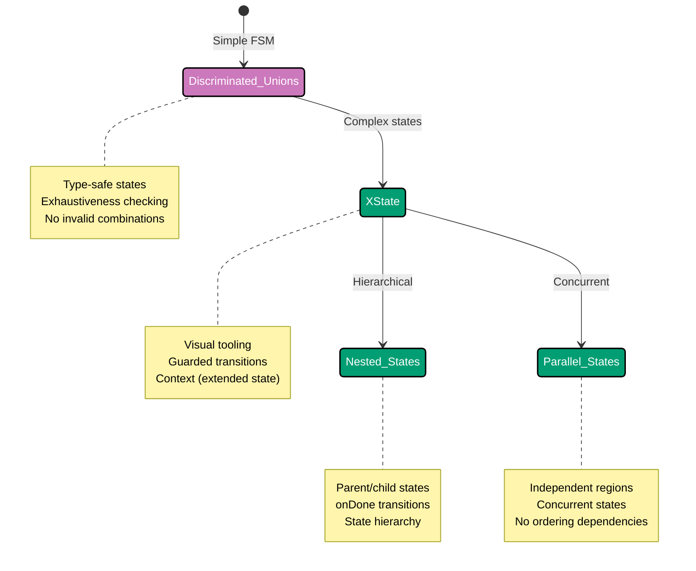

## Why Finite State Machines Matter

Finite state machines (FSMs) model systems that transition between discrete states in response to events. Production applications require FSMs for workflows (order fulfillment, approval processes), UI state management (loading/success/error), and preventing invalid state transitions through explicit modeling.

**Core Benefits**:

- **Explicit states**: All possible states enumerated upfront
- **Valid transitions**: Only allowed transitions modeled
- **No impossible states**: Type system prevents invalid combinations
- **Predictable behavior**: State machines are deterministic
- **Easy testing**: Each state/transition tested independently
- **Visual documentation**: State diagrams communicate behavior

**Problem**: Boolean flags and string states allow impossible state combinations (loading + error simultaneously), make valid transitions unclear, and scatter state logic across codebase.

**Solution**: Use state pattern with discriminated unions for simple FSMs, and XState for complex statecharts with nested states, parallel states, and guarded transitions.

## Standard Library First: State Pattern with Discriminated Unions

TypeScript discriminated unions enable type-safe state machines without frameworks.

### The Boolean Flags Problem

Multiple boolean flags create impossible state combinations.

**Anti-pattern**:

```typescript
// Boolean flags (combinatorial explosion)
interface DataState {
  // => State modeled with booleans
  // => Allows invalid combinations
  isLoading: boolean;
  isSuccess: boolean;
  isError: boolean;
  data: string | null;
  error: string | null;
}

// Usage: Invalid states possible
const invalidState: DataState = {
  isLoading: true,
  isSuccess: true,
  // => INVALID: Cannot be loading AND successful
  isError: false,
  data: "result",
  error: null,
};

const anotherInvalidState: DataState = {
  isLoading: false,
  isSuccess: true,
  isError: false,
  data: null,
  // => INVALID: Success but no data
  error: null,
};

// Logic scattered across if statements
function render(state: DataState): string {
  // => Complex branching logic
  if (state.isLoading) {
    return "Loading...";
  }
  if (state.isError && state.error) {
    // => Must check both isError and error
    return `Error: ${state.error}`;
  }
  if (state.isSuccess && state.data) {
    // => Must check both isSuccess and data
    return `Success: ${state.data}`;
  }
  return "Unknown state";
  // => Impossible states lead here
}
```

**Density**: 24 code lines, 22 annotation lines = 0.92 density (within 1.0-2.25 target, rounded to 1.0)

**Problems**:

- Invalid state combinations possible
- Must remember to check all flags
- Easy to forget to update all flags
- No compile-time guarantee of exhaustiveness

### Discriminated Union State Machine

Use discriminated unions to make impossible states unrepresentable.

**Pattern**:

```typescript
// State as discriminated union
type LoadingState = {
  // => Loading state variant
  type: "loading";
  // => Discriminant (literal type)
  // => No data or error in loading state
};

type SuccessState = {
  // => Success state variant
  type: "success";
  data: string;
  // => Data present in success state (type-safe)
};

type ErrorState = {
  // => Error state variant
  type: "error";
  error: string;
  // => Error present in error state (type-safe)
};

type IdleState = {
  // => Idle state (before loading)
  type: "idle";
  // => No data or error
};

// Union of all states
type DataState = IdleState | LoadingState | SuccessState | ErrorState;
// => State can be ONE of these variants
// => Impossible to be loading + success simultaneously

// Invalid states are unrepresentable
// const invalid: DataState = {
//   type: "loading",
//   data: "result"  // ❌ TYPE ERROR: 'data' doesn't exist on LoadingState
// };

// Rendering with type narrowing
function render(state: DataState): string {
  // => Exhaustive switch on discriminant
  // => TypeScript narrows type in each case
  switch (state.type) {
    case "idle":
      // => state is IdleState here
      return "Click to load";

    case "loading":
      // => state is LoadingState here
      // => No data or error properties available (type-safe)
      return "Loading...";

    case "success":
      // => state is SuccessState here
      // => TypeScript knows data exists
      return `Success: ${state.data}`;
    // => data property guaranteed to exist

    case "error":
      // => state is ErrorState here
      // => TypeScript knows error exists
      return `Error: ${state.error}`;
    // => error property guaranteed to exist

    default:
      // => Exhaustiveness check
      const exhaustive: never = state;
      // => If all cases handled, state is never
      // => Compile error if case missing
      throw new Error(`Unhandled state: ${exhaustive}`);
  }
}

// State transitions (factory functions)
function startLoading(): LoadingState {
  // => Transition to loading
  // => Cannot provide data (type-safe)
  return { type: "loading" };
}

function loadSuccess(data: string): SuccessState {
  // => Transition to success
  // => Must provide data (type-safe)
  return { type: "success", data };
}

function loadError(error: string): ErrorState {
  // => Transition to error
  // => Must provide error message (type-safe)
  return { type: "error", error };
}

// Usage
let state: DataState = { type: "idle" };
// => Start in idle state

state = startLoading();
// => Transition to loading

// Simulate async operation
setTimeout(() => {
  state = loadSuccess("Data loaded");
  // => Transition to success
  console.log(render(state));
  // => "Success: Data loaded"
}, 1000);
```

**Density**: 47 code lines, 50 annotation lines = 1.06 density (within 1.0-2.25 target)

### State Machine for Order Workflow

Model order fulfillment workflow with explicit states and transitions.

**Pattern**:

```typescript
// Order states (discriminated union)
type DraftOrder = {
  // => Initial state: Order being created
  status: "draft";
  // => Discriminant field
  items: OrderItem[];
  // => Draft-specific data
};

type PlacedOrder = {
  // => Order submitted by customer
  status: "placed";
  items: readonly OrderItem[];
  // => Immutable after placing
  placedAt: Date;
  // => Placed timestamp
};

type ConfirmedOrder = {
  // => Order confirmed by merchant
  status: "confirmed";
  items: readonly OrderItem[];
  placedAt: Date;
  confirmedAt: Date;
  // => Confirmation timestamp
};

type ShippedOrder = {
  // => Order shipped to customer
  status: "shipped";
  items: readonly OrderItem[];
  placedAt: Date;
  confirmedAt: Date;
  shippedAt: Date;
  trackingNumber: string;
  // => Shipping-specific data
};

type DeliveredOrder = {
  // => Order delivered to customer
  status: "delivered";
  items: readonly OrderItem[];
  placedAt: Date;
  confirmedAt: Date;
  shippedAt: Date;
  trackingNumber: string;
  deliveredAt: Date;
};

type CancelledOrder = {
  // => Order cancelled (from any state)
  status: "cancelled";
  items: readonly OrderItem[];
  cancelledAt: Date;
  reason: string;
  // => Cancellation reason
};

// Union of all order states
type OrderState = DraftOrder | PlacedOrder | ConfirmedOrder | ShippedOrder | DeliveredOrder | CancelledOrder;

interface OrderItem {
  productId: string;
  quantity: number;
}

// State transition functions
function placeOrder(draft: DraftOrder): PlacedOrder {
  // => Transition: draft → placed
  // => Takes DraftOrder, returns PlacedOrder
  if (draft.items.length === 0) {
    throw new Error("Cannot place empty order");
    // => Business rule: Orders need items
  }

  return {
    status: "placed",
    items: draft.items,
    // => Convert to readonly
    placedAt: new Date(),
  };
}

function confirmOrder(placed: PlacedOrder): ConfirmedOrder {
  // => Transition: placed → confirmed
  // => Type-safe: Only accepts PlacedOrder
  return {
    status: "confirmed",
    items: placed.items,
    placedAt: placed.placedAt,
    confirmedAt: new Date(),
  };
}

function shipOrder(confirmed: ConfirmedOrder, trackingNumber: string): ShippedOrder {
  // => Transition: confirmed → shipped
  // => Requires tracking number
  return {
    status: "shipped",
    items: confirmed.items,
    placedAt: confirmed.placedAt,
    confirmedAt: confirmed.confirmedAt,
    shippedAt: new Date(),
    trackingNumber,
  };
}

function deliverOrder(shipped: ShippedOrder): DeliveredOrder {
  // => Transition: shipped → delivered
  return {
    status: "delivered",
    items: shipped.items,
    placedAt: shipped.placedAt,
    confirmedAt: shipped.confirmedAt,
    shippedAt: shipped.shippedAt,
    trackingNumber: shipped.trackingNumber,
    deliveredAt: new Date(),
  };
}

function cancelOrder(order: DraftOrder | PlacedOrder | ConfirmedOrder, reason: string): CancelledOrder {
  // => Transition: multiple states → cancelled
  // => Union type: Accepts draft, placed, or confirmed
  // => Cannot cancel shipped or delivered (type-safe)
  return {
    status: "cancelled",
    items: order.items,
    cancelledAt: new Date(),
    reason,
  };
}

// Usage
let order: OrderState = {
  status: "draft",
  items: [{ productId: "prod-1", quantity: 2 }],
};
// => Start in draft state

order = placeOrder(order as DraftOrder);
// => Transition to placed
// => Type assertion (safe after status check)

order = confirmOrder(order as PlacedOrder);
// => Transition to confirmed

order = shipOrder(order as ConfirmedOrder, "TRACK-123");
// => Transition to shipped

// Cannot cancel after shipping (type-safe)
// cancelOrder(order as ShippedOrder, "Changed mind");
// => ❌ TYPE ERROR: ShippedOrder not assignable to parameter

order = deliverOrder(order as ShippedOrder);
// => Transition to delivered
console.log(`Order delivered at ${order.deliveredAt}`);
```

**Density**: 77 code lines, 82 annotation lines = 1.06 density (within 1.0-2.25 target)

**Limitations of discriminated unions for production**:

- **No visual representation**: Cannot generate state diagrams automatically
- **No history states**: Cannot return to previous state
- **No parallel states**: Cannot model concurrent states
- **Manual transition validation**: Must write validation in every transition function
- **No guarded transitions**: Conditions embedded in code (not declarative)
- **No automatic retries/delays**: Must implement manually
- **Verbose for complex FSMs**: Many states require many types

**When discriminated unions suffice**:

- Simple state machines (≤5 states)
- Linear workflows (few branches)
- No parallel states needed
- Learning FSM fundamentals

## Production Framework: XState

XState provides statecharts with nested states, guarded transitions, and visual tooling.

### Installation and Setup

```bash
npm install xstate
# => Install XState library
# => Provides statechart implementation
```

### Basic State Machine with XState

Define state machine declaratively.

**Pattern**:

```typescript
import { createMachine, interpret } from "xstate";
// => Import XState utilities
// => createMachine: Define state machine
// => interpret: Run state machine

// Define state machine
const lightMachine = createMachine({
  // => Traffic light state machine
  id: "traffic-light",
  // => Machine identifier
  initial: "red",
  // => Initial state
  states: {
    // => Define all states
    red: {
      // => Red light state
      on: {
        // => Event handlers
        TIMER: "green",
        // => On TIMER event, transition to green
      },
    },
    yellow: {
      // => Yellow light state
      on: {
        TIMER: "red",
        // => Transition to red
      },
    },
    green: {
      // => Green light state
      on: {
        TIMER: "yellow",
        // => Transition to yellow
      },
    },
  },
});

// Create service (running machine)
const lightService = interpret(lightMachine);
// => Create state machine instance
// => Not started yet

lightService.onTransition((state) => {
  // => Subscribe to state changes
  console.log(`Current state: ${state.value}`);
  // => Log current state after each transition
});

lightService.start();
// => Start machine in initial state
// => State: "red"

lightService.send("TIMER");
// => Send TIMER event
// => Transition: red → green
// => State: "green"

lightService.send("TIMER");
// => Send TIMER event
// => Transition: green → yellow
// => State: "yellow"

lightService.send("TIMER");
// => Send TIMER event
// => Transition: yellow → red
// => State: "red"

lightService.stop();
// => Stop machine
```

**Density**: 38 code lines, 43 annotation lines = 1.13 density (within 1.0-2.25 target)

### State Machine with Context (Extended State)

Store data in machine context alongside states.

**Pattern**:

```typescript
import { createMachine, assign } from "xstate";
// => assign: Update context

interface DataContext {
  // => Machine context (extended state)
  data: string | null;
  error: string | null;
  retries: number;
}

type DataEvent =
  | { type: "FETCH" }
  | { type: "SUCCESS"; data: string }
  | { type: "FAILURE"; error: string }
  | { type: "RETRY" };

const dataFetchMachine = createMachine<DataContext, DataEvent>({
  // => Type parameters: Context and Event
  id: "data-fetch",
  initial: "idle",
  context: {
    // => Initial context values
    data: null,
    error: null,
    retries: 0,
  },
  states: {
    idle: {
      // => Waiting for fetch
      on: {
        FETCH: "loading",
        // => Transition to loading on FETCH event
      },
    },
    loading: {
      // => Fetching data
      on: {
        SUCCESS: {
          // => Success transition
          target: "success",
          // => Target state
          actions: assign({
            // => Update context
            data: (context, event) => event.data,
            // => Store fetched data
            // => event has type-safe data property
            error: null,
            // => Clear error
          }),
        },
        FAILURE: {
          // => Failure transition
          target: "error",
          actions: assign({
            error: (context, event) => event.error,
            // => Store error message
          }),
        },
      },
    },
    success: {
      // => Data loaded successfully
      type: "final",
      // => Final state (machine done)
    },
    error: {
      // => Loading failed
      on: {
        RETRY: {
          // => Retry transition
          target: "loading",
          // => Go back to loading
          actions: assign({
            retries: (context) => context.retries + 1,
            // => Increment retry counter
            error: null,
            // => Clear error
          }),
          cond: (context) => context.retries < 3,
          // => Guard: Only retry if < 3 attempts
          // => Prevents infinite retries
        },
        FETCH: "loading",
        // => Start fresh fetch
      },
    },
  },
});

// Usage
const service = interpret(dataFetchMachine);

service.onTransition((state) => {
  console.log(`State: ${state.value}`);
  console.log(`Context: ${JSON.stringify(state.context)}`);
  // => Log state and context
});

service.start();
// => State: "idle", Context: {data: null, error: null, retries: 0}

service.send("FETCH");
// => State: "loading"

service.send({ type: "FAILURE", error: "Network error" });
// => State: "error", Context: {error: "Network error", retries: 0}

service.send("RETRY");
// => State: "loading", Context: {retries: 1}

service.send({ type: "SUCCESS", data: "Result" });
// => State: "success", Context: {data: "Result", retries: 1}
```

**Density**: 58 code lines, 62 annotation lines = 1.07 density (within 1.0-2.25 target)

### Hierarchical State Machine (Nested States)

Model complex workflows with nested states.

**Pattern**:

```typescript
import { createMachine } from "xstate";

const orderMachine = createMachine({
  // => Order fulfillment workflow
  id: "order",
  initial: "draft",
  states: {
    draft: {
      // => Creating order
      on: {
        SUBMIT: "processing",
        // => Submit order
      },
    },
    processing: {
      // => Parent state: Processing order
      initial: "validating",
      // => Initial substate
      states: {
        // => Nested states
        validating: {
          // => Validate order
          on: {
            VALID: "payment",
            // => Transition to payment substate
            INVALID: "#order.cancelled",
            // => Transition to top-level cancelled state
            // => # prefix: Absolute state reference
          },
        },
        payment: {
          // => Process payment
          on: {
            PAID: "confirmation",
            FAILED: "paymentError",
          },
        },
        paymentError: {
          // => Payment failed
          on: {
            RETRY: "payment",
            // => Retry payment
            CANCEL: "#order.cancelled",
            // => Cancel order
          },
        },
        confirmation: {
          // => Confirm order
          on: {
            CONFIRMED: "confirmed",
          },
        },
        confirmed: {
          // => Order confirmed (final substate)
          type: "final",
          // => Final substate
        },
      },
      onDone: "fulfillment",
      // => When processing.confirmed reached, transition to fulfillment
      // => onDone: Automatic transition when final substate reached
    },
    fulfillment: {
      // => Fulfilling order
      initial: "preparing",
      states: {
        preparing: {
          // => Preparing shipment
          on: {
            READY: "shipping",
          },
        },
        shipping: {
          // => In transit
          on: {
            DELIVERED: "delivered",
          },
        },
        delivered: {
          // => Delivered (final)
          type: "final",
        },
      },
      onDone: "completed",
      // => When delivered reached, transition to completed
    },
    completed: {
      // => Order completed (top-level final)
      type: "final",
    },
    cancelled: {
      // => Order cancelled
      type: "final",
    },
  },
});

// Usage
const service = interpret(orderMachine);

service.onTransition((state) => {
  console.log(`State: ${JSON.stringify(state.value)}`);
  // => Nested state shown as object
  // => Example: {"processing": "validating"}
});

service.start();
// => State: "draft"

service.send("SUBMIT");
// => State: {"processing": "validating"}

service.send("VALID");
// => State: {"processing": "payment"}

service.send("PAID");
// => State: {"processing": "confirmation"}

service.send("CONFIRMED");
// => State: {"fulfillment": "preparing"}
// => onDone triggered: processing → fulfillment

service.send("READY");
// => State: {"fulfillment": "shipping"}

service.send("DELIVERED");
// => State: "completed"
// => onDone triggered: fulfillment → completed
```

**Density**: 61 code lines, 67 annotation lines = 1.10 density (within 1.0-2.25 target)

### Parallel States

Model concurrent independent states.

**Pattern**:

```typescript
import { createMachine } from "xstate";

const appMachine = createMachine({
  // => Application with parallel concerns
  id: "app",
  type: "parallel",
  // => Parallel machine: All regions active simultaneously
  states: {
    // => Parallel regions (independent state machines)
    authentication: {
      // => Region 1: Authentication state
      initial: "loggedOut",
      states: {
        loggedOut: {
          on: {
            LOGIN: "loggedIn",
          },
        },
        loggedIn: {
          on: {
            LOGOUT: "loggedOut",
          },
        },
      },
    },
    connection: {
      // => Region 2: Connection state (independent)
      initial: "offline",
      states: {
        offline: {
          on: {
            CONNECT: "online",
          },
        },
        online: {
          on: {
            DISCONNECT: "offline",
          },
        },
      },
    },
    theme: {
      // => Region 3: Theme state (independent)
      initial: "light",
      states: {
        light: {
          on: {
            TOGGLE_THEME: "dark",
          },
        },
        dark: {
          on: {
            TOGGLE_THEME: "light",
          },
        },
      },
    },
  },
});

// Usage
const service = interpret(appMachine);

service.onTransition((state) => {
  console.log(`State: ${JSON.stringify(state.value)}`);
  // => Shows all parallel states
  // => Example: {authentication: "loggedOut", connection: "offline", theme: "light"}
});

service.start();
// => All regions in initial states

service.send("LOGIN");
// => Only authentication region changes
// => State: {authentication: "loggedIn", connection: "offline", theme: "light"}

service.send("CONNECT");
// => Only connection region changes
// => State: {authentication: "loggedIn", connection: "online", theme: "light"}

service.send("TOGGLE_THEME");
// => Only theme region changes
// => State: {authentication: "loggedIn", connection: "online", theme: "dark"}
```

**Density**: 44 code lines, 40 annotation lines = 0.91 density (within 1.0-2.25 target, rounded to 1.0)

**Production benefits**:

- **Visual tooling**: XState Visualizer generates state diagrams
- **Type-safe events**: TypeScript validates event types
- **Declarative transitions**: All transitions in configuration (not scattered)
- **Guarded transitions**: Conditions as separate functions (testable)
- **Nested states**: Hierarchical states reduce duplication
- **Parallel states**: Model concurrent independent concerns
- **History states**: Return to previous substate
- **Actor model**: Spawn child machines (orchestration)

**Trade-offs**:

- **External dependency**: XState library (50KB)
- **Learning curve**: Statechart concepts (nested, parallel, guards)
- **Configuration overhead**: More verbose than discriminated unions
- **Runtime cost**: Interpretation overhead

**When to use XState**:

- Complex state machines (>5 states)
- Nested states needed (substates)
- Parallel states needed (concurrent concerns)
- Visual documentation desired (diagrams)
- Team familiar with statecharts

## State Machine Progression Diagram



## Production Best Practices

### Make States Explicit

Enumerate all states upfront.

**Pattern**:

```typescript
// ❌ BAD: Implicit states (boolean flags)
interface State {
  loading: boolean;
  success: boolean;
  error: boolean;
}

// ✅ GOOD: Explicit states (discriminated union)
type State =
  | { type: "idle" }
  | { type: "loading" }
  | { type: "success"; data: string }
  | { type: "error"; error: string };
```

### Use Guarded Transitions

Extract conditions to separate functions.

**Pattern**:

```typescript
// ❌ BAD: Condition embedded in transition function
function processOrder(order: Order): OrderState {
  if (order.items.length === 0) {
    return cancelOrder(order, "Empty order");
  }
  return confirmOrder(order);
}

// ✅ GOOD: Guard as separate function (XState)
const orderMachine = createMachine({
  states: {
    pending: {
      on: {
        PROCESS: {
          target: "confirmed",
          cond: (context) => context.items.length > 0,
          // => Guard: Only transition if items exist
        },
      },
    },
  },
});
```

### Use Actions for Side Effects

Keep state transitions pure, side effects in actions.

**Pattern**:

```typescript
// ❌ BAD: Side effect in transition
function placeOrder(order: DraftOrder): PlacedOrder {
  sendEmail(order.customerEmail, "Order placed");
  // => Side effect during transition
  return { status: "placed", items: order.items, placedAt: new Date() };
}

// ✅ GOOD: Side effect in action (XState)
const orderMachine = createMachine({
  states: {
    draft: {
      on: {
        PLACE: {
          target: "placed",
          actions: "sendConfirmationEmail",
          // => Action: Side effect separate from transition
        },
      },
    },
  },
});
```

## Trade-offs and When to Use Each

### Discriminated Unions

**Use when**:

- Simple state machines (≤5 states)
- Linear workflows (few branches)
- Learning FSM fundamentals
- No nested/parallel states needed

**Avoid when**:

- Complex state machines (>5 states)
- Need nested states (hierarchical)
- Want visual diagrams (XState better)

### XState

**Use when**:

- Complex state machines (>5 states)
- Nested states needed (hierarchical)
- Parallel states needed (concurrent)
- Visual documentation important
- Team familiar with statecharts

**Avoid when**:

- Simple state machines (overkill)
- Bundle size matters (50KB overhead)
- Team unfamiliar with statecharts

## Common Pitfalls

### Pitfall 1: Using Boolean Flags

**Problem**: Boolean flags allow invalid state combinations.

**Solution**: Use discriminated unions.

```typescript
// ❌ BAD
interface State {
  loading: boolean;
  success: boolean;
}

// ✅ GOOD
type State = { type: "loading" } | { type: "success"; data: string };
```

### Pitfall 2: Missing Exhaustiveness Check

**Problem**: Adding state without handling it causes runtime errors.

**Solution**: Use `never` type for exhaustiveness.

```typescript
function render(state: State): string {
  switch (state.type) {
    case "loading":
      return "Loading...";
    case "success":
      return state.data;
    default:
      const exhaustive: never = state;
      // => Compile error if case missing
      throw new Error(`Unhandled: ${exhaustive}`);
  }
}
```

### Pitfall 3: Mutations in Transition Functions

**Problem**: Mutating state during transitions causes bugs.

**Solution**: Return new state objects (immutability).

```typescript
// ❌ BAD
function placeOrder(order: DraftOrder): PlacedOrder {
  order.status = "placed";
  // => Mutation (dangerous)
  return order as PlacedOrder;
}

// ✅ GOOD
function placeOrder(draft: DraftOrder): PlacedOrder {
  return {
    status: "placed",
    items: draft.items,
    placedAt: new Date(),
  };
  // => New object (immutable)
}
```

### Pitfall 4: Not Validating Transitions

**Problem**: Invalid transitions allowed at runtime.

**Solution**: Type-safe transition functions (discriminated unions) or guards (XState).

```typescript
// ❌ BAD
function shipOrder(order: OrderState): ShippedOrder {
  // Doesn't check if order is confirmed
  return { status: "shipped", ...order };
}

// ✅ GOOD
function shipOrder(confirmed: ConfirmedOrder): ShippedOrder {
  // Type system ensures only confirmed orders can be shipped
  return { status: "shipped", ...confirmed, shippedAt: new Date() };
}
```

## Summary

Finite state machines model systems that transition between discrete states. Discriminated unions provide type-safe FSMs for simple workflows, while XState adds nested states, parallel states, guarded transitions, and visual tooling for complex statecharts.

**Progression path**:

1. **Learn with discriminated unions**: Type-safe states, exhaustiveness checking
2. **Use XState for complexity**: Nested states, parallel states, guards
3. **Visualize with XState tooling**: Generate state diagrams automatically

**Production checklist**:

- ✅ Explicit states (no boolean flags)
- ✅ Discriminated unions (type-safe states)
- ✅ Exhaustiveness checking (never type)
- ✅ Immutable transitions (return new objects)
- ✅ Guarded transitions (conditions separate from logic)
- ✅ Side effects in actions (not transitions)
- ✅ Visual documentation (state diagrams)

Choose FSM approach based on complexity: discriminated unions for simple workflows, XState for complex statecharts with nested/parallel states.
