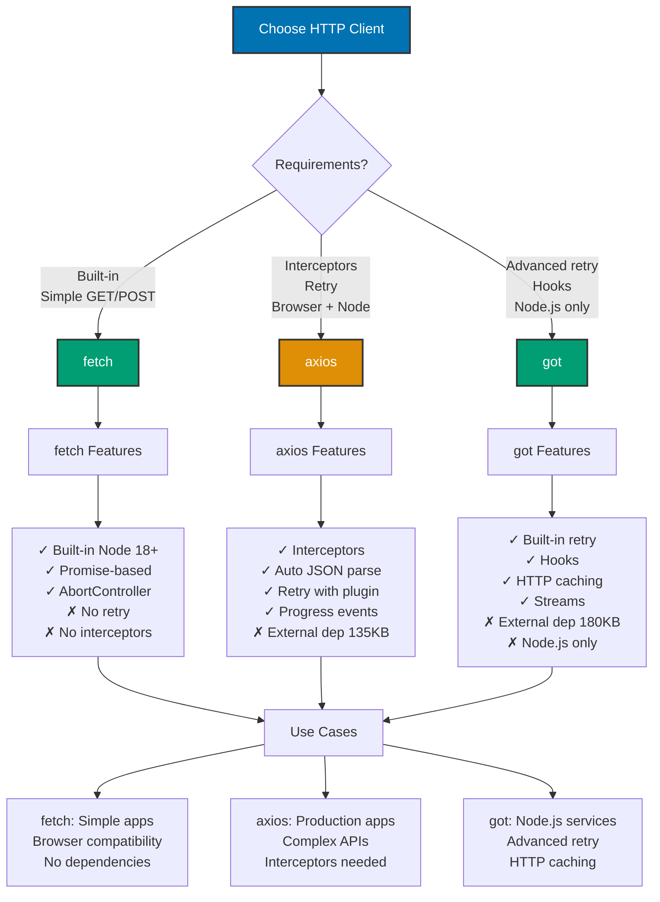

## Why JSON and API Integration Matters

Modern applications integrate with external APIs for payments, authentication, data enrichment, and third-party services. Production API clients require error handling, retry logic, timeout management, request validation, and response transformation to handle network failures, rate limits, and malformed data.

**Core Benefits**:

- **Service composition**: Combine multiple services into cohesive application
- **Separation of concerns**: Frontend/backend/services communicate via APIs
- **Third-party integration**: Payment processors, email services, analytics
- **Microservices**: Services communicate via HTTP APIs
- **Data exchange**: JSON is universal data interchange format

**Problem**: Network requests fail unpredictably, APIs rate limit, responses malformed, and manual error handling is verbose and error-prone.

**Solution**: Use production HTTP clients (fetch, axios, got) with automatic retry, timeout handling, request/response interceptors, and schema validation (Zod) to ensure type safety and data integrity.

## Standard Library First: JSON.parse and JSON.stringify

Node.js provides JSON parsing and serialization without external dependencies.

### JSON Serialization and Parsing

Convert JavaScript objects to JSON strings and vice versa.

**Pattern**:

```typescript
// Object to JSON string (serialization)
const user = {
  // => JavaScript object
  id: 123,
  name: "Alice",
  email: "alice@example.com",
  tags: ["developer", "typescript"],
  metadata: {
    lastLogin: new Date(),
    premium: true,
  },
};

const jsonString = JSON.stringify(user);
// => Convert object to JSON string
// => Returns: '{"id":123,"name":"Alice","email":"alice@example.com",...}'
console.log(jsonString);

// Pretty-print JSON (with indentation)
const prettyJson = JSON.stringify(user, null, 2);
// => First parameter: object
// => Second parameter: replacer function (null = include all)
// => Third parameter: indentation spaces (2)
console.log(prettyJson);
/*
{
  "id": 123,
  "name": "Alice",
  "email": "alice@example.com",
  "tags": [
    "developer",
    "typescript"
  ],
  "metadata": {
    "lastLogin": "2026-02-07T00:00:00.000Z",
    "premium": true
  }
}
*/

// JSON string to object (parsing)
const parsedUser = JSON.parse(jsonString);
// => Parse JSON string to JavaScript object
// => Returns object with same structure
console.log(parsedUser.name);
// => "Alice"
console.log(typeof parsedUser.metadata.lastLogin);
// => "string" (NOT Date object)
// => JSON.parse doesn't restore Date objects

// Custom serialization (replacer function)
const jsonWithReplacer = JSON.stringify(
  user,
  (key, value) => {
    // => Replacer function for each property
    // => key: Property name
    // => value: Property value
    if (key === "email") {
      // => Exclude email from serialization
      return undefined;
      // => undefined values excluded from JSON
    }
    if (value instanceof Date) {
      // => Custom Date serialization
      return value.toISOString();
    }
    return value;
  },
  2,
);
// => email excluded, Date converted to ISO string

// Custom parsing (reviver function)
const jsonWithDates = '{"name":"Alice","createdAt":"2026-02-07T00:00:00.000Z"}';

const parsedWithReviver = JSON.parse(jsonWithDates, (key, value) => {
  // => Reviver function for each property
  if (typeof value === "string" && /^\d{4}-\d{2}-\d{2}T/.test(value)) {
    // => Check if value looks like ISO date string
    return new Date(value);
    // => Convert string to Date object
  }
  return value;
});

console.log(parsedWithReviver.createdAt instanceof Date);
// => true (restored to Date object)
```

### HTTP Requests with Node.js http/https

Built-in HTTP client for making requests.

**Pattern**:

```typescript
import https from "https";
// => Built-in HTTPS module
// => No external dependencies

function httpsGet(url: string): Promise<string> {
  // => Promise-based wrapper for https.get
  // => Returns response body as string

  return new Promise((resolve, reject) => {
    // => Create Promise for async operation
    https
      .get(url, (res) => {
        // => Make GET request
        // => res: IncomingMessage (response stream)

        let data = "";
        // => Buffer for response body

        res.on("data", (chunk) => {
          // => Data event: Chunk of response received
          data += chunk;
          // => Append chunk to buffer
        });

        res.on("end", () => {
          // => End event: Response complete
          if (res.statusCode && res.statusCode >= 200 && res.statusCode < 300) {
            // => Check status code
            // => 2xx = success
            resolve(data);
            // => Return response body
          } else {
            // => Non-success status code
            reject(new Error(`HTTP ${res.statusCode}: ${res.statusMessage}`));
          }
        });
      })
      .on("error", (error) => {
        // => Error event: Network error
        reject(error);
      });
  });
}

// Usage
try {
  const response = await httpsGet("https://api.github.com/users/octocat");
  // => Make GET request
  const user = JSON.parse(response);
  // => Parse JSON response
  console.log(`GitHub user: ${user.login}`);
} catch (error) {
  console.error("Request failed:", error);
}

// POST request with https.request
function httpsPost(url: string, data: any): Promise<string> {
  // => POST request with JSON body
  return new Promise((resolve, reject) => {
    const urlObj = new URL(url);
    // => Parse URL to components
    // => hostname, port, pathname

    const postData = JSON.stringify(data);
    // => Serialize request body to JSON

    const options = {
      hostname: urlObj.hostname,
      port: urlObj.port || 443,
      // => HTTPS default port: 443
      path: urlObj.pathname + urlObj.search,
      // => Path with query string
      method: "POST",
      headers: {
        "Content-Type": "application/json",
        // => JSON content type
        "Content-Length": Buffer.byteLength(postData),
        // => Content length in bytes
      },
    };

    const req = https.request(options, (res) => {
      // => Create POST request
      let responseData = "";

      res.on("data", (chunk) => {
        responseData += chunk;
      });

      res.on("end", () => {
        if (res.statusCode && res.statusCode >= 200 && res.statusCode < 300) {
          resolve(responseData);
        } else {
          reject(new Error(`HTTP ${res.statusCode}`));
        }
      });
    });

    req.on("error", (error) => {
      reject(error);
    });

    req.write(postData);
    // => Write request body
    req.end();
    // => Send request
  });
}
```

**Limitations for production**:

- **Verbose API**: Manual stream handling, Promise wrapping required
- **No timeout handling**: Requests hang indefinitely if server unresponsive
- **No retry logic**: Network failures require manual retry implementation
- **No request interceptors**: Cannot add auth headers globally
- **No automatic JSON parsing**: Must manually call JSON.parse
- **Limited error handling**: HTTP error codes not rejected automatically
- **No request cancellation**: Cannot abort in-flight requests
- **No progress tracking**: Cannot track upload/download progress

**When standard library suffices**:

- Simple scripts (one-off API calls)
- No external dependencies requirement (embedded systems)
- Learning HTTP fundamentals
- Simple GET requests only

## Production Framework: fetch API

Modern fetch API provides Promise-based HTTP requests (built into Node.js 18+).

### Installation and Setup

```typescript
// Node.js 18+ includes fetch globally
// No installation required

// For Node.js < 18:
// npm install node-fetch
// import fetch from 'node-fetch';
```

**Basic usage**:

```typescript
// GET request
const response = await fetch("https://api.github.com/users/octocat");
// => Make GET request
// => Returns Response object (not response body)

if (!response.ok) {
  // => Check if request successful
  // => response.ok: true if status 200-299
  throw new Error(`HTTP ${response.status}: ${response.statusText}`);
}

const user = await response.json();
// => Parse JSON response body
// => Automatically handles JSON.parse
console.log(`GitHub user: ${user.login}`);

// POST request with JSON body
const createResponse = await fetch("https://api.example.com/users", {
  method: "POST",
  // => HTTP method
  headers: {
    "Content-Type": "application/json",
    // => JSON content type
    Authorization: `Bearer ${token}`,
    // => Authorization header
  },
  body: JSON.stringify({
    // => Request body (must be string)
    name: "Alice",
    email: "alice@example.com",
  }),
});

const newUser = await createResponse.json();
// => Parse response

// Query parameters
const searchParams = new URLSearchParams({
  // => Build query string
  q: "typescript",
  sort: "stars",
  order: "desc",
});

const searchResponse = await fetch(`https://api.github.com/search/repositories?${searchParams}`);
// => GET https://api.github.com/search/repositories?q=typescript&sort=stars&order=desc
const searchResults = await searchResponse.json();

// Error handling
try {
  const response = await fetch("https://api.example.com/data");

  if (!response.ok) {
    // => Handle HTTP errors
    // => 4xx, 5xx status codes
    const errorBody = await response.text();
    throw new Error(`HTTP ${response.status}: ${errorBody}`);
  }

  const data = await response.json();
} catch (error) {
  // => Catch network errors and HTTP errors
  console.error("Request failed:", error);
}
```

### Request Timeout

Abort requests that take too long.

**Pattern**:

```typescript
// Timeout with AbortController
const controller = new AbortController();
// => Create abort controller
// => Controls request cancellation

const timeoutId = setTimeout(() => {
  // => Set timeout
  controller.abort();
  // => Abort request after timeout
}, 5000);
// => 5 second timeout

try {
  const response = await fetch("https://api.example.com/slow-endpoint", {
    signal: controller.signal,
    // => Pass abort signal to fetch
    // => Allows request cancellation
  });

  clearTimeout(timeoutId);
  // => Clear timeout if request completes

  const data = await response.json();
} catch (error) {
  if (error instanceof Error && error.name === "AbortError") {
    // => Request aborted due to timeout
    console.error("Request timeout");
  } else {
    console.error("Request failed:", error);
  }
}

// Reusable timeout wrapper
async function fetchWithTimeout(url: string, options: RequestInit = {}, timeout: number = 5000) {
  // => Fetch with automatic timeout
  const controller = new AbortController();
  const timeoutId = setTimeout(() => controller.abort(), timeout);

  try {
    const response = await fetch(url, {
      ...options,
      signal: controller.signal,
    });
    clearTimeout(timeoutId);
    return response;
  } catch (error) {
    clearTimeout(timeoutId);
    throw error;
  }
}

// Usage
const response = await fetchWithTimeout("https://api.example.com/data", {}, 3000);
// => 3 second timeout
```

**Production benefits**:

- **Promise-based**: Async/await syntax (cleaner than callbacks)
- **Built-in**: No external dependencies (Node.js 18+)
- **AbortController**: Request cancellation support
- **Streaming**: Response body as stream (large files)
- **Standard API**: Same API as browser fetch

**Trade-offs**:

- **No automatic retry**: Must implement retry logic manually
- **No request/response interceptors**: Cannot add global headers easily
- **Manual timeout handling**: AbortController required for timeouts
- **No progress events**: Cannot track upload/download progress
- **Limited error handling**: Network errors only, HTTP errors not thrown

**When to use fetch**:

- Node.js 18+ applications (built-in)
- Simple API calls (GET, POST)
- No advanced features required (retry, interceptors)
- Browser-compatible code (same API)

## Production Framework: Axios

Axios provides feature-rich HTTP client with interceptors, automatic retries, and progress tracking.

### Installation and Setup

```bash
npm install axios
# => Install axios HTTP client
# => Production-ready with extensive features
```

**Basic usage**:

```typescript
import axios from "axios";
// => Import axios library

// GET request
const response = await axios.get("https://api.github.com/users/octocat");
// => Make GET request
// => Returns AxiosResponse object
console.log(response.data);
// => Response body (automatically parsed JSON)
// => response.data: Parsed JSON object
console.log(response.status);
// => HTTP status code (200)
console.log(response.headers);
// => Response headers object

// POST request
const createResponse = await axios.post("https://api.example.com/users", {
  // => Request body object (automatically stringified)
  name: "Alice",
  email: "alice@example.com",
});
// => No manual JSON.stringify needed

// Query parameters (automatic encoding)
const searchResponse = await axios.get("https://api.github.com/search/repositories", {
  params: {
    // => Query parameters object
    // => Automatically URL-encoded
    q: "typescript",
    sort: "stars",
    order: "desc",
  },
});
// => GET https://api.github.com/search/repositories?q=typescript&sort=stars&order=desc

// Custom headers
await axios.get("https://api.example.com/protected", {
  headers: {
    Authorization: `Bearer ${token}`,
    // => Authorization header
    "X-Custom-Header": "value",
  },
});

// Error handling
try {
  const response = await axios.get("https://api.example.com/data");
} catch (error) {
  if (axios.isAxiosError(error)) {
    // => Type guard for Axios errors
    // => error is AxiosError (typed)
    console.error("HTTP error:", error.response?.status);
    // => HTTP status code (404, 500, etc.)
    console.error("Error message:", error.message);
    console.error("Response body:", error.response?.data);
    // => Error response from server
  } else {
    console.error("Network error:", error);
  }
}
```

### Request and Response Interceptors

Global request/response transformation and error handling.

**Pattern**:

```typescript
// Request interceptor (add auth header to all requests)
axios.interceptors.request.use(
  (config) => {
    // => Modify request config before sending
    // => config: AxiosRequestConfig
    const token = localStorage.getItem("token");
    // => Get auth token from storage

    if (token) {
      config.headers.Authorization = `Bearer ${token}`;
      // => Add Authorization header to every request
      // => No need to manually add to each request
    }

    console.log(`Request: ${config.method?.toUpperCase()} ${config.url}`);
    // => Log outgoing requests

    return config;
    // => Return modified config
  },
  (error) => {
    // => Handle request errors
    return Promise.reject(error);
  },
);

// Response interceptor (handle errors globally)
axios.interceptors.response.use(
  (response) => {
    // => Successful response (2xx status)
    return response;
  },
  async (error) => {
    // => Error response (4xx, 5xx status)
    if (axios.isAxiosError(error) && error.response) {
      const status = error.response.status;

      if (status === 401) {
        // => Unauthorized: Token expired or invalid
        console.log("Token expired, refreshing...");

        // Refresh token
        const newToken = await refreshAuthToken();
        localStorage.setItem("token", newToken);

        // Retry original request with new token
        error.config!.headers.Authorization = `Bearer ${newToken}`;
        return axios.request(error.config!);
        // => Retry request with new token
      }

      if (status === 429) {
        // => Rate limited
        const retryAfter = error.response.headers["retry-after"];
        console.log(`Rate limited, retry after ${retryAfter} seconds`);
      }
    }

    return Promise.reject(error);
  },
);

// Usage (auth header added automatically)
const response = await axios.get("https://api.example.com/protected");
// => Authorization header added by interceptor
// => No need to manually add token
```

### Timeout and Retry Configuration

Configure global timeout and retry logic.

**Pattern**:

```typescript
// Create axios instance with default config
const api = axios.create({
  // => Custom axios instance
  // => Independent from global axios
  baseURL: "https://api.example.com",
  // => Base URL for all requests
  // => axios.get('/users') → https://api.example.com/users
  timeout: 5000,
  // => Request timeout: 5 seconds
  // => Aborts request if no response
  headers: {
    "Content-Type": "application/json",
    // => Default headers for all requests
  },
});

// Retry logic with axios-retry
import axiosRetry from "axios-retry";
// => Install: npm install axios-retry

axiosRetry(api, {
  // => Enable retry on axios instance
  retries: 3,
  // => Retry up to 3 times
  retryDelay: axiosRetry.exponentialDelay,
  // => Exponential backoff: 1s, 2s, 4s
  // => Alternative: axiosRetry.linearDelay (constant delay)
  retryCondition: (error) => {
    // => Determine if request should be retried
    // => error: AxiosError
    return (
      axiosRetry.isNetworkOrIdempotentRequestError(error) ||
      // => Retry on network errors
      // => Retry on idempotent requests (GET, PUT, DELETE)
      error.response?.status === 429
      // => Retry on rate limit (429 status)
    );
  },
  onRetry: (retryCount, error, requestConfig) => {
    // => Called before each retry
    console.log(`Retry attempt ${retryCount} for ${requestConfig.url}`);
  },
});

// Usage (automatic timeout and retry)
try {
  const response = await api.get("/users");
  // => Automatically retries on network errors
  // => Automatically times out after 5 seconds
} catch (error) {
  // => All retries exhausted or non-retryable error
  console.error("Request failed after retries:", error);
}
```

### Type-Safe API Client with Zod Validation

Validate API responses against schema.

**Pattern**:

```typescript
import { z } from "zod";
import axios from "axios";

// Define response schema
const userSchema = z.object({
  // => Expected API response structure
  id: z.number(),
  login: z.string(),
  name: z.string().nullable(),
  // => Nullable field (API may return null)
  email: z.string().email().optional(),
  // => Optional field (may not be present)
  created_at: z.string().transform((str) => new Date(str)),
  // => Transform string to Date object
});

type User = z.infer<typeof userSchema>;
// => Infer TypeScript type from schema

async function getGitHubUser(username: string): Promise<User> {
  // => Type-safe API call
  // => Returns validated User object

  const response = await axios.get(`https://api.github.com/users/${username}`);
  // => Make API request

  try {
    const user = userSchema.parse(response.data);
    // => Validate response against schema
    // => Throws ZodError if invalid
    return user;
    // => Return validated, typed user
  } catch (error) {
    if (error instanceof z.ZodError) {
      // => Validation error
      console.error("Invalid API response:", error.errors);
      throw new Error(`Invalid API response: ${error.errors.map((e) => e.message).join(", ")}`);
    }
    throw error;
  }
}

// Usage
const user = await getGitHubUser("octocat");
console.log(user.created_at instanceof Date);
// => true (transformed to Date)
console.log(user.login);
// => Type-safe access (TypeScript knows field exists)

// Generic API client
async function apiCall<T>(url: string, schema: z.ZodSchema<T>): Promise<T> {
  // => Generic type-safe API call
  // => T: Expected response type
  const response = await axios.get(url);
  return schema.parse(response.data);
  // => Validate and return typed response
}

// Usage
const repositories = await apiCall(
  "https://api.github.com/users/octocat/repos",
  z.array(
    z.object({
      // => Array of repositories
      id: z.number(),
      name: z.string(),
      stargazers_count: z.number(),
    }),
  ),
);
// => Type-safe: repositories[0].stargazers_count is number
```

**Production benefits**:

- **Automatic JSON parsing**: response.data is parsed object
- **Request/response interceptors**: Global auth, logging, error handling
- **Automatic retry**: Exponential backoff for transient failures
- **Timeout handling**: Built-in timeout support
- **Progress tracking**: Upload/download progress events
- **Request cancellation**: AbortController integration
- **TypeScript support**: Strong typing with generics

**Trade-offs**:

- **External dependency**: Axios library (135KB)
- **Bundle size**: Larger than fetch (but minimal in server-side)
- **Learning curve**: Interceptors, instance configuration

**When to use Axios**:

- Production applications (always - robust error handling)
- Complex API integration (multiple endpoints)
- Retry logic required (transient failures)
- Global request configuration (auth headers, base URL)

## Production Framework: Got

Got provides modern HTTP client with built-in retry, caching, and hooks.

### Installation and Setup

```bash
npm install got
# => Install got HTTP client
# => Alternative to axios with different API
```

**Basic usage**:

```typescript
import got from "got";
// => Import got library

// GET request
const response = await got.get("https://api.github.com/users/octocat");
// => Make GET request
// => Returns response object
const user = JSON.parse(response.body);
// => response.body is string (not parsed)

// Automatic JSON parsing
const user2 = await got.get("https://api.github.com/users/octocat").json<User>();
// => .json() parses response body
// => Generic type for TypeScript
console.log(user2.login);
// => Type-safe access

// POST request
const newUser = await got
  .post("https://api.example.com/users", {
    json: {
      // => Request body as JSON
      // => Automatically stringified and Content-Type set
      name: "Alice",
      email: "alice@example.com",
    },
  })
  .json();
// => Parse response as JSON

// Query parameters
const searchResults = await got
  .get("https://api.github.com/search/repositories", {
    searchParams: {
      // => Query parameters object
      q: "typescript",
      sort: "stars",
    },
  })
  .json();

// Custom headers
await got.get("https://api.example.com/protected", {
  headers: {
    Authorization: `Bearer ${token}`,
  },
});
```

### Built-in Retry and Timeout

Automatic retry with exponential backoff.

**Pattern**:

```typescript
const api = got.extend({
  // => Extend got with default options
  // => Creates new got instance
  prefixUrl: "https://api.example.com",
  // => Base URL for all requests
  // => api.get('users') → https://api.example.com/users
  timeout: {
    request: 5000,
    // => Total request timeout: 5 seconds
    // => Includes all retries
  },
  retry: {
    limit: 3,
    // => Retry up to 3 times
    methods: ["GET", "PUT", "DELETE"],
    // => Retry only idempotent methods
    statusCodes: [408, 413, 429, 500, 502, 503, 504],
    // => Retry on specific status codes
    // => 429: Rate limit, 5xx: Server errors
    errorCodes: ["ETIMEDOUT", "ECONNRESET", "EADDRINUSE"],
    // => Retry on network errors
    backoffLimit: 10000,
    // => Maximum backoff: 10 seconds
  },
  hooks: {
    beforeRequest: [
      (options) => {
        // => Hook before request sent
        console.log(`Request: ${options.method} ${options.url}`);
      },
    ],
    beforeRetry: [
      (error, retryCount) => {
        // => Hook before retry
        console.log(`Retry ${retryCount} after error:`, error.message);
      },
    ],
    afterResponse: [
      (response) => {
        // => Hook after response received
        console.log(`Response: ${response.statusCode}`);
        return response;
      },
    ],
  },
});

// Usage (automatic retry and timeout)
try {
  const users = await api.get("users").json();
  // => Automatically retries on failure
  // => Automatically times out after 5 seconds
} catch (error) {
  console.error("Request failed:", error);
}
```

**Production benefits**:

- **Built-in retry**: Automatic exponential backoff
- **Timeouts**: Request, response, and send timeouts
- **Hooks**: Before/after request, retry, response
- **Promise and stream API**: Flexible response handling
- **Caching**: Built-in HTTP caching support
- **TypeScript**: Full TypeScript support

**Trade-offs**:

- **External dependency**: Got library (180KB)
- **Different API**: Not fetch-compatible (learning curve)
- **Node.js only**: Not browser-compatible

**When to use Got**:

- Node.js applications (server-side only)
- Advanced retry logic (custom backoff)
- HTTP caching required
- Stream processing (large files)

## API Client Pattern Comparison



## Production Best Practices

### API Client Abstraction

Create typed API client for specific service.

**Pattern**:

```typescript
import axios, { AxiosInstance } from "axios";
import { z } from "zod";

// API response schemas
const userSchema = z.object({
  id: z.number(),
  name: z.string(),
  email: z.string().email(),
});

const postSchema = z.object({
  id: z.number(),
  title: z.string(),
  content: z.string(),
  authorId: z.number(),
});

type User = z.infer<typeof userSchema>;
type Post = z.infer<typeof postSchema>;

class ApiClient {
  // => Type-safe API client
  private client: AxiosInstance;

  constructor(baseURL: string, apiKey: string) {
    this.client = axios.create({
      baseURL,
      timeout: 10000,
      headers: {
        "Content-Type": "application/json",
        Authorization: `Bearer ${apiKey}`,
      },
    });

    // Add response interceptor for error handling
    this.client.interceptors.response.use(
      (response) => response,
      (error) => {
        console.error("API Error:", error.response?.data);
        throw error;
      },
    );
  }

  async getUser(userId: number): Promise<User> {
    // => Get user by ID
    // => Returns validated User object
    const response = await this.client.get(`/users/${userId}`);
    return userSchema.parse(response.data);
    // => Validate response against schema
  }

  async getUsers(limit: number = 10): Promise<User[]> {
    // => Get list of users
    const response = await this.client.get("/users", {
      params: { limit },
    });
    return z.array(userSchema).parse(response.data);
    // => Validate array of users
  }

  async createUser(user: Omit<User, "id">): Promise<User> {
    // => Create new user
    // => Omit<User, 'id'>: User without id field
    const response = await this.client.post("/users", user);
    return userSchema.parse(response.data);
  }

  async updateUser(userId: number, updates: Partial<User>): Promise<User> {
    // => Update user
    // => Partial<User>: All fields optional
    const response = await this.client.patch(`/users/${userId}`, updates);
    return userSchema.parse(response.data);
  }

  async deleteUser(userId: number): Promise<void> {
    // => Delete user
    await this.client.delete(`/users/${userId}`);
  }

  async getUserPosts(userId: number): Promise<Post[]> {
    // => Get posts by user
    const response = await this.client.get(`/users/${userId}/posts`);
    return z.array(postSchema).parse(response.data);
  }
}

// Usage
const api = new ApiClient("https://api.example.com", process.env.API_KEY!);

const user = await api.getUser(123);
// => Type-safe: user.name is string
console.log(user.name);

const newUser = await api.createUser({
  name: "Alice",
  email: "alice@example.com",
});

const posts = await api.getUserPosts(user.id);
// => Type-safe: posts[0].title is string
```

### Rate Limiting and Backoff

Handle API rate limits gracefully.

**Pattern**:

```typescript
class RateLimitedApiClient {
  // => API client with rate limit handling
  private client: AxiosInstance;
  private requestQueue: Array<() => Promise<any>> = [];
  private processing = false;

  constructor(baseURL: string) {
    this.client = axios.create({ baseURL });

    // Intercept 429 responses
    this.client.interceptors.response.use(
      (response) => response,
      async (error) => {
        if (axios.isAxiosError(error) && error.response?.status === 429) {
          // => Rate limited
          const retryAfter = parseInt(error.response.headers["retry-after"] || "60");
          // => Retry-After header (seconds)

          console.log(`Rate limited, waiting ${retryAfter} seconds`);
          await this.sleep(retryAfter * 1000);
          // => Wait before retry

          return this.client.request(error.config!);
          // => Retry original request
        }
        throw error;
      },
    );
  }

  private sleep(ms: number): Promise<void> {
    // => Helper: Wait for specified milliseconds
    return new Promise((resolve) => setTimeout(resolve, ms));
  }

  async request<T>(config: any): Promise<T> {
    // => Make rate-limited request
    const response = await this.client.request(config);
    return response.data;
  }
}
```

### Request Caching

Cache API responses to reduce requests.

**Pattern**:

```typescript
import NodeCache from "node-cache";
// => Install: npm install node-cache

class CachedApiClient {
  // => API client with response caching
  private client: AxiosInstance;
  private cache: NodeCache;

  constructor(baseURL: string) {
    this.client = axios.create({ baseURL });
    this.cache = new NodeCache({
      stdTTL: 300,
      // => Default TTL: 5 minutes
      checkperiod: 60,
      // => Check for expired keys every minute
    });
  }

  async get<T>(url: string, options?: any): Promise<T> {
    // => GET request with caching
    const cacheKey = `${url}:${JSON.stringify(options?.params || {})}`;
    // => Cache key includes URL and query params

    const cached = this.cache.get<T>(cacheKey);
    if (cached) {
      // => Cache hit
      console.log(`Cache hit: ${cacheKey}`);
      return cached;
    }

    // Cache miss
    console.log(`Cache miss: ${cacheKey}`);
    const response = await this.client.get(url, options);

    this.cache.set(cacheKey, response.data);
    // => Store in cache
    return response.data;
  }

  invalidateCache(pattern: string): void {
    // => Invalidate cached entries by pattern
    const keys = this.cache.keys();
    keys.forEach((key) => {
      if (key.includes(pattern)) {
        this.cache.del(key);
        // => Delete matching cache entry
      }
    });
  }
}

// Usage
const api = new CachedApiClient("https://api.example.com");

const user1 = await api.get("/users/123");
// => Cache miss, makes API request

const user2 = await api.get("/users/123");
// => Cache hit, returns cached data

api.invalidateCache("users/123");
// => Invalidate cache for user 123
```

## Trade-offs and When to Use Each

### fetch

**Use when**:

- Node.js 18+ (built-in)
- Simple API calls (no retry, interceptors)
- Browser compatibility important (same API)
- Minimal dependencies preferred

**Avoid when**:

- Complex error handling (manual retry)
- Global auth headers (no interceptors)
- Old Node.js versions (<18)

### axios

**Use when**:

- Production applications (robust error handling)
- Request/response interceptors needed
- Automatic retry required (with axios-retry)
- Browser and Node.js compatibility

**Avoid when**:

- Bundle size critical (135KB)
- Simple GET requests only (fetch sufficient)

### got

**Use when**:

- Node.js server-side applications
- Built-in retry without plugins
- HTTP caching required
- Stream processing (large files)

**Avoid when**:

- Browser compatibility required (Node.js only)
- fetch-compatible API preferred

## Common Pitfalls

### Pitfall 1: Not Validating API Responses

**Problem**: Malformed API responses cause runtime errors.

**Solution**: Use Zod to validate responses.

```typescript
// ❌ BAD: No validation
const user = await axios.get("/users/123").then((res) => res.data);
console.log(user.name.toUpperCase());
// => Runtime error if name is null or missing

// ✅ GOOD: Validate with Zod
const user = userSchema.parse(await axios.get("/users/123").then((res) => res.data));
console.log(user.name.toUpperCase());
// => Type-safe, validated
```

### Pitfall 2: No Timeout Handling

**Problem**: Requests hang indefinitely.

**Solution**: Set timeout on all requests.

```typescript
// ❌ BAD: No timeout
await axios.get("https://slow-api.com/data");
// => Hangs forever if server unresponsive

// ✅ GOOD: Timeout set
await axios.get("https://slow-api.com/data", { timeout: 5000 });
// => Aborts after 5 seconds
```

### Pitfall 3: Exposing API Keys

**Problem**: API keys committed to git.

**Solution**: Use environment variables.

```typescript
// ❌ BAD: Hardcoded API key
const api = axios.create({
  headers: { Authorization: "Bearer sk_live_abc123" },
});

// ✅ GOOD: Environment variable
const api = axios.create({
  headers: { Authorization: `Bearer ${process.env.API_KEY}` },
});
```

### Pitfall 4: Not Handling Rate Limits

**Problem**: API rate limits cause failures.

**Solution**: Implement retry with exponential backoff.

```typescript
// ❌ BAD: No rate limit handling
await axios.get("/api/data");
// => Fails on 429 status

// ✅ GOOD: Retry on rate limit
axiosRetry(axios, {
  retries: 3,
  retryCondition: (error) => error.response?.status === 429,
});
```

## Summary

JSON and API integration enable modern applications to communicate with external services. Built-in JSON methods provide basic serialization, fetch offers Promise-based HTTP requests, axios adds interceptors and retry logic, and got provides advanced features for Node.js applications.

**Progression path**:

1. **Learn with JSON.parse/stringify**: Understand JSON serialization fundamentals
2. **Request with fetch**: Promise-based HTTP requests (Node.js 18+)
3. **Integrate with axios**: Production API client with interceptors and retry
4. **Validate with Zod**: Type-safe API responses

**Production checklist**:

- ✅ Response validation with Zod (type safety)
- ✅ Timeout on all requests (prevent hanging)
- ✅ Retry logic with exponential backoff (transient failures)
- ✅ Request/response interceptors (auth, logging)
- ✅ Error handling (network, HTTP, validation errors)
- ✅ API keys in environment variables (never hardcoded)
- ✅ Rate limit handling (429 status code)
- ✅ Response caching (reduce API calls)
- ✅ Typed API client class (encapsulate API logic)

**Recommended approach**: axios (interceptors + retry) + Zod (validation) for production applications. Use fetch for simple scripts or when built-in solution preferred.

Choose HTTP client based on requirements: fetch for simple calls, axios for production with interceptors, got for Node.js with advanced retry and caching.
