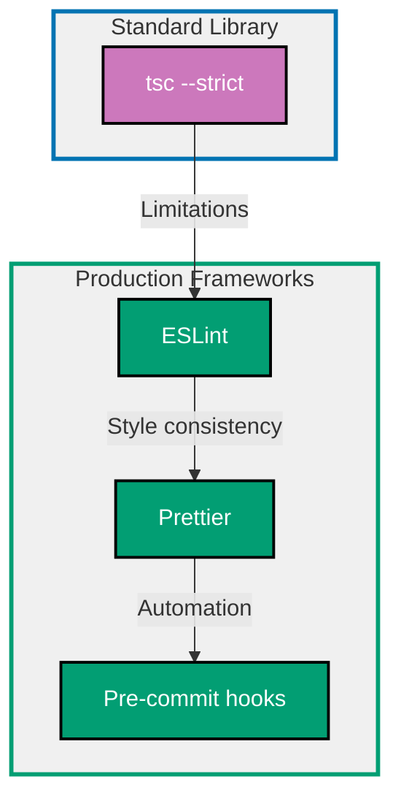

## Why Linting and Formatting Matter

Linting and formatting automate code quality enforcement, catching bugs before runtime, ensuring consistent style across teams, and eliminating style debates through automated tooling.

**Core Benefits**:

- **Catch bugs early**: ESLint detects potential errors at write-time
- **Enforce conventions**: Consistent code style across team
- **Eliminate debates**: Automated formatting ends style discussions
- **Improve readability**: Uniform code easier to understand
- **Prevent production bugs**: Type errors, null references, unused variables

**Problem**: Manual code review cannot consistently catch all style inconsistencies, potential bugs, and convention violations.

**Solution**: Use ESLint for code analysis and Prettier for automated formatting to enforce quality standards automatically.

## Standard Library First: TypeScript Compiler Checks

TypeScript's compiler provides built-in type checking and some quality checks without external dependencies.

### Basic Type Checking with tsc

TypeScript compiler catches type errors, undefined variables, and basic mistakes at compile time.

**Pattern**:

```typescript
// src/user.ts
interface User {
  // => Define User shape
  // => Type-safe contract
  id: number;
  name: string;
  email: string;
}

function getUser(id: number): User {
  // => Function returns User
  // => TypeScript validates return type
  return {
    id: id,
    // => Must match User.id type (number)
    name: "Alice",
    // => Must match User.name type (string)
    email: "alice@example.com",
    // => Must match User.email type (string)
  };
}

const user = getUser(1);
// => Type inference: user is User
// => TypeScript knows shape at compile time

console.log(user.name.toUpperCase());
// => Method available because name is string
// => TypeScript validates string methods
```

**Strict mode configuration** (tsconfig.json):

```json
{
  "compilerOptions": {
    "strict": true,
    // => Enable all strict checks
    // => Catches more potential errors
    "noImplicitAny": true,
    // => Require explicit types (no implicit any)
    // => Prevents accidental any types
    "strictNullChecks": true,
    // => null and undefined must be explicit
    // => Prevents null reference errors
    "strictFunctionTypes": true,
    // => Stricter function type checking
    // => Catches parameter type mismatches
    "noUnusedLocals": true,
    // => Error on unused local variables
    // => Keeps code clean
    "noUnusedParameters": true,
    // => Error on unused function parameters
    // => Signals potentially incorrect code
    "noImplicitReturns": true,
    // => All code paths must return value
    // => Prevents missing returns
    "noFallthroughCasesInSwitch": true
    // => Switch cases must break/return
    // => Prevents fallthrough bugs
  }
}
```

**What TypeScript catches**:

```typescript
// Type mismatch
let num: number = "hello";
// => Error: Type 'string' not assignable to type 'number'

// Undefined property access
const user = { name: "Alice" };
console.log(user.age);
// => Error: Property 'age' does not exist on type '{ name: string }'

// Null reference (with strictNullChecks)
function greet(name: string | null) {
  console.log(name.toUpperCase());
  // => Error: Object is possibly 'null'
  // => Must check null before accessing
}
```

**Limitations for production**:

- **No style enforcement**: TypeScript doesn't care about formatting
- **Limited runtime checks**: Only compile-time type errors
- **No best practice enforcement**: Can't enforce patterns (e.g., no console.log)
- **No auto-fixing**: Manual fixes required for all issues
- **No custom rules**: Can't add team-specific conventions
- **No import ordering**: Doesn't enforce import organization
- **Missing common bugs**: Doesn't catch unreachable code, unused exports

**When standard library suffices**:

- Solo projects with personal style
- Internal tools without quality requirements
- Learning TypeScript fundamentals
- Type safety is only concern

## Production Framework: ESLint

ESLint is a pluggable linting utility that analyzes code for potential errors, enforces best practices, and customizes rules for team conventions.

### Installation and Basic Setup

```bash
npm install --save-dev eslint @typescript-eslint/parser @typescript-eslint/eslint-plugin
# => Install ESLint and TypeScript plugins
# => eslint: Core linting engine
# => @typescript-eslint/parser: Parses TypeScript syntax
# => @typescript-eslint/eslint-plugin: TypeScript-specific rules
```

**Configuration** (.eslintrc.json):

```json
{
  "parser": "@typescript-eslint/parser",
  // => Use TypeScript parser
  // => Understands TypeScript syntax
  "parserOptions": {
    "ecmaVersion": 2020,
    // => JavaScript version (ES2020)
    "sourceType": "module",
    // => Use ES modules
    "project": "./tsconfig.json"
    // => TypeScript project for type-aware rules
  },
  "plugins": ["@typescript-eslint"],
  // => Enable TypeScript plugin
  // => Provides TypeScript-specific rules
  "extends": [
    "eslint:recommended",
    // => ESLint recommended rules
    // => Basic best practices
    "plugin:@typescript-eslint/recommended"
    // => TypeScript recommended rules
    // => Type-aware linting
  ],
  "rules": {
    "@typescript-eslint/no-unused-vars": "error",
    // => Error on unused variables
    // => Catches dead code
    "@typescript-eslint/no-explicit-any": "warn",
    // => Warn on 'any' type usage
    // => Encourages proper typing
    "no-console": ["warn", { "allow": ["warn", "error"] }],
    // => Warn on console.log (allow warn/error)
    // => Prevents debug logs in production
    "eqeqeq": ["error", "always"],
    // => Require === instead of ==
    // => Prevents type coercion bugs
    "curly": ["error", "all"]
    // => Require braces for all blocks
    // => Prevents single-line if bugs
  }
}
```

**Package.json scripts**:

```json
{
  "scripts": {
    "lint": "eslint . --ext .ts,.tsx",
    // => Lint all TypeScript files
    // => --ext: File extensions to check
    "lint:fix": "eslint . --ext .ts,.tsx --fix"
    // => Auto-fix fixable issues
    // => Saves manual correction time
  }
}
```

### Type-Aware Linting Rules

ESLint with TypeScript plugin provides type-aware rules that catch bugs TypeScript compiler misses.

**Configuration** (.eslintrc.json):

```json
{
  "extends": [
    "plugin:@typescript-eslint/recommended-requiring-type-checking"
    // => Enable type-aware rules
    // => Requires parserOptions.project
  ],
  "rules": {
    "@typescript-eslint/no-floating-promises": "error",
    // => Catch unhandled promises
    // => Must await or .catch()
    "@typescript-eslint/no-misused-promises": "error",
    // => Prevent promise misuse (e.g., in if condition)
    "@typescript-eslint/await-thenable": "error",
    // => Only await Promises
    // => Catches await on non-promises
    "@typescript-eslint/no-unnecessary-type-assertion": "error",
    // => Remove redundant type assertions
    // => Cleaner code
    "@typescript-eslint/prefer-nullish-coalescing": "error",
    // => Use ?? instead of ||
    // => Handles null/undefined correctly
    "@typescript-eslint/prefer-optional-chain": "error"
    // => Use ?. instead of && chains
    // => More concise null checking
  }
}
```

**What ESLint catches that TypeScript doesn't**:

```typescript
// Unhandled promise
async function fetchUser() {
  return { id: 1, name: "Alice" };
}

fetchUser();
// => ESLint error: Promise returned from fetchUser is not handled
// => Should: await fetchUser() or fetchUser().catch(...)

// Promise misuse in condition
if (fetchUser()) {
  // => ESLint error: Promise in boolean context always truthy
  // => Should: if (await fetchUser())
}

// Unnecessary type assertion
const num = 5 as number;
// => ESLint error: Unnecessary type assertion (num already number)

// Prefer nullish coalescing
const name = user.name || "Guest";
// => ESLint warning: Use ?? instead of ||
// => ||: false, 0, "" become "Guest"
// => ??: only null/undefined become "Guest"

const safeName = user.name ?? "Guest";
// => Correct: Only null/undefined fallback
```

### Production Benefits

- **Catches runtime bugs**: Unhandled promises, async misuse
- **Enforces best practices**: Prefer const, no var, consistent return
- **Team consistency**: Custom rules for team conventions
- **Auto-fixing**: Many issues fixed automatically
- **Plugin ecosystem**: React, Node.js, security plugins available
- **CI integration**: Fail builds on violations

### Trade-offs

- **External dependency**: 15MB node_modules (eslint + plugins)
- **Configuration complexity**: Many rules and options to learn
- **Performance overhead**: Type-aware rules slower (requires type checking)
- **Rule conflicts**: Multiple plugins can have conflicting rules

### When to use ESLint

- Production codebases (catch bugs before deployment)
- Team projects (enforce consistent conventions)
- Open-source libraries (maintain quality standards)
- CI/CD pipelines (automated quality gates)

## Production Framework: Prettier

Prettier is an opinionated code formatter that enforces consistent style automatically, eliminating formatting debates.

### Installation and Setup

```bash
npm install --save-dev prettier
# => Install Prettier
# => Opinionated formatter
# => Minimal configuration
```

**Configuration** (.prettierrc.json):

```json
{
  "semi": true,
  // => Add semicolons
  // => Explicit statement endings
  "singleQuote": true,
  // => Use single quotes
  // => Consistency across codebase
  "trailingComma": "es5",
  // => Trailing commas where valid in ES5
  // => Cleaner git diffs
  "printWidth": 80,
  // => Line length limit
  // => 80 characters max
  "tabWidth": 2,
  // => Indentation width
  // => 2 spaces per level
  "arrowParens": "always"
  // => Always add parens to arrow functions
  // => (x) => x instead of x => x
}
```

**Ignore file** (.prettierignore):

```
# Build outputs
dist/
build/
coverage/

# Dependencies
node_modules/

# Generated files
*.min.js
```

**Package.json scripts**:

```json
{
  "scripts": {
    "format": "prettier --write .",
    // => Format all files
    // => --write: Modify files in place
    "format:check": "prettier --check ."
    // => Check formatting without modifying
    // => Exit 1 if any file unformatted (CI)
  }
}
```

### Prettier Benefits

**Before Prettier** (inconsistent formatting):

```typescript
// Different styles across codebase
const user = { id: 1, name: "Alice", email: "alice@example.com" };

function greet(name) {
  return "Hello, " + name;
}

const numbers = [1, 2, 3, 4, 5];
```

**After Prettier** (consistent formatting):

```typescript
// Consistent style enforced
const user = {
  id: 1,
  name: "Alice",
  email: "alice@example.com",
};

function greet(name) {
  return "Hello, " + name;
}

const numbers = [1, 2, 3, 4, 5];
```

**Production benefits**:

- **Zero configuration**: Works great out of the box
- **Eliminates debates**: No more style discussions
- **Automatic**: Format on save (editor integration)
- **Fast**: Formats entire codebase in seconds
- **Git-friendly**: Fewer formatting-only commits
- **Editor integration**: VS Code, Vim, Sublime, IntelliJ

**Trade-offs**:

- **Opinionated**: Limited customization (by design)
- **Style override**: May conflict with personal preferences
- **Learning curve**: Team must accept Prettier's decisions

**When to use Prettier**:

- All production projects (consistent style)
- Team codebases (eliminate style debates)
- Open-source projects (welcoming to contributors)
- CI/CD pipelines (enforce formatting)

## Combining ESLint and Prettier

ESLint (code quality) and Prettier (formatting) serve different purposes and work best together.

### Integration Setup

```bash
npm install --save-dev eslint-config-prettier eslint-plugin-prettier
# => Install ESLint-Prettier integration
# => eslint-config-prettier: Disables conflicting ESLint rules
# => eslint-plugin-prettier: Runs Prettier as ESLint rule
```

**ESLint configuration** (.eslintrc.json):

```json
{
  "extends": [
    "eslint:recommended",
    "plugin:@typescript-eslint/recommended",
    "plugin:prettier/recommended"
    // => Must be last (disables conflicting rules)
    // => Runs Prettier via ESLint
  ]
}
```

**Workflow integration**:

```json
{
  "scripts": {
    "lint": "eslint . --ext .ts,.tsx",
    // => Check code quality (ESLint)
    "format": "prettier --write .",
    // => Format code (Prettier)
    "check": "npm run format:check && npm run lint"
    // => Run both checks (CI)
  }
}
```

### Pre-commit Hook Integration

Automatically lint and format code before commit using Husky and lint-staged.

**Installation**:

```bash
npm install --save-dev husky lint-staged
npx husky install
# => Install git hooks manager
# => Runs commands before commit
```

**Configuration** (package.json):

```json
{
  "lint-staged": {
    "*.{ts,tsx}": [
      "eslint --fix",
      // => Auto-fix ESLint issues
      "prettier --write"
      // => Format with Prettier
    ]
  },
  "husky": {
    "hooks": {
      "pre-commit": "lint-staged"
      // => Run lint-staged before commit
      // => Only on staged files (fast)
    }
  }
}
```

**Benefits**:

- **Automatic quality**: Cannot commit poorly formatted code
- **Fast feedback**: Catches issues before code review
- **Only staged files**: Fast execution (only changed files)
- **Team consistency**: All commits follow standards

## Linting and Formatting Progression Diagram



## Production Best Practices

### Rule Severity Levels

Configure rule severity based on importance.

**Severity levels**:

- **error**: Build fails (critical issues)
- **warn**: Shows warning (suggestions)
- **off**: Rule disabled

**Pattern** (.eslintrc.json):

```json
{
  "rules": {
    "@typescript-eslint/no-unused-vars": "error",
    // => Critical: Dead code
    "@typescript-eslint/no-explicit-any": "warn",
    // => Suggestion: Better typing
    "no-console": ["warn", { "allow": ["warn", "error"] }],
    // => Suggestion: Remove debug logs
    "@typescript-eslint/explicit-function-return-type": "off"
    // => Disabled: Type inference sufficient
  }
}
```

### Custom Rule Overrides

Override rules for specific files or directories.

**Pattern** (.eslintrc.json):

```json
{
  "overrides": [
    {
      "files": ["*.test.ts", "*.spec.ts"],
      // => Test files only
      "rules": {
        "@typescript-eslint/no-explicit-any": "off",
        // => Allow any in tests (mocking)
        "no-console": "off"
        // => Allow console in tests
      }
    },
    {
      "files": ["scripts/**/*.ts"],
      // => Build scripts
      "rules": {
        "no-console": "off"
        // => Allow console in scripts
      }
    }
  ]
}
```

### Editor Integration

Configure editor to auto-format and lint on save.

**VS Code configuration** (.vscode/settings.json):

```json
{
  "editor.formatOnSave": true,
  // => Format with Prettier on save
  "editor.codeActionsOnSave": {
    "source.fixAll.eslint": true
    // => Auto-fix ESLint issues on save
  },
  "editor.defaultFormatter": "esbenp.prettier-vscode",
  // => Use Prettier as default formatter
  "[typescript]": {
    "editor.defaultFormatter": "esbenp.prettier-vscode"
  },
  "[typescriptreact]": {
    "editor.defaultFormatter": "esbenp.prettier-vscode"
  }
}
```

**Benefits**:

- **Instant feedback**: See errors while typing
- **Auto-fixing**: Issues fixed on save
- **No manual linting**: Editor handles it automatically

## Trade-offs and When to Use Each

### tsc --strict (Standard Library)

**Use when**:

- Solo projects with personal style
- Learning TypeScript type system
- Type safety is only concern
- No team conventions to enforce

**Avoid when**:

- Team projects (need consistent style)
- Production code (need bug detection)
- Open-source libraries (need quality standards)

### ESLint

**Use when**:

- Production codebases (catch bugs)
- Team projects (enforce conventions)
- Need custom rules (team-specific patterns)
- Type-aware linting required (async/await bugs)

**Avoid when**:

- Solo project with no quality requirements
- Build time critical (type-aware rules slow)
- Learning TypeScript (focus on language first)

### Prettier

**Use when**:

- All production projects (consistent style)
- Team codebases (eliminate debates)
- Want zero-config formatting
- Editor integration desired

**Avoid when**:

- Need highly customized formatting
- Team strongly disagrees with Prettier style
- Working with auto-generated code

### ESLint + Prettier + Pre-commit Hooks

**Use when**:

- Production team projects
- Open-source libraries
- Want maximum code quality
- Can afford build time overhead

**Avoid when**:

- Solo learning project
- Fast iteration prototyping
- Legacy codebase (big bang formatting)

## Common Pitfalls

### Pitfall 1: ESLint and Prettier Conflicts

**Problem**: ESLint formatting rules conflict with Prettier.

**Solution**: Use eslint-config-prettier to disable conflicting rules.

```bash
npm install --save-dev eslint-config-prettier
```

```json
{
  "extends": [
    "eslint:recommended",
    "plugin:@typescript-eslint/recommended",
    "plugin:prettier/recommended"
    // => Must be LAST (disables conflicts)
  ]
}
```

### Pitfall 2: Ignoring Type-Aware Rules Performance

**Problem**: Type-aware ESLint rules slow on large codebases.

**Solution**: Use lint-staged to only lint changed files.

```json
{
  "lint-staged": {
    "*.ts": "eslint --cache"
    // => --cache: Skip unchanged files
  }
}
```

### Pitfall 3: Too Many Warnings

**Problem**: Hundreds of warnings overwhelm developers.

**Solution**: Gradually adopt rules, fixing existing issues first.

```json
{
  "rules": {
    "@typescript-eslint/no-explicit-any": "warn"
    // => Start with warn, fix incrementally
    // => Change to error after fixing
  }
}
```

### Pitfall 4: Not Committing Configuration

**Problem**: Team members use different linting rules.

**Solution**: Commit .eslintrc.json, .prettierrc.json, and editor config.

```bash
git add .eslintrc.json .prettierrc.json .vscode/settings.json
# => Ensure entire team uses same config
```

## Summary

Linting and formatting automate code quality enforcement. TypeScript compiler provides basic type checking, while ESLint catches runtime bugs and enforces conventions, and Prettier ensures consistent style.

**Progression path**:

1. **Start with tsc --strict**: Learn type safety fundamentals
2. **Add ESLint**: Catch bugs and enforce best practices
3. **Add Prettier**: Automate formatting
4. **Add pre-commit hooks**: Ensure quality before commit

**Production checklist**:

- ✅ ESLint configured with TypeScript plugin
- ✅ Type-aware rules enabled (catch async bugs)
- ✅ Prettier configured for consistent style
- ✅ eslint-config-prettier prevents conflicts
- ✅ Pre-commit hooks run linting and formatting
- ✅ Editor integration (format and fix on save)
- ✅ CI pipeline runs lint and format checks

Choose linting and formatting tools based on project needs: TypeScript for type safety, ESLint for code quality, Prettier for style consistency.
