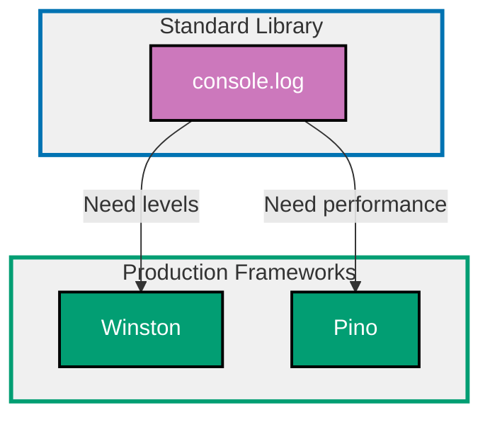

## Why Logging Matters

Logging provides runtime visibility into application behavior, enabling debugging production issues, monitoring system health, tracking user actions, and meeting compliance requirements.

**Core Benefits**:

- **Debug production issues**: Reproduce and fix bugs from logs
- **Monitor system health**: Track errors, performance, resource usage
- **Audit trail**: Compliance and security tracking
- **Alerting**: Detect critical issues automatically
- **Performance analysis**: Identify bottlenecks and slow operations

**Problem**: `console.log` lacks log levels, structured data, rotation, and integration with log aggregation systems.

**Solution**: Use production logging frameworks (Winston, Pino) that provide log levels, structured logging, multiple transports, and performance optimizations.

## Standard Library First: console.log

Node.js provides the `console` object for basic logging without external dependencies.

### Basic Console Logging

The console module writes text output to stdout (standard output) and stderr (standard error).

**Pattern**:

```typescript
// Basic logging
console.log("Application started");
// => Writes to stdout
// => Timestamp not included
// => No log level

const user = { id: 1, name: "Alice", email: "alice@example.com" };
console.log("User created:", user);
// => Outputs: User created: { id: 1, name: 'Alice', email: 'alice@example.com' }
// => Objects formatted automatically

// Error logging
try {
  const result = riskyOperation();
  console.log("Operation succeeded:", result);
} catch (error) {
  console.error("Operation failed:", error);
  // => Writes to stderr (standard error)
  // => Error objects show stack trace
}

// Warning logging
if (diskSpace < threshold) {
  console.warn("Low disk space:", diskSpace, "MB");
  // => Writes to stderr
  // => Visual distinction in terminal (yellow)
}

// Debugging with console.debug
console.debug("Debug info:", { step: 1, value: 42 });
// => Only shown if log level supports debug
// => Node.js: same as console.log
```

**Console methods**:

```typescript
console.log("Info message");
// => General information
// => stdout

console.error("Error message");
// => Error conditions
// => stderr, red in terminal

console.warn("Warning message");
// => Warning conditions
// => stderr, yellow in terminal

console.debug("Debug message");
// => Detailed debugging
// => stdout

console.info("Info message");
// => Alias for console.log
// => stdout

console.trace("Trace message");
// => Includes stack trace
// => Shows call location
```

**Structured logging attempt**:

```typescript
// Manual JSON formatting
const logEntry = {
  timestamp: new Date().toISOString(),
  // => ISO 8601 timestamp
  level: "info",
  // => Manual log level
  message: "User login",
  // => Log message
  userId: 123,
  // => Structured data
  ip: "192.168.1.1",
  // => Additional context
};

console.log(JSON.stringify(logEntry));
// => Output: {"timestamp":"2026-02-07T10:00:00.000Z","level":"info",...}
// => Manual JSON formatting
// => Parseable by log aggregators
```

**Limitations for production**:

- **No log levels**: Cannot filter by severity (debug vs error)
- **No log rotation**: Logs grow indefinitely, filling disk
- **No structured logging**: Text-only, hard to parse and query
- **No transports**: Cannot send logs to files, databases, or services
- **No filtering**: All logs always written (performance impact)
- **No context**: No correlation IDs, request IDs, or trace IDs
- **No performance optimization**: Synchronous writes block event loop

**When standard library suffices**:

- Small scripts (≤100 lines)
- Development debugging (not production)
- Learning Node.js fundamentals
- Logs go to stdout only (Docker/Kubernetes capture)

## Production Framework: Winston

Winston is a mature, feature-rich logging library with multiple transports, log levels, and flexible configuration.

### Installation and Basic Setup

```bash
npm install winston
# => Install Winston logging library
# => Mature, widely adopted (10M+ weekly downloads)
# => Extensive transport ecosystem
```

**Basic configuration**:

```typescript
import winston from "winston";
// => Import Winston library
// => Provides logger factory and transports

const logger = winston.createLogger({
  // => Create logger instance
  // => Centralized configuration
  level: "info",
  // => Minimum log level (debug < info < warn < error)
  // => Logs at 'info' level and above written
  format: winston.format.combine(
    // => Combine multiple formatters
    // => Applied in order
    winston.format.timestamp(),
    // => Add timestamp to each log
    // => ISO 8601 format by default
    winston.format.errors({ stack: true }),
    // => Include stack traces for errors
    // => Preserves error properties
    winston.format.json(),
    // => Format as JSON
    // => Structured, parseable logs
  ),
  transports: [
    // => Output destinations
    // => Multiple transports supported
    new winston.transports.Console(),
    // => Write to stdout/stderr
    // => Good for Docker/K8s environments
    new winston.transports.File({ filename: "error.log", level: "error" }),
    // => Error logs to error.log
    // => Only 'error' level and above
    new winston.transports.File({ filename: "combined.log" }),
    // => All logs to combined.log
    // => Full log history
  ],
});

// Usage
logger.info("Application started", { port: 3000 });
// => Log at info level
// => Output: {"level":"info","message":"Application started","port":3000,"timestamp":"..."}

logger.error("Database connection failed", { error: new Error("Connection timeout") });
// => Log at error level
// => Includes stack trace from error
```

### Log Levels

Winston supports multiple severity levels for filtering and routing logs.

**Standard log levels**:

```typescript
logger.error("Critical error", { userId: 123 });
// => Highest priority
// => System errors, exceptions
// => Always logged in production

logger.warn("Degraded performance", { responseTime: 5000 });
// => Warning conditions
// => Potential issues
// => Requires attention but not immediate

logger.info("User login", { userId: 123 });
// => General information
// => Business events
// => Normal operation

logger.http("GET /api/users 200 OK", { duration: 45 });
// => HTTP request logging
// => Access logs
// => Request/response tracking

logger.verbose("Cache hit", { key: "user:123" });
// => Verbose debugging
// => More detail than debug
// => Development/troubleshooting

logger.debug("Variable state", { count: 42, items: [] });
// => Debugging information
// => Development only
// => Not logged in production

logger.silly("Entering function", { args: [1, 2, 3] });
// => Extremely detailed
// => Rarely used
// => Development/debugging
```

**Level hierarchy**:

```typescript
// Levels (highest to lowest priority)
// error > warn > info > http > verbose > debug > silly

// If logger.level = 'info':
logger.error("Logged"); // ✅ Logged (error >= info)
logger.warn("Logged"); // ✅ Logged (warn >= info)
logger.info("Logged"); // ✅ Logged (info == info)
logger.debug("Not logged"); // ❌ Not logged (debug < info)
```

### Structured Logging

Winston supports structured data for queryable, filterable logs.

**Pattern**:

```typescript
// Poor: String concatenation
logger.info("User Alice logged in from 192.168.1.1");
// => Hard to query by user or IP
// => Text parsing required

// Better: Structured metadata
logger.info("User login", {
  userId: 123,
  // => Queryable field
  username: "Alice",
  // => Queryable field
  ip: "192.168.1.1",
  // => Queryable field
  timestamp: new Date().toISOString(),
  // => ISO 8601 timestamp
});
// => Output: {"level":"info","message":"User login","userId":123,"username":"Alice",...}
// => Each field queryable in log aggregation systems
```

**Contextual logging with child loggers**:

```typescript
// Create child logger with default metadata
const requestLogger = logger.child({
  requestId: "req-abc123",
  // => Correlation ID
  // => Tracks logs across services
  userId: 456,
  // => User context
});

requestLogger.info("Processing payment");
// => Output: {"level":"info","message":"Processing payment","requestId":"req-abc123","userId":456,...}
// => requestId and userId included automatically

requestLogger.error("Payment failed", { amount: 100, reason: "Insufficient funds" });
// => Output: {"level":"error","message":"Payment failed","requestId":"req-abc123","userId":456,"amount":100,...}
// => Context preserved across log statements
```

### Custom Formats

Winston supports custom log formatting for different environments.

**Development format** (human-readable):

```typescript
const devLogger = winston.createLogger({
  level: "debug",
  // => More verbose in development
  format: winston.format.combine(
    winston.format.colorize(),
    // => Add colors for readability
    // => Error = red, warn = yellow, info = green
    winston.format.simple(),
    // => Human-readable format
    // => Not JSON
  ),
  transports: [new winston.transports.Console()],
});

devLogger.info("Server started", { port: 3000 });
// => Output: info: Server started {"port":3000}
// => Colored, readable
```

**Production format** (JSON):

```typescript
const prodLogger = winston.createLogger({
  level: "info",
  // => Less verbose in production
  format: winston.format.combine(
    winston.format.timestamp(),
    // => ISO 8601 timestamp
    winston.format.errors({ stack: true }),
    // => Error stack traces
    winston.format.json(),
    // => JSON for log aggregation
  ),
  transports: [new winston.transports.Console(), new winston.transports.File({ filename: "app.log" })],
});

prodLogger.info("Server started", { port: 3000 });
// => Output: {"level":"info","message":"Server started","port":3000,"timestamp":"2026-02-07T10:00:00.000Z"}
// => Structured JSON
```

### Production Benefits

- **Log levels**: Filter logs by severity (debug/info/warn/error)
- **Multiple transports**: Console, file, HTTP, database
- **Structured logging**: Queryable JSON metadata
- **Error handling**: Automatic stack trace capture
- **Child loggers**: Contextual logging with default metadata
- **Custom formats**: Human-readable (dev) vs JSON (prod)
- **Performance**: Asynchronous logging (non-blocking)

### Trade-offs

- **External dependency**: 2MB (Winston + dependencies)
- **Configuration complexity**: Many options and transports
- **Performance overhead**: Slower than console.log (features cost)

## Production Framework: Pino

Pino is an extremely fast JSON logger optimized for performance with minimal overhead.

### Installation and Setup

```bash
npm install pino
# => Install Pino logging library
# => Fastest Node.js logger (5-10x faster than Winston)
# => JSON-only output
```

**Basic configuration**:

```typescript
import pino from "pino";
// => Import Pino logger
// => Performance-optimized

const logger = pino({
  // => Create logger instance
  level: "info",
  // => Minimum log level
  transport: {
    // => Transport configuration
    target: "pino-pretty",
    // => Pretty-print transport (development)
    // => Human-readable colored output
    options: {
      colorize: true,
      // => Colored output
      translateTime: "HH:MM:ss",
      // => Human-readable timestamps
      ignore: "pid,hostname",
      // => Hide pid and hostname
    },
  },
});

logger.info("Application started");
// => Output: [10:00:00] INFO: Application started

logger.info({ port: 3000 }, "Server listening");
// => Output: [10:00:00] INFO: Server listening
// =>         port: 3000
// => First argument: metadata object
// => Second argument: message
```

**Production configuration** (JSON output):

```typescript
const logger = pino({
  // => Production logger (no transport)
  level: process.env.LOG_LEVEL || "info",
  // => Log level from environment variable
  // => Default: info
  formatters: {
    // => Custom formatters
    level(label) {
      // => Format log level
      return { level: label };
      // => level: 'info' instead of level: 30
    },
  },
  timestamp: pino.stdTimeFunctions.isoTime,
  // => ISO 8601 timestamps
  // => Compatible with log aggregators
});

logger.info({ userId: 123 }, "User login");
// => Output: {"level":"info","time":"2026-02-07T10:00:00.000Z","msg":"User login","userId":123}
// => Pure JSON (no pretty printing)
```

### Structured Logging with Pino

Pino enforces JSON-only output for consistent structured logging.

**Pattern** (metadata first, message second):

```typescript
// Correct: Metadata object first, message second
logger.info({ userId: 123, action: "login" }, "User authenticated");
// => Output: {"level":"info","userId":123,"action":"login","msg":"User authenticated"}

// Incorrect: Message first (ignored)
logger.info("User authenticated", { userId: 123 });
// => Output: {"level":"info","msg":"User authenticated"}
// => Metadata IGNORED (not in first position)
```

**Child loggers with context**:

```typescript
const requestLogger = logger.child({
  requestId: "req-abc123",
  // => Request correlation ID
  userId: 456,
  // => User context
});

requestLogger.info({ action: "payment" }, "Processing");
// => Output: {"level":"info","requestId":"req-abc123","userId":456,"action":"payment","msg":"Processing"}
// => Context inherited from parent

requestLogger.error({ error: new Error("Failed"), amount: 100 }, "Payment failed");
// => Output: {"level":"error","requestId":"req-abc123","userId":456,"error":{...},"amount":100,"msg":"Payment failed"}
// => Error serialized automatically
```

### Extreme Performance

Pino achieves 5-10x faster logging than Winston through optimizations.

**Asynchronous logging** (non-blocking):

```typescript
import pino from "pino";

const logger = pino(
  pino.destination({
    // => Asynchronous file destination
    dest: "./app.log",
    // => Log file path
    sync: false,
    // => Asynchronous writes (non-blocking)
    minLength: 4096,
    // => Buffer size (4KB)
    // => Batch writes for performance
  }),
);

logger.info({ userId: 123 }, "User login");
// => Returns immediately (non-blocking)
// => Write buffered and batched
```

**Serializers for expensive operations**:

```typescript
const logger = pino({
  serializers: {
    // => Custom serializers
    user: (user) => ({
      // => Serialize user object
      id: user.id,
      // => Only log id and name
      name: user.name,
      // => Exclude sensitive fields (email, password)
    }),
    error: pino.stdSerializers.err,
    // => Standard error serializer
    // => Includes message, stack, type
  },
});

logger.info({ user: { id: 123, name: "Alice", email: "alice@example.com" } }, "User created");
// => Output: {"level":"info","user":{"id":123,"name":"Alice"},"msg":"User created"}
// => Email excluded by serializer
```

### Production Benefits

- **Extreme performance**: 5-10x faster than Winston
- **JSON-only**: Enforced structured logging
- **Asynchronous**: Non-blocking writes
- **Low overhead**: Minimal CPU and memory impact
- **Child loggers**: Efficient context propagation
- **Serializers**: Control what gets logged

### Trade-offs

- **JSON-only**: No human-readable format (without transport)
- **Less flexible**: Fewer transports than Winston
- **Pino-specific**: Different API than Winston

### When to use Pino

- High-throughput applications (>1000 req/sec)
- Performance-critical systems (minimize logging overhead)
- Microservices (JSON logs to aggregator)
- Kubernetes/Docker (structured logs required)

## Logging Framework Progression Diagram



## Production Best Practices

### Environment-Specific Logging

Configure different log levels and formats for development vs production.

**Pattern**:

```typescript
import winston from "winston";

const isDev = process.env.NODE_ENV === "development";
// => Check environment

const logger = winston.createLogger({
  level: isDev ? "debug" : "info",
  // => Verbose in dev, concise in prod
  format: winston.format.combine(
    winston.format.timestamp(),
    isDev
      ? winston.format.simple()
      : // => Human-readable in dev
        winston.format.json(),
    // => JSON in prod (log aggregation)
  ),
  transports: [
    isDev
      ? new winston.transports.Console({ format: winston.format.colorize() })
      : // => Colored console in dev
        new winston.transports.Console(),
    // => Plain console in prod (Docker captures)
  ],
});
```

### Log Rotation

Prevent log files from growing indefinitely and filling disk.

**Installation**:

```bash
npm install winston-daily-rotate-file
# => Winston transport for log rotation
# => Rotates by date and size
```

**Configuration**:

```typescript
import winston from "winston";
import DailyRotateFile from "winston-daily-rotate-file";

const logger = winston.createLogger({
  transports: [
    new DailyRotateFile({
      filename: "app-%DATE%.log",
      // => %DATE% replaced with date
      // => Example: app-2026-02-07.log
      datePattern: "YYYY-MM-DD",
      // => One file per day
      maxSize: "20m",
      // => Rotate when file reaches 20MB
      maxFiles: "14d",
      // => Keep logs for 14 days
      // => Older logs deleted automatically
      compress: true,
      // => Gzip old logs (save disk space)
    }),
  ],
});
```

### Correlation IDs

Track requests across microservices with correlation IDs.

**Pattern** (Express middleware):

```typescript
import express from "express";
import { v4 as uuidv4 } from "uuid";
import pino from "pino";

const logger = pino();
const app = express();

app.use((req, res, next) => {
  // => Middleware to add correlation ID
  const correlationId = req.headers["x-correlation-id"] || uuidv4();
  // => Use existing or generate new correlation ID
  req.correlationId = correlationId;
  // => Attach to request object

  req.logger = logger.child({ correlationId });
  // => Create child logger with correlation ID
  // => All logs include correlationId automatically

  res.setHeader("X-Correlation-ID", correlationId);
  // => Return correlation ID to client
  // => Client can reference in support requests

  next();
});

app.get("/api/users/:id", async (req, res) => {
  req.logger.info({ userId: req.params.id }, "Fetching user");
  // => Output: {"level":"info","correlationId":"abc-123","userId":"42","msg":"Fetching user"}

  try {
    const user = await fetchUser(req.params.id, req.logger);
    // => Pass logger to functions
    req.logger.info({ user }, "User fetched");
    res.json(user);
  } catch (error) {
    req.logger.error({ error }, "Failed to fetch user");
    // => Error includes correlationId
    res.status(500).json({ error: "Internal server error" });
  }
});
```

### Sensitive Data Redaction

Prevent logging passwords, tokens, or PII (Personally Identifiable Information).

**Pattern**:

```typescript
import pino from "pino";

const logger = pino({
  redact: {
    // => Redaction configuration
    paths: [
      "password",
      // => Redact password field
      "token",
      // => Redact token field
      "creditCard",
      // => Redact credit card
      "user.email",
      // => Redact nested email
      "req.headers.authorization",
      // => Redact authorization header
    ],
    remove: true,
    // => Remove fields entirely (vs [Redacted])
  },
});

logger.info(
  {
    user: { id: 123, email: "alice@example.com" },
    password: "secret123",
  },
  "User login",
);
// => Output: {"level":"info","user":{"id":123},"msg":"User login"}
// => email and password removed
```

## Trade-offs and When to Use Each

### console.log (Standard Library)

**Use when**:

- Small scripts (≤100 lines)
- Development debugging
- Logs captured by Docker/Kubernetes
- No log aggregation required

**Avoid when**:

- Production applications (need levels, rotation)
- Need structured logging (queryable fields)
- Multiple log destinations (file, database, HTTP)

### Winston

**Use when**:

- Need multiple transports (console, file, HTTP, database)
- Migrating from other loggers (similar API)
- Want flexible configuration
- Performance not critical (<1000 req/sec)

**Avoid when**:

- High-throughput systems (Pino faster)
- Only need JSON output (Pino simpler)

### Pino

**Use when**:

- High-throughput applications (>1000 req/sec)
- Microservices architecture
- Kubernetes/Docker deployments
- JSON logs required (log aggregation)
- Performance critical

**Avoid when**:

- Need multiple transports (Winston more flexible)
- Want human-readable logs without additional tools
- Team unfamiliar with Pino API

## Common Pitfalls

### Pitfall 1: Logging in Hot Paths

**Problem**: Excessive logging in performance-critical code slows application.

**Solution**: Use appropriate log levels and disable debug logs in production.

```typescript
// Bad: Debug logging in hot path
for (let i = 0; i < 1000000; i++) {
  logger.debug({ iteration: i }, "Processing item");
  // => 1M log writes (slow!)
}

// Good: Conditional debug logging
if (logger.isLevelEnabled("debug")) {
  // => Check if debug enabled before expensive operations
  for (let i = 0; i < 1000000; i++) {
    logger.debug({ iteration: i }, "Processing item");
  }
}

// Better: Sample logging
for (let i = 0; i < 1000000; i++) {
  if (i % 10000 === 0) {
    // => Log every 10,000 iterations
    logger.info({ iteration: i, total: 1000000 }, "Processing progress");
  }
}
```

### Pitfall 2: Logging Sensitive Data

**Problem**: Accidentally logging passwords, tokens, or PII.

**Solution**: Use serializers and redaction.

```typescript
// Bad: Logging raw user object
logger.info({ user }, "User created");
// => May include email, password, SSN

// Good: Custom serializer
const logger = pino({
  serializers: {
    user: (user) => ({
      id: user.id,
      name: user.name,
      // => Only log safe fields
    }),
  },
});
```

### Pitfall 3: No Log Rotation

**Problem**: Log files grow indefinitely, filling disk.

**Solution**: Configure log rotation by date and size.

```typescript
import DailyRotateFile from "winston-daily-rotate-file";

new DailyRotateFile({
  filename: "app-%DATE%.log",
  maxSize: "20m",
  maxFiles: "14d",
  // => Automatic rotation and cleanup
});
```

### Pitfall 4: Synchronous Logging

**Problem**: Blocking event loop with synchronous writes.

**Solution**: Use asynchronous transports.

```typescript
// Pino: Async by default
const logger = pino(pino.destination({ sync: false }));

// Winston: Async transport
new winston.transports.File({ filename: "app.log", options: { flags: "a" } });
```

## Summary

Logging provides runtime visibility for debugging, monitoring, and compliance. Standard library `console.log` lacks levels and structure, while production frameworks provide levels, structured logging, and performance optimizations.

**Progression path**:

1. **Start with console.log**: Learn Node.js fundamentals
2. **Add Winston**: Multiple transports and flexible configuration
3. **Optimize with Pino**: High-throughput and performance-critical systems

**Production checklist**:

- ✅ Log levels configured (info in prod, debug in dev)
- ✅ Structured logging (JSON with queryable fields)
- ✅ Correlation IDs (track requests across services)
- ✅ Log rotation (prevent disk filling)
- ✅ Sensitive data redaction (no passwords/tokens)
- ✅ Environment-specific config (dev vs prod)
- ✅ Asynchronous logging (non-blocking)

Choose logging framework based on project needs: Winston for flexibility, Pino for performance.
