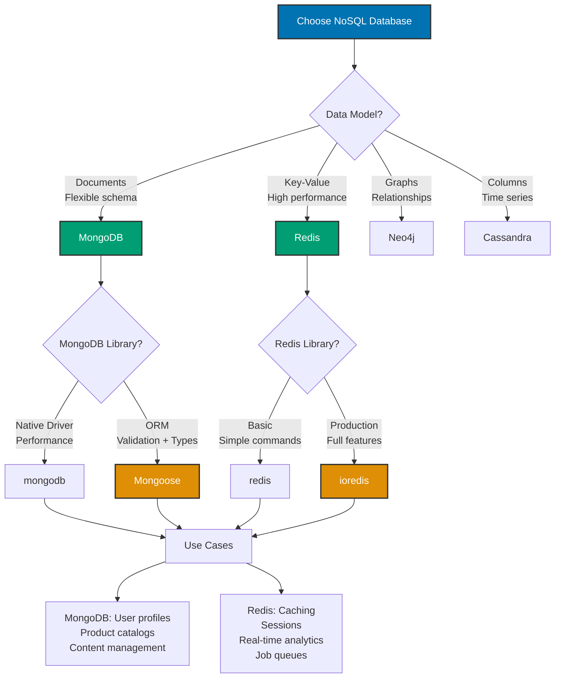

## Why NoSQL Databases Matter

NoSQL databases provide flexible schema, horizontal scalability, and specialized data models (documents, key-value, graphs) for use cases where relational databases are inefficient. Production NoSQL deployments require connection pooling, proper indexing, schema validation, error handling, and understanding of eventual consistency trade-offs.

**Core Benefits**:

- **Flexible schema**: No rigid table structure, adapt as requirements evolve
- **Horizontal scalability**: Distribute data across multiple servers
- **High performance**: Optimized for specific access patterns (key-value lookups, document queries)
- **Denormalization**: Store related data together (fewer joins)
- **Specialized models**: Documents (MongoDB), key-value (Redis), graphs (Neo4j)

**Problem**: NoSQL databases lack ACID guarantees by default, schema validation is optional, and improper indexing causes performance issues at scale.

**Solution**: Use production NoSQL libraries (Mongoose for MongoDB, ioredis for Redis) that provide schema validation, connection pooling, and abstraction over database-specific APIs.

## Standard Library First: MongoDB Native Driver

MongoDB provides a Node.js native driver for database operations without ORMs.

### Installation and Setup

```bash
npm install mongodb
# => Install official MongoDB Node.js driver
# => Direct database access without ORM
```

**Connection and basic operations**:

```typescript
import { MongoClient, ObjectId } from "mongodb";
// => Import MongoDB client
// => ObjectId: BSON type for _id field

const uri = "mongodb://localhost:27017";
// => MongoDB connection string
// => Format: mongodb://[username:password@]host[:port][/database]

const client = new MongoClient(uri);
// => Create MongoDB client
// => Connection not established yet

async function main() {
  try {
    await client.connect();
    // => Connect to MongoDB server
    // => Establishes connection pool
    console.log("Connected to MongoDB");

    const database = client.db("myapp");
    // => Select database
    // => Creates database if doesn't exist

    const users = database.collection("users");
    // => Get collection reference
    // => Collections like tables in SQL
    // => Created automatically on first insert

    // Insert document
    const insertResult = await users.insertOne({
      // => Insert single document
      name: "Alice",
      email: "alice@example.com",
      age: 25,
      createdAt: new Date(),
      // => MongoDB stores as BSON Date
    });
    console.log("Inserted document ID:", insertResult.insertedId);
    // => insertedId: ObjectId("507f1f77bcf86cd799439011")
    // => MongoDB generates _id automatically if not provided

    // Find documents
    const allUsers = await users.find({}).toArray();
    // => Find all documents
    // => {} = no filter (match all)
    // => toArray() converts cursor to array
    console.log("All users:", allUsers);
    // => Returns array of user documents

    const alice = await users.findOne({ name: "Alice" });
    // => Find single document
    // => Returns first match or null
    console.log("Alice:", alice);
    // => { _id: ObjectId(...), name: 'Alice', email: '...', ... }

    // Update document
    const updateResult = await users.updateOne(
      { name: "Alice" },
      // => Filter: Which document to update
      { $set: { age: 26 } },
      // => Update operation: $set modifier
      // => Sets age field to 26
    );
    console.log("Modified count:", updateResult.modifiedCount);
    // => Number of documents updated (0 or 1)

    // Delete document
    const deleteResult = await users.deleteOne({ name: "Alice" });
    // => Delete single document matching filter
    console.log("Deleted count:", deleteResult.deletedCount);
    // => Number of documents deleted (0 or 1)
  } finally {
    await client.close();
    // => Close connection
    // => CRITICAL: Always close connection
  }
}

main();
```

### Query Operations

MongoDB query language for finding documents.

**Pattern**:

```typescript
const users = database.collection("users");

// Find with filter
const adults = await users.find({ age: { $gte: 18 } }).toArray();
// => Find users where age >= 18
// => $gte: Greater than or equal to operator
// => Returns array of matching documents

// Multiple conditions (AND)
const activeAdults = await users
  .find({
    age: { $gte: 18 },
    // => age >= 18
    status: "active",
    // => status === "active"
    // => Both conditions must match (implicit AND)
  })
  .toArray();

// OR conditions
const specialUsers = await users
  .find({
    $or: [
      // => OR operator
      { role: "admin" },
      { premium: true },
      // => Match if admin OR premium
    ],
  })
  .toArray();

// Nested field queries
const gmailUsers = await users
  .find({
    "contact.email": { $regex: /@gmail\.com$/ },
    // => Query nested field
    // => contact.email ends with @gmail.com
    // => Regex: Regular expression match
  })
  .toArray();

// Array queries
const pythonDevelopers = await users
  .find({
    skills: "Python",
    // => skills array contains "Python"
    // => Matches if any array element equals "Python"
  })
  .toArray();

const multiSkillDevelopers = await users
  .find({
    skills: { $all: ["Python", "TypeScript"] },
    // => skills array contains ALL listed items
    // => Order doesn't matter
  })
  .toArray();

// Projection (select specific fields)
const usernames = await users
  .find({}, { projection: { name: 1, _id: 0 } })
  // => Select only name field
  // => _id: 0 excludes _id (included by default)
  // => 1 = include, 0 = exclude
  .toArray();
// => Returns: [{ name: "Alice" }, { name: "Bob" }, ...]

// Sorting
const sortedUsers = await users
  .find({})
  .sort({ age: -1 })
  // => Sort by age descending
  // => -1 = descending, 1 = ascending
  .toArray();

// Pagination
const page2Users = await users
  .find({})
  .skip(10)
  // => Skip first 10 documents
  // => Page 1: skip(0), Page 2: skip(10)
  .limit(10)
  // => Return 10 documents
  .toArray();

// Count documents
const adultCount = await users.countDocuments({ age: { $gte: 18 } });
// => Count matching documents
// => Returns number, not documents
```

### Aggregation Pipeline

Complex data processing with aggregation framework.

**Pattern**:

```typescript
const users = database.collection("users");

// Group by and count
const usersByRole = await users
  .aggregate([
    // => Aggregation pipeline
    // => Array of stages
    {
      $group: {
        // => Group stage
        _id: "$role",
        // => Group by role field
        // => $role references field
        count: { $sum: 1 },
        // => Count documents in each group
        // => Increment by 1 for each document
      },
    },
  ])
  .toArray();
// => Returns: [{ _id: "admin", count: 5 }, { _id: "user", count: 100 }]

// Match, project, sort pipeline
const topUsers = await users
  .aggregate([
    {
      $match: { status: "active" },
      // => Filter stage (like find)
      // => Only active users
    },
    {
      $project: {
        // => Select fields (like projection)
        name: 1,
        email: 1,
        // => Include name and email
        age: 1,
        _id: 0,
        // => Exclude _id
      },
    },
    {
      $sort: { age: -1 },
      // => Sort by age descending
    },
    {
      $limit: 10,
      // => Return top 10
    },
  ])
  .toArray();

// Lookup (join collections)
const posts = database.collection("posts");

const postsWithAuthors = await posts
  .aggregate([
    {
      $lookup: {
        // => Join stage (like SQL JOIN)
        from: "users",
        // => Collection to join
        localField: "authorId",
        // => Field in posts collection
        foreignField: "_id",
        // => Field in users collection
        as: "author",
        // => Output field name
        // => Array of matching users
      },
    },
    {
      $unwind: "$author",
      // => Deconstruct array field
      // => Convert author: [user] to author: user
      // => One document per array element
    },
  ])
  .toArray();
// => Returns posts with embedded author objects
```

### Indexes

Indexes improve query performance for large collections.

**Pattern**:

```typescript
const users = database.collection("users");

// Create single field index
await users.createIndex({ email: 1 });
// => Index on email field (ascending)
// => Speeds up queries: find({ email: "..." })
// => Enforces uniqueness if unique: true

// Create unique index
await users.createIndex({ email: 1 }, { unique: true });
// => Unique index on email
// => Prevents duplicate emails
// => Insert fails if email already exists

// Compound index (multiple fields)
await users.createIndex({ lastName: 1, firstName: 1 });
// => Index on lastName then firstName
// => Speeds up: find({ lastName: "Smith", firstName: "John" })
// => Also speeds up: find({ lastName: "Smith" })
// => Does NOT speed up: find({ firstName: "John" }) alone

// Text index (full-text search)
await users.createIndex({ bio: "text" });
// => Text index on bio field
// => Enables full-text search

const searchResults = await users.find({ $text: { $search: "developer" } }).toArray();
// => Full-text search for "developer"
// => Searches indexed text fields

// List indexes
const indexes = await users.indexes();
console.log("Indexes:", indexes);
// => Returns array of index definitions

// Drop index
await users.dropIndex("email_1");
// => Remove index by name
// => Index name: fieldName_direction (email_1, lastName_1_firstName_1)
```

**Limitations for production**:

- **No schema validation**: MongoDB accepts any document structure (type safety lost)
- **Manual type definitions**: Must define TypeScript interfaces manually
- **No validation middleware**: No automatic validation on insert/update
- **Connection management**: Must manually handle connection pooling
- **Limited type safety**: Query results typed as `any` or generic `Document`
- **No model abstraction**: Direct collection access (verbose)
- **Error handling**: Manual error handling for every operation
- **No middleware hooks**: No pre/post save hooks

**When native driver suffices**:

- Simple applications (≤3 collections)
- Read-heavy workloads (minimal writes)
- Performance critical (avoid ORM overhead)
- Learning MongoDB fundamentals

## Production Framework: Mongoose

Mongoose provides schema validation, middleware hooks, query building, and TypeScript integration for MongoDB.

### Installation and Setup

```bash
npm install mongoose
# => Install Mongoose ODM
# => Object Data Modeling for MongoDB
```

**Connection**:

```typescript
import mongoose from "mongoose";
// => Import Mongoose library

const connectionString = process.env.MONGODB_URI || "mongodb://localhost:27017/myapp";
// => MongoDB connection string from environment
// => Production: Use MongoDB Atlas or replica set

await mongoose.connect(connectionString, {
  // => Connect to MongoDB
  // => Returns Promise
  maxPoolSize: 10,
  // => Maximum connections in pool
  // => Tune based on application load
  serverSelectionTimeoutMS: 5000,
  // => Timeout for server selection
  // => 5 seconds to find available server
});
console.log("Connected to MongoDB via Mongoose");

// Connection error handling
mongoose.connection.on("error", (error) => {
  // => Connection error event
  console.error("MongoDB connection error:", error);
});

mongoose.connection.on("disconnected", () => {
  // => Disconnection event
  console.log("MongoDB disconnected");
});

process.on("SIGINT", async () => {
  // => Graceful shutdown on Ctrl+C
  await mongoose.connection.close();
  // => Close connection before exit
  console.log("MongoDB connection closed");
  process.exit(0);
});
```

### Schema Definition

Schemas define document structure with types and validation.

**Pattern**:

```typescript
import { Schema, model, Document } from "mongoose";
// => Import Mongoose schema utilities

interface IUser extends Document {
  // => TypeScript interface extending Mongoose Document
  // => Document provides _id, save(), etc.
  name: string;
  email: string;
  password: string;
  age: number;
  role: "user" | "admin" | "moderator";
  premium: boolean;
  tags: string[];
  address?: {
    // => Optional nested object
    street: string;
    city: string;
    zipCode: string;
  };
  createdAt: Date;
  updatedAt: Date;
}

const userSchema = new Schema<IUser>(
  // => Create schema with TypeScript type
  // => Provides type checking for schema definition
  {
    name: {
      type: String,
      // => Field type
      required: [true, "Name is required"],
      // => Validation: Required field
      // => Custom error message
      minlength: [3, "Name must be at least 3 characters"],
      // => Minimum length validation
      maxlength: [50, "Name must not exceed 50 characters"],
      trim: true,
      // => Remove leading/trailing whitespace
    },
    email: {
      type: String,
      required: [true, "Email is required"],
      unique: true,
      // => Unique index on email
      // => Prevents duplicate emails (database level)
      lowercase: true,
      // => Convert to lowercase before save
      // => Prevents duplicate: Alice@example.com vs alice@example.com
      match: [/^\S+@\S+\.\S+$/, "Invalid email format"],
      // => Regex validation
      // => Custom error message
    },
    password: {
      type: String,
      required: [true, "Password is required"],
      minlength: [8, "Password must be at least 8 characters"],
      select: false,
      // => Exclude from query results by default
      // => Prevents accidental password exposure
      // => Must explicitly select: find().select('+password')
    },
    age: {
      type: Number,
      required: true,
      min: [13, "Must be at least 13 years old"],
      // => Minimum value validation
      max: [120, "Age must be realistic"],
    },
    role: {
      type: String,
      enum: {
        // => Enum validation
        // => Only allowed values
        values: ["user", "admin", "moderator"],
        message: "{VALUE} is not a valid role",
        // => {VALUE} placeholder for actual value
      },
      default: "user",
      // => Default value if not provided
    },
    premium: {
      type: Boolean,
      default: false,
    },
    tags: {
      type: [String],
      // => Array of strings
      // => Can be empty array
      validate: {
        // => Custom validation function
        validator: function (tags: string[]) {
          // => Return true if valid, false if invalid
          return tags.length <= 10;
          // => Maximum 10 tags
        },
        message: "Maximum 10 tags allowed",
      },
    },
    address: {
      // => Nested object (subdocument)
      street: String,
      city: String,
      zipCode: {
        type: String,
        match: /^\d{5}$/,
        // => 5-digit ZIP code
      },
    },
  },
  {
    timestamps: true,
    // => Automatic createdAt and updatedAt fields
    // => Mongoose manages these fields
    toJSON: { virtuals: true },
    // => Include virtual fields in JSON output
    toObject: { virtuals: true },
  },
);

// Virtual field (computed property)
userSchema.virtual("fullName").get(function () {
  // => Virtual field (not stored in database)
  // => Computed from other fields
  // => Must use function (not arrow) to access `this`
  return `${this.name} (${this.role})`;
});

// Instance method
userSchema.methods.comparePassword = async function (candidatePassword: string): Promise<boolean> {
  // => Instance method
  // => Available on document instances
  // => this refers to document
  const bcrypt = await import("bcrypt");
  return bcrypt.compare(candidatePassword, this.password);
  // => Compare password with hash
};

// Static method
userSchema.statics.findByEmail = function (email: string) {
  // => Static method
  // => Available on model (not document)
  // => this refers to model
  return this.findOne({ email: email.toLowerCase() });
  // => Find user by email
};

// Pre-save middleware (hook)
userSchema.pre("save", async function (next) {
  // => Pre-save hook
  // => Runs before document saved
  // => this refers to document being saved

  if (!this.isModified("password")) {
    // => Check if password field modified
    // => Skip hashing if password unchanged
    return next();
  }

  const bcrypt = await import("bcrypt");
  this.password = await bcrypt.hash(this.password, 10);
  // => Hash password before save
  // => Never store plain text
  next();
  // => Continue save operation
});

// Post-save middleware
userSchema.post("save", function (doc) {
  // => Post-save hook
  // => Runs after document saved
  // => doc is saved document
  console.log(`User ${doc.name} saved to database`);
});

// Create model
const User = model<IUser>("User", userSchema);
// => Create model from schema
// => Model name: "User" (collection: "users" - lowercase, plural)
// => Type-safe model with IUser interface

export { User, IUser };
```

### CRUD Operations

Type-safe operations with Mongoose models.

**Pattern**:

```typescript
import { User } from "./models/User";

// Create document
const user = new User({
  // => Create new user document
  // => Type-safe: TypeScript validates fields
  name: "Alice",
  email: "alice@example.com",
  password: "SecurePass123!",
  // => Will be hashed by pre-save hook
  age: 25,
  tags: ["developer", "typescript"],
});

await user.save();
// => Save to database
// => Triggers pre-save hook (password hashing)
// => Triggers post-save hook (logging)
console.log("User created:", user._id);
// => _id: ObjectId generated by MongoDB

// Alternative: Create and save in one step
const bob = await User.create({
  name: "Bob",
  email: "bob@example.com",
  password: "BobPass456!",
  age: 30,
});
// => create() calls constructor and save()

// Find documents
const allUsers = await User.find({});
// => Find all users
// => Returns array of User documents
// => Type-safe: allUsers[0].name is string

const admins = await User.find({ role: "admin" });
// => Find users by role
// => Returns User[] with TypeScript types

const alice = await User.findOne({ email: "alice@example.com" });
// => Find single user
// => Returns User | null
if (alice) {
  console.log(alice.fullName);
  // => Virtual field available
  // => "Alice (user)"
}

// Find by ID
const userById = await User.findById("507f1f77bcf86cd799439011");
// => Find by ObjectId
// => Returns User | null
// => Throws if invalid ObjectId format

// Find with password (excluded by select: false)
const userWithPassword = await User.findOne({ email: "alice@example.com" }).select("+password");
// => Explicitly include password
// => +password overrides select: false

// Update document
const updated = await User.findByIdAndUpdate(
  user._id,
  // => Document ID to update
  { $set: { age: 26 } },
  // => Update operations
  // => $set: Set field value
  {
    new: true,
    // => Return updated document (not original)
    runValidators: true,
    // => Run schema validators on update
    // => Validates age >= 13, age <= 120
  },
);
console.log("Updated user:", updated?.age);
// => 26

// Update with instance method
alice.age = 27;
await alice.save();
// => Update by modifying and saving
// => Triggers pre-save hook

// Delete document
await User.findByIdAndDelete(user._id);
// => Delete by ID
// => Returns deleted document or null

// Delete with instance method
await alice.deleteOne();
// => Delete document
// => Triggers pre-remove hooks if defined

// Static method usage
const foundUser = await User.findByEmail("bob@example.com");
// => Call static method
// => Returns User | null
```

### Query Building

Chainable query methods for complex queries.

**Pattern**:

```typescript
// Query builder
const activeAdults = await User.find({ status: "active" })
  // => Initial filter
  .where("age")
  .gte(18)
  // => age >= 18
  .where("premium")
  .equals(true)
  // => premium === true
  .select("name email age")
  // => Select specific fields
  // => Space-separated or array
  .sort({ age: -1 })
  // => Sort by age descending
  .limit(10)
  // => Limit to 10 documents
  .skip(0)
  // => Skip 0 documents (pagination)
  .exec();
// => Execute query
// => Returns User[]

// Population (references)
const postSchema = new Schema({
  title: String,
  content: String,
  author: {
    type: Schema.Types.ObjectId,
    // => Reference to User collection
    ref: "User",
    // => Reference model name
    required: true,
  },
  comments: [
    {
      user: { type: Schema.Types.ObjectId, ref: "User" },
      text: String,
      createdAt: { type: Date, default: Date.now },
    },
  ],
});

const Post = model("Post", postSchema);

// Create post with reference
const post = await Post.create({
  title: "My First Post",
  content: "Hello world",
  author: alice._id,
  // => Store ObjectId reference
});

// Populate reference (join)
const postWithAuthor = await Post.findById(post._id).populate("author");
// => Load referenced user document
// => Replace author ObjectId with full User document
console.log(postWithAuthor.author.name);
// => "Alice" (author is full User document)

// Populate with field selection
const postWithAuthorName = await Post.findById(post._id).populate("author", "name email");
// => Populate only specific fields
// => author contains only name and email

// Populate nested references
const postWithComments = await Post.findById(post._id).populate("comments.user");
// => Populate nested reference
// => Each comment.user loaded
```

### Aggregation

Mongoose aggregation pipeline with type safety.

**Pattern**:

```typescript
// Aggregation pipeline
const userStats = await User.aggregate([
  // => Aggregation pipeline
  // => Returns plain objects (not Mongoose documents)
  {
    $match: { status: "active" },
    // => Filter stage
  },
  {
    $group: {
      _id: "$role",
      count: { $sum: 1 },
      averageAge: { $avg: "$age" },
      // => Calculate average age per role
    },
  },
  {
    $sort: { count: -1 },
    // => Sort by count descending
  },
]);
// => Returns: [{ _id: "user", count: 100, averageAge: 28.5 }, ...]

// Aggregation with $lookup (join)
const postsWithAuthorCount = await Post.aggregate([
  {
    $lookup: {
      from: "users",
      // => Collection name (not model name)
      localField: "author",
      foreignField: "_id",
      as: "authorData",
      // => Array of matching users
    },
  },
  {
    $unwind: "$authorData",
    // => Convert array to object
  },
  {
    $group: {
      _id: "$authorData.name",
      postCount: { $sum: 1 },
    },
  },
]);
```

**Production benefits**:

- **Schema validation**: Type checking and validation on insert/update
- **TypeScript integration**: Full type safety with interfaces
- **Middleware hooks**: Pre/post save, remove, update hooks
- **Virtual fields**: Computed properties not stored in database
- **Query builder**: Chainable, readable query methods
- **Population**: Reference other documents (joins)
- **Validation errors**: Detailed, field-specific error messages
- **Connection pooling**: Automatic connection management

**Trade-offs**:

- **External dependency**: Mongoose library (250KB)
- **Performance overhead**: ORM abstraction slower than native driver (5-10%)
- **Learning curve**: Schema definition, middleware, population
- **Opinionated**: Mongoose patterns (not always MongoDB best practices)

**When to use Mongoose**:

- Production applications (schema validation critical)
- Complex schemas (>5 fields per collection)
- TypeScript projects (type safety benefits)
- Team environments (consistent patterns)

## Production Framework: Redis with ioredis

Redis provides in-memory key-value storage for caching, sessions, and real-time features.

### Installation and Setup

```bash
npm install ioredis
# => Install ioredis client
# => Production-ready Redis client with TypeScript support
```

**Connection**:

```typescript
import Redis from "ioredis";
// => Import ioredis library

const redis = new Redis({
  // => Create Redis client
  host: process.env.REDIS_HOST || "localhost",
  // => Redis server hostname
  port: parseInt(process.env.REDIS_PORT || "6379"),
  // => Redis default port
  password: process.env.REDIS_PASSWORD,
  // => Redis password (if authentication enabled)
  db: 0,
  // => Database number (0-15 by default)
  retryStrategy: (times) => {
    // => Retry connection on failure
    // => times: Number of retries so far
    const delay = Math.min(times * 50, 2000);
    // => Exponential backoff up to 2 seconds
    return delay;
  },
  maxRetriesPerRequest: 3,
  // => Maximum retries per command
});

redis.on("connect", () => {
  // => Connection event
  console.log("Connected to Redis");
});

redis.on("error", (error) => {
  // => Error event
  console.error("Redis connection error:", error);
});

// Graceful shutdown
process.on("SIGINT", async () => {
  await redis.quit();
  // => Close connection gracefully
  console.log("Redis connection closed");
  process.exit(0);
});
```

### Basic Operations

String operations (key-value storage).

**Pattern**:

```typescript
// Set value
await redis.set("user:1:name", "Alice");
// => Set string value
// => Key: user:1:name, Value: Alice

await redis.set("user:1:age", "25");
// => Redis stores everything as strings
// => Must parse numbers when retrieving

// Set with expiration (TTL)
await redis.set("session:abc123", "user_data", "EX", 3600);
// => Set with expiration
// => EX: Expire in seconds
// => 3600 seconds = 1 hour
// => Key deleted automatically after expiration

// Alternative: setex command
await redis.setex("session:def456", 3600, "user_data");
// => Set with expiration (shorter syntax)
// => TTL (seconds), then value

// Get value
const name = await redis.get("user:1:name");
// => Get value by key
// => Returns string | null
console.log(name);
// => "Alice"

const age = await redis.get("user:1:age");
const ageNumber = age ? parseInt(age) : null;
// => Parse string to number
// => Redis doesn't have number type

// Check if key exists
const exists = await redis.exists("user:1:name");
// => Returns 1 if exists, 0 if not
// => Can check multiple keys: exists(key1, key2, ...)

// Delete key
await redis.del("user:1:name");
// => Delete key
// => Returns number of keys deleted

// Set multiple keys (pipeline)
await redis.mset("user:2:name", "Bob", "user:2:age", "30");
// => Set multiple keys in one command
// => Faster than multiple SET commands

// Get multiple keys
const values = await redis.mget("user:2:name", "user:2:age");
// => Get multiple values
// => Returns array: ["Bob", "30"]

// Increment/decrement
await redis.set("counter", "0");
await redis.incr("counter");
// => Increment by 1 (counter = 1)
await redis.incrby("counter", 5);
// => Increment by 5 (counter = 6)
await redis.decr("counter");
// => Decrement by 1 (counter = 5)

// Get and set atomically
const oldValue = await redis.getset("key", "new_value");
// => Get old value and set new value atomically
// => Returns old value
```

### Hash Operations

Hash data structure for storing objects.

**Pattern**:

```typescript
// Set hash fields
await redis.hset("user:1", "name", "Alice");
// => Set single field in hash
// => Hash: user:1, Field: name, Value: Alice

await redis.hset("user:1", "email", "alice@example.com");
// => Set another field in same hash

// Set multiple fields
await redis.hset("user:1", {
  // => Object notation (ioredis feature)
  name: "Alice",
  email: "alice@example.com",
  age: "25",
});
// => Set multiple fields in one command

// Get single field
const userName = await redis.hget("user:1", "name");
// => Get single field from hash
// => Returns string | null
console.log(userName);
// => "Alice"

// Get all fields
const user = await redis.hgetall("user:1");
// => Get entire hash as object
// => Returns: { name: "Alice", email: "alice@example.com", age: "25" }
console.log(user);

// Get multiple fields
const fields = await redis.hmget("user:1", "name", "email");
// => Get specific fields
// => Returns array: ["Alice", "alice@example.com"]

// Delete field
await redis.hdel("user:1", "age");
// => Delete field from hash

// Check if field exists
const hasEmail = await redis.hexists("user:1", "email");
// => Returns 1 if field exists, 0 if not

// Increment hash field
await redis.hincrby("user:1", "loginCount", 1);
// => Increment numeric field by 1
```

### List Operations

List data structure (ordered collection).

**Pattern**:

```typescript
// Push to list
await redis.rpush("tasks", "task1", "task2", "task3");
// => Right push (append to end)
// => List: [task1, task2, task3]

await redis.lpush("tasks", "task0");
// => Left push (prepend to start)
// => List: [task0, task1, task2, task3]

// Pop from list
const task = await redis.rpop("tasks");
// => Right pop (remove from end)
// => Returns "task3"
// => List: [task0, task1, task2]

const firstTask = await redis.lpop("tasks");
// => Left pop (remove from start)
// => Returns "task0"

// Get list length
const length = await redis.llen("tasks");
// => Returns number of elements

// Get range
const allTasks = await redis.lrange("tasks", 0, -1);
// => Get elements from index 0 to end (-1)
// => Returns: ["task1", "task2"]

const firstTwo = await redis.lrange("tasks", 0, 1);
// => Get first 2 elements
// => Returns: ["task1", "task2"]

// Blocking pop (wait for element)
const blockedTask = await redis.blpop("tasks", 10);
// => Block until element available or timeout
// => Timeout: 10 seconds
// => Returns: ["tasks", "task1"] or null if timeout
// => Useful for job queues
```

### Set Operations

Set data structure (unique unordered collection).

**Pattern**:

```typescript
// Add to set
await redis.sadd("users:online", "user1", "user2", "user3");
// => Add members to set
// => Duplicates ignored (set property)

// Check membership
const isMember = await redis.sismember("users:online", "user1");
// => Returns 1 if member, 0 if not

// Get all members
const onlineUsers = await redis.smembers("users:online");
// => Get all set members
// => Returns array: ["user1", "user2", "user3"]
// => Order not guaranteed (set property)

// Remove from set
await redis.srem("users:online", "user2");
// => Remove member from set

// Set cardinality (size)
const count = await redis.scard("users:online");
// => Returns number of members

// Set operations (union, intersection, difference)
await redis.sadd("set1", "a", "b", "c");
await redis.sadd("set2", "b", "c", "d");

const union = await redis.sunion("set1", "set2");
// => Union of sets
// => Returns: ["a", "b", "c", "d"]

const intersection = await redis.sinter("set1", "set2");
// => Intersection of sets
// => Returns: ["b", "c"]

const difference = await redis.sdiff("set1", "set2");
// => Difference (set1 - set2)
// => Returns: ["a"]
```

### Sorted Set Operations

Sorted set data structure (ordered by score).

**Pattern**:

```typescript
// Add to sorted set with score
await redis.zadd("leaderboard", 100, "player1");
// => Add member with score
// => Score: 100, Member: player1

await redis.zadd("leaderboard", 150, "player2", 75, "player3");
// => Add multiple members with scores

// Get rank (position)
const rank = await redis.zrank("leaderboard", "player2");
// => Get rank (0-based index)
// => Sorted by score ascending
// => Returns: 2 (third position)

const reverseRank = await redis.zrevrank("leaderboard", "player2");
// => Get rank (descending order)
// => Returns: 0 (first position)

// Get score
const score = await redis.zscore("leaderboard", "player2");
// => Get member's score
// => Returns: "150"

// Get range by rank
const topPlayers = await redis.zrevrange("leaderboard", 0, 2);
// => Get top 3 players (descending order)
// => Returns: ["player2", "player1", "player3"]

const topPlayersWithScores = await redis.zrevrange("leaderboard", 0, 2, "WITHSCORES");
// => Get members with scores
// => Returns: ["player2", "150", "player1", "100", "player3", "75"]

// Get range by score
const midRangePlayers = await redis.zrangebyscore("leaderboard", 80, 120);
// => Get players with score 80-120
// => Returns: ["player1"]

// Increment score
await redis.zincrby("leaderboard", 10, "player1");
// => Increment player1's score by 10
// => New score: 110
```

### Caching Pattern

Use Redis for application caching.

**Pattern**:

```typescript
import { Redis } from "ioredis";
import { Pool } from "pg";

const redis = new Redis();
const pgPool = new Pool({
  /* database config */
});

async function getUser(userId: string) {
  // => Get user with Redis cache
  const cacheKey = `user:${userId}`;
  // => Cache key pattern

  // Check cache first
  const cached = await redis.get(cacheKey);
  if (cached) {
    // => Cache hit
    console.log("Cache hit");
    return JSON.parse(cached);
    // => Parse JSON string to object
    // => Redis stores strings, not objects
  }

  // Cache miss - query database
  console.log("Cache miss");
  const result = await pgPool.query("SELECT * FROM users WHERE id = $1", [userId]);

  if (result.rows.length === 0) {
    return null;
  }

  const user = result.rows[0];

  // Store in cache
  await redis.setex(cacheKey, 3600, JSON.stringify(user));
  // => Cache for 1 hour
  // => Serialize object to JSON string

  return user;
}

async function updateUser(userId: string, updates: any) {
  // => Update user and invalidate cache
  const result = await pgPool.query("UPDATE users SET name = $1 WHERE id = $2 RETURNING *", [updates.name, userId]);

  // Invalidate cache
  await redis.del(`user:${userId}`);
  // => Remove cached data
  // => Next read will fetch from database

  return result.rows[0];
}
```

**Production benefits**:

- **High performance**: In-memory storage (sub-millisecond latency)
- **Data structures**: Strings, hashes, lists, sets, sorted sets
- **Expiration**: Automatic key deletion (TTL)
- **Atomic operations**: INCR, DECR, etc. (no race conditions)
- **Pub/Sub**: Real-time messaging
- **Persistence**: Optional disk persistence (RDB, AOF)

**Trade-offs**:

- **Memory cost**: In-memory storage (expensive for large datasets)
- **Eviction**: Keys evicted when memory full (LRU policy)
- **No complex queries**: Not a database (use for caching/sessions)
- **Single-threaded**: CPU-bound operations block other commands

**When to use Redis**:

- Caching (database query results, API responses)
- Session storage (user sessions)
- Rate limiting (request counting with expiration)
- Leaderboards (sorted sets)
- Real-time analytics (counters, unique visitors)
- Job queues (lists with BLPOP)

## NoSQL Database Selection Diagram



## Production Best Practices

### MongoDB Indexing Strategy

Create indexes for frequently queried fields.

**Pattern**:

```typescript
// Create indexes in schema
const userSchema = new Schema({
  email: {
    type: String,
    unique: true,
    // => Creates unique index on email
    // => Prevents duplicate emails
  },
  username: {
    type: String,
    index: true,
    // => Creates non-unique index
    // => Speeds up queries by username
  },
  createdAt: {
    type: Date,
    default: Date.now,
  },
});

// Compound index for common queries
userSchema.index({ status: 1, createdAt: -1 });
// => Index on status (ascending) and createdAt (descending)
// => Speeds up: find({ status: "active" }).sort({ createdAt: -1 })

// Text index for search
userSchema.index({ name: "text", bio: "text" });
// => Full-text search on name and bio fields

// TTL index (automatic expiration)
const sessionSchema = new Schema({
  token: String,
  createdAt: {
    type: Date,
    default: Date.now,
    expires: 3600,
    // => Document deleted 3600 seconds after createdAt
    // => Automatic session cleanup
  },
});

// Index analysis
User.collection.getIndexes().then((indexes) => {
  // => List all indexes
  console.log(indexes);
});

// Explain query plan
User.find({ email: "alice@example.com" })
  .explain("executionStats")
  .then((stats) => {
    // => Query execution statistics
    // => Shows if index used
    console.log(stats);
  });
```

### Redis Data Modeling

Structure keys and use appropriate data types.

**Pattern**:

```typescript
// Key naming convention
// Pattern: entity:id:attribute
// Examples:
// - user:123:profile
// - user:123:sessions
// - product:456:views
// - cache:user:123

// Store user profile as hash
await redis.hset("user:123:profile", {
  name: "Alice",
  email: "alice@example.com",
  age: "25",
});
// => Better than separate keys (user:123:name, user:123:email, ...)
// => Atomic operations on entire profile

// Store user sessions as set
await redis.sadd("user:123:sessions", "session_abc", "session_def");
// => Track active sessions
// => Easy to check all sessions

// Store product views as sorted set (with timestamp)
const now = Date.now();
await redis.zadd("product:456:views", now, "user:123");
// => Score = timestamp
// => Enables time-based queries

// Get recent views
const recentViews = await redis.zrevrangebyscore("product:456:views", "+inf", Date.now() - 86400000);
// => Views in last 24 hours
// => +inf = positive infinity
// => 86400000 ms = 24 hours

// Cache invalidation pattern
async function getUserProfile(userId: string) {
  const key = `cache:user:${userId}:profile`;
  const cached = await redis.get(key);

  if (cached) {
    return JSON.parse(cached);
  }

  const user = await User.findById(userId);
  await redis.setex(key, 3600, JSON.stringify(user));
  // => Cache for 1 hour
  return user;
}

async function updateUserProfile(userId: string, updates: any) {
  const user = await User.findByIdAndUpdate(userId, updates, { new: true });

  // Invalidate cache
  await redis.del(`cache:user:${userId}:profile`);
  // => Remove stale cache

  return user;
}
```

## Trade-offs and When to Use Each

### MongoDB Native Driver

**Use when**:

- Performance critical (avoid ORM overhead)
- Simple queries (no complex validation needed)
- Learning MongoDB fundamentals
- Microservices (lightweight dependencies)

**Avoid when**:

- Complex schemas (manual validation error-prone)
- TypeScript projects (limited type safety)
- Team environments (inconsistent patterns)

### Mongoose

**Use when**:

- Production applications (schema validation critical)
- Complex schemas (>5 fields per collection)
- TypeScript projects (full type safety)
- Team environments (consistent patterns)

**Avoid when**:

- Performance critical (5-10% overhead)
- Simple CRUD (overkill for basic operations)
- Non-standard MongoDB usage (Mongoose opinionated)

### Redis

**Use when**:

- Caching (database query results, API responses)
- Session storage (user sessions, shopping carts)
- Real-time features (leaderboards, counters, pub/sub)
- Rate limiting (request counting)
- Job queues (background tasks)

**Avoid when**:

- Primary data storage (use database)
- Complex queries (Redis is key-value, not relational)
- Large datasets (memory expensive)
- Strong durability required (in-memory, data loss possible)

## Common Pitfalls

### Pitfall 1: No Schema Validation (Native Driver)

**Problem**: Invalid data stored in database.

**Solution**: Use Mongoose schemas or manual validation.

```typescript
// ❌ BAD: No validation
await users.insertOne({ name: 123, email: "invalid" });
// => Accepts invalid data

// ✅ GOOD: Mongoose schema validation
const user = new User({ name: 123, email: "invalid" });
await user.save();
// => Throws validation error
```

### Pitfall 2: Missing Indexes

**Problem**: Slow queries on large collections.

**Solution**: Create indexes on frequently queried fields.

```typescript
// ❌ BAD: No index on email
const user = await User.findOne({ email: "alice@example.com" });
// => Full collection scan (slow)

// ✅ GOOD: Unique index on email
userSchema.index({ email: 1 }, { unique: true });
// => Index lookup (fast)
```

### Pitfall 3: Redis Memory Overflow

**Problem**: Redis runs out of memory.

**Solution**: Set TTL on keys and use eviction policy.

```typescript
// ❌ BAD: No expiration
await redis.set("cache:user:123", JSON.stringify(user));
// => Cache never expires (memory leak)

// ✅ GOOD: Set TTL
await redis.setex("cache:user:123", 3600, JSON.stringify(user));
// => Expires after 1 hour

// Configure eviction policy (redis.conf)
// maxmemory 256mb
// maxmemory-policy allkeys-lru
// => Evict least recently used keys when memory full
```

### Pitfall 4: Not Handling Connection Errors

**Problem**: Application crashes on database connection failure.

**Solution**: Handle connection errors and implement retry logic.

```typescript
// ❌ BAD: No error handling
await mongoose.connect(uri);

// ✅ GOOD: Error handling and retry
mongoose.connection.on("error", (error) => {
  console.error("MongoDB error:", error);
  // => Log error, alert monitoring system
});

mongoose.connection.on("disconnected", () => {
  console.log("MongoDB disconnected, retrying...");
  // => Attempt reconnection
});
```

## Summary

NoSQL databases provide flexible schema and specialized data models for specific use cases. MongoDB native driver offers raw performance, Mongoose adds schema validation and type safety, and Redis provides in-memory key-value storage for caching and real-time features.

**Progression path**:

1. **Learn with native drivers**: Understand database fundamentals
2. **Validate with Mongoose**: Schema validation for production MongoDB
3. **Cache with Redis**: Improve performance with in-memory storage

**Production checklist**:

- ✅ Schema validation (Mongoose schemas)
- ✅ Proper indexing (frequently queried fields)
- ✅ Connection pooling (configured in connection string)
- ✅ Error handling (connection errors, validation errors)
- ✅ TTL on cache keys (prevent memory overflow)
- ✅ Environment configuration (connection strings in .env)
- ✅ Monitoring (query performance, memory usage)
- ✅ Backup strategy (MongoDB dumps, Redis persistence)

**Use MongoDB for**: User profiles, product catalogs, content management (flexible schema, complex queries)

**Use Redis for**: Caching, sessions, real-time analytics, rate limiting (high performance, expiration)

Choose NoSQL database based on data model and access patterns: MongoDB for documents with flexible schema, Redis for high-performance caching and real-time features.
