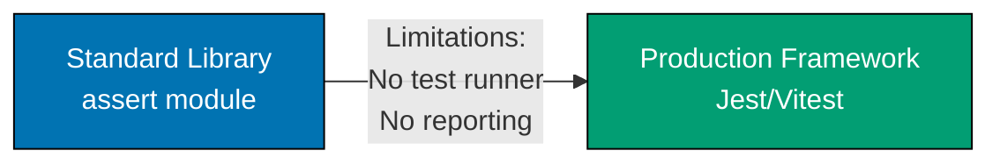

**Ready to build production TypeScript systems?** This In-the-Field guide teaches production patterns by following the **Standard Library First** principle, ensuring you understand fundamentals before frameworks.

## What Is "In the Field"?

In-the-Field guides teach production TypeScript development through real-world implementation patterns. Unlike by-example tutorials that achieve 95% language coverage, these guides focus on specific production scenarios using industry-standard frameworks, libraries, and enterprise patterns.

**Key distinction**: By-example taught TypeScript through code. In-the-field teaches **how to build production systems** with TypeScript.

## Standard Library First Philosophy

TypeScript builds on JavaScript's standard library while adding type safety. The progression teaches built-in capabilities before introducing frameworks:

- **Testing** (`assert`) - Built-in testing before Jest/Vitest
- **HTTP servers** (`http` module) - Node.js built-ins before Express/Fastify
- **Build tools** (`tsc` compiler) - TypeScript compiler before esbuild/Vite
- **Logging** (`console`) - Console methods before Winston/Pino
- **JSON handling** (native `JSON`) - Built-in parsing before validation libraries

**Our Approach**: Learn the standard library first, understand when it's insufficient, then adopt frameworks with full knowledge of trade-offs.

### Why This Matters

1. **Foundation understanding** - Know primitives before abstractions
2. **Informed framework selection** - Understand problems frameworks solve
3. **Problem awareness** - See manual implementation complexity
4. **Framework independence** - Core knowledge transfers across tools
5. **Trade-off comprehension** - Recognize when frameworks add value vs overhead
6. **Debugging capability** - Understand what frameworks do under the hood
7. **Optimization skills** - Recognize performance bottlenecks and optimization opportunities
8. **Production disaster prevention** - Avoid memory leaks, type issues, performance problems from framework misuse

## Guide Organization

The 33 guides are organized into 7 categories:

### 1. Foundation (5 guides)

Core development tooling and practices:

- [Test Driven Development](/en/learn/software-engineering/programming-languages/typescript/in-the-field/test-driven-development) - assert → Jest/Vitest/Mocha
- [Behavior Driven Development](/en/learn/software-engineering/programming-languages/typescript/in-the-field/behavior-driven-development) - Cucumber.js, BDD patterns
- [Build Tools](/en/learn/software-engineering/programming-languages/typescript/in-the-field/build-tools) - tsc → esbuild/Vite/Webpack
- [Linting And Formatting](/en/learn/software-engineering/programming-languages/typescript/in-the-field/linting-and-formatting) - ESLint + Prettier
- [Logging](/en/learn/software-engineering/programming-languages/typescript/in-the-field/logging) - console.log → Winston/Pino

### 2. Quality & Principles (5 guides)

Software quality and design principles:

- [Design Principles](/en/learn/software-engineering/programming-languages/typescript/in-the-field/design-principles) - SOLID in TypeScript
- [Best Practices](/en/learn/software-engineering/programming-languages/typescript/in-the-field/best-practices) - Production patterns
- [Type Safety](/en/learn/software-engineering/programming-languages/typescript/in-the-field/type-safety) - Leveraging TypeScript's type system
- [Functional Programming](/en/learn/software-engineering/programming-languages/typescript/in-the-field/functional-programming) - fp-ts, immutability
- [Anti Patterns](/en/learn/software-engineering/programming-languages/typescript/in-the-field/anti-patterns) - Common TypeScript mistakes

### 3. Security (3 guides)

Authentication, authorization, and security practices:

- [Authentication](/en/learn/software-engineering/programming-languages/typescript/in-the-field/authentication) - Basic Auth → JWT → OAuth2/OIDC
- [Security Practices](/en/learn/software-engineering/programming-languages/typescript/in-the-field/security-practices) - Input validation, OWASP, XSS/CSRF
- [Configuration](/en/learn/software-engineering/programming-languages/typescript/in-the-field/configuration) - hardcoded → dotenv → config services

### 4. Data Management (5 guides)

Database and state management:

- [Sql Database](/en/learn/software-engineering/programming-languages/typescript/in-the-field/sql-database) - raw queries → TypeORM/Prisma
- [Nosql Databases](/en/learn/software-engineering/programming-languages/typescript/in-the-field/nosql-databases) - MongoDB native → Mongoose
- [Caching](/en/learn/software-engineering/programming-languages/typescript/in-the-field/caching) - Map → node-cache → Redis
- [State Management](/en/learn/software-engineering/programming-languages/typescript/in-the-field/state-management) - plain objects → Redux/MobX/Zustand
- [Dependency Injection](/en/learn/software-engineering/programming-languages/typescript/in-the-field/dependency-injection) - manual → InversifyJS/TSyringe

### 5. Integration (5 guides)

API and service integration:

- [Rest Api](/en/learn/software-engineering/programming-languages/typescript/in-the-field/rest-api) - http → Express/Fastify/Nest.js
- [Graphql](/en/learn/software-engineering/programming-languages/typescript/in-the-field/graphql) - GraphQL.js → Apollo Server
- [Messaging](/en/learn/software-engineering/programming-languages/typescript/in-the-field/messaging) - EventEmitter → Bull/Kafka
- [Json And Api Integration](/en/learn/software-engineering/programming-languages/typescript/in-the-field/json-and-api-integration) - JSON parsing, HTTP clients
- [Web Services](/en/learn/software-engineering/programming-languages/typescript/in-the-field/web-services) - Building production APIs

### 6. Advanced Patterns (5 guides)

Advanced programming patterns and performance:

- [Reactive Programming](/en/learn/software-engineering/programming-languages/typescript/in-the-field/reactive-programming) - Promises → RxJS
- [Concurrency And Parallelism](/en/learn/software-engineering/programming-languages/typescript/in-the-field/concurrency-and-parallelism) - async patterns, worker threads
- [Performance](/en/learn/software-engineering/programming-languages/typescript/in-the-field/performance) - Profiling, V8 optimization, memory
- [Resilience Patterns](/en/learn/software-engineering/programming-languages/typescript/in-the-field/resilience-patterns) - Retry, circuit breaker, fallback
- [Domain Driven Design](/en/learn/software-engineering/programming-languages/typescript/in-the-field/domain-driven-design) - DDD tactical patterns

### 7. DevOps (5 guides)

Deployment, monitoring, and cloud patterns:

- [Docker And Kubernetes](/en/learn/software-engineering/programming-languages/typescript/in-the-field/docker-and-kubernetes) - Container deployment
- [Ci Cd](/en/learn/software-engineering/programming-languages/typescript/in-the-field/ci-cd) - GitHub Actions/GitLab CI
- [Cloud Native Patterns](/en/learn/software-engineering/programming-languages/typescript/in-the-field/cloud-native-patterns) - 12-factor app, microservices
- [Cli App](/en/learn/software-engineering/programming-languages/typescript/in-the-field/cli-app) - Commander.js, Oclif
- [Monitoring](/en/learn/software-engineering/programming-languages/typescript/in-the-field/monitoring) - console → Prometheus/Grafana/OpenTelemetry

## Progressive Learning Path

Each guide follows this structure:

1. **Why It Matters** - Production context and real-world scenarios
2. **Standard Library First** - Built-in approach with annotated examples
3. **Limitations** - When standard library insufficient for production
4. **Production Framework** - Industry-standard solutions with examples
5. **Trade-offs** - Clear comparison tables (complexity, learning curve, maintenance)
6. **Best Practices** - Actionable guidance with code examples

### Example Progression (Testing)



**Standard Library**: `assert` module provides basic assertions, but no test organization or reporting.

**Limitations**: No test discovery, no parallel execution, no coverage reporting, manual test invocation.

**Production Framework**: Jest (batteries-included), Vitest (Vite integration), or Mocha (flexible) provide test runners, assertions, mocking, and coverage.

**Trade-off**: Learn `assert` patterns first to understand what testing frameworks abstract away.

## Code Annotation Standard

All code examples maintain **1.0-2.25 annotation density** (comment lines per code line) using `// =>` notation to explain values, states, and outputs.

**Example**:

```typescript
import assert from "assert";
// => Import assert from Node.js standard library
// => No external dependencies required

function add(a: number, b: number): number {
  // => Simple addition function
  // => Takes two numbers, returns their sum
  return a + b;
  // => Returns numeric result
}

assert.strictEqual(add(2, 3), 5);
// => assert.strictEqual checks exact equality (===)
// => Throws AssertionError if 2 + 3 !== 5
// => No output if assertion passes
```

**Density**: 5 code lines, 8 annotation lines = 1.6 density (within 1.0-2.25 target)

## Getting the Most from In-the-Field Guides

1. **Complete by-example first**: Foundation knowledge essential for production patterns
2. **Follow standard library first**: Resist jumping directly to frameworks
3. **Understand trade-offs**: Not every project needs every framework
4. **Practice progressively**: Start with standard library, add frameworks when justified
5. **Compare approaches**: Use comparison tables to inform framework selection

## Related Resources

- [By Example](/en/learn/software-engineering/programming-languages/typescript/by-example) - Code-first tutorials
- [Overview](/en/learn/software-engineering/programming-languages/typescript/overview) - Complete TypeScript learning path
