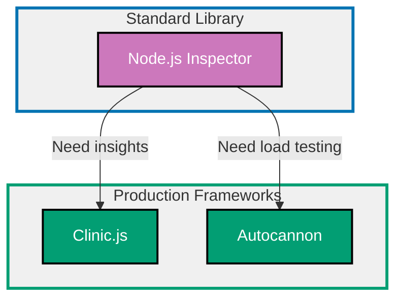

## Why Performance Matters

Performance optimization ensures applications respond quickly, handle high throughput, use resources efficiently, and provide excellent user experience by minimizing latency, maximizing throughput, and preventing resource exhaustion.

**Core Benefits**:

- **Lower latency**: Faster response times improve user experience
- **Higher throughput**: Handle more concurrent requests with same resources
- **Reduced costs**: Fewer servers needed for same workload
- **Better scalability**: Handle traffic spikes without degradation
- **Resource efficiency**: Minimize CPU, memory, and I/O usage
- **Competitive advantage**: Speed is a feature users value

**Problem**: Node.js applications can suffer from slow code, memory leaks, event loop blocking, and inefficient I/O. Built-in tools provide basic profiling but lack comprehensive analysis and actionable insights.

**Solution**: Use performance profiling tools (Node.js inspector, Clinic.js) to identify bottlenecks, load testing tools (Autocannon) to measure throughput, and optimization techniques to improve efficiency.

## Standard Library First: Node.js Inspector

Node.js provides built-in profiling with the inspector protocol without external dependencies.

### Basic CPU Profiling

The inspector protocol enables CPU and heap profiling via Chrome DevTools.

**Pattern**:

```bash
# Start Node.js with inspector
node --inspect app.ts
# => Debugger listening on ws://127.0.0.1:9229/...
# => Open chrome://inspect in Chrome
# => Click "inspect" to open DevTools

# Or start with --inspect-brk (break on first line)
node --inspect-brk app.ts
# => Pauses execution until debugger attached
# => Useful for profiling startup performance
```

**Programmatic profiling**:

```typescript
import { Session } from "inspector";
import { promisify } from "util";
import fs from "fs";
// => Import built-in modules
// => No external dependencies

const session = new Session();
// => Create inspector session
// => Provides access to Chrome DevTools Protocol

session.connect();
// => Connect to inspector

const post = promisify(session.post.bind(session));
// => Promisify session.post for async/await

async function startProfiling(): Promise<void> {
  // => Start CPU profiler
  await post("Profiler.enable");
  // => Enable profiler
  await post("Profiler.start");
  // => Start collecting CPU profile
  console.log("Profiling started");
}

async function stopProfiling(filename: string): Promise<void> {
  // => Stop CPU profiler and save profile
  const { profile } = await post("Profiler.stop");
  // => Stop profiling, get profile data
  // => profile contains CPU profile in DevTools format

  fs.writeFileSync(filename, JSON.stringify(profile));
  // => Write profile to file
  console.log(`Profile saved to ${filename}`);
  console.log(`Open chrome://devtools/devtools_app.html and load profile`);
}

// Usage
await startProfiling();

// Run code to profile
for (let i = 0; i < 1000000; i++) {
  Math.sqrt(i);
  // => CPU-intensive operation
}

await stopProfiling("cpu-profile.cpuprofile");
// => Save profile
// => Load in Chrome DevTools Performance tab
```

**Heap snapshot** (memory profiling):

```typescript
async function takeHeapSnapshot(filename: string): Promise<void> {
  // => Capture heap snapshot
  const session = new Session();
  session.connect();

  const post = promisify(session.post.bind(session));

  await post("HeapProfiler.enable");
  // => Enable heap profiler

  const { profile } = await post("HeapProfiler.takeHeapSnapshot", {
    reportProgress: false,
  });
  // => Take snapshot
  // => Returns heap snapshot data

  fs.writeFileSync(filename, JSON.stringify(profile));
  console.log(`Heap snapshot saved to ${filename}`);
  console.log(`Open Chrome DevTools Memory tab and load snapshot`);
}

// Usage
await takeHeapSnapshot("heap-snapshot.heapsnapshot");
// => Analyze memory usage in Chrome DevTools
// => Find memory leaks, large objects
```

**Performance timing**:

```typescript
import { performance, PerformanceObserver } from "perf_hooks";
// => Built-in performance measurement

function measureOperation(name: string, fn: () => void): void {
  // => Measure operation performance
  performance.mark(`${name}-start`);
  // => Mark start time

  fn();
  // => Execute operation

  performance.mark(`${name}-end`);
  // => Mark end time

  performance.measure(name, `${name}-start`, `${name}-end`);
  // => Calculate duration
  // => Creates PerformanceEntry

  const measure = performance.getEntriesByName(name)[0];
  console.log(`${name}: ${measure.duration.toFixed(2)}ms`);
  // => Log duration
}

// Usage
measureOperation("array-sort", () => {
  const arr = Array.from({ length: 100000 }, () => Math.random());
  arr.sort();
});
// => Output: array-sort: 45.67ms

measureOperation("object-creation", () => {
  for (let i = 0; i < 100000; i++) {
    const obj = { id: i, name: `User ${i}` };
  }
});
// => Output: object-creation: 12.34ms
```

**Event loop monitoring**:

```typescript
import { performance } from "perf_hooks";

function monitorEventLoop(): void {
  // => Monitor event loop lag
  let lastCheck = performance.now();

  setInterval(() => {
    const now = performance.now();
    const lag = now - lastCheck - 100;
    // => Expected: 100ms interval
    // => Lag: difference from expected

    if (lag > 10) {
      // => Event loop blocked for >10ms
      console.warn(`Event loop lag: ${lag.toFixed(2)}ms`);
      // => Indicates blocking operations
    }

    lastCheck = now;
  }, 100);
  // => Check every 100ms
}

// Usage
monitorEventLoop();
// => Warns when event loop blocked
// => Indicates need for optimization or Worker threads
```

**Limitations for production**:

- **Manual analysis**: Must interpret profiles manually
- **No actionable insights**: Requires expertise to identify issues
- **Chrome DevTools dependency**: Must load profiles in browser
- **Limited visualization**: No flamegraphs or advanced views
- **No load testing**: Cannot measure throughput under load
- **No recommendations**: Doesn't suggest optimizations

**When standard library suffices**:

- Learning performance fundamentals
- One-off debugging sessions
- Simple CPU or memory profiling
- No production monitoring needed

## Production Framework: Clinic.js

Clinic.js provides automated performance analysis with actionable insights, flamegraphs, and production-ready profiling.

### Installation and Basic Setup

```bash
npm install -g clinic
# => Install Clinic.js globally
# => Includes Doctor, Bubbleprof, Flame, HeapProfiler
# => Comprehensive performance toolkit
```

**Clinic.js components**:

- **Clinic Doctor**: Diagnoses event loop, I/O, and CPU issues
- **Clinic Bubbleprof**: Async operations analysis (bubbles)
- **Clinic Flame**: CPU flamegraphs (call stack visualization)
- **Clinic HeapProfiler**: Memory allocation tracking

### Clinic Doctor (Health Check)

Diagnoses common performance issues automatically.

**Pattern**:

```bash
clinic doctor -- node app.ts
# => Run app with Doctor
# => Generates health report
# => Open browser automatically with analysis

# With options
clinic doctor --on-port 'autocannon http://localhost:3000' -- node app.ts
# => Run load test when server starts
# => Measures performance under load
```

**Example output**:

```
Clinic Doctor detected issues:
1. Event Loop Delay: High (>10ms average)
   => Blocking operations detected
   => Recommendation: Offload CPU work to Worker threads

2. CPU Usage: 100% sustained
   => CPU bottleneck detected
   => Recommendation: Profile with Clinic Flame

3. I/O: Low latency (<1ms)
   => I/O not the bottleneck
   => Focus on CPU optimization
```

**Programmatic Doctor**:

```typescript
import clinic from "clinic";
// => Import Clinic.js

const doctor = clinic.doctor();
// => Create Doctor instance

doctor.collect(["node", "app.ts"], (err, filepath) => {
  // => Collect performance data
  if (err) throw err;

  doctor.visualize(filepath, `${filepath}.html`, (err) => {
    // => Generate HTML report
    if (err) throw err;
    console.log(`Report generated: ${filepath}.html`);
  });
});
```

### Clinic Flame (CPU Flamegraphs)

Visualizes CPU usage with flamegraph for identifying hot paths.

**Pattern**:

```bash
clinic flame -- node app.ts
# => Run app with Flame profiler
# => Generates CPU flamegraph
# => Shows function call hierarchy and CPU time

# With load test
clinic flame --on-port 'autocannon -c 100 -d 10 http://localhost:3000' -- node app.ts
# => Profile under realistic load
# => 100 concurrent connections for 10 seconds
```

**Reading flamegraphs**:

- **X-axis**: Alphabetical order (NOT time)
- **Y-axis**: Call stack depth (top = innermost function)
- **Width**: Proportional to CPU time (wider = more time)
- **Color**: Function type (JavaScript, V8, C++)

**Example interpretation**:

```
[app.ts:handleRequest]  80% width
  [database.ts:query]   60% width
    [pg:execute]        50% width
  [utils.ts:validate]   20% width
```

=> 80% CPU time in handleRequest
=> 60% in database query (hotspot)
=> 20% in validation (less critical)
=> Optimize database query first

### Clinic Bubbleprof (Async Operations)

Analyzes async operations and identifies async bottlenecks.

**Pattern**:

```bash
clinic bubbleprof -- node app.ts
# => Run app with Bubbleprof
# => Generates async operations visualization
# => Shows async delays and dependencies

# With load test
clinic bubbleprof --on-port 'autocannon http://localhost:3000' -- node app.ts
```

**Bubble interpretation**:

- **Bubble size**: Time spent in async operation
- **Bubble color**: Operation type (I/O, timer, promise)
- **Connections**: Async dependencies

**Example findings**:

```
Large bubbles detected:
1. fs.readFile (500ms) - Sequential file reads
   => Recommendation: Use Promise.all for parallel reads

2. setTimeout (1000ms) - Unnecessary delays
   => Recommendation: Remove or reduce timeout

3. database.query (200ms) - N+1 query pattern
   => Recommendation: Use batch queries or joins
```

### Clinic HeapProfiler (Memory Allocation)

Tracks memory allocations over time to find memory leaks.

**Pattern**:

```bash
clinic heapprofiler -- node app.ts
# => Run app with HeapProfiler
# => Tracks memory allocations
# => Identifies memory leaks

# With duration
clinic heapprofiler --duration 60000 -- node app.ts
# => Profile for 60 seconds
# => Capture allocation patterns
```

**Example findings**:

```
Memory allocation hotspots:
1. Array allocations: 450MB (buffer.ts:createBuffer)
   => Excessive array creation in loop
   => Recommendation: Reuse buffers or use Buffer pool

2. Object allocations: 200MB (user.ts:User)
   => User objects not garbage collected
   => Recommendation: Check for memory leaks (listeners, closures)
```

### Production Benefits

- **Automated analysis**: AI-powered insights and recommendations
- **Flamegraphs**: Visual CPU profiling (easy to understand)
- **Async visualization**: Identify async bottlenecks
- **Memory tracking**: Find memory leaks and allocation hotspots
- **Load testing integration**: Profile under realistic conditions
- **HTML reports**: Share with team, archive for comparison

### Trade-offs

- **Overhead**: Profiling adds CPU and memory overhead
- **Production use**: Not recommended for production (use sampling)
- **Learning curve**: Interpreting flamegraphs requires practice

### When to use Clinic.js

- Diagnosing performance issues in development
- Pre-production performance testing
- Identifying CPU or memory bottlenecks
- Optimizing async operations
- Team needs shareable reports

## Production Framework: Autocannon (Load Testing)

Autocannon is a fast HTTP load testing tool for measuring throughput and latency under load.

### Installation and Basic Setup

```bash
npm install -g autocannon
# => Install Autocannon globally
# => Fast load testing tool
# => Written in Node.js (no external dependencies)
```

**Basic load test**:

```bash
autocannon http://localhost:3000
# => Default: 10 connections for 10 seconds
# => Measures requests/sec, latency, throughput

# Custom configuration
autocannon -c 100 -d 30 http://localhost:3000
# => -c 100: 100 concurrent connections
# => -d 30: 30 seconds duration

# With request body
autocannon -c 100 -d 10 -m POST -H "Content-Type: application/json" -b '{"name":"test"}' http://localhost:3000/api/users
# => POST request with JSON body
```

**Example output**:

```
Running 30s test @ http://localhost:3000
100 connections

┌─────────┬──────┬──────┬───────┬──────┬─────────┬─────────┬──────────┐
│ Stat    │ 2.5% │ 50%  │ 97.5% │ 99%  │ Avg     │ Stdev   │ Max      │
├─────────┼──────┼──────┼───────┼──────┼─────────┼─────────┼──────────┤
│ Latency │ 2ms  │ 5ms  │ 15ms  │ 20ms │ 6.2ms   │ 4.1ms   │ 45ms     │
└─────────┴──────┴──────┴───────┴──────┴─────────┴─────────┴──────────┘
┌───────────┬─────────┬─────────┬─────────┬─────────┬──────────┬─────────┬─────────┐
│ Stat      │ 1%      │ 2.5%    │ 50%     │ 97.5%   │ Avg      │ Stdev   │ Min     │
├───────────┼─────────┼─────────┼─────────┼─────────┼──────────┼─────────┼─────────┤
│ Req/Sec   │ 15000   │ 15000   │ 16500   │ 17000   │ 16200    │ 500     │ 15000   │
└───────────┴─────────┴─────────┴─────────┴─────────┴──────────┴─────────┴─────────┘

Avg: 16200 req/sec
Total: 486000 requests in 30 seconds
```

**Programmatic load testing**:

```typescript
import autocannon from "autocannon";
// => Import Autocannon library

const result = await autocannon({
  // => Run load test
  url: "http://localhost:3000",
  // => Target URL
  connections: 100,
  // => Concurrent connections
  duration: 30,
  // => Test duration (seconds)
  pipelining: 1,
  // => HTTP pipelining factor
});

console.log("Load test results:");
console.log(`  Requests/sec: ${result.requests.average}`);
console.log(`  Latency P50: ${result.latency.p50}ms`);
console.log(`  Latency P99: ${result.latency.p99}ms`);
console.log(`  Throughput: ${result.throughput.average} bytes/sec`);
console.log(`  Total requests: ${result.requests.total}`);
console.log(`  Errors: ${result.errors}`);
```

**Continuous load testing** (progressive load):

```typescript
async function progressiveLoadTest(url: string, maxConnections: number = 1000, step: number = 100): Promise<void> {
  // => Test with increasing load
  for (let connections = step; connections <= maxConnections; connections += step) {
    console.log(`\nTesting with ${connections} connections...`);

    const result = await autocannon({
      url,
      connections,
      duration: 10,
    });

    console.log(`  Requests/sec: ${result.requests.average}`);
    console.log(`  Latency P99: ${result.latency.p99}ms`);
    console.log(`  Errors: ${result.errors}`);

    if (result.errors > 0 || result.latency.p99 > 100) {
      // => Degradation detected
      console.warn(`\n⚠️  Performance degradation at ${connections} connections`);
      console.warn(`  P99 latency: ${result.latency.p99}ms (threshold: 100ms)`);
      console.warn(`  Errors: ${result.errors}`);
      break;
      // => Stop test (found capacity limit)
    }
  }
}

// Usage
await progressiveLoadTest("http://localhost:3000", 1000, 100);
// => Test 100, 200, 300, ... connections
// => Find capacity limit
```

### Comparing Optimizations

Measure performance impact of optimizations.

**Pattern**:

```typescript
async function benchmark(name: string, url: string): Promise<number> {
  // => Run benchmark and return avg req/sec
  console.log(`\nBenchmarking: ${name}`);

  const result = await autocannon({
    url,
    connections: 100,
    duration: 30,
  });

  const reqPerSec = result.requests.average;
  console.log(`  ${reqPerSec.toFixed(0)} req/sec`);
  console.log(`  P99 latency: ${result.latency.p99}ms`);

  return reqPerSec;
}

// Baseline
const baseline = await benchmark("Baseline", "http://localhost:3000");

// After optimization 1
const optimized1 = await benchmark("With caching", "http://localhost:3000");

// After optimization 2
const optimized2 = await benchmark("With connection pooling", "http://localhost:3000");

// Compare results
console.log("\n=== Performance Comparison ===");
console.log(`Baseline:               ${baseline.toFixed(0)} req/sec`);
console.log(
  `With caching:           ${optimized1.toFixed(0)} req/sec (+${(((optimized1 - baseline) / baseline) * 100).toFixed(1)}%)`,
);
console.log(
  `With connection pooling: ${optimized2.toFixed(0)} req/sec (+${(((optimized2 - baseline) / baseline) * 100).toFixed(1)}%)`,
);
```

### Production Benefits

- **Fast**: Measures 10,000+ req/sec per test
- **Accurate**: Low overhead compared to alternatives
- **Programmable**: API for automation and CI/CD
- **Latency percentiles**: P50, P95, P99 metrics
- **Throughput**: Bytes/sec measurement
- **HTTP/2 support**: Modern protocol testing

### Trade-offs

- **Single server**: Generates load from one machine
- **HTTP only**: Cannot test other protocols (WebSocket, gRPC)
- **Limited scenarios**: Simple request/response patterns

### When to use Autocannon

- Measuring HTTP API throughput
- Load testing before production deployment
- Comparing optimization impact
- CI/CD performance regression testing
- Capacity planning (find server limits)

## Performance Tool Progression Diagram



## V8 Optimization Techniques

### Hidden Classes and Inline Caches

V8 optimizes objects with consistent structure.

**Pattern**:

```typescript
// Bad: Dynamic property addition (deoptimization)
class User {
  constructor(name: string) {
    this.name = name;
    // => Hidden class 1 (only 'name')
  }
}

const user = new User("Alice");
user.email = "alice@example.com";
// => Hidden class 2 (added 'email')
// => V8 cannot optimize (structure changed)

// Good: Consistent structure
class User {
  name: string;
  email: string;
  // => TypeScript enforces consistent structure

  constructor(name: string, email: string = "") {
    this.name = name;
    this.email = email;
    // => Hidden class consistent
    // => V8 can optimize (inline caches)
  }
}

const user = new User("Alice", "alice@example.com");
// => Same hidden class as other User instances
// => Optimized property access
```

### Array Performance

Arrays perform best with consistent element types.

**Pattern**:

```typescript
// Bad: Mixed types (polymorphic)
const mixed = [1, "two", { three: 3 }, null];
// => V8 cannot optimize (mixed types)
// => Slower element access

// Good: Monomorphic (single type)
const numbers: number[] = [1, 2, 3, 4];
// => V8 optimizes (all numbers)
// => Fast element access

// Bad: Holes in array (sparse)
const sparse = new Array(1000);
sparse[0] = 1;
sparse[999] = 2;
// => Most elements undefined (holes)
// => V8 treats as hash table (slow)

// Good: Dense array (no holes)
const dense = Array.from({ length: 1000 }, (_, i) => i);
// => All elements initialized
// => V8 optimizes as packed array (fast)
```

### Function Optimization

Small, monomorphic functions optimize best.

**Pattern**:

```typescript
// Bad: Large function (hard to optimize)
function processUser(user: any) {
  // => 200 lines of code
  // => Multiple code paths
  // => Hard for V8 to optimize
}

// Good: Small, focused functions
function validateUser(user: User): boolean {
  // => Single responsibility
  // => Easy to optimize
  return user.name.length > 0 && user.email.includes("@");
}

function transformUser(user: User): PublicUser {
  // => Small, focused
  return { id: user.id, name: user.name };
}

// Bad: Polymorphic (multiple input types)
function process(input: string | number | object) {
  // => V8 generates separate code for each type
  // => Slower due to type checks
}

// Good: Monomorphic (single input type)
function processString(input: string) {
  // => V8 optimizes for strings only
  // => Fast execution
}

function processNumber(input: number) {
  // => Separate function for numbers
  // => Each optimized independently
}
```

### Try-Catch Performance

Try-catch blocks prevent optimization of entire function.

**Pattern**:

```typescript
// Bad: Try-catch in hot path
function processItem(item: Item): Result {
  try {
    // => Entire function deoptimized
    return expensiveOperation(item);
  } catch (error) {
    return defaultResult;
  }
}

// Good: Isolate try-catch
function processItem(item: Item): Result {
  return safeExpensiveOperation(item);
  // => Hot path without try-catch
}

function safeExpensiveOperation(item: Item): Result {
  // => Try-catch isolated to small function
  try {
    return expensiveOperation(item);
  } catch (error) {
    return defaultResult;
  }
}
```

## Memory Management Best Practices

### Avoid Memory Leaks

Common patterns that cause memory leaks.

**Pattern**:

```typescript
// Bad: Event listener not removed
class Component {
  constructor() {
    emitter.on("data", (data) => {
      this.handleData(data);
      // => Closure captures 'this'
      // => Component never garbage collected
    });
  }
  // Missing cleanup method
}

// Good: Remove event listeners
class Component {
  private handleDataBound = this.handleData.bind(this);
  // => Store bound function

  constructor() {
    emitter.on("data", this.handleDataBound);
    // => Use bound function (can remove later)
  }

  destroy() {
    emitter.off("data", this.handleDataBound);
    // => Remove listener
    // => Component can be garbage collected
  }

  private handleData(data: any) {
    // => Handle data
  }
}

// Bad: Timer not cleared
function startPolling() {
  setInterval(() => {
    fetchData();
    // => Runs forever (memory leak)
  }, 1000);
}

// Good: Clear timer
function startPolling(): () => void {
  const intervalId = setInterval(() => {
    fetchData();
  }, 1000);

  return () => {
    clearInterval(intervalId);
    // => Cleanup function
  };
}

const stopPolling = startPolling();
// Later: stopPolling()
```

### Object Pooling

Reuse objects to reduce garbage collection pressure.

**Pattern**:

```typescript
class ObjectPool<T> {
  // => Pool of reusable objects
  private pool: T[] = [];
  // => Available objects
  private factory: () => T;
  // => Function to create new objects
  private reset: (obj: T) => void;
  // => Function to reset object state

  constructor(factory: () => T, reset: (obj: T) => void, initialSize: number = 10) {
    this.factory = factory;
    this.reset = reset;

    // Pre-create objects
    for (let i = 0; i < initialSize; i++) {
      this.pool.push(factory());
    }
  }

  acquire(): T {
    // => Get object from pool
    if (this.pool.length > 0) {
      return this.pool.pop()!;
      // => Reuse existing object
    }
    return this.factory();
    // => Create new object if pool empty
  }

  release(obj: T): void {
    // => Return object to pool
    this.reset(obj);
    // => Reset to initial state
    this.pool.push(obj);
    // => Add to pool for reuse
  }
}

// Usage: Buffer pool
const bufferPool = new ObjectPool(
  () => Buffer.allocUnsafe(1024),
  // => Create 1KB buffer
  (buf) => buf.fill(0),
  // => Reset buffer (fill with zeros)
  100,
  // => Initial pool size: 100 buffers
);

function processData(data: string): Buffer {
  const buffer = bufferPool.acquire();
  // => Get buffer from pool (no allocation)

  buffer.write(data);
  // => Use buffer

  // Later: return to pool
  bufferPool.release(buffer);
  // => Reuse for next operation

  return buffer;
}

// Benefit: Reduces garbage collection (reuses buffers)
```

### Weak References for Caches

Use WeakMap for caches that don't prevent garbage collection.

**Pattern**:

```typescript
// Bad: Strong references (memory leak)
const cache = new Map<object, any>();

function cacheResult(obj: object, result: any) {
  cache.set(obj, result);
  // => Prevents obj from being garbage collected
  // => Cache grows indefinitely
}

// Good: Weak references (allows GC)
const cache = new WeakMap<object, any>();
// => WeakMap doesn't prevent garbage collection

function cacheResult(obj: object, result: any) {
  cache.set(obj, result);
  // => Obj can be garbage collected when no other references
  // => Cache entry automatically removed
}

// Example: Cache computed values
const computeCache = new WeakMap<User, ComputedValue>();

function getComputedValue(user: User): ComputedValue {
  let cached = computeCache.get(user);

  if (!cached) {
    cached = expensiveComputation(user);
    computeCache.set(user, cached);
  }

  return cached;
}

// When 'user' is no longer referenced elsewhere:
// - Garbage collector frees 'user'
// - WeakMap entry automatically removed
// - No memory leak
```

## Production Best Practices

### Performance Budget

Set measurable performance targets.

**Pattern**:

```typescript
interface PerformanceBudget {
  latencyP99Ms: number;
  // => Maximum P99 latency
  throughputReqPerSec: number;
  // => Minimum throughput
  memoryUsageMB: number;
  // => Maximum memory usage
  cpuPercentage: number;
  // => Maximum CPU usage
}

const budget: PerformanceBudget = {
  latencyP99Ms: 100,
  // => 100ms P99 latency
  throughputReqPerSec: 10000,
  // => 10k req/sec minimum
  memoryUsageMB: 512,
  // => 512MB max memory
  cpuPercentage: 70,
  // => 70% max CPU
};

async function validatePerformanceBudget(url: string): Promise<boolean> {
  // => Test against budget
  const result = await autocannon({
    url,
    connections: 100,
    duration: 30,
  });

  const passed =
    result.latency.p99 <= budget.latencyP99Ms &&
    result.requests.average >= budget.throughputReqPerSec &&
    result.errors === 0;

  if (!passed) {
    console.error("❌ Performance budget FAILED");
    console.error(`  P99 latency: ${result.latency.p99}ms (budget: ${budget.latencyP99Ms}ms)`);
    console.error(`  Throughput: ${result.requests.average} req/sec (budget: ${budget.throughputReqPerSec} req/sec)`);
  } else {
    console.log("✅ Performance budget PASSED");
  }

  return passed;
}

// CI/CD integration
const passed = await validatePerformanceBudget("http://localhost:3000");
if (!passed) {
  process.exit(1);
  // => Fail build if budget not met
}
```

### Continuous Performance Monitoring

Track performance over time in production.

**Pattern**:

```typescript
import { performance } from "perf_hooks";

class PerformanceMonitor {
  private metrics: Map<string, number[]> = new Map();
  // => Store metric history

  recordLatency(operation: string, durationMs: number): void {
    // => Record operation latency
    if (!this.metrics.has(operation)) {
      this.metrics.set(operation, []);
    }
    this.metrics.get(operation)!.push(durationMs);
  }

  getPercentile(operation: string, percentile: number): number {
    // => Calculate percentile (P50, P95, P99)
    const values = this.metrics.get(operation) || [];
    if (values.length === 0) return 0;

    const sorted = values.sort((a, b) => a - b);
    const index = Math.ceil((percentile / 100) * sorted.length) - 1;
    return sorted[index];
  }

  async measureAsync<T>(operation: string, fn: () => Promise<T>): Promise<T> {
    // => Measure async operation
    const start = performance.now();

    try {
      const result = await fn();
      const duration = performance.now() - start;
      this.recordLatency(operation, duration);
      return result;
    } catch (error) {
      const duration = performance.now() - start;
      this.recordLatency(`${operation}:error`, duration);
      throw error;
    }
  }

  getReport(): string {
    // => Generate performance report
    let report = "Performance Report:\n";

    for (const [operation, values] of this.metrics.entries()) {
      const p50 = this.getPercentile(operation, 50);
      const p95 = this.getPercentile(operation, 95);
      const p99 = this.getPercentile(operation, 99);

      report += `\n${operation}:\n`;
      report += `  P50: ${p50.toFixed(2)}ms\n`;
      report += `  P95: ${p95.toFixed(2)}ms\n`;
      report += `  P99: ${p99.toFixed(2)}ms\n`;
      report += `  Count: ${values.length}\n`;
    }

    return report;
  }
}

// Usage
const monitor = new PerformanceMonitor();

app.get("/api/users/:id", async (req, res) => {
  const user = await monitor.measureAsync("fetchUser", () => fetchUser(req.params.id));
  // => Automatically measures latency

  res.json(user);
});

// Generate report every minute
setInterval(() => {
  console.log(monitor.getReport());
}, 60000);
```

## Trade-offs and When to Use Each

### Node.js Inspector (Standard Library)

**Use when**:

- Learning performance fundamentals
- Quick one-off profiling
- Chrome DevTools available
- No external tools allowed

**Avoid when**:

- Need automated analysis (Clinic.js better)
- Want flamegraphs (Clinic Flame easier)
- Production monitoring (overhead too high)

### Clinic.js (Production)

**Use when**:

- Diagnosing performance issues
- Need automated insights
- Want flamegraphs and visualizations
- Pre-production performance testing
- Team collaboration (HTML reports)

**Avoid when**:

- Production monitoring (overhead)
- Simple profiling (inspector sufficient)

### Autocannon (Production)

**Use when**:

- Load testing HTTP APIs
- Measuring throughput and latency
- Comparing optimization impact
- CI/CD performance tests
- Capacity planning

**Avoid when**:

- Need CPU/memory profiling (use Clinic.js)
- Testing other protocols (HTTP only)

## Common Pitfalls

### Pitfall 1: Premature Optimization

**Problem**: Optimizing before measuring impact.

**Solution**: Profile first, then optimize hotspots.

```typescript
// Bad: Optimize without profiling
function optimizedButUseless() {
  // => Optimized code that's called once
  // => Wasted effort (not a bottleneck)
}

// Good: Profile, identify hotspot, then optimize
// 1. Run Clinic Flame
// 2. Find function taking 80% of CPU
// 3. Optimize THAT function
```

### Pitfall 2: Blocking Event Loop

**Problem**: CPU-intensive operations block event loop.

**Solution**: Offload to Worker threads.

```typescript
// Bad: CPU-intensive in main thread
function hashPassword(password: string): string {
  // => bcrypt.hashSync (blocks for 100ms)
  // => Event loop blocked
}

// Good: Offload to Worker thread
async function hashPassword(password: string): Promise<string> {
  return await runWorker("./hash-worker.ts", password);
  // => Non-blocking (main thread free)
}
```

### Pitfall 3: Ignoring Memory Leaks

**Problem**: Memory grows indefinitely until crash.

**Solution**: Monitor heap size and investigate growth.

```typescript
// Monitor memory usage
setInterval(() => {
  const usage = process.memoryUsage();
  console.log(`Heap used: ${(usage.heapUsed / 1024 / 1024).toFixed(2)}MB`);

  if (usage.heapUsed > 500 * 1024 * 1024) {
    // => Heap exceeds 500MB
    console.error("❌ Possible memory leak detected");
    // => Take heap snapshot and investigate
  }
}, 60000);
```

### Pitfall 4: Not Testing Under Load

**Problem**: Performance issues only appear under load.

**Solution**: Load test before production deployment.

```typescript
// CI/CD load test
const result = await autocannon({
  url: "http://localhost:3000",
  connections: 100,
  duration: 30,
});

if (result.latency.p99 > 100 || result.errors > 0) {
  console.error("❌ Load test failed");
  process.exit(1);
}
```

## Summary

Performance optimization ensures applications respond quickly and handle high throughput. Standard library provides basic profiling, while production tools provide automated analysis, flamegraphs, and load testing.

**Progression path**:

1. **Start with Node.js inspector**: Learn profiling fundamentals
2. **Add Clinic.js**: Automated analysis and flamegraphs
3. **Load test with Autocannon**: Measure production throughput

**Production checklist**:

- ✅ Performance budget defined (latency, throughput, memory)
- ✅ Load testing in CI/CD (catch regressions)
- ✅ CPU profiling (identify hotspots with flamegraphs)
- ✅ Memory profiling (find leaks with heap snapshots)
- ✅ Event loop monitoring (detect blocking operations)
- ✅ V8 optimization (hidden classes, monomorphic arrays)
- ✅ Continuous monitoring (track production performance)

Choose performance tools based on need: Inspector for learning, Clinic.js for diagnosis, Autocannon for load testing.
