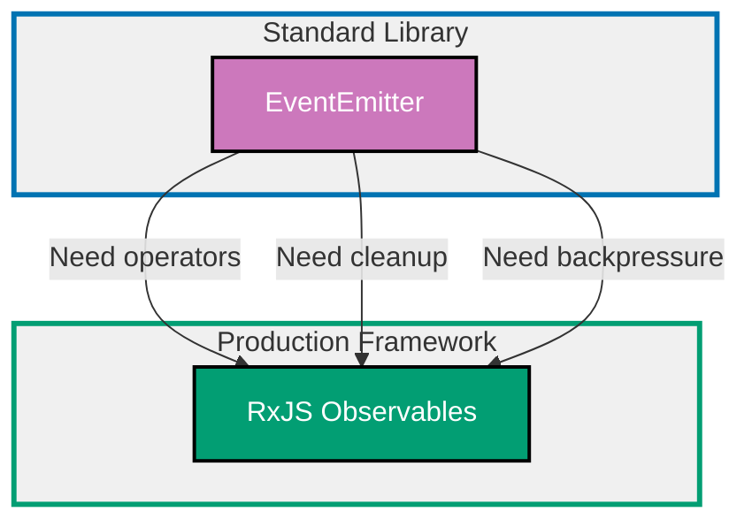

## Why Reactive Programming Matters

Reactive programming treats data as streams of events over time, enabling declarative composition of asynchronous operations with automatic error handling, backpressure management, and resource cleanup for complex event-driven systems.

**Core Benefits**:

- **Declarative composition**: Chain operators to transform event streams
- **Automatic resource cleanup**: Unsubscribe cleans up listeners and timers
- **Backpressure handling**: Manage fast producers with slow consumers
- **Error propagation**: Errors flow through operator chain automatically
- **Time-based operations**: Debounce, throttle, delay built-in
- **Unified API**: Same API for events, promises, timers, HTTP requests

**Problem**: EventEmitter requires manual cleanup, lacks composition operators, and has no backpressure handling. Promises handle single async values but not streams of events over time.

**Solution**: Use RxJS observables for event streams with declarative operators, automatic cleanup, and production patterns like retry, timeout, and error recovery.

## Standard Library First: EventEmitter

Node.js provides EventEmitter for basic event-driven programming without external dependencies.

### Basic EventEmitter Pattern

EventEmitter allows objects to emit named events and register listeners.

**Pattern**:

```typescript
import { EventEmitter } from "events";
// => Import built-in EventEmitter class
// => No external dependencies

const emitter = new EventEmitter();
// => Create event emitter instance
// => Can emit and listen to events

emitter.on("data", (value: number) => {
  // => Register event listener
  // => Called each time 'data' event emitted
  console.log("Received:", value);
  // => Output: Received: 10
});

emitter.emit("data", 10);
// => Emit event with data
// => All 'data' listeners called synchronously
// => Output: Received: 10

emitter.emit("data", 20);
// => Emit second event
// => Output: Received: 20

emitter.emit("data", 30);
// => Emit third event
// => Output: Received: 30
```

**Multiple listeners**:

```typescript
const emitter = new EventEmitter();

emitter.on("userLogin", (userId: string) => {
  // => First listener
  console.log(`Logging user ${userId} activity`);
});

emitter.on("userLogin", (userId: string) => {
  // => Second listener for same event
  console.log(`Sending welcome email to ${userId}`);
});

emitter.on("userLogin", (userId: string) => {
  // => Third listener
  console.log(`Updating user ${userId} last login timestamp`);
});

emitter.emit("userLogin", "user-123");
// => Output:
// Logging user user-123 activity
// Sending welcome email to user-123
// Updating user user-123 last login timestamp
// => All listeners called in registration order
```

**One-time listeners** (automatically removed):

```typescript
emitter.once("appStarted", () => {
  // => Listener called only once
  // => Automatically removed after first emission
  console.log("Application started");
});

emitter.emit("appStarted");
// => Output: Application started

emitter.emit("appStarted");
// => No output (listener already removed)
```

**Manual cleanup**:

```typescript
function onData(value: number) {
  console.log("Received:", value);
}

emitter.on("data", onData);
// => Register named listener

emitter.emit("data", 10);
// => Output: Received: 10

emitter.off("data", onData);
// => Remove specific listener
// => Must use same function reference

emitter.emit("data", 20);
// => No output (listener removed)

// Remove all listeners for event
emitter.removeAllListeners("data");
// => Removes ALL 'data' listeners
```

**Error handling**:

```typescript
emitter.on("error", (error: Error) => {
  // => Special 'error' event
  // => If not handled, throws and crashes process
  console.error("Error occurred:", error.message);
});

emitter.emit("error", new Error("Something went wrong"));
// => Output: Error occurred: Something went wrong
// => Error handled gracefully (no crash)

// Without error listener:
const unsafeEmitter = new EventEmitter();
unsafeEmitter.emit("error", new Error("Unhandled error"));
// => Throws error and crashes process
// => ALWAYS handle 'error' events in production
```

**Stream simulation** (manual composition):

```typescript
const source = new EventEmitter();
const transformed = new EventEmitter();
// => Two emitters to simulate pipeline

source.on("data", (value: number) => {
  // => Listen to source
  const doubled = value * 2;
  // => Transform: multiply by 2
  transformed.emit("data", doubled);
  // => Emit to next stage
});

transformed.on("data", (value: number) => {
  // => Listen to transformed
  console.log("Doubled:", value);
});

source.emit("data", 5);
// => Output: Doubled: 10

source.emit("data", 10);
// => Output: Doubled: 20

// Manual composition is verbose and error-prone
// No built-in operators for map, filter, reduce, etc.
```

**Limitations for production**:

- **Manual cleanup**: Must track and remove listeners (memory leaks)
- **No composition operators**: No map, filter, merge, debounce, etc.
- **No backpressure**: Fast producer overwhelms slow consumer
- **No error recovery**: Errors must be handled manually
- **No automatic unsubscribe**: Listeners remain until explicitly removed
- **Synchronous only**: Cannot handle async operations in pipeline
- **No time-based operators**: Must implement debounce/throttle manually

**When standard library suffices**:

- Simple pub/sub within single module
- No need for operator composition
- Low event frequency (no backpressure needed)
- Short-lived listeners (process lifetime)

## Production Framework: RxJS

RxJS provides powerful observables with declarative operators, automatic resource cleanup, and production patterns for complex event streams.

### Installation and Basic Setup

```bash
npm install rxjs
# => Install RxJS library
# => Industry standard for reactive programming
# => Used by Angular, TypeScript, Node.js ecosystem
```

**Basic observable creation**:

```typescript
import { Observable } from "rxjs";
// => Import Observable class
// => Core primitive for reactive programming

const observable = new Observable<number>((subscriber) => {
  // => Create observable with subscriber function
  // => subscriber has next(), error(), complete() methods
  subscriber.next(10);
  // => Emit value 10
  // => Synchronous emission

  subscriber.next(20);
  // => Emit value 20

  subscriber.next(30);
  // => Emit value 30

  subscriber.complete();
  // => Signal completion (no more values)
  // => Triggers completion callback in subscriber
});

observable.subscribe({
  // => Subscribe to observable
  // => Starts execution
  next: (value) => {
    // => Handle emitted values
    console.log("Value:", value);
    // => Output: Value: 10, Value: 20, Value: 30
  },
  error: (err) => {
    // => Handle errors
    console.error("Error:", err);
  },
  complete: () => {
    // => Handle completion
    console.log("Complete");
    // => Output: Complete
  },
});
```

**Observable from events** (EventEmitter conversion):

```typescript
import { fromEvent } from "rxjs";
// => Create observable from DOM/Node events

const emitter = new EventEmitter();

const observable = fromEvent<number>(emitter, "data");
// => Convert EventEmitter to Observable
// => Type-safe with generics

const subscription = observable.subscribe((value) => {
  // => Subscribe to event stream
  console.log("Received:", value);
});

emitter.emit("data", 10);
// => Output: Received: 10

emitter.emit("data", 20);
// => Output: Received: 20

subscription.unsubscribe();
// => Automatic cleanup
// => Removes EventEmitter listener
// => No memory leak

emitter.emit("data", 30);
// => No output (unsubscribed)
```

**Observable from Promise**:

```typescript
import { from } from "rxjs";
// => Convert Promise to Observable

const promise = fetch("https://api.example.com/users/123").then((r) => r.json());
// => Promise that resolves to User

const observable = from(promise);
// => Convert to Observable
// => Emits single value then completes

observable.subscribe({
  next: (user) => console.log("User:", user),
  // => Output: User: { id: 123, name: "Alice" }
  complete: () => console.log("Complete"),
  // => Output: Complete
});
```

### Declarative Operators

RxJS provides 100+ operators for transforming event streams declaratively.

**map** (transform values):

```typescript
import { of } from "rxjs";
import { map } from "rxjs/operators";
// => Import operators

const source = of(1, 2, 3, 4, 5);
// => Create observable from values
// => Emits 1, 2, 3, 4, 5 then completes

const doubled = source.pipe(
  // => pipe applies operators
  map((value) => value * 2),
  // => Transform each value
  // => Multiply by 2
);

doubled.subscribe((value) => console.log(value));
// => Output: 2, 4, 6, 8, 10
```

**filter** (select values):

```typescript
import { filter } from "rxjs/operators";

const source = of(1, 2, 3, 4, 5);

const evens = source.pipe(
  filter((value) => value % 2 === 0),
  // => Keep only even numbers
  // => Predicate function
);

evens.subscribe((value) => console.log(value));
// => Output: 2, 4
```

**Chaining operators**:

```typescript
const result = source.pipe(
  // => Chain multiple operators
  filter((value) => value % 2 === 0),
  // => Step 1: Keep evens (2, 4)
  map((value) => value * 10),
  // => Step 2: Multiply by 10 (20, 40)
  map((value) => `Value: ${value}`),
  // => Step 3: Format as string
);

result.subscribe((value) => console.log(value));
// => Output: Value: 20, Value: 40
// => Operators applied in order
```

**reduce** (accumulate values):

```typescript
import { reduce } from "rxjs/operators";

const source = of(1, 2, 3, 4, 5);

const sum = source.pipe(
  reduce((acc, value) => acc + value, 0),
  // => Accumulate sum
  // => Initial value: 0
  // => Emits single value when source completes
);

sum.subscribe((value) => console.log("Sum:", value));
// => Output: Sum: 15
// => Emitted after source completes
```

**debounceTime** (ignore rapid events):

```typescript
import { debounceTime } from "rxjs/operators";

const searchInput = fromEvent<Event>(inputElement, "input");
// => Observable from input events

const debouncedSearch = searchInput.pipe(
  debounceTime(300),
  // => Wait 300ms after last event
  // => Ignores rapid typing
  map((event) => (event.target as HTMLInputElement).value),
  // => Extract input value
);

debouncedSearch.subscribe((query) => {
  // => Called only after user stops typing for 300ms
  console.log("Search:", query);
  performSearch(query);
  // => Prevents excessive API calls
});
```

**throttleTime** (limit event rate):

```typescript
import { throttleTime } from "rxjs/operators";

const clicks = fromEvent(button, "click");
// => Observable from button clicks

const throttled = clicks.pipe(
  throttleTime(1000),
  // => Emit at most once per 1000ms
  // => Ignores clicks during throttle period
);

throttled.subscribe(() => {
  console.log("Button clicked (throttled)");
  // => Called at most once per second
  // => Prevents button spam
});
```

**switchMap** (switch to new observable):

```typescript
import { switchMap } from "rxjs/operators";

const searchInput = fromEvent<Event>(inputElement, "input");

const results = searchInput.pipe(
  debounceTime(300),
  map((event) => (event.target as HTMLInputElement).value),
  switchMap((query) => {
    // => Switch to new observable
    // => Cancels previous HTTP request if new one starts
    return from(fetch(`/api/search?q=${query}`).then((r) => r.json()));
    // => Returns observable from Promise
  }),
);

results.subscribe((data) => {
  console.log("Search results:", data);
  // => Only receives results from latest search
  // => Previous requests cancelled automatically
});
```

**mergeMap** (merge multiple observables):

```typescript
import { mergeMap } from "rxjs/operators";

const userIds = of("1", "2", "3");

const users = userIds.pipe(
  mergeMap((id) => {
    // => Transform each id to observable
    // => All observables run concurrently
    return from(fetchUser(id));
    // => Fetch user (returns Promise)
  }),
);

users.subscribe((user) => console.log("User:", user));
// => Output: User: {...}, User: {...}, User: {...}
// => Fetches all users concurrently
// => Results may arrive in any order
```

**catchError** (error recovery):

```typescript
import { catchError } from "rxjs/operators";

const source = from(fetchUser("123"));

const withFallback = source.pipe(
  catchError((error) => {
    // => Handle error
    console.error("Fetch failed:", error);
    return of({ id: "123", name: "Unknown" });
    // => Return fallback observable
    // => Stream continues with fallback value
  }),
);

withFallback.subscribe((user) => console.log("User:", user));
// => Output: User: { id: "123", name: "Unknown" } (if fetch fails)
```

**retry** (automatic retry):

```typescript
import { retry } from "rxjs/operators";

const source = from(fetchUser("123"));

const withRetry = source.pipe(
  retry(3),
  // => Retry up to 3 times on error
  // => Re-subscribes to source observable
  catchError((error) => {
    // => After 3 failed retries
    console.error("Failed after 3 retries:", error);
    return of(null);
    // => Return null as fallback
  }),
);

withRetry.subscribe((user) => console.log("User:", user));
// => Retries 3 times before giving up
```

### Subjects (Hot Observables)

Subjects are both observable and observer, allowing multicasting to multiple subscribers.

**Subject** (multicast):

```typescript
import { Subject } from "rxjs";

const subject = new Subject<number>();
// => Create subject
// => Can emit values AND be subscribed to

subject.subscribe((value) => console.log("Subscriber A:", value));
// => First subscriber

subject.subscribe((value) => console.log("Subscriber B:", value));
// => Second subscriber

subject.next(10);
// => Emit to all subscribers
// => Output:
// Subscriber A: 10
// Subscriber B: 10

subject.next(20);
// => Output:
// Subscriber A: 20
// Subscriber B: 20

// Subjects are hot (emit whether subscribers exist or not)
```

**BehaviorSubject** (current value):

```typescript
import { BehaviorSubject } from "rxjs";

const subject = new BehaviorSubject<number>(0);
// => Create BehaviorSubject with initial value 0
// => Always has current value

console.log("Current value:", subject.value);
// => Output: Current value: 0
// => Can access current value synchronously

subject.subscribe((value) => console.log("Subscriber A:", value));
// => Output: Subscriber A: 0
// => New subscribers immediately receive current value

subject.next(10);
// => Output: Subscriber A: 10

subject.subscribe((value) => console.log("Subscriber B:", value));
// => Output: Subscriber B: 10
// => Receives current value (10) immediately

subject.next(20);
// => Output:
// Subscriber A: 20
// Subscriber B: 20

// Use case: State management, current user, configuration
```

**ReplaySubject** (buffer emissions):

```typescript
import { ReplaySubject } from "rxjs";

const subject = new ReplaySubject<number>(3);
// => Replay last 3 emissions to new subscribers
// => Buffer size: 3

subject.next(1);
subject.next(2);
subject.next(3);
subject.next(4);
// => Emitted to existing subscribers

subject.subscribe((value) => console.log("Subscriber A:", value));
// => Output: Subscriber A: 2, Subscriber A: 3, Subscriber A: 4
// => Receives last 3 values (buffer size)

subject.next(5);
// => Output: Subscriber A: 5

// Use case: Recent messages, event history, logging
```

**AsyncSubject** (last value only):

```typescript
import { AsyncSubject } from "rxjs";

const subject = new AsyncSubject<number>();
// => Emits only last value when complete

subject.next(10);
subject.next(20);
subject.next(30);
// => Values buffered (not emitted yet)

subject.subscribe((value) => console.log("Subscriber A:", value));
// => No output yet (not completed)

subject.complete();
// => Output: Subscriber A: 30
// => Emits last value (30) on completion

// Use case: HTTP requests, async computations
```

### Hot vs Cold Observables

**Cold observable** (unicast, lazy):

```typescript
const cold = new Observable<number>((subscriber) => {
  // => Producer created on each subscription
  // => Each subscriber gets independent execution
  console.log("Producer started");
  subscriber.next(Math.random());
  // => Random value per subscriber
});

cold.subscribe((value) => console.log("Subscriber A:", value));
// => Output: Producer started, Subscriber A: 0.123

cold.subscribe((value) => console.log("Subscriber B:", value));
// => Output: Producer started, Subscriber B: 0.456
// => Different value (independent producer)

// Cold observables:
// - Lazy (start on subscription)
// - Unicast (one producer per subscriber)
// - Independent (each subscriber gets own execution)
```

**Hot observable** (multicast, eager):

```typescript
const subject = new Subject<number>();
// => Hot observable
// => Single shared producer

subject.subscribe((value) => console.log("Subscriber A:", value));
subject.subscribe((value) => console.log("Subscriber B:", value));

subject.next(Math.random());
// => Output:
// Subscriber A: 0.789
// Subscriber B: 0.789
// => Same value (shared producer)

// Hot observables:
// - Eager (producer active before subscription)
// - Multicast (single producer, many subscribers)
// - Shared (all subscribers receive same values)
```

### Backpressure Handling

Control fast producers with slow consumers to prevent memory overflow.

**throttleTime** (sampling):

```typescript
import { interval } from "rxjs";
import { throttleTime } from "rxjs/operators";

const fast = interval(10);
// => Emit every 10ms (fast producer)

const throttled = fast.pipe(
  throttleTime(1000),
  // => Emit at most once per 1000ms
  // => Drops intermediate values
);

throttled.subscribe((value) => console.log("Throttled:", value));
// => Output: Throttled: 0, Throttled: 100, Throttled: 200, ...
// => Only ~10% of values (sampling)
```

**bufferTime** (batching):

```typescript
import { bufferTime } from "rxjs/operators";

const fast = interval(10);

const buffered = fast.pipe(
  bufferTime(1000),
  // => Collect values for 1000ms
  // => Emit array of collected values
);

buffered.subscribe((batch) => console.log("Batch:", batch));
// => Output: Batch: [0, 1, 2, ..., 99]
// => Processes batches instead of individual values
// => Reduces consumer load
```

**bufferCount** (batch by count):

```typescript
import { bufferCount } from "rxjs/operators";

const source = of(1, 2, 3, 4, 5, 6, 7, 8, 9, 10);

const batched = source.pipe(
  bufferCount(3),
  // => Collect 3 values per batch
  // => Emit array when batch full
);

batched.subscribe((batch) => console.log("Batch:", batch));
// => Output:
// Batch: [1, 2, 3]
// Batch: [4, 5, 6]
// Batch: [7, 8, 9]
// Batch: [10]
```

### Production Benefits

- **Declarative composition**: 100+ operators for stream transformation
- **Automatic cleanup**: Unsubscribe removes all listeners and timers
- **Error propagation**: Errors flow through operator chain
- **Backpressure**: Throttle, debounce, buffer for flow control
- **Time-based operators**: Delay, timeout, interval built-in
- **Hot and cold**: Support both unicast and multicast patterns
- **Type safety**: Full TypeScript support with generics

### Trade-offs

- **Learning curve**: Many operators and concepts to master
- **Bundle size**: ~20KB minified (can tree-shake)
- **Complexity**: Overkill for simple event handling
- **Debugging**: Stack traces can be unclear

### When to use RxJS

- Complex event streams (UI interactions, WebSockets)
- Operator composition (map, filter, merge, debounce)
- Automatic cleanup required (prevent memory leaks)
- Backpressure handling (fast producer, slow consumer)
- Time-based operations (debounce, throttle, retry)
- Reactive state management (Redux Observable, NGRX)

## Reactive Pattern Progression Diagram



## Production Patterns and Best Practices

### Unsubscribe on Component Destroy

Prevent memory leaks by unsubscribing when component destroyed.

**Pattern** (manual unsubscribe):

```typescript
import { Subscription } from "rxjs";

class UserComponent {
  private subscription = new Subscription();
  // => Subscription container

  constructor() {
    const user$ = this.userService.getCurrentUser();

    this.subscription.add(
      user$.subscribe((user) => {
        // => Subscribe to user stream
        this.displayUser(user);
      }),
    );

    const notifications$ = this.notificationService.getNotifications();

    this.subscription.add(
      notifications$.subscribe((notification) => {
        // => Subscribe to notifications
        this.showNotification(notification);
      }),
    );
  }

  destroy() {
    // => Called when component destroyed
    this.subscription.unsubscribe();
    // => Unsubscribe from ALL subscriptions
    // => Prevents memory leaks
  }
}
```

**Pattern** (takeUntil):

```typescript
import { Subject } from "rxjs";
import { takeUntil } from "rxjs/operators";

class UserComponent {
  private destroy$ = new Subject<void>();
  // => Subject to signal destruction

  constructor() {
    this.userService
      .getCurrentUser()
      .pipe(
        takeUntil(this.destroy$),
        // => Unsubscribe when destroy$ emits
        // => Declarative cleanup
      )
      .subscribe((user) => this.displayUser(user));

    this.notificationService
      .getNotifications()
      .pipe(takeUntil(this.destroy$))
      .subscribe((notification) => this.showNotification(notification));
  }

  destroy() {
    this.destroy$.next();
    // => Emit value to trigger unsubscribe
    this.destroy$.complete();
    // => Complete subject
  }
}
```

### Error Recovery Strategies

**retry with delay**:

```typescript
import { retryWhen, delay, take } from "rxjs/operators";

const source = from(fetchUser("123"));

const withRetry = source.pipe(
  retryWhen((errors) =>
    errors.pipe(
      // => Error stream
      delay(1000),
      // => Wait 1 second between retries
      take(3),
      // => Retry max 3 times
    ),
  ),
  catchError((error) => {
    console.error("Failed after retries:", error);
    return of(null);
  }),
);

withRetry.subscribe((user) => console.log("User:", user));
// => Retries 3 times with 1 second delay
```

**exponential backoff**:

```typescript
import { retryWhen, scan, delayWhen, timer } from "rxjs/operators";

const source = from(fetchUser("123"));

const withBackoff = source.pipe(
  retryWhen((errors) =>
    errors.pipe(
      scan((retryCount) => {
        // => Track retry count
        if (retryCount >= 5) {
          throw new Error("Max retries exceeded");
        }
        return retryCount + 1;
      }, 0),
      delayWhen((retryCount) => {
        // => Exponential delay
        const delayMs = Math.pow(2, retryCount) * 1000;
        // => 2s, 4s, 8s, 16s, 32s
        console.log(`Retry ${retryCount} after ${delayMs}ms`);
        return timer(delayMs);
      }),
    ),
  ),
);

withBackoff.subscribe({
  next: (user) => console.log("User:", user),
  error: (err) => console.error("Failed:", err),
});
```

### Combining Multiple Streams

**combineLatest** (wait for all, emit on any change):

```typescript
import { combineLatest } from "rxjs";

const user$ = this.userService.getCurrentUser();
const settings$ = this.settingsService.getSettings();

const combined$ = combineLatest([user$, settings$]);
// => Waits for both to emit at least once
// => Then emits on any change

combined$.subscribe(([user, settings]) => {
  console.log("User:", user, "Settings:", settings);
  // => Receives latest value from both
});
```

**forkJoin** (wait for all, emit once when all complete):

```typescript
import { forkJoin } from "rxjs";

const users$ = from(fetchUsers());
const posts$ = from(fetchPosts());
const comments$ = from(fetchComments());

const all$ = forkJoin({ users: users$, posts: posts$, comments: comments$ });
// => Waits for ALL observables to complete
// => Emits single object with results

all$.subscribe(({ users, posts, comments }) => {
  console.log(`Loaded ${users.length} users, ${posts.length} posts, ${comments.length} comments`);
});
// => Like Promise.all but for observables
```

**merge** (combine multiple streams):

```typescript
import { merge } from "rxjs";

const clicks$ = fromEvent(button, "click");
const keypresses$ = fromEvent(document, "keypress");

const interactions$ = merge(clicks$, keypresses$);
// => Combines both streams
// => Emits from either source

interactions$.subscribe(() => {
  console.log("User interaction detected");
});
```

### State Management with BehaviorSubject

Centralized state with reactive updates.

**Pattern**:

```typescript
class UserStore {
  private userSubject = new BehaviorSubject<User | null>(null);
  // => Current user state
  // => Initial value: null (not logged in)

  public user$ = this.userSubject.asObservable();
  // => Expose as observable (read-only)
  // => Components subscribe to this

  async login(email: string, password: string): Promise<void> {
    const user = await authService.login(email, password);
    // => Authenticate user

    this.userSubject.next(user);
    // => Update state
    // => All subscribers receive new user
  }

  logout(): void {
    this.userSubject.next(null);
    // => Clear user state
    // => All subscribers receive null
  }

  getCurrentUser(): User | null {
    return this.userSubject.value;
    // => Synchronous access to current value
  }
}

const userStore = new UserStore();

// Component 1: Header
userStore.user$.subscribe((user) => {
  if (user) {
    console.log(`Welcome, ${user.name}`);
  } else {
    console.log("Not logged in");
  }
});

// Component 2: Sidebar
userStore.user$.subscribe((user) => {
  // => Receives same state updates
  updateSidebar(user);
});

await userStore.login("alice@example.com", "password");
// => Both components receive updated user
```

## Trade-offs and When to Use Each

### EventEmitter (Standard Library)

**Use when**:

- Simple pub/sub within single module
- No operator composition needed
- Event-driven architecture (simple)
- No automatic cleanup required

**Avoid when**:

- Need declarative operators (map, filter, debounce)
- Automatic cleanup required (prevent leaks)
- Backpressure handling needed
- Complex stream transformations

### RxJS Observables (Production)

**Use when**:

- Complex event streams (UI, WebSockets, timers)
- Operator composition (map, filter, merge, switchMap)
- Automatic cleanup critical (prevent memory leaks)
- Backpressure handling (throttle, debounce, buffer)
- Time-based operations (delay, timeout, interval)
- State management with reactive updates

**Avoid when**:

- Simple event handling (EventEmitter simpler)
- Team unfamiliar with reactive programming
- Bundle size constraints (use tree-shaking)

## Common Pitfalls

### Pitfall 1: Forgetting to Unsubscribe

**Problem**: Subscriptions remain active, causing memory leaks.

**Solution**: Always unsubscribe or use takeUntil.

```typescript
// Bad: No unsubscribe
interval(1000).subscribe((value) => console.log(value));
// => Runs forever (memory leak)

// Good: Manual unsubscribe
const subscription = interval(1000).subscribe((value) => console.log(value));
setTimeout(() => subscription.unsubscribe(), 5000);
// => Unsubscribe after 5 seconds

// Better: takeUntil
const destroy$ = new Subject<void>();
interval(1000)
  .pipe(takeUntil(destroy$))
  .subscribe((value) => console.log(value));
setTimeout(() => destroy$.next(), 5000);
// => Declarative cleanup
```

### Pitfall 2: Nested Subscriptions

**Problem**: Nested subscriptions are hard to manage and unsubscribe.

**Solution**: Use switchMap, mergeMap, or concatMap.

```typescript
// Bad: Nested subscriptions
userService.getCurrentUser().subscribe((user) => {
  orderService.getOrders(user.id).subscribe((orders) => {
    // => Nested subscription (hard to cleanup)
    console.log(orders);
  });
});

// Good: switchMap
userService
  .getCurrentUser()
  .pipe(
    switchMap((user) => orderService.getOrders(user.id)),
    // => Flat composition
  )
  .subscribe((orders) => console.log(orders));
```

### Pitfall 3: Not Handling Errors

**Problem**: Unhandled errors terminate observable stream.

**Solution**: Use catchError to recover.

```typescript
// Bad: No error handling
source.subscribe((value) => console.log(value));
// => Error terminates stream (no more emissions)

// Good: catchError
source
  .pipe(
    catchError((error) => {
      console.error("Error:", error);
      return of(null);
      // => Recover with fallback
    }),
  )
  .subscribe((value) => console.log(value));
```

### Pitfall 4: Hot vs Cold Confusion

**Problem**: Cold observable creates new producer per subscriber.

**Solution**: Use share() or Subject for multicast.

```typescript
// Cold: Each subscriber gets separate HTTP request
const cold$ = from(fetchUser("123"));
cold$.subscribe((user) => console.log("A:", user)); // => HTTP request 1
cold$.subscribe((user) => console.log("B:", user)); // => HTTP request 2

// Hot: Single HTTP request, shared result
const hot$ = cold$.pipe(share());
// => Multicast to all subscribers
hot$.subscribe((user) => console.log("A:", user)); // => HTTP request 1
hot$.subscribe((user) => console.log("B:", user)); // => Reuses request 1
```

## Summary

Reactive programming treats data as streams of events over time with declarative operators. Standard library EventEmitter lacks composition and cleanup, while RxJS provides observables with automatic resource management and production patterns.

**Progression path**:

1. **Start with EventEmitter**: Simple pub/sub fundamentals
2. **Add RxJS**: Declarative operators and automatic cleanup
3. **Master patterns**: Subjects, backpressure, error recovery

**Production checklist**:

- ✅ Unsubscribe or use takeUntil (prevent memory leaks)
- ✅ Error handling with catchError (prevent stream termination)
- ✅ Backpressure management (throttle, debounce, buffer)
- ✅ Flatten nested subscriptions (use switchMap/mergeMap)
- ✅ Choose hot vs cold appropriately (multicast vs unicast)
- ✅ State management with BehaviorSubject (reactive state)
- ✅ Retry with backoff (handle transient failures)

Choose reactive strategy based on complexity: EventEmitter for simple events, RxJS for complex event streams.
