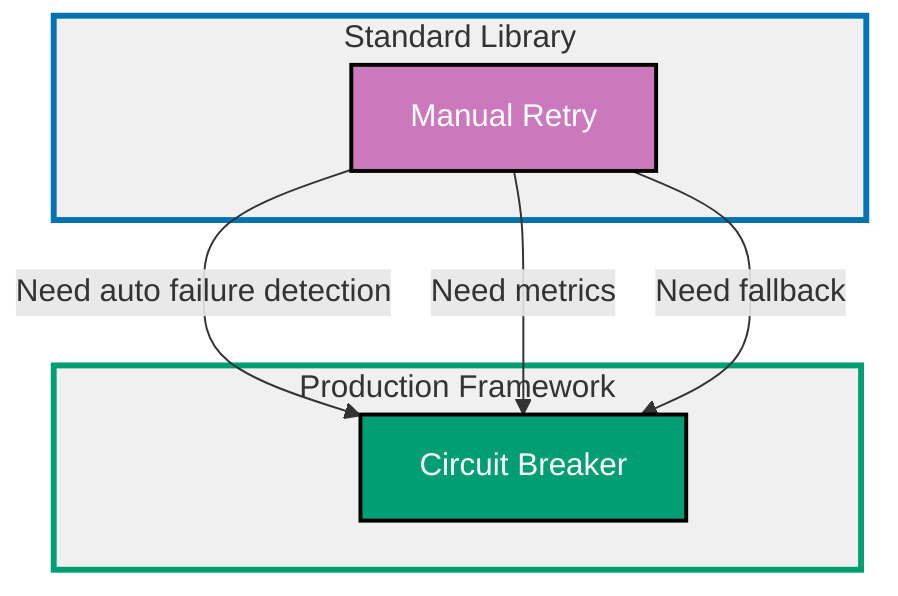

## Why Resilience Patterns Matter

Resilience patterns enable systems to handle failures gracefully, recover automatically, and maintain availability during partial outages by preventing cascading failures, limiting blast radius, and providing fallback mechanisms.

**Core Benefits**:

- **Prevent cascading failures**: Isolate failures to prevent system-wide outage
- **Automatic recovery**: Retry transient failures without manual intervention
- **Graceful degradation**: Provide reduced functionality during outages
- **Fast failure detection**: Stop calling failing services quickly
- **Resource protection**: Prevent resource exhaustion from repeated failures
- **Improved availability**: Maintain service during partial system failures

**Problem**: Microservices and distributed systems fail in complex ways. Naive retry logic can overwhelm failing services. Long timeouts waste resources on unresponsive calls. Cascading failures bring down entire systems.

**Solution**: Use resilience patterns (circuit breaker, retry with backoff, timeout, fallback) to handle failures gracefully and prevent propagation.

## Standard Library First: Manual Retry

Node.js provides basic control flow for implementing retry logic without external dependencies.

### Basic Retry Pattern

Manually retry failed operations with configurable attempts and delays.

**Pattern**:

```typescript
async function retryOperation<T>(
  operation: () => Promise<T>,
  // => Async function to retry
  maxRetries: number = 3,
  // => Maximum retry attempts
  delayMs: number = 1000,
  // => Delay between retries (milliseconds)
): Promise<T> {
  let lastError: Error;

  for (let attempt = 1; attempt <= maxRetries; attempt++) {
    // => Attempt loop
    try {
      const result = await operation();
      // => Try operation
      console.log(`Operation succeeded on attempt ${attempt}`);
      return result;
      // => Success - return result
    } catch (error) {
      // => Operation failed
      lastError = error as Error;
      console.error(`Attempt ${attempt} failed:`, error);

      if (attempt < maxRetries) {
        // => More retries remaining
        console.log(`Retrying in ${delayMs}ms...`);
        await new Promise((resolve) => setTimeout(resolve, delayMs));
        // => Wait before next attempt
        // => Delay prevents overwhelming failed service
      }
    }
  }

  // All retries exhausted
  throw new Error(`Operation failed after ${maxRetries} attempts: ${lastError!.message}`);
  // => Throw final error
}

// Usage
try {
  const user = await retryOperation(
    () => fetchUser("123"),
    // => Operation to retry
    3,
    // => Max 3 attempts
    1000,
    // => 1 second delay
  );
  console.log("User fetched:", user);
} catch (error) {
  console.error("Failed to fetch user:", error);
}
```

**Exponential backoff** (increasing delays):

```typescript
async function retryWithBackoff<T>(
  operation: () => Promise<T>,
  maxRetries: number = 5,
  initialDelayMs: number = 1000,
  // => Initial delay (1 second)
  maxDelayMs: number = 30000,
  // => Maximum delay cap (30 seconds)
): Promise<T> {
  let lastError: Error;
  let delayMs = initialDelayMs;

  for (let attempt = 1; attempt <= maxRetries; attempt++) {
    try {
      return await operation();
      // => Success
    } catch (error) {
      lastError = error as Error;
      console.error(`Attempt ${attempt} failed:`, error);

      if (attempt < maxRetries) {
        console.log(`Retrying in ${delayMs}ms...`);
        await new Promise((resolve) => setTimeout(resolve, delayMs));

        // Exponential backoff: double delay each time
        delayMs = Math.min(delayMs * 2, maxDelayMs);
        // => 1s, 2s, 4s, 8s, 16s, 30s (capped)
        // => Prevents overwhelming recovering service
      }
    }
  }

  throw new Error(`Operation failed after ${maxRetries} attempts: ${lastError!.message}`);
}

// Usage: Retry with exponential backoff
await retryWithBackoff(() => fetchUser("123"), 5, 1000, 30000);
// => Attempts: 0s, 1s, 3s, 7s, 15s, 31s (exponential + capped)
```

**Conditional retry** (retry only on transient errors):

```typescript
function isRetryableError(error: Error): boolean {
  // => Determine if error is transient
  // => Transient errors are temporary (network, timeout)
  // => Non-transient errors are permanent (404, auth)

  const retryableStatusCodes = [408, 429, 500, 502, 503, 504];
  // => HTTP status codes indicating transient failures
  // => 408: Request Timeout
  // => 429: Too Many Requests (rate limit)
  // => 500: Internal Server Error
  // => 502: Bad Gateway
  // => 503: Service Unavailable
  // => 504: Gateway Timeout

  if (error instanceof HTTPError) {
    // => Check HTTP status code
    return retryableStatusCodes.includes(error.statusCode);
  }

  // Network errors are retryable
  if (error.message.includes("ECONNREFUSED") || error.message.includes("ETIMEDOUT")) {
    return true;
  }

  return false;
  // => Default: not retryable
}

async function retryWithCondition<T>(
  operation: () => Promise<T>,
  maxRetries: number = 3,
  delayMs: number = 1000,
): Promise<T> {
  let lastError: Error;

  for (let attempt = 1; attempt <= maxRetries; attempt++) {
    try {
      return await operation();
    } catch (error) {
      lastError = error as Error;

      if (!isRetryableError(lastError)) {
        // => Non-transient error (don't retry)
        console.error("Non-retryable error:", lastError);
        throw lastError;
        // => Fail immediately
      }

      if (attempt < maxRetries) {
        console.log(`Transient error, retrying in ${delayMs}ms...`);
        await new Promise((resolve) => setTimeout(resolve, delayMs));
      }
    }
  }

  throw new Error(`Operation failed after ${maxRetries} attempts: ${lastError!.message}`);
}

// Usage
await retryWithCondition(() => fetchUser("123"), 3, 1000);
// => Retries on 503 Service Unavailable
// => Does NOT retry on 404 Not Found (permanent)
```

**Manual timeout**:

```typescript
async function withTimeout<T>(
  operation: () => Promise<T>,
  timeoutMs: number,
  // => Timeout in milliseconds
): Promise<T> {
  return Promise.race([
    // => Race between operation and timeout
    operation(),
    // => Actual operation

    new Promise<T>((_, reject) => {
      setTimeout(() => {
        reject(new Error(`Operation timed out after ${timeoutMs}ms`));
        // => Timeout rejects
      }, timeoutMs);
    }),
  ]);
  // => Whichever completes first wins
}

// Usage
try {
  const user = await withTimeout(() => fetchUser("123"), 5000);
  // => Fails if takes longer than 5 seconds
  console.log("User fetched:", user);
} catch (error) {
  if (error.message.includes("timed out")) {
    console.error("Request timed out");
  }
}
```

**Limitations for production**:

- **Manual state management**: Must track failure counts manually
- **No circuit breaking**: Continues calling failing service
- **No metrics**: No built-in monitoring or alerting
- **Repeated logic**: Must implement retry/timeout for every operation
- **No bulkhead isolation**: Failures can exhaust thread pools
- **No graceful degradation**: No built-in fallback mechanism

**When standard library suffices**:

- Simple retry logic (1-2 operations)
- Low-traffic applications (<100 req/min)
- Single service dependency
- No need for metrics or monitoring

## Production Framework: Opossum (Circuit Breaker)

Opossum provides production-ready circuit breaker pattern with automatic failure detection, recovery, and metrics.

### Installation and Basic Setup

```bash
npm install opossum
# => Install Opossum circuit breaker library
# => Lightweight, production-tested
# => Used by IBM, Red Hat, others
```

**Basic circuit breaker**:

```typescript
import CircuitBreaker from "opossum";
// => Import circuit breaker

const breaker = new CircuitBreaker(fetchUser, {
  // => Wrap async function with circuit breaker
  // => fetchUser: (userId: string) => Promise<User>

  timeout: 3000,
  // => Timeout for operation (3 seconds)
  // => Fails if operation takes longer

  errorThresholdPercentage: 50,
  // => Open circuit if 50% of requests fail
  // => Within rolling window

  resetTimeout: 30000,
  // => Try to close circuit after 30 seconds
  // => "Half-open" state to test recovery
});

// Circuit breaker states:
// - CLOSED: Normal operation (requests pass through)
// - OPEN: Failing (requests rejected immediately)
// - HALF_OPEN: Testing recovery (limited requests allowed)

try {
  const user = await breaker.fire("123");
  // => Execute through circuit breaker
  // => .fire() passes arguments to wrapped function
  console.log("User fetched:", user);
} catch (error) {
  console.error("Circuit breaker rejected or operation failed:", error);
}
```

**Circuit breaker events**:

```typescript
breaker.on("open", () => {
  // => Circuit opened (too many failures)
  console.error("Circuit breaker OPENED - service is failing");
  // => Alert operations team
});

breaker.on("halfOpen", () => {
  // => Circuit trying to close (testing recovery)
  console.log("Circuit breaker HALF-OPEN - testing recovery");
});

breaker.on("close", () => {
  // => Circuit closed (service recovered)
  console.log("Circuit breaker CLOSED - service recovered");
});

breaker.on("success", (result) => {
  // => Successful request
  console.log("Request succeeded:", result);
});

breaker.on("failure", (error) => {
  // => Failed request
  console.error("Request failed:", error);
});

breaker.on("timeout", () => {
  // => Request timed out
  console.error("Request timed out");
});

breaker.on("reject", () => {
  // => Circuit open - request rejected without calling service
  console.error("Request rejected (circuit open)");
});
```

**Circuit breaker with fallback**:

```typescript
const breaker = new CircuitBreaker(fetchUser, {
  timeout: 3000,
  errorThresholdPercentage: 50,
  resetTimeout: 30000,
});

breaker.fallback((userId: string) => {
  // => Fallback function when circuit open or operation fails
  // => Receives same arguments as original function
  console.log("Using fallback for user", userId);

  return {
    // => Return cached or default user
    id: userId,
    name: "Unknown",
    email: "unknown@example.com",
  };
  // => Graceful degradation
});

const user = await breaker.fire("123");
// => Returns real user OR fallback if circuit open
console.log("User:", user);
```

### Advanced Configuration

**Rolling window and volume threshold**:

```typescript
const breaker = new CircuitBreaker(fetchUser, {
  timeout: 3000,
  errorThresholdPercentage: 50,
  // => Open if 50% fail
  resetTimeout: 30000,

  rollingCountTimeout: 10000,
  // => Rolling window: 10 seconds
  // => Calculate error percentage over last 10 seconds

  volumeThreshold: 10,
  // => Minimum 10 requests before calculating error rate
  // => Prevents opening circuit on low traffic
});

// Example:
// - Within 10 seconds, 100 requests
// - 60 fail (60% failure rate > 50% threshold)
// - volumeThreshold met (100 > 10)
// => Circuit OPENS

// Example (low traffic):
// - Within 10 seconds, 5 requests
// - 4 fail (80% failure rate > 50% threshold)
// - volumeThreshold NOT met (5 < 10)
// => Circuit stays CLOSED (insufficient data)
```

**Exponential backoff for reset**:

```typescript
const breaker = new CircuitBreaker(fetchUser, {
  timeout: 3000,
  errorThresholdPercentage: 50,
  resetTimeout: 5000,
  // => Initial reset timeout: 5 seconds

  exponentialBackoff: true,
  // => Enable exponential backoff
  // => Double resetTimeout on each failed recovery

  maxResetTimeout: 60000,
  // => Maximum reset timeout: 60 seconds
  // => Cap exponential growth
});

// Circuit opens:
// - Try to close after 5 seconds (HALF_OPEN)
// - If still failing, try after 10 seconds
// - If still failing, try after 20 seconds
// - If still failing, try after 40 seconds
// - If still failing, try after 60 seconds (capped)
// => Prevents hammering recovering service
```

**Health check endpoint**:

```typescript
breaker.healthCheck(() => {
  // => Custom health check function
  // => Called during HALF_OPEN state
  return fetch("https://api.example.com/health")
    .then((response) => response.ok)
    .catch(() => false);
  // => Returns true if healthy, false otherwise
});

// Health check used to determine if circuit should close
// - HALF_OPEN state: Call health check
// - If healthy: Close circuit
// - If unhealthy: Re-open circuit
```

### Circuit Breaker Metrics

Opossum provides built-in metrics for monitoring.

**Pattern**:

```typescript
const breaker = new CircuitBreaker(fetchUser, {
  timeout: 3000,
  errorThresholdPercentage: 50,
  resetTimeout: 30000,
});

// Get metrics
setInterval(() => {
  const stats = breaker.stats;
  // => Circuit breaker statistics

  console.log("Circuit Breaker Metrics:");
  console.log(`  Requests: ${stats.fires}`);
  // => Total requests attempted

  console.log(`  Successes: ${stats.successes}`);
  // => Successful requests

  console.log(`  Failures: ${stats.failures}`);
  // => Failed requests

  console.log(`  Timeouts: ${stats.timeouts}`);
  // => Timed out requests

  console.log(`  Rejects: ${stats.rejects}`);
  // => Rejected requests (circuit open)

  console.log(`  Cache hits: ${stats.cacheHits}`);
  // => Requests served from cache

  console.log(`  Latency P50: ${stats.latencyMean}ms`);
  // => Median latency

  console.log(`  Latency P99: ${stats.latencyP99}ms`);
  // => 99th percentile latency

  const errorRate = (stats.failures / stats.fires) * 100;
  console.log(`  Error rate: ${errorRate.toFixed(2)}%`);
}, 10000);
// => Log metrics every 10 seconds
```

**Prometheus metrics export**:

```typescript
import express from "express";
import CircuitBreaker from "opossum";

const app = express();
const breaker = new CircuitBreaker(fetchUser);

app.get("/metrics", (req, res) => {
  // => Prometheus metrics endpoint
  const stats = breaker.stats;

  res.set("Content-Type", "text/plain");
  res.send(`
# HELP circuit_breaker_requests_total Total requests
# TYPE circuit_breaker_requests_total counter
circuit_breaker_requests_total ${stats.fires}

# HELP circuit_breaker_successes_total Successful requests
# TYPE circuit_breaker_successes_total counter
circuit_breaker_successes_total ${stats.successes}

# HELP circuit_breaker_failures_total Failed requests
# TYPE circuit_breaker_failures_total counter
circuit_breaker_failures_total ${stats.failures}

# HELP circuit_breaker_rejects_total Rejected requests (circuit open)
# TYPE circuit_breaker_rejects_total counter
circuit_breaker_rejects_total ${stats.rejects}

# HELP circuit_breaker_latency_ms Request latency percentiles
# TYPE circuit_breaker_latency_ms gauge
circuit_breaker_latency_ms{percentile="50"} ${stats.latencyMean}
circuit_breaker_latency_ms{percentile="99"} ${stats.latencyP99}
  `);
});
```

### Production Benefits

- **Automatic failure detection**: Opens circuit on error threshold
- **Fast fail**: Rejects requests immediately when circuit open
- **Automatic recovery**: Tests service health during HALF_OPEN
- **Fallback support**: Graceful degradation with fallback values
- **Built-in metrics**: Success/failure/latency tracking
- **Event system**: Hooks for logging and alerting
- **Exponential backoff**: Prevents overwhelming recovering service

### Trade-offs

- **External dependency**: Small library (10KB)
- **Configuration complexity**: Many parameters to tune
- **State management**: Circuit breaker is stateful (careful in distributed systems)

### When to use Opossum

- **Microservices architecture**: Multiple service dependencies
- **Unreliable external APIs**: Third-party services with outages
- **High traffic**: >1000 req/min where failures are costly
- **Need metrics**: Monitor service health and failures
- **Graceful degradation**: Want fallback during outages

## Resilience Pattern Progression Diagram



## Additional Resilience Patterns

### Bulkhead Pattern

Isolate resources to prevent cascading failures across system.

**Pattern** (connection pool limits):

```typescript
class BulkheadPool<T> {
  // => Limited resource pool
  private activeCount = 0;
  // => Currently active resources
  private queue: Array<{
    resolve: (value: T) => void;
    reject: (error: Error) => void;
  }> = [];
  // => Waiting requests

  constructor(
    private maxConcurrent: number,
    // => Maximum concurrent operations
    private operation: () => Promise<T>,
    // => Operation to execute
  ) {}

  async execute(): Promise<T> {
    // => Execute with bulkhead protection
    if (this.activeCount < this.maxConcurrent) {
      // => Capacity available
      this.activeCount++;

      try {
        const result = await this.operation();
        return result;
      } finally {
        this.activeCount--;
        this.processQueue();
        // => Process next queued request
      }
    } else {
      // => Bulkhead full - queue request
      return new Promise((resolve, reject) => {
        this.queue.push({ resolve, reject });
      });
    }
  }

  private processQueue(): void {
    // => Process next queued request
    if (this.queue.length > 0 && this.activeCount < this.maxConcurrent) {
      const { resolve, reject } = this.queue.shift()!;

      this.execute().then(resolve).catch(reject);
    }
  }
}

// Usage: Limit concurrent database connections
const dbPool = new BulkheadPool(10, () => database.query("SELECT * FROM users"));
// => Maximum 10 concurrent queries
// => Additional requests queued

const results = await Promise.all([
  dbPool.execute(),
  dbPool.execute(),
  // ... 50 concurrent requests
]);
// => Only 10 execute concurrently
// => Others queued (prevents database overload)
```

### Rate Limiting

Control request rate to prevent overwhelming services.

**Pattern** (token bucket):

```typescript
class TokenBucket {
  // => Rate limiter using token bucket algorithm
  private tokens: number;
  // => Available tokens
  private lastRefill: number;
  // => Last refill timestamp

  constructor(
    private capacity: number,
    // => Maximum tokens (burst capacity)
    private refillRate: number,
    // => Tokens added per second
  ) {
    this.tokens = capacity;
    this.lastRefill = Date.now();
  }

  tryAcquire(tokens: number = 1): boolean {
    // => Try to acquire tokens
    this.refill();
    // => Refill tokens based on elapsed time

    if (this.tokens >= tokens) {
      // => Enough tokens available
      this.tokens -= tokens;
      return true;
    }

    // => Not enough tokens (rate limit exceeded)
    return false;
  }

  private refill(): void {
    // => Refill tokens based on time elapsed
    const now = Date.now();
    const elapsed = (now - this.lastRefill) / 1000;
    // => Seconds elapsed since last refill

    const tokensToAdd = elapsed * this.refillRate;
    // => Tokens to add based on refill rate

    this.tokens = Math.min(this.capacity, this.tokens + tokensToAdd);
    // => Add tokens (capped at capacity)

    this.lastRefill = now;
  }
}

const rateLimiter = new TokenBucket(100, 10);
// => Capacity: 100 tokens (burst)
// => Refill: 10 tokens per second

async function callAPI(): Promise<void> {
  if (rateLimiter.tryAcquire()) {
    // => Token acquired (within rate limit)
    await fetch("https://api.example.com/data");
  } else {
    // => Rate limit exceeded
    throw new Error("Rate limit exceeded");
  }
}

// Usage
for (let i = 0; i < 1000; i++) {
  try {
    await callAPI();
  } catch (error) {
    console.error("Request blocked:", error);
    await new Promise((resolve) => setTimeout(resolve, 100));
    // => Wait 100ms before retry
  }
}
// => Limits to 10 requests per second
```

### Timeout with Cancellation

Cancel long-running operations to free resources.

**Pattern** (AbortController):

```typescript
async function fetchWithCancellation(url: string, timeoutMs: number): Promise<Response> {
  const controller = new AbortController();
  // => Create abort controller
  // => Provides signal for cancellation

  const timeoutId = setTimeout(() => {
    controller.abort();
    // => Cancel request after timeout
  }, timeoutMs);

  try {
    const response = await fetch(url, {
      signal: controller.signal,
      // => Pass signal to fetch
      // => Fetch will abort when signal triggered
    });

    clearTimeout(timeoutId);
    // => Clear timeout (request completed)
    return response;
  } catch (error) {
    if (error.name === "AbortError") {
      // => Request was cancelled
      throw new Error(`Request timed out after ${timeoutMs}ms`);
    }
    throw error;
  }
}

// Usage
try {
  const response = await fetchWithCancellation("https://api.example.com/users", 5000);
  // => Cancelled if takes longer than 5 seconds
  const data = await response.json();
  console.log("Data:", data);
} catch (error) {
  console.error("Request failed or timed out:", error);
}
```

### Retry with Jitter

Add randomness to retry delays to prevent thundering herd.

**Pattern**:

```typescript
async function retryWithJitter<T>(
  operation: () => Promise<T>,
  maxRetries: number = 5,
  baseDelayMs: number = 1000,
): Promise<T> {
  let lastError: Error;

  for (let attempt = 1; attempt <= maxRetries; attempt++) {
    try {
      return await operation();
    } catch (error) {
      lastError = error as Error;

      if (attempt < maxRetries) {
        // Exponential backoff with jitter
        const exponentialDelay = baseDelayMs * Math.pow(2, attempt - 1);
        // => 1s, 2s, 4s, 8s, 16s

        const jitter = Math.random() * baseDelayMs;
        // => Random jitter (0 to baseDelayMs)
        // => Prevents synchronized retries

        const delayMs = exponentialDelay + jitter;
        // => Final delay with jitter

        console.log(`Retry ${attempt} after ${delayMs.toFixed(0)}ms`);
        await new Promise((resolve) => setTimeout(resolve, delayMs));
      }
    }
  }

  throw lastError!;
}

// Example: 100 clients retry simultaneously
// - Without jitter: All retry at same time (thundering herd)
// - With jitter: Retries spread over time window
```

## Production Best Practices

### Layered Resilience

Combine multiple patterns for defense in depth.

**Pattern**:

```typescript
const breaker = new CircuitBreaker(
  async (userId: string) => {
    // => Wrap with timeout
    return await withTimeout(
      () =>
        retryWithBackoff(
          // => Wrap with retry
          () => fetchUser(userId),
          3,
          1000,
          5000,
        ),
      10000,
      // => Overall timeout: 10 seconds
    );
  },
  {
    timeout: 3000,
    errorThresholdPercentage: 50,
    resetTimeout: 30000,
  },
);

breaker.fallback((userId: string) => {
  // => Fallback if circuit open
  return { id: userId, name: "Unknown", email: "unknown@example.com" };
});

// Layers:
// 1. Retry with backoff (handle transient failures)
// 2. Timeout (prevent hanging indefinitely)
// 3. Circuit breaker (prevent cascading failures)
// 4. Fallback (graceful degradation)
```

### Monitoring and Alerting

Track resilience metrics for operational visibility.

**Pattern**:

```typescript
class ResilientAPI {
  private metrics = {
    totalRequests: 0,
    successfulRequests: 0,
    failedRequests: 0,
    retriedRequests: 0,
    circuitOpenCount: 0,
  };

  constructor(private breaker: CircuitBreaker<any>) {
    // Monitor circuit breaker events
    breaker.on("success", () => {
      this.metrics.totalRequests++;
      this.metrics.successfulRequests++;
    });

    breaker.on("failure", () => {
      this.metrics.totalRequests++;
      this.metrics.failedRequests++;
    });

    breaker.on("open", () => {
      this.metrics.circuitOpenCount++;
      this.alertCircuitOpen();
    });
  }

  private alertCircuitOpen(): void {
    // => Send alert when circuit opens
    console.error("ALERT: Circuit breaker opened - service failing");
    // => Integrate with PagerDuty, Slack, etc.
  }

  getMetrics() {
    const errorRate =
      this.metrics.totalRequests > 0 ? (this.metrics.failedRequests / this.metrics.totalRequests) * 100 : 0;

    return {
      ...this.metrics,
      errorRate: errorRate.toFixed(2) + "%",
    };
  }
}

// Usage
const api = new ResilientAPI(breaker);

setInterval(() => {
  console.log("API Metrics:", api.getMetrics());
}, 60000);
// => Log metrics every minute
```

### Testing Resilience

Chaos engineering to verify failure handling.

**Pattern**:

```typescript
class ChaosMonkey {
  // => Inject failures for testing
  constructor(
    private failureRate: number = 0.1,
    // => 10% failure rate
  ) {}

  shouldFail(): boolean {
    // => Randomly fail based on failure rate
    return Math.random() < this.failureRate;
  }

  async wrapOperation<T>(operation: () => Promise<T>): Promise<T> {
    if (this.shouldFail()) {
      // => Inject failure
      throw new Error("Chaos Monkey: Simulated failure");
    }
    return await operation();
  }
}

const chaosMonkey = new ChaosMonkey(0.2);
// => 20% failure rate

async function chaosTestFetchUser(userId: string): Promise<User> {
  return await chaosMonkey.wrapOperation(() => fetchUser(userId));
  // => Randomly fails 20% of the time
}

// Run tests with chaos to verify resilience patterns work
const breaker = new CircuitBreaker(chaosTestFetchUser);
breaker.fallback(() => ({ id: "123", name: "Fallback" }));

for (let i = 0; i < 100; i++) {
  try {
    const user = await breaker.fire("123");
    console.log("Success:", user);
  } catch (error) {
    console.error("Failed:", error);
  }
}
// => Verify circuit breaker opens after threshold
// => Verify fallback activates correctly
```

## Trade-offs and When to Use Each

### Manual Retry (Standard Library)

**Use when**:

- Simple retry logic (1-2 operations)
- Low traffic applications
- Single service dependency
- Learning resilience fundamentals

**Avoid when**:

- Need automatic failure detection (circuit breaker)
- Multiple service dependencies
- High traffic (metrics and monitoring critical)

### Circuit Breaker (Opossum)

**Use when**:

- Microservices architecture (multiple dependencies)
- Unreliable external APIs (frequent failures)
- High traffic (>1000 req/min)
- Need metrics and monitoring
- Graceful degradation required (fallback)

**Avoid when**:

- Simple applications (manual retry sufficient)
- Single service dependency (overhead not justified)

## Common Pitfalls

### Pitfall 1: Retry Storm

**Problem**: All clients retry simultaneously, overwhelming recovering service.

**Solution**: Add jitter to retry delays.

```typescript
// Bad: Synchronized retries
await new Promise((resolve) => setTimeout(resolve, 1000));
// => All clients retry at same time (thundering herd)

// Good: Jittered retries
const jitter = Math.random() * 1000;
await new Promise((resolve) => setTimeout(resolve, 1000 + jitter));
// => Retries spread over time window
```

### Pitfall 2: Retrying Non-Transient Errors

**Problem**: Retrying permanent errors (404, 401) wastes resources.

**Solution**: Only retry transient errors (5xx, timeouts).

```typescript
// Check error type before retrying
if (error.statusCode === 404 || error.statusCode === 401) {
  throw error; // Don't retry permanent errors
}
```

### Pitfall 3: No Timeout on Retries

**Problem**: Retries wait indefinitely for each attempt.

**Solution**: Set timeout for each retry attempt.

```typescript
// Timeout per attempt
await withTimeout(() => operation(), 5000);
```

### Pitfall 4: Circuit Breaker Not Shared

**Problem**: Each instance has separate circuit breaker state.

**Solution**: Share circuit breaker across instances (use Redis).

```typescript
// Use shared state for distributed circuit breaker
// (requires distributed state store like Redis)
```

## Summary

Resilience patterns enable systems to handle failures gracefully with automatic recovery. Manual retry handles transient failures, while circuit breakers prevent cascading failures and provide metrics.

**Progression path**:

1. **Start with manual retry**: Handle transient failures
2. **Add circuit breaker**: Automatic failure detection and recovery
3. **Layer patterns**: Combine retry, timeout, circuit breaker, fallback

**Production checklist**:

- ✅ Retry with exponential backoff and jitter
- ✅ Circuit breaker for external dependencies
- ✅ Timeout on all network calls
- ✅ Fallback for graceful degradation
- ✅ Bulkhead isolation (limit concurrent operations)
- ✅ Metrics and monitoring (track failures)
- ✅ Alerting on circuit open (operations visibility)

Choose resilience strategy based on architecture: Manual retry for simple apps, circuit breaker for microservices.
