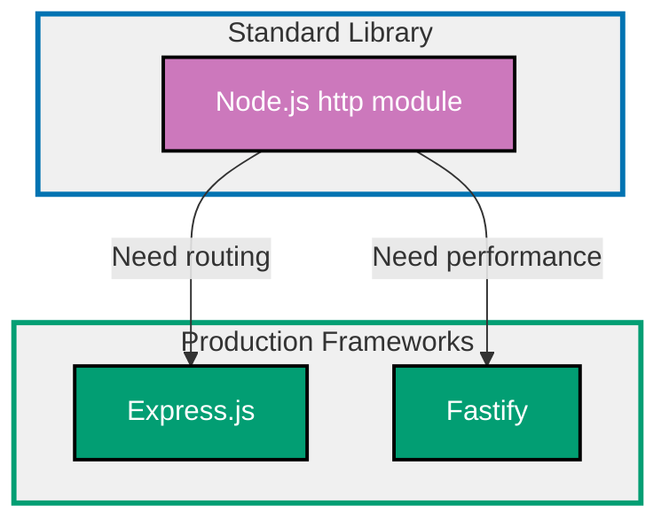

## Why REST API Development Matters

REST APIs provide programmatic access to application functionality over HTTP, enabling client-server architecture, microservices communication, and third-party integrations. Production APIs require routing, middleware, input validation, error handling, and proper HTTP semantics.

**Core Benefits**:

- **Client-server architecture**: Separate frontend from backend
- **Programmatic access**: Clients interact via HTTP requests
- **Language agnostic**: Any HTTP client can consume API
- **Stateless**: Each request contains all necessary information
- **Scalable**: Horizontal scaling through load balancing

**Problem**: Node.js `http` module requires manual routing, verbose request parsing, and lacks middleware system.

**Solution**: Use web frameworks (Express.js, Fastify) that provide routing, middleware, request parsing, and developer-friendly APIs.

## Standard Library First: Node.js http Module

Node.js provides the built-in `http` module for creating HTTP servers without external dependencies.

### Basic HTTP Server

The `http.createServer` function creates an HTTP server that handles requests.

**Pattern**:

```typescript
import http from "http";
// => Node.js built-in HTTP module
// => No external dependencies

interface User {
  // => User data structure
  id: number;
  name: string;
  email: string;
}

const users: User[] = [
  // => In-memory user storage
  // => Production: Use database
  { id: 1, name: "Alice", email: "alice@example.com" },
  { id: 2, name: "Bob", email: "bob@example.com" },
];

const server = http.createServer((req, res) => {
  // => Create HTTP server
  // => req: Incoming request
  // => res: Outgoing response

  const { method, url } = req;
  // => Extract HTTP method and URL
  // => method: GET, POST, PUT, DELETE
  // => url: /users, /users/1, etc.

  // GET /users - List all users
  if (method === "GET" && url === "/users") {
    // => Match exact URL
    res.writeHead(200, { "Content-Type": "application/json" });
    // => Set status code (200 OK)
    // => Set content type header
    res.end(JSON.stringify(users));
    // => Send JSON response
    // => end() finishes response
    return;
  }

  // GET /users/:id - Get user by ID
  if (method === "GET" && url?.startsWith("/users/")) {
    // => Match URL pattern
    const id = parseInt(url.split("/")[2]);
    // => Extract ID from URL
    // => /users/1 -> ['', 'users', '1']
    const user = users.find((u) => u.id === id);
    // => Find user by ID

    if (user) {
      res.writeHead(200, { "Content-Type": "application/json" });
      res.end(JSON.stringify(user));
    } else {
      // => User not found
      res.writeHead(404, { "Content-Type": "application/json" });
      res.end(JSON.stringify({ error: "User not found" }));
    }
    return;
  }

  // POST /users - Create user
  if (method === "POST" && url === "/users") {
    let body = "";
    // => Accumulate request body

    req.on("data", (chunk) => {
      // => Read body chunks
      // => Request body arrives in chunks
      body += chunk.toString();
      // => Convert Buffer to string
    });

    req.on("end", () => {
      // => All chunks received
      try {
        const data = JSON.parse(body);
        // => Parse JSON body
        // => May throw if invalid JSON

        const newUser: User = {
          id: users.length + 1,
          // => Generate new ID
          // => Production: Use database auto-increment
          name: data.name,
          email: data.email,
        };

        users.push(newUser);
        // => Add user to storage

        res.writeHead(201, { "Content-Type": "application/json" });
        // => 201 Created status
        res.end(JSON.stringify(newUser));
      } catch (error) {
        // => Invalid JSON or missing fields
        res.writeHead(400, { "Content-Type": "application/json" });
        // => 400 Bad Request
        res.end(JSON.stringify({ error: "Invalid request body" }));
      }
    });
    return;
  }

  // PUT /users/:id - Update user
  if (method === "PUT" && url?.startsWith("/users/")) {
    const id = parseInt(url.split("/")[2]);
    const userIndex = users.findIndex((u) => u.id === id);
    // => Find user index

    if (userIndex === -1) {
      res.writeHead(404, { "Content-Type": "application/json" });
      res.end(JSON.stringify({ error: "User not found" }));
      return;
    }

    let body = "";
    req.on("data", (chunk) => {
      body += chunk.toString();
    });

    req.on("end", () => {
      try {
        const data = JSON.parse(body);
        // => Parse update data
        users[userIndex] = { ...users[userIndex], ...data };
        // => Merge update with existing user

        res.writeHead(200, { "Content-Type": "application/json" });
        res.end(JSON.stringify(users[userIndex]));
      } catch (error) {
        res.writeHead(400, { "Content-Type": "application/json" });
        res.end(JSON.stringify({ error: "Invalid request body" }));
      }
    });
    return;
  }

  // DELETE /users/:id - Delete user
  if (method === "DELETE" && url?.startsWith("/users/")) {
    const id = parseInt(url.split("/")[2]);
    const userIndex = users.findIndex((u) => u.id === id);

    if (userIndex === -1) {
      res.writeHead(404, { "Content-Type": "application/json" });
      res.end(JSON.stringify({ error: "User not found" }));
      return;
    }

    const deletedUser = users.splice(userIndex, 1)[0];
    // => Remove user from array
    // => splice returns deleted elements

    res.writeHead(200, { "Content-Type": "application/json" });
    res.end(JSON.stringify(deletedUser));
    return;
  }

  // Route not found
  res.writeHead(404, { "Content-Type": "application/json" });
  res.end(JSON.stringify({ error: "Route not found" }));
});

server.listen(3000, () => {
  // => Start server on port 3000
  console.log("Server running on http://localhost:3000");
});
```

**Limitations for production**:

- **Manual routing**: String matching for every route (verbose, error-prone)
- **No middleware**: Cannot add reusable request processing (logging, auth)
- **Verbose body parsing**: Manual chunk accumulation for every POST/PUT
- **No validation**: Must manually validate request data
- **No error handling**: No centralized error handling mechanism
- **No path parameters**: Manual string parsing for `/users/:id` patterns
- **No query string parsing**: Must parse `?page=1&limit=10` manually
- **No static file serving**: Manual file reading and content-type detection
- **No CORS handling**: Must manually set CORS headers

**When standard library suffices**:

- Simple webhooks (single endpoint)
- Learning HTTP fundamentals
- Ultra-minimal microservices (≤3 routes)
- Performance-critical applications (avoid framework overhead)

## Production Framework: Express.js

Express.js is the most popular Node.js web framework providing routing, middleware, and a rich ecosystem.

### Installation and Basic Setup

```bash
npm install express @types/express
# => express: Web framework
# => @types/express: TypeScript types
```

**Basic application**:

```typescript
import express from "express";
// => Import Express framework
// => Simplifies HTTP server creation

const app = express();
// => Create Express application
// => Configures routing and middleware

app.use(express.json());
// => Parse JSON request bodies automatically
// => Middleware: Runs on every request
// => Sets req.body to parsed JSON

// GET /users - List all users
app.get("/users", (req, res) => {
  // => Define GET route
  // => Automatic route matching
  // => req: Express Request
  // => res: Express Response
  res.json(users);
  // => Send JSON response
  // => Automatically sets Content-Type: application/json
  // => Equivalent to res.send(JSON.stringify(users))
});

// GET /users/:id - Get user by ID
app.get("/users/:id", (req, res) => {
  // => :id is path parameter
  // => Express extracts and parses automatically
  const id = parseInt(req.params.id);
  // => req.params.id: Extracted from URL
  // => /users/123 -> req.params.id = "123"

  const user = users.find((u) => u.id === id);
  // => Find user by ID

  if (!user) {
    return res.status(404).json({ error: "User not found" });
    // => Chainable API: status(404).json(...)
    // => return prevents further execution
  }

  res.json(user);
  // => Send user object
});

// POST /users - Create user
app.post("/users", (req, res) => {
  // => POST route
  const { name, email } = req.body;
  // => req.body parsed by express.json() middleware
  // => Destructure fields from request body

  if (!name || !email) {
    // => Basic validation
    return res.status(400).json({ error: "Name and email required" });
  }

  const newUser: User = {
    id: users.length + 1,
    name,
    email,
  };

  users.push(newUser);
  res.status(201).json(newUser);
  // => 201 Created status
});

// PUT /users/:id - Update user
app.put("/users/:id", (req, res) => {
  const id = parseInt(req.params.id);
  const userIndex = users.findIndex((u) => u.id === id);

  if (userIndex === -1) {
    return res.status(404).json({ error: "User not found" });
  }

  users[userIndex] = { ...users[userIndex], ...req.body };
  // => Merge update with existing user
  res.json(users[userIndex]);
});

// DELETE /users/:id - Delete user
app.delete("/users/:id", (req, res) => {
  const id = parseInt(req.params.id);
  const userIndex = users.findIndex((u) => u.id === id);

  if (userIndex === -1) {
    return res.status(404).json({ error: "User not found" });
  }

  const deletedUser = users.splice(userIndex, 1)[0];
  res.json(deletedUser);
});

app.listen(3000, () => {
  console.log("Server running on http://localhost:3000");
});
```

### Middleware System

Express middleware provides reusable request processing.

**Logging middleware**:

```typescript
import morgan from "morgan";
// => HTTP request logger

app.use(morgan("combined"));
// => Log all requests
// => Format: Apache combined log format
// => Example: 192.168.1.1 - - [07/Feb/2026:10:00:00 +0000] "GET /users HTTP/1.1" 200 -
```

**Authentication middleware**:

```typescript
function authMiddleware(req: express.Request, res: express.Response, next: express.NextFunction) {
  // => Custom middleware function
  // => req: Request object
  // => res: Response object
  // => next: Call next middleware

  const token = req.headers.authorization?.split(" ")[1];
  // => Extract token from Authorization header
  // => Format: "Bearer eyJhbGc..."

  if (!token) {
    return res.status(401).json({ error: "No token provided" });
    // => 401 Unauthorized
    // => return prevents calling next()
  }

  try {
    const decoded = verifyToken(token);
    // => Verify JWT token
    // => Throws if invalid
    req.user = decoded;
    // => Attach user to request
    // => Available in route handlers
    next();
    // => Continue to next middleware/route
  } catch (error) {
    res.status(401).json({ error: "Invalid token" });
  }
}

// Apply to specific routes
app.get("/api/profile", authMiddleware, (req, res) => {
  // => authMiddleware runs first
  // => Route handler runs if middleware calls next()
  res.json({ user: req.user });
  // => req.user set by authMiddleware
});

// Apply to all routes under /api
app.use("/api", authMiddleware);
// => All /api/* routes require authentication
```

**Error handling middleware**:

```typescript
app.use((err: Error, req: express.Request, res: express.Response, next: express.NextFunction) => {
  // => Error handling middleware
  // => Four parameters required (err, req, res, next)
  // => Catches errors from route handlers

  console.error(err.stack);
  // => Log error stack trace

  res.status(500).json({
    error: "Internal server error",
    // => Generic error message
    // => Don't expose error details in production
    message: process.env.NODE_ENV === "development" ? err.message : undefined,
    // => Show details only in development
  });
});
```

### Request Validation with zod

Validate request data with type-safe schema validation.

**Installation**:

```bash
npm install zod
# => Schema validation library
# => Type-safe validation
```

**Pattern**:

```typescript
import { z } from "zod";
// => Import zod validation library

const createUserSchema = z.object({
  // => Define schema for user creation
  name: z.string().min(1).max(100),
  // => String, 1-100 characters
  // => .min(1): Not empty
  email: z.string().email(),
  // => Valid email format
  // => Built-in email validation
});

app.post("/users", (req, res) => {
  try {
    const data = createUserSchema.parse(req.body);
    // => Validate request body
    // => Throws ZodError if invalid
    // => data: { name: string, email: string } (typed)

    const newUser: User = {
      id: users.length + 1,
      name: data.name,
      // => TypeScript knows data.name is string
      email: data.email,
    };

    users.push(newUser);
    res.status(201).json(newUser);
  } catch (error) {
    if (error instanceof z.ZodError) {
      // => Validation error
      return res.status(400).json({
        error: "Validation failed",
        details: error.errors,
        // => Detailed validation errors
        // => [{ path: ['email'], message: 'Invalid email' }]
      });
    }
    throw error;
  }
});
```

**Middleware for validation**:

```typescript
function validate(schema: z.ZodSchema) {
  // => Generic validation middleware factory
  // => Returns middleware function
  return (req: express.Request, res: express.Response, next: express.NextFunction) => {
    try {
      req.body = schema.parse(req.body);
      // => Validate and parse body
      // => Replaces req.body with validated data
      next();
      // => Continue to route handler
    } catch (error) {
      if (error instanceof z.ZodError) {
        return res.status(400).json({
          error: "Validation failed",
          details: error.errors,
        });
      }
      next(error);
      // => Pass error to error handler
    }
  };
}

// Usage
app.post("/users", validate(createUserSchema), (req, res) => {
  // => validate runs first
  // => req.body already validated
  const { name, email } = req.body;
  // => TypeScript infers types from schema

  const newUser: User = {
    id: users.length + 1,
    name,
    email,
  };

  users.push(newUser);
  res.status(201).json(newUser);
});
```

### Router Organization

Express routers enable modular route organization.

**Pattern**:

```typescript
// routes/users.ts
import express from "express";

const router = express.Router();
// => Create router instance
// => Mountable route handlers

router.get("/", (req, res) => {
  // => GET /users (when mounted)
  res.json(users);
});

router.get("/:id", (req, res) => {
  // => GET /users/:id
  const id = parseInt(req.params.id);
  const user = users.find((u) => u.id === id);

  if (!user) {
    return res.status(404).json({ error: "User not found" });
  }

  res.json(user);
});

router.post("/", validate(createUserSchema), (req, res) => {
  // => POST /users
  const { name, email } = req.body;

  const newUser: User = {
    id: users.length + 1,
    name,
    email,
  };

  users.push(newUser);
  res.status(201).json(newUser);
});

export default router;

// app.ts
import userRoutes from "./routes/users";

app.use("/users", userRoutes);
// => Mount router at /users
// => All router routes prefixed with /users
```

**Production benefits**:

- **Simple API**: Intuitive, readable syntax
- **Middleware system**: Reusable request processing
- **Routing**: Path parameters, query strings, route groups
- **Ecosystem**: 5000+ middleware packages available
- **JSON handling**: Automatic parsing and serialization
- **Template engines**: EJS, Pug, Handlebars support
- **Static file serving**: Built-in `express.static()` middleware

**Trade-offs**:

- **External dependency**: Express (200KB) + middleware packages
- **Performance**: Slower than Fastify (callback-based architecture)
- **Error handling**: Error middleware can be confusing

**When to use Express**:

- Standard web applications (most common use case)
- Teams familiar with Express (largest community)
- Need extensive middleware ecosystem
- Don't need maximum performance

## Production Framework: Fastify

Fastify is a high-performance web framework optimized for speed with schema-based validation.

### Installation and Setup

```bash
npm install fastify
# => Fastify web framework
# => 2-3x faster than Express
```

**Basic application**:

```typescript
import fastify from "fastify";
// => Import Fastify framework
// => Performance-optimized

const app = fastify({
  logger: true,
  // => Built-in logging
  // => Pino logger (fast JSON logging)
});

// GET /users - List all users
app.get("/users", async (request, reply) => {
  // => Define GET route
  // => request: Fastify Request
  // => reply: Fastify Reply
  // => async: Handlers can be async
  return users;
  // => Return value automatically serialized as JSON
  // => No need for reply.send()
});

// GET /users/:id - Get user by ID
app.get<{ Params: { id: string } }>("/users/:id", async (request, reply) => {
  // => Generic type parameter for type safety
  // => Params: Path parameter types
  const id = parseInt(request.params.id);
  // => request.params.id: TypeScript knows it's string

  const user = users.find((u) => u.id === id);

  if (!user) {
    // => User not found
    return reply.code(404).send({ error: "User not found" });
    // => Chainable API
    // => reply.code(404): Set status
    // => .send(): Send response
  }

  return user;
  // => Return user object
});

// POST /users - Create user with schema validation
app.post<{ Body: { name: string; email: string } }>(
  "/users",
  {
    schema: {
      // => JSON Schema for validation
      // => Fastify validates automatically
      body: {
        type: "object",
        required: ["name", "email"],
        // => Required fields
        properties: {
          name: { type: "string", minLength: 1, maxLength: 100 },
          // => String with length constraints
          email: { type: "string", format: "email" },
          // => Email format validation
        },
      },
      response: {
        // => Response schema (serialization)
        201: {
          type: "object",
          properties: {
            id: { type: "number" },
            name: { type: "string" },
            email: { type: "string" },
          },
        },
      },
    },
  },
  async (request, reply) => {
    // => Route handler
    // => request.body already validated
    const { name, email } = request.body;
    // => TypeScript knows types from generic

    const newUser: User = {
      id: users.length + 1,
      name,
      email,
    };

    users.push(newUser);
    return reply.code(201).send(newUser);
    // => 201 Created status
  },
);

app.listen({ port: 3000 }, (err, address) => {
  // => Start server
  if (err) {
    console.error(err);
    process.exit(1);
  }
  console.log(`Server running at ${address}`);
});
```

### Hooks (Middleware Alternative)

Fastify uses hooks instead of Express-style middleware.

**Pattern**:

```typescript
// Request hook (runs before handler)
app.addHook("onRequest", async (request, reply) => {
  // => Runs on every request
  // => Before route handler
  console.log(`${request.method} ${request.url}`);
  // => Log request
});

// Pre-handler hook (after validation, before handler)
app.addHook("preHandler", async (request, reply) => {
  // => Runs after validation
  // => Before route handler
  const token = request.headers.authorization?.split(" ")[1];

  if (!token) {
    return reply.code(401).send({ error: "No token provided" });
    // => Returning terminates request
  }

  try {
    const decoded = verifyToken(token);
    request.user = decoded;
    // => Attach user to request
  } catch (error) {
    return reply.code(401).send({ error: "Invalid token" });
  }
});

// Route-specific hook
app.get(
  "/api/profile",
  {
    preHandler: async (request, reply) => {
      // => Hook only for this route
      // => Authentication logic
      const token = request.headers.authorization?.split(" ")[1];
      if (!token) {
        return reply.code(401).send({ error: "Authentication required" });
      }
    },
  },
  async (request, reply) => {
    return { user: request.user };
  },
);
```

### Plugins for Modular Code

Fastify plugins enable encapsulation and code reuse.

**Pattern**:

```typescript
// plugins/users.ts
import { FastifyInstance } from "fastify";

export async function userRoutes(app: FastifyInstance) {
  // => Plugin function
  // => app: Fastify instance

  app.get("/users", async (request, reply) => {
    return users;
  });

  app.get("/users/:id", async (request, reply) => {
    const id = parseInt(request.params.id);
    const user = users.find((u) => u.id === id);

    if (!user) {
      return reply.code(404).send({ error: "User not found" });
    }

    return user;
  });

  app.post(
    "/users",
    {
      schema: {
        body: {
          type: "object",
          required: ["name", "email"],
          properties: {
            name: { type: "string" },
            email: { type: "string", format: "email" },
          },
        },
      },
    },
    async (request, reply) => {
      const { name, email } = request.body as { name: string; email: string };

      const newUser: User = {
        id: users.length + 1,
        name,
        email,
      };

      users.push(newUser);
      return reply.code(201).send(newUser);
    },
  );
}

// app.ts
import { userRoutes } from "./plugins/users";

app.register(userRoutes);
// => Register plugin
// => All routes from plugin added to app
```

### Fastify Ecosystem

Fastify provides official plugins for common functionality.

**CORS**:

```bash
npm install @fastify/cors
```

```typescript
import cors from "@fastify/cors";

app.register(cors, {
  origin: "https://example.com",
  // => Allow specific origin
  // => Or true for all origins (development only)
  credentials: true,
  // => Allow cookies cross-origin
});
```

**Rate limiting**:

```bash
npm install @fastify/rate-limit
```

```typescript
import rateLimit from "@fastify/rate-limit";

app.register(rateLimit, {
  max: 100,
  // => 100 requests per timeWindow
  timeWindow: "15 minutes",
  // => 15 minute window
});
```

**Production benefits**:

- **High performance**: 2-3x faster than Express (optimized serialization)
- **Schema validation**: JSON Schema for request/response validation
- **Built-in logging**: Pino logger (fast JSON logging)
- **TypeScript support**: Better TypeScript integration than Express
- **Plugin architecture**: Encapsulated, reusable code
- **Async/await**: Fully async (no callback hell)

**Trade-offs**:

- **Smaller ecosystem**: Fewer plugins than Express
- **Different API**: Not compatible with Express middleware
- **Learning curve**: Schema-based validation different from Express

**When to use Fastify**:

- Performance-critical applications (>1000 req/sec)
- Microservices (need speed and JSON schema)
- TypeScript projects (better type safety)
- Want built-in validation

## REST API Framework Progression Diagram



## Production Best Practices

### API Versioning

Version APIs to enable backward-compatible changes.

**Pattern**:

```typescript
// Express
app.use("/api/v1/users", userRoutesV1);
app.use("/api/v2/users", userRoutesV2);
// => Different versions side-by-side
// => Clients choose version via URL

// Fastify
app.register(userRoutesV1, { prefix: "/api/v1" });
app.register(userRoutesV2, { prefix: "/api/v2" });
```

### Request Validation

Always validate request data to prevent invalid input.

**Pattern** (Express with zod):

```typescript
const updateUserSchema = z.object({
  name: z.string().min(1).max(100).optional(),
  // => Optional field
  // => If provided, must be 1-100 chars
  email: z.string().email().optional(),
});

app.put("/users/:id", validate(updateUserSchema), (req, res) => {
  // => Validation runs first
  const id = parseInt(req.params.id);
  const userIndex = users.findIndex((u) => u.id === id);

  if (userIndex === -1) {
    return res.status(404).json({ error: "User not found" });
  }

  users[userIndex] = { ...users[userIndex], ...req.body };
  res.json(users[userIndex]);
});
```

### Pagination

Implement pagination for large datasets.

**Pattern**:

```typescript
app.get("/users", (req, res) => {
  const page = parseInt(req.query.page as string) || 1;
  // => ?page=2
  // => Default: 1
  const limit = parseInt(req.query.limit as string) || 10;
  // => ?limit=20
  // => Default: 10

  const startIndex = (page - 1) * limit;
  // => Calculate offset
  // => Page 1: 0, Page 2: 10, Page 3: 20
  const endIndex = page * limit;

  const paginatedUsers = users.slice(startIndex, endIndex);
  // => Get page of users

  res.json({
    page,
    limit,
    total: users.length,
    // => Total count
    data: paginatedUsers,
    // => Paginated results
  });
});
```

### Error Handling

Centralized error handling for consistent responses.

**Pattern** (Express):

```typescript
class ApiError extends Error {
  // => Custom error class
  constructor(
    public statusCode: number,
    message: string,
  ) {
    super(message);
    this.name = "ApiError";
  }
}

app.get("/users/:id", (req, res, next) => {
  const id = parseInt(req.params.id);
  const user = users.find((u) => u.id === id);

  if (!user) {
    // => Throw custom error
    throw new ApiError(404, "User not found");
    // => Caught by error handler
  }

  res.json(user);
});

app.use((err: Error, req: express.Request, res: express.Response, next: express.NextFunction) => {
  // => Error handling middleware
  if (err instanceof ApiError) {
    // => Handle custom errors
    return res.status(err.statusCode).json({ error: err.message });
  }

  // => Unknown error
  console.error(err);
  res.status(500).json({ error: "Internal server error" });
});
```

### CORS Configuration

Configure CORS for cross-origin requests.

**Pattern** (Express):

```typescript
import cors from "cors";

app.use(
  cors({
    origin: process.env.ALLOWED_ORIGINS?.split(",") || "*",
    // => Allowed origins from environment
    // => Example: https://example.com,https://app.example.com
    methods: ["GET", "POST", "PUT", "DELETE"],
    // => Allowed HTTP methods
    credentials: true,
    // => Allow cookies cross-origin
    allowedHeaders: ["Content-Type", "Authorization"],
    // => Allowed request headers
  }),
);
```

## Trade-offs and When to Use Each

### Node.js http (Standard Library)

**Use when**:

- Simple webhooks (1-2 endpoints)
- Learning HTTP fundamentals
- Ultra-minimal microservices
- Maximum performance critical (no framework overhead)

**Avoid when**:

- Complex routing (>5 routes)
- Need middleware system
- Want validation, error handling
- Team productivity matters

### Express.js

**Use when**:

- Standard web applications (most common)
- Large ecosystem needed (5000+ packages)
- Team familiar with Express
- Template rendering needed (EJS, Pug)

**Avoid when**:

- Need maximum performance (>1000 req/sec)
- Want built-in validation
- Prefer async/await over callbacks

### Fastify

**Use when**:

- Performance critical (>1000 req/sec)
- Microservices architecture
- Want built-in validation (JSON Schema)
- TypeScript projects (better types)

**Avoid when**:

- Need Express ecosystem
- Team unfamiliar with Fastify
- Want template rendering (limited support)

## Common Pitfalls

### Pitfall 1: Missing Input Validation

**Problem**: Accepting invalid data causes errors.

**Solution**: Always validate request data.

```typescript
// ❌ BAD: No validation
app.post("/users", (req, res) => {
  const user = { id: users.length + 1, ...req.body };
  users.push(user);
  res.json(user);
  // => Accepts any data (no name, invalid email, etc.)
});

// ✅ GOOD: Validate with zod
app.post("/users", validate(createUserSchema), (req, res) => {
  const { name, email } = req.body;
  // => req.body already validated
  const user = { id: users.length + 1, name, email };
  users.push(user);
  res.status(201).json(user);
});
```

### Pitfall 2: No Error Handling

**Problem**: Unhandled errors crash server.

**Solution**: Use error handling middleware.

```typescript
// ❌ BAD: No error handling
app.get("/users/:id", (req, res) => {
  const user = users.find((u) => u.id === parseInt(req.params.id));
  res.json(user.name);
  // => Crashes if user undefined
});

// ✅ GOOD: Error handling
app.get("/users/:id", (req, res) => {
  const user = users.find((u) => u.id === parseInt(req.params.id));
  if (!user) {
    return res.status(404).json({ error: "User not found" });
  }
  res.json(user);
});
```

### Pitfall 3: Not Using Async/Await

**Problem**: Callback hell reduces readability.

**Solution**: Use async/await.

```typescript
// ❌ BAD: Callback hell
app.get("/users/:id", (req, res) => {
  getUserFromDB(req.params.id, (err, user) => {
    if (err) return res.status(500).json({ error: err.message });
    getPostsForUser(user.id, (err, posts) => {
      if (err) return res.status(500).json({ error: err.message });
      res.json({ user, posts });
    });
  });
});

// ✅ GOOD: Async/await
app.get("/users/:id", async (req, res) => {
  try {
    const user = await getUserFromDB(req.params.id);
    const posts = await getPostsForUser(user.id);
    res.json({ user, posts });
  } catch (error) {
    res.status(500).json({ error: error.message });
  }
});
```

### Pitfall 4: Missing CORS Configuration

**Problem**: Frontend cannot access API from different domain.

**Solution**: Configure CORS.

```typescript
// ❌ BAD: No CORS
// => Browser blocks cross-origin requests

// ✅ GOOD: CORS configured
import cors from "cors";
app.use(
  cors({
    origin: "https://example.com",
    credentials: true,
  }),
);
```

## Summary

REST APIs provide programmatic access to application functionality. Node.js `http` module requires manual routing and parsing, while web frameworks provide routing, middleware, validation, and developer-friendly APIs.

**Progression path**:

1. **Learn with http module**: Understand HTTP fundamentals
2. **Production with Express**: Standard framework, rich ecosystem
3. **Performance with Fastify**: High-throughput, built-in validation

**Production checklist**:

- ✅ Input validation (zod or JSON Schema)
- ✅ Error handling middleware
- ✅ CORS configuration
- ✅ Rate limiting (prevent abuse)
- ✅ Pagination (large datasets)
- ✅ Logging (morgan or Pino)
- ✅ API versioning (/api/v1)
- ✅ Request/response schemas

Choose web framework based on project needs: Express for ecosystem, Fastify for performance.
