## Why Security Practices Matter

Security vulnerabilities expose applications to data breaches, unauthorized access, code injection, and service disruption. Production systems require defense-in-depth strategies addressing the OWASP Top 10 vulnerabilities through input validation, output encoding, secure headers, and defense against injection attacks.

**Core Benefits**:

- **Data protection**: Prevent unauthorized access to sensitive data
- **Reputation**: Security breaches damage brand and customer trust
- **Compliance**: Meet regulatory requirements (GDPR, PCI-DSS, HIPAA)
- **Availability**: Prevent denial-of-service and system compromise
- **Legal liability**: Avoid legal consequences of data breaches

**Problem**: Default web application configurations are insecure, user input is untrusted, and modern frameworks don't automatically prevent all attack vectors (SQL injection, XSS, CSRF, etc.).

**Solution**: Apply security best practices from OWASP Top 10, validate all input with schema validation (Zod/Joi), sanitize output, set secure HTTP headers (helmet.js), and use parameterized queries to prevent injection attacks.

## Standard Library First: Manual Validation and Sanitization

Node.js and TypeScript provide basic tools for input validation and sanitization without external dependencies.

### Input Validation Fundamentals

Manual validation checks input against expected format before processing.

**Pattern**:

```typescript
interface CreateUserRequest {
  // => User registration input
  username: string;
  email: string;
  password: string;
  age: number;
}

function validateUsername(username: string): string | null {
  // => Validate username format
  // => Returns error message or null if valid

  if (!username || username.length === 0) {
    // => Check required
    return "Username is required";
  }

  if (username.length < 3 || username.length > 20) {
    // => Length constraints
    // => Prevents database overflow
    return "Username must be 3-20 characters";
  }

  if (!/^[a-zA-Z0-9_]+$/.test(username)) {
    // => Format validation with regex
    // => Only alphanumeric and underscore
    // => Prevents special characters (SQL injection attempt)
    return "Username must contain only letters, numbers, and underscore";
  }

  return null;
  // => Valid username
}

function validateEmail(email: string): string | null {
  // => Validate email format
  if (!email || email.length === 0) {
    return "Email is required";
  }

  const emailRegex = /^[^\s@]+@[^\s@]+\.[^\s@]+$/;
  // => Basic email format: user@domain.tld
  // => Not comprehensive (RFC 5322 is complex)
  // => Good enough for most applications

  if (!emailRegex.test(email)) {
    return "Invalid email format";
  }

  if (email.length > 255) {
    // => Database constraint
    // => Prevents buffer overflow
    return "Email too long (max 255 characters)";
  }

  return null;
}

function validatePassword(password: string): string | null {
  // => Validate password strength
  if (!password || password.length === 0) {
    return "Password is required";
  }

  if (password.length < 8) {
    // => Minimum password length
    // => OWASP recommendation: 8+ characters
    return "Password must be at least 8 characters";
  }

  if (password.length > 128) {
    // => Maximum password length
    // => Prevents DoS via bcrypt (slow hashing)
    return "Password too long (max 128 characters)";
  }

  const hasLowercase = /[a-z]/.test(password);
  const hasUppercase = /[A-Z]/.test(password);
  const hasNumber = /[0-9]/.test(password);
  const hasSpecial = /[!@#$%^&*(),.?":{}|<>]/.test(password);
  // => Check password complexity

  if (!hasLowercase || !hasUppercase || !hasNumber || !hasSpecial) {
    // => Require all character types
    // => Increases brute-force resistance
    return "Password must contain lowercase, uppercase, number, and special character";
  }

  return null;
}

function validateAge(age: number): string | null {
  // => Validate age range
  if (isNaN(age)) {
    // => Check is number
    return "Age must be a number";
  }

  if (!Number.isInteger(age)) {
    // => Check is integer
    // => 18.5 is not a valid age
    return "Age must be an integer";
  }

  if (age < 13 || age > 120) {
    // => Business logic validation
    // => COPPA compliance: 13+ years
    // => Upper bound: realistic age
    return "Age must be between 13 and 120";
  }

  return null;
}

function validateCreateUserRequest(data: any): CreateUserRequest | string[] {
  // => Validate entire user registration request
  // => Returns validated data or array of errors

  const errors: string[] = [];
  // => Collect all validation errors

  // Validate username
  const usernameError = validateUsername(data.username);
  if (usernameError) {
    errors.push(usernameError);
  }

  // Validate email
  const emailError = validateEmail(data.email);
  if (emailError) {
    errors.push(emailError);
  }

  // Validate password
  const passwordError = validatePassword(data.password);
  if (passwordError) {
    errors.push(passwordError);
  }

  // Validate age
  const ageError = validateAge(data.age);
  if (ageError) {
    errors.push(ageError);
  }

  if (errors.length > 0) {
    // => Validation failed
    return errors;
    // => Return all errors to user
  }

  // Return validated data
  return {
    username: data.username,
    email: data.email.toLowerCase(),
    // => Normalize email to lowercase
    // => Prevents duplicate accounts (Alice@example.com vs alice@example.com)
    password: data.password,
    age: Number(data.age),
    // => Coerce to number
  };
}

// Usage
import express from "express";

const app = express();
app.use(express.json());

app.post("/api/users", (req, res) => {
  // => User registration endpoint
  const result = validateCreateUserRequest(req.body);
  // => Validate input

  if (Array.isArray(result)) {
    // => Validation errors
    res.status(400).json({
      errors: result,
      // => Return all validation errors
    });
    return;
  }

  // Input validated
  const userData = result;
  // => Type-safe validated data

  // Process registration...
  res.status(201).json({ message: "User created", username: userData.username });
});
```

### HTML Sanitization

Remove dangerous HTML tags and attributes to prevent XSS attacks.

**Pattern**:

```typescript
function sanitizeHtml(html: string): string {
  // => Remove dangerous HTML tags
  // => Basic XSS prevention
  // => NOT comprehensive (use DOMPurify for production)

  // Remove script tags
  let sanitized = html.replace(/<script\b[^<]*(?:(?!<\/script>)<[^<]*)*<\/script>/gi, "");
  // => Remove <script>...</script> tags
  // => Case-insensitive, handles attributes
  // => Prevents JavaScript execution

  // Remove event handlers
  sanitized = sanitized.replace(/\son\w+\s*=\s*["'][^"']*["']/gi, "");
  // => Remove onclick, onload, etc.
  // => <div onclick="malicious()"> → <div>
  // => Prevents inline event execution

  // Remove javascript: protocol
  sanitized = sanitized.replace(/href\s*=\s*["']javascript:[^"']*["']/gi, 'href="#"');
  // => Remove javascript: URLs
  // => <a href="javascript:alert(1)"> → <a href="#">
  // => Prevents JavaScript execution in links

  // Remove data: protocol (potential XSS vector)
  sanitized = sanitized.replace(/src\s*=\s*["']data:[^"']*["']/gi, 'src=""');
  // => Remove data: URLs in images/iframes
  // => Can contain base64-encoded JavaScript

  return sanitized;
}

// Usage
app.post("/api/posts", (req, res) => {
  const { content } = req.body;
  // => User-submitted HTML content

  const sanitizedContent = sanitizeHtml(content);
  // => Remove dangerous tags and attributes
  // => Safe to display in browser

  // Save sanitized content to database
  // Display sanitized content to other users
});

// Test XSS attempts
const malicious = '<script>alert("XSS")</script><p>Content</p>';
console.log(sanitizeHtml(malicious));
// => "<p>Content</p>"
// => Script tag removed

const malicious2 = '<a href="javascript:alert(1)">Click</a>';
console.log(sanitizeHtml(malicious2));
// => '<a href="#">Click</a>'
// => javascript: protocol removed
```

### SQL Injection Prevention

Use parameterized queries to prevent SQL injection attacks.

**Pattern**:

```typescript
import { Pool } from "pg";

const pool = new Pool({
  /* database config */
});

// ❌ DANGEROUS: String concatenation (SQL injection vulnerable)
async function findUserUnsafe(username: string) {
  const query = `SELECT * FROM users WHERE username = '${username}'`;
  // => Dangerous string concatenation
  // => If username = "admin' OR '1'='1", returns all users
  // => If username = "admin'; DROP TABLE users; --", deletes table
  return pool.query(query);
}

// ✅ SAFE: Parameterized query
async function findUserSafe(username: string) {
  // => Use parameterized query
  // => Database escapes parameters automatically
  const query = "SELECT * FROM users WHERE username = $1";
  // => $1 is placeholder for first parameter
  // => Database treats as value, not SQL code
  return pool.query(query, [username]);
  // => Pass parameters separately
  // => Even malicious input treated as string value
}

// SQL injection attack example
const maliciousUsername = "admin' OR '1'='1";
// => Attempts to bypass authentication

// Unsafe version:
// SELECT * FROM users WHERE username = 'admin' OR '1'='1'
// => Returns all users (OR '1'='1' is always true)

// Safe version:
// SELECT * FROM users WHERE username = $1
// => Parameter: "admin' OR '1'='1"
// => Database searches for literal username "admin' OR '1'='1"
// => No rows match (not an actual username)
// => Attack prevented
```

**Limitations for production**:

- **Incomplete XSS protection**: Manual sanitization misses edge cases
- **No validation library**: Must write validation for every field
- **Error-prone**: Easy to forget validation or miss attack vectors
- **Maintenance burden**: Update regex patterns as attack vectors evolve
- **No structured errors**: Custom error format for each endpoint
- **Limited sanitization**: Basic regex replacement insufficient for complex HTML
- **No CSRF protection**: Requires separate implementation
- **No secure headers**: Must set HTTP headers manually

**When standard library suffices**:

- Learning security fundamentals (understand attack vectors)
- Simple internal tools (trusted users only)
- Read-only applications (no user input)
- Proof-of-concepts (not production)

## Production Framework: Zod Input Validation

Zod provides declarative schema validation with detailed error messages and type inference.

### Installation and Setup

```bash
npm install zod
# => Install Zod validation library
# => Runtime schema validation
```

**Schema definition**:

```typescript
import { z } from "zod";
// => Import Zod library

const createUserSchema = z.object({
  // => Define validation schema
  // => Declarative validation rules
  username: z
    .string()
    .min(3, "Username must be at least 3 characters")
    .max(20, "Username must not exceed 20 characters")
    .regex(/^[a-zA-Z0-9_]+$/, "Username must contain only letters, numbers, and underscore"),
  // => Chain validation rules
  // => Custom error messages
  // => Regex validation

  email: z
    .string()
    .email("Invalid email format")
    .max(255, "Email too long")
    .transform((email) => email.toLowerCase()),
  // => Email validation
  // => Transform to lowercase (normalization)
  // => Prevents duplicate accounts

  password: z
    .string()
    .min(8, "Password must be at least 8 characters")
    .max(128, "Password too long (max 128 characters)")
    .regex(/[a-z]/, "Password must contain lowercase letter")
    .regex(/[A-Z]/, "Password must contain uppercase letter")
    .regex(/[0-9]/, "Password must contain number")
    .regex(/[!@#$%^&*(),.?":{}|<>]/, "Password must contain special character"),
  // => Multiple regex validations
  // => Each regex checks different requirement

  age: z.coerce
    .number({
      // => Coerce string to number
      // => "25" → 25
      invalid_type_error: "Age must be a number",
    })
    .int("Age must be an integer")
    .min(13, "Must be at least 13 years old (COPPA compliance)")
    .max(120, "Age must be realistic (max 120)"),
  // => Number validation with coercion
  // => Custom error messages

  termsAccepted: z.literal(true, {
    // => Must be exactly true
    // => Ensures user explicitly accepted terms
    errorMap: () => ({ message: "You must accept the terms and conditions" }),
  }),
  // => Boolean validation
  // => Literal type (not just truthy value)

  role: z.enum(["user", "admin", "moderator"]).default("user").optional(),
  // => Enum validation
  // => Only allowed values
  // => Default value if not provided
  // => Optional field
});
// => Complete schema definition

type CreateUserInput = z.infer<typeof createUserSchema>;
// => Infer TypeScript type from schema
// => Type-safe input handling

// Validation function
function validateCreateUser(data: unknown): CreateUserInput {
  // => Validate unknown input
  // => Returns typed data or throws error
  return createUserSchema.parse(data);
  // => Throws ZodError if validation fails
  // => Returns validated, transformed data if successful
}

// Express middleware
import express, { Request, Response, NextFunction } from "express";

function validateRequest<T>(schema: z.ZodSchema<T>) {
  // => Generic validation middleware
  // => Works with any Zod schema
  return (req: Request, res: Response, next: NextFunction) => {
    try {
      const validated = schema.parse(req.body);
      // => Validate request body
      req.body = validated;
      // => Replace with validated data
      // => Type-safe in route handler
      next();
      // => Continue to route handler
    } catch (error) {
      if (error instanceof z.ZodError) {
        // => Validation failed
        res.status(400).json({
          errors: error.errors.map((err) => ({
            field: err.path.join("."),
            // => Field path (e.g., "user.email")
            message: err.message,
            // => Error message
          })),
        });
        /*
        Example error response:
        {
          "errors": [
            { "field": "username", "message": "Username must be at least 3 characters" },
            { "field": "password", "message": "Password must contain uppercase letter" },
            { "field": "age", "message": "Age must be an integer" }
          ]
        }
        */
      } else {
        res.status(500).json({ error: "Internal server error" });
      }
    }
  };
}

const app = express();
app.use(express.json());

app.post("/api/users", validateRequest(createUserSchema), (req, res) => {
  // => Validation runs before handler
  // => req.body is type-safe CreateUserInput
  const userData = req.body as CreateUserInput;
  // => Type-safe validated data

  // userData.username is guaranteed valid
  // userData.email is guaranteed valid and lowercase
  // userData.password is guaranteed strong
  // userData.age is guaranteed number 13-120

  // Process user creation...
  res.status(201).json({ message: "User created", username: userData.username });
});
```

### Advanced Validation Patterns

Complex validation scenarios with Zod.

**Pattern**:

```typescript
// Custom validation
const passwordMatchSchema = z
  .object({
    password: z.string().min(8),
    confirmPassword: z.string(),
  })
  .refine((data) => data.password === data.confirmPassword, {
    // => Custom validation across multiple fields
    // => Password and confirmPassword must match
    message: "Passwords do not match",
    path: ["confirmPassword"],
    // => Error attached to confirmPassword field
  });

// Conditional validation
const userSchema = z
  .object({
    accountType: z.enum(["personal", "business"]),
    businessName: z.string().optional(),
    taxId: z.string().optional(),
  })
  .refine(
    (data) => {
      // => Conditional validation
      if (data.accountType === "business") {
        // => Business accounts require business name
        return !!data.businessName;
      }
      return true;
    },
    {
      message: "Business name is required for business accounts",
      path: ["businessName"],
    },
  )
  .refine(
    (data) => {
      if (data.accountType === "business") {
        // => Business accounts require tax ID
        return !!data.taxId && /^\d{2}-\d{7}$/.test(data.taxId);
        // => Tax ID format: XX-XXXXXXX
      }
      return true;
    },
    {
      message: "Valid tax ID required for business accounts (format: XX-XXXXXXX)",
      path: ["taxId"],
    },
  );

// Array validation
const bulkUserSchema = z.object({
  users: z.array(createUserSchema).min(1, "At least one user required").max(100, "Maximum 100 users per request"),
  // => Validate array of users
  // => Each element validated against createUserSchema
  // => Min/max array length
});

// Nested object validation
const addressSchema = z.object({
  street: z.string().min(1),
  city: z.string().min(1),
  state: z.string().length(2, "State must be 2-letter code"),
  zipCode: z.string().regex(/^\d{5}(-\d{4})?$/, "Invalid ZIP code format"),
  // => ZIP code: 12345 or 12345-6789
});

const userWithAddressSchema = z.object({
  username: z.string().min(3),
  email: z.string().email(),
  address: addressSchema,
  // => Nested validation
  // => address.street, address.city, etc.
  billingAddress: addressSchema.optional(),
  // => Optional nested object
  // => Same validation if provided
});

// Transform and sanitize
const sanitizeHtmlSchema = z.string().transform((html) => {
  // => Transform input during validation
  // => Sanitize HTML in schema
  return html
    .replace(/<script\b[^<]*(?:(?!<\/script>)<[^<]*)*<\/script>/gi, "")
    .replace(/\son\w+\s*=\s*["'][^"']*["']/gi, "");
  // => Remove dangerous HTML
});

const postSchema = z.object({
  title: z.string().min(1).max(200),
  content: sanitizeHtmlSchema,
  // => Content automatically sanitized during validation
  tags: z.array(z.string()).max(10).optional(),
});
```

**Production benefits**:

- **Declarative validation**: Schema defines all rules in one place
- **Type inference**: TypeScript types automatically generated
- **Detailed errors**: Field-specific error messages
- **Transformation**: Normalize data during validation (lowercase email)
- **Custom validation**: Complex business logic validation
- **Reusable schemas**: Compose schemas for complex objects
- **Array and nested validation**: Deep object validation
- **Fail fast**: Validation before business logic

**Trade-offs**:

- **External dependency**: Zod library (57KB)
- **Learning curve**: Zod API and schema syntax
- **Schema maintenance**: Keep schemas updated with requirements

**When to use Zod**:

- Production applications (always validate input)
- Complex validation (>5 fields)
- Type safety required (TypeScript benefits)
- API endpoints (validate request bodies)

## Production Framework: Helmet.js Security Headers

Helmet.js sets secure HTTP headers to protect against common web vulnerabilities.

### Installation and Setup

```bash
npm install helmet
# => Install helmet.js library
# => Secure HTTP headers middleware
```

**Basic usage**:

```typescript
import express from "express";
import helmet from "helmet";
// => Import helmet middleware

const app = express();

app.use(helmet());
// => Apply default security headers
// => Protects against common vulnerabilities

/*
Helmet sets these headers by default:

1. Content-Security-Policy: Prevents XSS by restricting resource loading
2. X-DNS-Prefetch-Control: Controls browser DNS prefetching
3. X-Frame-Options: Prevents clickjacking (prevents embedding in iframes)
4. X-Content-Type-Options: Prevents MIME type sniffing
5. Strict-Transport-Security: Enforces HTTPS
6. X-Download-Options: Prevents file downloads from opening automatically (IE)
7. X-Permitted-Cross-Domain-Policies: Controls cross-domain policy (Adobe products)
*/

app.get("/", (req, res) => {
  res.send("Hello with secure headers");
});

app.listen(3000);
```

**Custom configuration**:

```typescript
app.use(
  helmet({
    // => Customize helmet configuration
    contentSecurityPolicy: {
      // => Content Security Policy
      // => Prevents XSS by whitelisting content sources
      directives: {
        defaultSrc: ["'self'"],
        // => Default: Only load resources from same origin
        // => Blocks third-party scripts/styles
        scriptSrc: ["'self'", "https://cdn.example.com"],
        // => JavaScript: Same origin + trusted CDN
        // => Blocks inline scripts (unless 'unsafe-inline')
        styleSrc: ["'self'", "'unsafe-inline'"],
        // => CSS: Same origin + inline styles
        // => 'unsafe-inline' allows <style> tags (needed for some frameworks)
        imgSrc: ["'self'", "data:", "https:"],
        // => Images: Same origin + data URIs + HTTPS URLs
        connectSrc: ["'self'", "https://api.example.com"],
        // => AJAX/WebSocket: Same origin + API server
        fontSrc: ["'self'", "https://fonts.gstatic.com"],
        // => Fonts: Same origin + Google Fonts
        objectSrc: ["'none'"],
        // => Object/embed/applet: Blocked (Flash, Java applets)
        upgradeInsecureRequests: [],
        // => Upgrade HTTP requests to HTTPS
      },
    },
    hsts: {
      // => HTTP Strict Transport Security
      // => Force HTTPS for specified duration
      maxAge: 31536000,
      // => 1 year in seconds
      // => Browser remembers to use HTTPS for 1 year
      includeSubDomains: true,
      // => Apply to all subdomains
      // => www.example.com, api.example.com, etc.
      preload: true,
      // => Include in browser HSTS preload list
      // => Browsers always use HTTPS (never try HTTP)
    },
    frameguard: {
      // => X-Frame-Options
      // => Prevent clickjacking attacks
      action: "deny",
      // => Deny embedding in any iframe
      // => Alternative: 'sameorigin' (allow same-origin iframes)
    },
    noSniff: true,
    // => X-Content-Type-Options: nosniff
    // => Prevent MIME type sniffing
    // => Browser must respect Content-Type header
    xssFilter: true,
    // => X-XSS-Protection: 1; mode=block
    // => Enable browser XSS filter
    // => Block page if XSS detected (older browsers)
  }),
);
```

**Content Security Policy (CSP) for React/Vue apps**:

```typescript
app.use(
  helmet({
    contentSecurityPolicy: {
      directives: {
        defaultSrc: ["'self'"],
        scriptSrc: [
          "'self'",
          // => Allow scripts from same origin
          "'unsafe-inline'",
          // => Allow inline scripts (needed for React/Vue dev mode)
          // => REMOVE in production (use nonce or hash)
          "'unsafe-eval'",
          // => Allow eval() (needed for React/Vue dev mode)
          // => REMOVE in production
        ],
        styleSrc: ["'self'", "'unsafe-inline'"],
        // => Allow inline styles (CSS-in-JS libraries)
        imgSrc: ["'self'", "data:", "https:"],
        connectSrc: ["'self'", process.env.API_URL || ""],
        // => Allow API requests to backend
      },
    },
  }),
);

// Production CSP (stricter, no 'unsafe-inline' or 'unsafe-eval')
if (process.env.NODE_ENV === "production") {
  app.use(
    helmet({
      contentSecurityPolicy: {
        directives: {
          defaultSrc: ["'self'"],
          scriptSrc: ["'self'"],
          // => No 'unsafe-inline' or 'unsafe-eval'
          // => Use nonce or hash for inline scripts
          styleSrc: ["'self'"],
          imgSrc: ["'self'", "data:", "https:"],
          connectSrc: ["'self'", "https://api.example.com"],
        },
      },
    }),
  );
}
```

**Production benefits**:

- **Security headers**: Automatic secure HTTP headers
- **XSS prevention**: Content Security Policy blocks unauthorized scripts
- **Clickjacking prevention**: X-Frame-Options prevents iframe embedding
- **HTTPS enforcement**: HSTS forces HTTPS for specified duration
- **MIME sniffing prevention**: Prevents browser content type guessing
- **Simple setup**: One middleware call for multiple security headers

**Trade-offs**:

- **External dependency**: Helmet library (12KB)
- **CSP complexity**: Content Security Policy can break applications if too strict
- **Framework compatibility**: Some frameworks require 'unsafe-inline' (React, Vue)

**When to use Helmet**:

- Production web applications (always)
- Public-facing applications (extra protection)
- Compliance requirements (security headers required)

## CSRF Protection

Cross-Site Request Forgery (CSRF) exploits user session cookies to perform unauthorized actions.

### Installation and Setup

```bash
npm install csurf cookie-parser
# => csurf: CSRF protection middleware
# => cookie-parser: Parse cookies
```

**Pattern**:

```typescript
import express from "express";
import cookieParser from "cookie-parser";
import csrf from "csurf";
// => Import CSRF middleware

const app = express();
app.use(cookieParser());
// => Required for CSRF cookie storage
app.use(express.json());
app.use(express.urlencoded({ extended: true }));

const csrfProtection = csrf({ cookie: true });
// => CSRF middleware using cookies
// => Alternative: session-based CSRF

// Form rendering (GET request)
app.get("/form", csrfProtection, (req, res) => {
  // => Apply CSRF middleware
  // => Generates CSRF token
  res.send(`
    <form action="/api/transfer" method="POST">
      <input type="hidden" name="_csrf" value="${req.csrfToken()}" />
      <!-- CSRF token in hidden field -->
      <!-- Submitted with form -->
      <input type="text" name="amount" />
      <button type="submit">Transfer</button>
    </form>
  `);
  // => Form includes CSRF token
});

// Form submission (POST request)
app.post("/api/transfer", csrfProtection, (req, res) => {
  // => CSRF middleware validates token
  // => Rejects request if token missing or invalid
  const { amount } = req.body;
  // => Process transfer only if CSRF token valid

  // Transfer money...
  res.json({ message: "Transfer successful", amount });
});

// CSRF attack scenario:
/*
Attacker creates malicious page:
<form action="https://yourbank.com/api/transfer" method="POST">
  <input type="hidden" name="amount" value="1000000" />
  <input type="hidden" name="to" value="attacker-account" />
</form>
<script>document.forms[0].submit();</script>

Without CSRF protection:
- Victim visits malicious page
- Form submits to yourbank.com
- Browser automatically sends session cookie
- Bank transfers money (thinks legitimate request from victim)

With CSRF protection:
- Form missing _csrf token
- Bank rejects request (403 Forbidden)
- Attack prevented
*/
```

**CSRF protection for SPA/API**:

```typescript
// For single-page applications using fetch/axios
app.get("/api/csrf-token", csrfProtection, (req, res) => {
  // => Endpoint to get CSRF token
  // => SPA requests token before form submission
  res.json({ csrfToken: req.csrfToken() });
});

// SPA client code:
/*
// Get CSRF token
const response = await fetch('/api/csrf-token');
const { csrfToken } = await response.json();

// Include token in POST request
await fetch('/api/transfer', {
  method: 'POST',
  headers: {
    'Content-Type': 'application/json',
    'X-CSRF-Token': csrfToken, // Token in header
  },
  body: JSON.stringify({ amount: 100 }),
});
*/

// Backend validation (header-based)
const csrfProtectionApi = csrf({
  cookie: true,
  value: (req) => {
    // => Get CSRF token from header
    // => Instead of request body
    return req.headers["x-csrf-token"] as string;
  },
});

app.post("/api/transfer", csrfProtectionApi, (req, res) => {
  // => Validates X-CSRF-Token header
  // Process transfer...
});
```

## Production Best Practices

### Rate Limiting

Prevent brute force attacks and DoS with rate limiting.

**Pattern**:

```bash
npm install express-rate-limit
# => Rate limiting middleware
```

```typescript
import rateLimit from "express-rate-limit";
// => Import rate limiter

const loginLimiter = rateLimit({
  // => Rate limit for login endpoint
  windowMs: 15 * 60 * 1000,
  // => 15 minute window
  max: 5,
  // => 5 requests per window per IP
  // => Prevents brute force password attacks
  message: "Too many login attempts, please try again later",
  // => Error message when limit exceeded
  standardHeaders: true,
  // => Return RateLimit-* headers
  // => RateLimit-Limit, RateLimit-Remaining, RateLimit-Reset
  legacyHeaders: false,
  // => Disable X-RateLimit-* headers
  handler: (req, res) => {
    // => Custom handler when limit exceeded
    res.status(429).json({
      error: "Too many requests",
      retryAfter: Math.ceil(req.rateLimit.resetTime! / 1000),
      // => Seconds until limit resets
    });
  },
});

app.post("/api/login", loginLimiter, async (req, res) => {
  // => Apply rate limiter to login endpoint
  // => 5 attempts per 15 minutes
  // Login logic...
});

// General API rate limit
const apiLimiter = rateLimit({
  windowMs: 1 * 60 * 1000,
  // => 1 minute window
  max: 100,
  // => 100 requests per minute per IP
  message: "API rate limit exceeded",
});

app.use("/api/", apiLimiter);
// => Apply to all API routes
```

### Password Hashing

Always hash passwords before storing in database.

**Pattern**:

```bash
npm install bcrypt
# => Password hashing library
```

```typescript
import bcrypt from "bcrypt";
// => Import bcrypt for password hashing

async function hashPassword(password: string): Promise<string> {
  // => Hash password for storage
  const saltRounds = 10;
  // => Work factor (higher = slower but more secure)
  // => 10 = ~65ms per hash (2024 hardware)
  // => 12 = ~260ms per hash
  // => Tune based on security vs UX trade-off

  return await bcrypt.hash(password, saltRounds);
  // => Generate salt and hash password
  // => Result: $2b$10$... (60 characters)
  // => Never store plain text passwords
}

async function verifyPassword(password: string, hash: string): Promise<boolean> {
  // => Verify password against stored hash
  return await bcrypt.compare(password, hash);
  // => Constant-time comparison
  // => Prevents timing attacks
  // => Returns true if password matches
}

// Registration
app.post("/api/register", validateRequest(createUserSchema), async (req, res) => {
  const { username, email, password } = req.body;

  const passwordHash = await hashPassword(password);
  // => Hash password before storage
  // => Never store plain text

  // Store in database
  await pool.query(
    "INSERT INTO users (username, email, password_hash) VALUES ($1, $2, $3)",
    [username, email, passwordHash],
    // => Store hash, not plain text password
  );

  res.status(201).json({ message: "User created" });
});

// Login
app.post("/api/login", loginLimiter, async (req, res) => {
  const { username, password } = req.body;

  const result = await pool.query("SELECT * FROM users WHERE username = $1", [username]);

  if (result.rows.length === 0) {
    // => User not found
    res.status(401).json({ error: "Invalid credentials" });
    // => Don't reveal whether username or password wrong
    return;
  }

  const user = result.rows[0];
  const isValid = await verifyPassword(password, user.password_hash);
  // => Verify password against hash

  if (!isValid) {
    res.status(401).json({ error: "Invalid credentials" });
    return;
  }

  // Password correct, create session/JWT...
  res.json({ message: "Login successful" });
});
```

### Secure Cookie Configuration

Configure cookies to prevent theft and unauthorized access.

**Pattern**:

```typescript
import session from "express-session";

app.use(
  session({
    secret: process.env.SESSION_SECRET || "your-secret-key",
    // => Session encryption key
    // => Production: Strong random key in environment variable
    resave: false,
    // => Don't save session if unmodified
    saveUninitialized: false,
    // => Don't create session until something stored
    cookie: {
      secure: process.env.NODE_ENV === "production",
      // => HTTPS only in production
      // => Prevents cookie interception over HTTP
      httpOnly: true,
      // => Not accessible via JavaScript (document.cookie)
      // => Protects against XSS cookie theft
      sameSite: "strict",
      // => CSRF protection
      // => Cookie only sent to same origin
      // => Options: 'strict' | 'lax' | 'none'
      maxAge: 24 * 60 * 60 * 1000,
      // => 24 hour expiration
      // => Session expires after 24 hours
      domain: process.env.COOKIE_DOMAIN,
      // => Cookie domain (optional)
      // => .example.com applies to all subdomains
    },
  }),
);
```

## OWASP Top 10 Coverage

Summary of how TypeScript security practices address OWASP Top 10 vulnerabilities.

```mermaid
%% Color Palette: Blue #0173B2, Orange #DE8F05, Teal #029E73
%% All colors are color-blind friendly and meet WCAG AA contrast standards

flowchart TD
    A[OWASP Top 10 2021] --> B[A01: Broken Access Control]
    A --> C[A02: Cryptographic Failures]
    A --> D[A03: Injection]
    A --> E[A04: Insecure Design]
    A --> F[A05: Security Misconfiguration]
    A --> G[A06: Vulnerable Components]
    A --> H[A07: Authentication Failures]
    A --> I[A08: Data Integrity Failures]
    A --> J[A09: Logging Failures]
    A --> K[A10: SSRF]

    B --> B1[JWT/Session validation<br/>Role-based access control]
    C --> C1[bcrypt password hashing<br/>HTTPS enforcement HSTS]
    D --> D1[Parameterized queries pg<br/>Zod input validation<br/>HTML sanitization]
    E --> E1[Secure by default design<br/>Threat modeling]
    F --> F1[Helmet.js security headers<br/>CSP configuration]
    G --> G1[npm audit<br/>Dependabot updates]
    H --> H1[Rate limiting express-rate-limit<br/>MFA support<br/>Strong password validation]
    I --> I1[CSRF protection csurf<br/>Signature verification]
    J --> J1[Structured logging winston<br/>Audit trails]
    K --> K1[URL validation<br/>Allowlist external requests]

    style A fill:#0173B2,stroke:#333,stroke-width:2px,color:#fff
    style D1 fill:#029E73,stroke:#333,stroke-width:2px,color:#fff
    style C1 fill:#029E73,stroke:#333,stroke-width:2px,color:#fff
    style H1 fill:#029E73,stroke:#333,stroke-width:2px,color:#fff
```



## Trade-offs and When to Use Each

### Manual Validation (Standard Library)

**Use when**:

- Learning security concepts (understand attack vectors)
- Simple internal tools (≤5 fields)
- Custom validation logic (business-specific rules)
- Performance critical (avoid library overhead)

**Avoid when**:

- Production applications (error-prone)
- Complex validation (>10 fields)
- Team environments (inconsistent validation)
- Type safety required (manual validation not typed)

### Zod Validation

**Use when**:

- Production applications (always validate input)
- Complex validation (>5 fields)
- Type safety required (TypeScript benefits)
- API endpoints (consistent error format)

**Avoid when**:

- Simple scripts (overhead)
- No TypeScript (use Joi instead)
- Bundle size critical (57KB too large)

### Helmet.js

**Use when**:

- Production web applications (always)
- Public-facing applications (extra protection)
- Compliance requirements (security headers required)

**Avoid when**:

- Internal APIs (headers less critical)
- GraphQL-only (some headers not applicable)

### CSRF Protection

**Use when**:

- Forms with state-changing actions (POST/PUT/DELETE)
- Cookie-based authentication (session cookies)
- Server-rendered pages (traditional web apps)

**Avoid when**:

- JWT authentication (no cookies, CSRF not applicable)
- Read-only APIs (GET requests only)
- Mobile apps (no browser cookie behavior)

## Common Pitfalls

### Pitfall 1: Trusting Client-Side Validation

**Problem**: Client-side validation can be bypassed.

**Solution**: Always validate on server side with Zod.

```typescript
// ❌ BAD: Only client-side validation
// Client: Validation in React form
// Server: No validation, trusts client

// ✅ GOOD: Server-side validation required
app.post("/api/users", validateRequest(createUserSchema), (req, res) => {
  // => Server validates all input
  // => Client validation only for UX
});
```

### Pitfall 2: Weak Password Requirements

**Problem**: Weak passwords easily cracked.

**Solution**: Enforce strong password requirements with Zod.

```typescript
// ❌ BAD: Weak password
const passwordSchema = z.string().min(6);
// => Only length requirement
// => "password" is valid (easily cracked)

// ✅ GOOD: Strong password
const passwordSchema = z
  .string()
  .min(8)
  .regex(/[a-z]/, "Must contain lowercase")
  .regex(/[A-Z]/, "Must contain uppercase")
  .regex(/[0-9]/, "Must contain number")
  .regex(/[!@#$%^&*]/, "Must contain special character");
```

### Pitfall 3: SQL Injection via String Concatenation

**Problem**: String concatenation creates SQL injection vulnerability.

**Solution**: Always use parameterized queries.

```typescript
// ❌ BAD: SQL injection vulnerable
const username = req.body.username;
const query = `SELECT * FROM users WHERE username = '${username}'`;
await pool.query(query);

// ✅ GOOD: Parameterized query
const username = req.body.username;
await pool.query("SELECT * FROM users WHERE username = $1", [username]);
```

### Pitfall 4: Missing HTTPS

**Problem**: Credentials and sessions sent over HTTP (unencrypted).

**Solution**: Enforce HTTPS with HSTS header.

```typescript
// ❌ BAD: Allow HTTP
app.listen(3000);

// ✅ GOOD: HTTPS required
app.use(
  helmet({
    hsts: {
      maxAge: 31536000, // 1 year
      includeSubDomains: true,
      preload: true,
    },
  }),
);

// Production: Use HTTPS proxy (nginx, Cloudflare)
// Set secure: true in cookie configuration
```

## Summary

Security protects applications from unauthorized access, code injection, and data breaches. Manual validation provides basic protection, Zod offers declarative validation with type safety, Helmet.js sets secure HTTP headers, and CSRF protection prevents cross-site request forgery attacks.

**Progression path**:

1. **Learn with manual validation**: Understand attack vectors (SQL injection, XSS)
2. **Validate with Zod**: Declarative, type-safe input validation
3. **Protect with Helmet**: Secure HTTP headers for production
4. **Prevent CSRF**: Token-based protection for state-changing actions

**Production security checklist**:

- ✅ Input validation on all endpoints (Zod schemas)
- ✅ Parameterized queries (SQL injection prevention)
- ✅ Password hashing (bcrypt, never plain text)
- ✅ Rate limiting (brute force prevention)
- ✅ Secure HTTP headers (Helmet.js)
- ✅ HTTPS enforcement (HSTS)
- ✅ CSRF protection (state-changing endpoints)
- ✅ Secure cookies (httpOnly, secure, sameSite)
- ✅ Content Security Policy (XSS prevention)
- ✅ Regular dependency updates (npm audit)
- ✅ Authentication controls (JWT/session validation)
- ✅ Logging and monitoring (audit trails)

**Defense in depth**: Combine multiple security layers. No single measure prevents all attacks. Use Zod validation + Helmet headers + CSRF protection + rate limiting + parameterized queries + password hashing for comprehensive security.

Choose security practices based on application risk: Basic validation for internal tools, full OWASP Top 10 coverage for public-facing production applications.
